---
msc_primary: "00A99"
---

# 同余 (Congruence) - 三视角组织版

**概念编号**: C.CORE.027
**知识层次**: L0-L2
**知识领域**: D6 (数论)
**创建日期**: 2025年1月
**最后更新**: 2026-04-05

---

## 📋 目录 / Table of Contents

- [同余 (Congruence) - 三视角组织版](#同余-congruence---三视角组织版)
  - 📋 目录 / Table of Contents
  - 1. 📋 概述 (编号: C.CORE.027.01)
  - [🧠 认知学视角：如何理解同余 (编号: C.CORE.027.02)](#认知学视角如何理解同余-编号-ccore02702)
    - [认知起点 (编号: C.CORE.027.02.01)](#认知起点-编号-ccore0270201)
    - [认知过程 (编号: C.CORE.027.02.02)](#认知过程-编号-ccore0270202)
      - [阶段1：直观理解阶段 (编号: C.CORE.027.02.02.01)](#阶段1直观理解阶段-编号-ccore027020201)
      - [阶段2：概念形成阶段 (编号: C.CORE.027.02.02.02)](#阶段2概念形成阶段-编号-ccore027020202)
      - [阶段3：形式化阶段 (编号: C.CORE.027.02.02.03)](#阶段3形式化阶段-编号-ccore027020203)

## 形式化定义

**定义（同余）**：整数 $a$ 与 $b$ 模 $m$ **同余**，记作 $a \equiv b \pmod{m}$，如果：
$$m \mid (a - b)$$

**等价表述**：$a \equiv b \pmod{m} \Leftrightarrow a$ 和 $b$ 除以 $m$ 有相同余数

**同余类**：$[a]_m = \{b \in \mathbb{Z} : b \equiv a \pmod{m}\}$

**剩余类环**：$\mathbb{Z}/m\mathbb{Z} = \{[0], [1], \ldots, [m-1]\}$

**符号说明**：
- $\equiv$：同余符号
- $\pmod{m}$：模 $m$
- $\mathbb{Z}/m\mathbb{Z}$ 或 $\mathbb{Z}_m$：模 $m$ 整数环
- $(\mathbb{Z}/m\mathbb{Z})^\times$：模 $m$ 单位群

    - [认知障碍 (编号: C.CORE.027.02.03)](#认知障碍-编号-ccore0270203)
    - [认知工具 (编号: C.CORE.027.02.04)](#认知工具-编号-ccore0270204)
  - [🎓 教育学视角：如何教学同余 (编号: C.CORE.027.03)](#教育学视角如何教学同余-编号-ccore02703)
    - [教学目标 (编号: C.CORE.027.03.01)](#教学目标-编号-ccore0270301)
    - [教学路径 (编号: C.CORE.027.03.02)](#教学路径-编号-ccore0270302)
      - [阶段1：引入阶段（激发兴趣） (编号: C.CORE.027.03.02.01)](#阶段1引入阶段激发兴趣-编号-ccore027030201)
      - [阶段2：探索阶段（主动建构） (编号: C.CORE.027.03.02.02)](#阶段2探索阶段主动建构-编号-ccore027030202)
      - [阶段3：形式化阶段（抽象概括） (编号: C.CORE.027.03.02.03)](#阶段3形式化阶段抽象概括-编号-ccore027030203)
      - [阶段4：巩固阶段（应用深化） (编号: C.CORE.027.03.02.04)](#阶段4巩固阶段应用深化-编号-ccore027030204)
    - [教学难点 (编号: C.CORE.027.03.03)](#教学难点-编号-ccore0270303)
      - [难点1：模运算的抽象性](#难点1模运算的抽象性)
      - [难点2：同余类的概念](#难点2同余类的概念)
      - [难点3：同余的运算](#难点3同余的运算)
    - [教学策略 (编号: C.CORE.027.03.04)](#教学策略-编号-ccore0270304)
      - [策略1：从具体到抽象](#策略1从具体到抽象)
      - [策略2：多元表征](#策略2多元表征)
      - [策略3：问题驱动](#策略3问题驱动)
      - [策略4：可视化教学](#策略4可视化教学)
    - [评估方法 (编号: C.CORE.027.03.05)](#评估方法-编号-ccore0270305)
  - [🔬 数学家视角：如何思考同余 (编号: C.CORE.027.04)](#数学家视角如何思考同余-编号-ccore02704)
    - [问题起源 (编号: C.CORE.027.04.01)](#问题起源-编号-ccore0270401)
    - [思维过程 (编号: C.CORE.027.04.02)](#思维过程-编号-ccore0270402)
      - [步骤1：问题提出 (编号: C.CORE.027.04.02.01)](#步骤1问题提出-编号-ccore027040201)
      - [步骤2：概念形成 (编号: C.CORE.027.04.02.02)](#步骤2概念形成-编号-ccore027040202)
      - [步骤3：理论发展 (编号: C.CORE.027.04.02.03)](#步骤3理论发展-编号-ccore027040203)
    - [历史发展 (编号: C.CORE.027.04.03)](#历史发展-编号-ccore0270403)
    - [3.2 关键人物和贡献 (编号: C.CORE.027.04.04)](#32-关键人物和贡献-编号-ccore0270404)
    - [重要定理 (编号: C.CORE.027.04.05)](#重要定理-编号-ccore0270405)
    - [开放问题 (编号: C.CORE.027.04.06)](#开放问题-编号-ccore0270406)
    - [一、第一人称思维描述 (编号: C.CORE.027.04.07)](#一第一人称思维描述-编号-ccore0270407)
      - [1.1 Gauss的发现过程](#11-gauss的发现过程)
    - [二、数学直觉的形成 (编号: C.CORE.027.04.08)](#二数学直觉的形成-编号-ccore0270408)
      - [2.1 直觉在概念发现中的作用](#21-直觉在概念发现中的作用)
      - [2.2 如何培养同余直觉](#22-如何培养同余直觉)
    - [三、数学美的教育价值 (编号: C.CORE.027.04.09)](#三数学美的教育价值-编号-ccore0270409)
      - [3.1 同余论的美在哪里](#31-同余论的美在哪里)
      - [3.2 如何培养学生的数学美感](#32-如何培养学生的数学美感)
    - [四、问题解决策略 (编号: C.CORE.027.04.10)](#四问题解决策略-编号-ccore0270410)
      - [4.1 数学家的启发式方法](#41-数学家的启发式方法)
      - [4.2 思维过程分析](#42-思维过程分析)
    - [五、批判性反思 (编号: C.CORE.027.04.11)](#五批判性反思-编号-ccore0270411)
      - [5.1 同余概念的局限性](#51-同余概念的局限性)
      - [5.2 同余理论的未解决问题](#52-同余理论的未解决问题)
  - [💡 数学解释：为什么同余是这样定义的 (编号: C.CORE.027.05)](#数学解释为什么同余是这样定义的-编号-ccore02705)
    - [一、直观解释：同余是什么？](#一直观解释同余是什么)
      - [1.1 具体例子](#11-具体例子)
      - [1.2 形象类比](#12-形象类比)
      - [1.3 几何直观](#13-几何直观)
      - [1.4 操作体验](#14-操作体验)
    - [二、知性解释：同余的本质是什么？](#二知性解释同余的本质是什么)
      - [2.1 概念定义](#21-概念定义)
      - [2.2 分类体系](#22-分类体系)
      - [2.3 抽象结构](#23-抽象结构)
      - [2.4 知识体系](#24-知识体系)
    - [三、理性解释：同余的公理化定义](#三理性解释同余的公理化定义)
      - [3.1 公理体系](#31-公理体系)
      - [3.2 形式化证明](#32-形式化证明)
      - [3.3 系统建构](#33-系统建构)
    - [四、多视角解释：从不同角度理解同余](#四多视角解释从不同角度理解同余)
      - [4.1 数学家视角：同余是如何被发现的？](#41-数学家视角同余是如何被发现的)
      - [4.2 教育者视角：如何教学同余？](#42-教育者视角如何教学同余)
      - [4.3 学习者视角：如何学习同余？](#43-学习者视角如何学习同余)
      - [4.4 应用者视角：如何应用同余？](#44-应用者视角如何应用同余)
    - [五、思维表征：用多种方式理解同余](#五思维表征用多种方式理解同余)
      - [5.1 思维导图：同余的知识结构](#51-思维导图同余的知识结构)
      - [5.2 矩阵对比：不同解释方式的对比](#52-矩阵对比不同解释方式的对比)
      - [5.3 多视角表征：从不同角度表征同余](#53-多视角表征从不同角度表征同余)
      - [5.4 决策树：同余问题分类和策略选择](#54-决策树同余问题分类和策略选择)
      - [5.5 决策逻辑路径：同余问题解决过程](#55-决策逻辑路径同余问题解决过程)
      - [5.6 多维对比矩阵：同余概念特征对比](#56-多维对比矩阵同余概念特征对比)
  - [💡 数学解释：为什么同余是这样定义的 (编号: C.CORE.027.05)](#数学解释为什么同余是这样定义的-编号-ccore02705)
  - [🔍 数学论证：如何论证同余 (编号: C.CORE.027.06)](#数学论证如何论证同余-编号-ccore02706)
    - [一、论证过程：从观察到反思](#一论证过程从观察到反思)
    - [二、论证类型：多种推理方式](#二论证类型多种推理方式)
    - [三、论证可视化：用图形表示论证过程](#三论证可视化用图形表示论证过程)
  - [🔗 三视角整合 (编号: C.CORE.027.07)](#三视角整合-编号-ccore02707)
    - [三个视角的关联](#三个视角的关联)
    - [如何综合运用三个视角](#如何综合运用三个视角)
  - [📚 参考文献 (编号: C.CORE.027.08)](#参考文献-编号-ccore02708)
    - [权威资源](#权威资源)
    - [经典教材](#经典教材)
    - [研究论文](#研究论文)

---

## 1. 📋 概述 (编号: C.CORE.027.01)

同余是数论的核心概念，描述整数在模运算下的等价关系。同余理论在密码学、编码理论、算法设计等领域有重要应用。

本文档从**数学认知学**、**教育学**、**数学家**三个视角深入展开同余概念，避免简单的概念堆垒。

**权威资源对齐**:

- Wikipedia: [Modular Arithmetic](https://en.wikipedia.org/wiki/Modular_arithmetic)
- Stanford课程: Math 154 (Number Theory)
- Princeton课程: MAT 320 (Number Theory)
- MIT课程: 18.781 (Theory of Numbers)
- Metamath: [Congruence](http://us.metamath.org/mpeuni/df-congruence.html)[需更新][需更新]

---

## 🧠 认知学视角：如何理解同余 (编号: C.CORE.027.02)

### 认知起点 (编号: C.CORE.027.02.01)

**学习者已有的知识基础**:

- 整数的概念
- 整除的概念
- 日常经验中的"余数"、"周期"概念

**日常经验中的类似概念**:

- "余数"：除法后的余数
- "周期"：周期性重复
- "模"：模运算

### 认知过程 (编号: C.CORE.027.02.02)

#### 阶段1：直观理解阶段 (编号: C.CORE.027.02.02.01)

**具体例子**:

- 例子1：$7 \equiv 2 \pmod{5}$（因为$5 \mid (7-2)$）
- 例子2：$15 \equiv 0 \pmod{5}$（因为$5 \mid 15$）
- 例子3：$a \equiv a \pmod{m}$（自反性）

**形象类比**:

- **余数类比**: 同余就像"余数相同"
  - 两个数除以$m$后余数相同
  - 余数相同则同余
  - 同余描述"余数关系"

- **周期类比**: 同余就像"周期性"
  - 模$m$运算有周期性
  - 每$m$个数重复一次
  - 同余描述"周期关系"

**可视化表示**:

```text
同余:
    7 ≡ 2 (mod 5)
    因为 7 - 2 = 5
    余数相同
```

#### 阶段2：概念形成阶段 (编号: C.CORE.027.02.02.02)

**从例子中抽象出共同特征**:

- 所有例子都涉及"余数相同"
- 余数相同则同余
- 同余是等价关系

**识别关键属性**:

1. **整除性**: $a \equiv b \pmod{m} \leftrightarrow m \mid (a - b)$
2. **余数性**: $a \equiv b \pmod{m} \leftrightarrow a \bmod m = b \bmod m$
3. **等价性**: 同余是等价关系

**建立概念边界**:

- **什么是同余**: 两个整数模$m$余数相同
- **什么不是同余**:
  - 余数不同（不同余）

#### 阶段3：形式化阶段 (编号: C.CORE.027.02.02.03)

**严格定义**:

- 同余定义：$a \equiv b \pmod{m} \leftrightarrow m \mid (a - b)$
- 等价定义：$a \equiv b \pmod{m} \leftrightarrow a \bmod m = b \bmod m$

**公理化表述**:

- 条件1：整除性
- 条件2：等价性

**逻辑结构**:

- 同余是数论的核心概念
- 同余是模运算的基础
- 同余是密码学的基础

### 认知障碍 (编号: C.CORE.027.02.03)

**常见误解**:

1. **误解1**: 认为同余就是相等
   - **纠正**: 同余是模运算下的等价，不是相等

2. **误解2**: 认为同余运算就是除法
   - **纠正**: 同余是模运算，不是除法

3. **误解3**: 混淆同余和整除
   - **纠正**: 同余是等价关系，整除是关系

**理解难点**:

1. **难点1**: 模运算的抽象性
   - **原因**: 模运算比较抽象
   - **解决方法**: 从具体例子开始，逐步抽象

2. **难点2**: 同余类的概念
   - **原因**: 同余类比较抽象
   - **解决方法**: 用具体例子，强调同余类的作用

3. **难点3**: 同余的运算
   - **原因**: 同余运算规则较多
   - **解决方法**: 用具体例子，逐步掌握运算规则

**认知陷阱**:

- **相等**: 需要理解同余不是相等
- **模运算**: 需要理解模运算的作用

### 实际计算示例

#### 示例1: 模运算
**问题**: 计算 $17^{100} \mod 5$。

**步骤**:
1. $17 \equiv 2 \pmod{5}$
2. $17^{100} \equiv 2^{100} \pmod{5}$
3. $2^4 = 16 \equiv 1 \pmod{5}$
4. $2^{100} = (2^4)^{25} \equiv 1^{25} = 1 \pmod{5}$

**结果**: $17^{100} \equiv 1 \pmod{5}$

---

#### 示例2: 中国剩余定理
**问题**: 解同余方程组
$$\begin{cases} x \equiv 2 \pmod{3} \\ x \equiv 3 \pmod{5} \end{cases}$$

**步骤**:
1. $x = 3k + 2$
2. $3k + 2 \equiv 3 \pmod{5} \Rightarrow 3k \equiv 1 \pmod{5}$
3. $k \equiv 2 \pmod{5}$（因为 $3 \times 2 = 6 \equiv 1$）
4. $x = 3(5m + 2) + 2 = 15m + 8$

**解**: $x \equiv 8 \pmod{15}$

---

#### 示例3: 校验码设计
**问题**: ISBN-10校验码计算。

**步骤**:
- 加权和对11取模应为0
- 例: 0-306-40615-? 的校验码
- 计算: $1\times0 + 2\times3 + 3\times0 + 4\times6 + 5\times4 + 6\times0 + 7\times6 + 8\times1 + 9\times5 = 130$
- $130 \mod 11 = 9$

**校验码**: 9

---

### 认知工具 (编号: C.CORE.027.02.04)

**类比工具**:

- **余数类比**: 同余 = 余数相同
- **周期类比**: 同余 = 周期性

**可视化工具**:

- **同余表**: 用同余表表示同余
- **周期图**: 用周期图表示模运算

**具体化工具**:

- **具体例子**: 用具体例子理解抽象概念
- **反例**: 用反例理解概念边界

---

## 🎓 教育学视角：如何教学同余 (编号: C.CORE.027.03)

### 教学目标 (编号: C.CORE.027.03.01)

**知识目标**:

- 理解同余的基本概念
- 掌握同余的定义
- 理解同余的性质
- 理解同余的应用

**能力目标**:

- 能够判断两个数是否同余
- 能够进行同余运算
- 能够应用同余解决实际问题
- 能够理解同余的重要性

**情感目标**:

- 培养数学抽象思维
- 培养数论思维
- 激发对数学的兴趣

### 教学路径 (编号: C.CORE.027.03.02)

#### 阶段1：引入阶段（激发兴趣） (编号: C.CORE.027.03.02.01)

**实际问题**:

- 问题1：如何描述"余数相同"？
- 问题2：如何研究周期性？
- 问题3：如何设计密码？

**历史背景**:

- 同余的历史发展
- 同余在数学中的地位
- 同余在密码学中的应用

**引发认知冲突**:

- 问题：如何统一描述"余数相同"？
- 引出同余的概念

#### 阶段2：探索阶段（主动建构） (编号: C.CORE.027.03.02.02)

**引导发现**:

1. 让学生自己列举"余数相同"的例子
2. 让学生观察这些例子的共同特征
3. 引导学生抽象出同余的定义

**合作探究**:

- 小组讨论：什么是同余？
- 小组讨论：同余有哪些性质？
- 小组讨论：如何进行同余运算？

**多元表征**:

- **语言表征**: "同余是整数在模运算下的等价关系"
- **符号表征**: $a \equiv b \pmod{m}$
- **图形表征**: 同余表、周期图
- **集合表征**: 同余定义

#### 阶段3：形式化阶段（抽象概括） (编号: C.CORE.027.03.02.03)

**严格定义**:

- 同余的定义
- 同余的性质
- 同余的运算

**性质证明**:

- 同余的基本性质
- 同余的运算性质
- 中国剩余定理

**应用拓展**:

- 同余在数论中的应用
- 同余在密码学中的应用
- 同余在算法设计中的应用

#### 阶段4：巩固阶段（应用深化） (编号: C.CORE.027.03.02.04)

**练习应用**:

- 基础练习：同余的判断和运算
- 应用练习：用同余解决实际问题
- 综合练习：同余的综合应用

**变式训练**:

- 不同形式的同余判断
- 不同难度的同余运算
- 同余的应用

**知识整合**:

- 同余与其他概念的联系
- 同余在数学体系中的地位

### 教学难点 (编号: C.CORE.027.03.03)

#### 难点1：模运算的抽象性

- **难点描述**: 学生难以理解模运算
- **解决方法**:
  - 从具体例子开始
  - 逐步抽象
  - 用具体例子说明

#### 难点2：同余类的概念

- **难点描述**: 学生难以理解同余类
- **解决方法**:
  - 用具体例子
  - 强调同余类的作用
  - 用图形可视化

#### 难点3：同余的运算

- **难点描述**: 学生难以掌握同余运算规则
- **解决方法**:
  - 用具体例子
  - 逐步掌握运算规则
  - 用练习巩固

### 教学策略 (编号: C.CORE.027.03.04)

#### 策略1：从具体到抽象

- 先给出具体例子
- 再抽象出一般概念
- 最后给出严格定义

#### 策略2：多元表征

- 用语言、符号、图形等多种方式表示同一概念
- 帮助学生建立不同表征之间的联系

#### 策略3：问题驱动

- 从实际问题出发
- 引出数学概念
- 解决问题

#### 策略4：可视化教学

- 使用同余表
- 使用周期图
- 使用具体例子

### 评估方法 (编号: C.CORE.027.03.05)

**形成性评估**（评估理解过程）:

- 课堂提问：检查学生对概念的理解
- 小组讨论：观察学生的思考过程
- 练习作业：检查学生的应用能力

**总结性评估**（评估最终理解）:

- 测验：检查学生对概念和运算的掌握
- 项目：检查学生应用同余解决实际问题的能力
- 反思：检查学生对同余概念的理解深度

---

## 🔬 数学家视角：如何思考同余 (编号: C.CORE.027.04)

### 问题起源 (编号: C.CORE.027.04.01)

**历史背景**:

- 18世纪：同余的起源
- 19世纪：同余的发展
- 20世纪：同余的现代发展

**原始问题**:

- **问题1**: 如何描述"余数相同"？
- **问题2**: 如何研究周期性？
- **问题3**: 同余有哪些性质？

**研究动机**:

- 统一数论理论
- 发展模运算理论
- 研究密码学

### 思维过程 (编号: C.CORE.027.04.02)

#### 步骤1：问题提出 (编号: C.CORE.027.04.02.01)

**观察到的现象**:

- 需要描述"余数相同"
- 需要研究周期性
- 需要统一数论理论

**提出的猜想**:

- 可以引入同余概念
- 同余可以描述"余数相同"
- 同余有丰富的性质

**需要解决的问题**:

- 如何定义同余？
- 同余应该满足什么条件？
- 同余有哪些性质？

#### 步骤2：概念形成 (编号: C.CORE.027.04.02.02)

**尝试性定义**:

- **整除定义**: 通过整除性
- **余数定义**: 通过余数性

**性质探索**:

- 同余的基本性质
- 同余的运算性质
- 中国剩余定理

**结构发现**:

- 同余是数论的核心概念
- 同余是模运算的基础
- 同余是密码学的基础

#### 步骤3：理论发展 (编号: C.CORE.027.04.02.03)

**定理证明**:

- 同余的基本性质
- 同余的运算性质
- 中国剩余定理

**应用拓展**:

- 同余在数论中的应用
- 同余在密码学中的应用
- 同余在算法设计中的应用

**理论完善**:

- 同余的严格定义
- 同余的范畴论研究
- 同余的应用研究

### 历史发展 (编号: C.CORE.027.04.03)

**早期阶段**（18世纪）:

- **Gauss (1801)**: 引入同余概念
- **Euler (1760)**: 研究同余理论

**关键突破**（19世纪）:

- **Dirichlet (1837)**: 发展同余理论
- **Kummer (1847)**: 研究理想数

**现代发展**（20世纪）:

- **Artin (1927)**: 发展类域论
- **Langlands (1967)**: 朗兰兹纲领

### 3.2 关键人物和贡献 (编号: C.CORE.027.04.04)

**Carl Friedrich Gauss (1777-1855)**:

- 引入同余概念
- 建立数论基础

**Leonhard Euler (1707-1783)**:

- 研究同余理论
- 建立现代数论

**Peter Gustav Lejeune Dirichlet (1805-1859)**:

- 发展同余理论
- 建立解析数论

### 重要定理 (编号: C.CORE.027.04.05)

**中国剩余定理**:

- 模互素的同余方程组有解
- 意义：同余计算的重要工具

**Fermat小定理**:

- 若$p$是素数，则$a^p \equiv a \pmod{p}$
- 意义：同余的重要性质

**Wilson定理**:

- $(p-1)! \equiv -1 \pmod{p}$当且仅当$p$是素数
- 意义：素数的判定

### 开放问题 (编号: C.CORE.027.04.06)

**未解决问题**:

- 同余的计算问题
- 同余的应用问题
- 同余的推广问题

**研究方向**:

- 同余的范畴论研究
- 同余的应用研究
- 同余的计算研究

### 一、第一人称思维描述 (编号: C.CORE.027.04.07)

#### 1.1 Gauss的发现过程

**详细历史背景**:

- **1801年**：Gauss发表《算术研究》（Disquisitiones Arithmeticae）
- **背景**：研究数论，发现有些数除以某个数后余数相同
- **问题**：如何描述这种关系？如何统一处理模运算？

**Gauss的详细第一人称描述**:
> "1801年，我在研究数论时，遇到了一个问题：如何描述那些除以某个数后余数相同的数？
>
> 我发现，$7$和$12$除以$5$后余数都是$2$，$13$和$18$除以$5$后余数都是$3$。这种关系有特殊的性质。
>
> 我的方法是这样的：
>
> - **思路**：用同余描述余数相同的关系
> - **定义**：$a \equiv b \pmod{m}$当且仅当$m \mid (a-b)$
> - **例子**：$7 \equiv 12 \pmod{5}$，因为$5 \mid (12-7) = 5$
>
> 例如，对于模$5$：
>
> - **同余类**：$[0] = \{0, 5, 10, 15, \ldots\}$，$[1] = \{1, 6, 11, 16, \ldots\}$，$[2] = \{2, 7, 12, 17, \ldots\}$，$[3] = \{3, 8, 13, 18, \ldots\}$，$[4] = \{4, 9, 14, 19, \ldots\}$
> - **运算**：$[a] + [b] = [a+b]$，$[a] \cdot [b] = [ab]$
> - **意义**：$\mathbb{Z}/5\mathbb{Z}$构成环
>
> 我还发现了中国剩余定理：
>
> - **定理**：如果$m_1, \ldots, m_k$两两互素，则同余方程组$x \equiv a_i \pmod{m_i}$有解
> - **例子**：$x \equiv 2 \pmod{3}$，$x \equiv 3 \pmod{5}$，$x \equiv 2 \pmod{7}$有解$x = 23$
> - **意义**：中国剩余定理是同余计算的重要工具
>
> 这让我意识到，同余是描述余数相同关系的工具，同余运算有良好的性质。这为数论提供了基础。"

**详细的思维过程**:

1. **观察到的现象**（1801年）:

   **现象1：有些数除以某个数后余数相同**
   - **问题**：如何描述这种关系？
   - **例子**：$7 \equiv 12 \pmod{5}$，$13 \equiv 18 \pmod{5}$
   - **需要**：统一的概念

   **现象2：这种关系有特殊的性质**
   - **问题**：同余有什么性质？
   - **例子**：同余关系是等价关系，同余运算有良好的性质
   - **需要**：建立同余理论

   **现象3：需要统一的概念**
   - **问题**：如何统一处理模运算？
   - **思路**：用同余统一
   - **需要**：建立同余理论

2. **提出的猜想**（1801年）:

   **猜想1：用同余描述余数相同的关系**
   - **思路**：定义$a \equiv b \pmod{m}$当且仅当$m \mid (a-b)$
   - **例子**：$7 \equiv 12 \pmod{5}$
   - **优点**：统一描述余数相同的关系

   **猜想2：同余运算的性质**
   - **性质**：同余关系是等价关系，同余运算有良好的性质
   - **例子**：$\mathbb{Z}/m\mathbb{Z}$构成环
   - **意义**：同余运算有良好的代数结构

   **猜想3：中国剩余定理**
   - **定理**：模互素的同余方程组有解
   - **例子**：$x \equiv 2 \pmod{3}$，$x \equiv 3 \pmod{5}$，$x \equiv 2 \pmod{7}$有解
   - **意义**：中国剩余定理是同余计算的重要工具

3. **遇到的困难**（1801年）:

   **困难1：如何严格定义同余？**
   - **问题**：如何定义同余？
   - **解决**：定义$a \equiv b \pmod{m}$当且仅当$m \mid (a-b)$
   - **意义**：为同余提供严格的数学基础

   **困难2：如何判断同余的性质？**
   - **问题**：如何判断同余方程是否有解？
   - **解决**：使用中国剩余定理、Fermat小定理
   - **意义**：为同余提供判断方法

   **困难3：如何应用同余理论？**
   - **问题**：如何用同余理论解决实际问题？
   - **解决**：建立同余方程理论、密码学应用
   - **意义**：为同余提供应用基础

4. **突破的时刻**（1801年，Gauss）:

   **突破1：同余的概念**
   - 引入同余的概念描述余数相同的关系
   - **关键**：同余关系是等价关系
   - **意义**：为数论提供基础

   **突破2：中国剩余定理**
   - 证明中国剩余定理
   - **关键**：模互素的同余方程组有解
   - **意义**：为同余计算提供工具

   **突破3：同余理论的广泛应用**
   - 同余理论可以应用到更广泛的领域
   - **关键**：同余运算有良好的性质
   - **意义**：同余理论成为数论的基础

### 二、数学直觉的形成 (编号: C.CORE.027.04.08)

#### 2.1 直觉在概念发现中的作用

**Gauss的直觉**:

- **直觉1**: "同余"是"余数相同"——这个直觉引导Gauss发现同余
- **直觉2**: 同余可以统一处理模运算——这个直觉引导Gauss建立同余理论
- **直觉3**: 同余是数论的基础——这个直觉引导Gauss建立同余理论

**直觉的验证**:

- 通过严格的数学证明验证直觉的正确性
- 通过同余运算严格化同余定义
- 通过应用验证同余的广泛性

**直觉的深化**:

- 从"余数相同"到"同余的严格定义"
- 从"统一处理模运算"到"同余的广泛应用"
- 从"数论基础"到"同余的深入发展"

#### 2.2 如何培养同余直觉

**数学家的建议**:

- **Gauss**: "同余直觉是长期训练的结果。通过大量练习和深入思考，我们可以培养对同余的直觉。"
- **Euler**: "从具体例子开始，逐步抽象，这是培养同余直觉的有效方法。"

**培养方法**:

1. **大量练习**: 通过大量同余计算练习，培养对同余的直觉
2. **深入思考**: 深入思考同余的本质，理解同余的深层结构
3. **类比和联想**: 通过类比和联想，建立同余与其他概念的联系
4. **与专家交流**: 与数学家交流，学习他们的思维方式

**教学启示**:

- 从具体例子开始，逐步抽象
- 鼓励学生思考同余的本质
- 引导学生建立同余与其他概念的联系

### 三、数学美的教育价值 (编号: C.CORE.027.04.09)

#### 3.1 同余论的美在哪里

**结构美**:

- **简洁性**: 同余的概念非常简洁——"两个数除以某个数后余数相同"
- **统一性**: 同余可以统一描述数学中的各种模运算
- **和谐性**: 同余运算满足优美的规律（Fermat小定理、Wilson定理等）

**数学家的评价**:

- **Gauss**: "同余论的美在于它的统一性。它为我们提供了一个统一的框架来理解模运算。"
- **Euler**: "同余论的美在于它的基础性。它是数论的基础，所有模运算都可以用同余来描述。"

#### 3.2 如何培养学生的数学美感

**数学家的建议**:

- **Gauss**: "展示同余论的美感，让学生感受到数学的美。"
- **Euler**: "通过同余论的历史和发展，让学生理解数学的美。"

**教学方法**:

1. **展示数学美**:
   - 展示同余概念的简洁性和统一性
   - 展示同余运算的优美规律
   - 展示同余在数学中的基础地位

2. **引导学生欣赏**:
   - 引导学生欣赏同余概念的简洁性
   - 引导学生欣赏同余运算的和谐性
   - 引导学生欣赏同余的基础性

3. **鼓励学生创造美**:
   - 鼓励学生发现同余论的美
   - 鼓励学生创造优美的同余证明
   - 鼓励学生探索同余论的美

### 四、问题解决策略 (编号: C.CORE.027.04.10)

#### 4.1 数学家的启发式方法

**策略1：从具体到抽象**:

- 从具体的同余例子开始
- 抽象出同余的一般性质
- 建立同余的理论体系

**策略2：从简单到复杂**:

- 先理解基本同余
- 再理解同余运算
- 最后理解同余理论

**策略3：从问题到理论**:

- 从实际问题出发
- 引出同余概念
- 建立同余理论

#### 4.2 思维过程分析

**问题识别**:

- 识别问题类型：同余定义问题、同余计算问题、同余应用问题
- 识别问题难度：简单问题、中等问题、复杂问题

**策略选择**:

- 简单问题：直接方法
- 中等问题：分步方法
- 复杂问题：分解方法

**执行和反思**:

- 执行策略，解决问题
- 反思过程，总结经验
- 改进方法，提高效率

### 五、批判性反思 (编号: C.CORE.027.04.11)

#### 5.1 同余概念的局限性

**概念的边界**:

- 同余只描述整数的模运算，不能描述所有数学运算
- 同余是抽象的，需要具体化才能应用
- 同余不能表示所有数学量

**概念的推广**:

- 模同余：更一般的同余
- 范畴同余：范畴论中的同余
- 代数同余：代数中的同余

#### 5.2 同余理论的未解决问题

**未解决的问题**:

- 同余的计算问题：如何计算复杂同余？
- 同余的应用问题：如何更好地应用同余？
- 同余的推广问题：如何推广同余概念？

**研究方向**:

- 同余的范畴论研究
- 同余的应用研究
- 同余的计算研究

---

## 💡 数学解释：为什么同余是这样定义的 (编号: C.CORE.027.05)

### 一、直观解释：同余是什么？

#### 1.1 具体例子

**生活中的例子**：

- **时钟算术**：时钟上的时间就是同余
  - 例如：$13 \equiv 1 \pmod{12}$（13点和1点相同）
  - **为什么这样定义**：因为我们需要一个概念来表示"周期性"
- **星期计算**：星期几的计算就是同余
  - 例如：如果今天是星期一，那么7天后也是星期一
  - **为什么这样定义**：因为我们需要一个概念来表示"循环"
- **日历计算**：月份的计算就是同余
  - 例如：12个月后回到同一个月
  - **为什么这样定义**：因为我们需要一个概念来表示"周期性"

**数学中的例子**：

- **模运算**：$a \equiv b \pmod{m}$表示$a$和$b$除以$m$的余数相同
  - **为什么这样定义**：我们需要一个简单的方式来表示"余数相同"
- **同余类**：所有与$a$同余的数组成一个同余类
  - **为什么这样定义**：我们需要一个概念来表示"同余的等价类"
- **模$m$的剩余系**：$\{0, 1, 2, \ldots, m-1\}$是模$m$的完全剩余系
  - **为什么这样定义**：我们需要一个概念来表示"模$m$的所有余数"

#### 1.2 形象类比

**时钟类比**：

- **同余就像"时钟"**
  - 时钟上的时间循环
  - 同余也是循环的
- **为什么这样类比**：这个类比帮助我们理解同余的"周期性"性质

**循环类比**：

- **同余就像"循环"**
  - 循环有周期
  - 同余也有周期（模）
- **为什么这样类比**：这个类比帮助我们理解同余的"循环"性质

#### 1.3 几何直观

**数轴表示**：

- 使用数轴表示同余
- 例如：将数轴分成$m$段，每段内的数同余
- **为什么使用数轴**：数轴提供几何直观，帮助我们理解同余的分布

**圆表示**：

- 使用圆表示同余
- 例如：将圆分成$m$等份，每份内的数同余
- **为什么使用圆**：圆提供几何直观，帮助我们理解同余的循环性

#### 1.4 操作体验

**同余运算的操作**：

- **同余的加法**：如果$a \equiv b \pmod{m}$且$c \equiv d \pmod{m}$，则$a+c \equiv b+d \pmod{m}$
  - **为什么这样操作**：因为我们需要一个运算来表示"同余的加法"
- **同余的乘法**：如果$a \equiv b \pmod{m}$且$c \equiv d \pmod{m}$，则$ac \equiv bd \pmod{m}$
  - **为什么这样操作**：因为我们需要一个运算来表示"同余的乘法"
- **同余的幂**：如果$a \equiv b \pmod{m}$，则$a^n \equiv b^n \pmod{m}$
  - **为什么这样操作**：因为我们需要一个工具来计算同余的幂

### 二、知性解释：同余的本质是什么？

#### 2.1 概念定义

**同余的内涵**：

- **同余是整数在模运算下的等价关系**
  - **等价性**：$a \equiv a \pmod{m}$（自反性）
  - **对称性**：如果$a \equiv b \pmod{m}$，则$b \equiv a \pmod{m}$
  - **传递性**：如果$a \equiv b \pmod{m}$且$b \equiv c \pmod{m}$，则$a \equiv c \pmod{m}$
- **为什么这样定义**：这些特征使得同余成为一个完整的数论工具，支持所有模运算研究

**同余的外延**：

- **模$m$同余**：$a \equiv b \pmod{m}$表示$a$和$b$除以$m$的余数相同
- **同余类**：所有与$a$同余的数组成一个同余类$[a]_m$
- **为什么这样分类**：不同的同余类型有不同的性质和用途

#### 2.2 分类体系

**按模分类**：

- **模$m$同余**：$a \equiv b \pmod{m}$
- **模$p$同余**：$p$是素数时的特殊性质
- **为什么这样分类**：模是同余的基本特征

**按性质分类**：

- **线性同余**：$ax \equiv b \pmod{m}$
- **二次同余**：$x^2 \equiv a \pmod{m}$
- **为什么这样分类**：性质是同余的重要特征

#### 2.3 抽象结构

**同余的运算结构**：

- **同余的加法**：$[a]_m + [b]_m = [a+b]_m$
- **同余的乘法**：$[a]_m \cdot [b]_m = [ab]_m$
- **为什么有这些运算**：这些运算使得同余具有代数结构（环结构）

**同余的关系结构**：

- **同余的等价关系**：同余是等价关系
- **同余类**：同余类形成等价类
- **为什么有这个关系**：这个关系帮助我们研究同余的结构

#### 2.4 知识体系

**同余在数学体系中的位置**：

- **基础地位**：同余是数论的基础
  - 同余是模运算的基础
  - 同余是密码学的基础
- **为什么是基础**：同余提供了统一的框架来研究模运算

**同余与其他概念的关系**：

- **同余与整除**：$a \equiv b \pmod{m}$当且仅当$m \mid (a-b)$
- **同余与群**：模$m$的同余类形成群
- **同余与密码学**：同余在密码学中有重要应用
- **为什么有这些关系**：这些关系揭示了同余与其他数学概念的内在联系

### 三、理性解释：同余的公理化定义

#### 3.1 公理体系

**同余的定义**：

- **定义**：$a \equiv b \pmod{m}$当且仅当$m \mid (a-b)$
- **为什么需要这个定义**：这个定义提供了同余的严格数学基础

**同余的公理**：

- **自反性**：$a \equiv a \pmod{m}$
- **对称性**：如果$a \equiv b \pmod{m}$，则$b \equiv a \pmod{m}$
- **传递性**：如果$a \equiv b \pmod{m}$且$b \equiv c \pmod{m}$，则$a \equiv c \pmod{m}$
- **为什么这样定义**：这些公理将同余放在更一般的框架中

#### 3.2 形式化证明

**同余性质的证明**：

##### 定理1：同余的加法性质

**定理陈述**：如果$a \equiv b \pmod{m}$且$c \equiv d \pmod{m}$，则$a+c \equiv b+d \pmod{m}$。

**形式化表述**：
$$\forall a, b, c, d, m \in \mathbb{Z}, m > 0, \quad (a \equiv b \pmod{m} \land c \equiv d \pmod{m}) \rightarrow (a+c \equiv b+d \pmod{m})$$

**证明**：
1. **前提**：$a \equiv b \pmod{m}$，即$m \mid (a-b)$，存在$k_1 \in \mathbb{Z}$使得$a-b = k_1 m$
2. **前提**：$c \equiv d \pmod{m}$，即$m \mid (c-d)$，存在$k_2 \in \mathbb{Z}$使得$c-d = k_2 m$
3. **计算**：$(a+c) - (b+d) = (a-b) + (c-d) = k_1 m + k_2 m = (k_1 + k_2) m$
4. **结论**：$m \mid ((a+c) - (b+d))$，因此$a+c \equiv b+d \pmod{m}$

**为什么这样证明**：利用同余的定义（整除关系）和整除的线性性质。

---

##### 定理2：同余的乘法性质

**定理陈述**：如果$a \equiv b \pmod{m}$且$c \equiv d \pmod{m}$，则$ac \equiv bd \pmod{m}$。

**形式化表述**：
$$\forall a, b, c, d, m \in \mathbb{Z}, m > 0, \quad (a \equiv b \pmod{m} \land c \equiv d \pmod{m}) \rightarrow (ac \equiv bd \pmod{m})$$

**证明**：
1. **前提**：$a \equiv b \pmod{m}$，即$a = b + k_1 m$，其中$k_1 \in \mathbb{Z}$
2. **前提**：$c \equiv d \pmod{m}$，即$c = d + k_2 m$，其中$k_2 \in \mathbb{Z}$
3. **计算**：$ac = (b + k_1 m)(d + k_2 m) = bd + b k_2 m + d k_1 m + k_1 k_2 m^2 = bd + m(b k_2 + d k_1 + k_1 k_2 m)$
4. **结论**：$ac - bd = m(b k_2 + d k_1 + k_1 k_2 m)$，因此$m \mid (ac - bd)$，即$ac \equiv bd \pmod{m}$

**为什么这样证明**：利用同余的定义和整数的乘法分配律。

---

##### 定理3：Fermat小定理

**定理陈述**：如果$p$是素数且$\gcd(a, p) = 1$，则$a^{p-1} \equiv 1 \pmod{p}$。

**形式化表述**：
$$\forall p \in \mathbb{P}, \forall a \in \mathbb{Z}, \quad (\gcd(a, p) = 1) \rightarrow (a^{p-1} \equiv 1 \pmod{p})$$

**证明**：
1. **集合构造**：考虑集合$S = \{a, 2a, 3a, \ldots, (p-1)a\}$模$p$的余数
2. **互异性**：如果$ia \equiv ja \pmod{p}$，其中$1 \leq i < j \leq p-1$，则$p \mid (i-j)a$
3. **互素性**：由于$\gcd(a, p) = 1$，有$p \mid (i-j)$，但$1 \leq i-j \leq p-2$，矛盾
4. **结论**：$S$的$p-1$个元素模$p$互不相同，因此$\{a, 2a, \ldots, (p-1)a\} \equiv \{1, 2, \ldots, p-1\} \pmod{p}$（作为集合）
5. **乘积**：$\prod_{i=1}^{p-1} (ia) \equiv \prod_{i=1}^{p-1} i \pmod{p}$，即$a^{p-1}(p-1)! \equiv (p-1)! \pmod{p}$
6. **消去**：由于$\gcd((p-1)!, p) = 1$，可以消去$(p-1)!$，得到$a^{p-1} \equiv 1 \pmod{p}$

**为什么这样证明**：利用同余的群结构（$\mathbb{Z}/p\mathbb{Z}$的乘法群）和Lagrange定理（群的阶整除元素的阶）。

#### 3.3 系统建构

**同余论在数学基础中的地位**：

- **作为数论基础**：同余是数论的基础
- **提供模运算工具**：同余提供了模运算的工具
- **统一框架**：同余统一了各种模运算研究

**同余论的发展历史**：

- **Gauss的引入**（1801年）：在《算术研究》中引入同余概念
- **Euler的研究**（1760年）：研究同余理论
- **为什么这样发展**：数学的发展需要严格的基础，同余论的发展反映了这一需求

### 四、多视角解释：从不同角度理解同余

#### 4.1 数学家视角：同余是如何被发现的？

**Gauss的发现过程**：

- **问题提出**：如何描述"余数相同"？
- **关键洞察**：使用同余符号$\equiv$，发现同余的代数性质
- **重要发现**：同余可以用于解决数论问题
- **为什么这样发现**：数学家的直觉和严格证明相结合

#### 4.2 教育者视角：如何教学同余？

**教学策略**：

- **从具体到抽象**：先学习具体例子（时钟算术），再学习抽象定义
- **从简单到复杂**：先学习小模数，再学习大模数
- **从直观到形式化**：先使用时钟等直观工具，再学习严格定义
- **为什么这样教学**：符合认知规律，帮助学生逐步建立理解

#### 4.3 学习者视角：如何学习同余？

**认知过程**：

- **直观阶段**：通过具体例子理解同余的含义
- **概念阶段**：理解同余的定义和性质
- **形式化阶段**：理解严格定义和证明
- **为什么这样学习**：符合认知发展规律

#### 4.4 应用者视角：如何应用同余？

**应用场景**：

- **密码学**：使用同余进行加密（RSA算法）
- **编码理论**：使用同余进行错误检测
- **算法设计**：使用同余进行哈希和随机化
- **为什么这样应用**：同余提供了强大的工具来处理各种问题

### 五、思维表征：用多种方式理解同余

#### 5.1 思维导图：同余的知识结构

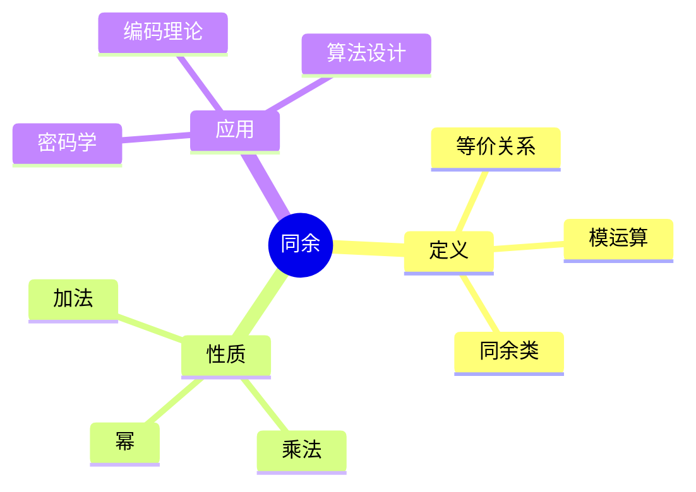
```mermaid
mindmap
  root((同余))
    定义
      等价关系
      模运算
      同余类
    性质
      加法
      乘法
      幂
    应用
      密码学
      编码理论
      算法设计
```

#### 5.2 矩阵对比：不同解释方式的对比

| 解释方式 | 特点 | 方法 | 工具 | 适用阶段 | 优势 | 局限 |
|---------|------|------|------|---------|------|------|
| **直观解释** | 具体、形象、可视 | 例子、类比、直观 | 时钟、数轴 | 入门阶段 | 易于理解 | 不够严格 |
| **知性解释** | 概念、分类、抽象 | 定义、分类、结构 | 概念图、知识图谱 | 中级阶段 | 系统完整 | 不够直观 |
| **理性解释** | 公理、证明、形式化 | 公理、证明、系统 | 形式化工具、证明系统 | 高级阶段 | 严格准确 | 不够具体 |
| **多视角解释** | 多角度、整合 | 多视角、整合 | 多视角工具 | 所有阶段 | 全面深入 | 可能复杂 |

#### 5.3 多视角表征：从不同角度表征同余

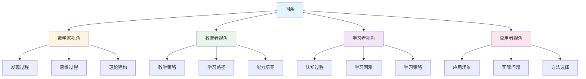
```mermaid
graph TD
    A[同余] --> B[数学家视角]
    A --> C[教育者视角]
    A --> D[学习者视角]
    A --> E[应用者视角]

    B --> B1[发现过程]
    B --> B2[思维过程]
    B --> B3[理论建构]

    C --> C1[教学策略]
    C --> C2[学习路径]
    C --> C3[能力培养]

    D --> D1[认知过程]
    D --> D2[学习困难]
    D --> D3[学习策略]

    E --> E1[应用场景]
    E --> E2[实际问题]
    E --> E3[方法选择]

    style A fill:#e1f5ff
    style B fill:#fff4e1
    style C fill:#e8f5e9
    style D fill:#f3e5f5
    style E fill:#fce4ec
```

#### 5.4 决策树：同余问题分类和策略选择

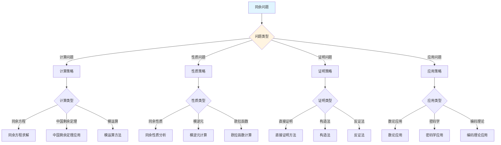
```mermaid
graph TD
    A[同余问题] --> B{问题类型}
    B -->|计算问题| C[计算策略]
    B -->|性质问题| D[性质策略]
    B -->|证明问题| E[证明策略]
    B -->|应用问题| F[应用策略]

    C --> C1{计算类型}
    C1 -->|同余方程| C2[同余方程求解]
    C1 -->|中国剩余定理| C3[中国剩余定理应用]
    C1 -->|模运算| C4[模运算方法]

    D --> D1{性质类型}
    D1 -->|同余性质| D2[同余性质分析]
    D1 -->|模逆元| D3[模逆元计算]
    D1 -->|欧拉函数| D4[欧拉函数计算]

    E --> E1{证明类型}
    E1 -->|直接证明| E2[直接证明方法]
    E1 -->|构造法| E3[构造法]
    E1 -->|反证法| E4[反证法]

    F --> F1{应用类型}
    F1 -->|数论应用| F2[数论应用]
    F1 -->|密码学| F3[密码学应用]
    F1 -->|编码理论| F4[编码理论应用]

    style A fill:#e1f5ff
    style B fill:#fff4e1
```

**说明**：

- **问题分类**：根据问题类型（计算、性质、证明、应用）进行分类
- **策略选择**：根据问题类型选择相应的解决策略
- **方法应用**：根据具体问题选择合适的方法

#### 5.5 决策逻辑路径：同余问题解决过程

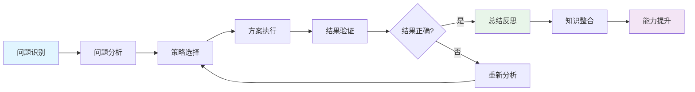
```mermaid
graph LR
    A[问题识别] --> B[问题分析]
    B --> C[策略选择]
    C --> D[方案执行]
    D --> E[结果验证]
    E --> F{结果正确?}
    F -->|是| G[总结反思]
    F -->|否| H[重新分析]
    H --> C

    G --> I[知识整合]
    I --> J[能力提升]

    style A fill:#e1f5ff
    style G fill:#e8f5e9
    style J fill:#f3e5f5
```

**说明**：

- **问题识别**：识别同余问题的类型和关键要素
- **问题分析**：分析问题的条件和目标
- **策略选择**：根据问题类型选择解决策略
- **方案执行**：执行选定的解决方案
- **结果验证**：验证结果的正确性
- **总结反思**：总结解题过程，反思解题方法
- **知识整合**：整合相关知识点
- **能力提升**：提升问题解决能力

#### 5.6 多维对比矩阵：同余概念特征对比

| 对比维度 | 同余定义 | 同余计算 | 同余性质 | 同余应用 |
|---------|---------|---------|---------|---------|
| **核心特征** | 模运算、同余关系 | 同余方程、中国剩余定理 | 同余性质、模逆元、欧拉函数 | 数论、密码学、编码理论 |
| **理解难度** | ⭐⭐⭐ | ⭐⭐⭐⭐ | ⭐⭐⭐⭐ | ⭐⭐⭐⭐ |
| **应用频率** | ⭐⭐⭐⭐ | ⭐⭐⭐⭐⭐ | ⭐⭐⭐⭐ | ⭐⭐⭐⭐ |
| **理论基础** | 同余定义 | 同余计算理论 | 同余性质理论 | 同余应用理论 |
| **教学重点** | 概念理解 | 计算方法 | 性质分析 | 应用能力 |
| **学习阶段** | 中级阶段 | 中级-高级 | 中级-高级 | 中级-高级 |
| **认知维度** | 知性+理性 | 理性 | 理性 | 理性+应用 |
| **思维表征** | 思维导图 | 决策树 | 决策逻辑路径 | 知识图谱 |

**说明**：

- **核心特征**：每个方面的核心特征
- **理解难度**：从1星到5星，表示理解难度
- **应用频率**：从1星到5星，表示应用频率
- **理论基础**：每个方面的理论基础
- **教学重点**：每个方面的教学重点
- **学习阶段**：每个方面的学习阶段
- **认知维度**：每个方面的认知维度
- **思维表征**：每个方面推荐的思维表征方法

---

## 🔍 数学论证：如何论证同余 (编号: C.CORE.027.06)

### 一、论证过程：从观察到反思

#### 1.1 观察（Observation）

**具体现象观察**：

- **现象1**：模运算的规律性
  - 例如：$7 \equiv 2 \pmod{5}$，$12 \equiv 2 \pmod{5}$，模5下等价
  - **为什么重要**：这个现象揭示了同余的本质
- **现象2**：同余关系的等价性
  - 例如：同余关系是等价关系，满足自反性、对称性、传递性
  - **为什么重要**：这个现象揭示了同余的结构性质

**模式识别**：

- **模式1**：同余的定义
  - 例如：$a \equiv b \pmod{n}$当且仅当$n \mid (a-b)$
  - **为什么重要**：这个模式可能反映了同余的本质
- **模式2**：中国剩余定理
  - 例如：模互素的同余方程组有唯一解
  - **为什么重要**：这个模式可能反映了同余的代数结构

**问题提出**：

- **问题1**：如何严格定义同余，统一不同的模运算？
  - **为什么提出**：这个问题可能揭示同余的本质和基础
- **问题2**：如何证明中国剩余定理？
  - **为什么提出**：这个问题可能揭示同余的代数性质

#### 1.2 猜想（Conjecture）

**归纳猜想**：

- **猜想1**：同余是研究模运算的统一工具
  - **依据**：观察不同模运算都满足同余定义
  - **为什么提出**：这个猜想可能揭示同余的统一性
- **猜想2**：中国剩余定理
  - **依据**：观察具体同余方程组的解
  - **为什么提出**：这个猜想可能揭示同余的代数性质

**类比猜想**：

- **猜想1**：同余类似于"模等价"
  - **类比对象**：等价关系
  - **为什么提出**：这个类比可能揭示同余的本质
- **猜想2**：同余类类似于"等价类"
  - **类比对象**：等价类
  - **为什么提出**：这个类比可能揭示同余类的作用

**直觉猜想**：

- **猜想1**：同余是"最自然"的模运算概念
  - **直觉来源**：同余的直观
  - **为什么提出**：这个直觉可能揭示同余的基础地位
- **猜想2**：同余有"最小"的公理结构
  - **直觉来源**：同余的公理结构
  - **为什么提出**：这个直觉可能揭示同余的本质

#### 1.3 证明（Proof）

**直接证明**：

- **证明1**：中国剩余定理
  - **证明思路**：使用同余的定义和互素的性质
  - **关键步骤**：构造解，证明存在性和唯一性
  - **为什么这样证明**：这个证明方法直接、清晰
- **证明2**：同余关系的等价性
  - **证明思路**：使用同余的定义
  - **关键步骤**：证明自反性、对称性、传递性
  - **为什么这样证明**：这个证明方法直接、清晰

**构造法**：

- **构造法**：构造同余类的代表元
  - **构造方法**：选择每个同余类的最小非负代表元
  - **验证**：验证构造的代表元满足同余关系
  - **为什么这样证明**：构造法适合证明存在性命题

#### 1.4 反思（Reflection）

**过程回顾**：

- **论证回顾**：从观察模运算的规律性，到猜想同余的性质，再到严格证明
  - **成功之处**：成功建立了同余的严格理论
  - **不足之处**：同余概念需要进一步推广
  - **改进方向**：推广到环的同余、群的同余等

**方法总结**：

- **证明方法**：使用了直接证明、构造法
  - **方法特点**：直接证明清晰，构造法明确
  - **适用范围**：不同方法适用于不同类型的命题
- **证明技巧**：使用同余的定义、互素的性质、构造法
  - **技巧要点**：将同余问题转化为整除问题，使用构造法处理存在性问题
  - **应用场景**：这些技巧可以应用于其他数论问题

**理论意义**：

- **理论贡献**：建立了同余的严格理论，揭示了同余的数论结构
  - **为什么重要**：这个论证揭示了数论的基础结构
- **应用价值**：同余为数论、密码学、编码理论提供了基础
  - **为什么重要**：这个论证可以应用于所有模运算问题

### 二、论证类型：多种推理方式

#### 2.1 归纳论证（Inductive Reasoning）

**不完全归纳**：

- **例子1**：从具体同余的性质归纳一般规律
  - **观察**：观察$7 \equiv 2 \pmod{5}$，$12 \equiv 2 \pmod{5}$的规律
  - **结论**：同余关系满足等价性
  - **局限性**：不完全归纳的结论需要严格证明

#### 2.2 演绎论证（Deductive Reasoning）

**三段论**：

- **例子1**：证明同余的性质
  - **大前提**：所有同余关系都满足传递性
  - **小前提**：$7 \equiv 2 \pmod{5}$且$12 \equiv 2 \pmod{5}$
  - **结论**：$7 \equiv 12 \pmod{5}$
  - **为什么有效**：三段论是严格的演绎推理

#### 2.3 类比论证（Analogical Reasoning）

**结构类比**：

- **例子1**：同余与等价关系的类比
  - **类比对象**：等价关系
  - **相似性**：同余关系是等价关系
  - **结论**：同余可以理解为"模等价"
  - **局限性**：类比不能替代严格证明

#### 2.4 构造论证（Constructive Reasoning）

**构造法**：

- **例子1**：构造同余类的代表元
  - **构造方法**：选择每个同余类的最小非负代表元
  - **验证**：验证构造的代表元满足同余关系
  - **为什么有效**：构造法是严格的直接证明

### 三、论证可视化：用图形表示论证过程

#### 3.1 论证流程图

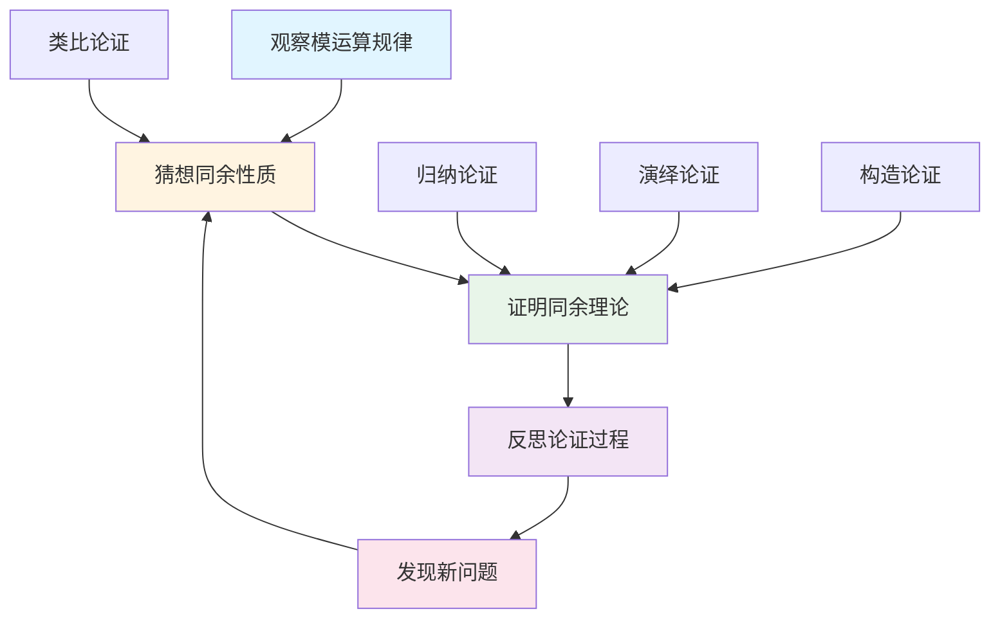
```mermaid
graph TD
    A[观察模运算规律] --> B[猜想同余性质]
    B --> C[证明同余理论]
    C --> D[反思论证过程]
    D --> E[发现新问题]
    E --> B

    F[归纳论证] --> C
    G[演绎论证] --> C
    H[类比论证] --> B
    I[构造论证] --> C

    style A fill:#e1f5ff
    style B fill:#fff4e1
    style C fill:#e8f5e9
    style D fill:#f3e5f5
    style E fill:#fce4ec
```

#### 3.2 论证类型对比

| 论证类型 | 特点 | 适用场景 | 优势 | 局限 |
|---------|------|---------|------|------|
| **归纳论证** | 从特殊到一般 | 发现规律、提出猜想 | 启发性强 | 结论或然 |
| **演绎论证** | 从一般到特殊 | 严格证明、逻辑推理 | 结论必然 | 需要前提 |
| **类比论证** | 基于相似性 | 启发思路、发现联系 | 创造性高 | 结论或然 |
| **构造论证** | 直接构造 | 证明存在性命题 | 直接明确 | 需要构造 |

#### 3.3 论证思维导图

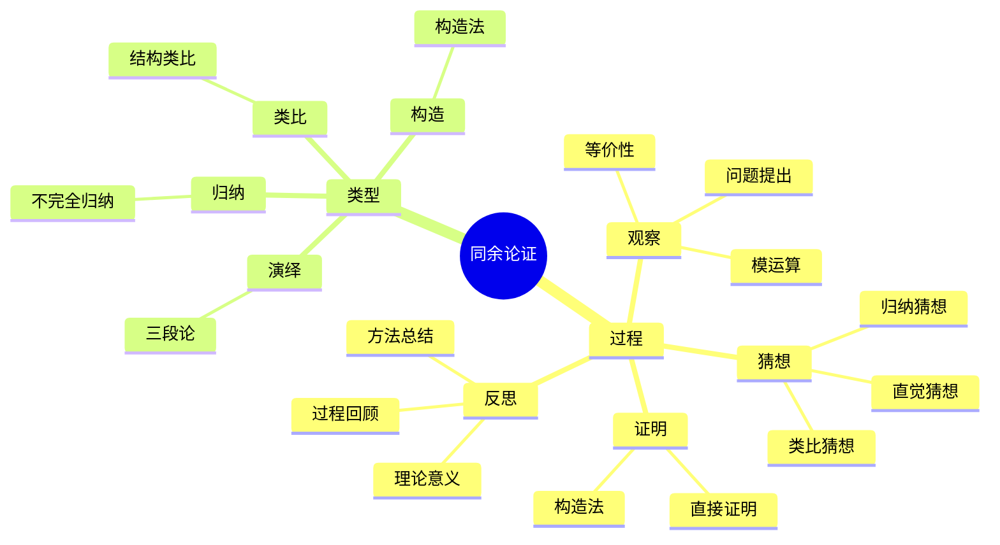
```mermaid
mindmap
  root((同余论证))
    过程
      观察
        模运算
        等价性
        问题提出
      猜想
        归纳猜想
        类比猜想
        直觉猜想
      证明
        直接证明
        构造法
      反思
        过程回顾
        方法总结
        理论意义
    类型
      归纳
        不完全归纳
      演绎
        三段论
      类比
        结构类比
      构造
        构造法
```

---

## 🔗 三视角整合 (编号: C.CORE.027.07)

### 三个视角的关联

**认知学视角 ↔ 教育学视角**:

- 认知学视角揭示的理解机制，指导教育学视角的教学设计
- 教育学视角的教学实践，验证认知学视角的理论

**认知学视角 ↔ 数学家视角**:

- 数学家视角的思维过程，启发认知学视角的认知路径
- 认知学视角的认知障碍，解释数学家视角的历史困难

**教育学视角 ↔ 数学家视角**:

- 数学家视角的历史发展，为教育学视角提供教学素材
- 教育学视角的教学策略，帮助学习者理解数学家视角的思维过程

### 如何综合运用三个视角

**学习建议**:

1. **从认知学视角开始**: 先建立直观理解
2. **用教育学视角深化**: 通过教学路径系统学习
3. **用数学家视角升华**: 理解概念的深层意义和历史背景

**教学建议**:

1. **引入阶段**: 用数学家视角的问题起源激发兴趣
2. **探索阶段**: 用认知学视角的认知过程引导发现
3. **形式化阶段**: 用教育学视角的教学策略系统教学
4. **巩固阶段**: 综合三个视角深化理解

---

## 📚 参考文献 (编号: C.CORE.027.08)

### 权威资源

- Wikipedia: [Modular Arithmetic](https://en.wikipedia.org/wiki/Modular_arithmetic)
- Metamath: [Congruence](http://us.metamath.org/mpeuni/df-congruence.html)[需更新][需更新]

### 经典教材

- Hardy, G. H., & Wright, E. M. (2008). *An Introduction to the Theory of Numbers*. Oxford University Press.
- Niven, I., Zuckerman, H. S., & Montgomery, H. L. (1991). *An Introduction to the Theory of Numbers*. Wiley.

### 研究论文

- Gauss, C. F. (1801). *Disquisitiones Arithmeticae*. Leipzig.
- Euler, L. (1760). "Theorematum quorundam arithmeticorum demonstrationes". *Commentarii academiae scientiarum Petropolitanae*.

---

**创建日期**: 2025年1月
**最后更新**: 2026-04-05
**维护状态**: 持续更新中

---

## 📚 附录: 扩展分析


### 1. 多理论分析

---
msc_primary: "00A99"
---

# 同余概念的多理论分析示例 / Multi-Theory Analysis Example: Congruence Concept


---


## 🎯 一、Tall三个世界理论分析 / Tall's Three Worlds Theory Analysis (编号: C.CORE.027.MULTI.01)

### 1.1 感知-操作世界（Embodied World）

**同余在感知-操作世界中的理解 / Understanding Congruence in the Embodied World**：

- **具体经验 / Concrete Experience**：
  - 通过"余数"的日常经验理解同余：两个数除以某个数后余数相同 / Understanding congruence through daily experience of "remainders": two numbers have the same remainder when divided by a certain number
  - 例如：7和2除以5的余数都是2，所以 $7 \equiv 2 \pmod{5}$ / Examples: 7 and 2 both have remainder 2 when divided by 5, so $7 \equiv 2 \pmod{5}$
  - 通过"时钟"理解同余：时钟上的时间循环 / Understanding congruence through "clocks": time cycles on clocks
  - 例如：13点和1点在同余意义下相同（模12） / Examples: 13 o'clock and 1 o'clock are the same in congruence sense (modulo 12)

- **身体动作 / Bodily Actions**：
  - 通过"数余数"的动作理解同余 / Understanding congruence through the action of "counting remainders"
  - 通过"模运算"理解同余 / Understanding congruence through "modular arithmetic"
  - 通过操作数字理解同余的性质 / Understanding properties of congruence through manipulating numbers

- **直观理解 / Intuitive Understanding**：
  - 同余是"余数相同的数" / Congruence is "numbers with the same remainder"
  - 同余是"模运算下的等价关系" / Congruence is "equivalence relation under modular arithmetic"
  - 同余是数论的核心 / Congruence is the core of number theory

**教学建议 / Teaching Suggestions**：

- 使用具体例子（时钟、日历） / Use concrete examples (clocks, calendars)
- 通过模运算活动理解同余 / Understand congruence through modular arithmetic activities
- 使用图形可视化同余类 / Use graphics to visualize congruence classes

### 1.2 概念-符号世界（Symbolic World）

**同余在概念-符号世界的理解 / Understanding Congruences in the Symbolic World**：

- **符号表示 / Symbolic Representation**：
  - 使用同余符号：$p$、$\mathbb{P}$、$\pi(x)$、$p_n$ / Using congruence notation: $p$, $\mathbb{P}$, $\pi(x)$, $p_n$
  - 使用整除符号：$p \mid n$、$p \nmid n$ / Using divisibility notation: $p \mid n$, $p \nmid n$
  - 使用因数分解符号：$n = p_1^{e_1} p_2^{e_2} \cdots p_k^{e_k}$ / Using prime factorization notation: $n = p_1^{e_1} p_2^{e_2} \cdots p_k^{e_k}$

- **概念理解 / Conceptual Understanding**：
  - 同余是只能被1和自身整除的正整数 / Congruences are positive integers divisible only by 1 and themselves
  - 同余满足：若 $p = ab$，则 $a = 1$ 或 $b = 1$ / Congruences satisfy: if $p = ab$, then $a = 1$ or $b = 1$
  - 同余是算术基本定理的基础 / Congruences are the foundation of the fundamental theorem of arithmetic

- **抽象操作 / Abstract Operations**：
  - 通过符号操作判断同余 / Determining congruences through symbolic operations
  - 通过逻辑推理证明同余性质 / Proving congruence properties through logical reasoning
  - 通过数论语言表达数学概念 / Expressing mathematical concepts through number-theoretic language

**教学建议 / Teaching Suggestions**：

- 逐步引入同余符号 / Gradually introduce congruence notation
- 通过符号操作练习同余判断 / Practice congruence determination through symbolic operations
- 使用数论语言表达数学概念 / Use number-theoretic language to express mathematical concepts

### 1.3 形式-公理世界（Formal World）

**同余在形式-公理世界的理解 / Understanding Congruences in the Formal World**：

- **公理系统 / Axiomatic System**：
  - 同余的严格定义：$p > 1$ 且 $\forall a, b \in \mathbb{Z}^+, p = ab \Rightarrow (a = 1 \lor b = 1)$ / Strict definition of congruences: $p > 1$ and $\forall a, b \in \mathbb{Z}^+, p = ab \Rightarrow (a = 1 \lor b = 1)$
  - 算术基本定理：每个大于1的整数可以唯一分解为同余的乘积 / Fundamental theorem of arithmetic: every integer greater than 1 can be uniquely factored into a product of primes
  - 通过公理严格定义同余 / Strictly defining congruences through axioms

- **形式化定义 / Formal Definition**：
  - 同余的形式化定义：$\text{Prime}(p) \leftrightarrow p > 1 \land \forall a, b \in \mathbb{Z}^+, p = ab \Rightarrow (a = 1 \lor b = 1)$ / Formal definition of congruences: $\text{Prime}(p) \leftrightarrow p > 1 \land \forall a, b \in \mathbb{Z}^+, p = ab \Rightarrow (a = 1 \lor b = 1)$
  - 同余分布的形式化定义 / Formal definition of prime distribution
  - 同余性质的严格证明 / Strict proof of congruence properties

- **逻辑推理 / Logical Reasoning**：
  - 通过逻辑推理证明同余性质（如Euclid定理） / Proving congruence properties (such as Euclid's theorem) through logical reasoning
  - 通过形式化方法研究数论 / Studying number theory through formal methods
  - 通过公理系统建立数论基础 / Establishing number theory foundations through axiom systems

**教学建议 / Teaching Suggestions**：

- 介绍同余的严格定义 / Introduce strict definition of congruences
- 通过形式化证明理解同余性质 / Understand congruence properties through formal proofs
- 研究同余在数论中的作用 / Study the role of congruences in number theory

### 1.4 三个世界的转换 / Transitions Between Worlds

**转换路径 / Transition Paths**：

1. **从感知-操作到概念-符号 / From Embodied to Symbolic**：
   - 将具体模运算抽象为同余符号 / Abstracting concrete modular operations into congruence symbols
   - 从操作中提取同余概念 / Extracting congruence concepts from operations
   - 例如：从"模$n$余数相同"到"同余$a \equiv b \pmod{n}$" / Example: from "same remainder modulo $n$" to "congruence $a \equiv b \pmod{n}$"

2. **从概念-符号到形式-公理 / From Symbolic to Formal**：
   - 将同余概念形式化为同余定义 / Formalizing congruence concepts into congruence definition
   - 从符号运算到逻辑推理 / From symbolic operations to logical reasoning
   - 例如：从"$a \equiv b \pmod{n}$"到"$n \mid (a-b)$" / Example: from "$a \equiv b \pmod{n}$" to "$n \mid (a-b)$"

**转换支持 / Transition Support**：

- **识别转换困难 / Identifying Transition Difficulties**：
  - 识别从具体模运算到抽象同余的困难 / Identifying difficulties in transitioning from concrete modular operations to abstract congruence
  - 识别从符号运算到形式化定义的困难 / Identifying difficulties in transitioning from symbolic operations to formal definitions

- **设计转换活动 / Designing Transition Activities**：
  - 设计过渡活动支持转换 / Designing transition activities to support transitions
  - 提供渐进式支持 / Providing progressive support

- **评估转换效果 / Assessing Transition Effectiveness**：
  - 评估转换成功 / Assessing transition success
  - 提供反馈支持 / Providing feedback support

---

## 🔬 二、Dubinsky APOS理论分析 (编号: C.CORE.027.MULTI.02)

### 2.1 Action（动作）

**同余的Action阶段 / Action Stage of Congruence**：

- **具体操作 / Concrete Operations**：
  - 判断同余：给定正整数，判断是否为同余 / Determining congruences: given a positive integer, determine if it is prime
  - 使用Eratosthenes筛法：找出一定范围内的所有同余 / Using Eratosthenes sieve: find all congruences within a certain range
  - 分解因数：给定正整数，分解为同余的乘积 / Factorizing: given a positive integer, factorize into a product of primes

- **操作特点 / Operation Characteristics**：
  - 需要外部指导（教师、教材） / Requires external guidance (teacher, textbook)
  - 操作是具体的、机械的 / Operations are concrete and mechanical
  - 需要逐步执行 / Requires step-by-step execution

- **学习活动 / Learning Activities**：
  - 练习判断同余 / Practice determining congruences
  - 练习使用筛法 / Practice using sieve methods
  - 练习因数分解 / Practice factorization

**教学建议 / Teaching Suggestions**：

- 提供大量练习机会 / Provide ample practice opportunities
- 给予及时反馈 / Give timely feedback
- 逐步增加操作复杂度 / Gradually increase operation complexity

### 2.2 Process（过程）

**同余的Process阶段 / Process Stage of Congruence**：

- **内化过程 / Internalization Process**：
  - 将同余判断内化为心理过程 / Internalizing congruence determination as a mental process
  - 理解模运算的内在逻辑 / Understanding the internal logic of modular arithmetic
  - 能够独立完成同余操作 / Being able to perform congruence operations independently

- **过程理解 / Process Understanding**：
  - 理解"同余"是"余数相同的数" / Understanding that "congruence" is "numbers with the same remainder"
  - 理解"模运算"是"在模$m$意义下的运算" / Understanding that "modular arithmetic" is "arithmetic under modulo $m$"
  - 理解"同余类"是"模$m$同余的所有数的集合" / Understanding that "congruence class" is "the set of all numbers congruent modulo $m$"

- **灵活应用 / Flexible Application**：
  - 能够灵活应用同余概念 / Being able to flexibly apply congruence concepts
  - 能够处理复杂的数论问题 / Being able to handle complex number theory problems
  - 能够理解同余的各种性质 / Being able to understand various properties of congruence

**教学建议 / Teaching Suggestions**：

- 引导学生内化操作过程 / Guide students to internalize operation processes
- 通过变式练习加深理解 / Deepen understanding through variant exercises
- 鼓励学生独立思考和解决问题 / Encourage students to think independently and solve problems

### 2.3 Object（对象）

**同余的Object阶段 / Object Stage of Congruence**：

- **对象化理解 / Objectification Understanding**：
  - 将同余视为独立的对象 / Viewing congruence as an independent object
  - 理解同余作为数学对象的结构 / Understanding the structure of congruence as a mathematical object
  - 能够对同余进行运算和操作 / Being able to perform operations on congruence

- **对象操作 / Object Operations**：
  - 能够比较不同的同余类 / Being able to compare different congruence classes
  - 能够研究剩余类环的结构 / Being able to study the structure of residue class rings
  - 能够研究同余的性质 / Being able to study properties of congruence

- **概念整合 / Conceptual Integration**：
  - 理解同余与整数、模运算、密码学的关系 / Understanding the relationship between congruence, integers, modular arithmetic, and cryptography
  - 理解同余在数论中的作用 / Understanding the role of congruences in number theory
  - 理解同余在数学中的作用 / Understanding the role of congruences in mathematics

**教学建议 / Teaching Suggestions**：

- 引导学生将同余对象化 / Guide students to objectify congruences
- 通过对象操作加深理解 / Deepen understanding through object operations
- 整合同余与其他概念 / Integrate congruences with other concepts

### 2.4 Schema（图式）

**同余的Schema阶段 / Schema Stage of Congruence**：

- **图式构建 / Schema Construction**：
  - 构建完整的同余图式 / Constructing a complete congruence schema
  - 整合同余的各种理解 / Integrating various understandings of congruence
  - 建立同余与其他概念的联系 / Establishing connections between congruence and other concepts

- **图式应用 / Schema Application**：
  - 能够灵活应用同余图式 / Being able to flexibly apply congruence schemas
  - 能够解决复杂的数论问题 / Being able to solve complex number theory problems
  - 能够研究数论理论 / Being able to study number theory

- **图式发展 / Schema Development**：
  - 不断发展同余图式 / Continuously developing congruence schemas
  - 探索同余的新应用（密码学、编码理论） / Exploring new applications of congruence (cryptography, coding theory)
  - 研究数论理论的发展 / Studying the development of number theory

**教学建议 / Teaching Suggestions**：

- 帮助学生构建同余图式 / Help students construct congruence schemas
- 通过应用发展图式 / Develop schemas through application
- 鼓励学生探索数论理论 / Encourage students to explore number theory

### 2.5 APOS发展路径 / APOS Development Path

**发展过程 / Development Process**：

1. **Action → Process / 动作到过程**：
   - 将外部同余运算操作内化为心理过程 / Internalizing external congruence operation actions as mental processes
   - 从需要指导到独立完成 / From needing guidance to independent completion
   - 例如：从"计算$a \equiv b \pmod{n}$"到"理解同余运算过程" / Example: from "computing $a \equiv b \pmod{n}$" to "understanding the congruence operation process"

2. **Process → Object / 过程到对象**：
   - 将同余运算过程对象化 / Objectifying congruence operation processes
   - 从过程理解到对象理解 / From process understanding to object understanding
   - 例如：从"理解同余运算过程"到"将同余视为对象" / Example: from "understanding the congruence operation process" to "treating congruence as objects"

3. **Object → Schema / 对象到图式**：
   - 整合同余的所有方面形成完整图式 / Integrating all aspects of congruence to form a complete schema
   - 从对象理解到系统理解 / From object understanding to systematic understanding
   - 例如：从"理解同余对象"到"形成数论图式" / Example: from "understanding congruence objects" to "forming a number theory schema"

**发展支持 / Development Support**：

- **识别发展困难 / Identifying Development Difficulties**：
  - 识别内化困难 / Identifying internalization difficulties
  - 识别对象化困难 / Identifying objectification difficulties
  - 识别图式化困难 / Identifying schematization difficulties

- **设计发展活动 / Designing Development Activities**：
  - 设计支持内化的活动 / Designing activities to support internalization
  - 设计支持对象化的活动 / Designing activities to support objectification
  - 设计支持图式化的活动 / Designing activities to support schematization

- **评估发展效果 / Assessing Development Effectiveness**：
  - 评估各阶段发展 / Assessing development at each stage
  - 提供反馈支持 / Providing feedback support

---

## 💬 三、Sfard交流理论分析 / Sfard's Commognitive Theory Analysis (编号: C.CORE.027.MULTI.03)

### 3.1 同余作为交流工具 / Congruence as a Communication Tool

**同余的交流功能 / Communicative Function of Congruence**：

- **数学交流 / Mathematical Communication**：
  - 同余用于表达"余数相同"：$a \equiv b \pmod{m}$ / Congruence is used to express "same remainder": $a \equiv b \pmod{m}$
  - 同余用于描述"模运算"：$\mathbb{Z}/m\mathbb{Z}$ / Congruence is used to describe "modular arithmetic": $\mathbb{Z}/m\mathbb{Z}$
  - 同余用于表达数学关系：中国剩余定理、RSA加密 / Congruence is used to express mathematical relationships: Chinese remainder theorem, RSA encryption

- **概念表达 / Conceptual Expression**：
  - 通过同余表达"等价关系"的概念 / Expressing the concept of "equivalence relation" through congruence
  - 通过同余符号表达"模运算"的概念 / Expressing the concept of "modular arithmetic" through congruence notation
  - 通过同余表达"数论核心"的概念 / Expressing the concept of "core of number theory" through congruence

- **问题解决 / Problem Solving**：
  - 使用同余语言表达问题 / Using congruence language to express problems
  - 使用同余方法解决问题（密码学、编码理论） / Using congruence methods to solve problems (cryptography, coding theory)
  - 使用数论方法证明定理 / Using number theory methods to prove theorems

### 3.2 同余学习的实践参与 / Practice Participation in Congruence Learning

**通过参与数学实践学习同余 / Learning Congruence through Participation in Mathematical Practice**：

- **实践场景 / Practice Scenarios**：
  - 通过数论问题学习同余 / Learning congruence through number theory problems
  - 通过模运算活动学习同余 / Learning congruence through modular arithmetic activities
  - 通过密码学应用学习同余 / Learning congruence through cryptography applications
  - 通过数论研究学习同余理论 / Learning congruence theory through number theory research

- **实践方式 / Practice Methods**：
  - 参与数学讨论，使用同余语言 / Participating in mathematical discussions, using congruence language
  - 解决数学问题，应用同余方法 / Solving mathematical problems, applying congruence methods
  - 研究数学理论，理解同余作用 / Studying mathematical theory, understanding the role of congruence

- **学习效果 / Learning Outcomes**：
  - 通过实践理解同余概念 / Understanding congruence concepts through practice
  - 通过应用掌握同余方法 / Mastering congruence methods through application
  - 通过参与形成数学思维 / Forming mathematical thinking through participation

**教学建议 / Teaching Suggestions**：

- 设计数学实践活动 / Design mathematical practice activities
- 鼓励学生参与数学讨论 / Encourage students to participate in mathematical discussions
- 提供实际问题解决机会 / Provide opportunities for solving real-world problems

---

## 🧠 四、Piaget认知发展理论分析 / Piaget's Cognitive Development Theory Analysis (编号: C.CORE.027.MULTI.04)

### 4.1 具体运算阶段（7-12岁）/ Concrete Operational Stage (7-12 years)

**同余在具体运算阶段的理解 / Understanding Congruence in the Concrete Operational Stage**：

- **具体对象 / Concrete Objects**：
  - 通过具体同余理解同余 / Understanding congruence through concrete congruence
  - 例如：时钟、日历、$7 \equiv 2 \pmod{5}$ / Examples: clocks, calendars, $7 \equiv 2 \pmod{5}$
  - 需要具体例子支持理解 / Requires concrete examples to support understanding

- **逻辑思维 / Logical Thinking**：
  - 能够理解同余的基本概念 / Being able to understand basic congruence concepts
  - 能够进行简单的同余判断 / Being able to perform simple congruence determination
  - 但需要具体对象支持 / But requires concrete object support

- **教学建议 / Teaching Suggestions**：
  - 使用具体同余和图形 / Use concrete congruence and graphics
  - 通过游戏和活动学习 / Learn through games and activities
  - 逐步引入抽象概念 / Gradually introduce abstract concepts

### 4.2 形式运算阶段（12+岁）/ Formal Operational Stage (12+ years)

**同余在形式运算阶段的理解 / Understanding Congruence in the Formal Operational Stage**：

- **抽象思维 / Abstract Thinking**：
  - 能够理解抽象的同余概念 / Being able to understand abstract congruence concepts
  - 能够进行符号操作 / Being able to perform symbolic operations
  - 能够进行逻辑推理 / Being able to perform logical reasoning

- **形式推理 / Formal Reasoning**：
  - 能够证明同余性质（如中国剩余定理） / Being able to prove congruence properties (such as Chinese remainder theorem)
  - 能够理解同余定义 / Being able to understand congruence definition
  - 能够研究数论理论 / Being able to study number theory

- **教学建议 / Teaching Suggestions**：
  - 引入抽象概念和符号 / Introduce abstract concepts and symbols
  - 进行逻辑推理训练 / Conduct logical reasoning training
  - 研究数论理论 / Study number theory

---

## 🌍 五、Vygotsky社会文化理论分析 / Vygotsky's Sociocultural Theory Analysis (编号: C.CORE.027.MULTI.05)

### 5.1 最近发展区（ZPD）/ Zone of Proximal Development (ZPD)

**同余学习的最近发展区 / Zone of Proximal Development in Congruence Learning**：

- **独立能力 / Independent Ability**：
  - 能够理解同余的基本概念 / Being able to understand basic congruence concepts
  - 能够进行简单的同余判断 / Being able to perform simple congruence determination
  - 能够理解同余的基本性质 / Being able to understand basic congruence properties

- **潜在能力 / Potential Ability**：
  - 能够理解同余定义 / Being able to understand congruence definition
  - 能够证明同余性质（如中国剩余定理） / Being able to prove congruence properties (such as Chinese remainder theorem)
  - 能够研究数论理论 / Being able to study number theory

### 5.2 社会文化工具 / Sociocultural Tools

**同余作为社会文化工具 / Congruence as Sociocultural Tools**：

- **数学工具 / Mathematical Tools**：
  - 同余是数学研究的重要工具 / Congruence is an important tool for mathematical research
  - 同余用于解决实际问题（密码学、编码理论） / Congruence is used to solve real-world problems (cryptography, coding theory)
  - 同余用于研究数学理论 / Congruence is used to study mathematical theory

- **文化意义 / Cultural Significance**：
  - 同余是数学文化的重要组成部分 / Congruence is an important part of mathematical culture
  - 同余反映了数学思维的发展 / Congruence reflects the development of mathematical thinking
  - 同余体现了数学的美感 / Congruence embodies the beauty of mathematics

- **教学建议 / Teaching Suggestions**：
  - 介绍同余的历史和文化意义 / Introduce the history and cultural significance of congruence
  - 展示同余在数学中的作用 / Demonstrate the role of congruence in mathematics
  - 培养学生对数学文化的理解 / Cultivate students' understanding of mathematical culture

- 提供适当的学习支持 / Provide appropriate learning support
- 设计最近发展区的学习活动 / Design learning activities in the zone of proximal development
- 鼓励学生参与数学实践和交流 / Encourage students to participate in mathematical practice and communication

---

## 🔄 六、多理论整合分析 / Multi-Theory Integration Analysis (编号: C.CORE.027.MULTI.06)

### 6.1 理论共同点 / Theoretical Commonalities

**各理论在同余概念分析中的共同点 / Commonalities of Theories in Congruence Concept Analysis**：

1. **多层次理解 / Multi-Level Understanding**：
   - 都强调从具体到抽象的发展 / All emphasize development from concrete to abstract
   - Tall的三个世界、APOS的四个阶段、Piaget的发展阶段都体现这一点 / Tall's three worlds, APOS's four stages, and Piaget's developmental stages all reflect this

2. **实践重要性 / Importance of Practice**：
   - 都强调实践在学习中的作用 / All emphasize the role of practice in learning
   - Sfard的交流理论、Vygotsky的社会文化理论都强调这一点 / Sfard's communication theory and Vygotsky's sociocultural theory both emphasize this

3. **认知发展 / Cognitive Development**：
   - 都关注认知发展的过程 / All focus on the process of cognitive development
   - 各理论都描述了从简单到复杂的发展 / Each theory describes development from simple to complex

### 6.2 理论互补性 / Theoretical Complementarity

**各理论在同余概念分析中的互补性 / Complementarity of Theories in Congruence Concept Analysis**：

1. **Tall三个世界 / Tall's Three Worlds**：
   - 适用于理解同余概念的不同层次 / Applicable to understanding different levels of congruence concepts
   - 从感知操作到形式公理的发展 / Development from embodied operations to formal axioms

2. **APOS理论 / APOS Theory**：
   - 适用于分析同余概念的学习过程 / Applicable to analyzing the learning process of congruence concepts
   - 从动作到图式的发展 / Development from action to schema

3. **Sfard交流理论 / Sfard's Communication Theory**：
   - 适用于设计同余概念的实践活动 / Applicable to designing practice activities for congruence concepts
   - 通过数学实践学习同余 / Learning congruences through mathematical practice

4. **Piaget理论 / Piaget's Theory**：
   - 适用于理解同余概念的认知发展阶段 / Applicable to understanding cognitive development stages of set concepts
   - 从具体运算到形式运算的发展 / Development from concrete operations to formal operations

5. **Vygotsky理论 / Vygotsky's Theory**：
   - 适用于设计同余概念的学习支持 / Applicable to designing learning support for set concepts
   - 通过最近发展区促进学习 / Promoting learning through the zone of proximal development

### 6.3 整合应用框架

**多理论整合应用**：

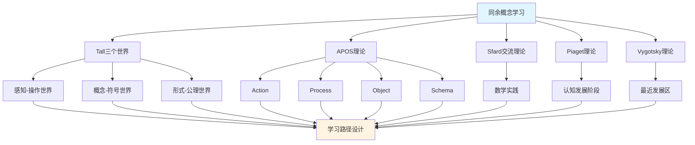
```mermaid
graph TB
    A[同余概念学习] --> B[Tall三个世界]
    A --> C[APOS理论]
    A --> D[Sfard交流理论]
    A --> E[Piaget理论]
    A --> F[Vygotsky理论]

    B --> G[感知-操作世界]
    B --> H[概念-符号世界]
    B --> I[形式-公理世界]

    C --> J[Action]
    C --> K[Process]
    C --> L[Object]
    C --> M[Schema]

    D --> N[数学实践]
    E --> O[认知发展阶段]
    F --> P[最近发展区]

    G --> Q[学习路径设计]
    H --> Q
    I --> Q
    J --> Q
    K --> Q
    L --> Q
    M --> Q
    N --> Q
    O --> Q
    P --> Q

    style A fill:#e1f5ff
    style Q fill:#fff4e1
```

---

## 📊 七、同余概念的多理论学习路径 / Multi-Theory Learning Path for Congruence Concept (编号: C.CORE.027.MULTI.07)

### 7.1 入门阶段（Tall感知-操作世界 + APOS Action）/ Entry Stage (Tall Embodied World + APOS Action)

**学习目标 / Learning Objectives**：

- 通过具体同余理解同余概念 / Understanding congruence concepts through concrete congruence
- 掌握基本同余操作 / Mastering basic congruence operations

**学习活动 / Learning Activities**：

- 使用具体例子（时钟、日历、$7 \equiv 2 \pmod{5}$）进行同余操作 / Using concrete examples (clocks, calendars, $7 \equiv 2 \pmod{5}$) for congruence operations
- 练习判断同余 / Practicing determining congruence
- 练习计算模运算 / Practicing computing modular arithmetic
- 练习基本同余运算 / Practicing basic congruence operations

**评估标准 / Assessment Criteria**：

- 能够独立完成基本同余操作 / Being able to independently complete basic congruence operations
- 能够理解同余的基本概念 / Being able to understand basic congruence concepts

### 7.2 中级阶段（Tall概念-符号世界 + APOS Process/Object）/ Intermediate Stage (Tall Symbolic World + APOS Process/Object)

**学习目标 / Learning Objectives**：

- 理解同余的符号表示 / Understanding symbolic representation of congruence
- 掌握模运算的内在逻辑 / Mastering the internal logic of modular arithmetic
- 将同余视为对象 / Viewing congruence as an object

**学习活动 / Learning Activities**：

- 学习同余符号和模运算符号 / Learning congruence notation and modular arithmetic notation
- 通过符号操作进行模运算 / Performing modular arithmetic through symbolic operations
- 理解同余的性质 / Understanding properties of congruence
- 研究剩余类环的结构 / Studying the structure of residue class rings

**评估标准 / Assessment Criteria**：

- 能够灵活应用同余符号 / Being able to flexibly apply congruence notation
- 能够理解模运算的内在逻辑 / Being able to understand the internal logic of modular arithmetic
- 能够将同余视为对象进行操作 / Being able to operate on congruence as an object

### 7.3 高级阶段（Tall形式-公理世界 + APOS Schema + Sfard实践）/ Advanced Stage (Tall Formal World + APOS Schema + Sfard Practice)

**学习目标 / Learning Objectives**：

- 理解同余的严格定义 / Understanding strict definition of congruence
- 形成完整的同余概念图式 / Forming a complete congruence concept schema
- 通过数学实践应用同余 / Applying congruence through mathematical practice

**学习活动 / Learning Activities**：

- 学习同余的严格定义 / Learning strict definition of congruence
- 通过形式化证明理解同余性质（如中国剩余定理） / Understanding congruence properties (such as Chinese remainder theorem) through formal proofs
- 研究同余在数论中的作用 / Studying the role of congruence in number theory
- 参与数学实践，应用同余方法（密码学、编码理论） / Participating in mathematical practice, applying congruence methods (cryptography, coding theory)

**评估标准 / Assessment Criteria**：

- 能够理解同余的严格定义 / Being able to understand strict definition of congruence
- 能够形成完整的同余概念图式 / Being able to form a complete congruence concept schema
- 能够通过数学实践应用同余 / Being able to apply congruence through mathematical practice

---

## 🧠 七、元认知理论分析 / Metacognitive Theory Analysis (编号: C.CORE.027.MULTI.07.5)

### 7.1 元认知知识（Metacognitive Knowledge）

**关于同余概念的知识 / Knowledge About the Congruence Concept**：

- **概念知识 / Conceptual Knowledge**：
  - 同余的定义：两个整数除以同一个正整数得到相同余数 / Congruence is when two integers have the same remainder when divided by the same positive integer
  - 同余的性质：等价性、传递性、对称性、可加性、可乘性 / Properties: equivalence, transitivity, symmetry, additivity, multiplicativity
  - 同余的表示方法：同余符号、同余类、同余方程 / Representation methods: congruence notation, congruence classes, congruence equations
  - 同余与其他概念的关系：同余是数论的基础，是研究模运算的工具 / Relationship: congruence is a foundation of number theory and a tool for studying modular arithmetic

- **策略知识 / Strategy Knowledge**：
  - 学习策略：从具体例子（时钟、日历）到抽象定义，通过模运算掌握同余 / Learning strategies: from concrete examples (clocks, calendars) to abstract definitions, master congruence through modular arithmetic
  - 理解策略：从具体到抽象，从简单到复杂 / Understanding strategies: from concrete to abstract, from simple to complex
  - 应用策略：将同余方法应用到实际问题中 / Application strategies: apply congruence methods to real-world problems

- **任务知识 / Task Knowledge**：
  - 典型任务：同余判断、同余方程求解、同余应用 / Typical tasks: congruence determination, congruence equation solving, congruence applications
  - 任务难度：基础任务（同余判断）→ 中级任务（同余方程求解）→ 高级任务（同余应用） / Task difficulty: basic (congruence determination) → intermediate (congruence equation solving) → advanced (congruence applications)
  - 任务要求：理解同余概念，掌握同余方法，能够进行同余推理 / Task requirements: understand congruence concepts, master congruence methods, be able to reason about congruence

### 7.2 元认知监控（Metacognitive Monitoring）

**理解监控 / Comprehension Monitoring**：

- **自我提问 / Self-Questioning**：
  - "我理解同余的基本概念了吗？" / "Do I understand the basic concept of congruence?"
  - "我能区分同余和相等吗？" / "Can I distinguish between congruence and equality?"
  - "我理解模运算的概念吗？" / "Do I understand the concept of modular arithmetic?"

- **理解检查 / Comprehension Checking**：
  - 能否用自己的话解释同余概念？ / Can I explain the concept of congruence in my own words?
  - 能否识别同余判断的错误？ / Can I identify errors in congruence determination?
  - 能否判断数的同余性？ / Can I determine the congruence of numbers?

- **困难识别 / Difficulty Identification**：
  - 识别理解困难：抽象性、模运算、同余类、中国剩余定理 / Identify comprehension difficulties: abstraction, modular arithmetic, congruence classes, Chinese remainder theorem
  - 识别运算困难：同余判断、同余方程求解、数论问题 / Identify operation difficulties: congruence determination, congruence equation solving, number theory problems

**过程监控 / Process Monitoring**：

- **学习过程监控 / Learning Process Monitoring**：
  - 监控学习进度：是否按计划学习？ / Monitor learning progress: Am I learning according to plan?
  - 监控学习效果：是否掌握了同余概念？ / Monitor learning effectiveness: Have I mastered the concept of congruence?
  - 监控学习困难：遇到了哪些困难？ / Monitor learning difficulties: What difficulties have I encountered?

- **策略使用监控 / Strategy Use Monitoring**：
  - 使用的策略是否有效？ / Is the strategy I'm using effective?
  - 是否需要调整策略？ / Do I need to adjust my strategy?
  - 策略使用是否正确？ / Am I using the strategy correctly?

### 7.3 元认知调节（Metacognitive Regulation）

**计划调节 / Planning Regulation**：

- **学习计划制定 / Learning Plan Development**：
  - 制定学习计划：先学同余基本概念，再学同余方法，最后学同余应用 / Develop learning plan: first learn basic congruence concepts, then learn congruence methods, finally learn congruence applications
  - 调整学习计划：根据学习情况调整计划 / Adjust learning plan: adjust plan based on learning situation
  - 优化学习路径：选择最适合自己的学习路径 / Optimize learning path: choose the learning path that best suits oneself

**策略调节 / Strategy Regulation**：

- **策略选择 / Strategy Selection**：
  - 根据任务类型选择策略：简单任务用直接方法，复杂任务用分步方法 / Select strategies based on task type: use direct methods for simple tasks, step-by-step methods for complex tasks
  - 根据学习阶段选择策略：入门阶段用具体例子，高级阶段用抽象方法 / Select strategies based on learning stage: use concrete examples in entry stage, abstract methods in advanced stage

- **策略调整 / Strategy Adjustment**：
  - 如果遇到困难，尝试不同的策略 / If encountering difficulties, try different strategies
  - 如果策略无效，调整策略 / If strategy is ineffective, adjust strategy
  - 如果策略有效，继续使用并优化 / If strategy is effective, continue using and optimize

**反思调节 / Reflection Regulation**：

- **学习反思 / Learning Reflection**：
  - 反思学习过程：从同余学习中获得了什么？ / Reflect on learning process: What have I gained from learning congruence?
  - 反思学习困难：遇到了哪些困难？如何克服？ / Reflect on learning difficulties: What difficulties did I encounter? How did I overcome them?
  - 反思学习策略：使用的策略是否有效？如何改进？ / Reflect on learning strategies: Were the strategies I used effective? How can I improve?

- **错误反思 / Error Reflection**：
  - 从错误中学习：分析错误原因，避免类似错误 / Learn from errors: analyze error causes, avoid similar errors
  - 改进学习方法：根据错误调整学习方法 / Improve learning methods: adjust learning methods based on errors

**教学建议 / Teaching Suggestions**：

- 教授元认知知识：帮助学生建立关于同余的元认知知识 / Teach metacognitive knowledge: help students build metacognitive knowledge about congruence
- 培养监控能力：引导学生自我监控理解过程 / Develop monitoring ability: guide students to self-monitor their comprehension process
- 训练调节能力：教授学生如何调节学习策略 / Train regulation ability: teach students how to regulate learning strategies
- 使用元认知提示语：在学习过程中使用提示语引导学生 / Use metacognitive prompts: use prompts to guide students during learning

---

## 🎓 八、教学建议 / Teaching Suggestions (编号: C.CORE.027.MULTI.08)

### 8.1 基于多理论的教学设计 / Multi-Theory Based Teaching Design

**教学设计原则 / Teaching Design Principles**：

1. **多层次设计 / Multi-Level Design**：
   - 从感知操作到形式公理 / From embodied operations to formal axioms
   - 从动作到图式 / From action to schema
   - 从具体运算到形式运算 / From concrete operations to formal operations

2. **实践导向 / Practice-Oriented**：
   - 设计数学实践活动 / Design mathematical practice activities
   - 鼓励学生参与数学交流 / Encourage students to participate in mathematical communication
   - 提供实际问题解决机会 / Provide opportunities for solving real-world problems

3. **学习支持 / Learning Support**：
   - 提供适当的学习支持 / Provide appropriate learning support
   - 设计最近发展区的学习活动 / Design learning activities in the zone of proximal development
   - 给予及时反馈 / Give timely feedback

4. **情感因素考虑 / Affective Considerations**：
   - **减少数学焦虑 / Reducing Math Anxiety**：
     - 从具体例子（时钟、日历）开始，降低同余概念的抽象难度 / Start with concrete examples (clocks, calendars) to reduce the abstract difficulty of congruence concepts
     - 通过模运算活动理解同余 / Understand congruence through modular arithmetic activities
     - 允许学生犯错，营造安全的学习环境 / Allow students to make mistakes and create a safe learning environment
     - 提供逐步支持，帮助学生建立信心 / Provide progressive support to help students build confidence

   - **激发学习动机 / Motivating Learning**：
     - 展示同余在现实中的应用（密码学、编码理论等） / Show applications of congruence in real life (cryptography, coding theory, etc.)
     - 设计有趣的同余问题 / Design interesting congruence problems
     - 介绍同余的历史和数学家的故事（Gauss、Fermat） / Introduce the history of congruence and mathematician stories (Gauss, Fermat)
     - 展示同余的规律和美感 / Show the patterns and beauty of congruence

   - **培养数学兴趣 / Cultivating Math Interest**：
     - 展示同余的美感 / Show the beauty of congruence
     - 介绍Gauss、Fermat等数学家的故事 / Introduce stories of mathematicians like Gauss and Fermat
     - 探索同余在数论中的基础地位 / Explore the foundational role of congruence in number theory

### 8.2 具体教学策略 / Specific Teaching Strategies

**入门阶段策略 / Entry Stage Strategies**：

- 使用具体物体和图形 / Use concrete objects and graphics
- 通过游戏和活动学习 / Learn through games and activities
- 提供大量练习机会 / Provide ample practice opportunities

**中级阶段策略 / Intermediate Stage Strategies**：

- 逐步引入抽象概念和符号 / Gradually introduce abstract concepts and symbols
- 通过变式练习加深理解 / Deepen understanding through variant exercises
- 鼓励学生独立思考和解决问题 / Encourage students to think independently and solve problems

**高级阶段策略 / Advanced Stage Strategies**：

- 引入严格定义和形式化方法 / Introduce strict definitions and formal methods
- 研究数论理论 / Study number theory
- 参与数学实践和研究（密码学、编码理论） / Participate in mathematical practice and research (cryptography, coding theory)

---

## 🔗 九、关联文档 / Related Documents (编号: C.CORE.027.MULTI.09)

### 9.1 核心概念文档 / Core Concept Documents

- [同余](./27-同余.md) / [Congruence](./27-同余.md)
- [同余-三视角版](./27-同余.md) / [Congruence-Three Perspectives Version](./27-同余.md)
- [素数-多理论分析示例](./26-素数.md) - 素数多理论分析示例 / [Prime Number-Multi-Theory Analysis Example](./26-素数.md) - Multi-theory analysis example for prime number
- [整数-多理论分析示例](./04-整数.md) - 整数多理论分析示例 / [Integer-Multi-Theory Analysis Example](./04-整数.md) - Multi-theory analysis example for integer

### 9.2 理论框架文档 / Theoretical Framework Documents

- [国际主流数学认知理论整合框架](../00-国际主流数学认知理论整合框架-2025年1月.md) / [International Mainstream Mathematical Cognitive Theories Integration Framework](../00-国际主流数学认知理论整合框架-2025年1月.md)
- [概念体系深度改进计划](./../00-概念体系全面梳理与推进计划-2025年1月.md) / [Concept System Deep Improvement Plan](./../00-概念体系全面梳理与推进计划-2025年1月.md)

---

## ✅ 十、总结 / Summary (编号: C.CORE.027.MULTI.10)

### 10.1 多理论分析的价值 / Value of Multi-Theory Analysis

**多理论分析的优势 / Advantages of Multi-Theory Analysis**：

1. **全面理解 / Comprehensive Understanding**：
   - 从多个角度理解同余概念 / Understanding congruence concepts from multiple perspectives
   - 理解同余概念的不同层次 / Understanding different levels of congruence concepts
   - 理解同余概念的学习过程 / Understanding the learning process of congruence concepts

2. **教学设计 / Teaching Design**：
   - 基于多理论设计教学 / Designing teaching based on multiple theories
   - 提供多层次学习支持 / Providing multi-level learning support
   - 设计实践活动 / Designing practice activities

3. **学习路径 / Learning Path**：
   - 设计基于多理论的学习路径 / Designing learning paths based on multiple theories
   - 支持不同认知发展阶段的学习 / Supporting learning at different cognitive development stages
   - 促进概念理解的发展 / Promoting the development of conceptual understanding

### 10.2 应用推广 / Application and Extension

**为其他32个核心概念建立多理论分析 / Establishing Multi-Theory Analysis for Other 32 Core Concepts**：

- 使用本文档作为模板 / Using this document as a template
- 为每个概念建立多理论分析 / Establishing multi-theory analysis for each concept
- 建立33个核心概念的多理论分析体系 / Establishing a multi-theory analysis system for 33 core concepts

---

**维护状态**: 持续更新中
**状态**: ✅ 示例完成


### 2. 决策导图

---
msc_primary: "00A99"
---

# 同余概念决策导图示例


---


## 🎓 一、学习决策导图 (编号: C.CORE.027.DECISION.01)

### 1.1 学习路径决策

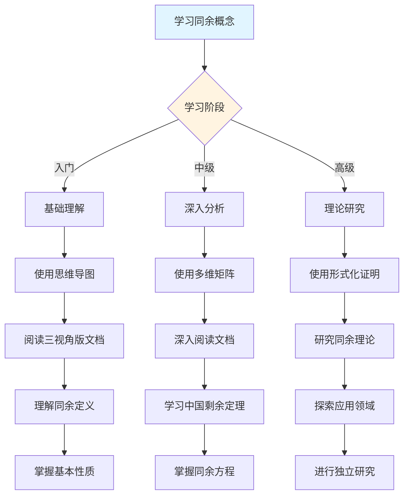
```mermaid
graph TD
    A[学习同余概念] --> B{学习阶段}
    B -->|入门| C[基础理解]
    B -->|中级| D[深入分析]
    B -->|高级| E[理论研究]

    C --> C1[使用思维导图]
    C1 --> C2[阅读三视角版文档]
    C2 --> C3[理解同余定义]
    C3 --> C4[掌握基本性质]

    D --> D1[使用多维矩阵]
    D1 --> D2[深入阅读文档]
    D2 --> D3[学习中国剩余定理]
    D3 --> D4[掌握同余方程]

    E --> E1[使用形式化证明]
    E1 --> E2[研究同余理论]
    E2 --> E3[探索应用领域]
    E3 --> E4[进行独立研究]

    style A fill:#e1f5ff
    style B fill:#fff4e1
```

### 1.2 学习重点决策

**基于知识矩阵的学习重点**：

| 学习阶段 | 知识层次 | 学习重点 | 推荐资源 |
|---------|---------|---------|---------|
| **入门** | L0基础 | 同余的定义、基本例子 | 思维导图、三视角版文档 |
| **入门** | L0基础 | 同余的直观理解（模运算、余数） | 三视角版文档、应用实例 |
| **中级** | L1中级 | 中国剩余定理 | 多维矩阵、形式化证明 |
| **中级** | L1中级 | 同余方程 | 三视角版文档、习题库 |
| **高级** | L2高级 | 同余理论 | 形式化证明系统 |
| **高级** | L2高级 | 模算术 | 形式化证明系统 |

### 1.3 学习方法决策

**基于认知维度的学习方法**：

1. **直观维度**（入门阶段）
   - 使用思维导图建立总体框架
   - 使用具体例子理解概念（时钟算术、模运算）
   - 使用余数直观理解同余

2. **知性维度**（中级阶段）
   - 使用多维矩阵分析概念特征
   - 使用概念分类系统理解（线性同余、二次同余、高次同余）
   - 使用关系分析建立联系（与整数、素数、数论的关系）

3. **理性维度**（高级阶段）
   - 使用形式化证明严格理解
   - 使用逻辑推理深入分析
   - 使用系统建构整体把握

---

## 🔬 二、研究决策导图 (编号: C.CORE.027.DECISION.02)

### 2.1 研究方向决策

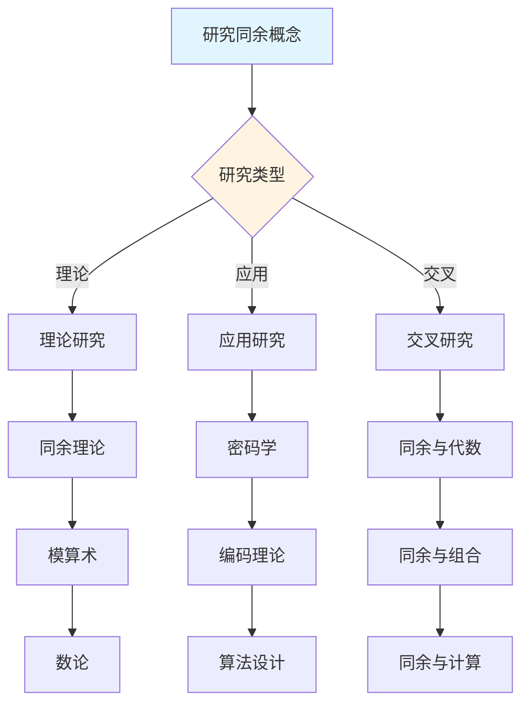
```mermaid
graph TD
    A[研究同余概念] --> B{研究类型}
    B -->|理论| C[理论研究]
    B -->|应用| D[应用研究]
    B -->|交叉| E[交叉研究]

    C --> C1[同余理论]
    C1 --> C2[模算术]
    C2 --> C3[数论]

    D --> D1[密码学]
    D1 --> D2[编码理论]
    D2 --> D3[算法设计]

    E --> E1[同余与代数]
    E1 --> E2[同余与组合]
    E2 --> E3[同余与计算]

    style A fill:#e1f5ff
    style B fill:#fff4e1
```

### 2.2 研究问题决策

**基于知识矩阵的研究问题**：

1. **理论研究问题**
   - 同余理论：同余的分类和性质
   - 模算术：模运算的理论
   - 数论：同余在数论中的应用

2. **应用研究问题**
   - 密码学：同余在密码学中的应用（RSA加密中的模幂运算）
   - 编码理论：同余在编码理论中的应用（中国剩余定理的应用）
   - 算法设计：同余在算法设计中的应用（哈希表设计）

3. **交叉研究问题**
   - 同余与代数：同余的代数结构
   - 同余与组合：同余在组合中的应用
   - 同余与计算：同余在计算中的应用

### 2.3 研究方法决策

**基于形式化证明的研究方法**：

1. **构造性证明** → 同余的构造
   - 直接构造同余
   - 适用于具体同余

2. **数论方法** → 同余方程
   - 使用数论方法
   - 适用于同余方程求解

3. **代数方法** → 模算术
   - 使用代数方法
   - 适用于模算术理论

---

## 💼 三、应用决策导图 (编号: C.CORE.027.DECISION.03)

### 3.1 应用场景决策

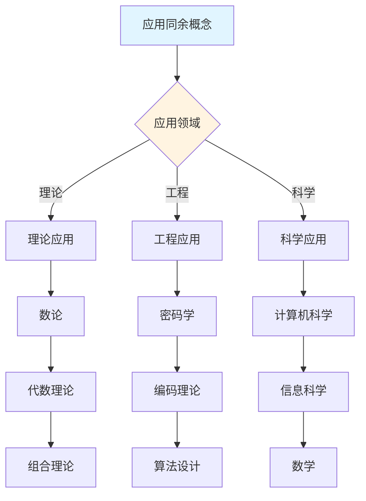
```mermaid
graph TD
    A[应用同余概念] --> B{应用领域}
    B -->|理论| C[理论应用]
    B -->|工程| D[工程应用]
    B -->|科学| E[科学应用]

    C --> C1[数论]
    C1 --> C2[代数理论]
    C2 --> C3[组合理论]

    D --> D1[密码学]
    D1 --> D2[编码理论]
    D2 --> D3[算法设计]

    E --> E1[计算机科学]
    E1 --> E2[信息科学]
    E2 --> E3[数学]

    style A fill:#e1f5ff
    style B fill:#fff4e1
```

### 3.2 应用方法决策

**基于应用场景的应用方法**：

1. **理论应用** → 使用形式化证明
   - 数论：同余是数论的基础
   - 代数理论：同余的代数结构
   - 组合理论：同余在组合中的应用

2. **工程应用** → 使用论证过程
   - 密码学：同余在密码学中的应用（RSA加密中的模幂运算）
   - 编码理论：同余在编码理论中的应用（中国剩余定理的应用）
   - 算法设计：同余在算法设计中的应用（哈希表设计）

3. **科学应用** → 使用综合方法
   - 计算机科学：同余在计算机科学中的应用
   - 信息科学：同余在信息科学中的应用
   - 数学：同余在数学中的应用

---

## 🎓 四、教学决策导图 (编号: C.CORE.027.DECISION.04)

### 4.1 教学内容决策

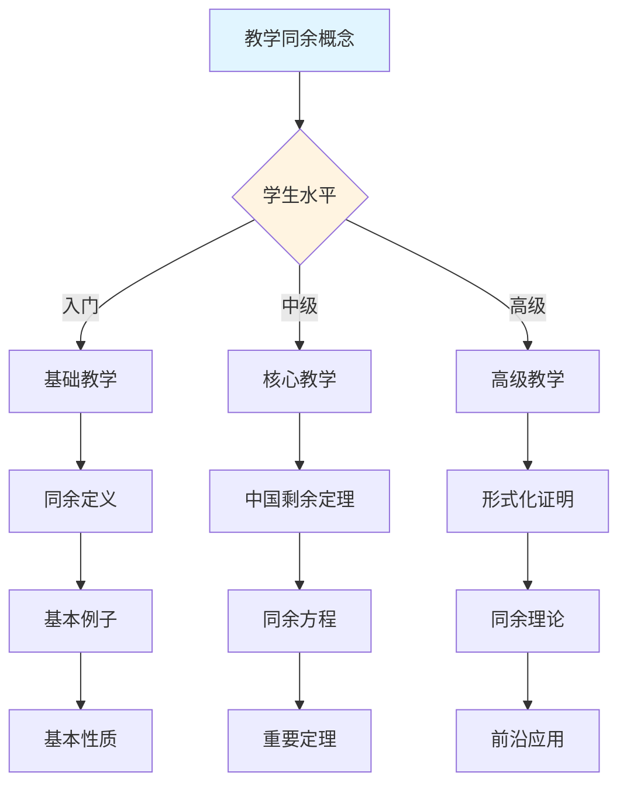
```mermaid
graph TD
    A[教学同余概念] --> B{学生水平}
    B -->|入门| C[基础教学]
    B -->|中级| D[核心教学]
    B -->|高级| E[高级教学]

    C --> C1[同余定义]
    C1 --> C2[基本例子]
    C2 --> C3[基本性质]

    D --> D1[中国剩余定理]
    D1 --> D2[同余方程]
    D2 --> D3[重要定理]

    E --> E1[形式化证明]
    E1 --> E2[同余理论]
    E2 --> E3[前沿应用]

    style A fill:#e1f5ff
    style B fill:#fff4e1
```

### 4.2 教学方法决策

**基于认知维度的教学方法**：

1. **直观维度**（入门教学）
   - 使用思维导图建立框架
   - 使用具体例子（时钟算术、模运算）
   - 使用余数直观理解

2. **知性维度**（中级教学）
   - 使用多维矩阵深入分析
   - 使用概念分类系统
   - 使用关系分析建立联系

3. **理性维度**（高级教学）
   - 使用形式化证明严格理解
   - 使用逻辑推理深入分析
   - 使用系统建构整体把握

---

## 🔄 五、整合应用示例 (编号: C.CORE.027.DECISION.05)

### 5.1 完整学习流程示例

**阶段1：入门理解**:

1. 使用学习决策导图 → 确定学习路径：基础概念 → 同余定义 → 基本性质 → 基本应用
2. 使用总体思维导图 → 了解同余在数论中的位置
3. 阅读[同余-三视角版](./27-同余.md) → 理解同余的定义和基本性质
4. 使用论证过程 → 理解同余的直观意义（模运算、余数、时钟算术）

**阶段2：深入分析**:

1. 使用多维矩阵 → 分析同余的多维度特征（知识层次L0基础层、知识领域D6数论、学习难度中等）
2. 阅读[同余-三视角版](./27-同余.md) → 深入理解中国剩余定理和同余方程
3. 使用形式化证明 → 学习同余相关定理的形式化证明
4. 使用分支关联思维导图 → 了解同余与整数、素数、数论的关系

**阶段3：应用研究**:

1. 使用研究决策导图 → 确定研究方向：同余理论
2. 使用知识关联网络 → 发现同余与代数、组合、计算的关系
3. 使用形式化证明系统 → 构建同余理论体系
4. 阅读[同余-三视角版](./27-同余.md) → 了解同余的历史发展和开放问题

---

## 🔗 六、关联文档 (编号: C.CORE.027.DECISION.06)

### 6.1 核心概念文档

- [同余-三视角版](./27-同余.md)
- [同余](./27-同余.md)

### 6.2 框架文档

- [决策思维导图体系](../01-总体思维导图/05-决策思维导图体系.md)
- [概念体系全面梳理与推进计划](../00-概念体系全面梳理与推进计划-2025年1月.md)
- [核心概念与新框架整合指南](../00-核心概念与新框架整合指南-2025年1月.md)

### 6.3 相关文档

- [核心概念索引](./00-核心概念索引.md)
- [知识矩阵总览](../02-知识矩阵/00-知识矩阵总览.md)
- [形式化证明系统](../00-形式化证明系统-2025年11月.md)

---

**维护状态**: 持续更新中

