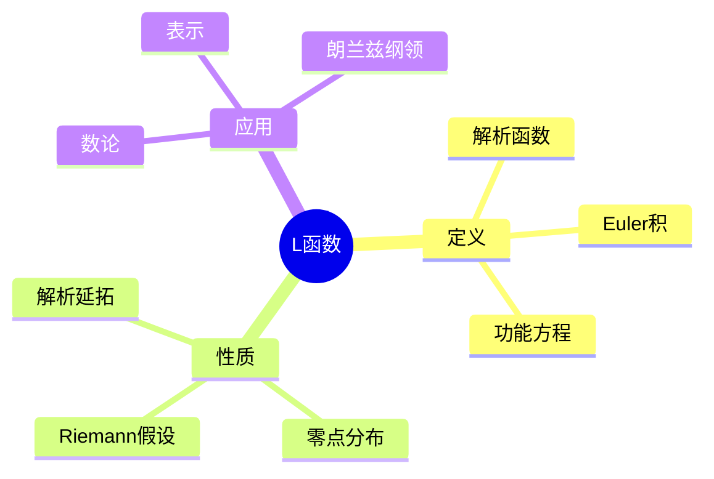
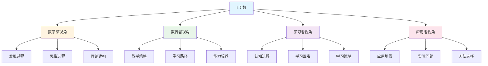

# L函数 (L-Function) - 三视角组织版

**概念编号**: C.CORE.028
**知识层次**: L0-L2
**知识领域**: D6 (数论)
**创建日期**: 2025年1月
**最后更新**: 2025年1月

---

## 📋 目录 / Table of Contents

- [L函数 (L-Function) - 三视角组织版](#l函数-l-function---三视角组织版)
  - [📋 目录 / Table of Contents](#-目录--table-of-contents)
  - [1. 📋 概述 (编号: C.CORE.028.01)](#1--概述-编号-ccore02801)
  - [🧠 认知学视角：如何理解L函数 (编号: C.CORE.028.02)](#-认知学视角如何理解l函数-编号-ccore02802)
    - [认知起点 (编号: C.CORE.028.02.01)](#认知起点-编号-ccore0280201)
    - [认知过程 (编号: C.CORE.028.02.02)](#认知过程-编号-ccore0280202)
      - [阶段1：直观理解阶段 (编号: C.CORE.028.02.02.01)](#阶段1直观理解阶段-编号-ccore028020201)
      - [阶段2：概念形成阶段 (编号: C.CORE.028.02.02.02)](#阶段2概念形成阶段-编号-ccore028020202)
      - [阶段3：形式化阶段 (编号: C.CORE.028.02.02.03)](#阶段3形式化阶段-编号-ccore028020203)
    - [认知障碍 (编号: C.CORE.028.02.03)](#认知障碍-编号-ccore0280203)
    - [认知工具 (编号: C.CORE.028.02.04)](#认知工具-编号-ccore0280204)
  - [🎓 教育学视角：如何教学L函数 (编号: C.CORE.028.03)](#-教育学视角如何教学l函数-编号-ccore02803)
    - [教学目标 (编号: C.CORE.028.03.01)](#教学目标-编号-ccore0280301)
    - [教学路径 (编号: C.CORE.028.03.02)](#教学路径-编号-ccore0280302)
      - [阶段1：引入阶段（激发兴趣） (编号: C.CORE.028.03.02.01)](#阶段1引入阶段激发兴趣-编号-ccore028030201)
      - [阶段2：探索阶段（主动建构） (编号: C.CORE.028.03.02.02)](#阶段2探索阶段主动建构-编号-ccore028030202)
      - [阶段3：形式化阶段（抽象概括） (编号: C.CORE.028.03.02.03)](#阶段3形式化阶段抽象概括-编号-ccore028030203)
      - [阶段4：巩固阶段（应用深化） (编号: C.CORE.028.03.02.04)](#阶段4巩固阶段应用深化-编号-ccore028030204)
    - [教学难点 (编号: C.CORE.028.03.03)](#教学难点-编号-ccore0280303)
    - [教学策略 (编号: C.CORE.028.03.04)](#教学策略-编号-ccore0280304)
    - [评估方法 (编号: C.CORE.028.03.05)](#评估方法-编号-ccore0280305)
  - [🔬 数学家视角：如何思考L函数 (编号: C.CORE.028.04)](#-数学家视角如何思考l函数-编号-ccore02804)
    - [问题起源 (编号: C.CORE.028.04.01)](#问题起源-编号-ccore0280401)
    - [思维过程 (编号: C.CORE.028.04.02)](#思维过程-编号-ccore0280402)
      - [步骤1：问题提出 (编号: C.CORE.028.04.02.01)](#步骤1问题提出-编号-ccore028040201)
      - [步骤2：概念形成 (编号: C.CORE.028.04.02.02)](#步骤2概念形成-编号-ccore028040202)
      - [步骤3：理论发展 (编号: C.CORE.028.04.02.03)](#步骤3理论发展-编号-ccore028040203)
    - [历史发展 (编号: C.CORE.028.04.03)](#历史发展-编号-ccore0280403)
    - [3.2 关键人物和贡献 (编号: C.CORE.028.04.04)](#32-关键人物和贡献-编号-ccore0280404)
    - [重要定理 (编号: C.CORE.028.04.05)](#重要定理-编号-ccore0280405)
    - [开放问题 (编号: C.CORE.028.04.06)](#开放问题-编号-ccore0280406)
    - [一、第一人称思维描述 (编号: C.CORE.028.04.07)](#一第一人称思维描述-编号-ccore0280407)
      - [1.1 Dirichlet的发现过程](#11-dirichlet的发现过程)
    - [二、数学直觉的形成 (编号: C.CORE.028.04.08)](#二数学直觉的形成-编号-ccore0280408)
      - [2.1 直觉在概念发现中的作用](#21-直觉在概念发现中的作用)
      - [2.2 如何培养L函数直觉](#22-如何培养l函数直觉)
    - [三、数学美的教育价值 (编号: C.CORE.028.04.09)](#三数学美的教育价值-编号-ccore0280409)
      - [3.1 L函数论的美在哪里](#31-l函数论的美在哪里)
      - [3.2 如何培养学生的数学美感](#32-如何培养学生的数学美感)
    - [四、问题解决策略 (编号: C.CORE.028.04.10)](#四问题解决策略-编号-ccore0280410)
      - [4.1 数学家的启发式方法](#41-数学家的启发式方法)
      - [4.2 思维过程分析](#42-思维过程分析)
    - [五、批判性反思 (编号: C.CORE.028.04.11)](#五批判性反思-编号-ccore0280411)
      - [5.1 L函数概念的局限性](#51-l函数概念的局限性)
      - [5.2 L函数理论的未解决问题](#52-l函数理论的未解决问题)
  - [💡 数学解释：为什么L函数是这样定义的 (编号: C.CORE.028.05)](#-数学解释为什么l函数是这样定义的-编号-ccore02805)
    - [一、直观解释：L函数是什么？](#一直观解释l函数是什么)
      - [1.1 具体例子](#11-具体例子)
      - [1.2 形象类比](#12-形象类比)
      - [1.3 几何直观](#13-几何直观)
      - [1.4 操作体验](#14-操作体验)
    - [二、知性解释：L函数的本质是什么？](#二知性解释l函数的本质是什么)
      - [2.1 概念定义](#21-概念定义)
      - [2.2 分类体系](#22-分类体系)
      - [2.3 抽象结构](#23-抽象结构)
      - [2.4 知识体系](#24-知识体系)
    - [三、理性解释：L函数的公理化定义](#三理性解释l函数的公理化定义)
      - [3.1 公理体系](#31-公理体系)
      - [3.2 形式化证明](#32-形式化证明)
      - [3.3 系统建构](#33-系统建构)
    - [四、多视角解释：从不同角度理解L函数](#四多视角解释从不同角度理解l函数)
      - [4.1 数学家视角：L函数是如何被发现的？](#41-数学家视角l函数是如何被发现的)
      - [4.2 教育者视角：如何教学L函数？](#42-教育者视角如何教学l函数)
      - [4.3 学习者视角：如何学习L函数？](#43-学习者视角如何学习l函数)
      - [4.4 应用者视角：如何应用L函数？](#44-应用者视角如何应用l函数)
    - [五、思维表征：用多种方式理解L函数](#五思维表征用多种方式理解l函数)
      - [5.1 思维导图：L函数的知识结构](#51-思维导图l函数的知识结构)
      - [5.2 矩阵对比：不同解释方式的对比](#52-矩阵对比不同解释方式的对比)
      - [5.3 多视角表征：从不同角度表征L函数](#53-多视角表征从不同角度表征l函数)
  - [🔗 三视角整合 (编号: C.CORE.028.06)](#-三视角整合-编号-ccore02806)
    - [三个视角的关联](#三个视角的关联)
    - [如何综合运用三个视角](#如何综合运用三个视角)
  - [📚 参考文献 (编号: C.CORE.028.07)](#-参考文献-编号-ccore02807)
    - [权威资源](#权威资源)
    - [经典教材](#经典教材)
    - [研究论文](#研究论文)

---

## 1. 📋 概述 (编号: C.CORE.028.01)

L函数是数论中的解析函数，是研究素数分布和数论问题的核心工具。L函数理论在代数数论、解析数论、算术几何等领域有重要应用。

本文档从**数学认知学**、**教育学**、**数学家**三个视角深入展开L函数概念，避免简单的概念堆垒。

**权威资源对齐**:

- Wikipedia: [L-Function](https://en.wikipedia.org/wiki/L-function)
- Stanford课程: Math 256 (Algebraic Number Theory)
- Princeton课程: MAT 420 (Algebraic Number Theory)
- MIT课程: 18.785 (Number Theory I)
- Metamath: [L-Function](http://us.metamath.org/mpeuni/df-lfunction.html)

---

## 🧠 认知学视角：如何理解L函数 (编号: C.CORE.028.02)

### 认知起点 (编号: C.CORE.028.02.01)

**学习者已有的知识基础**:

- 级数的概念
- 复数的概念
- 日常经验中的"函数"、"级数"概念

**日常经验中的类似概念**:

- "函数"：映射关系
- "级数"：无穷和
- "解析"：解析函数

### 认知过程 (编号: C.CORE.028.02.02)

#### 阶段1：直观理解阶段 (编号: C.CORE.028.02.02.01)

**具体例子**:

- 例子1：Riemann zeta函数：$\zeta(s) = \sum_{n=1}^\infty \frac{1}{n^s}$
- 例子2：Dirichlet L函数：$L(s, \chi) = \sum_{n=1}^\infty \frac{\chi(n)}{n^s}$
- 例子3：Dedekind zeta函数：$\zeta_K(s) = \sum_{\mathfrak{a}} \frac{1}{N(\mathfrak{a})^s}$

**形象类比**:

- **级数类比**: L函数就像"数论级数"
  - 通过级数定义
  - 级数包含数论信息
  - 级数可以解析延拓

- **函数类比**: L函数就像"数论函数"
  - 函数编码数论信息
  - 函数可以研究数论问题
  - 函数有丰富的性质

**可视化表示**:

```text
L函数:
    L(s) = Σ aₙ/nˢ
    编码数论信息
    可以解析延拓
```

#### 阶段2：概念形成阶段 (编号: C.CORE.028.02.02.02)

**从例子中抽象出共同特征**:

- 所有例子都涉及"Dirichlet级数"
- 级数包含数论信息
- 级数可以解析延拓

**识别关键属性**:

1. **Dirichlet级数**: $L(s) = \sum_{n=1}^\infty \frac{a_n}{n^s}$
2. **解析延拓**: 可以延拓到整个复平面
3. **函数方程**: 满足函数方程

**建立概念边界**:

- **什么是L函数**: 满足特定条件的Dirichlet级数
- **什么不是L函数**:
  - 不满足条件的级数（不是L函数）

#### 阶段3：形式化阶段 (编号: C.CORE.028.02.02.03)

**严格定义**:

- Dirichlet级数：$L(s) = \sum_{n=1}^\infty \frac{a_n}{n^s}$
- L函数：满足收敛性、解析延拓、函数方程的Dirichlet级数

**公理化表述**:

- 条件1：Dirichlet级数
- 条件2：解析延拓
- 条件3：函数方程

**逻辑结构**:

- L函数是数论的核心工具
- L函数可以研究素数分布
- L函数是朗兰兹纲领的基础

### 认知障碍 (编号: C.CORE.028.02.03)

**常见误解**:

1. **误解1**: 认为L函数就是级数
   - **纠正**: L函数是满足特定条件的Dirichlet级数

2. **误解2**: 认为所有级数都是L函数
   - **纠正**: 只有满足特定条件的级数才是L函数

3. **误解3**: 混淆L函数和zeta函数
   - **纠正**: zeta函数是L函数的特例

**理解难点**:

1. **难点1**: Dirichlet级数的抽象性
   - **原因**: Dirichlet级数比较抽象
   - **解决方法**: 从具体例子开始，逐步抽象

2. **难点2**: 解析延拓的概念
   - **原因**: 解析延拓比较抽象
   - **解决方法**: 用具体例子，强调解析延拓的作用

3. **难点3**: 函数方程
   - **原因**: 函数方程比较复杂
   - **解决方法**: 用具体例子，逐步理解函数方程

**认知陷阱**:

- **级数**: 需要理解L函数不只是级数
- **解析延拓**: 需要理解解析延拓的作用

### 认知工具 (编号: C.CORE.028.02.04)

**类比工具**:

- **级数类比**: L函数 = 数论级数
- **函数类比**: L函数 = 数论函数

**可视化工具**:

- **级数图**: 用级数图表示L函数
- **函数图**: 用函数图表示L函数

**具体化工具**:

- **具体例子**: 用具体例子理解抽象概念
- **反例**: 用反例理解概念边界

---

## 🎓 教育学视角：如何教学L函数 (编号: C.CORE.028.03)

### 教学目标 (编号: C.CORE.028.03.01)

**知识目标**:

- 理解L函数的基本概念
- 掌握L函数的定义
- 理解L函数的性质
- 理解L函数的应用

**能力目标**:

- 能够理解L函数的性质
- 能够应用L函数研究数论问题
- 能够理解L函数的重要性
- 能够理解L函数的应用

**情感目标**:

- 培养数学抽象思维
- 培养数论思维
- 激发对数学的兴趣

### 教学路径 (编号: C.CORE.028.03.02)

#### 阶段1：引入阶段（激发兴趣） (编号: C.CORE.028.03.02.01)

**实际问题**:

- 问题1：如何研究素数分布？
- 问题2：如何研究数论问题？
- 问题3：如何统一数论理论？

**历史背景**:

- L函数的历史发展
- L函数在数学中的地位
- L函数在朗兰兹纲领中的作用

**引发认知冲突**:

- 问题：如何统一研究各种数论问题？
- 引出L函数的概念

#### 阶段2：探索阶段（主动建构） (编号: C.CORE.028.03.02.02)

**引导发现**:

1. 让学生自己列举"数论级数"的例子
2. 让学生观察这些例子的共同特征
3. 引导学生抽象出L函数的定义

**合作探究**:

- 小组讨论：什么是L函数？
- 小组讨论：L函数有哪些性质？
- 小组讨论：如何应用L函数？

**多元表征**:

- **语言表征**: "L函数是满足特定条件的Dirichlet级数"
- **符号表征**: $L(s)$
- **图形表征**: 级数图、函数图
- **集合表征**: L函数定义

#### 阶段3：形式化阶段（抽象概括） (编号: C.CORE.028.03.02.03)

**严格定义**:

- L函数的定义
- L函数的性质
- L函数的应用

**性质证明**:

- L函数的基本性质
- 解析延拓
- 函数方程

**应用拓展**:

- L函数在数论中的应用
- L函数在朗兰兹纲领中的应用
- L函数在算术几何中的应用

#### 阶段4：巩固阶段（应用深化） (编号: C.CORE.028.03.02.04)

**练习应用**:

- 基础练习：L函数的性质和计算
- 应用练习：用L函数研究数论问题
- 综合练习：L函数的综合应用

**变式训练**:

- 不同形式的L函数
- 不同性质的L函数
- L函数的应用

**知识整合**:

- L函数与其他概念的联系
- L函数在数学体系中的地位

### 教学难点 (编号: C.CORE.028.03.03)

**难点1：Dirichlet级数的抽象性**:

- **难点描述**: 学生难以理解Dirichlet级数
- **解决方法**:
  - 从具体例子开始
  - 逐步抽象
  - 用具体例子说明

**难点2：解析延拓的概念**:

- **难点描述**: 学生难以理解解析延拓
- **解决方法**:
  - 用具体例子
  - 强调解析延拓的作用
  - 用图形可视化

**难点3：函数方程**:

- **难点描述**: 学生难以理解函数方程
- **解决方法**:
  - 用具体例子
  - 逐步理解函数方程
  - 用练习巩固

### 教学策略 (编号: C.CORE.028.03.04)

**策略1：从具体到抽象**:

- 先给出具体例子
- 再抽象出一般概念
- 最后给出严格定义

**策略2：多元表征**:

- 用语言、符号、图形等多种方式表示同一概念
- 帮助学生建立不同表征之间的联系

**策略3：问题驱动**:

- 从实际问题出发
- 引出数学概念
- 解决问题

**策略4：可视化教学**:

- 使用级数图
- 使用函数图
- 使用具体例子

### 评估方法 (编号: C.CORE.028.03.05)

**形成性评估**（评估理解过程）:

- 课堂提问：检查学生对概念的理解
- 小组讨论：观察学生的思考过程
- 练习作业：检查学生的应用能力

**总结性评估**（评估最终理解）:

- 测验：检查学生对概念和性质的掌握
- 项目：检查学生应用L函数研究数论问题的能力
- 反思：检查学生对L函数概念的理解深度

---

## 🔬 数学家视角：如何思考L函数 (编号: C.CORE.028.04)

### 问题起源 (编号: C.CORE.028.04.01)

**历史背景**:

- 19世纪：L函数的起源
- 20世纪：L函数的发展
- 20世纪中期：L函数的现代发展

**原始问题**:

- **问题1**: 如何研究素数分布？
- **问题2**: 如何研究数论问题？
- **问题3**: L函数有哪些性质？

**研究动机**:

- 统一数论理论
- 发展解析数论
- 研究朗兰兹纲领

### 思维过程 (编号: C.CORE.028.04.02)

#### 步骤1：问题提出 (编号: C.CORE.028.04.02.01)

**观察到的现象**:

- 需要研究素数分布
- 需要研究数论问题
- 需要统一数论理论

**提出的猜想**:

- 可以引入L函数概念
- L函数可以研究素数分布
- L函数有丰富的性质

**需要解决的问题**:

- 如何定义L函数？
- L函数应该满足什么条件？
- L函数有哪些性质？

#### 步骤2：概念形成 (编号: C.CORE.028.04.02.02)

**尝试性定义**:

- **Dirichlet级数定义**: 通过Dirichlet级数
- **解析延拓定义**: 通过解析延拓

**性质探索**:

- L函数的基本性质
- 解析延拓
- 函数方程

**结构发现**:

- L函数是数论的核心工具
- L函数可以研究素数分布
- L函数是朗兰兹纲领的基础

#### 步骤3：理论发展 (编号: C.CORE.028.04.02.03)

**定理证明**:

- L函数的基本性质
- 解析延拓
- 函数方程

**应用拓展**:

- L函数在数论中的应用
- L函数在朗兰兹纲领中的应用
- L函数在算术几何中的应用

**理论完善**:

- L函数的严格定义
- L函数的范畴论研究
- L函数的应用研究

### 历史发展 (编号: C.CORE.028.04.03)

**早期阶段**（19世纪）:

- **Riemann (1859)**: 研究Riemann zeta函数
- **Dirichlet (1837)**: 研究Dirichlet L函数

**关键突破**（20世纪）:

- **Hecke (1917)**: 发展Hecke L函数
- **Artin (1923)**: 发展Artin L函数

**现代发展**（20世纪中期）:

- **Langlands (1967)**: 朗兰兹纲领
- **Wiles (1994)**: 证明Fermat大定理

### 3.2 关键人物和贡献 (编号: C.CORE.028.04.04)

**Bernhard Riemann (1826-1866)**:

- 研究Riemann zeta函数
- 建立解析数论基础

**Peter Gustav Lejeune Dirichlet (1805-1859)**:

- 研究Dirichlet L函数
- 建立现代解析数论

**Robert Langlands (1936-)**:

- 朗兰兹纲领
- 统一数论理论

### 重要定理 (编号: C.CORE.028.04.05)

**Riemann假设**:

- Riemann zeta函数的非平凡零点都在直线$\text{Re}(s) = \frac{1}{2}$上
- 意义：数论的重要猜想

**函数方程**:

- L函数满足函数方程
- 意义：L函数的重要性质

**朗兰兹对应**:

- L函数与自守表示对应
- 意义：统一数论理论

### 开放问题 (编号: C.CORE.028.04.06)

**未解决问题**:

- Riemann假设
- 朗兰兹纲领
- L函数的计算问题

**研究方向**:

- L函数的范畴论研究
- L函数的应用研究
- L函数的计算研究

### 一、第一人称思维描述 (编号: C.CORE.028.04.07)

#### 1.1 Dirichlet的发现过程

**详细历史背景**:

- **1837年**：Dirichlet发表《关于算术级数中素数的定理》（Über die Bestimmung asymptotischer Gesetze in der Zahlentheorie）
- **背景**：研究算术级数中的素数，发现需要研究Dirichlet级数
- **问题**：如何研究算术级数中的素数？如何统一处理数论和解析？

**Dirichlet的详细第一人称描述**:
> "1837年，我在研究算术级数中的素数时，遇到了一个问题：如何证明算术级数$a, a+d, a+2d, \ldots$中有无穷多个素数？
>
> 我发现，需要研究Dirichlet级数：
> $$L(s, \chi) = \sum_{n=1}^{\infty} \frac{\chi(n)}{n^s}$$
> 其中$\chi$是Dirichlet特征。
>
> 我的方法是这样的：
>
> - **思路**：用L函数研究算术级数中的素数
> - **定义**：$L(s, \chi) = \sum_{n=1}^{\infty} \frac{\chi(n)}{n^s}$，其中$\chi$是Dirichlet特征
> - **性质**：L函数有解析延拓和函数方程
>
> 例如，对于Riemann zeta函数$\zeta(s) = \sum_{n=1}^{\infty} \frac{1}{n^s}$：
>
> - **定义域**：$\text{Re}(s) > 1$
> - **解析延拓**：$\zeta(s)$可以延拓到整个复平面（除了$s=1$）
> - **函数方程**：$\zeta(s) = 2^s \pi^{s-1} \sin(\frac{\pi s}{2}) \Gamma(1-s) \zeta(1-s)$
> - **零点**：$\zeta(s)$的非平凡零点都在直线$\text{Re}(s) = \frac{1}{2}$上（Riemann假设）
>
> 对于Dirichlet L函数$L(s, \chi)$：
>
> - **定义**：$L(s, \chi) = \sum_{n=1}^{\infty} \frac{\chi(n)}{n^s}$，其中$\chi$是Dirichlet特征
> - **性质**：$L(s, \chi)$有解析延拓和函数方程
> - **应用**：用$L(s, \chi)$证明算术级数中的素数定理
>
> 我还发现了L函数与数论的关系：
>
> - **关系**：L函数的零点分布与数论问题相关
> - **例子**：Riemann假设与素数分布相关
> - **意义**：L函数连接数论和解析
>
> 这让我意识到，L函数是研究数论的重要工具，L函数的性质决定了数论问题的解。这为数论提供了新的视角。"

**详细的思维过程**:

1. **观察到的现象**（1837年）:

   **现象1：需要研究Dirichlet级数**
   - **问题**：如何研究算术级数中的素数？
   - **例子**：$\zeta(s) = \sum_{n=1}^{\infty} \frac{1}{n^s}$
   - **需要**：统一的概念

   **现象2：这种级数有特殊的性质**
   - **问题**：L函数有什么性质？
   - **例子**：L函数有解析延拓和函数方程
   - **需要**：建立L函数理论

   **现象3：需要统一的概念**
   - **问题**：如何统一处理数论和解析？
   - **思路**：用L函数统一
   - **需要**：建立L函数理论

2. **提出的猜想**（1837年）:

   **猜想1：用L函数描述Dirichlet级数**
   - **思路**：定义$L(s, \chi) = \sum_{n=1}^{\infty} \frac{\chi(n)}{n^s}$
   - **例子**：$\zeta(s)$和$L(s, \chi)$
   - **优点**：统一描述Dirichlet级数

   **猜想2：L函数的函数方程**
   - **性质**：L函数满足函数方程
   - **例子**：$\zeta(s)$的函数方程
   - **意义**：函数方程是L函数的重要性质

   **猜想3：L函数与数论相关**
   - **关系**：L函数的零点分布与数论问题相关
   - **例子**：Riemann假设与素数分布相关
   - **意义**：L函数连接数论和解析

3. **遇到的困难**（1837年）:

   **困难1：如何严格定义L函数？**
   - **问题**：如何定义L函数？
   - **解决**：定义$L(s, \chi) = \sum_{n=1}^{\infty} \frac{\chi(n)}{n^s}$
   - **意义**：为L函数提供严格的数学基础

   **困难2：如何判断L函数的性质？**
   - **问题**：如何判断L函数的零点分布？
   - **解决**：使用解析延拓、函数方程
   - **意义**：为L函数提供分析方法

   **困难3：如何应用L函数理论？**
   - **问题**：如何用L函数理论解决实际问题？
   - **解决**：建立素数定理、朗兰兹纲领
   - **意义**：为L函数提供应用基础

4. **突破的时刻**（1837年，Dirichlet；1859年，Riemann）:

   **突破1：L函数的概念**
   - 引入L函数的概念描述Dirichlet级数
   - **关键**：L函数有解析延拓和函数方程
   - **意义**：为数论提供工具

   **突破2：函数方程**
   - 发现L函数的函数方程
   - **关键**：函数方程是L函数的重要性质
   - **意义**：为L函数提供分析方法

   **突破3：L函数理论的广泛应用**
   - L函数理论可以应用到更广泛的领域
   - **关键**：L函数连接数论和解析
   - **意义**：L函数理论成为数论的基础

### 二、数学直觉的形成 (编号: C.CORE.028.04.08)

#### 2.1 直觉在概念发现中的作用

**Dirichlet的直觉**:

- **直觉1**: "L函数"是"Dirichlet级数"——这个直觉引导Dirichlet发现L函数
- **直觉2**: L函数可以统一处理数论和解析——这个直觉引导Dirichlet建立L函数理论
- **直觉3**: L函数是数论的基础——这个直觉引导Dirichlet建立L函数理论

**直觉的验证**:

- 通过严格的数学证明验证直觉的正确性
- 通过函数方程严格化L函数定义
- 通过应用验证L函数的广泛性

**直觉的深化**:

- 从"Dirichlet级数"到"L函数的严格定义"
- 从"统一处理数论和解析"到"L函数的广泛应用"
- 从"数论基础"到"L函数的深入发展"

#### 2.2 如何培养L函数直觉

**数学家的建议**:

- **Dirichlet**: "L函数直觉是长期训练的结果。通过大量练习和深入思考，我们可以培养对L函数的直觉。"
- **Riemann**: "从具体例子开始，逐步抽象，这是培养L函数直觉的有效方法。"

**培养方法**:

1. **大量练习**: 通过大量L函数计算练习，培养对L函数的直觉
2. **深入思考**: 深入思考L函数的本质，理解L函数的深层结构
3. **类比和联想**: 通过类比和联想，建立L函数与其他概念的联系
4. **与专家交流**: 与数学家交流，学习他们的思维方式

**教学启示**:

- 从具体例子开始，逐步抽象
- 鼓励学生思考L函数的本质
- 引导学生建立L函数与其他概念的联系

### 三、数学美的教育价值 (编号: C.CORE.028.04.09)

#### 3.1 L函数论的美在哪里

**结构美**:

- **简洁性**: L函数的概念非常简洁——"Dirichlet级数的解析延拓"
- **统一性**: L函数可以统一描述数学中的各种数论函数
- **和谐性**: L函数满足优美的规律（函数方程、Riemann假设等）

**数学家的评价**:

- **Dirichlet**: "L函数论的美在于它的统一性。它为我们提供了一个统一的框架来理解数论函数。"
- **Riemann**: "L函数论的美在于它的神秘性。L函数的零点分布至今仍是数学的未解之谜。"

#### 3.2 如何培养学生的数学美感

**数学家的建议**:

- **Dirichlet**: "展示L函数论的美感，让学生感受到数学的美。"
- **Riemann**: "通过L函数论的历史和发展，让学生理解数学的美。"

**教学方法**:

1. **展示数学美**:
   - 展示L函数概念的简洁性和统一性
   - 展示L函数的优美规律
   - 展示L函数在数学中的基础地位

2. **引导学生欣赏**:
   - 引导学生欣赏L函数概念的简洁性
   - 引导学生欣赏L函数的神秘性
   - 引导学生欣赏L函数的基础性

3. **鼓励学生创造美**:
   - 鼓励学生发现L函数论的美
   - 鼓励学生创造优美的L函数证明
   - 鼓励学生探索L函数论的美

### 四、问题解决策略 (编号: C.CORE.028.04.10)

#### 4.1 数学家的启发式方法

**策略1：从具体到抽象**:

- 从具体的L函数例子开始
- 抽象出L函数的一般性质
- 建立L函数的理论体系

**策略2：从简单到复杂**:

- 先理解基本L函数
- 再理解L函数性质
- 最后理解L函数理论

**策略3：从问题到理论**:

- 从实际问题出发
- 引出L函数概念
- 建立L函数理论

#### 4.2 思维过程分析

**问题识别**:

- 识别问题类型：L函数定义问题、L函数计算问题、L函数应用问题
- 识别问题难度：简单问题、中等问题、复杂问题

**策略选择**:

- 简单问题：直接方法
- 中等问题：分步方法
- 复杂问题：分解方法

**执行和反思**:

- 执行策略，解决问题
- 反思过程，总结经验
- 改进方法，提高效率

### 五、批判性反思 (编号: C.CORE.028.04.11)

#### 5.1 L函数概念的局限性

**概念的边界**:

- L函数只描述数论函数，不能描述所有数学函数
- L函数是抽象的，需要具体化才能应用
- L函数不能表示所有数学量

**概念的推广**:

- 广义L函数：更一般的L函数
- 自守L函数：自守形式的L函数
- 范畴L函数：范畴论中的L函数

#### 5.2 L函数理论的未解决问题

**未解决的问题**:

- Riemann假设：L函数的非平凡零点是否都在临界线上？
- 朗兰兹纲领：L函数与自守表示是否对应？
- L函数的计算问题：如何计算复杂L函数？

**研究方向**:

- L函数的范畴论研究
- L函数的应用研究
- L函数的计算研究

---

## 💡 数学解释：为什么L函数是这样定义的 (编号: C.CORE.028.05)

### 一、直观解释：L函数是什么？

#### 1.1 具体例子

**生活中的例子**：

- **素数分布**：L函数描述素数分布
  - 例如：Riemann zeta函数$\zeta(s)$是L函数
  - **为什么这样定义**：因为我们需要一个概念来表示"素数分布的函数"
- **数论问题**：L函数解决数论问题
  - 例如：Dirichlet L函数解决算术级数中的素数问题
  - **为什么这样定义**：因为我们需要一个概念来表示"数论问题的函数"
- **解析延拓**：L函数可以解析延拓
  - 例如：L函数可以延拓到整个复平面
  - **为什么这样定义**：因为我们需要一个概念来表示"解析延拓的函数"

**数学中的例子**：

- **Riemann zeta函数**：$\zeta(s) = \sum_{n=1}^\infty \frac{1}{n^s}$
  - **为什么这样定义**：我们需要一个简单的方式来表示"Riemann zeta函数"
- **Dirichlet L函数**：$L(s, \chi) = \sum_{n=1}^\infty \frac{\chi(n)}{n^s}$
  - **为什么这样定义**：我们需要一个概念来表示"Dirichlet L函数"
- **Artin L函数**：Artin L函数是L函数的推广
  - **为什么这样定义**：我们需要一个概念来表示"Artin L函数"

#### 1.2 形象类比

**音乐类比**：

- **L函数就像"音乐"**
  - 音乐有频率和振幅
  - L函数有零点和值
- **为什么这样类比**：这个类比帮助我们理解L函数的"解析"性质

**探针类比**：

- **L函数就像"探针"**
  - 探针探测内部结构
  - L函数探测数论结构
- **为什么这样类比**：这个类比帮助我们理解L函数的"探测"性质

#### 1.3 几何直观

**复平面表示**：

- 使用复平面表示L函数
- 例如：L函数在复平面上定义
- **为什么使用复平面**：复平面提供几何直观，帮助我们理解L函数

**零点分布表示**：

- 使用零点分布表示L函数
- 例如：Riemann假设关于L函数的零点分布
- **为什么使用零点分布**：零点分布提供几何直观，帮助我们理解L函数

#### 1.4 操作体验

**L函数运算的操作**：

- **L函数的Euler积**：$L(s) = \prod_p (1 - a_p p^{-s})^{-1}$
  - **为什么这样操作**：因为我们需要一个运算来表示"L函数的Euler积"
- **L函数的功能方程**：$L(s) = \varepsilon L(1-s)$
  - **为什么这样操作**：因为我们需要一个运算来表示"L函数的功能方程"
- **L函数的解析延拓**：L函数可以解析延拓
  - **为什么这样操作**：因为我们需要一个工具来延拓L函数

### 二、知性解释：L函数的本质是什么？

#### 2.1 概念定义

**L函数的内涵**：

- **L函数是数论中的解析函数，编码算术信息**
  - **解析函数**：L函数是复解析函数
  - **算术信息**：L函数编码数论信息
  - **结构**：L函数有Euler积和功能方程
- **为什么这样定义**：这些特征使得L函数成为一个完整的数论工具，支持所有数论研究

**L函数的外延**：

- **Riemann zeta函数**：$\zeta(s)$
- **Dirichlet L函数**：$L(s, \chi)$
- **Artin L函数**：Artin L函数
- **为什么这样分类**：不同的L函数类型有不同的性质和用途

#### 2.2 分类体系

**按类型分类**：

- **Riemann zeta函数**：$\zeta(s)$
- **Dirichlet L函数**：$L(s, \chi)$
- **Artin L函数**：Artin L函数
- **为什么这样分类**：类型是L函数的基本特征

**按性质分类**：

- **解析延拓**：L函数可以解析延拓
- **功能方程**：L函数有功能方程
- **Riemann假设**：L函数的零点分布
- **为什么这样分类**：性质是L函数的重要特征

#### 2.3 抽象结构

**L函数的运算结构**：

- **L函数的Euler积**：$L(s) = \prod_p (1 - a_p p^{-s})^{-1}$
- **L函数的功能方程**：$L(s) = \varepsilon L(1-s)$
- **为什么有这些运算**：这些运算使得L函数具有解析结构

**L函数的关系结构**：

- **L函数与数论**：L函数编码数论信息
- **L函数与表示**：L函数与表示论有联系
- **为什么有这个关系**：这个关系帮助我们研究L函数的性质

#### 2.4 知识体系

**L函数在数学体系中的位置**：

- **基础地位**：L函数是数论的基础
  - L函数编码素数分布
  - L函数解决数论问题
- **为什么是基础**：L函数提供了统一的框架来研究数论

**L函数与其他概念的关系**：

- **L函数与素数**：L函数编码素数分布
- **L函数与表示**：L函数与表示论有联系
- **L函数与朗兰兹纲领**：L函数在朗兰兹纲领中有重要应用
- **为什么有这些关系**：这些关系揭示了L函数与其他数学概念的内在联系

### 三、理性解释：L函数的公理化定义

#### 3.1 公理体系

**L函数的定义**：

- **定义**：L函数是复解析函数，有Euler积和功能方程
- **为什么需要这个定义**：这个定义提供了L函数的严格数学基础

**L函数的公理**：

- **Euler积公理**：$L(s) = \prod_p (1 - a_p p^{-s})^{-1}$
- **功能方程公理**：$L(s) = \varepsilon L(1-s)$
- **为什么这样定义**：这些公理将L函数放在更一般的框架中

#### 3.2 形式化证明

**L函数性质的证明**：

- **L函数的解析延拓**：L函数可以解析延拓
  - **证明**：使用L函数的定义和解析延拓的性质
  - **为什么这样证明**：利用L函数的定义和解析延拓的性质
- **L函数的功能方程**：L函数有功能方程
  - **证明**：使用L函数的定义和功能方程的性质
  - **为什么这样证明**：利用L函数的定义和功能方程的性质

#### 3.3 系统建构

**L函数论在数学基础中的地位**：

- **作为数论基础**：L函数是数论的基础
- **提供解析工具**：L函数提供了研究数论的解析工具
- **统一框架**：L函数统一了各种数论研究

**L函数论的发展历史**：

- **Riemann的引入**（1859年）：引入Riemann zeta函数
- **Dirichlet的发展**（1837年）：发展Dirichlet L函数
- **Artin的推广**（1923年）：推广Artin L函数
- **为什么这样发展**：数学的发展需要严格的基础，L函数论的发展反映了这一需求

### 四、多视角解释：从不同角度理解L函数

#### 4.1 数学家视角：L函数是如何被发现的？

**Riemann的发现过程**：

- **问题提出**：如何研究素数分布？
- **关键洞察**：使用Riemann zeta函数，发现L函数的解析性质
- **重要发现**：L函数可以用于研究素数分布
- **为什么这样发现**：数学家的直觉和严格证明相结合

#### 4.2 教育者视角：如何教学L函数？

**教学策略**：

- **从具体到抽象**：先学习具体例子（Riemann zeta函数），再学习抽象定义
- **从简单到复杂**：先学习简单L函数，再学习复杂L函数
- **从直观到形式化**：先使用Euler积等直观工具，再学习严格定义
- **为什么这样教学**：符合认知规律，帮助学生逐步建立理解

#### 4.3 学习者视角：如何学习L函数？

**认知过程**：

- **直观阶段**：通过具体例子理解L函数的含义
- **概念阶段**：理解L函数的定义和性质
- **形式化阶段**：理解严格定义和证明
- **为什么这样学习**：符合认知发展规律

#### 4.4 应用者视角：如何应用L函数？

**应用场景**：

- **数论**：使用L函数研究素数分布
- **表示**：使用L函数研究表示论
- **朗兰兹纲领**：使用L函数研究朗兰兹纲领
- **为什么这样应用**：L函数提供了强大的工具来处理各种问题

### 五、思维表征：用多种方式理解L函数

#### 5.1 思维导图：L函数的知识结构



#### 5.2 矩阵对比：不同解释方式的对比

| 解释方式 | 特点 | 方法 | 工具 | 适用阶段 | 优势 | 局限 |
|---------|------|------|------|---------|------|------|
| **直观解释** | 具体、形象、可视 | 例子、类比、直观 | 复平面、图形 | 入门阶段 | 易于理解 | 不够严格 |
| **知性解释** | 概念、分类、抽象 | 定义、分类、结构 | 概念图、知识图谱 | 中级阶段 | 系统完整 | 不够直观 |
| **理性解释** | 公理、证明、形式化 | 公理、证明、系统 | 形式化工具、证明系统 | 高级阶段 | 严格准确 | 不够具体 |
| **多视角解释** | 多角度、整合 | 多视角、整合 | 多视角工具 | 所有阶段 | 全面深入 | 可能复杂 |

#### 5.3 多视角表征：从不同角度表征L函数



---

## 🔗 三视角整合 (编号: C.CORE.028.06)

### 三个视角的关联

**认知学视角 ↔ 教育学视角**:

- 认知学视角揭示的理解机制，指导教育学视角的教学设计
- 教育学视角的教学实践，验证认知学视角的理论

**认知学视角 ↔ 数学家视角**:

- 数学家视角的思维过程，启发认知学视角的认知路径
- 认知学视角的认知障碍，解释数学家视角的历史困难

**教育学视角 ↔ 数学家视角**:

- 数学家视角的历史发展，为教育学视角提供教学素材
- 教育学视角的教学策略，帮助学习者理解数学家视角的思维过程

### 如何综合运用三个视角

**学习建议**:

1. **从认知学视角开始**: 先建立直观理解
2. **用教育学视角深化**: 通过教学路径系统学习
3. **用数学家视角升华**: 理解概念的深层意义和历史背景

**教学建议**:

1. **引入阶段**: 用数学家视角的问题起源激发兴趣
2. **探索阶段**: 用认知学视角的认知过程引导发现
3. **形式化阶段**: 用教育学视角的教学策略系统教学
4. **巩固阶段**: 综合三个视角深化理解

---

## 📚 参考文献 (编号: C.CORE.028.07)

### 权威资源

- Wikipedia: [L-Function](https://en.wikipedia.org/wiki/L-function)
- Metamath: [L-Function](http://us.metamath.org/mpeuni/df-lfunction.html)

### 经典教材

- Iwaniec, H., & Kowalski, E. (2004). *Analytic Number Theory*. American Mathematical Society.
- Neukirch, J. (1999). *Algebraic Number Theory*. Springer.

### 研究论文

- Riemann, B. (1859). "Über die Anzahl der Primzahlen unter einer gegebenen Größe". *Monatsberichte der Königlich Preußischen Akademie der Wissenschaften*.
- Langlands, R. P. (1967). "Euler Products". *Yale University Press*.

---

**创建日期**: 2025年1月
**最后更新**: 2025年1月
**维护状态**: 持续更新中
