# L函数概念的多理论分析示例 / Multi-Theory Analysis Example: L-Function Concept

**主题编号 / Topic ID**: C.CORE.028.MULTI
**创建日期 / Created**: 2025年1月 / January 2025
**最后更新 / Last Updated**: 2025年1月 / January 2025
**关联概念 / Related Concepts**: [L函数 / L-Function](./28-L函数.md) | [L函数-三视角版 / L-Function-Three Perspectives](./28-L函数-三视角版.md)

---

## 📋 概述 / Overview

本文档为"L函数"概念提供多理论分析示例，展示如何运用国际主流数学认知理论来分析数论核心概念。

This document provides a multi-theory analysis example for the "L-Function" concept, demonstrating how to apply international mainstream mathematical cognitive theories to analyze core concepts in number theory.

**分析目标 / Analysis Objectives**：

- 展示L函数概念的多理论分析方法 / Demonstrate multi-theory analysis methods for L-function concepts
- 为其他数论概念提供分析参考 / Provide analysis reference for other number theory concepts
- 建立理论整合的应用示例 / Establish application examples of theoretical integration
- 强调L函数与素数、Dirichlet级数、解析数论的关系 / Emphasize the relationship between L-functions, prime numbers, Dirichlet series, and analytic number theory

---

## 📑 目录 / Table of Contents

- [L函数概念的多理论分析示例 / Multi-Theory Analysis Example: L-Function Concept](#l函数概念的多理论分析示例--multi-theory-analysis-example-l-function-concept)
  - [📋 概述 / Overview](#-概述--overview)
  - [📑 目录 / Table of Contents](#-目录--table-of-contents)
  - [🎯 一、Tall三个世界理论分析 / Tall's Three Worlds Theory Analysis (编号: C.CORE.028.MULTI.01)](#-一tall三个世界理论分析--talls-three-worlds-theory-analysis-编号-ccore028multi01)
    - [1.1 感知-操作世界（Embodied World）](#11-感知-操作世界embodied-world)
    - [1.2 概念-符号世界（Symbolic World）](#12-概念-符号世界symbolic-world)
    - [1.3 形式-公理世界（Formal World）](#13-形式-公理世界formal-world)
    - [1.4 三个世界的转换 / Transitions Between Worlds](#14-三个世界的转换--transitions-between-worlds)
  - [🔬 二、Dubinsky APOS理论分析 (编号: C.CORE.028.MULTI.02)](#-二dubinsky-apos理论分析-编号-ccore028multi02)
    - [2.1 Action（动作）](#21-action动作)
    - [2.2 Process（过程）](#22-process过程)
    - [2.3 Object（对象）](#23-object对象)
    - [2.4 Schema（图式）](#24-schema图式)
    - [2.5 APOS发展路径 / APOS Development Path](#25-apos发展路径--apos-development-path)
  - [💬 三、Sfard交流理论分析 / Sfard's Commognitive Theory Analysis (编号: C.CORE.028.MULTI.03)](#-三sfard交流理论分析--sfards-commognitive-theory-analysis-编号-ccore028multi03)
    - [3.1 L函数作为交流工具 / L-Function as a Communication Tool](#31-l函数作为交流工具--l-function-as-a-communication-tool)
    - [3.2 L函数学习的实践参与 / Practice Participation in L-Function Learning](#32-l函数学习的实践参与--practice-participation-in-l-function-learning)
  - [🧠 四、Piaget认知发展理论分析 / Piaget's Cognitive Development Theory Analysis (编号: C.CORE.028.MULTI.04)](#-四piaget认知发展理论分析--piagets-cognitive-development-theory-analysis-编号-ccore028multi04)
    - [4.1 具体运算阶段（7-12岁）/ Concrete Operational Stage (7-12 years)](#41-具体运算阶段7-12岁-concrete-operational-stage-7-12-years)
    - [4.2 形式运算阶段（12+岁）/ Formal Operational Stage (12+ years)](#42-形式运算阶段12岁-formal-operational-stage-12-years)
  - [🌍 五、Vygotsky社会文化理论分析 / Vygotsky's Sociocultural Theory Analysis (编号: C.CORE.028.MULTI.05)](#-五vygotsky社会文化理论分析--vygotskys-sociocultural-theory-analysis-编号-ccore028multi05)
    - [5.1 最近发展区（ZPD）/ Zone of Proximal Development (ZPD)](#51-最近发展区zpd-zone-of-proximal-development-zpd)
    - [5.2 社会文化工具 / Sociocultural Tools](#52-社会文化工具--sociocultural-tools)
  - [🔄 六、多理论整合分析 / Multi-Theory Integration Analysis (编号: C.CORE.028.MULTI.06)](#-六多理论整合分析--multi-theory-integration-analysis-编号-ccore028multi06)
    - [6.1 理论共同点 / Theoretical Commonalities](#61-理论共同点--theoretical-commonalities)
    - [6.2 理论互补性 / Theoretical Complementarity](#62-理论互补性--theoretical-complementarity)
    - [6.3 整合应用框架](#63-整合应用框架)
  - [📊 七、L函数概念的多理论学习路径 / Multi-Theory Learning Path for L-Function Concept (编号: C.CORE.028.MULTI.07)](#-七l函数概念的多理论学习路径--multi-theory-learning-path-for-l-function-concept-编号-ccore028multi07)
    - [7.1 入门阶段（Tall感知-操作世界 + APOS Action）/ Entry Stage (Tall Embodied World + APOS Action)](#71-入门阶段tall感知-操作世界--apos-action-entry-stage-tall-embodied-world--apos-action)
    - [7.2 中级阶段（Tall概念-符号世界 + APOS Process/Object）/ Intermediate Stage (Tall Symbolic World + APOS Process/Object)](#72-中级阶段tall概念-符号世界--apos-processobject-intermediate-stage-tall-symbolic-world--apos-processobject)
    - [7.3 高级阶段（Tall形式-公理世界 + APOS Schema + Sfard实践）/ Advanced Stage (Tall Formal World + APOS Schema + Sfard Practice)](#73-高级阶段tall形式-公理世界--apos-schema--sfard实践-advanced-stage-tall-formal-world--apos-schema--sfard-practice)
  - [🎓 八、教学建议 / Teaching Suggestions (编号: C.CORE.028.MULTI.08)](#-八教学建议--teaching-suggestions-编号-ccore028multi08)
    - [8.1 基于多理论的教学设计 / Multi-Theory Based Teaching Design](#81-基于多理论的教学设计--multi-theory-based-teaching-design)
    - [8.2 具体教学策略 / Specific Teaching Strategies](#82-具体教学策略--specific-teaching-strategies)
  - [🔗 九、关联文档 / Related Documents (编号: C.CORE.028.MULTI.09)](#-九关联文档--related-documents-编号-ccore028multi09)
    - [9.1 核心概念文档 / Core Concept Documents](#91-核心概念文档--core-concept-documents)
    - [9.2 理论框架文档 / Theoretical Framework Documents](#92-理论框架文档--theoretical-framework-documents)
  - [✅ 十、总结 / Summary (编号: C.CORE.028.MULTI.10)](#-十总结--summary-编号-ccore028multi10)
    - [10.1 多理论分析的价值 / Value of Multi-Theory Analysis](#101-多理论分析的价值--value-of-multi-theory-analysis)
    - [10.2 应用推广 / Application and Extension](#102-应用推广--application-and-extension)

---

## 🎯 一、Tall三个世界理论分析 / Tall's Three Worlds Theory Analysis (编号: C.CORE.028.MULTI.01)

### 1.1 感知-操作世界（Embodied World）

**L函数在感知-操作世界中的理解 / Understanding L-Function in the Embodied World**：

- **具体经验 / Concrete Experience**：
  - 通过"级数"的日常经验理解L函数：无穷级数的求和 / Understanding L-functions through daily experience of "series": summation of infinite series
  - 例如：$\zeta(2) = 1 + \frac{1}{4} + \frac{1}{9} + \cdots = \frac{\pi^2}{6}$ / Examples: $\zeta(2) = 1 + \frac{1}{4} + \frac{1}{9} + \cdots = \frac{\pi^2}{6}$
  - 通过"素数分布"理解L函数：L函数编码素数的信息 / Understanding L-functions through "prime distribution": L-functions encode information about primes
  - 例如：Riemann zeta函数的零点与素数分布相关 / Examples: zeros of Riemann zeta function are related to prime distribution

- **身体动作 / Bodily Actions**：
  - 通过"求和"的动作理解L函数 / Understanding L-functions through the action of "summation"
  - 通过"解析延拓"理解L函数 / Understanding L-functions through "analytic continuation"
  - 通过操作级数理解L函数的性质 / Understanding properties of L-functions through manipulating series

- **直观理解 / Intuitive Understanding**：
  - L函数是"编码数论信息的级数" / L-functions are "series encoding number-theoretic information"
  - L函数是"研究素数分布的工具" / L-functions are "tools for studying prime distribution"
  - L函数是解析数论的核心 / L-functions are the core of analytic number theory

**教学建议 / Teaching Suggestions**：

- 使用具体例子（Riemann zeta函数、Dirichlet L函数） / Use concrete examples (Riemann zeta function, Dirichlet L-functions)
- 通过级数活动理解L函数 / Understand L-functions through series activities
- 使用图形可视化L函数的零点 / Use graphics to visualize zeros of L-functions

### 1.2 概念-符号世界（Symbolic World）

**L函数在概念-符号世界的理解 / Understanding L-Functions in the Symbolic World**：

- **符号表示 / Symbolic Representation**：
  - 使用L函数符号：$L(s)$、$\zeta(s)$、$L(s, \chi)$ / Using L-function notation: $L(s)$, $\zeta(s)$, $L(s, \chi)$
  - 使用Dirichlet级数符号：$\sum_{n=1}^\infty \frac{a_n}{n^s}$ / Using Dirichlet series notation: $\sum_{n=1}^\infty \frac{a_n}{n^s}$
  - 使用Euler乘积符号：$\prod_p \left(1 + \frac{a_p}{p^s} + \cdots\right)$ / Using Euler product notation: $\prod_p \left(1 + \frac{a_p}{p^s} + \cdots\right)$

- **概念理解 / Conceptual Understanding**：
  - L函数是Dirichlet级数 / L-functions are Dirichlet series
  - L函数满足解析延拓和函数方程 / L-functions satisfy analytic continuation and functional equations
  - L函数编码数论信息（特别是素数分布） / L-functions encode number-theoretic information (especially prime distribution)

- **抽象操作 / Abstract Operations**：
  - 通过符号操作计算L函数 / Computing L-functions through symbolic operations
  - 通过逻辑推理证明L函数性质 / Proving L-function properties through logical reasoning
  - 通过解析数论语言表达数学概念 / Expressing mathematical concepts through analytic number-theoretic language

**教学建议 / Teaching Suggestions**：

- 逐步引入L函数符号 / Gradually introduce L-function notation
- 通过符号操作练习L函数计算 / Practice L-function computation through symbolic operations
- 使用解析数论语言表达数学概念 / Use analytic number-theoretic language to express mathematical concepts

### 1.3 形式-公理世界（Formal World）

**L函数在形式-公理世界的理解 / Understanding L-Functions in the Formal World**：

- **公理系统 / Axiomatic System**：
  - L函数的严格定义：$L(s) = \sum_{n=1}^\infty \frac{a_n}{n^s}$，满足解析延拓和函数方程 / Strict definition of L-function: $L(s) = \sum_{n=1}^\infty \frac{a_n}{n^s}$, satisfying analytic continuation and functional equations
  - L函数满足函数方程：$\Lambda(s) = \epsilon \Lambda(1-s)$ / L-functions satisfy functional equations: $\Lambda(s) = \epsilon \Lambda(1-s)$
  - 通过公理严格定义L函数 / Strictly defining L-functions through axioms

- **形式化定义 / Formal Definition**：
  - L函数的形式化定义：Dirichlet级数，可解析延拓，满足函数方程 / Formal definition of L-function: Dirichlet series, analytically continuable, satisfying functional equations
  - L函数的Euler乘积形式化定义 / Formal definition of Euler product for L-functions
  - L函数性质的严格证明 / Strict proof of L-function properties

- **逻辑推理 / Logical Reasoning**：
  - 通过逻辑推理证明L函数性质（如Riemann假设） / Proving L-function properties (such as Riemann hypothesis) through logical reasoning
  - 通过形式化方法研究解析数论 / Studying analytic number theory through formal methods
  - 通过公理系统建立解析数论基础 / Establishing analytic number theory foundations through axiom systems

**教学建议 / Teaching Suggestions**：

- 介绍L函数的严格定义 / Introduce strict definition of L-functions
- 通过形式化证明理解L函数性质 / Understand L-function properties through formal proofs
- 研究L函数在解析数论中的作用 / Study the role of L-functions in analytic number theory

### 1.4 三个世界的转换 / Transitions Between Worlds

**转换路径 / Transition Paths**：

1. **从感知-操作到概念-符号 / From Embodied to Symbolic**：
   - 将具体Dirichlet级数抽象为L函数符号 / Abstracting concrete Dirichlet series into L-function symbols
   - 从操作中提取L函数概念 / Extracting L-function concepts from operations
   - 例如：从"Dirichlet级数"到"L函数$L(s)$" / Example: from "Dirichlet series" to "L-function $L(s)$"

2. **从概念-符号到形式-公理 / From Symbolic to Formal**：
   - 将L函数概念形式化为L函数定义 / Formalizing L-function concepts into L-function definition
   - 从符号运算到逻辑推理 / From symbolic operations to logical reasoning
   - 例如：从"$L(s)$"到"$\sum_{n=1}^\infty \frac{a_n}{n^s}$满足函数方程" / Example: from "$L(s)$" to "$\sum_{n=1}^\infty \frac{a_n}{n^s}$ satisfying functional equation"

**转换支持 / Transition Support**：

- **识别转换困难 / Identifying Transition Difficulties**：
  - 识别从具体级数到抽象L函数的困难 / Identifying difficulties in transitioning from concrete series to abstract L-functions
  - 识别从符号运算到形式化定义的困难 / Identifying difficulties in transitioning from symbolic operations to formal definitions

- **设计转换活动 / Designing Transition Activities**：
  - 设计过渡活动支持转换 / Designing transition activities to support transitions
  - 提供渐进式支持 / Providing progressive support

- **评估转换效果 / Assessing Transition Effectiveness**：
  - 评估转换成功 / Assessing transition success
  - 提供反馈支持 / Providing feedback support

---

## 🔬 二、Dubinsky APOS理论分析 (编号: C.CORE.028.MULTI.02)

### 2.1 Action（动作）

**L函数的Action阶段 / Action Stage of L-Function**：

- **具体操作 / Concrete Operations**：
  - 计算L函数：给定$s$和算术函数$a_n$，计算$L(s) = \sum_{n=1}^\infty \frac{a_n}{n^s}$ / Computing L-functions: given $s$ and arithmetic function $a_n$, compute $L(s) = \sum_{n=1}^\infty \frac{a_n}{n^s}$
  - 使用Euler乘积：将L函数表示为Euler乘积 / Using Euler products: express L-functions as Euler products
  - 计算L函数的零点：给定L函数，计算其零点 / Computing zeros of L-functions: given an L-function, compute its zeros

- **操作特点 / Operation Characteristics**：
  - 需要外部指导（教师、教材） / Requires external guidance (teacher, textbook)
  - 操作是具体的、机械的 / Operations are concrete and mechanical
  - 需要逐步执行 / Requires step-by-step execution

- **学习活动 / Learning Activities**：
  - 练习计算L函数 / Practice computing L-functions
  - 练习使用Euler乘积 / Practice using Euler products
  - 练习计算L函数的零点 / Practice computing zeros of L-functions

**教学建议 / Teaching Suggestions**：

- 提供大量练习机会 / Provide ample practice opportunities
- 给予及时反馈 / Give timely feedback
- 逐步增加操作复杂度 / Gradually increase operation complexity

### 2.2 Process（过程）

**L函数的Process阶段 / Process Stage of L-Function**：

- **内化过程 / Internalization Process**：
  - 将L函数计算内化为心理过程 / Internalizing L-function computation as a mental process
  - 理解解析延拓的内在逻辑 / Understanding the internal logic of analytic continuation
  - 能够独立完成L函数操作 / Being able to perform L-function operations independently

- **过程理解 / Process Understanding**：
  - 理解"L函数"是"编码数论信息的级数" / Understanding that "L-functions" are "series encoding number-theoretic information"
  - 理解"解析延拓"是"将L函数延拓到整个复平面的过程" / Understanding that "analytic continuation" is "the process of extending L-functions to the entire complex plane"
  - 理解"函数方程"是"L函数满足的对称性关系" / Understanding that "functional equations" are "symmetry relations satisfied by L-functions"

- **灵活应用 / Flexible Application**：
  - 能够灵活应用L函数概念 / Being able to flexibly apply L-function concepts
  - 能够处理复杂的解析数论问题 / Being able to handle complex analytic number theory problems
  - 能够理解L函数的各种性质 / Being able to understand various properties of L-functions

**教学建议 / Teaching Suggestions**：

- 引导学生内化操作过程 / Guide students to internalize operation processes
- 通过变式练习加深理解 / Deepen understanding through variant exercises
- 鼓励学生独立思考和解决问题 / Encourage students to think independently and solve problems

### 2.3 Object（对象）

**L函数的Object阶段 / Object Stage of L-Function**：

- **对象化理解 / Objectification Understanding**：
  - 将L函数视为独立的对象 / Viewing L-function as an independent object
  - 理解L函数作为数学对象的结构 / Understanding the structure of L-function as a mathematical object
  - 能够对L函数进行运算和操作 / Being able to perform operations on L-function

- **对象操作 / Object Operations**：
  - 能够比较不同的L函数 / Being able to compare different L-functions
  - 能够研究L函数的零点分布 / Being able to study the distribution of zeros of L-functions
  - 能够研究L函数的性质 / Being able to study properties of L-functions

- **概念整合 / Conceptual Integration**：
  - 理解L函数与素数、Dirichlet级数、解析数论的关系 / Understanding the relationship between L-functions, prime numbers, Dirichlet series, and analytic number theory
  - 理解L函数在解析数论中的作用 / Understanding the role of L-functions in analytic number theory
  - 理解L函数在数学中的作用 / Understanding the role of L-functions in mathematics

**教学建议 / Teaching Suggestions**：

- 引导学生将L函数对象化 / Guide students to objectify L-functions
- 通过对象操作加深理解 / Deepen understanding through object operations
- 整合L函数与其他概念 / Integrate L-functions with other concepts

### 2.4 Schema（图式）

**L函数的Schema阶段 / Schema Stage of L-Function**：

- **图式构建 / Schema Construction**：
  - 构建完整的L函数图式 / Constructing a complete L-function schema
  - 整合L函数的各种理解 / Integrating various understandings of L-function
  - 建立L函数与其他概念的联系 / Establishing connections between L-function and other concepts

- **图式应用 / Schema Application**：
  - 能够灵活应用L函数图式 / Being able to flexibly apply L-function schemas
  - 能够解决复杂的解析数论问题 / Being able to solve complex analytic number theory problems
  - 能够研究解析数论理论 / Being able to study analytic number theory

- **图式发展 / Schema Development**：
  - 不断发展L函数图式 / Continuously developing L-function schemas
  - 探索L函数的新应用（Langlands纲领、算术几何） / Exploring new applications of L-functions (Langlands program, arithmetic geometry)
  - 研究解析数论理论的发展 / Studying the development of analytic number theory

**教学建议 / Teaching Suggestions**：

- 帮助学生构建L函数图式 / Help students construct L-function schemas
- 通过应用发展图式 / Develop schemas through application
- 鼓励学生探索数论理论 / Encourage students to explore number theory

### 2.5 APOS发展路径 / APOS Development Path

**发展过程 / Development Process**：

1. **Action → Process / 动作到过程**：
   - 将外部L函数计算操作内化为心理过程 / Internalizing external L-function computation operations as mental processes
   - 从需要指导到独立完成 / From needing guidance to independent completion
   - 例如：从"计算$L(s)$"到"理解L函数计算过程" / Example: from "computing $L(s)$" to "understanding the L-function computation process"

2. **Process → Object / 过程到对象**：
   - 将L函数计算过程对象化 / Objectifying L-function computation processes
   - 从过程理解到对象理解 / From process understanding to object understanding
   - 例如：从"理解L函数计算过程"到"将L函数视为对象" / Example: from "understanding the L-function computation process" to "treating L-functions as objects"

3. **Object → Schema / 对象到图式**：
   - 整合L函数的所有方面形成完整图式 / Integrating all aspects of L-functions to form a complete schema
   - 从对象理解到系统理解 / From object understanding to systematic understanding
   - 例如：从"理解L函数对象"到"形成解析数论图式" / Example: from "understanding L-function objects" to "forming an analytic number theory schema"

**发展支持 / Development Support**：

- **识别发展困难 / Identifying Development Difficulties**：
  - 识别内化困难 / Identifying internalization difficulties
  - 识别对象化困难 / Identifying objectification difficulties
  - 识别图式化困难 / Identifying schematization difficulties

- **设计发展活动 / Designing Development Activities**：
  - 设计支持内化的活动 / Designing activities to support internalization
  - 设计支持对象化的活动 / Designing activities to support objectification
  - 设计支持图式化的活动 / Designing activities to support schematization

- **评估发展效果 / Assessing Development Effectiveness**：
  - 评估各阶段发展 / Assessing development at each stage
  - 提供反馈支持 / Providing feedback support

---

## 💬 三、Sfard交流理论分析 / Sfard's Commognitive Theory Analysis (编号: C.CORE.028.MULTI.03)

### 3.1 L函数作为交流工具 / L-Function as a Communication Tool

**L函数的交流功能 / Communicative Function of L-Function**：

- **数学交流 / Mathematical Communication**：
  - L函数用于表达"数论信息"：$L(s) = \sum_{n=1}^\infty \frac{a_n}{n^s}$ / L-functions are used to express "number-theoretic information": $L(s) = \sum_{n=1}^\infty \frac{a_n}{n^s}$
  - L函数用于描述"素数分布"：$\zeta(s)$的零点与素数分布相关 / L-functions are used to describe "prime distribution": zeros of $\zeta(s)$ are related to prime distribution
  - L函数用于表达数学关系：Riemann假设、Langlands纲领 / L-functions are used to express mathematical relationships: Riemann hypothesis, Langlands program

- **概念表达 / Conceptual Expression**：
  - 通过L函数表达"解析数论"的概念 / Expressing the concept of "analytic number theory" through L-functions
  - 通过L函数符号表达"素数分布"的概念 / Expressing the concept of "prime distribution" through L-function notation
  - 通过L函数表达"数论核心工具"的概念 / Expressing the concept of "core tool of number theory" through L-functions

- **问题解决 / Problem Solving**：
  - 使用L函数语言表达问题 / Using L-function language to express problems
  - 使用L函数方法解决问题（素数分布、Langlands纲领） / Using L-function methods to solve problems (prime distribution, Langlands program)
  - 使用解析数论方法证明定理 / Using analytic number theory methods to prove theorems

### 3.2 L函数学习的实践参与 / Practice Participation in L-Function Learning

**通过参与数学实践学习L函数 / Learning L-Function through Participation in Mathematical Practice**：

- **实践场景 / Practice Scenarios**：
  - 通过解析数论问题学习L函数 / Learning L-functions through analytic number theory problems
  - 通过级数活动学习L函数 / Learning L-functions through series activities
  - 通过素数分布研究学习L函数 / Learning L-functions through prime distribution research
  - 通过解析数论研究学习L函数理论 / Learning L-function theory through analytic number theory research

- **实践方式 / Practice Methods**：
  - 参与数学讨论，使用L函数语言 / Participating in mathematical discussions, using L-function language
  - 解决数学问题，应用L函数方法 / Solving mathematical problems, applying L-function methods
  - 研究数学理论，理解L函数作用 / Studying mathematical theory, understanding the role of L-function

- **学习效果 / Learning Outcomes**：
  - 通过实践理解L函数概念 / Understanding L-function concepts through practice
  - 通过应用掌握L函数方法 / Mastering L-function methods through application
  - 通过参与形成数学思维 / Forming mathematical thinking through participation

**教学建议 / Teaching Suggestions**：

- 设计数学实践活动 / Design mathematical practice activities
- 鼓励学生参与数学讨论 / Encourage students to participate in mathematical discussions
- 提供实际问题解决机会 / Provide opportunities for solving real-world problems

---

## 🧠 四、Piaget认知发展理论分析 / Piaget's Cognitive Development Theory Analysis (编号: C.CORE.028.MULTI.04)

### 4.1 具体运算阶段（7-12岁）/ Concrete Operational Stage (7-12 years)

**L函数在具体运算阶段的理解 / Understanding L-Function in the Concrete Operational Stage**：

- **具体对象 / Concrete Objects**：
  - 通过具体L函数理解L函数 / Understanding L-functions through concrete L-functions
  - 例如：$\zeta(2) = \frac{\pi^2}{6}$、$\zeta(4) = \frac{\pi^4}{90}$ / Examples: $\zeta(2) = \frac{\pi^2}{6}$, $\zeta(4) = \frac{\pi^4}{90}$
  - 需要具体例子支持理解 / Requires concrete examples to support understanding

- **逻辑思维 / Logical Thinking**：
  - 能够理解L函数的基本概念 / Being able to understand basic L-function concepts
  - 能够进行简单的L函数计算 / Being able to perform simple L-function computation
  - 但需要具体对象支持 / But requires concrete object support

- **教学建议 / Teaching Suggestions**：
  - 使用具体L函数和图形 / Use concrete L-functions and graphics
  - 通过游戏和活动学习 / Learn through games and activities
  - 逐步引入抽象概念 / Gradually introduce abstract concepts

### 4.2 形式运算阶段（12+岁）/ Formal Operational Stage (12+ years)

**L函数在形式运算阶段的理解 / Understanding L-Function in the Formal Operational Stage**：

- **抽象思维 / Abstract Thinking**：
  - 能够理解抽象的L函数概念 / Being able to understand abstract L-function concepts
  - 能够进行符号操作 / Being able to perform symbolic operations
  - 能够进行逻辑推理 / Being able to perform logical reasoning

- **形式推理 / Formal Reasoning**：
  - 能够证明L函数性质（如Riemann假设） / Being able to prove L-function properties (such as Riemann hypothesis)
  - 能够理解L函数定义 / Being able to understand L-function definition
  - 能够研究解析数论理论 / Being able to study analytic number theory

- **教学建议 / Teaching Suggestions**：
  - 引入抽象概念和符号 / Introduce abstract concepts and symbols
  - 进行逻辑推理训练 / Conduct logical reasoning training
  - 研究解析数论理论 / Study analytic number theory

---

## 🌍 五、Vygotsky社会文化理论分析 / Vygotsky's Sociocultural Theory Analysis (编号: C.CORE.028.MULTI.05)

### 5.1 最近发展区（ZPD）/ Zone of Proximal Development (ZPD)

**L函数学习的最近发展区 / Zone of Proximal Development in L-Function Learning**：

- **独立能力 / Independent Ability**：
  - 能够理解L函数的基本概念 / Being able to understand basic L-function concepts
  - 能够进行简单的L函数计算 / Being able to perform simple L-function computation
  - 能够理解L函数的基本性质 / Being able to understand basic L-function properties

- **潜在能力 / Potential Ability**：
  - 能够理解L函数定义 / Being able to understand L-function definition
  - 能够证明L函数性质（如Riemann假设） / Being able to prove L-function properties (such as Riemann hypothesis)
  - 能够研究解析数论理论 / Being able to study analytic number theory

### 5.2 社会文化工具 / Sociocultural Tools

**L函数作为社会文化工具 / L-Function as Sociocultural Tools**：

- **数学工具 / Mathematical Tools**：
  - L函数是数学研究的重要工具 / L-functions are important tools for mathematical research
  - L函数用于解决实际问题（素数分布、Langlands纲领） / L-functions are used to solve real-world problems (prime distribution, Langlands program)
  - L函数用于研究数学理论 / L-functions are used to study mathematical theory

- **文化意义 / Cultural Significance**：
  - L函数是数学文化的重要组成部分 / L-functions are an important part of mathematical culture
  - L函数反映了数学思维的发展 / L-functions reflect the development of mathematical thinking
  - L函数体现了数学的美感 / L-functions embody the beauty of mathematics

- **教学建议 / Teaching Suggestions**：
  - 介绍L函数的历史和文化意义 / Introduce the history and cultural significance of L-functions
  - 展示L函数在数学中的作用 / Demonstrate the role of L-functions in mathematics
  - 培养学生对数学文化的理解 / Cultivate students' understanding of mathematical culture

- 提供适当的学习支持 / Provide appropriate learning support
- 设计最近发展区的学习活动 / Design learning activities in the zone of proximal development
- 鼓励学生参与数学实践和交流 / Encourage students to participate in mathematical practice and communication

---

## 🔄 六、多理论整合分析 / Multi-Theory Integration Analysis (编号: C.CORE.028.MULTI.06)

### 6.1 理论共同点 / Theoretical Commonalities

**各理论在L函数概念分析中的共同点 / Commonalities of Theories in L-Function Concept Analysis**：

1. **多层次理解 / Multi-Level Understanding**：
   - 都强调从具体到抽象的发展 / All emphasize development from concrete to abstract
   - Tall的三个世界、APOS的四个阶段、Piaget的发展阶段都体现这一点 / Tall's three worlds, APOS's four stages, and Piaget's developmental stages all reflect this

2. **实践重要性 / Importance of Practice**：
   - 都强调实践在学习中的作用 / All emphasize the role of practice in learning
   - Sfard的交流理论、Vygotsky的社会文化理论都强调这一点 / Sfard's communication theory and Vygotsky's sociocultural theory both emphasize this

3. **认知发展 / Cognitive Development**：
   - 都关注认知发展的过程 / All focus on the process of cognitive development
   - 各理论都描述了从简单到复杂的发展 / Each theory describes development from simple to complex

### 6.2 理论互补性 / Theoretical Complementarity

**各理论在L函数概念分析中的互补性 / Complementarity of Theories in L-Function Concept Analysis**：

1. **Tall三个世界 / Tall's Three Worlds**：
   - 适用于理解L函数概念的不同层次 / Applicable to understanding different levels of L-function concepts
   - 从感知操作到形式公理的发展 / Development from embodied operations to formal axioms

2. **APOS理论 / APOS Theory**：
   - 适用于分析L函数概念的学习过程 / Applicable to analyzing the learning process of L-function concepts
   - 从动作到图式的发展 / Development from action to schema

3. **Sfard交流理论 / Sfard's Communication Theory**：
   - 适用于设计L函数概念的实践活动 / Applicable to designing practice activities for L-function concepts
   - 通过数学实践学习L函数 / Learning L-functions through mathematical practice

4. **Piaget理论 / Piaget's Theory**：
   - 适用于理解L函数概念的认知发展阶段 / Applicable to understanding cognitive development stages of L-function concepts
   - 从具体运算到形式运算的发展 / Development from concrete operations to formal operations

5. **Vygotsky理论 / Vygotsky's Theory**：
   - 适用于设计L函数概念的学习支持 / Applicable to designing learning support for L-function concepts
   - 通过最近发展区促进学习 / Promoting learning through the zone of proximal development

### 6.3 整合应用框架

**多理论整合应用**：

```mermaid
graph TB
    A[L函数概念学习] --> B[Tall三个世界]
    A --> C[APOS理论]
    A --> D[Sfard交流理论]
    A --> E[Piaget理论]
    A --> F[Vygotsky理论]

    B --> G[感知-操作世界]
    B --> H[概念-符号世界]
    B --> I[形式-公理世界]

    C --> J[Action]
    C --> K[Process]
    C --> L[Object]
    C --> M[Schema]

    D --> N[数学实践]
    E --> O[认知发展阶段]
    F --> P[最近发展区]

    G --> Q[学习路径设计]
    H --> Q
    I --> Q
    J --> Q
    K --> Q
    L --> Q
    M --> Q
    N --> Q
    O --> Q
    P --> Q

    style A fill:#e1f5ff
    style Q fill:#fff4e1
```

---

## 📊 七、L函数概念的多理论学习路径 / Multi-Theory Learning Path for L-Function Concept (编号: C.CORE.028.MULTI.07)

### 7.1 入门阶段（Tall感知-操作世界 + APOS Action）/ Entry Stage (Tall Embodied World + APOS Action)

**学习目标 / Learning Objectives**：

- 通过具体L函数理解L函数概念 / Understanding L-function concepts through concrete L-function
- 掌握基本L函数操作 / Mastering basic L-function operations

**学习活动 / Learning Activities**：

- 使用具体例子（$\zeta(2) = \frac{\pi^2}{6}$、$\zeta(4) = \frac{\pi^4}{90}$）进行L函数操作 / Using concrete examples ($\zeta(2) = \frac{\pi^2}{6}$, $\zeta(4) = \frac{\pi^4}{90}$) for L-function operations
- 练习计算L函数 / Practicing computing L-functions
- 练习使用Euler乘积 / Practicing using Euler products
- 练习基本L函数运算 / Practicing basic L-function operations

**评估标准 / Assessment Criteria**：

- 能够独立完成基本L函数操作 / Being able to independently complete basic L-function operations
- 能够理解L函数的基本概念 / Being able to understand basic L-function concepts

### 7.2 中级阶段（Tall概念-符号世界 + APOS Process/Object）/ Intermediate Stage (Tall Symbolic World + APOS Process/Object)

**学习目标 / Learning Objectives**：

- 理解L函数的符号表示 / Understanding symbolic representation of L-functions
- 掌握解析延拓的内在逻辑 / Mastering the internal logic of analytic continuation
- 将L函数视为对象 / Viewing L-functions as objects

**学习活动 / Learning Activities**：

- 学习L函数符号和Dirichlet级数符号 / Learning L-function notation and Dirichlet series notation
- 通过符号操作计算L函数 / Computing L-functions through symbolic operations
- 理解L函数的性质 / Understanding properties of L-functions
- 研究L函数的零点分布 / Studying the distribution of zeros of L-functions

**评估标准 / Assessment Criteria**：

- 能够灵活应用L函数符号 / Being able to flexibly apply L-function notation
- 能够理解解析延拓的内在逻辑 / Being able to understand the internal logic of analytic continuation
- 能够将L函数视为对象进行操作 / Being able to operate on L-functions as objects

### 7.3 高级阶段（Tall形式-公理世界 + APOS Schema + Sfard实践）/ Advanced Stage (Tall Formal World + APOS Schema + Sfard Practice)

**学习目标 / Learning Objectives**：

- 理解L函数的严格定义 / Understanding strict definition of L-function
- 形成完整的L函数概念图式 / Forming a complete L-function concept schema
- 通过数学实践应用L函数 / Applying L-function through mathematical practice

**学习活动 / Learning Activities**：

- 学习L函数的严格定义 / Learning strict definition of L-functions
- 通过形式化证明理解L函数性质（如Riemann假设） / Understanding L-function properties (such as Riemann hypothesis) through formal proofs
- 研究L函数在解析数论中的作用 / Studying the role of L-functions in analytic number theory
- 参与数学实践，应用L函数方法（素数分布、Langlands纲领） / Participating in mathematical practice, applying L-function methods (prime distribution, Langlands program)

**评估标准 / Assessment Criteria**：

- 能够理解L函数的严格定义 / Being able to understand strict definition of L-function
- 能够形成完整的L函数概念图式 / Being able to form a complete L-function concept schema
- 能够通过数学实践应用L函数 / Being able to apply L-function through mathematical practice

---

## 🎓 八、教学建议 / Teaching Suggestions (编号: C.CORE.028.MULTI.08)

### 8.1 基于多理论的教学设计 / Multi-Theory Based Teaching Design

**教学设计原则 / Teaching Design Principles**：

1. **多层次设计 / Multi-Level Design**：
   - 从感知操作到形式公理 / From embodied operations to formal axioms
   - 从动作到图式 / From action to schema
   - 从具体运算到形式运算 / From concrete operations to formal operations

2. **实践导向 / Practice-Oriented**：
   - 设计数学实践活动 / Design mathematical practice activities
   - 鼓励学生参与数学交流 / Encourage students to participate in mathematical communication
   - 提供实际问题解决机会 / Provide opportunities for solving real-world problems

3. **学习支持 / Learning Support**：
   - 提供适当的学习支持 / Provide appropriate learning support
   - 设计最近发展区的学习活动 / Design learning activities in the zone of proximal development
   - 给予及时反馈 / Give timely feedback

4. **情感因素考虑 / Affective Considerations**：
   - **减少数学焦虑 / Reducing Math Anxiety**：
     - 从具体例子（Riemann zeta函数、Dirichlet L函数）开始，降低L函数概念的抽象难度 / Start with concrete examples (Riemann zeta function, Dirichlet L-functions) to reduce the abstract difficulty of L-function concepts
     - 通过级数活动理解L函数 / Understand L-functions through series activities
     - 允许学生犯错，营造安全的学习环境 / Allow students to make mistakes and create a safe learning environment
     - 提供逐步支持，帮助学生建立信心 / Provide progressive support to help students build confidence

   - **激发学习动机 / Motivating Learning**：
     - 展示L函数在现实中的应用（数论、密码学等） / Show applications of L-functions in real life (number theory, cryptography, etc.)
     - 设计有趣的L函数问题（如Riemann假设） / Design interesting L-function problems (e.g., Riemann hypothesis)
     - 介绍L函数的历史和数学家的故事（Riemann、Dirichlet、Langlands） / Introduce the history of L-functions and mathematician stories (Riemann, Dirichlet, Langlands)
     - 展示L函数的规律和美感 / Show the patterns and beauty of L-functions

   - **培养数学兴趣 / Cultivating Math Interest**：
     - 展示L函数的美感 / Show the beauty of L-functions
     - 介绍Riemann、Dirichlet、Langlands等数学家的故事 / Introduce stories of mathematicians like Riemann, Dirichlet, and Langlands
     - 探索L函数在数论中的核心地位 / Explore the central role of L-functions in number theory

### 8.2 具体教学策略 / Specific Teaching Strategies

**入门阶段策略 / Entry Stage Strategies**：

- 使用具体物体和图形 / Use concrete objects and graphics
- 通过游戏和活动学习 / Learn through games and activities
- 提供大量练习机会 / Provide ample practice opportunities

**中级阶段策略 / Intermediate Stage Strategies**：

- 逐步引入抽象概念和符号 / Gradually introduce abstract concepts and symbols
- 通过变式练习加深理解 / Deepen understanding through variant exercises
- 鼓励学生独立思考和解决问题 / Encourage students to think independently and solve problems

**高级阶段策略 / Advanced Stage Strategies**：

- 引入严格定义和形式化方法 / Introduce strict definitions and formal methods
- 研究解析数论理论 / Study analytic number theory
- 参与数学实践和研究（素数分布、Langlands纲领） / Participate in mathematical practice and research (prime distribution, Langlands program)

---

## 🔗 九、关联文档 / Related Documents (编号: C.CORE.028.MULTI.09)

### 9.1 核心概念文档 / Core Concept Documents

- [L函数](./28-L函数.md) / [L-Function](./28-L函数.md)
- [L函数-三视角版](./28-L函数-三视角版.md) / [L-Function-Three Perspectives Version](./28-L函数-三视角版.md)
- [素数-多理论分析示例](./26-素数-多理论分析示例-2025年1月.md) - 素数多理论分析示例 / [Prime Number-Multi-Theory Analysis Example](./26-素数-多理论分析示例-2025年1月.md) - Multi-theory analysis example for prime number
- [整数-多理论分析示例](./04-整数-多理论分析示例-2025年1月.md) - 整数多理论分析示例 / [Integer-Multi-Theory Analysis Example](./04-整数-多理论分析示例-2025年1月.md) - Multi-theory analysis example for integer

### 9.2 理论框架文档 / Theoretical Framework Documents

- [国际主流数学认知理论整合框架](../00-国际主流数学认知理论整合框架-2025年1月.md) / [International Mainstream Mathematical Cognitive Theories Integration Framework](../00-国际主流数学认知理论整合框架-2025年1月.md)
- [概念体系深度改进计划](../00-概念体系深度改进计划-2025年1月.md) / [Concept System Deep Improvement Plan](../00-概念体系深度改进计划-2025年1月.md)

---

## ✅ 十、总结 / Summary (编号: C.CORE.028.MULTI.10)

### 10.1 多理论分析的价值 / Value of Multi-Theory Analysis

**多理论分析的优势 / Advantages of Multi-Theory Analysis**：

1. **全面理解 / Comprehensive Understanding**：
   - 从多个角度理解L函数概念 / Understanding L-function concepts from multiple perspectives
   - 理解L函数概念的不同层次 / Understanding different levels of L-function concepts
   - 理解L函数概念的学习过程 / Understanding the learning process of L-function concepts

2. **教学设计 / Teaching Design**：
   - 基于多理论设计教学 / Designing teaching based on multiple theories
   - 提供多层次学习支持 / Providing multi-level learning support
   - 设计实践活动 / Designing practice activities

3. **学习路径 / Learning Path**：
   - 设计基于多理论的学习路径 / Designing learning paths based on multiple theories
   - 支持不同认知发展阶段的学习 / Supporting learning at different cognitive development stages
   - 促进概念理解的发展 / Promoting the development of conceptual understanding

### 10.2 应用推广 / Application and Extension

**为其他32个核心概念建立多理论分析 / Establishing Multi-Theory Analysis for Other 32 Core Concepts**：

- 使用本文档作为模板 / Using this document as a template
- 为每个概念建立多理论分析 / Establishing multi-theory analysis for each concept
- 建立33个核心概念的多理论分析体系 / Establishing a multi-theory analysis system for 33 core concepts

---

**创建日期**: 2025年1月
**最后更新**: 2025年1月
**维护状态**: 持续更新中
**状态**: ✅ 示例完成
