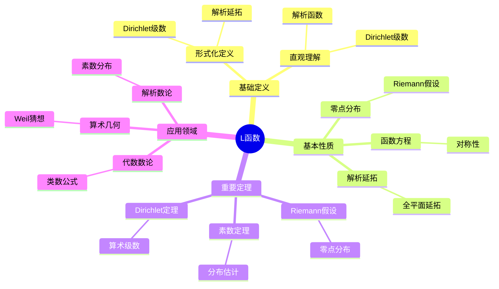

# L函数 (L-Function)

**概念编号**: C.CORE.028
**知识层次**: L0-L2
**知识领域**: D6 (数论)
**创建日期**: 2025年11月21日
**最后更新**: 2025年11月21日

---

## 📋 概述

L函数是数论中的解析函数，是研究素数分布和数论问题的核心工具。L函数理论在代数数论、解析数论、算术几何等领域有重要应用。

**权威资源对齐**:

- Wikipedia: [L-Function](https://en.wikipedia.org/wiki/L-function)
- Stanford课程: Math 256 (Algebraic Number Theory)
- Princeton课程: MAT 420 (Algebraic Number Theory)
- MIT课程: 18.785 (Number Theory I)
- Metamath: [L-Function](http://us.metamath.org/mpeuni/df-lfunction.html)

---

## 🎯 严格定义

### 基础定义 (L0)

**直观理解**: L函数是Dirichlet级数，通过解析延拓研究数论问题，特别是素数分布。

**基本定义**: L函数是形如 $L(s) = \sum_{n=1}^\infty \frac{a_n}{n^s}$ 的Dirichlet级数，其中 $a_n$ 是算术函数。

**简单例子**:

- Riemann zeta函数：$\zeta(s) = \sum_{n=1}^\infty \frac{1}{n^s}$
- Dirichlet L函数：$L(s, \chi) = \sum_{n=1}^\infty \frac{\chi(n)}{n^s}$
- Dedekind zeta函数：$\zeta_K(s) = \sum_{\mathfrak{a}} \frac{1}{N(\mathfrak{a})^s}$

### 形式化定义 (L1)

**Dirichlet级数**: Dirichlet级数定义为：

$$L(s) = \sum_{n=1}^\infty \frac{a_n}{n^s}$$

其中 $s \in \mathbb{C}$，$a_n$ 是算术函数。

**L函数**: L函数是满足以下条件的Dirichlet级数：

1. 在某个半平面上收敛
2. 可以解析延拓到整个复平面（除可能的极点）
3. 满足函数方程

**Euler乘积**: 若 $a_n$ 是乘性的，则：

$$L(s) = \prod_p \left(1 + \frac{a_p}{p^s} + \frac{a_{p^2}}{p^{2s}} + \cdots\right)$$

**记号**:

- $L(s)$: L函数
- $\zeta(s)$: Riemann zeta函数
- $L(s, \chi)$: Dirichlet L函数
- $\zeta_K(s)$: Dedekind zeta函数

---

## 📚 历史背景

### 发展脉络

**19世纪**: L函数的起源

- **Riemann (1859)**: 研究Riemann zeta函数
- **Dirichlet (1837)**: 研究Dirichlet L函数

**20世纪**: L函数理论的发展

- **Hecke (1917)**: 研究Hecke L函数
- **Artin (1923)**: 研究Artin L函数
- **Weil (1949)**: 研究Weil猜想

**20世纪后期**: L函数的现代发展

- **Langlands (1967)**: 提出Langlands纲领
- **Wiles (1994)**: 证明Fermat大定理（使用L函数）

### 关键人物

- **Bernhard Riemann (1826-1866)**: 研究Riemann zeta函数
- **Peter Dirichlet (1805-1859)**: 研究Dirichlet L函数
- **Robert Langlands (1936-)**: 提出Langlands纲领

---

## 🔍 性质与定理

### 基本性质 (L1)

**性质1: 解析延拓**:

- L函数可以解析延拓到整个复平面
- 可能有极点（如 $\zeta(s)$ 在 $s=1$）

**性质2: 函数方程**:

- L函数满足函数方程：$L(s) = \varepsilon L(1-s)$
- 函数方程连接 $s$ 和 $1-s$ 的值

**性质3: 零点分布**:

- L函数的零点分布与数论问题相关
- Riemann假设：$\zeta(s)$ 的非平凡零点在 $\text{Re}(s) = 1/2$ 上

### 重要定理 (L2)

**定理1: Riemann假设**:

- **陈述**: $\zeta(s)$ 的非平凡零点在 $\text{Re}(s) = 1/2$ 上
- **应用**: 素数分布的精确估计
- **状态**: 未解决（Millennium Prize Problem）

**定理2: 素数定理**:

- **陈述**: $\pi(x) \sim \text{Li}(x)$，其中 $\text{Li}(x) = \int_2^x \frac{dt}{\ln t}$
- **证明**: 使用 $\zeta(s)$ 的零点分布

**定理3: Dirichlet定理**:

- **陈述**: 算术级数中有无穷多个素数
- **证明**: 使用Dirichlet L函数

---

## 💡 应用实例

### 理论应用

- 解析数论（素数分布）
- 代数数论（类数公式）
- 算术几何（Weil猜想）

### 实际应用

- 密码学（素数生成）
- 算法设计（素性测试）
- 计算数论（大数分解）

---

## 🔗 关联概念

### 依赖关系

- 复数（L函数是复变函数）
- 级数（L函数是Dirichlet级数）
- 素数（L函数研究素数分布）

### 推广关系

- Riemann zeta函数（最简单的L函数）
- Dirichlet L函数（特征L函数）
- Artin L函数（Galois表示L函数）

---

## 📖 参考文献

- Wikipedia: [L-Function](https://en.wikipedia.org/wiki/L-function)
- Iwaniec, H., & Kowalski, E. (2004). *Analytic Number Theory*. American Mathematical Society.
- Neukirch, J. (1999). *Algebraic Number Theory*. Springer.

---

## 🗺️ 思维导图 (编号: C.CORE.028.MIND)

### L函数概念思维导图

---

## 📊 知识多维关系矩阵 (编号: C.CORE.028.MATRIX)

### L函数的多维关系矩阵

| 维度 | 指标 | L函数 |
|------|------|-------|
| **知识层次** | L0基础 | ⭐⭐ |
| | L1中级 | ⭐⭐⭐ |
| | L2高级 | ⭐⭐⭐⭐ |
| | L3研究 | ⭐⭐⭐⭐⭐ |
| **知识领域** | D1基础数学 | ⭐⭐ |
| | D3分析 | ⭐⭐⭐⭐ |
| | D6数论 | ⭐⭐⭐⭐⭐ |
| | D8交叉领域 | ⭐⭐⭐⭐ |
| **依赖关系** | 前置概念 | 复数、级数、素数 |
| | 后续概念 | 朗兰兹纲领、算术几何 |
| **应用关系** | 理论应用 | ⭐⭐⭐⭐⭐ |
| | 实际应用 | ⭐⭐ |
| | 交叉应用 | ⭐⭐⭐⭐ |
| **学习难度** | 直观理解 | ⭐⭐⭐⭐ |
| | 形式化理解 | ⭐⭐⭐⭐⭐ |
| | 深入应用 | ⭐⭐⭐⭐⭐ |

---

## 💭 形象化解释与论证 (编号: C.CORE.028.VISUAL)

### 形象化解释

**1. L函数的直观理解**

- **类比**: L函数就像"连接数论和分析的桥梁"或"用解析方法研究数论问题"
- **例子**:
  - Riemann zeta函数：$\zeta(s) = \sum_{n=1}^\infty \frac{1}{n^s}$，研究素数分布
  - Dirichlet L函数：$L(s, \chi) = \sum_{n=1}^\infty \frac{\chi(n)}{n^s}$，研究算术级数中的素数

**2. Euler乘积的直观理解**

- **类比**: Euler乘积就像"将级数表示为素数的乘积"
- **解释**:
  - $\zeta(s) = \prod_p \frac{1}{1-p^{-s}}$，将级数表示为所有素数的乘积
  - 这揭示了素数与级数的深刻联系

**3. Riemann假设的直观理解**

- **类比**: Riemann假设就像"L函数零点的分布规律"
- **解释**:
  - Riemann假设：$\zeta(s)$的非平凡零点在$\text{Re}(s) = 1/2$上
  - 这决定了素数的精确分布
  - 是数学中最著名的未解决问题之一

### 认知科学视角

**1. 数学教育家Dienes的观点**

- **多表征原则**: 通过级数、乘积、函数图像等多种方式理解L函数
- **变化性原则**: 通过不同的L函数例子理解L函数的本质
- **教学启示**: 使用级数计算、函数图像、零点可视化等多种方法

**2. 数学认知学家Tall的观点**

- **过程-对象对偶**: 理解"L函数构造过程"（如何定义）和"L函数"（对象）
- **认知层次**: 从直观理解（"Dirichlet级数"）到形式化理解（解析延拓、函数方程）

---

## 👨‍🏫 专家观点与论证 (编号: C.CORE.028.EXPERT)

### 数学家的观点

**1. Bernhard Riemann (1826-1866) - Riemann zeta函数的研究者**
> "Riemann zeta函数的零点分布决定了素数的分布，Riemann假设是数论的核心问题。"
>
> **意义**: Riemann建立了素数分布与zeta函数零点的联系，提出了Riemann假设。

**2. Peter Dirichlet (1805-1859) - Dirichlet L函数的研究者**
> "Dirichlet L函数是研究算术级数中素数的关键工具，Dirichlet定理揭示了素数的分布规律。"
>
> **意义**: Dirichlet建立了Dirichlet L函数，证明了Dirichlet定理。

**3. Robert Langlands (1936-) - Langlands纲领的提出者**
> "L函数是Langlands纲领的核心，它连接了数论、几何和表示论。"
>
> **意义**: Langlands提出了Langlands纲领，L函数在其中扮演核心角色。

### 数学教育家的观点

**1. Zoltan Dienes (1916-2014) - 数学教育家**
> "L函数概念应该通过级数、乘积、函数图像等多种方式学习。"
>
> **教学启示**:
>
> - 从Riemann zeta函数开始
> - 使用级数计算理解L函数
> - 通过函数图像理解零点分布

**2. Hans Freudenthal (1905-1990) - 数学教育家**
> "L函数概念的学习需要从'Dirichlet级数'发展到'解析延拓和函数方程结构'。"
>
> **认知发展**:
>
> - **级数阶段**: 理解L函数作为Dirichlet级数
> - **结构阶段**: 理解L函数作为满足函数方程的解析函数

### 数学认知学家的观点

**1. David Tall - 数学认知学家**
> "L函数概念的理解需要从'过程'（如何定义）发展到'对象'（L函数本身）。"
>
> **认知层次**:
>
> - **过程层次**: 理解"如何定义L函数"（如Dirichlet级数）
> - **对象层次**: 理解"L函数"（如$\zeta(s)$是一个L函数）

---

**创建日期**: 2025年11月21日
**最后更新**: 2025年11月21日
**维护状态**: 持续更新中
