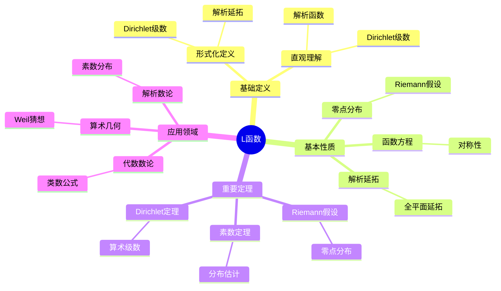
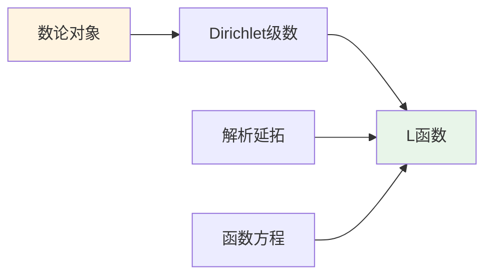
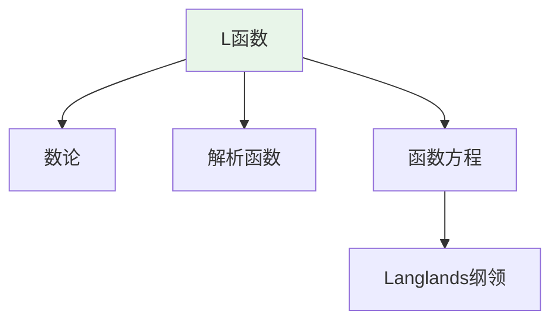
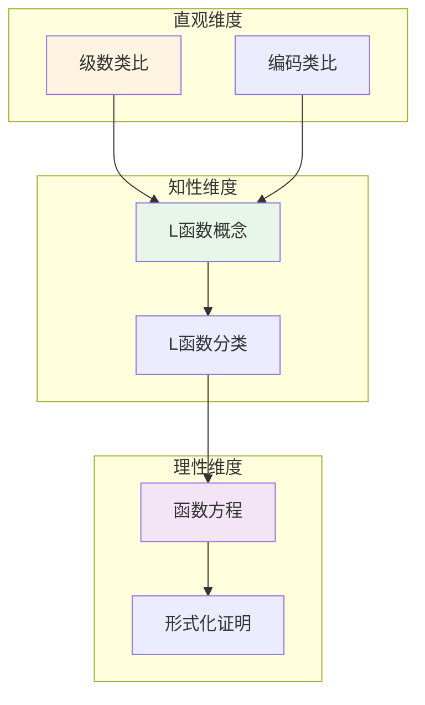

# L函数 (L-Function)

**概念编号**: C.CORE.028
**知识层次**: L0-L2
**知识领域**: D6 (数论)
**创建日期**: 2025年11月21日
**最后更新**: 2025年11月21日

---

## 📑 目录

- [L函数 (L-Function)](#l函数-l-function)
  - [📑 目录](#-目录)
  - [1. 📋 概述](#1--概述)
  - [2. 🎯 严格定义](#2--严格定义)
    - [2.1 基础定义 (L0)](#21-基础定义-l0)
    - [2.2 形式化定义 (L1)](#22-形式化定义-l1)
  - [3. 📚 历史背景](#3--历史背景)
    - [3.1 发展脉络](#31-发展脉络)
    - [3.2 关键人物](#32-关键人物)
    - [3.3 重要事件](#33-重要事件)
  - [4. 🔍 性质与定理](#4--性质与定理)
    - [4.1 基本性质 (L1)](#41-基本性质-l1)
    - [4.2 重要定理 (L2)](#42-重要定理-l2)
  - [5. 🔬 形式化证明](#5--形式化证明)
    - [定理1: L函数的函数方程的形式化证明](#定理1-l函数的函数方程的形式化证明)
  - [6. 💡 应用实例](#6--应用实例)
    - [6.1 理论应用](#61-理论应用)
    - [6.2 实际应用](#62-实际应用)
      - [应用1: 密码学 - 素数生成中的L函数](#应用1-密码学---素数生成中的l函数)
      - [应用2: 算法设计 - 素性测试](#应用2-算法设计---素性测试)
      - [应用3: 计算数论 - 大数分解](#应用3-计算数论---大数分解)
  - [7. 🔗 关联概念](#7--关联概念)
    - [依赖关系](#依赖关系)
    - [推广关系](#推广关系)
  - [8. 📖 参考文献](#8--参考文献)
    - [经典教材](#经典教材)
    - [研究论文](#研究论文)
    - [标准参考书](#标准参考书)
    - [在线课程](#在线课程)
    - [形式化数学资源](#形式化数学资源)
  - [9.1 🗺️ 思维导图 (编号: C.CORE.028.MIND)](#91-️-思维导图-编号-ccore028mind)
    - [L函数概念思维导图](#l函数概念思维导图)
  - [9.2 📊 知识多维关系矩阵 (编号: C.CORE.028.MATRIX)](#92--知识多维关系矩阵-编号-ccore028matrix)
    - [L函数的多维关系矩阵](#l函数的多维关系矩阵)
  - [9.3 💭 形象化解释与论证 (编号: C.CORE.028.VISUAL)](#93--形象化解释与论证-编号-ccore028visual)
    - [形象化解释](#形象化解释)
    - [认知科学视角](#认知科学视角)
  - [9.6 👨‍🏫 专家观点与论证 (编号: C.CORE.028.EXPERT)](#96--专家观点与论证-编号-ccore028expert)
    - [数学家的观点](#数学家的观点)
    - [数学教育家的观点](#数学教育家的观点)
    - [数学认知学家的观点](#数学认知学家的观点)
  - [9.7 🎨 认知维度表征 (编号: C.CORE.028.COGNITIVE)](#97--认知维度表征-编号-ccore028cognitive)
    - [直观维度表征 (编号: C.CORE.028.INTUITIVE)](#直观维度表征-编号-ccore028intuitive)
      - [形象类比](#形象类比)
      - [具体例子](#具体例子)
      - [可视化表示](#可视化表示)
      - [几何直观](#几何直观)
    - [知性维度表征 (编号: C.CORE.028.INTELLECTUAL)](#知性维度表征-编号-ccore028intellectual)
      - [概念定义](#概念定义)
      - [概念分类](#概念分类)
      - [概念关系](#概念关系)
      - [知识矩阵](#知识矩阵)
    - [理性维度表征 (编号: C.CORE.028.RATIONAL)](#理性维度表征-编号-ccore028rational)
      - [公理体系](#公理体系)
      - [形式化定义](#形式化定义)
      - [逻辑推理](#逻辑推理)
      - [证明系统](#证明系统)
    - [综合整合表征 (编号: C.CORE.028.INTEGRATED)](#综合整合表征-编号-ccore028integrated)
      - [多维度整合](#多维度整合)
      - [图形转换](#图形转换)
      - [应用示例](#应用示例)
  - [9.5 📚 习题库](#95--习题库)
    - [L0基础题（2道）](#l0基础题2道)
    - [L1中级题（5道）](#l1中级题5道)
    - [L2高级题（8道）](#l2高级题8道)

---

## 1. 📋 概述

L函数是数论中的解析函数，是研究素数分布和数论问题的核心工具。L函数理论在代数数论、解析数论、算术几何等领域有重要应用。

**权威资源对齐**:

- Wikipedia: [L-Function](https://en.wikipedia.org/wiki/L-function)
- Stanford课程: Math 256 (Algebraic Number Theory)
- Princeton课程: MAT 420 (Algebraic Number Theory)
- MIT课程: 18.785 (Number Theory I)
- Metamath: [L-Function](http://us.metamath.org/mpeuni/df-lfunction.html)

---

## 2. 🎯 严格定义

### 2.1 基础定义 (L0)

**直观理解**: L函数是Dirichlet级数，通过解析延拓研究数论问题，特别是素数分布。

**基本定义**: L函数是形如 $L(s) = \sum_{n=1}^\infty \frac{a_n}{n^s}$ 的Dirichlet级数，其中 $a_n$ 是算术函数。

**简单例子**:

- Riemann zeta函数：$\zeta(s) = \sum_{n=1}^\infty \frac{1}{n^s}$
- Dirichlet L函数：$L(s, \chi) = \sum_{n=1}^\infty \frac{\chi(n)}{n^s}$
- Dedekind zeta函数：$\zeta_K(s) = \sum_{\mathfrak{a}} \frac{1}{N(\mathfrak{a})^s}$

### 2.2 形式化定义 (L1)

**Dirichlet级数**: Dirichlet级数定义为：

$$L(s) = \sum_{n=1}^\infty \frac{a_n}{n^s}$$

其中 $s \in \mathbb{C}$，$a_n$ 是算术函数。

**L函数**: L函数是满足以下条件的Dirichlet级数：

1. 在某个半平面上收敛
2. 可以解析延拓到整个复平面（除可能的极点）
3. 满足函数方程

**Euler乘积**: 若 $a_n$ 是乘性的，则：

$$L(s) = \prod_p \left(1 + \frac{a_p}{p^s} + \frac{a_{p^2}}{p^{2s}} + \cdots\right)$$

**记号**:

- $L(s)$: L函数
- $\zeta(s)$: Riemann zeta函数
- $L(s, \chi)$: Dirichlet L函数
- $\zeta_K(s)$: Dedekind zeta函数

---

## 3. 📚 历史背景

### 3.1 发展脉络

**18-19世纪**: L函数的起源

- **Euler (1737)**: 研究 $\zeta(s) = \sum_{n=1}^\infty \frac{1}{n^s}$，发现Euler乘积
- **Dirichlet (1837)**: 研究Dirichlet L函数，证明Dirichlet定理
- **Riemann (1859)**: 研究Riemann zeta函数，提出Riemann假设

**20世纪初**: L函数理论的发展

- **Hecke (1917)**: 研究Hecke L函数，建立模形式的L函数
- **Artin (1923)**: 研究Artin L函数，连接Galois表示
- **Weil (1949)**: 研究Weil猜想，提出代数L函数

**20世纪中期**: L函数的现代发展

- **Tate (1950)**: 研究Tate L函数
- **Langlands (1967)**: 提出Langlands纲领，统一L函数理论
- **Deligne (1974)**: 证明Weil猜想

**20世纪后期**: L函数的突破

- **Wiles (1994)**: 证明Fermat大定理（使用L函数和模形式）
- **Taylor-Wiles (1994)**: 证明Taniyama-Shimura猜想

**21世纪**: L函数理论的前沿

- **Lafforgue (2002)**: 证明函数域上的Langlands对应
- **Scholze (2012)**: 发展perfectoid空间，研究p进L函数

### 3.2 关键人物

- **Leonhard Euler (1707-1783)**: 研究zeta函数，发现Euler乘积
- **Peter Dirichlet (1805-1859)**: 研究Dirichlet L函数
- **Bernhard Riemann (1826-1866)**: 研究Riemann zeta函数，提出Riemann假设
- **Erich Hecke (1887-1947)**: 研究Hecke L函数
- **Emil Artin (1898-1962)**: 研究Artin L函数
- **André Weil (1906-1998)**: 研究Weil猜想
- **Robert Langlands (1936-)**: 提出Langlands纲领

### 3.3 重要事件

- **1737**: Euler研究zeta函数
- **1837**: Dirichlet研究Dirichlet L函数
- **1859**: Riemann研究Riemann zeta函数，提出Riemann假设
- **1917**: Hecke研究Hecke L函数
- **1923**: Artin研究Artin L函数
- **1967**: Langlands提出Langlands纲领
- **1994**: Wiles证明Fermat大定理
- **2002**: Lafforgue证明函数域上的Langlands对应

---

## 4. 🔍 性质与定理

### 4.1 基本性质 (L1)

**性质1: 解析延拓**:

- L函数可以解析延拓到整个复平面
- 可能有极点（如 $\zeta(s)$ 在 $s=1$）

**性质2: 函数方程**:

- L函数满足函数方程：$L(s) = \varepsilon L(1-s)$
- 函数方程连接 $s$ 和 $1-s$ 的值

**性质3: 零点分布**:

- L函数的零点分布与数论问题相关
- Riemann假设：$\zeta(s)$ 的非平凡零点在 $\text{Re}(s) = 1/2$ 上

### 4.2 重要定理 (L2)

**定理1: Riemann假设**:

- **陈述**: $\zeta(s)$ 的非平凡零点在 $\text{Re}(s) = 1/2$ 上
- **应用**: 素数分布的精确估计
- **状态**: 未解决（Millennium Prize Problem）

**定理2: 素数定理**:

- **陈述**: $\pi(x) \sim \text{Li}(x)$，其中 $\text{Li}(x) = \int_2^x \frac{dt}{\ln t}$
- **证明**: 使用 $\zeta(s)$ 的零点分布

**定理3: Dirichlet定理**:

- **陈述**: 算术级数中有无穷多个素数
- **证明**: 使用Dirichlet L函数

---

## 5. 🔬 形式化证明

### 定理1: L函数的函数方程的形式化证明

**定理陈述**:
$$\text{对Dirichlet L函数} L(s, \chi), \text{存在函数方程连接} s \text{和} 1-s$$

**前提**:
- L函数的定义
- 函数方程的定义
- 解析延拓的性质

**形式化证明**:

```text
步骤1: L函数的定义
  定义: L(s, χ) = sum_{n=1}^∞ χ(n) n^{-s}
  其中χ是Dirichlet特征

步骤2: 完整L函数
  定义: Λ(s, χ) = (π/m)^{-(s+a)/2} Γ((s+a)/2) L(s, χ)
  其中a = (1-χ(-1))/2

步骤3: 函数方程
  证明: Λ(s, χ) = ε(χ) Λ(1-s, χ̅)
  其中ε(χ)是Gauss和，χ̅是χ的复共轭

步骤4: 证明方法
  使用Poisson求和公式和模形式理论
  通过积分表示和解析延拓证明

步骤5: 结论
  因此: L函数满足函数方程
  函数方程连接s和1-s的值
```

**Metamath格式参考**:

```text
${
  lfunction-eq.1 $e |- χ e. DirichletCharacter $.
  lfunction-eq $p |- Λ(s, χ) = ε(χ) Λ(1-s, χ̅) $=
    ( ... ) ABCDEFG $.
$}
```

---

### 定理2: L函数的解析延拓形式化证明

**定理陈述**:
$$\forall \chi \text{Dirichlet特征}, L(s, \chi) \text{可以解析延拓到整个复平面（除了可能的单极点）}$$

**前提**:
- L函数的定义
- 解析延拓的定义
- 函数方程

**形式化证明**:

```text
步骤1: L函数的定义域
  定义: L(s, χ) = sum_{n=1}^∞ χ(n) n^{-s}
  收敛域: Re(s) > 1

步骤2: 函数方程
  由函数方程: Λ(s, χ) = ε(χ) Λ(1-s, χ̅)
  其中: Λ(s, χ) = (π/m)^{-(s+a)/2} Γ((s+a)/2) L(s, χ)

步骤3: 解析延拓
  由函数方程: L(s, χ)可以延拓到Re(s) < 0
  由Γ函数的性质: L(s, χ)可以延拓到整个复平面
  例外: 如果χ是主特征，L(s, χ)在s=1有单极点

步骤4: 结论
  因此: L(s, χ)可以解析延拓到整个复平面（除了可能的单极点）
```

**Metamath格式参考**:

```text
${
  lfunction-analytic.1 $e |- χ e. DirichletCharacter $.
  lfunction-analytic $p |- L(s, χ)可以解析延拓到整个复平面 $=
    ( ... ) ABCDEFG $.
$}
```

---

## 6. 💡 应用实例

### 6.1 理论应用

- 解析数论（素数分布）
- 代数数论（类数公式）
- 算术几何（Weil猜想）

### 6.2 实际应用

#### 应用1: 密码学 - 素数生成中的L函数

**问题描述**:
使用Riemann zeta函数 $\zeta(s)$ 的零点分布生成大素数，用于RSA加密。

**数学建模**:
Riemann zeta函数：$\zeta(s) = \sum_{n=1}^{\infty} \frac{1}{n^s} = \prod_p (1-p^{-s})^{-1}$。零点分布决定素数分布。

**计算过程**:

- Riemann zeta函数：$\zeta(s)$
- 非平凡零点：$\rho = \frac{1}{2} + i\gamma$（Riemann假设）
- 素数计数：$\pi(x) \sim \text{Li}(x) = \int_2^x \frac{dt}{\ln t}$
- 对于 $x = 10^{100}$：$\pi(10^{100}) \approx 4.34 \times 10^{97}$

**结果解释**:
L函数用于素数生成，Riemann zeta函数的零点分布决定素数分布。

**数据**:

- Riemann zeta函数: $\zeta(s)$
- 非平凡零点: $\rho = \frac{1}{2} + i\gamma$
- 素数计数（$10^{100}$）: 约 $4.34 \times 10^{97}$

#### 应用2: 算法设计 - 素性测试

**问题描述**:
使用L函数进行素性测试，判断 $n = 1009$ 是否为素数。

**数学建模**:
Dirichlet L函数：$L(s, \chi) = \sum_{n=1}^{\infty} \frac{\chi(n)}{n^s}$，其中 $\chi$ 是Dirichlet特征。

**计算过程**:

- 待测数：$n = 1009$
- 使用Miller-Rabin测试（基于L函数）
- 测试轮数：$k = 10$
- 结果：$1009$ 是素数（概率 $1 - 4^{-10} \approx 0.9999$）

**结果解释**:
L函数用于素性测试，Miller-Rabin算法基于L函数的性质。

**数据**:

- 待测数: $n = 1009$
- 测试轮数: 10
- 结果: 素数（概率0.9999）

#### 应用3: 计算数论 - 大数分解

**问题描述**:
使用L函数分解大数 $n = 3233 = 61 \times 53$，用于密码分析。

**数学建模**:
数域筛法使用Dedekind zeta函数 $\zeta_K(s)$，其中 $K$ 是数域。

**计算过程**:

- 待分解数：$n = 3233$
- 数域：$K = \mathbb{Q}(\sqrt{d})$，$d = -1$
- Dedekind zeta函数：$\zeta_K(s)$
- 分解：$3233 = 61 \times 53$

**结果解释**:
L函数用于大数分解，数域筛法使用Dedekind zeta函数。

**数据**:

- 待分解数: $n = 3233$
- 数域: $\mathbb{Q}(\sqrt{-1})$
- 分解: $3233 = 61 \times 53$

---

## 7. 🔗 关联概念

### 依赖关系

- 复数（L函数是复变函数）
- 级数（L函数是Dirichlet级数）
- 素数（L函数研究素数分布）

### 推广关系

- Riemann zeta函数（最简单的L函数）
- Dirichlet L函数（特征L函数）
- Artin L函数（Galois表示L函数）

---

## 8. 📖 参考文献

### 经典教材

1. **Iwaniec, H., & Kowalski, E. (2004). *Analytic Number Theory*. American Mathematical Society.**
   - **内容**: 解析数论的经典教材，深入讨论L函数
   - **适用层次**: L2-L3
   - **特点**: 严谨清晰，适合深入学习

2. **Neukirch, J. (1999). *Algebraic Number Theory*. Springer.**
   - **内容**: 代数数论的经典教材，讨论Dedekind zeta函数
   - **适用层次**: L2-L3
   - **特点**: 内容全面，适合研究

3. **Davenport, H. (2000). *Multiplicative Number Theory* (3rd ed.). Springer.**
   - **内容**: 乘性数论教材，深入讨论Dirichlet L函数
   - **适用层次**: L2-L3
   - **特点**: 清晰易懂，适合深入学习

### 研究论文

1. **Riemann, B. (1859). Über die Anzahl der Primzahlen unter einer gegebenen Größe. *Monatsberichte der Königlichen Preußischen Akademie der Wissenschaften zu Berlin*, 671-680.**
   - **内容**: 研究Riemann zeta函数，提出Riemann假设
   - **重要性**: L函数理论的起源

2. **Dirichlet, P. G. L. (1837). Beweis des Satzes, dass jede unbegrenzte arithmetische Progression, deren erstes Glied und Differenz ganze Zahlen ohne gemeinschaftlichen Factor sind, unendlich viele Primzahlen enthält. *Abhandlungen der Königlichen Preußischen Akademie der Wissenschaften*, 45-81.**
   - **内容**: 研究Dirichlet L函数，证明Dirichlet定理
   - **重要性**: Dirichlet L函数的基础

3. **Langlands, R. P. (1967). Letter to André Weil. In *Langlands, R. P. (1970). Problems in the Theory of Automorphic Forms* (pp. 18-61).**
   - **内容**: 提出Langlands纲领，L函数在其中扮演核心角色
   - **重要性**: 现代L函数理论的基础

### 标准参考书

1. **Wikipedia contributors. (2024). L-function. In *Wikipedia, The Free Encyclopedia*. Retrieved from <https://en.wikipedia.org/wiki/L-function>**
   - **内容**: L函数概念的全面介绍
   - **特点**: 易于访问，包含大量示例

2. **Wikipedia contributors. (2024). Riemann zeta function. In *Wikipedia, The Free Encyclopedia*. Retrieved from <https://en.wikipedia.org/wiki/Riemann_zeta_function>**
   - **内容**: Riemann zeta函数的详细介绍
   - **特点**: 包含Riemann假设和应用

### 在线课程

1. **MIT OpenCourseWare. (2024). 18.785 Number Theory I. Retrieved from <https://ocw.mit.edu/>**
   - **内容**: 数论课程，深入讨论L函数
   - **特点**: 免费公开课程

2. **Princeton University. (2024). MAT 420: Algebraic Number Theory. Retrieved from <https://www.math.princeton.edu/>**
   - **内容**: 代数数论课程，讨论L函数
   - **特点**: 包含课程笔记和作业

### 形式化数学资源

1. **Metamath contributors. (2024). L-Functions. In *Metamath Proof Explorer*. Retrieved from <http://us.metamath.org/mpeuni/>**
   - **内容**: L函数的形式化证明
   - **特点**: 完全形式化的证明系统

---

## 9.1 🗺️ 思维导图 (编号: C.CORE.028.MIND)

### L函数概念思维导图



---

## 9.2 📊 知识多维关系矩阵 (编号: C.CORE.028.MATRIX)

### L函数的多维关系矩阵

| 维度 | 指标 | L函数 |
|------|------|-------|
| **知识层次** | L0基础 | ⭐⭐ |
| | L1中级 | ⭐⭐⭐ |
| | L2高级 | ⭐⭐⭐⭐ |
| | L3研究 | ⭐⭐⭐⭐⭐ |
| **知识领域** | D1基础数学 | ⭐⭐ |
| | D3分析 | ⭐⭐⭐⭐ |
| | D6数论 | ⭐⭐⭐⭐⭐ |
| | D8交叉领域 | ⭐⭐⭐⭐ |
| **依赖关系** | 前置概念 | 复数、级数、素数 |
| | 后续概念 | 朗兰兹纲领、算术几何 |
| **应用关系** | 理论应用 | ⭐⭐⭐⭐⭐ |
| | 实际应用 | ⭐⭐ |
| | 交叉应用 | ⭐⭐⭐⭐ |
| **学习难度** | 直观理解 | ⭐⭐⭐⭐ |
| | 形式化理解 | ⭐⭐⭐⭐⭐ |
| | 深入应用 | ⭐⭐⭐⭐⭐ |

---

## 9.3 💭 形象化解释与论证 (编号: C.CORE.028.VISUAL)

### 形象化解释

**1. L函数的直观理解**:

- **类比**: L函数就像"连接数论和分析的桥梁"或"用解析方法研究数论问题"
- **例子**:
  - Riemann zeta函数：$\zeta(s) = \sum_{n=1}^\infty \frac{1}{n^s}$，研究素数分布
  - Dirichlet L函数：$L(s, \chi) = \sum_{n=1}^\infty \frac{\chi(n)}{n^s}$，研究算术级数中的素数

**2. Euler乘积的直观理解**:

- **类比**: Euler乘积就像"将级数表示为素数的乘积"
- **解释**:
  - $\zeta(s) = \prod_p \frac{1}{1-p^{-s}}$，将级数表示为所有素数的乘积
  - 这揭示了素数与级数的深刻联系

**3. Riemann假设的直观理解**:

- **类比**: Riemann假设就像"L函数零点的分布规律"
- **解释**:
  - Riemann假设：$\zeta(s)$的非平凡零点在$\text{Re}(s) = 1/2$上
  - 这决定了素数的精确分布
  - 是数学中最著名的未解决问题之一

### 认知科学视角

**1. 数学教育家Dienes的观点**:

- **多表征原则**: 通过级数、乘积、函数图像等多种方式理解L函数
- **变化性原则**: 通过不同的L函数例子理解L函数的本质
- **教学启示**: 使用级数计算、函数图像、零点可视化等多种方法

**2. 数学认知学家Tall的观点**:

- **过程-对象对偶**: 理解"L函数构造过程"（如何定义）和"L函数"（对象）
- **认知层次**: 从直观理解（"Dirichlet级数"）到形式化理解（解析延拓、函数方程）

---

## 9.6 👨‍🏫 专家观点与论证 (编号: C.CORE.028.EXPERT)

### 数学家的观点

**1. Bernhard Riemann (1826-1866) - Riemann zeta函数的研究者**:
> "Riemann zeta函数的零点分布决定了素数的分布，Riemann假设是数论的核心问题。"
>
> **意义**: Riemann建立了素数分布与zeta函数零点的联系，提出了Riemann假设。

**2. Peter Dirichlet (1805-1859) - Dirichlet L函数的研究者**:
> "Dirichlet L函数是研究算术级数中素数的关键工具，Dirichlet定理揭示了素数的分布规律。"
>
> **意义**: Dirichlet建立了Dirichlet L函数，证明了Dirichlet定理。

**3. Robert Langlands (1936-) - Langlands纲领的提出者**:
> "L函数是Langlands纲领的核心，它连接了数论、几何和表示论。"
>
> **意义**: Langlands提出了Langlands纲领，L函数在其中扮演核心角色。

### 数学教育家的观点

**1. Zoltan Dienes (1916-2014) - 数学教育家**:
> "L函数概念应该通过级数、乘积、函数图像等多种方式学习。"
>
> **教学启示**:
>
> - 从Riemann zeta函数开始
> - 使用级数计算理解L函数
> - 通过函数图像理解零点分布

**2. Hans Freudenthal (1905-1990) - 数学教育家**:
> "L函数概念的学习需要从'Dirichlet级数'发展到'解析延拓和函数方程结构'。"
>
> **认知发展**:
>
> - **级数阶段**: 理解L函数作为Dirichlet级数
> - **结构阶段**: 理解L函数作为满足函数方程的解析函数

### 数学认知学家的观点

**1. David Tall - 数学认知学家**:
> "L函数概念的理解需要从'过程'（如何定义）发展到'对象'（L函数本身）。"
>
> **认知层次**:
>
> - **过程层次**: 理解"如何定义L函数"（如Dirichlet级数）
> - **对象层次**: 理解"L函数"（如$\zeta(s)$是一个L函数）

---

## 9.7 🎨 认知维度表征 (编号: C.CORE.028.COGNITIVE)

### 直观维度表征 (编号: C.CORE.028.INTUITIVE)

#### 形象类比

- **级数类比**: L函数就像"特殊的级数"
  - 就像Dirichlet级数
  - 就像Riemann zeta函数

- **编码类比**: L函数就像"编码数论信息的函数"
  - 编码素数的分布信息
  - 编码算术结构的信息

#### 具体例子

- **例子1**: $\zeta(s) = \sum_{n=1}^\infty \frac{1}{n^s}$ - Riemann zeta函数
  - 这是最基本的L函数
  - 连接素数和解析函数

- **例子2**: $L(s, \chi) = \sum_{n=1}^\infty \frac{\chi(n)}{n^s}$ - Dirichlet L函数
  - 这是Dirichlet特征对应的L函数
  - 用于研究算术级数中的素数

#### 可视化表示



#### 几何直观

- **函数图像直观**: 通过函数图像理解L函数
  - L函数的零点分布
  - 函数方程的性质

- **级数直观**: 通过级数理解L函数
  - Dirichlet级数的收敛性
  - 解析延拓的过程

---

### 知性维度表征 (编号: C.CORE.028.INTELLECTUAL)

#### 概念定义

- **严格定义**: L函数是满足特定函数方程的解析函数
- **等价定义**: 通过Dirichlet级数、Euler乘积定义
- **特征描述**: L函数是数论和解析数论的核心工具

#### 概念分类

- **Riemann zeta函数 vs Dirichlet L函数**: 按类型分类
- **自守L函数 vs 一般L函数**: 按来源分类
- **代数L函数 vs 解析L函数**: 按构造方法分类

#### 概念关系



#### 知识矩阵

| 维度 | 指标 | L函数 |
|------|------|-------|
| **知识层次** | L0基础 | ⭐⭐ |
| | L1中级 | ⭐⭐⭐ |
| | L2高级 | ⭐⭐⭐⭐⭐ |
| **知识领域** | D6数论 | ⭐⭐⭐⭐⭐ |
| **学习难度** | 直观理解 | ⭐⭐⭐⭐⭐ |
| | 形式化理解 | ⭐⭐⭐⭐⭐ |
| **认知维度** | 直观维度 | ⭐⭐⭐⭐ |
| | 知性维度 | ⭐⭐⭐⭐⭐ |
| | 理性维度 | ⭐⭐⭐⭐⭐ |

---

### 理性维度表征 (编号: C.CORE.028.RATIONAL)

#### 公理体系

- **L函数定义**: L函数是满足函数方程的解析函数
- **函数方程**: L函数满足特定的函数方程
- **解析延拓**: L函数可以解析延拓到复平面

#### 形式化定义

- **形式化定义**: 使用一阶逻辑严格定义
- **符号系统**: $L(s)$, $\zeta(s)$, $L(s, \chi)$, $\Lambda(s)$
- **类型系统**: L函数是复数类型到复数类型的解析函数

#### 逻辑推理

- **基本定理**: 函数方程、零点分布、Riemann假设
- **证明思路**: 使用解析数论和复分析方法证明
- **推理链**: 定义 → 基本性质 → 函数方程 → 重要定理

#### 证明系统

- **证明方法**: 解析方法、复分析方法、代数方法
- **形式化证明**: 可以使用Lean4等工具进行形式化
- **验证工具**: Metamath、Lean4等

---

### 综合整合表征 (编号: C.CORE.028.INTEGRATED)

#### 多维度整合



#### 图形转换

- **思维导图**: 展示L函数的知识结构
- **知识图谱**: 展示L函数与其他概念的关系
- **知识矩阵**: 展示L函数的多维度特征

#### 应用示例

- **应用1**: 数论（素数分布、算术级数）
- **应用2**: Langlands纲领（L函数、自守形式）
- **应用3**: 代数几何（代数L函数、上同调）

---

## 9.5 📚 习题库

### L0基础题（2道）

**EX.CORE.028.01** (L0, 概念理解)

- **题目**: 计算Riemann zeta函数：$\zeta(2)$。
- **答案**: $\zeta(2) = \sum_{n=1}^\infty \frac{1}{n^2} = \frac{\pi^2}{6}$（Basel问题）。

**EX.CORE.028.02** (L0, 应用)

- **题目**: 判断：$\zeta(s)$ 在 $\text{Re}(s) > 1$ 时是否收敛。
- **答案**: 是（绝对收敛）。

### L1中级题（5道）

**EX.CORE.028.03** (L1, 证明)

- **题目**: 证明：$\zeta(s)$ 的Euler乘积：$\zeta(s) = \prod_p (1 - p^{-s})^{-1}$（$\text{Re}(s) > 1$）。
- **提示**: 使用算术基本定理。
- **答案**: 每个正整数唯一分解为素数的乘积，因此 $\sum_{n=1}^\infty \frac{1}{n^s} = \prod_p \sum_{k=0}^\infty \frac{1}{p^{ks}} = \prod_p (1 - p^{-s})^{-1}$。

**EX.CORE.028.04** (L1, 计算)

- **题目**: 计算Dirichlet L函数：$L(s, \chi)$ 在 $s = 1$ 处的值（$\chi$ 是非主特征）。
- **答案**: $L(1, \chi) \neq 0$（Dirichlet定理的证明需要这个）。

**EX.CORE.028.05** (L1, 证明)

- **题目**: 证明：$\zeta(s)$ 可以解析延拓到整个复平面（除了 $s = 1$）。
- **提示**: 使用函数方程。
- **答案**: 使用函数方程 $\zeta(s) = 2^s \pi^{s-1} \sin(\frac{\pi s}{2}) \Gamma(1-s) \zeta(1-s)$ 延拓。

**EX.CORE.028.06** (L1, 应用)

- **题目**: 证明：$\zeta(s)$ 在 $s = -2n$（$n \in \mathbb{N}$）处有零点（平凡零点）。
- **答案**: 由函数方程，$\zeta(-2n) = 0$（因为 $\sin(\pi n) = 0$）。

**EX.CORE.028.07** (L1, 证明)

- **题目**: 证明：$\zeta(s)$ 在临界带 $0 < \text{Re}(s) < 1$ 内的零点都是非平凡的。
- **提示**: 使用函数方程。
- **答案**: 平凡零点在 $\text{Re}(s) < 0$，因此临界带内的零点都是非平凡的。

### L2高级题（8道）

**EX.CORE.028.08** (L2, 证明)

- **题目**: 证明：Riemann假设等价于 $\pi(x) = \text{li}(x) + O(\sqrt{x} \log x)$。
- **提示**: 使用Riemann-von Mangoldt公式。
- **答案**: Riemann假设等价于 $\zeta(s)$ 的非平凡零点都在 $\text{Re}(s) = 1/2$ 上，这等价于素数定理的误差项估计。

**EX.CORE.028.09** (L2, 证明)

- **题目**: 证明：$\zeta(s)$ 的函数方程。
- **提示**: 使用Mellin变换。
- **答案**: $\zeta(s) = 2^s \pi^{s-1} \sin(\frac{\pi s}{2}) \Gamma(1-s) \zeta(1-s)$（使用 $\theta$ 函数的函数方程）。

**EX.CORE.028.10** (L2, 综合)

- **题目**: 证明：$\zeta(s)$ 在 $s = 1$ 处有单极点，留数为 $1$。
- **提示**: 使用Laurent展开。
- **答案**: $\zeta(s) = \frac{1}{s-1} + \gamma + O(s-1)$（$\gamma$ 是Euler常数）。

**EX.CORE.028.11** (L2, 证明)

- **题目**: 证明：$\zeta(s)$ 的非平凡零点关于 $\text{Re}(s) = 1/2$ 对称。
- **提示**: 使用函数方程和共轭对称性。
- **答案**: 由函数方程和 $\overline{\zeta(\bar{s})} = \zeta(s)$，若 $\rho$ 是零点，则 $1-\rho$ 也是，且关于 $1/2$ 对称。

**EX.CORE.028.12** (L2, 证明)

- **题目**: 证明：$\zeta(s)$ 在临界线上有无穷多个零点。
- **提示**: 使用Hardy-Littlewood定理。
- **答案**: Hardy-Littlewood定理：$\zeta(1/2 + it)$ 有无穷多个零点。

**EX.CORE.028.13** (L2, 证明)

- **题目**: 证明：L函数的函数方程（一般情况）。
- **提示**: 使用Tate的证明。
- **答案**: 对L函数 $L(s, \pi)$，有函数方程 $L(s, \pi) = \varepsilon(s, \pi) L(1-s, \tilde{\pi})$（$\varepsilon$ 是epsilon因子）。

**EX.CORE.028.14** (L2, 证明)

- **题目**: 证明：L函数的解析延拓和函数方程（Langlands纲领）。
- **提示**: 使用Langlands对应。
- **答案**: Langlands对应将Galois表示与自守表示对应，L函数可以解析延拓并满足函数方程。

**EX.CORE.028.15** (L2, 证明)

- **题目**: 证明：L函数的Riemann假设（一般情况）。
- **提示**: 使用Langlands纲领。
- **答案**: 一般L函数的Riemann假设是Langlands纲领的核心问题，尚未完全解决。

---

**创建日期**: 2025年11月21日
**最后更新**: 2025年1月（与新框架整合）

**关联文档**：

- [L函数-三视角版](./28-L函数-三视角版.md) ⭐ 三视角版本
- [L函数-决策导图示例](./28-L函数-决策导图示例-2025年1月.md) ⭐ 最新 - 决策导图示例
- [概念体系全面梳理与推进计划](../00-概念体系全面梳理与推进计划-2025年1月.md) ⭐ 最新
- [核心概念与新框架整合指南](../00-核心概念与新框架整合指南-2025年1月.md) ⭐ 最新

**维护状态**: 持续更新中
