---
msc_primary: "00A99"
---

# L函数 (L-Function) - 三视角组织版

**概念编号**: C.CORE.028
**知识层次**: L0-L2
**知识领域**: D6 (数论)
**创建日期**: 2025年1月
**最后更新**: 2026-04-05

---

## 📋 目录 / Table of Contents

- [L函数 (L-Function) - 三视角组织版](#l函数-l-function---三视角组织版)
  - 📋 目录 / Table of Contents
  - 1. 📋 概述 (编号: C.CORE.028.01)
  - [🧠 认知学视角：如何理解L函数 (编号: C.CORE.028.02)](#认知学视角如何理解l函数-编号-ccore02802)
    - [认知起点 (编号: C.CORE.028.02.01)](#认知起点-编号-ccore0280201)
    - [认知过程 (编号: C.CORE.028.02.02)](#认知过程-编号-ccore0280202)
      - [阶段1：直观理解阶段 (编号: C.CORE.028.02.02.01)](#阶段1直观理解阶段-编号-ccore028020201)
      - [阶段2：概念形成阶段 (编号: C.CORE.028.02.02.02)](#阶段2概念形成阶段-编号-ccore028020202)
      - [阶段3：形式化阶段 (编号: C.CORE.028.02.02.03)](#阶段3形式化阶段-编号-ccore028020203)

## 形式化定义

**定义（Dirichlet L-函数）**：对Dirichlet特征 $\chi$，**Dirichlet L-函数**定义为：
$$L(s, \chi) = \sum_{n=1}^\infty \frac{\chi(n)}{n^s} = \prod_p \frac{1}{1 - \chi(p)p^{-s}}$$
其中 $\text{Re}(s) > 1$

**定义（Riemann zeta函数）**：
$$\zeta(s) = \sum_{n=1}^\infty \frac{1}{n^s} = \prod_p \frac{1}{1 - p^{-s}}$$

**解析延拓**：L-函数可解析延拓到复平面（除 $s=1$ 外）

**符号说明**：
- $L(s, \chi)$：Dirichlet L-函数
- $\zeta(s)$：Riemann zeta函数
- $\chi$：Dirichlet特征
- $\text{Re}(s), \text{Im}(s)$：实部和虚部

    - [认知障碍 (编号: C.CORE.028.02.03)](#认知障碍-编号-ccore0280203)
    - [认知工具 (编号: C.CORE.028.02.04)](#认知工具-编号-ccore0280204)
  - [🎓 教育学视角：如何教学L函数 (编号: C.CORE.028.03)](#教育学视角如何教学l函数-编号-ccore02803)
    - [教学目标 (编号: C.CORE.028.03.01)](#教学目标-编号-ccore0280301)
    - [教学路径 (编号: C.CORE.028.03.02)](#教学路径-编号-ccore0280302)
      - [阶段1：引入阶段（激发兴趣） (编号: C.CORE.028.03.02.01)](#阶段1引入阶段激发兴趣-编号-ccore028030201)
      - [阶段2：探索阶段（主动建构） (编号: C.CORE.028.03.02.02)](#阶段2探索阶段主动建构-编号-ccore028030202)
      - [阶段3：形式化阶段（抽象概括） (编号: C.CORE.028.03.02.03)](#阶段3形式化阶段抽象概括-编号-ccore028030203)
      - [阶段4：巩固阶段（应用深化） (编号: C.CORE.028.03.02.04)](#阶段4巩固阶段应用深化-编号-ccore028030204)
    - [教学难点 (编号: C.CORE.028.03.03)](#教学难点-编号-ccore0280303)
    - [教学策略 (编号: C.CORE.028.03.04)](#教学策略-编号-ccore0280304)
    - [评估方法 (编号: C.CORE.028.03.05)](#评估方法-编号-ccore0280305)
  - [🔬 数学家视角：如何思考L函数 (编号: C.CORE.028.04)](#数学家视角如何思考l函数-编号-ccore02804)
    - [问题起源 (编号: C.CORE.028.04.01)](#问题起源-编号-ccore0280401)
    - [思维过程 (编号: C.CORE.028.04.02)](#思维过程-编号-ccore0280402)
      - [步骤1：问题提出 (编号: C.CORE.028.04.02.01)](#步骤1问题提出-编号-ccore028040201)
      - [步骤2：概念形成 (编号: C.CORE.028.04.02.02)](#步骤2概念形成-编号-ccore028040202)
      - [步骤3：理论发展 (编号: C.CORE.028.04.02.03)](#步骤3理论发展-编号-ccore028040203)
    - [历史发展 (编号: C.CORE.028.04.03)](#历史发展-编号-ccore0280403)
    - [3.2 关键人物和贡献 (编号: C.CORE.028.04.04)](#32-关键人物和贡献-编号-ccore0280404)
    - [重要定理 (编号: C.CORE.028.04.05)](#重要定理-编号-ccore0280405)
    - [开放问题 (编号: C.CORE.028.04.06)](#开放问题-编号-ccore0280406)
    - [一、第一人称思维描述 (编号: C.CORE.028.04.07)](#一第一人称思维描述-编号-ccore0280407)
      - [1.1 Dirichlet的发现过程](#11-dirichlet的发现过程)
    - [二、数学直觉的形成 (编号: C.CORE.028.04.08)](#二数学直觉的形成-编号-ccore0280408)
      - [2.1 直觉在概念发现中的作用](#21-直觉在概念发现中的作用)
      - [2.2 如何培养L函数直觉](#22-如何培养l函数直觉)
    - [三、数学美的教育价值 (编号: C.CORE.028.04.09)](#三数学美的教育价值-编号-ccore0280409)
      - [3.1 L函数论的美在哪里](#31-l函数论的美在哪里)
      - [3.2 如何培养学生的数学美感](#32-如何培养学生的数学美感)
    - [四、问题解决策略 (编号: C.CORE.028.04.10)](#四问题解决策略-编号-ccore0280410)
      - [4.1 数学家的启发式方法](#41-数学家的启发式方法)
      - [4.2 思维过程分析](#42-思维过程分析)
    - [五、批判性反思 (编号: C.CORE.028.04.11)](#五批判性反思-编号-ccore0280411)
      - [5.1 L函数概念的局限性](#51-l函数概念的局限性)
      - [5.2 L函数理论的未解决问题](#52-l函数理论的未解决问题)
  - [💡 数学解释：为什么L函数是这样定义的 (编号: C.CORE.028.05)](#数学解释为什么l函数是这样定义的-编号-ccore02805)
    - [一、直观解释：L函数是什么？](#一直观解释l函数是什么)
      - [1.1 具体例子](#11-具体例子)
      - [1.2 形象类比](#12-形象类比)
      - [1.3 几何直观](#13-几何直观)
      - [1.4 操作体验](#14-操作体验)
    - [二、知性解释：L函数的本质是什么？](#二知性解释l函数的本质是什么)
      - [2.1 概念定义](#21-概念定义)
      - [2.2 分类体系](#22-分类体系)
      - [2.3 抽象结构](#23-抽象结构)
      - [2.4 知识体系](#24-知识体系)
    - [三、理性解释：L函数的公理化定义](#三理性解释l函数的公理化定义)
      - [3.1 公理体系](#31-公理体系)
      - [3.2 形式化证明](#32-形式化证明)
      - [3.3 系统建构](#33-系统建构)
    - [四、多视角解释：从不同角度理解L函数](#四多视角解释从不同角度理解l函数)
      - [4.1 数学家视角：L函数是如何被发现的？](#41-数学家视角l函数是如何被发现的)
      - [4.2 教育者视角：如何教学L函数？](#42-教育者视角如何教学l函数)
      - [4.3 学习者视角：如何学习L函数？](#43-学习者视角如何学习l函数)
      - [4.4 应用者视角：如何应用L函数？](#44-应用者视角如何应用l函数)
    - [五、思维表征：用多种方式理解L函数](#五思维表征用多种方式理解l函数)
      - [5.1 思维导图：L函数的知识结构](#51-思维导图l函数的知识结构)
      - [5.2 矩阵对比：不同解释方式的对比](#52-矩阵对比不同解释方式的对比)
      - [5.3 多视角表征：从不同角度表征L函数](#53-多视角表征从不同角度表征l函数)
      - [5.4 决策树：L函数问题分类和策略选择](#54-决策树l函数问题分类和策略选择)
      - [5.5 决策逻辑路径：L函数问题解决过程](#55-决策逻辑路径l函数问题解决过程)
      - [5.6 多维对比矩阵：L函数概念特征对比](#56-多维对比矩阵l函数概念特征对比)
  - [💡 数学解释：为什么L函数是这样定义的 (编号: C.CORE.028.05)](#数学解释为什么l函数是这样定义的-编号-ccore02805)
  - [🔍 数学论证：如何论证L函数 (编号: C.CORE.028.06)](#数学论证如何论证l函数-编号-ccore02806)
    - [一、论证过程：从观察到反思](#一论证过程从观察到反思)
    - [二、论证类型：多种推理方式](#二论证类型多种推理方式)
    - [三、论证可视化：用图形表示论证过程](#三论证可视化用图形表示论证过程)
  - [🔗 三视角整合 (编号: C.CORE.028.07)](#三视角整合-编号-ccore02807)
    - [三个视角的关联](#三个视角的关联)
    - [如何综合运用三个视角](#如何综合运用三个视角)
  - [📚 参考文献 (编号: C.CORE.028.08)](#参考文献-编号-ccore02808)
    - [权威资源](#权威资源)
    - [经典教材](#经典教材)
    - [研究论文](#研究论文)

---

## 1. 📋 概述 (编号: C.CORE.028.01)

L函数是数论中的解析函数，是研究素数分布和数论问题的核心工具。L函数理论在代数数论、解析数论、算术几何等领域有重要应用。

本文档从**数学认知学**、**教育学**、**数学家**三个视角深入展开L函数概念，避免简单的概念堆垒。

**权威资源对齐**:

- Wikipedia: [L-Function](https://en.wikipedia.org/wiki/L-function)
- Stanford课程: Math 256 (Algebraic Number Theory)
- Princeton课程: MAT 420 (Algebraic Number Theory)
- MIT课程: 18.785 (Number Theory I)
- Metamath: [L-Function](http://us.metamath.org/mpeuni/df-lfunction.html)[需更新][需更新]

---

## 🧠 认知学视角：如何理解L函数 (编号: C.CORE.028.02)

### 认知起点 (编号: C.CORE.028.02.01)

**学习者已有的知识基础**:

- 级数的概念
- 复数的概念
- 日常经验中的"函数"、"级数"概念

**日常经验中的类似概念**:

- "函数"：映射关系
- "级数"：无穷和
- "解析"：解析函数

### 认知过程 (编号: C.CORE.028.02.02)

#### 阶段1：直观理解阶段 (编号: C.CORE.028.02.02.01)

**具体例子**:

- 例子1：Riemann zeta函数：$\zeta(s) = \sum_{n=1}^\infty \frac{1}{n^s}$
- 例子2：Dirichlet L函数：$L(s, \chi) = \sum_{n=1}^\infty \frac{\chi(n)}{n^s}$
- 例子3：Dedekind zeta函数：$\zeta_K(s) = \sum_{\mathfrak{a}} \frac{1}{N(\mathfrak{a})^s}$

**形象类比**:

- **级数类比**: L函数就像"数论级数"
  - 通过级数定义
  - 级数包含数论信息
  - 级数可以解析延拓

- **函数类比**: L函数就像"数论函数"
  - 函数编码数论信息
  - 函数可以研究数论问题
  - 函数有丰富的性质

**可视化表示**:

```text
L函数:
    L(s) = Σ aₙ/nˢ
    编码数论信息
    可以解析延拓
```

#### 阶段2：概念形成阶段 (编号: C.CORE.028.02.02.02)

**从例子中抽象出共同特征**:

- 所有例子都涉及"Dirichlet级数"
- 级数包含数论信息
- 级数可以解析延拓

**识别关键属性**:

1. **Dirichlet级数**: $L(s) = \sum_{n=1}^\infty \frac{a_n}{n^s}$
2. **解析延拓**: 可以延拓到整个复平面
3. **函数方程**: 满足函数方程

**建立概念边界**:

- **什么是L函数**: 满足特定条件的Dirichlet级数
- **什么不是L函数**:
  - 不满足条件的级数（不是L函数）

#### 阶段3：形式化阶段 (编号: C.CORE.028.02.02.03)

**严格定义**:

- Dirichlet级数：$L(s) = \sum_{n=1}^\infty \frac{a_n}{n^s}$
- L函数：满足收敛性、解析延拓、函数方程的Dirichlet级数

**公理化表述**:

- 条件1：Dirichlet级数
- 条件2：解析延拓
- 条件3：函数方程

**逻辑结构**:

- L函数是数论的核心工具
- L函数可以研究素数分布
- L函数是朗兰兹纲领的基础

### 认知障碍 (编号: C.CORE.028.02.03)

**常见误解**:

1. **误解1**: 认为L函数就是级数
   - **纠正**: L函数是满足特定条件的Dirichlet级数

2. **误解2**: 认为所有级数都是L函数
   - **纠正**: 只有满足特定条件的级数才是L函数

3. **误解3**: 混淆L函数和zeta函数
   - **纠正**: zeta函数是L函数的特例

**理解难点**:

1. **难点1**: Dirichlet级数的抽象性
   - **原因**: Dirichlet级数比较抽象
   - **解决方法**: 从具体例子开始，逐步抽象

2. **难点2**: 解析延拓的概念
   - **原因**: 解析延拓比较抽象
   - **解决方法**: 用具体例子，强调解析延拓的作用

3. **难点3**: 函数方程
   - **原因**: 函数方程比较复杂
   - **解决方法**: 用具体例子，逐步理解函数方程

**认知陷阱**:

- **级数**: 需要理解L函数不只是级数
- **解析延拓**: 需要理解解析延拓的作用

### 认知工具 (编号: C.CORE.028.02.04)

**类比工具**:

- **级数类比**: L函数 = 数论级数
- **函数类比**: L函数 = 数论函数

**可视化工具**:

- **级数图**: 用级数图表示L函数
- **函数图**: 用函数图表示L函数

**具体化工具**:

- **具体例子**: 用具体例子理解抽象概念
- **反例**: 用反例理解概念边界

---

## 🎓 教育学视角：如何教学L函数 (编号: C.CORE.028.03)

### 教学目标 (编号: C.CORE.028.03.01)

**知识目标**:

- 理解L函数的基本概念
- 掌握L函数的定义
- 理解L函数的性质
- 理解L函数的应用

**能力目标**:

- 能够理解L函数的性质
- 能够应用L函数研究数论问题
- 能够理解L函数的重要性
- 能够理解L函数的应用

**情感目标**:

- 培养数学抽象思维
- 培养数论思维
- 激发对数学的兴趣

### 教学路径 (编号: C.CORE.028.03.02)

#### 阶段1：引入阶段（激发兴趣） (编号: C.CORE.028.03.02.01)

**实际问题**:

- 问题1：如何研究素数分布？
- 问题2：如何研究数论问题？
- 问题3：如何统一数论理论？

**历史背景**:

- L函数的历史发展
- L函数在数学中的地位
- L函数在朗兰兹纲领中的作用

**引发认知冲突**:

- 问题：如何统一研究各种数论问题？
- 引出L函数的概念

#### 阶段2：探索阶段（主动建构） (编号: C.CORE.028.03.02.02)

**引导发现**:

1. 让学生自己列举"数论级数"的例子
2. 让学生观察这些例子的共同特征
3. 引导学生抽象出L函数的定义

**合作探究**:

- 小组讨论：什么是L函数？
- 小组讨论：L函数有哪些性质？
- 小组讨论：如何应用L函数？

**多元表征**:

- **语言表征**: "L函数是满足特定条件的Dirichlet级数"
- **符号表征**: $L(s)$
- **图形表征**: 级数图、函数图
- **集合表征**: L函数定义

#### 阶段3：形式化阶段（抽象概括） (编号: C.CORE.028.03.02.03)

**严格定义**:

- L函数的定义
- L函数的性质
- L函数的应用

**性质证明**:

- L函数的基本性质
- 解析延拓
- 函数方程

**应用拓展**:

- L函数在数论中的应用
- L函数在朗兰兹纲领中的应用
- L函数在算术几何中的应用

#### 阶段4：巩固阶段（应用深化） (编号: C.CORE.028.03.02.04)

**练习应用**:

- 基础练习：L函数的性质和计算
- 应用练习：用L函数研究数论问题
- 综合练习：L函数的综合应用

**变式训练**:

- 不同形式的L函数
- 不同性质的L函数
- L函数的应用

**知识整合**:

- L函数与其他概念的联系
- L函数在数学体系中的地位

### 教学难点 (编号: C.CORE.028.03.03)

**难点1：Dirichlet级数的抽象性**:

- **难点描述**: 学生难以理解Dirichlet级数
- **解决方法**:
  - 从具体例子开始
  - 逐步抽象
  - 用具体例子说明

**难点2：解析延拓的概念**:

- **难点描述**: 学生难以理解解析延拓
- **解决方法**:
  - 用具体例子
  - 强调解析延拓的作用
  - 用图形可视化

**难点3：函数方程**:

- **难点描述**: 学生难以理解函数方程
- **解决方法**:
  - 用具体例子
  - 逐步理解函数方程
  - 用练习巩固

### 教学策略 (编号: C.CORE.028.03.04)

**策略1：从具体到抽象**:

- 先给出具体例子
- 再抽象出一般概念
- 最后给出严格定义

**策略2：多元表征**:

- 用语言、符号、图形等多种方式表示同一概念
- 帮助学生建立不同表征之间的联系

**策略3：问题驱动**:

- 从实际问题出发
- 引出数学概念
- 解决问题

**策略4：可视化教学**:

- 使用级数图
- 使用函数图
- 使用具体例子

### 评估方法 (编号: C.CORE.028.03.05)

**形成性评估**（评估理解过程）:

- 课堂提问：检查学生对概念的理解
- 小组讨论：观察学生的思考过程
- 练习作业：检查学生的应用能力

**总结性评估**（评估最终理解）:

- 测验：检查学生对概念和性质的掌握
- 项目：检查学生应用L函数研究数论问题的能力
- 反思：检查学生对L函数概念的理解深度

---

## 🔬 数学家视角：如何思考L函数 (编号: C.CORE.028.04)

### 问题起源 (编号: C.CORE.028.04.01)

**历史背景**:

- 19世纪：L函数的起源
- 20世纪：L函数的发展
- 20世纪中期：L函数的现代发展

**原始问题**:

- **问题1**: 如何研究素数分布？
- **问题2**: 如何研究数论问题？
- **问题3**: L函数有哪些性质？

**研究动机**:

- 统一数论理论
- 发展解析数论
- 研究朗兰兹纲领

### 思维过程 (编号: C.CORE.028.04.02)

#### 步骤1：问题提出 (编号: C.CORE.028.04.02.01)

**观察到的现象**:

- 需要研究素数分布
- 需要研究数论问题
- 需要统一数论理论

**提出的猜想**:

- 可以引入L函数概念
- L函数可以研究素数分布
- L函数有丰富的性质

**需要解决的问题**:

- 如何定义L函数？
- L函数应该满足什么条件？
- L函数有哪些性质？

#### 步骤2：概念形成 (编号: C.CORE.028.04.02.02)

**尝试性定义**:

- **Dirichlet级数定义**: 通过Dirichlet级数
- **解析延拓定义**: 通过解析延拓

**性质探索**:

- L函数的基本性质
- 解析延拓
- 函数方程

**结构发现**:

- L函数是数论的核心工具
- L函数可以研究素数分布
- L函数是朗兰兹纲领的基础

#### 步骤3：理论发展 (编号: C.CORE.028.04.02.03)

**定理证明**:

- L函数的基本性质
- 解析延拓
- 函数方程

**应用拓展**:

- L函数在数论中的应用
- L函数在朗兰兹纲领中的应用
- L函数在算术几何中的应用

**理论完善**:

- L函数的严格定义
- L函数的范畴论研究
- L函数的应用研究

### 历史发展 (编号: C.CORE.028.04.03)

**早期阶段**（19世纪）:

- **Riemann (1859)**: 研究Riemann zeta函数
- **Dirichlet (1837)**: 研究Dirichlet L函数

**关键突破**（20世纪）:

- **Hecke (1917)**: 发展Hecke L函数
- **Artin (1923)**: 发展Artin L函数

**现代发展**（20世纪中期）:

- **Langlands (1967)**: 朗兰兹纲领
- **Wiles (1994)**: 证明Fermat大定理

### 3.2 关键人物和贡献 (编号: C.CORE.028.04.04)

**Bernhard Riemann (1826-1866)**:

- 研究Riemann zeta函数
- 建立解析数论基础

**Peter Gustav Lejeune Dirichlet (1805-1859)**:

- 研究Dirichlet L函数
- 建立现代解析数论

**Robert Langlands (1936-)**:

- 朗兰兹纲领
- 统一数论理论

### 重要定理 (编号: C.CORE.028.04.05)

**Riemann假设**:

- Riemann zeta函数的非平凡零点都在直线$\text{Re}(s) = \frac{1}{2}$上
- 意义：数论的重要猜想

**函数方程**:

- L函数满足函数方程
- 意义：L函数的重要性质

**朗兰兹对应**:

- L函数与自守表示对应
- 意义：统一数论理论

### 开放问题 (编号: C.CORE.028.04.06)

**未解决问题**:

- Riemann假设
- 朗兰兹纲领
- L函数的计算问题

**研究方向**:

- L函数的范畴论研究
- L函数的应用研究
- L函数的计算研究

### 一、第一人称思维描述 (编号: C.CORE.028.04.07)

#### 1.1 Dirichlet的发现过程

**详细历史背景**:

- **1837年**：Dirichlet发表《关于算术级数中素数的定理》（Über die Bestimmung asymptotischer Gesetze in der Zahlentheorie）
- **背景**：研究算术级数中的素数，发现需要研究Dirichlet级数
- **问题**：如何研究算术级数中的素数？如何统一处理数论和解析？

**Dirichlet的详细第一人称描述**:
> "1837年，我在研究算术级数中的素数时，遇到了一个问题：如何证明算术级数$a, a+d, a+2d, \ldots$中有无穷多个素数？
>
> 我发现，需要研究Dirichlet级数：
> $$L(s, \chi) = \sum_{n=1}^{\infty} \frac{\chi(n)}{n^s}$$
> 其中$\chi$是Dirichlet特征。
>
> 我的方法是这样的：
>
> - **思路**：用L函数研究算术级数中的素数
> - **定义**：$L(s, \chi) = \sum_{n=1}^{\infty} \frac{\chi(n)}{n^s}$，其中$\chi$是Dirichlet特征
> - **性质**：L函数有解析延拓和函数方程
>
> 例如，对于Riemann zeta函数$\zeta(s) = \sum_{n=1}^{\infty} \frac{1}{n^s}$：
>
> - **定义域**：$\text{Re}(s) > 1$
> - **解析延拓**：$\zeta(s)$可以延拓到整个复平面（除了$s=1$）
> - **函数方程**：$\zeta(s) = 2^s \pi^{s-1} \sin(\frac{\pi s}{2}) \Gamma(1-s) \zeta(1-s)$
> - **零点**：$\zeta(s)$的非平凡零点都在直线$\text{Re}(s) = \frac{1}{2}$上（Riemann假设）
>
> 对于Dirichlet L函数$L(s, \chi)$：
>
> - **定义**：$L(s, \chi) = \sum_{n=1}^{\infty} \frac{\chi(n)}{n^s}$，其中$\chi$是Dirichlet特征
> - **性质**：$L(s, \chi)$有解析延拓和函数方程
> - **应用**：用$L(s, \chi)$证明算术级数中的素数定理
>
> 我还发现了L函数与数论的关系：
>
> - **关系**：L函数的零点分布与数论问题相关
> - **例子**：Riemann假设与素数分布相关
> - **意义**：L函数连接数论和解析
>
> 这让我意识到，L函数是研究数论的重要工具，L函数的性质决定了数论问题的解。这为数论提供了新的视角。"

**详细的思维过程**:

1. **观察到的现象**（1837年）:

   **现象1：需要研究Dirichlet级数**
   - **问题**：如何研究算术级数中的素数？
   - **例子**：$\zeta(s) = \sum_{n=1}^{\infty} \frac{1}{n^s}$
   - **需要**：统一的概念

   **现象2：这种级数有特殊的性质**
   - **问题**：L函数有什么性质？
   - **例子**：L函数有解析延拓和函数方程
   - **需要**：建立L函数理论

   **现象3：需要统一的概念**
   - **问题**：如何统一处理数论和解析？
   - **思路**：用L函数统一
   - **需要**：建立L函数理论

2. **提出的猜想**（1837年）:

   **猜想1：用L函数描述Dirichlet级数**
   - **思路**：定义$L(s, \chi) = \sum_{n=1}^{\infty} \frac{\chi(n)}{n^s}$
   - **例子**：$\zeta(s)$和$L(s, \chi)$
   - **优点**：统一描述Dirichlet级数

   **猜想2：L函数的函数方程**
   - **性质**：L函数满足函数方程
   - **例子**：$\zeta(s)$的函数方程
   - **意义**：函数方程是L函数的重要性质

   **猜想3：L函数与数论相关**
   - **关系**：L函数的零点分布与数论问题相关
   - **例子**：Riemann假设与素数分布相关
   - **意义**：L函数连接数论和解析

3. **遇到的困难**（1837年）:

   **困难1：如何严格定义L函数？**
   - **问题**：如何定义L函数？
   - **解决**：定义$L(s, \chi) = \sum_{n=1}^{\infty} \frac{\chi(n)}{n^s}$
   - **意义**：为L函数提供严格的数学基础

   **困难2：如何判断L函数的性质？**
   - **问题**：如何判断L函数的零点分布？
   - **解决**：使用解析延拓、函数方程
   - **意义**：为L函数提供分析方法

   **困难3：如何应用L函数理论？**
   - **问题**：如何用L函数理论解决实际问题？
   - **解决**：建立素数定理、朗兰兹纲领
   - **意义**：为L函数提供应用基础

4. **突破的时刻**（1837年，Dirichlet；1859年，Riemann）:

   **突破1：L函数的概念**
   - 引入L函数的概念描述Dirichlet级数
   - **关键**：L函数有解析延拓和函数方程
   - **意义**：为数论提供工具

   **突破2：函数方程**
   - 发现L函数的函数方程
   - **关键**：函数方程是L函数的重要性质
   - **意义**：为L函数提供分析方法

   **突破3：L函数理论的广泛应用**
   - L函数理论可以应用到更广泛的领域
   - **关键**：L函数连接数论和解析
   - **意义**：L函数理论成为数论的基础

### 二、数学直觉的形成 (编号: C.CORE.028.04.08)

#### 2.1 直觉在概念发现中的作用

**Dirichlet的直觉**:

- **直觉1**: "L函数"是"Dirichlet级数"——这个直觉引导Dirichlet发现L函数
- **直觉2**: L函数可以统一处理数论和解析——这个直觉引导Dirichlet建立L函数理论
- **直觉3**: L函数是数论的基础——这个直觉引导Dirichlet建立L函数理论

**直觉的验证**:

- 通过严格的数学证明验证直觉的正确性
- 通过函数方程严格化L函数定义
- 通过应用验证L函数的广泛性

**直觉的深化**:

- 从"Dirichlet级数"到"L函数的严格定义"
- 从"统一处理数论和解析"到"L函数的广泛应用"
- 从"数论基础"到"L函数的深入发展"

#### 2.2 如何培养L函数直觉

**数学家的建议**:

- **Dirichlet**: "L函数直觉是长期训练的结果。通过大量练习和深入思考，我们可以培养对L函数的直觉。"
- **Riemann**: "从具体例子开始，逐步抽象，这是培养L函数直觉的有效方法。"

**培养方法**:

1. **大量练习**: 通过大量L函数计算练习，培养对L函数的直觉
2. **深入思考**: 深入思考L函数的本质，理解L函数的深层结构
3. **类比和联想**: 通过类比和联想，建立L函数与其他概念的联系
4. **与专家交流**: 与数学家交流，学习他们的思维方式

**教学启示**:

- 从具体例子开始，逐步抽象
- 鼓励学生思考L函数的本质
- 引导学生建立L函数与其他概念的联系

### 三、数学美的教育价值 (编号: C.CORE.028.04.09)

#### 3.1 L函数论的美在哪里

**结构美**:

- **简洁性**: L函数的概念非常简洁——"Dirichlet级数的解析延拓"
- **统一性**: L函数可以统一描述数学中的各种数论函数
- **和谐性**: L函数满足优美的规律（函数方程、Riemann假设等）

**数学家的评价**:

- **Dirichlet**: "L函数论的美在于它的统一性。它为我们提供了一个统一的框架来理解数论函数。"
- **Riemann**: "L函数论的美在于它的神秘性。L函数的零点分布至今仍是数学的未解之谜。"

#### 3.2 如何培养学生的数学美感

**数学家的建议**:

- **Dirichlet**: "展示L函数论的美感，让学生感受到数学的美。"
- **Riemann**: "通过L函数论的历史和发展，让学生理解数学的美。"

**教学方法**:

1. **展示数学美**:
   - 展示L函数概念的简洁性和统一性
   - 展示L函数的优美规律
   - 展示L函数在数学中的基础地位

2. **引导学生欣赏**:
   - 引导学生欣赏L函数概念的简洁性
   - 引导学生欣赏L函数的神秘性
   - 引导学生欣赏L函数的基础性

3. **鼓励学生创造美**:
   - 鼓励学生发现L函数论的美
   - 鼓励学生创造优美的L函数证明
   - 鼓励学生探索L函数论的美

### 四、问题解决策略 (编号: C.CORE.028.04.10)

#### 4.1 数学家的启发式方法

**策略1：从具体到抽象**:

- 从具体的L函数例子开始
- 抽象出L函数的一般性质
- 建立L函数的理论体系

**策略2：从简单到复杂**:

- 先理解基本L函数
- 再理解L函数性质
- 最后理解L函数理论

**策略3：从问题到理论**:

- 从实际问题出发
- 引出L函数概念
- 建立L函数理论

#### 4.2 思维过程分析

**问题识别**:

- 识别问题类型：L函数定义问题、L函数计算问题、L函数应用问题
- 识别问题难度：简单问题、中等问题、复杂问题

**策略选择**:

- 简单问题：直接方法
- 中等问题：分步方法
- 复杂问题：分解方法

**执行和反思**:

- 执行策略，解决问题
- 反思过程，总结经验
- 改进方法，提高效率

### 五、批判性反思 (编号: C.CORE.028.04.11)

#### 5.1 L函数概念的局限性

**概念的边界**:

- L函数只描述数论函数，不能描述所有数学函数
- L函数是抽象的，需要具体化才能应用
- L函数不能表示所有数学量

**概念的推广**:

- 广义L函数：更一般的L函数
- 自守L函数：自守形式的L函数
- 范畴L函数：范畴论中的L函数

#### 5.2 L函数理论的未解决问题

**未解决的问题**:

- Riemann假设：L函数的非平凡零点是否都在临界线上？
- 朗兰兹纲领：L函数与自守表示是否对应？
- L函数的计算问题：如何计算复杂L函数？

**研究方向**:

- L函数的范畴论研究
- L函数的应用研究
- L函数的计算研究

---

## 💡 数学解释：为什么L函数是这样定义的 (编号: C.CORE.028.05)

### 一、直观解释：L函数是什么？

#### 1.1 具体例子

**生活中的例子**：

- **素数分布**：L函数描述素数分布
  - 例如：Riemann zeta函数$\zeta(s)$是L函数
  - **为什么这样定义**：因为我们需要一个概念来表示"素数分布的函数"
- **数论问题**：L函数解决数论问题
  - 例如：Dirichlet L函数解决算术级数中的素数问题
  - **为什么这样定义**：因为我们需要一个概念来表示"数论问题的函数"
- **解析延拓**：L函数可以解析延拓
  - 例如：L函数可以延拓到整个复平面
  - **为什么这样定义**：因为我们需要一个概念来表示"解析延拓的函数"

**数学中的例子**：

- **Riemann zeta函数**：$\zeta(s) = \sum_{n=1}^\infty \frac{1}{n^s}$
  - **为什么这样定义**：我们需要一个简单的方式来表示"Riemann zeta函数"
- **Dirichlet L函数**：$L(s, \chi) = \sum_{n=1}^\infty \frac{\chi(n)}{n^s}$
  - **为什么这样定义**：我们需要一个概念来表示"Dirichlet L函数"
- **Artin L函数**：Artin L函数是L函数的推广
  - **为什么这样定义**：我们需要一个概念来表示"Artin L函数"

#### 1.2 形象类比

**音乐类比**：

- **L函数就像"音乐"**
  - 音乐有频率和振幅
  - L函数有零点和值
- **为什么这样类比**：这个类比帮助我们理解L函数的"解析"性质

**探针类比**：

- **L函数就像"探针"**
  - 探针探测内部结构
  - L函数探测数论结构
- **为什么这样类比**：这个类比帮助我们理解L函数的"探测"性质

#### 1.3 几何直观

**复平面表示**：

- 使用复平面表示L函数
- 例如：L函数在复平面上定义
- **为什么使用复平面**：复平面提供几何直观，帮助我们理解L函数

**零点分布表示**：

- 使用零点分布表示L函数
- 例如：Riemann假设关于L函数的零点分布
- **为什么使用零点分布**：零点分布提供几何直观，帮助我们理解L函数

#### 1.4 操作体验

**L函数运算的操作**：

- **L函数的Euler积**：$L(s) = \prod_p (1 - a_p p^{-s})^{-1}$
  - **为什么这样操作**：因为我们需要一个运算来表示"L函数的Euler积"
- **L函数的功能方程**：$L(s) = \varepsilon L(1-s)$
  - **为什么这样操作**：因为我们需要一个运算来表示"L函数的功能方程"
- **L函数的解析延拓**：L函数可以解析延拓
  - **为什么这样操作**：因为我们需要一个工具来延拓L函数

### 二、知性解释：L函数的本质是什么？

#### 2.1 概念定义

**L函数的内涵**：

- **L函数是数论中的解析函数，编码算术信息**
  - **解析函数**：L函数是复解析函数
  - **算术信息**：L函数编码数论信息
  - **结构**：L函数有Euler积和功能方程
- **为什么这样定义**：这些特征使得L函数成为一个完整的数论工具，支持所有数论研究

**L函数的外延**：

- **Riemann zeta函数**：$\zeta(s)$
- **Dirichlet L函数**：$L(s, \chi)$
- **Artin L函数**：Artin L函数
- **为什么这样分类**：不同的L函数类型有不同的性质和用途

#### 2.2 分类体系

**按类型分类**：

- **Riemann zeta函数**：$\zeta(s)$
- **Dirichlet L函数**：$L(s, \chi)$
- **Artin L函数**：Artin L函数
- **为什么这样分类**：类型是L函数的基本特征

**按性质分类**：

- **解析延拓**：L函数可以解析延拓
- **功能方程**：L函数有功能方程
- **Riemann假设**：L函数的零点分布
- **为什么这样分类**：性质是L函数的重要特征

#### 2.3 抽象结构

**L函数的运算结构**：

- **L函数的Euler积**：$L(s) = \prod_p (1 - a_p p^{-s})^{-1}$
- **L函数的功能方程**：$L(s) = \varepsilon L(1-s)$
- **为什么有这些运算**：这些运算使得L函数具有解析结构

**L函数的关系结构**：

- **L函数与数论**：L函数编码数论信息
- **L函数与表示**：L函数与表示论有联系
- **为什么有这个关系**：这个关系帮助我们研究L函数的性质

#### 2.4 知识体系

**L函数在数学体系中的位置**：

- **基础地位**：L函数是数论的基础
  - L函数编码素数分布
  - L函数解决数论问题
- **为什么是基础**：L函数提供了统一的框架来研究数论

**L函数与其他概念的关系**：

- **L函数与素数**：L函数编码素数分布
- **L函数与表示**：L函数与表示论有联系
- **L函数与朗兰兹纲领**：L函数在朗兰兹纲领中有重要应用
- **为什么有这些关系**：这些关系揭示了L函数与其他数学概念的内在联系

### 三、理性解释：L函数的公理化定义

#### 3.1 公理体系

**L函数的定义**：

- **定义**：L函数是复解析函数，有Euler积和功能方程
- **为什么需要这个定义**：这个定义提供了L函数的严格数学基础

**L函数的公理**：

- **Euler积公理**：$L(s) = \prod_p (1 - a_p p^{-s})^{-1}$
- **功能方程公理**：$L(s) = \varepsilon L(1-s)$
- **为什么这样定义**：这些公理将L函数放在更一般的框架中

#### 3.2 形式化证明

**L函数性质的证明**：

##### 定理1：Riemann zeta函数的解析延拓

**定理陈述**：Riemann zeta函数$\zeta(s) = \sum_{n=1}^{\infty} \frac{1}{n^s}$在$\text{Re}(s) > 1$时收敛，可以解析延拓到整个复平面（除了$s=1$）。

**形式化表述**：
$$\zeta(s) = \sum_{n=1}^{\infty} \frac{1}{n^s}, \quad \text{Re}(s) > 1$$
$$\zeta(s) = \frac{1}{1-2^{1-s}} \sum_{n=1}^{\infty} \frac{(-1)^{n-1}}{n^s}, \quad \text{Re}(s) > 0, s \neq 1$$

**证明思路**：
1. **收敛域**：当$\text{Re}(s) > 1$时，$\sum_{n=1}^{\infty} \frac{1}{n^s}$绝对收敛
2. **函数方程**：利用$\zeta(s)$的函数方程$\zeta(s) = 2^s \pi^{s-1} \sin(\frac{\pi s}{2}) \Gamma(1-s) \zeta(1-s)$
3. **解析延拓**：通过函数方程将定义域扩展到$\text{Re}(s) \leq 1$（除了$s=1$）
4. **唯一性**：解析延拓的唯一性保证延拓后的函数是良定义的

**为什么这样证明**：利用Dirichlet级数的解析性质和函数方程的结构。

---

##### 定理2：L函数的函数方程

**定理陈述**：对于Dirichlet L函数$L(s, \chi)$，如果$\chi$是模$q$的原特征，则存在函数方程：
$$L(s, \chi) = \varepsilon(\chi) q^{1/2-s} \frac{\Gamma((1-s+\delta)/2)}{\Gamma((s+\delta)/2)} L(1-s, \overline{\chi})$$
其中$\delta = \frac{1-\chi(-1)}{2}$，$\varepsilon(\chi)$是Gauss和。

**形式化表述**：
$$\forall \chi \text{ 原特征模 } q, \quad L(s, \chi) = \varepsilon(\chi) q^{1/2-s} \frac{\Gamma((1-s+\delta)/2)}{\Gamma((s+\delta)/2)} L(1-s, \overline{\chi})$$

**证明思路**：
1. **Mellin变换**：利用Mellin变换将L函数与theta函数联系起来
2. **Poisson求和**：应用Poisson求和公式得到函数方程
3. **Gauss和**：通过Gauss和$\tau(\chi) = \sum_{a=1}^{q} \chi(a) e^{2\pi i a/q}$确定$\varepsilon(\chi)$
4. **解析延拓**：函数方程同时提供了解析延拓

**为什么这样证明**：利用模形式理论和Poisson求和公式的深刻联系。

---

##### 定理3：L函数的Euler积

**定理陈述**：如果$\chi$是完全乘性函数，则$L(s, \chi) = \prod_p (1 - \chi(p) p^{-s})^{-1}$，其中$p$遍历所有素数。

**形式化表述**：
$$L(s, \chi) = \prod_{p \text{ 素数}} (1 - \chi(p) p^{-s})^{-1}, \quad \text{Re}(s) > 1$$

**证明**：
1. **几何级数**：对于每个素数$p$，$(1 - \chi(p) p^{-s})^{-1} = \sum_{k=0}^{\infty} \chi(p)^k p^{-ks}$
2. **唯一分解**：每个正整数$n$有唯一素因子分解$n = \prod_p p^{e_p}$
3. **乘性**：由于$\chi$是完全乘性的，$\chi(n) = \prod_p \chi(p)^{e_p}$
4. **乘积展开**：$\prod_p (1 - \chi(p) p^{-s})^{-1} = \prod_p \sum_{k=0}^{\infty} \chi(p)^k p^{-ks} = \sum_{n=1}^{\infty} \chi(n) n^{-s} = L(s, \chi)$

**为什么这样证明**：利用算术基本定理和完全乘性函数的性质。

#### 3.3 系统建构

**L函数论在数学基础中的地位**：

- **作为数论基础**：L函数是数论的基础
- **提供解析工具**：L函数提供了研究数论的解析工具
- **统一框架**：L函数统一了各种数论研究

**L函数论的发展历史**：

- **Riemann的引入**（1859年）：引入Riemann zeta函数
- **Dirichlet的发展**（1837年）：发展Dirichlet L函数
- **Artin的推广**（1923年）：推广Artin L函数
- **为什么这样发展**：数学的发展需要严格的基础，L函数论的发展反映了这一需求

### 四、多视角解释：从不同角度理解L函数

#### 4.1 数学家视角：L函数是如何被发现的？

**Riemann的发现过程**：

- **问题提出**：如何研究素数分布？
- **关键洞察**：使用Riemann zeta函数，发现L函数的解析性质
- **重要发现**：L函数可以用于研究素数分布
- **为什么这样发现**：数学家的直觉和严格证明相结合

#### 4.2 教育者视角：如何教学L函数？

**教学策略**：

- **从具体到抽象**：先学习具体例子（Riemann zeta函数），再学习抽象定义
- **从简单到复杂**：先学习简单L函数，再学习复杂L函数
- **从直观到形式化**：先使用Euler积等直观工具，再学习严格定义
- **为什么这样教学**：符合认知规律，帮助学生逐步建立理解

#### 4.3 学习者视角：如何学习L函数？

**认知过程**：

- **直观阶段**：通过具体例子理解L函数的含义
- **概念阶段**：理解L函数的定义和性质
- **形式化阶段**：理解严格定义和证明
- **为什么这样学习**：符合认知发展规律

#### 4.4 应用者视角：如何应用L函数？

**应用场景**：

- **数论**：使用L函数研究素数分布
- **表示**：使用L函数研究表示论
- **朗兰兹纲领**：使用L函数研究朗兰兹纲领
- **为什么这样应用**：L函数提供了强大的工具来处理各种问题

### 五、思维表征：用多种方式理解L函数

#### 5.1 思维导图：L函数的知识结构

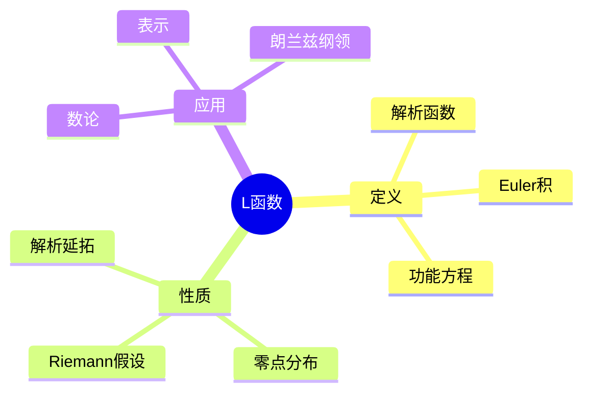
```mermaid
mindmap
  root((L函数))
    定义
      解析函数
      Euler积
      功能方程
    性质
      解析延拓
      零点分布
      Riemann假设
    应用
      数论
      表示
      朗兰兹纲领
```

#### 5.2 矩阵对比：不同解释方式的对比

| 解释方式 | 特点 | 方法 | 工具 | 适用阶段 | 优势 | 局限 |
|---------|------|------|------|---------|------|------|
| **直观解释** | 具体、形象、可视 | 例子、类比、直观 | 复平面、图形 | 入门阶段 | 易于理解 | 不够严格 |
| **知性解释** | 概念、分类、抽象 | 定义、分类、结构 | 概念图、知识图谱 | 中级阶段 | 系统完整 | 不够直观 |
| **理性解释** | 公理、证明、形式化 | 公理、证明、系统 | 形式化工具、证明系统 | 高级阶段 | 严格准确 | 不够具体 |
| **多视角解释** | 多角度、整合 | 多视角、整合 | 多视角工具 | 所有阶段 | 全面深入 | 可能复杂 |

#### 5.3 多视角表征：从不同角度表征L函数

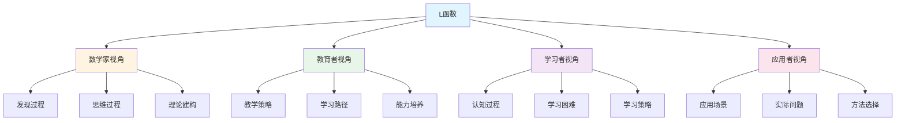
```mermaid
graph TD
    A[L函数] --> B[数学家视角]
    A --> C[教育者视角]
    A --> D[学习者视角]
    A --> E[应用者视角]

    B --> B1[发现过程]
    B --> B2[思维过程]
    B --> B3[理论建构]

    C --> C1[教学策略]
    C --> C2[学习路径]
    C --> C3[能力培养]

    D --> D1[认知过程]
    D --> D2[学习困难]
    D --> D3[学习策略]

    E --> E1[应用场景]
    E --> E2[实际问题]
    E --> E3[方法选择]

    style A fill:#e1f5ff
    style B fill:#fff4e1
    style C fill:#e8f5e9
    style D fill:#f3e5f5
    style E fill:#fce4ec
```

#### 5.4 决策树：L函数问题分类和策略选择

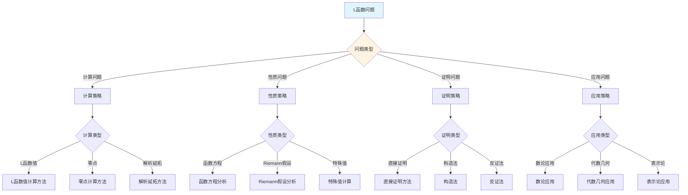
```mermaid
graph TD
    A[L函数问题] --> B{问题类型}
    B -->|计算问题| C[计算策略]
    B -->|性质问题| D[性质策略]
    B -->|证明问题| E[证明策略]
    B -->|应用问题| F[应用策略]

    C --> C1{计算类型}
    C1 -->|L函数值| C2[L函数值计算方法]
    C1 -->|零点| C3[零点计算方法]
    C1 -->|解析延拓| C4[解析延拓方法]

    D --> D1{性质类型}
    D1 -->|函数方程| D2[函数方程分析]
    D1 -->|Riemann假设| D3[Riemann假设分析]
    D1 -->|特殊值| D4[特殊值计算]

    E --> E1{证明类型}
    E1 -->|直接证明| E2[直接证明方法]
    E1 -->|构造法| E3[构造法]
    E1 -->|反证法| E4[反证法]

    F --> F1{应用类型}
    F1 -->|数论应用| F2[数论应用]
    F1 -->|代数几何| F3[代数几何应用]
    F1 -->|表示论| F4[表示论应用]

    style A fill:#e1f5ff
    style B fill:#fff4e1
```

**说明**：

- **问题分类**：根据问题类型（计算、性质、证明、应用）进行分类
- **策略选择**：根据问题类型选择相应的解决策略
- **方法应用**：根据具体问题选择合适的方法

#### 5.5 决策逻辑路径：L函数问题解决过程

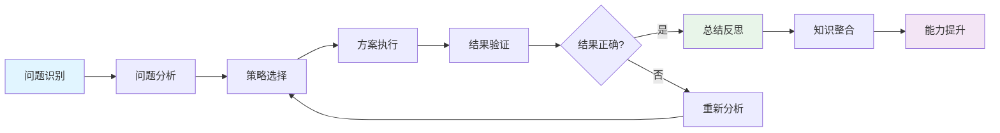
```mermaid
graph LR
    A[问题识别] --> B[问题分析]
    B --> C[策略选择]
    C --> D[方案执行]
    D --> E[结果验证]
    E --> F{结果正确?}
    F -->|是| G[总结反思]
    F -->|否| H[重新分析]
    H --> C

    G --> I[知识整合]
    I --> J[能力提升]

    style A fill:#e1f5ff
    style G fill:#e8f5e9
    style J fill:#f3e5f5
```

**说明**：

- **问题识别**：识别L函数问题的类型和关键要素
- **问题分析**：分析问题的条件和目标
- **策略选择**：根据问题类型选择解决策略
- **方案执行**：执行选定的解决方案
- **结果验证**：验证结果的正确性
- **总结反思**：总结解题过程，反思解题方法
- **知识整合**：整合相关知识点
- **能力提升**：提升问题解决能力

#### 5.6 多维对比矩阵：L函数概念特征对比

| 对比维度 | L函数定义 | L函数计算 | L函数性质 | L函数应用 |
|---------|---------|---------|---------|---------|
| **核心特征** | Dirichlet级数、解析延拓 | L函数值、零点、解析延拓 | 函数方程、Riemann假设、特殊值 | 数论、代数几何、表示论 |
| **理解难度** | ⭐⭐⭐⭐⭐ | ⭐⭐⭐⭐⭐ | ⭐⭐⭐⭐⭐ | ⭐⭐⭐⭐ |
| **应用频率** | ⭐⭐⭐⭐ | ⭐⭐⭐⭐ | ⭐⭐⭐⭐ | ⭐⭐⭐⭐ |
| **理论基础** | L函数定义 | L函数计算理论 | L函数性质理论 | L函数应用理论 |
| **教学重点** | 概念理解 | 计算方法 | 性质分析 | 应用能力 |
| **学习阶段** | 高级阶段 | 高级阶段 | 高级阶段 | 高级阶段 |
| **认知维度** | 知性+理性 | 理性 | 理性 | 理性+应用 |
| **思维表征** | 思维导图 | 决策树 | 决策逻辑路径 | 知识图谱 |

**说明**：

- **核心特征**：每个方面的核心特征
- **理解难度**：从1星到5星，表示理解难度
- **应用频率**：从1星到5星，表示应用频率
- **理论基础**：每个方面的理论基础
- **教学重点**：每个方面的教学重点
- **学习阶段**：每个方面的学习阶段
- **认知维度**：每个方面的认知维度
- **思维表征**：每个方面推荐的思维表征方法

---

## 🔍 数学论证：如何论证L函数 (编号: C.CORE.028.06)

### 一、论证过程：从观察到反思

#### 1.1 观察（Observation）

**具体现象观察**：

- **现象1**：数论函数可以生成L函数
  - 例如：Dirichlet特征生成Dirichlet L函数
  - **为什么重要**：这个现象揭示了L函数的本质
- **现象2**：L函数的解析性质
  - 例如：L函数可以解析延拓，有函数方程
  - **为什么重要**：这个现象揭示了L函数的分析性质

**模式识别**：

- **模式1**：L函数的定义
  - 例如：$L(s, \chi) = \sum_{n=1}^\infty \frac{\chi(n)}{n^s}$
  - **为什么重要**：这个模式可能反映了L函数的本质
- **模式2**：Riemann假设
  - 例如：Riemann zeta函数的非平凡零点都在$\text{Re}(s) = 1/2$上
  - **为什么重要**：这个模式可能反映了L函数的深层性质

**问题提出**：

- **问题1**：如何严格定义L函数，统一不同的数论函数？
  - **为什么提出**：这个问题可能揭示L函数的本质和基础
- **问题2**：如何证明L函数的函数方程？
  - **为什么提出**：这个问题可能揭示L函数的分析性质

#### 1.2 猜想（Conjecture）

**归纳猜想**：

- **猜想1**：L函数是研究数论的统一工具
  - **依据**：观察不同数论函数都生成L函数
  - **为什么提出**：这个猜想可能揭示L函数的统一性
- **猜想2**：Riemann假设
  - **依据**：观察Riemann zeta函数的零点分布
  - **为什么提出**：这个猜想可能揭示L函数的深层性质

**类比猜想**：

- **猜想1**：L函数类似于"生成函数"
  - **类比对象**：生成函数
  - **为什么提出**：这个类比可能揭示L函数的本质
- **猜想2**：函数方程类似于"对称性"
  - **类比对象**：对称性
  - **为什么提出**：这个类比可能揭示函数方程的作用

**直觉猜想**：

- **猜想1**：L函数是"最自然"的数论函数
  - **直觉来源**：L函数的直观
  - **为什么提出**：这个直觉可能揭示L函数的基础地位
- **猜想2**：L函数有"最小"的公理结构
  - **直觉来源**：L函数的公理结构
  - **为什么提出**：这个直觉可能揭示L函数的本质

#### 1.3 证明（Proof）

**直接证明**：

- **证明1**：L函数的函数方程
  - **证明思路**：使用L函数的定义和解析延拓的性质
  - **关键步骤**：证明L函数满足函数方程$\Lambda(s, \chi) = \epsilon(\chi) \Lambda(1-s, \bar{\chi})$
  - **为什么这样证明**：这个证明方法直接、清晰
- **证明2**：L函数的解析延拓
  - **证明思路**：使用L函数的定义和解析函数的性质
  - **关键步骤**：证明L函数可以解析延拓到整个复平面
  - **为什么这样证明**：这个证明方法直接、清晰

**构造法**：

- **构造法**：构造L函数作为Dirichlet级数
  - **构造方法**：定义L函数为Dirichlet级数
  - **验证**：验证构造的L函数满足L函数公理
  - **为什么这样证明**：构造法适合证明存在性命题

#### 1.4 反思（Reflection）

**过程回顾**：

- **论证回顾**：从观察数论函数可以生成L函数，到猜想L函数的性质，再到严格证明
  - **成功之处**：成功建立了L函数的严格理论
  - **不足之处**：L函数概念需要进一步推广
  - **改进方向**：推广到自守L函数、motivic L函数等

**方法总结**：

- **证明方法**：使用了直接证明、构造法
  - **方法特点**：直接证明清晰，构造法明确
  - **适用范围**：不同方法适用于不同类型的命题
- **证明技巧**：使用L函数的定义、解析延拓、函数方程
  - **技巧要点**：将L函数问题转化为分析问题，使用构造法处理存在性问题
  - **应用场景**：这些技巧可以应用于其他数论问题

**理论意义**：

- **理论贡献**：建立了L函数的严格理论，揭示了L函数的数论结构
  - **为什么重要**：这个论证揭示了解析数论的基础结构
- **应用价值**：L函数为数论、代数几何、物理提供了基础
  - **为什么重要**：这个论证可以应用于所有数论问题

### 二、论证类型：多种推理方式

#### 2.1 归纳论证（Inductive Reasoning）

**不完全归纳**：

- **例子1**：从具体L函数的性质归纳一般规律
  - **观察**：观察Riemann zeta函数、Dirichlet L函数都有函数方程
  - **结论**：所有L函数都有函数方程
  - **局限性**：不完全归纳的结论需要严格证明

#### 2.2 演绎论证（Deductive Reasoning）

**三段论**：

- **例子1**：证明L函数的性质
  - **大前提**：所有L函数都可以解析延拓
  - **小前提**：Riemann zeta函数是L函数
  - **结论**：Riemann zeta函数可以解析延拓
  - **为什么有效**：三段论是严格的演绎推理

#### 2.3 类比论证（Analogical Reasoning）

**结构类比**：

- **例子1**：L函数与生成函数的类比
  - **类比对象**：生成函数
  - **相似性**：L函数是数论函数的生成函数
  - **结论**：L函数可以理解为"数论生成函数"
  - **局限性**：类比不能替代严格证明

#### 2.4 构造论证（Constructive Reasoning）

**构造法**：

- **例子1**：构造L函数作为Dirichlet级数
  - **构造方法**：定义L函数为Dirichlet级数
  - **验证**：验证构造的L函数满足L函数公理
  - **为什么有效**：构造法是严格的直接证明

### 三、论证可视化：用图形表示论证过程

#### 3.1 论证流程图

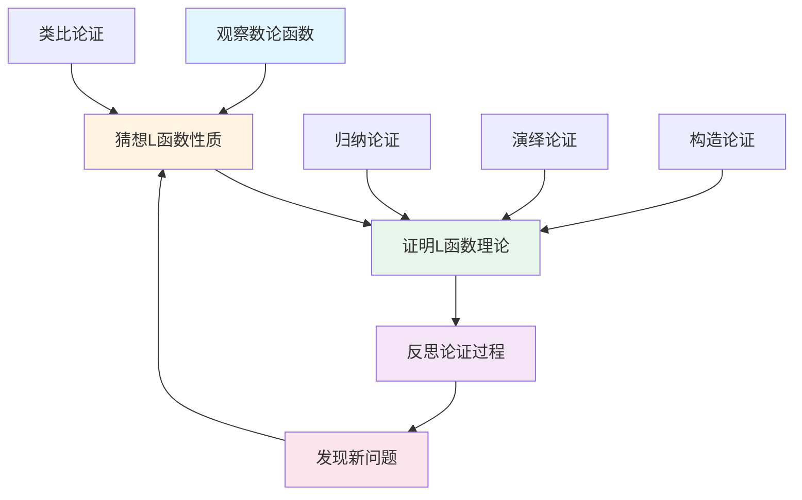
```mermaid
graph TD
    A[观察数论函数] --> B[猜想L函数性质]
    B --> C[证明L函数理论]
    C --> D[反思论证过程]
    D --> E[发现新问题]
    E --> B

    F[归纳论证] --> C
    G[演绎论证] --> C
    H[类比论证] --> B
    I[构造论证] --> C

    style A fill:#e1f5ff
    style B fill:#fff4e1
    style C fill:#e8f5e9
    style D fill:#f3e5f5
    style E fill:#fce4ec
```

#### 3.2 论证类型对比

| 论证类型 | 特点 | 适用场景 | 优势 | 局限 |
|---------|------|---------|------|------|
| **归纳论证** | 从特殊到一般 | 发现规律、提出猜想 | 启发性强 | 结论或然 |
| **演绎论证** | 从一般到特殊 | 严格证明、逻辑推理 | 结论必然 | 需要前提 |
| **类比论证** | 基于相似性 | 启发思路、发现联系 | 创造性高 | 结论或然 |
| **构造论证** | 直接构造 | 证明存在性命题 | 直接明确 | 需要构造 |

#### 3.3 论证思维导图

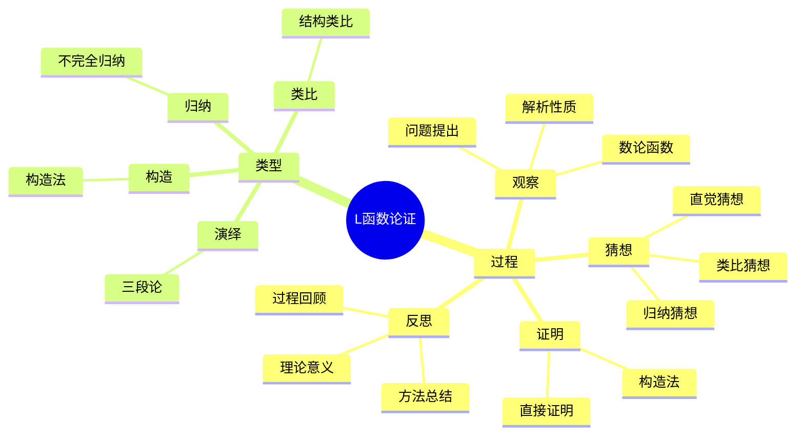
```mermaid
mindmap
  root((L函数论证))
    过程
      观察
        数论函数
        解析性质
        问题提出
      猜想
        归纳猜想
        类比猜想
        直觉猜想
      证明
        直接证明
        构造法
      反思
        过程回顾
        方法总结
        理论意义
    类型
      归纳
        不完全归纳
      演绎
        三段论
      类比
        结构类比
      构造
        构造法
```

---

## 🔗 三视角整合 (编号: C.CORE.028.07)

### 三个视角的关联

**认知学视角 ↔ 教育学视角**:

- 认知学视角揭示的理解机制，指导教育学视角的教学设计
- 教育学视角的教学实践，验证认知学视角的理论

**认知学视角 ↔ 数学家视角**:

- 数学家视角的思维过程，启发认知学视角的认知路径
- 认知学视角的认知障碍，解释数学家视角的历史困难

**教育学视角 ↔ 数学家视角**:

- 数学家视角的历史发展，为教育学视角提供教学素材
- 教育学视角的教学策略，帮助学习者理解数学家视角的思维过程

### 如何综合运用三个视角

**学习建议**:

1. **从认知学视角开始**: 先建立直观理解
2. **用教育学视角深化**: 通过教学路径系统学习
3. **用数学家视角升华**: 理解概念的深层意义和历史背景

**教学建议**:

1. **引入阶段**: 用数学家视角的问题起源激发兴趣
2. **探索阶段**: 用认知学视角的认知过程引导发现
3. **形式化阶段**: 用教育学视角的教学策略系统教学
4. **巩固阶段**: 综合三个视角深化理解

---

## 📚 参考文献 (编号: C.CORE.028.08)

### 权威资源

- Wikipedia: [L-Function](https://en.wikipedia.org/wiki/L-function)
- Metamath: [L-Function](http://us.metamath.org/mpeuni/df-lfunction.html)[需更新][需更新]

### 经典教材

- Iwaniec, H., & Kowalski, E. (2004). *Analytic Number Theory*. American Mathematical Society.
- Neukirch, J. (1999). *Algebraic Number Theory*. Springer.

### 研究论文

- Riemann, B. (1859). "Über die Anzahl der Primzahlen unter einer gegebenen Größe". *Monatsberichte der Königlich Preußischen Akademie der Wissenschaften*.
- Langlands, R. P. (1967). "Euler Products". *Yale University Press*.

---

**创建日期**: 2025年1月
**最后更新**: 2026-04-05
**维护状态**: 持续更新中

---

## 📚 附录: 扩展分析


### 1. 多理论分析

---
msc_primary: "00A99"
---

# L函数概念的多理论分析示例 / Multi-Theory Analysis Example: L-Function Concept


---


## 🎯 一、Tall三个世界理论分析 / Tall's Three Worlds Theory Analysis (编号: C.CORE.028.MULTI.01)

### 1.1 感知-操作世界（Embodied World）

**L函数在感知-操作世界中的理解 / Understanding L-Function in the Embodied World**：

- **具体经验 / Concrete Experience**：
  - 通过"级数"的日常经验理解L函数：无穷级数的求和 / Understanding L-functions through daily experience of "series": summation of infinite series
  - 例如：$\zeta(2) = 1 + \frac{1}{4} + \frac{1}{9} + \cdots = \frac{\pi^2}{6}$ / Examples: $\zeta(2) = 1 + \frac{1}{4} + \frac{1}{9} + \cdots = \frac{\pi^2}{6}$
  - 通过"素数分布"理解L函数：L函数编码素数的信息 / Understanding L-functions through "prime distribution": L-functions encode information about primes
  - 例如：Riemann zeta函数的零点与素数分布相关 / Examples: zeros of Riemann zeta function are related to prime distribution

- **身体动作 / Bodily Actions**：
  - 通过"求和"的动作理解L函数 / Understanding L-functions through the action of "summation"
  - 通过"解析延拓"理解L函数 / Understanding L-functions through "analytic continuation"
  - 通过操作级数理解L函数的性质 / Understanding properties of L-functions through manipulating series

- **直观理解 / Intuitive Understanding**：
  - L函数是"编码数论信息的级数" / L-functions are "series encoding number-theoretic information"
  - L函数是"研究素数分布的工具" / L-functions are "tools for studying prime distribution"
  - L函数是解析数论的核心 / L-functions are the core of analytic number theory

**教学建议 / Teaching Suggestions**：

- 使用具体例子（Riemann zeta函数、Dirichlet L函数） / Use concrete examples (Riemann zeta function, Dirichlet L-functions)
- 通过级数活动理解L函数 / Understand L-functions through series activities
- 使用图形可视化L函数的零点 / Use graphics to visualize zeros of L-functions

### 1.2 概念-符号世界（Symbolic World）

**L函数在概念-符号世界的理解 / Understanding L-Functions in the Symbolic World**：

- **符号表示 / Symbolic Representation**：
  - 使用L函数符号：$L(s)$、$\zeta(s)$、$L(s, \chi)$ / Using L-function notation: $L(s)$, $\zeta(s)$, $L(s, \chi)$
  - 使用Dirichlet级数符号：$\sum_{n=1}^\infty \frac{a_n}{n^s}$ / Using Dirichlet series notation: $\sum_{n=1}^\infty \frac{a_n}{n^s}$
  - 使用Euler乘积符号：$\prod_p \left(1 + \frac{a_p}{p^s} + \cdots\right)$ / Using Euler product notation: $\prod_p \left(1 + \frac{a_p}{p^s} + \cdots\right)$

- **概念理解 / Conceptual Understanding**：
  - L函数是Dirichlet级数 / L-functions are Dirichlet series
  - L函数满足解析延拓和函数方程 / L-functions satisfy analytic continuation and functional equations
  - L函数编码数论信息（特别是素数分布） / L-functions encode number-theoretic information (especially prime distribution)

- **抽象操作 / Abstract Operations**：
  - 通过符号操作计算L函数 / Computing L-functions through symbolic operations
  - 通过逻辑推理证明L函数性质 / Proving L-function properties through logical reasoning
  - 通过解析数论语言表达数学概念 / Expressing mathematical concepts through analytic number-theoretic language

**教学建议 / Teaching Suggestions**：

- 逐步引入L函数符号 / Gradually introduce L-function notation
- 通过符号操作练习L函数计算 / Practice L-function computation through symbolic operations
- 使用解析数论语言表达数学概念 / Use analytic number-theoretic language to express mathematical concepts

### 1.3 形式-公理世界（Formal World）

**L函数在形式-公理世界的理解 / Understanding L-Functions in the Formal World**：

- **公理系统 / Axiomatic System**：
  - L函数的严格定义：$L(s) = \sum_{n=1}^\infty \frac{a_n}{n^s}$，满足解析延拓和函数方程 / Strict definition of L-function: $L(s) = \sum_{n=1}^\infty \frac{a_n}{n^s}$, satisfying analytic continuation and functional equations
  - L函数满足函数方程：$\Lambda(s) = \epsilon \Lambda(1-s)$ / L-functions satisfy functional equations: $\Lambda(s) = \epsilon \Lambda(1-s)$
  - 通过公理严格定义L函数 / Strictly defining L-functions through axioms

- **形式化定义 / Formal Definition**：
  - L函数的形式化定义：Dirichlet级数，可解析延拓，满足函数方程 / Formal definition of L-function: Dirichlet series, analytically continuable, satisfying functional equations
  - L函数的Euler乘积形式化定义 / Formal definition of Euler product for L-functions
  - L函数性质的严格证明 / Strict proof of L-function properties

- **逻辑推理 / Logical Reasoning**：
  - 通过逻辑推理证明L函数性质（如Riemann假设） / Proving L-function properties (such as Riemann hypothesis) through logical reasoning
  - 通过形式化方法研究解析数论 / Studying analytic number theory through formal methods
  - 通过公理系统建立解析数论基础 / Establishing analytic number theory foundations through axiom systems

**教学建议 / Teaching Suggestions**：

- 介绍L函数的严格定义 / Introduce strict definition of L-functions
- 通过形式化证明理解L函数性质 / Understand L-function properties through formal proofs
- 研究L函数在解析数论中的作用 / Study the role of L-functions in analytic number theory

### 1.4 三个世界的转换 / Transitions Between Worlds

**转换路径 / Transition Paths**：

1. **从感知-操作到概念-符号 / From Embodied to Symbolic**：
   - 将具体Dirichlet级数抽象为L函数符号 / Abstracting concrete Dirichlet series into L-function symbols
   - 从操作中提取L函数概念 / Extracting L-function concepts from operations
   - 例如：从"Dirichlet级数"到"L函数$L(s)$" / Example: from "Dirichlet series" to "L-function $L(s)$"

2. **从概念-符号到形式-公理 / From Symbolic to Formal**：
   - 将L函数概念形式化为L函数定义 / Formalizing L-function concepts into L-function definition
   - 从符号运算到逻辑推理 / From symbolic operations to logical reasoning
   - 例如：从"$L(s)$"到"$\sum_{n=1}^\infty \frac{a_n}{n^s}$满足函数方程" / Example: from "$L(s)$" to "$\sum_{n=1}^\infty \frac{a_n}{n^s}$ satisfying functional equation"

**转换支持 / Transition Support**：

- **识别转换困难 / Identifying Transition Difficulties**：
  - 识别从具体级数到抽象L函数的困难 / Identifying difficulties in transitioning from concrete series to abstract L-functions
  - 识别从符号运算到形式化定义的困难 / Identifying difficulties in transitioning from symbolic operations to formal definitions

- **设计转换活动 / Designing Transition Activities**：
  - 设计过渡活动支持转换 / Designing transition activities to support transitions
  - 提供渐进式支持 / Providing progressive support

- **评估转换效果 / Assessing Transition Effectiveness**：
  - 评估转换成功 / Assessing transition success
  - 提供反馈支持 / Providing feedback support

---

## 🔬 二、Dubinsky APOS理论分析 (编号: C.CORE.028.MULTI.02)

### 2.1 Action（动作）

**L函数的Action阶段 / Action Stage of L-Function**：

- **具体操作 / Concrete Operations**：
  - 计算L函数：给定$s$和算术函数$a_n$，计算$L(s) = \sum_{n=1}^\infty \frac{a_n}{n^s}$ / Computing L-functions: given $s$ and arithmetic function $a_n$, compute $L(s) = \sum_{n=1}^\infty \frac{a_n}{n^s}$
  - 使用Euler乘积：将L函数表示为Euler乘积 / Using Euler products: express L-functions as Euler products
  - 计算L函数的零点：给定L函数，计算其零点 / Computing zeros of L-functions: given an L-function, compute its zeros

- **操作特点 / Operation Characteristics**：
  - 需要外部指导（教师、教材） / Requires external guidance (teacher, textbook)
  - 操作是具体的、机械的 / Operations are concrete and mechanical
  - 需要逐步执行 / Requires step-by-step execution

- **学习活动 / Learning Activities**：
  - 练习计算L函数 / Practice computing L-functions
  - 练习使用Euler乘积 / Practice using Euler products
  - 练习计算L函数的零点 / Practice computing zeros of L-functions

**教学建议 / Teaching Suggestions**：

- 提供大量练习机会 / Provide ample practice opportunities
- 给予及时反馈 / Give timely feedback
- 逐步增加操作复杂度 / Gradually increase operation complexity

### 2.2 Process（过程）

**L函数的Process阶段 / Process Stage of L-Function**：

- **内化过程 / Internalization Process**：
  - 将L函数计算内化为心理过程 / Internalizing L-function computation as a mental process
  - 理解解析延拓的内在逻辑 / Understanding the internal logic of analytic continuation
  - 能够独立完成L函数操作 / Being able to perform L-function operations independently

- **过程理解 / Process Understanding**：
  - 理解"L函数"是"编码数论信息的级数" / Understanding that "L-functions" are "series encoding number-theoretic information"
  - 理解"解析延拓"是"将L函数延拓到整个复平面的过程" / Understanding that "analytic continuation" is "the process of extending L-functions to the entire complex plane"
  - 理解"函数方程"是"L函数满足的对称性关系" / Understanding that "functional equations" are "symmetry relations satisfied by L-functions"

- **灵活应用 / Flexible Application**：
  - 能够灵活应用L函数概念 / Being able to flexibly apply L-function concepts
  - 能够处理复杂的解析数论问题 / Being able to handle complex analytic number theory problems
  - 能够理解L函数的各种性质 / Being able to understand various properties of L-functions

**教学建议 / Teaching Suggestions**：

- 引导学生内化操作过程 / Guide students to internalize operation processes
- 通过变式练习加深理解 / Deepen understanding through variant exercises
- 鼓励学生独立思考和解决问题 / Encourage students to think independently and solve problems

### 2.3 Object（对象）

**L函数的Object阶段 / Object Stage of L-Function**：

- **对象化理解 / Objectification Understanding**：
  - 将L函数视为独立的对象 / Viewing L-function as an independent object
  - 理解L函数作为数学对象的结构 / Understanding the structure of L-function as a mathematical object
  - 能够对L函数进行运算和操作 / Being able to perform operations on L-function

- **对象操作 / Object Operations**：
  - 能够比较不同的L函数 / Being able to compare different L-functions
  - 能够研究L函数的零点分布 / Being able to study the distribution of zeros of L-functions
  - 能够研究L函数的性质 / Being able to study properties of L-functions

- **概念整合 / Conceptual Integration**：
  - 理解L函数与素数、Dirichlet级数、解析数论的关系 / Understanding the relationship between L-functions, prime numbers, Dirichlet series, and analytic number theory
  - 理解L函数在解析数论中的作用 / Understanding the role of L-functions in analytic number theory
  - 理解L函数在数学中的作用 / Understanding the role of L-functions in mathematics

**教学建议 / Teaching Suggestions**：

- 引导学生将L函数对象化 / Guide students to objectify L-functions
- 通过对象操作加深理解 / Deepen understanding through object operations
- 整合L函数与其他概念 / Integrate L-functions with other concepts

### 2.4 Schema（图式）

**L函数的Schema阶段 / Schema Stage of L-Function**：

- **图式构建 / Schema Construction**：
  - 构建完整的L函数图式 / Constructing a complete L-function schema
  - 整合L函数的各种理解 / Integrating various understandings of L-function
  - 建立L函数与其他概念的联系 / Establishing connections between L-function and other concepts

- **图式应用 / Schema Application**：
  - 能够灵活应用L函数图式 / Being able to flexibly apply L-function schemas
  - 能够解决复杂的解析数论问题 / Being able to solve complex analytic number theory problems
  - 能够研究解析数论理论 / Being able to study analytic number theory

- **图式发展 / Schema Development**：
  - 不断发展L函数图式 / Continuously developing L-function schemas
  - 探索L函数的新应用（Langlands纲领、算术几何） / Exploring new applications of L-functions (Langlands program, arithmetic geometry)
  - 研究解析数论理论的发展 / Studying the development of analytic number theory

**教学建议 / Teaching Suggestions**：

- 帮助学生构建L函数图式 / Help students construct L-function schemas
- 通过应用发展图式 / Develop schemas through application
- 鼓励学生探索数论理论 / Encourage students to explore number theory

### 2.5 APOS发展路径 / APOS Development Path

**发展过程 / Development Process**：

1. **Action → Process / 动作到过程**：
   - 将外部L函数计算操作内化为心理过程 / Internalizing external L-function computation operations as mental processes
   - 从需要指导到独立完成 / From needing guidance to independent completion
   - 例如：从"计算$L(s)$"到"理解L函数计算过程" / Example: from "computing $L(s)$" to "understanding the L-function computation process"

2. **Process → Object / 过程到对象**：
   - 将L函数计算过程对象化 / Objectifying L-function computation processes
   - 从过程理解到对象理解 / From process understanding to object understanding
   - 例如：从"理解L函数计算过程"到"将L函数视为对象" / Example: from "understanding the L-function computation process" to "treating L-functions as objects"

3. **Object → Schema / 对象到图式**：
   - 整合L函数的所有方面形成完整图式 / Integrating all aspects of L-functions to form a complete schema
   - 从对象理解到系统理解 / From object understanding to systematic understanding
   - 例如：从"理解L函数对象"到"形成解析数论图式" / Example: from "understanding L-function objects" to "forming an analytic number theory schema"

**发展支持 / Development Support**：

- **识别发展困难 / Identifying Development Difficulties**：
  - 识别内化困难 / Identifying internalization difficulties
  - 识别对象化困难 / Identifying objectification difficulties
  - 识别图式化困难 / Identifying schematization difficulties

- **设计发展活动 / Designing Development Activities**：
  - 设计支持内化的活动 / Designing activities to support internalization
  - 设计支持对象化的活动 / Designing activities to support objectification
  - 设计支持图式化的活动 / Designing activities to support schematization

- **评估发展效果 / Assessing Development Effectiveness**：
  - 评估各阶段发展 / Assessing development at each stage
  - 提供反馈支持 / Providing feedback support

---

## 💬 三、Sfard交流理论分析 / Sfard's Commognitive Theory Analysis (编号: C.CORE.028.MULTI.03)

### 3.1 L函数作为交流工具 / L-Function as a Communication Tool

**L函数的交流功能 / Communicative Function of L-Function**：

- **数学交流 / Mathematical Communication**：
  - L函数用于表达"数论信息"：$L(s) = \sum_{n=1}^\infty \frac{a_n}{n^s}$ / L-functions are used to express "number-theoretic information": $L(s) = \sum_{n=1}^\infty \frac{a_n}{n^s}$
  - L函数用于描述"素数分布"：$\zeta(s)$的零点与素数分布相关 / L-functions are used to describe "prime distribution": zeros of $\zeta(s)$ are related to prime distribution
  - L函数用于表达数学关系：Riemann假设、Langlands纲领 / L-functions are used to express mathematical relationships: Riemann hypothesis, Langlands program

- **概念表达 / Conceptual Expression**：
  - 通过L函数表达"解析数论"的概念 / Expressing the concept of "analytic number theory" through L-functions
  - 通过L函数符号表达"素数分布"的概念 / Expressing the concept of "prime distribution" through L-function notation
  - 通过L函数表达"数论核心工具"的概念 / Expressing the concept of "core tool of number theory" through L-functions

- **问题解决 / Problem Solving**：
  - 使用L函数语言表达问题 / Using L-function language to express problems
  - 使用L函数方法解决问题（素数分布、Langlands纲领） / Using L-function methods to solve problems (prime distribution, Langlands program)
  - 使用解析数论方法证明定理 / Using analytic number theory methods to prove theorems

### 3.2 L函数学习的实践参与 / Practice Participation in L-Function Learning

**通过参与数学实践学习L函数 / Learning L-Function through Participation in Mathematical Practice**：

- **实践场景 / Practice Scenarios**：
  - 通过解析数论问题学习L函数 / Learning L-functions through analytic number theory problems
  - 通过级数活动学习L函数 / Learning L-functions through series activities
  - 通过素数分布研究学习L函数 / Learning L-functions through prime distribution research
  - 通过解析数论研究学习L函数理论 / Learning L-function theory through analytic number theory research

- **实践方式 / Practice Methods**：
  - 参与数学讨论，使用L函数语言 / Participating in mathematical discussions, using L-function language
  - 解决数学问题，应用L函数方法 / Solving mathematical problems, applying L-function methods
  - 研究数学理论，理解L函数作用 / Studying mathematical theory, understanding the role of L-function

- **学习效果 / Learning Outcomes**：
  - 通过实践理解L函数概念 / Understanding L-function concepts through practice
  - 通过应用掌握L函数方法 / Mastering L-function methods through application
  - 通过参与形成数学思维 / Forming mathematical thinking through participation

**教学建议 / Teaching Suggestions**：

- 设计数学实践活动 / Design mathematical practice activities
- 鼓励学生参与数学讨论 / Encourage students to participate in mathematical discussions
- 提供实际问题解决机会 / Provide opportunities for solving real-world problems

---

## 🧠 四、Piaget认知发展理论分析 / Piaget's Cognitive Development Theory Analysis (编号: C.CORE.028.MULTI.04)

### 4.1 具体运算阶段（7-12岁）/ Concrete Operational Stage (7-12 years)

**L函数在具体运算阶段的理解 / Understanding L-Function in the Concrete Operational Stage**：

- **具体对象 / Concrete Objects**：
  - 通过具体L函数理解L函数 / Understanding L-functions through concrete L-functions
  - 例如：$\zeta(2) = \frac{\pi^2}{6}$、$\zeta(4) = \frac{\pi^4}{90}$ / Examples: $\zeta(2) = \frac{\pi^2}{6}$, $\zeta(4) = \frac{\pi^4}{90}$
  - 需要具体例子支持理解 / Requires concrete examples to support understanding

- **逻辑思维 / Logical Thinking**：
  - 能够理解L函数的基本概念 / Being able to understand basic L-function concepts
  - 能够进行简单的L函数计算 / Being able to perform simple L-function computation
  - 但需要具体对象支持 / But requires concrete object support

- **教学建议 / Teaching Suggestions**：
  - 使用具体L函数和图形 / Use concrete L-functions and graphics
  - 通过游戏和活动学习 / Learn through games and activities
  - 逐步引入抽象概念 / Gradually introduce abstract concepts

### 4.2 形式运算阶段（12+岁）/ Formal Operational Stage (12+ years)

**L函数在形式运算阶段的理解 / Understanding L-Function in the Formal Operational Stage**：

- **抽象思维 / Abstract Thinking**：
  - 能够理解抽象的L函数概念 / Being able to understand abstract L-function concepts
  - 能够进行符号操作 / Being able to perform symbolic operations
  - 能够进行逻辑推理 / Being able to perform logical reasoning

- **形式推理 / Formal Reasoning**：
  - 能够证明L函数性质（如Riemann假设） / Being able to prove L-function properties (such as Riemann hypothesis)
  - 能够理解L函数定义 / Being able to understand L-function definition
  - 能够研究解析数论理论 / Being able to study analytic number theory

- **教学建议 / Teaching Suggestions**：
  - 引入抽象概念和符号 / Introduce abstract concepts and symbols
  - 进行逻辑推理训练 / Conduct logical reasoning training
  - 研究解析数论理论 / Study analytic number theory

---

## 🌍 五、Vygotsky社会文化理论分析 / Vygotsky's Sociocultural Theory Analysis (编号: C.CORE.028.MULTI.05)

### 5.1 最近发展区（ZPD）/ Zone of Proximal Development (ZPD)

**L函数学习的最近发展区 / Zone of Proximal Development in L-Function Learning**：

- **独立能力 / Independent Ability**：
  - 能够理解L函数的基本概念 / Being able to understand basic L-function concepts
  - 能够进行简单的L函数计算 / Being able to perform simple L-function computation
  - 能够理解L函数的基本性质 / Being able to understand basic L-function properties

- **潜在能力 / Potential Ability**：
  - 能够理解L函数定义 / Being able to understand L-function definition
  - 能够证明L函数性质（如Riemann假设） / Being able to prove L-function properties (such as Riemann hypothesis)
  - 能够研究解析数论理论 / Being able to study analytic number theory

### 5.2 社会文化工具 / Sociocultural Tools

**L函数作为社会文化工具 / L-Function as Sociocultural Tools**：

- **数学工具 / Mathematical Tools**：
  - L函数是数学研究的重要工具 / L-functions are important tools for mathematical research
  - L函数用于解决实际问题（素数分布、Langlands纲领） / L-functions are used to solve real-world problems (prime distribution, Langlands program)
  - L函数用于研究数学理论 / L-functions are used to study mathematical theory

- **文化意义 / Cultural Significance**：
  - L函数是数学文化的重要组成部分 / L-functions are an important part of mathematical culture
  - L函数反映了数学思维的发展 / L-functions reflect the development of mathematical thinking
  - L函数体现了数学的美感 / L-functions embody the beauty of mathematics

- **教学建议 / Teaching Suggestions**：
  - 介绍L函数的历史和文化意义 / Introduce the history and cultural significance of L-functions
  - 展示L函数在数学中的作用 / Demonstrate the role of L-functions in mathematics
  - 培养学生对数学文化的理解 / Cultivate students' understanding of mathematical culture

- 提供适当的学习支持 / Provide appropriate learning support
- 设计最近发展区的学习活动 / Design learning activities in the zone of proximal development
- 鼓励学生参与数学实践和交流 / Encourage students to participate in mathematical practice and communication

---

## 🔄 六、多理论整合分析 / Multi-Theory Integration Analysis (编号: C.CORE.028.MULTI.06)

### 6.1 理论共同点 / Theoretical Commonalities

**各理论在L函数概念分析中的共同点 / Commonalities of Theories in L-Function Concept Analysis**：

1. **多层次理解 / Multi-Level Understanding**：
   - 都强调从具体到抽象的发展 / All emphasize development from concrete to abstract
   - Tall的三个世界、APOS的四个阶段、Piaget的发展阶段都体现这一点 / Tall's three worlds, APOS's four stages, and Piaget's developmental stages all reflect this

2. **实践重要性 / Importance of Practice**：
   - 都强调实践在学习中的作用 / All emphasize the role of practice in learning
   - Sfard的交流理论、Vygotsky的社会文化理论都强调这一点 / Sfard's communication theory and Vygotsky's sociocultural theory both emphasize this

3. **认知发展 / Cognitive Development**：
   - 都关注认知发展的过程 / All focus on the process of cognitive development
   - 各理论都描述了从简单到复杂的发展 / Each theory describes development from simple to complex

### 6.2 理论互补性 / Theoretical Complementarity

**各理论在L函数概念分析中的互补性 / Complementarity of Theories in L-Function Concept Analysis**：

1. **Tall三个世界 / Tall's Three Worlds**：
   - 适用于理解L函数概念的不同层次 / Applicable to understanding different levels of L-function concepts
   - 从感知操作到形式公理的发展 / Development from embodied operations to formal axioms

2. **APOS理论 / APOS Theory**：
   - 适用于分析L函数概念的学习过程 / Applicable to analyzing the learning process of L-function concepts
   - 从动作到图式的发展 / Development from action to schema

3. **Sfard交流理论 / Sfard's Communication Theory**：
   - 适用于设计L函数概念的实践活动 / Applicable to designing practice activities for L-function concepts
   - 通过数学实践学习L函数 / Learning L-functions through mathematical practice

4. **Piaget理论 / Piaget's Theory**：
   - 适用于理解L函数概念的认知发展阶段 / Applicable to understanding cognitive development stages of L-function concepts
   - 从具体运算到形式运算的发展 / Development from concrete operations to formal operations

5. **Vygotsky理论 / Vygotsky's Theory**：
   - 适用于设计L函数概念的学习支持 / Applicable to designing learning support for L-function concepts
   - 通过最近发展区促进学习 / Promoting learning through the zone of proximal development

### 6.3 整合应用框架

**多理论整合应用**：

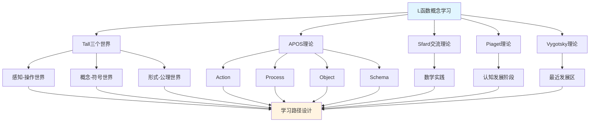
```mermaid
graph TB
    A[L函数概念学习] --> B[Tall三个世界]
    A --> C[APOS理论]
    A --> D[Sfard交流理论]
    A --> E[Piaget理论]
    A --> F[Vygotsky理论]

    B --> G[感知-操作世界]
    B --> H[概念-符号世界]
    B --> I[形式-公理世界]

    C --> J[Action]
    C --> K[Process]
    C --> L[Object]
    C --> M[Schema]

    D --> N[数学实践]
    E --> O[认知发展阶段]
    F --> P[最近发展区]

    G --> Q[学习路径设计]
    H --> Q
    I --> Q
    J --> Q
    K --> Q
    L --> Q
    M --> Q
    N --> Q
    O --> Q
    P --> Q

    style A fill:#e1f5ff
    style Q fill:#fff4e1
```

---

## 📊 七、L函数概念的多理论学习路径 / Multi-Theory Learning Path for L-Function Concept (编号: C.CORE.028.MULTI.07)

### 7.1 入门阶段（Tall感知-操作世界 + APOS Action）/ Entry Stage (Tall Embodied World + APOS Action)

**学习目标 / Learning Objectives**：

- 通过具体L函数理解L函数概念 / Understanding L-function concepts through concrete L-function
- 掌握基本L函数操作 / Mastering basic L-function operations

**学习活动 / Learning Activities**：

- 使用具体例子（$\zeta(2) = \frac{\pi^2}{6}$、$\zeta(4) = \frac{\pi^4}{90}$）进行L函数操作 / Using concrete examples ($\zeta(2) = \frac{\pi^2}{6}$, $\zeta(4) = \frac{\pi^4}{90}$) for L-function operations
- 练习计算L函数 / Practicing computing L-functions
- 练习使用Euler乘积 / Practicing using Euler products
- 练习基本L函数运算 / Practicing basic L-function operations

**评估标准 / Assessment Criteria**：

- 能够独立完成基本L函数操作 / Being able to independently complete basic L-function operations
- 能够理解L函数的基本概念 / Being able to understand basic L-function concepts

### 7.2 中级阶段（Tall概念-符号世界 + APOS Process/Object）/ Intermediate Stage (Tall Symbolic World + APOS Process/Object)

**学习目标 / Learning Objectives**：

- 理解L函数的符号表示 / Understanding symbolic representation of L-functions
- 掌握解析延拓的内在逻辑 / Mastering the internal logic of analytic continuation
- 将L函数视为对象 / Viewing L-functions as objects

**学习活动 / Learning Activities**：

- 学习L函数符号和Dirichlet级数符号 / Learning L-function notation and Dirichlet series notation
- 通过符号操作计算L函数 / Computing L-functions through symbolic operations
- 理解L函数的性质 / Understanding properties of L-functions
- 研究L函数的零点分布 / Studying the distribution of zeros of L-functions

**评估标准 / Assessment Criteria**：

- 能够灵活应用L函数符号 / Being able to flexibly apply L-function notation
- 能够理解解析延拓的内在逻辑 / Being able to understand the internal logic of analytic continuation
- 能够将L函数视为对象进行操作 / Being able to operate on L-functions as objects

### 7.3 高级阶段（Tall形式-公理世界 + APOS Schema + Sfard实践）/ Advanced Stage (Tall Formal World + APOS Schema + Sfard Practice)

**学习目标 / Learning Objectives**：

- 理解L函数的严格定义 / Understanding strict definition of L-function
- 形成完整的L函数概念图式 / Forming a complete L-function concept schema
- 通过数学实践应用L函数 / Applying L-function through mathematical practice

**学习活动 / Learning Activities**：

- 学习L函数的严格定义 / Learning strict definition of L-functions
- 通过形式化证明理解L函数性质（如Riemann假设） / Understanding L-function properties (such as Riemann hypothesis) through formal proofs
- 研究L函数在解析数论中的作用 / Studying the role of L-functions in analytic number theory
- 参与数学实践，应用L函数方法（素数分布、Langlands纲领） / Participating in mathematical practice, applying L-function methods (prime distribution, Langlands program)

**评估标准 / Assessment Criteria**：

- 能够理解L函数的严格定义 / Being able to understand strict definition of L-function
- 能够形成完整的L函数概念图式 / Being able to form a complete L-function concept schema
- 能够通过数学实践应用L函数 / Being able to apply L-function through mathematical practice

---

## 🧠 七、元认知理论分析 / Metacognitive Theory Analysis (编号: C.CORE.028.MULTI.07.5)

### 7.1 元认知知识（Metacognitive Knowledge）

**关于L函数概念的知识 / Knowledge About the L-Function Concept**：

- **概念知识 / Conceptual Knowledge**：
  - L函数的定义：通过Dirichlet级数定义的解析函数 / L-functions are analytic functions defined through Dirichlet series
  - L函数的性质：解析延拓、函数方程、零点分布 / Properties: analytic continuation, functional equations, zero distribution
  - L函数的表示方法：Dirichlet级数、Euler乘积、函数方程 / Representation methods: Dirichlet series, Euler products, functional equations
  - L函数与其他概念的关系：L函数是数论的核心，是研究数论问题的工具 / Relationship: L-functions are core concepts of number theory and tools for studying number theory problems

- **策略知识 / Strategy Knowledge**：
  - 学习策略：从具体例子（Riemann zeta函数）到一般L函数，通过级数掌握L函数 / Learning strategies: from concrete examples (Riemann zeta function) to general L-functions, master L-functions through series
  - 理解策略：从级数到解析函数，从局部到整体 / Understanding strategies: from series to analytic functions, from local to global
  - 应用策略：将L函数方法应用到实际问题中 / Application strategies: apply L-function methods to real-world problems

- **任务知识 / Task Knowledge**：
  - 典型任务：L函数计算、L函数性质分析、L函数应用 / Typical tasks: L-function computation, L-function property analysis, L-function applications
  - 任务难度：基础任务（L函数计算）→ 中级任务（L函数性质分析）→ 高级任务（L函数应用） / Task difficulty: basic (L-function computation) → intermediate (L-function property analysis) → advanced (L-function applications)
  - 任务要求：理解L函数概念，掌握L函数方法，能够进行L函数推理 / Task requirements: understand L-function concepts, master L-function methods, be able to reason about L-functions

### 7.2 元认知监控（Metacognitive Monitoring）

**理解监控 / Comprehension Monitoring**：

- **自我提问 / Self-Questioning**：
  - "我理解L函数的基本概念了吗？" / "Do I understand the basic concept of L-functions?"
  - "我能区分不同类型的L函数吗？" / "Can I distinguish between different types of L-functions?"
  - "我理解L函数的解析延拓吗？" / "Do I understand the analytic continuation of L-functions?"

- **理解检查 / Comprehension Checking**：
  - 能否用自己的话解释L函数概念？ / Can I explain the concept of L-functions in my own words?
  - 能否识别L函数计算的错误？ / Can I identify errors in L-function computation?
  - 能否判断L函数的性质？ / Can I determine the properties of L-functions?

- **困难识别 / Difficulty Identification**：
  - 识别理解困难：抽象性、解析延拓、函数方程、Riemann假设 / Identify comprehension difficulties: abstraction, analytic continuation, functional equations, Riemann hypothesis
  - 识别运算困难：L函数计算、L函数性质分析、数论问题 / Identify operation difficulties: L-function computation, L-function property analysis, number theory problems

**过程监控 / Process Monitoring**：

- **学习过程监控 / Learning Process Monitoring**：
  - 监控学习进度：是否按计划学习？ / Monitor learning progress: Am I learning according to plan?
  - 监控学习效果：是否掌握了L函数概念？ / Monitor learning effectiveness: Have I mastered the concept of L-functions?
  - 监控学习困难：遇到了哪些困难？ / Monitor learning difficulties: What difficulties have I encountered?

- **策略使用监控 / Strategy Use Monitoring**：
  - 使用的策略是否有效？ / Is the strategy I'm using effective?
  - 是否需要调整策略？ / Do I need to adjust my strategy?
  - 策略使用是否正确？ / Am I using the strategy correctly?

### 7.3 元认知调节（Metacognitive Regulation）

**计划调节 / Planning Regulation**：

- **学习计划制定 / Learning Plan Development**：
  - 制定学习计划：先学L函数基本概念，再学L函数方法，最后学L函数应用 / Develop learning plan: first learn basic L-function concepts, then learn L-function methods, finally learn L-function applications
  - 调整学习计划：根据学习情况调整计划 / Adjust learning plan: adjust plan based on learning situation
  - 优化学习路径：选择最适合自己的学习路径 / Optimize learning path: choose the learning path that best suits oneself

**策略调节 / Strategy Regulation**：

- **策略选择 / Strategy Selection**：
  - 根据任务类型选择策略：简单任务用直接方法，复杂任务用分步方法 / Select strategies based on task type: use direct methods for simple tasks, step-by-step methods for complex tasks
  - 根据学习阶段选择策略：入门阶段用具体例子，高级阶段用抽象方法 / Select strategies based on learning stage: use concrete examples in entry stage, abstract methods in advanced stage

- **策略调整 / Strategy Adjustment**：
  - 如果遇到困难，尝试不同的策略 / If encountering difficulties, try different strategies
  - 如果策略无效，调整策略 / If strategy is ineffective, adjust strategy
  - 如果策略有效，继续使用并优化 / If strategy is effective, continue using and optimize

**反思调节 / Reflection Regulation**：

- **学习反思 / Learning Reflection**：
  - 反思学习过程：从L函数学习中获得了什么？ / Reflect on learning process: What have I gained from learning L-functions?
  - 反思学习困难：遇到了哪些困难？如何克服？ / Reflect on learning difficulties: What difficulties did I encounter? How did I overcome them?
  - 反思学习策略：使用的策略是否有效？如何改进？ / Reflect on learning strategies: Were the strategies I used effective? How can I improve?

- **错误反思 / Error Reflection**：
  - 从错误中学习：分析错误原因，避免类似错误 / Learn from errors: analyze error causes, avoid similar errors
  - 改进学习方法：根据错误调整学习方法 / Improve learning methods: adjust learning methods based on errors

**教学建议 / Teaching Suggestions**：

- 教授元认知知识：帮助学生建立关于L函数的元认知知识 / Teach metacognitive knowledge: help students build metacognitive knowledge about L-functions
- 培养监控能力：引导学生自我监控理解过程 / Develop monitoring ability: guide students to self-monitor their comprehension process
- 训练调节能力：教授学生如何调节学习策略 / Train regulation ability: teach students how to regulate learning strategies
- 使用元认知提示语：在学习过程中使用提示语引导学生 / Use metacognitive prompts: use prompts to guide students during learning

---

## 🎓 八、教学建议 / Teaching Suggestions (编号: C.CORE.028.MULTI.08)

### 8.1 基于多理论的教学设计 / Multi-Theory Based Teaching Design

**教学设计原则 / Teaching Design Principles**：

1. **多层次设计 / Multi-Level Design**：
   - 从感知操作到形式公理 / From embodied operations to formal axioms
   - 从动作到图式 / From action to schema
   - 从具体运算到形式运算 / From concrete operations to formal operations

2. **实践导向 / Practice-Oriented**：
   - 设计数学实践活动 / Design mathematical practice activities
   - 鼓励学生参与数学交流 / Encourage students to participate in mathematical communication
   - 提供实际问题解决机会 / Provide opportunities for solving real-world problems

3. **学习支持 / Learning Support**：
   - 提供适当的学习支持 / Provide appropriate learning support
   - 设计最近发展区的学习活动 / Design learning activities in the zone of proximal development
   - 给予及时反馈 / Give timely feedback

4. **情感因素考虑 / Affective Considerations**：
   - **减少数学焦虑 / Reducing Math Anxiety**：
     - 从具体例子（Riemann zeta函数、Dirichlet L函数）开始，降低L函数概念的抽象难度 / Start with concrete examples (Riemann zeta function, Dirichlet L-functions) to reduce the abstract difficulty of L-function concepts
     - 通过级数活动理解L函数 / Understand L-functions through series activities
     - 允许学生犯错，营造安全的学习环境 / Allow students to make mistakes and create a safe learning environment
     - 提供逐步支持，帮助学生建立信心 / Provide progressive support to help students build confidence

   - **激发学习动机 / Motivating Learning**：
     - 展示L函数在现实中的应用（数论、密码学等） / Show applications of L-functions in real life (number theory, cryptography, etc.)
     - 设计有趣的L函数问题（如Riemann假设） / Design interesting L-function problems (e.g., Riemann hypothesis)
     - 介绍L函数的历史和数学家的故事（Riemann、Dirichlet、Langlands） / Introduce the history of L-functions and mathematician stories (Riemann, Dirichlet, Langlands)
     - 展示L函数的规律和美感 / Show the patterns and beauty of L-functions

   - **培养数学兴趣 / Cultivating Math Interest**：
     - 展示L函数的美感 / Show the beauty of L-functions
     - 介绍Riemann、Dirichlet、Langlands等数学家的故事 / Introduce stories of mathematicians like Riemann, Dirichlet, and Langlands
     - 探索L函数在数论中的核心地位 / Explore the central role of L-functions in number theory

### 8.2 具体教学策略 / Specific Teaching Strategies

**入门阶段策略 / Entry Stage Strategies**：

- 使用具体物体和图形 / Use concrete objects and graphics
- 通过游戏和活动学习 / Learn through games and activities
- 提供大量练习机会 / Provide ample practice opportunities

**中级阶段策略 / Intermediate Stage Strategies**：

- 逐步引入抽象概念和符号 / Gradually introduce abstract concepts and symbols
- 通过变式练习加深理解 / Deepen understanding through variant exercises
- 鼓励学生独立思考和解决问题 / Encourage students to think independently and solve problems

**高级阶段策略 / Advanced Stage Strategies**：

- 引入严格定义和形式化方法 / Introduce strict definitions and formal methods
- 研究解析数论理论 / Study analytic number theory
- 参与数学实践和研究（素数分布、Langlands纲领） / Participate in mathematical practice and research (prime distribution, Langlands program)

---

## 🔗 九、关联文档 / Related Documents (编号: C.CORE.028.MULTI.09)

### 9.1 核心概念文档 / Core Concept Documents

- [L函数](./28-L函数.md) / [L-Function](./28-L函数.md)
- [L函数-三视角版](./28-L函数.md) / [L-Function-Three Perspectives Version](./28-L函数.md)
- [素数-多理论分析示例](./26-素数.md) - 素数多理论分析示例 / [Prime Number-Multi-Theory Analysis Example](./26-素数.md) - Multi-theory analysis example for prime number
- [整数-多理论分析示例](./04-整数.md) - 整数多理论分析示例 / [Integer-Multi-Theory Analysis Example](./04-整数.md) - Multi-theory analysis example for integer

### 9.2 理论框架文档 / Theoretical Framework Documents

- [国际主流数学认知理论整合框架](../00-国际主流数学认知理论整合框架-2025年1月.md) / [International Mainstream Mathematical Cognitive Theories Integration Framework](../00-国际主流数学认知理论整合框架-2025年1月.md)
- [概念体系深度改进计划](./../00-概念体系全面梳理与推进计划-2025年1月.md) / [Concept System Deep Improvement Plan](./../00-概念体系全面梳理与推进计划-2025年1月.md)

---

## ✅ 十、总结 / Summary (编号: C.CORE.028.MULTI.10)

### 10.1 多理论分析的价值 / Value of Multi-Theory Analysis

**多理论分析的优势 / Advantages of Multi-Theory Analysis**：

1. **全面理解 / Comprehensive Understanding**：
   - 从多个角度理解L函数概念 / Understanding L-function concepts from multiple perspectives
   - 理解L函数概念的不同层次 / Understanding different levels of L-function concepts
   - 理解L函数概念的学习过程 / Understanding the learning process of L-function concepts

2. **教学设计 / Teaching Design**：
   - 基于多理论设计教学 / Designing teaching based on multiple theories
   - 提供多层次学习支持 / Providing multi-level learning support
   - 设计实践活动 / Designing practice activities

3. **学习路径 / Learning Path**：
   - 设计基于多理论的学习路径 / Designing learning paths based on multiple theories
   - 支持不同认知发展阶段的学习 / Supporting learning at different cognitive development stages
   - 促进概念理解的发展 / Promoting the development of conceptual understanding

### 10.2 应用推广 / Application and Extension

**为其他32个核心概念建立多理论分析 / Establishing Multi-Theory Analysis for Other 32 Core Concepts**：

- 使用本文档作为模板 / Using this document as a template
- 为每个概念建立多理论分析 / Establishing multi-theory analysis for each concept
- 建立33个核心概念的多理论分析体系 / Establishing a multi-theory analysis system for 33 core concepts

---

**维护状态**: 持续更新中
**状态**: ✅ 示例完成


### 2. 决策导图

---
msc_primary: "00A99"
---

# L函数概念决策导图示例


---


## 🎓 一、学习决策导图 (编号: C.CORE.028.DECISION.01)

### 1.1 学习路径决策

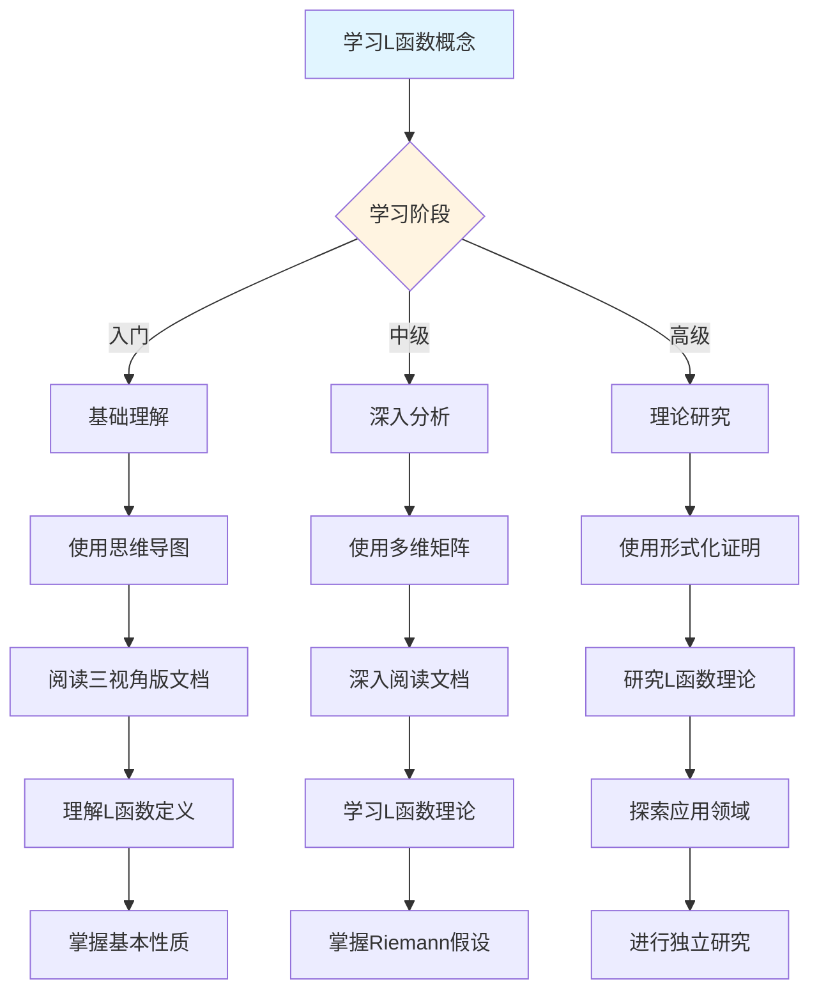
```mermaid
graph TD
    A[学习L函数概念] --> B{学习阶段}
    B -->|入门| C[基础理解]
    B -->|中级| D[深入分析]
    B -->|高级| E[理论研究]

    C --> C1[使用思维导图]
    C1 --> C2[阅读三视角版文档]
    C2 --> C3[理解L函数定义]
    C3 --> C4[掌握基本性质]

    D --> D1[使用多维矩阵]
    D1 --> D2[深入阅读文档]
    D2 --> D3[学习L函数理论]
    D3 --> D4[掌握Riemann假设]

    E --> E1[使用形式化证明]
    E1 --> E2[研究L函数理论]
    E2 --> E3[探索应用领域]
    E3 --> E4[进行独立研究]

    style A fill:#e1f5ff
    style B fill:#fff4e1
```

### 1.2 学习重点决策

**基于知识矩阵的学习重点**：

| 学习阶段 | 知识层次 | 学习重点 | 推荐资源 |
|---------|---------|---------|---------|
| **入门** | L0基础 | L函数的定义、基本例子 | 思维导图、三视角版文档 |
| **入门** | L0基础 | L函数的直观理解（Dirichlet级数、解析延拓） | 三视角版文档、应用实例 |
| **中级** | L1中级 | Riemann zeta函数 | 多维矩阵、形式化证明 |
| **中级** | L1中级 | Dirichlet L函数 | 三视角版文档、习题库 |
| **高级** | L2高级 | L函数理论 | 形式化证明系统 |
| **高级** | L2高级 | Riemann假设 | 形式化证明系统 |

### 1.3 学习方法决策

**基于认知维度的学习方法**：

1. **直观维度**（入门阶段）
   - 使用思维导图建立总体框架
   - 使用具体例子理解概念（Riemann zeta函数、Dirichlet L函数）
   - 使用分析直观理解L函数

2. **知性维度**（中级阶段）
   - 使用多维矩阵分析概念特征
   - 使用概念分类系统理解（Riemann zeta函数、Dirichlet L函数、Artin L函数）
   - 使用关系分析建立联系（与数论、分析、代数的关系）

3. **理性维度**（高级阶段）
   - 使用形式化证明严格理解
   - 使用逻辑推理深入分析
   - 使用系统建构整体把握

---

## 🔬 二、研究决策导图 (编号: C.CORE.028.DECISION.02)

### 2.1 研究方向决策

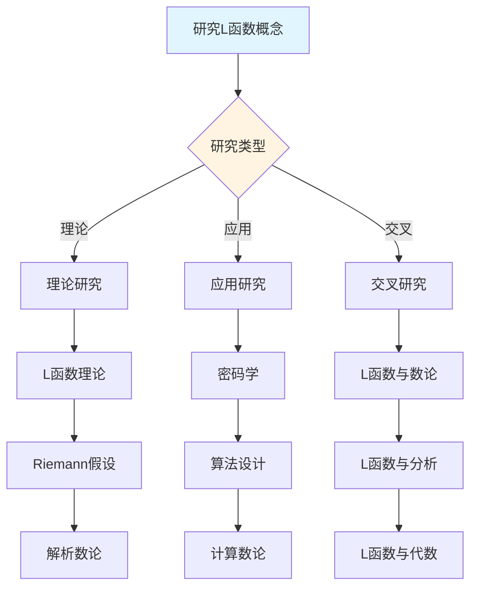
```mermaid
graph TD
    A[研究L函数概念] --> B{研究类型}
    B -->|理论| C[理论研究]
    B -->|应用| D[应用研究]
    B -->|交叉| E[交叉研究]

    C --> C1[L函数理论]
    C1 --> C2[Riemann假设]
    C2 --> C3[解析数论]

    D --> D1[密码学]
    D1 --> D2[算法设计]
    D2 --> D3[计算数论]

    E --> E1[L函数与数论]
    E1 --> E2[L函数与分析]
    E2 --> E3[L函数与代数]

    style A fill:#e1f5ff
    style B fill:#fff4e1
```

### 2.2 研究问题决策

**基于知识矩阵的研究问题**：

1. **理论研究问题**
   - L函数理论：L函数的分类和性质
   - Riemann假设：Riemann假设的证明
   - 解析数论：L函数在解析数论中的应用

2. **应用研究问题**
   - 密码学：L函数在密码学中的应用（素数生成中的L函数）
   - 算法设计：L函数在算法设计中的应用（素性测试）
   - 计算数论：L函数在计算数论中的应用

3. **交叉研究问题**
   - L函数与数论：L函数在数论中的应用
   - L函数与分析：L函数在分析中的应用
   - L函数与代数：L函数在代数中的应用

### 2.3 研究方法决策

**基于形式化证明的研究方法**：

1. **解析方法** → L函数的构造
   - 使用解析方法
   - 适用于L函数构造

2. **数论方法** → L函数理论
   - 使用数论方法
   - 适用于L函数理论

3. **分析方法** → Riemann假设
   - 使用分析方法
   - 适用于Riemann假设研究

---

## 💼 三、应用决策导图 (编号: C.CORE.028.DECISION.03)

### 3.1 应用场景决策

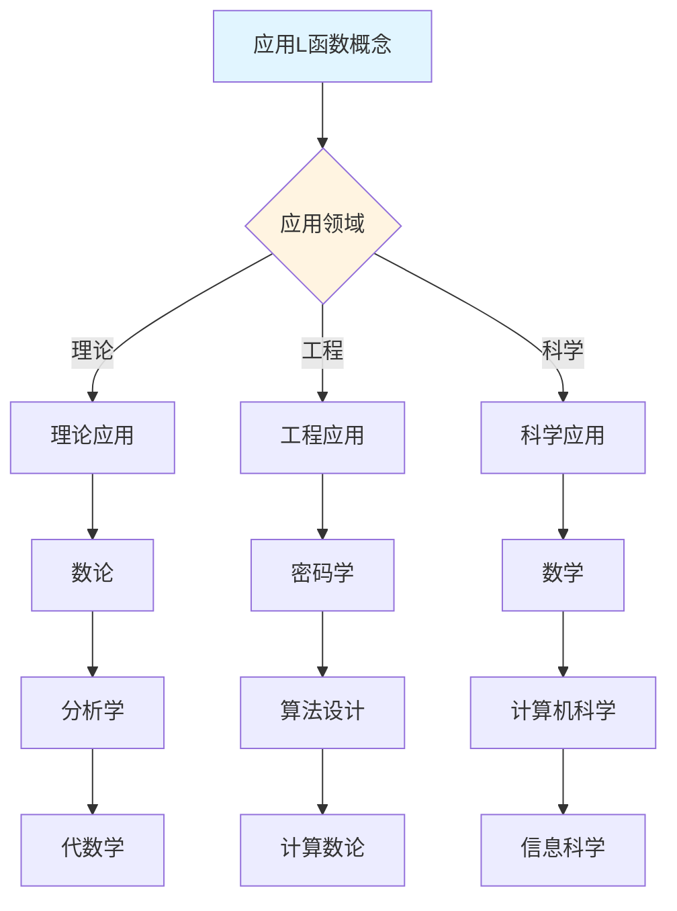
```mermaid
graph TD
    A[应用L函数概念] --> B{应用领域}
    B -->|理论| C[理论应用]
    B -->|工程| D[工程应用]
    B -->|科学| E[科学应用]

    C --> C1[数论]
    C1 --> C2[分析学]
    C2 --> C3[代数学]

    D --> D1[密码学]
    D1 --> D2[算法设计]
    D2 --> D3[计算数论]

    E --> E1[数学]
    E1 --> E2[计算机科学]
    E2 --> E3[信息科学]

    style A fill:#e1f5ff
    style B fill:#fff4e1
```

### 3.2 应用方法决策

**基于应用场景的应用方法**：

1. **理论应用** → 使用形式化证明
   - 数论：L函数是数论的基础
   - 分析学：L函数在分析中的应用
   - 代数学：L函数在代数中的应用

2. **工程应用** → 使用论证过程
   - 密码学：L函数在密码学中的应用（素数生成中的L函数）
   - 算法设计：L函数在算法设计中的应用（素性测试）
   - 计算数论：L函数在计算数论中的应用

3. **科学应用** → 使用综合方法
   - 数学：L函数在数学中的应用
   - 计算机科学：L函数在计算机科学中的应用
   - 信息科学：L函数在信息科学中的应用

---

## 🎓 四、教学决策导图 (编号: C.CORE.028.DECISION.04)

### 4.1 教学内容决策

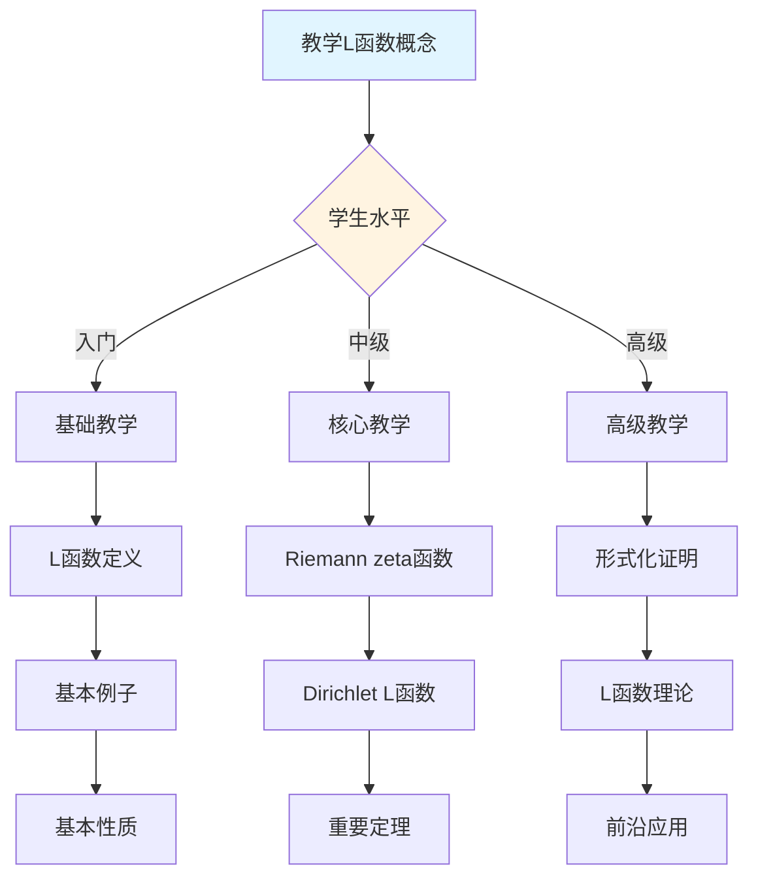
```mermaid
graph TD
    A[教学L函数概念] --> B{学生水平}
    B -->|入门| C[基础教学]
    B -->|中级| D[核心教学]
    B -->|高级| E[高级教学]

    C --> C1[L函数定义]
    C1 --> C2[基本例子]
    C2 --> C3[基本性质]

    D --> D1[Riemann zeta函数]
    D1 --> D2[Dirichlet L函数]
    D2 --> D3[重要定理]

    E --> E1[形式化证明]
    E1 --> E2[L函数理论]
    E2 --> E3[前沿应用]

    style A fill:#e1f5ff
    style B fill:#fff4e1
```

### 4.2 教学方法决策

**基于认知维度的教学方法**：

1. **直观维度**（入门教学）
   - 使用思维导图建立框架
   - 使用具体例子（Riemann zeta函数、Dirichlet L函数）
   - 使用分析直观理解

2. **知性维度**（中级教学）
   - 使用多维矩阵深入分析
   - 使用概念分类系统
   - 使用关系分析建立联系

3. **理性维度**（高级教学）
   - 使用形式化证明严格理解
   - 使用逻辑推理深入分析
   - 使用系统建构整体把握

---

## 🔄 五、整合应用示例 (编号: C.CORE.028.DECISION.05)

### 5.1 完整学习流程示例

**阶段1：入门理解**:

1. 使用学习决策导图 → 确定学习路径：基础概念 → L函数定义 → 基本性质 → 基本应用
2. 使用总体思维导图 → 了解L函数在数论中的位置
3. 阅读[L函数-三视角版](./28-L函数.md) → 理解L函数的定义和基本性质
4. 使用论证过程 → 理解L函数的直观意义（Dirichlet级数、解析延拓、函数方程）

**阶段2：深入分析**:

1. 使用多维矩阵 → 分析L函数的多维度特征（知识层次L0基础层、知识领域D6数论、学习难度较高）
2. 阅读[L函数-三视角版](./28-L函数.md) → 深入理解Riemann zeta函数和Dirichlet L函数
3. 使用形式化证明 → 学习L函数相关定理的形式化证明
4. 使用分支关联思维导图 → 了解L函数与数论、分析、代数的关系

**阶段3：应用研究**:

1. 使用研究决策导图 → 确定研究方向：L函数理论
2. 使用知识关联网络 → 发现L函数与数论、分析、代数的关系
3. 使用形式化证明系统 → 构建L函数理论体系
4. 阅读[L函数-三视角版](./28-L函数.md) → 了解L函数的历史发展和开放问题

---

## 🔗 六、关联文档 (编号: C.CORE.028.DECISION.06)

### 6.1 核心概念文档

- [L函数-三视角版](./28-L函数.md)
- [L函数](./28-L函数.md)

### 6.2 框架文档

- [决策思维导图体系](../01-总体思维导图/05-决策思维导图体系.md)
- [概念体系全面梳理与推进计划](../00-概念体系全面梳理与推进计划-2025年1月.md)
- [核心概念与新框架整合指南](../00-核心概念与新框架整合指南-2025年1月.md)

### 6.3 相关文档

- [核心概念索引](./00-核心概念索引.md)
- [知识矩阵总览](../02-知识矩阵/00-知识矩阵总览.md)
- [形式化证明系统](../00-形式化证明系统-2025年11月.md)

---

**维护状态**: 持续更新中

