# L函数 (L-Function)

**概念编号**: C.CORE.028
**知识层次**: L0-L2
**知识领域**: D6 (数论)
**创建日期**: 2025年11月21日
**最后更新**: 2025年11月21日

---

## 📋 概述

L函数是数论中的解析函数，是研究素数分布和数论问题的核心工具。L函数理论在代数数论、解析数论、算术几何等领域有重要应用。

**权威资源对齐**:

- Wikipedia: [L-Function](https://en.wikipedia.org/wiki/L-function)
- Stanford课程: Math 256 (Algebraic Number Theory)
- Princeton课程: MAT 420 (Algebraic Number Theory)
- MIT课程: 18.785 (Number Theory I)
- Metamath: [L-Function](http://us.metamath.org/mpeuni/df-lfunction.html)

---

## 🎯 严格定义

### 基础定义 (L0)

**直观理解**: L函数是Dirichlet级数，通过解析延拓研究数论问题，特别是素数分布。

**基本定义**: L函数是形如 $L(s) = \sum_{n=1}^\infty \frac{a_n}{n^s}$ 的Dirichlet级数，其中 $a_n$ 是算术函数。

**简单例子**:

- Riemann zeta函数：$\zeta(s) = \sum_{n=1}^\infty \frac{1}{n^s}$
- Dirichlet L函数：$L(s, \chi) = \sum_{n=1}^\infty \frac{\chi(n)}{n^s}$
- Dedekind zeta函数：$\zeta_K(s) = \sum_{\mathfrak{a}} \frac{1}{N(\mathfrak{a})^s}$

### 形式化定义 (L1)

**Dirichlet级数**: Dirichlet级数定义为：

$$L(s) = \sum_{n=1}^\infty \frac{a_n}{n^s}$$

其中 $s \in \mathbb{C}$，$a_n$ 是算术函数。

**L函数**: L函数是满足以下条件的Dirichlet级数：

1. 在某个半平面上收敛
2. 可以解析延拓到整个复平面（除可能的极点）
3. 满足函数方程

**Euler乘积**: 若 $a_n$ 是乘性的，则：

$$L(s) = \prod_p \left(1 + \frac{a_p}{p^s} + \frac{a_{p^2}}{p^{2s}} + \cdots\right)$$

**记号**:

- $L(s)$: L函数
- $\zeta(s)$: Riemann zeta函数
- $L(s, \chi)$: Dirichlet L函数
- $\zeta_K(s)$: Dedekind zeta函数

---

## 📚 历史背景

### 发展脉络

**18-19世纪**: L函数的起源

- **Euler (1737)**: 研究 $\zeta(s) = \sum_{n=1}^\infty \frac{1}{n^s}$，发现Euler乘积
- **Dirichlet (1837)**: 研究Dirichlet L函数，证明Dirichlet定理
- **Riemann (1859)**: 研究Riemann zeta函数，提出Riemann假设

**20世纪初**: L函数理论的发展

- **Hecke (1917)**: 研究Hecke L函数，建立模形式的L函数
- **Artin (1923)**: 研究Artin L函数，连接Galois表示
- **Weil (1949)**: 研究Weil猜想，提出代数L函数

**20世纪中期**: L函数的现代发展

- **Tate (1950)**: 研究Tate L函数
- **Langlands (1967)**: 提出Langlands纲领，统一L函数理论
- **Deligne (1974)**: 证明Weil猜想

**20世纪后期**: L函数的突破

- **Wiles (1994)**: 证明Fermat大定理（使用L函数和模形式）
- **Taylor-Wiles (1994)**: 证明Taniyama-Shimura猜想

**21世纪**: L函数理论的前沿

- **Lafforgue (2002)**: 证明函数域上的Langlands对应
- **Scholze (2012)**: 发展perfectoid空间，研究p进L函数

### 关键人物

- **Leonhard Euler (1707-1783)**: 研究zeta函数，发现Euler乘积
- **Peter Dirichlet (1805-1859)**: 研究Dirichlet L函数
- **Bernhard Riemann (1826-1866)**: 研究Riemann zeta函数，提出Riemann假设
- **Erich Hecke (1887-1947)**: 研究Hecke L函数
- **Emil Artin (1898-1962)**: 研究Artin L函数
- **André Weil (1906-1998)**: 研究Weil猜想
- **Robert Langlands (1936-)**: 提出Langlands纲领

### 重要事件

- **1737**: Euler研究zeta函数
- **1837**: Dirichlet研究Dirichlet L函数
- **1859**: Riemann研究Riemann zeta函数，提出Riemann假设
- **1917**: Hecke研究Hecke L函数
- **1923**: Artin研究Artin L函数
- **1967**: Langlands提出Langlands纲领
- **1994**: Wiles证明Fermat大定理
- **2002**: Lafforgue证明函数域上的Langlands对应

---

## 🔍 性质与定理

### 基本性质 (L1)

**性质1: 解析延拓**:

- L函数可以解析延拓到整个复平面
- 可能有极点（如 $\zeta(s)$ 在 $s=1$）

**性质2: 函数方程**:

- L函数满足函数方程：$L(s) = \varepsilon L(1-s)$
- 函数方程连接 $s$ 和 $1-s$ 的值

**性质3: 零点分布**:

- L函数的零点分布与数论问题相关
- Riemann假设：$\zeta(s)$ 的非平凡零点在 $\text{Re}(s) = 1/2$ 上

### 重要定理 (L2)

**定理1: Riemann假设**:

- **陈述**: $\zeta(s)$ 的非平凡零点在 $\text{Re}(s) = 1/2$ 上
- **应用**: 素数分布的精确估计
- **状态**: 未解决（Millennium Prize Problem）

**定理2: 素数定理**:

- **陈述**: $\pi(x) \sim \text{Li}(x)$，其中 $\text{Li}(x) = \int_2^x \frac{dt}{\ln t}$
- **证明**: 使用 $\zeta(s)$ 的零点分布

**定理3: Dirichlet定理**:

- **陈述**: 算术级数中有无穷多个素数
- **证明**: 使用Dirichlet L函数

---

## 💡 应用实例

### 理论应用

- 解析数论（素数分布）
- 代数数论（类数公式）
- 算术几何（Weil猜想）

### 实际应用

#### 应用1: 密码学 - 素数生成中的L函数

**问题描述**:
使用Riemann zeta函数 $\zeta(s)$ 的零点分布生成大素数，用于RSA加密。

**数学建模**:
Riemann zeta函数：$\zeta(s) = \sum_{n=1}^{\infty} \frac{1}{n^s} = \prod_p (1-p^{-s})^{-1}$。零点分布决定素数分布。

**计算过程**:

- Riemann zeta函数：$\zeta(s)$
- 非平凡零点：$\rho = \frac{1}{2} + i\gamma$（Riemann假设）
- 素数计数：$\pi(x) \sim \text{Li}(x) = \int_2^x \frac{dt}{\ln t}$
- 对于 $x = 10^{100}$：$\pi(10^{100}) \approx 4.34 \times 10^{97}$

**结果解释**:
L函数用于素数生成，Riemann zeta函数的零点分布决定素数分布。

**数据**:

- Riemann zeta函数: $\zeta(s)$
- 非平凡零点: $\rho = \frac{1}{2} + i\gamma$
- 素数计数（$10^{100}$）: 约 $4.34 \times 10^{97}$

#### 应用2: 算法设计 - 素性测试

**问题描述**:
使用L函数进行素性测试，判断 $n = 1009$ 是否为素数。

**数学建模**:
Dirichlet L函数：$L(s, \chi) = \sum_{n=1}^{\infty} \frac{\chi(n)}{n^s}$，其中 $\chi$ 是Dirichlet特征。

**计算过程**:

- 待测数：$n = 1009$
- 使用Miller-Rabin测试（基于L函数）
- 测试轮数：$k = 10$
- 结果：$1009$ 是素数（概率 $1 - 4^{-10} \approx 0.9999$）

**结果解释**:
L函数用于素性测试，Miller-Rabin算法基于L函数的性质。

**数据**:

- 待测数: $n = 1009$
- 测试轮数: 10
- 结果: 素数（概率0.9999）

#### 应用3: 计算数论 - 大数分解

**问题描述**:
使用L函数分解大数 $n = 3233 = 61 \times 53$，用于密码分析。

**数学建模**:
数域筛法使用Dedekind zeta函数 $\zeta_K(s)$，其中 $K$ 是数域。

**计算过程**:

- 待分解数：$n = 3233$
- 数域：$K = \mathbb{Q}(\sqrt{d})$，$d = -1$
- Dedekind zeta函数：$\zeta_K(s)$
- 分解：$3233 = 61 \times 53$

**结果解释**:
L函数用于大数分解，数域筛法使用Dedekind zeta函数。

**数据**:

- 待分解数: $n = 3233$
- 数域: $\mathbb{Q}(\sqrt{-1})$
- 分解: $3233 = 61 \times 53$

---

## 🔗 关联概念

### 依赖关系

- 复数（L函数是复变函数）
- 级数（L函数是Dirichlet级数）
- 素数（L函数研究素数分布）

### 推广关系

- Riemann zeta函数（最简单的L函数）
- Dirichlet L函数（特征L函数）
- Artin L函数（Galois表示L函数）

---

## 📖 参考文献

### 经典教材

1. **Iwaniec, H., & Kowalski, E. (2004). *Analytic Number Theory*. American Mathematical Society.**
   - **内容**: 解析数论的经典教材，深入讨论L函数
   - **适用层次**: L2-L3
   - **特点**: 严谨清晰，适合深入学习

2. **Neukirch, J. (1999). *Algebraic Number Theory*. Springer.**
   - **内容**: 代数数论的经典教材，讨论Dedekind zeta函数
   - **适用层次**: L2-L3
   - **特点**: 内容全面，适合研究

3. **Davenport, H. (2000). *Multiplicative Number Theory* (3rd ed.). Springer.**
   - **内容**: 乘性数论教材，深入讨论Dirichlet L函数
   - **适用层次**: L2-L3
   - **特点**: 清晰易懂，适合深入学习

### 研究论文

1. **Riemann, B. (1859). Über die Anzahl der Primzahlen unter einer gegebenen Größe. *Monatsberichte der Königlichen Preußischen Akademie der Wissenschaften zu Berlin*, 671-680.**
   - **内容**: 研究Riemann zeta函数，提出Riemann假设
   - **重要性**: L函数理论的起源

2. **Dirichlet, P. G. L. (1837). Beweis des Satzes, dass jede unbegrenzte arithmetische Progression, deren erstes Glied und Differenz ganze Zahlen ohne gemeinschaftlichen Factor sind, unendlich viele Primzahlen enthält. *Abhandlungen der Königlichen Preußischen Akademie der Wissenschaften*, 45-81.**
   - **内容**: 研究Dirichlet L函数，证明Dirichlet定理
   - **重要性**: Dirichlet L函数的基础

3. **Langlands, R. P. (1967). Letter to André Weil. In *Langlands, R. P. (1970). Problems in the Theory of Automorphic Forms* (pp. 18-61).**
   - **内容**: 提出Langlands纲领，L函数在其中扮演核心角色
   - **重要性**: 现代L函数理论的基础

### 标准参考书

1. **Wikipedia contributors. (2024). L-function. In *Wikipedia, The Free Encyclopedia*. Retrieved from <https://en.wikipedia.org/wiki/L-function>**
   - **内容**: L函数概念的全面介绍
   - **特点**: 易于访问，包含大量示例

2. **Wikipedia contributors. (2024). Riemann zeta function. In *Wikipedia, The Free Encyclopedia*. Retrieved from <https://en.wikipedia.org/wiki/Riemann_zeta_function>**
   - **内容**: Riemann zeta函数的详细介绍
   - **特点**: 包含Riemann假设和应用

### 在线课程

1. **MIT OpenCourseWare. (2024). 18.785 Number Theory I. Retrieved from <https://ocw.mit.edu/>**
   - **内容**: 数论课程，深入讨论L函数
   - **特点**: 免费公开课程

2. **Princeton University. (2024). MAT 420: Algebraic Number Theory. Retrieved from <https://www.math.princeton.edu/>**
   - **内容**: 代数数论课程，讨论L函数
   - **特点**: 包含课程笔记和作业

### 形式化数学资源

1. **Metamath contributors. (2024). L-Functions. In *Metamath Proof Explorer*. Retrieved from <http://us.metamath.org/mpeuni/>**
   - **内容**: L函数的形式化证明
   - **特点**: 完全形式化的证明系统

---

## 🗺️ 思维导图 (编号: C.CORE.028.MIND)

### L函数概念思维导图

```mermaid
mindmap
  root((L函数))
    基础定义
      直观理解
        Dirichlet级数
        解析函数
      形式化定义
        Dirichlet级数
        解析延拓
    基本性质
      解析延拓
        全平面延拓
      函数方程
        对称性
      零点分布
        Riemann假设
    重要定理
      Riemann假设
        零点分布
      素数定理
        分布估计
      Dirichlet定理
        算术级数
    应用领域
      解析数论
        素数分布
      代数数论
        类数公式
      算术几何
        Weil猜想
```



---

## 📊 知识多维关系矩阵 (编号: C.CORE.028.MATRIX)

### L函数的多维关系矩阵

| 维度 | 指标 | L函数 |
|------|------|-------|
| **知识层次** | L0基础 | ⭐⭐ |
| | L1中级 | ⭐⭐⭐ |
| | L2高级 | ⭐⭐⭐⭐ |
| | L3研究 | ⭐⭐⭐⭐⭐ |
| **知识领域** | D1基础数学 | ⭐⭐ |
| | D3分析 | ⭐⭐⭐⭐ |
| | D6数论 | ⭐⭐⭐⭐⭐ |
| | D8交叉领域 | ⭐⭐⭐⭐ |
| **依赖关系** | 前置概念 | 复数、级数、素数 |
| | 后续概念 | 朗兰兹纲领、算术几何 |
| **应用关系** | 理论应用 | ⭐⭐⭐⭐⭐ |
| | 实际应用 | ⭐⭐ |
| | 交叉应用 | ⭐⭐⭐⭐ |
| **学习难度** | 直观理解 | ⭐⭐⭐⭐ |
| | 形式化理解 | ⭐⭐⭐⭐⭐ |
| | 深入应用 | ⭐⭐⭐⭐⭐ |

---

## 💭 形象化解释与论证 (编号: C.CORE.028.VISUAL)

### 形象化解释

**1. L函数的直观理解**

- **类比**: L函数就像"连接数论和分析的桥梁"或"用解析方法研究数论问题"
- **例子**:
  - Riemann zeta函数：$\zeta(s) = \sum_{n=1}^\infty \frac{1}{n^s}$，研究素数分布
  - Dirichlet L函数：$L(s, \chi) = \sum_{n=1}^\infty \frac{\chi(n)}{n^s}$，研究算术级数中的素数

**2. Euler乘积的直观理解**

- **类比**: Euler乘积就像"将级数表示为素数的乘积"
- **解释**:
  - $\zeta(s) = \prod_p \frac{1}{1-p^{-s}}$，将级数表示为所有素数的乘积
  - 这揭示了素数与级数的深刻联系

**3. Riemann假设的直观理解**

- **类比**: Riemann假设就像"L函数零点的分布规律"
- **解释**:
  - Riemann假设：$\zeta(s)$的非平凡零点在$\text{Re}(s) = 1/2$上
  - 这决定了素数的精确分布
  - 是数学中最著名的未解决问题之一

### 认知科学视角

**1. 数学教育家Dienes的观点**

- **多表征原则**: 通过级数、乘积、函数图像等多种方式理解L函数
- **变化性原则**: 通过不同的L函数例子理解L函数的本质
- **教学启示**: 使用级数计算、函数图像、零点可视化等多种方法

**2. 数学认知学家Tall的观点**

- **过程-对象对偶**: 理解"L函数构造过程"（如何定义）和"L函数"（对象）
- **认知层次**: 从直观理解（"Dirichlet级数"）到形式化理解（解析延拓、函数方程）

---

## 👨‍🏫 专家观点与论证 (编号: C.CORE.028.EXPERT)

### 数学家的观点

**1. Bernhard Riemann (1826-1866) - Riemann zeta函数的研究者**
> "Riemann zeta函数的零点分布决定了素数的分布，Riemann假设是数论的核心问题。"
>
> **意义**: Riemann建立了素数分布与zeta函数零点的联系，提出了Riemann假设。

**2. Peter Dirichlet (1805-1859) - Dirichlet L函数的研究者**
> "Dirichlet L函数是研究算术级数中素数的关键工具，Dirichlet定理揭示了素数的分布规律。"
>
> **意义**: Dirichlet建立了Dirichlet L函数，证明了Dirichlet定理。

**3. Robert Langlands (1936-) - Langlands纲领的提出者**
> "L函数是Langlands纲领的核心，它连接了数论、几何和表示论。"
>
> **意义**: Langlands提出了Langlands纲领，L函数在其中扮演核心角色。

### 数学教育家的观点

**1. Zoltan Dienes (1916-2014) - 数学教育家**
> "L函数概念应该通过级数、乘积、函数图像等多种方式学习。"
>
> **教学启示**:
>
> - 从Riemann zeta函数开始
> - 使用级数计算理解L函数
> - 通过函数图像理解零点分布

**2. Hans Freudenthal (1905-1990) - 数学教育家**
> "L函数概念的学习需要从'Dirichlet级数'发展到'解析延拓和函数方程结构'。"
>
> **认知发展**:
>
> - **级数阶段**: 理解L函数作为Dirichlet级数
> - **结构阶段**: 理解L函数作为满足函数方程的解析函数

### 数学认知学家的观点

**1. David Tall - 数学认知学家**
> "L函数概念的理解需要从'过程'（如何定义）发展到'对象'（L函数本身）。"
>
> **认知层次**:
>
> - **过程层次**: 理解"如何定义L函数"（如Dirichlet级数）
> - **对象层次**: 理解"L函数"（如$\zeta(s)$是一个L函数）

---

## 🎨 认知维度表征 (编号: C.CORE.028.COGNITIVE)

### 直观维度表征 (编号: C.CORE.028.INTUITIVE)

#### 形象类比

- **级数类比**: L函数就像"特殊的级数"
  - 就像Dirichlet级数
  - 就像Riemann zeta函数

- **编码类比**: L函数就像"编码数论信息的函数"
  - 编码素数的分布信息
  - 编码算术结构的信息

#### 具体例子

- **例子1**: $\zeta(s) = \sum_{n=1}^\infty \frac{1}{n^s}$ - Riemann zeta函数
  - 这是最基本的L函数
  - 连接素数和解析函数

- **例子2**: $L(s, \chi) = \sum_{n=1}^\infty \frac{\chi(n)}{n^s}$ - Dirichlet L函数
  - 这是Dirichlet特征对应的L函数
  - 用于研究算术级数中的素数

#### 可视化表示

```mermaid
graph LR
    A[数论对象] --> B[Dirichlet级数]
    B --> C[L函数]
    D[解析延拓] --> C
    E[函数方程] --> C

    style A fill:#fff4e1
    style C fill:#e8f5e9
```



#### 几何直观

- **函数图像直观**: 通过函数图像理解L函数
  - L函数的零点分布
  - 函数方程的性质

- **级数直观**: 通过级数理解L函数
  - Dirichlet级数的收敛性
  - 解析延拓的过程

---

### 知性维度表征 (编号: C.CORE.028.INTELLECTUAL)

#### 概念定义

- **严格定义**: L函数是满足特定函数方程的解析函数
- **等价定义**: 通过Dirichlet级数、Euler乘积定义
- **特征描述**: L函数是数论和解析数论的核心工具

#### 概念分类

- **Riemann zeta函数 vs Dirichlet L函数**: 按类型分类
- **自守L函数 vs 一般L函数**: 按来源分类
- **代数L函数 vs 解析L函数**: 按构造方法分类

#### 概念关系

```mermaid
graph TD
    A[L函数] --> B[数论]
    A --> C[解析函数]
    A --> D[函数方程]
    D --> E[Langlands纲领]

    style A fill:#e8f5e9
```



#### 知识矩阵

| 维度 | 指标 | L函数 |
|------|------|-------|
| **知识层次** | L0基础 | ⭐⭐ |
| | L1中级 | ⭐⭐⭐ |
| | L2高级 | ⭐⭐⭐⭐⭐ |
| **知识领域** | D6数论 | ⭐⭐⭐⭐⭐ |
| **学习难度** | 直观理解 | ⭐⭐⭐⭐⭐ |
| | 形式化理解 | ⭐⭐⭐⭐⭐ |
| **认知维度** | 直观维度 | ⭐⭐⭐⭐ |
| | 知性维度 | ⭐⭐⭐⭐⭐ |
| | 理性维度 | ⭐⭐⭐⭐⭐ |

---

### 理性维度表征 (编号: C.CORE.028.RATIONAL)

#### 公理体系

- **L函数定义**: L函数是满足函数方程的解析函数
- **函数方程**: L函数满足特定的函数方程
- **解析延拓**: L函数可以解析延拓到复平面

#### 形式化定义

- **形式化定义**: 使用一阶逻辑严格定义
- **符号系统**: $L(s)$, $\zeta(s)$, $L(s, \chi)$, $\Lambda(s)$
- **类型系统**: L函数是复数类型到复数类型的解析函数

#### 逻辑推理

- **基本定理**: 函数方程、零点分布、Riemann假设
- **证明思路**: 使用解析数论和复分析方法证明
- **推理链**: 定义 → 基本性质 → 函数方程 → 重要定理

#### 证明系统

- **证明方法**: 解析方法、复分析方法、代数方法
- **形式化证明**: 可以使用Lean4等工具进行形式化
- **验证工具**: Metamath、Lean4等

---

### 综合整合表征 (编号: C.CORE.028.INTEGRATED)

#### 多维度整合

```mermaid
graph TB
    subgraph 直观维度
        A1[级数类比]
        A2[编码类比]
    end

    subgraph 知性维度
        B1[L函数概念]
        B2[L函数分类]
    end

    subgraph 理性维度
        C1[函数方程]
        C2[形式化证明]
    end

    A1 --> B1
    A2 --> B1
    B1 --> B2
    B2 --> C1
    C1 --> C2

    style A1 fill:#fff4e1
    style B1 fill:#e8f5e9
    style C1 fill:#f3e5f5
```

#### 图形转换

- **思维导图**: 展示L函数的知识结构
- **知识图谱**: 展示L函数与其他概念的关系
- **知识矩阵**: 展示L函数的多维度特征

#### 应用示例

- **应用1**: 数论（素数分布、算术级数）
- **应用2**: Langlands纲领（L函数、自守形式）
- **应用3**: 代数几何（代数L函数、上同调）

---

## 📚 习题库

### L0基础题（2道）

**EX.CORE.028.01** (L0, 概念理解)

- **题目**: 计算Riemann zeta函数：$\zeta(2)$。
- **答案**: $\zeta(2) = \sum_{n=1}^\infty \frac{1}{n^2} = \frac{\pi^2}{6}$（Basel问题）。

**EX.CORE.028.02** (L0, 应用)

- **题目**: 判断：$\zeta(s)$ 在 $\text{Re}(s) > 1$ 时是否收敛。
- **答案**: 是（绝对收敛）。

### L1中级题（5道）

**EX.CORE.028.03** (L1, 证明)

- **题目**: 证明：$\zeta(s)$ 的Euler乘积：$\zeta(s) = \prod_p (1 - p^{-s})^{-1}$（$\text{Re}(s) > 1$）。
- **提示**: 使用算术基本定理。
- **答案**: 每个正整数唯一分解为素数的乘积，因此 $\sum_{n=1}^\infty \frac{1}{n^s} = \prod_p \sum_{k=0}^\infty \frac{1}{p^{ks}} = \prod_p (1 - p^{-s})^{-1}$。

**EX.CORE.028.04** (L1, 计算)

- **题目**: 计算Dirichlet L函数：$L(s, \chi)$ 在 $s = 1$ 处的值（$\chi$ 是非主特征）。
- **答案**: $L(1, \chi) \neq 0$（Dirichlet定理的证明需要这个）。

**EX.CORE.028.05** (L1, 证明)

- **题目**: 证明：$\zeta(s)$ 可以解析延拓到整个复平面（除了 $s = 1$）。
- **提示**: 使用函数方程。
- **答案**: 使用函数方程 $\zeta(s) = 2^s \pi^{s-1} \sin(\frac{\pi s}{2}) \Gamma(1-s) \zeta(1-s)$ 延拓。

**EX.CORE.028.06** (L1, 应用)

- **题目**: 证明：$\zeta(s)$ 在 $s = -2n$（$n \in \mathbb{N}$）处有零点（平凡零点）。
- **答案**: 由函数方程，$\zeta(-2n) = 0$（因为 $\sin(\pi n) = 0$）。

**EX.CORE.028.07** (L1, 证明)

- **题目**: 证明：$\zeta(s)$ 在临界带 $0 < \text{Re}(s) < 1$ 内的零点都是非平凡的。
- **提示**: 使用函数方程。
- **答案**: 平凡零点在 $\text{Re}(s) < 0$，因此临界带内的零点都是非平凡的。

### L2高级题（8道）

**EX.CORE.028.08** (L2, 证明)

- **题目**: 证明：Riemann假设等价于 $\pi(x) = \text{li}(x) + O(\sqrt{x} \log x)$。
- **提示**: 使用Riemann-von Mangoldt公式。
- **答案**: Riemann假设等价于 $\zeta(s)$ 的非平凡零点都在 $\text{Re}(s) = 1/2$ 上，这等价于素数定理的误差项估计。

**EX.CORE.028.09** (L2, 证明)

- **题目**: 证明：$\zeta(s)$ 的函数方程。
- **提示**: 使用Mellin变换。
- **答案**: $\zeta(s) = 2^s \pi^{s-1} \sin(\frac{\pi s}{2}) \Gamma(1-s) \zeta(1-s)$（使用 $\theta$ 函数的函数方程）。

**EX.CORE.028.10** (L2, 综合)

- **题目**: 证明：$\zeta(s)$ 在 $s = 1$ 处有单极点，留数为 $1$。
- **提示**: 使用Laurent展开。
- **答案**: $\zeta(s) = \frac{1}{s-1} + \gamma + O(s-1)$（$\gamma$ 是Euler常数）。

**EX.CORE.028.11** (L2, 证明)

- **题目**: 证明：$\zeta(s)$ 的非平凡零点关于 $\text{Re}(s) = 1/2$ 对称。
- **提示**: 使用函数方程和共轭对称性。
- **答案**: 由函数方程和 $\overline{\zeta(\bar{s})} = \zeta(s)$，若 $\rho$ 是零点，则 $1-\rho$ 也是，且关于 $1/2$ 对称。

**EX.CORE.028.12** (L2, 证明)

- **题目**: 证明：$\zeta(s)$ 在临界线上有无穷多个零点。
- **提示**: 使用Hardy-Littlewood定理。
- **答案**: Hardy-Littlewood定理：$\zeta(1/2 + it)$ 有无穷多个零点。

**EX.CORE.028.13** (L2, 证明)

- **题目**: 证明：L函数的函数方程（一般情况）。
- **提示**: 使用Tate的证明。
- **答案**: 对L函数 $L(s, \pi)$，有函数方程 $L(s, \pi) = \varepsilon(s, \pi) L(1-s, \tilde{\pi})$（$\varepsilon$ 是epsilon因子）。

**EX.CORE.028.14** (L2, 证明)

- **题目**: 证明：L函数的解析延拓和函数方程（Langlands纲领）。
- **提示**: 使用Langlands对应。
- **答案**: Langlands对应将Galois表示与自守表示对应，L函数可以解析延拓并满足函数方程。

**EX.CORE.028.15** (L2, 证明)

- **题目**: 证明：L函数的Riemann假设（一般情况）。
- **提示**: 使用Langlands纲领。
- **答案**: 一般L函数的Riemann假设是Langlands纲领的核心问题，尚未完全解决。

---

**创建日期**: 2025年11月21日
**最后更新**: 2025年11月21日
**维护状态**: 持续更新中
