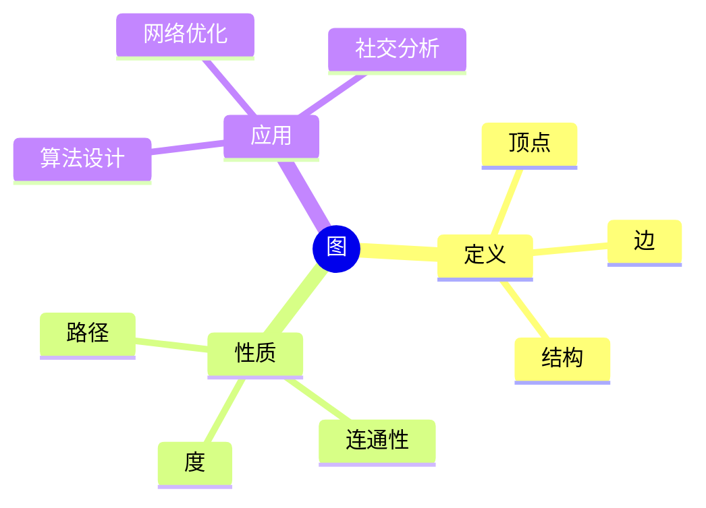
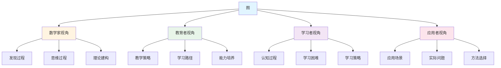
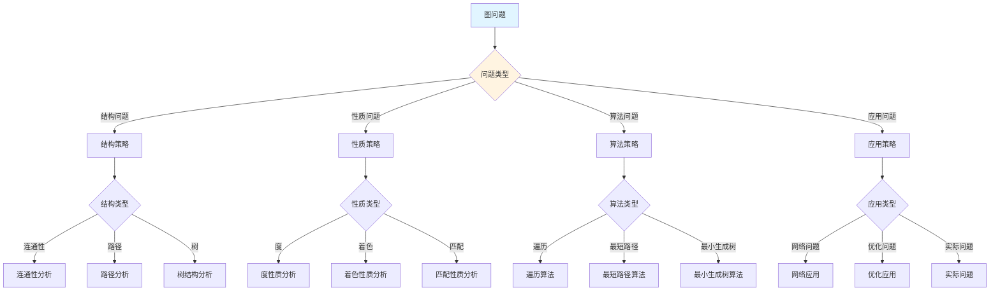
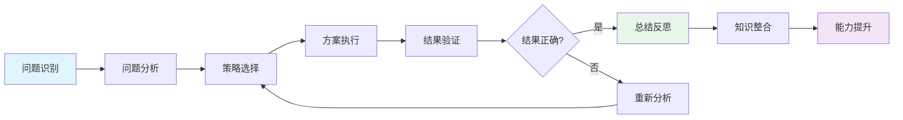
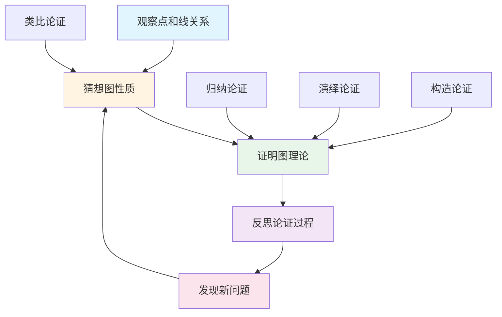
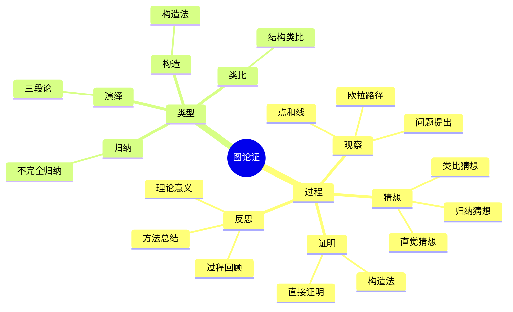

# 图 (Graph) - 三视角组织版

**概念编号**: C.CORE.029
**知识层次**: L0-L2
**知识领域**: D7 (离散数学)
**创建日期**: 2025年1月
**最后更新**: 2025年1月

---

## 📋 目录 / Table of Contents

- [图 (Graph) - 三视角组织版](#图-graph---三视角组织版)
  - [📋 目录 / Table of Contents](#-目录--table-of-contents)
  - [1. 📋 概述 (编号: C.CORE.029.01)](#1--概述-编号-ccore02901)
  - [🧠 认知学视角：如何理解图 (编号: C.CORE.029.02)](#-认知学视角如何理解图-编号-ccore02902)
    - [认知起点 (编号: C.CORE.029.02.01)](#认知起点-编号-ccore0290201)
    - [认知过程 (编号: C.CORE.029.02.02)](#认知过程-编号-ccore0290202)
      - [阶段1：直观理解阶段 (编号: C.CORE.029.02.02.01)](#阶段1直观理解阶段-编号-ccore029020201)
      - [阶段2：概念形成阶段 (编号: C.CORE.029.02.02.02)](#阶段2概念形成阶段-编号-ccore029020202)
      - [阶段3：形式化阶段 (编号: C.CORE.029.02.02.03)](#阶段3形式化阶段-编号-ccore029020203)
    - [认知障碍 (编号: C.CORE.029.02.03)](#认知障碍-编号-ccore0290203)
    - [认知工具 (编号: C.CORE.029.02.04)](#认知工具-编号-ccore0290204)
  - [🎓 教育学视角：如何教学图 (编号: C.CORE.029.03)](#-教育学视角如何教学图-编号-ccore02903)
    - [教学目标 (编号: C.CORE.029.03.01)](#教学目标-编号-ccore0290301)
    - [教学路径 (编号: C.CORE.029.03.02)](#教学路径-编号-ccore0290302)
      - [阶段1：引入阶段（激发兴趣） (编号: C.CORE.029.03.02.01)](#阶段1引入阶段激发兴趣-编号-ccore029030201)
      - [阶段2：探索阶段（主动建构） (编号: C.CORE.029.03.02.02)](#阶段2探索阶段主动建构-编号-ccore029030202)
      - [阶段3：形式化阶段（抽象概括） (编号: C.CORE.029.03.02.03)](#阶段3形式化阶段抽象概括-编号-ccore029030203)
      - [阶段4：巩固阶段（应用深化） (编号: C.CORE.029.03.02.04)](#阶段4巩固阶段应用深化-编号-ccore029030204)
    - [教学难点 (编号: C.CORE.029.03.03)](#教学难点-编号-ccore0290303)
    - [教学策略 (编号: C.CORE.029.03.04)](#教学策略-编号-ccore0290304)
    - [评估方法 (编号: C.CORE.029.03.05)](#评估方法-编号-ccore0290305)
  - [🔬 数学家视角：如何思考图 (编号: C.CORE.029.04)](#-数学家视角如何思考图-编号-ccore02904)
    - [问题起源 (编号: C.CORE.029.04.01)](#问题起源-编号-ccore0290401)
    - [思维过程 (编号: C.CORE.029.04.02)](#思维过程-编号-ccore0290402)
      - [步骤1：问题提出 (编号: C.CORE.029.04.02.01)](#步骤1问题提出-编号-ccore029040201)
      - [步骤2：概念形成 (编号: C.CORE.029.04.02.02)](#步骤2概念形成-编号-ccore029040202)
      - [步骤3：理论发展 (编号: C.CORE.029.04.02.03)](#步骤3理论发展-编号-ccore029040203)
    - [历史发展 (编号: C.CORE.029.04.03)](#历史发展-编号-ccore0290403)
    - [3.2 关键人物和贡献 (编号: C.CORE.029.04.04)](#32-关键人物和贡献-编号-ccore0290404)
    - [重要定理 (编号: C.CORE.029.04.05)](#重要定理-编号-ccore0290405)
    - [开放问题 (编号: C.CORE.029.04.06)](#开放问题-编号-ccore0290406)
    - [一、第一人称思维描述 (编号: C.CORE.029.04.07)](#一第一人称思维描述-编号-ccore0290407)
      - [1.1 Euler的发现过程](#11-euler的发现过程)
    - [二、数学直觉的形成 (编号: C.CORE.029.04.08)](#二数学直觉的形成-编号-ccore0290408)
      - [2.1 直觉在概念发现中的作用](#21-直觉在概念发现中的作用)
      - [2.2 如何培养图直觉](#22-如何培养图直觉)
    - [三、数学美的教育价值 (编号: C.CORE.029.04.09)](#三数学美的教育价值-编号-ccore0290409)
      - [3.1 图论的美在哪里](#31-图论的美在哪里)
      - [3.2 如何培养学生的数学美感](#32-如何培养学生的数学美感)
    - [四、问题解决策略 (编号: C.CORE.029.04.10)](#四问题解决策略-编号-ccore0290410)
      - [4.1 数学家的启发式方法](#41-数学家的启发式方法)
      - [4.2 思维过程分析](#42-思维过程分析)
    - [五、批判性反思 (编号: C.CORE.029.04.11)](#五批判性反思-编号-ccore0290411)
      - [5.1 图概念的局限性](#51-图概念的局限性)
      - [5.2 图理论的未解决问题](#52-图理论的未解决问题)
  - [💡 数学解释：为什么图是这样定义的 (编号: C.CORE.029.05)](#-数学解释为什么图是这样定义的-编号-ccore02905)
    - [一、直观解释：图是什么？](#一直观解释图是什么)
      - [1.1 具体例子](#11-具体例子)
      - [1.2 形象类比](#12-形象类比)
      - [1.3 几何直观](#13-几何直观)
      - [1.4 操作体验](#14-操作体验)
    - [二、知性解释：图的本质是什么？](#二知性解释图的本质是什么)
      - [2.1 概念定义](#21-概念定义)
      - [2.2 分类体系](#22-分类体系)
      - [2.3 抽象结构](#23-抽象结构)
      - [2.4 知识体系](#24-知识体系)
    - [三、理性解释：图的公理化定义](#三理性解释图的公理化定义)
      - [3.1 公理体系](#31-公理体系)
      - [3.2 形式化证明](#32-形式化证明)
      - [3.3 系统建构](#33-系统建构)
    - [四、多视角解释：从不同角度理解图](#四多视角解释从不同角度理解图)
      - [4.1 数学家视角：图是如何被发现的？](#41-数学家视角图是如何被发现的)
      - [4.2 教育者视角：如何教学图？](#42-教育者视角如何教学图)
      - [4.3 学习者视角：如何学习图？](#43-学习者视角如何学习图)
      - [4.4 应用者视角：如何应用图？](#44-应用者视角如何应用图)
    - [五、思维表征：用多种方式理解图](#五思维表征用多种方式理解图)
      - [5.1 思维导图：图的知识结构](#51-思维导图图的知识结构)
      - [5.2 矩阵对比：不同解释方式的对比](#52-矩阵对比不同解释方式的对比)
      - [5.3 多视角表征：从不同角度表征图](#53-多视角表征从不同角度表征图)
      - [5.4 决策树：图问题分类和策略选择](#54-决策树图问题分类和策略选择)
      - [5.5 决策逻辑路径：图问题解决过程](#55-决策逻辑路径图问题解决过程)
      - [5.6 多维对比矩阵：图概念特征对比](#56-多维对比矩阵图概念特征对比)
  - [� 数学论证：如何论证图 (编号: C.CORE.029.06)](#-数学论证如何论证图-编号-ccore02906)
    - [一、论证过程：从观察到反思](#一论证过程从观察到反思)
      - [1.1 观察（Observation）](#11-观察observation)
      - [1.2 猜想（Conjecture）](#12-猜想conjecture)
      - [1.3 证明（Proof）](#13-证明proof)
      - [1.4 反思（Reflection）](#14-反思reflection)
    - [二、论证类型：多种推理方式](#二论证类型多种推理方式)
      - [2.1 归纳论证（Inductive Reasoning）](#21-归纳论证inductive-reasoning)
      - [2.2 演绎论证（Deductive Reasoning）](#22-演绎论证deductive-reasoning)
      - [2.3 类比论证（Analogical Reasoning）](#23-类比论证analogical-reasoning)
      - [2.4 构造论证（Constructive Reasoning）](#24-构造论证constructive-reasoning)
    - [三、论证可视化：用图形表示论证过程](#三论证可视化用图形表示论证过程)
      - [3.1 论证流程图](#31-论证流程图)
      - [3.2 论证类型对比](#32-论证类型对比)
      - [3.3 论证思维导图](#33-论证思维导图)
  - [🔗 三视角整合 (编号: C.CORE.029.07)](#-三视角整合-编号-ccore02907)
    - [三个视角的关联](#三个视角的关联)
    - [如何综合运用三个视角](#如何综合运用三个视角)
  - [📚 参考文献 (编号: C.CORE.029.08)](#-参考文献-编号-ccore02908)
    - [权威资源](#权威资源)
    - [经典教材](#经典教材)
    - [研究论文](#研究论文)

---

## 1. 📋 概述 (编号: C.CORE.029.01)

图是离散数学的基础概念，由顶点和边组成，用于建模关系和网络。图论在计算机科学、运筹学、网络分析等领域有广泛应用。

本文档从**数学认知学**、**教育学**、**数学家**三个视角深入展开图概念，避免简单的概念堆垒。

**权威资源对齐**:

- Wikipedia: [Graph (Discrete Mathematics)](https://en.wikipedia.org/wiki/Graph_(discrete_mathematics))
- Stanford课程: CS 161 (Design and Analysis of Algorithms)
- Princeton课程: COS 423 (Theory of Algorithms)
- MIT课程: 6.006 (Introduction to Algorithms)
- Metamath: [Graph](http://us.metamath.org/mpeuni/df-graph.html)

---

## 🧠 认知学视角：如何理解图 (编号: C.CORE.029.02)

### 认知起点 (编号: C.CORE.029.02.01)

**学习者已有的知识基础**:

- 集合的概念
- 关系的概念
- 日常经验中的"网络"、"连接"概念

**日常经验中的类似概念**:

- "网络"：节点和连接
- "关系"：对象之间的关系
- "连接"：点之间的连接

### 认知过程 (编号: C.CORE.029.02.02)

#### 阶段1：直观理解阶段 (编号: C.CORE.029.02.02.01)

**具体例子**:

- 例子1：完全图 - 每对顶点都有边
- 例子2：树 - 连通无环图
- 例子3：二分图 - 顶点可以分成两部分

**形象类比**:

- **网络类比**: 图就像"网络"
  - 顶点是"节点"
  - 边是"连接"
  - 图描述"关系"

- **关系类比**: 图就像"关系图"
  - 顶点是"对象"
  - 边是"关系"
  - 图描述"关系结构"

**可视化表示**:

```text
图:
    ●───●
    │   │
    ●───●
    顶点和边
```

#### 阶段2：概念形成阶段 (编号: C.CORE.029.02.02.02)

**从例子中抽象出共同特征**:

- 所有例子都涉及"顶点和边"
- 顶点是"对象"
- 边是"关系"

**识别关键属性**:

1. **顶点集**: $V$是有限集合
2. **边集**: $E$是边的集合
3. **结构**: 图描述关系结构

**建立概念边界**:

- **什么是图**: 由顶点集和边集组成的结构
- **什么不是图**:
  - 只有顶点没有边（不是图）
  - 只有边没有顶点（不是图）

#### 阶段3：形式化阶段 (编号: C.CORE.029.02.02.03)

**严格定义**:

- 图定义：$G = (V, E)$，其中$V$是顶点集，$E$是边集
- 无向图：边是无序对
- 有向图：边是有序对

**公理化表述**:

- 条件1：顶点集
- 条件2：边集
- 条件3：边连接顶点

**逻辑结构**:

- 图是离散数学的基础
- 图可以建模关系和网络
- 图是算法设计的基础

### 认知障碍 (编号: C.CORE.029.02.03)

**常见误解**:

1. **误解1**: 认为图就是图形
   - **纠正**: 图是数学结构，不是图形

2. **误解2**: 认为所有图都相同
   - **纠正**: 不同的图有不同的结构

3. **误解3**: 混淆无向图和有向图
   - **纠正**: 无向图边无序，有向图边有序

**理解难点**:

1. **难点1**: 图的抽象性
   - **原因**: 图比较抽象
   - **解决方法**: 从具体例子开始，逐步抽象

2. **难点2**: 图的性质
   - **原因**: 图的性质比较多
   - **解决方法**: 用具体例子，逐步掌握性质

3. **难点3**: 图的算法
   - **原因**: 图算法比较复杂
   - **解决方法**: 用具体例子，逐步掌握算法

**认知陷阱**:

- **图形**: 需要理解图是数学结构
- **结构**: 需要理解图的结构

### 认知工具 (编号: C.CORE.029.02.04)

**类比工具**:

- **网络类比**: 图 = 网络
- **关系类比**: 图 = 关系图

**可视化工具**:

- **图表示**: 用图表示图
- **邻接矩阵**: 用邻接矩阵表示图

**具体化工具**:

- **具体例子**: 用具体例子理解抽象概念
- **反例**: 用反例理解概念边界

---

## 🎓 教育学视角：如何教学图 (编号: C.CORE.029.03)

### 教学目标 (编号: C.CORE.029.03.01)

**知识目标**:

- 理解图的基本概念
- 掌握图的定义
- 理解图的性质
- 理解图的应用

**能力目标**:

- 能够表示图
- 能够理解图的性质
- 能够应用图解决实际问题
- 能够理解图的重要性

**情感目标**:

- 培养数学抽象思维
- 培养离散思维
- 激发对数学的兴趣

### 教学路径 (编号: C.CORE.029.03.02)

#### 阶段1：引入阶段（激发兴趣） (编号: C.CORE.029.03.02.01)

**实际问题**:

- 问题1：如何表示网络？
- 问题2：如何研究关系？
- 问题3：如何设计算法？

**历史背景**:

- 图论的历史发展
- 图论在数学中的地位
- 图论在计算机科学中的应用

**引发认知冲突**:

- 问题：如何统一表示各种关系？
- 引出图的概念

#### 阶段2：探索阶段（主动建构） (编号: C.CORE.029.03.02.02)

**引导发现**:

1. 让学生自己列举"网络"的例子
2. 让学生观察这些例子的共同特征
3. 引导学生抽象出图的定义

**合作探究**:

- 小组讨论：什么是图？
- 小组讨论：图有哪些性质？
- 小组讨论：如何表示图？

**多元表征**:

- **语言表征**: "图是由顶点和边组成的结构"
- **符号表征**: $G = (V, E)$
- **图形表征**: 图表示、邻接矩阵
- **集合表征**: 图定义

#### 阶段3：形式化阶段（抽象概括） (编号: C.CORE.029.03.02.03)

**严格定义**:

- 图的定义
- 图的性质
- 图的算法

**性质证明**:

- 图的基本性质
- 图的连通性
- 图的着色

**应用拓展**:

- 图在计算机科学中的应用
- 图在运筹学中的应用
- 图在网络分析中的应用

#### 阶段4：巩固阶段（应用深化） (编号: C.CORE.029.03.02.04)

**练习应用**:

- 基础练习：图的表示和性质
- 应用练习：用图解决实际问题
- 综合练习：图的综合应用

**变式训练**:

- 不同形式的图
- 不同性质的图
- 图的应用

**知识整合**:

- 图与其他概念的联系
- 图在数学体系中的地位

### 教学难点 (编号: C.CORE.029.03.03)

**难点1：图的抽象性**:

- **难点描述**: 学生难以理解图的抽象概念
- **解决方法**:
  - 从具体例子开始
  - 逐步抽象
  - 用具体例子说明

**难点2：图的性质**:

- **难点描述**: 学生难以理解图的性质
- **解决方法**:
  - 用具体例子
  - 逐步掌握性质
  - 用图形可视化

**难点3：图的算法**:

- **难点描述**: 学生难以掌握图算法
- **解决方法**:
  - 用具体例子
  - 逐步掌握算法
  - 用练习巩固

### 教学策略 (编号: C.CORE.029.03.04)

**策略1：从具体到抽象**:

- 先给出具体例子
- 再抽象出一般概念
- 最后给出严格定义

**策略2：多元表征**:

- 用语言、符号、图形等多种方式表示同一概念
- 帮助学生建立不同表征之间的联系

**策略3：问题驱动**:

- 从实际问题出发
- 引出数学概念
- 解决问题

**策略4：可视化教学**:

- 使用图表示
- 使用邻接矩阵
- 使用具体例子

### 评估方法 (编号: C.CORE.029.03.05)

**形成性评估**（评估理解过程）:

- 课堂提问：检查学生对概念的理解
- 小组讨论：观察学生的思考过程
- 练习作业：检查学生的应用能力

**总结性评估**（评估最终理解）:

- 测验：检查学生对概念和性质的掌握
- 项目：检查学生应用图解决实际问题的能力
- 反思：检查学生对图概念的理解深度

---

## 🔬 数学家视角：如何思考图 (编号: C.CORE.029.04)

### 问题起源 (编号: C.CORE.029.04.01)

**历史背景**:

- 18世纪：图论的起源
- 19-20世纪：图论的发展
- 20世纪中期：图论的现代发展

**原始问题**:

- **问题1**: 如何表示网络？
- **问题2**: 如何研究关系？
- **问题3**: 图有哪些性质？

**研究动机**:

- 统一离散数学理论
- 发展图论
- 研究算法设计

### 思维过程 (编号: C.CORE.029.04.02)

#### 步骤1：问题提出 (编号: C.CORE.029.04.02.01)

**观察到的现象**:

- 需要表示网络
- 需要研究关系
- 需要统一离散数学理论

**提出的猜想**:

- 可以引入图概念
- 图可以表示网络和关系
- 图有丰富的性质

**需要解决的问题**:

- 如何定义图？
- 图应该满足什么条件？
- 图有哪些性质？

#### 步骤2：概念形成 (编号: C.CORE.029.04.02.02)

**尝试性定义**:

- **集合定义**: 通过顶点集和边集
- **关系定义**: 通过关系

**性质探索**:

- 图的基本性质
- 图的连通性
- 图的着色

**结构发现**:

- 图是离散数学的基础
- 图可以建模关系和网络
- 图是算法设计的基础

#### 步骤3：理论发展 (编号: C.CORE.029.04.02.03)

**定理证明**:

- 图的基本性质
- 图的连通性
- 图的着色

**应用拓展**:

- 图在计算机科学中的应用
- 图在运筹学中的应用
- 图在网络分析中的应用

**理论完善**:

- 图的严格定义
- 图的范畴论研究
- 图的应用研究

### 历史发展 (编号: C.CORE.029.04.03)

**早期阶段**（18世纪）:

- **Euler (1736)**: 解决Königsberg七桥问题
- **Hamilton (1856)**: 研究Hamilton回路

**关键突破**（19-20世纪）:

- **Kuratowski (1930)**: 研究平面图
- **Tutte (1947)**: 研究图着色

**现代发展**（20世纪中期）:

- **Erdős (1950s)**: 发展随机图理论
- **Lovász (1970s)**: 发展图论算法

### 3.2 关键人物和贡献 (编号: C.CORE.029.04.04)

**Leonhard Euler (1707-1783)**:

- 解决Königsberg七桥问题
- 建立图论基础

**William Rowan Hamilton (1805-1865)**:

- 研究Hamilton回路
- 建立图论基础

**Paul Erdős (1913-1996)**:

- 发展随机图理论
- 建立现代图论

### 重要定理 (编号: C.CORE.029.04.05)

**Euler公式**:

- 平面图的顶点数、边数、面数满足$V - E + F = 2$
- 意义：平面图的基础

**四色定理**:

- 平面图可以用4种颜色着色
- 意义：图着色的重要结果

**Kuratowski定理**:

- 图是平面的当且仅当不包含$K_5$或$K_{3,3}$的细分
- 意义：平面图的判定

### 开放问题 (编号: C.CORE.029.04.06)

**未解决问题**:

- 图的分类问题
- 图的算法问题
- 图的应用问题

**研究方向**:

- 图的范畴论研究
- 图的算法研究
- 图的应用研究

### 一、第一人称思维描述 (编号: C.CORE.029.04.07)

#### 1.1 Euler的发现过程

**详细历史背景**:

- **1736年**：Euler解决Königsberg七桥问题
- **背景**：研究拓扑问题，发现需要抽象出点和线的关系
- **问题**：如何描述点和线的关系？如何用图研究问题？

**Euler的详细第一人称描述**:
> "1736年，我在研究Königsberg七桥问题时，遇到了一个问题：如何判断能否一次走完所有桥？
>
> Königsberg有7座桥连接4个区域，问题是能否一次走完所有桥且不重复。
>
> 我的方法是这样的：
>
> - **抽象**：将区域抽象为点（顶点），将桥抽象为线（边）
> - **图**：得到图$G = (V, E)$，其中$V = \{A, B, C, D\}$，$E = \{AB, AC, AD, BC, BD, CD, CD\}$
> - **欧拉路径**：存在欧拉路径当且仅当图中最多有两个顶点的度数为奇数
> - **结论**：Königsberg七桥问题无解，因为所有4个顶点的度数都是奇数
>
> 例如，对于Königsberg七桥问题：
>
> - **顶点**：$A, B, C, D$（4个区域）
> - **边**：$AB, AC, AD, BC, BD, CD, CD$（7座桥）
> - **度数**：$\deg(A) = 3$，$\deg(B) = 3$，$\deg(C) = 3$，$\deg(D) = 3$（都是奇数）
> - **结论**：不存在欧拉路径，所以问题无解
>
> 我还发现了欧拉公式：
>
> - **公式**：对于连通平面图，$V - E + F = 2$，其中$V$是顶点数，$E$是边数，$F$是面数
> - **例子**：立方体有$V = 8$，$E = 12$，$F = 6$，$8 - 12 + 6 = 2$
> - **意义**：图的结构关系
>
> 这让我意识到，图是描述点和线关系的工具，图的性质决定了问题的解。这为图论提供了基础。"

**详细的思维过程**:

1. **观察到的现象**（1736年）:

   **现象1：点和线的关系**
   - **问题**：如何描述点和线的关系？
   - **例子**：Königsberg七桥问题中的区域和桥
   - **需要**：统一的概念

   **现象2：这种关系有特殊的性质**
   - **问题**：图有什么性质？
   - **例子**：欧拉路径的存在性
   - **需要**：建立图论

   **现象3：需要统一的概念**
   - **问题**：如何统一处理不同的图问题？
   - **思路**：用图论统一
   - **需要**：建立图论

2. **提出的猜想**（1736年）:

   **猜想1：用图描述点和线的关系**
   - **思路**：定义图为$G = (V, E)$，其中$V$是顶点集，$E$是边集
   - **例子**：Königsberg七桥问题的图
   - **优点**：统一描述点和线的关系

   **猜想2：欧拉路径的存在性**
   - **定理**：存在欧拉路径当且仅当图中最多有两个顶点的度数为奇数
   - **例子**：Königsberg七桥问题无解
   - **意义**：为图提供路径理论

   **猜想3：欧拉公式**
   - **公式**：对于连通平面图，$V - E + F = 2$
   - **例子**：立方体的欧拉公式
   - **意义**：图的结构关系

3. **遇到的困难**（1736年）:

   **困难1：如何严格定义图？**
   - **问题**：如何定义图？
   - **解决**：定义图为$G = (V, E)$，其中$V$是顶点集，$E$是边集
   - **意义**：为图提供严格的数学基础

   **困难2：如何判断图的性质？**
   - **问题**：如何判断图是否连通？是否有欧拉路径？
   - **解决**：通过图的结构判断
   - **意义**：为图分类提供方法

   **困难3：如何应用图论？**
   - **问题**：如何用图论解决实际问题？
   - **解决**：建立路径理论、着色理论、匹配理论
   - **意义**：为图提供应用基础

4. **突破的时刻**（1736年，Euler）:

   **突破1：图的概念**
   - 引入图的概念描述点和线的关系
   - **关键**：抽象出图的结构
   - **意义**：为图论提供基础

   **突破2：欧拉路径理论**
   - 建立欧拉路径理论
   - **关键**：存在欧拉路径当且仅当图中最多有两个顶点的度数为奇数
   - **意义**：为图提供路径理论

   **突破3：欧拉公式**
   - 证明欧拉公式$V - E + F = 2$
   - **关键**：图的结构关系
   - **意义**：为图提供结构理论

### 二、数学直觉的形成 (编号: C.CORE.029.04.08)

#### 2.1 直觉在概念发现中的作用

**Euler的直觉**:

- **直觉1**: "图"是"点和线的关系"——这个直觉引导Euler发现图
- **直觉2**: 图可以研究拓扑问题——这个直觉引导Euler建立图论
- **直觉3**: 图是组合数学的基础——这个直觉引导Euler建立图论

**直觉的验证**:

- 通过严格的数学证明验证直觉的正确性
- 通过欧拉公式严格化图论
- 通过应用验证图的广泛性

**直觉的深化**:

- 从"点和线的关系"到"图的严格定义"
- 从"研究拓扑问题"到"图的广泛应用"
- 从"组合数学基础"到"图论的深入发展"

#### 2.2 如何培养图直觉

**数学家的建议**:

- **Euler**: "图直觉是长期训练的结果。通过大量练习和深入思考，我们可以培养对图的直觉。"
- **Cayley**: "从具体例子开始，逐步抽象，这是培养图直觉的有效方法。"

**培养方法**:

1. **大量练习**: 通过大量图构造练习，培养对图的直觉
2. **深入思考**: 深入思考图的本质，理解图的深层结构
3. **类比和联想**: 通过类比和联想，建立图与其他概念的联系
4. **与专家交流**: 与数学家交流，学习他们的思维方式

**教学启示**:

- 从具体例子开始，逐步抽象
- 鼓励学生思考图的本质
- 引导学生建立图与其他概念的联系

### 三、数学美的教育价值 (编号: C.CORE.029.04.09)

#### 3.1 图论的美在哪里

**结构美**:

- **简洁性**: 图的概念非常简洁——"顶点和边的集合"
- **统一性**: 图可以统一描述数学中的各种关系
- **和谐性**: 图运算满足优美的规律（欧拉公式、四色定理等）

**数学家的评价**:

- **Euler**: "图论的美在于它的统一性。它为我们提供了一个统一的框架来理解关系。"
- **Cayley**: "图论的美在于它的基础性。它是组合数学的基础，所有关系都可以用图来描述。"

#### 3.2 如何培养学生的数学美感

**数学家的建议**:

- **Euler**: "展示图论的美感，让学生感受到数学的美。"
- **Cayley**: "通过图论的历史和发展，让学生理解数学的美。"

**教学方法**:

1. **展示数学美**:
   - 展示图概念的简洁性和统一性
   - 展示图运算的优美规律
   - 展示图在数学中的基础地位

2. **引导学生欣赏**:
   - 引导学生欣赏图概念的简洁性
   - 引导学生欣赏图运算的和谐性
   - 引导学生欣赏图的基础性

3. **鼓励学生创造美**:
   - 鼓励学生发现图论的美
   - 鼓励学生创造优美的图证明
   - 鼓励学生探索图论的美

### 四、问题解决策略 (编号: C.CORE.029.04.10)

#### 4.1 数学家的启发式方法

**策略1：从具体到抽象**:

- 从具体的图例子开始
- 抽象出图的一般性质
- 建立图的理论体系

**策略2：从简单到复杂**:

- 先理解基本图
- 再理解图运算
- 最后理解图理论

**策略3：从问题到理论**:

- 从实际问题出发
- 引出图概念
- 建立图理论

#### 4.2 思维过程分析

**问题识别**:

- 识别问题类型：图定义问题、图性质问题、图应用问题
- 识别问题难度：简单问题、中等问题、复杂问题

**策略选择**:

- 简单问题：直接方法
- 中等问题：分步方法
- 复杂问题：分解方法

**执行和反思**:

- 执行策略，解决问题
- 反思过程，总结经验
- 改进方法，提高效率

### 五、批判性反思 (编号: C.CORE.029.04.11)

#### 5.1 图概念的局限性

**概念的边界**:

- 图只描述二元关系，不能描述所有数学关系
- 图是抽象的，需要具体化才能应用
- 图不能表示所有数学结构

**概念的推广**:

- 超图：更一般的图
- 有向图：有方向的图
- 范畴图：范畴论中的图

#### 5.2 图理论的未解决问题

**未解决的问题**:

- 图的分类问题：如何分类所有图？
- 图的算法问题：如何设计高效图算法？
- 图的应用问题：如何更好地应用图？

**研究方向**:

- 图的范畴论研究
- 图的算法研究
- 图的应用研究

---

## 💡 数学解释：为什么图是这样定义的 (编号: C.CORE.029.05)

### 一、直观解释：图是什么？

#### 1.1 具体例子

**生活中的例子**：

- **社交网络**：朋友关系可以用图表示
  - 例如：顶点表示人，边表示朋友关系
  - **为什么这样定义**：因为我们需要一个概念来表示"关系和连接"
- **交通网络**：道路系统可以用图表示
  - 例如：顶点表示城市，边表示道路
  - **为什么这样定义**：因为我们需要一个概念来表示"网络结构"
- **网页链接**：互联网可以用图表示
  - 例如：顶点表示网页，边表示超链接
  - **为什么这样定义**：因为我们需要一个概念来表示"链接关系"

**数学中的例子**：

- **简单图**：$G = (V, E)$，其中$V$是顶点集，$E$是边集
  - **为什么这样定义**：我们需要一个简单的方式来表示"顶点和边的结构"
- **完全图**：$K_n$是$n$个顶点的完全图（每对顶点都有边）
  - **为什么这样定义**：我们需要一个概念来表示"所有顶点都连接的图"
- **树**：无圈的连通图
  - **为什么这样定义**：我们需要一个概念来表示"层次结构"

#### 1.2 形象类比

**网络类比**：

- **图就像"网络"**
  - 网络有节点（顶点）和连接（边）
  - 图有顶点和边
- **为什么这样类比**：这个类比帮助我们理解图的"网络结构"性质

**地图类比**：

- **图就像"地图"**
  - 地图有地点（顶点）和道路（边）
  - 图有顶点和边
- **为什么这样类比**：这个类比帮助我们理解图的"连接关系"

#### 1.3 几何直观

**图形表示**：

- 使用图形表示图
- 例如：用圆圈表示顶点，用线段表示边
- **为什么使用图形**：图形提供几何直观，帮助我们理解图的结构

**邻接矩阵表示**：

- 使用邻接矩阵表示图
- 例如：$A_{ij} = 1$如果顶点$i$和$j$之间有边，否则$A_{ij} = 0$
- **为什么使用邻接矩阵**：邻接矩阵提供代数表示，帮助我们计算

#### 1.4 操作体验

**图运算的操作**：

- **图的并**：$G_1 \cup G_2$是两个图的并
  - **为什么这样操作**：因为我们需要一个运算来表示"两个图的合并"
- **图的交**：$G_1 \cap G_2$是两个图的交
  - **为什么这样操作**：因为我们需要一个运算来表示"两个图的共同部分"
- **子图**：$H$是$G$的子图如果$V(H) \subseteq V(G)$且$E(H) \subseteq E(G)$
  - **为什么这样操作**：因为我们需要一个工具来表示"图的部分"

### 二、知性解释：图的本质是什么？

#### 2.1 概念定义

**图的内涵**：

- **图是由顶点集和边集组成的数学结构**
  - **顶点**：$V$是顶点集，表示对象
  - **边**：$E$是边集，表示关系
  - **结构**：$G = (V, E)$是图
- **为什么这样定义**：这些特征使得图成为一个完整的离散数学工具，支持所有关系研究

**图的外延**：

- **简单图**：没有自环和重边的图
- **有向图**：边有方向的图
- **加权图**：边有权重的图
- **为什么这样分类**：不同的图类型有不同的性质和用途

#### 2.2 分类体系

**按连通性分类**：

- **连通图**：任意两个顶点之间都有路径
- **非连通图**：存在两个顶点之间没有路径
- **为什么这样分类**：连通性是图的基本特征

**按结构分类**：

- **树**：无圈的连通图
- **森林**：无圈的图（多个树）
- **完全图**：每对顶点都有边
- **为什么这样分类**：结构是图的重要特征

#### 2.3 抽象结构

**图的运算结构**：

- **图的并**：$G_1 \cup G_2 = (V_1 \cup V_2, E_1 \cup E_2)$
- **图的交**：$G_1 \cap G_2 = (V_1 \cap V_2, E_1 \cap E_2)$
- **为什么有这些运算**：这些运算使得图具有代数结构

**图的关系结构**：

- **同构**：两个图如果顶点和边可以一一对应，则同构
- **子图**：$H$是$G$的子图如果$V(H) \subseteq V(G)$且$E(H) \subseteq E(G)$
- **为什么有这个关系**：这个关系帮助我们研究图的结构

#### 2.4 知识体系

**图在数学体系中的位置**：

- **基础地位**：图是离散数学的基础
  - 图可以建模关系和网络
  - 图是算法设计的基础
- **为什么是基础**：图提供了统一的框架来研究关系和网络

**图与其他概念的关系**：

- **图与集合**：图是集合的特殊结构
- **图与算法**：图是算法设计的基础
- **图与组合**：图是组合数学的研究对象
- **为什么有这些关系**：这些关系揭示了图与其他数学概念的内在联系

### 三、理性解释：图的公理化定义

#### 3.1 公理体系

**图的定义**：

- **定义**：$G = (V, E)$，其中$V$是顶点集，$E \subseteq V \times V$是边集
- **为什么需要这个定义**：这个定义提供了图的严格数学基础

**图的公理**：

- **顶点公理**：顶点集是非空的有限集合
- **边公理**：边集是顶点对的集合
- **为什么这样定义**：这些公理将图放在更一般的框架中

#### 3.2 形式化证明

**图性质的证明**：

- **Euler公式**：平面图的顶点数、边数、面数满足$V - E + F = 2$
  - **证明**：使用数学归纳法和图的平面性质
  - **为什么这样证明**：利用图的定义和平面性质
- **握手定理**：所有顶点的度数之和等于边数的两倍
  - **证明**：使用度数定义和边的性质
  - **为什么这样证明**：利用度数和边的定义

#### 3.3 系统建构

**图论在数学基础中的地位**：

- **作为离散数学基础**：图是离散数学的基础
- **提供建模工具**：图提供了建模关系和网络的工具
- **统一框架**：图统一了各种关系研究

**图论的发展历史**：

- **Euler的Königsberg问题**（1736年）：解决七桥问题，建立图论基础
- **Hamilton的回路问题**（1856年）：研究Hamilton回路
- **四色定理的证明**（1976年）：使用计算机证明四色定理
- **为什么这样发展**：数学的发展需要严格的基础，图论的发展反映了这一需求

### 四、多视角解释：从不同角度理解图

#### 4.1 数学家视角：图是如何被发现的？

**Euler的发现过程**：

- **问题提出**：如何解决Königsberg七桥问题？
- **关键洞察**：使用图表示问题，发现欧拉路径的条件
- **重要发现**：图可以建模关系和网络问题
- **为什么这样发现**：数学家的直觉和严格证明相结合

#### 4.2 教育者视角：如何教学图？

**教学策略**：

- **从具体到抽象**：先学习具体例子（社交网络、交通网络），再学习抽象定义
- **从简单到复杂**：先学习简单图，再学习复杂图
- **从直观到形式化**：先使用图形等直观工具，再学习严格定义
- **为什么这样教学**：符合认知规律，帮助学生逐步建立理解

#### 4.3 学习者视角：如何学习图？

**认知过程**：

- **直观阶段**：通过具体例子理解图的含义
- **概念阶段**：理解图的定义和性质
- **形式化阶段**：理解严格定义和证明
- **为什么这样学习**：符合认知发展规律

#### 4.4 应用者视角：如何应用图？

**应用场景**：

- **计算机科学**：使用图进行算法设计（最短路径、最小生成树）
- **运筹学**：使用图进行网络优化
- **社交网络**：使用图分析社交关系
- **为什么这样应用**：图提供了强大的工具来处理各种问题

### 五、思维表征：用多种方式理解图

#### 5.1 思维导图：图的知识结构



#### 5.2 矩阵对比：不同解释方式的对比

| 解释方式 | 特点 | 方法 | 工具 | 适用阶段 | 优势 | 局限 |
|---------|------|------|------|---------|------|------|
| **直观解释** | 具体、形象、可视 | 例子、类比、直观 | 图形、网络 | 入门阶段 | 易于理解 | 不够严格 |
| **知性解释** | 概念、分类、抽象 | 定义、分类、结构 | 概念图、知识图谱 | 中级阶段 | 系统完整 | 不够直观 |
| **理性解释** | 公理、证明、形式化 | 公理、证明、系统 | 形式化工具、证明系统 | 高级阶段 | 严格准确 | 不够具体 |
| **多视角解释** | 多角度、整合 | 多视角、整合 | 多视角工具 | 所有阶段 | 全面深入 | 可能复杂 |

#### 5.3 多视角表征：从不同角度表征图



#### 5.4 决策树：图问题分类和策略选择



**说明**：

- **问题分类**：根据问题类型（结构、性质、算法、应用）进行分类
- **策略选择**：根据问题类型选择相应的解决策略
- **方法应用**：根据具体问题选择合适的方法

#### 5.5 决策逻辑路径：图问题解决过程



**说明**：

- **问题识别**：识别图问题的类型和关键要素
- **问题分析**：分析问题的条件和目标
- **策略选择**：根据问题类型选择解决策略
- **方案执行**：执行选定的解决方案
- **结果验证**：验证结果的正确性
- **总结反思**：总结解题过程，反思解题方法
- **知识整合**：整合相关知识点
- **能力提升**：提升问题解决能力

#### 5.6 多维对比矩阵：图概念特征对比

| 对比维度 | 图定义 | 图结构 | 图性质 | 图应用 |
|---------|---------|---------|---------|---------|
| **核心特征** | 顶点、边、基本概念 | 连通性、路径、树 | 度、着色、匹配 | 网络、优化、实际问题 |
| **理解难度** | ⭐⭐⭐ | ⭐⭐⭐⭐ | ⭐⭐⭐⭐ | ⭐⭐⭐⭐ |
| **应用频率** | ⭐⭐⭐⭐⭐ | ⭐⭐⭐⭐ | ⭐⭐⭐⭐ | ⭐⭐⭐⭐⭐ |
| **理论基础** | 图定义理论 | 图结构理论 | 图性质理论 | 图应用理论 |
| **教学重点** | 概念理解 | 结构分析 | 性质分析 | 应用能力 |
| **学习阶段** | 入门-中级 | 中级阶段 | 中级-高级 | 中级-高级 |
| **认知维度** | 直观+知性 | 知性+理性 | 理性 | 理性+应用 |
| **思维表征** | 思维导图 | 决策树 | 决策逻辑路径 | 知识图谱 |

**说明**：

- **核心特征**：每个方面的核心特征
- **理解难度**：从1星到5星，表示理解难度
- **应用频率**：从1星到5星，表示应用频率
- **理论基础**：每个方面的理论基础
- **教学重点**：每个方面的教学重点
- **学习阶段**：每个方面的学习阶段
- **认知维度**：每个方面的认知维度
- **思维表征**：每个方面推荐的思维表征方法

---

## 🔍 数学论证：如何论证图 (编号: C.CORE.029.06)

### 一、论证过程：从观察到反思

#### 1.1 观察（Observation）

**具体现象观察**：

- **现象1**：点和线的关系
  - 例如：Königsberg七桥问题中的区域和桥，可以用点和线表示
  - **为什么重要**：这个现象揭示了图的本质
- **现象2**：欧拉路径的存在性
  - 例如：存在欧拉路径当且仅当图中最多有两个顶点的度数为奇数
  - **为什么重要**：这个现象揭示了图的结构性质

**模式识别**：

- **模式1**：握手引理
  - 例如：$\sum_{v \in V} \deg(v) = 2|E|$
  - **为什么重要**：这个模式可能反映了图的度结构
- **模式2**：欧拉公式
  - 例如：对于连通平面图，$V - E + F = 2$
  - **为什么重要**：这个模式可能反映了图的结构关系

**问题提出**：

- **问题1**：如何严格定义图，统一不同的网络结构？
  - **为什么提出**：这个问题可能揭示图的本质和基础
- **问题2**：如何证明欧拉定理？
  - **为什么提出**：这个问题可能揭示图的路径性质

#### 1.2 猜想（Conjecture）

**归纳猜想**：

- **猜想1**：图是研究网络和关系的统一工具
  - **依据**：观察不同网络结构都满足图定义
  - **为什么提出**：这个猜想可能揭示图的统一性
- **猜想2**：欧拉定理
  - **依据**：观察具体图的欧拉路径
  - **为什么提出**：这个猜想可能揭示图的路径性质

**类比猜想**：

- **猜想1**：图类似于"网络"
  - **类比对象**：网络
  - **为什么提出**：这个类比可能揭示图的本质
- **猜想2**：顶点和边类似于"节点和连接"
  - **类比对象**：节点和连接
  - **为什么提出**：这个类比可能揭示图的结构

**直觉猜想**：

- **猜想1**：图是"最自然"的网络表示
  - **直觉来源**：图的直观
  - **为什么提出**：这个直觉可能揭示图的基础地位
- **猜想2**：图有"最小"的公理结构
  - **直觉来源**：图的公理结构
  - **为什么提出**：这个直觉可能揭示图的本质

#### 1.3 证明（Proof）

**直接证明**：

- **证明1**：欧拉定理
  - **证明思路**：使用度数和路径的性质
  - **关键步骤**：证明存在欧拉回路当且仅当所有顶点度数为偶数
  - **为什么这样证明**：这个证明方法直接、清晰
- **证明2**：握手引理
  - **证明思路**：使用边的定义
  - **关键步骤**：每条边贡献2度，因此$\sum \deg(v) = 2|E|$
  - **为什么这样证明**：这个证明方法直接、清晰

**构造法**：

- **构造法**：构造欧拉路径
  - **构造方法**：从任意顶点开始，沿着未访问的边遍历，直到无法继续，然后回溯
  - **验证**：验证构造的路径是欧拉路径
  - **为什么这样证明**：构造法适合证明存在性命题

#### 1.4 反思（Reflection）

**过程回顾**：

- **论证回顾**：从观察点和线的关系，到猜想图的性质，再到严格证明
  - **成功之处**：成功建立了图的严格理论
  - **不足之处**：图概念需要进一步推广
  - **改进方向**：推广到超图、有向图、加权图等

**方法总结**：

- **证明方法**：使用了直接证明、构造法
  - **方法特点**：直接证明清晰，构造法明确
  - **适用范围**：不同方法适用于不同类型的命题
- **证明技巧**：使用度数、路径、构造法
  - **技巧要点**：将图问题转化为组合问题，使用构造法处理存在性问题
  - **应用场景**：这些技巧可以应用于其他图论问题

**理论意义**：

- **理论贡献**：建立了图的严格理论，揭示了图的组合结构
  - **为什么重要**：这个论证揭示了图论的基础结构
- **应用价值**：图为图论、计算机科学、运筹学提供了基础
  - **为什么重要**：这个论证可以应用于所有网络问题

### 二、论证类型：多种推理方式

#### 2.1 归纳论证（Inductive Reasoning）

**不完全归纳**：

- **例子1**：从具体图的性质归纳一般规律
  - **观察**：观察Königsberg七桥问题、完全图、树都有度数和路径性质
  - **结论**：图有共同的性质
  - **局限性**：不完全归纳的结论需要严格证明

#### 2.2 演绎论证（Deductive Reasoning）

**三段论**：

- **例子1**：证明图的性质
  - **大前提**：所有图都满足握手引理
  - **小前提**：$K_5$是图
  - **结论**：$K_5$满足$\sum \deg(v) = 2|E| = 2 \times 10 = 20$
  - **为什么有效**：三段论是严格的演绎推理

#### 2.3 类比论证（Analogical Reasoning）

**结构类比**：

- **例子1**：图与网络的类比
  - **类比对象**：网络
  - **相似性**：图表示网络，顶点表示节点，边表示连接
  - **结论**：图可以理解为"网络"
  - **局限性**：类比不能替代严格证明

#### 2.4 构造论证（Constructive Reasoning）

**构造法**：

- **例子1**：构造欧拉路径
  - **构造方法**：从任意顶点开始，沿着未访问的边遍历
  - **验证**：验证构造的路径是欧拉路径
  - **为什么有效**：构造法是严格的直接证明

### 三、论证可视化：用图形表示论证过程

#### 3.1 论证流程图



#### 3.2 论证类型对比

| 论证类型 | 特点 | 适用场景 | 优势 | 局限 |
|---------|------|---------|------|------|
| **归纳论证** | 从特殊到一般 | 发现规律、提出猜想 | 启发性强 | 结论或然 |
| **演绎论证** | 从一般到特殊 | 严格证明、逻辑推理 | 结论必然 | 需要前提 |
| **类比论证** | 基于相似性 | 启发思路、发现联系 | 创造性高 | 结论或然 |
| **构造论证** | 直接构造 | 证明存在性命题 | 直接明确 | 需要构造 |

#### 3.3 论证思维导图



---

## 🔗 三视角整合 (编号: C.CORE.029.07)

### 三个视角的关联

**认知学视角 ↔ 教育学视角**:

- 认知学视角揭示的理解机制，指导教育学视角的教学设计
- 教育学视角的教学实践，验证认知学视角的理论

**认知学视角 ↔ 数学家视角**:

- 数学家视角的思维过程，启发认知学视角的认知路径
- 认知学视角的认知障碍，解释数学家视角的历史困难

**教育学视角 ↔ 数学家视角**:

- 数学家视角的历史发展，为教育学视角提供教学素材
- 教育学视角的教学策略，帮助学习者理解数学家视角的思维过程

### 如何综合运用三个视角

**学习建议**:

1. **从认知学视角开始**: 先建立直观理解
2. **用教育学视角深化**: 通过教学路径系统学习
3. **用数学家视角升华**: 理解概念的深层意义和历史背景

**教学建议**:

1. **引入阶段**: 用数学家视角的问题起源激发兴趣
2. **探索阶段**: 用认知学视角的认知过程引导发现
3. **形式化阶段**: 用教育学视角的教学策略系统教学
4. **巩固阶段**: 综合三个视角深化理解

---

## 📚 参考文献 (编号: C.CORE.029.08)

### 权威资源

- Wikipedia: [Graph (Discrete Mathematics)](https://en.wikipedia.org/wiki/Graph_(discrete_mathematics))
- Metamath: [Graph](http://us.metamath.org/mpeuni/df-graph.html)

### 经典教材

- Diestel, R. (2017). *Graph Theory*. Springer.
- Bondy, J. A., & Murty, U. S. R. (2008). *Graph Theory*. Springer.

### 研究论文

- Euler, L. (1736). "Solutio problematis ad geometriam situs pertinentis". *Commentarii academiae scientiarum Petropolitanae*.
- Kuratowski, K. (1930). "Sur le problème des courbes gauches en topologie". *Fundamenta Mathematicae*.

---

**创建日期**: 2025年1月
**最后更新**: 2025年1月
**维护状态**: 持续更新中
