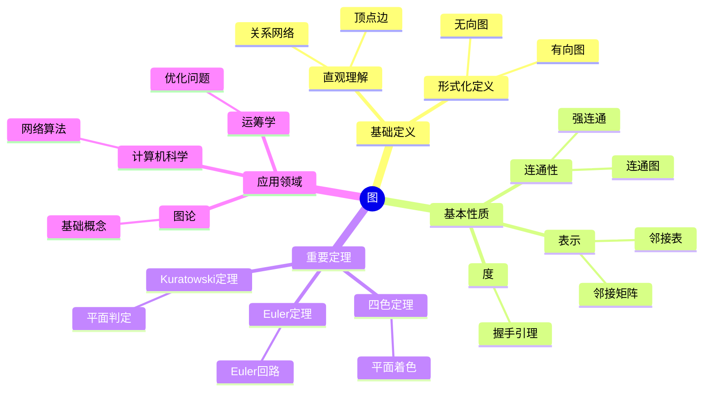

# 图 (Graph)

**概念编号**: C.CORE.029
**知识层次**: L0-L2
**知识领域**: D7 (离散数学)
**创建日期**: 2025年11月21日
**最后更新**: 2025年11月21日

---

## 📋 概述

图是离散数学的基础概念，由顶点和边组成，用于建模关系和网络。图论在计算机科学、运筹学、网络分析等领域有广泛应用。

**权威资源对齐**:

- Wikipedia: [Graph (Discrete Mathematics)](https://en.wikipedia.org/wiki/Graph_(discrete_mathematics))
- Stanford课程: CS 161 (Design and Analysis of Algorithms)
- Princeton课程: COS 423 (Theory of Algorithms)
- MIT课程: 6.006 (Introduction to Algorithms)
- Metamath: [Graph](http://us.metamath.org/mpeuni/df-graph.html)

---

## 🎯 严格定义

### 基础定义 (L0)

**直观理解**: 图是由顶点（点）和边（连接顶点的线）组成的结构，用于表示对象之间的关系。

**基本定义**: 图 $G = (V, E)$ 由顶点集 $V$ 和边集 $E$ 组成，其中每条边连接两个顶点。

**简单例子**:

- 完全图：每对顶点都有边
- 树：连通无环图
- 二分图：顶点可以分成两部分，边只连接不同部分的顶点

### 形式化定义 (L1)

**图**: 图 $G = (V, E)$ 是：

- **顶点集**: $V$ 是有限集合
- **边集**: $E \subseteq V \times V$（有向图）或 $E \subseteq \binom{V}{2}$（无向图）

**无向图**: 边是无序对，$(u,v) = (v,u)$。

**有向图**: 边是有序对，$(u,v) \neq (v,u)$。

**记号**:

- $G = (V, E)$: 图
- $|V| = n$: 顶点数
- $|E| = m$: 边数
- $N(v)$: 顶点 $v$ 的邻域
- $\deg(v)$: 顶点 $v$ 的度

---

## 📚 历史背景

### 发展脉络

**18世纪**: 图论的起源

- **Euler (1736)**: 解决Königsberg七桥问题
- **Cayley (1857)**: 研究树

**19-20世纪**: 图论的发展

- **Kuratowski (1930)**: 研究平面图
- **Erdős (1940s)**: 研究随机图
- **Tutte (1940s)**: 研究图的匹配

**20世纪后期**: 图论的现代发展

- **Appel-Haken (1976)**: 证明四色定理
- **Robertson-Seymour (1980s)**: 研究图的小子式定理

### 关键人物

- **Leonhard Euler (1707-1783)**: 图论的奠基者
- **Arthur Cayley (1821-1895)**: 研究树
- **Paul Erdős (1913-1996)**: 研究随机图

---

## 🔍 性质与定理

### 基本性质 (L1)

#### 性质1: 度的性质:

- **握手引理**: $\sum_{v \in V} \deg(v) = 2|E|$
- 奇度顶点有偶数个

#### 性质2: 连通性:

- **连通图**: 任意两点有路径
- **强连通图**: 任意两点有有向路径（有向图）

#### 性质3: 图的表示:

- 邻接矩阵：$A_{ij} = 1$ 若 $(i,j) \in E$
- 邻接表：每个顶点的邻接顶点列表

### 重要定理 (L2)

#### 定理1: Euler定理:

- **陈述**: 连通图有Euler回路当且仅当所有顶点度数为偶数
- **应用**: 路径问题

#### 定理2: 四色定理:

- **陈述**: 平面图可以用4种颜色着色
- **应用**: 地图着色

#### 定理3: Kuratowski定理:

- **陈述**: 图是平面的当且仅当不包含 $K_5$ 或 $K_{3,3}$ 的子式
- **应用**: 平面图的判定

---

## 💡 应用实例

### 理论应用

- 图论（图是图论的基础）
- 组合数学（图的计数）
- 拓扑学（图的嵌入）

### 实际应用

- 计算机科学（网络、数据结构）
- 运筹学（最短路径、网络流）
- 社交网络（关系分析）

---

## 🔗 关联概念

### 依赖关系

- 集合（图由集合定义）
- 关系（边是关系）

### 推广关系

- 图（一般图）
- 超图（边可以连接多个顶点）
- 有向图（边有方向）

---

## 📖 参考文献

- Wikipedia: [Graph (Discrete Mathematics)](https://en.wikipedia.org/wiki/Graph_(discrete_mathematics))
- Diestel, R. (2017). *Graph Theory*. Springer.
- Bondy, J. A., & Murty, U. S. R. (2008). *Graph Theory*. Springer.

---

## 🗺️ 思维导图 (编号: C.CORE.029.MIND)

### 图概念思维导图

---

## 📊 知识多维关系矩阵 (编号: C.CORE.029.MATRIX)

### 图的多维关系矩阵

| 维度 | 指标 | 图 |
|------|------|------|
| **知识层次** | L0基础 | ⭐⭐⭐⭐ |
| | L1中级 | ⭐⭐⭐⭐⭐ |
| | L2高级 | ⭐⭐⭐ |
| | L3研究 | ⭐⭐ |
| **知识领域** | D1基础数学 | ⭐⭐⭐ |
| | D5拓扑 | ⭐⭐⭐ |
| | D7离散数学 | ⭐⭐⭐⭐⭐ |
| | D8交叉领域 | ⭐⭐ |
| **依赖关系** | 前置概念 | 集合、关系 |
| | 后续概念 | 算法、网络流 |
| **应用关系** | 理论应用 | ⭐⭐⭐ |
| | 实际应用 | ⭐⭐⭐⭐⭐ |
| | 交叉应用 | ⭐⭐⭐ |
| **学习难度** | 直观理解 | ⭐⭐ |
| | 形式化理解 | ⭐⭐⭐ |
| | 深入应用 | ⭐⭐⭐ |

---

## 💭 形象化解释与论证 (编号: C.CORE.029.VISUAL)

### 形象化解释

**1. 图的直观理解**

- **类比**: 图就像"网络"或"关系图"
- **例子**:
  - 社交网络：人是顶点，朋友关系是边
  - 交通网络：城市是顶点，道路是边
  - 网页链接：网页是顶点，链接是边

**2. 连通性的直观理解**

- **类比**: 连通性就像"能否从一个点走到另一个点"
- **解释**:
  - 连通图：任意两点之间有路径
  - 非连通图：有些点之间没有路径
  - 强连通图：有向图中任意两点有有向路径

**3. Euler回路的直观理解**

- **类比**: Euler回路就像"一笔画"或"不重复经过所有边"
- **例子**:
  - Königsberg七桥问题：能否不重复经过所有桥
  - Euler定理：连通图有Euler回路当且仅当所有顶点度数为偶数

### 认知科学视角

**1. 数学教育家Dienes的观点**

- **多表征原则**: 通过图形、矩阵、列表等多种方式表示图
- **变化性原则**: 通过不同的图例子理解图的本质
- **教学启示**: 使用图形可视化、邻接矩阵、邻接表等多种方法

**2. 数学认知学家Tall的观点**

- **过程-对象对偶**: 理解"图构造过程"（如何定义）和"图"（对象）
- **认知层次**: 从直观理解（"网络"）到形式化理解（集合定义）

---

## 👨‍🏫 专家观点与论证 (编号: C.CORE.029.EXPERT)

### 数学家的观点

**1. Leonhard Euler (1707-1783) - 图论的奠基者**
> "Königsberg七桥问题开创了图论，Euler回路揭示了图的深刻性质。"
>
> **意义**: Euler解决了Königsberg七桥问题，开创了图论。

**2. Arthur Cayley (1821-1895) - 树的研究者**
> "树是图论的基础结构，树的计数是组合数学的重要问题。"
>
> **意义**: Cayley研究了树，推动了图论和组合数学的发展。

**3. Paul Erdős (1913-1996) - 随机图的研究者**
> "随机图理论揭示了图的性质，Erdős-Rényi模型是图论的重要工具。"
>
> **意义**: Erdős发展了随机图理论，推动了图论的现代发展。

### 数学教育家的观点

**1. Zoltan Dienes (1916-2014) - 数学教育家**
> "图概念应该通过图形、矩阵、列表等多种方式学习。"
>
> **教学启示**:
>
> - 使用图形可视化理解图的结构
> - 使用邻接矩阵理解图的表示
> - 通过具体例子（如社交网络）理解图的应用

**2. Hans Freudenthal (1905-1990) - 数学教育家**
> "图概念的学习需要从'网络'发展到'图结构'。"
>
> **认知发展**:
>
> - **直观阶段**: 理解图作为网络
> - **结构阶段**: 理解图作为集合配备边的关系

### 数学认知学家的观点

**1. David Tall - 数学认知学家**
> "图概念的理解需要从'过程'（如何构造）发展到'对象'（图本身）。"
>
> **认知层次**:
>
> - **过程层次**: 理解"如何构造图"（如$G = (V, E)$）
> - **对象层次**: 理解"图"（如$G$是一个图）

---

**创建日期**: 2025年11月21日
**最后更新**: 2025年11月21日
**维护状态**: 持续更新中
