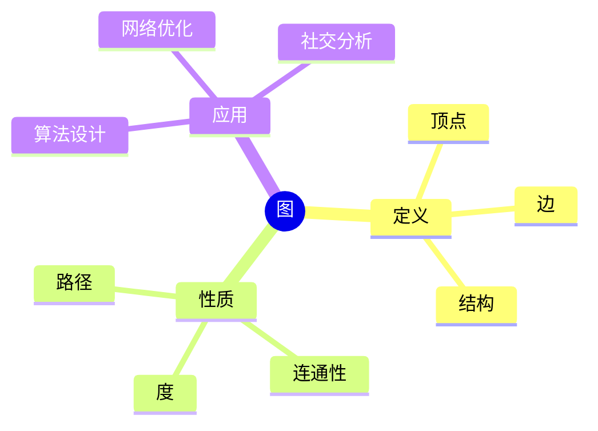
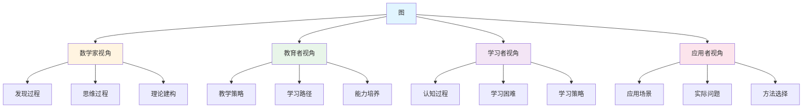
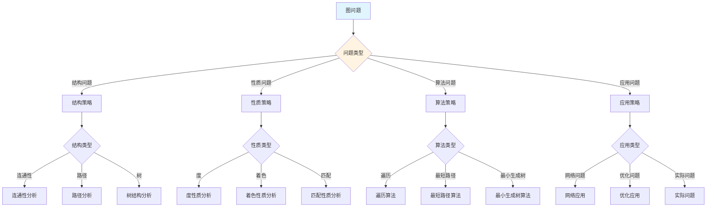
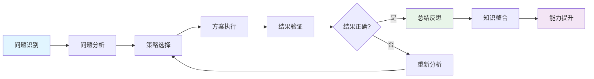
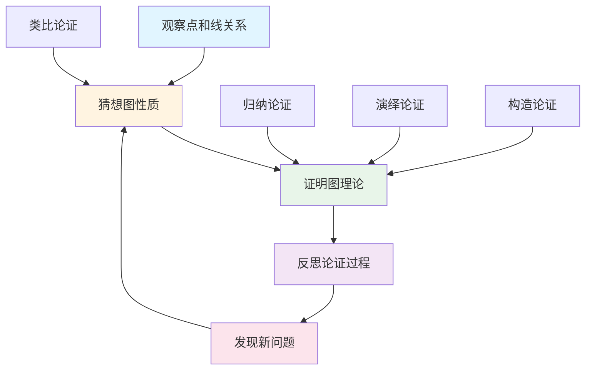
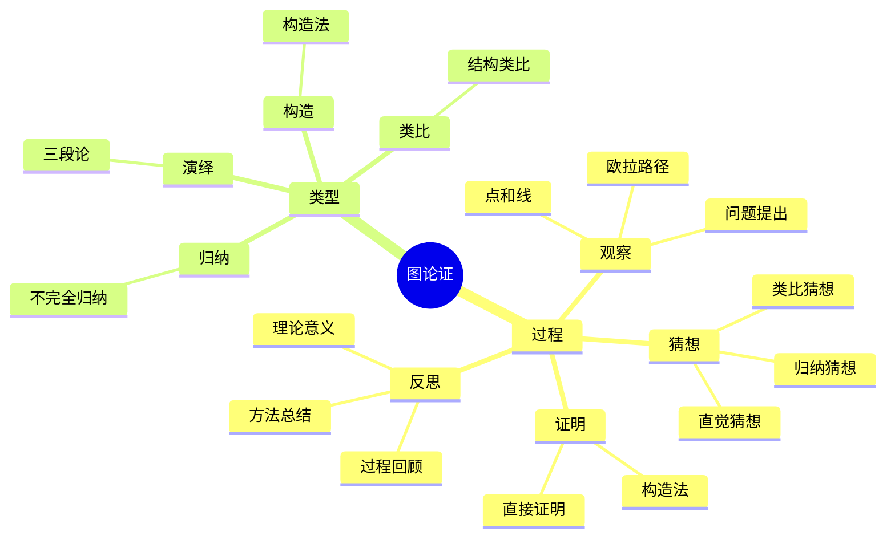
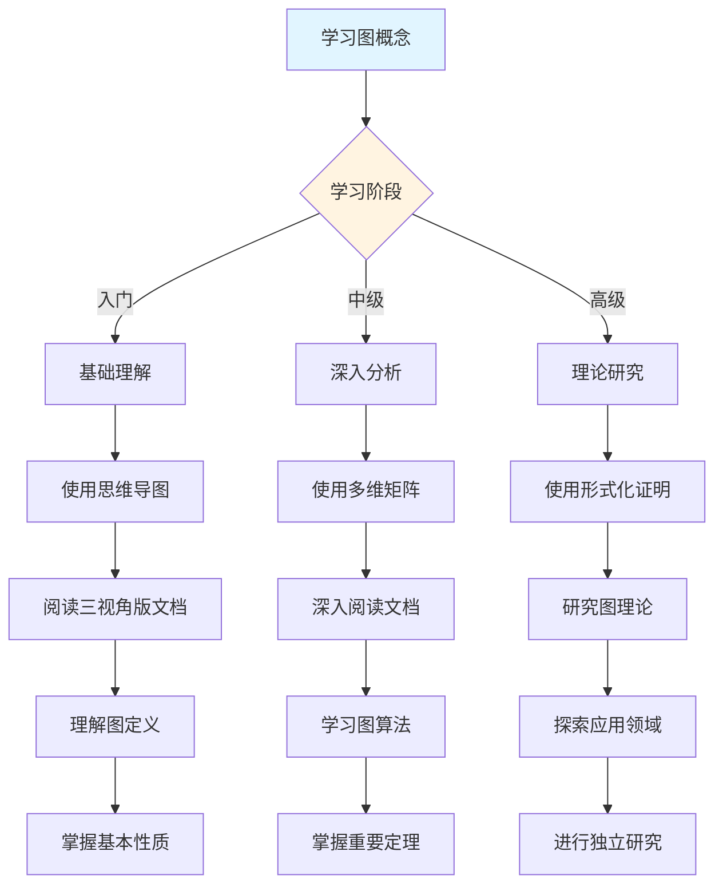
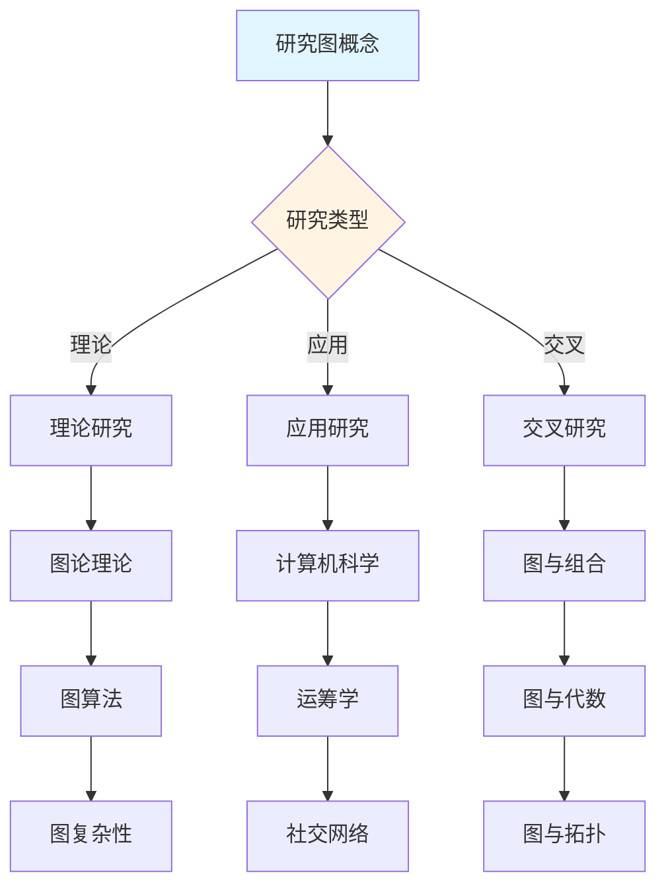
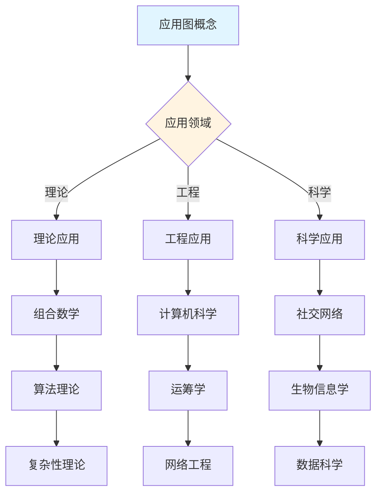
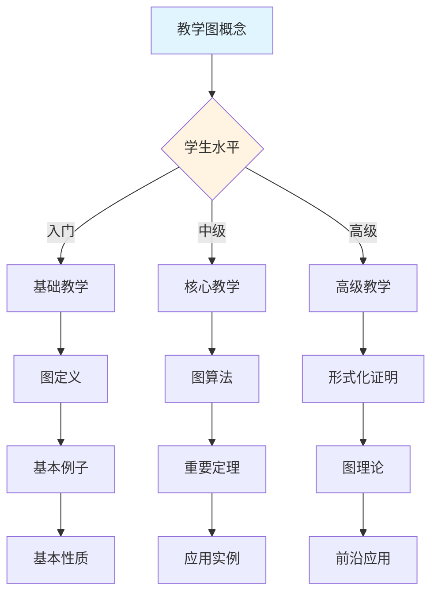

---
msc_primary: "00A99"
---

# 图 (Graph) - 三视角组织版

**概念编号**: C.CORE.029
**知识层次**: L0-L2
**知识领域**: D7 (离散数学)
**创建日期**: 2025年1月
**最后更新**: 2026-04-05

---

## 📋 目录 / Table of Contents

- [图 (Graph) - 三视角组织版](#图-graph---三视角组织版)
  - 📋 目录 / Table of Contents
  - 1. 📋 概述 (编号: C.CORE.029.01)
  - [🧠 认知学视角：如何理解图 (编号: C.CORE.029.02)](#认知学视角如何理解图-编号-ccore02902)
    - [认知起点 (编号: C.CORE.029.02.01)](#认知起点-编号-ccore0290201)
    - [认知过程 (编号: C.CORE.029.02.02)](#认知过程-编号-ccore0290202)
      - [阶段1：直观理解阶段 (编号: C.CORE.029.02.02.01)](#阶段1直观理解阶段-编号-ccore029020201)
      - [阶段2：概念形成阶段 (编号: C.CORE.029.02.02.02)](#阶段2概念形成阶段-编号-ccore029020202)
      - [阶段3：形式化阶段 (编号: C.CORE.029.02.02.03)](#阶段3形式化阶段-编号-ccore029020203)

## 形式化定义

**定义（图）**：**图** $G$ 是有序对 $(V, E)$，其中 $V$ 是顶点集，$E$ 是边集：
- **无向图**：$E \subseteq \binom{V}{2}$（$V$ 的2元子集族）
- **有向图**：$E \subseteq V \times V$
- **多重图**：允许重边和自环

**度**：顶点 $v$ 的**度** $\deg(v)$ 是与 $v$ 关联的边数

**符号说明**：
- $G = (V, E)$：图
- $V(G)$ 或 $V$：顶点集
- $E(G)$ 或 $E$：边集
- $n = |V|$：顶点数
- $m = |E|$：边数
- $\deg(v)$ 或 $d(v)$：顶点的度

    - [认知障碍 (编号: C.CORE.029.02.03)](#认知障碍-编号-ccore0290203)
    - [认知工具 (编号: C.CORE.029.02.04)](#认知工具-编号-ccore0290204)
  - [🎓 教育学视角：如何教学图 (编号: C.CORE.029.03)](#教育学视角如何教学图-编号-ccore02903)
    - [教学目标 (编号: C.CORE.029.03.01)](#教学目标-编号-ccore0290301)
    - [教学路径 (编号: C.CORE.029.03.02)](#教学路径-编号-ccore0290302)
      - [阶段1：引入阶段（激发兴趣） (编号: C.CORE.029.03.02.01)](#阶段1引入阶段激发兴趣-编号-ccore029030201)
      - [阶段2：探索阶段（主动建构） (编号: C.CORE.029.03.02.02)](#阶段2探索阶段主动建构-编号-ccore029030202)
      - [阶段3：形式化阶段（抽象概括） (编号: C.CORE.029.03.02.03)](#阶段3形式化阶段抽象概括-编号-ccore029030203)
      - [阶段4：巩固阶段（应用深化） (编号: C.CORE.029.03.02.04)](#阶段4巩固阶段应用深化-编号-ccore029030204)
    - [教学难点 (编号: C.CORE.029.03.03)](#教学难点-编号-ccore0290303)
    - [教学策略 (编号: C.CORE.029.03.04)](#教学策略-编号-ccore0290304)
    - [评估方法 (编号: C.CORE.029.03.05)](#评估方法-编号-ccore0290305)
  - [🔬 数学家视角：如何思考图 (编号: C.CORE.029.04)](#数学家视角如何思考图-编号-ccore02904)
    - [问题起源 (编号: C.CORE.029.04.01)](#问题起源-编号-ccore0290401)
    - [思维过程 (编号: C.CORE.029.04.02)](#思维过程-编号-ccore0290402)
      - [步骤1：问题提出 (编号: C.CORE.029.04.02.01)](#步骤1问题提出-编号-ccore029040201)
      - [步骤2：概念形成 (编号: C.CORE.029.04.02.02)](#步骤2概念形成-编号-ccore029040202)
      - [步骤3：理论发展 (编号: C.CORE.029.04.02.03)](#步骤3理论发展-编号-ccore029040203)
    - [历史发展 (编号: C.CORE.029.04.03)](#历史发展-编号-ccore0290403)
    - [3.2 关键人物和贡献 (编号: C.CORE.029.04.04)](#32-关键人物和贡献-编号-ccore0290404)
    - [重要定理 (编号: C.CORE.029.04.05)](#重要定理-编号-ccore0290405)
    - [开放问题 (编号: C.CORE.029.04.06)](#开放问题-编号-ccore0290406)
    - [一、第一人称思维描述 (编号: C.CORE.029.04.07)](#一第一人称思维描述-编号-ccore0290407)
      - [1.1 Euler的发现过程](#11-euler的发现过程)
    - [二、数学直觉的形成 (编号: C.CORE.029.04.08)](#二数学直觉的形成-编号-ccore0290408)
      - [2.1 直觉在概念发现中的作用](#21-直觉在概念发现中的作用)
      - [2.2 如何培养图直觉](#22-如何培养图直觉)
    - [三、数学美的教育价值 (编号: C.CORE.029.04.09)](#三数学美的教育价值-编号-ccore0290409)
      - [3.1 图论的美在哪里](#31-图论的美在哪里)
      - [3.2 如何培养学生的数学美感](#32-如何培养学生的数学美感)
    - [四、问题解决策略 (编号: C.CORE.029.04.10)](#四问题解决策略-编号-ccore0290410)
      - [4.1 数学家的启发式方法](#41-数学家的启发式方法)
      - [4.2 思维过程分析](#42-思维过程分析)
    - [五、批判性反思 (编号: C.CORE.029.04.11)](#五批判性反思-编号-ccore0290411)
      - [5.1 图概念的局限性](#51-图概念的局限性)
      - [5.2 图理论的未解决问题](#52-图理论的未解决问题)
  - [💡 数学解释：为什么图是这样定义的 (编号: C.CORE.029.05)](#数学解释为什么图是这样定义的-编号-ccore02905)
    - [一、直观解释：图是什么？](#一直观解释图是什么)
      - [1.1 具体例子](#11-具体例子)
      - [1.2 形象类比](#12-形象类比)
      - [1.3 几何直观](#13-几何直观)
      - [1.4 操作体验](#14-操作体验)
    - [二、知性解释：图的本质是什么？](#二知性解释图的本质是什么)
      - [2.1 概念定义](#21-概念定义)
      - [2.2 分类体系](#22-分类体系)
      - [2.3 抽象结构](#23-抽象结构)
      - [2.4 知识体系](#24-知识体系)
    - [三、理性解释：图的公理化定义](#三理性解释图的公理化定义)
      - [3.1 公理体系](#31-公理体系)
      - [3.2 形式化证明](#32-形式化证明)
      - [3.3 系统建构](#33-系统建构)
    - [四、多视角解释：从不同角度理解图](#四多视角解释从不同角度理解图)
      - [4.1 数学家视角：图是如何被发现的？](#41-数学家视角图是如何被发现的)
      - [4.2 教育者视角：如何教学图？](#42-教育者视角如何教学图)
      - [4.3 学习者视角：如何学习图？](#43-学习者视角如何学习图)
      - [4.4 应用者视角：如何应用图？](#44-应用者视角如何应用图)
    - [五、思维表征：用多种方式理解图](#五思维表征用多种方式理解图)
      - [5.1 思维导图：图的知识结构](#51-思维导图图的知识结构)
      - [5.2 矩阵对比：不同解释方式的对比](#52-矩阵对比不同解释方式的对比)
      - [5.3 多视角表征：从不同角度表征图](#53-多视角表征从不同角度表征图)
      - [5.4 决策树：图问题分类和策略选择](#54-决策树图问题分类和策略选择)
      - [5.5 决策逻辑路径：图问题解决过程](#55-决策逻辑路径图问题解决过程)
      - [5.6 多维对比矩阵：图概念特征对比](#56-多维对比矩阵图概念特征对比)
  - [� 数学论证：如何论证图 (编号: C.CORE.029.06)](#数学论证如何论证图-编号-ccore02906)
    - [一、论证过程：从观察到反思](#一论证过程从观察到反思)
      - [1.1 观察（Observation）](#11-观察observation)
      - [1.2 猜想（Conjecture）](#12-猜想conjecture)
      - [1.3 证明（Proof）](#13-证明proof)
      - [1.4 反思（Reflection）](#14-反思reflection)
    - [二、论证类型：多种推理方式](#二论证类型多种推理方式)
      - [2.1 归纳论证（Inductive Reasoning）](#21-归纳论证inductive-reasoning)
      - [2.2 演绎论证（Deductive Reasoning）](#22-演绎论证deductive-reasoning)
      - [2.3 类比论证（Analogical Reasoning）](#23-类比论证analogical-reasoning)
      - [2.4 构造论证（Constructive Reasoning）](#24-构造论证constructive-reasoning)
    - [三、论证可视化：用图形表示论证过程](#三论证可视化用图形表示论证过程)
      - [3.1 论证流程图](#31-论证流程图)
      - [3.2 论证类型对比](#32-论证类型对比)
      - [3.3 论证思维导图](#33-论证思维导图)
  - [🔗 三视角整合 (编号: C.CORE.029.07)](#三视角整合-编号-ccore02907)
    - [三个视角的关联](#三个视角的关联)
    - [如何综合运用三个视角](#如何综合运用三个视角)
  - [📚 参考文献 (编号: C.CORE.029.08)](#参考文献-编号-ccore02908)
    - [权威资源](#权威资源)
    - [经典教材](#经典教材)
    - [研究论文](#研究论文)

---

## 1. 📋 概述 (编号: C.CORE.029.01)

图是离散数学的基础概念，由顶点和边组成，用于建模关系和网络。图论在计算机科学、运筹学、网络分析等领域有广泛应用。

本文档从**数学认知学**、**教育学**、**数学家**三个视角深入展开图概念，避免简单的概念堆垒。

**权威资源对齐**:

- Wikipedia: [Graph (Discrete Mathematics)](https://en.wikipedia.org/wiki/Graph_(discrete_mathematics))
- Stanford课程: CS 161 (Design and Analysis of Algorithms)
- Princeton课程: COS 423 (Theory of Algorithms)
- MIT课程: 6.006 (Introduction to Algorithms)
- Metamath: [Graph](http://us.metamath.org/mpeuni/df-graph.html)[需更新][需更新]

---

## 🧠 认知学视角：如何理解图 (编号: C.CORE.029.02)

### 认知起点 (编号: C.CORE.029.02.01)

**学习者已有的知识基础**:

- 集合的概念
- 关系的概念
- 日常经验中的"网络"、"连接"概念

**日常经验中的类似概念**:

- "网络"：节点和连接
- "关系"：对象之间的关系
- "连接"：点之间的连接

### 认知过程 (编号: C.CORE.029.02.02)

#### 阶段1：直观理解阶段 (编号: C.CORE.029.02.02.01)

**具体例子**:

- 例子1：完全图 - 每对顶点都有边
- 例子2：树 - 连通无环图
- 例子3：二分图 - 顶点可以分成两部分

**形象类比**:

- **网络类比**: 图就像"网络"
  - 顶点是"节点"
  - 边是"连接"
  - 图描述"关系"

- **关系类比**: 图就像"关系图"
  - 顶点是"对象"
  - 边是"关系"
  - 图描述"关系结构"

**可视化表示**:

```text
图:
    ●───●
    │   │
    ●───●
    顶点和边
```

#### 阶段2：概念形成阶段 (编号: C.CORE.029.02.02.02)

**从例子中抽象出共同特征**:

- 所有例子都涉及"顶点和边"
- 顶点是"对象"
- 边是"关系"

**识别关键属性**:

1. **顶点集**: $V$是有限集合
2. **边集**: $E$是边的集合
3. **结构**: 图描述关系结构

**建立概念边界**:

- **什么是图**: 由顶点集和边集组成的结构
- **什么不是图**:
  - 只有顶点没有边（不是图）
  - 只有边没有顶点（不是图）

#### 阶段3：形式化阶段 (编号: C.CORE.029.02.02.03)

**严格定义**:

- 图定义：$G = (V, E)$，其中$V$是顶点集，$E$是边集
- 无向图：边是无序对
- 有向图：边是有序对

**公理化表述**:

- 条件1：顶点集
- 条件2：边集
- 条件3：边连接顶点

**逻辑结构**:

- 图是离散数学的基础
- 图可以建模关系和网络
- 图是算法设计的基础

### 认知障碍 (编号: C.CORE.029.02.03)

**常见误解**:

1. **误解1**: 认为图就是图形
   - **纠正**: 图是数学结构，不是图形

2. **误解2**: 认为所有图都相同
   - **纠正**: 不同的图有不同的结构

3. **误解3**: 混淆无向图和有向图
   - **纠正**: 无向图边无序，有向图边有序

**理解难点**:

1. **难点1**: 图的抽象性
   - **原因**: 图比较抽象
   - **解决方法**: 从具体例子开始，逐步抽象

2. **难点2**: 图的性质
   - **原因**: 图的性质比较多
   - **解决方法**: 用具体例子，逐步掌握性质

3. **难点3**: 图的算法
   - **原因**: 图算法比较复杂
   - **解决方法**: 用具体例子，逐步掌握算法

**认知陷阱**:

- **图形**: 需要理解图是数学结构
- **结构**: 需要理解图的结构

### 实际计算示例

#### 示例1: 图遍历
**问题**: 对下图进行DFS和BFS遍历。
```
    1 --- 2
    |     |
    3 --- 4
```

**步骤**:
**DFS**（从1开始）: 1 → 2 → 4 → 3
**BFS**（从1开始）: 1 → 2 → 3 → 4

---

#### 示例2: 最短路径
**问题**: 求图中节点A到D的最短路径。
```
    A --2-- B
    |      /|
    3    1  4
    |   /   |
    C --3-- D
```

**步骤**:
- A→B→D: 2 + 4 = 6
- A→B→C→D: 2 + 1 + 3 = 6
- A→C→D: 3 + 3 = 6

**最短路径**: 长度6

---

#### 示例3: 社交网络分析
**问题**: 分析朋友关系网络中的中心性。

**步骤**:
- 度中心性: 朋友数量
- 中介中心性: 作为桥梁的次数
- 应用: 识别关键影响者

---

### 认知工具 (编号: C.CORE.029.02.04)

**类比工具**:

- **网络类比**: 图 = 网络
- **关系类比**: 图 = 关系图

**可视化工具**:

- **图表示**: 用图表示图
- **邻接矩阵**: 用邻接矩阵表示图

**具体化工具**:

- **具体例子**: 用具体例子理解抽象概念
- **反例**: 用反例理解概念边界

---

## 🎓 教育学视角：如何教学图 (编号: C.CORE.029.03)

### 教学目标 (编号: C.CORE.029.03.01)

**知识目标**:

- 理解图的基本概念
- 掌握图的定义
- 理解图的性质
- 理解图的应用

**能力目标**:

- 能够表示图
- 能够理解图的性质
- 能够应用图解决实际问题
- 能够理解图的重要性

**情感目标**:

- 培养数学抽象思维
- 培养离散思维
- 激发对数学的兴趣

### 教学路径 (编号: C.CORE.029.03.02)

#### 阶段1：引入阶段（激发兴趣） (编号: C.CORE.029.03.02.01)

**实际问题**:

- 问题1：如何表示网络？
- 问题2：如何研究关系？
- 问题3：如何设计算法？

**历史背景**:

- 图论的历史发展
- 图论在数学中的地位
- 图论在计算机科学中的应用

**引发认知冲突**:

- 问题：如何统一表示各种关系？
- 引出图的概念

#### 阶段2：探索阶段（主动建构） (编号: C.CORE.029.03.02.02)

**引导发现**:

1. 让学生自己列举"网络"的例子
2. 让学生观察这些例子的共同特征
3. 引导学生抽象出图的定义

**合作探究**:

- 小组讨论：什么是图？
- 小组讨论：图有哪些性质？
- 小组讨论：如何表示图？

**多元表征**:

- **语言表征**: "图是由顶点和边组成的结构"
- **符号表征**: $G = (V, E)$
- **图形表征**: 图表示、邻接矩阵
- **集合表征**: 图定义

#### 阶段3：形式化阶段（抽象概括） (编号: C.CORE.029.03.02.03)

**严格定义**:

- 图的定义
- 图的性质
- 图的算法

**性质证明**:

- 图的基本性质
- 图的连通性
- 图的着色

**应用拓展**:

- 图在计算机科学中的应用
- 图在运筹学中的应用
- 图在网络分析中的应用

#### 阶段4：巩固阶段（应用深化） (编号: C.CORE.029.03.02.04)

**练习应用**:

- 基础练习：图的表示和性质
- 应用练习：用图解决实际问题
- 综合练习：图的综合应用

**变式训练**:

- 不同形式的图
- 不同性质的图
- 图的应用

**知识整合**:

- 图与其他概念的联系
- 图在数学体系中的地位

### 教学难点 (编号: C.CORE.029.03.03)

**难点1：图的抽象性**:

- **难点描述**: 学生难以理解图的抽象概念
- **解决方法**:
  - 从具体例子开始
  - 逐步抽象
  - 用具体例子说明

**难点2：图的性质**:

- **难点描述**: 学生难以理解图的性质
- **解决方法**:
  - 用具体例子
  - 逐步掌握性质
  - 用图形可视化

**难点3：图的算法**:

- **难点描述**: 学生难以掌握图算法
- **解决方法**:
  - 用具体例子
  - 逐步掌握算法
  - 用练习巩固

### 教学策略 (编号: C.CORE.029.03.04)

**策略1：从具体到抽象**:

- 先给出具体例子
- 再抽象出一般概念
- 最后给出严格定义

**策略2：多元表征**:

- 用语言、符号、图形等多种方式表示同一概念
- 帮助学生建立不同表征之间的联系

**策略3：问题驱动**:

- 从实际问题出发
- 引出数学概念
- 解决问题

**策略4：可视化教学**:

- 使用图表示
- 使用邻接矩阵
- 使用具体例子

### 评估方法 (编号: C.CORE.029.03.05)

**形成性评估**（评估理解过程）:

- 课堂提问：检查学生对概念的理解
- 小组讨论：观察学生的思考过程
- 练习作业：检查学生的应用能力

**总结性评估**（评估最终理解）:

- 测验：检查学生对概念和性质的掌握
- 项目：检查学生应用图解决实际问题的能力
- 反思：检查学生对图概念的理解深度

---

## 🔬 数学家视角：如何思考图 (编号: C.CORE.029.04)

### 问题起源 (编号: C.CORE.029.04.01)

**历史背景**:

- 18世纪：图论的起源
- 19-20世纪：图论的发展
- 20世纪中期：图论的现代发展

**原始问题**:

- **问题1**: 如何表示网络？
- **问题2**: 如何研究关系？
- **问题3**: 图有哪些性质？

**研究动机**:

- 统一离散数学理论
- 发展图论
- 研究算法设计

### 思维过程 (编号: C.CORE.029.04.02)

#### 步骤1：问题提出 (编号: C.CORE.029.04.02.01)

**观察到的现象**:

- 需要表示网络
- 需要研究关系
- 需要统一离散数学理论

**提出的猜想**:

- 可以引入图概念
- 图可以表示网络和关系
- 图有丰富的性质

**需要解决的问题**:

- 如何定义图？
- 图应该满足什么条件？
- 图有哪些性质？

#### 步骤2：概念形成 (编号: C.CORE.029.04.02.02)

**尝试性定义**:

- **集合定义**: 通过顶点集和边集
- **关系定义**: 通过关系

**性质探索**:

- 图的基本性质
- 图的连通性
- 图的着色

**结构发现**:

- 图是离散数学的基础
- 图可以建模关系和网络
- 图是算法设计的基础

#### 步骤3：理论发展 (编号: C.CORE.029.04.02.03)

**定理证明**:

- 图的基本性质
- 图的连通性
- 图的着色

**应用拓展**:

- 图在计算机科学中的应用
- 图在运筹学中的应用
- 图在网络分析中的应用

**理论完善**:

- 图的严格定义
- 图的范畴论研究
- 图的应用研究

### 历史发展 (编号: C.CORE.029.04.03)

**早期阶段**（18世纪）:

- **Euler (1736)**: 解决Königsberg七桥问题
- **Hamilton (1856)**: 研究Hamilton回路

**关键突破**（19-20世纪）:

- **Kuratowski (1930)**: 研究平面图
- **Tutte (1947)**: 研究图着色

**现代发展**（20世纪中期）:

- **Erdős (1950s)**: 发展随机图理论
- **Lovász (1970s)**: 发展图论算法

### 3.2 关键人物和贡献 (编号: C.CORE.029.04.04)

**Leonhard Euler (1707-1783)**:

- 解决Königsberg七桥问题
- 建立图论基础

**William Rowan Hamilton (1805-1865)**:

- 研究Hamilton回路
- 建立图论基础

**Paul Erdős (1913-1996)**:

- 发展随机图理论
- 建立现代图论

### 重要定理 (编号: C.CORE.029.04.05)

**Euler公式**:

- 平面图的顶点数、边数、面数满足$V - E + F = 2$
- 意义：平面图的基础

**四色定理**:

- 平面图可以用4种颜色着色
- 意义：图着色的重要结果

**Kuratowski定理**:

- 图是平面的当且仅当不包含$K_5$或$K_{3,3}$的细分
- 意义：平面图的判定

### 开放问题 (编号: C.CORE.029.04.06)

**未解决问题**:

- 图的分类问题
- 图的算法问题
- 图的应用问题

**研究方向**:

- 图的范畴论研究
- 图的算法研究
- 图的应用研究

### 一、第一人称思维描述 (编号: C.CORE.029.04.07)

#### 1.1 Euler的发现过程

**详细历史背景**:

- **1736年**：Euler解决Königsberg七桥问题
- **背景**：研究拓扑问题，发现需要抽象出点和线的关系
- **问题**：如何描述点和线的关系？如何用图研究问题？

**Euler的详细第一人称描述**:
> "1736年，我在研究Königsberg七桥问题时，遇到了一个问题：如何判断能否一次走完所有桥？
>
> Königsberg有7座桥连接4个区域，问题是能否一次走完所有桥且不重复。
>
> 我的方法是这样的：
>
> - **抽象**：将区域抽象为点（顶点），将桥抽象为线（边）
> - **图**：得到图$G = (V, E)$，其中$V = \{A, B, C, D\}$，$E = \{AB, AC, AD, BC, BD, CD, CD\}$
> - **欧拉路径**：存在欧拉路径当且仅当图中最多有两个顶点的度数为奇数
> - **结论**：Königsberg七桥问题无解，因为所有4个顶点的度数都是奇数
>
> 例如，对于Königsberg七桥问题：
>
> - **顶点**：$A, B, C, D$（4个区域）
> - **边**：$AB, AC, AD, BC, BD, CD, CD$（7座桥）
> - **度数**：$\deg(A) = 3$，$\deg(B) = 3$，$\deg(C) = 3$，$\deg(D) = 3$（都是奇数）
> - **结论**：不存在欧拉路径，所以问题无解
>
> 我还发现了欧拉公式：
>
> - **公式**：对于连通平面图，$V - E + F = 2$，其中$V$是顶点数，$E$是边数，$F$是面数
> - **例子**：立方体有$V = 8$，$E = 12$，$F = 6$，$8 - 12 + 6 = 2$
> - **意义**：图的结构关系
>
> 这让我意识到，图是描述点和线关系的工具，图的性质决定了问题的解。这为图论提供了基础。"

**详细的思维过程**:

1. **观察到的现象**（1736年）:

   **现象1：点和线的关系**
   - **问题**：如何描述点和线的关系？
   - **例子**：Königsberg七桥问题中的区域和桥
   - **需要**：统一的概念

   **现象2：这种关系有特殊的性质**
   - **问题**：图有什么性质？
   - **例子**：欧拉路径的存在性
   - **需要**：建立图论

   **现象3：需要统一的概念**
   - **问题**：如何统一处理不同的图问题？
   - **思路**：用图论统一
   - **需要**：建立图论

2. **提出的猜想**（1736年）:

   **猜想1：用图描述点和线的关系**
   - **思路**：定义图为$G = (V, E)$，其中$V$是顶点集，$E$是边集
   - **例子**：Königsberg七桥问题的图
   - **优点**：统一描述点和线的关系

   **猜想2：欧拉路径的存在性**
   - **定理**：存在欧拉路径当且仅当图中最多有两个顶点的度数为奇数
   - **例子**：Königsberg七桥问题无解
   - **意义**：为图提供路径理论

   **猜想3：欧拉公式**
   - **公式**：对于连通平面图，$V - E + F = 2$
   - **例子**：立方体的欧拉公式
   - **意义**：图的结构关系

3. **遇到的困难**（1736年）:

   **困难1：如何严格定义图？**
   - **问题**：如何定义图？
   - **解决**：定义图为$G = (V, E)$，其中$V$是顶点集，$E$是边集
   - **意义**：为图提供严格的数学基础

   **困难2：如何判断图的性质？**
   - **问题**：如何判断图是否连通？是否有欧拉路径？
   - **解决**：通过图的结构判断
   - **意义**：为图分类提供方法

   **困难3：如何应用图论？**
   - **问题**：如何用图论解决实际问题？
   - **解决**：建立路径理论、着色理论、匹配理论
   - **意义**：为图提供应用基础

4. **突破的时刻**（1736年，Euler）:

   **突破1：图的概念**
   - 引入图的概念描述点和线的关系
   - **关键**：抽象出图的结构
   - **意义**：为图论提供基础

   **突破2：欧拉路径理论**
   - 建立欧拉路径理论
   - **关键**：存在欧拉路径当且仅当图中最多有两个顶点的度数为奇数
   - **意义**：为图提供路径理论

   **突破3：欧拉公式**
   - 证明欧拉公式$V - E + F = 2$
   - **关键**：图的结构关系
   - **意义**：为图提供结构理论

### 二、数学直觉的形成 (编号: C.CORE.029.04.08)

#### 2.1 直觉在概念发现中的作用

**Euler的直觉**:

- **直觉1**: "图"是"点和线的关系"——这个直觉引导Euler发现图
- **直觉2**: 图可以研究拓扑问题——这个直觉引导Euler建立图论
- **直觉3**: 图是组合数学的基础——这个直觉引导Euler建立图论

**直觉的验证**:

- 通过严格的数学证明验证直觉的正确性
- 通过欧拉公式严格化图论
- 通过应用验证图的广泛性

**直觉的深化**:

- 从"点和线的关系"到"图的严格定义"
- 从"研究拓扑问题"到"图的广泛应用"
- 从"组合数学基础"到"图论的深入发展"

#### 2.2 如何培养图直觉

**数学家的建议**:

- **Euler**: "图直觉是长期训练的结果。通过大量练习和深入思考，我们可以培养对图的直觉。"
- **Cayley**: "从具体例子开始，逐步抽象，这是培养图直觉的有效方法。"

**培养方法**:

1. **大量练习**: 通过大量图构造练习，培养对图的直觉
2. **深入思考**: 深入思考图的本质，理解图的深层结构
3. **类比和联想**: 通过类比和联想，建立图与其他概念的联系
4. **与专家交流**: 与数学家交流，学习他们的思维方式

**教学启示**:

- 从具体例子开始，逐步抽象
- 鼓励学生思考图的本质
- 引导学生建立图与其他概念的联系

### 三、数学美的教育价值 (编号: C.CORE.029.04.09)

#### 3.1 图论的美在哪里

**结构美**:

- **简洁性**: 图的概念非常简洁——"顶点和边的集合"
- **统一性**: 图可以统一描述数学中的各种关系
- **和谐性**: 图运算满足优美的规律（欧拉公式、四色定理等）

**数学家的评价**:

- **Euler**: "图论的美在于它的统一性。它为我们提供了一个统一的框架来理解关系。"
- **Cayley**: "图论的美在于它的基础性。它是组合数学的基础，所有关系都可以用图来描述。"

#### 3.2 如何培养学生的数学美感

**数学家的建议**:

- **Euler**: "展示图论的美感，让学生感受到数学的美。"
- **Cayley**: "通过图论的历史和发展，让学生理解数学的美。"

**教学方法**:

1. **展示数学美**:
   - 展示图概念的简洁性和统一性
   - 展示图运算的优美规律
   - 展示图在数学中的基础地位

2. **引导学生欣赏**:
   - 引导学生欣赏图概念的简洁性
   - 引导学生欣赏图运算的和谐性
   - 引导学生欣赏图的基础性

3. **鼓励学生创造美**:
   - 鼓励学生发现图论的美
   - 鼓励学生创造优美的图证明
   - 鼓励学生探索图论的美

### 四、问题解决策略 (编号: C.CORE.029.04.10)

#### 4.1 数学家的启发式方法

**策略1：从具体到抽象**:

- 从具体的图例子开始
- 抽象出图的一般性质
- 建立图的理论体系

**策略2：从简单到复杂**:

- 先理解基本图
- 再理解图运算
- 最后理解图理论

**策略3：从问题到理论**:

- 从实际问题出发
- 引出图概念
- 建立图理论

#### 4.2 思维过程分析

**问题识别**:

- 识别问题类型：图定义问题、图性质问题、图应用问题
- 识别问题难度：简单问题、中等问题、复杂问题

**策略选择**:

- 简单问题：直接方法
- 中等问题：分步方法
- 复杂问题：分解方法

**执行和反思**:

- 执行策略，解决问题
- 反思过程，总结经验
- 改进方法，提高效率

### 五、批判性反思 (编号: C.CORE.029.04.11)

#### 5.1 图概念的局限性

**概念的边界**:

- 图只描述二元关系，不能描述所有数学关系
- 图是抽象的，需要具体化才能应用
- 图不能表示所有数学结构

**概念的推广**:

- 超图：更一般的图
- 有向图：有方向的图
- 范畴图：范畴论中的图

#### 5.2 图理论的未解决问题

**未解决的问题**:

- 图的分类问题：如何分类所有图？
- 图的算法问题：如何设计高效图算法？
- 图的应用问题：如何更好地应用图？

**研究方向**:

- 图的范畴论研究
- 图的算法研究
- 图的应用研究

---

## 💡 数学解释：为什么图是这样定义的 (编号: C.CORE.029.05)

### 一、直观解释：图是什么？

#### 1.1 具体例子

**生活中的例子**：

- **社交网络**：朋友关系可以用图表示
  - 例如：顶点表示人，边表示朋友关系
  - **为什么这样定义**：因为我们需要一个概念来表示"关系和连接"
- **交通网络**：道路系统可以用图表示
  - 例如：顶点表示城市，边表示道路
  - **为什么这样定义**：因为我们需要一个概念来表示"网络结构"
- **网页链接**：互联网可以用图表示
  - 例如：顶点表示网页，边表示超链接
  - **为什么这样定义**：因为我们需要一个概念来表示"链接关系"

**数学中的例子**：

- **简单图**：$G = (V, E)$，其中$V$是顶点集，$E$是边集
  - **为什么这样定义**：我们需要一个简单的方式来表示"顶点和边的结构"
- **完全图**：$K_n$是$n$个顶点的完全图（每对顶点都有边）
  - **为什么这样定义**：我们需要一个概念来表示"所有顶点都连接的图"
- **树**：无圈的连通图
  - **为什么这样定义**：我们需要一个概念来表示"层次结构"

#### 1.2 形象类比

**网络类比**：

- **图就像"网络"**
  - 网络有节点（顶点）和连接（边）
  - 图有顶点和边
- **为什么这样类比**：这个类比帮助我们理解图的"网络结构"性质

**地图类比**：

- **图就像"地图"**
  - 地图有地点（顶点）和道路（边）
  - 图有顶点和边
- **为什么这样类比**：这个类比帮助我们理解图的"连接关系"

#### 1.3 几何直观

**图形表示**：

- 使用图形表示图
- 例如：用圆圈表示顶点，用线段表示边
- **为什么使用图形**：图形提供几何直观，帮助我们理解图的结构

**邻接矩阵表示**：

- 使用邻接矩阵表示图
- 例如：$A_{ij} = 1$如果顶点$i$和$j$之间有边，否则$A_{ij} = 0$
- **为什么使用邻接矩阵**：邻接矩阵提供代数表示，帮助我们计算

#### 1.4 操作体验

**图运算的操作**：

- **图的并**：$G_1 \cup G_2$是两个图的并
  - **为什么这样操作**：因为我们需要一个运算来表示"两个图的合并"
- **图的交**：$G_1 \cap G_2$是两个图的交
  - **为什么这样操作**：因为我们需要一个运算来表示"两个图的共同部分"
- **子图**：$H$是$G$的子图如果$V(H) \subseteq V(G)$且$E(H) \subseteq E(G)$
  - **为什么这样操作**：因为我们需要一个工具来表示"图的部分"

### 二、知性解释：图的本质是什么？

#### 2.1 概念定义

**图的内涵**：

- **图是由顶点集和边集组成的数学结构**
  - **顶点**：$V$是顶点集，表示对象
  - **边**：$E$是边集，表示关系
  - **结构**：$G = (V, E)$是图
- **为什么这样定义**：这些特征使得图成为一个完整的离散数学工具，支持所有关系研究

**图的外延**：

- **简单图**：没有自环和重边的图
- **有向图**：边有方向的图
- **加权图**：边有权重的图
- **为什么这样分类**：不同的图类型有不同的性质和用途

#### 2.2 分类体系

**按连通性分类**：

- **连通图**：任意两个顶点之间都有路径
- **非连通图**：存在两个顶点之间没有路径
- **为什么这样分类**：连通性是图的基本特征

**按结构分类**：

- **树**：无圈的连通图
- **森林**：无圈的图（多个树）
- **完全图**：每对顶点都有边
- **为什么这样分类**：结构是图的重要特征

#### 2.3 抽象结构

**图的运算结构**：

- **图的并**：$G_1 \cup G_2 = (V_1 \cup V_2, E_1 \cup E_2)$
- **图的交**：$G_1 \cap G_2 = (V_1 \cap V_2, E_1 \cap E_2)$
- **为什么有这些运算**：这些运算使得图具有代数结构

**图的关系结构**：

- **同构**：两个图如果顶点和边可以一一对应，则同构
- **子图**：$H$是$G$的子图如果$V(H) \subseteq V(G)$且$E(H) \subseteq E(G)$
- **为什么有这个关系**：这个关系帮助我们研究图的结构

#### 2.4 知识体系

**图在数学体系中的位置**：

- **基础地位**：图是离散数学的基础
  - 图可以建模关系和网络
  - 图是算法设计的基础
- **为什么是基础**：图提供了统一的框架来研究关系和网络

**图与其他概念的关系**：

- **图与集合**：图是集合的特殊结构
- **图与算法**：图是算法设计的基础
- **图与组合**：图是组合数学的研究对象
- **为什么有这些关系**：这些关系揭示了图与其他数学概念的内在联系

### 三、理性解释：图的公理化定义

#### 3.1 公理体系

**图的定义**：

- **定义**：$G = (V, E)$，其中$V$是顶点集，$E \subseteq V \times V$是边集
- **为什么需要这个定义**：这个定义提供了图的严格数学基础

**图的公理**：

- **顶点公理**：顶点集是非空的有限集合
- **边公理**：边集是顶点对的集合
- **为什么这样定义**：这些公理将图放在更一般的框架中

#### 3.2 形式化证明

**图性质的证明**：

##### 定理1：握手定理

**定理陈述**：对于图$G = (V, E)$，所有顶点的度数之和等于边数的两倍，即$\sum_{v \in V} \deg(v) = 2|E|$。

**形式化表述**：
$$\forall G = (V, E), \quad \sum_{v \in V} \deg(v) = 2|E|$$

**证明**：
1. **度数定义**：对于顶点$v$，$\deg(v)$是与$v$关联的边的数量
2. **双重计数**：每条边$(u, v)$在$\deg(u)$和$\deg(v)$中各被计数一次
3. **求和**：$\sum_{v \in V} \deg(v) = \sum_{(u,v) \in E} (1 + 1) = 2|E|$
4. **结论**：所有顶点的度数之和等于边数的两倍

**为什么这样证明**：利用双重计数原理和度数的定义。

---

##### 定理2：Euler公式（平面图）

**定理陈述**：对于连通平面图$G = (V, E, F)$，顶点数、边数、面数满足$V - E + F = 2$。

**形式化表述**：
$$\forall G = (V, E, F) \text{ 连通平面图}, \quad |V| - |E| + |F| = 2$$

**证明**（数学归纳法）：
1. **基础情况**：对于树（$F = 1$），有$|E| = |V| - 1$，因此$|V| - |E| + |F| = |V| - (|V| - 1) + 1 = 2$
2. **归纳假设**：假设对于所有边数小于$n$的连通平面图，公式成立
3. **归纳步骤**：对于有$n$条边的连通平面图$G$：
   - 如果$G$是树，则$|V| - |E| + |F| = 2$（基础情况）
   - 如果$G$不是树，则存在圈，删除圈上的一条边$e$得到$G'$
   - $G'$是连通的，且$|E'| = |E| - 1$，$|F'| = |F| - 1$（删除边减少一个面）
   - 由归纳假设：$|V| - |E'| + |F'| = 2$
   - 因此：$|V| - (|E| - 1) + (|F| - 1) = 2$，即$|V| - |E| + |F| = 2$
4. **结论**：对所有连通平面图，$V - E + F = 2$

**为什么这样证明**：利用数学归纳法和平面图的结构性质（删除边不破坏连通性）。

---

##### 定理3：奇度顶点个数为偶数

**定理陈述**：图中度数为奇数的顶点个数为偶数。

**形式化表述**：
$$\forall G = (V, E), \quad |\{v \in V : \deg(v) \text{ 为奇数}\}| \equiv 0 \pmod{2}$$

**证明**：
1. **握手定理**：$\sum_{v \in V} \deg(v) = 2|E|$（偶数）
2. **奇偶性**：偶数等于所有度数之和
3. **奇数和**：奇数个奇数相加为奇数，偶数个奇数相加为偶数
4. **结论**：度数为奇数的顶点个数必须为偶数

**为什么这样证明**：利用握手定理和奇偶数的性质。

#### 3.3 系统建构

**图论在数学基础中的地位**：

- **作为离散数学基础**：图是离散数学的基础
- **提供建模工具**：图提供了建模关系和网络的工具
- **统一框架**：图统一了各种关系研究

**图论的发展历史**：

- **Euler的Königsberg问题**（1736年）：解决七桥问题，建立图论基础
- **Hamilton的回路问题**（1856年）：研究Hamilton回路
- **四色定理的证明**（1976年）：使用计算机证明四色定理
- **为什么这样发展**：数学的发展需要严格的基础，图论的发展反映了这一需求

### 四、多视角解释：从不同角度理解图

#### 4.1 数学家视角：图是如何被发现的？

**Euler的发现过程**：

- **问题提出**：如何解决Königsberg七桥问题？
- **关键洞察**：使用图表示问题，发现欧拉路径的条件
- **重要发现**：图可以建模关系和网络问题
- **为什么这样发现**：数学家的直觉和严格证明相结合

#### 4.2 教育者视角：如何教学图？

**教学策略**：

- **从具体到抽象**：先学习具体例子（社交网络、交通网络），再学习抽象定义
- **从简单到复杂**：先学习简单图，再学习复杂图
- **从直观到形式化**：先使用图形等直观工具，再学习严格定义
- **为什么这样教学**：符合认知规律，帮助学生逐步建立理解

#### 4.3 学习者视角：如何学习图？

**认知过程**：

- **直观阶段**：通过具体例子理解图的含义
- **概念阶段**：理解图的定义和性质
- **形式化阶段**：理解严格定义和证明
- **为什么这样学习**：符合认知发展规律

#### 4.4 应用者视角：如何应用图？

**应用场景**：

- **计算机科学**：使用图进行算法设计（最短路径、最小生成树）
- **运筹学**：使用图进行网络优化
- **社交网络**：使用图分析社交关系
- **为什么这样应用**：图提供了强大的工具来处理各种问题

### 五、思维表征：用多种方式理解图

#### 5.1 思维导图：图的知识结构


```mermaid
mindmap
  root((图))
    定义
      顶点
      边
      结构
    性质
      连通性
      度
      路径
    应用
      算法设计
      网络优化
      社交分析
```

#### 5.2 矩阵对比：不同解释方式的对比

| 解释方式 | 特点 | 方法 | 工具 | 适用阶段 | 优势 | 局限 |
|---------|------|------|------|---------|------|------|
| **直观解释** | 具体、形象、可视 | 例子、类比、直观 | 图形、网络 | 入门阶段 | 易于理解 | 不够严格 |
| **知性解释** | 概念、分类、抽象 | 定义、分类、结构 | 概念图、知识图谱 | 中级阶段 | 系统完整 | 不够直观 |
| **理性解释** | 公理、证明、形式化 | 公理、证明、系统 | 形式化工具、证明系统 | 高级阶段 | 严格准确 | 不够具体 |
| **多视角解释** | 多角度、整合 | 多视角、整合 | 多视角工具 | 所有阶段 | 全面深入 | 可能复杂 |

#### 5.3 多视角表征：从不同角度表征图


```mermaid
graph TD
    A[图] --> B[数学家视角]
    A --> C[教育者视角]
    A --> D[学习者视角]
    A --> E[应用者视角]

    B --> B1[发现过程]
    B --> B2[思维过程]
    B --> B3[理论建构]

    C --> C1[教学策略]
    C --> C2[学习路径]
    C --> C3[能力培养]

    D --> D1[认知过程]
    D --> D2[学习困难]
    D --> D3[学习策略]

    E --> E1[应用场景]
    E --> E2[实际问题]
    E --> E3[方法选择]

    style A fill:#e1f5ff
    style B fill:#fff4e1
    style C fill:#e8f5e9
    style D fill:#f3e5f5
    style E fill:#fce4ec
```

#### 5.4 决策树：图问题分类和策略选择


```mermaid
graph TD
    A[图问题] --> B{问题类型}
    B -->|结构问题| C[结构策略]
    B -->|性质问题| D[性质策略]
    B -->|算法问题| E[算法策略]
    B -->|应用问题| F[应用策略]

    C --> C1{结构类型}
    C1 -->|连通性| C2[连通性分析]
    C1 -->|路径| C3[路径分析]
    C1 -->|树| C4[树结构分析]

    D --> D1{性质类型}
    D1 -->|度| D2[度性质分析]
    D1 -->|着色| D3[着色性质分析]
    D1 -->|匹配| D4[匹配性质分析]

    E --> E1{算法类型}
    E1 -->|遍历| E2[遍历算法]
    E1 -->|最短路径| E3[最短路径算法]
    E1 -->|最小生成树| E4[最小生成树算法]

    F --> F1{应用类型}
    F1 -->|网络问题| F2[网络应用]
    F1 -->|优化问题| F3[优化应用]
    F1 -->|实际问题| F4[实际问题]

    style A fill:#e1f5ff
    style B fill:#fff4e1
```

**说明**：

- **问题分类**：根据问题类型（结构、性质、算法、应用）进行分类
- **策略选择**：根据问题类型选择相应的解决策略
- **方法应用**：根据具体问题选择合适的方法

#### 5.5 决策逻辑路径：图问题解决过程


```mermaid
graph LR
    A[问题识别] --> B[问题分析]
    B --> C[策略选择]
    C --> D[方案执行]
    D --> E[结果验证]
    E --> F{结果正确?}
    F -->|是| G[总结反思]
    F -->|否| H[重新分析]
    H --> C

    G --> I[知识整合]
    I --> J[能力提升]

    style A fill:#e1f5ff
    style G fill:#e8f5e9
    style J fill:#f3e5f5
```

**说明**：

- **问题识别**：识别图问题的类型和关键要素
- **问题分析**：分析问题的条件和目标
- **策略选择**：根据问题类型选择解决策略
- **方案执行**：执行选定的解决方案
- **结果验证**：验证结果的正确性
- **总结反思**：总结解题过程，反思解题方法
- **知识整合**：整合相关知识点
- **能力提升**：提升问题解决能力

#### 5.6 多维对比矩阵：图概念特征对比

| 对比维度 | 图定义 | 图结构 | 图性质 | 图应用 |
|---------|---------|---------|---------|---------|
| **核心特征** | 顶点、边、基本概念 | 连通性、路径、树 | 度、着色、匹配 | 网络、优化、实际问题 |
| **理解难度** | ⭐⭐⭐ | ⭐⭐⭐⭐ | ⭐⭐⭐⭐ | ⭐⭐⭐⭐ |
| **应用频率** | ⭐⭐⭐⭐⭐ | ⭐⭐⭐⭐ | ⭐⭐⭐⭐ | ⭐⭐⭐⭐⭐ |
| **理论基础** | 图定义理论 | 图结构理论 | 图性质理论 | 图应用理论 |
| **教学重点** | 概念理解 | 结构分析 | 性质分析 | 应用能力 |
| **学习阶段** | 入门-中级 | 中级阶段 | 中级-高级 | 中级-高级 |
| **认知维度** | 直观+知性 | 知性+理性 | 理性 | 理性+应用 |
| **思维表征** | 思维导图 | 决策树 | 决策逻辑路径 | 知识图谱 |

**说明**：

- **核心特征**：每个方面的核心特征
- **理解难度**：从1星到5星，表示理解难度
- **应用频率**：从1星到5星，表示应用频率
- **理论基础**：每个方面的理论基础
- **教学重点**：每个方面的教学重点
- **学习阶段**：每个方面的学习阶段
- **认知维度**：每个方面的认知维度
- **思维表征**：每个方面推荐的思维表征方法

---

## 🔍 数学论证：如何论证图 (编号: C.CORE.029.06)

### 一、论证过程：从观察到反思

#### 1.1 观察（Observation）

**具体现象观察**：

- **现象1**：点和线的关系
  - 例如：Königsberg七桥问题中的区域和桥，可以用点和线表示
  - **为什么重要**：这个现象揭示了图的本质
- **现象2**：欧拉路径的存在性
  - 例如：存在欧拉路径当且仅当图中最多有两个顶点的度数为奇数
  - **为什么重要**：这个现象揭示了图的结构性质

**模式识别**：

- **模式1**：握手引理
  - 例如：$\sum_{v \in V} \deg(v) = 2|E|$
  - **为什么重要**：这个模式可能反映了图的度结构
- **模式2**：欧拉公式
  - 例如：对于连通平面图，$V - E + F = 2$
  - **为什么重要**：这个模式可能反映了图的结构关系

**问题提出**：

- **问题1**：如何严格定义图，统一不同的网络结构？
  - **为什么提出**：这个问题可能揭示图的本质和基础
- **问题2**：如何证明欧拉定理？
  - **为什么提出**：这个问题可能揭示图的路径性质

#### 1.2 猜想（Conjecture）

**归纳猜想**：

- **猜想1**：图是研究网络和关系的统一工具
  - **依据**：观察不同网络结构都满足图定义
  - **为什么提出**：这个猜想可能揭示图的统一性
- **猜想2**：欧拉定理
  - **依据**：观察具体图的欧拉路径
  - **为什么提出**：这个猜想可能揭示图的路径性质

**类比猜想**：

- **猜想1**：图类似于"网络"
  - **类比对象**：网络
  - **为什么提出**：这个类比可能揭示图的本质
- **猜想2**：顶点和边类似于"节点和连接"
  - **类比对象**：节点和连接
  - **为什么提出**：这个类比可能揭示图的结构

**直觉猜想**：

- **猜想1**：图是"最自然"的网络表示
  - **直觉来源**：图的直观
  - **为什么提出**：这个直觉可能揭示图的基础地位
- **猜想2**：图有"最小"的公理结构
  - **直觉来源**：图的公理结构
  - **为什么提出**：这个直觉可能揭示图的本质

#### 1.3 证明（Proof）

**直接证明**：

- **证明1**：欧拉定理
  - **证明思路**：使用度数和路径的性质
  - **关键步骤**：证明存在欧拉回路当且仅当所有顶点度数为偶数
  - **为什么这样证明**：这个证明方法直接、清晰
- **证明2**：握手引理
  - **证明思路**：使用边的定义
  - **关键步骤**：每条边贡献2度，因此$\sum \deg(v) = 2|E|$
  - **为什么这样证明**：这个证明方法直接、清晰

**构造法**：

- **构造法**：构造欧拉路径
  - **构造方法**：从任意顶点开始，沿着未访问的边遍历，直到无法继续，然后回溯
  - **验证**：验证构造的路径是欧拉路径
  - **为什么这样证明**：构造法适合证明存在性命题

#### 1.4 反思（Reflection）

**过程回顾**：

- **论证回顾**：从观察点和线的关系，到猜想图的性质，再到严格证明
  - **成功之处**：成功建立了图的严格理论
  - **不足之处**：图概念需要进一步推广
  - **改进方向**：推广到超图、有向图、加权图等

**方法总结**：

- **证明方法**：使用了直接证明、构造法
  - **方法特点**：直接证明清晰，构造法明确
  - **适用范围**：不同方法适用于不同类型的命题
- **证明技巧**：使用度数、路径、构造法
  - **技巧要点**：将图问题转化为组合问题，使用构造法处理存在性问题
  - **应用场景**：这些技巧可以应用于其他图论问题

**理论意义**：

- **理论贡献**：建立了图的严格理论，揭示了图的组合结构
  - **为什么重要**：这个论证揭示了图论的基础结构
- **应用价值**：图为图论、计算机科学、运筹学提供了基础
  - **为什么重要**：这个论证可以应用于所有网络问题

### 二、论证类型：多种推理方式

#### 2.1 归纳论证（Inductive Reasoning）

**不完全归纳**：

- **例子1**：从具体图的性质归纳一般规律
  - **观察**：观察Königsberg七桥问题、完全图、树都有度数和路径性质
  - **结论**：图有共同的性质
  - **局限性**：不完全归纳的结论需要严格证明

#### 2.2 演绎论证（Deductive Reasoning）

**三段论**：

- **例子1**：证明图的性质
  - **大前提**：所有图都满足握手引理
  - **小前提**：$K_5$是图
  - **结论**：$K_5$满足$\sum \deg(v) = 2|E| = 2 \times 10 = 20$
  - **为什么有效**：三段论是严格的演绎推理

#### 2.3 类比论证（Analogical Reasoning）

**结构类比**：

- **例子1**：图与网络的类比
  - **类比对象**：网络
  - **相似性**：图表示网络，顶点表示节点，边表示连接
  - **结论**：图可以理解为"网络"
  - **局限性**：类比不能替代严格证明

#### 2.4 构造论证（Constructive Reasoning）

**构造法**：

- **例子1**：构造欧拉路径
  - **构造方法**：从任意顶点开始，沿着未访问的边遍历
  - **验证**：验证构造的路径是欧拉路径
  - **为什么有效**：构造法是严格的直接证明

### 三、论证可视化：用图形表示论证过程

#### 3.1 论证流程图


```mermaid
graph TD
    A[观察点和线关系] --> B[猜想图性质]
    B --> C[证明图理论]
    C --> D[反思论证过程]
    D --> E[发现新问题]
    E --> B

    F[归纳论证] --> C
    G[演绎论证] --> C
    H[类比论证] --> B
    I[构造论证] --> C

    style A fill:#e1f5ff
    style B fill:#fff4e1
    style C fill:#e8f5e9
    style D fill:#f3e5f5
    style E fill:#fce4ec
```

#### 3.2 论证类型对比

| 论证类型 | 特点 | 适用场景 | 优势 | 局限 |
|---------|------|---------|------|------|
| **归纳论证** | 从特殊到一般 | 发现规律、提出猜想 | 启发性强 | 结论或然 |
| **演绎论证** | 从一般到特殊 | 严格证明、逻辑推理 | 结论必然 | 需要前提 |
| **类比论证** | 基于相似性 | 启发思路、发现联系 | 创造性高 | 结论或然 |
| **构造论证** | 直接构造 | 证明存在性命题 | 直接明确 | 需要构造 |

#### 3.3 论证思维导图


```mermaid
mindmap
  root((图论证))
    过程
      观察
        点和线
        欧拉路径
        问题提出
      猜想
        归纳猜想
        类比猜想
        直觉猜想
      证明
        直接证明
        构造法
      反思
        过程回顾
        方法总结
        理论意义
    类型
      归纳
        不完全归纳
      演绎
        三段论
      类比
        结构类比
      构造
        构造法
```

---

## 🔗 三视角整合 (编号: C.CORE.029.07)

### 三个视角的关联

**认知学视角 ↔ 教育学视角**:

- 认知学视角揭示的理解机制，指导教育学视角的教学设计
- 教育学视角的教学实践，验证认知学视角的理论

**认知学视角 ↔ 数学家视角**:

- 数学家视角的思维过程，启发认知学视角的认知路径
- 认知学视角的认知障碍，解释数学家视角的历史困难

**教育学视角 ↔ 数学家视角**:

- 数学家视角的历史发展，为教育学视角提供教学素材
- 教育学视角的教学策略，帮助学习者理解数学家视角的思维过程

### 如何综合运用三个视角

**学习建议**:

1. **从认知学视角开始**: 先建立直观理解
2. **用教育学视角深化**: 通过教学路径系统学习
3. **用数学家视角升华**: 理解概念的深层意义和历史背景

**教学建议**:

1. **引入阶段**: 用数学家视角的问题起源激发兴趣
2. **探索阶段**: 用认知学视角的认知过程引导发现
3. **形式化阶段**: 用教育学视角的教学策略系统教学
4. **巩固阶段**: 综合三个视角深化理解

---

## 📚 参考文献 (编号: C.CORE.029.08)

### 权威资源

- Wikipedia: [Graph (Discrete Mathematics)](https://en.wikipedia.org/wiki/Graph_(discrete_mathematics))
- Metamath: [Graph](http://us.metamath.org/mpeuni/df-graph.html)[需更新][需更新]

### 经典教材

- Diestel, R. (2017). *Graph Theory*. Springer.
- Bondy, J. A., & Murty, U. S. R. (2008). *Graph Theory*. Springer.

### 研究论文

- Euler, L. (1736). "Solutio problematis ad geometriam situs pertinentis". *Commentarii academiae scientiarum Petropolitanae*.
- Kuratowski, K. (1930). "Sur le problème des courbes gauches en topologie". *Fundamenta Mathematicae*.

---

**创建日期**: 2025年1月
**最后更新**: 2026-04-05
**维护状态**: 持续更新中

---

## 📚 附录: 扩展分析


### 1. 多理论分析

---
msc_primary: "00A99"
---

# 图概念的多理论分析示例 / Multi-Theory Analysis Example: Graph Concept


---


## 🎯 一、Tall三个世界理论分析 / Tall's Three Worlds Theory Analysis (编号: C.CORE.029.MULTI.01)

### 1.1 感知-操作世界（Embodied World）

**图在感知-操作世界中的理解 / Understanding Graphs in the Embodied World**：

- **具体经验 / Concrete Experience**：
  - 通过"连接"的日常经验理解图：点与点之间的连接 / Understanding graphs through daily experience of "connections": connections between points
  - 例如：社交网络、交通网络、电路图 / Examples: social networks, transportation networks, circuit diagrams
  - 通过"路径"理解图的遍历：从一个点到另一个点的路径 / Understanding graph traversal through "paths": paths from one point to another
  - 例如：地图导航、网络路由 / Examples: map navigation, network routing

- **身体动作 / Bodily Actions**：
  - 通过"画图"的动作理解图 / Understanding graphs through the action of "drawing graphs"
  - 通过"遍历"的动作理解路径 / Understanding paths through the action of "traversal"
  - 通过"标记"的动作理解图的着色 / Understanding graph coloring through the action of "marking"

- **直观理解 / Intuitive Understanding**：
  - 图是"点和边的集合" / A graph is a "collection of vertices and edges"
  - 图描述"关系"的结构 / Graphs describe the structure of "relationships"
  - 图可以用来建模实际问题 / Graphs can be used to model real-world problems

**教学建议**：

- 使用具体例子（社交网络、交通网络）
- 通过画图演示理解图
- 使用图形可视化图的结构

### 1.2 概念-符号世界（Symbolic World）

**图在概念-符号世界的理解 / Understanding Graphs in the Symbolic World**：

- **符号表示 / Symbolic Representation**：
  - 使用图符号：$G = (V, E)$、$G(V, E)$ / Using graph notation: $G = (V, E)$, $G(V, E)$
  - 使用顶点符号：$v \in V$、$|V| = n$ / Using vertex notation: $v \in V$, $|V| = n$
  - 使用边符号：$e \in E$、$e = \{u, v\}$ / Using edge notation: $e \in E$, $e = \{u, v\}$

- **概念理解 / Conceptual Understanding**：
  - 图是顶点集和边集的二元组 / A graph is an ordered pair of vertex set and edge set
  - 图有各种性质（连通性、平面性、着色性） / Graphs have various properties (connectivity, planarity, colorability)
  - 图可以用来研究组合问题 / Graphs can be used to study combinatorial problems

- **抽象操作 / Abstract Operations**：
  - 通过符号操作研究图 / Studying graphs through symbolic operations
  - 通过图的性质研究图的结构 / Studying graph structure through graph properties
  - 通过图算法解决实际问题 / Solving real-world problems through graph algorithms

**教学建议**：

- 逐步引入图符号
- 通过图的性质练习理解图
- 使用图算法解决实际问题

### 1.3 形式-公理世界（Formal World）

**图在形式-公理世界的理解 / Understanding Graphs in the Formal World**：

- **公理系统 / Axiomatic System**：
  - 图的严格定义：$G = (V, E)$ 其中 $E \subseteq \binom{V}{2}$ / Strict definition of graph: $G = (V, E)$ where $E \subseteq \binom{V}{2}$
  - 通过集合论严格定义图 / Strictly defining graphs through set theory
  - 通过公理推导演分性质 / Deriving properties through axioms

- **形式化定义 / Formal Definition**：
  - 图的形式化定义 / Formal definition of graph
  - 图同构的形式化定义 / Formal definition of graph isomorphism
  - 图性质的形式化证明 / Formal proof of graph properties

- **逻辑推理 / Logical Reasoning**：
  - 通过逻辑推理证明图性质 / Proving graph properties through logical reasoning
  - 通过形式化方法研究图论 / Studying graph theory through formal methods
  - 通过组合数学研究图的一般性质 / Studying general properties of graphs through combinatorics

**教学建议 / Teaching Suggestions**：

- 介绍图定义 / Introduce graph definition
- 通过形式化证明理解图性质 / Understand graph properties through formal proofs
- 研究图在图论中的作用 / Study the role of graphs in graph theory

### 1.4 三个世界的转换 / Transitions Between Worlds

**转换路径 / Transition Paths**：

1. **从感知-操作到概念-符号 / From Embodied to Symbolic**：
   - 将具体网络结构抽象为图符号 / Abstracting concrete network structures into graph symbols
   - 从操作中提取图概念 / Extracting graph concepts from operations
   - 例如：从"点和线"到"图$G = (V, E)$" / Example: from "points and lines" to "graph $G = (V, E)$"

2. **从概念-符号到形式-公理 / From Symbolic to Formal**：
   - 将图概念形式化为集合论定义 / Formalizing graph concepts into set theory definition
   - 从符号运算到逻辑推理 / From symbolic operations to logical reasoning
   - 例如：从"$G = (V, E)$"到"$E \subseteq \binom{V}{2}$" / Example: from "$G = (V, E)$" to "$E \subseteq \binom{V}{2}$"

**转换支持 / Transition Support**：

- **识别转换困难 / Identifying Transition Difficulties**：
  - 识别从具体网络到抽象图的困难 / Identifying difficulties in transitioning from concrete networks to abstract graphs
  - 识别从符号运算到形式化定义的困难 / Identifying difficulties in transitioning from symbolic operations to formal definitions

- **设计转换活动 / Designing Transition Activities**：
  - 设计过渡活动支持转换 / Designing transition activities to support transitions
  - 提供渐进式支持 / Providing progressive support

- **评估转换效果 / Assessing Transition Effectiveness**：
  - 评估转换成功 / Assessing transition success
  - 提供反馈支持 / Providing feedback support

---

## 🔬 二、Dubinsky APOS理论分析 / Dubinsky APOS Theory Analysis (编号: C.CORE.029.MULTI.02)

### 2.1 Action（动作）

**图的Action阶段 / Action Stage of Graph**：

- **具体操作 / Concrete Operations**：
  - 构造图：给定顶点和边，构造图 / Constructing graphs: given vertices and edges, construct a graph
  - 使用图规则：$E \subseteq \binom{V}{2}$、$|E| \leq \binom{|V|}{2}$ / Using graph rules: $E \subseteq \binom{V}{2}$, $|E| \leq \binom{|V|}{2}$
  - 判断图的性质：给定图，判断是否连通、是否平面 / Determining graph properties: given a graph, determine if it is connected, planar

- **操作特点 / Operation Characteristics**：
  - 需要外部指导（教师、教材） / Requires external guidance (teacher, textbook)
  - 操作是具体的、机械的 / Operations are concrete and mechanical
  - 需要逐步执行 / Requires step-by-step execution

- **学习活动 / Learning Activities**：
  - 练习构造图 / Practice constructing graphs
  - 练习使用图规则 / Practice using graph rules
  - 练习判断图的性质 / Practice determining graph properties

**教学建议 / Teaching Suggestions**：

- 提供大量练习机会 / Provide ample practice opportunities
- 给予及时反馈 / Give timely feedback
- 逐步增加操作复杂度 / Gradually increase operation complexity

### 2.2 Process（过程）

**图的Process阶段 / Process Stage of Graph**：

- **内化过程 / Internalization Process**：
  - 将图构造内化为心理过程 / Internalizing graph construction as a mental process
  - 理解图操作的内在逻辑 / Understanding the internal logic of graph operations
  - 能够独立完成图操作 / Being able to perform graph operations independently

- **过程理解 / Process Understanding**：
  - 理解"图"是"顶点和边的组合的过程" / Understanding that "graph" is "the process of combining vertices and edges"
  - 理解"图构造"是"选择顶点和边的过程" / Understanding that "graph construction" is "the process of selecting vertices and edges"
  - 理解"图遍历"是"访问顶点的过程" / Understanding that "graph traversal" is "the process of visiting vertices"

- **灵活应用 / Flexible Application**：
  - 能够灵活应用图概念 / Being able to flexibly apply graph concepts
  - 能够处理复杂的图问题 / Being able to handle complex graph problems
  - 能够理解图的各种性质 / Being able to understand various properties of graphs

**教学建议**：

- 引导学生内化操作过程
- 通过变式练习加深理解
- 鼓励学生探索图应用

### 2.3 Object（对象）

**图的Object阶段 / Object Stage of Graph**：

- **对象化理解 / Objectification Understanding**：
  - 将图视为独立的对象 / Viewing graphs as independent objects
  - 理解图作为数学对象的结构 / Understanding the structure of graphs as mathematical objects
  - 能够对图进行运算和操作 / Being able to perform operations on graphs

- **对象操作 / Object Operations**：
  - 能够比较不同的图 / Being able to compare different graphs
  - 能够构造图的子图、补图 / Being able to construct subgraphs and complements of graphs
  - 能够研究图的性质 / Being able to study properties of graphs

- **概念整合 / Conceptual Integration**：
  - 理解图与集合、函数的关系 / Understanding the relationship between graphs, sets, and functions
  - 理解图在图论中的作用 / Understanding the role of graphs in graph theory
  - 理解图在数学中的作用 / Understanding the role of graphs in mathematics

**教学建议**：

- 引导学生将图对象化
- 通过对象操作加深理解
- 整合图与其他概念

### 2.4 Schema（图式）

**图的Schema阶段 / Schema Stage of Graph**：

- **图式构建 / Schema Construction**：
  - 构建完整的图图式 / Constructing a complete graph schema
  - 整合图的各种理解 / Integrating various understandings of graphs
  - 建立图与其他概念的联系 / Establishing connections between graphs and other concepts

- **图式应用 / Schema Application**：
  - 能够灵活应用图图式 / Being able to flexibly apply graph schemas
  - 能够解决复杂的图问题 / Being able to solve complex graph problems
  - 能够研究图论理论 / Being able to study graph theory

- **图式发展 / Schema Development**：
  - 不断发展图图式 / Continuously developing graph schemas
  - 探索图的新应用 / Exploring new applications of graphs
  - 研究图论理论的发展 / Studying the development of graph theory

**教学建议**：

- 帮助学生构建图图式
- 通过应用发展图式
- 鼓励学生探索图论理论

### 2.5 APOS发展路径 / APOS Development Path

**发展过程 / Development Process**：

1. **Action → Process / 动作到过程**：
   - 将外部图操作内化为心理过程 / Internalizing external graph operations as mental processes
   - 从需要指导到独立完成 / From needing guidance to independent completion
   - 例如：从"构造图"到"理解图构造过程" / Example: from "constructing graphs" to "understanding the graph construction process"

2. **Process → Object / 过程到对象**：
   - 将图构造过程对象化 / Objectifying graph construction processes
   - 从过程理解到对象理解 / From process understanding to object understanding
   - 例如：从"理解图构造过程"到"将图视为对象" / Example: from "understanding the graph construction process" to "treating graphs as objects"

3. **Object → Schema / 对象到图式**：
   - 整合图的所有方面形成完整图式 / Integrating all aspects of graphs to form a complete schema
   - 从对象理解到系统理解 / From object understanding to systematic understanding
   - 例如：从"理解图对象"到"形成图论图式" / Example: from "understanding graph objects" to "forming a graph theory schema"

**发展支持 / Development Support**：

- **识别发展困难 / Identifying Development Difficulties**：
  - 识别内化困难 / Identifying internalization difficulties
  - 识别对象化困难 / Identifying objectification difficulties
  - 识别图式化困难 / Identifying schematization difficulties

- **设计发展活动 / Designing Development Activities**：
  - 设计支持内化的活动 / Designing activities to support internalization
  - 设计支持对象化的活动 / Designing activities to support objectification
  - 设计支持图式化的活动 / Designing activities to support schematization

- **评估发展效果 / Assessing Development Effectiveness**：
  - 评估各阶段发展 / Assessing development at each stage
  - 提供反馈支持 / Providing feedback support

---

## 💬 三、Sfard交流理论分析 / Sfard's Commognitive Theory Analysis (编号: C.CORE.029.MULTI.03)

### 3.1 图作为交流工具 / Graph as a Communication Tool

**图的交流功能 / Communicative Function of Graphs**：

- **数学交流 / Mathematical Communication**：
  - 图用于表达"关系"：$G = (V, E)$ / Graphs are used to express "relationships": $G = (V, E)$
  - 图用于描述"结构"：连通性、平面性 / Graphs are used to describe "structure": connectivity, planarity
  - 图用于表达数学关系：图同构、图着色 / Graphs are used to express mathematical relationships: graph isomorphism, graph coloring

- **概念表达 / Conceptual Expression**：
  - 通过图表达"连接"、"路径"等概念 / Expressing concepts such as "connection" and "path" through graphs
  - 通过图符号表达"图结构"的概念 / Expressing the concept of "graph structure" through graph notation
  - 通过图表达"组合问题"的概念 / Expressing the concept of "combinatorial problems" through graphs

- **问题解决 / Problem Solving**：
  - 使用图语言表达问题 / Using graph language to express problems
  - 使用图方法解决问题 / Using graph methods to solve problems
  - 使用图论方法证明定理 / Using graph theory methods to prove theorems

### 3.2 图学习的实践参与 / Practice Participation in Graph Learning

**通过参与数学实践学习图 / Learning Graphs through Participation in Mathematical Practice**：

- **实践场景 / Practice Scenarios**：
  - 通过实际问题学习图 / Learning graphs through real-world problems
  - 通过算法问题学习图 / Learning graphs through algorithm problems
  - 通过网络问题学习图 / Learning graphs through network problems
  - 通过图论研究学习图论理论 / Learning graph theory through graph theory research

- **实践方式 / Practice Methods**：
  - 参与数学讨论，使用图语言 / Participating in mathematical discussions, using graph language
  - 解决数学问题，应用图方法 / Solving mathematical problems, applying graph methods
  - 研究数学理论，理解图作用 / Studying mathematical theory, understanding the role of graphs

- **学习效果 / Learning Outcomes**：
  - 通过实践理解图概念 / Understanding graph concepts through practice
  - 通过应用掌握图方法 / Mastering graph methods through application
  - 通过参与形成数学思维 / Forming mathematical thinking through participation

**教学建议 / Teaching Suggestions**：

- 设计数学实践活动 / Design mathematical practice activities
- 鼓励学生参与数学讨论 / Encourage students to participate in mathematical discussions
- 提供实际问题解决机会 / Provide opportunities for solving real-world problems

---

## 🧠 四、Piaget认知发展理论分析 / Piaget's Cognitive Development Theory Analysis (编号: C.CORE.029.MULTI.04)

### 4.1 具体运算阶段（7-12岁）/ Concrete Operational Stage (7-12 years)

**图在具体运算阶段的理解 / Understanding Graphs in the Concrete Operational Stage**：

- **具体对象 / Concrete Objects**：
  - 通过具体图理解图 / Understanding graphs through concrete graphs
  - 例如：社交网络图、交通网络图 / Examples: social network graphs, transportation network graphs
  - 需要具体例子支持理解 / Requires concrete examples to support understanding

- **逻辑思维 / Logical Thinking**：
  - 能够理解图的基本概念 / Being able to understand basic graph concepts
  - 能够进行简单的图操作 / Being able to perform simple graph operations
  - 但需要具体对象支持 / But requires concrete object support

- **教学建议 / Teaching Suggestions**：
  - 使用具体图 / Use concrete graphs
  - 通过画图验证图性质 / Verify graph properties through drawing
  - 逐步引入抽象概念 / Gradually introduce abstract concepts

### 4.2 形式运算阶段（12+岁）/ Formal Operational Stage (12+ years)

**图在形式运算阶段的理解 / Understanding Graphs in the Formal Operational Stage**：

- **抽象思维 / Abstract Thinking**：
  - 能够理解抽象的图概念 / Being able to understand abstract graph concepts
  - 能够进行符号操作 / Being able to perform symbolic operations
  - 能够进行逻辑推理 / Being able to perform logical reasoning

- **形式推理 / Formal Reasoning**：
  - 能够证明图性质 / Being able to prove graph properties
  - 能够理解图定义 / Being able to understand graph definitions
  - 能够研究图论 / Being able to study graph theory

- **教学建议 / Teaching Suggestions**：
  - 引入抽象概念和符号 / Introduce abstract concepts and symbols
  - 进行逻辑推理训练 / Conduct logical reasoning training
  - 研究图论理论 / Study graph theory

---

## 🌍 五、Vygotsky社会文化理论分析 / Vygotsky's Sociocultural Theory Analysis (编号: C.CORE.029.MULTI.05)

### 5.1 最近发展区（ZPD）/ Zone of Proximal Development (ZPD)

**图学习的最近发展区 / Zone of Proximal Development in Graph Learning**：

- **独立能力 / Independent Ability**：
  - 能够理解图的基本概念 / Being able to understand basic graph concepts
  - 能够进行简单的图操作 / Being able to perform simple graph operations
  - 能够理解顶点、边 / Being able to understand vertices and edges

- **潜在能力 / Potential Ability**：
  - 能够理解图定义 / Being able to understand graph definitions
  - 能够证明图性质 / Being able to prove graph properties
  - 能够研究图论理论 / Being able to study graph theory

- **教学建议 / Teaching Suggestions**：
  - 识别学生的最近发展区 / Identify students' zone of proximal development
  - 提供适当的支持和指导 / Provide appropriate support and guidance
  - 逐步提高学习要求 / Gradually increase learning requirements

### 5.2 社会互动 / Social Interaction

**通过社会互动学习图 / Learning Graphs through Social Interaction**：

- **互动方式 / Interaction Methods**：
  - 与教师互动，学习图概念 / Interacting with teachers to learn graph concepts
  - 与同学互动，讨论图问题 / Interacting with classmates to discuss graph problems
  - 参与数学社区，研究图论理论 / Participating in mathematical communities to study graph theory

- **互动效果 / Interaction Effects**：
  - 通过互动理解图概念 / Understanding graph concepts through interaction
  - 通过讨论深化理解 / Deepening understanding through discussion
  - 通过参与形成数学思维 / Forming mathematical thinking through participation

- **教学建议 / Teaching Suggestions**：
  - 设计互动学习活动 / Design interactive learning activities
  - 鼓励学生讨论和交流 / Encourage students to discuss and communicate
  - 提供合作学习机会 / Provide collaborative learning opportunities

### 5.3 文化工具 / Cultural Tools

**图作为文化工具 / Graphs as Cultural Tools**：

- **数学工具 / Mathematical Tools**：
  - 图是数学研究的重要工具 / Graphs are important tools for mathematical research
  - 图用于解决实际问题 / Graphs are used to solve real-world problems
  - 图用于研究数学理论 / Graphs are used to study mathematical theory

- **文化意义 / Cultural Significance**：
  - 图是数学文化的重要组成部分 / Graphs are an important part of mathematical culture
  - 图反映了数学思维的发展 / Graphs reflect the development of mathematical thinking
  - 图体现了数学的美感 / Graphs embody the beauty of mathematics

- **教学建议 / Teaching Suggestions**：
  - 介绍图的历史和文化意义 / Introduce the history and cultural significance of graphs
  - 展示图在数学中的作用 / Demonstrate the role of graphs in mathematics
  - 培养学生对数学文化的理解 / Cultivate students' understanding of mathematical culture

---

## 🔄 六、多理论整合分析框架 / Multi-Theory Integration Analysis Framework (编号: C.CORE.029.MULTI.06)

### 6.1 理论互补性 / Theoretical Complementarity

**各理论在图学习中的互补作用 / Complementary Roles of Theories in Graph Learning**：

- **Tall理论 / Tall's Theory**：提供三个世界的理解框架 / Provides understanding framework of three worlds
  - 感知-操作世界：连接关系的直观理解 / Embodied world: intuitive understanding of connection relationships
  - 概念-符号世界：图符号和运算 / Symbolic world: graph notation and operations
  - 形式-公理世界：图定义和理论 / Formal world: graph definitions and theory

- **APOS理论 / APOS Theory**：提供认知发展路径 / Provides cognitive development path
  - Action：图操作 / Action: graph operations
  - Process：图过程 / Process: graph process
  - Object：图作为对象 / Object: graphs as objects
  - Schema：图图式 / Schema: graph schema

- **Sfard理论 / Sfard's Theory**：提供交流视角 / Provides communication perspective
  - 图作为交流工具 / Graphs as communication tools
  - 通过实践参与学习 / Learning through practice participation

- **Piaget理论 / Piaget's Theory**：提供认知发展阶段 / Provides cognitive development stages
  - 具体运算阶段：具体图 / Concrete operational stage: concrete graphs
  - 形式运算阶段：抽象图概念 / Formal operational stage: abstract graph concepts

- **Vygotsky理论 / Vygotsky's Theory**：提供社会文化视角 / Provides sociocultural perspective
  - 最近发展区：学习支持 / Zone of proximal development: learning support
  - 社会互动：合作学习 / Social interaction: cooperative learning
  - 文化工具：数学文化 / Cultural tools: mathematical culture

### 6.2 整合教学策略 / Integrated Teaching Strategies

**基于多理论的整合教学策略 / Integrated Teaching Strategies Based on Multiple Theories**：

1. **多层次理解 / Multi-Level Understanding**：
   - 从感知-操作世界开始（连接关系） / Start from embodied world (connection relationships)
   - 过渡到概念-符号世界（图符号） / Transition to symbolic world (graph notation)
   - 最终达到形式-公理世界（图定义） / Finally reach formal world (graph definition)

2. **渐进式发展 / Progressive Development**：
   - 从Action开始（图操作） / Start from Action (graph operations)
   - 发展为Process（图过程） / Develop into Process (graph process)
   - 对象化为Object（图作为对象） / Objectify into Object (graphs as objects)
   - 构建Schema（图图式） / Construct Schema (graph schema)

3. **实践参与 / Practice Participation**：
   - 通过数学实践学习图 / Learning graphs through mathematical practice
   - 使用图语言交流 / Using graph language for communication
   - 解决实际问题 / Solving real-world problems

4. **认知发展支持 / Cognitive Development Support**：
   - 根据认知发展阶段设计教学 / Design teaching according to cognitive development stages
   - 提供适当的支持和指导 / Provide appropriate support and guidance
   - 促进认知发展 / Promote cognitive development

5. **社会文化融入 / Sociocultural Integration**：
   - 通过社会互动学习 / Learning through social interaction
   - 使用文化工具 / Using cultural tools
   - 理解数学文化 / Understanding mathematical culture

---

## 📊 七、与其他概念的比较分析 (编号: C.CORE.029.MULTI.07)

### 7.1 与集合的关系 / Relationship with Sets

**图与集合的关系 / Relationship between Graphs and Sets**：

- **基础关系 / Fundamental Relationship**：
  - 图是集合的特殊应用 / Graphs are special applications of sets
  - 图由顶点集和边集组成 / Graphs consist of vertex sets and edge sets
  - 集合是图的基础 / Sets are the foundation of graphs

- **认知理解 / Cognitive Understanding**：
  - 集合：元素的无序组合 / Sets: unordered collections of elements
  - 图：集合配备关系结构 / Graphs: sets equipped with relational structure
  - 图是集合的结构化 / Graphs are structured sets

- **教学建议 / Teaching Suggestions**：
  - 强调图与集合的关系 / Emphasize the relationship between graphs and sets
  - 通过集合理解图 / Understand graphs through sets
  - 整合集合与图的教学 / Integrate teaching of sets and graphs

### 7.2 与函数的关系 / Relationship with Functions

**图与函数的关系 / Relationship between Graphs and Functions**：

- **相似性 / Similarity**：
  - 图可以表示函数关系 / Graphs can represent functional relationships
  - 函数可以表示为有向图 / Functions can be represented as directed graphs
  - 两者都描述关系 / Both describe relationships

- **认知理解 / Cognitive Understanding**：
  - 函数：映射关系 / Functions: mapping relationships
  - 图：一般关系 / Graphs: general relationships
  - 函数是图的特例 / Functions are special cases of graphs

- **教学建议 / Teaching Suggestions**：
  - 强调图与函数的关系 / Emphasize the relationship between graphs and functions
  - 通过函数理解图 / Understand graphs through functions
  - 对比图与函数的异同 / Compare similarities and differences between graphs and functions

### 7.3 在离散数学中的地位 / Position in Discrete Mathematics

**图在离散数学中的地位 / Position of Graphs in Discrete Mathematics**：

- **核心地位 / Core Position**：
  - 图是离散数学的核心概念 / Graphs are core concepts in discrete mathematics
  - 图与组合数学、算法密切相关 / Graphs are closely related to combinatorics and algorithms
  - 图是研究离散结构的重要工具 / Graphs are important tools for studying discrete structures

- **应用广泛 / Wide Applications**：
  - 图用于网络分析 / Graphs are used in network analysis
  - 图用于算法设计 / Graphs are used in algorithm design
  - 图用于组合优化 / Graphs are used in combinatorial optimization

- **教学建议 / Teaching Suggestions**：
  - 强调图在离散数学中的地位 / Emphasize the position of graphs in discrete mathematics
  - 整合图与其他概念 / Integrate graphs with other concepts
  - 展示图的广泛应用 / Demonstrate the wide applications of graphs

---

## 🎓 八、学习路径设计 (编号: C.CORE.029.MULTI.08)

### 8.1 基础路径（L0→L1）

**从直观理解到严格定义**：

1. **感知-操作世界**：
   - 理解连接关系的直观概念
   - 通过具体例子理解图
   - 使用图形可视化图的结构

2. **概念-符号世界**：
   - 引入图符号
   - 学习图定义
   - 练习图构造

3. **形式-公理世界**：
   - 学习图定义
   - 理解图性质
   - 证明图定理

### 8.2 进阶路径（L1→L2）

**从基本概念到深入应用**：

1. **APOS发展**：
   - 从Action到Process
   - 从Process到Object
   - 从Object到Schema

2. **实践参与**：
   - 通过数学实践学习
   - 使用图解决问题
   - 研究图论理论

3. **认知发展**：
   - 从具体运算到形式运算
   - 发展抽象思维能力
   - 形成数学思维

### 8.3 高级路径（L2→L3）

**从应用到研究**：

1. **理论深化**：
   - 研究图论理论
   - 探索图应用
   - 研究图论发展

2. **图式发展**：
   - 发展图图式
   - 整合图与其他概念
   - 形成数学思维

3. **文化理解**：
   - 理解图的历史
   - 理解图的文化意义
   - 形成数学文化理解

### 8.4 元认知理论分析 / Metacognitive Theory Analysis

**元认知知识 / Metacognitive Knowledge**：

- **概念知识 / Conceptual Knowledge**：
  - 图的定义：由顶点和边组成的数学结构 / Graphs are mathematical structures consisting of vertices and edges
  - 图的性质：连通性、可平面性、着色性 / Properties: connectivity, planarity, colorability
  - 图的表示方法：邻接矩阵、邻接表、图的可视化 / Representation methods: adjacency matrices, adjacency lists, graph visualization
  - 图与其他概念的关系：图是离散数学的基础，是研究关系的工具 / Relationship: graphs are foundations of discrete mathematics and tools for studying relationships

- **策略知识 / Strategy Knowledge**：
  - 学习策略：从具体例子（社交网络、交通网络）到抽象定义，通过画图掌握图 / Learning strategies: from concrete examples (social networks, transportation networks) to abstract definitions, master graphs through drawing
  - 理解策略：从具体到抽象，从简单到复杂 / Understanding strategies: from concrete to abstract, from simple to complex
  - 应用策略：将图方法应用到实际问题中 / Application strategies: apply graph methods to real-world problems

- **任务知识 / Task Knowledge**：
  - 典型任务：图构造、图遍历、图算法 / Typical tasks: graph construction, graph traversal, graph algorithms
  - 任务难度：基础任务（图构造）→ 中级任务（图遍历）→ 高级任务（图算法） / Task difficulty: basic (graph construction) → intermediate (graph traversal) → advanced (graph algorithms)
  - 任务要求：理解图概念，掌握图方法，能够进行图推理 / Task requirements: understand graph concepts, master graph methods, be able to reason about graphs

**元认知监控 / Metacognitive Monitoring**：

- **自我提问 / Self-Questioning**：
  - "我理解图的基本概念了吗？" / "Do I understand the basic concept of graphs?"
  - "我能区分不同类型的图吗？" / "Can I distinguish between different types of graphs?"
  - "我理解图的连通性吗？" / "Do I understand the connectivity of graphs?"

- **理解检查 / Comprehension Checking**：
  - 能否用自己的话解释图概念？ / Can I explain the concept of graphs in my own words?
  - 能否识别图构造的错误？ / Can I identify errors in graph construction?
  - 能否判断图的性质？ / Can I determine the properties of graphs?

**元认知调节 / Metacognitive Regulation**：

- **计划调节 / Planning Regulation**：
  - 制定学习计划：先学图基本概念，再学图方法，最后学图应用 / Develop learning plan: first learn basic graph concepts, then learn graph methods, finally learn graph applications
  - 调整学习计划：根据学习情况调整计划 / Adjust learning plan: adjust plan based on learning situation

- **策略调节 / Strategy Regulation**：
  - 根据任务类型选择策略：简单任务用直接方法，复杂任务用分步方法 / Select strategies based on task type: use direct methods for simple tasks, step-by-step methods for complex tasks
  - 如果遇到困难，尝试不同的策略 / If encountering difficulties, try different strategies

- **反思调节 / Reflection Regulation**：
  - 反思学习过程：从图学习中获得了什么？ / Reflect on learning process: What have I gained from learning graphs?
  - 从错误中学习：分析错误原因，避免类似错误 / Learn from errors: analyze error causes, avoid similar errors

**教学建议 / Teaching Suggestions**：

- 教授元认知知识：帮助学生建立关于图的元认知知识 / Teach metacognitive knowledge: help students build metacognitive knowledge about graphs
- 培养监控能力：引导学生自我监控理解过程 / Develop monitoring ability: guide students to self-monitor their comprehension process
- 训练调节能力：教授学生如何调节学习策略 / Train regulation ability: teach students how to regulate learning strategies

### 8.5 情感因素考虑 / Affective Considerations

**减少数学焦虑 / Reducing Math Anxiety**：

- 从具体例子（社交网络、交通网络）开始，降低图概念的抽象难度 / Start with concrete examples (social networks, transportation networks) to reduce the abstract difficulty of graph concepts
- 通过画图演示理解图 / Understand graphs through drawing demonstrations
- 允许学生犯错，营造安全的学习环境 / Allow students to make mistakes and create a safe learning environment
- 提供逐步支持，帮助学生建立信心 / Provide progressive support to help students build confidence

**激发学习动机 / Motivating Learning**：

- 展示图在现实中的应用（社交网络、交通、互联网等） / Show applications of graphs in real life (social networks, transportation, internet, etc.)
- 设计有趣的图问题 / Design interesting graph problems
- 介绍图论的历史和数学家的故事（Euler、König） / Introduce the history of graph theory and mathematician stories (Euler, König)
- 展示图的规律和美感 / Show the patterns and beauty of graphs

**培养数学兴趣 / Cultivating Math Interest**：

- 展示图的美感 / Show the beauty of graphs
- 介绍Euler、König等数学家的故事 / Introduce stories of mathematicians like Euler and König
- 探索图在离散数学中的基础地位 / Explore the foundational role of graphs in discrete mathematics

---

## 🔗 九、关联文档 / Related Documents (编号: C.CORE.029.MULTI.09)

### 9.1 相关概念文档 / Related Concept Documents

- [图](./29-图.md) - 图概念主文档 / [Graph](./29-图.md) - Main document for graph concept
- [图-三视角版](./29-图.md) - 图三视角版文档 / [Graph-Three Perspectives Version](./29-图.md) - Three perspectives version document for graph
- [集合-多理论分析示例](./01-集合.md) - 集合多理论分析示例 / [Set-Multi-Theory Analysis Example](./01-集合.md) - Multi-theory analysis example for set
- [函数-多理论分析示例](./02-函数.md) - 函数多理论分析示例 / [Function-Multi-Theory Analysis Example](./02-函数.md) - Multi-theory analysis example for function

### 9.2 相关理论文档 / Related Theoretical Documents

- [国际主流数学认知理论整合框架](../00-国际主流数学认知理论整合框架-2025年1月.md) / [International Mainstream Mathematical Cognitive Theories Integration Framework](../00-国际主流数学认知理论整合框架-2025年1月.md)
- [概念体系深度改进计划](./../00-概念体系全面梳理与推进计划-2025年1月.md) / [Concept System Deep Improvement Plan](./../00-概念体系全面梳理与推进计划-2025年1月.md)

---

**维护状态**: 持续更新中
**状态**: ✅ 已完成


### 2. 决策导图

---
msc_primary: "00A99"
---

# 图概念决策导图示例


---


## 🎓 一、学习决策导图 (编号: C.CORE.029.DECISION.01)

### 1.1 学习路径决策


```mermaid
graph TD
    A[学习图概念] --> B{学习阶段}
    B -->|入门| C[基础理解]
    B -->|中级| D[深入分析]
    B -->|高级| E[理论研究]

    C --> C1[使用思维导图]
    C1 --> C2[阅读三视角版文档]
    C2 --> C3[理解图定义]
    C3 --> C4[掌握基本性质]

    D --> D1[使用多维矩阵]
    D1 --> D2[深入阅读文档]
    D2 --> D3[学习图算法]
    D3 --> D4[掌握重要定理]

    E --> E1[使用形式化证明]
    E1 --> E2[研究图理论]
    E2 --> E3[探索应用领域]
    E3 --> E4[进行独立研究]

    style A fill:#e1f5ff
    style B fill:#fff4e1
```

### 1.2 学习重点决策

**基于知识矩阵的学习重点**：

| 学习阶段 | 知识层次 | 学习重点 | 推荐资源 |
|---------|---------|---------|---------|
| **入门** | L0基础 | 图的定义、基本例子 | 思维导图、三视角版文档 |
| **入门** | L0基础 | 图的直观理解（顶点、边、关系） | 三视角版文档、应用实例 |
| **中级** | L1中级 | 图的遍历算法 | 多维矩阵、形式化证明 |
| **中级** | L1中级 | Euler定理和四色定理 | 三视角版文档、习题库 |
| **高级** | L2高级 | 图论理论 | 形式化证明系统 |
| **高级** | L2高级 | 图算法复杂性 | 形式化证明系统 |

### 1.3 学习方法决策

**基于认知维度的学习方法**：

1. **直观维度**（入门阶段）
   - 使用思维导图建立总体框架
   - 使用具体例子理解概念（社交网络、交通网络、网页链接）
   - 使用可视化直观理解图

2. **知性维度**（中级阶段）
   - 使用多维矩阵分析概念特征
   - 使用概念分类系统理解（有向图vs无向图、连通图vs非连通图）
   - 使用关系分析建立联系（与集合、关系、算法的关系）

3. **理性维度**（高级阶段）
   - 使用形式化证明严格理解
   - 使用逻辑推理深入分析
   - 使用系统建构整体把握

---

## 🔬 二、研究决策导图 (编号: C.CORE.029.DECISION.02)

### 2.1 研究方向决策


```mermaid
graph TD
    A[研究图概念] --> B{研究类型}
    B -->|理论| C[理论研究]
    B -->|应用| D[应用研究]
    B -->|交叉| E[交叉研究]

    C --> C1[图论理论]
    C1 --> C2[图算法]
    C2 --> C3[图复杂性]

    D --> D1[计算机科学]
    D1 --> D2[运筹学]
    D2 --> D3[社交网络]

    E --> E1[图与组合]
    E1 --> E2[图与代数]
    E2 --> E3[图与拓扑]

    style A fill:#e1f5ff
    style B fill:#fff4e1
```

### 2.2 研究问题决策

**基于知识矩阵的研究问题**：

1. **理论研究问题**
   - 图论理论：图的分类和性质
   - 图算法：图算法的设计和分析
   - 图复杂性：图问题的计算复杂性

2. **应用研究问题**
   - 计算机科学：图在计算机科学中的应用（最短路径算法）
   - 运筹学：图在运筹学中的应用（网络流问题）
   - 社交网络：图在社交网络中的应用（关系分析）

3. **交叉研究问题**
   - 图与组合：图的组合性质
   - 图与代数：图的代数结构
   - 图与拓扑：图的拓扑性质

### 2.3 研究方法决策

**基于形式化证明的研究方法**：

1. **构造性证明** → 图的构造
   - 直接构造图
   - 适用于具体图

2. **算法方法** → 图算法
   - 使用算法方法
   - 适用于图算法设计

3. **组合方法** → 图论定理
   - 使用组合方法
   - 适用于图论定理证明

---

## 💼 三、应用决策导图 (编号: C.CORE.029.DECISION.03)

### 3.1 应用场景决策


```mermaid
graph TD
    A[应用图概念] --> B{应用领域}
    B -->|理论| C[理论应用]
    B -->|工程| D[工程应用]
    B -->|科学| E[科学应用]

    C --> C1[组合数学]
    C1 --> C2[算法理论]
    C2 --> C3[复杂性理论]

    D --> D1[计算机科学]
    D1 --> D2[运筹学]
    D2 --> D3[网络工程]

    E --> E1[社交网络]
    E1 --> E2[生物信息学]
    E2 --> E3[数据科学]

    style A fill:#e1f5ff
    style B fill:#fff4e1
```

### 3.2 应用方法决策

**基于应用场景的应用方法**：

1. **理论应用** → 使用形式化证明
   - 组合数学：图是组合数学的基础
   - 算法理论：图算法的理论分析
   - 复杂性理论：图问题的复杂性分析

2. **工程应用** → 使用论证过程
   - 计算机科学：图在计算机科学中的应用（最短路径算法）
   - 运筹学：图在运筹学中的应用（网络流问题）
   - 网络工程：图在网络工程中的应用

3. **科学应用** → 使用综合方法
   - 社交网络：图在社交网络中的应用（关系分析）
   - 生物信息学：图在生物信息学中的应用
   - 数据科学：图在数据科学中的应用

---

## 🎓 四、教学决策导图 (编号: C.CORE.029.DECISION.04)

### 4.1 教学内容决策


```mermaid
graph TD
    A[教学图概念] --> B{学生水平}
    B -->|入门| C[基础教学]
    B -->|中级| D[核心教学]
    B -->|高级| E[高级教学]

    C --> C1[图定义]
    C1 --> C2[基本例子]
    C2 --> C3[基本性质]

    D --> D1[图算法]
    D1 --> D2[重要定理]
    D2 --> D3[应用实例]

    E --> E1[形式化证明]
    E1 --> E2[图理论]
    E2 --> E3[前沿应用]

    style A fill:#e1f5ff
    style B fill:#fff4e1
```

### 4.2 教学方法决策

**基于认知维度的教学方法**：

1. **直观维度**（入门教学）
   - 使用思维导图建立框架
   - 使用具体例子（社交网络、交通网络、网页链接）
   - 使用可视化直观理解

2. **知性维度**（中级教学）
   - 使用多维矩阵深入分析
   - 使用概念分类系统
   - 使用关系分析建立联系

3. **理性维度**（高级教学）
   - 使用形式化证明严格理解
   - 使用逻辑推理深入分析
   - 使用系统建构整体把握

---

## 🔄 五、整合应用示例 (编号: C.CORE.029.DECISION.05)

### 5.1 完整学习流程示例

**阶段1：入门理解**:

1. 使用学习决策导图 → 确定学习路径：基础概念 → 图定义 → 基本性质 → 基本应用
2. 使用总体思维导图 → 了解图在离散数学中的位置
3. 阅读[图-三视角版](./29-图.md) → 理解图的定义和基本性质
4. 使用论证过程 → 理解图的直观意义（顶点、边、关系、网络）

**阶段2：深入分析**:

1. 使用多维矩阵 → 分析图的多维度特征（知识层次L0基础层、知识领域D7离散数学、学习难度中等）
2. 阅读[图-三视角版](./29-图.md) → 深入理解图算法和重要定理
3. 使用形式化证明 → 学习Euler定理的形式化证明
4. 使用分支关联思维导图 → 了解图与集合、关系、算法的关系

**阶段3：应用研究**:

1. 使用研究决策导图 → 确定研究方向：图论理论
2. 使用知识关联网络 → 发现图与组合、代数、拓扑的关系
3. 使用形式化证明系统 → 构建图论理论体系
4. 阅读[图-三视角版](./29-图.md) → 了解图的历史发展和开放问题

---

## 🔗 六、关联文档 (编号: C.CORE.029.DECISION.06)

### 6.1 核心概念文档

- [图-三视角版](./29-图.md)
- [图](./29-图.md)

### 6.2 框架文档

- [决策思维导图体系](../01-总体思维导图/05-决策思维导图体系.md)
- [概念体系全面梳理与推进计划](../00-概念体系全面梳理与推进计划-2025年1月.md)
- [核心概念与新框架整合指南](../00-核心概念与新框架整合指南-2025年1月.md)

### 6.3 相关文档

- [核心概念索引](./00-核心概念索引.md)
- [知识矩阵总览](../02-知识矩阵/00-知识矩阵总览.md)
- [形式化证明系统](../00-形式化证明系统-2025年11月.md)

---

**维护状态**: 持续更新中

