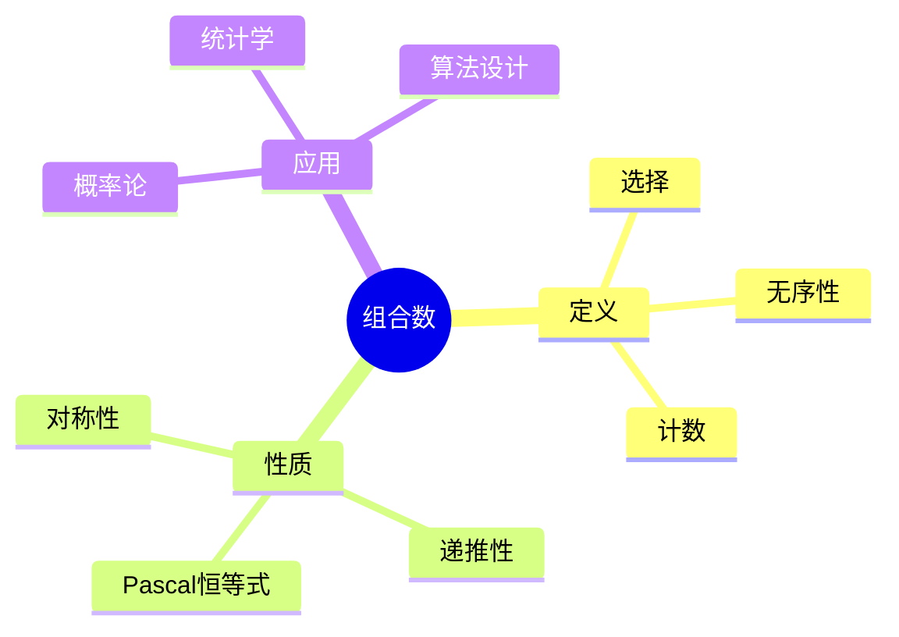
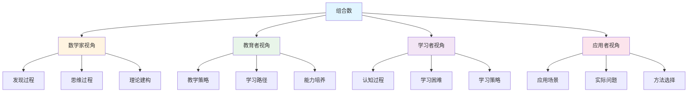
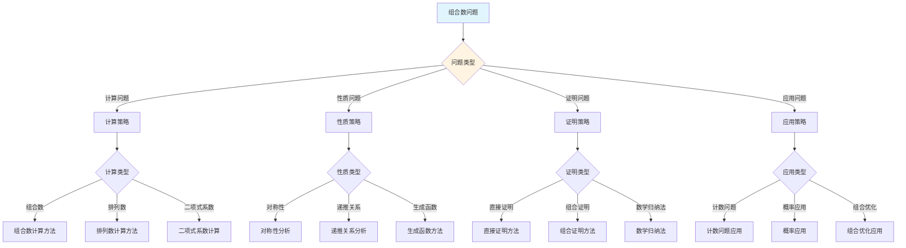
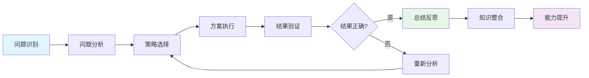
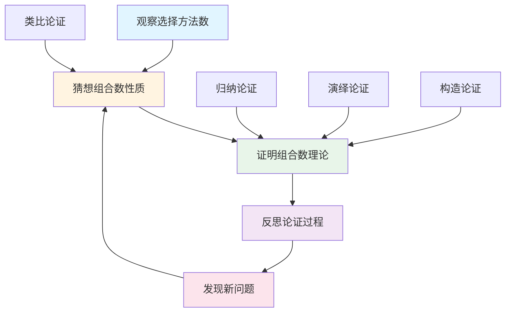
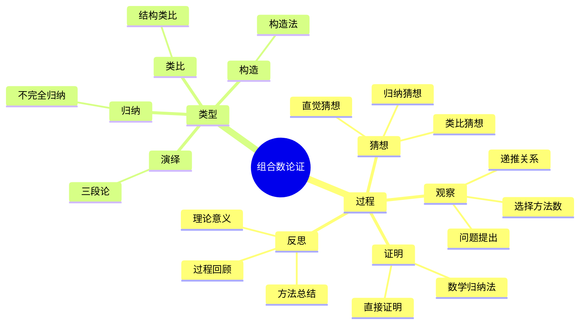

# 组合数 (Binomial Coefficient) - 三视角组织版

**概念编号**: C.CORE.030
**知识层次**: L0-L2
**知识领域**: D7 (离散数学)
**创建日期**: 2025年1月
**最后更新**: 2025年1月

---

## 📋 目录 / Table of Contents

- [组合数 (Binomial Coefficient) - 三视角组织版](#组合数-binomial-coefficient---三视角组织版)
  - [📋 目录 / Table of Contents](#-目录--table-of-contents)
  - [1. 📋 概述 (编号: C.CORE.030.01)](#1--概述-编号-ccore03001)
  - [🧠 认知学视角：如何理解组合数 (编号: C.CORE.030.02)](#-认知学视角如何理解组合数-编号-ccore03002)
    - [认知起点 (编号: C.CORE.030.02.01)](#认知起点-编号-ccore0300201)
    - [认知过程 (编号: C.CORE.030.02.02)](#认知过程-编号-ccore0300202)
      - [阶段1：直观理解阶段 (编号: C.CORE.030.02.02.01)](#阶段1直观理解阶段-编号-ccore030020201)
      - [阶段2：概念形成阶段 (编号: C.CORE.030.02.02.02)](#阶段2概念形成阶段-编号-ccore030020202)
      - [阶段3：形式化阶段 (编号: C.CORE.030.02.02.03)](#阶段3形式化阶段-编号-ccore030020203)
    - [认知障碍 (编号: C.CORE.030.02.03)](#认知障碍-编号-ccore0300203)
    - [认知工具 (编号: C.CORE.030.02.04)](#认知工具-编号-ccore0300204)
  - [🎓 教育学视角：如何教学组合数 (编号: C.CORE.030.03)](#-教育学视角如何教学组合数-编号-ccore03003)
    - [教学目标 (编号: C.CORE.030.03.01)](#教学目标-编号-ccore0300301)
    - [教学路径 (编号: C.CORE.030.03.02)](#教学路径-编号-ccore0300302)
      - [阶段1：引入阶段（激发兴趣） (编号: C.CORE.030.03.02.01)](#阶段1引入阶段激发兴趣-编号-ccore030030201)
      - [阶段2：探索阶段（主动建构） (编号: C.CORE.030.03.02.02)](#阶段2探索阶段主动建构-编号-ccore030030202)
      - [阶段3：形式化阶段（抽象概括） (编号: C.CORE.030.03.02.03)](#阶段3形式化阶段抽象概括-编号-ccore030030203)
      - [阶段4：巩固阶段（应用深化） (编号: C.CORE.030.03.02.04)](#阶段4巩固阶段应用深化-编号-ccore030030204)
    - [教学难点 (编号: C.CORE.030.03.03)](#教学难点-编号-ccore0300303)
      - [难点1：组合数的计算](#难点1组合数的计算)
      - [难点2：组合数的性质](#难点2组合数的性质)
      - [难点3：组合数的应用](#难点3组合数的应用)
    - [教学策略 (编号: C.CORE.030.03.04)](#教学策略-编号-ccore0300304)
      - [策略1：从具体到抽象](#策略1从具体到抽象)
      - [策略2：多元表征](#策略2多元表征)
      - [策略3：问题驱动](#策略3问题驱动)
      - [策略4：可视化教学](#策略4可视化教学)
    - [评估方法 (编号: C.CORE.030.03.05)](#评估方法-编号-ccore0300305)
  - [🔬 数学家视角：如何思考组合数 (编号: C.CORE.030.04)](#-数学家视角如何思考组合数-编号-ccore03004)
    - [问题起源 (编号: C.CORE.030.04.01)](#问题起源-编号-ccore0300401)
    - [思维过程 (编号: C.CORE.030.04.02)](#思维过程-编号-ccore0300402)
      - [步骤1：问题提出 (编号: C.CORE.030.04.02.01)](#步骤1问题提出-编号-ccore030040201)
      - [步骤2：概念形成 (编号: C.CORE.030.04.02.02)](#步骤2概念形成-编号-ccore030040202)
      - [步骤3：理论发展 (编号: C.CORE.030.04.02.03)](#步骤3理论发展-编号-ccore030040203)
    - [历史发展 (编号: C.CORE.030.04.03)](#历史发展-编号-ccore0300403)
    - [3.2 关键人物和贡献 (编号: C.CORE.030.04.04)](#32-关键人物和贡献-编号-ccore0300404)
    - [重要定理 (编号: C.CORE.030.04.05)](#重要定理-编号-ccore0300405)
    - [开放问题 (编号: C.CORE.030.04.06)](#开放问题-编号-ccore0300406)
    - [一、第一人称思维描述 (编号: C.CORE.030.04.07)](#一第一人称思维描述-编号-ccore0300407)
      - [1.1 Pascal的发现过程](#11-pascal的发现过程)
    - [二、数学直觉的形成 (编号: C.CORE.030.04.08)](#二数学直觉的形成-编号-ccore0300408)
      - [2.1 直觉在概念发现中的作用](#21-直觉在概念发现中的作用)
      - [2.2 如何培养组合数直觉](#22-如何培养组合数直觉)
    - [三、数学美的教育价值 (编号: C.CORE.030.04.09)](#三数学美的教育价值-编号-ccore0300409)
      - [3.1 组合数论的美在哪里](#31-组合数论的美在哪里)
      - [3.2 如何培养学生的数学美感](#32-如何培养学生的数学美感)
    - [四、问题解决策略 (编号: C.CORE.030.04.10)](#四问题解决策略-编号-ccore0300410)
      - [4.1 数学家的启发式方法](#41-数学家的启发式方法)
      - [4.2 思维过程分析](#42-思维过程分析)
    - [五、批判性反思 (编号: C.CORE.030.04.11)](#五批判性反思-编号-ccore0300411)
      - [5.1 组合数概念的局限性](#51-组合数概念的局限性)
      - [5.2 组合数理论的未解决问题](#52-组合数理论的未解决问题)
  - [💡 数学解释：为什么组合数是这样定义的 (编号: C.CORE.030.05)](#-数学解释为什么组合数是这样定义的-编号-ccore03005)
    - [一、直观解释：组合数是什么？](#一直观解释组合数是什么)
      - [1.1 具体例子](#11-具体例子)
      - [1.2 形象类比](#12-形象类比)
      - [1.3 几何直观](#13-几何直观)
      - [1.4 操作体验](#14-操作体验)
    - [二、知性解释：组合数的本质是什么？](#二知性解释组合数的本质是什么)
      - [2.1 概念定义](#21-概念定义)
      - [2.2 分类体系](#22-分类体系)
      - [2.3 抽象结构](#23-抽象结构)
      - [2.4 知识体系](#24-知识体系)
    - [三、理性解释：组合数的公理化定义](#三理性解释组合数的公理化定义)
      - [3.1 公理体系](#31-公理体系)
      - [3.2 形式化证明](#32-形式化证明)
      - [3.3 系统建构](#33-系统建构)
    - [四、多视角解释：从不同角度理解组合数](#四多视角解释从不同角度理解组合数)
      - [4.1 数学家视角：组合数是如何被发现的？](#41-数学家视角组合数是如何被发现的)
      - [4.2 教育者视角：如何教学组合数？](#42-教育者视角如何教学组合数)
      - [4.3 学习者视角：如何学习组合数？](#43-学习者视角如何学习组合数)
      - [4.4 应用者视角：如何应用组合数？](#44-应用者视角如何应用组合数)
    - [五、思维表征：用多种方式理解组合数](#五思维表征用多种方式理解组合数)
      - [5.1 思维导图：组合数的知识结构](#51-思维导图组合数的知识结构)
      - [5.2 矩阵对比：不同解释方式的对比](#52-矩阵对比不同解释方式的对比)
      - [5.3 多视角表征：从不同角度表征组合数](#53-多视角表征从不同角度表征组合数)
      - [5.4 决策树：组合数问题分类和策略选择](#54-决策树组合数问题分类和策略选择)
      - [5.5 决策逻辑路径：组合数问题解决过程](#55-决策逻辑路径组合数问题解决过程)
      - [5.6 多维对比矩阵：组合数概念特征对比](#56-多维对比矩阵组合数概念特征对比)
  - [🔍 数学论证：如何论证组合数 (编号: C.CORE.030.06)](#-数学论证如何论证组合数-编号-ccore03006)
    - [一、论证过程：从观察到反思](#一论证过程从观察到反思)
      - [1.1 观察（Observation）](#11-观察observation)
      - [1.2 猜想（Conjecture）](#12-猜想conjecture)
      - [1.3 证明（Proof）](#13-证明proof)
      - [1.4 反思（Reflection）](#14-反思reflection)
    - [二、论证类型：多种推理方式](#二论证类型多种推理方式)
      - [2.1 归纳论证（Inductive Reasoning）](#21-归纳论证inductive-reasoning)
      - [2.2 演绎论证（Deductive Reasoning）](#22-演绎论证deductive-reasoning)
      - [2.3 类比论证（Analogical Reasoning）](#23-类比论证analogical-reasoning)
      - [2.4 构造论证（Constructive Reasoning）](#24-构造论证constructive-reasoning)
    - [三、论证可视化：用图形表示论证过程](#三论证可视化用图形表示论证过程)
      - [3.1 论证流程图](#31-论证流程图)
      - [3.2 论证类型对比](#32-论证类型对比)
      - [3.3 论证思维导图](#33-论证思维导图)
  - [🔗 三视角整合 (编号: C.CORE.030.07)](#-三视角整合-编号-ccore03007)
    - [三个视角的关联](#三个视角的关联)
    - [如何综合运用三个视角](#如何综合运用三个视角)
  - [📚 参考文献 (编号: C.CORE.030.08)](#-参考文献-编号-ccore03008)
    - [权威资源](#权威资源)
    - [经典教材](#经典教材)
    - [研究论文](#研究论文)

---

## 1. 📋 概述 (编号: C.CORE.030.01)

组合数是组合数学的基础概念，表示从$n$个元素中选择$k$个元素的方法数。组合数在概率论、统计学、算法设计等领域有广泛应用。

本文档从**数学认知学**、**教育学**、**数学家**三个视角深入展开组合数概念，避免简单的概念堆垒。

**权威资源对齐**:

- Wikipedia: [Binomial Coefficient](https://en.wikipedia.org/wiki/Binomial_coefficient)
- Stanford课程: CS 109 (Probability for Computer Scientists)
- Princeton课程: COS 340 (Reasoning About Computation)
- MIT课程: 6.042J (Mathematics for Computer Science)
- Metamath: [Binomial Coefficient](http://us.metamath.org/mpeuni/df-bc.html)

---

## 🧠 认知学视角：如何理解组合数 (编号: C.CORE.030.02)

### 认知起点 (编号: C.CORE.030.02.01)

**学习者已有的知识基础**:

- 排列的概念
- 阶乘的概念
- 日常经验中的"选择"、"组合"概念

**日常经验中的类似概念**:

- "选择"：从多个中选择
- "组合"：不考虑顺序的选择
- "方法数"：有多少种方法

### 认知过程 (编号: C.CORE.030.02.02)

#### 阶段1：直观理解阶段 (编号: C.CORE.030.02.02.01)

**具体例子**:

- 例子1：$\binom{5}{2} = 10$（从5个元素中选2个）
- 例子2：$\binom{n}{0} = 1$（不选任何元素）
- 例子3：$\binom{n}{n} = 1$（选所有元素）

**形象类比**:

- **选择类比**: 组合数就像"选择的方法数"
  - 从$n$个中选择$k$个
  - 不考虑顺序
  - 有多少种方法

- **排列类比**: 组合数就像"不考虑顺序的排列"
  - 排列考虑顺序
  - 组合不考虑顺序
  - 组合数 = 排列数 / $k!$

**可视化表示**:

```text
组合数:
    C(n,k) = n!/(k!(n-k)!)
    从n个中选择k个
    不考虑顺序
```

#### 阶段2：概念形成阶段 (编号: C.CORE.030.02.02.02)

**从例子中抽象出共同特征**:

- 所有例子都涉及"选择"
- 选择不考虑顺序
- 选择有方法数

**识别关键属性**:

1. **阶乘公式**: $\binom{n}{k} = \frac{n!}{k!(n-k)!}$
2. **对称性**: $\binom{n}{k} = \binom{n}{n-k}$
3. **递推关系**: $\binom{n}{k} = \binom{n-1}{k-1} + \binom{n-1}{k}$

**建立概念边界**:

- **什么是组合数**: 从$n$个元素中选择$k$个元素的方法数
- **什么不是组合数**:
  - 排列数（考虑顺序）
  - 其他计数方法

#### 阶段3：形式化阶段 (编号: C.CORE.030.02.02.03)

**严格定义**:

- 组合数定义：$\binom{n}{k} = \frac{n!}{k!(n-k)!}$
- 等价定义：$\binom{n}{k} = \frac{n(n-1)\cdots(n-k+1)}{k!}$

**公理化表述**:

- 条件1：$n, k \in \mathbb{N}$
- 条件2：$0 \\leq k \\leq n$

**逻辑结构**:

- 组合数是组合数学的基础
- 组合数可以计算选择方法数
- 组合数是概率论的基础

### 认知障碍 (编号: C.CORE.030.02.03)

**常见误解**:

1. **误解1**: 认为组合数就是排列数
   - **纠正**: 组合数不考虑顺序，排列数考虑顺序

2. **误解2**: 认为$\binom{n}{k} = \frac{n!}{k!}$
   - **纠正**: 组合数是$\binom{n}{k} = \frac{n!}{k!(n-k)!}$

3. **误解3**: 认为组合数总是整数
   - **纠正**: 组合数定义在非负整数上，总是整数

**理解难点**:

1. **难点1**: 组合数的计算
   - **原因**: 阶乘计算比较复杂
   - **解决方法**: 用具体例子，逐步掌握计算方法

2. **难点2**: 组合数的性质
   - **原因**: 组合数性质比较多
   - **解决方法**: 用具体例子，逐步掌握性质

3. **难点3**: 组合数的应用
   - **原因**: 组合数应用比较广泛
   - **解决方法**: 用具体例子，逐步掌握应用

**认知陷阱**:

- **排列**: 需要理解组合和排列的区别
- **计算**: 需要理解组合数的计算方法

### 认知工具 (编号: C.CORE.030.02.04)

**类比工具**:

- **选择类比**: 组合数 = 选择的方法数
- **排列类比**: 组合数 = 不考虑顺序的排列

**可视化工具**:

- **Pascal三角形**: 用Pascal三角形表示组合数
- **选择图**: 用选择图表示组合

**具体化工具**:

- **具体例子**: 用具体例子理解抽象概念
- **反例**: 用反例理解概念边界

---

## 🎓 教育学视角：如何教学组合数 (编号: C.CORE.030.03)

### 教学目标 (编号: C.CORE.030.03.01)

**知识目标**:

- 理解组合数的基本概念
- 掌握组合数的定义
- 理解组合数的性质
- 理解组合数的应用

**能力目标**:

- 能够计算组合数
- 能够理解组合数的性质
- 能够应用组合数解决实际问题
- 能够理解组合数的重要性

**情感目标**:

- 培养数学抽象思维
- 培养组合思维
- 激发对数学的兴趣

### 教学路径 (编号: C.CORE.030.03.02)

#### 阶段1：引入阶段（激发兴趣） (编号: C.CORE.030.03.02.01)

**实际问题**:

- 问题1：从5个人中选2个人有多少种方法？
- 问题2：如何计算概率？
- 问题3：如何设计算法？

**历史背景**:

- 组合数的历史发展
- 组合数在数学中的地位
- 组合数在概率论中的应用

**引发认知冲突**:

- 问题：如何统一计算各种选择方法数？
- 引出组合数的概念

#### 阶段2：探索阶段（主动建构） (编号: C.CORE.030.03.02.02)

**引导发现**:

1. 让学生自己列举"选择"的例子
2. 让学生观察这些例子的共同特征
3. 引导学生抽象出组合数的定义

**合作探究**:

- 小组讨论：什么是组合数？
- 小组讨论：组合数有哪些性质？
- 小组讨论：如何计算组合数？

**多元表征**:

- **语言表征**: "组合数是从$n$个元素中选择$k$个元素的方法数"
- **符号表征**: $\binom{n}{k}$
- **图形表征**: Pascal三角形、选择图
- **集合表征**: 组合数定义

#### 阶段3：形式化阶段（抽象概括） (编号: C.CORE.030.03.02.03)

**严格定义**:

- 组合数的定义
- 组合数的性质
- 组合数的计算

**性质证明**:

- 组合数的基本性质
- 对称性
- 递推关系

**应用拓展**:

- 组合数在概率论中的应用
- 组合数在统计学中的应用
- 组合数在算法设计中的应用

#### 阶段4：巩固阶段（应用深化） (编号: C.CORE.030.03.02.04)

**练习应用**:

- 基础练习：组合数的计算和性质
- 应用练习：用组合数解决实际问题
- 综合练习：组合数的综合应用

**变式训练**:

- 不同形式的组合数计算
- 不同难度的组合数问题
- 组合数的应用

**知识整合**:

- 组合数与其他概念的联系
- 组合数在数学体系中的地位

### 教学难点 (编号: C.CORE.030.03.03)

#### 难点1：组合数的计算

- **难点描述**: 学生难以计算组合数
- **解决方法**:
  - 用具体例子
  - 逐步掌握计算方法
  - 用练习巩固

#### 难点2：组合数的性质

- **难点描述**: 学生难以理解组合数的性质
- **解决方法**:
  - 用具体例子
  - 逐步掌握性质
  - 用图形可视化

#### 难点3：组合数的应用

- **难点描述**: 学生难以应用组合数
- **解决方法**:
  - 用具体例子
  - 逐步掌握应用
  - 用练习巩固

### 教学策略 (编号: C.CORE.030.03.04)

#### 策略1：从具体到抽象

- 先给出具体例子
- 再抽象出一般概念
- 最后给出严格定义

#### 策略2：多元表征

- 用语言、符号、图形等多种方式表示同一概念
- 帮助学生建立不同表征之间的联系

#### 策略3：问题驱动

- 从实际问题出发
- 引出数学概念
- 解决问题

#### 策略4：可视化教学

- 使用Pascal三角形
- 使用选择图
- 使用具体例子

### 评估方法 (编号: C.CORE.030.03.05)

**形成性评估**（评估理解过程）:

- 课堂提问：检查学生对概念的理解
- 小组讨论：观察学生的思考过程
- 练习作业：检查学生的应用能力

**总结性评估**（评估最终理解）:

- 测验：检查学生对概念和计算的掌握
- 项目：检查学生应用组合数解决实际问题的能力
- 反思：检查学生对组合数概念的理解深度

---

## 🔬 数学家视角：如何思考组合数 (编号: C.CORE.030.04)

### 问题起源 (编号: C.CORE.030.04.01)

**历史背景**:

- 古代：组合数的早期研究
- 17-18世纪：组合数的发展
- 19-20世纪：组合数的现代发展

**原始问题**:

- **问题1**: 从$n$个元素中选择$k$个有多少种方法？
- **问题2**: 如何计算选择方法数？
- **问题3**: 组合数有哪些性质？

**研究动机**:

- 统一组合数学理论
- 发展概率论
- 研究算法设计

### 思维过程 (编号: C.CORE.030.04.02)

#### 步骤1：问题提出 (编号: C.CORE.030.04.02.01)

**观察到的现象**:

- 需要计算选择方法数
- 需要研究组合问题
- 需要统一组合数学理论

**提出的猜想**:

- 可以引入组合数概念
- 组合数可以计算选择方法数
- 组合数有丰富的性质

**需要解决的问题**:

- 如何定义组合数？
- 组合数应该满足什么条件？
- 组合数有哪些性质？

#### 步骤2：概念形成 (编号: C.CORE.030.04.02.02)

**尝试性定义**:

- **阶乘定义**: 通过阶乘
- **递推定义**: 通过递推关系

**性质探索**:

- 组合数的基本性质
- 对称性
- 递推关系

**结构发现**:

- 组合数是组合数学的基础
- 组合数可以计算选择方法数
- 组合数是概率论的基础

#### 步骤3：理论发展 (编号: C.CORE.030.04.02.03)

**定理证明**:

- 组合数的基本性质
- 对称性
- 递推关系

**应用拓展**:

- 组合数在概率论中的应用
- 组合数在统计学中的应用
- 组合数在算法设计中的应用

**理论完善**:

- 组合数的严格定义
- 组合数的范畴论研究
- 组合数的应用研究

### 历史发展 (编号: C.CORE.030.04.03)

**早期阶段**（古代）:

- **Pascal (1654)**: 研究Pascal三角形
- **Newton (1665)**: 研究二项式定理

**关键突破**（17-18世纪）:

- **Leibniz (1676)**: 研究组合数学
- **Euler (1748)**: 研究组合数学

**现代发展**（19-20世纪）:

- **Cayley (1854)**: 研究组合数学
- **Rota (1964)**: 发展组合数学理论

### 3.2 关键人物和贡献 (编号: C.CORE.030.04.04)

**Blaise Pascal (1623-1662)**:

- 研究Pascal三角形
- 建立组合数学基础

**Isaac Newton (1643-1727)**:

- 研究二项式定理
- 建立组合数学基础

**Gian-Carlo Rota (1932-1999)**:

- 发展组合数学理论
- 建立现代组合数学

### 重要定理 (编号: C.CORE.030.04.05)

**二项式定理**:

- $(x+y)^n = \sum_{k=0}^n \binom{n}{k} x^k y^{n-k}$
- 意义：组合数的重要应用

**Pascal恒等式**:

- $\binom{n}{k} = \binom{n-1}{k-1} + \binom{n-1}{k}$
- 意义：组合数的递推关系

**组合恒等式**:

- 各种组合恒等式
- 意义：组合数的性质

### 开放问题 (编号: C.CORE.030.04.06)

**未解决问题**:

- 组合数的计算问题
- 组合数的应用问题
- 组合数的推广问题

**研究方向**:

- 组合数的范畴论研究
- 组合数的应用研究
- 组合数的计算研究

### 一、第一人称思维描述 (编号: C.CORE.030.04.07)

#### 1.1 Pascal的发现过程

**详细历史背景**:

- **1654年**：Pascal发表《算术三角形》（Traité du triangle arithmétique）
- **背景**：研究组合问题，发现需要计算从$n$个元素中选择$k$个的方法数
- **问题**：如何计算组合的方法数？组合数有什么性质？

**Pascal的详细第一人称描述**:
> "1654年，我在研究组合问题时，遇到了一个问题：如何计算从$n$个元素中选择$k$个的方法数？
>
> 我发现，从$n$个元素中选择$k$个的方法数是$\binom{n}{k} = \frac{n!}{k!(n-k)!}$。
>
> 我的方法是这样的：
>
> - **思路**：用组合数描述组合的方法数
> - **定义**：$\binom{n}{k} = \frac{n!}{k!(n-k)!}$表示从$n$个元素中选择$k$个的方法数
> - **例子**：$\binom{5}{2} = \frac{5!}{2!3!} = 10$（从5个元素中选择2个有10种方法）
>
> 例如，对于$\binom{5}{2}$：
>
> - **计算**：$\binom{5}{2} = \frac{5!}{2!3!} = \frac{120}{2 \times 6} = 10$
> - **意义**：从5个元素中选择2个有10种方法
> - **例子**：从$\{a,b,c,d,e\}$中选择2个：$\{a,b\}, \{a,c\}, \{a,d\}, \{a,e\}, \{b,c\}, \{b,d\}, \{b,e\}, \{c,d\}, \{c,e\}, \{d,e\}$（10种）
>
> 我还发现了Pascal三角形：
>
> - **构造**：$\binom{n}{k} = \binom{n-1}{k-1} + \binom{n-1}{k}$（Pascal恒等式）
> - **例子**：$\binom{5}{2} = \binom{4}{1} + \binom{4}{2} = 4 + 6 = 10$
> - **意义**：Pascal三角形是组合数的递推关系
>
> 我还发现了二项式定理：
>
> - **定理**：$(x+y)^n = \sum_{k=0}^n \binom{n}{k} x^k y^{n-k}$
> - **例子**：$(x+y)^3 = \binom{3}{0}x^3 + \binom{3}{1}x^2y + \binom{3}{2}xy^2 + \binom{3}{3}y^3 = x^3 + 3x^2y + 3xy^2 + y^3$
> - **意义**：二项式定理是组合数的重要应用
>
> 这让我意识到，组合数是计算组合方法数的工具，组合数有丰富的性质。这为组合数学提供了基础。"

**详细的思维过程**:

1. **观察到的现象**（1654年）:

   **现象1：需要计算组合的方法数**
   - **问题**：如何计算从$n$个元素中选择$k$个的方法数？
   - **例子**：从5个元素中选择2个有10种方法
   - **需要**：统一的概念

   **现象2：这种计算有特殊的规律**
   - **问题**：组合数有什么性质？
   - **例子**：Pascal恒等式$\binom{n}{k} = \binom{n-1}{k-1} + \binom{n-1}{k}$
   - **需要**：建立组合数理论

   **现象3：需要统一的概念**
   - **问题**：如何统一处理不同的组合问题？
   - **思路**：用组合数统一
   - **需要**：建立组合数理论

2. **提出的猜想**（1654年）:

   **猜想1：用组合数描述组合的方法数**
   - **思路**：定义$\binom{n}{k} = \frac{n!}{k!(n-k)!}$
   - **例子**：$\binom{5}{2} = 10$
   - **优点**：统一描述组合的方法数

   **猜想2：Pascal恒等式**
   - **恒等式**：$\binom{n}{k} = \binom{n-1}{k-1} + \binom{n-1}{k}$
   - **例子**：$\binom{5}{2} = \binom{4}{1} + \binom{4}{2}$
   - **意义**：Pascal恒等式是组合数的递推关系

   **猜想3：二项式定理**
   - **定理**：$(x+y)^n = \sum_{k=0}^n \binom{n}{k} x^k y^{n-k}$
   - **例子**：$(x+y)^3 = x^3 + 3x^2y + 3xy^2 + y^3$
   - **意义**：二项式定理是组合数的重要应用

3. **遇到的困难**（1654年）:

   **困难1：如何严格定义组合数？**
   - **问题**：如何定义组合数？
   - **解决**：定义$\binom{n}{k} = \frac{n!}{k!(n-k)!}$
   - **意义**：为组合数提供严格的数学基础

   **困难2：如何计算组合数？**
   - **问题**：如何计算$\binom{n}{k}$？
   - **解决**：使用阶乘公式、Pascal恒等式
   - **意义**：为组合数提供计算方法

   **困难3：如何应用组合数理论？**
   - **问题**：如何用组合数理论解决实际问题？
   - **解决**：建立二项式定理、组合恒等式
   - **意义**：为组合数提供应用基础

4. **突破的时刻**（1654年，Pascal）:

   **突破1：组合数的概念**
   - 引入组合数的概念描述组合的方法数
   - **关键**：$\binom{n}{k} = \frac{n!}{k!(n-k)!}$
   - **意义**：为组合数学提供基础

   **突破2：Pascal恒等式**
   - 发现Pascal恒等式
   - **关键**：$\binom{n}{k} = \binom{n-1}{k-1} + \binom{n-1}{k}$
   - **意义**：为组合数提供递推关系

   **突破3：二项式定理**
   - 证明二项式定理
   - **关键**：$(x+y)^n = \sum_{k=0}^n \binom{n}{k} x^k y^{n-k}$
   - **意义**：为组合数提供重要应用

### 二、数学直觉的形成 (编号: C.CORE.030.04.08)

#### 2.1 直觉在概念发现中的作用

**Pascal的直觉**:

- **直觉1**: "组合数"是"组合的方法数"——这个直觉引导Pascal发现组合数
- **直觉2**: 组合数可以统一处理组合问题——这个直觉引导Pascal建立组合数理论
- **直觉3**: 组合数是组合数学的基础——这个直觉引导Pascal建立组合数理论

**直觉的验证**:

- 通过严格的数学证明验证直觉的正确性
- 通过Pascal恒等式严格化组合数定义
- 通过应用验证组合数的广泛性

**直觉的深化**:

- 从"组合的方法数"到"组合数的严格定义"
- 从"统一处理组合问题"到"组合数的广泛应用"
- 从"组合数学基础"到"组合数的深入发展"

#### 2.2 如何培养组合数直觉

**数学家的建议**:

- **Pascal**: "组合数直觉是长期训练的结果。通过大量练习和深入思考，我们可以培养对组合数的直觉。"
- **Newton**: "从具体例子开始，逐步抽象，这是培养组合数直觉的有效方法。"

**培养方法**:

1. **大量练习**: 通过大量组合数计算练习，培养对组合数的直觉
2. **深入思考**: 深入思考组合数的本质，理解组合数的深层结构
3. **类比和联想**: 通过类比和联想，建立组合数与其他概念的联系
4. **与专家交流**: 与数学家交流，学习他们的思维方式

**教学启示**:

- 从具体例子开始，逐步抽象
- 鼓励学生思考组合数的本质
- 引导学生建立组合数与其他概念的联系

### 三、数学美的教育价值 (编号: C.CORE.030.04.09)

#### 3.1 组合数论的美在哪里

**结构美**:

- **简洁性**: 组合数的概念非常简洁——"从$n$个元素中选择$k$个的方法数"
- **统一性**: 组合数可以统一描述数学中的各种组合问题
- **和谐性**: 组合数满足优美的规律（Pascal恒等式、二项式定理等）

**数学家的评价**:

- **Pascal**: "组合数论的美在于它的统一性。它为我们提供了一个统一的框架来理解组合问题。"
- **Newton**: "组合数论的美在于它的基础性。它是组合数学的基础，所有组合问题都可以用组合数来描述。"

#### 3.2 如何培养学生的数学美感

**数学家的建议**:

- **Pascal**: "展示组合数论的美感，让学生感受到数学的美。"
- **Newton**: "通过组合数论的历史和发展，让学生理解数学的美。"

**教学方法**:

1. **展示数学美**:
   - 展示组合数概念的简洁性和统一性
   - 展示组合数的优美规律
   - 展示组合数在数学中的基础地位

2. **引导学生欣赏**:
   - 引导学生欣赏组合数概念的简洁性
   - 引导学生欣赏组合数的和谐性
   - 引导学生欣赏组合数的基础性

3. **鼓励学生创造美**:
   - 鼓励学生发现组合数论的美
   - 鼓励学生创造优美的组合数证明
   - 鼓励学生探索组合数论的美

### 四、问题解决策略 (编号: C.CORE.030.04.10)

#### 4.1 数学家的启发式方法

**策略1：从具体到抽象**:

- 从具体的组合数例子开始
- 抽象出组合数的一般性质
- 建立组合数的理论体系

**策略2：从简单到复杂**:

- 先理解基本组合数
- 再理解组合数运算
- 最后理解组合数理论

**策略3：从问题到理论**:

- 从实际问题出发
- 引出组合数概念
- 建立组合数理论

#### 4.2 思维过程分析

**问题识别**:

- 识别问题类型：组合数定义问题、组合数计算问题、组合数应用问题
- 识别问题难度：简单问题、中等问题、复杂问题

**策略选择**:

- 简单问题：直接方法
- 中等问题：分步方法
- 复杂问题：分解方法

**执行和反思**:

- 执行策略，解决问题
- 反思过程，总结经验
- 改进方法，提高效率

### 五、批判性反思 (编号: C.CORE.030.04.11)

#### 5.1 组合数概念的局限性

**概念的边界**:

- 组合数只描述组合的方法数，不能描述所有数学结构
- 组合数是抽象的，需要具体化才能应用
- 组合数不能表示所有数学量

**概念的推广**:

- 广义组合数：更一般的组合数
- 多组合数：多个集合的组合数
- 范畴组合数：范畴论中的组合数

#### 5.2 组合数理论的未解决问题

**未解决的问题**:

- 组合数的计算问题：如何计算复杂组合数？
- 组合数的应用问题：如何更好地应用组合数？
- 组合数的推广问题：如何推广组合数概念？

**研究方向**:

- 组合数的范畴论研究
- 组合数的应用研究
- 组合数的计算研究

---

## 💡 数学解释：为什么组合数是这样定义的 (编号: C.CORE.030.05)

### 一、直观解释：组合数是什么？

#### 1.1 具体例子

**生活中的例子**：

- **选择问题**：从$n$个人中选择$k$个人组成团队
  - 例如：从5个人中选择3个人，有$\binom{5}{3} = 10$种方法
  - **为什么这样定义**：因为我们需要一个概念来表示"选择的方法数"
- **排列问题**：组合数与排列数的区别
  - 例如：排列考虑顺序，组合不考虑顺序
  - **为什么这样定义**：因为我们需要区分"有顺序"和"无顺序"的选择
- **概率计算**：组合数用于计算概率
  - 例如：从52张牌中抽取5张牌的方法数
  - **为什么这样定义**：因为我们需要一个概念来表示"概率计算的基础"

**数学中的例子**：

- **二项式系数**：$\binom{n}{k} = \frac{n!}{k!(n-k)!}$
  - **为什么这样定义**：我们需要一个简单的方式来表示"从$n$个元素中选择$k$个的方法数"
- **Pascal三角形**：组合数可以排列成三角形
  - **为什么这样定义**：我们需要一个概念来表示"组合数的递推关系"
- **二项式定理**：$(x+y)^n = \sum_{k=0}^n \binom{n}{k} x^k y^{n-k}$
  - **为什么这样定义**：我们需要一个概念来表示"二项式展开的系数"

#### 1.2 形象类比

**选择类比**：

- **组合数就像"选择的方法数"**
  - 从一堆物品中选择一些物品
  - 不考虑选择的顺序
- **为什么这样类比**：这个类比帮助我们理解组合数的"选择"性质

**计数类比**：

- **组合数就像"计数工具"**
  - 计算有多少种方法
  - 不考虑顺序
- **为什么这样类比**：这个类比帮助我们理解组合数的"计数"性质

#### 1.3 几何直观

**Pascal三角形表示**：

- 使用Pascal三角形表示组合数
- 例如：$\binom{n}{k}$在Pascal三角形的第$n$行第$k$列
- **为什么使用Pascal三角形**：Pascal三角形提供几何直观，帮助我们理解组合数的递推关系

**组合数图形表示**：

- 使用图形表示组合数
- 例如：用点表示元素，用线表示选择
- **为什么使用图形**：图形提供几何直观，帮助我们理解组合数的含义

#### 1.4 操作体验

**组合数计算的操作**：

- **直接计算**：$\binom{n}{k} = \frac{n!}{k!(n-k)!}$
  - **为什么这样操作**：因为我们需要一个运算来计算"组合数"
- **递推计算**：$\binom{n}{k} = \binom{n-1}{k-1} + \binom{n-1}{k}$（Pascal恒等式）
  - **为什么这样操作**：因为我们需要一个工具来计算复杂组合数
- **组合数运算规则**：$\binom{n}{k} = \binom{n}{n-k}$（对称性）
  - **为什么这样操作**：因为我们需要一个工具来简化计算

### 二、知性解释：组合数的本质是什么？

#### 2.1 概念定义

**组合数的内涵**：

- **组合数是从$n$个元素中选择$k$个元素的方法数，不考虑顺序**
  - **选择**：从$n$个元素中选择$k$个
  - **无序性**：不考虑选择的顺序
  - **计数**：$\binom{n}{k} = \frac{n!}{k!(n-k)!}$
- **为什么这样定义**：这些特征使得组合数成为一个完整的组合数学工具，支持所有选择研究

**组合数的外延**：

- **二项式系数**：$\binom{n}{k}$是$(x+y)^n$展开式中$x^k y^{n-k}$的系数
- **Pascal三角形**：组合数可以排列成三角形
- **为什么这样分类**：不同的组合数类型有不同的性质和用途

#### 2.2 分类体系

**按大小分类**：

- **小组合数**：$\binom{5}{2} = 10$
- **大组合数**：$\binom{100}{50}$（非常大的数）
- **为什么这样分类**：大小是组合数的基本特征

**按性质分类**：

- **对称性**：$\binom{n}{k} = \binom{n}{n-k}$
- **递推性**：$\binom{n}{k} = \binom{n-1}{k-1} + \binom{n-1}{k}$
- **为什么这样分类**：性质是组合数的重要特征

#### 2.3 抽象结构

**组合数的运算结构**：

- **组合数的加法**：$\binom{n}{k} + \binom{n}{k+1} = \binom{n+1}{k+1}$
- **组合数的乘法**：$\binom{n}{k} \binom{k}{r} = \binom{n}{r} \binom{n-r}{k-r}$
- **为什么有这些运算**：这些运算使得组合数具有代数结构

**组合数的关系结构**：

- **对称关系**：$\binom{n}{k} = \binom{n}{n-k}$
- **递推关系**：$\binom{n}{k} = \binom{n-1}{k-1} + \binom{n-1}{k}$
- **为什么有这个关系**：这个关系帮助我们研究组合数的性质

#### 2.4 知识体系

**组合数在数学体系中的位置**：

- **基础地位**：组合数是组合数学的基础
  - 组合数是选择问题的基础
  - 组合数是概率论的基础
- **为什么是基础**：组合数提供了统一的框架来研究选择问题

**组合数与其他概念的关系**：

- **组合数与排列数**：排列数考虑顺序，组合数不考虑顺序
- **组合数与二项式定理**：组合数是二项式展开的系数
- **组合数与概率**：组合数用于计算概率
- **为什么有这些关系**：这些关系揭示了组合数与其他数学概念的内在联系

### 三、理性解释：组合数的公理化定义

#### 3.1 公理体系

**组合数的定义**：

- **定义**：$\binom{n}{k} = \frac{n!}{k!(n-k)!}$，其中$n! = n \times (n-1) \times \cdots \times 1$
- **为什么需要这个定义**：这个定义提供了组合数的严格数学基础

**组合数的公理**：

- **阶乘公理**：$n! = n \times (n-1)!$，$0! = 1$
- **组合数公理**：$\binom{n}{k} = \frac{n!}{k!(n-k)!}$
- **为什么这样定义**：这些公理将组合数放在更一般的框架中

#### 3.2 形式化证明

**组合数性质的证明**：

##### 定理1：组合数的对称性

**定理陈述**：对于非负整数$n, k$满足$0 \\leq k \\leq n$，有$\binom{n}{k} = \binom{n}{n-k}$。

**形式化表述**：
$$\forall n, k \in \mathbb{N}, 0 \\leq k \\leq n, \quad \binom{n}{k} = \binom{n}{n-k}$$

**证明**（组合论证）：
1. **定义**：$\binom{n}{k}$是从$n$个元素中选择$k$个的方法数
2. **对应关系**：选择$k$个元素等价于选择$n-k$个元素不选
3. **双射**：从$k$元子集到$(n-k)$元补集存在双射
4. **结论**：$\binom{n}{k} = \binom{n}{n-k}$

**代数证明**：
$$\binom{n}{k} = \frac{n!}{k!(n-k)!} = \frac{n!}{(n-k)!(n-(n-k))!} = \binom{n}{n-k}$$

**为什么这样证明**：利用组合数的组合意义（选择与不选择的对称性）和阶乘的性质。

---

##### 定理2：Pascal恒等式

**定理陈述**：对于正整数$n, k$满足$1 \\leq k \\leq n-1$，有$\binom{n}{k} = \binom{n-1}{k-1} + \binom{n-1}{k}$。

**形式化表述**：
$$\forall n, k \in \mathbb{N}, 1 \\leq k \\leq n-1, \quad \binom{n}{k} = \binom{n-1}{k-1} + \binom{n-1}{k}$$

**证明**（组合论证）：
1. **问题**：从$n$个元素中选择$k$个的方法数
2. **分类**：固定一个元素，分为两类：
   - **包含该元素**：从剩余$n-1$个元素中选择$k-1$个，有$\binom{n-1}{k-1}$种方法
   - **不包含该元素**：从剩余$n-1$个元素中选择$k$个，有$\binom{n-1}{k}$种方法
3. **结论**：$\binom{n}{k} = \binom{n-1}{k-1} + \binom{n-1}{k}$

**代数证明**：
$$\binom{n-1}{k-1} + \binom{n-1}{k} = \frac{(n-1)!}{(k-1)!(n-k)!} + \frac{(n-1)!}{k!(n-k-1)!}$$
$$= \frac{(n-1)!}{k!(n-k)!}(k + (n-k)) = \frac{(n-1)! \cdot n}{k!(n-k)!} = \binom{n}{k}$$

**为什么这样证明**：利用组合数的组合意义（分类计数）和代数恒等式。

---

##### 定理3：二项式定理

**定理陈述**：对于任意实数$x, y$和非负整数$n$，有$(x+y)^n = \sum_{k=0}^{n} \binom{n}{k} x^k y^{n-k}$。

**形式化表述**：
$$\forall x, y \in \mathbb{R}, \forall n \in \mathbb{N}, \quad (x+y)^n = \sum_{k=0}^{n} \binom{n}{k} x^k y^{n-k}$$

**证明**（数学归纳法）：
1. **基础情况**：$n=0$时，$(x+y)^0 = 1 = \binom{0}{0} x^0 y^0$
2. **归纳假设**：假设对$n$成立：$(x+y)^n = \sum_{k=0}^{n} \binom{n}{k} x^k y^{n-k}$
3. **归纳步骤**：
   $$(x+y)^{n+1} = (x+y)(x+y)^n = (x+y)\sum_{k=0}^{n} \binom{n}{k} x^k y^{n-k}$$
   $$= \sum_{k=0}^{n} \binom{n}{k} x^{k+1} y^{n-k} + \sum_{k=0}^{n} \binom{n}{k} x^k y^{n-k+1}$$
   $$= \sum_{k=1}^{n+1} \binom{n}{k-1} x^k y^{n-k+1} + \sum_{k=0}^{n} \binom{n}{k} x^k y^{n-k+1}$$
   $$= \sum_{k=0}^{n+1} \left(\binom{n}{k-1} + \binom{n}{k}\right) x^k y^{n-k+1} = \sum_{k=0}^{n+1} \binom{n+1}{k} x^k y^{n-k+1}$$
   （其中$\binom{n}{-1} = \binom{n}{n+1} = 0$）
4. **结论**：对所有$n$，公式成立

**为什么这样证明**：利用数学归纳法和Pascal恒等式。

#### 3.3 系统建构

**组合数论在数学基础中的地位**：

- **作为组合数学基础**：组合数是组合数学的基础
- **提供计数工具**：组合数提供了计数选择的方法数
- **统一框架**：组合数统一了各种选择研究

**组合数论的发展历史**：

- **Pascal的三角形**（1654年）：研究Pascal三角形
- **Newton的二项式定理**（1665年）：研究二项式定理
- **为什么这样发展**：数学的发展需要严格的基础，组合数论的发展反映了这一需求

### 四、多视角解释：从不同角度理解组合数

#### 4.1 数学家视角：组合数是如何被发现的？

**Pascal的发现过程**：

- **问题提出**：如何计算选择的方法数？
- **关键洞察**：使用Pascal三角形，发现组合数的递推关系
- **重要发现**：组合数可以用于计算选择的方法数
- **为什么这样发现**：数学家的直觉和严格证明相结合

#### 4.2 教育者视角：如何教学组合数？

**教学策略**：

- **从具体到抽象**：先学习具体例子（选择问题），再学习抽象定义
- **从简单到复杂**：先学习小组合数，再学习大组合数
- **从直观到形式化**：先使用Pascal三角形等直观工具，再学习严格定义
- **为什么这样教学**：符合认知规律，帮助学生逐步建立理解

#### 4.3 学习者视角：如何学习组合数？

**认知过程**：

- **直观阶段**：通过具体例子理解组合数的含义
- **概念阶段**：理解组合数的定义和性质
- **形式化阶段**：理解严格定义和证明
- **为什么这样学习**：符合认知发展规律

#### 4.4 应用者视角：如何应用组合数？

**应用场景**：

- **概率论**：使用组合数计算概率
- **统计学**：使用组合数进行统计分析
- **算法设计**：使用组合数进行算法设计
- **为什么这样应用**：组合数提供了强大的工具来处理各种问题

### 五、思维表征：用多种方式理解组合数

#### 5.1 思维导图：组合数的知识结构



#### 5.2 矩阵对比：不同解释方式的对比

| 解释方式 | 特点 | 方法 | 工具 | 适用阶段 | 优势 | 局限 |
|---------|------|------|------|---------|------|------|
| **直观解释** | 具体、形象、可视 | 例子、类比、直观 | Pascal三角形、图形 | 入门阶段 | 易于理解 | 不够严格 |
| **知性解释** | 概念、分类、抽象 | 定义、分类、结构 | 概念图、知识图谱 | 中级阶段 | 系统完整 | 不够直观 |
| **理性解释** | 公理、证明、形式化 | 公理、证明、系统 | 形式化工具、证明系统 | 高级阶段 | 严格准确 | 不够具体 |
| **多视角解释** | 多角度、整合 | 多视角、整合 | 多视角工具 | 所有阶段 | 全面深入 | 可能复杂 |

#### 5.3 多视角表征：从不同角度表征组合数



#### 5.4 决策树：组合数问题分类和策略选择



**说明**：

- **问题分类**：根据问题类型（计算、性质、证明、应用）进行分类
- **策略选择**：根据问题类型选择相应的解决策略
- **方法应用**：根据具体问题选择合适的方法

#### 5.5 决策逻辑路径：组合数问题解决过程



**说明**：

- **问题识别**：识别组合数问题的类型和关键要素
- **问题分析**：分析问题的条件和目标
- **策略选择**：根据问题类型选择解决策略
- **方案执行**：执行选定的解决方案
- **结果验证**：验证结果的正确性
- **总结反思**：总结解题过程，反思解题方法
- **知识整合**：整合相关知识点
- **能力提升**：提升问题解决能力

#### 5.6 多维对比矩阵：组合数概念特征对比

| 对比维度 | 组合数定义 | 组合数计算 | 组合数性质 | 组合数应用 |
|---------|---------|---------|---------|---------|
| **核心特征** | 组合、排列、二项式系数 | 组合数、排列数、二项式系数 | 对称性、递推关系、生成函数 | 计数、概率、组合优化 |
| **理解难度** | ⭐⭐⭐ | ⭐⭐⭐ | ⭐⭐⭐⭐ | ⭐⭐⭐⭐ |
| **应用频率** | ⭐⭐⭐⭐⭐ | ⭐⭐⭐⭐⭐ | ⭐⭐⭐⭐ | ⭐⭐⭐⭐⭐ |
| **理论基础** | 组合数定义 | 组合数计算理论 | 组合数性质理论 | 组合数应用理论 |
| **教学重点** | 概念理解 | 计算方法 | 性质分析 | 应用能力 |
| **学习阶段** | 中级阶段 | 中级阶段 | 中级-高级 | 中级-高级 |
| **认知维度** | 知性+理性 | 理性 | 理性 | 理性+应用 |
| **思维表征** | 思维导图 | 决策树 | 决策逻辑路径 | 知识图谱 |

**说明**：

- **核心特征**：每个方面的核心特征
- **理解难度**：从1星到5星，表示理解难度
- **应用频率**：从1星到5星，表示应用频率
- **理论基础**：每个方面的理论基础
- **教学重点**：每个方面的教学重点
- **学习阶段**：每个方面的学习阶段
- **认知维度**：每个方面的认知维度
- **思维表征**：每个方面推荐的思维表征方法

---

## 🔍 数学论证：如何论证组合数 (编号: C.CORE.030.06)

### 一、论证过程：从观察到反思

#### 1.1 观察（Observation）

**具体现象观察**：

- **现象1**：从$n$个元素中选择$k$个的方法数
  - 例如：从$\{1,2,3\}$中选择2个有3种方法：$\{1,2\}$，$\{1,3\}$，$\{2,3\}$
  - **为什么重要**：这个现象揭示了组合数的本质
- **现象2**：组合数的递推关系
  - 例如：$\binom{n}{k} = \binom{n-1}{k-1} + \binom{n-1}{k}$（Pascal三角形）
  - **为什么重要**：这个现象揭示了组合数的结构性质

**模式识别**：

- **模式1**：组合数的公式
  - 例如：$\binom{n}{k} = \frac{n!}{k!(n-k)!}$
  - **为什么重要**：这个模式可能反映了组合数的本质
- **模式2**：二项式定理
  - 例如：$(x+y)^n = \sum_{k=0}^n \binom{n}{k} x^k y^{n-k}$
  - **为什么重要**：这个模式可能反映了组合数的代数结构

**问题提出**：

- **问题1**：如何严格定义组合数，统一不同的计数方法？
  - **为什么提出**：这个问题可能揭示组合数的本质和基础
- **问题2**：如何证明二项式定理？
  - **为什么提出**：这个问题可能揭示组合数的代数性质

#### 1.2 猜想（Conjecture）

**归纳猜想**：

- **猜想1**：组合数是研究计数的统一工具
  - **依据**：观察不同计数问题都依赖于组合数
  - **为什么提出**：这个猜想可能揭示组合数的统一性
- **猜想2**：二项式定理
  - **依据**：观察具体二项式展开
  - **为什么提出**：这个猜想可能揭示组合数的代数性质

**类比猜想**：

- **猜想1**：组合数类似于"选择数"
  - **类比对象**：选择数
  - **为什么提出**：这个类比可能揭示组合数的本质
- **猜想2**：Pascal三角形类似于"杨辉三角"
  - **类比对象**：杨辉三角
  - **为什么提出**：这个类比可能揭示Pascal三角形的作用

**直觉猜想**：

- **猜想1**：组合数是"最自然"的计数概念
  - **直觉来源**：组合数的直观
  - **为什么提出**：这个直觉可能揭示组合数的基础地位
- **猜想2**：组合数有"最小"的公理结构
  - **直觉来源**：组合数的公理结构
  - **为什么提出**：这个直觉可能揭示组合数的本质

#### 1.3 证明（Proof）

**直接证明**：

- **证明1**：二项式定理
  - **证明思路**：使用数学归纳法和组合数的定义
  - **关键步骤**：证明$(x+y)^n = \sum_{k=0}^n \binom{n}{k} x^k y^{n-k}$
  - **为什么这样证明**：这个证明方法直接、清晰
- **证明2**：组合数的递推关系
  - **证明思路**：使用组合数的定义
  - **关键步骤**：证明$\binom{n}{k} = \binom{n-1}{k-1} + \binom{n-1}{k}$
  - **为什么这样证明**：这个证明方法直接、清晰

**数学归纳法**：

- **数学归纳法**：证明二项式定理
  - **基础步骤**：$n=0$时，$(x+y)^0 = 1 = \sum_{k=0}^0 \binom{0}{k} x^k y^{0-k}$
  - **归纳步骤**：假设对$n$成立，证明对$n+1$成立
  - **为什么这样证明**：数学归纳法适合证明关于自然数的命题

#### 1.4 反思（Reflection）

**过程回顾**：

- **论证回顾**：从观察从$n$个元素中选择$k$个的方法数，到猜想组合数的性质，再到严格证明
  - **成功之处**：成功建立了组合数的严格理论
  - **不足之处**：组合数概念需要进一步推广
  - **改进方向**：推广到多组合数、$q$-组合数等

**方法总结**：

- **证明方法**：使用了直接证明、数学归纳法
  - **方法特点**：直接证明清晰，数学归纳法严格
  - **适用范围**：不同方法适用于不同类型的命题
- **证明技巧**：使用组合数的定义、数学归纳法、递推关系
  - **技巧要点**：将组合数问题转化为计数问题，使用数学归纳法处理自然数问题
  - **应用场景**：这些技巧可以应用于其他组合问题

**理论意义**：

- **理论贡献**：建立了组合数的严格理论，揭示了组合数的组合结构
  - **为什么重要**：这个论证揭示了组合数学的基础结构
- **应用价值**：组合数为组合数学、概率论、统计学提供了基础
  - **为什么重要**：这个论证可以应用于所有计数问题

### 二、论证类型：多种推理方式

#### 2.1 归纳论证（Inductive Reasoning）

**不完全归纳**：

- **例子1**：从具体组合数的性质归纳一般规律
  - **观察**：观察$\binom{3}{2} = 3$，$\binom{4}{2} = 6$的规律
  - **结论**：组合数满足递推关系
  - **局限性**：不完全归纳的结论需要严格证明

#### 2.2 演绎论证（Deductive Reasoning）

**三段论**：

- **例子1**：证明组合数的性质
  - **大前提**：所有组合数都满足递推关系
  - **小前提**：$\binom{5}{2}$是组合数
  - **结论**：$\binom{5}{2} = \binom{4}{1} + \binom{4}{2} = 4 + 6 = 10$
  - **为什么有效**：三段论是严格的演绎推理

#### 2.3 类比论证（Analogical Reasoning）

**结构类比**：

- **例子1**：组合数与排列数的类比
  - **类比对象**：排列数
  - **相似性**：组合数不考虑顺序，排列数考虑顺序
  - **结论**：组合数可以理解为"无序排列数"
  - **局限性**：类比不能替代严格证明

#### 2.4 构造论证（Constructive Reasoning）

**构造法**：

- **例子1**：构造组合数的递推关系
  - **构造方法**：将选择分为包含某个元素和不包含某个元素两种情况
  - **验证**：验证构造的递推关系正确
  - **为什么有效**：构造法是严格的直接证明

### 三、论证可视化：用图形表示论证过程

#### 3.1 论证流程图



#### 3.2 论证类型对比

| 论证类型 | 特点 | 适用场景 | 优势 | 局限 |
|---------|------|---------|------|------|
| **归纳论证** | 从特殊到一般 | 发现规律、提出猜想 | 启发性强 | 结论或然 |
| **演绎论证** | 从一般到特殊 | 严格证明、逻辑推理 | 结论必然 | 需要前提 |
| **类比论证** | 基于相似性 | 启发思路、发现联系 | 创造性高 | 结论或然 |
| **构造论证** | 直接构造 | 证明存在性命题 | 直接明确 | 需要构造 |

#### 3.3 论证思维导图



---

## 🔗 三视角整合 (编号: C.CORE.030.07)

### 三个视角的关联

**认知学视角 ↔ 教育学视角**:

- 认知学视角揭示的理解机制，指导教育学视角的教学设计
- 教育学视角的教学实践，验证认知学视角的理论

**认知学视角 ↔ 数学家视角**:

- 数学家视角的思维过程，启发认知学视角的认知路径
- 认知学视角的认知障碍，解释数学家视角的历史困难

**教育学视角 ↔ 数学家视角**:

- 数学家视角的历史发展，为教育学视角提供教学素材
- 教育学视角的教学策略，帮助学习者理解数学家视角的思维过程

### 如何综合运用三个视角

**学习建议**:

1. **从认知学视角开始**: 先建立直观理解
2. **用教育学视角深化**: 通过教学路径系统学习
3. **用数学家视角升华**: 理解概念的深层意义和历史背景

**教学建议**:

1. **引入阶段**: 用数学家视角的问题起源激发兴趣
2. **探索阶段**: 用认知学视角的认知过程引导发现
3. **形式化阶段**: 用教育学视角的教学策略系统教学
4. **巩固阶段**: 综合三个视角深化理解

---

## 📚 参考文献 (编号: C.CORE.030.08)

### 权威资源

- Wikipedia: [Binomial Coefficient](https://en.wikipedia.org/wiki/Binomial_coefficient)
- Metamath: [Binomial Coefficient](http://us.metamath.org/mpeuni/df-bc.html)

### 经典教材

- Stanley, R. P. (2011). *Enumerative Combinatorics*. Cambridge University Press.
- Graham, R. L., Knuth, D. E., & Patashnik, O. (1994). *Concrete Mathematics*. Addison-Wesley.

### 研究论文

- Pascal, B. (1654). *Traité du triangle arithmétique*. Paris.
- Newton, I. (1665). "De analysi per aequationes numero terminorum infinitas". *London*.

---

**创建日期**: 2025年1月
**最后更新**: 2025年1月
**维护状态**: 持续更新中
