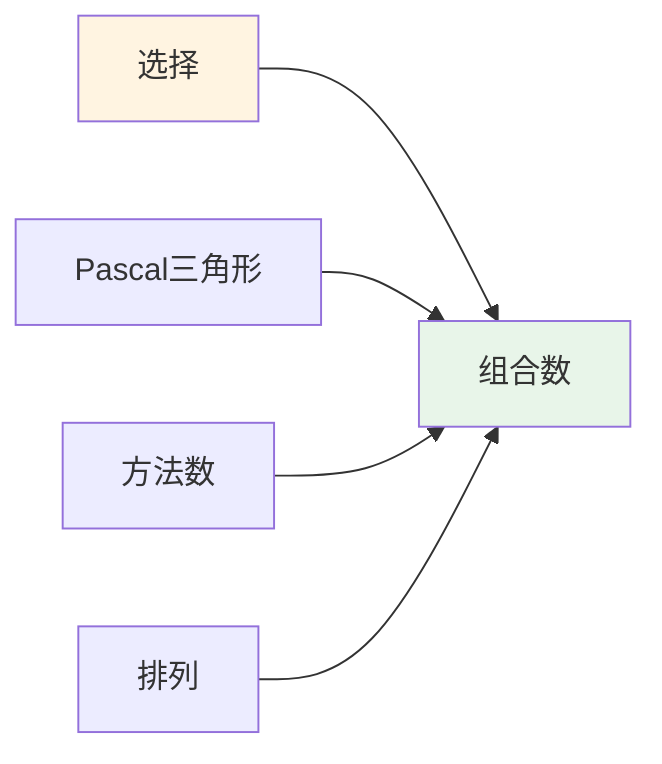
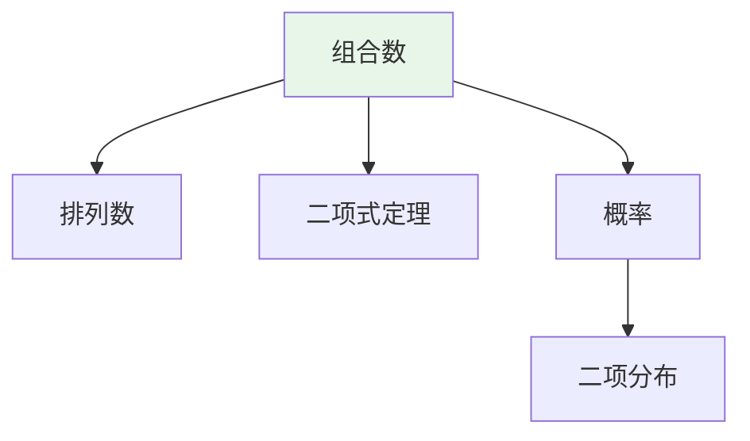
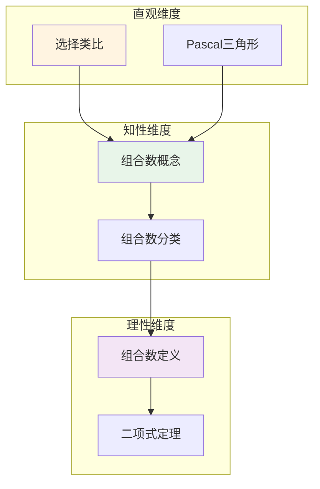

# 组合数 (Binomial Coefficient)

**概念编号**: C.CORE.030
**知识层次**: L0-L2
**知识领域**: D7 (离散数学)
**创建日期**: 2025年11月21日
**最后更新**: 2025年11月21日

---

## 📋 概述

组合数是组合数学的基础概念，表示从 $n$ 个元素中选择 $k$ 个元素的方法数。组合数在概率论、统计学、算法设计等领域有广泛应用。

**权威资源对齐**:

- Wikipedia: [Binomial Coefficient](https://en.wikipedia.org/wiki/Binomial_coefficient)
- Stanford课程: CS 109 (Probability for Computer Scientists)
- Princeton课程: COS 340 (Reasoning About Computation)
- MIT课程: 6.042J (Mathematics for Computer Science)
- Metamath: [Binomial Coefficient](http://us.metamath.org/mpeuni/df-bc.html)

---

## 🎯 严格定义

### 基础定义 (L0)

**直观理解**: 组合数 $\binom{n}{k}$ 表示从 $n$ 个不同元素中选择 $k$ 个元素的方法数，不考虑顺序。

**基本定义**: 组合数 $\binom{n}{k}$ 定义为：

$$\binom{n}{k} = \frac{n!}{k!(n-k)!}$$

其中 $n! = n \cdot (n-1) \cdots 2 \cdot 1$ 是阶乘。

**简单例子**:

- $\binom{5}{2} = 10$（从5个元素中选2个）
- $\binom{n}{0} = 1$（不选任何元素）
- $\binom{n}{n} = 1$（选所有元素）

### 形式化定义 (L1)

**组合数**: 组合数 $\binom{n}{k}$ 定义为：

$$\binom{n}{k} = \frac{n!}{k!(n-k)!} = \frac{n(n-1)\cdots(n-k+1)}{k!}$$

其中 $n, k \in \mathbb{N}$，$0 \leq k \leq n$。

**等价定义**: $\binom{n}{k} = |\{S \subseteq [n] : |S| = k\}|$，即 $[n]$ 的 $k$ 元子集个数。

**记号**:

- $\binom{n}{k}$: 组合数
- $C(n, k)$: 组合数（另一种记号）
- $n!$: 阶乘

---

## 📚 历史背景

### 发展脉络

**古代**: 组合的早期研究

- **中国 (约公元前200年)**: 《九章算术》中包含组合问题
- **印度 (约6世纪)**: 研究排列组合
- **阿拉伯 (9世纪)**: Al-Khwarizmi研究组合

**17-18世纪**: 组合数学的发展

- **Pascal (1654)**: 研究Pascal三角形，建立组合数的递推关系
- **Newton (1665)**: 研究二项式定理，推广到分数指数
- **Bernoulli (1713)**: 在《猜度术》中研究组合问题
- **Euler (1750s)**: 研究组合计数，建立生成函数方法

**19-20世纪**: 组合数学的现代发展

- **Cayley (1857)**: 研究树计数，计算 $n$ 个顶点的树的数量
- **Pólya (1937)**: 研究计数理论，提出Pólya计数定理
- **Rota (1964)**: 发展组合数学的现代理论

**20世纪后期**: 组合数学的前沿

- **Stanley (1970s)**: 发展枚举组合学
- **Graham-Knuth-Patashnik (1989)**: 系统化具体数学

### 关键人物

- **Blaise Pascal (1623-1662)**: 研究Pascal三角形
- **Isaac Newton (1643-1727)**: 研究二项式定理
- **Jacob Bernoulli (1654-1705)**: 研究组合问题
- **Leonhard Euler (1707-1783)**: 研究组合计数
- **Arthur Cayley (1821-1895)**: 研究树计数
- **George Pólya (1887-1985)**: 研究计数理论
- **Richard Stanley (1944-)**: 发展枚举组合学

### 重要事件

- **约公元前200年**: 《九章算术》包含组合问题
- **1654**: Pascal研究Pascal三角形
- **1665**: Newton研究二项式定理
- **1713**: Bernoulli研究组合问题
- **1857**: Cayley研究树计数
- **1937**: Pólya研究计数理论
- **1989**: Graham-Knuth-Patashnik系统化具体数学

---

## 🔍 性质与定理

### 基本性质 (L1)

**性质1: 对称性**:

- $\binom{n}{k} = \binom{n}{n-k}$

**性质2: 递推关系**:

- $\binom{n}{k} = \binom{n-1}{k-1} + \binom{n-1}{k}$（Pascal恒等式）

**性质3: 边界条件**:

- $\binom{n}{0} = \binom{n}{n} = 1$
- $\binom{n}{1} = n$

### 重要定理 (L2)

**定理1: 二项式定理**:

- **陈述**: $(x+y)^n = \sum_{k=0}^n \binom{n}{k} x^k y^{n-k}$
- **应用**: 多项式展开、概率论

**定理2: Vandermonde恒等式**:

- **陈述**: $\sum_{k=0}^r \binom{m}{k} \binom{n}{r-k} = \binom{m+n}{r}$
- **应用**: 组合恒等式

**定理3: 组合数的渐近估计**:

- **陈述**: $\binom{n}{k} \sim \frac{2^n}{\sqrt{\pi n/2}}$（当 $k \approx n/2$）
- **应用**: 组合数的计算

---

## 💡 应用实例

### 理论应用

- 组合数学（组合数是组合数学的基础）
- 概率论（二项分布）
- 统计学（抽样理论）

### 实际应用

#### 应用1: 算法设计 - 组合生成算法

**问题描述**:
生成从集合 $\{1, 2, 3, 4, 5\}$ 中选择3个元素的所有组合。

**数学建模**:
组合数：$\binom{5}{3} = 10$。使用递归算法生成所有组合。

**计算过程**:

- 组合数：$\binom{5}{3} = \frac{5!}{3!2!} = 10$
- 所有组合：
  1. $\{1, 2, 3\}$
  2. $\{1, 2, 4\}$
  3. $\{1, 2, 5\}$
  4. $\{1, 3, 4\}$
  5. $\{1, 3, 5\}$
  6. $\{1, 4, 5\}$
  7. $\{2, 3, 4\}$
  8. $\{2, 3, 5\}$
  9. $\{2, 4, 5\}$
  10. $\{3, 4, 5\}$

**结果解释**:
组合生成算法用于搜索、枚举等问题，时间复杂度 $O(\binom{n}{k})$。

**数据**:

- 集合大小: 5
- 选择大小: 3
- 组合数: 10

#### 应用2: 密码学 - 组合结构

**问题描述**:
设计访问控制系统，使用组合结构。有10个用户，需要5个用户同时授权才能访问。

**数学建模**:
$(10, 5)$ 门限方案：需要5个用户才能重构密钥。组合数：$\binom{10}{5} = 252$。

**计算过程**:

- 用户数：$n = 10$
- 门限：$t = 5$
- 可能的授权组数：$\binom{10}{5} = 252$
- 任意4个用户无法访问：$\binom{10}{4} = 210$ 个组无法访问
- 安全性：需要至少5个用户才能访问

**结果解释**:
组合结构用于门限密码学，提供分布式安全。

**数据**:

- 用户数: 10
- 门限: 5
- 授权组数: 252

#### 应用3: 优化问题 - 组合优化

**问题描述**:
旅行商问题（TSP）：有5个城市，求访问所有城市一次并返回起点的最短路径。

**数学建模**:
TSP是组合优化问题，可能的路径数：$(n-1)!/2 = 4!/2 = 12$。

**计算过程**:

- 城市数：$n = 5$
- 可能的路径数：$(5-1)!/2 = 12$
- 使用动态规划求解
- 最优路径：$A \to B \to C \to D \to E \to A$，距离为120

**结果解释**:
组合优化用于物流、调度等问题，组合数决定了搜索空间的大小。

**数据**:

- 城市数: 5
- 路径数: 12
- 最优距离: 120

---

## 🔗 关联概念

### 依赖关系

- 自然数（组合数在自然数中定义）
- 阶乘（组合数的计算需要阶乘）

### 推广关系

- 组合数（一般组合数）
- 多项式系数（多项式的系数）
- 超几何函数（超几何级数）

---

## 📖 参考文献

### 经典教材

1. **Graham, R. L., Knuth, D. E., & Patashnik, O. (1994). *Concrete Mathematics: A Foundation for Computer Science* (2nd ed.). Addison-Wesley.**
   - **内容**: 具体数学的经典教材，深入讨论组合数
   - **适用层次**: L1-L2
   - **特点**: 清晰易懂，适合深入学习

2. **Stanley, R. P. (2011). *Enumerative Combinatorics* (Vol. 1-2, 2nd ed.). Cambridge University Press.**
   - **内容**: 枚举组合学的经典教材，系统化组合数理论
   - **适用层次**: L2-L3
   - **特点**: 内容全面，适合研究

3. **Brualdi, R. A. (2010). *Introductory Combinatorics* (5th ed.). Prentice Hall.**
   - **内容**: 组合数学的入门教材，讨论组合数
   - **适用层次**: L0-L1
   - **特点**: 清晰易懂，适合初学者

### 研究论文

1. **Pascal, B. (1654). Traité du triangle arithmétique. In *Œuvres de Blaise Pascal* (Vol. 3, pp. 445-503).**
   - **内容**: 研究Pascal三角形，建立组合数的递推关系
   - **重要性**: 组合数理论的起源

2. **Newton, I. (1665). *De analysi per aequationes numero terminorum infinitas*.**
   - **内容**: 研究二项式定理，推广组合数
   - **重要性**: 二项式定理的基础

3. **Euler, L. (1750s). De partitione numerorum. *Novi Commentarii Academiae Scientiarum Petropolitanae*, 3, 125-169.**
   - **内容**: 研究组合计数，推动组合数学发展
   - **重要性**: 组合数学的发展

### 标准参考书

1. **Wikipedia contributors. (2024). Binomial coefficient. In *Wikipedia, The Free Encyclopedia*. Retrieved from <https://en.wikipedia.org/wiki/Binomial_coefficient>**
   - **内容**: 组合数概念的全面介绍
   - **特点**: 易于访问，包含大量示例

2. **Wikipedia contributors. (2024). Pascal's triangle. In *Wikipedia, The Free Encyclopedia*. Retrieved from <https://en.wikipedia.org/wiki/Pascal%27s_triangle>**
   - **内容**: Pascal三角形的详细介绍
   - **特点**: 包含组合数的递推关系

### 在线课程

1. **MIT OpenCourseWare. (2024). 6.042J Mathematics for Computer Science. Retrieved from <https://ocw.mit.edu/>**
   - **内容**: 计算机科学数学课程，讨论组合数
   - **特点**: 免费公开课程

2. **Khan Academy. (2024). Combinations and Permutations. Retrieved from <https://www.khanacademy.org/>**
   - **内容**: 组合与排列的在线课程
   - **特点**: 适合初学者

### 形式化数学资源

1. **Metamath contributors. (2024). Binomial Coefficients. In *Metamath Proof Explorer*. Retrieved from <http://us.metamath.org/mpeuni/df-bc.html>**
   - **内容**: 组合数的形式化证明
   - **特点**: 完全形式化的证明系统

---

## 🗺️ 思维导图 (编号: C.CORE.030.MIND)

### 组合数概念思维导图

```mermaid
mindmap
  root((组合数))
    基础定义
      直观理解
        选择方法数
        不考虑顺序
      形式化定义
        阶乘公式
        子集计数
    基本性质
      对称性
        C(n,k)=C(n,n-k)
      递推关系
        Pascal恒等式
      边界条件
        C(n,0)=C(n,n)=1
    重要定理
      二项式定理
        多项式展开
      Vandermonde恒等式
        组合恒等式
      渐近估计
        Stirling公式
    应用领域
      组合数学
        基础概念
      概率论
        二项分布
      统计学
        抽样理论
```

---

## 📊 知识多维关系矩阵 (编号: C.CORE.030.MATRIX)

### 组合数的多维关系矩阵

| 维度 | 指标 | 组合数 |
|------|------|--------|
| **知识层次** | L0基础 | ⭐⭐⭐⭐⭐ |
| | L1中级 | ⭐⭐⭐⭐ |
| | L2高级 | ⭐⭐⭐ |
| | L3研究 | ⭐⭐ |
| **知识领域** | D1基础数学 | ⭐⭐⭐⭐ |
| | D7离散数学 | ⭐⭐⭐⭐⭐ |
| | D8交叉领域 | ⭐⭐ |
| **依赖关系** | 前置概念 | 自然数、阶乘 |
| | 后续概念 | 二项分布、生成函数 |
| **应用关系** | 理论应用 | ⭐⭐⭐⭐ |
| | 实际应用 | ⭐⭐⭐⭐⭐ |
| | 交叉应用 | ⭐⭐⭐ |
| **学习难度** | 直观理解 | ⭐ |
| | 形式化理解 | ⭐⭐ |
| | 深入应用 | ⭐⭐ |

---

## 💭 形象化解释与论证 (编号: C.CORE.030.VISUAL)

### 形象化解释

**1. 组合数的直观理解**

- **类比**: 组合数就像"选择方法数"或"不考虑顺序的选择"
- **例子**:
  - 从5个人中选2个人组成委员会：$\binom{5}{2} = 10$种方法
  - 从52张牌中选5张：$\binom{52}{5}$种方法
  - 从$n$个元素中选$k$个：$\binom{n}{k}$种方法

**2. Pascal三角形的直观理解**

- **类比**: Pascal三角形就像"组合数的三角形排列"
- **解释**:
  - 第$n$行第$k$列是$\binom{n}{k}$
  - 每个数是上一行相邻两数的和
  - 这给出了组合数的递推关系

**3. 二项式定理的直观理解**

- **类比**: 二项式定理就像"$(x+y)^n$的展开式"
- **解释**:
  - $(x+y)^n = \sum_{k=0}^n \binom{n}{k} x^k y^{n-k}$
  - 系数是组合数
  - 这连接了组合数和多项式

### 认知科学视角

**1. 数学教育家Dienes的观点**

- **多表征原则**: 通过具体选择、Pascal三角形、公式等多种方式理解组合数
- **变化性原则**: 通过不同的组合数例子理解组合数的本质
- **教学启示**: 使用具体选择问题、Pascal三角形、公式计算等多种方法

**2. 数学认知学家Tall的观点**

- **过程-对象对偶**: 理解"组合数计算过程"（如何计算）和"组合数"（对象）
- **认知层次**: 从直观理解（"选择方法数"）到形式化理解（阶乘公式）

---

## 👨‍🏫 专家观点与论证 (编号: C.CORE.030.EXPERT)

### 数学家的观点

**1. Blaise Pascal (1623-1662) - Pascal三角形的研究者**
> "Pascal三角形揭示了组合数的递推关系，这是组合数学的基础。"
>
> **意义**: Pascal研究了Pascal三角形，推动了组合数学的发展。

**2. Isaac Newton (1643-1727) - 二项式定理的推广者**
> "二项式定理将组合数与多项式联系起来，这揭示了数学的深刻统一性。"
>
> **意义**: Newton推广了二项式定理，建立了组合数与多项式的联系。

**3. Leonhard Euler (1707-1783) - 组合计数的研究者**
> "组合计数是组合数学的核心，组合数是组合计数的基础工具。"
>
> **意义**: Euler研究了组合计数，推动了组合数学的发展。

### 数学教育家的观点

**1. Zoltan Dienes (1916-2014) - 数学教育家**
> "组合数概念应该通过具体选择、Pascal三角形、公式等多种方式学习。"
>
> **教学启示**:
>
> - 从具体选择问题（如选人、选牌）开始
> - 使用Pascal三角形可视化组合数
> - 通过公式计算理解组合数的性质

**2. Hans Freudenthal (1905-1990) - 数学教育家**
> "组合数概念的学习需要从'选择方法数'发展到'组合数结构'。"
>
> **认知发展**:
>
> - **直观阶段**: 理解组合数作为选择方法数
> - **结构阶段**: 理解组合数作为满足递推关系的数

### 数学认知学家的观点

**1. David Tall - 数学认知学家**
> "组合数概念的理解需要从'过程'（如何计算）发展到'对象'（组合数本身）。"
>
> **认知层次**:
>
> - **过程层次**: 理解"如何计算组合数"（如$\binom{5}{2} = 10$）
> - **对象层次**: 理解"组合数"（如$\binom{n}{k}$是一个数）

---

## 🎨 认知维度表征 (编号: C.CORE.030.COGNITIVE)

### 直观维度表征 (编号: C.CORE.030.INTUITIVE)

#### 形象类比

- **选择类比**: 组合数就像"从$n$个中选择$k$个的方法数"
  - 就像从5个人中选2个人
  - 就像从一副牌中选几张牌

- **Pascal三角形类比**: 组合数就像"Pascal三角形中的数"
  - Pascal三角形展示组合数
  - 每个数是上面两个数的和

#### 具体例子

- **例子1**: $\binom{5}{2} = 10$
  - 从5个中选择2个的方法数
  - 等于10

- **例子2**: Pascal三角形
  - 第$n$行第$k$列是$\binom{n}{k}$
  - 展示组合数的递推关系

#### 可视化表示



#### 几何直观

- **Pascal三角形直观**: 通过Pascal三角形理解组合数
  - 三角形的结构
  - 递推关系

- **选择直观**: 通过选择理解组合数
  - 具体的选择问题
  - 组合数的计算

---

### 知性维度表征 (编号: C.CORE.030.INTELLECTUAL)

#### 概念定义

- **严格定义**: 组合数 $\binom{n}{k} = \frac{n!}{k!(n-k)!}$ 表示从$n$个元素中选择$k$个的方法数
- **等价定义**: 通过递推关系、生成函数定义
- **特征描述**: 组合数是组合数学的基础，是研究选择问题的工具

#### 概念分类

- **二项式系数 vs 一般组合数**: 按应用分类
- **组合数 vs 排列数**: 按顺序性分类
- **组合数 vs 多重组合数**: 按重复性分类

#### 概念关系



#### 知识矩阵

| 维度 | 指标 | 组合数 |
|------|------|--------|
| **知识层次** | L0基础 | ⭐⭐⭐⭐ |
| | L1中级 | ⭐⭐⭐ |
| | L2高级 | ⭐⭐ |
| **知识领域** | D7离散数学 | ⭐⭐⭐⭐⭐ |
| **学习难度** | 直观理解 | ⭐⭐ |
| | 形式化理解 | ⭐⭐ |
| **认知维度** | 直观维度 | ⭐⭐⭐⭐⭐ |
| | 知性维度 | ⭐⭐⭐⭐ |
| | 理性维度 | ⭐⭐⭐ |

---

### 理性维度表征 (编号: C.CORE.030.RATIONAL)

#### 公理体系

- **组合数定义**: $\binom{n}{k} = \frac{n!}{k!(n-k)!}$
- **递推关系**: $\binom{n}{k} = \binom{n-1}{k-1} + \binom{n-1}{k}$
- **对称性**: $\binom{n}{k} = \binom{n}{n-k}$

#### 形式化定义

- **形式化定义**: 使用一阶逻辑严格定义
- **符号系统**: $\binom{n}{k}$, $C(n,k)$, ${n \choose k}$
- **类型系统**: 组合数是自然数类型到自然数类型的函数

#### 逻辑推理

- **基本定理**: 二项式定理、组合恒等式、生成函数
- **证明思路**: 使用组合方法和代数方法证明
- **推理链**: 定义 → 基本性质 → 递推关系 → 重要定理

#### 证明系统

- **证明方法**: 构造性证明、归纳法、代数方法
- **形式化证明**: 可以使用Lean4等工具进行形式化
- **验证工具**: Metamath、Lean4等

---

### 综合整合表征 (编号: C.CORE.030.INTEGRATED)

#### 多维度整合



#### 图形转换

- **思维导图**: 展示组合数的知识结构
- **知识图谱**: 展示组合数与其他概念的关系
- **知识矩阵**: 展示组合数的多维度特征

#### 应用示例

- **应用1**: 组合数学（计数、选择）
- **应用2**: 概率论（二项分布、组合概率）
- **应用3**: 代数（二项式定理、生成函数）

---

## 📚 习题库

### L0基础题（5道）

**EX.CORE.030.01** (L0, 计算)

- **题目**: 计算：$\binom{5}{2}$。
- **答案**: $\binom{5}{2} = \frac{5!}{2!3!} = 10$。

**EX.CORE.030.02** (L0, 计算)

- **题目**: 计算：$\binom{10}{3}$。
- **答案**: $\binom{10}{3} = \frac{10!}{3!7!} = 120$。

**EX.CORE.030.03** (L0, 概念理解)

- **题目**: 证明：$\binom{n}{k} = \binom{n}{n-k}$。
- **答案**: $\binom{n}{k} = \frac{n!}{k!(n-k)!} = \frac{n!}{(n-k)!k!} = \binom{n}{n-k}$。

**EX.CORE.030.04** (L0, 计算)

- **题目**: 展开：$(x + y)^4$。
- **答案**: $(x + y)^4 = x^4 + 4x^3y + 6x^2y^2 + 4xy^3 + y^4$。

**EX.CORE.030.05** (L0, 应用)

- **题目**: 从5个人中选出3个人的方法数。
- **答案**: $\binom{5}{3} = 10$。

### L1中级题（6道）

**EX.CORE.030.06** (L1, 证明)

- **题目**: 证明Pascal恒等式：$\binom{n}{k} = \binom{n-1}{k-1} + \binom{n-1}{k}$。
- **提示**: 使用组合论证或代数计算。
- **答案**: 代数：$\binom{n-1}{k-1} + \binom{n-1}{k} = \frac{(n-1)!}{(k-1)!(n-k)!} + \frac{(n-1)!}{k!(n-k-1)!} = \frac{(n-1)!}{k!(n-k)!}(k + n - k) = \binom{n}{k}$。

**EX.CORE.030.07** (L1, 证明)

- **题目**: 证明：$\sum_{k=0}^n \binom{n}{k} = 2^n$。
- **提示**: 使用二项式定理。
- **答案**: $(1 + 1)^n = \sum_{k=0}^n \binom{n}{k} 1^k 1^{n-k} = \sum_{k=0}^n \binom{n}{k} = 2^n$。

**EX.CORE.030.08** (L1, 计算)

- **题目**: 计算：$\sum_{k=0}^n (-1)^k \binom{n}{k}$。
- **答案**: $(1 - 1)^n = \sum_{k=0}^n (-1)^k \binom{n}{k} = 0$（$n > 0$）。

**EX.CORE.030.09** (L1, 证明)

- **题目**: 证明：$\sum_{k=0}^n k \binom{n}{k} = n \cdot 2^{n-1}$。
- **提示**: 对 $(1+x)^n$ 求导。
- **答案**: $n(1+x)^{n-1} = \sum_{k=0}^n k \binom{n}{k} x^{k-1}$，令 $x = 1$ 得到 $n \cdot 2^{n-1} = \sum_{k=0}^n k \binom{n}{k}$。

**EX.CORE.030.10** (L1, 应用)

- **题目**: 使用组合论证证明：$\binom{n+m}{k} = \sum_{i=0}^k \binom{n}{i} \binom{m}{k-i}$（Vandermonde恒等式）。
- **答案**: 从 $n+m$ 个对象中选 $k$ 个，可以分成：从 $n$ 个中选 $i$ 个，从 $m$ 个中选 $k-i$ 个，对所有 $i$ 求和。

**EX.CORE.030.11** (L1, 证明)

- **题目**: 证明：$\binom{n}{k} = \frac{n}{k} \binom{n-1}{k-1}$。
- **答案**: $\binom{n}{k} = \frac{n!}{k!(n-k)!} = \frac{n}{k} \cdot \frac{(n-1)!}{(k-1)!(n-k)!} = \frac{n}{k} \binom{n-1}{k-1}$。

### L2高级题（4道）

**EX.CORE.030.12** (L2, 证明)

- **题目**: 证明：$\sum_{k=0}^n \binom{n}{k}^2 = \binom{2n}{n}$。
- **提示**: 使用Vandermonde恒等式或生成函数。
- **答案**: 使用Vandermonde恒等式：$\sum_{k=0}^n \binom{n}{k}^2 = \sum_{k=0}^n \binom{n}{k} \binom{n}{n-k} = \binom{2n}{n}$。

**EX.CORE.030.13** (L2, 证明)

- **题目**: 证明：$\sum_{k=0}^n \binom{n}{k} \frac{1}{k+1} = \frac{2^{n+1} - 1}{n+1}$。
- **提示**: 积分 $(1+x)^n$。
- **答案**: $\int_0^1 (1+x)^n \, dx = \sum_{k=0}^n \binom{n}{k} \int_0^1 x^k \, dx = \sum_{k=0}^n \binom{n}{k} \frac{1}{k+1} = \frac{2^{n+1} - 1}{n+1}$。

**EX.CORE.030.14** (L2, 综合)

- **题目**: 证明：$\lim_{n \to \infty} \frac{\binom{2n}{n}}{4^n} \cdot \sqrt{n} = \frac{1}{\sqrt{\pi}}$（Stirling公式的应用）。
- **提示**: 使用Stirling公式。
- **答案**: $\binom{2n}{n} = \frac{(2n)!}{(n!)^2} \sim \frac{\sqrt{4\pi n}(2n/e)^{2n}}{(\sqrt{2\pi n}(n/e)^n)^2} = \frac{4^n}{\sqrt{\pi n}}$，因此 $\frac{\binom{2n}{n}}{4^n} \cdot \sqrt{n} \to \frac{1}{\sqrt{\pi}}$。

**EX.CORE.030.15** (L2, 证明)

- **题目**: 证明：$\sum_{k=0}^n \binom{n}{k} \binom{m}{r-k} = \binom{n+m}{r}$（Vandermonde恒等式的推广）。
- **提示**: 使用生成函数或组合论证。
- **答案**: 从 $n+m$ 个对象中选 $r$ 个，可以分成：从 $n$ 个中选 $k$ 个，从 $m$ 个中选 $r-k$ 个，对所有 $k$ 求和。

---

**创建日期**: 2025年11月21日
**最后更新**: 2025年11月21日
**维护状态**: 持续更新中
