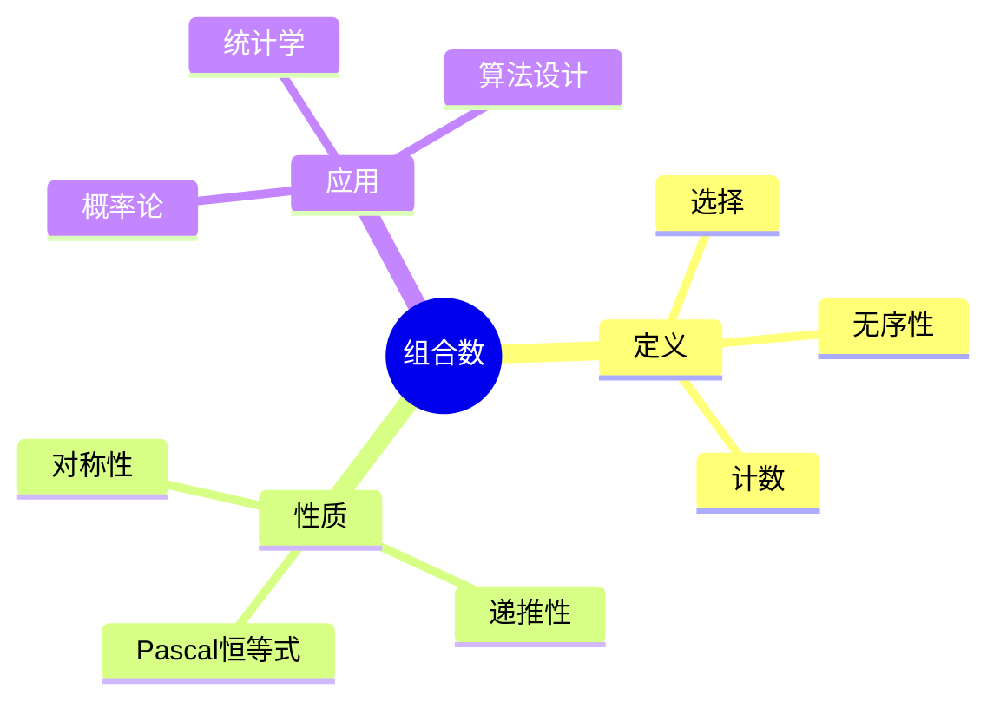
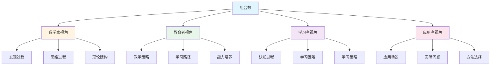
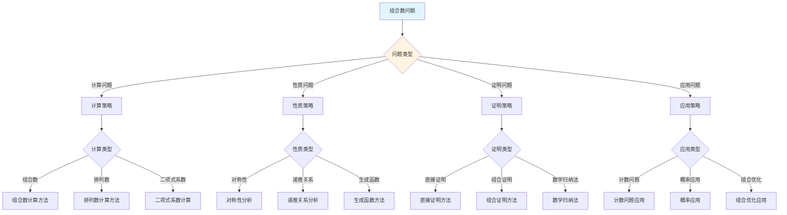
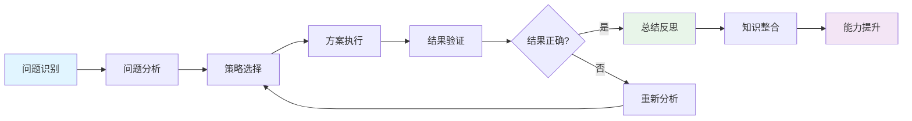
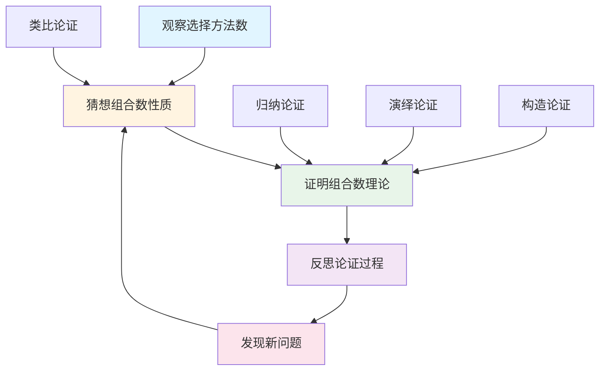
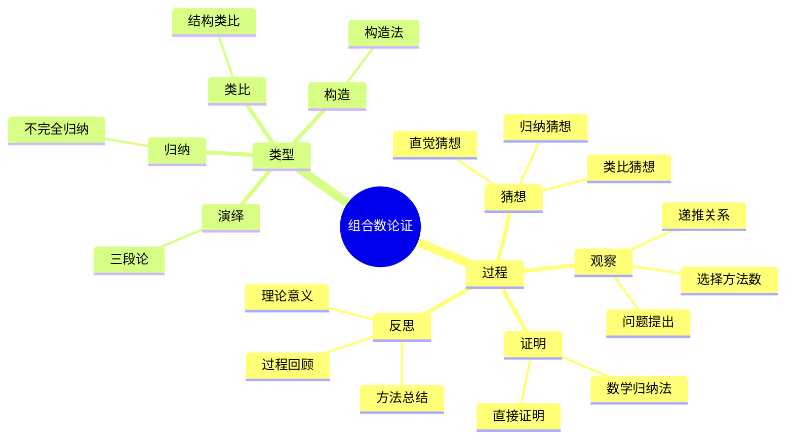
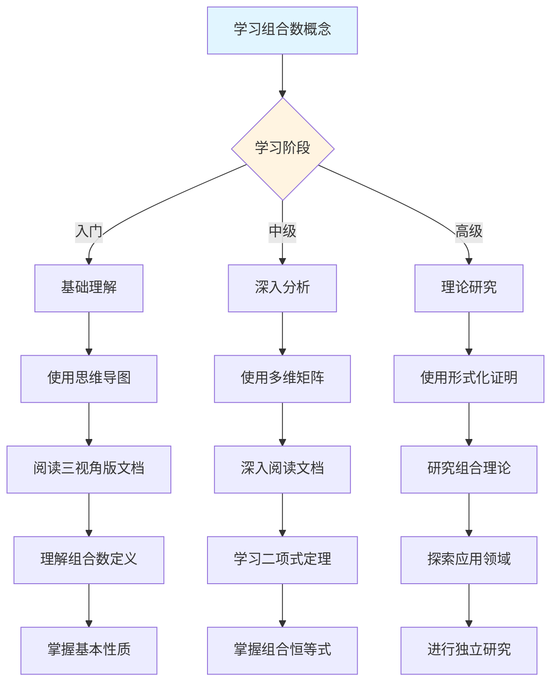
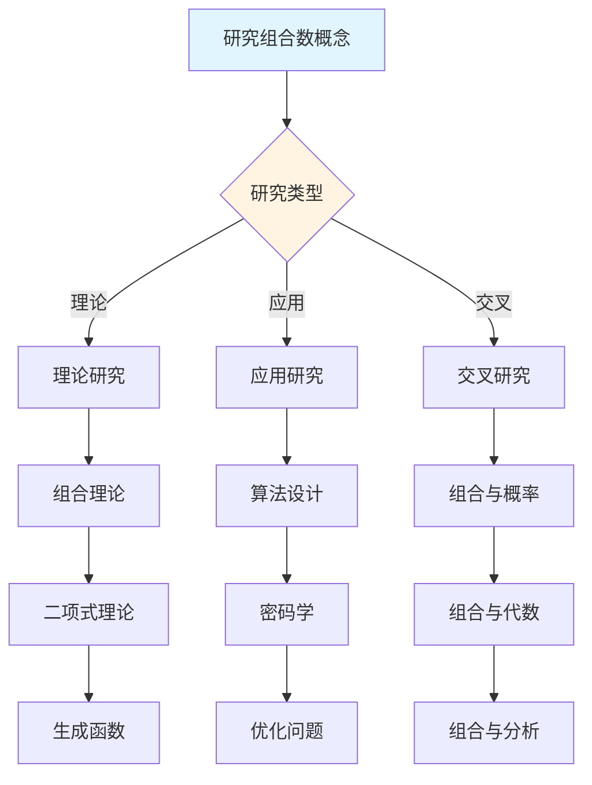
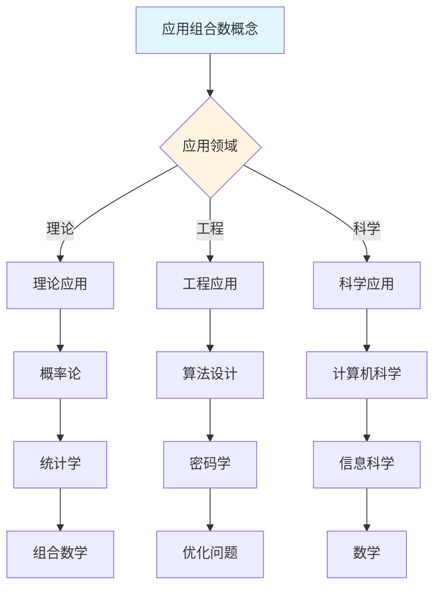
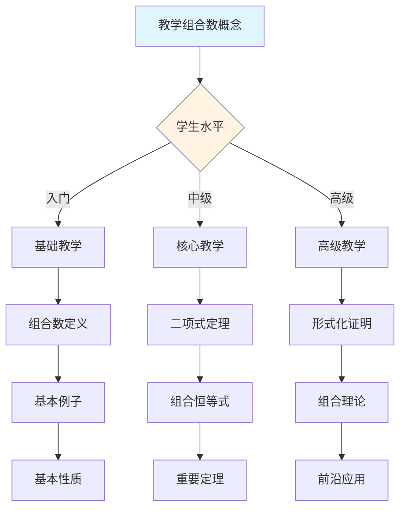

---
msc_primary: "00A99"
---

# 组合数 (Binomial Coefficient) - 三视角组织版

**概念编号**: C.CORE.030
**知识层次**: L0-L2
**知识领域**: D7 (离散数学)
**创建日期**: 2025年1月
**最后更新**: 2026-04-05

---

## 📋 目录 / Table of Contents

- [组合数 (Binomial Coefficient) - 三视角组织版](#组合数-binomial-coefficient---三视角组织版)
  - 📋 目录 / Table of Contents
  - 1. 📋 概述 (编号: C.CORE.030.01)
  - [🧠 认知学视角：如何理解组合数 (编号: C.CORE.030.02)](#认知学视角如何理解组合数-编号-ccore03002)
    - [认知起点 (编号: C.CORE.030.02.01)](#认知起点-编号-ccore0300201)
    - [认知过程 (编号: C.CORE.030.02.02)](#认知过程-编号-ccore0300202)
      - [阶段1：直观理解阶段 (编号: C.CORE.030.02.02.01)](#阶段1直观理解阶段-编号-ccore030020201)
      - [阶段2：概念形成阶段 (编号: C.CORE.030.02.02.02)](#阶段2概念形成阶段-编号-ccore030020202)
      - [阶段3：形式化阶段 (编号: C.CORE.030.02.02.03)](#阶段3形式化阶段-编号-ccore030020203)

## 形式化定义

**定义（二项式系数/组合数）**：对非负整数 $n \geq k$，**组合数**定义为：
$$\binom{n}{k} = C_n^k = \frac{n!}{k!(n-k)!}$$
表示从 $n$ 个元素中选取 $k$ 个的方式数

**推广**：对任意实数 $r$ 和非负整数 $k$：
$$\binom{r}{k} = \frac{r(r-1)\cdots(r-k+1)}{k!}$$

**符号说明**：
- $\binom{n}{k}$：二项式系数（标准记法）
- $C_n^k$ 或 $C(n, k)$：组合数
- $n!$：阶乘
- $P_n^k = \frac{n!}{(n-k)!}$：排列数

    - [认知障碍 (编号: C.CORE.030.02.03)](#认知障碍-编号-ccore0300203)
    - [认知工具 (编号: C.CORE.030.02.04)](#认知工具-编号-ccore0300204)
  - [🎓 教育学视角：如何教学组合数 (编号: C.CORE.030.03)](#教育学视角如何教学组合数-编号-ccore03003)
    - [教学目标 (编号: C.CORE.030.03.01)](#教学目标-编号-ccore0300301)
    - [教学路径 (编号: C.CORE.030.03.02)](#教学路径-编号-ccore0300302)
      - [阶段1：引入阶段（激发兴趣） (编号: C.CORE.030.03.02.01)](#阶段1引入阶段激发兴趣-编号-ccore030030201)
      - [阶段2：探索阶段（主动建构） (编号: C.CORE.030.03.02.02)](#阶段2探索阶段主动建构-编号-ccore030030202)
      - [阶段3：形式化阶段（抽象概括） (编号: C.CORE.030.03.02.03)](#阶段3形式化阶段抽象概括-编号-ccore030030203)
      - [阶段4：巩固阶段（应用深化） (编号: C.CORE.030.03.02.04)](#阶段4巩固阶段应用深化-编号-ccore030030204)
    - [教学难点 (编号: C.CORE.030.03.03)](#教学难点-编号-ccore0300303)
      - [难点1：组合数的计算](#难点1组合数的计算)
      - [难点2：组合数的性质](#难点2组合数的性质)
      - [难点3：组合数的应用](#难点3组合数的应用)
    - [教学策略 (编号: C.CORE.030.03.04)](#教学策略-编号-ccore0300304)
      - [策略1：从具体到抽象](#策略1从具体到抽象)
      - [策略2：多元表征](#策略2多元表征)
      - [策略3：问题驱动](#策略3问题驱动)
      - [策略4：可视化教学](#策略4可视化教学)
    - [评估方法 (编号: C.CORE.030.03.05)](#评估方法-编号-ccore0300305)
  - [🔬 数学家视角：如何思考组合数 (编号: C.CORE.030.04)](#数学家视角如何思考组合数-编号-ccore03004)
    - [问题起源 (编号: C.CORE.030.04.01)](#问题起源-编号-ccore0300401)
    - [思维过程 (编号: C.CORE.030.04.02)](#思维过程-编号-ccore0300402)
      - [步骤1：问题提出 (编号: C.CORE.030.04.02.01)](#步骤1问题提出-编号-ccore030040201)
      - [步骤2：概念形成 (编号: C.CORE.030.04.02.02)](#步骤2概念形成-编号-ccore030040202)
      - [步骤3：理论发展 (编号: C.CORE.030.04.02.03)](#步骤3理论发展-编号-ccore030040203)
    - [历史发展 (编号: C.CORE.030.04.03)](#历史发展-编号-ccore0300403)
    - [3.2 关键人物和贡献 (编号: C.CORE.030.04.04)](#32-关键人物和贡献-编号-ccore0300404)
    - [重要定理 (编号: C.CORE.030.04.05)](#重要定理-编号-ccore0300405)
    - [开放问题 (编号: C.CORE.030.04.06)](#开放问题-编号-ccore0300406)
    - [一、第一人称思维描述 (编号: C.CORE.030.04.07)](#一第一人称思维描述-编号-ccore0300407)
      - [1.1 Pascal的发现过程](#11-pascal的发现过程)
    - [二、数学直觉的形成 (编号: C.CORE.030.04.08)](#二数学直觉的形成-编号-ccore0300408)
      - [2.1 直觉在概念发现中的作用](#21-直觉在概念发现中的作用)
      - [2.2 如何培养组合数直觉](#22-如何培养组合数直觉)
    - [三、数学美的教育价值 (编号: C.CORE.030.04.09)](#三数学美的教育价值-编号-ccore0300409)
      - [3.1 组合数论的美在哪里](#31-组合数论的美在哪里)
      - [3.2 如何培养学生的数学美感](#32-如何培养学生的数学美感)
    - [四、问题解决策略 (编号: C.CORE.030.04.10)](#四问题解决策略-编号-ccore0300410)
      - [4.1 数学家的启发式方法](#41-数学家的启发式方法)
      - [4.2 思维过程分析](#42-思维过程分析)
    - [五、批判性反思 (编号: C.CORE.030.04.11)](#五批判性反思-编号-ccore0300411)
      - [5.1 组合数概念的局限性](#51-组合数概念的局限性)
      - [5.2 组合数理论的未解决问题](#52-组合数理论的未解决问题)
  - [💡 数学解释：为什么组合数是这样定义的 (编号: C.CORE.030.05)](#数学解释为什么组合数是这样定义的-编号-ccore03005)
    - [一、直观解释：组合数是什么？](#一直观解释组合数是什么)
      - [1.1 具体例子](#11-具体例子)
      - [1.2 形象类比](#12-形象类比)
      - [1.3 几何直观](#13-几何直观)
      - [1.4 操作体验](#14-操作体验)
    - [二、知性解释：组合数的本质是什么？](#二知性解释组合数的本质是什么)
      - [2.1 概念定义](#21-概念定义)
      - [2.2 分类体系](#22-分类体系)
      - [2.3 抽象结构](#23-抽象结构)
      - [2.4 知识体系](#24-知识体系)
    - [三、理性解释：组合数的公理化定义](#三理性解释组合数的公理化定义)
      - [3.1 公理体系](#31-公理体系)
      - [3.2 形式化证明](#32-形式化证明)
      - [3.3 系统建构](#33-系统建构)
    - [四、多视角解释：从不同角度理解组合数](#四多视角解释从不同角度理解组合数)
      - [4.1 数学家视角：组合数是如何被发现的？](#41-数学家视角组合数是如何被发现的)
      - [4.2 教育者视角：如何教学组合数？](#42-教育者视角如何教学组合数)
      - [4.3 学习者视角：如何学习组合数？](#43-学习者视角如何学习组合数)
      - [4.4 应用者视角：如何应用组合数？](#44-应用者视角如何应用组合数)
    - [五、思维表征：用多种方式理解组合数](#五思维表征用多种方式理解组合数)
      - [5.1 思维导图：组合数的知识结构](#51-思维导图组合数的知识结构)
      - [5.2 矩阵对比：不同解释方式的对比](#52-矩阵对比不同解释方式的对比)
      - [5.3 多视角表征：从不同角度表征组合数](#53-多视角表征从不同角度表征组合数)
      - [5.4 决策树：组合数问题分类和策略选择](#54-决策树组合数问题分类和策略选择)
      - [5.5 决策逻辑路径：组合数问题解决过程](#55-决策逻辑路径组合数问题解决过程)
      - [5.6 多维对比矩阵：组合数概念特征对比](#56-多维对比矩阵组合数概念特征对比)
  - [🔍 数学论证：如何论证组合数 (编号: C.CORE.030.06)](#数学论证如何论证组合数-编号-ccore03006)
    - [一、论证过程：从观察到反思](#一论证过程从观察到反思)
      - [1.1 观察（Observation）](#11-观察observation)
      - [1.2 猜想（Conjecture）](#12-猜想conjecture)
      - [1.3 证明（Proof）](#13-证明proof)
      - [1.4 反思（Reflection）](#14-反思reflection)
    - [二、论证类型：多种推理方式](#二论证类型多种推理方式)
      - [2.1 归纳论证（Inductive Reasoning）](#21-归纳论证inductive-reasoning)
      - [2.2 演绎论证（Deductive Reasoning）](#22-演绎论证deductive-reasoning)
      - [2.3 类比论证（Analogical Reasoning）](#23-类比论证analogical-reasoning)
      - [2.4 构造论证（Constructive Reasoning）](#24-构造论证constructive-reasoning)
    - [三、论证可视化：用图形表示论证过程](#三论证可视化用图形表示论证过程)
      - [3.1 论证流程图](#31-论证流程图)
      - [3.2 论证类型对比](#32-论证类型对比)
      - [3.3 论证思维导图](#33-论证思维导图)
  - [🔗 三视角整合 (编号: C.CORE.030.07)](#三视角整合-编号-ccore03007)
    - [三个视角的关联](#三个视角的关联)
    - [如何综合运用三个视角](#如何综合运用三个视角)
  - [📚 参考文献 (编号: C.CORE.030.08)](#参考文献-编号-ccore03008)
    - [权威资源](#权威资源)
    - [经典教材](#经典教材)
    - [研究论文](#研究论文)

---

## 1. 📋 概述 (编号: C.CORE.030.01)

组合数是组合数学的基础概念，表示从$n$个元素中选择$k$个元素的方法数。组合数在概率论、统计学、算法设计等领域有广泛应用。

本文档从**数学认知学**、**教育学**、**数学家**三个视角深入展开组合数概念，避免简单的概念堆垒。

**权威资源对齐**:

- Wikipedia: [Binomial Coefficient](https://en.wikipedia.org/wiki/Binomial_coefficient)
- Stanford课程: CS 109 (Probability for Computer Scientists)
- Princeton课程: COS 340 (Reasoning About Computation)
- MIT课程: 6.042J (Mathematics for Computer Science)
- Metamath: [Binomial Coefficient](http://us.metamath.org/mpeuni/df-bc.html)[需更新][需更新]

---

## 🧠 认知学视角：如何理解组合数 (编号: C.CORE.030.02)

### 认知起点 (编号: C.CORE.030.02.01)

**学习者已有的知识基础**:

- 排列的概念
- 阶乘的概念
- 日常经验中的"选择"、"组合"概念

**日常经验中的类似概念**:

- "选择"：从多个中选择
- "组合"：不考虑顺序的选择
- "方法数"：有多少种方法

### 认知过程 (编号: C.CORE.030.02.02)

#### 阶段1：直观理解阶段 (编号: C.CORE.030.02.02.01)

**具体例子**:

- 例子1：$\binom{5}{2} = 10$（从5个元素中选2个）
- 例子2：$\binom{n}{0} = 1$（不选任何元素）
- 例子3：$\binom{n}{n} = 1$（选所有元素）

**形象类比**:

- **选择类比**: 组合数就像"选择的方法数"
  - 从$n$个中选择$k$个
  - 不考虑顺序
  - 有多少种方法

- **排列类比**: 组合数就像"不考虑顺序的排列"
  - 排列考虑顺序
  - 组合不考虑顺序
  - 组合数 = 排列数 / $k!$

**可视化表示**:

```text
组合数:
    C(n,k) = n!/(k!(n-k)!)
    从n个中选择k个
    不考虑顺序
```

#### 阶段2：概念形成阶段 (编号: C.CORE.030.02.02.02)

**从例子中抽象出共同特征**:

- 所有例子都涉及"选择"
- 选择不考虑顺序
- 选择有方法数

**识别关键属性**:

1. **阶乘公式**: $\binom{n}{k} = \frac{n!}{k!(n-k)!}$
2. **对称性**: $\binom{n}{k} = \binom{n}{n-k}$
3. **递推关系**: $\binom{n}{k} = \binom{n-1}{k-1} + \binom{n-1}{k}$

**建立概念边界**:

- **什么是组合数**: 从$n$个元素中选择$k$个元素的方法数
- **什么不是组合数**:
  - 排列数（考虑顺序）
  - 其他计数方法

#### 阶段3：形式化阶段 (编号: C.CORE.030.02.02.03)

**严格定义**:

- 组合数定义：$\binom{n}{k} = \frac{n!}{k!(n-k)!}$
- 等价定义：$\binom{n}{k} = \frac{n(n-1)\cdots(n-k+1)}{k!}$

**公理化表述**:

- 条件1：$n, k \in \mathbb{N}$
- 条件2：$0 \leq k \leq n$

**逻辑结构**:

- 组合数是组合数学的基础
- 组合数可以计算选择方法数
- 组合数是概率论的基础

### 认知障碍 (编号: C.CORE.030.02.03)

**常见误解**:

1. **误解1**: 认为组合数就是排列数
   - **纠正**: 组合数不考虑顺序，排列数考虑顺序

2. **误解2**: 认为$\binom{n}{k} = \frac{n!}{k!}$
   - **纠正**: 组合数是$\binom{n}{k} = \frac{n!}{k!(n-k)!}$

3. **误解3**: 认为组合数总是整数
   - **纠正**: 组合数定义在非负整数上，总是整数

**理解难点**:

1. **难点1**: 组合数的计算
   - **原因**: 阶乘计算比较复杂
   - **解决方法**: 用具体例子，逐步掌握计算方法

2. **难点2**: 组合数的性质
   - **原因**: 组合数性质比较多
   - **解决方法**: 用具体例子，逐步掌握性质

3. **难点3**: 组合数的应用
   - **原因**: 组合数应用比较广泛
   - **解决方法**: 用具体例子，逐步掌握应用

**认知陷阱**:

- **排列**: 需要理解组合和排列的区别
- **计算**: 需要理解组合数的计算方法

### 认知工具 (编号: C.CORE.030.02.04)

**类比工具**:

- **选择类比**: 组合数 = 选择的方法数
- **排列类比**: 组合数 = 不考虑顺序的排列

**可视化工具**:

- **Pascal三角形**: 用Pascal三角形表示组合数
- **选择图**: 用选择图表示组合

**具体化工具**:

- **具体例子**: 用具体例子理解抽象概念
- **反例**: 用反例理解概念边界

---

## 🎓 教育学视角：如何教学组合数 (编号: C.CORE.030.03)

### 教学目标 (编号: C.CORE.030.03.01)

**知识目标**:

- 理解组合数的基本概念
- 掌握组合数的定义
- 理解组合数的性质
- 理解组合数的应用

**能力目标**:

- 能够计算组合数
- 能够理解组合数的性质
- 能够应用组合数解决实际问题
- 能够理解组合数的重要性

**情感目标**:

- 培养数学抽象思维
- 培养组合思维
- 激发对数学的兴趣

### 教学路径 (编号: C.CORE.030.03.02)

#### 阶段1：引入阶段（激发兴趣） (编号: C.CORE.030.03.02.01)

**实际问题**:

- 问题1：从5个人中选2个人有多少种方法？
- 问题2：如何计算概率？
- 问题3：如何设计算法？

**历史背景**:

- 组合数的历史发展
- 组合数在数学中的地位
- 组合数在概率论中的应用

**引发认知冲突**:

- 问题：如何统一计算各种选择方法数？
- 引出组合数的概念

#### 阶段2：探索阶段（主动建构） (编号: C.CORE.030.03.02.02)

**引导发现**:

1. 让学生自己列举"选择"的例子
2. 让学生观察这些例子的共同特征
3. 引导学生抽象出组合数的定义

**合作探究**:

- 小组讨论：什么是组合数？
- 小组讨论：组合数有哪些性质？
- 小组讨论：如何计算组合数？

**多元表征**:

- **语言表征**: "组合数是从$n$个元素中选择$k$个元素的方法数"
- **符号表征**: $\binom{n}{k}$
- **图形表征**: Pascal三角形、选择图
- **集合表征**: 组合数定义

#### 阶段3：形式化阶段（抽象概括） (编号: C.CORE.030.03.02.03)

**严格定义**:

- 组合数的定义
- 组合数的性质
- 组合数的计算

**性质证明**:

- 组合数的基本性质
- 对称性
- 递推关系

**应用拓展**:

- 组合数在概率论中的应用
- 组合数在统计学中的应用
- 组合数在算法设计中的应用

#### 阶段4：巩固阶段（应用深化） (编号: C.CORE.030.03.02.04)

**练习应用**:

- 基础练习：组合数的计算和性质
- 应用练习：用组合数解决实际问题
- 综合练习：组合数的综合应用

**变式训练**:

- 不同形式的组合数计算
- 不同难度的组合数问题
- 组合数的应用

**知识整合**:

- 组合数与其他概念的联系
- 组合数在数学体系中的地位

### 教学难点 (编号: C.CORE.030.03.03)

#### 难点1：组合数的计算

- **难点描述**: 学生难以计算组合数
- **解决方法**:
  - 用具体例子
  - 逐步掌握计算方法
  - 用练习巩固

#### 难点2：组合数的性质

- **难点描述**: 学生难以理解组合数的性质
- **解决方法**:
  - 用具体例子
  - 逐步掌握性质
  - 用图形可视化

#### 难点3：组合数的应用

- **难点描述**: 学生难以应用组合数
- **解决方法**:
  - 用具体例子
  - 逐步掌握应用
  - 用练习巩固

### 教学策略 (编号: C.CORE.030.03.04)

#### 策略1：从具体到抽象

- 先给出具体例子
- 再抽象出一般概念
- 最后给出严格定义

#### 策略2：多元表征

- 用语言、符号、图形等多种方式表示同一概念
- 帮助学生建立不同表征之间的联系

#### 策略3：问题驱动

- 从实际问题出发
- 引出数学概念
- 解决问题

#### 策略4：可视化教学

- 使用Pascal三角形
- 使用选择图
- 使用具体例子

### 评估方法 (编号: C.CORE.030.03.05)

**形成性评估**（评估理解过程）:

- 课堂提问：检查学生对概念的理解
- 小组讨论：观察学生的思考过程
- 练习作业：检查学生的应用能力

**总结性评估**（评估最终理解）:

- 测验：检查学生对概念和计算的掌握
- 项目：检查学生应用组合数解决实际问题的能力
- 反思：检查学生对组合数概念的理解深度

---

## 🔬 数学家视角：如何思考组合数 (编号: C.CORE.030.04)

### 问题起源 (编号: C.CORE.030.04.01)

**历史背景**:

- 古代：组合数的早期研究
- 17-18世纪：组合数的发展
- 19-20世纪：组合数的现代发展

**原始问题**:

- **问题1**: 从$n$个元素中选择$k$个有多少种方法？
- **问题2**: 如何计算选择方法数？
- **问题3**: 组合数有哪些性质？

**研究动机**:

- 统一组合数学理论
- 发展概率论
- 研究算法设计

### 思维过程 (编号: C.CORE.030.04.02)

#### 步骤1：问题提出 (编号: C.CORE.030.04.02.01)

**观察到的现象**:

- 需要计算选择方法数
- 需要研究组合问题
- 需要统一组合数学理论

**提出的猜想**:

- 可以引入组合数概念
- 组合数可以计算选择方法数
- 组合数有丰富的性质

**需要解决的问题**:

- 如何定义组合数？
- 组合数应该满足什么条件？
- 组合数有哪些性质？

#### 步骤2：概念形成 (编号: C.CORE.030.04.02.02)

**尝试性定义**:

- **阶乘定义**: 通过阶乘
- **递推定义**: 通过递推关系

**性质探索**:

- 组合数的基本性质
- 对称性
- 递推关系

**结构发现**:

- 组合数是组合数学的基础
- 组合数可以计算选择方法数
- 组合数是概率论的基础

#### 步骤3：理论发展 (编号: C.CORE.030.04.02.03)

**定理证明**:

- 组合数的基本性质
- 对称性
- 递推关系

**应用拓展**:

- 组合数在概率论中的应用
- 组合数在统计学中的应用
- 组合数在算法设计中的应用

**理论完善**:

- 组合数的严格定义
- 组合数的范畴论研究
- 组合数的应用研究

### 历史发展 (编号: C.CORE.030.04.03)

**早期阶段**（古代）:

- **Pascal (1654)**: 研究Pascal三角形
- **Newton (1665)**: 研究二项式定理

**关键突破**（17-18世纪）:

- **Leibniz (1676)**: 研究组合数学
- **Euler (1748)**: 研究组合数学

**现代发展**（19-20世纪）:

- **Cayley (1854)**: 研究组合数学
- **Rota (1964)**: 发展组合数学理论

### 3.2 关键人物和贡献 (编号: C.CORE.030.04.04)

**Blaise Pascal (1623-1662)**:

- 研究Pascal三角形
- 建立组合数学基础

**Isaac Newton (1643-1727)**:

- 研究二项式定理
- 建立组合数学基础

**Gian-Carlo Rota (1932-1999)**:

- 发展组合数学理论
- 建立现代组合数学

### 重要定理 (编号: C.CORE.030.04.05)

**二项式定理**:

- $(x+y)^n = \sum_{k=0}^n \binom{n}{k} x^k y^{n-k}$
- 意义：组合数的重要应用

**Pascal恒等式**:

- $\binom{n}{k} = \binom{n-1}{k-1} + \binom{n-1}{k}$
- 意义：组合数的递推关系

**组合恒等式**:

- 各种组合恒等式
- 意义：组合数的性质

### 开放问题 (编号: C.CORE.030.04.06)

**未解决问题**:

- 组合数的计算问题
- 组合数的应用问题
- 组合数的推广问题

**研究方向**:

- 组合数的范畴论研究
- 组合数的应用研究
- 组合数的计算研究

### 一、第一人称思维描述 (编号: C.CORE.030.04.07)

#### 1.1 Pascal的发现过程

**详细历史背景**:

- **1654年**：Pascal发表《算术三角形》（Traité du triangle arithmétique）
- **背景**：研究组合问题，发现需要计算从$n$个元素中选择$k$个的方法数
- **问题**：如何计算组合的方法数？组合数有什么性质？

**Pascal的详细第一人称描述**:
> "1654年，我在研究组合问题时，遇到了一个问题：如何计算从$n$个元素中选择$k$个的方法数？
>
> 我发现，从$n$个元素中选择$k$个的方法数是$\binom{n}{k} = \frac{n!}{k!(n-k)!}$。
>
> 我的方法是这样的：
>
> - **思路**：用组合数描述组合的方法数
> - **定义**：$\binom{n}{k} = \frac{n!}{k!(n-k)!}$表示从$n$个元素中选择$k$个的方法数
> - **例子**：$\binom{5}{2} = \frac{5!}{2!3!} = 10$（从5个元素中选择2个有10种方法）
>
> 例如，对于$\binom{5}{2}$：
>
> - **计算**：$\binom{5}{2} = \frac{5!}{2!3!} = \frac{120}{2 \times 6} = 10$
> - **意义**：从5个元素中选择2个有10种方法
> - **例子**：从$\{a,b,c,d,e\}$中选择2个：$\{a,b\}, \{a,c\}, \{a,d\}, \{a,e\}, \{b,c\}, \{b,d\}, \{b,e\}, \{c,d\}, \{c,e\}, \{d,e\}$（10种）
>
> 我还发现了Pascal三角形：
>
> - **构造**：$\binom{n}{k} = \binom{n-1}{k-1} + \binom{n-1}{k}$（Pascal恒等式）
> - **例子**：$\binom{5}{2} = \binom{4}{1} + \binom{4}{2} = 4 + 6 = 10$
> - **意义**：Pascal三角形是组合数的递推关系
>
> 我还发现了二项式定理：
>
> - **定理**：$(x+y)^n = \sum_{k=0}^n \binom{n}{k} x^k y^{n-k}$
> - **例子**：$(x+y)^3 = \binom{3}{0}x^3 + \binom{3}{1}x^2y + \binom{3}{2}xy^2 + \binom{3}{3}y^3 = x^3 + 3x^2y + 3xy^2 + y^3$
> - **意义**：二项式定理是组合数的重要应用
>
> 这让我意识到，组合数是计算组合方法数的工具，组合数有丰富的性质。这为组合数学提供了基础。"

**详细的思维过程**:

1. **观察到的现象**（1654年）:

   **现象1：需要计算组合的方法数**
   - **问题**：如何计算从$n$个元素中选择$k$个的方法数？
   - **例子**：从5个元素中选择2个有10种方法
   - **需要**：统一的概念

   **现象2：这种计算有特殊的规律**
   - **问题**：组合数有什么性质？
   - **例子**：Pascal恒等式$\binom{n}{k} = \binom{n-1}{k-1} + \binom{n-1}{k}$
   - **需要**：建立组合数理论

   **现象3：需要统一的概念**
   - **问题**：如何统一处理不同的组合问题？
   - **思路**：用组合数统一
   - **需要**：建立组合数理论

2. **提出的猜想**（1654年）:

   **猜想1：用组合数描述组合的方法数**
   - **思路**：定义$\binom{n}{k} = \frac{n!}{k!(n-k)!}$
   - **例子**：$\binom{5}{2} = 10$
   - **优点**：统一描述组合的方法数

   **猜想2：Pascal恒等式**
   - **恒等式**：$\binom{n}{k} = \binom{n-1}{k-1} + \binom{n-1}{k}$
   - **例子**：$\binom{5}{2} = \binom{4}{1} + \binom{4}{2}$
   - **意义**：Pascal恒等式是组合数的递推关系

   **猜想3：二项式定理**
   - **定理**：$(x+y)^n = \sum_{k=0}^n \binom{n}{k} x^k y^{n-k}$
   - **例子**：$(x+y)^3 = x^3 + 3x^2y + 3xy^2 + y^3$
   - **意义**：二项式定理是组合数的重要应用

3. **遇到的困难**（1654年）:

   **困难1：如何严格定义组合数？**
   - **问题**：如何定义组合数？
   - **解决**：定义$\binom{n}{k} = \frac{n!}{k!(n-k)!}$
   - **意义**：为组合数提供严格的数学基础

   **困难2：如何计算组合数？**
   - **问题**：如何计算$\binom{n}{k}$？
   - **解决**：使用阶乘公式、Pascal恒等式
   - **意义**：为组合数提供计算方法

   **困难3：如何应用组合数理论？**
   - **问题**：如何用组合数理论解决实际问题？
   - **解决**：建立二项式定理、组合恒等式
   - **意义**：为组合数提供应用基础

4. **突破的时刻**（1654年，Pascal）:

   **突破1：组合数的概念**
   - 引入组合数的概念描述组合的方法数
   - **关键**：$\binom{n}{k} = \frac{n!}{k!(n-k)!}$
   - **意义**：为组合数学提供基础

   **突破2：Pascal恒等式**
   - 发现Pascal恒等式
   - **关键**：$\binom{n}{k} = \binom{n-1}{k-1} + \binom{n-1}{k}$
   - **意义**：为组合数提供递推关系

   **突破3：二项式定理**
   - 证明二项式定理
   - **关键**：$(x+y)^n = \sum_{k=0}^n \binom{n}{k} x^k y^{n-k}$
   - **意义**：为组合数提供重要应用

### 二、数学直觉的形成 (编号: C.CORE.030.04.08)

#### 2.1 直觉在概念发现中的作用

**Pascal的直觉**:

- **直觉1**: "组合数"是"组合的方法数"——这个直觉引导Pascal发现组合数
- **直觉2**: 组合数可以统一处理组合问题——这个直觉引导Pascal建立组合数理论
- **直觉3**: 组合数是组合数学的基础——这个直觉引导Pascal建立组合数理论

**直觉的验证**:

- 通过严格的数学证明验证直觉的正确性
- 通过Pascal恒等式严格化组合数定义
- 通过应用验证组合数的广泛性

**直觉的深化**:

- 从"组合的方法数"到"组合数的严格定义"
- 从"统一处理组合问题"到"组合数的广泛应用"
- 从"组合数学基础"到"组合数的深入发展"

#### 2.2 如何培养组合数直觉

**数学家的建议**:

- **Pascal**: "组合数直觉是长期训练的结果。通过大量练习和深入思考，我们可以培养对组合数的直觉。"
- **Newton**: "从具体例子开始，逐步抽象，这是培养组合数直觉的有效方法。"

**培养方法**:

1. **大量练习**: 通过大量组合数计算练习，培养对组合数的直觉
2. **深入思考**: 深入思考组合数的本质，理解组合数的深层结构
3. **类比和联想**: 通过类比和联想，建立组合数与其他概念的联系
4. **与专家交流**: 与数学家交流，学习他们的思维方式

**教学启示**:

- 从具体例子开始，逐步抽象
- 鼓励学生思考组合数的本质
- 引导学生建立组合数与其他概念的联系

### 三、数学美的教育价值 (编号: C.CORE.030.04.09)

#### 3.1 组合数论的美在哪里

**结构美**:

- **简洁性**: 组合数的概念非常简洁——"从$n$个元素中选择$k$个的方法数"
- **统一性**: 组合数可以统一描述数学中的各种组合问题
- **和谐性**: 组合数满足优美的规律（Pascal恒等式、二项式定理等）

**数学家的评价**:

- **Pascal**: "组合数论的美在于它的统一性。它为我们提供了一个统一的框架来理解组合问题。"
- **Newton**: "组合数论的美在于它的基础性。它是组合数学的基础，所有组合问题都可以用组合数来描述。"

#### 3.2 如何培养学生的数学美感

**数学家的建议**:

- **Pascal**: "展示组合数论的美感，让学生感受到数学的美。"
- **Newton**: "通过组合数论的历史和发展，让学生理解数学的美。"

**教学方法**:

1. **展示数学美**:
   - 展示组合数概念的简洁性和统一性
   - 展示组合数的优美规律
   - 展示组合数在数学中的基础地位

2. **引导学生欣赏**:
   - 引导学生欣赏组合数概念的简洁性
   - 引导学生欣赏组合数的和谐性
   - 引导学生欣赏组合数的基础性

3. **鼓励学生创造美**:
   - 鼓励学生发现组合数论的美
   - 鼓励学生创造优美的组合数证明
   - 鼓励学生探索组合数论的美

### 四、问题解决策略 (编号: C.CORE.030.04.10)

#### 4.1 数学家的启发式方法

**策略1：从具体到抽象**:

- 从具体的组合数例子开始
- 抽象出组合数的一般性质
- 建立组合数的理论体系

**策略2：从简单到复杂**:

- 先理解基本组合数
- 再理解组合数运算
- 最后理解组合数理论

**策略3：从问题到理论**:

- 从实际问题出发
- 引出组合数概念
- 建立组合数理论

#### 4.2 思维过程分析

**问题识别**:

- 识别问题类型：组合数定义问题、组合数计算问题、组合数应用问题
- 识别问题难度：简单问题、中等问题、复杂问题

**策略选择**:

- 简单问题：直接方法
- 中等问题：分步方法
- 复杂问题：分解方法

**执行和反思**:

- 执行策略，解决问题
- 反思过程，总结经验
- 改进方法，提高效率

### 五、批判性反思 (编号: C.CORE.030.04.11)

#### 5.1 组合数概念的局限性

**概念的边界**:

- 组合数只描述组合的方法数，不能描述所有数学结构
- 组合数是抽象的，需要具体化才能应用
- 组合数不能表示所有数学量

**概念的推广**:

- 广义组合数：更一般的组合数
- 多组合数：多个集合的组合数
- 范畴组合数：范畴论中的组合数

#### 5.2 组合数理论的未解决问题

**未解决的问题**:

- 组合数的计算问题：如何计算复杂组合数？
- 组合数的应用问题：如何更好地应用组合数？
- 组合数的推广问题：如何推广组合数概念？

**研究方向**:

- 组合数的范畴论研究
- 组合数的应用研究
- 组合数的计算研究

---

## 💡 数学解释：为什么组合数是这样定义的 (编号: C.CORE.030.05)

### 一、直观解释：组合数是什么？

#### 1.1 具体例子

**生活中的例子**：

- **选择问题**：从$n$个人中选择$k$个人组成团队
  - 例如：从5个人中选择3个人，有$\binom{5}{3} = 10$种方法
  - **为什么这样定义**：因为我们需要一个概念来表示"选择的方法数"
- **排列问题**：组合数与排列数的区别
  - 例如：排列考虑顺序，组合不考虑顺序
  - **为什么这样定义**：因为我们需要区分"有顺序"和"无顺序"的选择
- **概率计算**：组合数用于计算概率
  - 例如：从52张牌中抽取5张牌的方法数
  - **为什么这样定义**：因为我们需要一个概念来表示"概率计算的基础"

**数学中的例子**：

- **二项式系数**：$\binom{n}{k} = \frac{n!}{k!(n-k)!}$
  - **为什么这样定义**：我们需要一个简单的方式来表示"从$n$个元素中选择$k$个的方法数"
- **Pascal三角形**：组合数可以排列成三角形
  - **为什么这样定义**：我们需要一个概念来表示"组合数的递推关系"
- **二项式定理**：$(x+y)^n = \sum_{k=0}^n \binom{n}{k} x^k y^{n-k}$
  - **为什么这样定义**：我们需要一个概念来表示"二项式展开的系数"

#### 1.2 形象类比

**选择类比**：

- **组合数就像"选择的方法数"**
  - 从一堆物品中选择一些物品
  - 不考虑选择的顺序
- **为什么这样类比**：这个类比帮助我们理解组合数的"选择"性质

**计数类比**：

- **组合数就像"计数工具"**
  - 计算有多少种方法
  - 不考虑顺序
- **为什么这样类比**：这个类比帮助我们理解组合数的"计数"性质

#### 1.3 几何直观

**Pascal三角形表示**：

- 使用Pascal三角形表示组合数
- 例如：$\binom{n}{k}$在Pascal三角形的第$n$行第$k$列
- **为什么使用Pascal三角形**：Pascal三角形提供几何直观，帮助我们理解组合数的递推关系

**组合数图形表示**：

- 使用图形表示组合数
- 例如：用点表示元素，用线表示选择
- **为什么使用图形**：图形提供几何直观，帮助我们理解组合数的含义

#### 1.4 操作体验

**组合数计算的操作**：

- **直接计算**：$\binom{n}{k} = \frac{n!}{k!(n-k)!}$
  - **为什么这样操作**：因为我们需要一个运算来计算"组合数"
- **递推计算**：$\binom{n}{k} = \binom{n-1}{k-1} + \binom{n-1}{k}$（Pascal恒等式）
  - **为什么这样操作**：因为我们需要一个工具来计算复杂组合数
- **组合数运算规则**：$\binom{n}{k} = \binom{n}{n-k}$（对称性）
  - **为什么这样操作**：因为我们需要一个工具来简化计算

### 二、知性解释：组合数的本质是什么？

#### 2.1 概念定义

**组合数的内涵**：

- **组合数是从$n$个元素中选择$k$个元素的方法数，不考虑顺序**
  - **选择**：从$n$个元素中选择$k$个
  - **无序性**：不考虑选择的顺序
  - **计数**：$\binom{n}{k} = \frac{n!}{k!(n-k)!}$
- **为什么这样定义**：这些特征使得组合数成为一个完整的组合数学工具，支持所有选择研究

**组合数的外延**：

- **二项式系数**：$\binom{n}{k}$是$(x+y)^n$展开式中$x^k y^{n-k}$的系数
- **Pascal三角形**：组合数可以排列成三角形
- **为什么这样分类**：不同的组合数类型有不同的性质和用途

#### 2.2 分类体系

**按大小分类**：

- **小组合数**：$\binom{5}{2} = 10$
- **大组合数**：$\binom{100}{50}$（非常大的数）
- **为什么这样分类**：大小是组合数的基本特征

**按性质分类**：

- **对称性**：$\binom{n}{k} = \binom{n}{n-k}$
- **递推性**：$\binom{n}{k} = \binom{n-1}{k-1} + \binom{n-1}{k}$
- **为什么这样分类**：性质是组合数的重要特征

#### 2.3 抽象结构

**组合数的运算结构**：

- **组合数的加法**：$\binom{n}{k} + \binom{n}{k+1} = \binom{n+1}{k+1}$
- **组合数的乘法**：$\binom{n}{k} \binom{k}{r} = \binom{n}{r} \binom{n-r}{k-r}$
- **为什么有这些运算**：这些运算使得组合数具有代数结构

**组合数的关系结构**：

- **对称关系**：$\binom{n}{k} = \binom{n}{n-k}$
- **递推关系**：$\binom{n}{k} = \binom{n-1}{k-1} + \binom{n-1}{k}$
- **为什么有这个关系**：这个关系帮助我们研究组合数的性质

#### 2.4 知识体系

**组合数在数学体系中的位置**：

- **基础地位**：组合数是组合数学的基础
  - 组合数是选择问题的基础
  - 组合数是概率论的基础
- **为什么是基础**：组合数提供了统一的框架来研究选择问题

**组合数与其他概念的关系**：

- **组合数与排列数**：排列数考虑顺序，组合数不考虑顺序
- **组合数与二项式定理**：组合数是二项式展开的系数
- **组合数与概率**：组合数用于计算概率
- **为什么有这些关系**：这些关系揭示了组合数与其他数学概念的内在联系

### 三、理性解释：组合数的公理化定义

#### 3.1 公理体系

**组合数的定义**：

- **定义**：$\binom{n}{k} = \frac{n!}{k!(n-k)!}$，其中$n! = n \times (n-1) \times \cdots \times 1$
- **为什么需要这个定义**：这个定义提供了组合数的严格数学基础

**组合数的公理**：

- **阶乘公理**：$n! = n \times (n-1)!$，$0! = 1$
- **组合数公理**：$\binom{n}{k} = \frac{n!}{k!(n-k)!}$
- **为什么这样定义**：这些公理将组合数放在更一般的框架中

#### 3.2 形式化证明

**组合数性质的证明**：

##### 定理1：组合数的对称性

**定理陈述**：对于非负整数$n, k$满足$0 \leq k \leq n$，有$\binom{n}{k} = \binom{n}{n-k}$。

**形式化表述**：
$$\forall n, k \in \mathbb{N}, 0 \leq k \leq n, \quad \binom{n}{k} = \binom{n}{n-k}$$

**证明**（组合论证）：
1. **定义**：$\binom{n}{k}$是从$n$个元素中选择$k$个的方法数
2. **对应关系**：选择$k$个元素等价于选择$n-k$个元素不选
3. **双射**：从$k$元子集到$(n-k)$元补集存在双射
4. **结论**：$\binom{n}{k} = \binom{n}{n-k}$

**代数证明**：
$$\binom{n}{k} = \frac{n!}{k!(n-k)!} = \frac{n!}{(n-k)!(n-(n-k))!} = \binom{n}{n-k}$$

**为什么这样证明**：利用组合数的组合意义（选择与不选择的对称性）和阶乘的性质。

---

##### 定理2：Pascal恒等式

**定理陈述**：对于正整数$n, k$满足$1 \leq k \leq n-1$，有$\binom{n}{k} = \binom{n-1}{k-1} + \binom{n-1}{k}$。

**形式化表述**：
$$\forall n, k \in \mathbb{N}, 1 \leq k \leq n-1, \quad \binom{n}{k} = \binom{n-1}{k-1} + \binom{n-1}{k}$$

**证明**（组合论证）：
1. **问题**：从$n$个元素中选择$k$个的方法数
2. **分类**：固定一个元素，分为两类：
   - **包含该元素**：从剩余$n-1$个元素中选择$k-1$个，有$\binom{n-1}{k-1}$种方法
   - **不包含该元素**：从剩余$n-1$个元素中选择$k$个，有$\binom{n-1}{k}$种方法
3. **结论**：$\binom{n}{k} = \binom{n-1}{k-1} + \binom{n-1}{k}$

**代数证明**：
$$\binom{n-1}{k-1} + \binom{n-1}{k} = \frac{(n-1)!}{(k-1)!(n-k)!} + \frac{(n-1)!}{k!(n-k-1)!}$$
$$= \frac{(n-1)!}{k!(n-k)!}(k + (n-k)) = \frac{(n-1)! \cdot n}{k!(n-k)!} = \binom{n}{k}$$

**为什么这样证明**：利用组合数的组合意义（分类计数）和代数恒等式。

---

##### 定理3：二项式定理

**定理陈述**：对于任意实数$x, y$和非负整数$n$，有$(x+y)^n = \sum_{k=0}^{n} \binom{n}{k} x^k y^{n-k}$。

**形式化表述**：
$$\forall x, y \in \mathbb{R}, \forall n \in \mathbb{N}, \quad (x+y)^n = \sum_{k=0}^{n} \binom{n}{k} x^k y^{n-k}$$

**证明**（数学归纳法）：
1. **基础情况**：$n=0$时，$(x+y)^0 = 1 = \binom{0}{0} x^0 y^0$
2. **归纳假设**：假设对$n$成立：$(x+y)^n = \sum_{k=0}^{n} \binom{n}{k} x^k y^{n-k}$
3. **归纳步骤**：
   $$(x+y)^{n+1} = (x+y)(x+y)^n = (x+y)\sum_{k=0}^{n} \binom{n}{k} x^k y^{n-k}$$
   $$= \sum_{k=0}^{n} \binom{n}{k} x^{k+1} y^{n-k} + \sum_{k=0}^{n} \binom{n}{k} x^k y^{n-k+1}$$
   $$= \sum_{k=1}^{n+1} \binom{n}{k-1} x^k y^{n-k+1} + \sum_{k=0}^{n} \binom{n}{k} x^k y^{n-k+1}$$
   $$= \sum_{k=0}^{n+1} \left(\binom{n}{k-1} + \binom{n}{k}\right) x^k y^{n-k+1} = \sum_{k=0}^{n+1} \binom{n+1}{k} x^k y^{n-k+1}$$
   （其中$\binom{n}{-1} = \binom{n}{n+1} = 0$）
4. **结论**：对所有$n$，公式成立

**为什么这样证明**：利用数学归纳法和Pascal恒等式。

#### 3.3 系统建构

**组合数论在数学基础中的地位**：

- **作为组合数学基础**：组合数是组合数学的基础
- **提供计数工具**：组合数提供了计数选择的方法数
- **统一框架**：组合数统一了各种选择研究

**组合数论的发展历史**：

- **Pascal的三角形**（1654年）：研究Pascal三角形
- **Newton的二项式定理**（1665年）：研究二项式定理
- **为什么这样发展**：数学的发展需要严格的基础，组合数论的发展反映了这一需求

### 四、多视角解释：从不同角度理解组合数

#### 4.1 数学家视角：组合数是如何被发现的？

**Pascal的发现过程**：

- **问题提出**：如何计算选择的方法数？
- **关键洞察**：使用Pascal三角形，发现组合数的递推关系
- **重要发现**：组合数可以用于计算选择的方法数
- **为什么这样发现**：数学家的直觉和严格证明相结合

#### 4.2 教育者视角：如何教学组合数？

**教学策略**：

- **从具体到抽象**：先学习具体例子（选择问题），再学习抽象定义
- **从简单到复杂**：先学习小组合数，再学习大组合数
- **从直观到形式化**：先使用Pascal三角形等直观工具，再学习严格定义
- **为什么这样教学**：符合认知规律，帮助学生逐步建立理解

#### 4.3 学习者视角：如何学习组合数？

**认知过程**：

- **直观阶段**：通过具体例子理解组合数的含义
- **概念阶段**：理解组合数的定义和性质
- **形式化阶段**：理解严格定义和证明
- **为什么这样学习**：符合认知发展规律

#### 4.4 应用者视角：如何应用组合数？

**应用场景**：

- **概率论**：使用组合数计算概率
- **统计学**：使用组合数进行统计分析
- **算法设计**：使用组合数进行算法设计
- **为什么这样应用**：组合数提供了强大的工具来处理各种问题

### 五、思维表征：用多种方式理解组合数

#### 5.1 思维导图：组合数的知识结构


```mermaid
mindmap
  root((组合数))
    定义
      选择
      无序性
      计数
    性质
      对称性
      递推性
      Pascal恒等式
    应用
      概率论
      统计学
      算法设计
```

#### 5.2 矩阵对比：不同解释方式的对比

| 解释方式 | 特点 | 方法 | 工具 | 适用阶段 | 优势 | 局限 |
|---------|------|------|------|---------|------|------|
| **直观解释** | 具体、形象、可视 | 例子、类比、直观 | Pascal三角形、图形 | 入门阶段 | 易于理解 | 不够严格 |
| **知性解释** | 概念、分类、抽象 | 定义、分类、结构 | 概念图、知识图谱 | 中级阶段 | 系统完整 | 不够直观 |
| **理性解释** | 公理、证明、形式化 | 公理、证明、系统 | 形式化工具、证明系统 | 高级阶段 | 严格准确 | 不够具体 |
| **多视角解释** | 多角度、整合 | 多视角、整合 | 多视角工具 | 所有阶段 | 全面深入 | 可能复杂 |

#### 5.3 多视角表征：从不同角度表征组合数


```mermaid
graph TD
    A[组合数] --> B[数学家视角]
    A --> C[教育者视角]
    A --> D[学习者视角]
    A --> E[应用者视角]

    B --> B1[发现过程]
    B --> B2[思维过程]
    B --> B3[理论建构]

    C --> C1[教学策略]
    C --> C2[学习路径]
    C --> C3[能力培养]

    D --> D1[认知过程]
    D --> D2[学习困难]
    D --> D3[学习策略]

    E --> E1[应用场景]
    E --> E2[实际问题]
    E --> E3[方法选择]

    style A fill:#e1f5ff
    style B fill:#fff4e1
    style C fill:#e8f5e9
    style D fill:#f3e5f5
    style E fill:#fce4ec
```

#### 5.4 决策树：组合数问题分类和策略选择


```mermaid
graph TD
    A[组合数问题] --> B{问题类型}
    B -->|计算问题| C[计算策略]
    B -->|性质问题| D[性质策略]
    B -->|证明问题| E[证明策略]
    B -->|应用问题| F[应用策略]

    C --> C1{计算类型}
    C1 -->|组合数| C2[组合数计算方法]
    C1 -->|排列数| C3[排列数计算方法]
    C1 -->|二项式系数| C4[二项式系数计算]

    D --> D1{性质类型}
    D1 -->|对称性| D2[对称性分析]
    D1 -->|递推关系| D3[递推关系分析]
    D1 -->|生成函数| D4[生成函数方法]

    E --> E1{证明类型}
    E1 -->|直接证明| E2[直接证明方法]
    E1 -->|组合证明| E3[组合证明方法]
    E1 -->|数学归纳法| E4[数学归纳法]

    F --> F1{应用类型}
    F1 -->|计数问题| F2[计数问题应用]
    F1 -->|概率应用| F3[概率应用]
    F1 -->|组合优化| F4[组合优化应用]

    style A fill:#e1f5ff
    style B fill:#fff4e1
```

**说明**：

- **问题分类**：根据问题类型（计算、性质、证明、应用）进行分类
- **策略选择**：根据问题类型选择相应的解决策略
- **方法应用**：根据具体问题选择合适的方法

#### 5.5 决策逻辑路径：组合数问题解决过程


```mermaid
graph LR
    A[问题识别] --> B[问题分析]
    B --> C[策略选择]
    C --> D[方案执行]
    D --> E[结果验证]
    E --> F{结果正确?}
    F -->|是| G[总结反思]
    F -->|否| H[重新分析]
    H --> C

    G --> I[知识整合]
    I --> J[能力提升]

    style A fill:#e1f5ff
    style G fill:#e8f5e9
    style J fill:#f3e5f5
```

**说明**：

- **问题识别**：识别组合数问题的类型和关键要素
- **问题分析**：分析问题的条件和目标
- **策略选择**：根据问题类型选择解决策略
- **方案执行**：执行选定的解决方案
- **结果验证**：验证结果的正确性
- **总结反思**：总结解题过程，反思解题方法
- **知识整合**：整合相关知识点
- **能力提升**：提升问题解决能力

#### 5.6 多维对比矩阵：组合数概念特征对比

| 对比维度 | 组合数定义 | 组合数计算 | 组合数性质 | 组合数应用 |
|---------|---------|---------|---------|---------|
| **核心特征** | 组合、排列、二项式系数 | 组合数、排列数、二项式系数 | 对称性、递推关系、生成函数 | 计数、概率、组合优化 |
| **理解难度** | ⭐⭐⭐ | ⭐⭐⭐ | ⭐⭐⭐⭐ | ⭐⭐⭐⭐ |
| **应用频率** | ⭐⭐⭐⭐⭐ | ⭐⭐⭐⭐⭐ | ⭐⭐⭐⭐ | ⭐⭐⭐⭐⭐ |
| **理论基础** | 组合数定义 | 组合数计算理论 | 组合数性质理论 | 组合数应用理论 |
| **教学重点** | 概念理解 | 计算方法 | 性质分析 | 应用能力 |
| **学习阶段** | 中级阶段 | 中级阶段 | 中级-高级 | 中级-高级 |
| **认知维度** | 知性+理性 | 理性 | 理性 | 理性+应用 |
| **思维表征** | 思维导图 | 决策树 | 决策逻辑路径 | 知识图谱 |

**说明**：

- **核心特征**：每个方面的核心特征
- **理解难度**：从1星到5星，表示理解难度
- **应用频率**：从1星到5星，表示应用频率
- **理论基础**：每个方面的理论基础
- **教学重点**：每个方面的教学重点
- **学习阶段**：每个方面的学习阶段
- **认知维度**：每个方面的认知维度
- **思维表征**：每个方面推荐的思维表征方法

---

## 🔍 数学论证：如何论证组合数 (编号: C.CORE.030.06)

### 一、论证过程：从观察到反思

#### 1.1 观察（Observation）

**具体现象观察**：

- **现象1**：从$n$个元素中选择$k$个的方法数
  - 例如：从$\{1,2,3\}$中选择2个有3种方法：$\{1,2\}$，$\{1,3\}$，$\{2,3\}$
  - **为什么重要**：这个现象揭示了组合数的本质
- **现象2**：组合数的递推关系
  - 例如：$\binom{n}{k} = \binom{n-1}{k-1} + \binom{n-1}{k}$（Pascal三角形）
  - **为什么重要**：这个现象揭示了组合数的结构性质

**模式识别**：

- **模式1**：组合数的公式
  - 例如：$\binom{n}{k} = \frac{n!}{k!(n-k)!}$
  - **为什么重要**：这个模式可能反映了组合数的本质
- **模式2**：二项式定理
  - 例如：$(x+y)^n = \sum_{k=0}^n \binom{n}{k} x^k y^{n-k}$
  - **为什么重要**：这个模式可能反映了组合数的代数结构

**问题提出**：

- **问题1**：如何严格定义组合数，统一不同的计数方法？
  - **为什么提出**：这个问题可能揭示组合数的本质和基础
- **问题2**：如何证明二项式定理？
  - **为什么提出**：这个问题可能揭示组合数的代数性质

#### 1.2 猜想（Conjecture）

**归纳猜想**：

- **猜想1**：组合数是研究计数的统一工具
  - **依据**：观察不同计数问题都依赖于组合数
  - **为什么提出**：这个猜想可能揭示组合数的统一性
- **猜想2**：二项式定理
  - **依据**：观察具体二项式展开
  - **为什么提出**：这个猜想可能揭示组合数的代数性质

**类比猜想**：

- **猜想1**：组合数类似于"选择数"
  - **类比对象**：选择数
  - **为什么提出**：这个类比可能揭示组合数的本质
- **猜想2**：Pascal三角形类似于"杨辉三角"
  - **类比对象**：杨辉三角
  - **为什么提出**：这个类比可能揭示Pascal三角形的作用

**直觉猜想**：

- **猜想1**：组合数是"最自然"的计数概念
  - **直觉来源**：组合数的直观
  - **为什么提出**：这个直觉可能揭示组合数的基础地位
- **猜想2**：组合数有"最小"的公理结构
  - **直觉来源**：组合数的公理结构
  - **为什么提出**：这个直觉可能揭示组合数的本质

#### 1.3 证明（Proof）

**直接证明**：

- **证明1**：二项式定理
  - **证明思路**：使用数学归纳法和组合数的定义
  - **关键步骤**：证明$(x+y)^n = \sum_{k=0}^n \binom{n}{k} x^k y^{n-k}$
  - **为什么这样证明**：这个证明方法直接、清晰
- **证明2**：组合数的递推关系
  - **证明思路**：使用组合数的定义
  - **关键步骤**：证明$\binom{n}{k} = \binom{n-1}{k-1} + \binom{n-1}{k}$
  - **为什么这样证明**：这个证明方法直接、清晰

**数学归纳法**：

- **数学归纳法**：证明二项式定理
  - **基础步骤**：$n=0$时，$(x+y)^0 = 1 = \sum_{k=0}^0 \binom{0}{k} x^k y^{0-k}$
  - **归纳步骤**：假设对$n$成立，证明对$n+1$成立
  - **为什么这样证明**：数学归纳法适合证明关于自然数的命题

#### 1.4 反思（Reflection）

**过程回顾**：

- **论证回顾**：从观察从$n$个元素中选择$k$个的方法数，到猜想组合数的性质，再到严格证明
  - **成功之处**：成功建立了组合数的严格理论
  - **不足之处**：组合数概念需要进一步推广
  - **改进方向**：推广到多组合数、$q$-组合数等

**方法总结**：

- **证明方法**：使用了直接证明、数学归纳法
  - **方法特点**：直接证明清晰，数学归纳法严格
  - **适用范围**：不同方法适用于不同类型的命题
- **证明技巧**：使用组合数的定义、数学归纳法、递推关系
  - **技巧要点**：将组合数问题转化为计数问题，使用数学归纳法处理自然数问题
  - **应用场景**：这些技巧可以应用于其他组合问题

**理论意义**：

- **理论贡献**：建立了组合数的严格理论，揭示了组合数的组合结构
  - **为什么重要**：这个论证揭示了组合数学的基础结构
- **应用价值**：组合数为组合数学、概率论、统计学提供了基础
  - **为什么重要**：这个论证可以应用于所有计数问题

### 二、论证类型：多种推理方式

#### 2.1 归纳论证（Inductive Reasoning）

**不完全归纳**：

- **例子1**：从具体组合数的性质归纳一般规律
  - **观察**：观察$\binom{3}{2} = 3$，$\binom{4}{2} = 6$的规律
  - **结论**：组合数满足递推关系
  - **局限性**：不完全归纳的结论需要严格证明

#### 2.2 演绎论证（Deductive Reasoning）

**三段论**：

- **例子1**：证明组合数的性质
  - **大前提**：所有组合数都满足递推关系
  - **小前提**：$\binom{5}{2}$是组合数
  - **结论**：$\binom{5}{2} = \binom{4}{1} + \binom{4}{2} = 4 + 6 = 10$
  - **为什么有效**：三段论是严格的演绎推理

#### 2.3 类比论证（Analogical Reasoning）

**结构类比**：

- **例子1**：组合数与排列数的类比
  - **类比对象**：排列数
  - **相似性**：组合数不考虑顺序，排列数考虑顺序
  - **结论**：组合数可以理解为"无序排列数"
  - **局限性**：类比不能替代严格证明

#### 2.4 构造论证（Constructive Reasoning）

**构造法**：

- **例子1**：构造组合数的递推关系
  - **构造方法**：将选择分为包含某个元素和不包含某个元素两种情况
  - **验证**：验证构造的递推关系正确
  - **为什么有效**：构造法是严格的直接证明

### 三、论证可视化：用图形表示论证过程

#### 3.1 论证流程图


```mermaid
graph TD
    A[观察选择方法数] --> B[猜想组合数性质]
    B --> C[证明组合数理论]
    C --> D[反思论证过程]
    D --> E[发现新问题]
    E --> B

    F[归纳论证] --> C
    G[演绎论证] --> C
    H[类比论证] --> B
    I[构造论证] --> C

    style A fill:#e1f5ff
    style B fill:#fff4e1
    style C fill:#e8f5e9
    style D fill:#f3e5f5
    style E fill:#fce4ec
```

#### 3.2 论证类型对比

| 论证类型 | 特点 | 适用场景 | 优势 | 局限 |
|---------|------|---------|------|------|
| **归纳论证** | 从特殊到一般 | 发现规律、提出猜想 | 启发性强 | 结论或然 |
| **演绎论证** | 从一般到特殊 | 严格证明、逻辑推理 | 结论必然 | 需要前提 |
| **类比论证** | 基于相似性 | 启发思路、发现联系 | 创造性高 | 结论或然 |
| **构造论证** | 直接构造 | 证明存在性命题 | 直接明确 | 需要构造 |

#### 3.3 论证思维导图


```mermaid
mindmap
  root((组合数论证))
    过程
      观察
        选择方法数
        递推关系
        问题提出
      猜想
        归纳猜想
        类比猜想
        直觉猜想
      证明
        直接证明
        数学归纳法
      反思
        过程回顾
        方法总结
        理论意义
    类型
      归纳
        不完全归纳
      演绎
        三段论
      类比
        结构类比
      构造
        构造法
```

---

## 🔗 三视角整合 (编号: C.CORE.030.07)

### 三个视角的关联

**认知学视角 ↔ 教育学视角**:

- 认知学视角揭示的理解机制，指导教育学视角的教学设计
- 教育学视角的教学实践，验证认知学视角的理论

**认知学视角 ↔ 数学家视角**:

- 数学家视角的思维过程，启发认知学视角的认知路径
- 认知学视角的认知障碍，解释数学家视角的历史困难

**教育学视角 ↔ 数学家视角**:

- 数学家视角的历史发展，为教育学视角提供教学素材
- 教育学视角的教学策略，帮助学习者理解数学家视角的思维过程

### 如何综合运用三个视角

**学习建议**:

1. **从认知学视角开始**: 先建立直观理解
2. **用教育学视角深化**: 通过教学路径系统学习
3. **用数学家视角升华**: 理解概念的深层意义和历史背景

**教学建议**:

1. **引入阶段**: 用数学家视角的问题起源激发兴趣
2. **探索阶段**: 用认知学视角的认知过程引导发现
3. **形式化阶段**: 用教育学视角的教学策略系统教学
4. **巩固阶段**: 综合三个视角深化理解

---

## 📚 参考文献 (编号: C.CORE.030.08)

### 权威资源

- Wikipedia: [Binomial Coefficient](https://en.wikipedia.org/wiki/Binomial_coefficient)
- Metamath: [Binomial Coefficient](http://us.metamath.org/mpeuni/df-bc.html)[需更新][需更新]

### 经典教材

- Stanley, R. P. (2011). *Enumerative Combinatorics*. Cambridge University Press.
- Graham, R. L., Knuth, D. E., & Patashnik, O. (1994). *Concrete Mathematics*. Addison-Wesley.

### 研究论文

- Pascal, B. (1654). *Traité du triangle arithmétique*. Paris.
- Newton, I. (1665). "De analysi per aequationes numero terminorum infinitas". *London*.

---

**创建日期**: 2025年1月
**最后更新**: 2026-04-05
**维护状态**: 持续更新中

---

## 📚 附录: 扩展分析


### 1. 多理论分析

---
msc_primary: "00A99"
---

# 组合数概念的多理论分析示例 / Multi-Theory Analysis Example: Binomial Coefficient Concept


---


## 🎯 一、Tall三个世界理论分析 (编号: C.CORE.030.MULTI.01)

### 1.1 感知-操作世界（Embodied World）

**组合数在感知-操作世界的理解**：

- **具体经验**：
  - 通过选择活动理解组合数：从5个中选2个
  - 例如：从5个学生中选2个组成小组、从一副牌中选3张
  - 通过列举所有可能的选择理解组合数

- **身体动作**：
  - 通过实际选择操作理解组合数
  - 通过列举所有可能的选择理解组合数
  - 通过计数操作理解组合数的计算

- **直观理解**：
  - 组合数是"选择的方法数"
  - 组合数不考虑顺序
  - 组合数可以用来计算选择的可能性

**教学建议**：

- 使用具体选择活动
- 通过列举所有可能的选择理解组合数
- 使用图表可视化组合数

### 1.2 概念-符号世界（Symbolic World）

**组合数在概念-符号世界的理解 / Understanding Binomial Coefficients in the Symbolic World**：

- **符号表示 / Symbolic Representation**：
  - 使用组合数符号：$\binom{n}{k}$、$C(n,k)$ / Using binomial coefficient notation: $\binom{n}{k}$, $C(n,k)$
  - 使用阶乘表示：$\binom{n}{k} = \frac{n!}{k!(n-k)!}$ / Using factorial representation: $\binom{n}{k} = \frac{n!}{k!(n-k)!}$
  - 使用Pascal三角形表示组合数 / Using Pascal's triangle to represent binomial coefficients

- **概念理解 / Conceptual Understanding**：
  - 组合数是从$n$个元素中选择$k$个的方法数 / Binomial coefficients are the number of ways to choose $k$ elements from $n$ elements
  - 组合数满足递推关系：$\binom{n}{k} = \binom{n-1}{k-1} + \binom{n-1}{k}$ / Binomial coefficients satisfy recurrence relation: $\binom{n}{k} = \binom{n-1}{k-1} + \binom{n-1}{k}$
  - 组合数有对称性：$\binom{n}{k} = \binom{n}{n-k}$ / Binomial coefficients have symmetry: $\binom{n}{k} = \binom{n}{n-k}$

- **抽象操作 / Abstract Operations**：
  - 通过符号操作计算组合数 / Calculating binomial coefficients through symbolic operations
  - 通过递推关系计算组合数 / Calculating binomial coefficients through recurrence relations
  - 通过生成函数研究组合数 / Studying binomial coefficients through generating functions

**教学建议 / Teaching Suggestions**：

- 逐步引入组合数符号 / Gradually introduce binomial coefficient notation
- 通过递推关系练习组合数计算 / Practice binomial coefficient calculations through recurrence relations
- 使用Pascal三角形理解组合数性质 / Use Pascal's triangle to understand binomial coefficient properties

### 1.3 形式-公理世界（Formal World）

**组合数在形式-公理世界的理解**：

- **公理系统**：
  - 组合数的定义：$\binom{n}{k} = \frac{n!}{k!(n-k)!}$
  - 组合数的递推关系：$\binom{n}{k} = \binom{n-1}{k-1} + \binom{n-1}{k}$
  - 通过公理推导演数组合数性质

- **形式化定义**：
  - 组合数的形式化定义
  - 组合数的递推关系形式化
  - 组合数性质的形式化证明

- **逻辑推理**：
  - 通过逻辑推理证明组合数性质
  - 通过形式化方法研究组合数学
  - 通过生成函数研究组合数的一般性质

**教学建议**：

- 介绍组合数定义
- 通过形式化证明理解组合数性质
- 研究组合数在组合数学中的作用

### 1.4 三个世界的转换 / Transitions Between Worlds

**转换路径 / Transition Paths**：

1. **从感知-操作到概念-符号 / From Embodied to Symbolic**：
   - 将具体选择操作抽象为组合数符号 / Abstracting concrete selection operations into binomial coefficient symbols
   - 从操作中提取组合数概念 / Extracting binomial coefficient concepts from operations
   - 例如：从"从$n$个中选$k$个"到"组合数$\binom{n}{k}$" / Example: from "choosing $k$ from $n$" to "binomial coefficient $\binom{n}{k}$"

2. **从概念-符号到形式-公理 / From Symbolic to Formal**：
   - 将组合数概念形式化为组合数定义 / Formalizing binomial coefficient concepts into binomial coefficient definition
   - 从符号运算到逻辑推理 / From symbolic operations to logical reasoning
   - 例如：从"$\binom{n}{k}$"到"$\frac{n!}{k!(n-k)!}$" / Example: from "$\binom{n}{k}$" to "$\frac{n!}{k!(n-k)!}$"

**转换支持 / Transition Support**：

- **识别转换困难 / Identifying Transition Difficulties**：
  - 识别从具体选择到抽象组合数的困难 / Identifying difficulties in transitioning from concrete selection to abstract binomial coefficients
  - 识别从符号运算到形式化定义的困难 / Identifying difficulties in transitioning from symbolic operations to formal definitions

- **设计转换活动 / Designing Transition Activities**：
  - 设计过渡活动支持转换 / Designing transition activities to support transitions
  - 提供渐进式支持 / Providing progressive support

- **评估转换效果 / Assessing Transition Effectiveness**：
  - 评估转换成功 / Assessing transition success
  - 提供反馈支持 / Providing feedback support

---

## 🔬 二、Dubinsky APOS理论分析 (编号: C.CORE.030.MULTI.02)

### 2.1 Action（动作）

**组合数的Action阶段**：

- **具体操作**：
  - 计算组合数：$\binom{5}{2} = ?$
  - 使用递推关系：$\binom{n}{k} = \binom{n-1}{k-1} + \binom{n-1}{k}$
  - 列举所有可能的选择

- **操作特点**：
  - 需要外部指导（教师、教材）
  - 操作是具体的、机械的
  - 需要逐步执行

- **学习活动**：
  - 练习计算组合数
  - 练习使用递推关系
  - 练习列举所有可能的选择

**教学建议**：

- 提供大量练习机会
- 给予及时反馈
- 逐步增加操作复杂度

### 2.2 Process（过程）

**组合数的Process阶段**：

- **内化过程**：
  - 将组合数计算内化为心理过程
  - 理解组合数计算的内在逻辑
  - 能够独立完成组合数计算

- **过程理解**：
  - 理解"组合数"是"选择的过程"
  - 理解"递推关系"是"递归的过程"
  - 理解"列举"是"枚举的过程"

- **灵活应用**：
  - 能够灵活应用组合数概念
  - 能够处理复杂的组合数问题
  - 能够理解组合数的各种性质

**教学建议**：

- 引导学生内化操作过程
- 通过变式练习加深理解
- 鼓励学生独立思考和解决问题

### 2.3 Object（对象）

**组合数的Object阶段**：

- **对象化理解**：
  - 将组合数视为独立的对象
  - 可以对组合数进行操作
  - 可以将组合数作为其他概念的基础

- **对象操作**：
  - 组合数的组合数（组合数的生成函数）
  - 组合数的运算结果仍是组合数
  - 组合数可以作为概率、统计的基础

- **抽象理解**：
  - 理解组合数的抽象性质
  - 理解组合数在组合数学中的基础地位
  - 理解组合数作为组合数学核心的作用

**教学建议**：

- 引导学生将组合数视为对象
- 研究组合数的生成函数
- 探索组合数在组合数学中的广泛应用

### 2.4 Schema（图式）

**组合数的Schema阶段**：

- **完整图式**：
  - 整合组合数的定义、运算、性质
  - 形成完整的组合数概念图式
  - 理解组合数与其他数学概念的关系

- **图式应用**：
  - 能够灵活应用组合数概念
  - 能够解决复杂的组合数问题
  - 能够理解组合数在组合数学中的作用

- **图式扩展**：
  - 理解组合数的推广（多重组合数、q-组合数）
  - 理解组合数在组合数学基础中的作用
  - 理解组合数与其他数学分支的关系

**教学建议**：

- 帮助学生建立完整的组合数概念图式
- 探索组合数与其他数学分支的关系
- 研究组合数在组合数学基础中的作用

### 2.5 APOS发展路径 / APOS Development Path

**发展过程 / Development Process**：

1. **Action → Process / 动作到过程**：
   - 将外部组合数计算操作内化为心理过程 / Internalizing external binomial coefficient computation operations as mental processes
   - 从需要指导到独立完成 / From needing guidance to independent completion
   - 例如：从"计算$\binom{n}{k}$"到"理解组合数计算过程" / Example: from "computing $\binom{n}{k}$" to "understanding the binomial coefficient computation process"

2. **Process → Object / 过程到对象**：
   - 将组合数计算过程对象化 / Objectifying binomial coefficient computation processes
   - 从过程理解到对象理解 / From process understanding to object understanding
   - 例如：从"理解组合数计算过程"到"将组合数视为对象" / Example: from "understanding the binomial coefficient computation process" to "treating binomial coefficients as objects"

3. **Object → Schema / 对象到图式**：
   - 整合组合数的所有方面形成完整图式 / Integrating all aspects of binomial coefficients to form a complete schema
   - 从对象理解到系统理解 / From object understanding to systematic understanding
   - 例如：从"理解组合数对象"到"形成组合数学图式" / Example: from "understanding binomial coefficient objects" to "forming a combinatorics schema"

**发展支持 / Development Support**：

- **识别发展困难 / Identifying Development Difficulties**：
  - 识别内化困难 / Identifying internalization difficulties
  - 识别对象化困难 / Identifying objectification difficulties
  - 识别图式化困难 / Identifying schematization difficulties

- **设计发展活动 / Designing Development Activities**：
  - 设计支持内化的活动 / Designing activities to support internalization
  - 设计支持对象化的活动 / Designing activities to support objectification
  - 设计支持图式化的活动 / Designing activities to support schematization

- **评估发展效果 / Assessing Development Effectiveness**：
  - 评估各阶段发展 / Assessing development at each stage
  - 提供反馈支持 / Providing feedback support

---

## 💬 三、Sfard交流理论分析 / Sfard's Commognitive Theory Analysis (编号: C.CORE.030.MULTI.03)

### 3.1 组合数作为交流工具 / Binomial Coefficient as a Communication Tool

**组合数的交流功能 / Communicative Function of Binomial Coefficients**：

- **数学交流 / Mathematical Communication**：
  - 组合数用于表达选择数：$\binom{n}{k}$表示从$n$个中选$k$个的方法数 / Binomial coefficients are used to express selection numbers: $\binom{n}{k}$ represents the number of ways to choose $k$ from $n$
  - 组合数用于描述概率：$\binom{n}{k}/2^n$表示$n$次试验中$k$次成功的概率 / Binomial coefficients are used to describe probability: $\binom{n}{k}/2^n$ represents the probability of $k$ successes in $n$ trials
  - 组合数用于表达数学关系：二项式定理、生成函数 / Binomial coefficients are used to express mathematical relationships: binomial theorem, generating functions

- **概念表达 / Conceptual Expression**：
  - 通过组合数表达"选择"、"组合"等概念 / Expressing concepts such as "selection" and "combination" through binomial coefficients
  - 通过组合数表达"方法数"、"可能性"等概念 / Expressing concepts such as "number of ways" and "possibility" through binomial coefficients
  - 通过组合数表达"计数"、"枚举"等概念 / Expressing concepts such as "counting" and "enumeration" through binomial coefficients

- **问题解决 / Problem Solving**：
  - 使用组合数语言表达问题 / Using binomial coefficient language to express problems
  - 使用组合数方法解决问题 / Using binomial coefficient methods to solve problems
  - 使用组合数学方法证明定理 / Using combinatorics methods to prove theorems

### 3.2 组合数学习的实践参与 / Practice Participation in Binomial Coefficient Learning

**通过参与数学实践学习组合数 / Learning Binomial Coefficients through Participation in Mathematical Practice**：

- **实践场景 / Practice Scenarios**：
  - 通过选择问题研究学习组合数 / Learning binomial coefficients through selection problem research
  - 通过概率问题研究组合数 / Learning binomial coefficients through probability problem research
  - 通过算法问题研究组合数 / Learning binomial coefficients through algorithm problem research
  - 通过组合数学研究学习组合数理论 / Learning binomial coefficient theory through combinatorics research

- **实践方式 / Practice Methods**：
  - 参与数学讨论，使用组合数语言 / Participating in mathematical discussions, using binomial coefficient language
  - 解决数学问题，应用组合数方法 / Solving mathematical problems, applying binomial coefficient methods
  - 研究数学理论，理解组合数作用 / Studying mathematical theory, understanding the role of binomial coefficients

- **学习效果 / Learning Outcomes**：
  - 通过实践理解组合数概念 / Understanding binomial coefficient concepts through practice
  - 通过应用掌握组合数方法 / Mastering binomial coefficient methods through application
  - 通过参与形成数学思维 / Forming mathematical thinking through participation

**教学建议 / Teaching Suggestions**：

- 设计数学实践活动 / Design mathematical practice activities
- 鼓励学生参与数学讨论 / Encourage students to participate in mathematical discussions
- 提供实际问题解决机会 / Provide opportunities for solving real-world problems

---

## 🧠 四、Piaget认知发展理论分析 / Piaget's Cognitive Development Theory Analysis (编号: C.CORE.030.MULTI.04)

### 4.1 具体运算阶段（7-12岁）/ Concrete Operational Stage (7-12 years)

**组合数在具体运算阶段的理解 / Understanding Binomial Coefficients in the Concrete Operational Stage**：

- **具体对象 / Concrete Objects**：
  - 通过具体选择活动理解组合数 / Understanding binomial coefficients through concrete selection activities
  - 例如：从5个学生中选2个组成小组 / Examples: selecting 2 students from 5 to form a group
  - 需要具体对象支持理解 / Requires concrete object support for understanding

- **逻辑思维 / Logical Thinking**：
  - 能够理解组合数的基本概念 / Being able to understand basic binomial coefficient concepts
  - 能够进行简单的组合数计算 / Being able to perform simple binomial coefficient calculations
  - 但需要具体对象支持 / But requires concrete object support

- **教学建议 / Teaching Suggestions**：
  - 使用具体选择活动 / Use concrete selection activities
  - 通过列举所有可能的选择学习 / Learn by listing all possible selections
  - 逐步引入抽象概念 / Gradually introduce abstract concepts

### 4.2 形式运算阶段（12+岁）/ Formal Operational Stage (12+ years)

**组合数在形式运算阶段的理解 / Understanding Binomial Coefficients in the Formal Operational Stage**：

- **抽象思维 / Abstract Thinking**：
  - 能够理解抽象的组合数概念 / Being able to understand abstract binomial coefficient concepts
  - 能够进行符号操作 / Being able to perform symbolic operations
  - 能够进行逻辑推理 / Being able to perform logical reasoning

- **形式推理 / Formal Reasoning**：
  - 能够证明组合数性质 / Being able to prove binomial coefficient properties
  - 能够理解组合数定义 / Being able to understand binomial coefficient definition
  - 能够研究组合数学 / Being able to study combinatorics

- **教学建议 / Teaching Suggestions**：
  - 引入抽象概念和符号 / Introduce abstract concepts and symbols
  - 进行逻辑推理训练 / Conduct logical reasoning training
  - 研究组合数学理论 / Study combinatorics theory

---

## 🌍 五、Vygotsky社会文化理论分析 / Vygotsky's Sociocultural Theory Analysis (编号: C.CORE.030.MULTI.05)

### 5.1 最近发展区（ZPD）/ Zone of Proximal Development (ZPD)

**组合数学习的最近发展区 / Zone of Proximal Development in Binomial Coefficient Learning**：

- **独立水平 / Independent Level**：
  - 学生可以独立理解组合数的基本概念 / Students can independently understand basic binomial coefficient concepts
  - 学生可以独立进行基本组合数计算 / Students can independently perform basic binomial coefficient calculations
  - 学生可以独立解决简单组合数问题 / Students can independently solve simple binomial coefficient problems

- **最近发展区 / Zone of Proximal Development**：
  - 需要指导才能理解组合数定义 / Requires guidance to understand binomial coefficient definition
  - 需要指导才能掌握复杂组合数计算 / Requires guidance to master complex binomial coefficient calculations
  - 需要指导才能解决复杂组合数问题 / Requires guidance to solve complex binomial coefficient problems

- **潜在水平 / Potential Level**：
  - 未来可能理解组合数学公理 / May understand combinatorics axioms in the future
  - 未来可能掌握组合数学方法 / May master combinatorics methods in the future
  - 未来可能研究组合数学理论 / May study combinatorics theory in the future

### 5.2 社会文化工具 / Sociocultural Tools

**组合数作为社会文化工具 / Binomial Coefficients as Sociocultural Tools**：

- **数学符号 / Mathematical Symbols**：
  - 组合数符号是数学交流的工具 / Binomial coefficient symbols are tools for mathematical communication
  - 通过社会文化实践学习组合数符号 / Learning binomial coefficient symbols through sociocultural practice
  - 通过数学实践掌握组合数方法 / Mastering binomial coefficient methods through mathematical practice

- **数学语言 / Mathematical Language**：
  - 组合数语言是数学表达的工具 / Binomial coefficient language is a tool for mathematical expression
  - 通过参与数学实践学习组合数语言 / Learning binomial coefficient language through participation in mathematical practice
  - 通过数学交流掌握组合数表达 / Mastering binomial coefficient expression through mathematical communication

**教学建议 / Teaching Suggestions**：

- 提供适当的学习支持 / Provide appropriate learning support
- 设计最近发展区的学习活动 / Design learning activities in the zone of proximal development
- 鼓励学生参与数学实践和交流 / Encourage students to participate in mathematical practice and communication

---

## 🔄 六、多理论整合分析 (编号: C.CORE.030.MULTI.06)

### 6.1 理论共同点

**各理论在组合数概念分析中的共同点**：

1. **多层次理解**：
   - 都强调从具体到抽象的发展
   - Tall的三个世界、APOS的四个阶段、Piaget的发展阶段都体现这一点

2. **实践重要性**：
   - 都强调实践在学习中的作用
   - Sfard的交流理论、Vygotsky的社会文化理论都强调这一点

3. **认知发展**：
   - 都关注认知发展的过程
   - 各理论都描述了从简单到复杂的发展

### 6.2 理论互补性 / Theoretical Complementarity

**各理论在组合数概念分析中的互补性 / Complementarity of Theories in Binomial Coefficient Concept Analysis**：

1. **Tall三个世界 / Tall's Three Worlds**：
   - 适用于理解组合数概念的不同层次 / Applicable to understanding different levels of binomial coefficient concepts
   - 从感知操作到形式公理的发展 / Development from embodied operations to formal axioms

2. **APOS理论 / APOS Theory**：
   - 适用于分析组合数概念的学习过程 / Applicable to analyzing the learning process of binomial coefficient concepts
   - 从动作到图式的发展 / Development from action to schema

3. **Sfard交流理论 / Sfard's Communication Theory**：
   - 适用于设计组合数概念的实践活动 / Applicable to designing practice activities for binomial coefficient concepts
   - 通过数学实践学习组合数 / Learning binomial coefficients through mathematical practice

4. **Piaget理论 / Piaget's Theory**：
   - 适用于理解组合数概念的认知发展阶段 / Applicable to understanding cognitive development stages of binomial coefficient concepts
   - 从具体运算到形式运算的发展 / Development from concrete operations to formal operations

5. **Vygotsky理论 / Vygotsky's Theory**：
   - 适用于设计组合数概念的学习支持 / Applicable to designing learning support for binomial coefficient concepts
   - 通过最近发展区促进学习 / Promoting learning through the zone of proximal development

---

## 📊 七、组合数概念的多理论学习路径 / Multi-Theory Learning Path for Binomial Coefficient Concept (编号: C.CORE.030.MULTI.07)

### 7.1 入门阶段（Tall感知-操作世界 + APOS Action）/ Entry Stage (Tall Embodied World + APOS Action)

**学习目标 / Learning Objectives**：

- 通过具体选择活动理解组合数概念 / Understanding binomial coefficient concepts through concrete selection activities
- 掌握基本组合数计算 / Mastering basic binomial coefficient calculations

**学习活动 / Learning Activities**：

- 使用具体选择活动 / Using concrete selection activities
- 通过列举所有可能的选择理解组合数 / Understanding binomial coefficients by listing all possible selections
- 练习基本组合数计算 / Practicing basic binomial coefficient calculations
- 使用图表可视化组合数 / Using charts to visualize binomial coefficients

**评估标准 / Assessment Criteria**：

- 能够独立完成基本组合数计算 / Being able to independently complete basic binomial coefficient calculations
- 能够理解组合数的基本概念 / Being able to understand basic binomial coefficient concepts

### 7.2 中级阶段（Tall概念-符号世界 + APOS Process/Object）/ Intermediate Stage (Tall Symbolic World + APOS Process/Object)

**学习目标 / Learning Objectives**：

- 理解组合数的符号表示 / Understanding symbolic representation of binomial coefficients
- 掌握递推关系 / Mastering recurrence relations
- 将组合数视为对象 / Viewing binomial coefficients as objects

**学习活动 / Learning Activities**：

- 学习组合数符号和递推关系 / Learning binomial coefficient notation and recurrence relations
- 通过符号操作进行组合数计算 / Performing binomial coefficient calculations through symbolic operations
- 理解组合数的各种性质 / Understanding various properties of binomial coefficients
- 研究组合数的生成函数 / Studying generating functions of binomial coefficients

**评估标准 / Assessment Criteria**：

- 能够灵活应用组合数符号 / Being able to flexibly apply binomial coefficient notation
- 能够理解递推关系 / Being able to understand recurrence relations
- 能够将组合数视为对象进行操作 / Being able to operate on binomial coefficients as objects

### 7.3 高级阶段（Tall形式-公理世界 + APOS Schema）/ Advanced Stage (Tall Formal World + APOS Schema)

**学习目标 / Learning Objectives**：

- 理解组合数定义 / Understanding binomial coefficient definition
- 形成完整的组合数概念图式 / Forming a complete binomial coefficient concept schema
- 通过数学实践应用组合数学 / Applying combinatorics through mathematical practice

**学习活动 / Learning Activities**：

- 学习组合数定义 / Learning binomial coefficient definition
- 通过形式化证明理解组合数性质 / Understanding binomial coefficient properties through formal proofs
- 研究组合数在组合数学基础中的作用 / Studying the role of binomial coefficients in combinatorics foundations
- 参与数学实践，应用组合数学方法 / Participating in mathematical practice, applying combinatorics methods

**评估标准 / Assessment Criteria**：

- 能够理解组合数定义 / Being able to understand binomial coefficient definition
- 能够形成完整的组合数概念图式 / Being able to form a complete binomial coefficient concept schema
- 能够通过数学实践应用组合数学 / Being able to apply combinatorics through mathematical practice

---

## 🧠 七、元认知理论分析 / Metacognitive Theory Analysis (编号: C.CORE.030.MULTI.07.5)

### 7.1 元认知知识（Metacognitive Knowledge）

**关于组合数概念的知识 / Knowledge About the Binomial Coefficient Concept**：

- **概念知识 / Conceptual Knowledge**：
  - 组合数的定义：从n个元素中选取k个元素的方案数 / Binomial coefficients are the number of ways to choose k elements from n elements
  - 组合数的性质：对称性、递推关系、Pascal三角形 / Properties: symmetry, recurrence relations, Pascal's triangle
  - 组合数的表示方法：阶乘表示、递推关系、生成函数 / Representation methods: factorial representation, recurrence relations, generating functions
  - 组合数与其他概念的关系：组合数是组合数学的基础，是研究计数问题的工具 / Relationship: binomial coefficients are foundations of combinatorics and tools for studying counting problems

- **策略知识 / Strategy Knowledge**：
  - 学习策略：从具体选择活动到抽象公式，通过列举掌握组合数 / Learning strategies: from concrete selection activities to abstract formulas, master binomial coefficients through enumeration
  - 理解策略：从具体到抽象，从简单到复杂 / Understanding strategies: from concrete to abstract, from simple to complex
  - 应用策略：将组合数方法应用到实际问题中 / Application strategies: apply binomial coefficient methods to real-world problems

- **任务知识 / Task Knowledge**：
  - 典型任务：组合数计算、组合数应用、计数问题 / Typical tasks: binomial coefficient computation, binomial coefficient applications, counting problems
  - 任务难度：基础任务（组合数计算）→ 中级任务（组合数应用）→ 高级任务（计数问题） / Task difficulty: basic (binomial coefficient computation) → intermediate (binomial coefficient applications) → advanced (counting problems)
  - 任务要求：理解组合数概念，掌握组合数方法，能够进行组合数推理 / Task requirements: understand binomial coefficient concepts, master binomial coefficient methods, be able to reason about binomial coefficients

### 7.2 元认知监控（Metacognitive Monitoring）

**理解监控 / Comprehension Monitoring**：

- **自我提问 / Self-Questioning**：
  - "我理解组合数的基本概念了吗？" / "Do I understand the basic concept of binomial coefficients?"
  - "我能区分组合和排列吗？" / "Can I distinguish between combinations and permutations?"
  - "我理解Pascal三角形的规律吗？" / "Do I understand the patterns of Pascal's triangle?"

- **理解检查 / Comprehension Checking**：
  - 能否用自己的话解释组合数概念？ / Can I explain the concept of binomial coefficients in my own words?
  - 能否识别组合数计算的错误？ / Can I identify errors in binomial coefficient computation?
  - 能否判断计数问题的类型？ / Can I determine the type of counting problem?

- **困难识别 / Difficulty Identification**：
  - 识别理解困难：抽象性、递推关系、生成函数、组合恒等式 / Identify comprehension difficulties: abstraction, recurrence relations, generating functions, combinatorial identities
  - 识别运算困难：组合数计算、组合数应用、计数问题 / Identify operation difficulties: binomial coefficient computation, binomial coefficient applications, counting problems

**过程监控 / Process Monitoring**：

- **学习过程监控 / Learning Process Monitoring**：
  - 监控学习进度：是否按计划学习？ / Monitor learning progress: Am I learning according to plan?
  - 监控学习效果：是否掌握了组合数概念？ / Monitor learning effectiveness: Have I mastered the concept of binomial coefficients?
  - 监控学习困难：遇到了哪些困难？ / Monitor learning difficulties: What difficulties have I encountered?

- **策略使用监控 / Strategy Use Monitoring**：
  - 使用的策略是否有效？ / Is the strategy I'm using effective?
  - 是否需要调整策略？ / Do I need to adjust my strategy?
  - 策略使用是否正确？ / Am I using the strategy correctly?

### 7.3 元认知调节（Metacognitive Regulation）

**计划调节 / Planning Regulation**：

- **学习计划制定 / Learning Plan Development**：
  - 制定学习计划：先学组合数基本概念，再学组合数方法，最后学组合数应用 / Develop learning plan: first learn basic binomial coefficient concepts, then learn binomial coefficient methods, finally learn binomial coefficient applications
  - 调整学习计划：根据学习情况调整计划 / Adjust learning plan: adjust plan based on learning situation
  - 优化学习路径：选择最适合自己的学习路径 / Optimize learning path: choose the learning path that best suits oneself

**策略调节 / Strategy Regulation**：

- **策略选择 / Strategy Selection**：
  - 根据任务类型选择策略：简单任务用直接方法，复杂任务用分步方法 / Select strategies based on task type: use direct methods for simple tasks, step-by-step methods for complex tasks
  - 根据学习阶段选择策略：入门阶段用具体例子，高级阶段用抽象方法 / Select strategies based on learning stage: use concrete examples in entry stage, abstract methods in advanced stage

- **策略调整 / Strategy Adjustment**：
  - 如果遇到困难，尝试不同的策略 / If encountering difficulties, try different strategies
  - 如果策略无效，调整策略 / If strategy is ineffective, adjust strategy
  - 如果策略有效，继续使用并优化 / If strategy is effective, continue using and optimize

**反思调节 / Reflection Regulation**：

- **学习反思 / Learning Reflection**：
  - 反思学习过程：从组合数学习中获得了什么？ / Reflect on learning process: What have I gained from learning binomial coefficients?
  - 反思学习困难：遇到了哪些困难？如何克服？ / Reflect on learning difficulties: What difficulties did I encounter? How did I overcome them?
  - 反思学习策略：使用的策略是否有效？如何改进？ / Reflect on learning strategies: Were the strategies I used effective? How can I improve?

- **错误反思 / Error Reflection**：
  - 从错误中学习：分析错误原因，避免类似错误 / Learn from errors: analyze error causes, avoid similar errors
  - 改进学习方法：根据错误调整学习方法 / Improve learning methods: adjust learning methods based on errors

**教学建议 / Teaching Suggestions**：

- 教授元认知知识：帮助学生建立关于组合数的元认知知识 / Teach metacognitive knowledge: help students build metacognitive knowledge about binomial coefficients
- 培养监控能力：引导学生自我监控理解过程 / Develop monitoring ability: guide students to self-monitor their comprehension process
- 训练调节能力：教授学生如何调节学习策略 / Train regulation ability: teach students how to regulate learning strategies
- 使用元认知提示语：在学习过程中使用提示语引导学生 / Use metacognitive prompts: use prompts to guide students during learning

---

## 🎓 八、教学建议 / Teaching Suggestions (编号: C.CORE.030.MULTI.08)

### 8.1 基于多理论的教学设计 / Multi-Theory Based Teaching Design

**教学设计原则 / Teaching Design Principles**：

1. **多层次设计 / Multi-Level Design**：
   - 从感知操作到形式公理 / From embodied operations to formal axioms
   - 从动作到图式 / From action to schema
   - 从具体运算到形式运算 / From concrete operations to formal operations

2. **实践导向 / Practice-Oriented**：
   - 设计数学实践活动 / Design mathematical practice activities
   - 鼓励学生参与数学交流 / Encourage students to participate in mathematical communication
   - 提供实际问题解决机会 / Provide opportunities for solving real-world problems

3. **学习支持 / Learning Support**：
   - 提供适当的学习支持 / Provide appropriate learning support
   - 设计最近发展区的学习活动 / Design learning activities in the zone of proximal development
   - 给予及时反馈 / Give timely feedback

4. **情感因素考虑 / Affective Considerations**：
   - **减少数学焦虑 / Reducing Math Anxiety**：
     - 从具体选择活动开始，降低组合数概念的抽象难度 / Start with concrete selection activities to reduce the abstract difficulty of binomial coefficient concepts
     - 通过列举所有可能的选择理解组合数 / Understand binomial coefficients by listing all possible selections
     - 允许学生犯错，营造安全的学习环境 / Allow students to make mistakes and create a safe learning environment
     - 提供逐步支持，帮助学生建立信心 / Provide progressive support to help students build confidence

   - **激发学习动机 / Motivating Learning**：
     - 展示组合数在现实中的应用（概率、统计、计算机科学等） / Show applications of binomial coefficients in real life (probability, statistics, computer science, etc.)
     - 设计有趣的组合数问题 / Design interesting binomial coefficient problems
     - 介绍组合数的历史和数学家的故事（Pascal、Newton） / Introduce the history of binomial coefficients and mathematician stories (Pascal, Newton)
     - 展示组合数的规律和美感（Pascal三角形等） / Show the patterns and beauty of binomial coefficients (Pascal's triangle, etc.)

   - **培养数学兴趣 / Cultivating Math Interest**：
     - 展示组合数的美感（Pascal三角形等） / Show the beauty of binomial coefficients (Pascal's triangle, etc.)
     - 介绍Pascal、Newton等数学家的故事 / Introduce stories of mathematicians like Pascal and Newton
     - 探索组合数在组合数学中的基础地位 / Explore the foundational role of binomial coefficients in combinatorics

### 8.2 具体教学策略 / Specific Teaching Strategies

**入门阶段策略 / Entry Stage Strategies**：

- 使用具体选择活动和图表 / Use concrete selection activities and charts
- 通过列举所有可能的选择理解组合数 / Understand binomial coefficients by listing all possible selections
- 提供大量练习机会 / Provide ample practice opportunities

**中级阶段策略 / Intermediate Stage Strategies**：

- 逐步引入抽象概念和符号
- 通过变式练习加深理解
- 鼓励学生独立思考和解决问题

**高级阶段策略**：

- 引入组合数定义和形式化方法
- 研究组合数学理论
- 参与数学实践和研究

---

## 🔗 九、关联文档 / Related Documents (编号: C.CORE.030.MULTI.09)

### 9.1 核心概念文档 / Core Concept Documents

- [组合数](./30-组合数.md) / [Binomial Coefficient](./30-组合数.md)
- [组合数-三视角版](./30-组合数.md) / [Binomial Coefficient-Three Perspectives Version](./30-组合数.md)
- [组合数-决策导图示例](./30-组合数.md) / [Binomial Coefficient-Decision Map Example](./30-组合数.md)

### 9.2 理论框架文档 / Theoretical Framework Documents

- [国际主流数学认知理论整合框架](../00-国际主流数学认知理论整合框架-2025年1月.md) / [International Mainstream Mathematical Cognitive Theories Integration Framework](../00-国际主流数学认知理论整合框架-2025年1月.md)
- [概念体系深度改进计划](./../00-概念体系全面梳理与推进计划-2025年1月.md) / [Concept System Deep Improvement Plan](./../00-概念体系全面梳理与推进计划-2025年1月.md)
- [集合-多理论分析示例](./01-集合.md) - 参考模板 / [Set-Multi-Theory Analysis Example](./01-集合.md) - Reference Template
- [函数-多理论分析示例](./02-函数.md) - 参考模板 / [Function-Multi-Theory Analysis Example](./02-函数.md) - Reference Template
- [自然数-多理论分析示例](./03-自然数.md) - 参考模板 / [Natural Number-Multi-Theory Analysis Example](./03-自然数.md) - Reference Template
- [有理数-多理论分析示例](./05-有理数.md) - 参考模板 / [Rational Number-Multi-Theory Analysis Example](./05-有理数.md) - Reference Template
- [群-多理论分析示例](./08-群.md) - 参考模板 / [Group-Multi-Theory Analysis Example](./08-群.md) - Reference Template
- [向量空间-多理论分析示例](./11-向量空间.md) - 参考模板 / [Vector Space-Multi-Theory Analysis Example](./11-向量空间.md) - Reference Template
- [极限-多理论分析示例](./13-极限.md) - 参考模板 / [Limit-Multi-Theory Analysis Example](./13-极限.md) - Reference Template
- [导数-多理论分析示例](./15-导数.md) - 参考模板 / [Derivative-Multi-Theory Analysis Example](./15-导数.md) - Reference Template
- [表示-多理论分析示例](./32-表示.md) - 参考模板 / [Representation-Multi-Theory Analysis Example](./32-表示.md) - Reference Template

---

## ✅ 十、总结 / Summary (编号: C.CORE.030.MULTI.10)

### 10.1 多理论分析的价值 / Value of Multi-Theory Analysis

**多理论分析的优势 / Advantages of Multi-Theory Analysis**：

1. **全面理解 / Comprehensive Understanding**：
   - 从多个角度理解组合数概念 / Understanding binomial coefficient concepts from multiple perspectives
   - 理解组合数概念的不同层次 / Understanding different levels of binomial coefficient concepts
   - 理解组合数概念的学习过程 / Understanding the learning process of binomial coefficient concepts

2. **教学设计 / Teaching Design**：
   - 基于多理论设计教学 / Designing teaching based on multiple theories
   - 提供多层次学习支持 / Providing multi-level learning support
   - 设计实践活动 / Designing practice activities

3. **学习路径 / Learning Path**：
   - 设计基于多理论的学习路径 / Designing learning paths based on multiple theories
   - 支持不同认知发展阶段的学习 / Supporting learning at different cognitive development stages
   - 促进概念理解的发展 / Promoting the development of conceptual understanding

### 10.2 与自然数概念的对比 / Comparison with Natural Number Concept

**组合数与自然数的多理论分析对比 / Multi-Theory Analysis Comparison of Binomial Coefficients with Natural Numbers**：

| 理论 / Theory | 自然数概念 / Natural Number Concept | 组合数概念 / Binomial Coefficient Concept |
|------|-----------|-----------|
| **Tall感知-操作世界 / Tall Embodied World** | 数数和计数 / Counting and enumeration | 选择和列举 / Selection and enumeration |
| **Tall概念-符号世界 / Tall Symbolic World** | 数字符号和运算 / Number notation and operations | 组合数符号和递推关系 / Binomial coefficient notation and recurrence relations |
| **Tall形式-公理世界 / Tall Formal World** | Peano公理系统 / Peano axiom system | 组合数定义和递推关系 / Binomial coefficient definition and recurrence relations |
| **APOS Action** | 数数和计数操作 / Counting and enumeration operations | 选择和列举操作 / Selection and enumeration operations |
| **APOS Process** | 自然数运算过程 / Natural number operation process | 组合数选择过程 / Binomial coefficient selection process |
| **APOS Object** | 自然数的集合 / Set of natural numbers | 组合数的生成函数 / Generating functions of binomial coefficients |
| **APOS Schema** | 自然数概念图式 / Natural number concept schema | 组合数概念图式 / Binomial coefficient concept schema |
| **Piaget阶段 / Piaget Stage** | 具体运算阶段 / Concrete operational stage | 具体运算、形式运算阶段 / Concrete operational, formal operational stages |

**关键差异 / Key Differences**：

- 自然数更强调"计数"和"顺序" / Natural numbers emphasize "counting" and "order" more
- 组合数更强调"选择"和"方法数" / Binomial coefficients emphasize "selection" and "number of ways" more
- 组合数需要理解"不考虑顺序"的概念，这是自然数概念的扩展 / Binomial coefficients require understanding "order-independent" concepts, which is an extension of natural number concepts

---

**维护状态**: 持续更新中
**状态**: ✅ 示例完成


### 2. 决策导图

---
msc_primary: "00A99"
---

# 组合数概念决策导图示例


---


## 🎓 一、学习决策导图 (编号: C.CORE.030.DECISION.01)

### 1.1 学习路径决策


```mermaid
graph TD
    A[学习组合数概念] --> B{学习阶段}
    B -->|入门| C[基础理解]
    B -->|中级| D[深入分析]
    B -->|高级| E[理论研究]

    C --> C1[使用思维导图]
    C1 --> C2[阅读三视角版文档]
    C2 --> C3[理解组合数定义]
    C3 --> C4[掌握基本性质]

    D --> D1[使用多维矩阵]
    D1 --> D2[深入阅读文档]
    D2 --> D3[学习二项式定理]
    D3 --> D4[掌握组合恒等式]

    E --> E1[使用形式化证明]
    E1 --> E2[研究组合理论]
    E2 --> E3[探索应用领域]
    E3 --> E4[进行独立研究]

    style A fill:#e1f5ff
    style B fill:#fff4e1
```

### 1.2 学习重点决策

**基于知识矩阵的学习重点**：

| 学习阶段 | 知识层次 | 学习重点 | 推荐资源 |
|---------|---------|---------|---------|
| **入门** | L0基础 | 组合数的定义、基本例子 | 思维导图、三视角版文档 |
| **入门** | L0基础 | 组合数的直观理解（选择、排列） | 三视角版文档、应用实例 |
| **中级** | L1中级 | 二项式定理 | 多维矩阵、形式化证明 |
| **中级** | L1中级 | 组合恒等式 | 三视角版文档、习题库 |
| **高级** | L2高级 | 组合理论 | 形式化证明系统 |
| **高级** | L2高级 | 生成函数 | 形式化证明系统 |

### 1.3 学习方法决策

**基于认知维度的学习方法**：

1. **直观维度**（入门阶段）
   - 使用思维导图建立总体框架
   - 使用具体例子理解概念（从n个元素中选择k个）
   - 使用组合直观理解组合数

2. **知性维度**（中级阶段）
   - 使用多维矩阵分析概念特征
   - 使用概念分类系统理解（有序选择vs无序选择、有重复vs无重复）
   - 使用关系分析建立联系（与排列、概率、二项式的关系）

3. **理性维度**（高级阶段）
   - 使用形式化证明严格理解
   - 使用逻辑推理深入分析
   - 使用系统建构整体把握

---

## 🔬 二、研究决策导图 (编号: C.CORE.030.DECISION.02)

### 2.1 研究方向决策


```mermaid
graph TD
    A[研究组合数概念] --> B{研究类型}
    B -->|理论| C[理论研究]
    B -->|应用| D[应用研究]
    B -->|交叉| E[交叉研究]

    C --> C1[组合理论]
    C1 --> C2[二项式理论]
    C2 --> C3[生成函数]

    D --> D1[算法设计]
    D1 --> D2[密码学]
    D2 --> D3[优化问题]

    E --> E1[组合与概率]
    E1 --> E2[组合与代数]
    E2 --> E3[组合与分析]

    style A fill:#e1f5ff
    style B fill:#fff4e1
```

### 2.2 研究问题决策

**基于知识矩阵的研究问题**：

1. **理论研究问题**
   - 组合理论：组合数的分类和性质
   - 二项式理论：二项式定理的推广
   - 生成函数：组合数的生成函数表示

2. **应用研究问题**
   - 算法设计：组合数在算法设计中的应用（组合生成算法）
   - 密码学：组合数在密码学中的应用（组合结构）
   - 优化问题：组合数在优化问题中的应用（组合优化）

3. **交叉研究问题**
   - 组合与概率：组合数在概率中的应用
   - 组合与代数：组合数的代数性质
   - 组合与分析：组合数的分析性质

### 2.3 研究方法决策

**基于形式化证明的研究方法**：

1. **构造性证明** → 组合数的构造
   - 直接构造组合数
   - 适用于具体组合数

2. **归纳方法** → 组合恒等式
   - 使用归纳方法
   - 适用于组合恒等式证明

3. **生成函数方法** → 生成函数
   - 使用生成函数方法
   - 适用于组合数的生成函数

---

## 💼 三、应用决策导图 (编号: C.CORE.030.DECISION.03)

### 3.1 应用场景决策


```mermaid
graph TD
    A[应用组合数概念] --> B{应用领域}
    B -->|理论| C[理论应用]
    B -->|工程| D[工程应用]
    B -->|科学| E[科学应用]

    C --> C1[概率论]
    C1 --> C2[统计学]
    C2 --> C3[组合数学]

    D --> D1[算法设计]
    D1 --> D2[密码学]
    D2 --> D3[优化问题]

    E --> E1[计算机科学]
    E1 --> E2[信息科学]
    E2 --> E3[数学]

    style A fill:#e1f5ff
    style B fill:#fff4e1
```

### 3.2 应用方法决策

**基于应用场景的应用方法**：

1. **理论应用** → 使用形式化证明
   - 概率论：组合数是概率论的基础
   - 统计学：组合数在统计中的应用
   - 组合数学：组合数是组合数学的基础

2. **工程应用** → 使用论证过程
   - 算法设计：组合数在算法设计中的应用（组合生成算法）
   - 密码学：组合数在密码学中的应用（组合结构）
   - 优化问题：组合数在优化问题中的应用（组合优化）

3. **科学应用** → 使用综合方法
   - 计算机科学：组合数在计算机科学中的应用
   - 信息科学：组合数在信息科学中的应用
   - 数学：组合数在数学中的应用

---

## 🎓 四、教学决策导图 (编号: C.CORE.030.DECISION.04)

### 4.1 教学内容决策


```mermaid
graph TD
    A[教学组合数概念] --> B{学生水平}
    B -->|入门| C[基础教学]
    B -->|中级| D[核心教学]
    B -->|高级| E[高级教学]

    C --> C1[组合数定义]
    C1 --> C2[基本例子]
    C2 --> C3[基本性质]

    D --> D1[二项式定理]
    D1 --> D2[组合恒等式]
    D2 --> D3[重要定理]

    E --> E1[形式化证明]
    E1 --> E2[组合理论]
    E2 --> E3[前沿应用]

    style A fill:#e1f5ff
    style B fill:#fff4e1
```

### 4.2 教学方法决策

**基于认知维度的教学方法**：

1. **直观维度**（入门教学）
   - 使用思维导图建立框架
   - 使用具体例子（从n个元素中选择k个）
   - 使用组合直观理解

2. **知性维度**（中级教学）
   - 使用多维矩阵深入分析
   - 使用概念分类系统
   - 使用关系分析建立联系

3. **理性维度**（高级教学）
   - 使用形式化证明严格理解
   - 使用逻辑推理深入分析
   - 使用系统建构整体把握

---

## 🔄 五、整合应用示例 (编号: C.CORE.030.DECISION.05)

### 5.1 完整学习流程示例

**阶段1：入门理解**:

1. 使用学习决策导图 → 确定学习路径：基础概念 → 组合数定义 → 基本性质 → 基本应用
2. 使用总体思维导图 → 了解组合数在离散数学中的位置
3. 阅读[组合数-三视角版](./30-组合数.md) → 理解组合数的定义和基本性质
4. 使用论证过程 → 理解组合数的直观意义（选择、排列、计数）

**阶段2：深入分析**:

1. 使用多维矩阵 → 分析组合数的多维度特征（知识层次L0基础层、知识领域D7离散数学、学习难度中等）
2. 阅读[组合数-三视角版](./30-组合数.md) → 深入理解二项式定理和组合恒等式
3. 使用形式化证明 → 学习组合数相关定理的形式化证明
4. 使用分支关联思维导图 → 了解组合数与排列、概率、二项式的关系

**阶段3：应用研究**:

1. 使用研究决策导图 → 确定研究方向：组合理论
2. 使用知识关联网络 → 发现组合数与概率、代数、分析的关系
3. 使用形式化证明系统 → 构建组合理论体系
4. 阅读[组合数-三视角版](./30-组合数.md) → 了解组合数的历史发展和开放问题

---

## 🔗 六、关联文档 (编号: C.CORE.030.DECISION.06)

### 6.1 核心概念文档

- [组合数-三视角版](./30-组合数.md)
- [组合数](./30-组合数.md)

### 6.2 框架文档

- [决策思维导图体系](../01-总体思维导图/05-决策思维导图体系.md)
- [概念体系全面梳理与推进计划](../00-概念体系全面梳理与推进计划-2025年1月.md)
- [核心概念与新框架整合指南](../00-核心概念与新框架整合指南-2025年1月.md)

### 6.3 相关文档

- [核心概念索引](./00-核心概念索引.md)
- [知识矩阵总览](../02-知识矩阵/00-知识矩阵总览.md)
- [形式化证明系统](../00-形式化证明系统-2025年11月.md)

---

**维护状态**: 持续更新中

