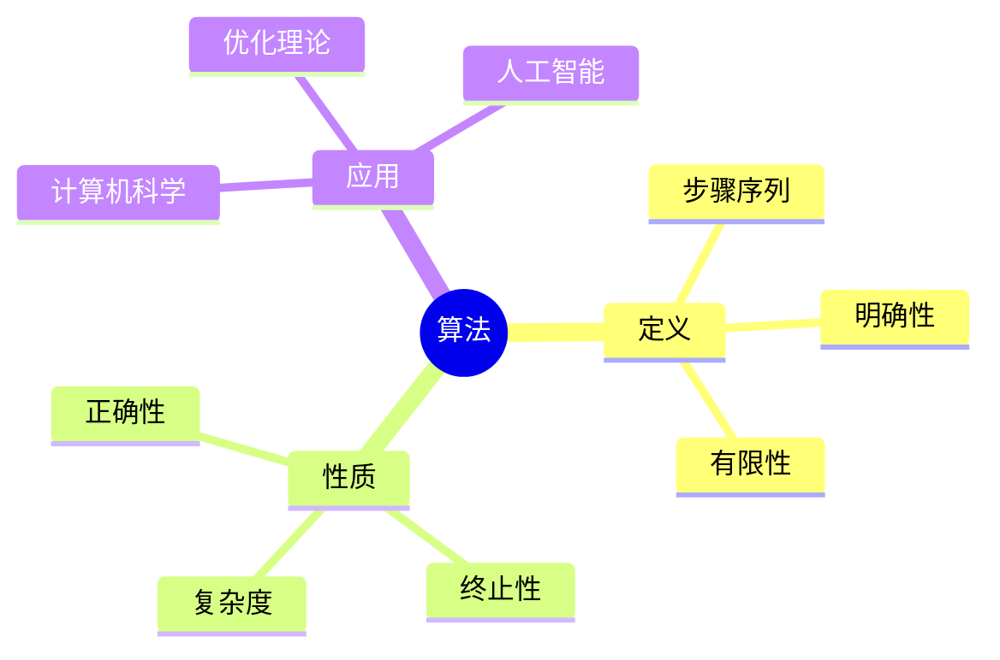
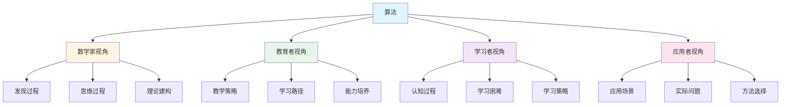
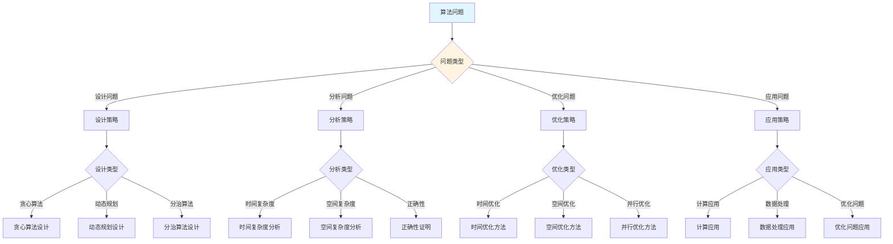
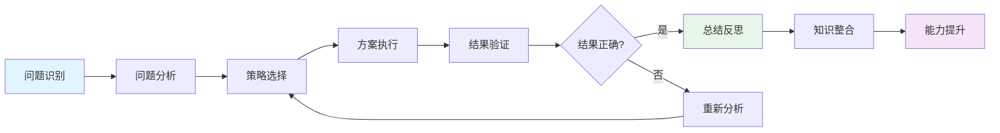
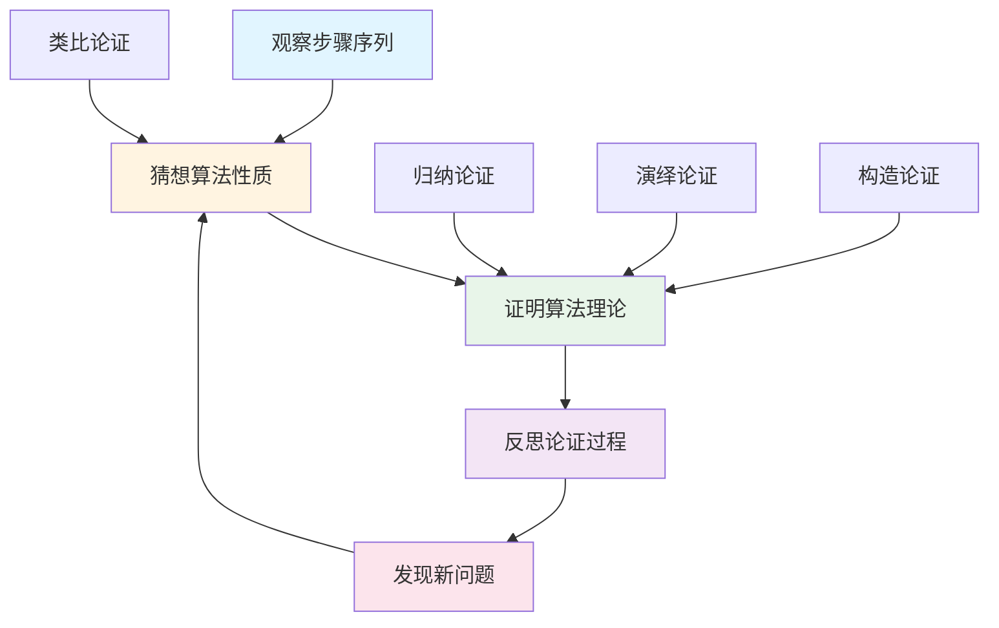
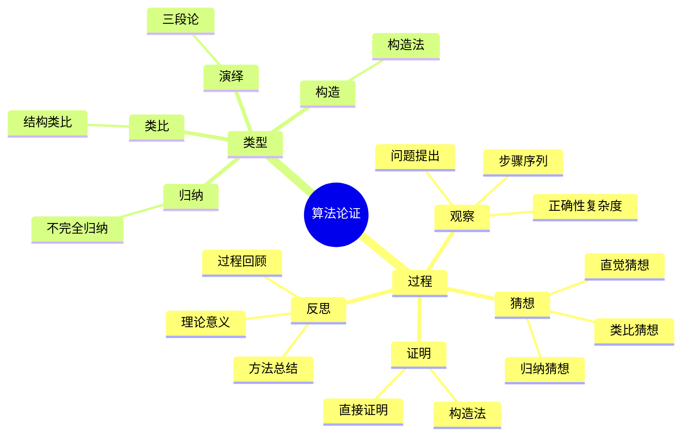

# 算法 (Algorithm) - 三视角组织版

**概念编号**: C.CORE.031
**知识层次**: L0-L2
**知识领域**: D7 (离散数学)
**创建日期**: 2025年1月
**最后更新**: 2025年1月

---

## 📋 目录 / Table of Contents

- [算法 (Algorithm) - 三视角组织版](#算法-algorithm---三视角组织版)
  - [📋 目录 / Table of Contents](#-目录--table-of-contents)
  - [1. 📋 概述 (编号: C.CORE.031.01)](#1--概述-编号-ccore03101)
  - [🧠 认知学视角：如何理解算法 (编号: C.CORE.031.02)](#-认知学视角如何理解算法-编号-ccore03102)
    - [认知起点 (编号: C.CORE.031.02.01)](#认知起点-编号-ccore0310201)
    - [认知过程 (编号: C.CORE.031.02.02)](#认知过程-编号-ccore0310202)
      - [阶段1：直观理解阶段 (编号: C.CORE.031.02.02.01)](#阶段1直观理解阶段-编号-ccore031020201)
      - [阶段2：概念形成阶段 (编号: C.CORE.031.02.02.02)](#阶段2概念形成阶段-编号-ccore031020202)
      - [阶段3：形式化阶段 (编号: C.CORE.031.02.02.03)](#阶段3形式化阶段-编号-ccore031020203)
    - [认知障碍 (编号: C.CORE.031.02.03)](#认知障碍-编号-ccore0310203)
    - [认知工具 (编号: C.CORE.031.02.04)](#认知工具-编号-ccore0310204)
  - [🎓 教育学视角：如何教学算法 (编号: C.CORE.031.03)](#-教育学视角如何教学算法-编号-ccore03103)
    - [教学目标 (编号: C.CORE.031.03.01)](#教学目标-编号-ccore0310301)
    - [教学路径 (编号: C.CORE.031.03.02)](#教学路径-编号-ccore0310302)
      - [阶段1：引入阶段（激发兴趣） (编号: C.CORE.031.03.02.01)](#阶段1引入阶段激发兴趣-编号-ccore031030201)
      - [阶段2：探索阶段（主动建构） (编号: C.CORE.031.03.02.02)](#阶段2探索阶段主动建构-编号-ccore031030202)
      - [阶段3：形式化阶段（抽象概括） (编号: C.CORE.031.03.02.03)](#阶段3形式化阶段抽象概括-编号-ccore031030203)
      - [阶段4：巩固阶段（应用深化） (编号: C.CORE.031.03.02.04)](#阶段4巩固阶段应用深化-编号-ccore031030204)
    - [教学难点 (编号: C.CORE.031.03.03)](#教学难点-编号-ccore0310303)
    - [教学策略 (编号: C.CORE.031.03.04)](#教学策略-编号-ccore0310304)
    - [评估方法 (编号: C.CORE.031.03.05)](#评估方法-编号-ccore0310305)
  - [🔬 数学家视角：如何思考算法 (编号: C.CORE.031.04)](#-数学家视角如何思考算法-编号-ccore03104)
    - [问题起源 (编号: C.CORE.031.04.01)](#问题起源-编号-ccore0310401)
    - [思维过程 (编号: C.CORE.031.04.02)](#思维过程-编号-ccore0310402)
      - [步骤1：问题提出 (编号: C.CORE.031.04.02.01)](#步骤1问题提出-编号-ccore031040201)
      - [步骤2：概念形成 (编号: C.CORE.031.04.02.02)](#步骤2概念形成-编号-ccore031040202)
      - [步骤3：理论发展 (编号: C.CORE.031.04.02.03)](#步骤3理论发展-编号-ccore031040203)
    - [历史发展 (编号: C.CORE.031.04.03)](#历史发展-编号-ccore0310403)
    - [3.2 关键人物和贡献 (编号: C.CORE.031.04.04)](#32-关键人物和贡献-编号-ccore0310404)
    - [重要定理 (编号: C.CORE.031.04.05)](#重要定理-编号-ccore0310405)
    - [开放问题 (编号: C.CORE.031.04.06)](#开放问题-编号-ccore0310406)
    - [一、第一人称思维描述 (编号: C.CORE.031.04.07)](#一第一人称思维描述-编号-ccore0310407)
      - [1.1 Turing的发现过程](#11-turing的发现过程)
    - [二、数学直觉的形成 (编号: C.CORE.031.04.08)](#二数学直觉的形成-编号-ccore0310408)
      - [2.1 直觉在概念发现中的作用](#21-直觉在概念发现中的作用)
      - [2.2 如何培养算法直觉](#22-如何培养算法直觉)
    - [三、数学美的教育价值 (编号: C.CORE.031.04.09)](#三数学美的教育价值-编号-ccore0310409)
      - [3.1 算法论的美在哪里](#31-算法论的美在哪里)
      - [3.2 如何培养学生的数学美感](#32-如何培养学生的数学美感)
    - [四、问题解决策略 (编号: C.CORE.031.04.10)](#四问题解决策略-编号-ccore0310410)
      - [4.1 数学家的启发式方法](#41-数学家的启发式方法)
      - [4.2 思维过程分析](#42-思维过程分析)
    - [五、批判性反思 (编号: C.CORE.031.04.11)](#五批判性反思-编号-ccore0310411)
      - [5.1 算法概念的局限性](#51-算法概念的局限性)
      - [5.2 算法理论的未解决问题](#52-算法理论的未解决问题)
  - [💡 数学解释：为什么算法是这样定义的 (编号: C.CORE.031.05)](#-数学解释为什么算法是这样定义的-编号-ccore03105)
    - [一、直观解释：算法是什么？](#一直观解释算法是什么)
      - [1.1 具体例子](#11-具体例子)
      - [1.2 形象类比](#12-形象类比)
      - [1.3 几何直观](#13-几何直观)
      - [1.4 操作体验](#14-操作体验)
    - [二、知性解释：算法的本质是什么？](#二知性解释算法的本质是什么)
      - [2.1 概念定义](#21-概念定义)
      - [2.2 分类体系](#22-分类体系)
      - [2.3 抽象结构](#23-抽象结构)
      - [2.4 知识体系](#24-知识体系)
    - [三、理性解释：算法的公理化定义](#三理性解释算法的公理化定义)
      - [3.1 公理体系](#31-公理体系)
      - [3.2 形式化证明](#32-形式化证明)
      - [3.3 系统建构](#33-系统建构)
    - [四、多视角解释：从不同角度理解算法](#四多视角解释从不同角度理解算法)
      - [4.1 数学家视角：算法是如何被发现的？](#41-数学家视角算法是如何被发现的)
      - [4.2 教育者视角：如何教学算法？](#42-教育者视角如何教学算法)
      - [4.3 学习者视角：如何学习算法？](#43-学习者视角如何学习算法)
      - [4.4 应用者视角：如何应用算法？](#44-应用者视角如何应用算法)
    - [五、思维表征：用多种方式理解算法](#五思维表征用多种方式理解算法)
      - [5.1 思维导图：算法的知识结构](#51-思维导图算法的知识结构)
      - [5.2 矩阵对比：不同解释方式的对比](#52-矩阵对比不同解释方式的对比)
      - [5.3 多视角表征：从不同角度表征算法](#53-多视角表征从不同角度表征算法)
      - [5.4 决策树：算法问题分类和策略选择](#54-决策树算法问题分类和策略选择)
      - [5.5 决策逻辑路径：算法问题解决过程](#55-决策逻辑路径算法问题解决过程)
      - [5.6 多维对比矩阵：算法概念特征对比](#56-多维对比矩阵算法概念特征对比)
  - [💡 数学解释：为什么算法是这样定义的 (编号: C.CORE.031.05)](#-数学解释为什么算法是这样定义的-编号-ccore03105)
  - [🔍 数学论证：如何论证算法 (编号: C.CORE.031.06)](#-数学论证如何论证算法-编号-ccore03106)
    - [一、论证过程：从观察到反思](#一论证过程从观察到反思)
    - [二、论证类型：多种推理方式](#二论证类型多种推理方式)
    - [三、论证可视化：用图形表示论证过程](#三论证可视化用图形表示论证过程)
  - [🔗 三视角整合 (编号: C.CORE.031.07)](#-三视角整合-编号-ccore03107)
    - [三个视角的关联](#三个视角的关联)
    - [如何综合运用三个视角](#如何综合运用三个视角)
  - [📚 参考文献 (编号: C.CORE.031.08)](#-参考文献-编号-ccore03108)
    - [权威资源](#权威资源)
    - [经典教材](#经典教材)
    - [研究论文](#研究论文)

---

## 1. 📋 概述 (编号: C.CORE.031.01)

算法是计算理论的核心概念，是解决问题的明确步骤序列。算法理论在计算机科学、优化理论、人工智能等领域有广泛应用。

本文档从**数学认知学**、**教育学**、**数学家**三个视角深入展开算法概念，避免简单的概念堆垒。

**权威资源对齐**:

- Wikipedia: [Algorithm](https://en.wikipedia.org/wiki/Algorithm)
- Stanford课程: CS 161 (Design and Analysis of Algorithms)
- Princeton课程: COS 423 (Theory of Algorithms)
- MIT课程: 6.006 (Introduction to Algorithms)
- Metamath: [Algorithm](http://us.metamath.org/mpeuni/df-algorithm.html)

---

## 🧠 认知学视角：如何理解算法 (编号: C.CORE.031.02)

### 认知起点 (编号: C.CORE.031.02.01)

**学习者已有的知识基础**:

- 步骤的概念
- 过程的概念
- 日常经验中的"方法"、"步骤"概念

**日常经验中的类似概念**:

- "方法"：解决问题的方法
- "步骤"：执行的步骤
- "过程"：解决问题的过程

### 认知过程 (编号: C.CORE.031.02.02)

#### 阶段1：直观理解阶段 (编号: C.CORE.031.02.02.01)

**具体例子**:

- 例子1：排序算法 - 冒泡排序、快速排序
- 例子2：搜索算法 - 二分搜索、深度优先搜索
- 例子3：图算法 - 最短路径、最小生成树

**形象类比**:

- **步骤类比**: 算法就像"解决问题的步骤"
  - 明确的步骤
  - 可以执行
  - 可以重复

- **过程类比**: 算法就像"解决问题的过程"
  - 输入问题
  - 执行步骤
  - 输出结果

**可视化表示**:

```text
算法:
    输入 → 步骤1 → 步骤2 → ... → 输出
    明确、有限、有效
```

#### 阶段2：概念形成阶段 (编号: C.CORE.031.02.02.02)

**从例子中抽象出共同特征**:

- 所有例子都涉及"步骤序列"
- 步骤是"明确的"
- 步骤是"有限的"

**识别关键属性**:

1. **输入**: 接受输入
2. **输出**: 产生输出
3. **确定性**: 每个步骤明确
4. **有限性**: 在有限步内终止
5. **有效性**: 每个步骤可执行

**建立概念边界**:

- **什么是算法**: 解决问题的明确步骤序列
- **什么不是算法**:
  - 不明确的步骤（不是算法）
  - 无限步骤（不是算法）

#### 阶段3：形式化阶段 (编号: C.CORE.031.02.02.03)

**严格定义**:

- 算法定义：计算函数$f: I \to O$的过程
- 条件：输入、输出、确定性、有限性、有效性

**公理化表述**:

- 条件1：输入
- 条件2：输出
- 条件3：确定性
- 条件4：有限性
- 条件5：有效性

**逻辑结构**:

- 算法是计算理论的核心
- 算法可以解决问题
- 算法是计算机科学的基础

### 认知障碍 (编号: C.CORE.031.02.03)

**常见误解**:

1. **误解1**: 认为算法就是程序
   - **纠正**: 算法是步骤序列，程序是算法的实现

2. **误解2**: 认为所有问题都有算法
   - **纠正**: 不是所有问题都有算法，如停机问题

3. **误解3**: 混淆算法和数据结构
   - **纠正**: 算法是步骤，数据结构是数据组织方式

**理解难点**:

1. **难点1**: 算法的抽象性
   - **原因**: 算法比较抽象
   - **解决方法**: 从具体例子开始，逐步抽象

2. **难点2**: 算法的复杂度
   - **原因**: 复杂度分析比较复杂
   - **解决方法**: 用具体例子，逐步掌握复杂度分析

3. **难点3**: 算法的设计
   - **原因**: 算法设计需要创造性
   - **解决方法**: 用具体例子，逐步掌握设计方法

**认知陷阱**:

- **程序**: 需要理解算法和程序的区别
- **复杂度**: 需要理解复杂度分析

### 认知工具 (编号: C.CORE.031.02.04)

**类比工具**:

- **步骤类比**: 算法 = 解决问题的步骤
- **过程类比**: 算法 = 解决问题的过程

**可视化工具**:

- **流程图**: 用流程图表示算法
- **伪代码**: 用伪代码表示算法

**具体化工具**:

- **具体例子**: 用具体例子理解抽象概念
- **反例**: 用反例理解概念边界

---

## 🎓 教育学视角：如何教学算法 (编号: C.CORE.031.03)

### 教学目标 (编号: C.CORE.031.03.01)

**知识目标**:

- 理解算法的基本概念
- 掌握算法的定义
- 理解算法的性质
- 理解算法的应用

**能力目标**:

- 能够设计算法
- 能够分析算法复杂度
- 能够应用算法解决实际问题
- 能够理解算法的重要性

**情感目标**:

- 培养数学抽象思维
- 培养计算思维
- 激发对数学的兴趣

### 教学路径 (编号: C.CORE.031.03.02)

#### 阶段1：引入阶段（激发兴趣） (编号: C.CORE.031.03.02.01)

**实际问题**:

- 问题1：如何排序数据？
- 问题2：如何搜索数据？
- 问题3：如何解决问题？

**历史背景**:

- 算法的历史发展
- 算法在数学中的地位
- 算法在计算机科学中的应用

**引发认知冲突**:

- 问题：如何统一描述解决问题的步骤？
- 引出算法的概念

#### 阶段2：探索阶段（主动建构） (编号: C.CORE.031.03.02.02)

**引导发现**:

1. 让学生自己列举"解决问题的方法"
2. 让学生观察这些方法的共同特征
3. 引导学生抽象出算法的定义

**合作探究**:

- 小组讨论：什么是算法？
- 小组讨论：算法有哪些性质？
- 小组讨论：如何设计算法？

**多元表征**:

- **语言表征**: "算法是解决问题的明确步骤序列"
- **符号表征**: 伪代码
- **图形表征**: 流程图
- **集合表征**: 算法定义

#### 阶段3：形式化阶段（抽象概括） (编号: C.CORE.031.03.02.03)

**严格定义**:

- 算法的定义
- 算法的性质
- 算法的复杂度

**性质证明**:

- 算法的基本性质
- 算法的正确性
- 算法的复杂度分析

**应用拓展**:

- 算法在计算机科学中的应用
- 算法在优化理论中的应用
- 算法在人工智能中的应用

#### 阶段4：巩固阶段（应用深化） (编号: C.CORE.031.03.02.04)

**练习应用**:

- 基础练习：算法的设计和分析
- 应用练习：用算法解决实际问题
- 综合练习：算法的综合应用

**变式训练**:

- 不同形式的算法
- 不同难度的算法设计
- 算法的应用

**知识整合**:

- 算法与其他概念的联系
- 算法在数学体系中的地位

### 教学难点 (编号: C.CORE.031.03.03)

**难点1：算法的抽象性**:

- **难点描述**: 学生难以理解算法的抽象概念
- **解决方法**:
  - 从具体例子开始
  - 逐步抽象
  - 用具体例子说明

**难点2：算法的复杂度**:

- **难点描述**: 学生难以分析算法复杂度
- **解决方法**:
  - 用具体例子
  - 逐步掌握复杂度分析
  - 用练习巩固

**难点3：算法的设计**:

- **难点描述**: 学生难以设计算法
- **解决方法**:
  - 用具体例子
  - 逐步掌握设计方法
  - 用练习巩固

### 教学策略 (编号: C.CORE.031.03.04)

**策略1：从具体到抽象**:

- 先给出具体例子
- 再抽象出一般概念
- 最后给出严格定义

**策略2：多元表征**:

- 用语言、符号、图形等多种方式表示同一概念
- 帮助学生建立不同表征之间的联系

**策略3：问题驱动**:

- 从实际问题出发
- 引出数学概念
- 解决问题

**策略4：可视化教学**:

- 使用流程图
- 使用伪代码
- 使用具体例子

### 评估方法 (编号: C.CORE.031.03.05)

**形成性评估**（评估理解过程）:

- 课堂提问：检查学生对概念的理解
- 小组讨论：观察学生的思考过程
- 练习作业：检查学生的应用能力

**总结性评估**（评估最终理解）:

- 测验：检查学生对概念和设计的掌握
- 项目：检查学生应用算法解决实际问题的能力
- 反思：检查学生对算法概念的理解深度

---

## 🔬 数学家视角：如何思考算法 (编号: C.CORE.031.04)

### 问题起源 (编号: C.CORE.031.04.01)

**历史背景**:

- 古代：算法的早期研究
- 20世纪：算法的发展
- 20世纪中期：算法的现代发展

**原始问题**:

- **问题1**: 如何解决问题？
- **问题2**: 如何设计步骤序列？
- **问题3**: 算法有哪些性质？

**研究动机**:

- 统一计算理论
- 发展算法理论
- 研究计算复杂性

### 思维过程 (编号: C.CORE.031.04.02)

#### 步骤1：问题提出 (编号: C.CORE.031.04.02.01)

**观察到的现象**:

- 需要解决问题
- 需要设计步骤序列
- 需要统一计算理论

**提出的猜想**:

- 可以引入算法概念
- 算法可以解决问题
- 算法有丰富的性质

**需要解决的问题**:

- 如何定义算法？
- 算法应该满足什么条件？
- 算法有哪些性质？

#### 步骤2：概念形成 (编号: C.CORE.031.04.02.02)

**尝试性定义**:

- **步骤定义**: 通过步骤序列
- **函数定义**: 通过计算函数

**性质探索**:

- 算法的基本性质
- 算法的正确性
- 算法的复杂度

**结构发现**:

- 算法是计算理论的核心
- 算法可以解决问题
- 算法是计算机科学的基础

#### 步骤3：理论发展 (编号: C.CORE.031.04.02.03)

**定理证明**:

- 算法的基本性质
- 算法的正确性
- 算法的复杂度

**应用拓展**:

- 算法在计算机科学中的应用
- 算法在优化理论中的应用
- 算法在人工智能中的应用

**理论完善**:

- 算法的严格定义
- 算法的范畴论研究
- 算法的应用研究

### 历史发展 (编号: C.CORE.031.04.03)

**早期阶段**（古代）:

- **Euclid (约公元前300年)**: 研究Euclid算法
- **Al-Khwarizmi (9世纪)**: 研究算法

**关键突破**（20世纪）:

- **Turing (1936)**: 研究Turing机
- **Church (1936)**: 研究lambda演算

**现代发展**（20世纪中期）:

- **Knuth (1968)**: 发展算法理论
- **Cook (1971)**: 研究NP完全性

### 3.2 关键人物和贡献 (编号: C.CORE.031.04.04)

**Euclid (约公元前300年)**:

- 研究Euclid算法
- 建立算法基础

**Alan Turing (1912-1954)**:

- 研究Turing机
- 建立计算理论

**Donald Knuth (1938-)**:

- 发展算法理论
- 建立现代算法学

### 重要定理 (编号: C.CORE.031.04.05)

**Turing停机问题**:

- 不存在算法判断Turing机是否停机
- 意义：计算理论的基础

**Cook-Levin定理**:

- SAT问题是NP完全的
- 意义：计算复杂性的基础

**算法复杂度**:

- 算法的时间复杂度和空间复杂度
- 意义：算法分析的基础

### 开放问题 (编号: C.CORE.031.04.06)

**未解决问题**:

- P vs NP问题
- 算法的设计问题
- 算法的应用问题

**研究方向**:

- 算法的范畴论研究
- 算法的应用研究
- 算法的计算研究

### 一、第一人称思维描述 (编号: C.CORE.031.04.07)

#### 1.1 Turing的发现过程

**详细历史背景**:

- **1936年**：Turing发表《论可计算数及其在判定问题中的应用》（On Computable Numbers, with an Application to the Entscheidungsproblem）
- **背景**：研究计算问题，发现需要定义算法的概念
- **问题**：什么是算法？如何定义计算过程？

**Turing的详细第一人称描述**:
> "1936年，我在研究计算问题时，遇到了一个问题：什么是算法？
>
> 我发现，需要定义算法的概念。我意识到，算法可以通过Turing机来描述。
>
> 我的方法是这样的：
>
> - **思路**：用Turing机定义算法
> - **定义**：Turing机由状态、符号、转移函数组成
> - **计算**：Turing机在带子上读写符号，根据状态和符号转移
>
> 例如，对于加法算法：
>
> - **输入**：两个自然数$m$和$n$（用$m$个1和$n$个1表示）
> - **过程**：Turing机将两个数合并
> - **输出**：$m+n$（用$m+n$个1表示）
>
> 对于判定问题：
>
> - **问题**：是否存在算法判断Turing机是否停机？
> - **答案**：不存在（Turing停机问题）
> - **证明**：假设存在算法$H$判断停机，构造矛盾
>
> 我还发现了Turing机的等价性：
>
> - **Church-Turing论题**：所有计算模型等价于Turing机
> - **意义**：Turing机是计算的通用模型
> - **应用**：为计算理论提供基础
>
> 这让我意识到，算法是计算过程的抽象，Turing机是算法的严格定义。这为计算理论提供了基础。"

**详细的思维过程**:

1. **观察到的现象**（1936年）:

   **现象1：需要定义计算过程**
   - **问题**：什么是算法？
   - **例子**：加法、乘法、排序
   - **需要**：统一的概念

   **现象2：这种过程有特殊的性质**
   - **问题**：算法有什么性质？
   - **例子**：算法的可计算性、复杂度
   - **需要**：建立算法理论

   **现象3：需要统一的概念**
   - **问题**：如何统一处理不同的计算问题？
   - **思路**：用算法统一
   - **需要**：建立算法理论

2. **提出的猜想**（1936年）:

   **猜想1：用Turing机定义算法**
   - **思路**：定义算法为Turing机的计算过程
   - **例子**：加法算法、乘法算法
   - **优点**：统一定义算法

   **猜想2：Turing机的等价性**
   - **论题**：所有计算模型等价于Turing机
   - **例子**：Church-Turing论题
   - **意义**：Turing机是计算的通用模型

   **猜想3：算法的不可计算性**
   - **问题**：是否存在算法判断Turing机是否停机？
   - **答案**：不存在（Turing停机问题）
   - **意义**：算法的局限性

3. **遇到的困难**（1936年）:

   **困难1：如何严格定义算法？**
   - **问题**：如何定义算法？
   - **解决**：定义算法为Turing机的计算过程
   - **意义**：为算法提供严格的数学基础

   **困难2：如何判断算法的性质？**
   - **问题**：如何判断算法是否可计算？复杂度如何？
   - **解决**：使用Turing机、复杂度理论
   - **意义**：为算法提供分析方法

   **困难3：如何应用算法理论？**
   - **问题**：如何用算法理论解决实际问题？
   - **解决**：建立算法设计、复杂度分析
   - **意义**：为算法提供应用基础

4. **突破的时刻**（1936年，Turing）:

   **突破1：Turing机的概念**
   - 引入Turing机的概念定义算法
   - **关键**：Turing机是计算的通用模型
   - **意义**：为计算理论提供基础

   **突破2：Turing停机问题**
   - 证明不存在算法判断Turing机是否停机
   - **关键**：算法的局限性
   - **意义**：为计算理论提供基础

   **突破3：算法理论的广泛应用**
   - 算法理论可以应用到更广泛的领域
   - **关键**：算法是计算的基础
   - **意义**：算法理论成为计算科学的基础

### 二、数学直觉的形成 (编号: C.CORE.031.04.08)

#### 2.1 直觉在概念发现中的作用

**Turing的直觉**:

- **直觉1**: "算法"是"计算过程"——这个直觉引导Turing发现算法
- **直觉2**: 算法可以统一处理计算问题——这个直觉引导Turing建立计算理论
- **直觉3**: 算法是计算理论的基础——这个直觉引导Turing建立算法理论

**直觉的验证**:

- 通过严格的数学证明验证直觉的正确性
- 通过Turing机严格化算法定义
- 通过应用验证算法的广泛性

**直觉的深化**:

- 从"计算过程"到"算法的严格定义"
- 从"统一处理计算问题"到"算法的广泛应用"
- 从"计算理论基础"到"算法的深入发展"

#### 2.2 如何培养算法直觉

**数学家的建议**:

- **Turing**: "算法直觉是长期训练的结果。通过大量练习和深入思考，我们可以培养对算法的直觉。"
- **Church**: "从具体例子开始，逐步抽象，这是培养算法直觉的有效方法。"

**培养方法**:

1. **大量练习**: 通过大量算法设计练习，培养对算法的直觉
2. **深入思考**: 深入思考算法的本质，理解算法的深层结构
3. **类比和联想**: 通过类比和联想，建立算法与其他概念的联系
4. **与专家交流**: 与数学家交流，学习他们的思维方式

**教学启示**:

- 从具体例子开始，逐步抽象
- 鼓励学生思考算法的本质
- 引导学生建立算法与其他概念的联系

### 三、数学美的教育价值 (编号: C.CORE.031.04.09)

#### 3.1 算法论的美在哪里

**结构美**:

- **简洁性**: 算法的概念非常简洁——"解决问题的步骤序列"
- **统一性**: 算法可以统一描述数学中的各种计算过程
- **和谐性**: 算法满足优美的规律（复杂度理论、正确性证明等）

**数学家的评价**:

- **Turing**: "算法论的美在于它的统一性。它为我们提供了一个统一的框架来理解计算过程。"
- **Church**: "算法论的美在于它的基础性。它是计算理论的基础，所有计算过程都可以用算法来描述。"

#### 3.2 如何培养学生的数学美感

**数学家的建议**:

- **Turing**: "展示算法论的美感，让学生感受到数学的美。"
- **Church**: "通过算法论的历史和发展，让学生理解数学的美。"

**教学方法**:

1. **展示数学美**:
   - 展示算法概念的简洁性和统一性
   - 展示算法的优美规律
   - 展示算法在数学中的基础地位

2. **引导学生欣赏**:
   - 引导学生欣赏算法概念的简洁性
   - 引导学生欣赏算法的和谐性
   - 引导学生欣赏算法的基础性

3. **鼓励学生创造美**:
   - 鼓励学生发现算法论的美
   - 鼓励学生创造优美的算法
   - 鼓励学生探索算法论的美

### 四、问题解决策略 (编号: C.CORE.031.04.10)

#### 4.1 数学家的启发式方法

**策略1：从具体到抽象**:

- 从具体的算法例子开始
- 抽象出算法的一般性质
- 建立算法的理论体系

**策略2：从简单到复杂**:

- 先理解基本算法
- 再理解算法设计
- 最后理解算法理论

**策略3：从问题到理论**:

- 从实际问题出发
- 引出算法概念
- 建立算法理论

#### 4.2 思维过程分析

**问题识别**:

- 识别问题类型：算法定义问题、算法设计问题、算法应用问题
- 识别问题难度：简单问题、中等问题、复杂问题

**策略选择**:

- 简单问题：直接方法
- 中等问题：分步方法
- 复杂问题：分解方法

**执行和反思**:

- 执行策略，解决问题
- 反思过程，总结经验
- 改进方法，提高效率

### 五、批判性反思 (编号: C.CORE.031.04.11)

#### 5.1 算法概念的局限性

**概念的边界**:

- 算法只描述可计算过程，不能描述所有数学过程
- 算法是抽象的，需要具体化才能应用
- 算法不能表示所有数学量

**概念的推广**:

- 随机算法：包含随机性的算法
- 量子算法：量子计算中的算法
- 范畴算法：范畴论中的算法

#### 5.2 算法理论的未解决问题

**未解决的问题**:

- P vs NP问题：P类问题是否等于NP类问题？
- 算法的设计问题：如何设计高效算法？
- 算法的应用问题：如何更好地应用算法？

**研究方向**:

- 算法的范畴论研究
- 算法的应用研究
- 算法的计算研究

---

## 💡 数学解释：为什么算法是这样定义的 (编号: C.CORE.031.05)

### 一、直观解释：算法是什么？

#### 1.1 具体例子

**生活中的例子**：

- **烹饪食谱**：做菜的步骤序列就是算法
  - 例如：先洗菜，再切菜，最后炒菜
  - **为什么这样定义**：因为我们需要一个概念来表示"解决问题的步骤序列"
- **导航路线**：从A地到B地的路线就是算法
  - 例如：先左转，再直行，最后右转
  - **为什么这样定义**：因为我们需要一个概念来表示"路径规划"
- **日常流程**：早上起床的流程就是算法
  - 例如：先起床，再刷牙，最后吃早餐
  - **为什么这样定义**：因为我们需要一个概念来表示"流程步骤"

**数学中的例子**：

- **Euclid算法**：计算最大公约数的算法
  - 例如：$\gcd(48, 18) = \gcd(18, 12) = \gcd(12, 6) = 6$
  - **为什么这样定义**：我们需要一个简单的方式来表示"计算最大公约数的方法"
- **排序算法**：将数组排序的算法
  - 例如：冒泡排序、快速排序、归并排序
  - **为什么这样定义**：我们需要一个概念来表示"排序的方法"
- **搜索算法**：在数组中查找元素的算法
  - 例如：线性搜索、二分搜索
  - **为什么这样定义**：我们需要一个概念来表示"搜索的方法"

#### 1.2 形象类比

**食谱类比**：

- **算法就像"食谱"**
  - 食谱有明确的步骤
  - 算法有明确的指令
- **为什么这样类比**：这个类比帮助我们理解算法的"步骤序列"性质

**机器类比**：

- **算法就像"机器"**
  - 机器按照程序运行
  - 算法按照步骤执行
- **为什么这样类比**：这个类比帮助我们理解算法的"执行"性质

#### 1.3 几何直观

**流程图表示**：

- 使用流程图表示算法
- 例如：用方框表示步骤，用箭头表示流程
- **为什么使用流程图**：流程图提供几何直观，帮助我们理解算法的结构

**状态图表示**：

- 使用状态图表示算法
- 例如：用节点表示状态，用边表示转换
- **为什么使用状态图**：状态图提供几何直观，帮助我们理解算法的状态转换

#### 1.4 操作体验

**算法执行的操作**：

- **输入**：算法接收输入数据
  - **为什么这样操作**：因为我们需要一个运算来表示"算法的输入"
- **处理**：算法处理输入数据
  - **为什么这样操作**：因为我们需要一个运算来表示"算法的处理"
- **输出**：算法产生输出结果
  - **为什么这样操作**：因为我们需要一个工具来表示"算法的输出"

### 二、知性解释：算法的本质是什么？

#### 2.1 概念定义

**算法的内涵**：

- **算法是解决问题的明确步骤序列**
  - **明确性**：每个步骤都是明确的，没有歧义
  - **有限性**：算法必须在有限步内终止
  - **有效性**：算法必须能够解决问题
- **为什么这样定义**：这些特征使得算法成为一个完整的计算工具，支持所有问题解决

**算法的外延**：

- **确定性算法**：每一步都是确定的
- **随机算法**：使用随机性的算法
- **近似算法**：产生近似解的算法
- **为什么这样分类**：不同的算法类型有不同的性质和用途

#### 2.2 分类体系

**按复杂度分类**：

- **多项式时间算法**：时间复杂度为$O(n^k)$
- **指数时间算法**：时间复杂度为$O(2^n)$
- **为什么这样分类**：复杂度是算法的基本特征

**按策略分类**：

- **贪心算法**：每一步都选择局部最优
- **动态规划**：将问题分解为子问题
- **分治算法**：将问题分解为更小的子问题
- **为什么这样分类**：策略是算法的重要特征

#### 2.3 抽象结构

**算法的运算结构**：

- **算法的组合**：可以将多个算法组合成新算法
- **算法的递归**：算法可以调用自身
- **为什么有这些运算**：这些运算使得算法具有代数结构

**算法的关系结构**：

- **算法的等价**：两个算法如果解决相同问题，则等价
- **算法的优化**：一个算法如果比另一个算法更高效，则更优
- **为什么有这个关系**：这个关系帮助我们研究算法的性质

#### 2.4 知识体系

**算法在数学体系中的位置**：

- **基础地位**：算法是计算理论的基础
  - 算法是问题解决的基础
  - 算法是计算机科学的基础
- **为什么是基础**：算法提供了统一的框架来研究问题解决

**算法与其他概念的关系**：

- **算法与计算**：算法是计算的具体实现
- **算法与复杂度**：算法有时间和空间复杂度
- **算法与数据结构**：算法需要数据结构支持
- **为什么有这些关系**：这些关系揭示了算法与其他数学概念的内在联系

### 三、理性解释：算法的公理化定义

#### 3.1 公理体系

**算法的定义**：

- **定义**：算法是有限步骤序列，每一步都是明确的，算法必须在有限步内终止
- **为什么需要这个定义**：这个定义提供了算法的严格数学基础

**Turing机的定义**：

- **定义**：Turing机是算法的形式化模型
- **为什么这样定义**：这个定义将算法放在更一般的框架中

#### 3.2 形式化证明

**算法性质的证明**：

- **算法的正确性**：算法必须产生正确的结果
  - **证明**：使用数学归纳法和不变式
  - **为什么这样证明**：利用算法的定义和逻辑推理
- **算法的终止性**：算法必须在有限步内终止
  - **证明**：使用循环不变式和递减函数
  - **为什么这样证明**：利用算法的定义和终止条件

#### 3.3 系统建构

**算法论在数学基础中的地位**：

- **作为计算理论基础**：算法是计算理论的基础
- **提供问题解决工具**：算法提供了解决问题的工具
- **统一框架**：算法统一了各种问题解决研究

**算法论的发展历史**：

- **Euclid的算法**（约公元前300年）：研究Euclid算法
- **Turing的机器**（1936年）：研究Turing机
- **Cook的NP完全性**（1971年）：研究NP完全性
- **为什么这样发展**：数学的发展需要严格的基础，算法论的发展反映了这一需求

### 四、多视角解释：从不同角度理解算法

#### 4.1 数学家视角：算法是如何被发现的？

**Euclid的发现过程**：

- **问题提出**：如何计算最大公约数？
- **关键洞察**：使用辗转相除法，发现算法的递归结构
- **重要发现**：算法可以用于解决各种问题
- **为什么这样发现**：数学家的直觉和严格证明相结合

#### 4.2 教育者视角：如何教学算法？

**教学策略**：

- **从具体到抽象**：先学习具体例子（Euclid算法），再学习抽象定义
- **从简单到复杂**：先学习简单算法，再学习复杂算法
- **从直观到形式化**：先使用流程图等直观工具，再学习严格定义
- **为什么这样教学**：符合认知规律，帮助学生逐步建立理解

#### 4.3 学习者视角：如何学习算法？

**认知过程**：

- **直观阶段**：通过具体例子理解算法的含义
- **概念阶段**：理解算法的定义和性质
- **形式化阶段**：理解严格定义和证明
- **为什么这样学习**：符合认知发展规律

#### 4.4 应用者视角：如何应用算法？

**应用场景**：

- **计算机科学**：使用算法进行程序设计
- **优化理论**：使用算法进行优化
- **人工智能**：使用算法进行机器学习
- **为什么这样应用**：算法提供了强大的工具来处理各种问题

### 五、思维表征：用多种方式理解算法

#### 5.1 思维导图：算法的知识结构



#### 5.2 矩阵对比：不同解释方式的对比

| 解释方式 | 特点 | 方法 | 工具 | 适用阶段 | 优势 | 局限 |
|---------|------|------|------|---------|------|------|
| **直观解释** | 具体、形象、可视 | 例子、类比、直观 | 流程图、状态图 | 入门阶段 | 易于理解 | 不够严格 |
| **知性解释** | 概念、分类、抽象 | 定义、分类、结构 | 概念图、知识图谱 | 中级阶段 | 系统完整 | 不够直观 |
| **理性解释** | 公理、证明、形式化 | 公理、证明、系统 | 形式化工具、证明系统 | 高级阶段 | 严格准确 | 不够具体 |
| **多视角解释** | 多角度、整合 | 多视角、整合 | 多视角工具 | 所有阶段 | 全面深入 | 可能复杂 |

#### 5.3 多视角表征：从不同角度表征算法



#### 5.4 决策树：算法问题分类和策略选择



**说明**：

- **问题分类**：根据问题类型（设计、分析、优化、应用）进行分类
- **策略选择**：根据问题类型选择相应的解决策略
- **方法应用**：根据具体问题选择合适的方法

#### 5.5 决策逻辑路径：算法问题解决过程



**说明**：

- **问题识别**：识别算法问题的类型和关键要素
- **问题分析**：分析问题的条件和目标
- **策略选择**：根据问题类型选择解决策略
- **方案执行**：执行选定的解决方案
- **结果验证**：验证结果的正确性
- **总结反思**：总结解题过程，反思解题方法
- **知识整合**：整合相关知识点
- **能力提升**：提升问题解决能力

#### 5.6 多维对比矩阵：算法概念特征对比

| 对比维度 | 算法定义 | 算法设计 | 算法分析 | 算法应用 |
|---------|---------|---------|---------|---------|
| **核心特征** | 算法概念、步骤 | 贪心、动态规划、分治 | 时间复杂度、空间复杂度、正确性 | 计算、数据处理、优化 |
| **理解难度** | ⭐⭐⭐ | ⭐⭐⭐⭐ | ⭐⭐⭐⭐ | ⭐⭐⭐⭐ |
| **应用频率** | ⭐⭐⭐⭐⭐ | ⭐⭐⭐⭐⭐ | ⭐⭐⭐⭐⭐ | ⭐⭐⭐⭐⭐ |
| **理论基础** | 算法定义 | 算法设计理论 | 算法分析理论 | 算法应用理论 |
| **教学重点** | 概念理解 | 设计方法 | 分析方法 | 应用能力 |
| **学习阶段** | 中级阶段 | 中级-高级 | 中级-高级 | 中级-高级 |
| **认知维度** | 知性+理性 | 理性 | 理性 | 理性+应用 |
| **思维表征** | 思维导图 | 决策树 | 决策逻辑路径 | 知识图谱 |

**说明**：

- **核心特征**：每个方面的核心特征
- **理解难度**：从1星到5星，表示理解难度
- **应用频率**：从1星到5星，表示应用频率
- **理论基础**：每个方面的理论基础
- **教学重点**：每个方面的教学重点
- **学习阶段：每个方面的学习阶段
- **认知维度**：每个方面的认知维度
- **思维表征**：每个方面推荐的思维表征方法

---

## 🔍 数学论证：如何论证算法 (编号: C.CORE.031.06)

### 一、论证过程：从观察到反思

#### 1.1 观察（Observation）

**具体现象观察**：

- **现象1**：解决问题需要步骤序列
  - 例如：计算最大公约数需要Euclid算法的步骤序列
  - **为什么重要**：这个现象揭示了算法的本质
- **现象2**：算法的正确性和复杂度
  - 例如：算法需要正确（产生正确输出）且高效（在合理时间内完成）
  - **为什么重要**：这个现象揭示了算法的两个基本要求

**模式识别**：

- **模式1**：算法的定义
  - 例如：算法是确定性、有限性、有效性的步骤序列
  - **为什么重要**：这个模式可能反映了算法的本质
- **模式2**：计算复杂度
  - 例如：算法的时间复杂度$T(n) = O(f(n))$，空间复杂度$S(n) = O(g(n))$
  - **为什么重要**：这个模式可能反映了算法的效率

**问题提出**：

- **问题1**：如何严格定义算法，统一不同的计算过程？
  - **为什么提出**：这个问题可能揭示算法的本质和基础
- **问题2**：如何证明算法的正确性？
  - **为什么提出**：这个问题可能揭示算法的可靠性

#### 1.2 猜想（Conjecture）

**归纳猜想**：

- **猜想1**：算法是解决问题的统一工具
  - **依据**：观察不同问题都依赖于算法
  - **为什么提出**：这个猜想可能揭示算法的统一性
- **猜想2**：算法的正确性可以证明
  - **依据**：观察具体算法的正确性证明
  - **为什么提出**：这个猜想可能揭示算法的可证明性

**类比猜想**：

- **猜想1**：算法类似于"食谱"
  - **类比对象**：食谱（步骤序列）
  - **为什么提出**：这个类比可能揭示算法的本质
- **猜想2**：Turing机类似于"计算机"
  - **类比对象**：计算机
  - **为什么提出**：这个类比可能揭示Turing机的作用

**直觉猜想**：

- **猜想1**：算法是"最自然"的计算概念
  - **直觉来源**：算法的直观
  - **为什么提出**：这个直觉可能揭示算法的基础地位
- **猜想2**：算法有"最小"的公理结构
  - **直觉来源**：算法的公理结构
  - **为什么提出**：这个直觉可能揭示算法的本质

#### 1.3 证明（Proof）

**直接证明**：

- **证明1**：算法的正确性
  - **证明思路**：使用循环不变式和数学归纳法
  - **关键步骤**：证明循环不变式在每次迭代后保持，算法终止时输出正确
  - **为什么这样证明**：这个证明方法直接、清晰
- **证明2**：算法的复杂度
  - **证明思路**：分析算法的执行步数
  - **关键步骤**：计算最坏情况下的执行步数，得到渐近估计
  - **为什么这样证明**：这个证明方法直接、清晰

**构造法**：

- **构造法**：构造算法
  - **构造方法**：设计步骤序列解决问题
  - **验证**：验证构造的算法正确且高效
  - **为什么这样证明**：构造法适合证明存在性命题

#### 1.4 反思（Reflection）

**过程回顾**：

- **论证回顾**：从观察解决问题需要步骤序列，到猜想算法的性质，再到严格证明
  - **成功之处**：成功建立了算法的严格理论
  - **不足之处**：算法概念需要进一步推广
  - **改进方向**：推广到随机算法、量子算法、近似算法等

**方法总结**：

- **证明方法**：使用了直接证明、构造法
  - **方法特点**：直接证明清晰，构造法明确
  - **适用范围**：不同方法适用于不同类型的命题
- **证明技巧**：使用循环不变式、数学归纳法、复杂度分析
  - **技巧要点**：将算法问题转化为逻辑问题，使用构造法处理存在性问题
  - **应用场景**：这些技巧可以应用于其他算法问题

**理论意义**：

- **理论贡献**：建立了算法的严格理论，揭示了算法的计算结构
  - **为什么重要**：这个论证揭示了计算理论的基础结构
- **应用价值**：算法为计算机科学、优化理论、人工智能提供了基础
  - **为什么重要**：这个论证可以应用于所有计算问题

### 二、论证类型：多种推理方式

#### 2.1 归纳论证（Inductive Reasoning）

**不完全归纳**：

- **例子1**：从具体算法的性质归纳一般规律
  - **观察**：观察Euclid算法、排序算法都有正确性和复杂度
  - **结论**：算法有共同的性质
  - **局限性**：不完全归纳的结论需要严格证明

#### 2.2 演绎论证（Deductive Reasoning）

**三段论**：

- **例子1**：证明算法的性质
  - **大前提**：所有算法都满足确定性
  - **小前提**：快速排序是算法
  - **结论**：快速排序满足确定性
  - **为什么有效**：三段论是严格的演绎推理

#### 2.3 类比论证（Analogical Reasoning）

**结构类比**：

- **例子1**：算法与食谱的类比
  - **类比对象**：食谱
  - **相似性**：算法是步骤序列，食谱也是步骤序列
  - **结论**：算法可以理解为"计算的食谱"
  - **局限性**：类比不能替代严格证明

#### 2.4 构造论证（Constructive Reasoning）

**构造法**：

- **例子1**：构造算法
  - **构造方法**：设计步骤序列解决问题
  - **验证**：验证构造的算法正确且高效
  - **为什么有效**：构造法是严格的直接证明

### 三、论证可视化：用图形表示论证过程

#### 3.1 论证流程图



#### 3.2 论证类型对比

| 论证类型 | 特点 | 适用场景 | 优势 | 局限 |
|---------|------|---------|------|------|
| **归纳论证** | 从特殊到一般 | 发现规律、提出猜想 | 启发性强 | 结论或然 |
| **演绎论证** | 从一般到特殊 | 严格证明、逻辑推理 | 结论必然 | 需要前提 |
| **类比论证** | 基于相似性 | 启发思路、发现联系 | 创造性高 | 结论或然 |
| **构造论证** | 直接构造 | 证明存在性命题 | 直接明确 | 需要构造 |

#### 3.3 论证思维导图



---

## 🔗 三视角整合 (编号: C.CORE.031.07)

### 三个视角的关联

**认知学视角 ↔ 教育学视角**:

- 认知学视角揭示的理解机制，指导教育学视角的教学设计
- 教育学视角的教学实践，验证认知学视角的理论

**认知学视角 ↔ 数学家视角**:

- 数学家视角的思维过程，启发认知学视角的认知路径
- 认知学视角的认知障碍，解释数学家视角的历史困难

**教育学视角 ↔ 数学家视角**:

- 数学家视角的历史发展，为教育学视角提供教学素材
- 教育学视角的教学策略，帮助学习者理解数学家视角的思维过程

### 如何综合运用三个视角

**学习建议**:

1. **从认知学视角开始**: 先建立直观理解
2. **用教育学视角深化**: 通过教学路径系统学习
3. **用数学家视角升华**: 理解概念的深层意义和历史背景

**教学建议**:

1. **引入阶段**: 用数学家视角的问题起源激发兴趣
2. **探索阶段**: 用认知学视角的认知过程引导发现
3. **形式化阶段**: 用教育学视角的教学策略系统教学
4. **巩固阶段**: 综合三个视角深化理解

---

## 📚 参考文献 (编号: C.CORE.031.08)

### 权威资源

- Wikipedia: [Algorithm](https://en.wikipedia.org/wiki/Algorithm)
- Metamath: [Algorithm](http://us.metamath.org/mpeuni/df-algorithm.html)

### 经典教材

- Cormen, T. H., Leiserson, C. E., Rivest, R. L., & Stein, C. (2009). *Introduction to Algorithms*. MIT Press.
- Knuth, D. E. (1997). *The Art of Computer Programming*. Addison-Wesley.

### 研究论文

- Turing, A. M. (1936). "On computable numbers, with an application to the Entscheidungsproblem". *Proceedings of the London Mathematical Society*.
- Cook, S. A. (1971). "The complexity of theorem-proving procedures". *Proceedings of the third annual ACM symposium on Theory of computing*.

---

**创建日期**: 2025年1月
**最后更新**: 2025年1月
**维护状态**: 持续更新中
