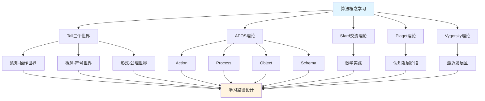

# 算法概念的多理论分析示例 / Multi-Theory Analysis Example: Algorithm Concept

**主题编号 / Topic ID**: C.CORE.031.MULTI
**创建日期 / Created**: 2025年1月 / January 2025
**最后更新 / Last Updated**: 2025年1月 / January 2025
**关联概念 / Related Concepts**: [算法 / Algorithm](./31-算法.md) | [算法-三视角版 / Algorithm-Three Perspectives](./31-算法-三视角版.md)

---

## 📋 概述 / Overview

本文档为"算法"概念提供多理论分析示例，展示如何运用国际主流数学认知理论来分析计算理论核心概念。

This document provides a multi-theory analysis example for the "Algorithm" concept, demonstrating how to apply international mainstream mathematical cognitive theories to analyze core concepts in computational theory.

**分析目标 / Analysis Objectives**：

- 展示算法概念的多理论分析方法 / Demonstrate multi-theory analysis methods for algorithm concepts
- 为其他计算理论概念提供分析参考 / Provide analysis reference for other computational theory concepts
- 建立理论整合的应用示例 / Establish application examples of theoretical integration
- 强调算法与计算、复杂性、优化理论的关系 / Emphasize the relationship between algorithms, computation, complexity theory, and optimization theory

---

## 📑 目录 / Table of Contents

- [算法概念的多理论分析示例 / Multi-Theory Analysis Example: Algorithm Concept](#算法概念的多理论分析示例--multi-theory-analysis-example-algorithm-concept)
  - [📋 概述 / Overview](#-概述--overview)
  - [📑 目录 / Table of Contents](#-目录--table-of-contents)
  - [🎯 一、Tall三个世界理论分析 / Tall's Three Worlds Theory Analysis (编号: C.CORE.031.MULTI.01)](#-一tall三个世界理论分析--talls-three-worlds-theory-analysis-编号-ccore031multi01)
    - [1.1 感知-操作世界（Embodied World）](#11-感知-操作世界embodied-world)
    - [1.2 概念-符号世界（Symbolic World）](#12-概念-符号世界symbolic-world)
    - [1.3 形式-公理世界（Formal World）](#13-形式-公理世界formal-world)
  - [🔬 二、Dubinsky APOS理论分析 (编号: C.CORE.031.MULTI.02)](#-二dubinsky-apos理论分析-编号-ccore031multi02)
    - [2.1 Action（动作）](#21-action动作)
    - [2.2 Process（过程）](#22-process过程)
    - [2.3 Object（对象）](#23-object对象)
    - [2.4 Schema（图式）](#24-schema图式)
  - [💬 三、Sfard交流理论分析 / Sfard's Commognitive Theory Analysis (编号: C.CORE.031.MULTI.03)](#-三sfard交流理论分析--sfards-commognitive-theory-analysis-编号-ccore031multi03)
    - [3.1 算法作为交流工具 / Algorithm as a Communication Tool](#31-算法作为交流工具--algorithm-as-a-communication-tool)
    - [3.2 算法学习的实践参与 / Practice Participation in Algorithm Learning](#32-算法学习的实践参与--practice-participation-in-algorithm-learning)
  - [🧠 四、Piaget认知发展理论分析 / Piaget's Cognitive Development Theory Analysis (编号: C.CORE.031.MULTI.04)](#-四piaget认知发展理论分析--piagets-cognitive-development-theory-analysis-编号-ccore031multi04)
    - [4.1 具体运算阶段（7-12岁）/ Concrete Operational Stage (7-12 years)](#41-具体运算阶段7-12岁-concrete-operational-stage-7-12-years)
    - [4.2 形式运算阶段（12+岁）/ Formal Operational Stage (12+ years)](#42-形式运算阶段12岁-formal-operational-stage-12-years)
  - [🌍 五、Vygotsky社会文化理论分析 / Vygotsky's Sociocultural Theory Analysis (编号: C.CORE.031.MULTI.05)](#-五vygotsky社会文化理论分析--vygotskys-sociocultural-theory-analysis-编号-ccore031multi05)
    - [5.1 最近发展区（ZPD）/ Zone of Proximal Development (ZPD)](#51-最近发展区zpd-zone-of-proximal-development-zpd)
    - [5.2 社会文化工具 / Sociocultural Tools](#52-社会文化工具--sociocultural-tools)
  - [🔄 六、多理论整合分析 / Multi-Theory Integration Analysis (编号: C.CORE.031.MULTI.06)](#-六多理论整合分析--multi-theory-integration-analysis-编号-ccore031multi06)
    - [6.1 理论共同点 / Theoretical Commonalities](#61-理论共同点--theoretical-commonalities)
    - [6.2 理论互补性 / Theoretical Complementarity](#62-理论互补性--theoretical-complementarity)
    - [6.3 整合应用框架](#63-整合应用框架)
  - [📊 七、算法概念的多理论学习路径 / Multi-Theory Learning Path for Algorithm Concept (编号: C.CORE.031.MULTI.07)](#-七算法概念的多理论学习路径--multi-theory-learning-path-for-algorithm-concept-编号-ccore031multi07)
    - [7.1 入门阶段（Tall感知-操作世界 + APOS Action）/ Entry Stage (Tall Embodied World + APOS Action)](#71-入门阶段tall感知-操作世界--apos-action-entry-stage-tall-embodied-world--apos-action)
    - [7.2 中级阶段（Tall概念-符号世界 + APOS Process/Object）/ Intermediate Stage (Tall Symbolic World + APOS Process/Object)](#72-中级阶段tall概念-符号世界--apos-processobject-intermediate-stage-tall-symbolic-world--apos-processobject)
    - [7.3 高级阶段（Tall形式-公理世界 + APOS Schema + Sfard实践）/ Advanced Stage (Tall Formal World + APOS Schema + Sfard Practice)](#73-高级阶段tall形式-公理世界--apos-schema--sfard实践-advanced-stage-tall-formal-world--apos-schema--sfard-practice)
  - [🎓 八、教学建议 / Teaching Suggestions (编号: C.CORE.031.MULTI.08)](#-八教学建议--teaching-suggestions-编号-ccore031multi08)
    - [8.1 基于多理论的教学设计 / Multi-Theory Based Teaching Design](#81-基于多理论的教学设计--multi-theory-based-teaching-design)
    - [8.2 具体教学策略 / Specific Teaching Strategies](#82-具体教学策略--specific-teaching-strategies)
  - [🔗 九、关联文档 / Related Documents (编号: C.CORE.031.MULTI.09)](#-九关联文档--related-documents-编号-ccore031multi09)
    - [9.1 核心概念文档 / Core Concept Documents](#91-核心概念文档--core-concept-documents)
    - [9.2 理论框架文档 / Theoretical Framework Documents](#92-理论框架文档--theoretical-framework-documents)
  - [✅ 十、总结 / Summary (编号: C.CORE.031.MULTI.10)](#-十总结--summary-编号-ccore031multi10)
    - [10.1 多理论分析的价值 / Value of Multi-Theory Analysis](#101-多理论分析的价值--value-of-multi-theory-analysis)
    - [10.2 应用推广 / Application and Extension](#102-应用推广--application-and-extension)

---

## 🎯 一、Tall三个世界理论分析 / Tall's Three Worlds Theory Analysis (编号: C.CORE.031.MULTI.01)

### 1.1 感知-操作世界（Embodied World）

**算法在感知-操作世界中的理解 / Understanding Algorithm in the Embodied World**：

- **具体经验 / Concrete Experience**：
  - 通过"步骤序列"的日常经验理解算法：按照步骤完成任务的流程 / Understanding algorithms through daily experience of "step sequences": processes of completing tasks step by step
  - 例如：烹饪食谱、组装家具的步骤 / Examples: cooking recipes, furniture assembly steps
  - 通过"计算过程"理解算法：执行计算的步骤序列 / Understanding algorithms through "computation processes": sequences of steps for performing computations
  - 例如：手工计算乘法、排序卡片 / Examples: manual multiplication, sorting cards

- **身体动作 / Bodily Actions**：
  - 通过"执行步骤"的动作理解算法 / Understanding algorithms through the action of "executing steps"
  - 通过"操作数据"理解算法 / Understanding algorithms through "manipulating data"
  - 通过操作具体对象理解算法的性质 / Understanding properties of algorithms through manipulating concrete objects

- **直观理解 / Intuitive Understanding**：
  - 算法是"解决问题的步骤序列" / Algorithms are "sequences of steps for solving problems"
  - 算法是"可执行的指令集合" / Algorithms are "executable sets of instructions"
  - 算法是计算理论的核心 / Algorithms are the core of computational theory

**教学建议 / Teaching Suggestions**：

- 使用具体例子（排序、搜索、计算） / Use concrete examples (sorting, searching, computation)
- 通过动手活动理解算法 / Understand algorithms through hands-on activities
- 使用图形可视化算法执行过程 / Use graphics to visualize algorithm execution processes

### 1.2 概念-符号世界（Symbolic World）

**算法在概念-符号世界的理解 / Understanding Algorithms in the Symbolic World**：

- **符号表示 / Symbolic Representation**：
  - 使用算法符号：伪代码、流程图、算法描述 / Using algorithm notation: pseudocode, flowcharts, algorithm descriptions
  - 使用复杂度符号：$O(n)$、$\Theta(n \log n)$、$\Omega(n)$ / Using complexity notation: $O(n)$, $\Theta(n \log n)$, $\Omega(n)$
  - 使用算法模式符号：分治、动态规划、贪心 / Using algorithm pattern notation: divide-and-conquer, dynamic programming, greedy

- **概念理解 / Conceptual Understanding**：
  - 算法是有限步骤序列 / Algorithms are finite sequences of steps
  - 算法满足确定性、有限性、有效性 / Algorithms satisfy determinism, finiteness, effectiveness
  - 算法编码计算过程（特别是问题求解） / Algorithms encode computation processes (especially problem solving)

- **抽象操作 / Abstract Operations**：
  - 通过符号操作设计算法 / Designing algorithms through symbolic operations
  - 通过逻辑推理分析算法复杂度 / Analyzing algorithm complexity through logical reasoning
  - 通过计算理论语言表达数学概念 / Expressing mathematical concepts through computational theory language

**教学建议 / Teaching Suggestions**：

- 逐步引入算法符号 / Gradually introduce algorithm notation
- 通过符号操作练习算法设计 / Practice algorithm design through symbolic operations
- 使用计算理论语言表达数学概念 / Use computational theory language to express mathematical concepts

### 1.3 形式-公理世界（Formal World）

**算法在形式-公理世界的理解 / Understanding Algorithms in the Formal World**：

- **公理系统 / Axiomatic System**：
  - 算法的严格定义：有限步骤序列，满足确定性、有限性、有效性 / Strict definition of algorithm: finite sequence of steps, satisfying determinism, finiteness, effectiveness
  - 算法满足停机性：在有限时间内终止 / Algorithms satisfy termination: terminate in finite time
  - 通过公理严格定义算法 / Strictly defining algorithms through axioms

- **形式化定义 / Formal Definition**：
  - 算法的形式化定义：图灵机、递归函数、λ演算 / Formal definition of algorithm: Turing machines, recursive functions, λ-calculus
  - 算法复杂度的形式化定义 / Formal definition of algorithm complexity
  - 算法性质的严格证明 / Strict proof of algorithm properties

- **逻辑推理 / Logical Reasoning**：
  - 通过逻辑推理证明算法性质（如正确性、复杂度） / Proving algorithm properties (such as correctness, complexity) through logical reasoning
  - 通过形式化方法研究计算理论 / Studying computational theory through formal methods
  - 通过公理系统建立计算理论基础 / Establishing computational theory foundations through axiom systems

**教学建议 / Teaching Suggestions**：

- 介绍算法的严格定义 / Introduce strict definition of algorithms
- 通过形式化证明理解算法性质 / Understand algorithm properties through formal proofs
- 研究算法在计算理论中的作用 / Study the role of algorithms in computational theory

---

## 🔬 二、Dubinsky APOS理论分析 (编号: C.CORE.031.MULTI.02)

### 2.1 Action（动作）

**算法的Action阶段 / Action Stage of Algorithm**：

- **具体操作 / Concrete Operations**：
  - 执行算法：给定输入和算法步骤，执行算法 / Executing algorithms: given input and algorithm steps, execute the algorithm
  - 设计算法：给定问题，设计算法步骤 / Designing algorithms: given a problem, design algorithm steps
  - 分析算法：给定算法，分析其复杂度 / Analyzing algorithms: given an algorithm, analyze its complexity

- **操作特点 / Operation Characteristics**：
  - 需要外部指导（教师、教材） / Requires external guidance (teacher, textbook)
  - 操作是具体的、机械的 / Operations are concrete and mechanical
  - 需要逐步执行 / Requires step-by-step execution

- **学习活动 / Learning Activities**：
  - 练习执行算法 / Practice executing algorithms
  - 练习设计算法 / Practice designing algorithms
  - 练习分析算法复杂度 / Practice analyzing algorithm complexity

**教学建议 / Teaching Suggestions**：

- 提供大量练习机会 / Provide ample practice opportunities
- 给予及时反馈 / Give timely feedback
- 逐步增加操作复杂度 / Gradually increase operation complexity

### 2.2 Process（过程）

**算法的Process阶段 / Process Stage of Algorithm**：

- **内化过程 / Internalization Process**：
  - 将算法执行内化为心理过程 / Internalizing algorithm execution as a mental process
  - 理解算法设计的内在逻辑 / Understanding the internal logic of algorithm design
  - 能够独立完成算法操作 / Being able to perform algorithm operations independently

- **过程理解 / Process Understanding**：
  - 理解"算法"是"解决问题的步骤序列" / Understanding that "algorithms" are "sequences of steps for solving problems"
  - 理解"算法设计"是"将问题分解为步骤的过程" / Understanding that "algorithm design" is "the process of decomposing problems into steps"
  - 理解"算法复杂度"是"算法执行时间的度量" / Understanding that "algorithm complexity" is "a measure of algorithm execution time"

- **灵活应用 / Flexible Application**：
  - 能够灵活应用算法概念 / Being able to flexibly apply algorithm concepts
  - 能够处理复杂的计算问题 / Being able to handle complex computational problems
  - 能够理解算法的各种性质 / Being able to understand various properties of algorithms

**教学建议 / Teaching Suggestions**：

- 引导学生内化操作过程 / Guide students to internalize operation processes
- 通过变式练习加深理解 / Deepen understanding through variant exercises
- 鼓励学生独立思考和解决问题 / Encourage students to think independently and solve problems

### 2.3 Object（对象）

**算法的Object阶段 / Object Stage of Algorithm**：

- **对象化理解 / Objectification Understanding**：
  - 将算法视为独立的对象 / Viewing algorithms as independent objects
  - 理解算法作为数学对象的结构 / Understanding the structure of algorithms as mathematical objects
  - 能够对算法进行运算和操作 / Being able to perform operations on algorithms

- **对象操作 / Object Operations**：
  - 能够比较不同的算法 / Being able to compare different algorithms
  - 能够研究算法的复杂度 / Being able to study algorithm complexity
  - 能够研究算法的性质 / Being able to study properties of algorithms

- **概念整合 / Conceptual Integration**：
  - 理解算法与计算、复杂性、优化理论的关系 / Understanding the relationship between algorithms, computation, complexity theory, and optimization theory
  - 理解算法在计算理论中的作用 / Understanding the role of algorithms in computational theory
  - 理解算法在数学中的作用 / Understanding the role of algorithms in mathematics

**教学建议 / Teaching Suggestions**：

- 引导学生将算法对象化 / Guide students to objectify algorithms
- 通过对象操作加深理解 / Deepen understanding through object operations
- 整合算法与其他概念 / Integrate algorithms with other concepts

### 2.4 Schema（图式）

**算法的Schema阶段 / Schema Stage of Algorithm**：

- **图式构建 / Schema Construction**：
  - 构建完整的算法图式 / Constructing a complete algorithm schema
  - 整合算法的各种理解 / Integrating various understandings of algorithms
  - 建立算法与其他概念的联系 / Establishing connections between algorithms and other concepts

- **图式应用 / Schema Application**：
  - 能够灵活应用算法图式 / Being able to flexibly apply algorithm schemas
  - 能够解决复杂的计算问题 / Being able to solve complex computational problems
  - 能够研究计算理论 / Being able to study computational theory

- **图式发展 / Schema Development**：
  - 不断发展算法图式 / Continuously developing algorithm schemas
  - 探索算法的新应用（人工智能、机器学习） / Exploring new applications of algorithms (artificial intelligence, machine learning)
  - 研究计算理论的发展 / Studying the development of computational theory

**教学建议 / Teaching Suggestions**：

- 帮助学生构建算法图式 / Help students construct algorithm schemas
- 通过应用发展图式 / Develop schemas through application
- 鼓励学生探索计算理论 / Encourage students to explore computational theory

---

## 💬 三、Sfard交流理论分析 / Sfard's Commognitive Theory Analysis (编号: C.CORE.031.MULTI.03)

### 3.1 算法作为交流工具 / Algorithm as a Communication Tool

**算法的交流功能 / Communicative Function of Algorithm**：

- **数学交流 / Mathematical Communication**：
  - 算法用于表达"计算过程"：伪代码、流程图 / Algorithms are used to express "computation processes": pseudocode, flowcharts
  - 算法用于描述"问题求解"：排序、搜索、优化 / Algorithms are used to describe "problem solving": sorting, searching, optimization
  - 算法用于表达数学关系：复杂度分析、算法正确性 / Algorithms are used to express mathematical relationships: complexity analysis, algorithm correctness

- **概念表达 / Conceptual Expression**：
  - 通过算法表达"计算理论"的概念 / Expressing the concept of "computational theory" through algorithms
  - 通过算法符号表达"问题求解"的概念 / Expressing the concept of "problem solving" through algorithm notation
  - 通过算法表达"计算核心工具"的概念 / Expressing the concept of "core tool of computation" through algorithms

- **问题解决 / Problem Solving**：
  - 使用算法语言表达问题 / Using algorithm language to express problems
  - 使用算法方法解决问题（排序、搜索、优化） / Using algorithm methods to solve problems (sorting, searching, optimization)
  - 使用计算理论方法证明定理 / Using computational theory methods to prove theorems

### 3.2 算法学习的实践参与 / Practice Participation in Algorithm Learning

**通过参与数学实践学习算法 / Learning Algorithm through Participation in Mathematical Practice**：

- **实践场景 / Practice Scenarios**：
  - 通过计算问题学习算法 / Learning algorithms through computational problems
  - 通过编程活动学习算法 / Learning algorithms through programming activities
  - 通过算法设计研究学习算法 / Learning algorithms through algorithm design research
  - 通过计算理论研究学习算法理论 / Learning algorithm theory through computational theory research

- **实践方式 / Practice Methods**：
  - 参与数学讨论，使用算法语言 / Participating in mathematical discussions, using algorithm language
  - 解决数学问题，应用算法方法 / Solving mathematical problems, applying algorithm methods
  - 研究数学理论，理解算法作用 / Studying mathematical theory, understanding the role of algorithms

- **学习效果 / Learning Outcomes**：
  - 通过实践理解算法概念 / Understanding algorithm concepts through practice
  - 通过应用掌握算法方法 / Mastering algorithm methods through application
  - 通过参与形成数学思维 / Forming mathematical thinking through participation

**教学建议 / Teaching Suggestions**：

- 设计数学实践活动 / Design mathematical practice activities
- 鼓励学生参与数学讨论 / Encourage students to participate in mathematical discussions
- 提供实际问题解决机会 / Provide opportunities for solving real-world problems

---

## 🧠 四、Piaget认知发展理论分析 / Piaget's Cognitive Development Theory Analysis (编号: C.CORE.031.MULTI.04)

### 4.1 具体运算阶段（7-12岁）/ Concrete Operational Stage (7-12 years)

**算法在具体运算阶段的理解 / Understanding Algorithm in the Concrete Operational Stage**：

- **具体对象 / Concrete Objects**：
  - 通过具体算法理解算法 / Understanding algorithms through concrete algorithms
  - 例如：排序卡片、查找数字、计算步骤 / Examples: sorting cards, finding numbers, computation steps
  - 需要具体例子支持理解 / Requires concrete examples to support understanding

- **逻辑思维 / Logical Thinking**：
  - 能够理解算法的基本概念 / Being able to understand basic algorithm concepts
  - 能够进行简单的算法执行 / Being able to perform simple algorithm execution
  - 但需要具体对象支持 / But requires concrete object support

- **教学建议 / Teaching Suggestions**：
  - 使用具体算法和图形 / Use concrete algorithms and graphics
  - 通过游戏和活动学习 / Learn through games and activities
  - 逐步引入抽象概念 / Gradually introduce abstract concepts

### 4.2 形式运算阶段（12+岁）/ Formal Operational Stage (12+ years)

**算法在形式运算阶段的理解 / Understanding Algorithm in the Formal Operational Stage**：

- **抽象思维 / Abstract Thinking**：
  - 能够理解抽象的算法概念 / Being able to understand abstract algorithm concepts
  - 能够进行符号操作 / Being able to perform symbolic operations
  - 能够进行逻辑推理 / Being able to perform logical reasoning

- **形式推理 / Formal Reasoning**：
  - 能够证明算法性质（如正确性、复杂度） / Being able to prove algorithm properties (such as correctness, complexity)
  - 能够理解算法定义 / Being able to understand algorithm definition
  - 能够研究计算理论 / Being able to study computational theory

- **教学建议 / Teaching Suggestions**：
  - 引入抽象概念和符号 / Introduce abstract concepts and symbols
  - 进行逻辑推理训练 / Conduct logical reasoning training
  - 研究计算理论 / Study computational theory

---

## 🌍 五、Vygotsky社会文化理论分析 / Vygotsky's Sociocultural Theory Analysis (编号: C.CORE.031.MULTI.05)

### 5.1 最近发展区（ZPD）/ Zone of Proximal Development (ZPD)

**算法学习的最近发展区 / Zone of Proximal Development in Algorithm Learning**：

- **独立能力 / Independent Ability**：
  - 能够理解算法的基本概念 / Being able to understand basic algorithm concepts
  - 能够进行简单的算法执行 / Being able to perform simple algorithm execution
  - 能够理解算法的基本性质 / Being able to understand basic algorithm properties

- **潜在能力 / Potential Ability**：
  - 能够理解算法定义 / Being able to understand algorithm definition
  - 能够证明算法性质（如正确性、复杂度） / Being able to prove algorithm properties (such as correctness, complexity)
  - 能够研究计算理论 / Being able to study computational theory

### 5.2 社会文化工具 / Sociocultural Tools

**算法作为社会文化工具 / Algorithm as Sociocultural Tools**：

- **数学工具 / Mathematical Tools**：
  - 算法是数学研究的重要工具 / Algorithms are important tools for mathematical research
  - 算法用于解决实际问题（排序、搜索、优化） / Algorithms are used to solve real-world problems (sorting, searching, optimization)
  - 算法用于研究数学理论 / Algorithms are used to study mathematical theory

- **文化意义 / Cultural Significance**：
  - 算法是数学文化的重要组成部分 / Algorithms are an important part of mathematical culture
  - 算法反映了数学思维的发展 / Algorithms reflect the development of mathematical thinking
  - 算法体现了数学的美感 / Algorithms embody the beauty of mathematics

- **教学建议 / Teaching Suggestions**：
  - 介绍算法的历史和文化意义 / Introduce the history and cultural significance of algorithms
  - 展示算法在数学中的作用 / Demonstrate the role of algorithms in mathematics
  - 培养学生对数学文化的理解 / Cultivate students' understanding of mathematical culture

- 提供适当的学习支持 / Provide appropriate learning support
- 设计最近发展区的学习活动 / Design learning activities in the zone of proximal development
- 鼓励学生参与数学实践和交流 / Encourage students to participate in mathematical practice and communication

---

## 🔄 六、多理论整合分析 / Multi-Theory Integration Analysis (编号: C.CORE.031.MULTI.06)

### 6.1 理论共同点 / Theoretical Commonalities

**各理论在算法概念分析中的共同点 / Commonalities of Theories in Algorithm Concept Analysis**：

1. **多层次理解 / Multi-Level Understanding**：
   - 都强调从具体到抽象的发展 / All emphasize development from concrete to abstract
   - Tall的三个世界、APOS的四个阶段、Piaget的发展阶段都体现这一点 / Tall's three worlds, APOS's four stages, and Piaget's developmental stages all reflect this

2. **实践重要性 / Importance of Practice**：
   - 都强调实践在学习中的作用 / All emphasize the role of practice in learning
   - Sfard的交流理论、Vygotsky的社会文化理论都强调这一点 / Sfard's communication theory and Vygotsky's sociocultural theory both emphasize this

3. **认知发展 / Cognitive Development**：
   - 都关注认知发展的过程 / All focus on the process of cognitive development
   - 各理论都描述了从简单到复杂的发展 / Each theory describes development from simple to complex

### 6.2 理论互补性 / Theoretical Complementarity

**各理论在算法概念分析中的互补性 / Complementarity of Theories in Algorithm Concept Analysis**：

1. **Tall三个世界 / Tall's Three Worlds**：
   - 适用于理解算法概念的不同层次 / Applicable to understanding different levels of algorithm concepts
   - 从感知操作到形式公理的发展 / Development from embodied operations to formal axioms

2. **APOS理论 / APOS Theory**：
   - 适用于分析算法概念的学习过程 / Applicable to analyzing the learning process of algorithm concepts
   - 从动作到图式的发展 / Development from action to schema

3. **Sfard交流理论 / Sfard's Communication Theory**：
   - 适用于设计算法概念的实践活动 / Applicable to designing practice activities for algorithm concepts
   - 通过数学实践学习算法 / Learning algorithms through mathematical practice

4. **Piaget理论 / Piaget's Theory**：
   - 适用于理解算法概念的认知发展阶段 / Applicable to understanding cognitive development stages of algorithm concepts
   - 从具体运算到形式运算的发展 / Development from concrete operations to formal operations

5. **Vygotsky理论 / Vygotsky's Theory**：
   - 适用于设计算法概念的学习支持 / Applicable to designing learning support for algorithm concepts
   - 通过最近发展区促进学习 / Promoting learning through the zone of proximal development

### 6.3 整合应用框架

**多理论整合应用**：

---

## 📊 七、算法概念的多理论学习路径 / Multi-Theory Learning Path for Algorithm Concept (编号: C.CORE.031.MULTI.07)

### 7.1 入门阶段（Tall感知-操作世界 + APOS Action）/ Entry Stage (Tall Embodied World + APOS Action)

**学习目标 / Learning Objectives**：

- 通过具体算法理解算法概念 / Understanding algorithm concepts through concrete algorithms
- 掌握基本算法操作 / Mastering basic algorithm operations

**学习活动 / Learning Activities**：

- 使用具体例子（排序卡片、查找数字、计算步骤）进行算法操作 / Using concrete examples (sorting cards, finding numbers, computation steps) for algorithm operations
- 练习执行算法 / Practicing executing algorithms
- 练习设计简单算法 / Practicing designing simple algorithms
- 练习基本算法运算 / Practicing basic algorithm operations

**评估标准 / Assessment Criteria**：

- 能够独立完成基本算法操作 / Being able to independently complete basic algorithm operations
- 能够理解算法的基本概念 / Being able to understand basic algorithm concepts

### 7.2 中级阶段（Tall概念-符号世界 + APOS Process/Object）/ Intermediate Stage (Tall Symbolic World + APOS Process/Object)

**学习目标 / Learning Objectives**：

- 理解算法的符号表示 / Understanding symbolic representation of algorithms
- 掌握算法设计的内在逻辑 / Mastering the internal logic of algorithm design
- 将算法视为对象 / Viewing algorithms as objects

**学习活动 / Learning Activities**：

- 学习算法符号和伪代码符号 / Learning algorithm notation and pseudocode notation
- 通过符号操作设计算法 / Designing algorithms through symbolic operations
- 理解算法的性质 / Understanding properties of algorithms
- 研究算法的复杂度 / Studying algorithm complexity

**评估标准 / Assessment Criteria**：

- 能够灵活应用算法符号 / Being able to flexibly apply algorithm notation
- 能够理解算法设计的内在逻辑 / Being able to understand the internal logic of algorithm design
- 能够将算法视为对象进行操作 / Being able to operate on algorithms as objects

### 7.3 高级阶段（Tall形式-公理世界 + APOS Schema + Sfard实践）/ Advanced Stage (Tall Formal World + APOS Schema + Sfard Practice)

**学习目标 / Learning Objectives**：

- 理解算法的严格定义 / Understanding strict definition of algorithm
- 形成完整的算法概念图式 / Forming a complete algorithm concept schema
- 通过数学实践应用算法 / Applying algorithm through mathematical practice

**学习活动 / Learning Activities**：

- 学习算法的严格定义 / Learning strict definition of algorithms
- 通过形式化证明理解算法性质（如正确性、复杂度） / Understanding algorithm properties (such as correctness, complexity) through formal proofs
- 研究算法在计算理论中的作用 / Studying the role of algorithms in computational theory
- 参与数学实践，应用算法方法（排序、搜索、优化） / Participating in mathematical practice, applying algorithm methods (sorting, searching, optimization)

**评估标准 / Assessment Criteria**：

- 能够理解算法的严格定义 / Being able to understand strict definition of algorithm
- 能够形成完整的算法概念图式 / Being able to form a complete algorithm concept schema
- 能够通过数学实践应用算法 / Being able to apply algorithm through mathematical practice

---

## 🎓 八、教学建议 / Teaching Suggestions (编号: C.CORE.031.MULTI.08)

### 8.1 基于多理论的教学设计 / Multi-Theory Based Teaching Design

**教学设计原则 / Teaching Design Principles**：

1. **多层次设计 / Multi-Level Design**：
   - 从感知操作到形式公理 / From embodied operations to formal axioms
   - 从动作到图式 / From action to schema
   - 从具体运算到形式运算 / From concrete operations to formal operations

2. **实践导向 / Practice-Oriented**：
   - 设计数学实践活动 / Design mathematical practice activities
   - 鼓励学生参与数学交流 / Encourage students to participate in mathematical communication
   - 提供实际问题解决机会 / Provide opportunities for solving real-world problems

3. **学习支持 / Learning Support**：
   - 提供适当的学习支持 / Provide appropriate learning support
   - 设计最近发展区的学习活动 / Design learning activities in the zone of proximal development
   - 给予及时反馈 / Give timely feedback

### 8.2 具体教学策略 / Specific Teaching Strategies

**入门阶段策略 / Entry Stage Strategies**：

- 使用具体物体和图形 / Use concrete objects and graphics
- 通过游戏和活动学习 / Learn through games and activities
- 提供大量练习机会 / Provide ample practice opportunities

**中级阶段策略 / Intermediate Stage Strategies**：

- 逐步引入抽象概念和符号 / Gradually introduce abstract concepts and symbols
- 通过变式练习加深理解 / Deepen understanding through variant exercises
- 鼓励学生独立思考和解决问题 / Encourage students to think independently and solve problems

**高级阶段策略 / Advanced Stage Strategies**：

- 引入严格定义和形式化方法 / Introduce strict definitions and formal methods
- 研究计算理论 / Study computational theory
- 参与数学实践和研究（排序、搜索、优化） / Participate in mathematical practice and research (sorting, searching, optimization)

---

## 🔗 九、关联文档 / Related Documents (编号: C.CORE.031.MULTI.09)

### 9.1 核心概念文档 / Core Concept Documents

- [算法](./31-算法.md) / [Algorithm](./31-算法.md)
- [算法-三视角版](./31-算法-三视角版.md) / [Algorithm-Three Perspectives Version](./31-算法-三视角版.md)
- [图-多理论分析示例](./29-图-多理论分析示例-2025年1月.md) - 图多理论分析示例 / [Graph-Multi-Theory Analysis Example](./29-图-多理论分析示例-2025年1月.md) - Multi-theory analysis example for graph
- [组合数-多理论分析示例](./30-组合数-多理论分析示例-2025年1月.md) - 组合数多理论分析示例 / [Binomial Coefficient-Multi-Theory Analysis Example](./30-组合数-多理论分析示例-2025年1月.md) - Multi-theory analysis example for binomial coefficient

### 9.2 理论框架文档 / Theoretical Framework Documents

- [国际主流数学认知理论整合框架](../00-国际主流数学认知理论整合框架-2025年1月.md) / [International Mainstream Mathematical Cognitive Theories Integration Framework](../00-国际主流数学认知理论整合框架-2025年1月.md)
- [概念体系深度改进计划](../00-概念体系深度改进计划-2025年1月.md) / [Concept System Deep Improvement Plan](../00-概念体系深度改进计划-2025年1月.md)

---

## ✅ 十、总结 / Summary (编号: C.CORE.031.MULTI.10)

### 10.1 多理论分析的价值 / Value of Multi-Theory Analysis

**多理论分析的优势 / Advantages of Multi-Theory Analysis**：

1. **全面理解 / Comprehensive Understanding**：
   - 从多个角度理解算法概念 / Understanding algorithm concepts from multiple perspectives
   - 理解算法概念的不同层次 / Understanding different levels of algorithm concepts
   - 理解算法概念的学习过程 / Understanding the learning process of algorithm concepts

2. **教学设计 / Teaching Design**：
   - 基于多理论设计教学 / Designing teaching based on multiple theories
   - 提供多层次学习支持 / Providing multi-level learning support
   - 设计实践活动 / Designing practice activities

3. **学习路径 / Learning Path**：
   - 设计基于多理论的学习路径 / Designing learning paths based on multiple theories
   - 支持不同认知发展阶段的学习 / Supporting learning at different cognitive development stages
   - 促进概念理解的发展 / Promoting the development of conceptual understanding

### 10.2 应用推广 / Application and Extension

**为其他32个核心概念建立多理论分析 / Establishing Multi-Theory Analysis for Other 32 Core Concepts**：

- 使用本文档作为模板 / Using this document as a template
- 为每个概念建立多理论分析 / Establishing multi-theory analysis for each concept
- 建立33个核心概念的多理论分析体系 / Establishing a multi-theory analysis system for 33 core concepts

---

**创建日期**: 2025年1月
**最后更新**: 2025年1月
**维护状态**: 持续更新中
**状态**: ✅ 示例完成
