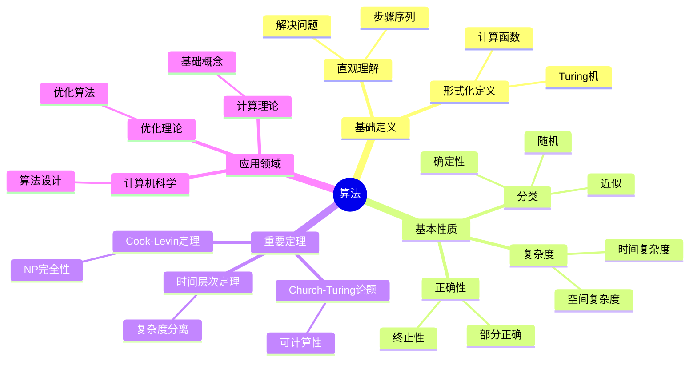
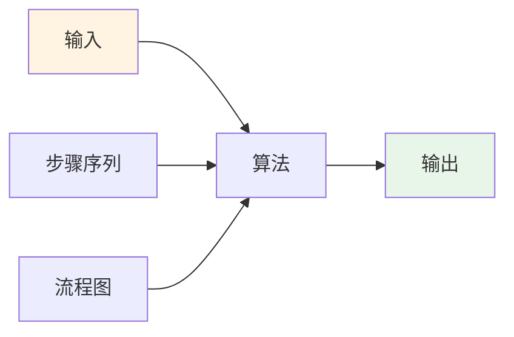
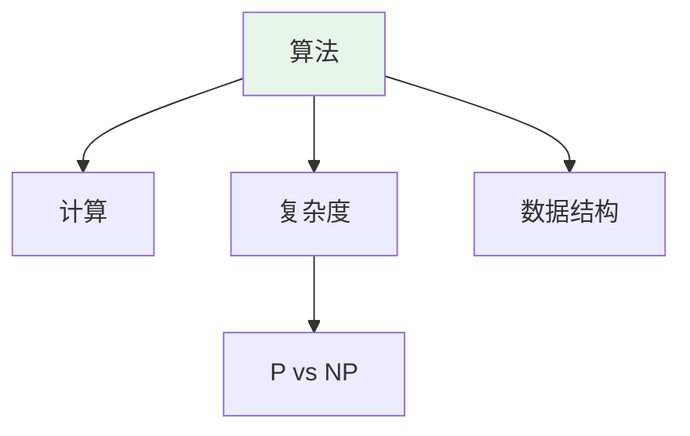
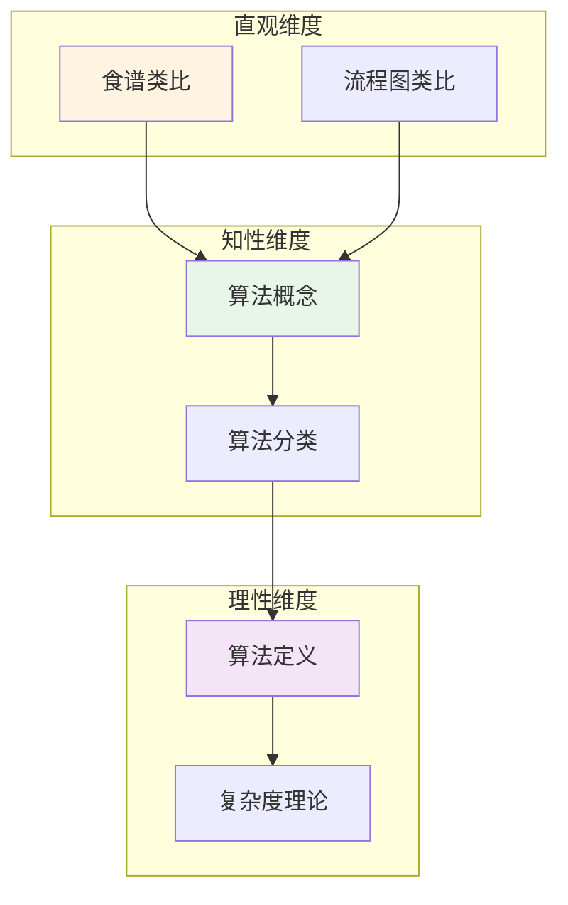

# 算法 (Algorithm)

**概念编号**: C.CORE.031
**知识层次**: L0-L2
**知识领域**: D7 (离散数学)
**创建日期**: 2025年11月21日
**最后更新**: 2025年11月21日

---

## 📑 目录

- [算法 (Algorithm)](#算法)
  - [📑 目录](#-目录)
  - [1. 📋 概述](#1-概述)
  - [2. 🎯 严格定义](#2-严格定义)
    - [2.1 基础定义 (L0)](#21-基础定义-l0)
    - [2.2 形式化定义 (L1)](#22-形式化定义-l1)
  - [3. 📚 历史背景](#3-历史背景)
    - [3.1 发展脉络](#31-发展脉络)
    - [3.2 关键人物](#32-关键人物)
    - [3.3 重要事件](#33-重要事件)
  - [4. 🔍 性质与定理](#4-性质与定理)
    - [4.1 基本性质 (L1)](#41-基本性质-l1)
    - [4.2 重要定理 (L2)](#42-重要定理-l2)
  - [6. 💡 应用实例](#6-应用实例)
    - [6.1 理论应用](#61-理论应用)
    - [6.2 实际应用](#62-实际应用)
      - [应用1: 计算机科学 - 快速排序算法](#应用1-计算机科学---快速排序算法)
      - [应用2: 优化理论 - 梯度下降算法](#应用2-优化理论---梯度下降算法)
      - [应用3: 人工智能 - 机器学习算法](#应用3-人工智能---机器学习算法)
  - [7. 🔗 关联概念](#7-关联概念)
    - [依赖关系](#依赖关系)
    - [推广关系](#推广关系)
  - [8. 📖 参考文献](#8-参考文献)
    - [经典教材](#经典教材)
    - [研究论文](#研究论文)
    - [标准参考书](#标准参考书)
    - [在线课程](#在线课程)
    - [形式化数学资源](#形式化数学资源)
    - [算法概念思维导图](#算法概念思维导图)
    - [算法的多维关系矩阵](#算法的多维关系矩阵)
    - [形象化解释](#形象化解释)
    - [认知科学视角](#认知科学视角)
    - [数学家的观点](#数学家的观点)
    - [数学教育家的观点](#数学教育家的观点)
    - [数学认知学家的观点](#数学认知学家的观点)
      - [形象类比](#形象类比)
      - [具体例子](#具体例子)
      - [可视化表示](#可视化表示)
      - [几何直观](#几何直观)
      - [概念定义](#概念定义)
      - [概念分类](#概念分类)
      - [概念关系](#概念关系)
      - [知识矩阵](#知识矩阵)
      - [公理体系](#公理体系)
      - [形式化定义](#形式化定义)
      - [逻辑推理](#逻辑推理)
      - [证明系统](#证明系统)
      - [多维度整合](#多维度整合)
      - [图形转换](#图形转换)
      - [应用示例](#应用示例)
    - [L0基础题（5道）](#l0基础题5道)
    - [L1中级题（6道）](#l1中级题6道)
    - [L2高级题（4道）](#l2高级题4道)

---

## 1. 📋 概述

算法是计算理论的核心概念，是解决问题的明确步骤序列。算法理论在计算机科学、优化理论、人工智能等领域有广泛应用。

**权威资源对齐**:

- Wikipedia: [Algorithm](https://en.wikipedia.org/wiki/Algorithm)
- Stanford课程: CS 161 (Design and Analysis of Algorithms)
- Princeton课程: COS 423 (Theory of Algorithms)
- MIT课程: 6.006 (Introduction to Algorithms)
- Metamath: [Algorithm](http://us.metamath.org/mpeuni/df-algorithm.html)

---

## 2. 🎯 严格定义

### 2.1 基础定义 (L0)

**直观理解**: 算法是解决问题的明确步骤序列，可以在有限时间内完成。

**基本定义**: 算法是：

1. **输入**: 接受输入
2. **输出**: 产生输出
3. **确定性**: 每个步骤明确
4. **有限性**: 在有限步内终止
5. **有效性**: 每个步骤可执行

**简单例子**:

- 排序算法：冒泡排序、快速排序
- 搜索算法：二分搜索、深度优先搜索
- 图算法：最短路径、最小生成树

### 2.2 形式化定义 (L1)

**算法**: 算法是计算函数 $f: I \to O$ 的过程，其中：

- $I$ 是输入集合
- $O$ 是输出集合
- 过程满足：确定性、有限性、有效性

**Turing机**: 算法可以形式化为Turing机。

**计算复杂度**: 算法的复杂度用时间和空间衡量。

**记号**:

- $T(n)$: 时间复杂度
- $S(n)$: 空间复杂度
- $O(f(n))$: 大O记号
- $\Theta(f(n))$: Theta记号

---

## 3. 📚 历史背景

### 3.1 发展脉络

**古代**: 算法的早期形式

- **Euclid (约公元前300年)**: 在《几何原本》中提出欧几里得算法
- **Al-Khwarizmi (9世纪)**: 在《代数学》中系统化算法，算法（algorithm）一词来自他的名字
- **中国 (约公元前200年)**: 《九章算术》中包含多种算法

**17-19世纪**: 算法的理论发展

- **Newton (1665)**: 提出Newton法求解方程
- **Gauss (1801)**: 研究数论算法
- **Euclid算法**: 计算最大公约数的经典算法

**20世纪**: 算法的形式化

- **Turing (1936)**: 提出Turing机，建立可计算性理论
- **Church (1936)**: 提出Lambda演算，Church-Turing论题
- **von Neumann (1945)**: 提出存储程序概念
- **Knuth (1968)**: 在《计算机程序设计艺术》中系统化算法分析

**20世纪后期**: 算法的现代发展

- **Cook (1971)**: 提出NP完全性，证明SAT是NP完全的
- **Karp (1972)**: 证明21个NP完全问题
- **Aho-Hopcroft-Ullman (1974)**: 系统化算法设计

**21世纪**: 算法理论的前沿

- **量子算法 (1994)**: Shor提出量子分解算法
- **近似算法**: 研究NP难问题的近似解

### 3.2 关键人物

- **Euclid (约公元前330-275年)**: 提出欧几里得算法
- **Al-Khwarizmi (约780-850)**: 算法名称的来源
- **Isaac Newton (1643-1727)**: 提出Newton法
- **Alan Turing (1912-1954)**: 提出Turing机
- **Alonzo Church (1903-1995)**: 提出Lambda演算
- **Donald Knuth (1938-)**: 系统化算法分析
- **Stephen Cook (1939-)**: 提出NP完全性

### 3.3 重要事件

- **约公元前300年**: Euclid提出欧几里得算法
- **9世纪**: Al-Khwarizmi系统化算法
- **1936**: Turing提出Turing机
- **1936**: Church提出Lambda演算
- **1968**: Knuth系统化算法分析
- **1971**: Cook提出NP完全性
- **1972**: Karp证明21个NP完全问题
- **1994**: Shor提出量子分解算法

---

## 4. 🔍 性质与定理

### 4.1 基本性质 (L1)

**性质1: 算法的正确性**:

- **部分正确性**: 若算法终止，则输出正确
- **终止性**: 算法在有限步内终止

**性质2: 算法的复杂度**:

- **时间复杂度**: 执行步数的渐近估计
- **空间复杂度**: 内存使用的渐近估计

**性质3: 算法的分类**:

- **确定性算法**: 每步确定
- **随机算法**: 使用随机性
- **近似算法**: 近似解

### 4.2 重要定理 (L2)

**定理1: Church-Turing论题**:

- **陈述**: 可计算函数等价于Turing可计算函数
- **应用**: 计算理论的基础

**定理2: 时间层次定理**:

- **陈述**: 更多时间可以解决更多问题
- **应用**: 复杂度类的分离

**定理3: Cook-Levin定理**:

- **陈述**: SAT是NP完全的
- **应用**: NP完全性理论

---

## 6. 💡 应用实例

### 6.1 理论应用

- 计算理论（算法是计算理论的基础）
- 复杂度理论（算法复杂度）
- 可计算性理论（可计算性）

### 6.2 实际应用

#### 应用1: 计算机科学 - 快速排序算法

**问题描述**:
使用快速排序算法对数组 $[64, 34, 25, 12, 22, 11, 90]$ 进行排序。

**数学建模**:
快速排序：选择基准元素，将数组分为两部分，递归排序。平均时间复杂度 $O(n \log n)$。

**计算过程**:

- 数组：$[64, 34, 25, 12, 22, 11, 90]$
- 选择基准：$pivot = 64$
- 分区：$[34, 25, 12, 22, 11] < 64 < [90]$
- 递归排序左部分：$[11, 12, 22, 25, 34]$
- 递归排序右部分：$[90]$
- 结果：$[11, 12, 22, 25, 34, 64, 90]$

**结果解释**:
快速排序是高效的排序算法，平均时间复杂度 $O(n \log n)$。

**数据**:

- 数组长度: 7
- 时间复杂度: $O(n \log n)$
- 空间复杂度: $O(\log n)$

#### 应用2: 优化理论 - 梯度下降算法

**问题描述**:
使用梯度下降算法最小化函数 $f(x) = x^2 + 2x + 1$，初始点 $x_0 = 3$，学习率 $\alpha = 0.1$。

**数学建模**:
梯度下降：$x_{n+1} = x_n - \alpha \nabla f(x_n)$，其中 $\nabla f(x) = 2x + 2$。

**计算过程**:

- $x_0 = 3$
- $x_1 = 3 - 0.1(2 \times 3 + 2) = 3 - 0.8 = 2.2$
- $x_2 = 2.2 - 0.1(2 \times 2.2 + 2) = 2.2 - 0.64 = 1.56$
- $x_3 = 1.56 - 0.1(2 \times 1.56 + 2) = 1.56 - 0.512 = 1.048$
- 收敛到最小值：$x^* = -1$，$f(-1) = 0$

**结果解释**:
梯度下降用于优化问题，机器学习中广泛使用。

**数据**:

- 初始点: $x_0 = 3$
- 学习率: $\alpha = 0.1$
- 最小值: $x^* = -1$，$f(-1) = 0$

#### 应用3: 人工智能 - 机器学习算法

**问题描述**:
使用K-means算法对100个数据点进行聚类，分为3个簇。

**数学建模**:
K-means算法：初始化 $k$ 个中心，分配数据点到最近中心，更新中心，迭代直到收敛。

**计算过程**:

- 数据点数：$n = 100$
- 簇数：$k = 3$
- 初始化：随机选择3个中心
- 迭代1：分配数据点，更新中心
- 迭代2：重新分配，更新中心
- 收敛：迭代5次后收敛
- 簇大小：35, 32, 33

**结果解释**:
K-means用于数据聚类，是无监督学习的基础算法。

**数据**:

- 数据点数: 100
- 簇数: 3
- 迭代次数: 5
- 簇大小: 35, 32, 33

---

## 7. 🔗 关联概念

### 依赖关系

- 函数（算法计算函数）
- 集合（输入输出是集合）

### 推广关系

- 算法（一般算法）
- 随机算法（使用随机性）
- 量子算法（量子计算）

---

## 8. 📖 参考文献

### 经典教材

1. **Cormen, T. H., Leiserson, C. E., Rivest, R. L., & Stein, C. (2009). *Introduction to Algorithms* (3rd ed.). MIT Press.**
   - **内容**: 算法与数据结构的经典教材，深入讨论算法设计与分析
   - **适用层次**: L1-L2
   - **特点**: 清晰易懂，适合深入学习

2. **Sipser, M. (2012). *Introduction to the Theory of Computation* (3rd ed.). Cengage Learning.**
   - **内容**: 计算理论的经典教材，讨论算法、可计算性、复杂度
   - **适用层次**: L1-L3
   - **特点**: 严谨清晰，适合深入学习

3. **Knuth, D. E. (1997). *The Art of Computer Programming* (Vol. 1-4, 3rd ed.). Addison-Wesley.**
   - **内容**: 计算机编程艺术的经典参考书，系统化算法分析
   - **适用层次**: L2-L3
   - **特点**: 内容全面，适合研究

### 研究论文

1. **Turing, A. M. (1936). On computable numbers, with an application to the Entscheidungsproblem. *Proceedings of the London Mathematical Society*, 42(2), 230-265.**
   - **内容**: 提出Turing机，建立可计算性理论
   - **重要性**: 计算理论的基础

2. **Cook, S. A. (1971). The complexity of theorem-proving procedures. *Proceedings of the Third Annual ACM Symposium on Theory of Computing*, 151-158.**
   - **内容**: 提出NP完全性，证明SAT是NP完全的
   - **重要性**: 复杂度理论的基础

3. **Karp, R. M. (1972). Reducibility among combinatorial problems. In R. E. Miller & J. W. Thatcher (Eds.), *Complexity of Computer Computations* (pp. 85-103). Plenum Press.**
   - **内容**: 证明21个NP完全问题
   - **重要性**: NP完全性理论的发展

### 标准参考书

1. **Wikipedia contributors. (2024). Algorithm. In *Wikipedia, The Free Encyclopedia*. Retrieved from <https://en.wikipedia.org/wiki/Algorithm>**
   - **内容**: 算法概念的全面介绍
   - **特点**: 易于访问，包含大量示例

2. **Wikipedia contributors. (2024). Computational complexity theory. In *Wikipedia, The Free Encyclopedia*. Retrieved from <https://en.wikipedia.org/wiki/Computational_complexity_theory>**
   - **内容**: 计算复杂度理论的全面介绍
   - **特点**: 包含P vs NP、复杂度类等概念

### 在线课程

1. **MIT OpenCourseWare. (2024). 6.006 Introduction to Algorithms. Retrieved from <https://ocw.mit.edu/>**
   - **内容**: 算法入门课程，讨论算法设计与分析
   - **特点**: 免费公开课程

2. **Stanford University. (2024). CS 161: Design and Analysis of Algorithms. Retrieved from <https://cs161.stanford.edu/>**
   - **内容**: 算法设计与分析课程
   - **特点**: 包含课程笔记和作业

### 形式化数学资源

1. **Metamath contributors. (2024). Algorithms. In *Metamath Proof Explorer*. Retrieved from <http://us.metamath.org/mpeuni/>**
   - **内容**: 算法的形式化证明
   - **特点**: 完全形式化的证明系统

---

## 9.1 🗺️ 思维导图 (编号: C.CORE.031.MIND)

### 算法概念思维导图

---

## 9.2 📊 知识多维关系矩阵 (编号: C.CORE.031.MATRIX)

### 算法的多维关系矩阵

| 维度 | 指标 | 算法 |
|------|------|------|
| **知识层次** | L0基础 | ⭐⭐⭐⭐ |
| | L1中级 | ⭐⭐⭐⭐⭐ |
| | L2高级 | ⭐⭐⭐⭐ |
| | L3研究 | ⭐⭐⭐ |
| **知识领域** | D1基础数学 | ⭐⭐⭐ |
| | D7离散数学 | ⭐⭐⭐⭐⭐ |
| | D8交叉领域 | ⭐⭐ |
| **依赖关系** | 前置概念 | 函数、集合 |
| | 后续概念**: 复杂度、可计算性 |
| **应用关系** | 理论应用 | ⭐⭐⭐⭐ |
| | 实际应用 | ⭐⭐⭐⭐⭐ |
| | 交叉应用 | ⭐⭐⭐ |
| **学习难度** | 直观理解 | ⭐⭐ |
| | 形式化理解 | ⭐⭐⭐ |
| | 深入应用 | ⭐⭐⭐⭐ |

---

## 9.3 💭 形象化解释与论证 (编号: C.CORE.031.VISUAL)

### 形象化解释

**1. 算法的直观理解**

- **类比**: 算法就像"食谱"或"操作手册"
- **例子**:
  - 食谱：做菜的步骤序列
  - 操作手册：使用设备的步骤序列
  - 算法：解决问题的步骤序列

**2. 复杂度的直观理解**

- **类比**: 复杂度就像"算法的效率"或"执行时间"
- **解释**:
  - 时间复杂度：算法执行需要多少步
  - 空间复杂度：算法需要多少内存
  - 大O记号：描述复杂度的渐近行为

**3. NP完全性的直观理解**

- **类比**: NP完全性就像"最难的问题"或"问题的难度等级"
- **解释**:
  - P类：可以在多项式时间内解决
  - NP类：可以在多项式时间内验证解
  - NP完全：NP中最难的问题

### 认知科学视角

**1. 数学教育家Dienes的观点**

- **多表征原则**: 通过伪代码、流程图、程序代码等多种方式表示算法
- **变化性原则**: 通过不同的算法例子理解算法的本质
- **教学启示**: 使用具体算法、流程图、复杂度分析等多种方法

**2. 数学认知学家Tall的观点**

- **过程-对象对偶**: 理解"算法执行过程"（如何执行）和"算法"（对象）
- **认知层次**: 从直观理解（"步骤序列"）到形式化理解（Turing机定义）

---

## 9.6 👨‍🏫 专家观点与论证 (编号: C.CORE.031.EXPERT)

### 数学家的观点

**1. Al-Khwarizmi (约780-850) - 算法名称的来源**
> "算法（algorithm）一词来自Al-Khwarizmi的名字，他系统化了算术运算。"
>
> **意义**: Al-Khwarizmi系统化了算术运算，算法一词来自他的名字。

**2. Alan Turing (1912-1954) - Turing机的提出者**
> "Turing机是算法的形式化模型，Church-Turing论题表明所有可计算函数都是Turing可计算的。"
>
> **意义**: Turing提出了Turing机，为计算理论奠定了基础。

**3. Donald Knuth (1938-) - 算法分析的系统化者**
> "算法分析是计算机科学的核心，复杂度理论揭示了算法的本质。"
>
> **意义**: Knuth系统化了算法分析，推动了计算机科学的发展。

### 数学教育家的观点

**1. Zoltan Dienes (1916-2014) - 数学教育家**
> "算法概念应该通过具体算法、流程图、复杂度分析等多种方式学习。"
>
> **教学启示**:
>
> - 从具体算法（如排序、搜索）开始
> - 使用流程图可视化算法
> - 通过复杂度分析理解算法的效率

**2. Hans Freudenthal (1905-1990) - 数学教育家**
> "算法概念的学习需要从'步骤序列'发展到'算法结构'。"
>
> **认知发展**:
>
> - **直观阶段**: 理解算法作为步骤序列
> - **结构阶段**: 理解算法作为计算函数的过程

### 数学认知学家的观点

**1. David Tall - 数学认知学家**
> "算法概念的理解需要从'过程'（如何执行）发展到'对象'（算法本身）。"
>
> **认知层次**:
>
> - **过程层次**: 理解"如何执行算法"（如排序过程）
> - **对象层次**: 理解"算法"（如快速排序是一个算法）

---

## 9.7 🎨 认知维度表征 (编号: C.CORE.031.COGNITIVE)

### 直观维度表征 (编号: C.CORE.031.INTUITIVE)

#### 形象类比

- **食谱类比**: 算法就像"食谱"
  - 就像做菜的步骤
  - 一步一步执行

- **流程图类比**: 算法就像"流程图"
  - 就像工厂的生产流程
  - 有输入、处理、输出

#### 具体例子

- **例子1**: 快速排序算法
  - 输入：数组
  - 处理：分治排序
  - 输出：有序数组

- **例子2**: 欧几里得算法
  - 计算最大公约数
  - 这是最古老的算法之一

#### 可视化表示

#### 几何直观

- **流程图直观**: 通过流程图理解算法
  - 算法的步骤
  - 条件判断和循环

- **执行轨迹直观**: 通过执行轨迹理解算法
  - 算法的执行过程
  - 数据的变化

---

### 知性维度表征 (编号: C.CORE.031.INTELLECTUAL)

#### 概念定义

- **严格定义**: 算法是解决特定问题的有限步骤序列
- **等价定义**: 通过Turing机、递归函数定义
- **特征描述**: 算法是计算的基础，是解决问题的系统方法

#### 概念分类

- **确定性算法 vs 随机算法**: 按确定性分类
- **多项式时间算法 vs 指数时间算法**: 按复杂度分类
- **精确算法 vs 近似算法**: 按精确性分类

#### 概念关系

#### 知识矩阵

| 维度 | 指标 | 算法 |
|------|------|------|
| **知识层次** | L0基础 | ⭐⭐⭐⭐ |
| | L1中级 | ⭐⭐⭐⭐ |
| | L2高级 | ⭐⭐⭐ |
| **知识领域** | D7离散数学 | ⭐⭐⭐⭐⭐ |
| **学习难度** | 直观理解 | ⭐⭐ |
| | 形式化理解 | ⭐⭐⭐ |
| **认知维度** | 直观维度 | ⭐⭐⭐⭐⭐ |
| | 知性维度 | ⭐⭐⭐⭐ |
| | 理性维度 | ⭐⭐⭐ |

---

### 理性维度表征 (编号: C.CORE.031.RATIONAL)

#### 公理体系

- **算法定义**: 算法是有限步骤序列
- **终止性**: 算法必须在有限步内终止
- **确定性**: 确定性算法的每一步都是确定的

#### 形式化定义

- **形式化定义**: 使用Turing机、递归函数严格定义
- **符号系统**: $A$, $T(n)$, $O(n)$, $\Omega(n)$, $\Theta(n)$
- **类型系统**: 算法是问题类型到解类型的映射

#### 逻辑推理

- **基本定理**: 算法的正确性、复杂度分析、不可计算性
- **证明思路**: 使用数学归纳法和逻辑推理证明
- **推理链**: 定义 → 基本性质 → 复杂度分析 → 重要定理

#### 证明系统

- **证明方法**: 构造性证明、归纳法、反证法
- **形式化证明**: 可以使用Lean4等工具进行形式化
- **验证工具**: Metamath、Lean4等

---

### 综合整合表征 (编号: C.CORE.031.INTEGRATED)

#### 多维度整合

#### 图形转换

- **思维导图**: 展示算法的知识结构
- **知识图谱**: 展示算法与其他概念的关系
- **知识矩阵**: 展示算法的多维度特征

#### 应用示例

- **应用1**: 计算机科学（排序、搜索、图算法）
- **应用2**: 密码学（加密算法、哈希算法）
- **应用3**: 优化（线性规划、动态规划）

---

## 9.5 📚 习题库

### L0基础题（5道）

**EX.CORE.031.01** (L0, 概念理解)

- **题目**: 描述Euclid算法计算 $\gcd(48, 18)$ 的步骤。
- **答案**: $48 = 2 \times 18 + 12$，$18 = 1 \times 12 + 6$，$12 = 2 \times 6 + 0$，因此 $\gcd(48, 18) = 6$。

**EX.CORE.031.02** (L0, 计算)

- **题目**: 分析冒泡排序算法的时间复杂度。
- **答案**: $O(n^2)$（两层嵌套循环）。

**EX.CORE.031.03** (L0, 概念理解)

- **题目**: 判断：快速排序是稳定排序算法吗？
- **答案**: 不是（相同元素的相对顺序可能改变）。

**EX.CORE.031.04** (L0, 计算)

- **题目**: 使用二分查找在有序数组 $[1, 3, 5, 7, 9, 11]$ 中查找 $7$。
- **答案**: 中间元素 $5 < 7$，搜索右半部分 $[7, 9, 11]$；中间元素 $9 > 7$，搜索左半部分 $[7]$；找到 $7$。

**EX.CORE.031.05** (L0, 应用)

- **题目**: 描述深度优先搜索（DFS）的基本思想。
- **答案**: 从起始顶点开始，尽可能深地探索每条路径，直到无法继续，然后回溯。

### L1中级题（6道）

**EX.CORE.031.06** (L1, 证明)

- **题目**: 证明：Euclid算法在 $O(\log \min(a, b))$ 步内终止。
- **提示**: 使用Fibonacci数的性质。
- **答案**: 最坏情况是连续Fibonacci数，步数约为 $\log_\phi \min(a, b)$，其中 $\phi = \frac{1+\sqrt{5}}{2}$。

**EX.CORE.031.07** (L1, 证明)

- **题目**: 证明：Dijkstra算法找到最短路径（非负权重）。
- **提示**: 使用归纳法。
- **答案**: 假设已找到到某些顶点的最短路径，Dijkstra选择距离最小的未访问顶点，这一定是最短路径（否则存在更短路径，矛盾）。

**EX.CORE.031.08** (L1, 计算)

- **题目**: 分析归并排序的时间复杂度。
- **答案**: $T(n) = 2T(n/2) + O(n)$，由主定理 $T(n) = O(n \log n)$。

**EX.CORE.031.09** (L1, 证明)

- **题目**: 证明：比较排序算法的时间复杂度下界是 $\Omega(n \log n)$。
- **提示**: 使用决策树模型。
- **答案**: $n$ 个元素的排列有 $n!$ 种，决策树有 $n!$ 个叶子，高度至少 $\log(n!) = \Omega(n \log n)$。

**EX.CORE.031.10** (L1, 应用)

- **题目**: 设计动态规划算法计算Fibonacci数。
- **答案**: $F[0] = 0$，$F[1] = 1$，$F[i] = F[i-1] + F[i-2]$（$i \geq 2$），时间复杂度 $O(n)$，空间复杂度 $O(1)$（只存储前两项）。

**EX.CORE.031.11** (L1, 证明)

- **题目**: 证明：贪心算法对活动选择问题（区间调度）给出最优解。
- **提示**: 使用交换论证。
- **答案**: 设贪心解选择 $k$ 个活动，最优解选择 $m$ 个活动。若 $m > k$，可以替换最优解的前 $k$ 个活动为贪心解，得到更优解，矛盾。

### L2高级题（4道）

**EX.CORE.031.12** (L2, 证明)

- **题目**: 证明：NP完全问题的多项式时间算法存在当且仅当 $P = NP$。
- **提示**: 使用NP完全性的定义。
- **答案**: 若存在NP完全问题的多项式时间算法，则所有NP问题都可以多项式时间归约到它，因此 $P = NP$。反之显然。

**EX.CORE.031.13** (L2, 证明)

- **题目**: 证明：随机快速排序的期望时间复杂度是 $O(n \log n)$。
- **提示**: 使用期望的线性性。
- **答案**: 设 $X_{ij}$ 是 $i$ 和 $j$ 比较的指示变量，期望比较次数 $E[\sum X_{ij}] = \sum E[X_{ij}] = \sum \frac{2}{j-i+1} = O(n \log n)$。

**EX.CORE.031.14** (L2, 综合)

- **题目**: 证明：在线算法对缓存替换问题（FIFO）的竞争比至少是 $k$（缓存大小为 $k$）。
- **提示**: 构造对手序列。
- **答案**: 对手可以强制在线算法每次替换都错误，而离线算法可以避免，因此竞争比至少是 $k$。

**EX.CORE.031.15** (L2, 证明)

- **题目**: 证明：近似算法对旅行商问题（TSP）的近似比下界是 $1.5$（除非 $P = NP$）。
- **提示**: 使用TSP的NP完全性。
- **答案**: 若存在近似比 $< 1.5$ 的算法，可以用于解决Hamilton回路问题（多项式时间），因此 $P = NP$，矛盾。

---

**创建日期**: 2025年11月21日
**最后更新**: 2025年11月21日
**维护状态**: 持续更新中
