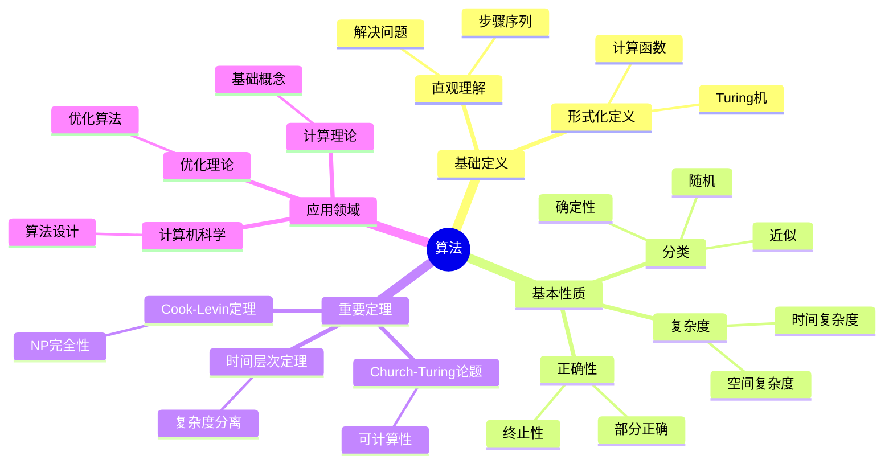
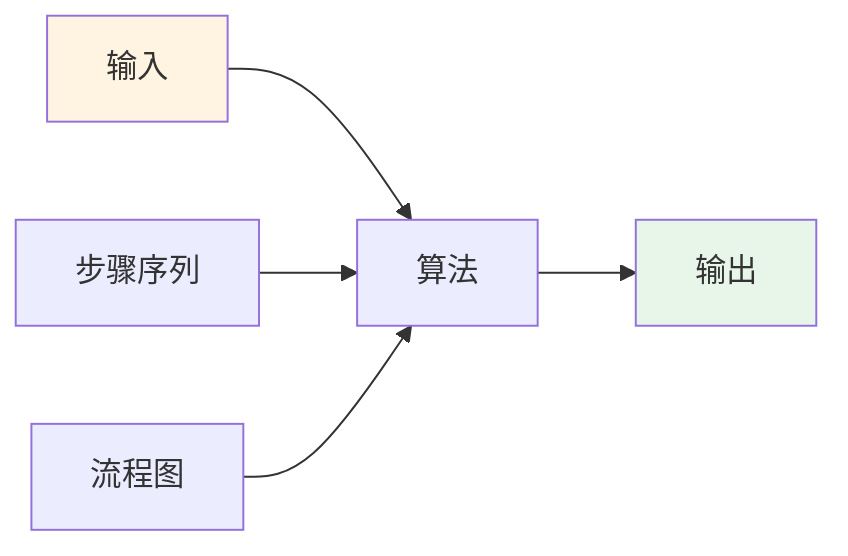
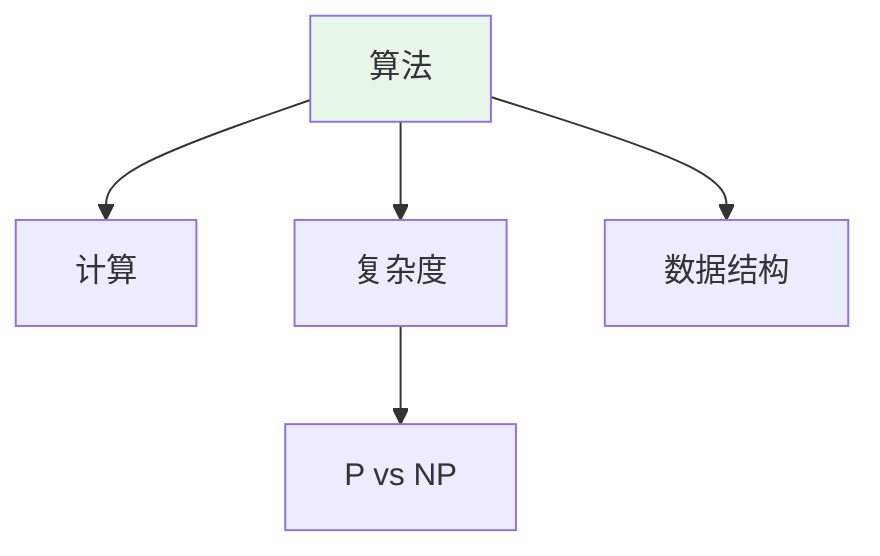
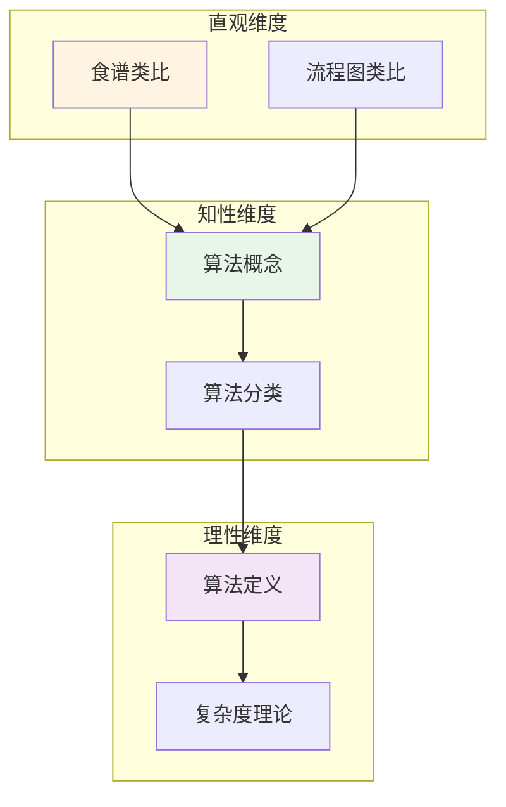

# 算法 (Algorithm)

**概念编号**: C.CORE.031
**知识层次**: L0-L2
**知识领域**: D7 (离散数学)
**创建日期**: 2025年11月21日
**最后更新**: 2025年11月21日

---

## 📋 概述

算法是计算理论的核心概念，是解决问题的明确步骤序列。算法理论在计算机科学、优化理论、人工智能等领域有广泛应用。

**权威资源对齐**:

- Wikipedia: [Algorithm](https://en.wikipedia.org/wiki/Algorithm)
- Stanford课程: CS 161 (Design and Analysis of Algorithms)
- Princeton课程: COS 423 (Theory of Algorithms)
- MIT课程: 6.006 (Introduction to Algorithms)
- Metamath: [Algorithm](http://us.metamath.org/mpeuni/df-algorithm.html)

---

## 🎯 严格定义

### 基础定义 (L0)

**直观理解**: 算法是解决问题的明确步骤序列，可以在有限时间内完成。

**基本定义**: 算法是：

1. **输入**: 接受输入
2. **输出**: 产生输出
3. **确定性**: 每个步骤明确
4. **有限性**: 在有限步内终止
5. **有效性**: 每个步骤可执行

**简单例子**:

- 排序算法：冒泡排序、快速排序
- 搜索算法：二分搜索、深度优先搜索
- 图算法：最短路径、最小生成树

### 形式化定义 (L1)

**算法**: 算法是计算函数 $f: I \to O$ 的过程，其中：

- $I$ 是输入集合
- $O$ 是输出集合
- 过程满足：确定性、有限性、有效性

**Turing机**: 算法可以形式化为Turing机。

**计算复杂度**: 算法的复杂度用时间和空间衡量。

**记号**:

- $T(n)$: 时间复杂度
- $S(n)$: 空间复杂度
- $O(f(n))$: 大O记号
- $\Theta(f(n))$: Theta记号

---

## 📚 历史背景

### 发展脉络

**古代**: 算法的早期形式

- **Euclid (约公元前300年)**: 欧几里得算法
- **Al-Khwarizmi (9世纪)**: 算法名称的来源

**20世纪**: 算法的形式化

- **Turing (1936)**: 提出Turing机
- **Church (1936)**: 提出Lambda演算
- **Knuth (1968)**: 系统化算法分析

**20世纪后期**: 算法的现代发展

- **Cook (1971)**: 提出NP完全性
- **Karp (1972)**: 证明21个NP完全问题

### 关键人物

- **Al-Khwarizmi (约780-850)**: 算法名称的来源
- **Alan Turing (1912-1954)**: 提出Turing机
- **Donald Knuth (1938-)**: 系统化算法分析

---

## 🔍 性质与定理

### 基本性质 (L1)

**性质1: 算法的正确性**:

- **部分正确性**: 若算法终止，则输出正确
- **终止性**: 算法在有限步内终止

**性质2: 算法的复杂度**:

- **时间复杂度**: 执行步数的渐近估计
- **空间复杂度**: 内存使用的渐近估计

**性质3: 算法的分类**:

- **确定性算法**: 每步确定
- **随机算法**: 使用随机性
- **近似算法**: 近似解

### 重要定理 (L2)

**定理1: Church-Turing论题**:

- **陈述**: 可计算函数等价于Turing可计算函数
- **应用**: 计算理论的基础

**定理2: 时间层次定理**:

- **陈述**: 更多时间可以解决更多问题
- **应用**: 复杂度类的分离

**定理3: Cook-Levin定理**:

- **陈述**: SAT是NP完全的
- **应用**: NP完全性理论

---

## 💡 应用实例

### 理论应用

- 计算理论（算法是计算理论的基础）
- 复杂度理论（算法复杂度）
- 可计算性理论（可计算性）

### 实际应用

- 计算机科学（算法设计）
- 优化理论（优化算法）
- 人工智能（机器学习算法）

---

## 🔗 关联概念

### 依赖关系

- 函数（算法计算函数）
- 集合（输入输出是集合）

### 推广关系

- 算法（一般算法）
- 随机算法（使用随机性）
- 量子算法（量子计算）

---

## 📖 参考文献

- Wikipedia: [Algorithm](https://en.wikipedia.org/wiki/Algorithm)
- Cormen, T. H., et al. (2009). *Introduction to Algorithms*. MIT Press.
- Sipser, M. (2012). *Introduction to the Theory of Computation*. Cengage Learning.

---

## 🗺️ 思维导图 (编号: C.CORE.031.MIND)

### 算法概念思维导图

---

## 📊 知识多维关系矩阵 (编号: C.CORE.031.MATRIX)

### 算法的多维关系矩阵

| 维度 | 指标 | 算法 |
|------|------|------|
| **知识层次** | L0基础 | ⭐⭐⭐⭐ |
| | L1中级 | ⭐⭐⭐⭐⭐ |
| | L2高级 | ⭐⭐⭐⭐ |
| | L3研究 | ⭐⭐⭐ |
| **知识领域** | D1基础数学 | ⭐⭐⭐ |
| | D7离散数学 | ⭐⭐⭐⭐⭐ |
| | D8交叉领域 | ⭐⭐ |
| **依赖关系** | 前置概念 | 函数、集合 |
| | 后续概念**: 复杂度、可计算性 |
| **应用关系** | 理论应用 | ⭐⭐⭐⭐ |
| | 实际应用 | ⭐⭐⭐⭐⭐ |
| | 交叉应用 | ⭐⭐⭐ |
| **学习难度** | 直观理解 | ⭐⭐ |
| | 形式化理解 | ⭐⭐⭐ |
| | 深入应用 | ⭐⭐⭐⭐ |

---

## 💭 形象化解释与论证 (编号: C.CORE.031.VISUAL)

### 形象化解释

**1. 算法的直观理解**

- **类比**: 算法就像"食谱"或"操作手册"
- **例子**:
  - 食谱：做菜的步骤序列
  - 操作手册：使用设备的步骤序列
  - 算法：解决问题的步骤序列

**2. 复杂度的直观理解**

- **类比**: 复杂度就像"算法的效率"或"执行时间"
- **解释**:
  - 时间复杂度：算法执行需要多少步
  - 空间复杂度：算法需要多少内存
  - 大O记号：描述复杂度的渐近行为

**3. NP完全性的直观理解**

- **类比**: NP完全性就像"最难的问题"或"问题的难度等级"
- **解释**:
  - P类：可以在多项式时间内解决
  - NP类：可以在多项式时间内验证解
  - NP完全：NP中最难的问题

### 认知科学视角

**1. 数学教育家Dienes的观点**

- **多表征原则**: 通过伪代码、流程图、程序代码等多种方式表示算法
- **变化性原则**: 通过不同的算法例子理解算法的本质
- **教学启示**: 使用具体算法、流程图、复杂度分析等多种方法

**2. 数学认知学家Tall的观点**

- **过程-对象对偶**: 理解"算法执行过程"（如何执行）和"算法"（对象）
- **认知层次**: 从直观理解（"步骤序列"）到形式化理解（Turing机定义）

---

## 👨‍🏫 专家观点与论证 (编号: C.CORE.031.EXPERT)

### 数学家的观点

**1. Al-Khwarizmi (约780-850) - 算法名称的来源**
> "算法（algorithm）一词来自Al-Khwarizmi的名字，他系统化了算术运算。"
>
> **意义**: Al-Khwarizmi系统化了算术运算，算法一词来自他的名字。

**2. Alan Turing (1912-1954) - Turing机的提出者**
> "Turing机是算法的形式化模型，Church-Turing论题表明所有可计算函数都是Turing可计算的。"
>
> **意义**: Turing提出了Turing机，为计算理论奠定了基础。

**3. Donald Knuth (1938-) - 算法分析的系统化者**
> "算法分析是计算机科学的核心，复杂度理论揭示了算法的本质。"
>
> **意义**: Knuth系统化了算法分析，推动了计算机科学的发展。

### 数学教育家的观点

**1. Zoltan Dienes (1916-2014) - 数学教育家**
> "算法概念应该通过具体算法、流程图、复杂度分析等多种方式学习。"
>
> **教学启示**:
>
> - 从具体算法（如排序、搜索）开始
> - 使用流程图可视化算法
> - 通过复杂度分析理解算法的效率

**2. Hans Freudenthal (1905-1990) - 数学教育家**
> "算法概念的学习需要从'步骤序列'发展到'算法结构'。"
>
> **认知发展**:
>
> - **直观阶段**: 理解算法作为步骤序列
> - **结构阶段**: 理解算法作为计算函数的过程

### 数学认知学家的观点

**1. David Tall - 数学认知学家**
> "算法概念的理解需要从'过程'（如何执行）发展到'对象'（算法本身）。"
>
> **认知层次**:
>
> - **过程层次**: 理解"如何执行算法"（如排序过程）
> - **对象层次**: 理解"算法"（如快速排序是一个算法）

---

## 🎨 认知维度表征 (编号: C.CORE.031.COGNITIVE)

### 直观维度表征 (编号: C.CORE.031.INTUITIVE)

#### 形象类比

- **食谱类比**: 算法就像"食谱"
  - 就像做菜的步骤
  - 一步一步执行

- **流程图类比**: 算法就像"流程图"
  - 就像工厂的生产流程
  - 有输入、处理、输出

#### 具体例子

- **例子1**: 快速排序算法
  - 输入：数组
  - 处理：分治排序
  - 输出：有序数组

- **例子2**: 欧几里得算法
  - 计算最大公约数
  - 这是最古老的算法之一

#### 可视化表示

#### 几何直观

- **流程图直观**: 通过流程图理解算法
  - 算法的步骤
  - 条件判断和循环

- **执行轨迹直观**: 通过执行轨迹理解算法
  - 算法的执行过程
  - 数据的变化

---

### 知性维度表征 (编号: C.CORE.031.INTELLECTUAL)

#### 概念定义

- **严格定义**: 算法是解决特定问题的有限步骤序列
- **等价定义**: 通过Turing机、递归函数定义
- **特征描述**: 算法是计算的基础，是解决问题的系统方法

#### 概念分类

- **确定性算法 vs 随机算法**: 按确定性分类
- **多项式时间算法 vs 指数时间算法**: 按复杂度分类
- **精确算法 vs 近似算法**: 按精确性分类

#### 概念关系

#### 知识矩阵

| 维度 | 指标 | 算法 |
|------|------|------|
| **知识层次** | L0基础 | ⭐⭐⭐⭐ |
| | L1中级 | ⭐⭐⭐⭐ |
| | L2高级 | ⭐⭐⭐ |
| **知识领域** | D7离散数学 | ⭐⭐⭐⭐⭐ |
| **学习难度** | 直观理解 | ⭐⭐ |
| | 形式化理解 | ⭐⭐⭐ |
| **认知维度** | 直观维度 | ⭐⭐⭐⭐⭐ |
| | 知性维度 | ⭐⭐⭐⭐ |
| | 理性维度 | ⭐⭐⭐ |

---

### 理性维度表征 (编号: C.CORE.031.RATIONAL)

#### 公理体系

- **算法定义**: 算法是有限步骤序列
- **终止性**: 算法必须在有限步内终止
- **确定性**: 确定性算法的每一步都是确定的

#### 形式化定义

- **形式化定义**: 使用Turing机、递归函数严格定义
- **符号系统**: $A$, $T(n)$, $O(n)$, $\Omega(n)$, $\Theta(n)$
- **类型系统**: 算法是问题类型到解类型的映射

#### 逻辑推理

- **基本定理**: 算法的正确性、复杂度分析、不可计算性
- **证明思路**: 使用数学归纳法和逻辑推理证明
- **推理链**: 定义 → 基本性质 → 复杂度分析 → 重要定理

#### 证明系统

- **证明方法**: 构造性证明、归纳法、反证法
- **形式化证明**: 可以使用Lean4等工具进行形式化
- **验证工具**: Metamath、Lean4等

---

### 综合整合表征 (编号: C.CORE.031.INTEGRATED)

#### 多维度整合

#### 图形转换

- **思维导图**: 展示算法的知识结构
- **知识图谱**: 展示算法与其他概念的关系
- **知识矩阵**: 展示算法的多维度特征

#### 应用示例

- **应用1**: 计算机科学（排序、搜索、图算法）
- **应用2**: 密码学（加密算法、哈希算法）
- **应用3**: 优化（线性规划、动态规划）

---

**创建日期**: 2025年11月21日
**最后更新**: 2025年11月21日
**维护状态**: 持续更新中
