---
msc_primary: "00A99"
---

# 算法 (Algorithm) - 三视角组织版

**概念编号**: C.CORE.031
**知识层次**: L0-L2
**知识领域**: D7 (离散数学)
**创建日期**: 2025年1月
**最后更新**: 2026-04-05

---

## 📋 目录 / Table of Contents

- [算法 (Algorithm) - 三视角组织版](#算法-algorithm---三视角组织版)
  - 📋 目录 / Table of Contents
  - 1. 📋 概述 (编号: C.CORE.031.01)
  - 🧠 认知学视角：如何理解算法 (编号: C.CORE.031.02)
    - [认知起点 (编号: C.CORE.031.02.01)](#认知起点-编号-ccore0310201)
    - [认知过程 (编号: C.CORE.031.02.02)](#认知过程-编号-ccore0310202)
      - [阶段1：直观理解阶段 (编号: C.CORE.031.02.02.01)](#阶段1直观理解阶段-编号-ccore031020201)
      - [阶段2：概念形成阶段 (编号: C.CORE.031.02.02.02)](#阶段2概念形成阶段-编号-ccore031020202)
      - [阶段3：形式化阶段 (编号: C.CORE.031.02.02.03)](#阶段3形式化阶段-编号-ccore031020203)

## 形式化定义

**定义（算法）**：**算法**是解决问题的明确、有限的步骤序列，具有以下性质：
1. **有穷性**：在有限步骤后终止
2. **确定性**：每条指令无歧义
3. **输入**：有零个或多个输入
4. **输出**：至少有一个输出
5. **可行性**：每条指令可执行

**复杂度**：
- **时间复杂度** $T(n)$：对输入规模 $n$ 所需基本操作数
- **空间复杂度** $S(n)$：对输入规模 $n$ 所需存储空间

**符号说明**：
- $O(f(n))$：大O记号（上界）
- $\Omega(f(n))$：大Omega记号（下界）
- $\Theta(f(n))$：大Theta记号（紧确界）
- $P$：多项式时间可解问题类
- $NP$：多项式时间可验证问题类

    - [认知障碍 (编号: C.CORE.031.02.03)](#认知障碍-编号-ccore0310203)
    - [认知工具 (编号: C.CORE.031.02.04)](#认知工具-编号-ccore0310204)
  - 🎓 教育学视角：如何教学算法 (编号: C.CORE.031.03)
    - [教学目标 (编号: C.CORE.031.03.01)](#教学目标-编号-ccore0310301)
    - [教学路径 (编号: C.CORE.031.03.02)](#教学路径-编号-ccore0310302)
      - [阶段1：引入阶段（激发兴趣） (编号: C.CORE.031.03.02.01)](#阶段1引入阶段激发兴趣-编号-ccore031030201)
      - [阶段2：探索阶段（主动建构） (编号: C.CORE.031.03.02.02)](#阶段2探索阶段主动建构-编号-ccore031030202)
      - [阶段3：形式化阶段（抽象概括） (编号: C.CORE.031.03.02.03)](#阶段3形式化阶段抽象概括-编号-ccore031030203)
      - [阶段4：巩固阶段（应用深化） (编号: C.CORE.031.03.02.04)](#阶段4巩固阶段应用深化-编号-ccore031030204)
    - [教学难点 (编号: C.CORE.031.03.03)](#教学难点-编号-ccore0310303)
    - [教学策略 (编号: C.CORE.031.03.04)](#教学策略-编号-ccore0310304)
    - [评估方法 (编号: C.CORE.031.03.05)](#评估方法-编号-ccore0310305)
  - 🔬 数学家视角：如何思考算法 (编号: C.CORE.031.04)
    - [问题起源 (编号: C.CORE.031.04.01)](#问题起源-编号-ccore0310401)
    - [思维过程 (编号: C.CORE.031.04.02)](#思维过程-编号-ccore0310402)
      - [步骤1：问题提出 (编号: C.CORE.031.04.02.01)](#步骤1问题提出-编号-ccore031040201)
      - [步骤2：概念形成 (编号: C.CORE.031.04.02.02)](#步骤2概念形成-编号-ccore031040202)
      - [步骤3：理论发展 (编号: C.CORE.031.04.02.03)](#步骤3理论发展-编号-ccore031040203)
    - [历史发展 (编号: C.CORE.031.04.03)](#历史发展-编号-ccore0310403)
    - [3.2 关键人物和贡献 (编号: C.CORE.031.04.04)](#32-关键人物和贡献-编号-ccore0310404)
    - [重要定理 (编号: C.CORE.031.04.05)](#重要定理-编号-ccore0310405)
    - [开放问题 (编号: C.CORE.031.04.06)](#开放问题-编号-ccore0310406)
    - [一、第一人称思维描述 (编号: C.CORE.031.04.07)](#一第一人称思维描述-编号-ccore0310407)
      - [1.1 Turing的发现过程](#11-turing的发现过程)
    - [二、数学直觉的形成 (编号: C.CORE.031.04.08)](#二数学直觉的形成-编号-ccore0310408)
      - [2.1 直觉在概念发现中的作用](#21-直觉在概念发现中的作用)
      - [2.2 如何培养算法直觉](#22-如何培养算法直觉)
    - [三、数学美的教育价值 (编号: C.CORE.031.04.09)](#三数学美的教育价值-编号-ccore0310409)
      - [3.1 算法论的美在哪里](#31-算法论的美在哪里)
      - [3.2 如何培养学生的数学美感](#32-如何培养学生的数学美感)
    - [四、问题解决策略 (编号: C.CORE.031.04.10)](#四问题解决策略-编号-ccore0310410)
      - [4.1 数学家的启发式方法](#41-数学家的启发式方法)
      - [4.2 思维过程分析](#42-思维过程分析)
    - [五、批判性反思 (编号: C.CORE.031.04.11)](#五批判性反思-编号-ccore0310411)
      - [5.1 算法概念的局限性](#51-算法概念的局限性)
      - [5.2 算法理论的未解决问题](#52-算法理论的未解决问题)
  - 💡 数学解释：为什么算法是这样定义的 (编号: C.CORE.031.05)
    - [一、直观解释：算法是什么？](#一直观解释算法是什么)
      - [1.1 具体例子](#11-具体例子)
      - [1.2 形象类比](#12-形象类比)
      - [1.3 几何直观](#13-几何直观)
      - [1.4 操作体验](#14-操作体验)
    - [二、知性解释：算法的本质是什么？](#二知性解释算法的本质是什么)
      - [2.1 概念定义](#21-概念定义)
      - [2.2 分类体系](#22-分类体系)
      - [2.3 抽象结构](#23-抽象结构)
      - [2.4 知识体系](#24-知识体系)
    - [三、理性解释：算法的公理化定义](#三理性解释算法的公理化定义)
      - [3.1 公理体系](#31-公理体系)
      - [3.2 形式化证明](#32-形式化证明)
        - [定理1：Euclid算法的正确性](#定理1euclid算法的正确性)
        - [定理2：Euclid算法的终止性](#定理2euclid算法的终止性)
        - [定理3：算法的复杂度分析](#定理3算法的复杂度分析)
      - [3.3 系统建构](#33-系统建构)
    - [四、多视角解释：从不同角度理解算法](#四多视角解释从不同角度理解算法)
      - [4.1 数学家视角：算法是如何被发现的？](#41-数学家视角算法是如何被发现的)
      - [4.2 教育者视角：如何教学算法？](#42-教育者视角如何教学算法)
      - [4.3 学习者视角：如何学习算法？](#43-学习者视角如何学习算法)
      - [4.4 应用者视角：如何应用算法？](#44-应用者视角如何应用算法)
    - [五、思维表征：用多种方式理解算法](#五思维表征用多种方式理解算法)
      - [5.1 思维导图：算法的知识结构](#51-思维导图算法的知识结构)
      - [5.2 矩阵对比：不同解释方式的对比](#52-矩阵对比不同解释方式的对比)
      - [5.3 多视角表征：从不同角度表征算法](#53-多视角表征从不同角度表征算法)
      - [5.4 决策树：算法问题分类和策略选择](#54-决策树算法问题分类和策略选择)
      - [5.5 决策逻辑路径：算法问题解决过程](#55-决策逻辑路径算法问题解决过程)
      - [5.6 多维对比矩阵：算法概念特征对比](#56-多维对比矩阵算法概念特征对比)
  - 🔍 数学论证：如何论证算法 (编号: C.CORE.031.06)
    - [一、论证过程：从观察到反思](#一论证过程从观察到反思)
      - [1.1 观察（Observation）](#11-观察observation)
      - [1.2 猜想（Conjecture）](#12-猜想conjecture)
      - [1.3 证明（Proof）](#13-证明proof)
      - [1.4 反思（Reflection）](#14-反思reflection)
    - [二、论证类型：多种推理方式](#二论证类型多种推理方式)
      - [2.1 归纳论证（Inductive Reasoning）](#21-归纳论证inductive-reasoning)
      - [2.2 演绎论证（Deductive Reasoning）](#22-演绎论证deductive-reasoning)
      - [2.3 类比论证（Analogical Reasoning）](#23-类比论证analogical-reasoning)
      - [2.4 构造论证（Constructive Reasoning）](#24-构造论证constructive-reasoning)
    - [三、论证可视化：用图形表示论证过程](#三论证可视化用图形表示论证过程)
      - [3.1 论证流程图](#31-论证流程图)
      - [3.2 论证类型对比](#32-论证类型对比)
      - [3.3 论证思维导图](#33-论证思维导图)
  - 🔗 三视角整合 (编号: C.CORE.031.07)
    - [三个视角的关联](#三个视角的关联)
    - [如何综合运用三个视角](#如何综合运用三个视角)
  - 📚 参考文献 (编号: C.CORE.031.08)
    - [权威资源](#权威资源)
    - [经典教材](#经典教材)
    - [研究论文](#研究论文)

---

## 1. 📋 概述 (编号: C.CORE.031.01)

算法是计算理论的核心概念，是解决问题的明确步骤序列。算法理论在计算机科学、优化理论、人工智能等领域有广泛应用。

本文档从**数学认知学**、**教育学**、**数学家**三个视角深入展开算法概念，避免简单的概念堆垒。

**权威资源对齐**:

- Wikipedia: [Algorithm](https://en.wikipedia.org/wiki/Algorithm)
- Stanford课程: CS 161 (Design and Analysis of Algorithms)
- Princeton课程: COS 423 (Theory of Algorithms)
- MIT课程: 6.006 (Introduction to Algorithms)
- Metamath: [Algorithm](http://us.metamath.org/mpeuni/df-algorithm.html)[需更新][需更新]

---

## 🧠 认知学视角：如何理解算法 (编号: C.CORE.031.02)

### 认知起点 (编号: C.CORE.031.02.01)

**学习者已有的知识基础**:

- 步骤的概念
- 过程的概念
- 日常经验中的"方法"、"步骤"概念

**日常经验中的类似概念**:

- "方法"：解决问题的方法
- "步骤"：执行的步骤
- "过程"：解决问题的过程

### 认知过程 (编号: C.CORE.031.02.02)

#### 阶段1：直观理解阶段 (编号: C.CORE.031.02.02.01)

**具体例子**:

- 例子1：排序算法 - 冒泡排序、快速排序
- 例子2：搜索算法 - 二分搜索、深度优先搜索
- 例子3：图算法 - 最短路径、最小生成树

**形象类比**:

- **步骤类比**: 算法就像"解决问题的步骤"
  - 明确的步骤
  - 可以执行
  - 可以重复

- **过程类比**: 算法就像"解决问题的过程"
  - 输入问题
  - 执行步骤
  - 输出结果

**可视化表示**:

```text
算法:
    输入 → 步骤1 → 步骤2 → ... → 输出
    明确、有限、有效
```

#### 阶段2：概念形成阶段 (编号: C.CORE.031.02.02.02)

**从例子中抽象出共同特征**:

- 所有例子都涉及"步骤序列"
- 步骤是"明确的"
- 步骤是"有限的"

**识别关键属性**:

1. **输入**: 接受输入
2. **输出**: 产生输出
3. **确定性**: 每个步骤明确
4. **有限性**: 在有限步内终止
5. **有效性**: 每个步骤可执行

**建立概念边界**:

- **什么是算法**: 解决问题的明确步骤序列
- **什么不是算法**:
  - 不明确的步骤（不是算法）
  - 无限步骤（不是算法）

#### 阶段3：形式化阶段 (编号: C.CORE.031.02.02.03)

**严格定义**:

- 算法定义：计算函数$f: I \to O$的过程
- 条件：输入、输出、确定性、有限性、有效性

**公理化表述**:

- 条件1：输入
- 条件2：输出
- 条件3：确定性
- 条件4：有限性
- 条件5：有效性

**逻辑结构**:

- 算法是计算理论的核心
- 算法可以解决问题
- 算法是计算机科学的基础

### 认知障碍 (编号: C.CORE.031.02.03)

**常见误解**:

1. **误解1**: 认为算法就是程序
   - **纠正**: 算法是步骤序列，程序是算法的实现

2. **误解2**: 认为所有问题都有算法
   - **纠正**: 不是所有问题都有算法，如停机问题

3. **误解3**: 混淆算法和数据结构
   - **纠正**: 算法是步骤，数据结构是数据组织方式

**理解难点**:

1. **难点1**: 算法的抽象性
   - **原因**: 算法比较抽象
   - **解决方法**: 从具体例子开始，逐步抽象

2. **难点2**: 算法的复杂度
   - **原因**: 复杂度分析比较复杂
   - **解决方法**: 用具体例子，逐步掌握复杂度分析

3. **难点3**: 算法的设计
   - **原因**: 算法设计需要创造性
   - **解决方法**: 用具体例子，逐步掌握设计方法

**认知陷阱**:

- **程序**: 需要理解算法和程序的区别
- **复杂度**: 需要理解复杂度分析

### 认知工具 (编号: C.CORE.031.02.04)

**类比工具**:

- **步骤类比**: 算法 = 解决问题的步骤
- **过程类比**: 算法 = 解决问题的过程

**可视化工具**:

- **流程图**: 用流程图表示算法
- **伪代码**: 用伪代码表示算法

**具体化工具**:

- **具体例子**: 用具体例子理解抽象概念
- **反例**: 用反例理解概念边界

---

## 🎓 教育学视角：如何教学算法 (编号: C.CORE.031.03)

### 教学目标 (编号: C.CORE.031.03.01)

**知识目标**:

- 理解算法的基本概念
- 掌握算法的定义
- 理解算法的性质
- 理解算法的应用

**能力目标**:

- 能够设计算法
- 能够分析算法复杂度
- 能够应用算法解决实际问题
- 能够理解算法的重要性

**情感目标**:

- 培养数学抽象思维
- 培养计算思维
- 激发对数学的兴趣

### 教学路径 (编号: C.CORE.031.03.02)

#### 阶段1：引入阶段（激发兴趣） (编号: C.CORE.031.03.02.01)

**实际问题**:

- 问题1：如何排序数据？
- 问题2：如何搜索数据？
- 问题3：如何解决问题？

**历史背景**:

- 算法的历史发展
- 算法在数学中的地位
- 算法在计算机科学中的应用

**引发认知冲突**:

- 问题：如何统一描述解决问题的步骤？
- 引出算法的概念

#### 阶段2：探索阶段（主动建构） (编号: C.CORE.031.03.02.02)

**引导发现**:

1. 让学生自己列举"解决问题的方法"
2. 让学生观察这些方法的共同特征
3. 引导学生抽象出算法的定义

**合作探究**:

- 小组讨论：什么是算法？
- 小组讨论：算法有哪些性质？
- 小组讨论：如何设计算法？

**多元表征**:

- **语言表征**: "算法是解决问题的明确步骤序列"
- **符号表征**: 伪代码
- **图形表征**: 流程图
- **集合表征**: 算法定义

#### 阶段3：形式化阶段（抽象概括） (编号: C.CORE.031.03.02.03)

**严格定义**:

- 算法的定义
- 算法的性质
- 算法的复杂度

**性质证明**:

- 算法的基本性质
- 算法的正确性
- 算法的复杂度分析

**应用拓展**:

- 算法在计算机科学中的应用
- 算法在优化理论中的应用
- 算法在人工智能中的应用

#### 阶段4：巩固阶段（应用深化） (编号: C.CORE.031.03.02.04)

**练习应用**:

- 基础练习：算法的设计和分析
- 应用练习：用算法解决实际问题
- 综合练习：算法的综合应用

**变式训练**:

- 不同形式的算法
- 不同难度的算法设计
- 算法的应用

**知识整合**:

- 算法与其他概念的联系
- 算法在数学体系中的地位

### 教学难点 (编号: C.CORE.031.03.03)

**难点1：算法的抽象性**:

- **难点描述**: 学生难以理解算法的抽象概念
- **解决方法**:
  - 从具体例子开始
  - 逐步抽象
  - 用具体例子说明

**难点2：算法的复杂度**:

- **难点描述**: 学生难以分析算法复杂度
- **解决方法**:
  - 用具体例子
  - 逐步掌握复杂度分析
  - 用练习巩固

**难点3：算法的设计**:

- **难点描述**: 学生难以设计算法
- **解决方法**:
  - 用具体例子
  - 逐步掌握设计方法
  - 用练习巩固

### 教学策略 (编号: C.CORE.031.03.04)

**策略1：从具体到抽象**:

- 先给出具体例子
- 再抽象出一般概念
- 最后给出严格定义

**策略2：多元表征**:

- 用语言、符号、图形等多种方式表示同一概念
- 帮助学生建立不同表征之间的联系

**策略3：问题驱动**:

- 从实际问题出发
- 引出数学概念
- 解决问题

**策略4：可视化教学**:

- 使用流程图
- 使用伪代码
- 使用具体例子

### 评估方法 (编号: C.CORE.031.03.05)

**形成性评估**（评估理解过程）:

- 课堂提问：检查学生对概念的理解
- 小组讨论：观察学生的思考过程
- 练习作业：检查学生的应用能力

**总结性评估**（评估最终理解）:

- 测验：检查学生对概念和设计的掌握
- 项目：检查学生应用算法解决实际问题的能力
- 反思：检查学生对算法概念的理解深度

---

## 🔬 数学家视角：如何思考算法 (编号: C.CORE.031.04)

### 问题起源 (编号: C.CORE.031.04.01)

**历史背景**:

- 古代：算法的早期研究
- 20世纪：算法的发展
- 20世纪中期：算法的现代发展

**原始问题**:

- **问题1**: 如何解决问题？
- **问题2**: 如何设计步骤序列？
- **问题3**: 算法有哪些性质？

**研究动机**:

- 统一计算理论
- 发展算法理论
- 研究计算复杂性

### 思维过程 (编号: C.CORE.031.04.02)

#### 步骤1：问题提出 (编号: C.CORE.031.04.02.01)

**观察到的现象**:

- 需要解决问题
- 需要设计步骤序列
- 需要统一计算理论

**提出的猜想**:

- 可以引入算法概念
- 算法可以解决问题
- 算法有丰富的性质

**需要解决的问题**:

- 如何定义算法？
- 算法应该满足什么条件？
- 算法有哪些性质？

#### 步骤2：概念形成 (编号: C.CORE.031.04.02.02)

**尝试性定义**:

- **步骤定义**: 通过步骤序列
- **函数定义**: 通过计算函数

**性质探索**:

- 算法的基本性质
- 算法的正确性
- 算法的复杂度

**结构发现**:

- 算法是计算理论的核心
- 算法可以解决问题
- 算法是计算机科学的基础

#### 步骤3：理论发展 (编号: C.CORE.031.04.02.03)

**定理证明**:

- 算法的基本性质
- 算法的正确性
- 算法的复杂度

**应用拓展**:

- 算法在计算机科学中的应用
- 算法在优化理论中的应用
- 算法在人工智能中的应用

**理论完善**:

- 算法的严格定义
- 算法的范畴论研究
- 算法的应用研究

### 历史发展 (编号: C.CORE.031.04.03)

**早期阶段**（古代）:

- **Euclid (约公元前300年)**: 研究Euclid算法
- **Al-Khwarizmi (9世纪)**: 研究算法

**关键突破**（20世纪）:

- **Turing (1936)**: 研究Turing机
- **Church (1936)**: 研究lambda演算

**现代发展**（20世纪中期）:

- **Knuth (1968)**: 发展算法理论
- **Cook (1971)**: 研究NP完全性

### 3.2 关键人物和贡献 (编号: C.CORE.031.04.04)

**Euclid (约公元前300年)**:

- 研究Euclid算法
- 建立算法基础

**Alan Turing (1912-1954)**:

- 研究Turing机
- 建立计算理论

**Donald Knuth (1938-)**:

- 发展算法理论
- 建立现代算法学

### 重要定理 (编号: C.CORE.031.04.05)

**Turing停机问题**:

- 不存在算法判断Turing机是否停机
- 意义：计算理论的基础

**Cook-Levin定理**:

- SAT问题是NP完全的
- 意义：计算复杂性的基础

**算法复杂度**:

- 算法的时间复杂度和空间复杂度
- 意义：算法分析的基础

### 开放问题 (编号: C.CORE.031.04.06)

**未解决问题**:

- P vs NP问题
- 算法的设计问题
- 算法的应用问题

**研究方向**:

- 算法的范畴论研究
- 算法的应用研究
- 算法的计算研究

### 一、第一人称思维描述 (编号: C.CORE.031.04.07)

#### 1.1 Turing的发现过程

**详细历史背景**:

- **1936年**：Turing发表《论可计算数及其在判定问题中的应用》（On Computable Numbers, with an Application to the Entscheidungsproblem）
- **背景**：研究计算问题，发现需要定义算法的概念
- **问题**：什么是算法？如何定义计算过程？

**Turing的详细第一人称描述**:
> "1936年，我在研究计算问题时，遇到了一个问题：什么是算法？
>
> 我发现，需要定义算法的概念。我意识到，算法可以通过Turing机来描述。
>
> 我的方法是这样的：
>
> - **思路**：用Turing机定义算法
> - **定义**：Turing机由状态、符号、转移函数组成
> - **计算**：Turing机在带子上读写符号，根据状态和符号转移
>
> 例如，对于加法算法：
>
> - **输入**：两个自然数$m$和$n$（用$m$个1和$n$个1表示）
> - **过程**：Turing机将两个数合并
> - **输出**：$m+n$（用$m+n$个1表示）
>
> 对于判定问题：
>
> - **问题**：是否存在算法判断Turing机是否停机？
> - **答案**：不存在（Turing停机问题）
> - **证明**：假设存在算法$H$判断停机，构造矛盾
>
> 我还发现了Turing机的等价性：
>
> - **Church-Turing论题**：所有计算模型等价于Turing机
> - **意义**：Turing机是计算的通用模型
> - **应用**：为计算理论提供基础
>
> 这让我意识到，算法是计算过程的抽象，Turing机是算法的严格定义。这为计算理论提供了基础。"

**详细的思维过程**:

1. **观察到的现象**（1936年）:

   **现象1：需要定义计算过程**
   - **问题**：什么是算法？
   - **例子**：加法、乘法、排序
   - **需要**：统一的概念

   **现象2：这种过程有特殊的性质**
   - **问题**：算法有什么性质？
   - **例子**：算法的可计算性、复杂度
   - **需要**：建立算法理论

   **现象3：需要统一的概念**
   - **问题**：如何统一处理不同的计算问题？
   - **思路**：用算法统一
   - **需要**：建立算法理论

2. **提出的猜想**（1936年）:

   **猜想1：用Turing机定义算法**
   - **思路**：定义算法为Turing机的计算过程
   - **例子**：加法算法、乘法算法
   - **优点**：统一定义算法

   **猜想2：Turing机的等价性**
   - **论题**：所有计算模型等价于Turing机
   - **例子**：Church-Turing论题
   - **意义**：Turing机是计算的通用模型

   **猜想3：算法的不可计算性**
   - **问题**：是否存在算法判断Turing机是否停机？
   - **答案**：不存在（Turing停机问题）
   - **意义**：算法的局限性

3. **遇到的困难**（1936年）:

   **困难1：如何严格定义算法？**
   - **问题**：如何定义算法？
   - **解决**：定义算法为Turing机的计算过程
   - **意义**：为算法提供严格的数学基础

   **困难2：如何判断算法的性质？**
   - **问题**：如何判断算法是否可计算？复杂度如何？
   - **解决**：使用Turing机、复杂度理论
   - **意义**：为算法提供分析方法

   **困难3：如何应用算法理论？**
   - **问题**：如何用算法理论解决实际问题？
   - **解决**：建立算法设计、复杂度分析
   - **意义**：为算法提供应用基础

4. **突破的时刻**（1936年，Turing）:

   **突破1：Turing机的概念**
   - 引入Turing机的概念定义算法
   - **关键**：Turing机是计算的通用模型
   - **意义**：为计算理论提供基础

   **突破2：Turing停机问题**
   - 证明不存在算法判断Turing机是否停机
   - **关键**：算法的局限性
   - **意义**：为计算理论提供基础

   **突破3：算法理论的广泛应用**
   - 算法理论可以应用到更广泛的领域
   - **关键**：算法是计算的基础
   - **意义**：算法理论成为计算科学的基础

### 二、数学直觉的形成 (编号: C.CORE.031.04.08)

#### 2.1 直觉在概念发现中的作用

**Turing的直觉**:

- **直觉1**: "算法"是"计算过程"——这个直觉引导Turing发现算法
- **直觉2**: 算法可以统一处理计算问题——这个直觉引导Turing建立计算理论
- **直觉3**: 算法是计算理论的基础——这个直觉引导Turing建立算法理论

**直觉的验证**:

- 通过严格的数学证明验证直觉的正确性
- 通过Turing机严格化算法定义
- 通过应用验证算法的广泛性

**直觉的深化**:

- 从"计算过程"到"算法的严格定义"
- 从"统一处理计算问题"到"算法的广泛应用"
- 从"计算理论基础"到"算法的深入发展"

#### 2.2 如何培养算法直觉

**数学家的建议**:

- **Turing**: "算法直觉是长期训练的结果。通过大量练习和深入思考，我们可以培养对算法的直觉。"
- **Church**: "从具体例子开始，逐步抽象，这是培养算法直觉的有效方法。"

**培养方法**:

1. **大量练习**: 通过大量算法设计练习，培养对算法的直觉
2. **深入思考**: 深入思考算法的本质，理解算法的深层结构
3. **类比和联想**: 通过类比和联想，建立算法与其他概念的联系
4. **与专家交流**: 与数学家交流，学习他们的思维方式

**教学启示**:

- 从具体例子开始，逐步抽象
- 鼓励学生思考算法的本质
- 引导学生建立算法与其他概念的联系

### 三、数学美的教育价值 (编号: C.CORE.031.04.09)

#### 3.1 算法论的美在哪里

**结构美**:

- **简洁性**: 算法的概念非常简洁——"解决问题的步骤序列"
- **统一性**: 算法可以统一描述数学中的各种计算过程
- **和谐性**: 算法满足优美的规律（复杂度理论、正确性证明等）

**数学家的评价**:

- **Turing**: "算法论的美在于它的统一性。它为我们提供了一个统一的框架来理解计算过程。"
- **Church**: "算法论的美在于它的基础性。它是计算理论的基础，所有计算过程都可以用算法来描述。"

#### 3.2 如何培养学生的数学美感

**数学家的建议**:

- **Turing**: "展示算法论的美感，让学生感受到数学的美。"
- **Church**: "通过算法论的历史和发展，让学生理解数学的美。"

**教学方法**:

1. **展示数学美**:
   - 展示算法概念的简洁性和统一性
   - 展示算法的优美规律
   - 展示算法在数学中的基础地位

2. **引导学生欣赏**:
   - 引导学生欣赏算法概念的简洁性
   - 引导学生欣赏算法的和谐性
   - 引导学生欣赏算法的基础性

3. **鼓励学生创造美**:
   - 鼓励学生发现算法论的美
   - 鼓励学生创造优美的算法
   - 鼓励学生探索算法论的美

### 四、问题解决策略 (编号: C.CORE.031.04.10)

#### 4.1 数学家的启发式方法

**策略1：从具体到抽象**:

- 从具体的算法例子开始
- 抽象出算法的一般性质
- 建立算法的理论体系

**策略2：从简单到复杂**:

- 先理解基本算法
- 再理解算法设计
- 最后理解算法理论

**策略3：从问题到理论**:

- 从实际问题出发
- 引出算法概念
- 建立算法理论

#### 4.2 思维过程分析

**问题识别**:

- 识别问题类型：算法定义问题、算法设计问题、算法应用问题
- 识别问题难度：简单问题、中等问题、复杂问题

**策略选择**:

- 简单问题：直接方法
- 中等问题：分步方法
- 复杂问题：分解方法

**执行和反思**:

- 执行策略，解决问题
- 反思过程，总结经验
- 改进方法，提高效率

### 五、批判性反思 (编号: C.CORE.031.04.11)

#### 5.1 算法概念的局限性

**概念的边界**:

- 算法只描述可计算过程，不能描述所有数学过程
- 算法是抽象的，需要具体化才能应用
- 算法不能表示所有数学量

**概念的推广**:

- 随机算法：包含随机性的算法
- 量子算法：量子计算中的算法
- 范畴算法：范畴论中的算法

#### 5.2 算法理论的未解决问题

**未解决的问题**:

- P vs NP问题：P类问题是否等于NP类问题？
- 算法的设计问题：如何设计高效算法？
- 算法的应用问题：如何更好地应用算法？

**研究方向**:

- 算法的范畴论研究
- 算法的应用研究
- 算法的计算研究

---

## 💡 数学解释：为什么算法是这样定义的 (编号: C.CORE.031.05)

### 一、直观解释：算法是什么？

#### 1.1 具体例子

**生活中的例子**：

- **烹饪食谱**：做菜的步骤序列就是算法
  - 例如：先洗菜，再切菜，最后炒菜
  - **为什么这样定义**：因为我们需要一个概念来表示"解决问题的步骤序列"
- **导航路线**：从A地到B地的路线就是算法
  - 例如：先左转，再直行，最后右转
  - **为什么这样定义**：因为我们需要一个概念来表示"路径规划"
- **日常流程**：早上起床的流程就是算法
  - 例如：先起床，再刷牙，最后吃早餐
  - **为什么这样定义**：因为我们需要一个概念来表示"流程步骤"

**数学中的例子**：

- **Euclid算法**：计算最大公约数的算法
  - 例如：$\gcd(48, 18) = \gcd(18, 12) = \gcd(12, 6) = 6$
  - **为什么这样定义**：我们需要一个简单的方式来表示"计算最大公约数的方法"
- **排序算法**：将数组排序的算法
  - 例如：冒泡排序、快速排序、归并排序
  - **为什么这样定义**：我们需要一个概念来表示"排序的方法"
- **搜索算法**：在数组中查找元素的算法
  - 例如：线性搜索、二分搜索
  - **为什么这样定义**：我们需要一个概念来表示"搜索的方法"

#### 1.2 形象类比

**食谱类比**：

- **算法就像"食谱"**
  - 食谱有明确的步骤
  - 算法有明确的指令
- **为什么这样类比**：这个类比帮助我们理解算法的"步骤序列"性质

**机器类比**：

- **算法就像"机器"**
  - 机器按照程序运行
  - 算法按照步骤执行
- **为什么这样类比**：这个类比帮助我们理解算法的"执行"性质

#### 1.3 几何直观

**流程图表示**：

- 使用流程图表示算法
- 例如：用方框表示步骤，用箭头表示流程
- **为什么使用流程图**：流程图提供几何直观，帮助我们理解算法的结构

**状态图表示**：

- 使用状态图表示算法
- 例如：用节点表示状态，用边表示转换
- **为什么使用状态图**：状态图提供几何直观，帮助我们理解算法的状态转换

#### 1.4 操作体验

**算法执行的操作**：

- **输入**：算法接收输入数据
  - **为什么这样操作**：因为我们需要一个运算来表示"算法的输入"
- **处理**：算法处理输入数据
  - **为什么这样操作**：因为我们需要一个运算来表示"算法的处理"
- **输出**：算法产生输出结果
  - **为什么这样操作**：因为我们需要一个工具来表示"算法的输出"

### 二、知性解释：算法的本质是什么？

#### 2.1 概念定义

**算法的内涵**：

- **算法是解决问题的明确步骤序列**
  - **明确性**：每个步骤都是明确的，没有歧义
  - **有限性**：算法必须在有限步内终止
  - **有效性**：算法必须能够解决问题
- **为什么这样定义**：这些特征使得算法成为一个完整的计算工具，支持所有问题解决

**算法的外延**：

- **确定性算法**：每一步都是确定的
- **随机算法**：使用随机性的算法
- **近似算法**：产生近似解的算法
- **为什么这样分类**：不同的算法类型有不同的性质和用途

#### 2.2 分类体系

**按复杂度分类**：

- **多项式时间算法**：时间复杂度为$O(n^k)$
- **指数时间算法**：时间复杂度为$O(2^n)$
- **为什么这样分类**：复杂度是算法的基本特征

**按策略分类**：

- **贪心算法**：每一步都选择局部最优
- **动态规划**：将问题分解为子问题
- **分治算法**：将问题分解为更小的子问题
- **为什么这样分类**：策略是算法的重要特征

#### 2.3 抽象结构

**算法的运算结构**：

- **算法的组合**：可以将多个算法组合成新算法
- **算法的递归**：算法可以调用自身
- **为什么有这些运算**：这些运算使得算法具有代数结构

**算法的关系结构**：

- **算法的等价**：两个算法如果解决相同问题，则等价
- **算法的优化**：一个算法如果比另一个算法更高效，则更优
- **为什么有这个关系**：这个关系帮助我们研究算法的性质

#### 2.4 知识体系

**算法在数学体系中的位置**：

- **基础地位**：算法是计算理论的基础
  - 算法是问题解决的基础
  - 算法是计算机科学的基础
- **为什么是基础**：算法提供了统一的框架来研究问题解决

**算法与其他概念的关系**：

- **算法与计算**：算法是计算的具体实现
- **算法与复杂度**：算法有时间和空间复杂度
- **算法与数据结构**：算法需要数据结构支持
- **为什么有这些关系**：这些关系揭示了算法与其他数学概念的内在联系

### 三、理性解释：算法的公理化定义

#### 3.1 公理体系

**算法的定义**：

- **定义**：算法是有限步骤序列，每一步都是明确的，算法必须在有限步内终止
- **为什么需要这个定义**：这个定义提供了算法的严格数学基础

**Turing机的定义**：

- **定义**：Turing机是算法的形式化模型
- **为什么这样定义**：这个定义将算法放在更一般的框架中

#### 3.2 形式化证明

**算法性质的证明**：

##### 定理1：Euclid算法的正确性

**定理陈述**：Euclid算法$\gcd(a, b) = \gcd(b, a \bmod b)$（当$b \neq 0$）正确计算最大公约数。

**形式化表述**：
$$\forall a, b \in \mathbb{Z}, b \neq 0, \quad \gcd(a, b) = \gcd(b, a \bmod b)$$

**证明**：

1. **带余除法**：设$a = qb + r$，其中$0 \leq r < b$，则$r = a \bmod b$
2. **公约数包含**：如果$d \mid a$且$d \mid b$，则$d \mid (a - qb) = r$，因此$d \mid \gcd(b, r)$
3. **公约数包含**：如果$d \mid b$且$d \mid r$，则$d \mid (qb + r) = a$，因此$d \mid \gcd(a, b)$
4. **最大性**：$\gcd(a, b)$和$\gcd(b, r)$的公约数集合相同，因此相等

**为什么这样证明**：利用最大公约数的定义和带余除法的性质。

---

##### 定理2：Euclid算法的终止性

**定理陈述**：Euclid算法在有限步内终止。

**形式化表述**：
$$\forall a, b \in \mathbb{Z}, b \neq 0, \quad \exists n \in \mathbb{N}, \text{ 使得 } \gcd^{(n)}(a, b) = \gcd(a, b)$$

**证明**（使用良序原理）：

1. **递减序列**：算法产生序列$(a, b), (b, r_1), (r_1, r_2), \ldots$，其中$r_i > r_{i+1} \geq 0$
2. **非负性**：所有余数非负
3. **严格递减**：$r_i > r_{i+1}$（除非$r_{i+1} = 0$）
4. **终止**：由于非负整数序列不能无限严格递减，必存在$n$使得$r_n = 0$
5. **结论**：算法在有限步内终止

**为什么这样证明**：利用良序原理和余数的非负递减性质。

---

##### 定理3：算法的复杂度分析

**定理陈述**：Euclid算法的时间复杂度为$O(\log(\min(a, b)))$。

**形式化表述**：
$$\text{时间复杂度}(a, b) = O(\log(\min(a, b)))$$

**证明**（Lamé定理）：

1. **Fibonacci数**：最坏情况是连续Fibonacci数对$(F_{n+1}, F_n)$
2. **递归深度**：对于$(F_{n+1}, F_n)$，递归深度为$n$
3. **Fibonacci增长**：$F_n \approx \phi^n / \sqrt{5}$，其中$\phi = \frac{1+\sqrt{5}}{2}$
4. **对数关系**：$n = O(\log F_n)$
5. **结论**：算法复杂度为$O(\log(\min(a, b)))$

**为什么这样证明**：利用Fibonacci数的性质和最坏情况分析。

#### 3.3 系统建构

**算法论在数学基础中的地位**：

- **作为计算理论基础**：算法是计算理论的基础
- **提供问题解决工具**：算法提供了解决问题的工具
- **统一框架**：算法统一了各种问题解决研究

**算法论的发展历史**：

- **Euclid的算法**（约公元前300年）：研究Euclid算法
- **Turing的机器**（1936年）：研究Turing机
- **Cook的NP完全性**（1971年）：研究NP完全性
- **为什么这样发展**：数学的发展需要严格的基础，算法论的发展反映了这一需求

### 四、多视角解释：从不同角度理解算法

#### 4.1 数学家视角：算法是如何被发现的？

**Euclid的发现过程**：

- **问题提出**：如何计算最大公约数？
- **关键洞察**：使用辗转相除法，发现算法的递归结构
- **重要发现**：算法可以用于解决各种问题
- **为什么这样发现**：数学家的直觉和严格证明相结合

#### 4.2 教育者视角：如何教学算法？

**教学策略**：

- **从具体到抽象**：先学习具体例子（Euclid算法），再学习抽象定义
- **从简单到复杂**：先学习简单算法，再学习复杂算法
- **从直观到形式化**：先使用流程图等直观工具，再学习严格定义
- **为什么这样教学**：符合认知规律，帮助学生逐步建立理解

#### 4.3 学习者视角：如何学习算法？

**认知过程**：

- **直观阶段**：通过具体例子理解算法的含义
- **概念阶段**：理解算法的定义和性质
- **形式化阶段**：理解严格定义和证明
- **为什么这样学习**：符合认知发展规律

#### 4.4 应用者视角：如何应用算法？

**应用场景**：

- **计算机科学**：使用算法进行程序设计
- **优化理论**：使用算法进行优化
- **人工智能**：使用算法进行机器学习
- **为什么这样应用**：算法提供了强大的工具来处理各种问题

### 五、思维表征：用多种方式理解算法

#### 5.1 思维导图：算法的知识结构

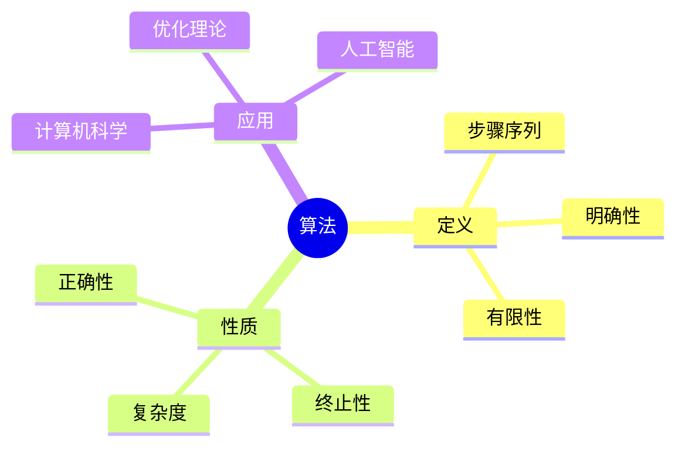
```mermaid
mindmap
  root((算法))
    定义
      步骤序列
      明确性
      有限性
    性质
      正确性
      终止性
      复杂度
    应用
      计算机科学
      优化理论
      人工智能
```

#### 5.2 矩阵对比：不同解释方式的对比

| 解释方式 | 特点 | 方法 | 工具 | 适用阶段 | 优势 | 局限 |
|---------|------|------|------|---------|------|------|
| **直观解释** | 具体、形象、可视 | 例子、类比、直观 | 流程图、状态图 | 入门阶段 | 易于理解 | 不够严格 |
| **知性解释** | 概念、分类、抽象 | 定义、分类、结构 | 概念图、知识图谱 | 中级阶段 | 系统完整 | 不够直观 |
| **理性解释** | 公理、证明、形式化 | 公理、证明、系统 | 形式化工具、证明系统 | 高级阶段 | 严格准确 | 不够具体 |
| **多视角解释** | 多角度、整合 | 多视角、整合 | 多视角工具 | 所有阶段 | 全面深入 | 可能复杂 |

#### 5.3 多视角表征：从不同角度表征算法

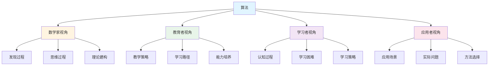
```mermaid
graph TD
    A[算法] --> B[数学家视角]
    A --> C[教育者视角]
    A --> D[学习者视角]
    A --> E[应用者视角]

    B --> B1[发现过程]
    B --> B2[思维过程]
    B --> B3[理论建构]

    C --> C1[教学策略]
    C --> C2[学习路径]
    C --> C3[能力培养]

    D --> D1[认知过程]
    D --> D2[学习困难]
    D --> D3[学习策略]

    E --> E1[应用场景]
    E --> E2[实际问题]
    E --> E3[方法选择]

    style A fill:#e1f5ff
    style B fill:#fff4e1
    style C fill:#e8f5e9
    style D fill:#f3e5f5
    style E fill:#fce4ec
```

#### 5.4 决策树：算法问题分类和策略选择

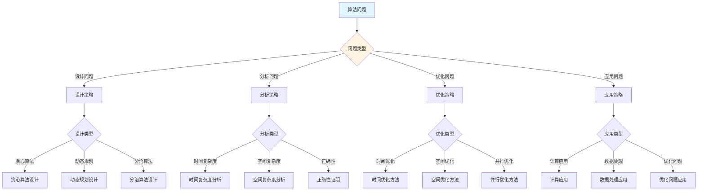
```mermaid
graph TD
    A[算法问题] --> B{问题类型}
    B -->|设计问题| C[设计策略]
    B -->|分析问题| D[分析策略]
    B -->|优化问题| E[优化策略]
    B -->|应用问题| F[应用策略]

    C --> C1{设计类型}
    C1 -->|贪心算法| C2[贪心算法设计]
    C1 -->|动态规划| C3[动态规划设计]
    C1 -->|分治算法| C4[分治算法设计]

    D --> D1{分析类型}
    D1 -->|时间复杂度| D2[时间复杂度分析]
    D1 -->|空间复杂度| D3[空间复杂度分析]
    D1 -->|正确性| D4[正确性证明]

    E --> E1{优化类型}
    E1 -->|时间优化| E2[时间优化方法]
    E1 -->|空间优化| E3[空间优化方法]
    E1 -->|并行优化| E4[并行优化方法]

    F --> F1{应用类型}
    F1 -->|计算应用| F2[计算应用]
    F1 -->|数据处理| F3[数据处理应用]
    F1 -->|优化问题| F4[优化问题应用]

    style A fill:#e1f5ff
    style B fill:#fff4e1
```

**说明**：

- **问题分类**：根据问题类型（设计、分析、优化、应用）进行分类
- **策略选择**：根据问题类型选择相应的解决策略
- **方法应用**：根据具体问题选择合适的方法

#### 5.5 决策逻辑路径：算法问题解决过程

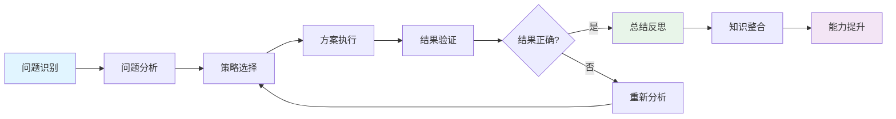
```mermaid
graph LR
    A[问题识别] --> B[问题分析]
    B --> C[策略选择]
    C --> D[方案执行]
    D --> E[结果验证]
    E --> F{结果正确?}
    F -->|是| G[总结反思]
    F -->|否| H[重新分析]
    H --> C

    G --> I[知识整合]
    I --> J[能力提升]

    style A fill:#e1f5ff
    style G fill:#e8f5e9
    style J fill:#f3e5f5
```

**说明**：

- **问题识别**：识别算法问题的类型和关键要素
- **问题分析**：分析问题的条件和目标
- **策略选择**：根据问题类型选择解决策略
- **方案执行**：执行选定的解决方案
- **结果验证**：验证结果的正确性
- **总结反思**：总结解题过程，反思解题方法
- **知识整合**：整合相关知识点
- **能力提升**：提升问题解决能力

#### 5.6 多维对比矩阵：算法概念特征对比

| 对比维度 | 算法定义 | 算法设计 | 算法分析 | 算法应用 |
|---------|---------|---------|---------|---------|
| **核心特征** | 算法概念、步骤 | 贪心、动态规划、分治 | 时间复杂度、空间复杂度、正确性 | 计算、数据处理、优化 |
| **理解难度** | ⭐⭐⭐ | ⭐⭐⭐⭐ | ⭐⭐⭐⭐ | ⭐⭐⭐⭐ |
| **应用频率** | ⭐⭐⭐⭐⭐ | ⭐⭐⭐⭐⭐ | ⭐⭐⭐⭐⭐ | ⭐⭐⭐⭐⭐ |
| **理论基础** | 算法定义 | 算法设计理论 | 算法分析理论 | 算法应用理论 |
| **教学重点** | 概念理解 | 设计方法 | 分析方法 | 应用能力 |
| **学习阶段** | 中级阶段 | 中级-高级 | 中级-高级 | 中级-高级 |
| **认知维度** | 知性+理性 | 理性 | 理性 | 理性+应用 |
| **思维表征** | 思维导图 | 决策树 | 决策逻辑路径 | 知识图谱 |

**说明**：

- **核心特征**：每个方面的核心特征
- **理解难度**：从1星到5星，表示理解难度
- **应用频率**：从1星到5星，表示应用频率
- **理论基础**：每个方面的理论基础
- **教学重点**：每个方面的教学重点
- **学习阶段：每个方面的学习阶段
- **认知维度**：每个方面的认知维度
- **思维表征**：每个方面推荐的思维表征方法

---

## 🔍 数学论证：如何论证算法 (编号: C.CORE.031.06)

### 一、论证过程：从观察到反思

#### 1.1 观察（Observation）

**具体现象观察**：

- **现象1**：解决问题需要步骤序列
  - 例如：计算最大公约数需要Euclid算法的步骤序列
  - **为什么重要**：这个现象揭示了算法的本质
- **现象2**：算法的正确性和复杂度
  - 例如：算法需要正确（产生正确输出）且高效（在合理时间内完成）
  - **为什么重要**：这个现象揭示了算法的两个基本要求

**模式识别**：

- **模式1**：算法的定义
  - 例如：算法是确定性、有限性、有效性的步骤序列
  - **为什么重要**：这个模式可能反映了算法的本质
- **模式2**：计算复杂度
  - 例如：算法的时间复杂度$T(n) = O(f(n))$，空间复杂度$S(n) = O(g(n))$
  - **为什么重要**：这个模式可能反映了算法的效率

**问题提出**：

- **问题1**：如何严格定义算法，统一不同的计算过程？
  - **为什么提出**：这个问题可能揭示算法的本质和基础
- **问题2**：如何证明算法的正确性？
  - **为什么提出**：这个问题可能揭示算法的可靠性

#### 1.2 猜想（Conjecture）

**归纳猜想**：

- **猜想1**：算法是解决问题的统一工具
  - **依据**：观察不同问题都依赖于算法
  - **为什么提出**：这个猜想可能揭示算法的统一性
- **猜想2**：算法的正确性可以证明
  - **依据**：观察具体算法的正确性证明
  - **为什么提出**：这个猜想可能揭示算法的可证明性

**类比猜想**：

- **猜想1**：算法类似于"食谱"
  - **类比对象**：食谱（步骤序列）
  - **为什么提出**：这个类比可能揭示算法的本质
- **猜想2**：Turing机类似于"计算机"
  - **类比对象**：计算机
  - **为什么提出**：这个类比可能揭示Turing机的作用

**直觉猜想**：

- **猜想1**：算法是"最自然"的计算概念
  - **直觉来源**：算法的直观
  - **为什么提出**：这个直觉可能揭示算法的基础地位
- **猜想2**：算法有"最小"的公理结构
  - **直觉来源**：算法的公理结构
  - **为什么提出**：这个直觉可能揭示算法的本质

#### 1.3 证明（Proof）

**直接证明**：

- **证明1**：算法的正确性
  - **证明思路**：使用循环不变式和数学归纳法
  - **关键步骤**：证明循环不变式在每次迭代后保持，算法终止时输出正确
  - **为什么这样证明**：这个证明方法直接、清晰
- **证明2**：算法的复杂度
  - **证明思路**：分析算法的执行步数
  - **关键步骤**：计算最坏情况下的执行步数，得到渐近估计
  - **为什么这样证明**：这个证明方法直接、清晰

**构造法**：

- **构造法**：构造算法
  - **构造方法**：设计步骤序列解决问题
  - **验证**：验证构造的算法正确且高效
  - **为什么这样证明**：构造法适合证明存在性命题

#### 1.4 反思（Reflection）

**过程回顾**：

- **论证回顾**：从观察解决问题需要步骤序列，到猜想算法的性质，再到严格证明
  - **成功之处**：成功建立了算法的严格理论
  - **不足之处**：算法概念需要进一步推广
  - **改进方向**：推广到随机算法、量子算法、近似算法等

**方法总结**：

- **证明方法**：使用了直接证明、构造法
  - **方法特点**：直接证明清晰，构造法明确
  - **适用范围**：不同方法适用于不同类型的命题
- **证明技巧**：使用循环不变式、数学归纳法、复杂度分析
  - **技巧要点**：将算法问题转化为逻辑问题，使用构造法处理存在性问题
  - **应用场景**：这些技巧可以应用于其他算法问题

**理论意义**：

- **理论贡献**：建立了算法的严格理论，揭示了算法的计算结构
  - **为什么重要**：这个论证揭示了计算理论的基础结构
- **应用价值**：算法为计算机科学、优化理论、人工智能提供了基础
  - **为什么重要**：这个论证可以应用于所有计算问题

### 二、论证类型：多种推理方式

#### 2.1 归纳论证（Inductive Reasoning）

**不完全归纳**：

- **例子1**：从具体算法的性质归纳一般规律
  - **观察**：观察Euclid算法、排序算法都有正确性和复杂度
  - **结论**：算法有共同的性质
  - **局限性**：不完全归纳的结论需要严格证明

#### 2.2 演绎论证（Deductive Reasoning）

**三段论**：

- **例子1**：证明算法的性质
  - **大前提**：所有算法都满足确定性
  - **小前提**：快速排序是算法
  - **结论**：快速排序满足确定性
  - **为什么有效**：三段论是严格的演绎推理

#### 2.3 类比论证（Analogical Reasoning）

**结构类比**：

- **例子1**：算法与食谱的类比
  - **类比对象**：食谱
  - **相似性**：算法是步骤序列，食谱也是步骤序列
  - **结论**：算法可以理解为"计算的食谱"
  - **局限性**：类比不能替代严格证明

#### 2.4 构造论证（Constructive Reasoning）

**构造法**：

- **例子1**：构造算法
  - **构造方法**：设计步骤序列解决问题
  - **验证**：验证构造的算法正确且高效
  - **为什么有效**：构造法是严格的直接证明

### 三、论证可视化：用图形表示论证过程

#### 3.1 论证流程图

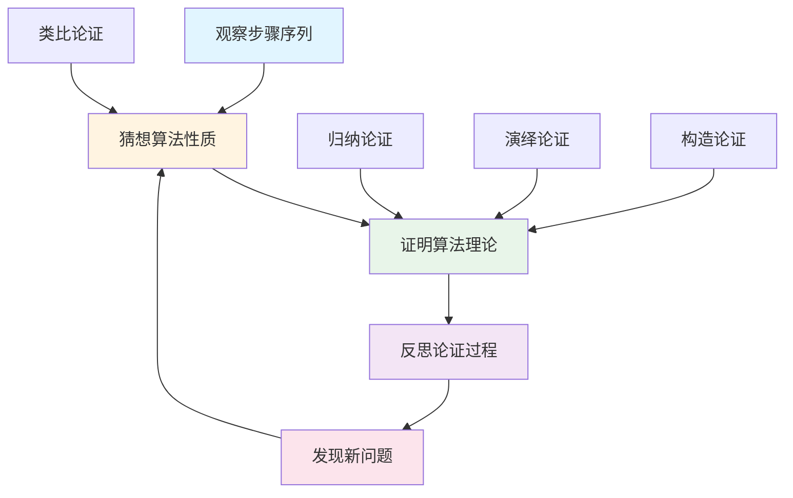
```mermaid
graph TD
    A[观察步骤序列] --> B[猜想算法性质]
    B --> C[证明算法理论]
    C --> D[反思论证过程]
    D --> E[发现新问题]
    E --> B

    F[归纳论证] --> C
    G[演绎论证] --> C
    H[类比论证] --> B
    I[构造论证] --> C

    style A fill:#e1f5ff
    style B fill:#fff4e1
    style C fill:#e8f5e9
    style D fill:#f3e5f5
    style E fill:#fce4ec
```

#### 3.2 论证类型对比

| 论证类型 | 特点 | 适用场景 | 优势 | 局限 |
|---------|------|---------|------|------|
| **归纳论证** | 从特殊到一般 | 发现规律、提出猜想 | 启发性强 | 结论或然 |
| **演绎论证** | 从一般到特殊 | 严格证明、逻辑推理 | 结论必然 | 需要前提 |
| **类比论证** | 基于相似性 | 启发思路、发现联系 | 创造性高 | 结论或然 |
| **构造论证** | 直接构造 | 证明存在性命题 | 直接明确 | 需要构造 |

#### 3.3 论证思维导图

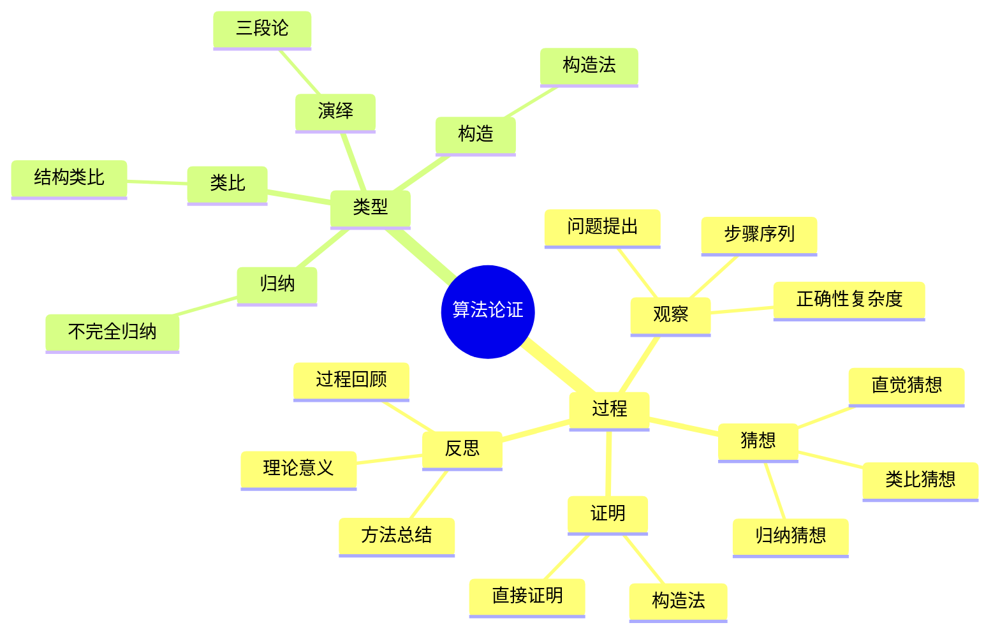
```mermaid
mindmap
  root((算法论证))
    过程
      观察
        步骤序列
        正确性复杂度
        问题提出
      猜想
        归纳猜想
        类比猜想
        直觉猜想
      证明
        直接证明
        构造法
      反思
        过程回顾
        方法总结
        理论意义
    类型
      归纳
        不完全归纳
      演绎
        三段论
      类比
        结构类比
      构造
        构造法
```

---

## 🔗 三视角整合 (编号: C.CORE.031.07)

### 三个视角的关联

**认知学视角 ↔ 教育学视角**:

- 认知学视角揭示的理解机制，指导教育学视角的教学设计
- 教育学视角的教学实践，验证认知学视角的理论

**认知学视角 ↔ 数学家视角**:

- 数学家视角的思维过程，启发认知学视角的认知路径
- 认知学视角的认知障碍，解释数学家视角的历史困难

**教育学视角 ↔ 数学家视角**:

- 数学家视角的历史发展，为教育学视角提供教学素材
- 教育学视角的教学策略，帮助学习者理解数学家视角的思维过程

### 如何综合运用三个视角

**学习建议**:

1. **从认知学视角开始**: 先建立直观理解
2. **用教育学视角深化**: 通过教学路径系统学习
3. **用数学家视角升华**: 理解概念的深层意义和历史背景

**教学建议**:

1. **引入阶段**: 用数学家视角的问题起源激发兴趣
2. **探索阶段**: 用认知学视角的认知过程引导发现
3. **形式化阶段**: 用教育学视角的教学策略系统教学
4. **巩固阶段**: 综合三个视角深化理解

---

## 📚 参考文献 (编号: C.CORE.031.08)

### 权威资源

- Wikipedia: [Algorithm](https://en.wikipedia.org/wiki/Algorithm)
- Metamath: [Algorithm](http://us.metamath.org/mpeuni/df-algorithm.html)[需更新][需更新]

### 经典教材

- Cormen, T. H., Leiserson, C. E., Rivest, R. L., & Stein, C. (2009). *Introduction to Algorithms*. MIT Press.
- Knuth, D. E. (1997). *The Art of Computer Programming*. Addison-Wesley.

### 研究论文

- Turing, A. M. (1936). "On computable numbers, with an application to the Entscheidungsproblem". *Proceedings of the London Mathematical Society*.
- Cook, S. A. (1971). "The complexity of theorem-proving procedures". *Proceedings of the third annual ACM symposium on Theory of computing*.

---

**创建日期**: 2025年1月
**最后更新**: 2026-04-05
**维护状态**: 持续更新中

---

## 📚 附录: 扩展分析


### 1. 多理论分析

---
msc_primary: "00A99"
---

# 算法概念的多理论分析示例 / Multi-Theory Analysis Example: Algorithm Concept


---


## 🎯 一、Tall三个世界理论分析 / Tall's Three Worlds Theory Analysis (编号: C.CORE.031.MULTI.01)

### 1.1 感知-操作世界（Embodied World）

**算法在感知-操作世界中的理解 / Understanding Algorithm in the Embodied World**：

- **具体经验 / Concrete Experience**：
  - 通过"步骤序列"的日常经验理解算法：按照步骤完成任务的流程 / Understanding algorithms through daily experience of "step sequences": processes of completing tasks step by step
  - 例如：烹饪食谱、组装家具的步骤 / Examples: cooking recipes, furniture assembly steps
  - 通过"计算过程"理解算法：执行计算的步骤序列 / Understanding algorithms through "computation processes": sequences of steps for performing computations
  - 例如：手工计算乘法、排序卡片 / Examples: manual multiplication, sorting cards

- **身体动作 / Bodily Actions**：
  - 通过"执行步骤"的动作理解算法 / Understanding algorithms through the action of "executing steps"
  - 通过"操作数据"理解算法 / Understanding algorithms through "manipulating data"
  - 通过操作具体对象理解算法的性质 / Understanding properties of algorithms through manipulating concrete objects

- **直观理解 / Intuitive Understanding**：
  - 算法是"解决问题的步骤序列" / Algorithms are "sequences of steps for solving problems"
  - 算法是"可执行的指令集合" / Algorithms are "executable sets of instructions"
  - 算法是计算理论的核心 / Algorithms are the core of computational theory

**教学建议 / Teaching Suggestions**：

- 使用具体例子（排序、搜索、计算） / Use concrete examples (sorting, searching, computation)
- 通过动手活动理解算法 / Understand algorithms through hands-on activities
- 使用图形可视化算法执行过程 / Use graphics to visualize algorithm execution processes

### 1.2 概念-符号世界（Symbolic World）

**算法在概念-符号世界的理解 / Understanding Algorithms in the Symbolic World**：

- **符号表示 / Symbolic Representation**：
  - 使用算法符号：伪代码、流程图、算法描述 / Using algorithm notation: pseudocode, flowcharts, algorithm descriptions
  - 使用复杂度符号：$O(n)$、$\Theta(n \log n)$、$\Omega(n)$ / Using complexity notation: $O(n)$, $\Theta(n \log n)$, $\Omega(n)$
  - 使用算法模式符号：分治、动态规划、贪心 / Using algorithm pattern notation: divide-and-conquer, dynamic programming, greedy

- **概念理解 / Conceptual Understanding**：
  - 算法是有限步骤序列 / Algorithms are finite sequences of steps
  - 算法满足确定性、有限性、有效性 / Algorithms satisfy determinism, finiteness, effectiveness
  - 算法编码计算过程（特别是问题求解） / Algorithms encode computation processes (especially problem solving)

- **抽象操作 / Abstract Operations**：
  - 通过符号操作设计算法 / Designing algorithms through symbolic operations
  - 通过逻辑推理分析算法复杂度 / Analyzing algorithm complexity through logical reasoning
  - 通过计算理论语言表达数学概念 / Expressing mathematical concepts through computational theory language

**教学建议 / Teaching Suggestions**：

- 逐步引入算法符号 / Gradually introduce algorithm notation
- 通过符号操作练习算法设计 / Practice algorithm design through symbolic operations
- 使用计算理论语言表达数学概念 / Use computational theory language to express mathematical concepts

### 1.3 形式-公理世界（Formal World）

**算法在形式-公理世界的理解 / Understanding Algorithms in the Formal World**：

- **公理系统 / Axiomatic System**：
  - 算法的严格定义：有限步骤序列，满足确定性、有限性、有效性 / Strict definition of algorithm: finite sequence of steps, satisfying determinism, finiteness, effectiveness
  - 算法满足停机性：在有限时间内终止 / Algorithms satisfy termination: terminate in finite time
  - 通过公理严格定义算法 / Strictly defining algorithms through axioms

- **形式化定义 / Formal Definition**：
  - 算法的形式化定义：图灵机、递归函数、λ演算 / Formal definition of algorithm: Turing machines, recursive functions, λ-calculus
  - 算法复杂度的形式化定义 / Formal definition of algorithm complexity
  - 算法性质的严格证明 / Strict proof of algorithm properties

- **逻辑推理 / Logical Reasoning**：
  - 通过逻辑推理证明算法性质（如正确性、复杂度） / Proving algorithm properties (such as correctness, complexity) through logical reasoning
  - 通过形式化方法研究计算理论 / Studying computational theory through formal methods
  - 通过公理系统建立计算理论基础 / Establishing computational theory foundations through axiom systems

**教学建议 / Teaching Suggestions**：

- 介绍算法的严格定义 / Introduce strict definition of algorithms
- 通过形式化证明理解算法性质 / Understand algorithm properties through formal proofs
- 研究算法在计算理论中的作用 / Study the role of algorithms in computational theory

### 1.4 三个世界的转换 / Transitions Between Worlds

**转换路径 / Transition Paths**：

1. **从感知-操作到概念-符号 / From Embodied to Symbolic**：
   - 将具体计算步骤抽象为算法符号 / Abstracting concrete computation steps into algorithm symbols
   - 从操作中提取算法概念 / Extracting algorithm concepts from operations
   - 例如：从"计算步骤"到"算法$A$" / Example: from "computation steps" to "algorithm $A$"

2. **从概念-符号到形式-公理 / From Symbolic to Formal**：
   - 将算法概念形式化为图灵机定义 / Formalizing algorithm concepts into Turing machine definition
   - 从符号运算到逻辑推理 / From symbolic operations to logical reasoning
   - 例如：从"算法$A$"到"图灵机$M$" / Example: from "algorithm $A$" to "Turing machine $M$"

**转换支持 / Transition Support**：

- **识别转换困难 / Identifying Transition Difficulties**：
  - 识别从具体步骤到抽象算法的困难 / Identifying difficulties in transitioning from concrete steps to abstract algorithms
  - 识别从符号运算到形式化定义的困难 / Identifying difficulties in transitioning from symbolic operations to formal definitions

- **设计转换活动 / Designing Transition Activities**：
  - 设计过渡活动支持转换 / Designing transition activities to support transitions
  - 提供渐进式支持 / Providing progressive support

- **评估转换效果 / Assessing Transition Effectiveness**：
  - 评估转换成功 / Assessing transition success
  - 提供反馈支持 / Providing feedback support

---

## 🔬 二、Dubinsky APOS理论分析 (编号: C.CORE.031.MULTI.02)

### 2.1 Action（动作）

**算法的Action阶段 / Action Stage of Algorithm**：

- **具体操作 / Concrete Operations**：
  - 执行算法：给定输入和算法步骤，执行算法 / Executing algorithms: given input and algorithm steps, execute the algorithm
  - 设计算法：给定问题，设计算法步骤 / Designing algorithms: given a problem, design algorithm steps
  - 分析算法：给定算法，分析其复杂度 / Analyzing algorithms: given an algorithm, analyze its complexity

- **操作特点 / Operation Characteristics**：
  - 需要外部指导（教师、教材） / Requires external guidance (teacher, textbook)
  - 操作是具体的、机械的 / Operations are concrete and mechanical
  - 需要逐步执行 / Requires step-by-step execution

- **学习活动 / Learning Activities**：
  - 练习执行算法 / Practice executing algorithms
  - 练习设计算法 / Practice designing algorithms
  - 练习分析算法复杂度 / Practice analyzing algorithm complexity

**教学建议 / Teaching Suggestions**：

- 提供大量练习机会 / Provide ample practice opportunities
- 给予及时反馈 / Give timely feedback
- 逐步增加操作复杂度 / Gradually increase operation complexity

### 2.2 Process（过程）

**算法的Process阶段 / Process Stage of Algorithm**：

- **内化过程 / Internalization Process**：
  - 将算法执行内化为心理过程 / Internalizing algorithm execution as a mental process
  - 理解算法设计的内在逻辑 / Understanding the internal logic of algorithm design
  - 能够独立完成算法操作 / Being able to perform algorithm operations independently

- **过程理解 / Process Understanding**：
  - 理解"算法"是"解决问题的步骤序列" / Understanding that "algorithms" are "sequences of steps for solving problems"
  - 理解"算法设计"是"将问题分解为步骤的过程" / Understanding that "algorithm design" is "the process of decomposing problems into steps"
  - 理解"算法复杂度"是"算法执行时间的度量" / Understanding that "algorithm complexity" is "a measure of algorithm execution time"

- **灵活应用 / Flexible Application**：
  - 能够灵活应用算法概念 / Being able to flexibly apply algorithm concepts
  - 能够处理复杂的计算问题 / Being able to handle complex computational problems
  - 能够理解算法的各种性质 / Being able to understand various properties of algorithms

**教学建议 / Teaching Suggestions**：

- 引导学生内化操作过程 / Guide students to internalize operation processes
- 通过变式练习加深理解 / Deepen understanding through variant exercises
- 鼓励学生独立思考和解决问题 / Encourage students to think independently and solve problems

### 2.3 Object（对象）

**算法的Object阶段 / Object Stage of Algorithm**：

- **对象化理解 / Objectification Understanding**：
  - 将算法视为独立的对象 / Viewing algorithms as independent objects
  - 理解算法作为数学对象的结构 / Understanding the structure of algorithms as mathematical objects
  - 能够对算法进行运算和操作 / Being able to perform operations on algorithms

- **对象操作 / Object Operations**：
  - 能够比较不同的算法 / Being able to compare different algorithms
  - 能够研究算法的复杂度 / Being able to study algorithm complexity
  - 能够研究算法的性质 / Being able to study properties of algorithms

- **概念整合 / Conceptual Integration**：
  - 理解算法与计算、复杂性、优化理论的关系 / Understanding the relationship between algorithms, computation, complexity theory, and optimization theory
  - 理解算法在计算理论中的作用 / Understanding the role of algorithms in computational theory
  - 理解算法在数学中的作用 / Understanding the role of algorithms in mathematics

**教学建议 / Teaching Suggestions**：

- 引导学生将算法对象化 / Guide students to objectify algorithms
- 通过对象操作加深理解 / Deepen understanding through object operations
- 整合算法与其他概念 / Integrate algorithms with other concepts

### 2.4 Schema（图式）

**算法的Schema阶段 / Schema Stage of Algorithm**：

- **图式构建 / Schema Construction**：
  - 构建完整的算法图式 / Constructing a complete algorithm schema
  - 整合算法的各种理解 / Integrating various understandings of algorithms
  - 建立算法与其他概念的联系 / Establishing connections between algorithms and other concepts

- **图式应用 / Schema Application**：
  - 能够灵活应用算法图式 / Being able to flexibly apply algorithm schemas
  - 能够解决复杂的计算问题 / Being able to solve complex computational problems
  - 能够研究计算理论 / Being able to study computational theory

- **图式发展 / Schema Development**：
  - 不断发展算法图式 / Continuously developing algorithm schemas
  - 探索算法的新应用（人工智能、机器学习） / Exploring new applications of algorithms (artificial intelligence, machine learning)
  - 研究计算理论的发展 / Studying the development of computational theory

**教学建议 / Teaching Suggestions**：

- 帮助学生构建算法图式 / Help students construct algorithm schemas
- 通过应用发展图式 / Develop schemas through application
- 鼓励学生探索计算理论 / Encourage students to explore computational theory

### 2.5 APOS发展路径 / APOS Development Path

**发展过程 / Development Process**：

1. **Action → Process / 动作到过程**：
   - 将外部算法执行操作内化为心理过程 / Internalizing external algorithm execution operations as mental processes
   - 从需要指导到独立完成 / From needing guidance to independent completion
   - 例如：从"执行算法"到"理解算法执行过程" / Example: from "executing algorithms" to "understanding the algorithm execution process"

2. **Process → Object / 过程到对象**：
   - 将算法执行过程对象化 / Objectifying algorithm execution processes
   - 从过程理解到对象理解 / From process understanding to object understanding
   - 例如：从"理解算法执行过程"到"将算法视为对象" / Example: from "understanding the algorithm execution process" to "treating algorithms as objects"

3. **Object → Schema / 对象到图式**：
   - 整合算法的所有方面形成完整图式 / Integrating all aspects of algorithms to form a complete schema
   - 从对象理解到系统理解 / From object understanding to systematic understanding
   - 例如：从"理解算法对象"到"形成计算理论图式" / Example: from "understanding algorithm objects" to "forming a computational theory schema"

**发展支持 / Development Support**：

- **识别发展困难 / Identifying Development Difficulties**：
  - 识别内化困难 / Identifying internalization difficulties
  - 识别对象化困难 / Identifying objectification difficulties
  - 识别图式化困难 / Identifying schematization difficulties

- **设计发展活动 / Designing Development Activities**：
  - 设计支持内化的活动 / Designing activities to support internalization
  - 设计支持对象化的活动 / Designing activities to support objectification
  - 设计支持图式化的活动 / Designing activities to support schematization

- **评估发展效果 / Assessing Development Effectiveness**：
  - 评估各阶段发展 / Assessing development at each stage
  - 提供反馈支持 / Providing feedback support

---

## 💬 三、Sfard交流理论分析 / Sfard's Commognitive Theory Analysis (编号: C.CORE.031.MULTI.03)

### 3.1 算法作为交流工具 / Algorithm as a Communication Tool

**算法的交流功能 / Communicative Function of Algorithm**：

- **数学交流 / Mathematical Communication**：
  - 算法用于表达"计算过程"：伪代码、流程图 / Algorithms are used to express "computation processes": pseudocode, flowcharts
  - 算法用于描述"问题求解"：排序、搜索、优化 / Algorithms are used to describe "problem solving": sorting, searching, optimization
  - 算法用于表达数学关系：复杂度分析、算法正确性 / Algorithms are used to express mathematical relationships: complexity analysis, algorithm correctness

- **概念表达 / Conceptual Expression**：
  - 通过算法表达"计算理论"的概念 / Expressing the concept of "computational theory" through algorithms
  - 通过算法符号表达"问题求解"的概念 / Expressing the concept of "problem solving" through algorithm notation
  - 通过算法表达"计算核心工具"的概念 / Expressing the concept of "core tool of computation" through algorithms

- **问题解决 / Problem Solving**：
  - 使用算法语言表达问题 / Using algorithm language to express problems
  - 使用算法方法解决问题（排序、搜索、优化） / Using algorithm methods to solve problems (sorting, searching, optimization)
  - 使用计算理论方法证明定理 / Using computational theory methods to prove theorems

### 3.2 算法学习的实践参与 / Practice Participation in Algorithm Learning

**通过参与数学实践学习算法 / Learning Algorithm through Participation in Mathematical Practice**：

- **实践场景 / Practice Scenarios**：
  - 通过计算问题学习算法 / Learning algorithms through computational problems
  - 通过编程活动学习算法 / Learning algorithms through programming activities
  - 通过算法设计研究学习算法 / Learning algorithms through algorithm design research
  - 通过计算理论研究学习算法理论 / Learning algorithm theory through computational theory research

- **实践方式 / Practice Methods**：
  - 参与数学讨论，使用算法语言 / Participating in mathematical discussions, using algorithm language
  - 解决数学问题，应用算法方法 / Solving mathematical problems, applying algorithm methods
  - 研究数学理论，理解算法作用 / Studying mathematical theory, understanding the role of algorithms

- **学习效果 / Learning Outcomes**：
  - 通过实践理解算法概念 / Understanding algorithm concepts through practice
  - 通过应用掌握算法方法 / Mastering algorithm methods through application
  - 通过参与形成数学思维 / Forming mathematical thinking through participation

**教学建议 / Teaching Suggestions**：

- 设计数学实践活动 / Design mathematical practice activities
- 鼓励学生参与数学讨论 / Encourage students to participate in mathematical discussions
- 提供实际问题解决机会 / Provide opportunities for solving real-world problems

---

## 🧠 四、Piaget认知发展理论分析 / Piaget's Cognitive Development Theory Analysis (编号: C.CORE.031.MULTI.04)

### 4.1 具体运算阶段（7-12岁）/ Concrete Operational Stage (7-12 years)

**算法在具体运算阶段的理解 / Understanding Algorithm in the Concrete Operational Stage**：

- **具体对象 / Concrete Objects**：
  - 通过具体算法理解算法 / Understanding algorithms through concrete algorithms
  - 例如：排序卡片、查找数字、计算步骤 / Examples: sorting cards, finding numbers, computation steps
  - 需要具体例子支持理解 / Requires concrete examples to support understanding

- **逻辑思维 / Logical Thinking**：
  - 能够理解算法的基本概念 / Being able to understand basic algorithm concepts
  - 能够进行简单的算法执行 / Being able to perform simple algorithm execution
  - 但需要具体对象支持 / But requires concrete object support

- **教学建议 / Teaching Suggestions**：
  - 使用具体算法和图形 / Use concrete algorithms and graphics
  - 通过游戏和活动学习 / Learn through games and activities
  - 逐步引入抽象概念 / Gradually introduce abstract concepts

### 4.2 形式运算阶段（12+岁）/ Formal Operational Stage (12+ years)

**算法在形式运算阶段的理解 / Understanding Algorithm in the Formal Operational Stage**：

- **抽象思维 / Abstract Thinking**：
  - 能够理解抽象的算法概念 / Being able to understand abstract algorithm concepts
  - 能够进行符号操作 / Being able to perform symbolic operations
  - 能够进行逻辑推理 / Being able to perform logical reasoning

- **形式推理 / Formal Reasoning**：
  - 能够证明算法性质（如正确性、复杂度） / Being able to prove algorithm properties (such as correctness, complexity)
  - 能够理解算法定义 / Being able to understand algorithm definition
  - 能够研究计算理论 / Being able to study computational theory

- **教学建议 / Teaching Suggestions**：
  - 引入抽象概念和符号 / Introduce abstract concepts and symbols
  - 进行逻辑推理训练 / Conduct logical reasoning training
  - 研究计算理论 / Study computational theory

---

## 🌍 五、Vygotsky社会文化理论分析 / Vygotsky's Sociocultural Theory Analysis (编号: C.CORE.031.MULTI.05)

### 5.1 最近发展区（ZPD）/ Zone of Proximal Development (ZPD)

**算法学习的最近发展区 / Zone of Proximal Development in Algorithm Learning**：

- **独立能力 / Independent Ability**：
  - 能够理解算法的基本概念 / Being able to understand basic algorithm concepts
  - 能够进行简单的算法执行 / Being able to perform simple algorithm execution
  - 能够理解算法的基本性质 / Being able to understand basic algorithm properties

- **潜在能力 / Potential Ability**：
  - 能够理解算法定义 / Being able to understand algorithm definition
  - 能够证明算法性质（如正确性、复杂度） / Being able to prove algorithm properties (such as correctness, complexity)
  - 能够研究计算理论 / Being able to study computational theory

### 5.2 社会文化工具 / Sociocultural Tools

**算法作为社会文化工具 / Algorithm as Sociocultural Tools**：

- **数学工具 / Mathematical Tools**：
  - 算法是数学研究的重要工具 / Algorithms are important tools for mathematical research
  - 算法用于解决实际问题（排序、搜索、优化） / Algorithms are used to solve real-world problems (sorting, searching, optimization)
  - 算法用于研究数学理论 / Algorithms are used to study mathematical theory

- **文化意义 / Cultural Significance**：
  - 算法是数学文化的重要组成部分 / Algorithms are an important part of mathematical culture
  - 算法反映了数学思维的发展 / Algorithms reflect the development of mathematical thinking
  - 算法体现了数学的美感 / Algorithms embody the beauty of mathematics

- **教学建议 / Teaching Suggestions**：
  - 介绍算法的历史和文化意义 / Introduce the history and cultural significance of algorithms
  - 展示算法在数学中的作用 / Demonstrate the role of algorithms in mathematics
  - 培养学生对数学文化的理解 / Cultivate students' understanding of mathematical culture

- 提供适当的学习支持 / Provide appropriate learning support
- 设计最近发展区的学习活动 / Design learning activities in the zone of proximal development
- 鼓励学生参与数学实践和交流 / Encourage students to participate in mathematical practice and communication

---

## 🔄 六、多理论整合分析 / Multi-Theory Integration Analysis (编号: C.CORE.031.MULTI.06)

### 6.1 理论共同点 / Theoretical Commonalities

**各理论在算法概念分析中的共同点 / Commonalities of Theories in Algorithm Concept Analysis**：

1. **多层次理解 / Multi-Level Understanding**：
   - 都强调从具体到抽象的发展 / All emphasize development from concrete to abstract
   - Tall的三个世界、APOS的四个阶段、Piaget的发展阶段都体现这一点 / Tall's three worlds, APOS's four stages, and Piaget's developmental stages all reflect this

2. **实践重要性 / Importance of Practice**：
   - 都强调实践在学习中的作用 / All emphasize the role of practice in learning
   - Sfard的交流理论、Vygotsky的社会文化理论都强调这一点 / Sfard's communication theory and Vygotsky's sociocultural theory both emphasize this

3. **认知发展 / Cognitive Development**：
   - 都关注认知发展的过程 / All focus on the process of cognitive development
   - 各理论都描述了从简单到复杂的发展 / Each theory describes development from simple to complex

### 6.2 理论互补性 / Theoretical Complementarity

**各理论在算法概念分析中的互补性 / Complementarity of Theories in Algorithm Concept Analysis**：

1. **Tall三个世界 / Tall's Three Worlds**：
   - 适用于理解算法概念的不同层次 / Applicable to understanding different levels of algorithm concepts
   - 从感知操作到形式公理的发展 / Development from embodied operations to formal axioms

2. **APOS理论 / APOS Theory**：
   - 适用于分析算法概念的学习过程 / Applicable to analyzing the learning process of algorithm concepts
   - 从动作到图式的发展 / Development from action to schema

3. **Sfard交流理论 / Sfard's Communication Theory**：
   - 适用于设计算法概念的实践活动 / Applicable to designing practice activities for algorithm concepts
   - 通过数学实践学习算法 / Learning algorithms through mathematical practice

4. **Piaget理论 / Piaget's Theory**：
   - 适用于理解算法概念的认知发展阶段 / Applicable to understanding cognitive development stages of algorithm concepts
   - 从具体运算到形式运算的发展 / Development from concrete operations to formal operations

5. **Vygotsky理论 / Vygotsky's Theory**：
   - 适用于设计算法概念的学习支持 / Applicable to designing learning support for algorithm concepts
   - 通过最近发展区促进学习 / Promoting learning through the zone of proximal development

### 6.3 整合应用框架

**多理论整合应用**：

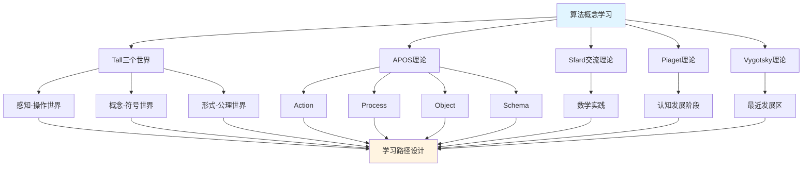
```mermaid
graph TB
    A[算法概念学习] --> B[Tall三个世界]
    A --> C[APOS理论]
    A --> D[Sfard交流理论]
    A --> E[Piaget理论]
    A --> F[Vygotsky理论]

    B --> G[感知-操作世界]
    B --> H[概念-符号世界]
    B --> I[形式-公理世界]

    C --> J[Action]
    C --> K[Process]
    C --> L[Object]
    C --> M[Schema]

    D --> N[数学实践]
    E --> O[认知发展阶段]
    F --> P[最近发展区]

    G --> Q[学习路径设计]
    H --> Q
    I --> Q
    J --> Q
    K --> Q
    L --> Q
    M --> Q
    N --> Q
    O --> Q
    P --> Q

    style A fill:#e1f5ff
    style Q fill:#fff4e1
```

---

## 📊 七、算法概念的多理论学习路径 / Multi-Theory Learning Path for Algorithm Concept (编号: C.CORE.031.MULTI.07)

### 7.1 入门阶段（Tall感知-操作世界 + APOS Action）/ Entry Stage (Tall Embodied World + APOS Action)

**学习目标 / Learning Objectives**：

- 通过具体算法理解算法概念 / Understanding algorithm concepts through concrete algorithms
- 掌握基本算法操作 / Mastering basic algorithm operations

**学习活动 / Learning Activities**：

- 使用具体例子（排序卡片、查找数字、计算步骤）进行算法操作 / Using concrete examples (sorting cards, finding numbers, computation steps) for algorithm operations
- 练习执行算法 / Practicing executing algorithms
- 练习设计简单算法 / Practicing designing simple algorithms
- 练习基本算法运算 / Practicing basic algorithm operations

**评估标准 / Assessment Criteria**：

- 能够独立完成基本算法操作 / Being able to independently complete basic algorithm operations
- 能够理解算法的基本概念 / Being able to understand basic algorithm concepts

### 7.2 中级阶段（Tall概念-符号世界 + APOS Process/Object）/ Intermediate Stage (Tall Symbolic World + APOS Process/Object)

**学习目标 / Learning Objectives**：

- 理解算法的符号表示 / Understanding symbolic representation of algorithms
- 掌握算法设计的内在逻辑 / Mastering the internal logic of algorithm design
- 将算法视为对象 / Viewing algorithms as objects

**学习活动 / Learning Activities**：

- 学习算法符号和伪代码符号 / Learning algorithm notation and pseudocode notation
- 通过符号操作设计算法 / Designing algorithms through symbolic operations
- 理解算法的性质 / Understanding properties of algorithms
- 研究算法的复杂度 / Studying algorithm complexity

**评估标准 / Assessment Criteria**：

- 能够灵活应用算法符号 / Being able to flexibly apply algorithm notation
- 能够理解算法设计的内在逻辑 / Being able to understand the internal logic of algorithm design
- 能够将算法视为对象进行操作 / Being able to operate on algorithms as objects

### 7.3 高级阶段（Tall形式-公理世界 + APOS Schema + Sfard实践）/ Advanced Stage (Tall Formal World + APOS Schema + Sfard Practice)

**学习目标 / Learning Objectives**：

- 理解算法的严格定义 / Understanding strict definition of algorithm
- 形成完整的算法概念图式 / Forming a complete algorithm concept schema
- 通过数学实践应用算法 / Applying algorithm through mathematical practice

**学习活动 / Learning Activities**：

- 学习算法的严格定义 / Learning strict definition of algorithms
- 通过形式化证明理解算法性质（如正确性、复杂度） / Understanding algorithm properties (such as correctness, complexity) through formal proofs
- 研究算法在计算理论中的作用 / Studying the role of algorithms in computational theory
- 参与数学实践，应用算法方法（排序、搜索、优化） / Participating in mathematical practice, applying algorithm methods (sorting, searching, optimization)

**评估标准 / Assessment Criteria**：

- 能够理解算法的严格定义 / Being able to understand strict definition of algorithm
- 能够形成完整的算法概念图式 / Being able to form a complete algorithm concept schema
- 能够通过数学实践应用算法 / Being able to apply algorithm through mathematical practice

---

## 🧠 七、元认知理论分析 / Metacognitive Theory Analysis (编号: C.CORE.031.MULTI.07.5)

### 7.1 元认知知识（Metacognitive Knowledge）

**关于算法概念的知识 / Knowledge About the Algorithm Concept**：

- **概念知识 / Conceptual Knowledge**：
  - 算法的定义：解决特定问题的有限步骤序列 / Algorithms are finite sequences of steps to solve specific problems
  - 算法的性质：确定性、有限性、有效性、输入输出 / Properties: determinism, finiteness, effectiveness, input-output
  - 算法的表示方法：自然语言、伪代码、流程图、程序代码 / Representation methods: natural language, pseudocode, flowcharts, program code
  - 算法与其他概念的关系：算法是计算数学的基础，是研究计算问题的工具 / Relationship: algorithms are foundations of computational mathematics and tools for studying computational problems

- **策略知识 / Strategy Knowledge**：
  - 学习策略：从具体问题到抽象算法，通过动手活动掌握算法 / Learning strategies: from concrete problems to abstract algorithms, master algorithms through hands-on activities
  - 理解策略：从问题分析到算法设计，从简单到复杂 / Understanding strategies: from problem analysis to algorithm design, from simple to complex
  - 应用策略：将算法方法应用到实际问题中 / Application strategies: apply algorithm methods to real-world problems

- **任务知识 / Task Knowledge**：
  - 典型任务：算法设计、算法分析、算法优化 / Typical tasks: algorithm design, algorithm analysis, algorithm optimization
  - 任务难度：基础任务（算法设计）→ 中级任务（算法分析）→ 高级任务（算法优化） / Task difficulty: basic (algorithm design) → intermediate (algorithm analysis) → advanced (algorithm optimization)
  - 任务要求：理解算法概念，掌握算法方法，能够进行算法推理 / Task requirements: understand algorithm concepts, master algorithm methods, be able to reason about algorithms

### 7.2 元认知监控（Metacognitive Monitoring）

**理解监控 / Comprehension Monitoring**：

- **自我提问 / Self-Questioning**：
  - "我理解算法的基本概念了吗？" / "Do I understand the basic concept of algorithms?"
  - "我能区分算法和程序吗？" / "Can I distinguish between algorithms and programs?"
  - "我理解算法的时间复杂度吗？" / "Do I understand the time complexity of algorithms?"

- **理解检查 / Comprehension Checking**：
  - 能否用自己的话解释算法概念？ / Can I explain the concept of algorithms in my own words?
  - 能否识别算法设计的错误？ / Can I identify errors in algorithm design?
  - 能否判断算法的正确性？ / Can I determine the correctness of algorithms?

- **困难识别 / Difficulty Identification**：
  - 识别理解困难：抽象性、时间复杂度、空间复杂度、算法正确性 / Identify comprehension difficulties: abstraction, time complexity, space complexity, algorithm correctness
  - 识别运算困难：算法设计、算法分析、算法优化 / Identify operation difficulties: algorithm design, algorithm analysis, algorithm optimization

**过程监控 / Process Monitoring**：

- **学习过程监控 / Learning Process Monitoring**：
  - 监控学习进度：是否按计划学习？ / Monitor learning progress: Am I learning according to plan?
  - 监控学习效果：是否掌握了算法概念？ / Monitor learning effectiveness: Have I mastered the concept of algorithms?
  - 监控学习困难：遇到了哪些困难？ / Monitor learning difficulties: What difficulties have I encountered?

- **策略使用监控 / Strategy Use Monitoring**：
  - 使用的策略是否有效？ / Is the strategy I'm using effective?
  - 是否需要调整策略？ / Do I need to adjust my strategy?
  - 策略使用是否正确？ / Am I using the strategy correctly?

### 7.3 元认知调节（Metacognitive Regulation）

**计划调节 / Planning Regulation**：

- **学习计划制定 / Learning Plan Development**：
  - 制定学习计划：先学算法基本概念，再学算法方法，最后学算法应用 / Develop learning plan: first learn basic algorithm concepts, then learn algorithm methods, finally learn algorithm applications
  - 调整学习计划：根据学习情况调整计划 / Adjust learning plan: adjust plan based on learning situation
  - 优化学习路径：选择最适合自己的学习路径 / Optimize learning path: choose the learning path that best suits oneself

**策略调节 / Strategy Regulation**：

- **策略选择 / Strategy Selection**：
  - 根据任务类型选择策略：简单任务用直接方法，复杂任务用分步方法 / Select strategies based on task type: use direct methods for simple tasks, step-by-step methods for complex tasks
  - 根据学习阶段选择策略：入门阶段用具体例子，高级阶段用抽象方法 / Select strategies based on learning stage: use concrete examples in entry stage, abstract methods in advanced stage

- **策略调整 / Strategy Adjustment**：
  - 如果遇到困难，尝试不同的策略 / If encountering difficulties, try different strategies
  - 如果策略无效，调整策略 / If strategy is ineffective, adjust strategy
  - 如果策略有效，继续使用并优化 / If strategy is effective, continue using and optimize

**反思调节 / Reflection Regulation**：

- **学习反思 / Learning Reflection**：
  - 反思学习过程：从算法学习中获得了什么？ / Reflect on learning process: What have I gained from learning algorithms?
  - 反思学习困难：遇到了哪些困难？如何克服？ / Reflect on learning difficulties: What difficulties did I encounter? How did I overcome them?
  - 反思学习策略：使用的策略是否有效？如何改进？ / Reflect on learning strategies: Were the strategies I used effective? How can I improve?

- **错误反思 / Error Reflection**：
  - 从错误中学习：分析错误原因，避免类似错误 / Learn from errors: analyze error causes, avoid similar errors
  - 改进学习方法：根据错误调整学习方法 / Improve learning methods: adjust learning methods based on errors

**教学建议 / Teaching Suggestions**：

- 教授元认知知识：帮助学生建立关于算法的元认知知识 / Teach metacognitive knowledge: help students build metacognitive knowledge about algorithms
- 培养监控能力：引导学生自我监控理解过程 / Develop monitoring ability: guide students to self-monitor their comprehension process
- 训练调节能力：教授学生如何调节学习策略 / Train regulation ability: teach students how to regulate learning strategies
- 使用元认知提示语：在学习过程中使用提示语引导学生 / Use metacognitive prompts: use prompts to guide students during learning

---

## 🎓 八、教学建议 / Teaching Suggestions (编号: C.CORE.031.MULTI.08)

### 8.1 基于多理论的教学设计 / Multi-Theory Based Teaching Design

**教学设计原则 / Teaching Design Principles**：

1. **多层次设计 / Multi-Level Design**：
   - 从感知操作到形式公理 / From embodied operations to formal axioms
   - 从动作到图式 / From action to schema
   - 从具体运算到形式运算 / From concrete operations to formal operations

2. **实践导向 / Practice-Oriented**：
   - 设计数学实践活动 / Design mathematical practice activities
   - 鼓励学生参与数学交流 / Encourage students to participate in mathematical communication
   - 提供实际问题解决机会 / Provide opportunities for solving real-world problems

3. **学习支持 / Learning Support**：
   - 提供适当的学习支持 / Provide appropriate learning support
   - 设计最近发展区的学习活动 / Design learning activities in the zone of proximal development
   - 给予及时反馈 / Give timely feedback

4. **情感因素考虑 / Affective Considerations**：
   - **减少数学焦虑 / Reducing Math Anxiety**：
     - 从具体例子（排序、搜索、计算）开始，降低算法概念的抽象难度 / Start with concrete examples (sorting, searching, computation) to reduce the abstract difficulty of algorithm concepts
     - 通过动手活动理解算法 / Understand algorithms through hands-on activities
     - 允许学生犯错，营造安全的学习环境 / Allow students to make mistakes and create a safe learning environment
     - 提供逐步支持，帮助学生建立信心 / Provide progressive support to help students build confidence

   - **激发学习动机 / Motivating Learning**：
     - 展示算法在现实中的应用（计算机科学、人工智能等） / Show applications of algorithms in real life (computer science, artificial intelligence, etc.)
     - 设计有趣的算法问题 / Design interesting algorithm problems
     - 介绍算法的历史和数学家的故事（Euclid、Turing、Knuth） / Introduce the history of algorithms and mathematician stories (Euclid, Turing, Knuth)
     - 展示算法的规律和美感 / Show the patterns and beauty of algorithms

   - **培养数学兴趣 / Cultivating Math Interest**：
     - 展示算法的美感（优雅的算法设计） / Show the beauty of algorithms (elegant algorithm design)
     - 介绍Euclid、Turing、Knuth等数学家的故事 / Introduce stories of mathematicians like Euclid, Turing, and Knuth
     - 探索算法在计算数学中的核心地位 / Explore the central role of algorithms in computational mathematics

### 8.2 具体教学策略 / Specific Teaching Strategies

**入门阶段策略 / Entry Stage Strategies**：

- 使用具体物体和图形 / Use concrete objects and graphics
- 通过游戏和活动学习 / Learn through games and activities
- 提供大量练习机会 / Provide ample practice opportunities

**中级阶段策略 / Intermediate Stage Strategies**：

- 逐步引入抽象概念和符号 / Gradually introduce abstract concepts and symbols
- 通过变式练习加深理解 / Deepen understanding through variant exercises
- 鼓励学生独立思考和解决问题 / Encourage students to think independently and solve problems

**高级阶段策略 / Advanced Stage Strategies**：

- 引入严格定义和形式化方法 / Introduce strict definitions and formal methods
- 研究计算理论 / Study computational theory
- 参与数学实践和研究（排序、搜索、优化） / Participate in mathematical practice and research (sorting, searching, optimization)

---

## 🔗 九、关联文档 / Related Documents (编号: C.CORE.031.MULTI.09)

### 9.1 核心概念文档 / Core Concept Documents

- [算法](./31-算法.md) / [Algorithm](./31-算法.md)
- [算法-三视角版](./31-算法.md) / [Algorithm-Three Perspectives Version](./31-算法.md)
- [图-多理论分析示例](./29-图.md) - 图多理论分析示例 / [Graph-Multi-Theory Analysis Example](./29-图.md) - Multi-theory analysis example for graph
- [组合数-多理论分析示例](./30-组合数.md) - 组合数多理论分析示例 / [Binomial Coefficient-Multi-Theory Analysis Example](./30-组合数.md) - Multi-theory analysis example for binomial coefficient

### 9.2 理论框架文档 / Theoretical Framework Documents

- [国际主流数学认知理论整合框架](../00-国际主流数学认知理论整合框架-2025年1月.md) / [International Mainstream Mathematical Cognitive Theories Integration Framework](../00-国际主流数学认知理论整合框架-2025年1月.md)
- [概念体系深度改进计划](./../00-概念体系全面梳理与推进计划-2025年1月.md) / [Concept System Deep Improvement Plan](./../00-概念体系全面梳理与推进计划-2025年1月.md)

---

## ✅ 十、总结 / Summary (编号: C.CORE.031.MULTI.10)

### 10.1 多理论分析的价值 / Value of Multi-Theory Analysis

**多理论分析的优势 / Advantages of Multi-Theory Analysis**：

1. **全面理解 / Comprehensive Understanding**：
   - 从多个角度理解算法概念 / Understanding algorithm concepts from multiple perspectives
   - 理解算法概念的不同层次 / Understanding different levels of algorithm concepts
   - 理解算法概念的学习过程 / Understanding the learning process of algorithm concepts

2. **教学设计 / Teaching Design**：
   - 基于多理论设计教学 / Designing teaching based on multiple theories
   - 提供多层次学习支持 / Providing multi-level learning support
   - 设计实践活动 / Designing practice activities

3. **学习路径 / Learning Path**：
   - 设计基于多理论的学习路径 / Designing learning paths based on multiple theories
   - 支持不同认知发展阶段的学习 / Supporting learning at different cognitive development stages
   - 促进概念理解的发展 / Promoting the development of conceptual understanding

### 10.2 应用推广 / Application and Extension

**为其他32个核心概念建立多理论分析 / Establishing Multi-Theory Analysis for Other 32 Core Concepts**：

- 使用本文档作为模板 / Using this document as a template
- 为每个概念建立多理论分析 / Establishing multi-theory analysis for each concept
- 建立33个核心概念的多理论分析体系 / Establishing a multi-theory analysis system for 33 core concepts

---

**维护状态**: 持续更新中
**状态**: ✅ 示例完成


### 2. 决策导图

---
msc_primary: "00A99"
---

# 算法概念决策导图示例


---


## 🎓 一、学习决策导图 (编号: C.CORE.031.DECISION.01)

### 1.1 学习路径决策

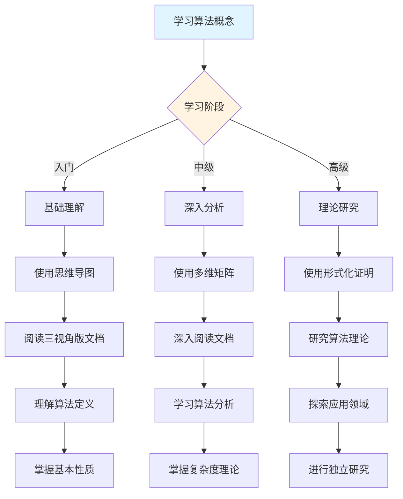
```mermaid
graph TD
    A[学习算法概念] --> B{学习阶段}
    B -->|入门| C[基础理解]
    B -->|中级| D[深入分析]
    B -->|高级| E[理论研究]

    C --> C1[使用思维导图]
    C1 --> C2[阅读三视角版文档]
    C2 --> C3[理解算法定义]
    C3 --> C4[掌握基本性质]

    D --> D1[使用多维矩阵]
    D1 --> D2[深入阅读文档]
    D2 --> D3[学习算法分析]
    D3 --> D4[掌握复杂度理论]

    E --> E1[使用形式化证明]
    E1 --> E2[研究算法理论]
    E2 --> E3[探索应用领域]
    E3 --> E4[进行独立研究]

    style A fill:#e1f5ff
    style B fill:#fff4e1
```

### 1.2 学习重点决策

**基于知识矩阵的学习重点**：

| 学习阶段 | 知识层次 | 学习重点 | 推荐资源 |
|---------|---------|---------|---------|
| **入门** | L0基础 | 算法的定义、基本例子 | 思维导图、三视角版文档 |
| **入门** | L0基础 | 算法的直观理解（步骤、过程、计算） | 三视角版文档、应用实例 |
| **中级** | L1中级 | 算法复杂度分析 | 多维矩阵、形式化证明 |
| **中级** | L1中级 | 算法设计方法 | 三视角版文档、习题库 |
| **高级** | L2高级 | 算法理论 | 形式化证明系统 |
| **高级** | L2高级 | 计算复杂性理论 | 形式化证明系统 |

### 1.3 学习方法决策

**基于认知维度的学习方法**：

1. **直观维度**（入门阶段）
   - 使用思维导图建立总体框架
   - 使用具体例子理解概念（排序算法、搜索算法、图算法）
   - 使用流程图直观理解算法

2. **知性维度**（中级阶段）
   - 使用多维矩阵分析概念特征
   - 使用概念分类系统理解（确定性算法vs随机算法、多项式时间vs指数时间）
   - 使用关系分析建立联系（与图、组合数、数据结构的关系）

3. **理性维度**（高级阶段）
   - 使用形式化证明严格理解
   - 使用逻辑推理深入分析
   - 使用系统建构整体把握

---

## 🔬 二、研究决策导图 (编号: C.CORE.031.DECISION.02)

### 2.1 研究方向决策

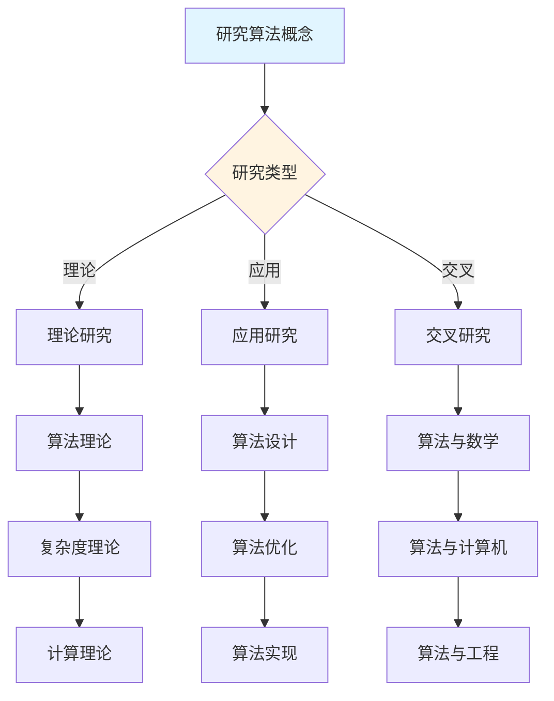
```mermaid
graph TD
    A[研究算法概念] --> B{研究类型}
    B -->|理论| C[理论研究]
    B -->|应用| D[应用研究]
    B -->|交叉| E[交叉研究]

    C --> C1[算法理论]
    C1 --> C2[复杂度理论]
    C2 --> C3[计算理论]

    D --> D1[算法设计]
    D1 --> D2[算法优化]
    D2 --> D3[算法实现]

    E --> E1[算法与数学]
    E1 --> E2[算法与计算机]
    E2 --> E3[算法与工程]

    style A fill:#e1f5ff
    style B fill:#fff4e1
```

### 2.2 研究问题决策

**基于知识矩阵的研究问题**：

1. **理论研究问题**
   - 算法理论：算法的分类和性质
   - 复杂度理论：算法复杂度的分析
   - 计算理论：计算的理论基础

2. **应用研究问题**
   - 算法设计：新算法的设计
   - 算法优化：算法的优化方法
   - 算法实现：算法的实现技术

3. **交叉研究问题**
   - 算法与数学：算法的数学基础
   - 算法与计算机：算法在计算机中的应用
   - 算法与工程：算法在工程中的应用

### 2.3 研究方法决策

**基于形式化证明的研究方法**：

1. **构造性证明** → 算法的构造
   - 直接构造算法
   - 适用于具体算法

2. **复杂度方法** → 复杂度分析
   - 使用复杂度方法
   - 适用于算法复杂度分析

3. **形式化方法** → 算法形式化
   - 使用形式化方法
   - 适用于算法形式化验证

---

## 💼 三、应用决策导图 (编号: C.CORE.031.DECISION.03)

### 3.1 应用场景决策

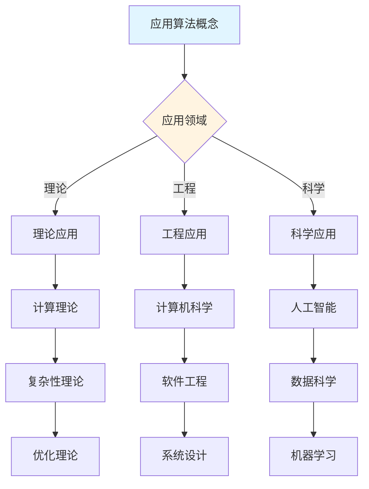
```mermaid
graph TD
    A[应用算法概念] --> B{应用领域}
    B -->|理论| C[理论应用]
    B -->|工程| D[工程应用]
    B -->|科学| E[科学应用]

    C --> C1[计算理论]
    C1 --> C2[复杂性理论]
    C2 --> C3[优化理论]

    D --> D1[计算机科学]
    D1 --> D2[软件工程]
    D2 --> D3[系统设计]

    E --> E1[人工智能]
    E1 --> E2[数据科学]
    E2 --> E3[机器学习]

    style A fill:#e1f5ff
    style B fill:#fff4e1
```

### 3.2 应用方法决策

**基于应用场景的应用方法**：

1. **理论应用** → 使用形式化证明
   - 计算理论：算法是计算理论的基础
   - 复杂性理论：算法复杂度的理论分析
   - 优化理论：算法在优化中的应用

2. **工程应用** → 使用论证过程
   - 计算机科学：算法在计算机科学中的应用（快速排序算法）
   - 软件工程：算法在软件工程中的应用
   - 系统设计：算法在系统设计中的应用

3. **科学应用** → 使用综合方法
   - 人工智能：算法在人工智能中的应用（机器学习算法）
   - 数据科学：算法在数据科学中的应用
   - 机器学习：算法在机器学习中的应用（梯度下降算法）

---

## 🎓 四、教学决策导图 (编号: C.CORE.031.DECISION.04)

### 4.1 教学内容决策

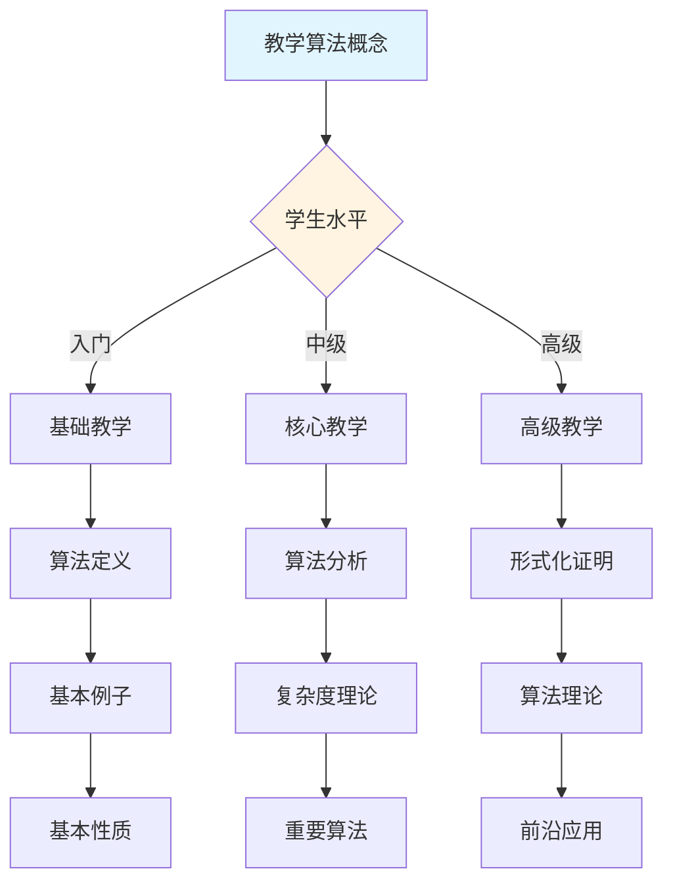
```mermaid
graph TD
    A[教学算法概念] --> B{学生水平}
    B -->|入门| C[基础教学]
    B -->|中级| D[核心教学]
    B -->|高级| E[高级教学]

    C --> C1[算法定义]
    C1 --> C2[基本例子]
    C2 --> C3[基本性质]

    D --> D1[算法分析]
    D1 --> D2[复杂度理论]
    D2 --> D3[重要算法]

    E --> E1[形式化证明]
    E1 --> E2[算法理论]
    E2 --> E3[前沿应用]

    style A fill:#e1f5ff
    style B fill:#fff4e1
```

### 4.2 教学方法决策

**基于认知维度的教学方法**：

1. **直观维度**（入门教学）
   - 使用思维导图建立框架
   - 使用具体例子（排序算法、搜索算法、图算法）
   - 使用流程图直观理解

2. **知性维度**（中级教学）
   - 使用多维矩阵深入分析
   - 使用概念分类系统
   - 使用关系分析建立联系

3. **理性维度**（高级教学）
   - 使用形式化证明严格理解
   - 使用逻辑推理深入分析
   - 使用系统建构整体把握

---

## 🔄 五、整合应用示例 (编号: C.CORE.031.DECISION.05)

### 5.1 完整学习流程示例

**阶段1：入门理解**:

1. 使用学习决策导图 → 确定学习路径：基础概念 → 算法定义 → 基本性质 → 基本应用
2. 使用总体思维导图 → 了解算法在离散数学和计算机科学中的位置
3. 阅读[算法-三视角版](./31-算法.md) → 理解算法的定义和基本性质
4. 使用论证过程 → 理解算法的直观意义（步骤、过程、计算、效率）

**阶段2：深入分析**:

1. 使用多维矩阵 → 分析算法的多维度特征（知识层次L0基础层、知识领域D7离散数学、学习难度中等）
2. 阅读[算法-三视角版](./31-算法.md) → 深入理解算法分析和复杂度理论
3. 使用形式化证明 → 学习算法相关定理的形式化证明
4. 使用分支关联思维导图 → 了解算法与图、组合数、数据结构的关系

**阶段3：应用研究**:

1. 使用研究决策导图 → 确定研究方向：算法理论
2. 使用知识关联网络 → 发现算法与数学、计算机、工程的关系
3. 使用形式化证明系统 → 构建算法理论体系
4. 阅读[算法-三视角版](./31-算法.md) → 了解算法的历史发展和开放问题

---

## 🔗 六、关联文档 (编号: C.CORE.031.DECISION.06)

### 6.1 核心概念文档

- [算法-三视角版](./31-算法.md)
- [算法](./31-算法.md)

### 6.2 框架文档

- [决策思维导图体系](../01-总体思维导图/05-决策思维导图体系.md)
- [概念体系全面梳理与推进计划](../00-概念体系全面梳理与推进计划-2025年1月.md)
- [核心概念与新框架整合指南](../00-核心概念与新框架整合指南-2025年1月.md)

### 6.3 相关文档

- [核心概念索引](./00-核心概念索引.md)
- [知识矩阵总览](../02-知识矩阵/00-知识矩阵总览.md)
- [形式化证明系统](../00-形式化证明系统-2025年11月.md)

---

**维护状态**: 持续更新中

