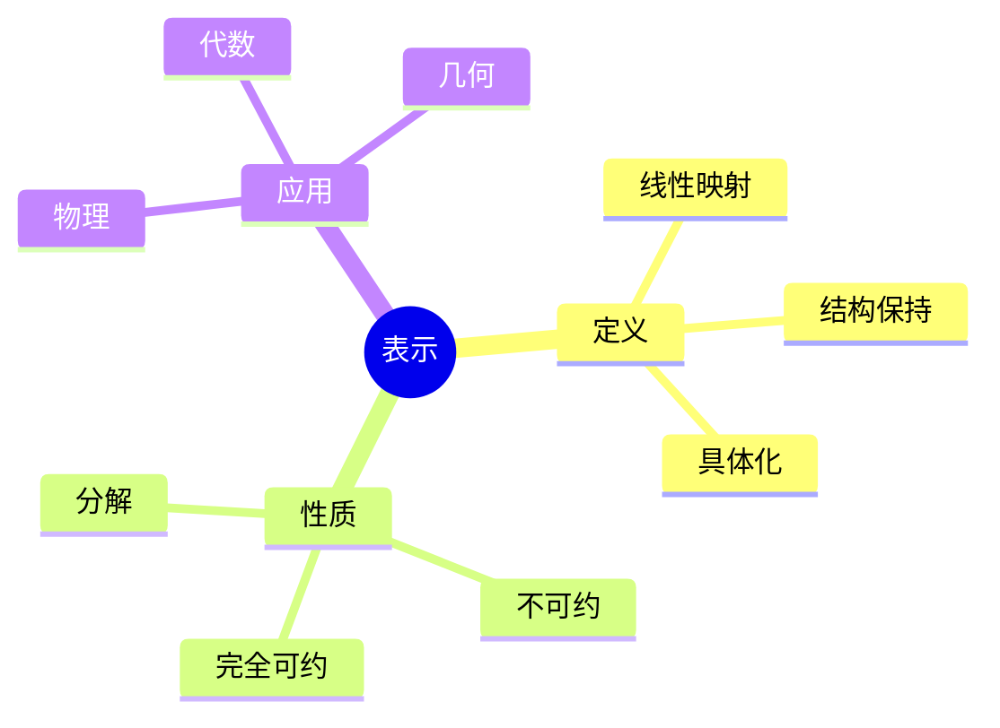
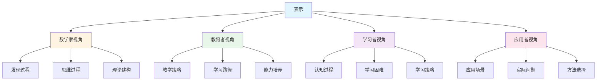
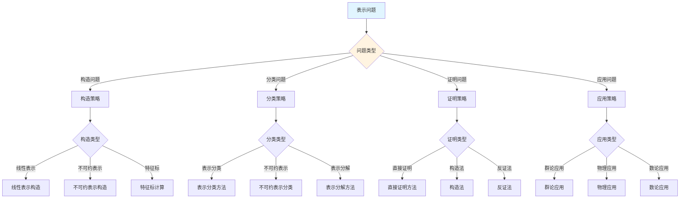
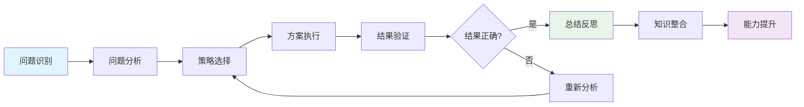
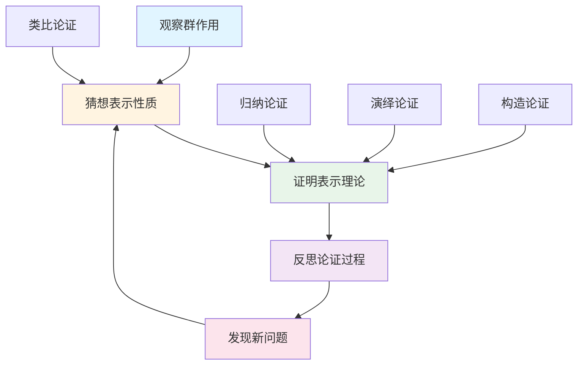
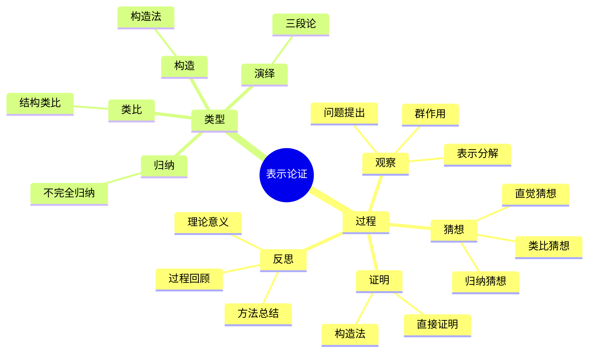

# 表示 (Representation) - 三视角组织版

**概念编号**: C.CORE.032
**知识层次**: L0-L2
**知识领域**: D8 (交叉领域)
**创建日期**: 2025年1月
**最后更新**: 2025年1月

---

## 📋 目录 / Table of Contents

- [表示 (Representation) - 三视角组织版](#表示-representation---三视角组织版)
  - [📋 目录 / Table of Contents](#-目录--table-of-contents)
  - [1. 📋 概述 (编号: C.CORE.032.01)](#1--概述-编号-ccore03201)
  - [🧠 认知学视角：如何理解表示 (编号: C.CORE.032.02)](#-认知学视角如何理解表示-编号-ccore03202)
    - [认知起点 (编号: C.CORE.032.02.01)](#认知起点-编号-ccore0320201)
    - [认知过程 (编号: C.CORE.032.02.02)](#认知过程-编号-ccore0320202)
      - [阶段1：直观理解阶段 (编号: C.CORE.032.02.02.01)](#阶段1直观理解阶段-编号-ccore032020201)
      - [阶段2：概念形成阶段 (编号: C.CORE.032.02.02.02)](#阶段2概念形成阶段-编号-ccore032020202)
      - [阶段3：形式化阶段 (编号: C.CORE.032.02.02.03)](#阶段3形式化阶段-编号-ccore032020203)
    - [认知障碍 (编号: C.CORE.032.02.03)](#认知障碍-编号-ccore0320203)
    - [认知工具 (编号: C.CORE.032.02.04)](#认知工具-编号-ccore0320204)
  - [🎓 教育学视角：如何教学表示 (编号: C.CORE.032.03)](#-教育学视角如何教学表示-编号-ccore03203)
    - [教学目标 (编号: C.CORE.032.03.01)](#教学目标-编号-ccore0320301)
    - [教学路径 (编号: C.CORE.032.03.02)](#教学路径-编号-ccore0320302)
      - [阶段1：引入阶段（激发兴趣） (编号: C.CORE.032.03.02.01)](#阶段1引入阶段激发兴趣-编号-ccore032030201)
      - [阶段2：探索阶段（主动建构） (编号: C.CORE.032.03.02.02)](#阶段2探索阶段主动建构-编号-ccore032030202)
      - [阶段3：形式化阶段（抽象概括） (编号: C.CORE.032.03.02.03)](#阶段3形式化阶段抽象概括-编号-ccore032030203)
      - [阶段4：巩固阶段（应用深化） (编号: C.CORE.032.03.02.04)](#阶段4巩固阶段应用深化-编号-ccore032030204)
    - [教学难点 (编号: C.CORE.032.03.03)](#教学难点-编号-ccore0320303)
    - [教学策略 (编号: C.CORE.032.03.04)](#教学策略-编号-ccore0320304)
    - [评估方法 (编号: C.CORE.032.03.05)](#评估方法-编号-ccore0320305)
  - [🔬 数学家视角：如何思考表示 (编号: C.CORE.032.04)](#-数学家视角如何思考表示-编号-ccore03204)
    - [问题起源 (编号: C.CORE.032.04.01)](#问题起源-编号-ccore0320401)
    - [思维过程 (编号: C.CORE.032.04.02)](#思维过程-编号-ccore0320402)
      - [步骤1：问题提出 (编号: C.CORE.032.04.02.01)](#步骤1问题提出-编号-ccore032040201)
      - [步骤2：概念形成 (编号: C.CORE.032.04.02.02)](#步骤2概念形成-编号-ccore032040202)
      - [步骤3：理论发展 (编号: C.CORE.032.04.02.03)](#步骤3理论发展-编号-ccore032040203)
    - [历史发展 (编号: C.CORE.032.04.03)](#历史发展-编号-ccore0320403)
    - [3.2 关键人物和贡献 (编号: C.CORE.032.04.04)](#32-关键人物和贡献-编号-ccore0320404)
    - [重要定理 (编号: C.CORE.032.04.05)](#重要定理-编号-ccore0320405)
    - [开放问题 (编号: C.CORE.032.04.06)](#开放问题-编号-ccore0320406)
    - [一、第一人称思维描述 (编号: C.CORE.032.04.07)](#一第一人称思维描述-编号-ccore0320407)
      - [1.1 Frobenius的发现过程](#11-frobenius的发现过程)
    - [二、数学直觉的形成 (编号: C.CORE.032.04.08)](#二数学直觉的形成-编号-ccore0320408)
      - [2.1 直觉在概念发现中的作用](#21-直觉在概念发现中的作用)
      - [2.2 如何培养表示直觉](#22-如何培养表示直觉)
    - [三、数学美的教育价值 (编号: C.CORE.032.04.09)](#三数学美的教育价值-编号-ccore0320409)
      - [3.1 表示论的美在哪里](#31-表示论的美在哪里)
      - [3.2 如何培养学生的数学美感](#32-如何培养学生的数学美感)
    - [四、问题解决策略 (编号: C.CORE.032.04.10)](#四问题解决策略-编号-ccore0320410)
      - [4.1 数学家的启发式方法](#41-数学家的启发式方法)
      - [4.2 思维过程分析](#42-思维过程分析)
    - [五、批判性反思 (编号: C.CORE.032.04.11)](#五批判性反思-编号-ccore0320411)
      - [5.1 表示概念的局限性](#51-表示概念的局限性)
      - [5.2 表示理论的未解决问题](#52-表示理论的未解决问题)
  - [💡 数学解释：为什么表示是这样定义的 (编号: C.CORE.032.05)](#-数学解释为什么表示是这样定义的-编号-ccore03205)
    - [一、直观解释：表示是什么？](#一直观解释表示是什么)
      - [1.1 具体例子](#11-具体例子)
      - [1.2 形象类比](#12-形象类比)
      - [1.3 几何直观](#13-几何直观)
      - [1.4 操作体验](#14-操作体验)
    - [二、知性解释：表示的本质是什么？](#二知性解释表示的本质是什么)
      - [2.1 概念定义](#21-概念定义)
      - [2.2 分类体系](#22-分类体系)
      - [2.3 抽象结构](#23-抽象结构)
      - [2.4 知识体系](#24-知识体系)
    - [三、理性解释：表示的公理化定义](#三理性解释表示的公理化定义)
      - [3.1 公理体系](#31-公理体系)
      - [3.2 形式化证明](#32-形式化证明)
      - [3.3 系统建构](#33-系统建构)
    - [四、多视角解释：从不同角度理解表示](#四多视角解释从不同角度理解表示)
      - [4.1 数学家视角：表示是如何被发现的？](#41-数学家视角表示是如何被发现的)
      - [4.2 教育者视角：如何教学表示？](#42-教育者视角如何教学表示)
      - [4.3 学习者视角：如何学习表示？](#43-学习者视角如何学习表示)
      - [4.4 应用者视角：如何应用表示？](#44-应用者视角如何应用表示)
    - [五、思维表征：用多种方式理解表示](#五思维表征用多种方式理解表示)
      - [5.1 思维导图：表示的知识结构](#51-思维导图表示的知识结构)
      - [5.2 矩阵对比：不同解释方式的对比](#52-矩阵对比不同解释方式的对比)
      - [5.3 多视角表征：从不同角度表征表示](#53-多视角表征从不同角度表征表示)
      - [5.4 决策树：表示问题分类和策略选择](#54-决策树表示问题分类和策略选择)
      - [5.5 决策逻辑路径：表示问题解决过程](#55-决策逻辑路径表示问题解决过程)
      - [5.6 多维对比矩阵：表示概念特征对比](#56-多维对比矩阵表示概念特征对比)
  - [🔍 数学论证：如何论证表示 (编号: C.CORE.032.06)](#-数学论证如何论证表示-编号-ccore03206)
    - [一、论证过程：从观察到反思](#一论证过程从观察到反思)
      - [1.1 观察（Observation）](#11-观察observation)
      - [1.2 猜想（Conjecture）](#12-猜想conjecture)
      - [1.3 证明（Proof）](#13-证明proof)
      - [1.4 反思（Reflection）](#14-反思reflection)
    - [二、论证类型：多种推理方式](#二论证类型多种推理方式)
      - [2.1 归纳论证（Inductive Reasoning）](#21-归纳论证inductive-reasoning)
      - [2.2 演绎论证（Deductive Reasoning）](#22-演绎论证deductive-reasoning)
      - [2.3 类比论证（Analogical Reasoning）](#23-类比论证analogical-reasoning)
      - [2.4 构造论证（Constructive Reasoning）](#24-构造论证constructive-reasoning)
    - [三、论证可视化：用图形表示论证过程](#三论证可视化用图形表示论证过程)
      - [3.1 论证流程图](#31-论证流程图)
      - [3.2 论证类型对比](#32-论证类型对比)
      - [3.3 论证思维导图](#33-论证思维导图)
  - [🔗 三视角整合 (编号: C.CORE.032.07)](#-三视角整合-编号-ccore03207)
    - [三个视角的关联](#三个视角的关联)
    - [如何综合运用三个视角](#如何综合运用三个视角)
  - [📚 参考文献 (编号: C.CORE.032.08)](#-参考文献-编号-ccore03208)
    - [权威资源](#权威资源)
    - [经典教材](#经典教材)
    - [研究论文](#研究论文)

---

## 1. 📋 概述 (编号: C.CORE.032.01)

表示是数学中的核心概念，将抽象代数结构（如群、环、代数）通过线性映射具体化。表示论连接了代数、几何、物理等领域，是现代数学的重要工具。

本文档从**数学认知学**、**教育学**、**数学家**三个视角深入展开表示概念，避免简单的概念堆垒。

**权威资源对齐**:

- Wikipedia: [Representation Theory](https://en.wikipedia.org/wiki/Representation_theory)
- Stanford课程: Math 210A (Representation Theory)
- Princeton课程: MAT 550 (Representation Theory)
- MIT课程: 18.712 (Introduction to Representation Theory)
- Metamath: [Representation](http://us.metamath.org/mpeuni/df-representation.html)

---

## 🧠 认知学视角：如何理解表示 (编号: C.CORE.032.02)

### 认知起点 (编号: C.CORE.032.02.01)

**学习者已有的知识基础**:

- 群的概念
- 线性映射的概念
- 日常经验中的"表示"、"具体化"概念

**日常经验中的类似概念**:

- "表示"：用具体方式表示抽象概念
- "具体化"：将抽象具体化
- "映射"：从一个到另一个的映射

### 认知过程 (编号: C.CORE.032.02.02)

#### 阶段1：直观理解阶段 (编号: C.CORE.032.02.02.01)

**具体例子**:

- 例子1：平凡表示 - $\rho(g) = \text{id}_V$
- 例子2：一维表示 - $\rho: G \to \mathbb{C}^*$
- 例子3：正则表示 - $G$在群代数上的作用

**形象类比**:

- **具体化类比**: 表示就像"将抽象具体化"
  - 群是抽象的
  - 矩阵是具体的
  - 表示将群映射到矩阵

- **映射类比**: 表示就像"群到矩阵的映射"
  - 群元素映射到矩阵
  - 群运算映射到矩阵乘法
  - 保持群结构

**可视化表示**:

```text
表示:
    G ──ρ──> GL(V)
    群      矩阵群
    抽象    具体
```

#### 阶段2：概念形成阶段 (编号: C.CORE.032.02.02.02)

**从例子中抽象出共同特征**:

- 所有例子都涉及"群到矩阵的映射"
- 映射保持群结构
- 映射是群同态

**识别关键属性**:

1. **群同态**: $\rho: G \to GL(V)$是群同态
2. **线性性**: $\rho$是线性的
3. **保持结构**: $\rho(gh) = \rho(g)\rho(h)$

**建立概念边界**:

- **什么是表示**: 群到矩阵群的群同态
- **什么不是表示**:
  - 不是群同态的映射（不是表示）

#### 阶段3：形式化阶段 (编号: C.CORE.032.02.02.03)

**严格定义**:

- 群表示：$\rho: G \to GL(V)$是群同态
- 等价定义：$G$在向量空间$V$上的线性作用

**公理化表述**:

- 条件1：群同态
- 条件2：线性性
- 条件3：保持结构

**逻辑结构**:

- 表示是表示论的基础
- 表示可以研究群结构
- 表示是物理学的基础

### 认知障碍 (编号: C.CORE.032.02.03)

**常见误解**:

1. **误解1**: 认为表示就是矩阵
   - **纠正**: 表示是群到矩阵群的映射，不是矩阵本身

2. **误解2**: 认为所有群都有表示
   - **纠正**: 所有群都有表示，但表示不唯一

3. **误解3**: 混淆表示和同态
   - **纠正**: 表示是特殊的群同态，映射到矩阵群

**理解难点**:

1. **难点1**: 表示的抽象性
   - **原因**: 表示比较抽象
   - **解决方法**: 从具体例子开始，逐步抽象

2. **难点2**: 不可约表示
   - **原因**: 不可约表示比较抽象
   - **解决方法**: 用具体例子，强调不可约表示的作用

3. **难点3**: 表示的分类
   - **原因**: 表示分类比较复杂
   - **解决方法**: 用具体例子，逐步掌握分类方法

**认知陷阱**:

- **矩阵**: 需要理解表示是映射，不是矩阵
- **同态**: 需要理解表示是特殊的同态

### 认知工具 (编号: C.CORE.032.02.04)

**类比工具**:

- **具体化类比**: 表示 = 将抽象具体化
- **映射类比**: 表示 = 群到矩阵的映射

**可视化工具**:

- **表示图**: 用表示图表示表示
- **矩阵图**: 用矩阵图表示矩阵

**具体化工具**:

- **具体例子**: 用具体例子理解抽象概念
- **反例**: 用反例理解概念边界

---

## 🎓 教育学视角：如何教学表示 (编号: C.CORE.032.03)

### 教学目标 (编号: C.CORE.032.03.01)

**知识目标**:

- 理解表示的基本概念
- 掌握表示的定义
- 理解表示的性质
- 理解表示的应用

**能力目标**:

- 能够构造表示
- 能够理解表示的性质
- 能够应用表示研究群结构
- 能够理解表示的重要性

**情感目标**:

- 培养数学抽象思维
- 培养代数思维
- 激发对数学的兴趣

### 教学路径 (编号: C.CORE.032.03.02)

#### 阶段1：引入阶段（激发兴趣） (编号: C.CORE.032.03.02.01)

**实际问题**:

- 问题1：如何研究群结构？
- 问题2：如何将抽象具体化？
- 问题3：如何研究物理对称性？

**历史背景**:

- 表示论的历史发展
- 表示论在数学中的地位
- 表示论在物理中的应用

**引发认知冲突**:

- 问题：如何统一研究各种群结构？
- 引出表示的概念

#### 阶段2：探索阶段（主动建构） (编号: C.CORE.032.03.02.02)

**引导发现**:

1. 让学生自己列举"将抽象具体化"的例子
2. 让学生观察这些例子的共同特征
3. 引导学生抽象出表示的定义

**合作探究**:

- 小组讨论：什么是表示？
- 小组讨论：表示有哪些性质？
- 小组讨论：如何构造表示？

**多元表征**:

- **语言表征**: "表示是群到矩阵群的群同态"
- **符号表征**: $\rho: G \to GL(V)$
- **图形表征**: 表示图、矩阵图
- **集合表征**: 表示定义

#### 阶段3：形式化阶段（抽象概括） (编号: C.CORE.032.03.02.03)

**严格定义**:

- 表示的定义
- 表示的性质
- 表示的分类

**性质证明**:

- 表示的基本性质
- 不可约表示
- 表示的分解

**应用拓展**:

- 表示在代数中的应用
- 表示在几何中的应用
- 表示在物理中的应用

#### 阶段4：巩固阶段（应用深化） (编号: C.CORE.032.03.02.04)

**练习应用**:

- 基础练习：表示的构造和性质
- 应用练习：用表示研究群结构
- 综合练习：表示的综合应用

**变式训练**:

- 不同形式的表示
- 不同性质的表示
- 表示的应用

**知识整合**:

- 表示与其他概念的联系
- 表示在数学体系中的地位

### 教学难点 (编号: C.CORE.032.03.03)

**难点1：表示的抽象性**:

- **难点描述**: 学生难以理解表示的抽象概念
- **解决方法**:
  - 从具体例子开始
  - 逐步抽象
  - 用具体例子说明

**难点2：不可约表示**:

- **难点描述**: 学生难以理解不可约表示
- **解决方法**:
  - 用具体例子
  - 强调不可约表示的作用
  - 用图形可视化

**难点3：表示的分类**:

- **难点描述**: 学生难以掌握表示分类
- **解决方法**:
  - 用具体例子
  - 逐步掌握分类方法
  - 用练习巩固

### 教学策略 (编号: C.CORE.032.03.04)

**策略1：从具体到抽象**:

- 先给出具体例子
- 再抽象出一般概念
- 最后给出严格定义

**策略2：多元表征**:

- 用语言、符号、图形等多种方式表示同一概念
- 帮助学生建立不同表征之间的联系

**策略3：问题驱动**:

- 从实际问题出发
- 引出数学概念
- 解决问题

**策略4：可视化教学**:

- 使用表示图
- 使用矩阵图
- 使用具体例子

### 评估方法 (编号: C.CORE.032.03.05)

**形成性评估**（评估理解过程）:

- 课堂提问：检查学生对概念的理解
- 小组讨论：观察学生的思考过程
- 练习作业：检查学生的应用能力

**总结性评估**（评估最终理解）:

- 测验：检查学生对概念和构造的掌握
- 项目：检查学生应用表示研究群结构的能力
- 反思：检查学生对表示概念的理解深度

---

## 🔬 数学家视角：如何思考表示 (编号: C.CORE.032.04)

### 问题起源 (编号: C.CORE.032.04.01)

**历史背景**:

- 19世纪：表示论的起源
- 20世纪：表示论的发展
- 20世纪中期：表示论的现代发展

**原始问题**:

- **问题1**: 如何研究群结构？
- **问题2**: 如何将抽象具体化？
- **问题3**: 表示有哪些性质？

**研究动机**:

- 统一代数理论
- 发展表示论
- 研究物理对称性

### 思维过程 (编号: C.CORE.032.04.02)

#### 步骤1：问题提出 (编号: C.CORE.032.04.02.01)

**观察到的现象**:

- 需要研究群结构
- 需要将抽象具体化
- 需要统一代数理论

**提出的猜想**:

- 可以引入表示概念
- 表示可以研究群结构
- 表示有丰富的性质

**需要解决的问题**:

- 如何定义表示？
- 表示应该满足什么条件？
- 表示有哪些性质？

#### 步骤2：概念形成 (编号: C.CORE.032.04.02.02)

**尝试性定义**:

- **群同态定义**: 通过群同态
- **线性作用定义**: 通过线性作用

**性质探索**:

- 表示的基本性质
- 不可约表示
- 表示的分解

**结构发现**:

- 表示是表示论的基础
- 表示可以研究群结构
- 表示是物理学的基础

#### 步骤3：理论发展 (编号: C.CORE.032.04.02.03)

**定理证明**:

- 表示的基本性质
- 不可约表示
- 表示的分解

**应用拓展**:

- 表示在代数中的应用
- 表示在几何中的应用
- 表示在物理中的应用

**理论完善**:

- 表示的严格定义
- 表示的范畴论研究
- 表示的应用研究

### 历史发展 (编号: C.CORE.032.04.03)

**早期阶段**（19世纪）:

- **Frobenius (1897)**: 发展群表示论
- **Burnside (1897)**: 研究有限群表示

**关键突破**（20世纪）:

- **Schur (1905)**: 发展Schur引理
- **Weyl (1925)**: 发展紧致群表示

**现代发展**（20世纪中期）:

- **Langlands (1967)**: 朗兰兹纲领
- **Kazhdan-Lusztig (1979)**: 发展Kazhdan-Lusztig理论

### 3.2 关键人物和贡献 (编号: C.CORE.032.04.04)

**Ferdinand Frobenius (1849-1917)**:

- 发展群表示论
- 建立表示论基础

**Issai Schur (1875-1941)**:

- 发展Schur引理
- 建立现代表示论

**Robert Langlands (1936-)**:

- 朗兰兹纲领
- 统一数论和表示论

### 重要定理 (编号: C.CORE.032.04.05)

**Schur引理**:

- 不可约表示之间的映射是标量
- 意义：表示论的基础

**Maschke定理**:

- 有限群的表示可以分解为不可约表示的直和
- 意义：表示分解的基础

**Peter-Weyl定理**:

- 紧致群的表示可以分解为有限维不可约表示的直和
- 意义：紧致群表示的基础

### 开放问题 (编号: C.CORE.032.04.06)

**未解决问题**:

- 表示的分类问题
- 表示的应用问题
- 表示的推广问题

**研究方向**:

- 表示的范畴论研究
- 表示的应用研究
- 表示的计算研究

### 一、第一人称思维描述 (编号: C.CORE.032.04.07)

#### 1.1 Frobenius的发现过程

**详细历史背景**:

- **1896年**：Frobenius发表《群的特征》（Über Gruppencharaktere）
- **背景**：研究群论，发现需要将群作用在向量空间上
- **问题**：如何描述群的作用？如何统一处理群和线性代数？

**Frobenius的详细第一人称描述**:
> "1896年，我在研究群论时，遇到了一个问题：如何描述群的作用？
>
> 我发现，群$G$可以作用在向量空间$V$上，这种作用可以通过群同态$\rho: G \to \text{GL}(V)$来描述。
>
> 我的方法是这样的：
>
> - **思路**：用表示描述群的作用
> - **定义**：群$G$的表示是群同态$\rho: G \to \text{GL}(V)$，其中$V$是向量空间
> - **例子**：$S_3$的表示$\rho: S_3 \to \text{GL}_2(\mathbb{C})$
>
> 例如，对于$S_3$（3次对称群）：
>
> - **表示**：$\rho: S_3 \to \text{GL}_2(\mathbb{C})$
> - **定义**：$\rho((12)) = \begin{pmatrix} 0 & 1 \\ 1 & 0 \end{pmatrix}$，$\rho((123)) = \begin{pmatrix} \omega & 0 \\ 0 & \omega^2 \end{pmatrix}$，其中$\omega = e^{2\pi i/3}$
> - **意义**：$S_3$作用在$\mathbb{C}^2$上
>
> 对于不可约表示：
>
> - **定义**：表示$\rho$不可约，如果$V$没有非平凡的不变子空间
> - **例子**：$S_3$有3个不可约表示：平凡表示、符号表示、2维表示
> - **意义**：不可约表示是表示的基本单位
>
> 我还发现了Maschke定理：
>
> - **定理**：有限群的表示可以分解为不可约表示的直和
> - **例子**：$S_3$的任何表示都可以分解为3个不可约表示的直和
> - **意义**：Maschke定理是表示分解的基础
>
> 这让我意识到，表示是描述群作用的工具，不可约表示是表示的基本单位。这为表示论提供了基础。"

**详细的思维过程**:

1. **观察到的现象**（1896年）:

   **现象1：需要将群作用在向量空间上**
   - **问题**：如何描述群的作用？
   - **例子**：$S_3$作用在$\mathbb{C}^2$上
   - **需要**：统一的概念

   **现象2：这种作用有特殊的性质**
   - **问题**：表示有什么性质？
   - **例子**：不可约表示、Maschke定理
   - **需要**：建立表示论

   **现象3：需要统一的概念**
   - **问题**：如何统一处理群和线性代数？
   - **思路**：用表示统一
   - **需要**：建立表示论

2. **提出的猜想**（1896年）:

   **猜想1：用表示描述群的作用**
   - **思路**：定义表示为群同态$\rho: G \to \text{GL}(V)$
   - **例子**：$S_3$的表示
   - **优点**：统一描述群的作用

   **猜想2：不可约表示的结构**
   - **性质**：不可约表示是表示的基本单位
   - **例子**：$S_3$有3个不可约表示
   - **意义**：不可约表示是表示的基础

   **猜想3：Maschke定理**
   - **定理**：有限群的表示可以分解为不可约表示的直和
   - **例子**：$S_3$的任何表示都可以分解
   - **意义**：Maschke定理是表示分解的基础

3. **遇到的困难**（1896年）:

   **困难1：如何严格定义表示？**
   - **问题**：如何定义表示？
   - **解决**：定义表示为群同态$\rho: G \to \text{GL}(V)$
   - **意义**：为表示提供严格的数学基础

   **困难2：如何判断表示的性质？**
   - **问题**：如何判断表示是否不可约？
   - **解决**：使用Schur引理、特征标理论
   - **意义**：为表示分类提供方法

   **困难3：如何应用表示理论？**
   - **问题**：如何用表示理论解决实际问题？
   - **解决**：建立特征标理论、朗兰兹纲领
   - **意义**：为表示提供应用基础

4. **突破的时刻**（1896年，Frobenius）:

   **突破1：表示的概念**
   - 引入表示的概念描述群的作用
   - **关键**：表示是群同态$\rho: G \to \text{GL}(V)$
   - **意义**：为表示论提供基础

   **突破2：Maschke定理**
   - 证明Maschke定理
   - **关键**：有限群的表示可以分解为不可约表示的直和
   - **意义**：为表示分解提供基础

   **突破3：表示论的广泛应用**
   - 表示论可以应用到更广泛的领域
   - **关键**：表示是群论的基础
   - **意义**：表示论成为群论的基础

### 二、数学直觉的形成 (编号: C.CORE.032.04.08)

#### 2.1 直觉在概念发现中的作用

**Frobenius的直觉**:

- **直觉1**: "表示"是"群的作用"——这个直觉引导Frobenius发现表示
- **直觉2**: 表示可以统一处理群和线性代数——这个直觉引导Frobenius建立表示论
- **直觉3**: 表示是群论的基础——这个直觉引导Frobenius建立表示论

**直觉的验证**:

- 通过严格的数学证明验证直觉的正确性
- 通过不可约表示严格化表示定义
- 通过应用验证表示的广泛性

**直觉的深化**:

- 从"群的作用"到"表示的严格定义"
- 从"统一处理群和线性代数"到"表示的广泛应用"
- 从"群论基础"到"表示论的深入发展"

#### 2.2 如何培养表示直觉

**数学家的建议**:

- **Frobenius**: "表示直觉是长期训练的结果。通过大量练习和深入思考，我们可以培养对表示的直觉。"
- **Schur**: "从具体例子开始，逐步抽象，这是培养表示直觉的有效方法。"

**培养方法**:

1. **大量练习**: 通过大量表示构造练习，培养对表示的直觉
2. **深入思考**: 深入思考表示的本质，理解表示的深层结构
3. **类比和联想**: 通过类比和联想，建立表示与其他概念的联系
4. **与专家交流**: 与数学家交流，学习他们的思维方式

**教学启示**:

- 从具体例子开始，逐步抽象
- 鼓励学生思考表示的本质
- 引导学生建立表示与其他概念的联系

### 三、数学美的教育价值 (编号: C.CORE.032.04.09)

#### 3.1 表示论的美在哪里

**结构美**:

- **简洁性**: 表示的概念非常简洁——"群到线性变换群的同态"
- **统一性**: 表示可以统一描述数学中的各种群作用
- **和谐性**: 表示满足优美的规律（Maschke定理、Schur引理等）

**数学家的评价**:

- **Frobenius**: "表示论的美在于它的统一性。它为我们提供了一个统一的框架来理解群作用。"
- **Schur**: "表示论的美在于它的基础性。它是群论的基础，所有群作用都可以用表示来描述。"

#### 3.2 如何培养学生的数学美感

**数学家的建议**:

- **Frobenius**: "展示表示论的美感，让学生感受到数学的美。"
- **Schur**: "通过表示论的历史和发展，让学生理解数学的美。"

**教学方法**:

1. **展示数学美**:
   - 展示表示概念的简洁性和统一性
   - 展示表示的优美规律
   - 展示表示在数学中的基础地位

2. **引导学生欣赏**:
   - 引导学生欣赏表示概念的简洁性
   - 引导学生欣赏表示的和谐性
   - 引导学生欣赏表示的基础性

3. **鼓励学生创造美**:
   - 鼓励学生发现表示论的美
   - 鼓励学生创造优美的表示证明
   - 鼓励学生探索表示论的美

### 四、问题解决策略 (编号: C.CORE.032.04.10)

#### 4.1 数学家的启发式方法

**策略1：从具体到抽象**:

- 从具体的表示例子开始
- 抽象出表示的一般性质
- 建立表示的理论体系

**策略2：从简单到复杂**:

- 先理解基本表示
- 再理解表示运算
- 最后理解表示理论

**策略3：从问题到理论**:

- 从实际问题出发
- 引出表示概念
- 建立表示理论

#### 4.2 思维过程分析

**问题识别**:

- 识别问题类型：表示定义问题、表示性质问题、表示应用问题
- 识别问题难度：简单问题、中等问题、复杂问题

**策略选择**:

- 简单问题：直接方法
- 中等问题：分步方法
- 复杂问题：分解方法

**执行和反思**:

- 执行策略，解决问题
- 反思过程，总结经验
- 改进方法，提高效率

### 五、批判性反思 (编号: C.CORE.032.04.11)

#### 5.1 表示概念的局限性

**概念的边界**:

- 表示只描述群的作用，不能描述所有数学结构
- 表示是抽象的，需要具体化才能应用
- 表示不能表示所有数学量

**概念的推广**:

- 无限维表示：更一般的表示
- 范畴表示：范畴论中的表示
- 导出表示：同调代数中的表示

#### 5.2 表示理论的未解决问题

**未解决的问题**:

- 表示的分类问题：如何分类所有表示？
- 表示的应用问题：如何更好地应用表示？
- 表示的推广问题：如何推广表示概念？

**研究方向**:

- 表示的范畴论研究
- 表示的应用研究
- 表示的计算研究

---

## 💡 数学解释：为什么表示是这样定义的 (编号: C.CORE.032.05)

### 一、直观解释：表示是什么？

#### 1.1 具体例子

**生活中的例子**：

- **具体化抽象**：表示将抽象结构具体化
  - 例如：群可以通过矩阵表示
  - **为什么这样定义**：因为我们需要一个概念来表示"抽象结构的具体化"
- **线性化**：表示将结构线性化
  - 例如：群可以作用在向量空间上
  - **为什么这样定义**：因为我们需要一个概念来表示"结构的线性化"
- **可视化**：表示使抽象结构可视化
  - 例如：对称群可以通过旋转矩阵表示
  - **为什么这样定义**：因为我们需要一个概念来表示"结构的可视化"

**数学中的例子**：

- **群表示**：$\rho: G \to \operatorname{GL}(V)$是群$G$的表示
  - **为什么这样定义**：我们需要一个简单的方式来表示"群的表示"
- **代数表示**：$\rho: A \to \operatorname{End}(V)$是代数$A$的表示
  - **为什么这样定义**：我们需要一个概念来表示"代数的表示"
- **不可约表示**：不能分解的表示
  - **为什么这样定义**：我们需要一个概念来表示"不可约表示"

#### 1.2 形象类比

**翻译类比**：

- **表示就像"翻译"**
  - 翻译将一种语言转换为另一种语言
  - 表示将抽象结构转换为线性结构
- **为什么这样类比**：这个类比帮助我们理解表示的"转换"性质

**投影类比**：

- **表示就像"投影"**
  - 投影将高维对象投影到低维
  - 表示将抽象结构投影到线性结构
- **为什么这样类比**：这个类比帮助我们理解表示的"投影"性质

#### 1.3 几何直观

**矩阵表示**：

- 使用矩阵表示表示
- 例如：群可以通过矩阵表示
- **为什么使用矩阵表示**：矩阵表示提供几何直观，帮助我们理解表示

**特征标表示**：

- 使用特征标表示表示
- 例如：特征标是表示的"指纹"
- **为什么使用特征标**：特征标提供几何直观，帮助我们理解表示

#### 1.4 操作体验

**表示运算的操作**：

- **表示的直和**：$\rho_1 \oplus \rho_2$是表示的直和
  - **为什么这样操作**：因为我们需要一个运算来表示"表示的直和"
- **表示的张量积**：$\rho_1 \otimes \rho_2$是表示的张量积
  - **为什么这样操作**：因为我们需要一个运算来表示"表示的张量积"
- **表示的分解**：表示可以分解为不可约表示
  - **为什么这样操作**：因为我们需要一个工具来分解表示

### 二、知性解释：表示的本质是什么？

#### 2.1 概念定义

**表示的内涵**：

- **表示是将抽象代数结构通过线性映射具体化**
  - **线性映射**：$\rho: G \to \operatorname{GL}(V)$是线性映射
  - **结构保持**：表示保持代数结构
  - **具体化**：表示将抽象结构具体化
- **为什么这样定义**：这些特征使得表示成为一个完整的代数工具，支持所有结构具体化研究

**表示的外延**：

- **群表示**：$\rho: G \to \operatorname{GL}(V)$
- **代数表示**：$\rho: A \to \operatorname{End}(V)$
- **Lie代数表示**：$\rho: \mathfrak{g} \to \mathfrak{gl}(V)$
- **为什么这样分类**：不同的表示类型有不同的性质和用途

#### 2.2 分类体系

**按类型分类**：

- **群表示**：群的表示
- **代数表示**：代数的表示
- **Lie代数表示**：Lie代数的表示
- **为什么这样分类**：类型是表示的基本特征

**按性质分类**：

- **不可约表示**：不能分解的表示
- **完全可约表示**：可以完全分解的表示
- **表示的维数**：表示的维数
- **为什么这样分类**：性质是表示的重要特征

#### 2.3 抽象结构

**表示的运算结构**：

- **表示的直和**：$\rho_1 \oplus \rho_2$
- **表示的张量积**：$\rho_1 \otimes \rho_2$
- **表示的分解**：表示可以分解为不可约表示
- **为什么有这些运算**：这些运算使得表示具有代数结构

**表示的关系结构**：

- **表示的等价**：两个表示如果同构，则等价
- **表示的分解**：表示可以分解为不可约表示
- **为什么有这个关系**：这个关系帮助我们研究表示的结构

#### 2.4 知识体系

**表示在数学体系中的位置**：

- **基础地位**：表示是代数学的基础
  - 表示将抽象结构具体化
  - 表示连接代数和线性代数
- **为什么是基础**：表示提供了统一的框架来研究代数结构

**表示与其他概念的关系**：

- **表示与群**：群可以通过表示研究
- **表示与线性代数**：表示使用线性代数工具
- **表示与物理**：表示在物理中有重要应用
- **为什么有这些关系**：这些关系揭示了表示与其他数学概念的内在联系

### 三、理性解释：表示的公理化定义

#### 3.1 公理体系

**表示的定义**：

- **定义**：$\rho: G \to \operatorname{GL}(V)$是群$G$的表示如果$\rho$是群同态
- **为什么需要这个定义**：这个定义提供了表示的严格数学基础

**表示的公理**：

- **同态公理**：$\rho(gh) = \rho(g)\rho(h)$
- **单位元公理**：$\rho(e) = I$
- **为什么这样定义**：这些公理将表示放在更一般的框架中

#### 3.2 形式化证明

**表示性质的证明**：

- **表示的分解**：表示可以分解为不可约表示
  - **证明**：使用表示的定义和分解的性质
  - **为什么这样证明**：利用表示的定义和分解的性质
- **Schur引理**：不可约表示之间的映射是标量
  - **证明**：使用表示的定义和Schur引理
  - **为什么这样证明**：利用表示的定义和Schur引理

#### 3.3 系统建构

**表示论在数学基础中的地位**：

- **作为代数学基础**：表示是代数学的基础
- **提供具体化工具**：表示提供了将抽象结构具体化的工具
- **统一框架**：表示统一了各种代数结构研究

**表示论的发展历史**：

- **Frobenius的引入**（1896年）：引入群表示
- **Schur的发展**（1905年）：发展表示理论
- **Weyl的应用**（1925年）：在Lie群中应用表示
- **为什么这样发展**：数学的发展需要严格的基础，表示论的发展反映了这一需求

### 四、多视角解释：从不同角度理解表示

#### 4.1 数学家视角：表示是如何被发现的？

**Frobenius的发现过程**：

- **问题提出**：如何研究抽象群？
- **关键洞察**：使用表示，发现表示的线性结构
- **重要发现**：表示可以用于研究抽象群
- **为什么这样发现**：数学家的直觉和严格证明相结合

#### 4.2 教育者视角：如何教学表示？

**教学策略**：

- **从具体到抽象**：先学习具体例子（矩阵表示），再学习抽象定义
- **从简单到复杂**：先学习简单表示，再学习复杂表示
- **从直观到形式化**：先使用矩阵等直观工具，再学习严格定义
- **为什么这样教学**：符合认知规律，帮助学生逐步建立理解

#### 4.3 学习者视角：如何学习表示？

**认知过程**：

- **直观阶段**：通过具体例子理解表示的含义
- **概念阶段**：理解表示的定义和性质
- **形式化阶段**：理解严格定义和证明
- **为什么这样学习**：符合认知发展规律

#### 4.4 应用者视角：如何应用表示？

**应用场景**：

- **物理**：使用表示研究对称性
- **代数**：使用表示研究代数结构
- **几何**：使用表示研究几何结构
- **为什么这样应用**：表示提供了强大的工具来处理各种问题

### 五、思维表征：用多种方式理解表示

#### 5.1 思维导图：表示的知识结构



#### 5.2 矩阵对比：不同解释方式的对比

| 解释方式 | 特点 | 方法 | 工具 | 适用阶段 | 优势 | 局限 |
|---------|------|------|------|---------|------|------|
| **直观解释** | 具体、形象、可视 | 例子、类比、直观 | 矩阵、图形 | 入门阶段 | 易于理解 | 不够严格 |
| **知性解释** | 概念、分类、抽象 | 定义、分类、结构 | 概念图、知识图谱 | 中级阶段 | 系统完整 | 不够直观 |
| **理性解释** | 公理、证明、形式化 | 公理、证明、系统 | 形式化工具、证明系统 | 高级阶段 | 严格准确 | 不够具体 |
| **多视角解释** | 多角度、整合 | 多视角、整合 | 多视角工具 | 所有阶段 | 全面深入 | 可能复杂 |

#### 5.3 多视角表征：从不同角度表征表示



#### 5.4 决策树：表示问题分类和策略选择



**说明**：

- **问题分类**：根据问题类型（构造、分类、证明、应用）进行分类
- **策略选择**：根据问题类型选择相应的解决策略
- **方法应用**：根据具体问题选择合适的方法

#### 5.5 决策逻辑路径：表示问题解决过程



**说明**：

- **问题识别**：识别表示问题的类型和关键要素
- **问题分析**：分析问题的条件和目标
- **策略选择**：根据问题类型选择解决策略
- **方案执行**：执行选定的解决方案
- **结果验证**：验证结果的正确性
- **总结反思**：总结解题过程，反思解题方法
- **知识整合**：整合相关知识点
- **能力提升**：提升问题解决能力

#### 5.6 多维对比矩阵：表示概念特征对比

| 对比维度 | 表示定义 | 表示构造 | 表示分类 | 表示应用 |
|---------|---------|---------|---------|---------|
| **核心特征** | 群表示、线性表示 | 线性表示、不可约表示、特征标 | 表示分类、不可约表示、表示分解 | 群论、物理、数论应用 |
| **理解难度** | ⭐⭐⭐⭐ | ⭐⭐⭐⭐⭐ | ⭐⭐⭐⭐⭐ | ⭐⭐⭐⭐ |
| **应用频率** | ⭐⭐⭐⭐ | ⭐⭐⭐⭐ | ⭐⭐⭐⭐ | ⭐⭐⭐⭐ |
| **理论基础** | 表示定义 | 表示构造理论 | 表示分类理论 | 表示应用理论 |
| **教学重点** | 概念理解 | 构造方法 | 分类方法 | 应用能力 |
| **学习阶段** | 高级阶段 | 高级阶段 | 高级阶段 | 高级阶段 |
| **认知维度** | 知性+理性 | 理性 | 理性 | 理性+应用 |
| **思维表征** | 思维导图 | 决策树 | 决策逻辑路径 | 知识图谱 |

**说明**：

- **核心特征**：每个方面的核心特征
- **理解难度**：从1星到5星，表示理解难度
- **应用频率**：从1星到5星，表示应用频率
- **理论基础**：每个方面的理论基础
- **教学重点**：每个方面的教学重点
- **学习阶段**：每个方面的学习阶段
- **认知维度**：每个方面的认知维度
- **思维表征**：每个方面推荐的思维表征方法

---

## 🔍 数学论证：如何论证表示 (编号: C.CORE.032.06)

### 一、论证过程：从观察到反思

#### 1.1 观察（Observation）

**具体现象观察**：

- **现象1**：群可以作用在向量空间上
  - 例如：对称群可以作用在$\mathbb{R}^n$上，得到表示
  - **为什么重要**：这个现象揭示了表示的本质
- **现象2**：表示的分解
  - 例如：表示可以分解为不可约表示的直和
  - **为什么重要**：这个现象揭示了表示的结构性质

**模式识别**：

- **模式1**：表示的定义
  - 例如：表示是群到线性映射群的同态
  - **为什么重要**：这个模式可能反映了表示的本质
- **模式2**：Maschke定理
  - 例如：有限群的表示可以分解为不可约表示
  - **为什么重要**：这个模式可能反映了表示的结构

**问题提出**：

- **问题1**：如何严格定义表示，统一不同的群作用？
  - **为什么提出**：这个问题可能揭示表示的本质和基础
- **问题2**：如何证明Maschke定理？
  - **为什么提出**：这个问题可能揭示表示的结构性质

#### 1.2 猜想（Conjecture）

**归纳猜想**：

- **猜想1**：表示是研究群作用的统一工具
  - **依据**：观察不同群作用都满足表示定义
  - **为什么提出**：这个猜想可能揭示表示的统一性
- **猜想2**：Maschke定理
  - **依据**：观察具体群的表示分解
  - **为什么提出**：这个猜想可能揭示表示的结构性质

**类比猜想**：

- **猜想1**：表示类似于"群作用"
  - **类比对象**：群作用
  - **为什么提出**：这个类比可能揭示表示的本质
- **猜想2**：不可约表示类似于"原子"
  - **类比对象**：原子（不可再分）
  - **为什么提出**：这个类比可能揭示不可约表示的作用

**直觉猜想**：

- **猜想1**：表示是"最自然"的群作用概念
  - **直觉来源**：表示的直观
  - **为什么提出**：这个直觉可能揭示表示的基础地位
- **猜想2**：表示有"最小"的公理结构
  - **直觉来源**：表示的公理结构
  - **为什么提出**：这个直觉可能揭示表示的本质

#### 1.3 证明（Proof）

**直接证明**：

- **证明1**：Maschke定理
  - **证明思路**：使用表示的定义和投影的性质
  - **关键步骤**：证明子表示有补表示，因此可以分解
  - **为什么这样证明**：这个证明方法直接、清晰
- **证明2**：表示的完全可约性
  - **证明思路**：使用Maschke定理和数学归纳法
  - **关键步骤**：证明表示可以分解为不可约表示的直和
  - **为什么这样证明**：这个证明方法直接、清晰

**构造法**：

- **构造法**：构造表示作为群作用
  - **构造方法**：定义群在向量空间上的线性作用
  - **验证**：验证构造的表示满足表示公理
  - **为什么这样证明**：构造法适合证明存在性命题

#### 1.4 反思（Reflection）

**过程回顾**：

- **论证回顾**：从观察群可以作用在向量空间上，到猜想表示的性质，再到严格证明
  - **成功之处**：成功建立了表示的严格理论
  - **不足之处**：表示概念需要进一步推广
  - **改进方向**：推广到无限维表示、量子表示等

**方法总结**：

- **证明方法**：使用了直接证明、构造法
  - **方法特点**：直接证明清晰，构造法明确
  - **适用范围**：不同方法适用于不同类型的命题
- **证明技巧**：使用表示的定义、投影的性质、构造法
  - **技巧要点**：将表示问题转化为线性代数问题，使用构造法处理存在性问题
  - **应用场景**：这些技巧可以应用于其他表示论问题

**理论意义**：

- **理论贡献**：建立了表示的严格理论，揭示了表示的代数结构
  - **为什么重要**：这个论证揭示了表示论的基础结构
- **应用价值**：表示为表示论、物理、数论提供了基础
  - **为什么重要**：这个论证可以应用于所有群作用问题

### 二、论证类型：多种推理方式

#### 2.1 归纳论证（Inductive Reasoning）

**不完全归纳**：

- **例子1**：从具体群的表示归纳一般规律
  - **观察**：观察对称群、循环群的表示都可以分解
  - **结论**：所有有限群的表示都可以分解
  - **局限性**：不完全归纳的结论需要严格证明

#### 2.2 演绎论证（Deductive Reasoning）

**三段论**：

- **例子1**：证明表示的性质
  - **大前提**：所有有限群的表示都满足Maschke定理
  - **小前提**：对称群是有限群
  - **结论**：对称群的表示满足Maschke定理
  - **为什么有效**：三段论是严格的演绎推理

#### 2.3 类比论证（Analogical Reasoning）

**结构类比**：

- **例子1**：表示与群作用的类比
  - **类比对象**：群作用
  - **相似性**：表示是群在向量空间上的线性作用
  - **结论**：表示可以理解为"线性群作用"
  - **局限性**：类比不能替代严格证明

#### 2.4 构造论证（Constructive Reasoning）

**构造法**：

- **例子1**：构造表示作为群作用
  - **构造方法**：定义群在向量空间上的线性作用
  - **验证**：验证构造的表示满足表示公理
  - **为什么有效**：构造法是严格的直接证明

### 三、论证可视化：用图形表示论证过程

#### 3.1 论证流程图



#### 3.2 论证类型对比

| 论证类型 | 特点 | 适用场景 | 优势 | 局限 |
|---------|------|---------|------|------|
| **归纳论证** | 从特殊到一般 | 发现规律、提出猜想 | 启发性强 | 结论或然 |
| **演绎论证** | 从一般到特殊 | 严格证明、逻辑推理 | 结论必然 | 需要前提 |
| **类比论证** | 基于相似性 | 启发思路、发现联系 | 创造性高 | 结论或然 |
| **构造论证** | 直接构造 | 证明存在性命题 | 直接明确 | 需要构造 |

#### 3.3 论证思维导图



---

## 🔗 三视角整合 (编号: C.CORE.032.07)

### 三个视角的关联

**认知学视角 ↔ 教育学视角**:

- 认知学视角揭示的理解机制，指导教育学视角的教学设计
- 教育学视角的教学实践，验证认知学视角的理论

**认知学视角 ↔ 数学家视角**:

- 数学家视角的思维过程，启发认知学视角的认知路径
- 认知学视角的认知障碍，解释数学家视角的历史困难

**教育学视角 ↔ 数学家视角**:

- 数学家视角的历史发展，为教育学视角提供教学素材
- 教育学视角的教学策略，帮助学习者理解数学家视角的思维过程

### 如何综合运用三个视角

**学习建议**:

1. **从认知学视角开始**: 先建立直观理解
2. **用教育学视角深化**: 通过教学路径系统学习
3. **用数学家视角升华**: 理解概念的深层意义和历史背景

**教学建议**:

1. **引入阶段**: 用数学家视角的问题起源激发兴趣
2. **探索阶段**: 用认知学视角的认知过程引导发现
3. **形式化阶段**: 用教育学视角的教学策略系统教学
4. **巩固阶段**: 综合三个视角深化理解

---

## 📚 参考文献 (编号: C.CORE.032.08)

### 权威资源

- Wikipedia: [Representation Theory](https://en.wikipedia.org/wiki/Representation_theory)
- Metamath: [Representation](http://us.metamath.org/mpeuni/df-representation.html)

### 经典教材

- Serre, J.-P. (1977). *Linear Representations of Finite Groups*. Springer.
- Fulton, W., & Harris, J. (1991). *Representation Theory: A First Course*. Springer.

### 研究论文

- Frobenius, F. G. (1897). "Über die Darstellung der endlichen Gruppen durch lineare Substitutionen". *Sitzungsberichte der Königlich Preußischen Akademie der Wissenschaften*.
- Langlands, R. P. (1967). "Euler Products". *Yale University Press*.

---

**创建日期**: 2025年1月
**最后更新**: 2025年1月
**维护状态**: 持续更新中
