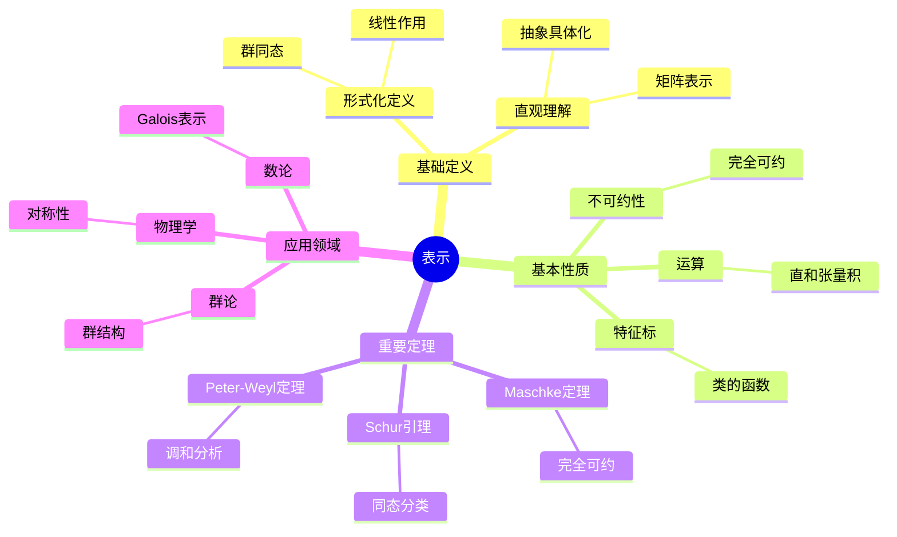
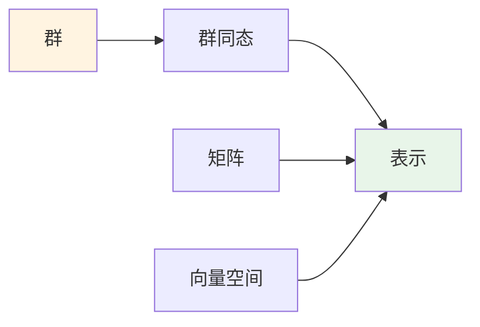
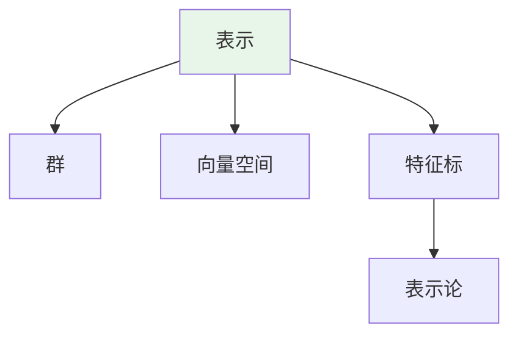
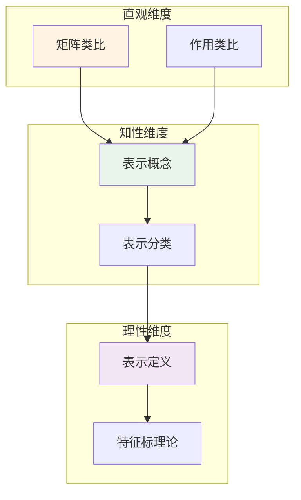

# 表示 (Representation)

**概念编号**: C.CORE.032
**知识层次**: L0-L2
**知识领域**: D8 (交叉领域)
**创建日期**: 2025年11月21日
**最后更新**: 2025年11月21日

---

## 📋 概述

表示是数学中的核心概念，将抽象代数结构（如群、环、代数）通过线性映射具体化。
表示论连接了代数、几何、物理等领域，是现代数学的重要工具。

**权威资源对齐**:

- Wikipedia: [Representation Theory](https://en.wikipedia.org/wiki/Representation_theory)
- Stanford课程: Math 210A (Representation Theory)
- Princeton课程: MAT 550 (Representation Theory)
- MIT课程: 18.712 (Introduction to Representation Theory)
- Metamath: [Representation](http://us.metamath.org/mpeuni/df-representation.html)

---

## 🎯 严格定义

### 基础定义 (L0)

**直观理解**: 表示是将抽象代数结构（如群）通过线性映射"表示"为矩阵或线性变换，使抽象结构具体化。

**基本定义**: 群 $G$ 的表示是群同态 $\rho: G \to GL(V)$，其中 $V$ 是向量空间，$GL(V)$ 是 $V$ 的自同构群。

**简单例子**:

- 平凡表示：$\rho(g) = \text{id}_V$
- 一维表示：$\rho: G \to \mathbb{C}^*$
- 正则表示：$G$ 在群代数上的作用

### 形式化定义 (L1)

**群表示**: 群 $G$ 在域 $F$ 上的表示是群同态：

$$\rho: G \to GL(V)$$

其中 $V$ 是 $F$ 上的向量空间，$GL(V)$ 是 $V$ 的自同构群。

**等价定义**: 表示是 $G$ 在向量空间 $V$ 上的线性作用。

**不可约表示**: 若表示没有非平凡不变子空间，则称为不可约表示。

**记号**:

- $\rho: G \to GL(V)$: 群表示
- $(V, \rho)$: 表示空间和表示映射
- $\text{Rep}_F(G)$: $G$ 在 $F$ 上的表示范畴
- $\chi_\rho$: 表示的特征标

---

## 📚 历史背景

### 发展脉络

**19世纪**: 表示的起源

- **Frobenius (1896)**: 研究有限群的表示
- **Burnside (1904)**: 研究表示论

**20世纪初**: 表示论的发展

- **Schur (1905)**: 研究Schur引理
- **Weyl (1925)**: 研究紧致群的表示

**20世纪中期**: 表示论的现代发展

- **Serre (1967)**: 研究线性表示
- **Langlands (1967)**: 提出Langlands纲领

### 关键人物

- **Ferdinand Frobenius (1849-1917)**: 表示论的创始人
- **Issai Schur (1875-1941)**: 研究Schur引理
- **Hermann Weyl (1885-1955)**: 研究紧致群的表示

---

## 🔍 性质与定理

### 基本性质 (L1)

**性质1: 表示的运算**:

- **直和**: 表示的直和是表示
- **张量积**: 表示的张量积是表示
- **对偶**: 表示的对偶是表示

**性质2: 不可约性**:

- 每个表示可以分解为不可约表示的直和
- 不可约表示是表示的基本构件

**性质3: 特征标**:

- 特征标是类的函数
- 特征标决定表示（在特征0的域上）

### 重要定理 (L2)

**定理1: Maschke定理**:

- **陈述**: 有限群在特征不整除群阶的域上的表示完全可约
- **应用**: 表示的分解

**定理2: Schur引理**:

- **陈述**: 不可约表示之间的同态是标量或零
- **应用**: 表示的分类

**定理3: Peter-Weyl定理**:

- **陈述**: 紧致群的不可约表示在 $L^2(G)$ 中稠密
- **应用**: 调和分析

---

## 💡 应用实例

### 理论应用

- 群论（表示是群论的工具）
- 代数几何（概形的表示）
- 数论（Galois表示）

### 实际应用

#### 应用1: 物理学 - 旋转群的表示

**问题描述**:
研究三维旋转群 $SO(3)$ 的表示，用于描述量子力学中的角动量。

**数学建模**:
$SO(3)$ 的不可约表示由角动量量子数 $j$ 标记，维数为 $2j+1$。

**计算过程**:
- $j = 0$：1维表示（标量）
- $j = 1/2$：2维表示（旋量）
- $j = 1$：3维表示（向量）
- $j = 2$：5维表示（张量）
- 一般：$(2j+1)$ 维表示

**结果解释**:
旋转群的表示用于描述量子力学中的角动量状态，这是量子力学的基础。

**数据**:
- 群: $SO(3)$
- 角动量量子数: $j = 0, 1/2, 1, 2, \ldots$
- 表示维数: $2j+1$

#### 应用2: 化学 - 分子对称性的表示

**问题描述**:
研究水分子（$H_2O$）的对称群 $C_{2v}$ 的表示，用于分析分子振动。

**数学建模**:
$C_{2v}$ 群有4个不可约表示：$A_1$（1维）、$A_2$（1维）、$B_1$（1维）、$B_2$（1维）。

**计算过程**:
- 群阶：$|C_{2v}| = 4$
- 不可约表示：4个1维表示
- 特征标表：
  - $A_1$: $(1, 1, 1, 1)$
  - $A_2$: $(1, 1, -1, -1)$
  - $B_1$: $(1, -1, 1, -1)$
  - $B_2$: $(1, -1, -1, 1)$

**结果解释**:
群表示用于分析分子的振动模式，这是分子光谱学的基础。

**数据**:
- 群: $C_{2v}$
- 群阶: 4
- 不可约表示: 4个

#### 应用3: 密码学 - 椭圆曲线群表示

**问题描述**:
在椭圆曲线密码学中，使用椭圆曲线群的表示进行密钥交换。

**数学建模**:
椭圆曲线 $E: y^2 = x^3 + ax + b$ 的点群 $E(\mathbb{F}_p)$ 的表示用于密码学。

**计算过程**:
- 椭圆曲线：$E: y^2 = x^3 + x + 1$ 在 $\mathbb{F}_{23}$ 上
- 基点：$P = (3, 10)$
- 群阶：$|E(\mathbb{F}_{23})| = 28$
- 密钥交换：$kP$（$k$ 是私钥）

**结果解释**:
椭圆曲线群的表示用于密钥交换和数字签名，提供高安全性。

**数据**:
- 椭圆曲线: $E: y^2 = x^3 + x + 1$
- 有限域: $\mathbb{F}_{23}$
- 群阶: 28

---

## 🔗 关联概念

### 依赖关系

- 群（表示是群的表示）
- 向量空间（表示空间是向量空间）
- 线性映射（表示是线性映射）

### 推广关系

- 群表示（群的表示）
- 代数表示（代数的表示）
- 李群表示（李群的表示）

---

## 📖 参考文献

- Wikipedia: [Representation Theory](https://en.wikipedia.org/wiki/Representation_theory)
- Serre, J.-P. (1977). *Linear Representations of Finite Groups*. Springer.
- Fulton, W., & Harris, J. (1991). *Representation Theory: A First Course*. Springer.

---

## 🗺️ 思维导图 (编号: C.CORE.032.MIND)

### 表示概念思维导图

---

## 📊 知识多维关系矩阵 (编号: C.CORE.032.MATRIX)

### 表示的多维关系矩阵

| 维度 | 指标 | 表示 |
|------|------|------|
| **知识层次** | L0基础 | ⭐⭐⭐ |
| | L1中级 | ⭐⭐⭐ |
| | L2高级 | ⭐⭐⭐⭐ |
| | L3研究 | ⭐⭐⭐⭐⭐ |
| **知识领域** | D1基础数学 | ⭐⭐ |
| | D2代数 | ⭐⭐⭐⭐⭐ |
| | D4几何 | ⭐⭐⭐ |
| | D6数论 | ⭐⭐⭐⭐ |
| | D8交叉领域 | ⭐⭐⭐⭐⭐ |
| **依赖关系** | 前置概念 | 群、向量空间、线性映射 |
| | 后续概念 | 特征标、朗兰兹纲领 |
| **应用关系** | 理论应用 | ⭐⭐⭐⭐⭐ |
| | 实际应用 | ⭐⭐⭐ |
| | 交叉应用 | ⭐⭐⭐⭐ |
| **学习难度** | 直观理解 | ⭐⭐⭐⭐ |
| | 形式化理解 | ⭐⭐⭐⭐⭐ |
| | 深入应用 | ⭐⭐⭐⭐⭐ |

---

## 💭 形象化解释与论证 (编号: C.CORE.032.VISUAL)

### 形象化解释

**1. 表示的直观理解**:

- **类比**: 表示就像"将抽象群具体化为矩阵"或"用线性变换研究群"
- **例子**:
  - 旋转群：可以用旋转矩阵表示
  - 置换群：可以用置换矩阵表示
  - 对称群：可以用对称变换表示

**2. 不可约表示的直观理解**:

- **类比**: 不可约表示就像"最基本的表示"或"不能再分解的表示"
- **解释**:
  - 每个表示可以分解为不可约表示的直和
  - 不可约表示是表示的基本构件
  - 类似于素数的唯一分解

**3. 特征标的直观理解**:

- **类比**: 特征标就像"表示的指纹"或"表示的标识"
- **解释**:
  - 特征标是表示在共轭类上的值
  - 特征标决定表示（在特征0的域上）
  - 特征标使表示的计算更加容易

### 认知科学视角

**1. 数学教育家Dienes的观点**:

- **多表征原则**: 通过矩阵、线性变换、特征标等多种方式理解表示
- **变化性原则**: 通过不同的表示例子理解表示的本质
- **教学启示**: 使用具体群、矩阵表示、特征标计算等多种方法

**2. 数学认知学家Tall的观点**:

- **过程-对象对偶**: 理解"表示构造过程"（如何定义）和"表示"（对象）
- **认知层次**: 从直观理解（"矩阵表示"）到形式化理解（群同态定义）

---

## 👨‍🏫 专家观点与论证 (编号: C.CORE.032.EXPERT)

### 数学家的观点

**1. Ferdinand Frobenius (1849-1917) - 表示论的创始人**:
> "群表示将抽象群具体化为矩阵，这使群的研究更加直观和计算化。"
>
> **意义**: Frobenius开创了表示论，为现代数学提供了重要工具。

**2. Issai Schur (1875-1941) - Schur引理的提出者**:
> "Schur引理揭示了不可约表示之间的同态关系，这是表示论的基础。"
>
> **意义**: Schur提出了Schur引理，推动了表示论的发展。

**3. Hermann Weyl (1885-1955) - 紧致群表示的研究者**:
> "紧致群的表示理论是调和分析的基础，Peter-Weyl定理揭示了表示的深刻性质。"
>
> **意义**: Weyl研究了紧致群的表示，推动了调和分析的发展。

### 数学教育家的观点

**1. Zoltan Dienes (1916-2014) - 数学教育家**:
> "表示概念应该通过具体群、矩阵表示、特征标计算等多种方式学习。"
>
> **教学启示**:
>
> - 从具体群（如对称群、旋转群）开始
> - 使用矩阵表示理解表示的作用
> - 通过特征标计算理解表示的性质

**2. Hans Freudenthal (1905-1990) - 数学教育家**:
> "表示概念的学习需要从'矩阵表示'发展到'抽象表示结构'。"
>
> **认知发展**:
>
> - **直观阶段**: 理解表示作为矩阵表示
> - **结构阶段**: 理解表示作为群同态到线性群

### 数学认知学家的观点

**1. David Tall - 数学认知学家**:
> "表示概念的理解需要从'过程'（如何定义）发展到'对象'（表示本身）。"
>
> **认知层次**:
>
> - **过程层次**: 理解"如何定义表示"（如$\rho: G \to GL(V)$）
> - **对象层次**: 理解"表示"（如$(V, \rho)$是一个表示）

---

## 🎨 认知维度表征 (编号: C.CORE.032.COGNITIVE)

### 直观维度表征 (编号: C.CORE.032.INTUITIVE)

#### 形象类比

- **矩阵类比**: 表示就像"用矩阵表示群"
  - 群的每个元素对应一个矩阵
  - 就像用矩阵"编码"群的结构

- **作用类比**: 表示就像"群作用在向量空间上"
  - 群的元素作用在向量上
  - 就像群的"动作"

#### 具体例子

- **例子1**: 对称群的表示
  - 对称群的元素对应旋转矩阵
  - 这是几何表示

- **例子2**: 循环群的表示
  - 循环群的元素对应复数乘法
  - 这是一维表示

#### 可视化表示

#### 几何直观

- **矩阵表示直观**: 通过矩阵理解表示
  - 群的矩阵表示
  - 矩阵的运算

- **几何作用直观**: 通过几何作用理解表示
  - 群作用在几何对象上
  - 对称性的表示

---

### 知性维度表征 (编号: C.CORE.032.INTELLECTUAL)

#### 概念定义

- **严格定义**: 群的表示是群到一般线性群的同态 $\rho: G \to GL(V)$
- **等价定义**: 通过群作用、模定义
- **特征描述**: 表示是研究群结构的重要工具，将抽象群转化为具体矩阵

#### 概念分类

- **不可约表示 vs 可约表示**: 按可约性分类
- **一维表示 vs 高维表示**: 按维数分类
- **实表示 vs 复表示**: 按系数域分类

#### 概念关系

#### 知识矩阵

| 维度 | 指标 | 表示 |
|------|------|------|
| **知识层次** | L0基础 | ⭐⭐⭐ |
| | L1中级 | ⭐⭐⭐⭐ |
| | L2高级 | ⭐⭐⭐⭐⭐ |
| **知识领域** | D2代数 | ⭐⭐⭐⭐⭐ |
| **学习难度** | 直观理解 | ⭐⭐⭐ |
| | 形式化理解 | ⭐⭐⭐⭐ |
| **认知维度** | 直观维度 | ⭐⭐⭐⭐ |
| | 知性维度 | ⭐⭐⭐⭐⭐ |
| | 理性维度 | ⭐⭐⭐⭐ |

---

### 理性维度表征 (编号: C.CORE.032.RATIONAL)

#### 公理体系

- **表示定义**: 表示是群同态 $\rho: G \to GL(V)$
- **同态性质**: $\rho(gh) = \rho(g)\rho(h)$
- **单位元性质**: $\rho(e) = I$

#### 形式化定义

- **形式化定义**: 使用一阶逻辑严格定义
- **符号系统**: $(V, \rho)$, $\rho(g)$, $\chi(g)$, $\text{tr}(\rho(g))$
- **类型系统**: 表示是群类型到线性群类型的同态

#### 逻辑推理

- **基本定理**: Maschke定理、Schur引理、特征标理论
- **证明思路**: 使用群论和线性代数方法证明
- **推理链**: 定义 → 基本性质 → 不可约表示 → 重要定理

#### 证明系统

- **证明方法**: 构造性证明、代数方法、特征标方法
- **形式化证明**: 可以使用Lean4等工具进行形式化
- **验证工具**: Metamath、Lean4等

---

### 综合整合表征 (编号: C.CORE.032.INTEGRATED)

#### 多维度整合

#### 图形转换

- **思维导图**: 展示表示的知识结构
- **知识图谱**: 展示表示与其他概念的关系
- **知识矩阵**: 展示表示的多维度特征

#### 应用示例

- **应用1**: 群论（对称群、有限群表示）
- **应用2**: 物理（量子力学、对称性）
- **应用3**: 数论（Galois表示、自守表示）
