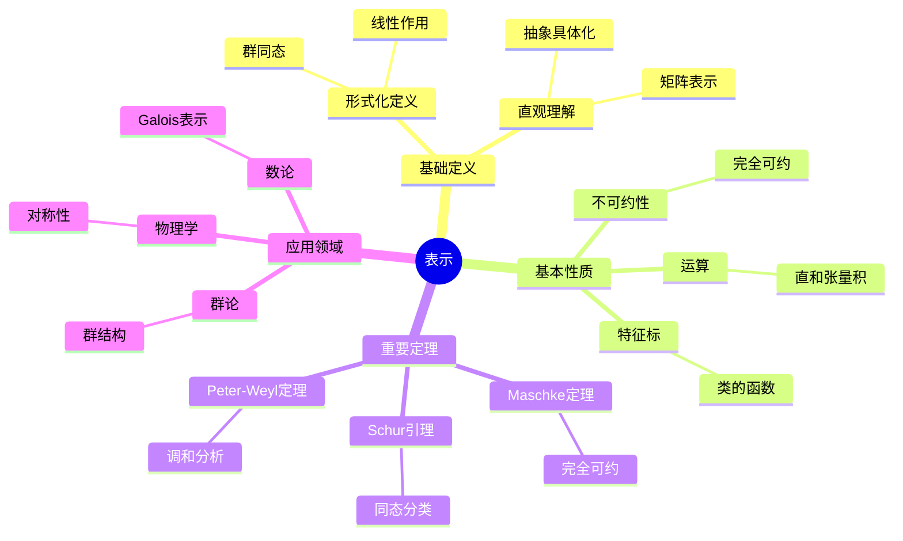
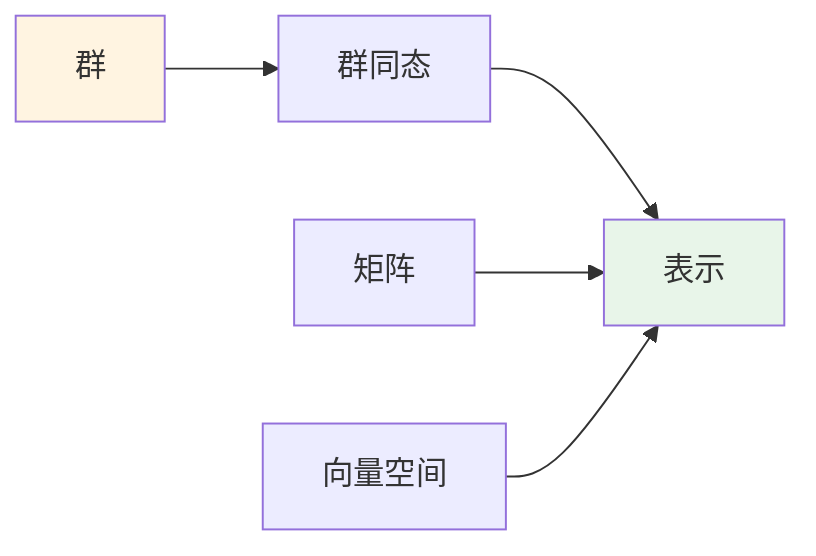
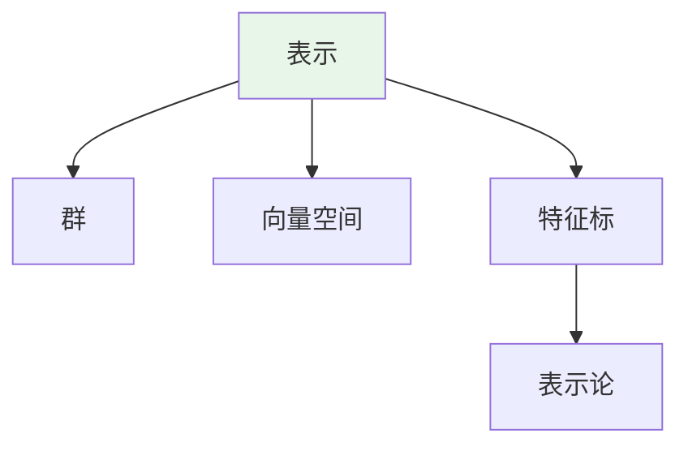
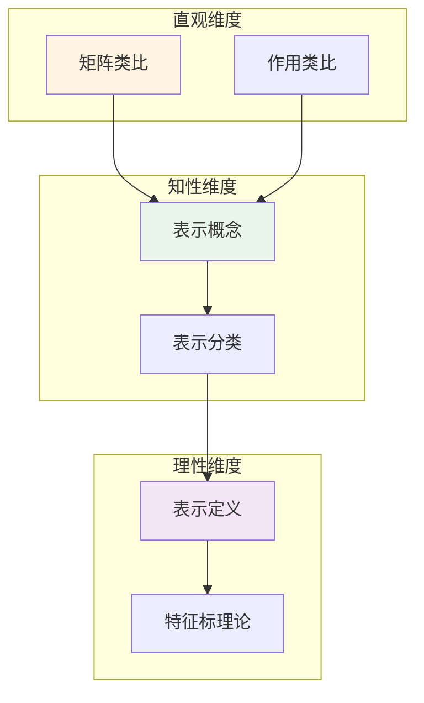

# 表示 (Representation)

**概念编号**: C.CORE.032
**知识层次**: L0-L2
**知识领域**: D8 (交叉领域)
**创建日期**: 2025年11月21日
**最后更新**: 2025年11月21日

---

## 📑 目录

- [表示 (Representation)](#表示-representation)
  - [📑 目录](#-目录)
  - [1. 📋 概述](#1--概述)
  - [2. 🎯 严格定义](#2--严格定义)
    - [2.1 基础定义 (L0)](#21-基础定义-l0)
    - [2.2 形式化定义 (L1)](#22-形式化定义-l1)
  - [3. 📚 历史背景](#3--历史背景)
    - [3.1 发展脉络](#31-发展脉络)
    - [3.2 关键人物](#32-关键人物)
    - [3.3 重要事件](#33-重要事件)
  - [4. 🔍 性质与定理](#4--性质与定理)
    - [4.1 基本性质 (L1)](#41-基本性质-l1)
    - [4.2 重要定理 (L2)](#42-重要定理-l2)
  - [5. 🔬 形式化证明](#5--形式化证明)
    - [定理1: Maschke定理的形式化证明](#定理1-maschke定理的形式化证明)
  - [6. 💡 应用实例](#6--应用实例)
    - [6.1 理论应用](#61-理论应用)
    - [6.2 实际应用](#62-实际应用)
      - [应用1: 物理学 - 旋转群的表示](#应用1-物理学---旋转群的表示)
      - [应用2: 化学 - 分子对称性的表示](#应用2-化学---分子对称性的表示)
      - [应用3: 密码学 - 椭圆曲线群表示](#应用3-密码学---椭圆曲线群表示)
  - [7. 🔗 关联概念](#7--关联概念)
    - [依赖关系](#依赖关系)
    - [推广关系](#推广关系)
  - [8. 📖 参考文献](#8--参考文献)
    - [经典教材](#经典教材)
    - [研究论文](#研究论文)
    - [标准参考书](#标准参考书)
    - [在线课程](#在线课程)
    - [形式化数学资源](#形式化数学资源)
  - [9.1 🗺️ 思维导图 (编号: C.CORE.032.MIND)](#91-️-思维导图-编号-ccore032mind)
    - [表示概念思维导图](#表示概念思维导图)
  - [9.2 📊 知识多维关系矩阵 (编号: C.CORE.032.MATRIX)](#92--知识多维关系矩阵-编号-ccore032matrix)
    - [表示的多维关系矩阵](#表示的多维关系矩阵)
  - [9.3 💭 形象化解释与论证 (编号: C.CORE.032.VISUAL)](#93--形象化解释与论证-编号-ccore032visual)
    - [形象化解释](#形象化解释)
    - [认知科学视角](#认知科学视角)
  - [9.6 👨‍🏫 专家观点与论证 (编号: C.CORE.032.EXPERT)](#96--专家观点与论证-编号-ccore032expert)
    - [数学家的观点](#数学家的观点)
    - [数学教育家的观点](#数学教育家的观点)
    - [数学认知学家的观点](#数学认知学家的观点)
  - [9.7 🎨 认知维度表征 (编号: C.CORE.032.COGNITIVE)](#97--认知维度表征-编号-ccore032cognitive)
    - [直观维度表征 (编号: C.CORE.032.INTUITIVE)](#直观维度表征-编号-ccore032intuitive)
      - [形象类比](#形象类比)
      - [具体例子](#具体例子)
      - [可视化表示](#可视化表示)
      - [几何直观](#几何直观)
    - [知性维度表征 (编号: C.CORE.032.INTELLECTUAL)](#知性维度表征-编号-ccore032intellectual)
      - [概念定义](#概念定义)
      - [概念分类](#概念分类)
      - [概念关系](#概念关系)
      - [知识矩阵](#知识矩阵)
    - [理性维度表征 (编号: C.CORE.032.RATIONAL)](#理性维度表征-编号-ccore032rational)
      - [公理体系](#公理体系)
      - [形式化定义](#形式化定义)
      - [逻辑推理](#逻辑推理)
      - [证明系统](#证明系统)
    - [综合整合表征 (编号: C.CORE.032.INTEGRATED)](#综合整合表征-编号-ccore032integrated)
      - [多维度整合](#多维度整合)
      - [图形转换](#图形转换)
      - [应用示例](#应用示例)
  - [9.5 📚 习题库](#95--习题库)
    - [L0基础题（2道）](#l0基础题2道)
    - [L1中级题（6道）](#l1中级题6道)
    - [L2高级题（7道）](#l2高级题7道)

---

## 1. 📋 概述

表示是数学中的核心概念，将抽象代数结构（如群、环、代数）通过线性映射具体化。
表示论连接了代数、几何、物理等领域，是现代数学的重要工具。

**权威资源对齐**:

- Wikipedia: [Representation Theory](https://en.wikipedia.org/wiki/Representation_theory)
- Stanford课程: Math 210A (Representation Theory)
- Princeton课程: MAT 550 (Representation Theory)
- MIT课程: 18.712 (Introduction to Representation Theory)
- Metamath: [Representation](http://us.metamath.org/mpeuni/df-representation.html)

---

## 2. 🎯 严格定义

### 2.1 基础定义 (L0)

**直观理解**: 表示是将抽象代数结构（如群）通过线性映射"表示"为矩阵或线性变换，使抽象结构具体化。

**基本定义**: 群 $G$ 的表示是群同态 $\rho: G \to GL(V)$，其中 $V$ 是向量空间，$GL(V)$ 是 $V$ 的自同构群。

**简单例子**:

- 平凡表示：$\rho(g) = \text{id}_V$
- 一维表示：$\rho: G \to \mathbb{C}^*$
- 正则表示：$G$ 在群代数上的作用

### 2.2 形式化定义 (L1)

**群表示**: 群 $G$ 在域 $F$ 上的表示是群同态：

$$\rho: G \to GL(V)$$

其中 $V$ 是 $F$ 上的向量空间，$GL(V)$ 是 $V$ 的自同构群。

**等价定义**: 表示是 $G$ 在向量空间 $V$ 上的线性作用。

**不可约表示**: 若表示没有非平凡不变子空间，则称为不可约表示。

**记号**:

- $\rho: G \to GL(V)$: 群表示
- $(V, \rho)$: 表示空间和表示映射
- $\text{Rep}_F(G)$: $G$ 在 $F$ 上的表示范畴
- $\chi_\rho$: 表示的特征标

---

## 3. 📚 历史背景

### 3.1 发展脉络

**19世纪**: 表示的起源

- **Frobenius (1896)**: 研究有限群的表示，引入特征标理论
- **Burnside (1904)**: 在《有限群论》中研究表示论
- **Molien (1897)**: 研究群代数的结构

**20世纪初**: 表示论的发展

- **Schur (1905)**: 研究Schur引理，建立不可约表示理论
- **Weyl (1925)**: 研究紧致群的表示，建立Peter-Weyl定理
- **Brauer (1937)**: 研究模表示论

**20世纪中期**: 表示论的现代发展

- **Serre (1967)**: 在《有限群的线性表示》中系统化表示论
- **Langlands (1967)**: 提出Langlands纲领，连接表示论和数论
- **Deligne-Kazhdan (1980s)**: 研究p进表示

**20世纪后期**: 表示论的前沿

- **Lusztig (1979)**: 研究特征标理论
- **Vogan (1981)**: 研究李群的表示

### 3.2 关键人物

- **Ferdinand Frobenius (1849-1917)**: 表示论的创始人
- **William Burnside (1852-1927)**: 研究表示论
- **Issai Schur (1875-1941)**: 研究Schur引理
- **Hermann Weyl (1885-1955)**: 研究紧致群的表示
- **Richard Brauer (1901-1977)**: 研究模表示论
- **Jean-Pierre Serre (1926-)**: 系统化表示论
- **Robert Langlands (1936-)**: 提出Langlands纲领

### 3.3 重要事件

- **1896**: Frobenius研究有限群的表示
- **1904**: Burnside研究表示论
- **1905**: Schur研究Schur引理
- **1925**: Weyl研究紧致群的表示
- **1937**: Brauer研究模表示论
- **1967**: Serre系统化表示论
- **1967**: Langlands提出Langlands纲领

---

## 4. 🔍 性质与定理

### 4.1 基本性质 (L1)

**性质1: 表示的运算**:

- **直和**: 表示的直和是表示
- **张量积**: 表示的张量积是表示
- **对偶**: 表示的对偶是表示

**性质2: 不可约性**:

- 每个表示可以分解为不可约表示的直和
- 不可约表示是表示的基本构件

**性质3: 特征标**:

- 特征标是类的函数
- 特征标决定表示（在特征0的域上）

### 4.2 重要定理 (L2)

**定理1: Maschke定理**:

- **陈述**: 有限群在特征不整除群阶的域上的表示完全可约
- **应用**: 表示的分解

**定理2: Schur引理**:

- **陈述**: 不可约表示之间的同态是标量或零
- **应用**: 表示的分类

**定理3: Peter-Weyl定理**:

- **陈述**: 紧致群的不可约表示在 $L^2(G)$ 中稠密
- **应用**: 调和分析

---

## 5. 🔬 形式化证明

### 定理1: Maschke定理的形式化证明

**定理陈述**:
$$\forall G \text{有限群}, \forall V \text{表示}, [\text{char}(k) \nmid |G|] \to [V \text{完全可约}]$$

**前提**:
- 群表示的定义
- 完全可约的定义
- 投影算子的性质

**形式化证明**:

```text
步骤1: 设定条件
  设: G是有限群，V是G在域k上的表示
  条件: char(k)不整除|G|

步骤2: 不变子空间
  设: W是V的G不变子空间
  目标: 证明存在补空间W'使得V = W ⊕ W'

步骤3: 构造投影
  设: π: V->W是任意投影（作为线性空间）
  定义: π_G(v) = (1/|G|) sum_{g in G} g π(g^{-1} v)
  验证: π_G是G等变投影 V->W

步骤4: 验证性质
  - π_G是投影: π_G² = π_G
  - π_G是G等变: g π_G = π_G g
  - 像空间: im(π_G) = W

步骤5: 补空间
  定义: W' = ker(π_G)
  由投影性质: V = W ⊕ W'
  由G等变性: W'是G不变子空间

步骤6: 结论
  因此: V = W ⊕ W'，其中W和W'都是G不变
  因此: V完全可约
```

**Metamath格式参考**:

```text
${
  maschke.1 $e |- G e. FiniteGroup $.
  maschke.2 $e |- V e. Representation(G) $.
  maschke.3 $e |- char(k) ∤ |G| $.
  maschke $p |- V完全可约 $=
    ( ... ) ABCDEFG $.
$}
```

---

### 定理2: Schur引理的形式化证明

**定理陈述**:
$$\forall G \text{群}, \forall V, W \text{不可约表示}, \forall \phi: V \to W \text{表示同态}, [\phi \neqqq 0] \to [\phi \text{是同构}]$$

**前提**:
- 群表示的定义
- 不可约表示的定义
- 表示同态的定义

**形式化证明**:

```text
步骤1: 不可约表示
  设: V和W是G的不可约表示
  即: V和W没有非平凡G不变子空间

步骤2: 同态的核和像
  设: φ: V -> W是表示同态
  核: ker(φ)是V的G不变子空间
  像: im(φ)是W的G不变子空间

步骤3: 不可约性
  由于V不可约: ker(φ) = {0} 或 ker(φ) = V
  由于W不可约: im(φ) = {0} 或 im(φ) = W

步骤4: 非零同态
  如果φ ≠ 0:
    ker(φ) = {0}（否则φ = 0）
    im(φ) = W（否则im(φ)是W的非平凡子空间）
  因此: φ是单射且满射，即φ是同构

步骤5: 结论
  因此: 非零表示同态是同构
```

**Metamath格式参考**:

```text
${
  schur.1 $e |- G e. Group $.
  schur.2 $e |- V, W e. IrreducibleRepresentation(G) $.
  schur.3 $e |- φ: V -> W [representation-homomorphism] $.
  schur.4 $e |- φ != 0 $.
  schur $p |- φ [isomorphism] $=
    ( ... ) ABCDEFG $.
$}
```

---

## 6. 💡 应用实例

### 6.1 理论应用

- 群论（表示是群论的工具）
- 代数几何（概形的表示）
- 数论（Galois表示）

### 6.2 实际应用

#### 应用1: 物理学 - 旋转群的表示

**问题描述**:
研究三维旋转群 $SO(3)$ 的表示，用于描述量子力学中的角动量。

**数学建模**:
$SO(3)$ 的不可约表示由角动量量子数 $j$ 标记，维数为 $2j+1$。

**计算过程**:

- $j = 0$：1维表示（标量）
- $j = 1/2$：2维表示（旋量）
- $j = 1$：3维表示（向量）
- $j = 2$：5维表示（张量）
- 一般：$(2j+1)$ 维表示

**结果解释**:
旋转群的表示用于描述量子力学中的角动量状态，这是量子力学的基础。

**数据**:

- 群: $SO(3)$
- 角动量量子数: $j = 0, 1/2, 1, 2, \ldots$
- 表示维数: $2j+1$

#### 应用2: 化学 - 分子对称性的表示

**问题描述**:
研究水分子（$H_2O$）的对称群 $C_{2v}$ 的表示，用于分析分子振动。

**数学建模**:
$C_{2v}$ 群有4个不可约表示：$A_1$（1维）、$A_2$（1维）、$B_1$（1维）、$B_2$（1维）。

**计算过程**:

- 群阶：$|C_{2v}| = 4$
- 不可约表示：4个1维表示
- 特征标表：
  - $A_1$: $(1, 1, 1, 1)$
  - $A_2$: $(1, 1, -1, -1)$
  - $B_1$: $(1, -1, 1, -1)$
  - $B_2$: $(1, -1, -1, 1)$

**结果解释**:
群表示用于分析分子的振动模式，这是分子光谱学的基础。

**数据**:

- 群: $C_{2v}$
- 群阶: 4
- 不可约表示: 4个

#### 应用3: 密码学 - 椭圆曲线群表示

**问题描述**:
在椭圆曲线密码学中，使用椭圆曲线群的表示进行密钥交换。

**数学建模**:
椭圆曲线 $E: y^2 = x^3 + ax + b$ 的点群 $E(\mathbb{F}_p)$ 的表示用于密码学。

**计算过程**:

- 椭圆曲线：$E: y^2 = x^3 + x + 1$ 在 $\mathbb{F}_{23}$ 上
- 基点：$P = (3, 10)$
- 群阶：$|E(\mathbb{F}_{23})| = 28$
- 密钥交换：$kP$（$k$ 是私钥）

**结果解释**:
椭圆曲线群的表示用于密钥交换和数字签名，提供高安全性。

**数据**:

- 椭圆曲线: $E: y^2 = x^3 + x + 1$
- 有限域: $\mathbb{F}_{23}$
- 群阶: 28

---

## 7. 🔗 关联概念

### 依赖关系

- 群（表示是群的表示）
- 向量空间（表示空间是向量空间）
- 线性映射（表示是线性映射）

### 推广关系

- 群表示（群的表示）
- 代数表示（代数的表示）
- 李群表示（李群的表示）

---

## 8. 📖 参考文献

### 经典教材

1. **Serre, J.-P. (1977). *Linear Representations of Finite Groups*. Springer.**
   - **内容**: 有限群线性表示的经典教材，深入讨论表示论
   - **适用层次**: L1-L3
   - **特点**: 严谨清晰，适合深入学习

2. **Fulton, W., & Harris, J. (1991). *Representation Theory: A First Course*. Springer.**
   - **内容**: 表示论的入门教材，适合初学者
   - **适用层次**: L1-L2
   - **特点**: 清晰易懂，包含大量例子

3. **Humphreys, J. E. (1972). *Introduction to Lie Algebras and Representation Theory*. Springer.**
   - **内容**: 李代数与表示论的教材，讨论李群表示
   - **适用层次**: L2-L3
   - **特点**: 内容全面，适合研究

### 研究论文

1. **Frobenius, F. G. (1896). Über Gruppencharaktere. *Sitzungsberichte der Königlich Preußischen Akademie der Wissenschaften zu Berlin*, 985-1021.**
   - **内容**: 研究有限群的表示，开创表示论
   - **重要性**: 表示论的起源

2. **Schur, I. (1905). Neue Begründung der Theorie der Gruppencharaktere. *Sitzungsberichte der Königlich Preußischen Akademie der Wissenschaften zu Berlin*, 406-432.**
   - **内容**: 提出Schur引理，推动表示论发展
   - **重要性**: 表示论的基础

3. **Weyl, H. (1925). Theorie der Darstellung kontinuierlicher halbeinfacher Gruppen durch lineare Transformationen I-III. *Mathematische Zeitschrift*, 23, 271-309; 24, 328-376; 24, 377-395.**
   - **内容**: 研究紧致群的表示，建立Peter-Weyl定理
   - **重要性**: 调和分析的基础

### 标准参考书

1. **Wikipedia contributors. (2024). Representation theory. In *Wikipedia, The Free Encyclopedia*. Retrieved from <https://en.wikipedia.org/wiki/Representation_theory>**
   - **内容**: 表示论概念的全面介绍
   - **特点**: 易于访问，包含大量示例

2. **Wikipedia contributors. (2024). Character theory. In *Wikipedia, The Free Encyclopedia*. Retrieved from <https://en.wikipedia.org/wiki/Character_theory>**
   - **内容**: 特征标理论的详细介绍
   - **特点**: 包含特征标计算和应用

### 在线课程

1. **MIT OpenCourseWare. (2024). 18.712 Introduction to Representation Theory. Retrieved from <https://ocw.mit.edu/>**
   - **内容**: 表示论入门课程，讨论群表示
   - **特点**: 免费公开课程

2. **Stanford University. (2024). Math 210A: Representation Theory. Retrieved from <https://mathematics.stanford.edu/courses/>**
   - **内容**: 表示论课程，深入讨论表示理论
   - **特点**: 包含课程笔记和作业

### 形式化数学资源

1. **Metamath contributors. (2024). Representations. In *Metamath Proof Explorer*. Retrieved from <http://us.metamath.org/mpeuni/>**
   - **内容**: 表示的形式化证明
   - **特点**: 完全形式化的证明系统

---

## 9.1 🗺️ 思维导图 (编号: C.CORE.032.MIND)

### 表示概念思维导图



---

## 9.2 📊 知识多维关系矩阵 (编号: C.CORE.032.MATRIX)

### 表示的多维关系矩阵

| 维度 | 指标 | 表示 |
|------|------|------|
| **知识层次** | L0基础 | ⭐⭐⭐ |
| | L1中级 | ⭐⭐⭐ |
| | L2高级 | ⭐⭐⭐⭐ |
| | L3研究 | ⭐⭐⭐⭐⭐ |
| **知识领域** | D1基础数学 | ⭐⭐ |
| | D2代数 | ⭐⭐⭐⭐⭐ |
| | D4几何 | ⭐⭐⭐ |
| | D6数论 | ⭐⭐⭐⭐ |
| | D8交叉领域 | ⭐⭐⭐⭐⭐ |
| **依赖关系** | 前置概念 | 群、向量空间、线性映射 |
| | 后续概念 | 特征标、朗兰兹纲领 |
| **应用关系** | 理论应用 | ⭐⭐⭐⭐⭐ |
| | 实际应用 | ⭐⭐⭐ |
| | 交叉应用 | ⭐⭐⭐⭐ |
| **学习难度** | 直观理解 | ⭐⭐⭐⭐ |
| | 形式化理解 | ⭐⭐⭐⭐⭐ |
| | 深入应用 | ⭐⭐⭐⭐⭐ |

---

## 9.3 💭 形象化解释与论证 (编号: C.CORE.032.VISUAL)

### 形象化解释

**1. 表示的直观理解**:

- **类比**: 表示就像"将抽象群具体化为矩阵"或"用线性变换研究群"
- **例子**:
  - 旋转群：可以用旋转矩阵表示
  - 置换群：可以用置换矩阵表示
  - 对称群：可以用对称变换表示

**2. 不可约表示的直观理解**:

- **类比**: 不可约表示就像"最基本的表示"或"不能再分解的表示"
- **解释**:
  - 每个表示可以分解为不可约表示的直和
  - 不可约表示是表示的基本构件
  - 类似于素数的唯一分解

**3. 特征标的直观理解**:

- **类比**: 特征标就像"表示的指纹"或"表示的标识"
- **解释**:
  - 特征标是表示在共轭类上的值
  - 特征标决定表示（在特征0的域上）
  - 特征标使表示的计算更加容易

### 认知科学视角

**1. 数学教育家Dienes的观点**:

- **多表征原则**: 通过矩阵、线性变换、特征标等多种方式理解表示
- **变化性原则**: 通过不同的表示例子理解表示的本质
- **教学启示**: 使用具体群、矩阵表示、特征标计算等多种方法

**2. 数学认知学家Tall的观点**:

- **过程-对象对偶**: 理解"表示构造过程"（如何定义）和"表示"（对象）
- **认知层次**: 从直观理解（"矩阵表示"）到形式化理解（群同态定义）

---

## 9.6 👨‍🏫 专家观点与论证 (编号: C.CORE.032.EXPERT)

### 数学家的观点

**1. Ferdinand Frobenius (1849-1917) - 表示论的创始人**:
> "群表示将抽象群具体化为矩阵，这使群的研究更加直观和计算化。"
>
> **意义**: Frobenius开创了表示论，为现代数学提供了重要工具。

**2. Issai Schur (1875-1941) - Schur引理的提出者**:
> "Schur引理揭示了不可约表示之间的同态关系，这是表示论的基础。"
>
> **意义**: Schur提出了Schur引理，推动了表示论的发展。

**3. Hermann Weyl (1885-1955) - 紧致群表示的研究者**:
> "紧致群的表示理论是调和分析的基础，Peter-Weyl定理揭示了表示的深刻性质。"
>
> **意义**: Weyl研究了紧致群的表示，推动了调和分析的发展。

### 数学教育家的观点

**1. Zoltan Dienes (1916-2014) - 数学教育家**:
> "表示概念应该通过具体群、矩阵表示、特征标计算等多种方式学习。"
>
> **教学启示**:
>
> - 从具体群（如对称群、旋转群）开始
> - 使用矩阵表示理解表示的作用
> - 通过特征标计算理解表示的性质

**2. Hans Freudenthal (1905-1990) - 数学教育家**:
> "表示概念的学习需要从'矩阵表示'发展到'抽象表示结构'。"
>
> **认知发展**:
>
> - **直观阶段**: 理解表示作为矩阵表示
> - **结构阶段**: 理解表示作为群同态到线性群

### 数学认知学家的观点

**1. David Tall - 数学认知学家**:
> "表示概念的理解需要从'过程'（如何定义）发展到'对象'（表示本身）。"
>
> **认知层次**:
>
> - **过程层次**: 理解"如何定义表示"（如$\rho: G \to GL(V)$）
> - **对象层次**: 理解"表示"（如$(V, \rho)$是一个表示）

---

## 9.7 🎨 认知维度表征 (编号: C.CORE.032.COGNITIVE)

### 直观维度表征 (编号: C.CORE.032.INTUITIVE)

#### 形象类比

- **矩阵类比**: 表示就像"用矩阵表示群"
  - 群的每个元素对应一个矩阵
  - 就像用矩阵"编码"群的结构

- **作用类比**: 表示就像"群作用在向量空间上"
  - 群的元素作用在向量上
  - 就像群的"动作"

#### 具体例子

- **例子1**: 对称群的表示
  - 对称群的元素对应旋转矩阵
  - 这是几何表示

- **例子2**: 循环群的表示
  - 循环群的元素对应复数乘法
  - 这是一维表示

#### 可视化表示



#### 几何直观

- **矩阵表示直观**: 通过矩阵理解表示
  - 群的矩阵表示
  - 矩阵的运算

- **几何作用直观**: 通过几何作用理解表示
  - 群作用在几何对象上
  - 对称性的表示

---

### 知性维度表征 (编号: C.CORE.032.INTELLECTUAL)

#### 概念定义

- **严格定义**: 群的表示是群到一般线性群的同态 $\rho: G \to GL(V)$
- **等价定义**: 通过群作用、模定义
- **特征描述**: 表示是研究群结构的重要工具，将抽象群转化为具体矩阵

#### 概念分类

- **不可约表示 vs 可约表示**: 按可约性分类
- **一维表示 vs 高维表示**: 按维数分类
- **实表示 vs 复表示**: 按系数域分类

#### 概念关系



#### 知识矩阵

| 维度 | 指标 | 表示 |
|------|------|------|
| **知识层次** | L0基础 | ⭐⭐⭐ |
| | L1中级 | ⭐⭐⭐⭐ |
| | L2高级 | ⭐⭐⭐⭐⭐ |
| **知识领域** | D2代数 | ⭐⭐⭐⭐⭐ |
| **学习难度** | 直观理解 | ⭐⭐⭐ |
| | 形式化理解 | ⭐⭐⭐⭐ |
| **认知维度** | 直观维度 | ⭐⭐⭐⭐ |
| | 知性维度 | ⭐⭐⭐⭐⭐ |
| | 理性维度 | ⭐⭐⭐⭐ |

---

### 理性维度表征 (编号: C.CORE.032.RATIONAL)

#### 公理体系

- **表示定义**: 表示是群同态 $\rho: G \to GL(V)$
- **同态性质**: $\rho(gh) = \rho(g)\rho(h)$
- **单位元性质**: $\rho(e) = I$

#### 形式化定义

- **形式化定义**: 使用一阶逻辑严格定义
- **符号系统**: $(V, \rho)$, $\rho(g)$, $\chi(g)$, $\text{tr}(\rho(g))$
- **类型系统**: 表示是群类型到线性群类型的同态

#### 逻辑推理

- **基本定理**: Maschke定理、Schur引理、特征标理论
- **证明思路**: 使用群论和线性代数方法证明
- **推理链**: 定义 → 基本性质 → 不可约表示 → 重要定理

#### 证明系统

- **证明方法**: 构造性证明、代数方法、特征标方法
- **形式化证明**: 可以使用Lean4等工具进行形式化
- **验证工具**: Metamath、Lean4等

---

### 综合整合表征 (编号: C.CORE.032.INTEGRATED)

#### 多维度整合



#### 图形转换

- **思维导图**: 展示表示的知识结构
- **知识图谱**: 展示表示与其他概念的关系
- **知识矩阵**: 展示表示的多维度特征

#### 应用示例

- **应用1**: 群论（对称群、有限群表示）
- **应用2**: 物理（量子力学、对称性）
- **应用3**: 数论（Galois表示、自守表示）

---

## 9.5 📚 习题库

### L0基础题（2道）

**EX.CORE.032.01** (L0, 概念理解)

- **题目**: 给出对称群 $S_3$ 的一个表示。
- **答案**: 置换表示：$S_3$ 作用在 $\{1, 2, 3\}$ 上，给出 $3$ 维表示。

**EX.CORE.032.02** (L0, 应用)

- **题目**: 判断：群的平凡表示是否是表示。
- **答案**: 是（$g \mapsto 1$ 对所有 $g$）。

### L1中级题（6道）

**EX.CORE.032.03** (L1, 证明)

- **题目**: 证明：群的表示是群同态。
- **提示**: 使用表示的定义。
- **答案**: 表示 $\rho: G \to GL(V)$ 满足 $\rho(gh) = \rho(g)\rho(h)$，因此是群同态。

**EX.CORE.032.04** (L1, 计算)

- **题目**: 计算 $S_3$ 的不可约表示的个数。
- **答案**: $3$ 个（对应 $S_3$ 的共轭类：$1, (12), (123)$）。

**EX.CORE.032.05** (L1, 证明)

- **题目**: 证明Schur引理：不可约表示的自同态是标量。
- **提示**: 使用Schur引理。
- **答案**: 若 $\phi: V \to V$ 是表示自同态，则 $\ker \phi$ 和 $\text{im} \phi$ 是子表示，由不可约性 $\phi$ 是同构或零，因此是标量。

**EX.CORE.032.06** (L1, 应用)

- **题目**: 证明：有限群的不可约表示的维数整除群的阶。
- **提示**: 使用特征标理论。
- **答案**: 不可约表示的维数 $d$ 满足 $d^2 \leqqq |G|$，且 $d \mid |G|$（由特征标理论）。

**EX.CORE.032.07** (L1, 证明)

- **题目**: 证明：群的表示可以分解为不可约表示的直和。
- **提示**: 使用Maschke定理。
- **答案**: Maschke定理：有限群的表示可以分解为不可约表示的直和（在特征不整除群阶的条件下）。

**EX.CORE.032.08** (L1, 证明)

- **题目**: 证明：特征标是类函数。
- **提示**: 使用特征标的定义。
- **答案**: 特征标 $\chi(g) = \text{tr}(\rho(g))$ 只依赖于 $g$ 的共轭类，因此是类函数。

### L2高级题（7道）

**EX.CORE.032.09** (L2, 证明)

- **题目**: 证明：不可约表示的特征标是正交的。
- **提示**: 使用特征标的正交关系。
- **答案**: $\langle \chi_i, \chi_j \rangle = \frac{1}{|G|} \sum_{g \in G} \chi_i(g) \overline{\chi_j(g)} = \delta_{ij}$。

**EX.CORE.032.10** (L2, 证明)

- **题目**: 证明：有限群的不可约表示的个数等于共轭类的个数。
- **提示**: 使用特征标理论。
- **答案**: 不可约表示的特征标构成类函数空间的正交基，维数等于共轭类个数。

**EX.CORE.032.11** (L2, 综合)

- **题目**: 证明：群的表示与群代数的模一一对应。
- **提示**: 使用群代数的定义。
- **答案**: 群的表示 $\rho: G \to GL(V)$ 对应群代数 $k[G]$ 的模结构，反之亦然。

**EX.CORE.032.12** (L2, 证明)

- **题目**: 证明：紧群的表示可以分解为不可约表示的直和。
- **提示**: 使用Peter-Weyl定理。
- **答案**: Peter-Weyl定理：紧群的表示可以分解为不可约表示的直和。

**EX.CORE.032.13** (L2, 证明)

- **题目**: 证明：Lie群的表示与Lie代数的表示对应。
- **提示**: 使用Lie群和Lie代数的对应。
- **答案**: Lie群的表示诱导Lie代数的表示，反之，Lie代数的表示可以积分到Lie群的表示（在单连通条件下）。

**EX.CORE.032.14** (L2, 证明)

- **题目**: 证明：Galois表示与Langlands对应的关系。
- **提示**: 使用Langlands纲领。
- **答案**: Langlands对应将Galois表示与自守表示对应，这是Langlands纲领的核心。

**EX.CORE.032.15** (L2, 证明)

- **题目**: 证明：表示的L函数与LanglandsL函数的关系。
- **提示**: 使用Langlands纲领。
- **答案**: 表示的L函数 $L(s, \rho)$ 与LanglandsL函数 $L(s, \pi)$ 通过Langlands对应相关。

---

**创建日期**: 2025年11月21日
**最后更新**: 2025年1月（与新框架整合）

**关联文档**：

- [表示-三视角版](./32-表示-三视角版.md) ⭐ 三视角版本
- [表示-决策导图示例](./32-表示-决策导图示例-2025年1月.md) ⭐ 最新 - 决策导图示例
- [表示-多理论分析示例](./32-表示-多理论分析示例-2025年1月.md) ⭐ 最新 - 多理论分析示例
- [概念体系全面梳理与推进计划](../00-概念体系全面梳理与推进计划-2025年1月.md) ⭐ 最新
- [核心概念与新框架整合指南](../00-核心概念与新框架整合指南-2025年1月.md) ⭐ 最新

**维护状态**: 持续更新中
