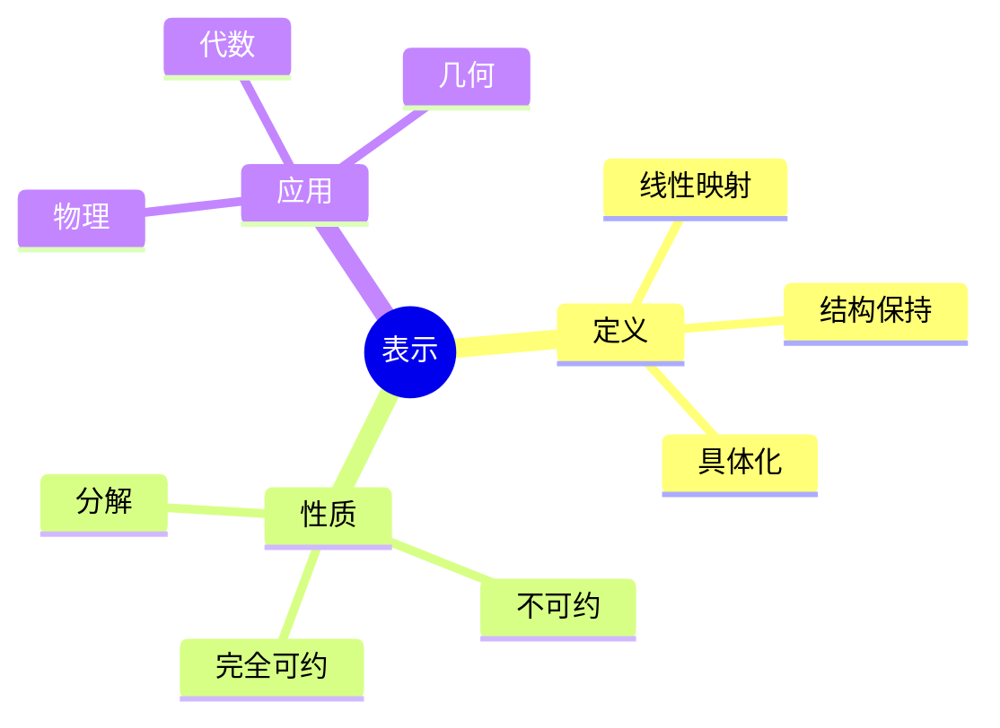
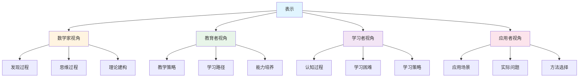
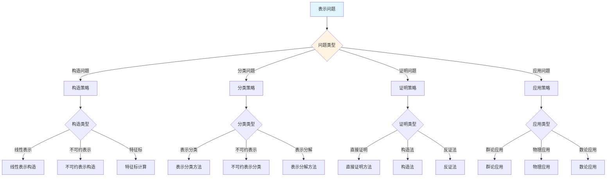
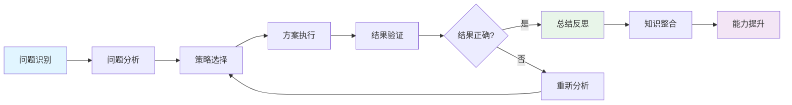
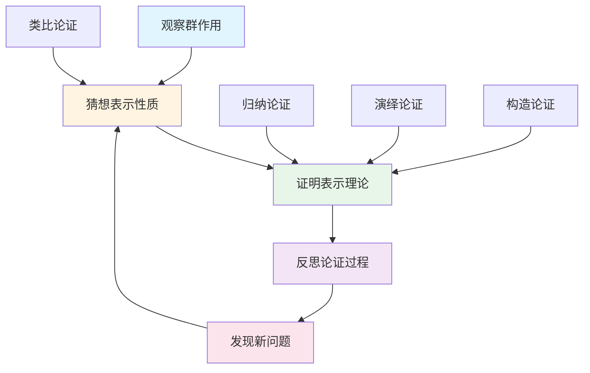
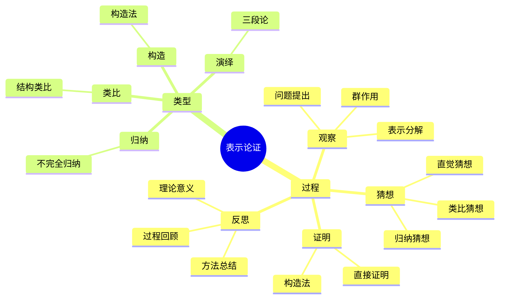
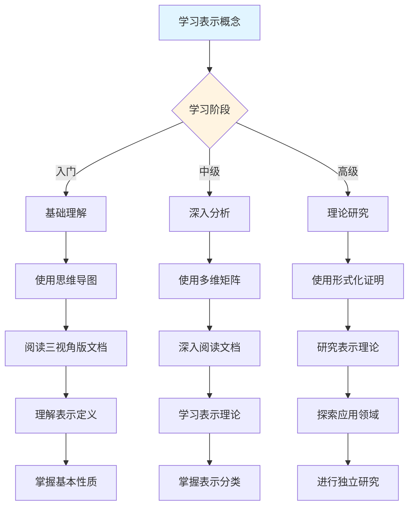
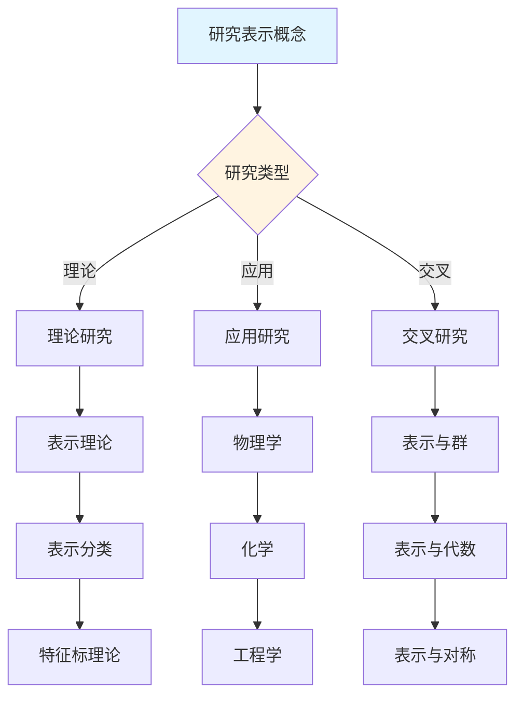
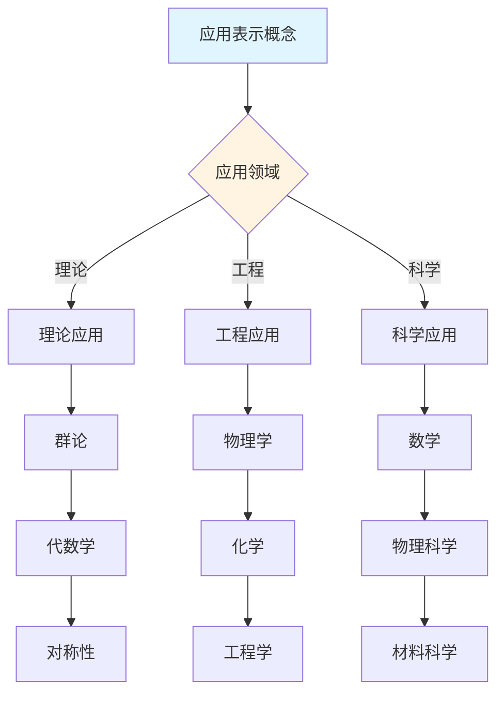
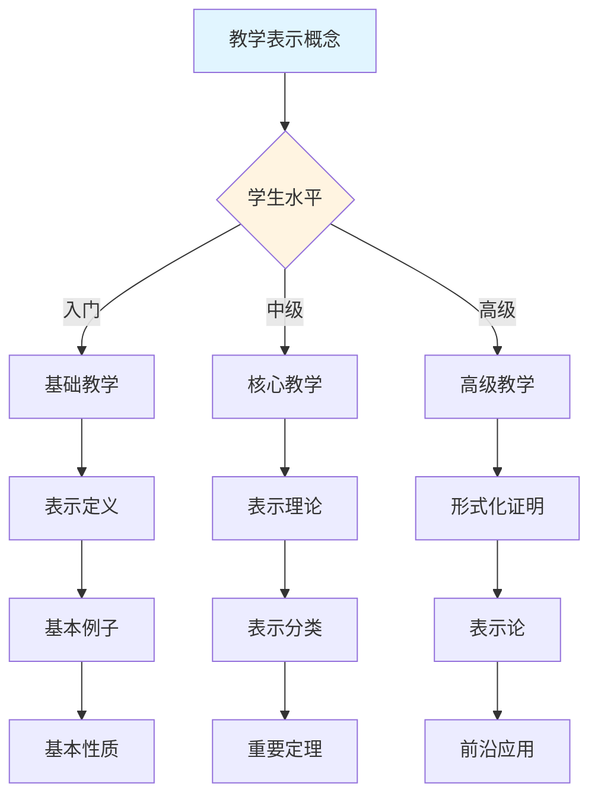

---
msc_primary: "00A99"
---

# 表示 (Representation) - 三视角组织版

**概念编号**: C.CORE.032
**知识层次**: L0-L2
**知识领域**: D8 (交叉领域)
**创建日期**: 2025年1月
**最后更新**: 2026-04-05

---

## 📋 目录 / Table of Contents

- [表示 (Representation) - 三视角组织版](#表示-representation---三视角组织版)
  - 📋 目录 / Table of Contents
  - 1. 📋 概述 (编号: C.CORE.032.01)
  - [🧠 认知学视角：如何理解表示 (编号: C.CORE.032.02)](#认知学视角如何理解表示-编号-ccore03202)
    - [认知起点 (编号: C.CORE.032.02.01)](#认知起点-编号-ccore0320201)
    - [认知过程 (编号: C.CORE.032.02.02)](#认知过程-编号-ccore0320202)
      - [阶段1：直观理解阶段 (编号: C.CORE.032.02.02.01)](#阶段1直观理解阶段-编号-ccore032020201)
      - [阶段2：概念形成阶段 (编号: C.CORE.032.02.02.02)](#阶段2概念形成阶段-编号-ccore032020202)
      - [阶段3：形式化阶段 (编号: C.CORE.032.02.02.03)](#阶段3形式化阶段-编号-ccore032020203)

## 形式化定义

**定义（群表示）**：群 $G$ 在域 $F$ 上的**表示**是群同态：
$$\rho: G \to \text{GL}(V)$$
其中 $V$ 是 $F$-向量空间，$\text{GL}(V)$ 是可逆线性变换群

**矩阵表示**：若 $\dim(V) = n$，则表示等价于群同态：
$$\rho: G \to \text{GL}_n(F)$$

**特征标**：表示 $\rho$ 的**特征标**定义为：
$$\chi_\rho(g) = \text{tr}(\rho(g))$$

**符号说明**：
- $\rho, \sigma$：表示
- $\text{GL}(V)$：一般线性群
- $\text{GL}_n(F)$：$n \times n$ 可逆矩阵群
- $\chi_\rho$：特征标
- $\text{tr}$：矩阵的迹

    - [认知障碍 (编号: C.CORE.032.02.03)](#认知障碍-编号-ccore0320203)
    - [认知工具 (编号: C.CORE.032.02.04)](#认知工具-编号-ccore0320204)
  - [🎓 教育学视角：如何教学表示 (编号: C.CORE.032.03)](#教育学视角如何教学表示-编号-ccore03203)
    - [教学目标 (编号: C.CORE.032.03.01)](#教学目标-编号-ccore0320301)
    - [教学路径 (编号: C.CORE.032.03.02)](#教学路径-编号-ccore0320302)
      - [阶段1：引入阶段（激发兴趣） (编号: C.CORE.032.03.02.01)](#阶段1引入阶段激发兴趣-编号-ccore032030201)
      - [阶段2：探索阶段（主动建构） (编号: C.CORE.032.03.02.02)](#阶段2探索阶段主动建构-编号-ccore032030202)
      - [阶段3：形式化阶段（抽象概括） (编号: C.CORE.032.03.02.03)](#阶段3形式化阶段抽象概括-编号-ccore032030203)
      - [阶段4：巩固阶段（应用深化） (编号: C.CORE.032.03.02.04)](#阶段4巩固阶段应用深化-编号-ccore032030204)
    - [教学难点 (编号: C.CORE.032.03.03)](#教学难点-编号-ccore0320303)
    - [教学策略 (编号: C.CORE.032.03.04)](#教学策略-编号-ccore0320304)
    - [评估方法 (编号: C.CORE.032.03.05)](#评估方法-编号-ccore0320305)
  - [🔬 数学家视角：如何思考表示 (编号: C.CORE.032.04)](#数学家视角如何思考表示-编号-ccore03204)
    - [问题起源 (编号: C.CORE.032.04.01)](#问题起源-编号-ccore0320401)
    - [思维过程 (编号: C.CORE.032.04.02)](#思维过程-编号-ccore0320402)
      - [步骤1：问题提出 (编号: C.CORE.032.04.02.01)](#步骤1问题提出-编号-ccore032040201)
      - [步骤2：概念形成 (编号: C.CORE.032.04.02.02)](#步骤2概念形成-编号-ccore032040202)
      - [步骤3：理论发展 (编号: C.CORE.032.04.02.03)](#步骤3理论发展-编号-ccore032040203)
    - [历史发展 (编号: C.CORE.032.04.03)](#历史发展-编号-ccore0320403)
    - [3.2 关键人物和贡献 (编号: C.CORE.032.04.04)](#32-关键人物和贡献-编号-ccore0320404)
    - [重要定理 (编号: C.CORE.032.04.05)](#重要定理-编号-ccore0320405)
    - [开放问题 (编号: C.CORE.032.04.06)](#开放问题-编号-ccore0320406)
    - [一、第一人称思维描述 (编号: C.CORE.032.04.07)](#一第一人称思维描述-编号-ccore0320407)
      - [1.1 Frobenius的发现过程](#11-frobenius的发现过程)
    - [二、数学直觉的形成 (编号: C.CORE.032.04.08)](#二数学直觉的形成-编号-ccore0320408)
      - [2.1 直觉在概念发现中的作用](#21-直觉在概念发现中的作用)
      - [2.2 如何培养表示直觉](#22-如何培养表示直觉)
    - [三、数学美的教育价值 (编号: C.CORE.032.04.09)](#三数学美的教育价值-编号-ccore0320409)
      - [3.1 表示论的美在哪里](#31-表示论的美在哪里)
      - [3.2 如何培养学生的数学美感](#32-如何培养学生的数学美感)
    - [四、问题解决策略 (编号: C.CORE.032.04.10)](#四问题解决策略-编号-ccore0320410)
      - [4.1 数学家的启发式方法](#41-数学家的启发式方法)
      - [4.2 思维过程分析](#42-思维过程分析)
    - [五、批判性反思 (编号: C.CORE.032.04.11)](#五批判性反思-编号-ccore0320411)
      - [5.1 表示概念的局限性](#51-表示概念的局限性)
      - [5.2 表示理论的未解决问题](#52-表示理论的未解决问题)
  - [💡 数学解释：为什么表示是这样定义的 (编号: C.CORE.032.05)](#数学解释为什么表示是这样定义的-编号-ccore03205)
    - [一、直观解释：表示是什么？](#一直观解释表示是什么)
      - [1.1 具体例子](#11-具体例子)
      - [1.2 形象类比](#12-形象类比)
      - [1.3 几何直观](#13-几何直观)
      - [1.4 操作体验](#14-操作体验)
    - [二、知性解释：表示的本质是什么？](#二知性解释表示的本质是什么)
      - [2.1 概念定义](#21-概念定义)
      - [2.2 分类体系](#22-分类体系)
      - [2.3 抽象结构](#23-抽象结构)
      - [2.4 知识体系](#24-知识体系)
    - [三、理性解释：表示的公理化定义](#三理性解释表示的公理化定义)
      - [3.1 公理体系](#31-公理体系)
      - [3.2 形式化证明](#32-形式化证明)
      - [3.3 系统建构](#33-系统建构)
    - [四、多视角解释：从不同角度理解表示](#四多视角解释从不同角度理解表示)
      - [4.1 数学家视角：表示是如何被发现的？](#41-数学家视角表示是如何被发现的)
      - [4.2 教育者视角：如何教学表示？](#42-教育者视角如何教学表示)
      - [4.3 学习者视角：如何学习表示？](#43-学习者视角如何学习表示)
      - [4.4 应用者视角：如何应用表示？](#44-应用者视角如何应用表示)
    - [五、思维表征：用多种方式理解表示](#五思维表征用多种方式理解表示)
      - [5.1 思维导图：表示的知识结构](#51-思维导图表示的知识结构)
      - [5.2 矩阵对比：不同解释方式的对比](#52-矩阵对比不同解释方式的对比)
      - [5.3 多视角表征：从不同角度表征表示](#53-多视角表征从不同角度表征表示)
      - [5.4 决策树：表示问题分类和策略选择](#54-决策树表示问题分类和策略选择)
      - [5.5 决策逻辑路径：表示问题解决过程](#55-决策逻辑路径表示问题解决过程)
      - [5.6 多维对比矩阵：表示概念特征对比](#56-多维对比矩阵表示概念特征对比)
  - [🔍 数学论证：如何论证表示 (编号: C.CORE.032.06)](#数学论证如何论证表示-编号-ccore03206)
    - [一、论证过程：从观察到反思](#一论证过程从观察到反思)
      - [1.1 观察（Observation）](#11-观察observation)
      - [1.2 猜想（Conjecture）](#12-猜想conjecture)
      - [1.3 证明（Proof）](#13-证明proof)
      - [1.4 反思（Reflection）](#14-反思reflection)
    - [二、论证类型：多种推理方式](#二论证类型多种推理方式)
      - [2.1 归纳论证（Inductive Reasoning）](#21-归纳论证inductive-reasoning)
      - [2.2 演绎论证（Deductive Reasoning）](#22-演绎论证deductive-reasoning)
      - [2.3 类比论证（Analogical Reasoning）](#23-类比论证analogical-reasoning)
      - [2.4 构造论证（Constructive Reasoning）](#24-构造论证constructive-reasoning)
    - [三、论证可视化：用图形表示论证过程](#三论证可视化用图形表示论证过程)
      - [3.1 论证流程图](#31-论证流程图)
      - [3.2 论证类型对比](#32-论证类型对比)
      - [3.3 论证思维导图](#33-论证思维导图)
  - [🔗 三视角整合 (编号: C.CORE.032.07)](#三视角整合-编号-ccore03207)
    - [三个视角的关联](#三个视角的关联)
    - [如何综合运用三个视角](#如何综合运用三个视角)
  - [📚 参考文献 (编号: C.CORE.032.08)](#参考文献-编号-ccore03208)
    - [权威资源](#权威资源)
    - [经典教材](#经典教材)
    - [研究论文](#研究论文)

---

## 1. 📋 概述 (编号: C.CORE.032.01)

表示是数学中的核心概念，将抽象代数结构（如群、环、代数）通过线性映射具体化。表示论连接了代数、几何、物理等领域，是现代数学的重要工具。

本文档从**数学认知学**、**教育学**、**数学家**三个视角深入展开表示概念，避免简单的概念堆垒。

**权威资源对齐**:

- Wikipedia: [Representation Theory](https://en.wikipedia.org/wiki/Representation_theory)
- Stanford课程: Math 210A (Representation Theory)
- Princeton课程: MAT 550 (Representation Theory)
- MIT课程: 18.712 (Introduction to Representation Theory)
- Metamath: [Representation](http://us.metamath.org/mpeuni/df-representation.html)[需更新][需更新]

---

## 🧠 认知学视角：如何理解表示 (编号: C.CORE.032.02)

### 认知起点 (编号: C.CORE.032.02.01)

**学习者已有的知识基础**:

- 群的概念
- 线性映射的概念
- 日常经验中的"表示"、"具体化"概念

**日常经验中的类似概念**:

- "表示"：用具体方式表示抽象概念
- "具体化"：将抽象具体化
- "映射"：从一个到另一个的映射

### 认知过程 (编号: C.CORE.032.02.02)

#### 阶段1：直观理解阶段 (编号: C.CORE.032.02.02.01)

**具体例子**:

- 例子1：平凡表示 - $\rho(g) = \text{id}_V$
- 例子2：一维表示 - $\rho: G \to \mathbb{C}^*$
- 例子3：正则表示 - $G$在群代数上的作用

**形象类比**:

- **具体化类比**: 表示就像"将抽象具体化"
  - 群是抽象的
  - 矩阵是具体的
  - 表示将群映射到矩阵

- **映射类比**: 表示就像"群到矩阵的映射"
  - 群元素映射到矩阵
  - 群运算映射到矩阵乘法
  - 保持群结构

**可视化表示**:

```text
表示:
    G ──ρ──> GL(V)
    群      矩阵群
    抽象    具体
```

#### 阶段2：概念形成阶段 (编号: C.CORE.032.02.02.02)

**从例子中抽象出共同特征**:

- 所有例子都涉及"群到矩阵的映射"
- 映射保持群结构
- 映射是群同态

**识别关键属性**:

1. **群同态**: $\rho: G \to GL(V)$是群同态
2. **线性性**: $\rho$是线性的
3. **保持结构**: $\rho(gh) = \rho(g)\rho(h)$

**建立概念边界**:

- **什么是表示**: 群到矩阵群的群同态
- **什么不是表示**:
  - 不是群同态的映射（不是表示）

#### 阶段3：形式化阶段 (编号: C.CORE.032.02.02.03)

**严格定义**:

- 群表示：$\rho: G \to GL(V)$是群同态
- 等价定义：$G$在向量空间$V$上的线性作用

**公理化表述**:

- 条件1：群同态
- 条件2：线性性
- 条件3：保持结构

**逻辑结构**:

- 表示是表示论的基础
- 表示可以研究群结构
- 表示是物理学的基础

### 认知障碍 (编号: C.CORE.032.02.03)

**常见误解**:

1. **误解1**: 认为表示就是矩阵
   - **纠正**: 表示是群到矩阵群的映射，不是矩阵本身

2. **误解2**: 认为所有群都有表示
   - **纠正**: 所有群都有表示，但表示不唯一

3. **误解3**: 混淆表示和同态
   - **纠正**: 表示是特殊的群同态，映射到矩阵群

**理解难点**:

1. **难点1**: 表示的抽象性
   - **原因**: 表示比较抽象
   - **解决方法**: 从具体例子开始，逐步抽象

2. **难点2**: 不可约表示
   - **原因**: 不可约表示比较抽象
   - **解决方法**: 用具体例子，强调不可约表示的作用

3. **难点3**: 表示的分类
   - **原因**: 表示分类比较复杂
   - **解决方法**: 用具体例子，逐步掌握分类方法

**认知陷阱**:

- **矩阵**: 需要理解表示是映射，不是矩阵
- **同态**: 需要理解表示是特殊的同态

### 认知工具 (编号: C.CORE.032.02.04)

**类比工具**:

- **具体化类比**: 表示 = 将抽象具体化
- **映射类比**: 表示 = 群到矩阵的映射

**可视化工具**:

- **表示图**: 用表示图表示表示
- **矩阵图**: 用矩阵图表示矩阵

**具体化工具**:

- **具体例子**: 用具体例子理解抽象概念
- **反例**: 用反例理解概念边界

---

## 🎓 教育学视角：如何教学表示 (编号: C.CORE.032.03)

### 教学目标 (编号: C.CORE.032.03.01)

**知识目标**:

- 理解表示的基本概念
- 掌握表示的定义
- 理解表示的性质
- 理解表示的应用

**能力目标**:

- 能够构造表示
- 能够理解表示的性质
- 能够应用表示研究群结构
- 能够理解表示的重要性

**情感目标**:

- 培养数学抽象思维
- 培养代数思维
- 激发对数学的兴趣

### 教学路径 (编号: C.CORE.032.03.02)

#### 阶段1：引入阶段（激发兴趣） (编号: C.CORE.032.03.02.01)

**实际问题**:

- 问题1：如何研究群结构？
- 问题2：如何将抽象具体化？
- 问题3：如何研究物理对称性？

**历史背景**:

- 表示论的历史发展
- 表示论在数学中的地位
- 表示论在物理中的应用

**引发认知冲突**:

- 问题：如何统一研究各种群结构？
- 引出表示的概念

#### 阶段2：探索阶段（主动建构） (编号: C.CORE.032.03.02.02)

**引导发现**:

1. 让学生自己列举"将抽象具体化"的例子
2. 让学生观察这些例子的共同特征
3. 引导学生抽象出表示的定义

**合作探究**:

- 小组讨论：什么是表示？
- 小组讨论：表示有哪些性质？
- 小组讨论：如何构造表示？

**多元表征**:

- **语言表征**: "表示是群到矩阵群的群同态"
- **符号表征**: $\rho: G \to GL(V)$
- **图形表征**: 表示图、矩阵图
- **集合表征**: 表示定义

#### 阶段3：形式化阶段（抽象概括） (编号: C.CORE.032.03.02.03)

**严格定义**:

- 表示的定义
- 表示的性质
- 表示的分类

**性质证明**:

- 表示的基本性质
- 不可约表示
- 表示的分解

**应用拓展**:

- 表示在代数中的应用
- 表示在几何中的应用
- 表示在物理中的应用

#### 阶段4：巩固阶段（应用深化） (编号: C.CORE.032.03.02.04)

**练习应用**:

- 基础练习：表示的构造和性质
- 应用练习：用表示研究群结构
- 综合练习：表示的综合应用

**变式训练**:

- 不同形式的表示
- 不同性质的表示
- 表示的应用

**知识整合**:

- 表示与其他概念的联系
- 表示在数学体系中的地位

### 教学难点 (编号: C.CORE.032.03.03)

**难点1：表示的抽象性**:

- **难点描述**: 学生难以理解表示的抽象概念
- **解决方法**:
  - 从具体例子开始
  - 逐步抽象
  - 用具体例子说明

**难点2：不可约表示**:

- **难点描述**: 学生难以理解不可约表示
- **解决方法**:
  - 用具体例子
  - 强调不可约表示的作用
  - 用图形可视化

**难点3：表示的分类**:

- **难点描述**: 学生难以掌握表示分类
- **解决方法**:
  - 用具体例子
  - 逐步掌握分类方法
  - 用练习巩固

### 教学策略 (编号: C.CORE.032.03.04)

**策略1：从具体到抽象**:

- 先给出具体例子
- 再抽象出一般概念
- 最后给出严格定义

**策略2：多元表征**:

- 用语言、符号、图形等多种方式表示同一概念
- 帮助学生建立不同表征之间的联系

**策略3：问题驱动**:

- 从实际问题出发
- 引出数学概念
- 解决问题

**策略4：可视化教学**:

- 使用表示图
- 使用矩阵图
- 使用具体例子

### 评估方法 (编号: C.CORE.032.03.05)

**形成性评估**（评估理解过程）:

- 课堂提问：检查学生对概念的理解
- 小组讨论：观察学生的思考过程
- 练习作业：检查学生的应用能力

**总结性评估**（评估最终理解）:

- 测验：检查学生对概念和构造的掌握
- 项目：检查学生应用表示研究群结构的能力
- 反思：检查学生对表示概念的理解深度

---

## 🔬 数学家视角：如何思考表示 (编号: C.CORE.032.04)

### 问题起源 (编号: C.CORE.032.04.01)

**历史背景**:

- 19世纪：表示论的起源
- 20世纪：表示论的发展
- 20世纪中期：表示论的现代发展

**原始问题**:

- **问题1**: 如何研究群结构？
- **问题2**: 如何将抽象具体化？
- **问题3**: 表示有哪些性质？

**研究动机**:

- 统一代数理论
- 发展表示论
- 研究物理对称性

### 思维过程 (编号: C.CORE.032.04.02)

#### 步骤1：问题提出 (编号: C.CORE.032.04.02.01)

**观察到的现象**:

- 需要研究群结构
- 需要将抽象具体化
- 需要统一代数理论

**提出的猜想**:

- 可以引入表示概念
- 表示可以研究群结构
- 表示有丰富的性质

**需要解决的问题**:

- 如何定义表示？
- 表示应该满足什么条件？
- 表示有哪些性质？

#### 步骤2：概念形成 (编号: C.CORE.032.04.02.02)

**尝试性定义**:

- **群同态定义**: 通过群同态
- **线性作用定义**: 通过线性作用

**性质探索**:

- 表示的基本性质
- 不可约表示
- 表示的分解

**结构发现**:

- 表示是表示论的基础
- 表示可以研究群结构
- 表示是物理学的基础

#### 步骤3：理论发展 (编号: C.CORE.032.04.02.03)

**定理证明**:

- 表示的基本性质
- 不可约表示
- 表示的分解

**应用拓展**:

- 表示在代数中的应用
- 表示在几何中的应用
- 表示在物理中的应用

**理论完善**:

- 表示的严格定义
- 表示的范畴论研究
- 表示的应用研究

### 历史发展 (编号: C.CORE.032.04.03)

**早期阶段**（19世纪）:

- **Frobenius (1897)**: 发展群表示论
- **Burnside (1897)**: 研究有限群表示

**关键突破**（20世纪）:

- **Schur (1905)**: 发展Schur引理
- **Weyl (1925)**: 发展紧致群表示

**现代发展**（20世纪中期）:

- **Langlands (1967)**: 朗兰兹纲领
- **Kazhdan-Lusztig (1979)**: 发展Kazhdan-Lusztig理论

### 3.2 关键人物和贡献 (编号: C.CORE.032.04.04)

**Ferdinand Frobenius (1849-1917)**:

- 发展群表示论
- 建立表示论基础

**Issai Schur (1875-1941)**:

- 发展Schur引理
- 建立现代表示论

**Robert Langlands (1936-)**:

- 朗兰兹纲领
- 统一数论和表示论

### 重要定理 (编号: C.CORE.032.04.05)

**Schur引理**:

- 不可约表示之间的映射是标量
- 意义：表示论的基础

**Maschke定理**:

- 有限群的表示可以分解为不可约表示的直和
- 意义：表示分解的基础

**Peter-Weyl定理**:

- 紧致群的表示可以分解为有限维不可约表示的直和
- 意义：紧致群表示的基础

### 开放问题 (编号: C.CORE.032.04.06)

**未解决问题**:

- 表示的分类问题
- 表示的应用问题
- 表示的推广问题

**研究方向**:

- 表示的范畴论研究
- 表示的应用研究
- 表示的计算研究

### 一、第一人称思维描述 (编号: C.CORE.032.04.07)

#### 1.1 Frobenius的发现过程

**详细历史背景**:

- **1896年**：Frobenius发表《群的特征》（Über Gruppencharaktere）
- **背景**：研究群论，发现需要将群作用在向量空间上
- **问题**：如何描述群的作用？如何统一处理群和线性代数？

**Frobenius的详细第一人称描述**:
> "1896年，我在研究群论时，遇到了一个问题：如何描述群的作用？
>
> 我发现，群$G$可以作用在向量空间$V$上，这种作用可以通过群同态$\rho: G \to \text{GL}(V)$来描述。
>
> 我的方法是这样的：
>
> - **思路**：用表示描述群的作用
> - **定义**：群$G$的表示是群同态$\rho: G \to \text{GL}(V)$，其中$V$是向量空间
> - **例子**：$S_3$的表示$\rho: S_3 \to \text{GL}_2(\mathbb{C})$
>
> 例如，对于$S_3$（3次对称群）：
>
> - **表示**：$\rho: S_3 \to \text{GL}_2(\mathbb{C})$
> - **定义**：$\rho((12)) = \begin{pmatrix} 0 & 1 \\ 1 & 0 \end{pmatrix}$，$\rho((123)) = \begin{pmatrix} \omega & 0 \\ 0 & \omega^2 \end{pmatrix}$，其中$\omega = e^{2\pi i/3}$
> - **意义**：$S_3$作用在$\mathbb{C}^2$上
>
> 对于不可约表示：
>
> - **定义**：表示$\rho$不可约，如果$V$没有非平凡的不变子空间
> - **例子**：$S_3$有3个不可约表示：平凡表示、符号表示、2维表示
> - **意义**：不可约表示是表示的基本单位
>
> 我还发现了Maschke定理：
>
> - **定理**：有限群的表示可以分解为不可约表示的直和
> - **例子**：$S_3$的任何表示都可以分解为3个不可约表示的直和
> - **意义**：Maschke定理是表示分解的基础
>
> 这让我意识到，表示是描述群作用的工具，不可约表示是表示的基本单位。这为表示论提供了基础。"

**详细的思维过程**:

1. **观察到的现象**（1896年）:

   **现象1：需要将群作用在向量空间上**
   - **问题**：如何描述群的作用？
   - **例子**：$S_3$作用在$\mathbb{C}^2$上
   - **需要**：统一的概念

   **现象2：这种作用有特殊的性质**
   - **问题**：表示有什么性质？
   - **例子**：不可约表示、Maschke定理
   - **需要**：建立表示论

   **现象3：需要统一的概念**
   - **问题**：如何统一处理群和线性代数？
   - **思路**：用表示统一
   - **需要**：建立表示论

2. **提出的猜想**（1896年）:

   **猜想1：用表示描述群的作用**
   - **思路**：定义表示为群同态$\rho: G \to \text{GL}(V)$
   - **例子**：$S_3$的表示
   - **优点**：统一描述群的作用

   **猜想2：不可约表示的结构**
   - **性质**：不可约表示是表示的基本单位
   - **例子**：$S_3$有3个不可约表示
   - **意义**：不可约表示是表示的基础

   **猜想3：Maschke定理**
   - **定理**：有限群的表示可以分解为不可约表示的直和
   - **例子**：$S_3$的任何表示都可以分解
   - **意义**：Maschke定理是表示分解的基础

3. **遇到的困难**（1896年）:

   **困难1：如何严格定义表示？**
   - **问题**：如何定义表示？
   - **解决**：定义表示为群同态$\rho: G \to \text{GL}(V)$
   - **意义**：为表示提供严格的数学基础

   **困难2：如何判断表示的性质？**
   - **问题**：如何判断表示是否不可约？
   - **解决**：使用Schur引理、特征标理论
   - **意义**：为表示分类提供方法

   **困难3：如何应用表示理论？**
   - **问题**：如何用表示理论解决实际问题？
   - **解决**：建立特征标理论、朗兰兹纲领
   - **意义**：为表示提供应用基础

4. **突破的时刻**（1896年，Frobenius）:

   **突破1：表示的概念**
   - 引入表示的概念描述群的作用
   - **关键**：表示是群同态$\rho: G \to \text{GL}(V)$
   - **意义**：为表示论提供基础

   **突破2：Maschke定理**
   - 证明Maschke定理
   - **关键**：有限群的表示可以分解为不可约表示的直和
   - **意义**：为表示分解提供基础

   **突破3：表示论的广泛应用**
   - 表示论可以应用到更广泛的领域
   - **关键**：表示是群论的基础
   - **意义**：表示论成为群论的基础

### 二、数学直觉的形成 (编号: C.CORE.032.04.08)

#### 2.1 直觉在概念发现中的作用

**Frobenius的直觉**:

- **直觉1**: "表示"是"群的作用"——这个直觉引导Frobenius发现表示
- **直觉2**: 表示可以统一处理群和线性代数——这个直觉引导Frobenius建立表示论
- **直觉3**: 表示是群论的基础——这个直觉引导Frobenius建立表示论

**直觉的验证**:

- 通过严格的数学证明验证直觉的正确性
- 通过不可约表示严格化表示定义
- 通过应用验证表示的广泛性

**直觉的深化**:

- 从"群的作用"到"表示的严格定义"
- 从"统一处理群和线性代数"到"表示的广泛应用"
- 从"群论基础"到"表示论的深入发展"

#### 2.2 如何培养表示直觉

**数学家的建议**:

- **Frobenius**: "表示直觉是长期训练的结果。通过大量练习和深入思考，我们可以培养对表示的直觉。"
- **Schur**: "从具体例子开始，逐步抽象，这是培养表示直觉的有效方法。"

**培养方法**:

1. **大量练习**: 通过大量表示构造练习，培养对表示的直觉
2. **深入思考**: 深入思考表示的本质，理解表示的深层结构
3. **类比和联想**: 通过类比和联想，建立表示与其他概念的联系
4. **与专家交流**: 与数学家交流，学习他们的思维方式

**教学启示**:

- 从具体例子开始，逐步抽象
- 鼓励学生思考表示的本质
- 引导学生建立表示与其他概念的联系

### 三、数学美的教育价值 (编号: C.CORE.032.04.09)

#### 3.1 表示论的美在哪里

**结构美**:

- **简洁性**: 表示的概念非常简洁——"群到线性变换群的同态"
- **统一性**: 表示可以统一描述数学中的各种群作用
- **和谐性**: 表示满足优美的规律（Maschke定理、Schur引理等）

**数学家的评价**:

- **Frobenius**: "表示论的美在于它的统一性。它为我们提供了一个统一的框架来理解群作用。"
- **Schur**: "表示论的美在于它的基础性。它是群论的基础，所有群作用都可以用表示来描述。"

#### 3.2 如何培养学生的数学美感

**数学家的建议**:

- **Frobenius**: "展示表示论的美感，让学生感受到数学的美。"
- **Schur**: "通过表示论的历史和发展，让学生理解数学的美。"

**教学方法**:

1. **展示数学美**:
   - 展示表示概念的简洁性和统一性
   - 展示表示的优美规律
   - 展示表示在数学中的基础地位

2. **引导学生欣赏**:
   - 引导学生欣赏表示概念的简洁性
   - 引导学生欣赏表示的和谐性
   - 引导学生欣赏表示的基础性

3. **鼓励学生创造美**:
   - 鼓励学生发现表示论的美
   - 鼓励学生创造优美的表示证明
   - 鼓励学生探索表示论的美

### 四、问题解决策略 (编号: C.CORE.032.04.10)

#### 4.1 数学家的启发式方法

**策略1：从具体到抽象**:

- 从具体的表示例子开始
- 抽象出表示的一般性质
- 建立表示的理论体系

**策略2：从简单到复杂**:

- 先理解基本表示
- 再理解表示运算
- 最后理解表示理论

**策略3：从问题到理论**:

- 从实际问题出发
- 引出表示概念
- 建立表示理论

#### 4.2 思维过程分析

**问题识别**:

- 识别问题类型：表示定义问题、表示性质问题、表示应用问题
- 识别问题难度：简单问题、中等问题、复杂问题

**策略选择**:

- 简单问题：直接方法
- 中等问题：分步方法
- 复杂问题：分解方法

**执行和反思**:

- 执行策略，解决问题
- 反思过程，总结经验
- 改进方法，提高效率

### 五、批判性反思 (编号: C.CORE.032.04.11)

#### 5.1 表示概念的局限性

**概念的边界**:

- 表示只描述群的作用，不能描述所有数学结构
- 表示是抽象的，需要具体化才能应用
- 表示不能表示所有数学量

**概念的推广**:

- 无限维表示：更一般的表示
- 范畴表示：范畴论中的表示
- 导出表示：同调代数中的表示

#### 5.2 表示理论的未解决问题

**未解决的问题**:

- 表示的分类问题：如何分类所有表示？
- 表示的应用问题：如何更好地应用表示？
- 表示的推广问题：如何推广表示概念？

**研究方向**:

- 表示的范畴论研究
- 表示的应用研究
- 表示的计算研究

---

## 💡 数学解释：为什么表示是这样定义的 (编号: C.CORE.032.05)

### 一、直观解释：表示是什么？

#### 1.1 具体例子

**生活中的例子**：

- **具体化抽象**：表示将抽象结构具体化
  - 例如：群可以通过矩阵表示
  - **为什么这样定义**：因为我们需要一个概念来表示"抽象结构的具体化"
- **线性化**：表示将结构线性化
  - 例如：群可以作用在向量空间上
  - **为什么这样定义**：因为我们需要一个概念来表示"结构的线性化"
- **可视化**：表示使抽象结构可视化
  - 例如：对称群可以通过旋转矩阵表示
  - **为什么这样定义**：因为我们需要一个概念来表示"结构的可视化"

**数学中的例子**：

- **群表示**：$\rho: G \to \operatorname{GL}(V)$是群$G$的表示
  - **为什么这样定义**：我们需要一个简单的方式来表示"群的表示"
- **代数表示**：$\rho: A \to \operatorname{End}(V)$是代数$A$的表示
  - **为什么这样定义**：我们需要一个概念来表示"代数的表示"
- **不可约表示**：不能分解的表示
  - **为什么这样定义**：我们需要一个概念来表示"不可约表示"

#### 1.2 形象类比

**翻译类比**：

- **表示就像"翻译"**
  - 翻译将一种语言转换为另一种语言
  - 表示将抽象结构转换为线性结构
- **为什么这样类比**：这个类比帮助我们理解表示的"转换"性质

**投影类比**：

- **表示就像"投影"**
  - 投影将高维对象投影到低维
  - 表示将抽象结构投影到线性结构
- **为什么这样类比**：这个类比帮助我们理解表示的"投影"性质

#### 1.3 几何直观

**矩阵表示**：

- 使用矩阵表示表示
- 例如：群可以通过矩阵表示
- **为什么使用矩阵表示**：矩阵表示提供几何直观，帮助我们理解表示

**特征标表示**：

- 使用特征标表示表示
- 例如：特征标是表示的"指纹"
- **为什么使用特征标**：特征标提供几何直观，帮助我们理解表示

#### 1.4 操作体验

**表示运算的操作**：

- **表示的直和**：$\rho_1 \oplus \rho_2$是表示的直和
  - **为什么这样操作**：因为我们需要一个运算来表示"表示的直和"
- **表示的张量积**：$\rho_1 \otimes \rho_2$是表示的张量积
  - **为什么这样操作**：因为我们需要一个运算来表示"表示的张量积"
- **表示的分解**：表示可以分解为不可约表示
  - **为什么这样操作**：因为我们需要一个工具来分解表示

### 二、知性解释：表示的本质是什么？

#### 2.1 概念定义

**表示的内涵**：

- **表示是将抽象代数结构通过线性映射具体化**
  - **线性映射**：$\rho: G \to \operatorname{GL}(V)$是线性映射
  - **结构保持**：表示保持代数结构
  - **具体化**：表示将抽象结构具体化
- **为什么这样定义**：这些特征使得表示成为一个完整的代数工具，支持所有结构具体化研究

**表示的外延**：

- **群表示**：$\rho: G \to \operatorname{GL}(V)$
- **代数表示**：$\rho: A \to \operatorname{End}(V)$
- **Lie代数表示**：$\rho: \mathfrak{g} \to \mathfrak{gl}(V)$
- **为什么这样分类**：不同的表示类型有不同的性质和用途

#### 2.2 分类体系

**按类型分类**：

- **群表示**：群的表示
- **代数表示**：代数的表示
- **Lie代数表示**：Lie代数的表示
- **为什么这样分类**：类型是表示的基本特征

**按性质分类**：

- **不可约表示**：不能分解的表示
- **完全可约表示**：可以完全分解的表示
- **表示的维数**：表示的维数
- **为什么这样分类**：性质是表示的重要特征

#### 2.3 抽象结构

**表示的运算结构**：

- **表示的直和**：$\rho_1 \oplus \rho_2$
- **表示的张量积**：$\rho_1 \otimes \rho_2$
- **表示的分解**：表示可以分解为不可约表示
- **为什么有这些运算**：这些运算使得表示具有代数结构

**表示的关系结构**：

- **表示的等价**：两个表示如果同构，则等价
- **表示的分解**：表示可以分解为不可约表示
- **为什么有这个关系**：这个关系帮助我们研究表示的结构

#### 2.4 知识体系

**表示在数学体系中的位置**：

- **基础地位**：表示是代数学的基础
  - 表示将抽象结构具体化
  - 表示连接代数和线性代数
- **为什么是基础**：表示提供了统一的框架来研究代数结构

**表示与其他概念的关系**：

- **表示与群**：群可以通过表示研究
- **表示与线性代数**：表示使用线性代数工具
- **表示与物理**：表示在物理中有重要应用
- **为什么有这些关系**：这些关系揭示了表示与其他数学概念的内在联系

### 三、理性解释：表示的公理化定义

#### 3.1 公理体系

**表示的定义**：

- **定义**：$\rho: G \to \operatorname{GL}(V)$是群$G$的表示如果$\rho$是群同态
- **为什么需要这个定义**：这个定义提供了表示的严格数学基础

**表示的公理**：

- **同态公理**：$\rho(gh) = \rho(g)\rho(h)$
- **单位元公理**：$\rho(e) = I$
- **为什么这样定义**：这些公理将表示放在更一般的框架中

#### 3.2 形式化证明

**表示性质的证明**：

##### 定理1：Maschke定理

**定理陈述**：有限群$G$在特征不整除$|G|$的域上的表示可以分解为不可约表示的直和。

**形式化表述**：
$$\forall G \text{ 有限群}, \forall \rho: G \to \text{GL}(V), \quad \text{char}(F) \nmid |G| \Rightarrow V = \bigoplus_{i=1}^{n} V_i$$
其中每个$V_i$是不可约$G$-子模。

**证明**：
1. **投影算子**：对于$G$-子模$W \subseteq V$，构造投影$P: V \to W$
2. **平均化**：定义$P_G = \frac{1}{|G|} \sum_{g \in G} \rho(g) P \rho(g)^{-1}$
3. **不变性**：$P_G$是$G$-等变的投影算子
4. **分解**：$V = \text{im}(P_G) \oplus \ker(P_G)$，两个都是$G$-子模
5. **归纳**：对每个子模重复此过程，最终得到不可约分解

**为什么这样证明**：利用投影算子的平均化和模的分解理论。

---

##### 定理2：Schur引理

**定理陈述**：如果$\rho_1: G \to \text{GL}(V_1)$和$\rho_2: G \to \text{GL}(V_2)$是不可约表示，$T: V_1 \to V_2$是$G$-等变映射，则：
- 如果$\rho_1 \not\cong \rho_2$，则$T = 0$
- 如果$\rho_1 \cong \rho_2$，则$T$是标量倍

**形式化表述**：
$$\forall \rho_1, \rho_2 \text{ 不可约}, \forall T: V_1 \to V_2 \text{ $G$-等变}, \quad (\rho_1 \not\cong \rho_2 \Rightarrow T = 0) \land (\rho_1 \cong \rho_2 \Rightarrow T = \lambda I)$$

**证明**：
1. **核和像**：$\ker(T)$和$\text{im}(T)$都是$G$-子模
2. **不可约性**：由于$V_1$和$V_2$不可约：
   - 如果$\ker(T) = 0$，则$T$是单射
   - 如果$\text{im}(T) = V_2$，则$T$是满射
3. **情况1**：如果$\rho_1 \not\cong \rho_2$，则$T$不能是同构，因此$T = 0$
4. **情况2**：如果$\rho_1 \cong \rho_2$，则$T$是同构
5. **特征值**：在代数闭域上，$T$有特征值$\lambda$，$T - \lambda I$也是$G$-等变的
6. **不可约性**：由于$V_1$不可约，$T - \lambda I = 0$，即$T = \lambda I$

**为什么这样证明**：利用不可约表示的定义和线性代数的特征值理论。

---

##### 定理3：表示的完全可约性

**定理陈述**：有限群在特征不整除群阶的域上的表示是完全可约的。

**形式化表述**：
$$\forall G \text{ 有限群}, \forall \rho: G \to \text{GL}(V), \quad \text{char}(F) \nmid |G| \Rightarrow V \text{ 完全可约}$$

**证明**：
1. **Maschke定理**：由Maschke定理，$V$可以分解为不可约子模的直和
2. **完全可约性**：每个不可约子模的补也是$G$-子模
3. **归纳**：对每个子模应用Maschke定理，最终得到完全分解
4. **结论**：$V$是完全可约的

**为什么这样证明**：利用Maschke定理和完全可约性的定义。

#### 3.3 系统建构

**表示论在数学基础中的地位**：

- **作为代数学基础**：表示是代数学的基础
- **提供具体化工具**：表示提供了将抽象结构具体化的工具
- **统一框架**：表示统一了各种代数结构研究

**表示论的发展历史**：

- **Frobenius的引入**（1896年）：引入群表示
- **Schur的发展**（1905年）：发展表示理论
- **Weyl的应用**（1925年）：在Lie群中应用表示
- **为什么这样发展**：数学的发展需要严格的基础，表示论的发展反映了这一需求

### 四、多视角解释：从不同角度理解表示

#### 4.1 数学家视角：表示是如何被发现的？

**Frobenius的发现过程**：

- **问题提出**：如何研究抽象群？
- **关键洞察**：使用表示，发现表示的线性结构
- **重要发现**：表示可以用于研究抽象群
- **为什么这样发现**：数学家的直觉和严格证明相结合

#### 4.2 教育者视角：如何教学表示？

**教学策略**：

- **从具体到抽象**：先学习具体例子（矩阵表示），再学习抽象定义
- **从简单到复杂**：先学习简单表示，再学习复杂表示
- **从直观到形式化**：先使用矩阵等直观工具，再学习严格定义
- **为什么这样教学**：符合认知规律，帮助学生逐步建立理解

#### 4.3 学习者视角：如何学习表示？

**认知过程**：

- **直观阶段**：通过具体例子理解表示的含义
- **概念阶段**：理解表示的定义和性质
- **形式化阶段**：理解严格定义和证明
- **为什么这样学习**：符合认知发展规律

#### 4.4 应用者视角：如何应用表示？

**应用场景**：

- **物理**：使用表示研究对称性
- **代数**：使用表示研究代数结构
- **几何**：使用表示研究几何结构
- **为什么这样应用**：表示提供了强大的工具来处理各种问题

### 五、思维表征：用多种方式理解表示

#### 5.1 思维导图：表示的知识结构


```mermaid
mindmap
  root((表示))
    定义
      线性映射
      结构保持
      具体化
    性质
      不可约
      完全可约
      分解
    应用
      物理
      代数
      几何
```

#### 5.2 矩阵对比：不同解释方式的对比

| 解释方式 | 特点 | 方法 | 工具 | 适用阶段 | 优势 | 局限 |
|---------|------|------|------|---------|------|------|
| **直观解释** | 具体、形象、可视 | 例子、类比、直观 | 矩阵、图形 | 入门阶段 | 易于理解 | 不够严格 |
| **知性解释** | 概念、分类、抽象 | 定义、分类、结构 | 概念图、知识图谱 | 中级阶段 | 系统完整 | 不够直观 |
| **理性解释** | 公理、证明、形式化 | 公理、证明、系统 | 形式化工具、证明系统 | 高级阶段 | 严格准确 | 不够具体 |
| **多视角解释** | 多角度、整合 | 多视角、整合 | 多视角工具 | 所有阶段 | 全面深入 | 可能复杂 |

#### 5.3 多视角表征：从不同角度表征表示


```mermaid
graph TD
    A[表示] --> B[数学家视角]
    A --> C[教育者视角]
    A --> D[学习者视角]
    A --> E[应用者视角]

    B --> B1[发现过程]
    B --> B2[思维过程]
    B --> B3[理论建构]

    C --> C1[教学策略]
    C --> C2[学习路径]
    C --> C3[能力培养]

    D --> D1[认知过程]
    D --> D2[学习困难]
    D --> D3[学习策略]

    E --> E1[应用场景]
    E --> E2[实际问题]
    E --> E3[方法选择]

    style A fill:#e1f5ff
    style B fill:#fff4e1
    style C fill:#e8f5e9
    style D fill:#f3e5f5
    style E fill:#fce4ec
```

#### 5.4 决策树：表示问题分类和策略选择


```mermaid
graph TD
    A[表示问题] --> B{问题类型}
    B -->|构造问题| C[构造策略]
    B -->|分类问题| D[分类策略]
    B -->|证明问题| E[证明策略]
    B -->|应用问题| F[应用策略]

    C --> C1{构造类型}
    C1 -->|线性表示| C2[线性表示构造]
    C1 -->|不可约表示| C3[不可约表示构造]
    C1 -->|特征标| C4[特征标计算]

    D --> D1{分类类型}
    D1 -->|表示分类| D2[表示分类方法]
    D1 -->|不可约表示| D3[不可约表示分类]
    D1 -->|表示分解| D4[表示分解方法]

    E --> E1{证明类型}
    E1 -->|直接证明| E2[直接证明方法]
    E1 -->|构造法| E3[构造法]
    E1 -->|反证法| E4[反证法]

    F --> F1{应用类型}
    F1 -->|群论应用| F2[群论应用]
    F1 -->|物理应用| F3[物理应用]
    F1 -->|数论应用| F4[数论应用]

    style A fill:#e1f5ff
    style B fill:#fff4e1
```

**说明**：

- **问题分类**：根据问题类型（构造、分类、证明、应用）进行分类
- **策略选择**：根据问题类型选择相应的解决策略
- **方法应用**：根据具体问题选择合适的方法

#### 5.5 决策逻辑路径：表示问题解决过程


```mermaid
graph LR
    A[问题识别] --> B[问题分析]
    B --> C[策略选择]
    C --> D[方案执行]
    D --> E[结果验证]
    E --> F{结果正确?}
    F -->|是| G[总结反思]
    F -->|否| H[重新分析]
    H --> C

    G --> I[知识整合]
    I --> J[能力提升]

    style A fill:#e1f5ff
    style G fill:#e8f5e9
    style J fill:#f3e5f5
```

**说明**：

- **问题识别**：识别表示问题的类型和关键要素
- **问题分析**：分析问题的条件和目标
- **策略选择**：根据问题类型选择解决策略
- **方案执行**：执行选定的解决方案
- **结果验证**：验证结果的正确性
- **总结反思**：总结解题过程，反思解题方法
- **知识整合**：整合相关知识点
- **能力提升**：提升问题解决能力

#### 5.6 多维对比矩阵：表示概念特征对比

| 对比维度 | 表示定义 | 表示构造 | 表示分类 | 表示应用 |
|---------|---------|---------|---------|---------|
| **核心特征** | 群表示、线性表示 | 线性表示、不可约表示、特征标 | 表示分类、不可约表示、表示分解 | 群论、物理、数论应用 |
| **理解难度** | ⭐⭐⭐⭐ | ⭐⭐⭐⭐⭐ | ⭐⭐⭐⭐⭐ | ⭐⭐⭐⭐ |
| **应用频率** | ⭐⭐⭐⭐ | ⭐⭐⭐⭐ | ⭐⭐⭐⭐ | ⭐⭐⭐⭐ |
| **理论基础** | 表示定义 | 表示构造理论 | 表示分类理论 | 表示应用理论 |
| **教学重点** | 概念理解 | 构造方法 | 分类方法 | 应用能力 |
| **学习阶段** | 高级阶段 | 高级阶段 | 高级阶段 | 高级阶段 |
| **认知维度** | 知性+理性 | 理性 | 理性 | 理性+应用 |
| **思维表征** | 思维导图 | 决策树 | 决策逻辑路径 | 知识图谱 |

**说明**：

- **核心特征**：每个方面的核心特征
- **理解难度**：从1星到5星，表示理解难度
- **应用频率**：从1星到5星，表示应用频率
- **理论基础**：每个方面的理论基础
- **教学重点**：每个方面的教学重点
- **学习阶段**：每个方面的学习阶段
- **认知维度**：每个方面的认知维度
- **思维表征**：每个方面推荐的思维表征方法

---

## 🔍 数学论证：如何论证表示 (编号: C.CORE.032.06)

### 一、论证过程：从观察到反思

#### 1.1 观察（Observation）

**具体现象观察**：

- **现象1**：群可以作用在向量空间上
  - 例如：对称群可以作用在$\mathbb{R}^n$上，得到表示
  - **为什么重要**：这个现象揭示了表示的本质
- **现象2**：表示的分解
  - 例如：表示可以分解为不可约表示的直和
  - **为什么重要**：这个现象揭示了表示的结构性质

**模式识别**：

- **模式1**：表示的定义
  - 例如：表示是群到线性映射群的同态
  - **为什么重要**：这个模式可能反映了表示的本质
- **模式2**：Maschke定理
  - 例如：有限群的表示可以分解为不可约表示
  - **为什么重要**：这个模式可能反映了表示的结构

**问题提出**：

- **问题1**：如何严格定义表示，统一不同的群作用？
  - **为什么提出**：这个问题可能揭示表示的本质和基础
- **问题2**：如何证明Maschke定理？
  - **为什么提出**：这个问题可能揭示表示的结构性质

#### 1.2 猜想（Conjecture）

**归纳猜想**：

- **猜想1**：表示是研究群作用的统一工具
  - **依据**：观察不同群作用都满足表示定义
  - **为什么提出**：这个猜想可能揭示表示的统一性
- **猜想2**：Maschke定理
  - **依据**：观察具体群的表示分解
  - **为什么提出**：这个猜想可能揭示表示的结构性质

**类比猜想**：

- **猜想1**：表示类似于"群作用"
  - **类比对象**：群作用
  - **为什么提出**：这个类比可能揭示表示的本质
- **猜想2**：不可约表示类似于"原子"
  - **类比对象**：原子（不可再分）
  - **为什么提出**：这个类比可能揭示不可约表示的作用

**直觉猜想**：

- **猜想1**：表示是"最自然"的群作用概念
  - **直觉来源**：表示的直观
  - **为什么提出**：这个直觉可能揭示表示的基础地位
- **猜想2**：表示有"最小"的公理结构
  - **直觉来源**：表示的公理结构
  - **为什么提出**：这个直觉可能揭示表示的本质

#### 1.3 证明（Proof）

**直接证明**：

- **证明1**：Maschke定理
  - **证明思路**：使用表示的定义和投影的性质
  - **关键步骤**：证明子表示有补表示，因此可以分解
  - **为什么这样证明**：这个证明方法直接、清晰
- **证明2**：表示的完全可约性
  - **证明思路**：使用Maschke定理和数学归纳法
  - **关键步骤**：证明表示可以分解为不可约表示的直和
  - **为什么这样证明**：这个证明方法直接、清晰

**构造法**：

- **构造法**：构造表示作为群作用
  - **构造方法**：定义群在向量空间上的线性作用
  - **验证**：验证构造的表示满足表示公理
  - **为什么这样证明**：构造法适合证明存在性命题

#### 1.4 反思（Reflection）

**过程回顾**：

- **论证回顾**：从观察群可以作用在向量空间上，到猜想表示的性质，再到严格证明
  - **成功之处**：成功建立了表示的严格理论
  - **不足之处**：表示概念需要进一步推广
  - **改进方向**：推广到无限维表示、量子表示等

**方法总结**：

- **证明方法**：使用了直接证明、构造法
  - **方法特点**：直接证明清晰，构造法明确
  - **适用范围**：不同方法适用于不同类型的命题
- **证明技巧**：使用表示的定义、投影的性质、构造法
  - **技巧要点**：将表示问题转化为线性代数问题，使用构造法处理存在性问题
  - **应用场景**：这些技巧可以应用于其他表示论问题

**理论意义**：

- **理论贡献**：建立了表示的严格理论，揭示了表示的代数结构
  - **为什么重要**：这个论证揭示了表示论的基础结构
- **应用价值**：表示为表示论、物理、数论提供了基础
  - **为什么重要**：这个论证可以应用于所有群作用问题

### 二、论证类型：多种推理方式

#### 2.1 归纳论证（Inductive Reasoning）

**不完全归纳**：

- **例子1**：从具体群的表示归纳一般规律
  - **观察**：观察对称群、循环群的表示都可以分解
  - **结论**：所有有限群的表示都可以分解
  - **局限性**：不完全归纳的结论需要严格证明

#### 2.2 演绎论证（Deductive Reasoning）

**三段论**：

- **例子1**：证明表示的性质
  - **大前提**：所有有限群的表示都满足Maschke定理
  - **小前提**：对称群是有限群
  - **结论**：对称群的表示满足Maschke定理
  - **为什么有效**：三段论是严格的演绎推理

#### 2.3 类比论证（Analogical Reasoning）

**结构类比**：

- **例子1**：表示与群作用的类比
  - **类比对象**：群作用
  - **相似性**：表示是群在向量空间上的线性作用
  - **结论**：表示可以理解为"线性群作用"
  - **局限性**：类比不能替代严格证明

#### 2.4 构造论证（Constructive Reasoning）

**构造法**：

- **例子1**：构造表示作为群作用
  - **构造方法**：定义群在向量空间上的线性作用
  - **验证**：验证构造的表示满足表示公理
  - **为什么有效**：构造法是严格的直接证明

### 三、论证可视化：用图形表示论证过程

#### 3.1 论证流程图


```mermaid
graph TD
    A[观察群作用] --> B[猜想表示性质]
    B --> C[证明表示理论]
    C --> D[反思论证过程]
    D --> E[发现新问题]
    E --> B

    F[归纳论证] --> C
    G[演绎论证] --> C
    H[类比论证] --> B
    I[构造论证] --> C

    style A fill:#e1f5ff
    style B fill:#fff4e1
    style C fill:#e8f5e9
    style D fill:#f3e5f5
    style E fill:#fce4ec
```

#### 3.2 论证类型对比

| 论证类型 | 特点 | 适用场景 | 优势 | 局限 |
|---------|------|---------|------|------|
| **归纳论证** | 从特殊到一般 | 发现规律、提出猜想 | 启发性强 | 结论或然 |
| **演绎论证** | 从一般到特殊 | 严格证明、逻辑推理 | 结论必然 | 需要前提 |
| **类比论证** | 基于相似性 | 启发思路、发现联系 | 创造性高 | 结论或然 |
| **构造论证** | 直接构造 | 证明存在性命题 | 直接明确 | 需要构造 |

#### 3.3 论证思维导图


```mermaid
mindmap
  root((表示论证))
    过程
      观察
        群作用
        表示分解
        问题提出
      猜想
        归纳猜想
        类比猜想
        直觉猜想
      证明
        直接证明
        构造法
      反思
        过程回顾
        方法总结
        理论意义
    类型
      归纳
        不完全归纳
      演绎
        三段论
      类比
        结构类比
      构造
        构造法
```

---

## 🔗 三视角整合 (编号: C.CORE.032.07)

### 三个视角的关联

**认知学视角 ↔ 教育学视角**:

- 认知学视角揭示的理解机制，指导教育学视角的教学设计
- 教育学视角的教学实践，验证认知学视角的理论

**认知学视角 ↔ 数学家视角**:

- 数学家视角的思维过程，启发认知学视角的认知路径
- 认知学视角的认知障碍，解释数学家视角的历史困难

**教育学视角 ↔ 数学家视角**:

- 数学家视角的历史发展，为教育学视角提供教学素材
- 教育学视角的教学策略，帮助学习者理解数学家视角的思维过程

### 如何综合运用三个视角

**学习建议**:

1. **从认知学视角开始**: 先建立直观理解
2. **用教育学视角深化**: 通过教学路径系统学习
3. **用数学家视角升华**: 理解概念的深层意义和历史背景

**教学建议**:

1. **引入阶段**: 用数学家视角的问题起源激发兴趣
2. **探索阶段**: 用认知学视角的认知过程引导发现
3. **形式化阶段**: 用教育学视角的教学策略系统教学
4. **巩固阶段**: 综合三个视角深化理解

---

## 📚 参考文献 (编号: C.CORE.032.08)

### 权威资源

- Wikipedia: [Representation Theory](https://en.wikipedia.org/wiki/Representation_theory)
- Metamath: [Representation](http://us.metamath.org/mpeuni/df-representation.html)[需更新][需更新]

### 经典教材

- Serre, J.-P. (1977). *Linear Representations of Finite Groups*. Springer.
- Fulton, W., & Harris, J. (1991). *Representation Theory: A First Course*. Springer.

### 研究论文

- Frobenius, F. G. (1897). "Über die Darstellung der endlichen Gruppen durch lineare Substitutionen". *Sitzungsberichte der Königlich Preußischen Akademie der Wissenschaften*.
- Langlands, R. P. (1967). "Euler Products". *Yale University Press*.

---

**创建日期**: 2025年1月
**最后更新**: 2026-04-05
**维护状态**: 持续更新中

---

## 📚 附录: 扩展分析


### 1. 多理论分析

---
msc_primary: "00A99"
---

# 表示概念的多理论分析示例 / Multi-Theory Analysis Example: Representation Concept


---


## 🎯 一、Tall三个世界理论分析 (编号: C.CORE.032.MULTI.01)

### 1.1 感知-操作世界（Embodied World）

**表示在感知-操作世界的理解 / Understanding Representations in the Embodied World**：

- **具体经验 / Concrete Experience**：
  - 通过对称性操作理解表示：旋转矩阵、反射矩阵 / Understanding representations through symmetry operations: rotation matrices, reflection matrices
  - 例如：正三角形的旋转表示、正方形的对称表示 / Examples: rotation representations of equilateral triangles, symmetry representations of squares
  - 通过矩阵操作理解表示 / Understanding representations through matrix operations

- **身体动作 / Bodily Actions**：
  - 通过旋转、翻转等动作理解表示 / Understanding representations through actions such as rotation and flipping
  - 通过矩阵乘法理解表示运算 / Understanding representation operations through matrix multiplication
  - 通过观察矩阵理解表示结构 / Understanding representation structure through observing matrices

- **直观理解 / Intuitive Understanding**：
  - 表示是"用矩阵描述群" / Representations are "describing groups with matrices"
  - 表示将抽象群具体化为矩阵 / Representations concretize abstract groups into matrices
  - 表示可以用来研究群的性质 / Representations can be used to study group properties

**教学建议 / Teaching Suggestions**：

- 使用具体对称性操作和矩阵 / Use concrete symmetry operations and matrices
- 通过图形和图表可视化表示 / Visualize representations through graphics and charts
- 使用动态演示理解表示 / Use dynamic demonstrations to understand representations

### 1.2 概念-符号世界（Symbolic World）

**表示在概念-符号世界的理解 / Understanding Representations in the Symbolic World**：

- **符号表示 / Symbolic Representation**：
  - 使用表示符号：$\rho: G \to GL(V)$ / Using representation notation: $\rho: G \to GL(V)$
  - 使用矩阵符号：$\rho(g) \in GL(V)$ / Using matrix notation: $\rho(g) \in GL(V)$
  - 使用特征标符号：$\chi_\rho(g) = \text{tr}(\rho(g))$ / Using character notation: $\chi_\rho(g) = \text{tr}(\rho(g))$

- **概念理解 / Conceptual Understanding**：
  - 表示是群到线性群的同态 / Representations are homomorphisms from groups to linear groups
  - 表示有直和、张量积、对偶等运算 / Representations have operations such as direct sum, tensor product, and dual
  - 表示可以分解为不可约表示 / Representations can be decomposed into irreducible representations

- **抽象操作 / Abstract Operations**：
  - 通过符号操作进行表示运算 / Performing representation operations through symbolic operations
  - 通过特征标研究表示 / Studying representations through characters
  - 通过不可约表示分解研究表示结构 / Studying representation structure through irreducible representation decomposition

**教学建议 / Teaching Suggestions**：

- 逐步引入表示符号 / Gradually introduce representation notation
- 通过特征标练习表示研究 / Practice representation study through characters
- 使用不可约表示分解理解表示结构 / Use irreducible representation decomposition to understand representation structure

### 1.3 形式-公理世界（Formal World）

**表示在形式-公理世界的理解 / Understanding Representations in the Formal World**：

- **公理系统 / Axiomatic System**：
  - 表示的定义和性质 / Definition and properties of representations
  - 向量空间的定义和性质 / Definition and properties of vector spaces
  - 群同态的定义和性质 / Definition and properties of group homomorphisms

- **形式化定义 / Formal Definition**：
  - 表示的形式化定义：$\rho: G \to GL(V)$ 是群同态 / Formal definition of representation: $\rho: G \to GL(V)$ is a group homomorphism
  - 不可约表示的形式化定义 / Formal definition of irreducible representation
  - 特征标的形式化定义 / Formal definition of character

- **逻辑推理 / Logical Reasoning**：
  - 通过逻辑推理证明表示性质 / Proving representation properties through logical reasoning
  - 通过形式化方法研究表示论 / Studying representation theory through formal methods
  - 通过范畴论研究表示的一般性质 / Studying general properties of representations through category theory

**教学建议 / Teaching Suggestions**：

- 介绍表示定义 / Introduce representation definition
- 通过形式化证明理解表示性质 / Understand representation properties through formal proofs
- 研究表示论在数学中的作用 / Study the role of representation theory in mathematics

### 1.4 三个世界的转换 / Transitions Between Worlds

**转换路径 / Transition Paths**：

1. **从感知-操作到概念-符号 / From Embodied to Symbolic**：
   - 将具体群作用抽象为表示符号 / Abstracting concrete group actions into representation symbols
   - 从操作中提取表示概念 / Extracting representation concepts from operations
   - 例如：从"群作用"到"表示$\rho: G \to GL(V)$" / Example: from "group action" to "representation $\rho: G \to GL(V)$"

2. **从概念-符号到形式-公理 / From Symbolic to Formal**：
   - 将表示概念形式化为群同态定义 / Formalizing representation concepts into group homomorphism definition
   - 从符号运算到逻辑推理 / From symbolic operations to logical reasoning
   - 例如：从"$\rho: G \to GL(V)$"到"群同态公理" / Example: from "$\rho: G \to GL(V)$" to "group homomorphism axioms"

**转换支持 / Transition Support**：

- **识别转换困难 / Identifying Transition Difficulties**：
  - 识别从具体群作用到抽象表示的困难 / Identifying difficulties in transitioning from concrete group actions to abstract representations
  - 识别从符号运算到形式化定义的困难 / Identifying difficulties in transitioning from symbolic operations to formal definitions

- **设计转换活动 / Designing Transition Activities**：
  - 设计过渡活动支持转换 / Designing transition activities to support transitions
  - 提供渐进式支持 / Providing progressive support

- **评估转换效果 / Assessing Transition Effectiveness**：
  - 评估转换成功 / Assessing transition success
  - 提供反馈支持 / Providing feedback support

---

## 🔬 二、Dubinsky APOS理论分析 (编号: C.CORE.032.MULTI.02)

### 2.1 Action（动作）

**表示的Action阶段 / Action Stage of Representation**：

- **具体操作 / Concrete Operations**：
  - 构造表示：给定群$G$，构造表示$\rho: G \to GL(V)$ / Constructing representations: given a group $G$, construct a representation $\rho: G \to GL(V)$
  - 计算特征标：$\chi_\rho(g) = \text{tr}(\rho(g))$ / Computing characters: $\chi_\rho(g) = \text{tr}(\rho(g))$
  - 分解表示：将表示分解为不可约表示的直和 / Decomposing representations: decompose representations into direct sums of irreducible representations

- **操作特点 / Operation Characteristics**：
  - 需要外部指导（教师、教材） / Requires external guidance (teacher, textbook)
  - 操作是具体的、机械的 / Operations are concrete and mechanical
  - 需要逐步执行 / Requires step-by-step execution

- **学习活动 / Learning Activities**：
  - 练习构造表示 / Practice constructing representations
  - 练习计算特征标 / Practice computing characters
  - 练习分解表示 / Practice decomposing representations

**教学建议 / Teaching Suggestions**：

- 提供大量练习机会 / Provide ample practice opportunities
- 给予及时反馈 / Give timely feedback
- 逐步增加操作复杂度 / Gradually increase operation complexity

### 2.2 Process（过程）

**表示的Process阶段 / Process Stage of Representation**：

- **内化过程 / Internalization Process**：
  - 将表示构造内化为心理过程 / Internalizing representation construction as a mental process
  - 理解表示构造的内在逻辑 / Understanding the internal logic of representation construction
  - 能够独立完成表示构造 / Being able to independently complete representation construction

- **过程理解 / Process Understanding**：
  - 理解"表示"是"具体化的过程" / Understanding that "representation" is a "process of concretization"
  - 理解"特征标"是"不变量的过程" / Understanding that "character" is a "process of invariants"
  - 理解"分解"是"简化的过程" / Understanding that "decomposition" is a "process of simplification"

- **灵活应用 / Flexible Application**：
  - 能够灵活应用表示概念 / Being able to flexibly apply representation concepts
  - 能够处理复杂的表示问题 / Being able to handle complex representation problems
  - 能够理解表示的各种性质 / Being able to understand various properties of representations

**教学建议 / Teaching Suggestions**：

- 引导学生内化操作过程 / Guide students to internalize operation processes
- 通过变式练习加深理解 / Deepen understanding through varied practice
- 鼓励学生独立思考和解决问题 / Encourage students to think independently and solve problems

### 2.3 Object（对象）

**表示的Object阶段 / Object Stage of Representation**：

- **对象化理解 / Objectification Understanding**：
  - 将表示视为独立的对象 / Viewing representations as independent objects
  - 可以对表示进行操作 / Being able to operate on representations
  - 可以将表示作为其他概念的基础 / Being able to use representations as a foundation for other concepts

- **对象操作 / Object Operations**：
  - 表示的表示（表示范畴） / Representations of representations (representation category)
  - 表示的运算结果仍是表示 / Results of representation operations are still representations
  - 表示可以作为其他结构的子结构 / Representations can serve as substructures of other structures

- **抽象理解 / Abstract Understanding**：
  - 理解表示的抽象性质 / Understanding abstract properties of representations
  - 理解表示在表示论中的基础地位 / Understanding the fundamental position of representations in representation theory
  - 理解表示作为表示论核心的作用 / Understanding the role of representations as the core of representation theory

**教学建议 / Teaching Suggestions**：

- 引导学生将表示视为对象 / Guide students to view representations as objects
- 研究表示范畴 / Study representation category
- 探索表示在表示论中的广泛应用 / Explore the wide applications of representations in representation theory

### 2.4 Schema（图式）

**表示的Schema阶段 / Schema Stage of Representation**：

- **完整图式 / Complete Schema**：
  - 整合表示的定义、运算、性质 / Integrating definition, operations, and properties of representations
  - 形成完整的表示概念图式 / Forming a complete representation concept schema
  - 理解表示与其他数学概念的关系 / Understanding the relationship between representations and other mathematical concepts

- **图式应用 / Schema Application**：
  - 能够灵活应用表示概念 / Being able to flexibly apply representation concepts
  - 能够解决复杂的表示问题 / Being able to solve complex representation problems
  - 能够理解表示在表示论中的作用 / Being able to understand the role of representations in representation theory

- **图式扩展 / Schema Extension**：
  - 理解表示的推广（模表示、p进表示） / Understanding generalizations of representations (modular representations, p-adic representations)
  - 理解表示在表示论基础中的作用 / Understanding the role of representations in representation theory foundations
  - 理解表示与其他数学分支的关系 / Understanding the relationship between representations and other mathematical branches

**教学建议 / Teaching Suggestions**：

- 帮助学生建立完整的表示概念图式 / Help students establish a complete representation concept schema
- 探索表示与其他数学分支的关系 / Explore the relationship between representations and other mathematical branches
- 研究表示在表示论基础中的作用 / Study the role of representations in representation theory foundations

### 2.5 APOS发展路径 / APOS Development Path

**发展过程 / Development Process**：

1. **Action → Process / 动作到过程**：
   - 将外部表示构造操作内化为心理过程 / Internalizing external representation construction operations as mental processes
   - 从需要指导到独立完成 / From needing guidance to independent completion
   - 例如：从"构造表示"到"理解表示构造过程" / Example: from "constructing representations" to "understanding the representation construction process"

2. **Process → Object / 过程到对象**：
   - 将表示构造过程对象化 / Objectifying representation construction processes
   - 从过程理解到对象理解 / From process understanding to object understanding
   - 例如：从"理解表示构造过程"到"将表示视为对象" / Example: from "understanding the representation construction process" to "treating representations as objects"

3. **Object → Schema / 对象到图式**：
   - 整合表示的所有方面形成完整图式 / Integrating all aspects of representations to form a complete schema
   - 从对象理解到系统理解 / From object understanding to systematic understanding
   - 例如：从"理解表示对象"到"形成表示论图式" / Example: from "understanding representation objects" to "forming a representation theory schema"

**发展支持 / Development Support**：

- **识别发展困难 / Identifying Development Difficulties**：
  - 识别内化困难 / Identifying internalization difficulties
  - 识别对象化困难 / Identifying objectification difficulties
  - 识别图式化困难 / Identifying schematization difficulties

- **设计发展活动 / Designing Development Activities**：
  - 设计支持内化的活动 / Designing activities to support internalization
  - 设计支持对象化的活动 / Designing activities to support objectification
  - 设计支持图式化的活动 / Designing activities to support schematization

- **评估发展效果 / Assessing Development Effectiveness**：
  - 评估各阶段发展 / Assessing development at each stage
  - 提供反馈支持 / Providing feedback support

---

## 💬 三、Sfard交流理论分析 / Sfard's Commognitive Theory Analysis (编号: C.CORE.032.MULTI.03)

### 3.1 表示作为交流工具 / Representation as a Communication Tool

**表示的交流功能 / Communicative Function of Representations**：

- **数学交流 / Mathematical Communication**：
  - 表示用于表达群结构：$\rho: G \to GL(V)$ / Representations are used to express group structure: $\rho: G \to GL(V)$
  - 表示用于描述对称性：旋转群、对称群 / Representations are used to describe symmetry: rotation groups, symmetry groups
  - 表示用于表达数学关系：Langlands对应 / Representations are used to express mathematical relationships: Langlands correspondence

- **概念表达 / Conceptual Expression**：
  - 通过表示表达"具体化"、"线性化"等概念 / Expressing concepts such as "concretization" and "linearization" through representations
  - 通过特征标表达"不变量"、"分类"等概念 / Expressing concepts such as "invariant" and "classification" through character tables
  - 通过不可约表示表达"基本构件"、"分解"等概念 / Expressing concepts such as "basic components" and "decomposition" through irreducible representations

- **问题解决 / Problem Solving**：
  - 使用表示语言表达问题 / Using representation language to express problems
  - 使用表示方法解决问题 / Using representation methods to solve problems
  - 使用表示论方法证明定理 / Using representation theory methods to prove theorems

### 3.2 表示学习的实践参与 / Practice Participation in Representation Learning

**通过参与数学实践学习表示 / Learning Representations through Participation in Mathematical Practice**：

- **实践场景 / Practice Scenarios**：
  - 通过群研究学习表示 / Learning representations through group research
  - 通过对称性研究学习表示 / Learning representations through symmetry research
  - 通过Langlands纲领研究学习表示 / Learning representations through Langlands program research
  - 通过表示论研究学习表示理论 / Learning representation theory through representation theory research

- **实践方式 / Practice Methods**：
  - 参与数学讨论，使用表示语言 / Participating in mathematical discussions, using representation language
  - 解决数学问题，应用表示方法 / Solving mathematical problems, applying representation methods
  - 研究数学理论，理解表示作用 / Studying mathematical theory, understanding the role of representations

- **学习效果 / Learning Outcomes**：
  - 通过实践理解表示概念 / Understanding representation concepts through practice
  - 通过应用掌握表示方法 / Mastering representation methods through application
  - 通过参与形成数学思维 / Forming mathematical thinking through participation

**教学建议 / Teaching Suggestions**：

- 设计数学实践活动 / Design mathematical practice activities
- 鼓励学生参与数学讨论 / Encourage students to participate in mathematical discussions
- 提供实际问题解决机会 / Provide opportunities for solving real-world problems

---

## 🧠 四、Piaget认知发展理论分析 / Piaget's Cognitive Development Theory Analysis (编号: C.CORE.032.MULTI.04)

### 4.1 形式运算阶段（12+岁）/ Formal Operational Stage (12+ years)

**表示在形式运算阶段的理解 / Understanding Representations in the Formal Operational Stage**：

- **抽象思维 / Abstract Thinking**：
  - 能够理解抽象的表示概念 / Being able to understand abstract representation concepts
  - 能够进行符号操作 / Being able to perform symbolic operations
  - 能够进行逻辑推理 / Being able to perform logical reasoning

- **形式推理 / Formal Reasoning**：
  - 能够证明表示性质 / Being able to prove representation properties
  - 能够理解表示定义 / Being able to understand representation definition
  - 能够研究表示论 / Being able to study representation theory

- **教学建议 / Teaching Suggestions**：
  - 引入抽象概念和符号 / Introduce abstract concepts and symbols
  - 进行逻辑推理训练 / Conduct logical reasoning training
  - 研究表示论理论 / Study representation theory

---

## 🌍 五、Vygotsky社会文化理论分析 / Vygotsky's Sociocultural Theory Analysis (编号: C.CORE.032.MULTI.05)

### 5.1 最近发展区（ZPD）/ Zone of Proximal Development (ZPD)

**表示学习的最近发展区 / Zone of Proximal Development in Representation Learning**：

- **独立水平 / Independent Level**：
  - 学生可以独立理解表示的基本概念 / Students can independently understand basic representation concepts
  - 学生可以独立构造简单表示 / Students can independently construct simple representations
  - 学生可以独立解决简单表示问题 / Students can independently solve simple representation problems

- **最近发展区 / Zone of Proximal Development**：
  - 需要指导才能理解表示定义 / Requires guidance to understand representation definition
  - 需要指导才能掌握复杂表示构造 / Requires guidance to master complex representation construction
  - 需要指导才能解决复杂表示问题 / Requires guidance to solve complex representation problems

- **潜在水平 / Potential Level**：
  - 未来可能理解表示论公理 / May understand representation theory axioms in the future
  - 未来可能掌握表示论方法 / May master representation theory methods in the future
  - 未来可能研究表示论理论 / May study representation theory in the future

### 5.2 社会文化工具 / Sociocultural Tools

**表示作为社会文化工具 / Representations as Sociocultural Tools**：

- **数学符号 / Mathematical Symbols**：
  - 表示符号是数学交流的工具 / Representation symbols are tools for mathematical communication
  - 通过社会文化实践学习表示符号 / Learning representation symbols through sociocultural practice
  - 通过数学实践掌握表示方法 / Mastering representation methods through mathematical practice

- **数学语言 / Mathematical Language**：
  - 表示语言是数学表达的工具 / Representation language is a tool for mathematical expression
  - 通过参与数学实践学习表示语言 / Learning representation language through participation in mathematical practice
  - 通过数学交流掌握表示表达 / Mastering representation expression through mathematical communication

**教学建议 / Teaching Suggestions**：

- 提供适当的学习支持 / Provide appropriate learning support
- 设计最近发展区的学习活动 / Design learning activities in the zone of proximal development
- 鼓励学生参与数学实践和交流 / Encourage students to participate in mathematical practice and communication

---

## 🔄 六、多理论整合分析 / Multi-Theory Integration Analysis (编号: C.CORE.032.MULTI.06)

### 6.1 理论共同点 / Theoretical Commonalities

**各理论在表示概念分析中的共同点 / Commonalities of Theories in Representation Concept Analysis**：

1. **多层次理解 / Multi-Level Understanding**：
   - 都强调从具体到抽象的发展 / All emphasize development from concrete to abstract
   - Tall的三个世界、APOS的四个阶段、Piaget的发展阶段都体现这一点 / Tall's three worlds, APOS's four stages, and Piaget's developmental stages all reflect this

2. **实践重要性 / Importance of Practice**：
   - 都强调实践在学习中的作用 / All emphasize the role of practice in learning
   - Sfard的交流理论、Vygotsky的社会文化理论都强调这一点 / Sfard's communication theory and Vygotsky's sociocultural theory both emphasize this

3. **认知发展 / Cognitive Development**：
   - 都关注认知发展的过程 / All focus on the process of cognitive development
   - 各理论都描述了从简单到复杂的发展 / Each theory describes development from simple to complex

### 6.2 理论互补性 / Theoretical Complementarity

**各理论在表示概念分析中的互补性 / Complementarity of Theories in Representation Concept Analysis**：

1. **Tall三个世界 / Tall's Three Worlds**：
   - 适用于理解表示概念的不同层次 / Applicable to understanding different levels of representation concepts
   - 从感知操作到形式公理的发展 / Development from embodied operations to formal axioms

2. **APOS理论 / APOS Theory**：
   - 适用于分析表示概念的学习过程 / Applicable to analyzing the learning process of representation concepts
   - 从动作到图式的发展 / Development from action to schema

3. **Sfard交流理论 / Sfard's Communication Theory**：
   - 适用于设计表示概念的实践活动 / Applicable to designing practice activities for representation concepts
   - 通过数学实践学习表示 / Learning representations through mathematical practice

4. **Piaget理论 / Piaget's Theory**：
   - 适用于理解表示概念的认知发展阶段 / Applicable to understanding cognitive development stages of representation concepts
   - 形式运算阶段的发展 / Development from formal operational stages

5. **Vygotsky理论 / Vygotsky's Theory**：
   - 适用于设计表示概念的学习支持 / Applicable to designing learning support for representation concepts
   - 通过最近发展区促进学习 / Promoting learning through the zone of proximal development

---

## 📊 七、表示概念的多理论学习路径 / Multi-Theory Learning Path for Representation Concept (编号: C.CORE.032.MULTI.07)

### 7.1 入门阶段（Tall感知-操作世界 + APOS Action）/ Entry Stage (Tall Embodied World + APOS Action)

**学习目标 / Learning Objectives**：

- 通过具体对称性操作理解表示概念 / Understanding representation concepts through concrete symmetry operations
- 掌握基本表示构造 / Mastering basic representation construction

**学习活动 / Learning Activities**：

- 使用具体对称性操作和矩阵 / Using concrete symmetry operations and matrices
- 通过图形和图表理解表示 / Understanding representations through graphics and charts
- 练习基本表示构造 / Practicing basic representation construction
- 使用动态演示理解表示 / Using dynamic demonstrations to understand representations

**评估标准 / Assessment Criteria**：

- 能够独立完成基本表示构造 / Being able to independently complete basic representation construction
- 能够理解表示的基本概念 / Being able to understand basic representation concepts

### 7.2 中级阶段（Tall概念-符号世界 + APOS Process/Object）/ Intermediate Stage (Tall Symbolic World + APOS Process/Object)

**学习目标 / Learning Objectives**：

- 理解表示的符号表示 / Understanding symbolic representation of representations
- 掌握特征标计算 / Mastering character table calculations
- 将表示视为对象 / Viewing representations as objects

**学习活动 / Learning Activities**：

- 学习表示符号和特征标 / Learning representation notation and character tables
- 通过符号操作进行表示运算 / Performing representation operations through symbolic operations
- 理解表示的各种性质 / Understanding various properties of representations
- 研究表示范畴 / Studying representation category

**评估标准 / Assessment Criteria**：

- 能够灵活应用表示符号 / Being able to flexibly apply representation notation
- 能够理解特征标 / Being able to understand character tables
- 能够将表示视为对象进行操作 / Being able to operate on representations as objects

### 7.3 高级阶段（Tall形式-公理世界 + APOS Schema）/ Advanced Stage (Tall Formal World + APOS Schema)

**学习目标 / Learning Objectives**：

- 理解表示定义 / Understanding representation definition
- 形成完整的表示概念图式 / Forming a complete representation concept schema
- 通过数学实践应用表示论 / Applying representation theory through mathematical practice

**学习活动 / Learning Activities**：

- 学习表示定义 / Learning representation definition
- 通过形式化证明理解表示性质 / Understanding representation properties through formal proofs
- 研究表示在表示论基础中的作用 / Studying the role of representations in representation theory foundations
- 参与数学实践，应用表示论方法 / Participating in mathematical practice, applying representation theory methods

**评估标准 / Assessment Criteria**：

- 能够理解表示定义 / Being able to understand representation definition
- 能够形成完整的表示概念图式 / Being able to form a complete representation concept schema
- 能够通过数学实践应用表示论 / Being able to apply representation theory through mathematical practice

---

## 🧠 七、元认知理论分析 / Metacognitive Theory Analysis (编号: C.CORE.032.MULTI.07.5)

### 7.1 元认知知识（Metacognitive Knowledge）

**关于表示概念的知识 / Knowledge About the Representation Concept**：

- **概念知识 / Conceptual Knowledge**：
  - 表示的定义：将抽象代数结构映射到线性空间上的同态 / Representations are homomorphisms mapping abstract algebraic structures to linear spaces
  - 表示的性质：忠实性、不可约性、完全可约性 / Properties: faithfulness, irreducibility, complete reducibility
  - 表示的表示方法：矩阵表示、特征标、表示空间 / Representation methods: matrix representations, characters, representation spaces
  - 表示与其他概念的关系：表示是表示论的基础，是研究代数结构的工具 / Relationship: representations are foundations of representation theory and tools for studying algebraic structures

- **策略知识 / Strategy Knowledge**：
  - 学习策略：从具体对称性操作到抽象表示，通过矩阵掌握表示 / Learning strategies: from concrete symmetry operations to abstract representations, master representations through matrices
  - 理解策略：从具体到抽象，从有限群到一般群 / Understanding strategies: from concrete to abstract, from finite groups to general groups
  - 应用策略：将表示方法应用到实际问题中 / Application strategies: apply representation methods to real-world problems

- **任务知识 / Task Knowledge**：
  - 典型任务：表示构造、表示分解、表示应用 / Typical tasks: representation construction, representation decomposition, representation applications
  - 任务难度：基础任务（表示构造）→ 中级任务（表示分解）→ 高级任务（表示应用） / Task difficulty: basic (representation construction) → intermediate (representation decomposition) → advanced (representation applications)
  - 任务要求：理解表示概念，掌握表示方法，能够进行表示推理 / Task requirements: understand representation concepts, master representation methods, be able to reason about representations

### 7.2 元认知监控（Metacognitive Monitoring）

**理解监控 / Comprehension Monitoring**：

- **自我提问 / Self-Questioning**：
  - "我理解表示的基本概念了吗？" / "Do I understand the basic concept of representations?"
  - "我能区分表示和一般映射吗？" / "Can I distinguish between representations and general maps?"
  - "我理解不可约表示的概念吗？" / "Do I understand the concept of irreducible representations?"

- **理解检查 / Comprehension Checking**：
  - 能否用自己的话解释表示概念？ / Can I explain the concept of representations in my own words?
  - 能否识别表示构造的错误？ / Can I identify errors in representation construction?
  - 能否判断表示的性质？ / Can I determine the properties of representations?

- **困难识别 / Difficulty Identification**：
  - 识别理解困难：抽象性、不可约性、特征标、表示分解 / Identify comprehension difficulties: abstraction, irreducibility, characters, representation decomposition
  - 识别运算困难：表示构造、表示分解、表示应用 / Identify operation difficulties: representation construction, representation decomposition, representation applications

**过程监控 / Process Monitoring**：

- **学习过程监控 / Learning Process Monitoring**：
  - 监控学习进度：是否按计划学习？ / Monitor learning progress: Am I learning according to plan?
  - 监控学习效果：是否掌握了表示概念？ / Monitor learning effectiveness: Have I mastered the concept of representations?
  - 监控学习困难：遇到了哪些困难？ / Monitor learning difficulties: What difficulties have I encountered?

- **策略使用监控 / Strategy Use Monitoring**：
  - 使用的策略是否有效？ / Is the strategy I'm using effective?
  - 是否需要调整策略？ / Do I need to adjust my strategy?
  - 策略使用是否正确？ / Am I using the strategy correctly?

### 7.3 元认知调节（Metacognitive Regulation）

**计划调节 / Planning Regulation**：

- **学习计划制定 / Learning Plan Development**：
  - 制定学习计划：先学表示基本概念，再学表示方法，最后学表示应用 / Develop learning plan: first learn basic representation concepts, then learn representation methods, finally learn representation applications
  - 调整学习计划：根据学习情况调整计划 / Adjust learning plan: adjust plan based on learning situation
  - 优化学习路径：选择最适合自己的学习路径 / Optimize learning path: choose the learning path that best suits oneself

**策略调节 / Strategy Regulation**：

- **策略选择 / Strategy Selection**：
  - 根据任务类型选择策略：简单任务用直接方法，复杂任务用分步方法 / Select strategies based on task type: use direct methods for simple tasks, step-by-step methods for complex tasks
  - 根据学习阶段选择策略：入门阶段用具体例子，高级阶段用抽象方法 / Select strategies based on learning stage: use concrete examples in entry stage, abstract methods in advanced stage

- **策略调整 / Strategy Adjustment**：
  - 如果遇到困难，尝试不同的策略 / If encountering difficulties, try different strategies
  - 如果策略无效，调整策略 / If strategy is ineffective, adjust strategy
  - 如果策略有效，继续使用并优化 / If strategy is effective, continue using and optimize

**反思调节 / Reflection Regulation**：

- **学习反思 / Learning Reflection**：
  - 反思学习过程：从表示学习中获得了什么？ / Reflect on learning process: What have I gained from learning representations?
  - 反思学习困难：遇到了哪些困难？如何克服？ / Reflect on learning difficulties: What difficulties did I encounter? How did I overcome them?
  - 反思学习策略：使用的策略是否有效？如何改进？ / Reflect on learning strategies: Were the strategies I used effective? How can I improve?

- **错误反思 / Error Reflection**：
  - 从错误中学习：分析错误原因，避免类似错误 / Learn from errors: analyze error causes, avoid similar errors
  - 改进学习方法：根据错误调整学习方法 / Improve learning methods: adjust learning methods based on errors

**教学建议 / Teaching Suggestions**：

- 教授元认知知识：帮助学生建立关于表示的元认知知识 / Teach metacognitive knowledge: help students build metacognitive knowledge about representations
- 培养监控能力：引导学生自我监控理解过程 / Develop monitoring ability: guide students to self-monitor their comprehension process
- 训练调节能力：教授学生如何调节学习策略 / Train regulation ability: teach students how to regulate learning strategies
- 使用元认知提示语：在学习过程中使用提示语引导学生 / Use metacognitive prompts: use prompts to guide students during learning

---

## 🎓 八、教学建议 / Teaching Suggestions (编号: C.CORE.032.MULTI.08)

### 8.1 基于多理论的教学设计 / Multi-Theory Based Teaching Design

**教学设计原则 / Teaching Design Principles**：

1. **多层次设计 / Multi-Level Design**：
   - 从感知操作到形式公理 / From embodied operations to formal axioms
   - 从动作到图式 / From action to schema
   - 形式运算阶段的发展 / Development in formal operational stage

2. **实践导向 / Practice-Oriented**：
   - 设计数学实践活动 / Design mathematical practice activities
   - 鼓励学生参与数学交流 / Encourage students to participate in mathematical communication
   - 提供实际问题解决机会 / Provide opportunities for solving real-world problems

3. **学习支持 / Learning Support**：
   - 提供适当的学习支持 / Provide appropriate learning support
   - 设计最近发展区的学习活动 / Design learning activities in the zone of proximal development
   - 给予及时反馈 / Give timely feedback

4. **情感因素考虑 / Affective Considerations**：
   - **减少数学焦虑 / Reducing Math Anxiety**：
     - 从具体对称性操作和矩阵开始，降低表示概念的抽象难度 / Start with concrete symmetry operations and matrices to reduce the abstract difficulty of representation concepts
     - 通过图形和图表可视化表示 / Visualize representations through graphics and charts
     - 允许学生犯错，营造安全的学习环境 / Allow students to make mistakes and create a safe learning environment
     - 提供逐步支持，帮助学生建立信心 / Provide progressive support to help students build confidence

   - **激发学习动机 / Motivating Learning**：
     - 展示表示在现实中的应用（物理、化学、计算机科学等） / Show applications of representations in real life (physics, chemistry, computer science, etc.)
     - 设计有趣的表示问题 / Design interesting representation problems
     - 介绍表示论的历史和数学家的故事（Frobenius、Schur、Weyl） / Introduce the history of representation theory and mathematician stories (Frobenius, Schur, Weyl)
     - 展示表示的结构美感 / Show the structural beauty of representations

   - **培养数学兴趣 / Cultivating Math Interest**：
     - 展示表示的美感 / Show the beauty of representations
     - 介绍Frobenius、Schur、Weyl等数学家的故事 / Introduce stories of mathematicians like Frobenius, Schur, and Weyl
     - 探索表示在表示论中的核心地位 / Explore the central role of representations in representation theory

### 8.2 具体教学策略 / Specific Teaching Strategies

**入门阶段策略 / Entry Stage Strategies**：

- 使用具体对称性操作和矩阵 / Use concrete symmetry operations and matrices
- 通过动态演示理解表示 / Understand representations through dynamic demonstrations
- 提供大量练习机会 / Provide ample practice opportunities

**中级阶段策略 / Intermediate Stage Strategies**：

- 逐步引入抽象概念和符号
- 通过变式练习加深理解
- 鼓励学生独立思考和解决问题

**高级阶段策略**：

- 引入表示定义和形式化方法
- 研究表示论理论
- 参与数学实践和研究

---

## 🔗 九、关联文档 / Related Documents (编号: C.CORE.032.MULTI.09)

### 9.1 核心概念文档 / Core Concept Documents

- [表示](./32-表示.md) / [Representation](./32-表示.md)
- [表示-三视角版](./32-表示.md) / [Representation-Three Perspectives Version](./32-表示.md)
- [表示-决策导图示例](./32-表示.md) / [Representation-Decision Map Example](./32-表示.md)

### 9.2 理论框架文档 / Theoretical Framework Documents

- [国际主流数学认知理论整合框架](../00-国际主流数学认知理论整合框架-2025年1月.md) / [International Mainstream Mathematical Cognitive Theories Integration Framework](../00-国际主流数学认知理论整合框架-2025年1月.md)
- [概念体系深度改进计划](./../00-概念体系全面梳理与推进计划-2025年1月.md) / [Concept System Deep Improvement Plan](./../00-概念体系全面梳理与推进计划-2025年1月.md)
- [集合-多理论分析示例](./01-集合.md) - 参考模板 / [Set-Multi-Theory Analysis Example](./01-集合.md) - Reference Template
- [函数-多理论分析示例](./02-函数.md) - 参考模板 / [Function-Multi-Theory Analysis Example](./02-函数.md) - Reference Template
- [自然数-多理论分析示例](./03-自然数.md) - 参考模板 / [Natural Number-Multi-Theory Analysis Example](./03-自然数.md) - Reference Template
- [有理数-多理论分析示例](./05-有理数.md) - 参考模板 / [Rational Number-Multi-Theory Analysis Example](./05-有理数.md) - Reference Template
- [群-多理论分析示例](./08-群.md) - 参考模板 / [Group-Multi-Theory Analysis Example](./08-群.md) - Reference Template
- [向量空间-多理论分析示例](./11-向量空间.md) - 参考模板 / [Vector Space-Multi-Theory Analysis Example](./11-向量空间.md) - Reference Template
- [极限-多理论分析示例](./13-极限.md) - 参考模板 / [Limit-Multi-Theory Analysis Example](./13-极限.md) - Reference Template
- [导数-多理论分析示例](./15-导数.md) - 参考模板 / [Derivative-Multi-Theory Analysis Example](./15-导数.md) - Reference Template

---

## ✅ 十、总结 / Summary (编号: C.CORE.032.MULTI.10)

### 10.1 多理论分析的价值 / Value of Multi-Theory Analysis

**多理论分析的优势 / Advantages of Multi-Theory Analysis**：

1. **全面理解 / Comprehensive Understanding**：
   - 从多个角度理解表示概念 / Understanding representation concepts from multiple perspectives
   - 理解表示概念的不同层次 / Understanding different levels of representation concepts
   - 理解表示概念的学习过程 / Understanding the learning process of representation concepts

2. **教学设计 / Teaching Design**：
   - 基于多理论设计教学 / Designing teaching based on multiple theories
   - 提供多层次学习支持 / Providing multi-level learning support
   - 设计实践活动 / Designing practice activities

3. **学习路径 / Learning Path**：
   - 设计基于多理论的学习路径 / Designing learning paths based on multiple theories
   - 支持不同认知发展阶段的学习 / Supporting learning at different cognitive development stages
   - 促进概念理解的发展 / Promoting the development of conceptual understanding

### 10.2 与群、向量空间概念的对比 / Comparison with Group and Vector Space Concepts

**表示与群、向量空间的多理论分析对比 / Multi-Theory Analysis Comparison of Representations with Groups and Vector Spaces**：

| 理论 / Theory | 群概念 / Group Concept | 向量空间概念 / Vector Space Concept | 表示概念 / Representation Concept |
|------|--------|------------|---------|
| **Tall感知-操作世界 / Tall Embodied World** | 对称性操作 / Symmetry operations | 几何向量 / Geometric vectors | 对称性操作和矩阵 / Symmetry operations and matrices |
| **Tall概念-符号世界 / Tall Symbolic World** | 群符号和群表 / Group notation and group tables | 向量符号和基 / Vector notation and basis | 表示符号和特征标 / Representation notation and character tables |
| **Tall形式-公理世界 / Tall Formal World** | 群公理系统 / Group axiom system | 向量空间公理系统 / Vector space axiom system | 表示定义（基于群和向量空间） / Representation definition (based on groups and vector spaces) |
| **APOS Action** | 群运算操作 / Group operation operations | 向量运算操作 / Vector operation operations | 表示构造操作 / Representation construction operations |
| **APOS Process** | 群运算过程 / Group operation process | 向量运算过程 / Vector operation process | 表示具体化过程 / Representation concretization process |
| **APOS Object** | 群的群 / Groups of groups | 向量空间的向量空间 / Vector spaces of vector spaces | 表示的表示（表示范畴） / Representations of representations (representation category) |
| **APOS Schema** | 群概念图式 / Group concept schema | 向量空间概念图式 / Vector space concept schema | 表示概念图式 / Representation concept schema |

**关键关系 / Key Relationships**：

- 表示连接群和向量空间：$\rho: G \to GL(V)$ / Representations connect groups and vector spaces: $\rho: G \to GL(V)$
- 理解群和向量空间是理解表示的基础 / Understanding groups and vector spaces is the foundation for understanding representations
- 表示将抽象群结构具体化为线性变换 / Representations concretize abstract group structures as linear transformations

---

**维护状态**: 持续更新中
**状态**: ✅ 示例完成


### 2. 决策导图

---
msc_primary: "00A99"
---

# 表示概念决策导图示例


---


## 🎓 一、学习决策导图 (编号: C.CORE.032.DECISION.01)

### 1.1 学习路径决策


```mermaid
graph TD
    A[学习表示概念] --> B{学习阶段}
    B -->|入门| C[基础理解]
    B -->|中级| D[深入分析]
    B -->|高级| E[理论研究]

    C --> C1[使用思维导图]
    C1 --> C2[阅读三视角版文档]
    C2 --> C3[理解表示定义]
    C3 --> C4[掌握基本性质]

    D --> D1[使用多维矩阵]
    D1 --> D2[深入阅读文档]
    D2 --> D3[学习表示理论]
    D3 --> D4[掌握表示分类]

    E --> E1[使用形式化证明]
    E1 --> E2[研究表示理论]
    E2 --> E3[探索应用领域]
    E3 --> E4[进行独立研究]

    style A fill:#e1f5ff
    style B fill:#fff4e1
```

### 1.2 学习重点决策

**基于知识矩阵的学习重点**：

| 学习阶段 | 知识层次 | 学习重点 | 推荐资源 |
|---------|---------|---------|---------|
| **入门** | L0基础 | 表示的定义、基本例子 | 思维导图、三视角版文档 |
| **入门** | L0基础 | 表示的直观理解（群作用、线性映射、对称性） | 三视角版文档、应用实例 |
| **中级** | L1中级 | 表示理论 | 多维矩阵、形式化证明 |
| **中级** | L1中级 | 表示分类 | 三视角版文档、习题库 |
| **高级** | L2高级 | 表示论 | 形式化证明系统 |
| **高级** | L2高级 | 特征标理论 | 形式化证明系统 |

### 1.3 学习方法决策

**基于认知维度的学习方法**：

1. **直观维度**（入门阶段）
   - 使用思维导图建立总体框架
   - 使用具体例子理解概念（群表示、代数表示）
   - 使用对称性直观理解表示

2. **知性维度**（中级阶段）
   - 使用多维矩阵分析概念特征
   - 使用概念分类系统理解（线性表示、不可约表示、可约表示）
   - 使用关系分析建立联系（与群、代数、对称性的关系）

3. **理性维度**（高级阶段）
   - 使用形式化证明严格理解
   - 使用逻辑推理深入分析
   - 使用系统建构整体把握

---

## 🔬 二、研究决策导图 (编号: C.CORE.032.DECISION.02)

### 2.1 研究方向决策


```mermaid
graph TD
    A[研究表示概念] --> B{研究类型}
    B -->|理论| C[理论研究]
    B -->|应用| D[应用研究]
    B -->|交叉| E[交叉研究]

    C --> C1[表示理论]
    C1 --> C2[表示分类]
    C2 --> C3[特征标理论]

    D --> D1[物理学]
    D1 --> D2[化学]
    D2 --> D3[工程学]

    E --> E1[表示与群]
    E1 --> E2[表示与代数]
    E2 --> E3[表示与对称]

    style A fill:#e1f5ff
    style B fill:#fff4e1
```

### 2.2 研究问题决策

**基于知识矩阵的研究问题**：

1. **理论研究问题**
   - 表示理论：表示的分类和性质
   - 表示分类：表示的完全分类
   - 特征标理论：特征标的计算

2. **应用研究问题**
   - 物理学：表示在物理学中的应用（旋转群的表示）
   - 化学：表示在化学中的应用（分子对称性的表示）
   - 工程学：表示在工程学中的应用

3. **交叉研究问题**
   - 表示与群：表示在群论中的应用
   - 表示与代数：表示在代数中的应用
   - 表示与对称：表示在对称性中的应用

### 2.3 研究方法决策

**基于形式化证明的研究方法**：

1. **构造性证明** → 表示的构造
   - 直接构造表示
   - 适用于具体表示

2. **代数方法** → 表示理论
   - 使用代数方法
   - 适用于表示理论

3. **特征标方法** → 表示分类
   - 使用特征标方法
   - 适用于表示分类

---

## 💼 三、应用决策导图 (编号: C.CORE.032.DECISION.03)

### 3.1 应用场景决策


```mermaid
graph TD
    A[应用表示概念] --> B{应用领域}
    B -->|理论| C[理论应用]
    B -->|工程| D[工程应用]
    B -->|科学| E[科学应用]

    C --> C1[群论]
    C1 --> C2[代数学]
    C2 --> C3[对称性]

    D --> D1[物理学]
    D1 --> D2[化学]
    D2 --> D3[工程学]

    E --> E1[数学]
    E1 --> E2[物理科学]
    E2 --> E3[材料科学]

    style A fill:#e1f5ff
    style B fill:#fff4e1
```

### 3.2 应用方法决策

**基于应用场景的应用方法**：

1. **理论应用** → 使用形式化证明
   - 群论：表示是群论的基础
   - 代数学：表示在代数中的应用
   - 对称性：表示在对称性中的应用

2. **工程应用** → 使用论证过程
   - 物理学：表示在物理学中的应用（旋转群的表示）
   - 化学：表示在化学中的应用（分子对称性的表示）
   - 工程学：表示在工程学中的应用

3. **科学应用** → 使用综合方法
   - 数学：表示在数学中的应用
   - 物理科学：表示在物理科学中的应用
   - 材料科学：表示在材料科学中的应用

---

## 🎓 四、教学决策导图 (编号: C.CORE.032.DECISION.04)

### 4.1 教学内容决策


```mermaid
graph TD
    A[教学表示概念] --> B{学生水平}
    B -->|入门| C[基础教学]
    B -->|中级| D[核心教学]
    B -->|高级| E[高级教学]

    C --> C1[表示定义]
    C1 --> C2[基本例子]
    C2 --> C3[基本性质]

    D --> D1[表示理论]
    D1 --> D2[表示分类]
    D2 --> D3[重要定理]

    E --> E1[形式化证明]
    E1 --> E2[表示论]
    E2 --> E3[前沿应用]

    style A fill:#e1f5ff
    style B fill:#fff4e1
```

### 4.2 教学方法决策

**基于认知维度的教学方法**：

1. **直观维度**（入门教学）
   - 使用思维导图建立框架
   - 使用具体例子（群表示、代数表示）
   - 使用对称性直观理解

2. **知性维度**（中级教学）
   - 使用多维矩阵深入分析
   - 使用概念分类系统
   - 使用关系分析建立联系

3. **理性维度**（高级教学）
   - 使用形式化证明严格理解
   - 使用逻辑推理深入分析
   - 使用系统建构整体把握

---

## 🔄 五、整合应用示例 (编号: C.CORE.032.DECISION.05)

### 5.1 完整学习流程示例

**阶段1：入门理解**:

1. 使用学习决策导图 → 确定学习路径：基础概念 → 表示定义 → 基本性质 → 基本应用
2. 使用总体思维导图 → 了解表示在交叉领域中的位置
3. 阅读[表示-三视角版](./32-表示.md) → 理解表示的定义和基本性质
4. 使用论证过程 → 理解表示的直观意义（群作用、线性映射、对称性、特征标）

**阶段2：深入分析**:

1. 使用多维矩阵 → 分析表示的多维度特征（知识层次L0基础层、知识领域D8交叉领域、学习难度较高）
2. 阅读[表示-三视角版](./32-表示.md) → 深入理解表示理论和表示分类
3. 使用形式化证明 → 学习表示相关定理的形式化证明
4. 使用分支关联思维导图 → 了解表示与群、代数、对称性的关系

**阶段3：应用研究**:

1. 使用研究决策导图 → 确定研究方向：表示理论
2. 使用知识关联网络 → 发现表示与群、代数、对称性的关系
3. 使用形式化证明系统 → 构建表示理论体系
4. 阅读[表示-三视角版](./32-表示.md) → 了解表示的历史发展和开放问题

---

## 🔗 六、关联文档 (编号: C.CORE.032.DECISION.06)

### 6.1 核心概念文档

- [表示-三视角版](./32-表示.md)
- [表示](./32-表示.md)

### 6.2 框架文档

- [决策思维导图体系](../01-总体思维导图/05-决策思维导图体系.md)
- [概念体系全面梳理与推进计划](../00-概念体系全面梳理与推进计划-2025年1月.md)
- [核心概念与新框架整合指南](../00-核心概念与新框架整合指南-2025年1月.md)

### 6.3 相关文档

- [核心概念索引](./00-核心概念索引.md)
- [知识矩阵总览](../02-知识矩阵/00-知识矩阵总览.md)
- [形式化证明系统](../00-形式化证明系统-2025年11月.md)

---

**维护状态**: 持续更新中

