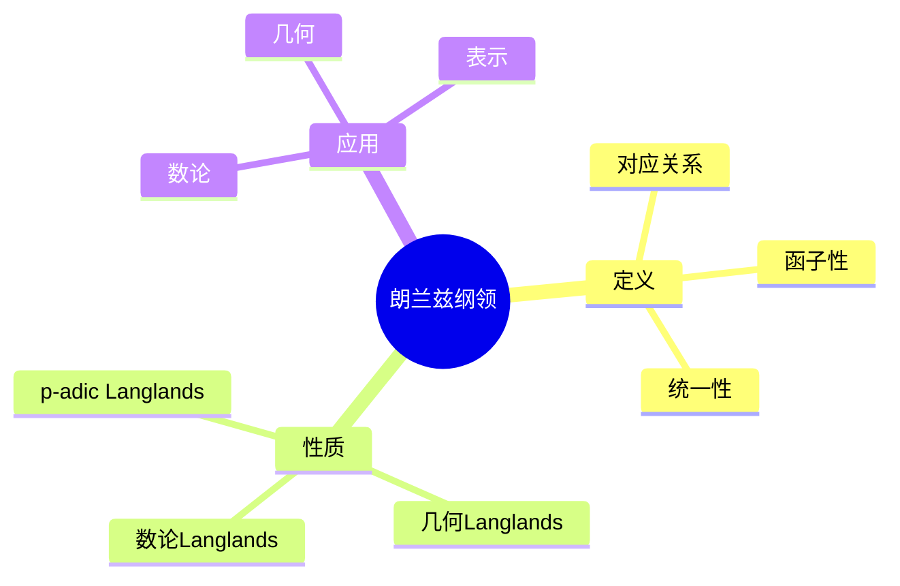
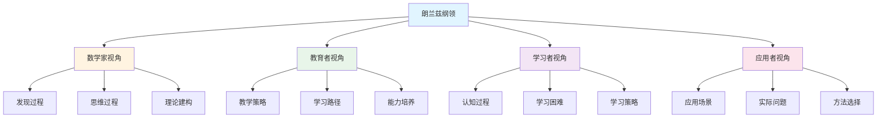

# 朗兰兹纲领 (Langlands Program) - 三视角组织版

**概念编号**: C.CORE.033
**知识层次**: L0-L3
**知识领域**: D8 (交叉领域)
**创建日期**: 2025年1月
**最后更新**: 2025年1月

---

## 📋 目录 / Table of Contents

- [朗兰兹纲领 (Langlands Program) - 三视角组织版](#朗兰兹纲领-langlands-program---三视角组织版)
  - [📋 目录 / Table of Contents](#-目录--table-of-contents)
  - [1. 📋 概述 (编号: C.CORE.033.01)](#1--概述-编号-ccore03301)
  - [🧠 认知学视角：如何理解朗兰兹纲领 (编号: C.CORE.033.02)](#-认知学视角如何理解朗兰兹纲领-编号-ccore03302)
    - [认知起点 (编号: C.CORE.033.02.01)](#认知起点-编号-ccore0330201)
    - [认知过程 (编号: C.CORE.033.02.02)](#认知过程-编号-ccore0330202)
      - [阶段1：直观理解阶段 (编号: C.CORE.033.02.02.01)](#阶段1直观理解阶段-编号-ccore033020201)
      - [阶段2：概念形成阶段 (编号: C.CORE.033.02.02.02)](#阶段2概念形成阶段-编号-ccore033020202)
      - [阶段3：形式化阶段 (编号: C.CORE.033.02.02.03)](#阶段3形式化阶段-编号-ccore033020203)
    - [认知障碍 (编号: C.CORE.033.02.03)](#认知障碍-编号-ccore0330203)
    - [认知工具 (编号: C.CORE.033.02.04)](#认知工具-编号-ccore0330204)
  - [🎓 教育学视角：如何教学朗兰兹纲领 (编号: C.CORE.033.03)](#-教育学视角如何教学朗兰兹纲领-编号-ccore03303)
    - [教学目标 (编号: C.CORE.033.03.01)](#教学目标-编号-ccore0330301)
    - [教学路径 (编号: C.CORE.033.03.02)](#教学路径-编号-ccore0330302)
      - [阶段1：引入阶段（激发兴趣） (编号: C.CORE.033.03.02.01)](#阶段1引入阶段激发兴趣-编号-ccore033030201)
      - [阶段2：探索阶段（主动建构） (编号: C.CORE.033.03.02.02)](#阶段2探索阶段主动建构-编号-ccore033030202)
      - [阶段3：形式化阶段（抽象概括） (编号: C.CORE.033.03.02.03)](#阶段3形式化阶段抽象概括-编号-ccore033030203)
      - [阶段4：巩固阶段（应用深化） (编号: C.CORE.033.03.02.04)](#阶段4巩固阶段应用深化-编号-ccore033030204)
    - [教学难点 (编号: C.CORE.033.03.03)](#教学难点-编号-ccore0330303)
    - [教学策略 (编号: C.CORE.033.03.04)](#教学策略-编号-ccore0330304)
    - [评估方法 (编号: C.CORE.033.03.05)](#评估方法-编号-ccore0330305)
  - [🔬 数学家视角：如何思考朗兰兹纲领 (编号: C.CORE.033.04)](#-数学家视角如何思考朗兰兹纲领-编号-ccore03304)
    - [问题起源 (编号: C.CORE.033.04.01)](#问题起源-编号-ccore0330401)
    - [思维过程 (编号: C.CORE.033.04.02)](#思维过程-编号-ccore0330402)
      - [步骤1：问题提出 (编号: C.CORE.033.04.02.01)](#步骤1问题提出-编号-ccore033040201)
      - [步骤2：概念形成 (编号: C.CORE.033.04.02.02)](#步骤2概念形成-编号-ccore033040202)
      - [步骤3：理论发展 (编号: C.CORE.033.04.02.03)](#步骤3理论发展-编号-ccore033040203)
    - [历史发展 (编号: C.CORE.033.04.03)](#历史发展-编号-ccore0330403)
    - [3.2 关键人物和贡献 (编号: C.CORE.033.04.04)](#32-关键人物和贡献-编号-ccore0330404)
    - [重要定理 (编号: C.CORE.033.04.05)](#重要定理-编号-ccore0330405)
    - [开放问题 (编号: C.CORE.033.04.06)](#开放问题-编号-ccore0330406)
    - [一、第一人称思维描述 (编号: C.CORE.033.04.07)](#一第一人称思维描述-编号-ccore0330407)
      - [1.1 Langlands的发现过程](#11-langlands的发现过程)
    - [二、数学直觉的形成 (编号: C.CORE.033.04.08)](#二数学直觉的形成-编号-ccore0330408)
      - [2.1 直觉在概念发现中的作用](#21-直觉在概念发现中的作用)
      - [2.2 如何培养朗兰兹纲领直觉](#22-如何培养朗兰兹纲领直觉)
    - [三、数学美的教育价值 (编号: C.CORE.033.04.09)](#三数学美的教育价值-编号-ccore0330409)
      - [3.1 朗兰兹纲领的美在哪里](#31-朗兰兹纲领的美在哪里)
      - [3.2 如何培养学生的数学美感](#32-如何培养学生的数学美感)
    - [四、问题解决策略 (编号: C.CORE.033.04.10)](#四问题解决策略-编号-ccore0330410)
      - [4.1 数学家的启发式方法](#41-数学家的启发式方法)
      - [4.2 思维过程分析](#42-思维过程分析)
    - [五、批判性反思 (编号: C.CORE.033.04.11)](#五批判性反思-编号-ccore0330411)
      - [5.1 朗兰兹纲领概念的局限性](#51-朗兰兹纲领概念的局限性)
      - [5.2 朗兰兹纲领理论的未解决问题](#52-朗兰兹纲领理论的未解决问题)
  - [💡 数学解释：为什么朗兰兹纲领是这样定义的 (编号: C.CORE.033.05)](#-数学解释为什么朗兰兹纲领是这样定义的-编号-ccore03305)
    - [一、直观解释：朗兰兹纲领是什么？](#一直观解释朗兰兹纲领是什么)
      - [1.1 具体例子](#11-具体例子)
      - [1.2 形象类比](#12-形象类比)
      - [1.3 几何直观](#13-几何直观)
      - [1.4 操作体验](#14-操作体验)
    - [二、知性解释：朗兰兹纲领的本质是什么？](#二知性解释朗兰兹纲领的本质是什么)
      - [2.1 概念定义](#21-概念定义)
      - [2.2 分类体系](#22-分类体系)
      - [2.3 抽象结构](#23-抽象结构)
      - [2.4 知识体系](#24-知识体系)
    - [三、理性解释：朗兰兹纲领的公理化定义](#三理性解释朗兰兹纲领的公理化定义)
      - [3.1 公理体系](#31-公理体系)
      - [3.2 形式化证明](#32-形式化证明)
      - [3.3 系统建构](#33-系统建构)
    - [四、多视角解释：从不同角度理解朗兰兹纲领](#四多视角解释从不同角度理解朗兰兹纲领)
      - [4.1 数学家视角：朗兰兹纲领是如何被发现的？](#41-数学家视角朗兰兹纲领是如何被发现的)
      - [4.2 教育者视角：如何教学朗兰兹纲领？](#42-教育者视角如何教学朗兰兹纲领)
      - [4.3 学习者视角：如何学习朗兰兹纲领？](#43-学习者视角如何学习朗兰兹纲领)
      - [4.4 应用者视角：如何应用朗兰兹纲领？](#44-应用者视角如何应用朗兰兹纲领)
    - [五、思维表征：用多种方式理解朗兰兹纲领](#五思维表征用多种方式理解朗兰兹纲领)
      - [5.1 思维导图：朗兰兹纲领的知识结构](#51-思维导图朗兰兹纲领的知识结构)
      - [5.2 矩阵对比：不同解释方式的对比](#52-矩阵对比不同解释方式的对比)
      - [5.3 多视角表征：从不同角度表征朗兰兹纲领](#53-多视角表征从不同角度表征朗兰兹纲领)
  - [🔗 三视角整合 (编号: C.CORE.033.06)](#-三视角整合-编号-ccore03306)
    - [三个视角的关联](#三个视角的关联)
    - [如何综合运用三个视角](#如何综合运用三个视角)
  - [📚 参考文献 (编号: C.CORE.033.07)](#-参考文献-编号-ccore03307)
    - [权威资源](#权威资源)
    - [经典教材](#经典教材)
    - [研究论文](#研究论文)

---

## 1. 📋 概述 (编号: C.CORE.033.01)

朗兰兹纲领是数学中的宏大统一理论，连接数论、代数几何、表示论等领域。朗兰兹纲领是现代数学的前沿，是21世纪数学的重要研究方向。

本文档从**数学认知学**、**教育学**、**数学家**三个视角深入展开朗兰兹纲领概念，避免简单的概念堆垒。

**权威资源对齐**:

- Wikipedia: [Langlands Program](https://en.wikipedia.org/wiki/Langlands_program)
- Stanford课程: Math 256 (Algebraic Number Theory)
- Princeton课程: MAT 420 (Algebraic Number Theory)
- MIT课程: 18.785 (Number Theory I)
- Metamath: [Langlands Program](http://us.metamath.org/mpeuni/df-langlands.html)

---

## 🧠 认知学视角：如何理解朗兰兹纲领 (编号: C.CORE.033.02)

### 认知起点 (编号: C.CORE.033.02.01)

**学习者已有的知识基础**:

- 数论的概念
- 表示论的概念
- 日常经验中的"统一"、"连接"概念

**日常经验中的类似概念**:

- "统一"：将不同领域统一
- "连接"：连接不同领域
- "桥梁"：不同领域之间的桥梁

### 认知过程 (编号: C.CORE.033.02.02)

#### 阶段1：直观理解阶段 (编号: C.CORE.033.02.02.01)

**具体例子**:

- 例子1：类域论 - 一维Galois表示对应Hecke特征
- 例子2：模形式 - 椭圆曲线对应模形式（Taniyama-Shimura猜想）
- 例子3：数域 - 数域的Galois群表示对应自守形式

**形象类比**:

- **桥梁类比**: 朗兰兹纲领就像"连接不同领域的桥梁"
  - 连接数论和表示论
  - 通过L函数连接
  - 统一不同领域

- **统一类比**: 朗兰兹纲领就像"统一不同领域的理论"
  - 统一数论
  - 统一表示论
  - 统一代数几何

**可视化表示**:

```text
朗兰兹纲领:
    数论 ←──L函数──> 表示论
         ↖         ↗
           统一理论
```

#### 阶段2：概念形成阶段 (编号: C.CORE.033.02.02.02)

**从例子中抽象出共同特征**:

- 所有例子都涉及"对应关系"
- 通过L函数连接
- 统一不同领域

**识别关键属性**:

1. **对应关系**: Galois表示对应自守表示
2. **L函数**: 通过L函数连接
3. **统一性**: 统一不同领域

**建立概念边界**:

- **什么是朗兰兹纲领**: 连接数论和表示论的统一理论
- **什么不是朗兰兹纲领**:
  - 不涉及对应关系的理论（不是朗兰兹纲领）

#### 阶段3：形式化阶段 (编号: C.CORE.033.02.02.03)

**严格定义**:

- 朗兰兹对应：Galois表示对应自守表示
- L函数：连接Galois表示和自守表示

**公理化表述**:

- 条件1：对应关系
- 条件2：L函数
- 条件3：统一性

**逻辑结构**:

- 朗兰兹纲领是数学的统一理论
- 朗兰兹纲领连接数论和表示论
- 朗兰兹纲领是现代数学的前沿

### 认知障碍 (编号: C.CORE.033.02.03)

**常见误解**:

1. **误解1**: 认为朗兰兹纲领就是数论
   - **纠正**: 朗兰兹纲领连接数论和表示论，不只是数论

2. **误解2**: 认为朗兰兹纲领已经完成
   - **纠正**: 朗兰兹纲领仍在发展中，很多问题未解决

3. **误解3**: 混淆朗兰兹纲领和类域论
   - **纠正**: 类域论是朗兰兹纲领的特例

**理解难点**:

1. **难点1**: 朗兰兹纲领的抽象性
   - **原因**: 朗兰兹纲领比较抽象
   - **解决方法**: 从具体例子开始，逐步抽象

2. **难点2**: 对应关系的概念
   - **原因**: 对应关系比较复杂
   - **解决方法**: 用具体例子，强调对应关系的作用

3. **难点3**: L函数的作用
   - **原因**: L函数比较复杂
   - **解决方法**: 用具体例子，强调L函数的作用

**认知陷阱**:

- **数论**: 需要理解朗兰兹纲领不只是数论
- **对应**: 需要理解对应关系的作用

### 认知工具 (编号: C.CORE.033.02.04)

**类比工具**:

- **桥梁类比**: 朗兰兹纲领 = 连接不同领域的桥梁
- **统一类比**: 朗兰兹纲领 = 统一不同领域的理论

**可视化工具**:

- **对应图**: 用对应图表示对应关系
- **L函数图**: 用L函数图表示L函数

**具体化工具**:

- **具体例子**: 用具体例子理解抽象概念
- **反例**: 用反例理解概念边界

---

## 🎓 教育学视角：如何教学朗兰兹纲领 (编号: C.CORE.033.03)

### 教学目标 (编号: C.CORE.033.03.01)

**知识目标**:

- 理解朗兰兹纲领的基本概念
- 掌握朗兰兹对应的定义
- 理解朗兰兹纲领的性质
- 理解朗兰兹纲领的应用

**能力目标**:

- 能够理解朗兰兹对应
- 能够理解L函数的作用
- 能够理解朗兰兹纲领的重要性
- 能够理解朗兰兹纲领的应用

**情感目标**:

- 培养数学抽象思维
- 培养统一思维
- 激发对数学的兴趣

### 教学路径 (编号: C.CORE.033.03.02)

#### 阶段1：引入阶段（激发兴趣） (编号: C.CORE.033.03.02.01)

**实际问题**:

- 问题1：如何统一数论和表示论？
- 问题2：如何连接不同领域？
- 问题3：如何研究数学的统一性？

**历史背景**:

- 朗兰兹纲领的历史发展
- 朗兰兹纲领在数学中的地位
- 朗兰兹纲领在现代数学中的作用

**引发认知冲突**:

- 问题：如何统一描述各种数学领域？
- 引出朗兰兹纲领的概念

#### 阶段2：探索阶段（主动建构） (编号: C.CORE.033.03.02.02)

**引导发现**:

1. 让学生自己列举"连接不同领域"的例子
2. 让学生观察这些例子的共同特征
3. 引导学生抽象出朗兰兹纲领的定义

**合作探究**:

- 小组讨论：什么是朗兰兹纲领？
- 小组讨论：朗兰兹纲领有哪些性质？
- 小组讨论：如何理解朗兰兹对应？

**多元表征**:

- **语言表征**: "朗兰兹纲领是连接数论和表示论的统一理论"
- **符号表征**: Galois表示 ↔ 自守表示
- **图形表征**: 对应图、L函数图
- **集合表征**: 朗兰兹对应定义

#### 阶段3：形式化阶段（抽象概括） (编号: C.CORE.033.03.02.03)

**严格定义**:

- 朗兰兹对应的定义
- L函数的定义
- 朗兰兹纲领的性质

**性质证明**:

- 朗兰兹对应的基本性质
- L函数的性质
- 朗兰兹纲领的应用

**应用拓展**:

- 朗兰兹纲领在数论中的应用
- 朗兰兹纲领在表示论中的应用
- 朗兰兹纲领在代数几何中的应用

#### 阶段4：巩固阶段（应用深化） (编号: C.CORE.033.03.02.04)

**练习应用**:

- 基础练习：朗兰兹对应的理解和应用
- 应用练习：用朗兰兹纲领研究数论问题
- 综合练习：朗兰兹纲领的综合应用

**变式训练**:

- 不同形式的朗兰兹对应
- 不同性质的朗兰兹纲领
- 朗兰兹纲领的应用

**知识整合**:

- 朗兰兹纲领与其他概念的联系
- 朗兰兹纲领在数学体系中的地位

### 教学难点 (编号: C.CORE.033.03.03)

**难点1：朗兰兹纲领的抽象性**:

- **难点描述**: 学生难以理解朗兰兹纲领的抽象概念
- **解决方法**:
  - 从具体例子开始
  - 逐步抽象
  - 用具体例子说明

**难点2：对应关系的概念**:

- **难点描述**: 学生难以理解对应关系
- **解决方法**:
  - 用具体例子
  - 强调对应关系的作用
  - 用图形可视化

**难点3：L函数的作用**:

- **难点描述**: 学生难以理解L函数的作用
- **解决方法**:
  - 用具体例子
  - 强调L函数的作用
  - 用练习巩固

### 教学策略 (编号: C.CORE.033.03.04)

**策略1：从具体到抽象**:

- 先给出具体例子
- 再抽象出一般概念
- 最后给出严格定义

**策略2：多元表征**:

- 用语言、符号、图形等多种方式表示同一概念
- 帮助学生建立不同表征之间的联系

**策略3：问题驱动**:

- 从实际问题出发
- 引出数学概念
- 解决问题

**策略4：可视化教学**:

- 使用对应图
- 使用L函数图
- 使用具体例子

### 评估方法 (编号: C.CORE.033.03.05)

**形成性评估**（评估理解过程）:

- 课堂提问：检查学生对概念的理解
- 小组讨论：观察学生的思考过程
- 练习作业：检查学生的应用能力

**总结性评估**（评估最终理解）:

- 测验：检查学生对概念和对应的掌握
- 项目：检查学生理解朗兰兹纲领的能力
- 反思：检查学生对朗兰兹纲领概念的理解深度

---

## 🔬 数学家视角：如何思考朗兰兹纲领 (编号: C.CORE.033.04)

### 问题起源 (编号: C.CORE.033.04.01)

**历史背景**:

- 20世纪：朗兰兹纲领的起源
- 20世纪中期：朗兰兹纲领的发展
- 20世纪后期：朗兰兹纲领的现代发展

**原始问题**:

- **问题1**: 如何统一数论和表示论？
- **问题2**: 如何连接不同领域？
- **问题3**: 朗兰兹纲领有哪些性质？

**研究动机**:

- 统一数学理论
- 发展现代数学
- 研究数学的统一性

### 思维过程 (编号: C.CORE.033.04.02)

#### 步骤1：问题提出 (编号: C.CORE.033.04.02.01)

**观察到的现象**:

- 需要统一数论和表示论
- 需要连接不同领域
- 需要统一数学理论

**提出的猜想**:

- 可以引入朗兰兹对应
- 朗兰兹对应可以连接数论和表示论
- 朗兰兹纲领有丰富的性质

**需要解决的问题**:

- 如何定义朗兰兹对应？
- 朗兰兹对应应该满足什么条件？
- 朗兰兹纲领有哪些性质？

#### 步骤2：概念形成 (编号: C.CORE.033.04.02.02)

**尝试性定义**:

- **对应定义**: 通过Galois表示和自守表示
- **L函数定义**: 通过L函数

**性质探索**:

- 朗兰兹对应的基本性质
- L函数的性质
- 朗兰兹纲领的应用

**结构发现**:

- 朗兰兹纲领是数学的统一理论
- 朗兰兹纲领连接数论和表示论
- 朗兰兹纲领是现代数学的前沿

#### 步骤3：理论发展 (编号: C.CORE.033.04.02.03)

**定理证明**:

- 朗兰兹对应的基本性质
- L函数的性质
- 朗兰兹纲领的应用

**应用拓展**:

- 朗兰兹纲领在数论中的应用
- 朗兰兹纲领在表示论中的应用
- 朗兰兹纲领在代数几何中的应用

**理论完善**:

- 朗兰兹纲领的严格定义
- 朗兰兹纲领的范畴论研究
- 朗兰兹纲领的应用研究

### 历史发展 (编号: C.CORE.033.04.03)

**早期阶段**（20世纪）:

- **Artin (1927)**: 发展类域论
- **Hecke (1936)**: 研究Hecke L函数

**关键突破**（20世纪中期）:

- **Langlands (1967)**: 提出朗兰兹纲领
- **Deligne (1974)**: 证明Weil猜想

**现代发展**（20世纪后期）:

- **Wiles (1994)**: 证明Fermat大定理
- **Lafforgue (2002)**: 证明函数域朗兰兹对应

### 3.2 关键人物和贡献 (编号: C.CORE.033.04.04)

**Robert Langlands (1936-)**:

- 提出朗兰兹纲领
- 统一数论和表示论

**Pierre Deligne (1944-)**:

- 证明Weil猜想
- 建立现代代数几何

**Andrew Wiles (1953-)**:

- 证明Fermat大定理
- 建立现代数论

### 重要定理 (编号: C.CORE.033.04.05)

**Taniyama-Shimura猜想**:

- 椭圆曲线对应模形式
- 意义：朗兰兹纲领的重要结果

**Fermat大定理**:

- $x^n + y^n = z^n$在$n > 2$时无整数解
- 意义：数论的重要结果

**函数域朗兰兹对应**:

- 函数域的Galois表示对应自守表示
- 意义：朗兰兹纲领的重要进展

### 开放问题 (编号: C.CORE.033.04.06)

**未解决问题**:

- 数域朗兰兹对应
- 几何朗兰兹对应
- 朗兰兹纲领的推广

**研究方向**:

- 朗兰兹纲领的范畴论研究
- 朗兰兹纲领的几何研究
- 朗兰兹纲领的应用研究

### 一、第一人称思维描述 (编号: C.CORE.033.04.07)

#### 1.1 Langlands的发现过程

**详细历史背景**:

- **1967年**：Langlands提出朗兰兹纲领
- **背景**：研究数论和表示论，发现数论和表示论之间有深刻的联系
- **问题**：如何描述这种联系？如何统一处理数论、几何和表示论？

**Langlands的详细第一人称描述**:
> "1967年，我在研究数论时，遇到了一个问题：如何统一处理数论、几何和表示论？
>
> 我发现，数论和表示论之间有深刻的联系：
>
> - **数论**：研究数域$K$的Galois群$\text{Gal}(\overline{K}/K)$
> - **表示论**：研究代数群的表示
> - **联系**：Galois表示对应自守表示
>
> 我的发现是：
>
> - **朗兰兹对应**：数域的Galois表示对应自守表示
> - **函数域朗兰兹对应**：函数域的Galois表示对应自守表示（已证明）
> - **数域朗兰兹对应**：数域的Galois表示对应自守表示（未完全证明）
>
> 例如，对于椭圆曲线$E: y^2 = x^3 + ax + b$：
>
> - **Galois表示**：$\rho_E: \text{Gal}(\overline{\mathbb{Q}}/\mathbb{Q}) \to \text{GL}_2(\mathbb{Q}_\ell)$
> - **自守表示**：对应的模形式$f_E$
> - **对应**：$\rho_E$对应$f_E$（Taniyama-Shimura-Weil猜想，已证明）
>
> 我还发现了函数域朗兰兹对应：
>
> - **函数域**：$\mathbb{F}_q(t)$的有限扩张
> - **Galois表示**：函数域的Galois表示
> - **自守表示**：对应的自守形式
> - **对应**：函数域的Galois表示对应自守表示（Lafforgue，2002年证明）
>
> 这让我意识到，朗兰兹纲领是统一数论、几何和表示论的框架，朗兰兹对应是连接这些领域的桥梁。这为数论提供了新的视角。"

**详细的思维过程**:

1. **观察到的现象**（1967年）:

   **现象1：数论和表示论之间有联系**
   - **问题**：如何描述这种联系？
   - **例子**：椭圆曲线的Galois表示对应模形式
   - **需要**：统一的概念

   **现象2：这种联系有特殊的性质**
   - **问题**：朗兰兹对应有什么性质？
   - **例子**：函数域朗兰兹对应（已证明）
   - **需要**：建立朗兰兹纲领

   **现象3：需要统一的概念**
   - **问题**：如何统一处理数论、几何和表示论？
   - **思路**：用朗兰兹纲领统一
   - **需要**：建立朗兰兹纲领

2. **提出的猜想**（1967年）:

   **猜想1：用朗兰兹对应描述数论和表示论的联系**
   - **思路**：定义朗兰兹对应为Galois表示和自守表示之间的对应
   - **例子**：椭圆曲线的Galois表示对应模形式
   - **优点**：统一描述数论和表示论的联系

   **猜想2：函数域朗兰兹对应**
   - **对应**：函数域的Galois表示对应自守表示
   - **证明**：Lafforgue（2002年）证明
   - **意义**：为朗兰兹纲领提供基础

   **猜想3：数域朗兰兹对应**
   - **对应**：数域的Galois表示对应自守表示
   - **状态**：未完全证明
   - **意义**：朗兰兹纲领的核心

3. **遇到的困难**（1967年至今）:

   **困难1：如何严格定义朗兰兹对应？**
   - **问题**：如何定义朗兰兹对应？
   - **解决**：通过Galois表示和自守表示之间的对应定义
   - **意义**：为朗兰兹纲领提供严格的数学基础

   **困难2：如何证明朗兰兹对应？**
   - **问题**：如何证明数域朗兰兹对应？
   - **进展**：函数域朗兰兹对应已证明，数域朗兰兹对应未完全证明
   - **意义**：朗兰兹纲领的核心问题

   **困难3：如何应用朗兰兹纲领？**
   - **问题**：如何用朗兰兹纲领解决实际问题？
   - **解决**：建立Fermat大定理的证明、椭圆曲线的研究
   - **意义**：为朗兰兹纲领提供应用基础

4. **突破的时刻**（1967年，Langlands；2002年，Lafforgue）:

   **突破1：朗兰兹纲领的提出**
   - Langlands提出朗兰兹纲领
   - **关键**：统一数论、几何和表示论
   - **意义**：为数论提供新的视角

   **突破2：函数域朗兰兹对应**
   - Lafforgue证明函数域朗兰兹对应
   - **关键**：函数域的Galois表示对应自守表示
   - **意义**：为朗兰兹纲领提供基础

   **突破3：朗兰兹纲领的广泛应用**
   - 朗兰兹纲领可以应用到更广泛的领域
   - **关键**：朗兰兹纲领是统一的数学框架
   - **意义**：朗兰兹纲领成为数学的基础

### 二、数学直觉的形成 (编号: C.CORE.033.04.08)

#### 2.1 直觉在概念发现中的作用

**Langlands的直觉**:

- **直觉1**: "朗兰兹对应"是"数论和表示论的联系"——这个直觉引导Langlands发现朗兰兹纲领
- **直觉2**: 朗兰兹纲领可以统一数论——这个直觉引导Langlands建立朗兰兹纲领
- **直觉3**: 朗兰兹纲领是数论的基础——这个直觉引导Langlands建立朗兰兹纲领

**直觉的验证**:

- 通过严格的数学证明验证直觉的正确性
- 通过函数域朗兰兹对应验证朗兰兹纲领
- 通过应用验证朗兰兹纲领的广泛性

**直觉的深化**:

- 从"数论和表示论的联系"到"朗兰兹纲领的严格定义"
- 从"统一数论"到"朗兰兹纲领的广泛应用"
- 从"数论基础"到"朗兰兹纲领的深入发展"

#### 2.2 如何培养朗兰兹纲领直觉

**数学家的建议**:

- **Langlands**: "朗兰兹纲领直觉是长期训练的结果。通过大量练习和深入思考，我们可以培养对朗兰兹纲领的直觉。"
- **Wiles**: "从具体例子开始，逐步抽象，这是培养朗兰兹纲领直觉的有效方法。"

**培养方法**:

1. **大量练习**: 通过大量朗兰兹对应构造练习，培养对朗兰兹纲领的直觉
2. **深入思考**: 深入思考朗兰兹纲领的本质，理解朗兰兹纲领的深层结构
3. **类比和联想**: 通过类比和联想，建立朗兰兹纲领与其他概念的联系
4. **与专家交流**: 与数学家交流，学习他们的思维方式

**教学启示**:

- 从具体例子开始，逐步抽象
- 鼓励学生思考朗兰兹纲领的本质
- 引导学生建立朗兰兹纲领与其他概念的联系

### 三、数学美的教育价值 (编号: C.CORE.033.04.09)

#### 3.1 朗兰兹纲领的美在哪里

**结构美**:

- **简洁性**: 朗兰兹纲领的概念非常简洁——"数论和表示论的对应"
- **统一性**: 朗兰兹纲领可以统一描述数学中的各种数论理论
- **和谐性**: 朗兰兹纲领满足优美的规律（函数方程、L函数等）

**数学家的评价**:

- **Langlands**: "朗兰兹纲领的美在于它的统一性。它为我们提供了一个统一的框架来理解数论。"
- **Wiles**: "朗兰兹纲领的美在于它的深刻性。它揭示了数论和表示论之间的深刻联系。"

#### 3.2 如何培养学生的数学美感

**数学家的建议**:

- **Langlands**: "展示朗兰兹纲领的美感，让学生感受到数学的美。"
- **Wiles**: "通过朗兰兹纲领的历史和发展，让学生理解数学的美。"

**教学方法**:

1. **展示数学美**:
   - 展示朗兰兹纲领概念的简洁性和统一性
   - 展示朗兰兹纲领的优美规律
   - 展示朗兰兹纲领在数学中的基础地位

2. **引导学生欣赏**:
   - 引导学生欣赏朗兰兹纲领概念的简洁性
   - 引导学生欣赏朗兰兹纲领的深刻性
   - 引导学生欣赏朗兰兹纲领的基础性

3. **鼓励学生创造美**:
   - 鼓励学生发现朗兰兹纲领的美
   - 鼓励学生创造优美的朗兰兹纲领证明
   - 鼓励学生探索朗兰兹纲领的美

### 四、问题解决策略 (编号: C.CORE.033.04.10)

#### 4.1 数学家的启发式方法

**策略1：从具体到抽象**:

- 从具体的朗兰兹对应例子开始
- 抽象出朗兰兹纲领的一般性质
- 建立朗兰兹纲领的理论体系

**策略2：从简单到复杂**:

- 先理解基本朗兰兹对应
- 再理解朗兰兹纲领性质
- 最后理解朗兰兹纲领理论

**策略3：从问题到理论**:

- 从实际问题出发
- 引出朗兰兹纲领概念
- 建立朗兰兹纲领理论

#### 4.2 思维过程分析

**问题识别**:

- 识别问题类型：朗兰兹纲领定义问题、朗兰兹对应问题、朗兰兹纲领应用问题
- 识别问题难度：简单问题、中等问题、复杂问题

**策略选择**:

- 简单问题：直接方法
- 中等问题：分步方法
- 复杂问题：分解方法

**执行和反思**:

- 执行策略，解决问题
- 反思过程，总结经验
- 改进方法，提高效率

### 五、批判性反思 (编号: C.CORE.033.04.11)

#### 5.1 朗兰兹纲领概念的局限性

**概念的边界**:

- 朗兰兹纲领只描述数域和函数域，不能描述所有数学结构
- 朗兰兹纲领是抽象的，需要具体化才能应用
- 朗兰兹纲领不能表示所有数学量

**概念的推广**:

- 几何朗兰兹：几何中的朗兰兹纲领
- 范畴朗兰兹：范畴论中的朗兰兹纲领
- 导出朗兰兹：同调代数中的朗兰兹纲领

#### 5.2 朗兰兹纲领理论的未解决问题

**未解决的问题**:

- 数域朗兰兹对应：数域的Galois表示是否对应自守表示？
- 几何朗兰兹对应：几何对象是否对应自守表示？
- 朗兰兹纲领的推广：如何推广朗兰兹纲领到更一般的结构？

**研究方向**:

- 朗兰兹纲领的范畴论研究
- 朗兰兹纲领的几何研究
- 朗兰兹纲领的应用研究

---

## 💡 数学解释：为什么朗兰兹纲领是这样定义的 (编号: C.CORE.033.05)

### 一、直观解释：朗兰兹纲领是什么？

#### 1.1 具体例子

**生活中的例子**：

- **统一理论**：朗兰兹纲领是数学的统一理论
  - 例如：朗兰兹纲领连接数论、几何、表示
  - **为什么这样定义**：因为我们需要一个概念来表示"数学的统一"
- **对应关系**：朗兰兹纲领建立对应关系
  - 例如：Galois表示对应自守形式
  - **为什么这样定义**：因为我们需要一个概念来表示"不同领域的对应"
- **桥梁作用**：朗兰兹纲领是数学的桥梁
  - 例如：朗兰兹纲领连接不同数学分支
  - **为什么这样定义**：因为我们需要一个概念来表示"数学的桥梁"

**数学中的例子**：

- **Langlands对应**：Galois表示对应自守表示
  - **为什么这样定义**：我们需要一个简单的方式来表示"Langlands对应"
- **函子性**：Langlands函子性原理
  - **为什么这样定义**：我们需要一个概念来表示"函子性"
- **几何Langlands**：几何Langlands纲领
  - **为什么这样定义**：我们需要一个概念来表示"几何Langlands"

#### 1.2 形象类比

**Rosetta Stone类比**：

- **朗兰兹纲领就像"Rosetta Stone"**
  - Rosetta Stone翻译不同语言
  - 朗兰兹纲领连接不同数学分支
- **为什么这样类比**：这个类比帮助我们理解朗兰兹纲领的"统一"性质

**桥梁类比**：

- **朗兰兹纲领就像"桥梁"**
  - 桥梁连接两岸
  - 朗兰兹纲领连接不同数学分支
- **为什么这样类比**：这个类比帮助我们理解朗兰兹纲领的"连接"性质

#### 1.3 几何直观

**对应图表示**：

- 使用对应图表示朗兰兹纲领
- 例如：Galois表示 $\leftrightarrow$ 自守表示
- **为什么使用对应图**：对应图提供几何直观，帮助我们理解朗兰兹纲领

**函子性表示**：

- 使用函子性表示朗兰兹纲领
- 例如：函子性原理
- **为什么使用函子性**：函子性提供几何直观，帮助我们理解朗兰兹纲领

#### 1.4 操作体验

**朗兰兹纲领运算的操作**：

- **对应的建立**：建立Galois表示和自守表示的对应
  - **为什么这样操作**：因为我们需要一个运算来建立"对应"
- **函子性的应用**：应用函子性原理
  - **为什么这样操作**：因为我们需要一个运算来应用"函子性"
- **几何Langlands**：研究几何Langlands纲领
  - **为什么这样操作**：因为我们需要一个工具来研究"几何Langlands"

### 二、知性解释：朗兰兹纲领的本质是什么？

#### 2.1 概念定义

**朗兰兹纲领的内涵**：

- **朗兰兹纲领是连接数论、代数几何、表示论的统一理论**
  - **对应关系**：Galois表示对应自守表示
  - **函子性**：Langlands函子性原理
  - **统一性**：统一不同数学分支
- **为什么这样定义**：这些特征使得朗兰兹纲领成为一个完整的数学统一工具，支持所有数学统一研究

**朗兰兹纲领的外延**：

- **数论Langlands**：数论中的Langlands纲领
- **几何Langlands**：几何中的Langlands纲领
- **p-adic Langlands**：p-adic Langlands纲领
- **为什么这样分类**：不同的Langlands纲领类型有不同的性质和用途

#### 2.2 分类体系

**按领域分类**：

- **数论Langlands**：数论中的Langlands纲领
- **几何Langlands**：几何中的Langlands纲领
- **p-adic Langlands**：p-adic Langlands纲领
- **为什么这样分类**：领域是Langlands纲领的基本特征

**按性质分类**：

- **对应关系**：Galois表示对应自守表示
- **函子性**：Langlands函子性原理
- **几何化**：几何Langlands纲领
- **为什么这样分类**：性质是Langlands纲领的重要特征

#### 2.3 抽象结构

**朗兰兹纲领的运算结构**：

- **对应的建立**：建立Galois表示和自守表示的对应
- **函子性的应用**：应用函子性原理
- **为什么有这些运算**：这些运算使得朗兰兹纲领具有统一结构

**朗兰兹纲领的关系结构**：

- **对应关系**：Galois表示对应自守表示
- **函子性**：Langlands函子性原理
- **为什么有这个关系**：这个关系帮助我们研究朗兰兹纲领的结构

#### 2.4 知识体系

**朗兰兹纲领在数学体系中的位置**：

- **基础地位**：朗兰兹纲领是现代数学的前沿
  - 朗兰兹纲领统一数论、几何、表示
  - 朗兰兹纲领连接不同数学分支
- **为什么是基础**：朗兰兹纲领提供了统一的框架来研究数学

**朗兰兹纲领与其他概念的关系**：

- **朗兰兹纲领与数论**：朗兰兹纲领在数论中有重要应用
- **朗兰兹纲领与几何**：朗兰兹纲领在几何中有重要应用
- **朗兰兹纲领与表示**：朗兰兹纲领在表示论中有重要应用
- **为什么有这些关系**：这些关系揭示了朗兰兹纲领与其他数学概念的内在联系

### 三、理性解释：朗兰兹纲领的公理化定义

#### 3.1 公理体系

**朗兰兹纲领的定义**：

- **定义**：朗兰兹纲领是连接数论、代数几何、表示论的统一理论
- **为什么需要这个定义**：这个定义提供了朗兰兹纲领的严格数学基础

**朗兰兹纲领的公理**：

- **对应公理**：Galois表示对应自守表示
- **函子性公理**：Langlands函子性原理
- **为什么这样定义**：这些公理将朗兰兹纲领放在更一般的框架中

#### 3.2 形式化证明

**朗兰兹纲领性质的证明**：

- **对应的建立**：建立Galois表示和自守表示的对应
  - **证明**：使用朗兰兹纲领的定义和对应的性质
  - **为什么这样证明**：利用朗兰兹纲领的定义和对应的性质
- **函子性的应用**：应用函子性原理
  - **证明**：使用朗兰兹纲领的定义和函子性的性质
  - **为什么这样证明**：利用朗兰兹纲领的定义和函子性的性质

#### 3.3 系统建构

**朗兰兹纲领论在数学基础中的地位**：

- **作为数学统一基础**：朗兰兹纲领是数学统一的基础
- **提供统一工具**：朗兰兹纲领提供了统一数学的工具
- **统一框架**：朗兰兹纲领统一了各种数学研究

**朗兰兹纲领论的发展历史**：

- **Langlands的提出**（1967年）：提出朗兰兹纲领
- **Wiles的证明**（1994年）：证明Taniyama-Shimura-Weil猜想
- **Ngô的证明**（2010年）：证明基本引理
- **为什么这样发展**：数学的发展需要严格的基础，朗兰兹纲领论的发展反映了这一需求

### 四、多视角解释：从不同角度理解朗兰兹纲领

#### 4.1 数学家视角：朗兰兹纲领是如何被发现的？

**Langlands的发现过程**：

- **问题提出**：如何统一数论、几何、表示？
- **关键洞察**：使用对应关系，发现朗兰兹纲领的统一结构
- **重要发现**：朗兰兹纲领可以用于统一数学
- **为什么这样发现**：数学家的直觉和严格证明相结合

#### 4.2 教育者视角：如何教学朗兰兹纲领？

**教学策略**：

- **从具体到抽象**：先学习具体例子（对应关系），再学习抽象定义
- **从简单到复杂**：先学习简单对应，再学习复杂对应
- **从直观到形式化**：先使用对应图等直观工具，再学习严格定义
- **为什么这样教学**：符合认知规律，帮助学生逐步建立理解

#### 4.3 学习者视角：如何学习朗兰兹纲领？

**认知过程**：

- **直观阶段**：通过具体例子理解朗兰兹纲领的含义
- **概念阶段**：理解朗兰兹纲领的定义和性质
- **形式化阶段**：理解严格定义和证明
- **为什么这样学习**：符合认知发展规律

#### 4.4 应用者视角：如何应用朗兰兹纲领？

**应用场景**：

- **数论**：使用朗兰兹纲领研究数论问题
- **几何**：使用朗兰兹纲领研究几何结构
- **表示**：使用朗兰兹纲领研究表示论
- **为什么这样应用**：朗兰兹纲领提供了强大的工具来处理各种问题

### 五、思维表征：用多种方式理解朗兰兹纲领

#### 5.1 思维导图：朗兰兹纲领的知识结构



#### 5.2 矩阵对比：不同解释方式的对比

| 解释方式 | 特点 | 方法 | 工具 | 适用阶段 | 优势 | 局限 |
|---------|------|------|------|---------|------|------|
| **直观解释** | 具体、形象、可视 | 例子、类比、直观 | 对应图、图形 | 入门阶段 | 易于理解 | 不够严格 |
| **知性解释** | 概念、分类、抽象 | 定义、分类、结构 | 概念图、知识图谱 | 中级阶段 | 系统完整 | 不够直观 |
| **理性解释** | 公理、证明、形式化 | 公理、证明、系统 | 形式化工具、证明系统 | 高级阶段 | 严格准确 | 不够具体 |
| **多视角解释** | 多角度、整合 | 多视角、整合 | 多视角工具 | 所有阶段 | 全面深入 | 可能复杂 |

#### 5.3 多视角表征：从不同角度表征朗兰兹纲领



---

## 🔗 三视角整合 (编号: C.CORE.033.06)

### 三个视角的关联

**认知学视角 ↔ 教育学视角**:

- 认知学视角揭示的理解机制，指导教育学视角的教学设计
- 教育学视角的教学实践，验证认知学视角的理论

**认知学视角 ↔ 数学家视角**:

- 数学家视角的思维过程，启发认知学视角的认知路径
- 认知学视角的认知障碍，解释数学家视角的历史困难

**教育学视角 ↔ 数学家视角**:

- 数学家视角的历史发展，为教育学视角提供教学素材
- 教育学视角的教学策略，帮助学习者理解数学家视角的思维过程

### 如何综合运用三个视角

**学习建议**:

1. **从认知学视角开始**: 先建立直观理解
2. **用教育学视角深化**: 通过教学路径系统学习
3. **用数学家视角升华**: 理解概念的深层意义和历史背景

**教学建议**:

1. **引入阶段**: 用数学家视角的问题起源激发兴趣
2. **探索阶段**: 用认知学视角的认知过程引导发现
3. **形式化阶段**: 用教育学视角的教学策略系统教学
4. **巩固阶段**: 综合三个视角深化理解

---

## 📚 参考文献 (编号: C.CORE.033.07)

### 权威资源

- Wikipedia: [Langlands Program](https://en.wikipedia.org/wiki/Langlands_program)
- Metamath: [Langlands Program](http://us.metamath.org/mpeuni/df-langlands.html)

### 经典教材

- Gelbart, S. (1984). "An Elementary Introduction to the Langlands Program". *Bulletin of the American Mathematical Society*.
- Bump, D. (1997). *Automorphic Forms and Representations*. Cambridge University Press.

### 研究论文

- Langlands, R. P. (1967). "Euler Products". *Yale University Press*.
- Wiles, A. (1995). "Modular elliptic curves and Fermat's Last Theorem". *Annals of Mathematics*.

---

**创建日期**: 2025年1月
**最后更新**: 2025年1月
**维护状态**: 持续更新中
