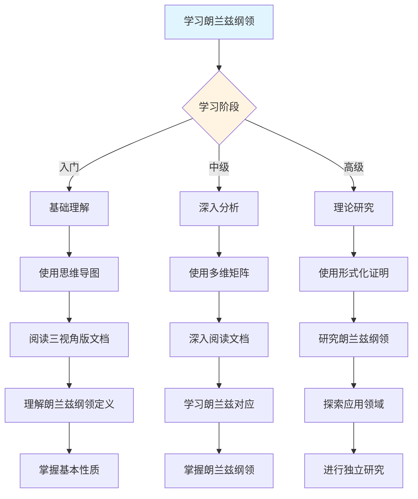
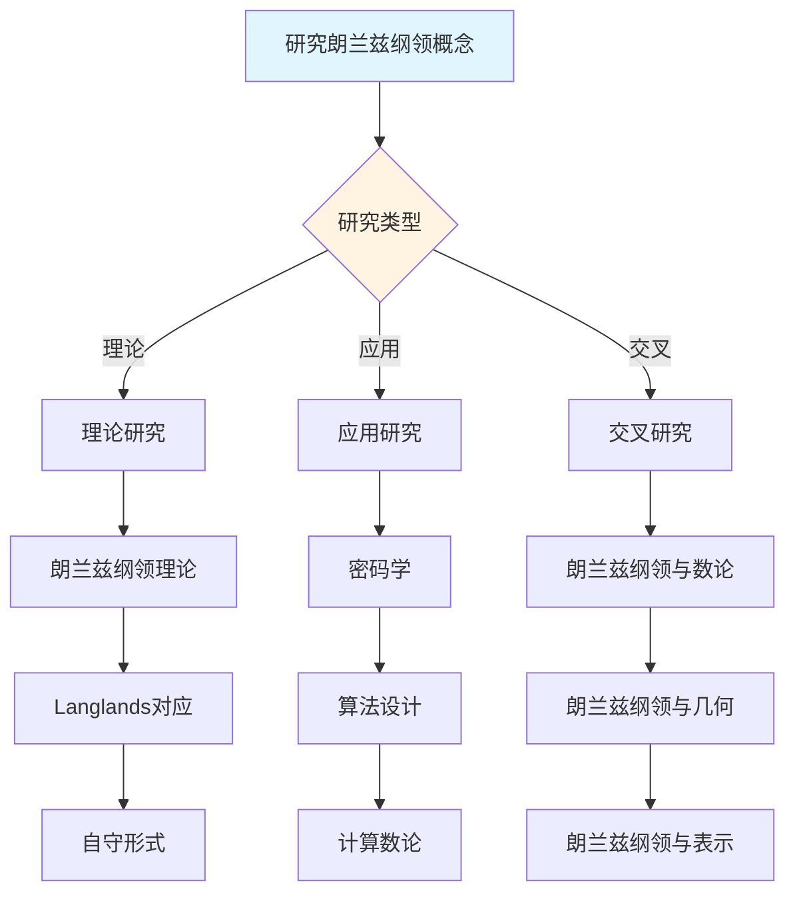
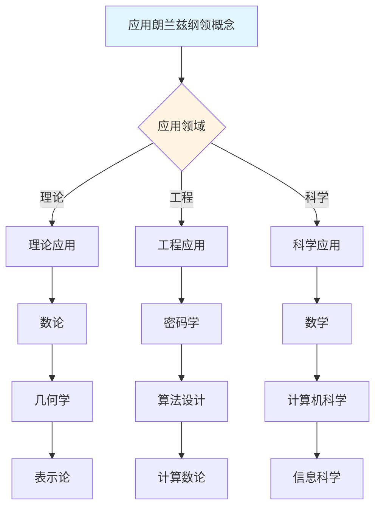
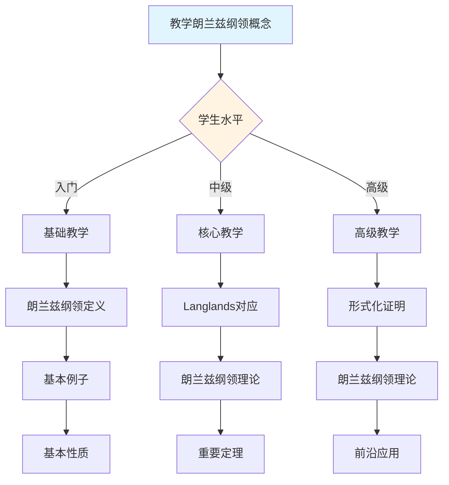

# 朗兰兹纲领概念决策导图示例

**主题编号**: C.CORE.033.DECISION
**创建日期**: 2025年1月
**最后更新**: 2025年1月
**关联概念**: [朗兰兹纲领-三视角版](./33-朗兰兹纲领-三视角版.md)

---

## 📋 概述

本文档提供朗兰兹纲领概念的详细决策导图示例，展示如何将[决策思维导图体系](../01-总体思维导图/05-决策思维导图体系.md)应用于朗兰兹纲领概念的学习、研究、应用和教学。

**目标**：为朗兰兹纲领概念提供完整的决策支持，包括：

- 学习决策导图
- 研究决策导图
- 应用决策导图
- 教学决策导图

---

## 🎓 一、学习决策导图 (编号: C.CORE.033.DECISION.01)

### 1.1 学习路径决策

### 1.2 学习重点决策

**基于知识矩阵的学习重点**：

| 学习阶段 | 知识层次 | 学习重点 | 推荐资源 |
|---------|---------|---------|---------|
| **入门** | L0基础 | 朗兰兹纲领的定义、基本例子 | 思维导图、三视角版文档 |
| **入门** | L0基础 | 朗兰兹纲领的直观理解（数论与几何的桥梁、Langlands对应） | 三视角版文档、应用实例 |
| **中级** | L1中级 | Langlands对应 | 多维矩阵、形式化证明 |
| **中级** | L1中级 | 朗兰兹纲领 | 三视角版文档、习题库 |
| **高级** | L2高级 | 朗兰兹纲领理论 | 形式化证明系统 |
| **高级** | L3研究 | 前沿研究 | 形式化证明系统 |

### 1.3 学习方法决策

**基于认知维度的学习方法**：

1. **直观维度**（入门阶段）
   - 阶段）
   - 使用思维导图建立总体框架
   - 使用具体例子理解概念（Langlands对应、自守形式）
   - 使用桥梁直观理解朗兰兹纲领

2. **知性维度**（中级阶段）
   - 使用多维矩阵分析概念特征
   - 使用概念分类系统理解（数论侧、几何侧、Langlands对应）
   - 使用关系分析建立联系（与数论、几何、表示的关系）

3. **理性维度**（高级阶段）
   - 使用形式化证明严格理解
   - 使用逻辑推理深入分析
   - 使用系统建构整体把握

---

## 🔬 二、研究决策导图 (编号: C.CORE.033.DECISION.02)

### 2.1 研究方向决策

### 2.2 研究问题决策

**基于知识矩阵的研究问题**：

1. **理论研究问题**
   - 朗兰兹纲领理论：朗兰兹纲领的分类和性质
   - Langlands对应：Langlands对应的证明
   - 自守形式：自守形式的理论

2. **应用研究问题**
   - 密码学：朗兰兹纲领在密码学中的应用（椭圆曲线密码中的朗兰兹对应）
   - 算法设计：朗兰兹纲领在算法设计中的应用
   - 计算数论：朗兰兹纲领在计算数论中的应用

3. **交叉研究问题**
   - 朗兰兹纲领与数论：朗兰兹纲领在数论中的应用
   - 朗兰兹纲领与几何：朗兰兹纲领在几何中的应用
   - 朗兰兹纲领与表示：朗兰兹纲领在表示中的应用

### 2.3 研究方法决策

**基于形式化证明的研究方法**：

1. **构造性证明** → 朗兰兹纲领的构造
   - 直接构造朗兰兹纲领
   - 适用于具体朗兰兹纲领

2. **数论方法** → Langlands对应
   - 使用数论方法
   - 适用于Langlands对应

3. **几何方法** → 朗兰兹纲领理论
   - 使用几何方法
   - 适用于朗兰兹纲领理论

---

## 💼 三、应用决策导图 (编号: C.CORE.033.DECISION.03)

### 3.1 应用场景决策

### 3.2 应用方法决策

**基于应用场景的应用方法**：

1. **理论应用** → 使用形式化证明
   - 数论：朗兰兹纲领是数论的基础
   - 几何学：朗兰兹纲领在几何中的应用
   - 表示论：朗兰兹纲领在表示中的应用

2. **工程应用** → 使用论证过程
   - 密码学：朗兰兹纲领在密码学中的应用（椭圆曲线密码中的朗兰兹对应）
   - 算法设计：朗兰兹纲领在算法设计中的应用
   - 计算数论：朗兰兹纲领在计算数论中的应用

3. **科学应用** → 使用综合方法
   - 数学：朗兰兹纲领在数学中的应用
   - 计算机科学：朗兰兹纲领在计算机科学中的应用
   - 信息科学：朗兰兹纲领在信息科学中的应用

---

## 🎓 四、教学决策导图 (编号: C.CORE.033.DECISION.04)

### 4.1 教学内容决策

### 4.2 教学方法决策

**基于认知维度的教学方法**：

1. **直观维度**（入门教学）
   - 使用思维导图建立框架
   - 使用具体例子（Langlands对应、自守形式）
   - 使用桥梁直观理解

2. **知性维度**（中级教学）
   - 使用多维矩阵深入分析
   - 使用概念分类系统
   - 使用关系分析建立联系

3. **理性维度**（高级教学）
   - 使用形式化证明严格理解
   - 使用逻辑推理深入分析
   - 使用系统建构整体把握

---

## 🔄 五、整合应用示例 (编号: C.CORE.033.DECISION.05)

### 5.1 完整学习流程示例

**阶段1：入门理解**

1. 使用学习决策导图 → 确定学习路径：基础概念 → 朗兰兹纲领定义 → 基本性质 → 基本应用
2. 使用总体思维导图 → 了解朗兰兹纲领在交叉领域中的位置
3. 阅读[朗兰兹纲领-三视角版](./33-朗兰兹纲领-三视角版.md) → 理解朗兰兹纲领的定义和基本性质
4. 使用论证过程 → 理解朗兰兹纲领的直观意义（数论与几何的桥梁、Langlands对应、自守形式）

**阶段2：深入分析**

1. 使用多维矩阵 → 分析朗兰兹纲领的多维度特征（知识层次L0基础层、知识领域D8交叉领域、学习难度很高）
2. 阅读[朗兰兹纲领-三视角版](./33-朗兰兹纲领-三视角版.md) → 深入理解Langlands对应和朗兰兹纲领理论
3. 使用形式化证明 → 学习朗兰兹纲领相关定理的形式化证明
4. 使用分支关联思维导图 → 了解朗兰兹纲领与数论、几何、表示的关系

**阶段3：应用研究**

1. 使用研究决策导图 → 确定研究方向：朗兰兹纲领理论
2. 使用知识关联网络 → 发现朗兰兹纲领与数论、几何、表示的关系
3. 使用形式化证明系统 → 构建朗兰兹纲领理论体系
4. 阅读[朗兰兹纲领-三视角版](./33-朗兰兹纲领-三视角版.md) → 了解朗兰兹纲领的历史发展和开放问题

---

## 🔗 六、关联文档 (编号: C.CORE.033.DECISION.06)

### 6.1 核心概念文档

- [朗兰兹纲领-三视角版](./33-朗兰兹纲领-三视角版.md)
- [朗兰兹纲领](./33-朗兰兹纲领.md)

### 6.2 框架文档

- [决策思维导图体系](../01-总体思维导图/05-决策思维导图体系.md)
- [概念体系全面梳理与推进计划](../00-概念体系全面梳理与推进计划-2025年1月.md)
- [核心概念与新框架整合指南](../00-核心概念与新框架整合指南-2025年1月.md)

### 6.3 相关文档

- [核心概念索引](./00-核心概念索引.md)
- [知识矩阵总览](../02-知识矩阵/00-知识矩阵总览.md)
- [形式化证明系统](../00-形式化证明系统-2025年11月.md)

---

**创建日期**: 2025年1月
**最后更新**: 2025年1月
**维护状态**: 持续更新中
