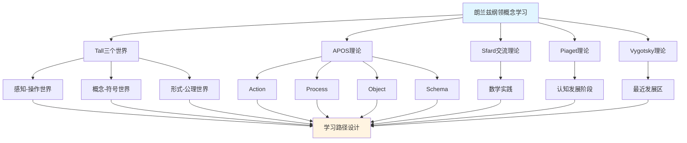

# 朗兰兹纲领概念的多理论分析示例 / Multi-Theory Analysis Example: Langlands Program Concept

**主题编号 / Topic ID**: C.CORE.033.MULTI
**创建日期 / Created**: 2025年1月 / January 2025
**最后更新 / Last Updated**: 2025年1月 / January 2025
**关联概念 / Related Concepts**: [朗兰兹纲领 / Langlands Program](./33-朗兰兹纲领.md) | [朗兰兹纲领-三视角版 / Langlands Program-Three Perspectives](./33-朗兰兹纲领-三视角版.md)

---

## 📋 概述 / Overview

本文档为"朗兰兹纲领"概念提供多理论分析示例，展示如何运用国际主流数学认知理论来分析交叉领域核心概念。

This document provides a multi-theory analysis example for the "Langlands Program" concept, demonstrating how to apply international mainstream mathematical cognitive theories to analyze core concepts in cross-disciplinary fields.

**分析目标 / Analysis Objectives**：

- 展示朗兰兹纲领概念的多理论分析方法 / Demonstrate multi-theory analysis methods for Langlands Program concepts
- 为其他交叉领域概念提供分析参考 / Provide analysis reference for other cross-disciplinary concepts
- 建立理论整合的应用示例 / Establish application examples of theoretical integration
- 强调朗兰兹纲领与数论、代数几何、表示论、L函数的关系 / Emphasize the relationship between Langlands Program, number theory, algebraic geometry, representation theory, and L-functions

---

## 📑 目录 / Table of Contents

- [朗兰兹纲领概念的多理论分析示例 / Multi-Theory Analysis Example: Langlands Program Concept](#朗兰兹纲领概念的多理论分析示例--multi-theory-analysis-example-langlands-program-concept)
  - [📋 概述 / Overview](#-概述--overview)
  - [📑 目录 / Table of Contents](#-目录--table-of-contents)
  - [🎯 一、Tall三个世界理论分析 / Tall's Three Worlds Theory Analysis (编号: C.CORE.033.MULTI.01)](#-一tall三个世界理论分析--talls-three-worlds-theory-analysis-编号-ccore033multi01)
    - [1.1 感知-操作世界（Embodied World）](#11-感知-操作世界embodied-world)
    - [1.2 概念-符号世界（Symbolic World）](#12-概念-符号世界symbolic-world)
    - [1.3 形式-公理世界（Formal World）](#13-形式-公理世界formal-world)
  - [🔬 二、Dubinsky APOS理论分析 (编号: C.CORE.033.MULTI.02)](#-二dubinsky-apos理论分析-编号-ccore033multi02)
    - [2.1 Action（动作）](#21-action动作)
    - [2.2 Process（过程）](#22-process过程)
    - [2.3 Object（对象）](#23-object对象)
    - [2.4 Schema（图式）](#24-schema图式)
  - [💬 三、Sfard交流理论分析 / Sfard's Commognitive Theory Analysis (编号: C.CORE.033.MULTI.03)](#-三sfard交流理论分析--sfards-commognitive-theory-analysis-编号-ccore033multi03)
    - [3.1 朗兰兹纲领作为交流工具 / Langlands Program as a Communication Tool](#31-朗兰兹纲领作为交流工具--langlands-program-as-a-communication-tool)
    - [3.2 朗兰兹纲领学习的实践参与 / Practice Participation in Langlands Program Learning](#32-朗兰兹纲领学习的实践参与--practice-participation-in-langlands-program-learning)
  - [🧠 四、Piaget认知发展理论分析 / Piaget's Cognitive Development Theory Analysis (编号: C.CORE.033.MULTI.04)](#-四piaget认知发展理论分析--piagets-cognitive-development-theory-analysis-编号-ccore033multi04)
    - [4.1 具体运算阶段（7-12岁）/ Concrete Operational Stage (7-12 years)](#41-具体运算阶段7-12岁-concrete-operational-stage-7-12-years)
    - [4.2 形式运算阶段（12+岁）/ Formal Operational Stage (12+ years)](#42-形式运算阶段12岁-formal-operational-stage-12-years)
  - [🌍 五、Vygotsky社会文化理论分析 / Vygotsky's Sociocultural Theory Analysis (编号: C.CORE.033.MULTI.05)](#-五vygotsky社会文化理论分析--vygotskys-sociocultural-theory-analysis-编号-ccore033multi05)
    - [5.1 最近发展区（ZPD）/ Zone of Proximal Development (ZPD)](#51-最近发展区zpd-zone-of-proximal-development-zpd)
    - [5.2 社会文化工具 / Sociocultural Tools](#52-社会文化工具--sociocultural-tools)
  - [🔄 六、多理论整合分析 / Multi-Theory Integration Analysis (编号: C.CORE.033.MULTI.06)](#-六多理论整合分析--multi-theory-integration-analysis-编号-ccore033multi06)
    - [6.1 理论共同点 / Theoretical Commonalities](#61-理论共同点--theoretical-commonalities)
    - [6.2 理论互补性 / Theoretical Complementarity](#62-理论互补性--theoretical-complementarity)
    - [6.3 整合应用框架](#63-整合应用框架)
  - [📊 七、朗兰兹纲领概念的多理论学习路径 / Multi-Theory Learning Path for Langlands Program Concept (编号: C.CORE.033.MULTI.07)](#-七朗兰兹纲领概念的多理论学习路径--multi-theory-learning-path-for-langlands-program-concept-编号-ccore033multi07)
    - [7.1 入门阶段（Tall感知-操作世界 + APOS Action）/ Entry Stage (Tall Embodied World + APOS Action)](#71-入门阶段tall感知-操作世界--apos-action-entry-stage-tall-embodied-world--apos-action)
    - [7.2 中级阶段（Tall概念-符号世界 + APOS Process/Object）/ Intermediate Stage (Tall Symbolic World + APOS Process/Object)](#72-中级阶段tall概念-符号世界--apos-processobject-intermediate-stage-tall-symbolic-world--apos-processobject)
    - [7.3 高级阶段（Tall形式-公理世界 + APOS Schema + Sfard实践）/ Advanced Stage (Tall Formal World + APOS Schema + Sfard Practice)](#73-高级阶段tall形式-公理世界--apos-schema--sfard实践-advanced-stage-tall-formal-world--apos-schema--sfard-practice)
  - [🎓 八、教学建议 / Teaching Suggestions (编号: C.CORE.033.MULTI.08)](#-八教学建议--teaching-suggestions-编号-ccore033multi08)
    - [8.1 基于多理论的教学设计 / Multi-Theory Based Teaching Design](#81-基于多理论的教学设计--multi-theory-based-teaching-design)
    - [8.2 具体教学策略 / Specific Teaching Strategies](#82-具体教学策略--specific-teaching-strategies)
  - [🔗 九、关联文档 / Related Documents (编号: C.CORE.033.MULTI.09)](#-九关联文档--related-documents-编号-ccore033multi09)
    - [9.1 核心概念文档 / Core Concept Documents](#91-核心概念文档--core-concept-documents)
    - [9.2 理论框架文档 / Theoretical Framework Documents](#92-理论框架文档--theoretical-framework-documents)
  - [✅ 十、总结 / Summary (编号: C.CORE.033.MULTI.10)](#-十总结--summary-编号-ccore033multi10)
    - [10.1 多理论分析的价值 / Value of Multi-Theory Analysis](#101-多理论分析的价值--value-of-multi-theory-analysis)
    - [10.2 应用推广 / Application and Extension](#102-应用推广--application-and-extension)

---

## 🎯 一、Tall三个世界理论分析 / Tall's Three Worlds Theory Analysis (编号: C.CORE.033.MULTI.01)

### 1.1 感知-操作世界（Embodied World）

**朗兰兹纲领在感知-操作世界中的理解 / Understanding Langlands Program in the Embodied World**：

- **具体经验 / Concrete Experience**：
  - 通过"对应关系"的日常经验理解朗兰兹纲领：不同数学对象之间的对应 / Understanding Langlands Program through daily experience of "correspondences": correspondences between different mathematical objects
  - 例如：数论中的Galois表示与调和分析中的自守形式之间的对应 / Examples: correspondence between Galois representations in number theory and automorphic forms in harmonic analysis
  - 通过"统一理论"理解朗兰兹纲领：连接不同数学领域的桥梁 / Understanding Langlands Program through "unifying theory": bridges connecting different mathematical fields
  - 例如：L函数连接数论、代数几何、表示论 / Examples: L-functions connecting number theory, algebraic geometry, and representation theory

- **身体动作 / Bodily Actions**：
  - 通过"建立对应"的动作理解朗兰兹纲领 / Understanding Langlands Program through the action of "establishing correspondences"
  - 通过"研究L函数"理解朗兰兹纲领 / Understanding Langlands Program through "studying L-functions"
  - 通过操作数学对象理解朗兰兹纲领的性质 / Understanding properties of Langlands Program through manipulating mathematical objects

- **直观理解 / Intuitive Understanding**：
  - 朗兰兹纲领是"连接数论和调和分析的桥梁" / Langlands Program is "a bridge connecting number theory and harmonic analysis"
  - 朗兰兹纲领是"统一不同数学领域的理论框架" / Langlands Program is "a theoretical framework unifying different mathematical fields"
  - 朗兰兹纲领是现代数学的前沿 / Langlands Program is the frontier of modern mathematics

**教学建议 / Teaching Suggestions**：

- 使用具体例子（Galois表示、自守形式、L函数） / Use concrete examples (Galois representations, automorphic forms, L-functions)
- 通过类比活动理解朗兰兹纲领 / Understand Langlands Program through analogy activities
- 使用图形可视化朗兰兹对应关系 / Use graphics to visualize Langlands correspondences

### 1.2 概念-符号世界（Symbolic World）

**朗兰兹纲领在概念-符号世界的理解 / Understanding Langlands Program in the Symbolic World**：

- **符号表示 / Symbolic Representation**：
  - 使用朗兰兹对应符号：$\rho: G_K \to GL_n(\overline{\mathbb{Q}}_\ell)$ / Using Langlands correspondence notation: $\rho: G_K \to GL_n(\overline{\mathbb{Q}}_\ell)$
  - 使用L函数符号：$L(s, \pi)$、$L(s, \rho)$ / Using L-function notation: $L(s, \pi)$, $L(s, \rho)$
  - 使用自守表示符号：$\pi$、$\Pi$ / Using automorphic representation notation: $\pi$, $\Pi$

- **概念理解 / Conceptual Understanding**：
  - 朗兰兹纲领建立Galois表示和自守表示之间的对应 / Langlands Program establishes correspondences between Galois representations and automorphic representations
  - 朗兰兹纲领通过L函数统一不同数学领域 / Langlands Program unifies different mathematical fields through L-functions
  - 朗兰兹纲领编码数学统一性（特别是数论、代数几何、表示论） / Langlands Program encodes mathematical unity (especially number theory, algebraic geometry, representation theory)

- **抽象操作 / Abstract Operations**：
  - 通过符号操作研究朗兰兹对应 / Studying Langlands correspondences through symbolic operations
  - 通过逻辑推理证明朗兰兹对应性质 / Proving Langlands correspondence properties through logical reasoning
  - 通过交叉领域语言表达数学概念 / Expressing mathematical concepts through cross-disciplinary language

**教学建议 / Teaching Suggestions**：

- 逐步引入朗兰兹纲领符号 / Gradually introduce Langlands Program notation
- 通过符号操作练习朗兰兹对应研究 / Practice studying Langlands correspondences through symbolic operations
- 使用交叉领域语言表达数学概念 / Use cross-disciplinary language to express mathematical concepts

### 1.3 形式-公理世界（Formal World）

**朗兰兹纲领在形式-公理世界的理解 / Understanding Langlands Program in the Formal World**：

- **公理系统 / Axiomatic System**：
  - 朗兰兹纲领的严格定义：Galois表示和自守表示之间的对应，通过L函数连接 / Strict definition of Langlands Program: correspondences between Galois representations and automorphic representations, connected through L-functions
  - 朗兰兹纲领满足函数方程：$L(s, \pi) = \epsilon(s, \pi) L(1-s, \tilde{\pi})$ / Langlands Program satisfies functional equations: $L(s, \pi) = \epsilon(s, \pi) L(1-s, \tilde{\pi})$
  - 通过公理严格定义朗兰兹纲领 / Strictly defining Langlands Program through axioms

- **形式化定义 / Formal Definition**：
  - 朗兰兹纲领的形式化定义：Galois群表示、自守表示、L函数对应 / Formal definition of Langlands Program: Galois group representations, automorphic representations, L-function correspondences
  - 朗兰兹对应的形式化定义 / Formal definition of Langlands correspondences
  - 朗兰兹纲领性质的严格证明 / Strict proof of Langlands Program properties

- **逻辑推理 / Logical Reasoning**：
  - 通过逻辑推理证明朗兰兹对应性质（如函数方程、局部-整体原理） / Proving Langlands correspondence properties (such as functional equations, local-global principles) through logical reasoning
  - 通过形式化方法研究交叉领域理论 / Studying cross-disciplinary theory through formal methods
  - 通过公理系统建立交叉领域基础 / Establishing cross-disciplinary foundations through axiom systems

**教学建议 / Teaching Suggestions**：

- 介绍朗兰兹纲领的严格定义 / Introduce strict definition of Langlands Program
- 通过形式化证明理解朗兰兹对应性质 / Understand Langlands correspondence properties through formal proofs
- 研究朗兰兹纲领在交叉领域中的作用 / Study the role of Langlands Program in cross-disciplinary fields

---

## 🔬 二、Dubinsky APOS理论分析 (编号: C.CORE.033.MULTI.02)

### 2.1 Action（动作）

**朗兰兹纲领的Action阶段 / Action Stage of Langlands Program**：

- **具体操作 / Concrete Operations**：
  - 研究朗兰兹对应：给定Galois表示，寻找对应的自守表示 / Studying Langlands correspondences: given a Galois representation, find the corresponding automorphic representation
  - 计算L函数：给定表示，计算其L函数 / Computing L-functions: given a representation, compute its L-function
  - 验证朗兰兹对应：检查Galois表示和自守表示是否对应 / Verifying Langlands correspondences: check if Galois representation and automorphic representation correspond

- **操作特点 / Operation Characteristics**：
  - 需要外部指导（教师、教材） / Requires external guidance (teacher, textbook)
  - 操作是具体的、机械的 / Operations are concrete and mechanical
  - 需要逐步执行 / Requires step-by-step execution

- **学习活动 / Learning Activities**：
  - 练习研究朗兰兹对应 / Practice studying Langlands correspondences
  - 练习计算L函数 / Practice computing L-functions
  - 练习验证朗兰兹对应 / Practice verifying Langlands correspondences

**教学建议 / Teaching Suggestions**：

- 提供大量练习机会 / Provide ample practice opportunities
- 给予及时反馈 / Give timely feedback
- 逐步增加操作复杂度 / Gradually increase operation complexity

### 2.2 Process（过程）

**朗兰兹纲领的Process阶段 / Process Stage of Langlands Program**：

- **内化过程 / Internalization Process**：
  - 将朗兰兹对应研究内化为心理过程 / Internalizing Langlands correspondence research as a mental process
  - 理解L函数统一的内在逻辑 / Understanding the internal logic of L-function unification
  - 能够独立完成朗兰兹纲领操作 / Being able to perform Langlands Program operations independently

- **过程理解 / Process Understanding**：
  - 理解"朗兰兹纲领"是"连接数论和调和分析的桥梁" / Understanding that "Langlands Program" is "a bridge connecting number theory and harmonic analysis"
  - 理解"朗兰兹对应"是"建立Galois表示和自守表示之间对应关系的过程" / Understanding that "Langlands correspondence" is "the process of establishing correspondences between Galois representations and automorphic representations"
  - 理解"L函数"是"统一不同数学领域的工具" / Understanding that "L-functions" are "tools for unifying different mathematical fields"

- **灵活应用 / Flexible Application**：
  - 能够灵活应用朗兰兹纲领概念 / Being able to flexibly apply Langlands Program concepts
  - 能够处理复杂的交叉领域问题 / Being able to handle complex cross-disciplinary problems
  - 能够理解朗兰兹纲领的各种性质 / Being able to understand various properties of Langlands Program

**教学建议 / Teaching Suggestions**：

- 引导学生内化操作过程 / Guide students to internalize operation processes
- 通过变式练习加深理解 / Deepen understanding through variant exercises
- 鼓励学生独立思考和解决问题 / Encourage students to think independently and solve problems

### 2.3 Object（对象）

**朗兰兹纲领的Object阶段 / Object Stage of Langlands Program**：

- **对象化理解 / Objectification Understanding**：
  - 将朗兰兹纲领视为独立的对象 / Viewing Langlands Program as an independent object
  - 理解朗兰兹纲领作为数学对象的结构 / Understanding the structure of Langlands Program as a mathematical object
  - 能够对朗兰兹纲领进行运算和操作 / Being able to perform operations on Langlands Program

- **对象操作 / Object Operations**：
  - 能够比较不同的朗兰兹对应 / Being able to compare different Langlands correspondences
  - 能够研究L函数的性质 / Being able to study properties of L-functions
  - 能够研究朗兰兹纲领的性质 / Being able to study properties of Langlands Program

- **概念整合 / Conceptual Integration**：
  - 理解朗兰兹纲领与数论、代数几何、表示论、L函数的关系 / Understanding the relationship between Langlands Program, number theory, algebraic geometry, representation theory, and L-functions
  - 理解朗兰兹纲领在交叉领域中的作用 / Understanding the role of Langlands Program in cross-disciplinary fields
  - 理解朗兰兹纲领在数学中的作用 / Understanding the role of Langlands Program in mathematics

**教学建议 / Teaching Suggestions**：

- 引导学生将朗兰兹纲领对象化 / Guide students to objectify Langlands Program
- 通过对象操作加深理解 / Deepen understanding through object operations
- 整合朗兰兹纲领与其他概念 / Integrate Langlands Program with other concepts

### 2.4 Schema（图式）

**朗兰兹纲领的Schema阶段 / Schema Stage of Langlands Program**：

- **图式构建 / Schema Construction**：
  - 构建完整的朗兰兹纲领图式 / Constructing a complete Langlands Program schema
  - 整合朗兰兹纲领的各种理解 / Integrating various understandings of Langlands Program
  - 建立朗兰兹纲领与其他概念的联系 / Establishing connections between Langlands Program and other concepts

- **图式应用 / Schema Application**：
  - 能够灵活应用朗兰兹纲领图式 / Being able to flexibly apply Langlands Program schemas
  - 能够解决复杂的交叉领域问题 / Being able to solve complex cross-disciplinary problems
  - 能够研究交叉领域理论 / Being able to study cross-disciplinary theory

- **图式发展 / Schema Development**：
  - 不断发展朗兰兹纲领图式 / Continuously developing Langlands Program schemas
  - 探索朗兰兹纲领的新应用（算术几何、物理） / Exploring new applications of Langlands Program (arithmetic geometry, physics)
  - 研究交叉领域理论的发展 / Studying the development of cross-disciplinary theory

**教学建议 / Teaching Suggestions**：

- 帮助学生构建朗兰兹纲领图式 / Help students construct Langlands Program schemas
- 通过应用发展图式 / Develop schemas through application
- 鼓励学生探索交叉领域理论 / Encourage students to explore cross-disciplinary theory

---

## 💬 三、Sfard交流理论分析 / Sfard's Commognitive Theory Analysis (编号: C.CORE.033.MULTI.03)

### 3.1 朗兰兹纲领作为交流工具 / Langlands Program as a Communication Tool

**朗兰兹纲领的交流功能 / Communicative Function of Langlands Program**：

- **数学交流 / Mathematical Communication**：
  - 朗兰兹纲领用于表达"数学统一性"：$\rho \leftrightarrow \pi$ / Langlands Program is used to express "mathematical unity": $\rho \leftrightarrow \pi$
  - 朗兰兹纲领用于描述"对应关系"：Galois表示与自守形式的对应 / Langlands Program is used to describe "correspondences": correspondences between Galois representations and automorphic forms
  - 朗兰兹纲领用于表达数学关系：函数方程、局部-整体原理 / Langlands Program is used to express mathematical relationships: functional equations, local-global principles

- **概念表达 / Conceptual Expression**：
  - 通过朗兰兹纲领表达"交叉领域"的概念 / Expressing the concept of "cross-disciplinary fields" through Langlands Program
  - 通过朗兰兹纲领符号表达"数学统一性"的概念 / Expressing the concept of "mathematical unity" through Langlands Program notation
  - 通过朗兰兹纲领表达"现代数学前沿"的概念 / Expressing the concept of "frontier of modern mathematics" through Langlands Program

- **问题解决 / Problem Solving**：
  - 使用朗兰兹纲领语言表达问题 / Using Langlands Program language to express problems
  - 使用朗兰兹纲领方法解决问题（数论、代数几何、表示论） / Using Langlands Program methods to solve problems (number theory, algebraic geometry, representation theory)
  - 使用交叉领域方法证明定理 / Using cross-disciplinary methods to prove theorems

### 3.2 朗兰兹纲领学习的实践参与 / Practice Participation in Langlands Program Learning

**通过参与数学实践学习朗兰兹纲领 / Learning Langlands Program through Participation in Mathematical Practice**：

- **实践场景 / Practice Scenarios**：
  - 通过数论问题学习朗兰兹纲领 / Learning Langlands Program through number theory problems
  - 通过代数几何活动学习朗兰兹纲领 / Learning Langlands Program through algebraic geometry activities
  - 通过表示论研究学习朗兰兹纲领 / Learning Langlands Program through representation theory research
  - 通过交叉领域研究学习朗兰兹纲领理论 / Learning Langlands Program theory through cross-disciplinary research

- **实践方式 / Practice Methods**：
  - 参与数学讨论，使用朗兰兹纲领语言 / Participating in mathematical discussions, using Langlands Program language
  - 解决数学问题，应用朗兰兹纲领方法 / Solving mathematical problems, applying Langlands Program methods
  - 研究数学理论，理解朗兰兹纲领作用 / Studying mathematical theory, understanding the role of Langlands Program

- **学习效果 / Learning Outcomes**：
  - 通过实践理解朗兰兹纲领概念 / Understanding Langlands Program concepts through practice
  - 通过应用掌握朗兰兹纲领方法 / Mastering Langlands Program methods through application
  - 通过参与形成数学思维 / Forming mathematical thinking through participation

**教学建议 / Teaching Suggestions**：

- 设计数学实践活动 / Design mathematical practice activities
- 鼓励学生参与数学讨论 / Encourage students to participate in mathematical discussions
- 提供实际问题解决机会 / Provide opportunities for solving real-world problems

---

## 🧠 四、Piaget认知发展理论分析 / Piaget's Cognitive Development Theory Analysis (编号: C.CORE.033.MULTI.04)

### 4.1 具体运算阶段（7-12岁）/ Concrete Operational Stage (7-12 years)

**朗兰兹纲领在具体运算阶段的理解 / Understanding Langlands Program in the Concrete Operational Stage**：

- **具体对象 / Concrete Objects**：
  - 通过具体朗兰兹对应理解朗兰兹纲领 / Understanding Langlands Program through concrete Langlands correspondences
  - 例如：简单的Galois表示、自守形式、L函数 / Examples: simple Galois representations, automorphic forms, L-functions
  - 需要具体例子支持理解 / Requires concrete examples to support understanding

- **逻辑思维 / Logical Thinking**：
  - 能够理解朗兰兹纲领的基本概念 / Being able to understand basic Langlands Program concepts
  - 能够进行简单的朗兰兹对应研究 / Being able to perform simple Langlands correspondence research
  - 但需要具体对象支持 / But requires concrete object support

- **教学建议 / Teaching Suggestions**：
  - 使用具体朗兰兹对应和图形 / Use concrete Langlands correspondences graphics
  - 通过游戏和活动学习 / Learn through games and activities
  - 逐步引入抽象概念 / Gradually introduce abstract concepts

### 4.2 形式运算阶段（12+岁）/ Formal Operational Stage (12+ years)

**朗兰兹纲领在形式运算阶段的理解 / Understanding Langlands Program in the Formal Operational Stage**：

- **抽象思维 / Abstract Thinking**：
  - 能够理解抽象的朗兰兹纲领概念 / Being able to understand abstract Langlands Program concepts
  - 能够进行符号操作 / Being able to perform symbolic operations
  - 能够进行逻辑推理 / Being able to perform logical reasoning

- **形式推理 / Formal Reasoning**：
  - 能够证明朗兰兹对应性质（如函数方程、局部-整体原理） / Being able to prove Langlands correspondence properties (such as functional equations, local-global principles)
  - 能够理解朗兰兹纲领定义 / Being able to understand Langlands Program definition
  - 能够研究交叉领域理论 / Being able to study cross-disciplinary theory

- **教学建议 / Teaching Suggestions**：
  - 引入抽象概念和符号 / Introduce abstract concepts and symbols
  - 进行逻辑推理训练 / Conduct logical reasoning training
  - 研究交叉领域理论 / Study cross-disciplinary theory

---

## 🌍 五、Vygotsky社会文化理论分析 / Vygotsky's Sociocultural Theory Analysis (编号: C.CORE.033.MULTI.05)

### 5.1 最近发展区（ZPD）/ Zone of Proximal Development (ZPD)

**朗兰兹纲领学习的最近发展区 / Zone of Proximal Development in Langlands Program Learning**：

- **独立能力 / Independent Ability**：
  - 能够理解朗兰兹纲领的基本概念 / Being able to understand basic Langlands Program concepts
  - 能够进行简单的朗兰兹对应研究 / Being able to perform simple Langlands correspondence research
  - 能够理解朗兰兹纲领的基本性质 / Being able to understand basic Langlands Program properties

- **潜在能力 / Potential Ability**：
  - 能够理解朗兰兹纲领定义 / Being able to understand Langlands Program definition
  - 能够证明朗兰兹对应性质（如函数方程、局部-整体原理） / Being able to prove Langlands correspondence properties (such as functional equations, local-global principles)
  - 能够研究交叉领域理论 / Being able to study cross-disciplinary theory

### 5.2 社会文化工具 / Sociocultural Tools

**朗兰兹纲领作为社会文化工具 / Langlands Program as Sociocultural Tools**：

- **数学工具 / Mathematical Tools**：
  - 朗兰兹纲领是数学研究的重要工具 / Langlands Program is an important tool for mathematical research
  - 朗兰兹纲领用于解决实际问题（数论、代数几何、表示论） / Langlands Program is used to solve real-world problems (number theory, algebraic geometry, representation theory)
  - 朗兰兹纲领用于研究数学理论 / Langlands Program is used to study mathematical theory

- **文化意义 / Cultural Significance**：
  - 朗兰兹纲领是数学文化的重要组成部分 / Langlands Program is an important part of mathematical culture
  - 朗兰兹纲领反映了数学思维的发展 / Langlands Program reflects the development of mathematical thinking
  - 朗兰兹纲领体现了数学的美感 / Langlands Program embodies the beauty of mathematics

- **教学建议 / Teaching Suggestions**：
  - 介绍朗兰兹纲领的历史和文化意义 / Introduce the history and cultural significance of Langlands Program
  - 展示朗兰兹纲领在数学中的作用 / Demonstrate the role of Langlands Program in mathematics
  - 培养学生对数学文化的理解 / Cultivate students' understanding of mathematical culture

- 提供适当的学习支持 / Provide appropriate learning support
- 设计最近发展区的学习活动 / Design learning activities in the zone of proximal development
- 鼓励学生参与数学实践和交流 / Encourage students to participate in mathematical practice and communication

---

## 🔄 六、多理论整合分析 / Multi-Theory Integration Analysis (编号: C.CORE.033.MULTI.06)

### 6.1 理论共同点 / Theoretical Commonalities

**各理论在朗兰兹纲领概念分析中的共同点 / Commonalities of Theories in Langlands Program Concept Analysis**：

1. **多层次理解 / Multi-Level Understanding**：
   - 都强调从具体到抽象的发展 / All emphasize development from concrete to abstract
   - Tall的三个世界、APOS的四个阶段、Piaget的发展阶段都体现这一点 / Tall's three worlds, APOS's four stages, and Piaget's developmental stages all reflect this

2. **实践重要性 / Importance of Practice**：
   - 都强调实践在学习中的作用 / All emphasize the role of practice in learning
   - Sfard的交流理论、Vygotsky的社会文化理论都强调这一点 / Sfard's communication theory and Vygotsky's sociocultural theory both emphasize this

3. **认知发展 / Cognitive Development**：
   - 都关注认知发展的过程 / All focus on the process of cognitive development
   - 各理论都描述了从简单到复杂的发展 / Each theory describes development from simple to complex

### 6.2 理论互补性 / Theoretical Complementarity

**各理论在朗兰兹纲领概念分析中的互补性 / Complementarity of Theories in Langlands Program Concept Analysis**：

1. **Tall三个世界 / Tall's Three Worlds**：
   - 适用于理解朗兰兹纲领概念的不同层次 / Applicable to understanding different levels of Langlands Program concepts
   - 从感知操作到形式公理的发展 / Development from embodied operations to formal axioms

2. **APOS理论 / APOS Theory**：
   - 适用于分析朗兰兹纲领概念的学习过程 / Applicable to analyzing the learning process of Langlands Program concepts
   - 从动作到图式的发展 / Development from action to schema

3. **Sfard交流理论 / Sfard's Communication Theory**：
   - 适用于设计朗兰兹纲领概念的实践活动 / Applicable to designing practice activities for Langlands Program concepts
   - 通过数学实践学习朗兰兹纲领 / Learning Langlands Program through mathematical practice

4. **Piaget理论 / Piaget's Theory**：
   - 适用于理解朗兰兹纲领概念的认知发展阶段 / Applicable to understanding cognitive development stages of Langlands Program concepts
   - 从具体运算到形式运算的发展 / Development from concrete operations to formal operations

5. **Vygotsky理论 / Vygotsky's Theory**：
   - 适用于设计朗兰兹纲领概念的学习支持 / Applicable to designing learning support for Langlands Program concepts
   - 通过最近发展区促进学习 / Promoting learning through the zone of proximal development

### 6.3 整合应用框架

**多理论整合应用**：

---

## 📊 七、朗兰兹纲领概念的多理论学习路径 / Multi-Theory Learning Path for Langlands Program Concept (编号: C.CORE.033.MULTI.07)

### 7.1 入门阶段（Tall感知-操作世界 + APOS Action）/ Entry Stage (Tall Embodied World + APOS Action)

**学习目标 / Learning Objectives**：

- 通过具体朗兰兹对应理解朗兰兹纲领概念 / Understanding Langlands Program concepts through concrete Langlands correspondences
- 掌握基本朗兰兹纲领操作 / Mastering basic Langlands Program operations

**学习活动 / Learning Activities**：

- 使用具体例子（简单的Galois表示、自守形式、L函数）进行朗兰兹纲领操作 / Using concrete examples (simple Galois representations, automorphic forms, L-functions) for Langlands Program operations
- 练习研究朗兰兹对应 / Practicing studying Langlands correspondences
- 练习计算L函数 / Practicing computing L-functions
- 练习基本朗兰兹纲领运算 / Practicing basic Langlands Program operations

**评估标准 / Assessment Criteria**：

- 能够独立完成基本朗兰兹纲领操作 / Being able to independently complete basic Langlands Program operations
- 能够理解朗兰兹纲领的基本概念 / Being able to understand basic Langlands Program concepts

### 7.2 中级阶段（Tall概念-符号世界 + APOS Process/Object）/ Intermediate Stage (Tall Symbolic World + APOS Process/Object)

**学习目标 / Learning Objectives**：

- 理解朗兰兹纲领的符号表示 / Understanding symbolic representation of Langlands Program
- 掌握L函数统一的内在逻辑 / Mastering the internal logic of L-function unification
- 将朗兰兹纲领视为对象 / Viewing Langlands Program as an object

**学习活动 / Learning Activities**：

- 学习朗兰兹纲领符号和L函数符号 / Learning Langlands Program notation and L-function notation
- 通过符号操作研究朗兰兹对应 / Studying Langlands correspondences through symbolic operations
- 理解朗兰兹纲领的性质 / Understanding properties of Langlands Program
- 研究L函数的性质 / Studying properties of L-functions

**评估标准 / Assessment Criteria**：

- 能够灵活应用朗兰兹纲领符号 / Being able to flexibly apply Langlands Program notation
- 能够理解L函数统一的内在逻辑 / Being able to understand the internal logic of L-function unification
- 能够将朗兰兹纲领视为对象进行操作 / Being able to operate on Langlands Program as an object

### 7.3 高级阶段（Tall形式-公理世界 + APOS Schema + Sfard实践）/ Advanced Stage (Tall Formal World + APOS Schema + Sfard Practice)

**学习目标 / Learning Objectives**：

- 理解朗兰兹纲领的严格定义 / Understanding strict definition of Langlands Program
- 形成完整的朗兰兹纲领概念图式 / Forming a complete Langlands Program concept schema
- 通过数学实践应用朗兰兹纲领 / Applying Langlands Program through mathematical practice

**学习活动 / Learning Activities**：

- 学习朗兰兹纲领的严格定义 / Learning strict definition of Langlands Program
- 通过形式化证明理解朗兰兹对应性质（如函数方程、局部-整体原理） / Understanding Langlands correspondence properties (such as functional equations, local-global principles) through formal proofs
- 研究朗兰兹纲领在交叉领域中的作用 / Studying the role of Langlands Program in cross-disciplinary fields
- 参与数学实践，应用朗兰兹纲领方法（数论、代数几何、表示论） / Participating in mathematical practice, applying Langlands Program methods (number theory, algebraic geometry, representation theory)

**评估标准 / Assessment Criteria**：

- 能够理解朗兰兹纲领的严格定义 / Being able to understand strict definition of Langlands Program
- 能够形成完整的朗兰兹纲领概念图式 / Being able to form a complete Langlands Program concept schema
- 能够通过数学实践应用朗兰兹纲领 / Being able to apply Langlands Program through mathematical practice

---

## 🎓 八、教学建议 / Teaching Suggestions (编号: C.CORE.033.MULTI.08)

### 8.1 基于多理论的教学设计 / Multi-Theory Based Teaching Design

**教学设计原则 / Teaching Design Principles**：

1. **多层次设计 / Multi-Level Design**：
   - 从感知操作到形式公理 / From embodied operations to formal axioms
   - 从动作到图式 / From action to schema
   - 从具体运算到形式运算 / From concrete operations to formal operations

2. **实践导向 / Practice-Oriented**：
   - 设计数学实践活动 / Design mathematical practice activities
   - 鼓励学生参与数学交流 / Encourage students to participate in mathematical communication
   - 提供实际问题解决机会 / Provide opportunities for solving real-world problems

3. **学习支持 / Learning Support**：
   - 提供适当的学习支持 / Provide appropriate learning support
   - 设计最近发展区的学习活动 / Design learning activities in the zone of proximal development
   - 给予及时反馈 / Give timely feedback

### 8.2 具体教学策略 / Specific Teaching Strategies

**入门阶段策略 / Entry Stage Strategies**：

- 使用具体物体和图形 / Use concrete objects and graphics
- 通过游戏和活动学习 / Learn through games and activities
- 提供大量练习机会 / Provide ample practice opportunities

**中级阶段策略 / Intermediate Stage Strategies**：

- 逐步引入抽象概念和符号 / Gradually introduce abstract concepts and symbols
- 通过变式练习加深理解 / Deepen understanding through variant exercises
- 鼓励学生独立思考和解决问题 / Encourage students to think independently and solve problems

**高级阶段策略 / Advanced Stage Strategies**：

- 引入严格定义和形式化方法 / Introduce strict definitions and formal methods
- 研究交叉领域理论 / Study cross-disciplinary theory
- 参与数学实践和研究（数论、代数几何、表示论） / Participate in mathematical practice and research (number theory, algebraic geometry, representation theory)

---

## 🔗 九、关联文档 / Related Documents (编号: C.CORE.033.MULTI.09)

### 9.1 核心概念文档 / Core Concept Documents

- [朗兰兹纲领](./33-朗兰兹纲领.md) / [Langlands Program](./33-朗兰兹纲领.md)
- [朗兰兹纲领-三视角版](./33-朗兰兹纲领-三视角版.md) / [Langlands Program-Three Perspectives Version](./33-朗兰兹纲领-三视角版.md)
- [L函数-多理论分析示例](./28-L函数-多理论分析示例-2025年1月.md) - L函数多理论分析示例 / [L-Function-Multi-Theory Analysis Example](./28-L函数-多理论分析示例-2025年1月.md) - Multi-theory analysis example for L-function
- [表示-多理论分析示例](./32-表示-多理论分析示例-2025年1月.md) - 表示多理论分析示例 / [Representation-Multi-Theory Analysis Example](./32-表示-多理论分析示例-2025年1月.md) - Multi-theory analysis example for representation

### 9.2 理论框架文档 / Theoretical Framework Documents

- [国际主流数学认知理论整合框架](../00-国际主流数学认知理论整合框架-2025年1月.md) / [International Mainstream Mathematical Cognitive Theories Integration Framework](../00-国际主流数学认知理论整合框架-2025年1月.md)
- [概念体系深度改进计划](../00-概念体系深度改进计划-2025年1月.md) / [Concept System Deep Improvement Plan](../00-概念体系深度改进计划-2025年1月.md)

---

## ✅ 十、总结 / Summary (编号: C.CORE.033.MULTI.10)

### 10.1 多理论分析的价值 / Value of Multi-Theory Analysis

**多理论分析的优势 / Advantages of Multi-Theory Analysis**：

1. **全面理解 / Comprehensive Understanding**：
   - 从多个角度理解朗兰兹纲领概念 / Understanding Langlands Program concepts from multiple perspectives
   - 理解朗兰兹纲领概念的不同层次 / Understanding different levels of Langlands Program concepts
   - 理解朗兰兹纲领概念的学习过程 / Understanding the learning process of Langlands Program concepts

2. **教学设计 / Teaching Design**：
   - 基于多理论设计教学 / Designing teaching based on multiple theories
   - 提供多层次学习支持 / Providing multi-level learning support
   - 设计实践活动 / Designing practice activities

3. **学习路径 / Learning Path**：
   - 设计基于多理论的学习路径 / Designing learning paths based on multiple theories
   - 支持不同认知发展阶段的学习 / Supporting learning at different cognitive development stages
   - 促进概念理解的发展 / Promoting the development of conceptual understanding

### 10.2 应用推广 / Application and Extension

**为其他32个核心概念建立多理论分析 / Establishing Multi-Theory Analysis for Other 32 Core Concepts**：

- 使用本文档作为模板 / Using this document as a template
- 为每个概念建立多理论分析 / Establishing multi-theory analysis for each concept
- 建立33个核心概念的多理论分析体系 / Establishing a multi-theory analysis system for 33 core concepts

---

**创建日期**: 2025年1月
**最后更新**: 2025年1月
**维护状态**: 持续更新中
**状态**: ✅ 示例完成
