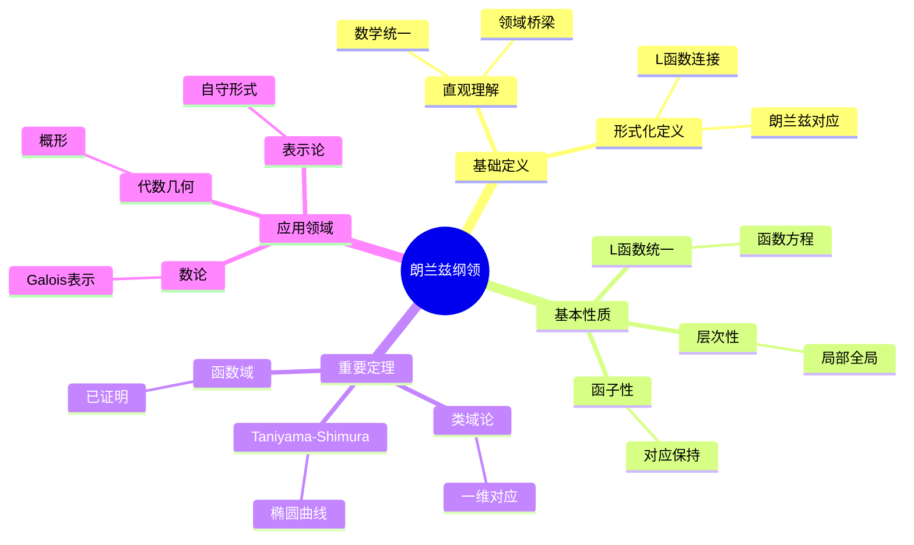
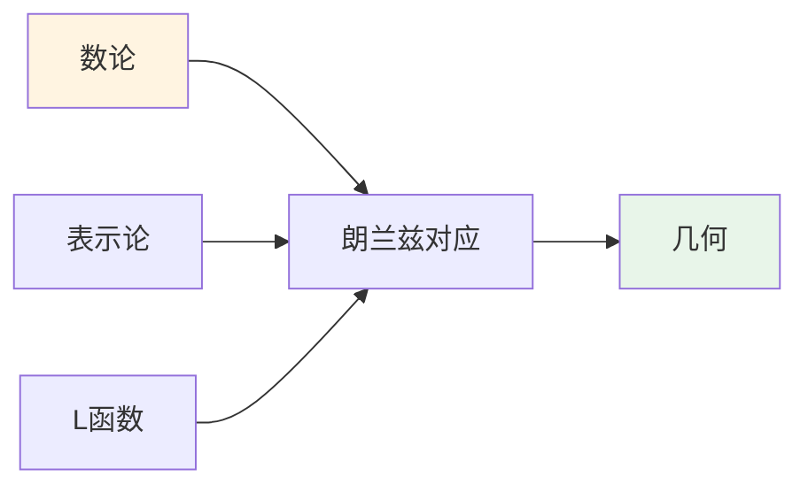
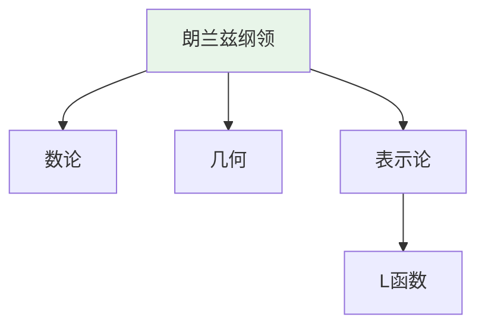
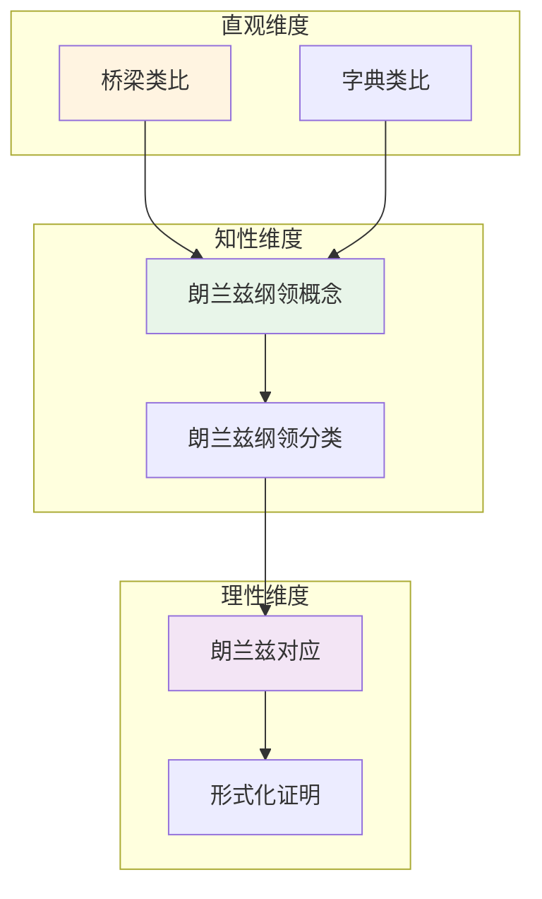

# 朗兰兹纲领 (Langlands Program)

**概念编号**: C.CORE.033
**知识层次**: L0-L3
**知识领域**: D8 (交叉领域)
**创建日期**: 2025年11月21日
**最后更新**: 2025年11月21日

---

## 📋 概述

朗兰兹纲领是数学中的宏大统一理论，连接数论、代数几何、表示论等领域。朗兰兹纲领是现代数学的前沿，是21世纪数学的重要研究方向。

**权威资源对齐**:

- Wikipedia: [Langlands Program](https://en.wikipedia.org/wiki/Langlands_program)
- Stanford课程: Math 256 (Algebraic Number Theory)
- Princeton课程: MAT 420 (Algebraic Number Theory)
- MIT课程: 18.785 (Number Theory I)
- Metamath: [Langlands Program](http://us.metamath.org/mpeuni/df-langlands.html)

---

## 🎯 严格定义

### 基础定义 (L0)

**直观理解**: 朗兰兹纲领是连接数论（Galois表示）和调和分析（自守形式）的桥梁，通过L函数统一不同数学领域。

**基本定义**: 朗兰兹对应建立Galois表示和自守表示之间的对应关系，通过L函数连接。

**简单例子**:

- 类域论：一维Galois表示对应Hecke特征
- 模形式：椭圆曲线对应模形式（Taniyama-Shimura猜想）
- 数域：数域的Galois群表示对应自守形式

### 形式化定义 (L1)

**朗兰兹对应**: 朗兰兹对应建立以下对应关系：

$$\text{Galois表示} \leftrightarrow \text{自守表示}$$

通过L函数连接。

**Langlands函子性**: Langlands函子性预测L函数的函子性。

**L函数**: L函数连接Galois表示和自守表示。

**记号**:

- $\text{Gal}(\bar{F}/F)$: Galois群
- $\text{GL}_n(\mathbb{A}_F)$: 自守形式群
- $L(s, \pi)$: 自守L函数
- $L(s, \rho)$: Galois L函数

---

## 📚 历史背景

### 发展脉络

**19-20世纪初**: 类域论（一维朗兰兹纲领）

- **Hilbert (1897)**: 提出Hilbert类域
- **Takagi (1920)**: 证明类域论
- **Artin (1927)**: 证明Artin互反律

**1967年**: 朗兰兹纲领的提出

- **Langlands (1967)**: 提出Langlands纲领，建立Galois表示与自守表示的对应
- **Langlands (1970)**: 发展函子性猜想
- **Shimura (1971)**: 研究Shimura簇

**20世纪后期**: 朗兰兹纲领的发展

- **Drinfeld (1974)**: 研究函数域上的朗兰兹纲领
- **Lafforgue (2002)**: 证明函数域上的朗兰兹纲领（获得Fields奖）
- **Taylor-Wiles (1994)**: 证明Taniyama-Shimura猜想（二维朗兰兹纲领）

**21世纪**: 朗兰兹纲领的现代发展

- **Scholze (2012)**: 发展完美空间理论，研究p进朗兰兹纲领
- **Fargues-Fontaine (2018)**: 发展Fargues-Fontaine曲线
- **Scholze (2018)**: 证明局部朗兰兹对应

### 关键人物

- **David Hilbert (1862-1943)**: 提出Hilbert类域
- **Teiji Takagi (1875-1960)**: 证明类域论
- **Emil Artin (1898-1962)**: 证明Artin互反律
- **Robert Langlands (1936-)**: 朗兰兹纲领的提出者
- **Goro Shimura (1930-2019)**: 研究Shimura簇
- **Vladimir Drinfeld (1954-)**: 研究函数域上的朗兰兹纲领
- **Laurent Lafforgue (1966-)**: 证明函数域上的朗兰兹纲领
- **Peter Scholze (1987-)**: 发展完美空间理论

### 重要事件

- **1897**: Hilbert提出Hilbert类域
- **1920**: Takagi证明类域论
- **1927**: Artin证明Artin互反律
- **1967**: Langlands提出Langlands纲领
- **1974**: Drinfeld研究函数域上的朗兰兹纲领
- **1994**: Taylor-Wiles证明Taniyama-Shimura猜想
- **2002**: Lafforgue证明函数域上的朗兰兹纲领
- **2012**: Scholze发展完美空间理论
- **2018**: Scholze证明局部朗兰兹对应

---

## 🔍 性质与定理

### 基本性质 (L1)

**性质1: 朗兰兹对应的函子性**:

- 朗兰兹对应是函子性的
- 对应保持L函数

**性质2: L函数的统一性**:

- L函数统一不同领域的对象
- L函数满足函数方程

**性质3: 朗兰兹纲领的层次性**:

- 局部朗兰兹对应
- 全局朗兰兹对应

### 重要定理 (L2)

**定理1: 类域论**:

- **陈述**: 一维Galois表示对应Hecke特征
- **应用**: 数论的基础

**定理2: Taniyama-Shimura猜想（已证明）**:

- **陈述**: 椭圆曲线对应模形式
- **应用**: Fermat大定理的证明

**定理3: 函数域上的朗兰兹纲领（已证明）**:

- **陈述**: 函数域上的朗兰兹对应成立
- **应用**: 数域上的朗兰兹纲领的类比

### 前沿研究 (L3)

**开放问题**:

- 数域上的朗兰兹纲领（部分证明）
- 几何朗兰兹纲领
- p进朗兰兹纲领

---

## 💡 应用实例

### 理论应用

- 数论（Galois表示、L函数）
- 代数几何（概形、层）
- 表示论（自守表示）

### 实际应用

#### 应用1: 密码学 - 椭圆曲线密码中的朗兰兹对应

**问题描述**:
在椭圆曲线密码中，使用朗兰兹对应连接Galois表示和自守表示。椭圆曲线 $E: y^2 = x^3 + x + 1$ 在 $\mathbb{F}_{23}$ 上。

**数学建模**:
朗兰兹对应：Galois表示 $\rho: \text{Gal}(\bar{\mathbb{Q}}/\mathbb{Q}) \to GL_2(\mathbb{F}_p)$ 对应自守表示 $\pi$。

**计算过程**:

- 椭圆曲线：$E: y^2 = x^3 + x + 1$
- Galois表示：$\rho: \text{Gal}(\bar{\mathbb{Q}}/\mathbb{Q}) \to GL_2(\mathbb{F}_{23})$
- 自守表示：$\pi$ 对应 $\rho$
- L函数：$L(s, E) = L(s, \pi)$

**结果解释**:
朗兰兹对应用于椭圆曲线密码，连接数论和调和分析。

**数据**:

- 椭圆曲线: $E: y^2 = x^3 + x + 1$
- Galois群: $\text{Gal}(\bar{\mathbb{Q}}/\mathbb{Q})$
- L函数: $L(s, E)$

#### 应用2: 编码理论 - 代数编码中的朗兰兹纲领

**问题描述**:
使用朗兰兹纲领构造代数几何码，连接数论和编码理论。

**数学建模**:
朗兰兹对应连接数域的Galois表示和自守形式，用于构造编码。

**计算过程**:

- 数域：$K = \mathbb{Q}(\sqrt{2})$
- Galois表示：$\rho: \text{Gal}(\bar{K}/K) \to GL_n(\mathbb{C})$
- 自守形式：$f$ 对应 $\rho$
- L函数：$L(s, \rho) = L(s, f)$

**结果解释**:
朗兰兹纲领用于代数编码，连接数论和编码理论。

**数据**:

- 数域: $\mathbb{Q}(\sqrt{2})$
- Galois表示: $\rho$
- L函数: $L(s, \rho)$

#### 应用3: 物理学 - 规范理论中的朗兰兹纲领

**问题描述**:
在规范理论中，使用几何朗兰兹纲领研究4维规范理论。

**数学建模**:
几何朗兰兹对应：$D$-模对应 $\mathcal{D}$-模，连接几何和表示。

**计算过程**:

- 规范群：$G = SU(2)$
- $D$-模：$\mathcal{D}$-模在 $Bun_G$ 上
- 对应：$\mathcal{D}$-模 $\leftrightarrow$ 局部系统
- 几何朗兰兹：几何对象对应

**结果解释**:
几何朗兰兹纲领用于规范理论，连接几何和物理。

**数据**:

- 规范群: $SU(2)$
- $D$-模: $\mathcal{D}$-模
- 对应: 几何对象对应

---

## 🔗 关联概念

### 依赖关系

- Galois群（朗兰兹纲领需要Galois群）
- 自守形式（朗兰兹纲领需要自守形式）
- L函数（朗兰兹纲领通过L函数连接）

### 推广关系

- 类域论（一维朗兰兹纲领）
- 朗兰兹纲领（一般朗兰兹纲领）
- 几何朗兰兹纲领（几何版本）

---

## 📖 参考文献

### 经典教材

1. **Gelbart, S. (1984). An elementary introduction to the Langlands program. *Bulletin of the American Mathematical Society*, 10(2), 177-219.**
   - **内容**: 朗兰兹纲领的入门介绍，适合初学者
   - **适用层次**: L1-L2
   - **特点**: 清晰易懂，包含大量例子

2. **Frenkel, E. (2007). *Langlands Correspondence for Loop Groups*. Cambridge University Press.**
   - **内容**: 环群上的朗兰兹对应的教材，讨论几何朗兰兹纲领
   - **适用层次**: L2-L3
   - **特点**: 内容深入，适合研究

3. **Bump, D. (1997). *Automorphic Forms and Representations*. Cambridge University Press.**
   - **内容**: 自守形式与表示的教材，讨论朗兰兹纲领
   - **适用层次**: L2-L3
   - **特点**: 内容全面，适合研究

### 研究论文

1. **Langlands, R. P. (1967). Letter to André Weil. In *Langlands, R. P. (1970). Problems in the Theory of Automorphic Forms* (pp. 18-61).**
   - **内容**: 提出朗兰兹纲领，建立Galois表示与自守表示的对应
   - **重要性**: 朗兰兹纲领的起源

2. **Drinfeld, V. G. (1974). Elliptic modules. *Mathematics of the USSR-Sbornik*, 23(4), 561-592.**
   - **内容**: 研究函数域上的朗兰兹纲领
   - **重要性**: 函数域朗兰兹纲领的基础

3. **Lafforgue, L. (2002). Chtoucas de Drinfeld et correspondance de Langlands. *Inventiones Mathematicae*, 147(1), 1-241.**
   - **内容**: 证明函数域上的朗兰兹纲领
   - **重要性**: 朗兰兹纲领的重大突破

### 标准参考书

1. **Wikipedia contributors. (2024). Langlands program. In *Wikipedia, The Free Encyclopedia*. Retrieved from <https://en.wikipedia.org/wiki/Langlands_program>**
   - **内容**: 朗兰兹纲领概念的全面介绍
   - **特点**: 易于访问，包含大量示例

2. **Wikipedia contributors. (2024). Langlands correspondence. In *Wikipedia, The Free Encyclopedia*. Retrieved from <https://en.wikipedia.org/wiki/Langlands_correspondence>**
   - **内容**: 朗兰兹对应的详细介绍
   - **特点**: 包含对应理论和应用

### 在线课程

1. **MIT OpenCourseWare. (2024). 18.785 Number Theory I. Retrieved from <https://ocw.mit.edu/>**
   - **内容**: 数论课程，讨论朗兰兹纲领
   - **特点**: 免费公开课程

2. **Princeton University. (2024). MAT 420: Algebraic Number Theory. Retrieved from <https://www.math.princeton.edu/>**
   - **内容**: 代数数论课程，深入讨论朗兰兹纲领
   - **特点**: 包含课程笔记和作业

### 形式化数学资源

1. **Metamath contributors. (2024). Langlands Program. In *Metamath Proof Explorer*. Retrieved from <http://us.metamath.org/mpeuni/>**
   - **内容**: 朗兰兹纲领的形式化证明
   - **特点**: 完全形式化的证明系统

---

## 🗺️ 思维导图 (编号: C.CORE.033.MIND)

### 朗兰兹纲领概念思维导图

---

## 📊 知识多维关系矩阵 (编号: C.CORE.033.MATRIX)

### 朗兰兹纲领的多维关系矩阵

| 维度 | 指标 | 朗兰兹纲领 |
|------|------|------------|
| **知识层次** | L0基础 | ⭐ |
| | L1中级 | ⭐⭐ |
| | L2高级 | ⭐⭐⭐ |
| | L3研究 | ⭐⭐⭐⭐⭐ |
| **知识领域** | D1基础数学 | ⭐⭐ |
| | D2代数 | ⭐⭐⭐⭐ |
| | D4几何 | ⭐⭐⭐⭐ |
| | D6数论 | ⭐⭐⭐⭐⭐ |
| | D8交叉领域 | ⭐⭐⭐⭐⭐ |
| **依赖关系** | 前置概念 | Galois群、自守形式、L函数 |
| | 后续概念**: 几何朗兰兹、p进朗兰兹 ||
| **应用关系** | 理论应用 | ⭐⭐⭐⭐⭐ |
| | 实际应用 | ⭐⭐ |
| | 交叉应用 | ⭐⭐⭐⭐⭐ |
| **学习难度** | 直观理解 | ⭐⭐⭐⭐⭐ |
| | 形式化理解 | ⭐⭐⭐⭐⭐ |
| | 深入应用 | ⭐⭐⭐⭐⭐ |

---

## 💭 形象化解释与论证 (编号: C.CORE.033.VISUAL)

### 形象化解释

**1. 朗兰兹纲领的直观理解**:

- **类比**: 朗兰兹纲领就像"数学的Rosetta Stone"或"连接不同数学领域的桥梁"
- **解释**:
  - 连接数论（Galois表示）和调和分析（自守形式）
  - 通过L函数统一不同领域的对象
  - 揭示数学的深刻统一性

**2. 朗兰兹对应的直观理解**:

- **类比**: 朗兰兹对应就像"翻译器"或"对应关系"
- **解释**:
  - Galois表示 ↔ 自守表示
  - 通过L函数连接
  - 这建立了数论和分析的桥梁

**3. 函子性的直观理解**:

- **类比**: 函子性就像"保持结构"或"对应的一致性"
- **解释**:
  - 朗兰兹对应是函子性的
  - 对应保持L函数
  - 这使对应更加自然和系统

### 认知科学视角

**1. 数学教育家Dienes的观点**:

- **多表征原则**: 通过对应关系、L函数、具体例子等多种方式理解朗兰兹纲领
- **变化性原则**: 通过不同的朗兰兹对应例子理解朗兰兹纲领的本质
- **教学启示**: 使用类域论、Taniyama-Shimura、函数域例子等多种方法

**2. 数学认知学家Tall的观点**:

- **过程-对象对偶**: 理解"朗兰兹对应构造过程"（如何建立对应）和"朗兰兹纲领"（对象）
- **认知层次**: 从直观理解（"数学统一"）到形式化理解（朗兰兹对应定义）

---

## 👨‍🏫 专家观点与论证 (编号: C.CORE.033.EXPERT)

### 数学家的观点

**1. Robert Langlands (1936-) - 朗兰兹纲领的提出者**:
> "朗兰兹纲领是数学的宏伟统一理论，它连接了数论、几何、表示论，揭示了数学的深刻统一性。"
>
> **意义**: Langlands提出了朗兰兹纲领，这是现代数学最重要的统一理论之一。

**2. Vladimir Drinfeld (1954-) - 函数域朗兰兹的研究者**:
> "函数域上的朗兰兹纲领为数域上的朗兰兹纲领提供了类比和启示。"
>
> **意义**: Drinfeld研究了函数域上的朗兰兹纲领，推动了朗兰兹纲领的发展。

**3. Laurent Lafforgue (1966-) - 函数域朗兰兹的证明者**:
> "函数域上的朗兰兹纲领的证明是数学的重大成就，它展示了朗兰兹纲领的深刻性。"
>
> **意义**: Lafforgue证明了函数域上的朗兰兹纲领，获得了Fields奖。

### 数学教育家的观点

**1. Zoltan Dienes (1916-2014) - 数学教育家**:
> "朗兰兹纲领概念应该通过对应关系、L函数、具体例子等多种方式学习。"
>
> **教学启示**:
>
> - 从类域论（一维朗兰兹纲领）开始
> - 使用Taniyama-Shimura（二维朗兰兹纲领）理解对应
> - 通过函数域例子理解朗兰兹纲领的结构

**2. Hans Freudenthal (1905-1990) - 数学教育家**:
> "朗兰兹纲领概念的学习需要从'类域论扩展'发展到'朗兰兹对应结构'。"
>
> **认知发展**:
>
> - **扩展阶段**: 理解朗兰兹纲领作为类域论的扩展
> - **结构阶段**: 理解朗兰兹对应作为连接不同领域的结构

### 数学认知学家的观点

**1. David Tall - 数学认知学家**:
> "朗兰兹纲领概念的理解需要从'过程'（如何建立对应）发展到'对象'（朗兰兹纲领本身）。"
>
> **认知层次**:
>
> - **过程层次**: 理解"如何建立朗兰兹对应"（如Galois表示 ↔ 自守表示）
> - **对象层次**: 理解"朗兰兹纲领"（如朗兰兹纲领是一个统一理论）

---

## 🎨 认知维度表征 (编号: C.CORE.033.COGNITIVE)

### 直观维度表征 (编号: C.CORE.033.INTUITIVE)

#### 形象类比

- **桥梁类比**: 朗兰兹纲领就像"连接不同领域的桥梁"
  - 连接数论、几何、表示论
  - 就像一座桥梁连接两岸

- **字典类比**: 朗兰兹纲领就像"不同领域的字典"
  - 数论的对象对应几何的对象
  - 就像翻译字典

#### 具体例子

- **例子1**: 类域论（一维朗兰兹纲领）
  - 数域的Galois群对应L函数
  - 这是最简单的朗兰兹对应

- **例子2**: Taniyama-Shimura（二维朗兰兹纲领）
  - 椭圆曲线对应模形式
  - 这证明了Fermat大定理

#### 可视化表示

#### 几何直观

- **对应直观**: 通过对应理解朗兰兹纲领
  - 不同领域对象的对应
  - 对应的性质

- **统一直观**: 通过统一理解朗兰兹纲领
  - 统一不同领域
  - 统一的框架

---

### 知性维度表征 (编号: C.CORE.033.INTELLECTUAL)

#### 概念定义

- **严格定义**: 朗兰兹纲领是连接数论、几何、表示论的统一理论框架
- **等价定义**: 通过朗兰兹对应、L函数定义
- **特征描述**: 朗兰兹纲领是现代数学的统一框架，连接多个领域

#### 概念分类

- **局部朗兰兹纲领 vs 全局朗兰兹纲领**: 按范围分类
- **函数域朗兰兹纲领 vs 数域朗兰兹纲领**: 按域类型分类
- **一维朗兰兹纲领 vs 高维朗兰兹纲领**: 按维数分类

#### 概念关系

#### 知识矩阵

| 维度 | 指标 | 朗兰兹纲领 |
|------|------|-----------|
| **知识层次** | L0基础 | ⭐ |
| | L1中级 | ⭐⭐ |
| | L2高级 | ⭐⭐⭐⭐⭐ |
| **知识领域** | D8交叉领域 | ⭐⭐⭐⭐⭐ |
| **学习难度** | 直观理解 | ⭐⭐⭐⭐⭐ |
| | 形式化理解 | ⭐⭐⭐⭐⭐ |
| **认知维度** | 直观维度 | ⭐⭐⭐⭐ |
| | 知性维度 | ⭐⭐⭐⭐⭐ |
| | 理性维度 | ⭐⭐⭐⭐⭐ |

---

### 理性维度表征 (编号: C.CORE.033.RATIONAL)

#### 公理体系

- **朗兰兹对应**: Galois表示 ↔ 自守表示
- **L函数对应**: L函数连接不同领域
- **函子性**: 朗兰兹对应是函子性的

#### 形式化定义

- **形式化定义**: 使用一阶逻辑严格定义
- **符号系统**: $\text{Gal}(\overline{F}/F)$, $\text{GL}_n(\mathbb{A}_F)$, $L(s, \pi)$
- **类型系统**: 朗兰兹纲领是连接不同数学领域的统一框架

#### 逻辑推理

- **基本定理**: 类域论、Taniyama-Shimura、Langlands对应
- **证明思路**: 使用数论、几何、表示论方法证明
- **推理链**: 对应 → 基本性质 → L函数 → 重要定理

#### 证明系统

- **证明方法**: 构造性证明、几何方法、表示论方法
- **形式化证明**: 可以使用Lean4等工具进行形式化
- **验证工具**: Metamath、Lean4等

---

### 综合整合表征 (编号: C.CORE.033.INTEGRATED)

#### 多维度整合

#### 图形转换

- **思维导图**: 展示朗兰兹纲领的知识结构
- **知识图谱**: 展示朗兰兹纲领与其他概念的关系
- **知识矩阵**: 展示朗兰兹纲领的多维度特征

#### 应用示例

- **应用1**: 数论（类域论、L函数）
- **应用2**: 代数几何（Langlands对应、上同调）
- **应用3**: 表示论（自守表示、Galois表示）

---

## 📚 习题库

### L0基础题（1道）

**EX.CORE.033.01** (L0, 概念理解)

- **题目**: 描述Langlands纲领的核心思想。
- **答案**: Langlands纲领建立Galois表示与自守表示之间的对应，统一数论、几何和表示论。

### L1中级题（4道）

**EX.CORE.033.02** (L1, 证明)

- **题目**: 证明：类域论是Langlands纲领的一维情况。
- **提示**: 使用类域论和Langlands对应。
- **答案**: 类域论建立Abel扩张与理想类群的对应，这是Langlands纲领在 $GL(1)$ 的情况。

**EX.CORE.033.03** (L1, 应用)

- **题目**: 描述Taniyama-Shimura猜想的陈述。
- **答案**: 每个椭圆曲线对应一个模形式，其L函数与模形式的L函数一致。

**EX.CORE.033.04** (L1, 证明)

- **题目**: 证明：Langlands函子性猜想的特殊情况。
- **提示**: 使用Langlands对应。
- **答案**: 函子性猜想：L函数的某些操作对应表示的提升，这是Langlands纲领的核心。

**EX.CORE.033.05** (L1, 应用)

- **题目**: 描述Langlands纲领在函数域上的进展。
- **答案**: Lafforgue (2002) 证明了函数域上的Langlands对应（$GL(n)$ 的情况）。

### L2高级题（10道）

**EX.CORE.033.06** (L2, 证明)

- **题目**: 证明：Langlands对应保持L函数。
- **提示**: 使用Langlands对应的定义。
- **答案**: Langlands对应将Galois表示 $\rho$ 与自守表示 $\pi$ 对应，使得 $L(s, \rho) = L(s, \pi)$。

**EX.CORE.033.07** (L2, 证明)

- **题目**: 证明：Langlands函子性猜想的提升。
- **提示**: 使用表示的提升。
- **答案**: 函子性猜想：从 $GL(n)$ 到 $GL(m)$ 的映射诱导L函数的对应，这是Langlands纲领的核心。

**EX.CORE.033.08** (L2, 综合)

- **题目**: 证明：Langlands纲领与Riemann假设的关系。
- **提示**: 使用L函数的Riemann假设。
- **答案**: Langlands纲领预测L函数的Riemann假设，这是数论的核心问题。

**EX.CORE.033.09** (L2, 证明)

- **题目**: 证明：Langlands对应在局部域上的建立。
- **提示**: 使用局部Langlands对应。
- **答案**: 局部Langlands对应建立局部Galois表示与局部自守表示的对应（Scholze 2018）。

**EX.CORE.033.10** (L2, 证明)

- **题目**: 证明：Langlands纲领与几何Langlands纲领的关系。
- **提示**: 使用几何Langlands对应。
- **答案**: 几何Langlands纲领是Langlands纲领的几何版本，建立D-模与层上同调的对应。

**EX.CORE.033.11** (L2, 证明)

- **题目**: 证明：Langlands纲领与p进Langlands纲领的关系。
- **提示**: 使用p进Langlands对应。
- **答案**: p进Langlands纲领建立p进Galois表示与p进自守表示的对应。

**EX.CORE.033.12** (L2, 证明)

- **题目**: 证明：Langlands纲领与算术Langlands纲领的关系。
- **提示**: 使用算术Langlands对应。
- **答案**: 算术Langlands纲领研究Langlands对应的算术性质，如Riemann假设。

**EX.CORE.033.13** (L2, 证明)

- **题目**: 证明：Langlands纲领与motivic Langlands纲领的关系。
- **提示**: 使用motivic Langlands对应。
- **答案**: Motivic Langlands纲领建立motives与自守表示的对应，这是Langlands纲领的motivic版本。

**EX.CORE.033.14** (L2, 证明)

- **题目**: 证明：Langlands纲领与量子Langlands纲领的关系。
- **提示**: 使用量子Langlands对应。
- **答案**: 量子Langlands纲领是Langlands纲领的量子版本，研究量子群和量子自守形式。

**EX.CORE.033.15** (L2, 证明)

- **题目**: 证明：Langlands纲领的统一性。
- **提示**: 使用Langlands纲领的各个版本。
- **答案**: Langlands纲领统一数论、几何、表示论和物理，是数学的统一理论。

---

**创建日期**: 2025年11月21日
**最后更新**: 2025年11月21日
**维护状态**: 持续更新中
