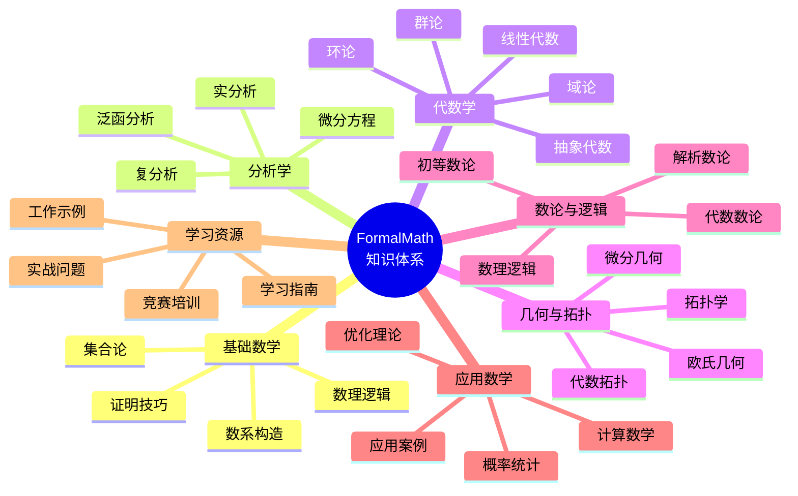
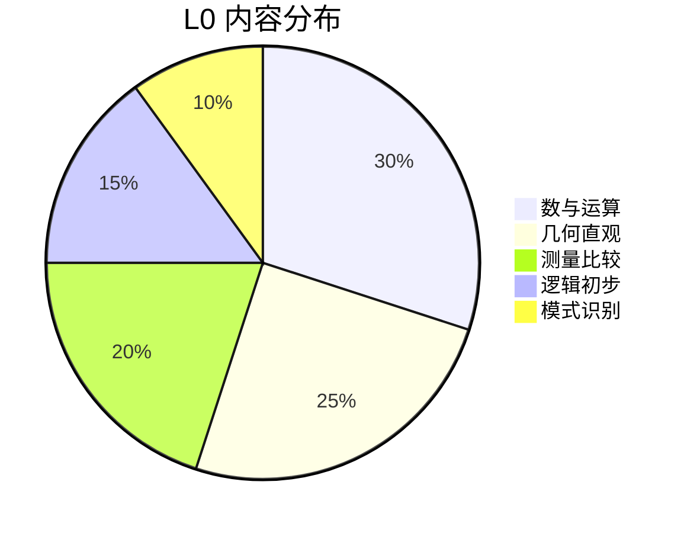
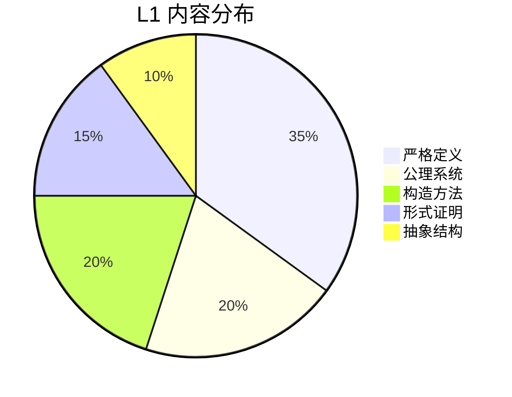
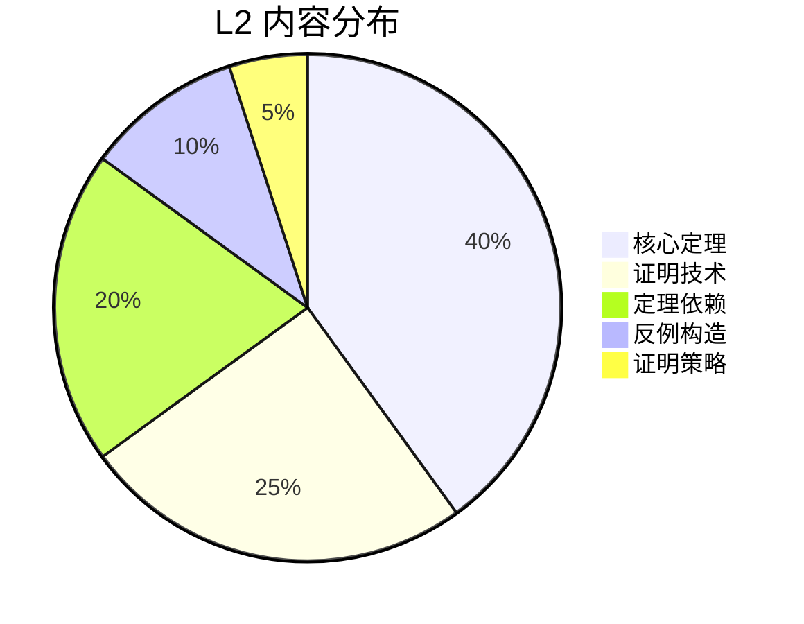
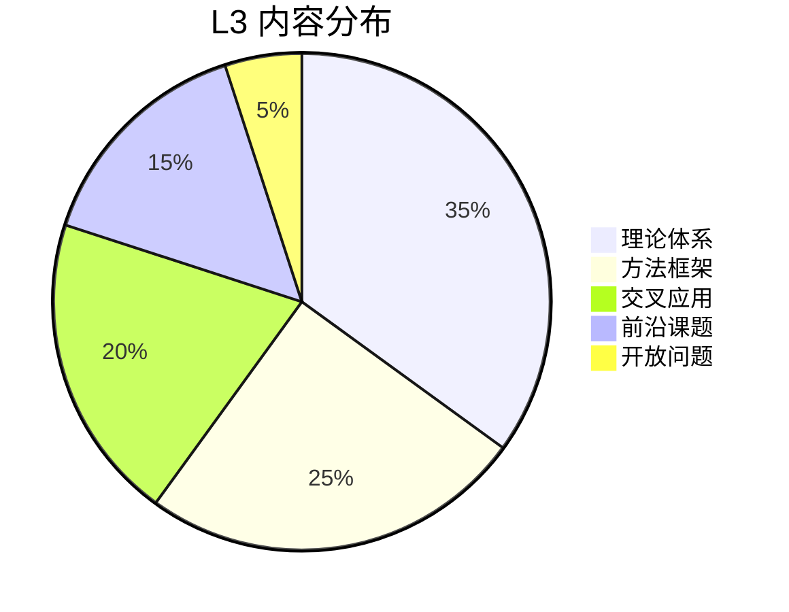
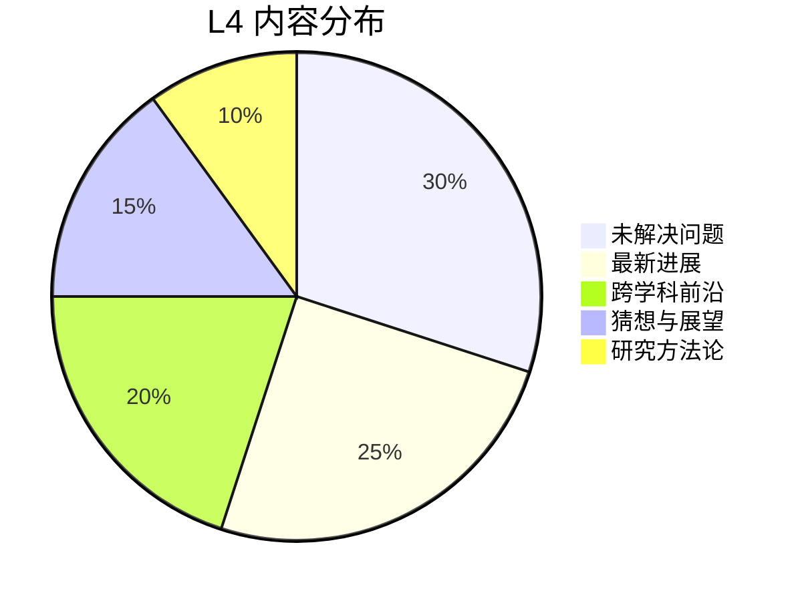
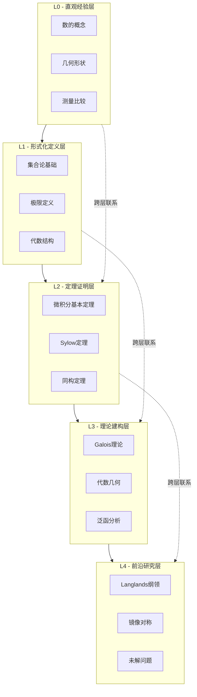
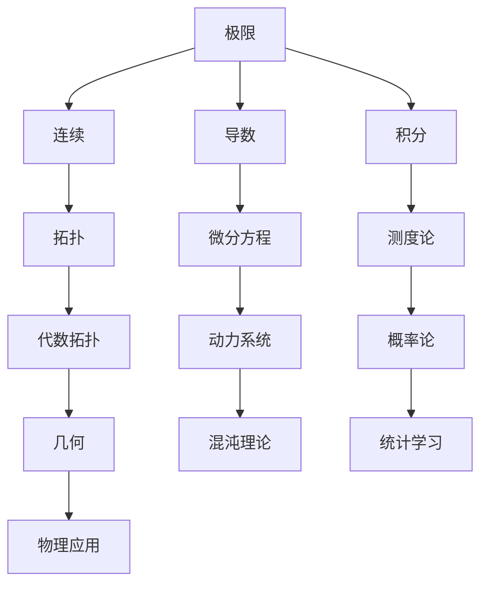
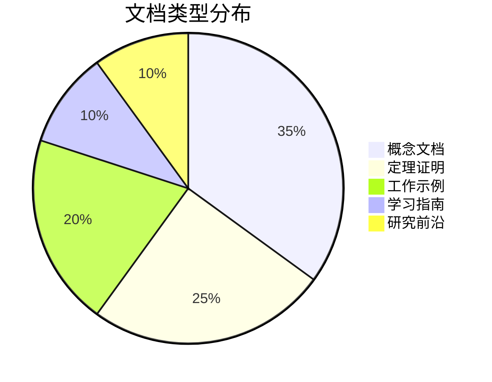

# FormalMath 完全索引

> 本文档是 FormalMath 项目的中央导航枢纽，提供所有文档的分类索引、概念快速查找、学习路径推荐和难度分级指南。

---

## 📑 文档分类总览

---

## 🗂️ 按学科分类索引

### 1. 基础数学 (01-基础数学/)

| 类别 | 核心文档 | 难度 | 前置知识 |
|------|----------|------|----------|
| 集合论 | [集合论基础](01-基础数学/集合论/01-集合论基础.md) | ⭐⭐ | 无 |
| 逻辑基础 | [数理逻辑入门](01-基础数学/数理逻辑入门/01-数理逻辑入门-深度版.md) | ⭐⭐⭐ | 集合论 |
| 证明方法 | [数学归纳法](01-基础数学/数学归纳法/01-数学归纳法-深度版.md) | ⭐⭐⭐ | 逻辑基础 |
| 范畴论 | [范畴论入门](01-基础数学/范畴论入门/01-范畴论入门-增强版.md) | ⭐⭐⭐⭐ | 抽象代数 |

### 2. 分析学 (02-分析学/)

| 分支 | 入门文档 | 进阶文档 | 难度 |
|------|----------|----------|------|
| 实分析 | 极限与连续 | Lebesgue积分理论 | ⭐⭐⭐⭐ |
| 复分析 | 全纯函数 | Riemann曲面理论 | ⭐⭐⭐⭐ |
| 泛函分析 | 度量空间 | 算子代数 | ⭐⭐⭐⭐⭐ |
| 微分方程 | 常微分方程 | 偏微分方程 | ⭐⭐⭐⭐ |

### 3. 代数学 (03-代数学/)

| 结构 | 基础概念 | 高级理论 | 关联应用 |
|------|----------|----------|----------|
| 群论 | [群定义](01-基础数学/集合论/...) | 表示论 | 密码学、物理对称性 |
| 环论 | 环与理想 | 交换代数 | 代数几何 |
| 域论 | 域扩张 | Galois理论 | 方程可解性 |
| 模论 | 模与Hom | 同调代数 | 代数拓扑 |

### 4. 几何与拓扑 (04-几何拓扑/)

| 主题 | 可视化资源 | 核心定理 | 计算工具 |
|------|------------|----------|----------|
| 微分几何 | 曲线曲面可视化 | Gauss-Bonnet定理 | 微分形式计算 |
| 代数拓扑 | 同调群计算器 | 同调正合列 | 胞腔同调 |
| 微分拓扑 | 流形图册 | Morse理论 | 示性类计算 |
| Riemann几何 | 测地线可视化 | 比较几何定理 | 曲率张量 |

---

## 🔍 概念快速查找表

### A-Z 概念索引

| 首字母 | 概念示例 | 跳转链接 |
|--------|----------|----------|
| A | Abel群、代数簇、Atlas | [代数概念](03-代数学/) |
| B | Banach空间、Borel集、概形 | [分析概念](02-分析学/) |
| C | 连续、紧致、层(Coherent) | [拓扑概念](04-几何拓扑/) |
| D | 导数、对偶、除子 | [分析/代数](02-分析学/) |
| E | 等价关系、欧拉类、椭圆曲线 | [多分支](00-概念关联图谱/) |
| F | 域、Fourier变换、纤维丛 | [代数/分析](02-分析学/) |
| G | 群、Galois群、Grassmannian | [代数学](03-代数学/) |
| H | 同态、同调、Hilbert空间 | [多分支](00-概念关联图谱/) |
| I | 理想、内积、层上同调 | [代数/几何](03-代数学/) |
| J | Jordan标准形、Jacobi行列式 | [线性代数](03-代数学/) |
| K | 核、K-理论、Kähler流形 | [高级主题](00-知识层次体系/L3/) |
| L | 极限、Lie群、层上同调 | [多分支](00-概念关联图谱/) |
| M | 流形、模、 motive | [几何/代数](04-几何拓扑/) |
| N | 范数、正规子群、层 | [分析/代数](02-分析学/) |
| O | 开集、轨道、层上同调 | [拓扑/代数](04-几何拓扑/) |
| P | 概率、投影、Picard群 | [应用数学](05-应用数学/) |
| Q | 商群、二次型、概形商 | [代数学](03-代数学/) |
| R | 环、Riemann面、表示 | [多分支](00-概念关联图谱/) |
| S | 层、Sylow定理、谱序列 | [高级代数](00-知识层次体系/L3/) |
| T | 拓扑、张量积、Toric簇 | [几何/代数](04-几何拓扑/) |
| U | 泛性质、单位元、万有覆盖 | [范畴/拓扑](01-基础数学/) |
| V | 向量空间、估值、层截面 | [线性代数](03-代数学/) |
| W | 权、Weyl群、层上同调 | [表示论](00-知识层次体系/L3/) |
| X | X-结构、形变理论 | [前沿研究](00-知识层次体系/L4/) |
| Y | Yoneda引理、Young图 | [范畴论/表示论](01-基础数学/) |
| Z | Zorn引理、Zariski拓扑、零调 | [多分支](00-概念关联图谱/) |

---

## 🎯 学习路径推荐

### 路径一：分析学专攻路线

| 阶段 | 核心内容 | 预计时间 | 验证标准 |
|------|----------|----------|----------|
| 基础阶段 | 微积分I-II | 3个月 | 能计算复杂积分 |
| 进阶阶段 | 实分析、复分析 | 4个月 | 能证明核心定理 |
| 高级阶段 | 泛函分析、PDE | 6个月 | 能阅读研究论文 |

### 路径二：代数学专攻路线

### 路径三：几何拓扑专攻路线

### 路径四：交叉学科路线

| 交叉方向 | 必修基础 | 跨学科桥梁 | 前沿应用 |
|----------|----------|------------|----------|
| 数学物理 | 分析学、李群 | 量子场论数学 | 弦理论 |
| 计算数学 | 数值分析、代数 | 算法设计 | 机器学习 |
| 金融数学 | 随机分析、PDE | 期权定价模型 | 风险管理 |
| 密码学 | 代数数论、计算 | 椭圆曲线密码 | 后量子密码 |

---

## 📊 难度分级指南

### L0 - 直观经验层 (初级)

**适合人群**：初学者、中小学生、需要温习基础的学习者

**典型内容**：
- 自然数、整数、有理数的直观理解
- 基本几何形状和性质
- 简单方程求解
- 直观概率概念

### L1 - 形式化定义层 (中级)

**适合人群**：大学本科生、准备考研的学生

**典型内容**：
- ε-δ极限定义
- 群的公理化定义
- 拓扑空间的定义
- 严格的数学归纳法

### L2 - 定理证明层 (高级)

**适合人群**：高年级本科生、研究生

**典型内容**：
- 微积分基本定理的完整证明
- Sylow定理的证明与应用
- 同调代数基本定理
- 泛函分析三大定理

### L3 - 理论建构层 (研究级)

**适合人群**：研究生、研究人员

**典型内容**：
- Galois理论的完整框架
- 代数几何基础理论
- 偏微分方程理论
- 表示论系统

### L4 - 前沿研究层 (专家级)

**适合人群**：博士生、专业研究人员

**典型内容**：
- Langlands纲领
- 镜像对称
- BSD猜想
- P vs NP问题

---

## 🗺️ 知识层次导航图

---

## 🔗 交叉引用网络

### 核心概念关联图

---

## 📚 快速访问资源

### 常用工具

| 工具名称 | 用途 | 位置 |
|----------|------|------|
| 概念索引 | 查找所有概念定义 | [概念索引](00-概念索引.md) |
| 定理查找 | 按分支查找定理 | [定理依赖网络](00-全局定理依赖网络/) |
| 学习路径 | 个性化学习推荐 | [个性化学习路径](00-全局学习路径/) |
| 问题库 | 实战练习 | [实战问题解决](00-实战问题解决/) |

### 决策支持

| 决策场景 | 辅助工具 | 链接 |
|----------|----------|------|
| 不知道学什么 | 学习路径推荐器 | [个性化学习路径](00-全局学习路径/02-个性化学习路径推荐.md) |
| 遇到证明难题 | 证明策略决策树 | [决策推理图](00-决策推理图/) |
| 选择计算方法 | 计算方法选择树 | [计算方法选择树](00-决策推理图/08-计算方法选择树.md) |
| 概念理解困难 | 核心概念三问 | [核心概念理解三问](00-核心概念理解三问/) |

---

## 📈 项目统计概览

| 统计项 | 数量 | 最后更新 |
|--------|------|----------|
| 总文档数 | 3500+ | 2026-04 |
| 核心概念 | 300+ | 2026-04 |
| 定理证明 | 500+ | 2026-04 |
| 工作示例 | 400+ | 2026-04 |
| 学习路径 | 20+ | 2026-04 |

---

## 🆘 需要帮助？

| 问题类型 | 推荐资源 | 紧急程度 |
|----------|----------|----------|
| 概念不理解 | [核心概念理解三问](00-核心概念理解三问/) | ⭐⭐⭐ |
| 证明不会做 | [证明策略决策树](00-决策推理图/05-证明方法选择决策树.md) | ⭐⭐⭐ |
| 不知道学哪个 | [个性化学习路径推荐](00-全局学习路径/02-个性化学习路径推荐.md) | ⭐⭐ |
| 需要练习题 | [实战问题分类索引](00-实战问题解决/00-实战问题分类索引.md) | ⭐⭐ |
| 想了解前沿 | [数学与人工智能前沿](00-数学与人工智能前沿-2025综述.md) | ⭐ |

---

## 🔄 更新日志

| 日期 | 更新内容 | 版本 |
|------|----------|------|
| 2026-04 | 创建完全索引系统 | v1.0 |
| 2026-04 | 整合知识图谱与索引 | v1.1 |

---

> **导航提示**：本文档是 FormalMath 项目的入口枢纽。建议根据您的学习目标和当前水平，选择合适的学习路径开始探索。如需个性化推荐，请参考[个性化学习路径推荐](00-全局学习路径/02-个性化学习路径推荐.md)。

---

*本文档自动生成于 2026-04-09 | FormalMath 项目组*
