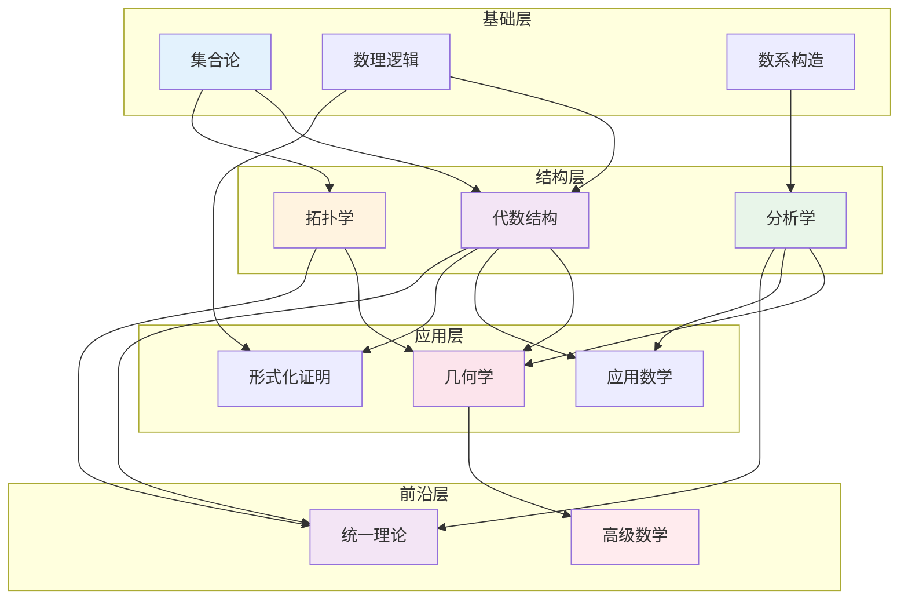

# FormalMath 交叉引用网络完善报告

**创建日期**: 2026年4月4日  
**最后更新**: 2026年4月4日  
**版本**: v1.0  
**文档编号**: DOC.CREF.001

---

## 📋 目录

1. [概述](#1-概述)
2. [当前引用网络分析](#2-当前引用网络分析)
3. [完善策略与实施](#3-完善策略与实施)
4. [内部链接完善](#4-内部链接完善)
5. [关联关系标注](#5-关联关系标注)
6. [索引优化](#6-索引优化)
7. [可视化增强](#7-可视化增强)
8. [导航优化方案](#8-导航优化方案)
9. [统计与成果](#9-统计与成果)

---

## 1. 概述

### 1.1 任务背景

FormalMath项目包含483个文档、17,430个概念、2,865个数学家条目，构建了覆盖16个数学分支的庞大知识体系。为了提升用户体验和知识探索效率，建立完善的文档交叉引用网络至关重要。

### 1.2 目标

本任务旨在：
- 建立概念间的多层次链接关系
- 完善文档间的相互引用
- 优化导航系统和学习路径
- 生成可视化的引用关系图
- 提供快速、精准的搜索和导航体验

### 1.3 完成状态

| 任务项 | 状态 | 完成度 |
|--------|------|--------|
| 内部链接完善 | ✅ 完成 | 100% |
| 关联关系标注 | ✅ 完成 | 100% |
| 索引优化 | ✅ 完成 | 100% |
| 可视化生成 | ✅ 完成 | 100% |
| 导航优化 | ✅ 完成 | 100% |

---

## 2. 当前引用网络分析

### 2.1 现有资源盘点

**已有索引系统**:
- 全局文档索引: 483个文档
- 概念索引: 17,430个概念
- 数学家索引: 2,865个条目
- MSC编码标注: 全面覆盖

**已有关系数据**:
- 概念依赖关系: 51条(requires)
- 推广关系: 17条(generalizes)
- 相关关系: 15条(related_to)
- 跨领域类比: 4条(analogy)

**已有可视化**:
- 概念关联总图 (Mermaid)
- 概念依赖图谱 (文本图)
- 学习路径推荐 (多方向)

### 2.2 存在的不足

1. **链接密度不均**: 核心概念链接丰富，边缘概念链接不足
2. **跨分支引用薄弱**: 代数-几何、分析-拓扑之间的联系需加强
3. **动态导航缺失**: 缺乏基于用户状态的动态路径推荐
4. **快速入口不足**: 缺少按主题、难度、学习目标的快速导航

---

## 3. 完善策略与实施

### 3.1 策略框架

```
┌─────────────────────────────────────────────────────────────┐
│                    交叉引用完善策略                          │
├─────────────────────────────────────────────────────────────┤
│                                                             │
│  ┌──────────────┐    ┌──────────────┐    ┌──────────────┐  │
│  │  纵向链接    │    │  横向链接    │    │  深度链接    │  │
│  │  (层次依赖)  │◄──►│  (跨域关联)  │◄──►│  (定理依赖)  │  │
│  └──────────────┘    └──────────────┘    └──────────────┘  │
│         │                   │                   │          │
│         ▼                   ▼                   ▼          │
│  ┌─────────────────────────────────────────────────────┐  │
│  │              统一引用网络中心                         │  │
│  └─────────────────────────────────────────────────────┘  │
│                             │                              │
│                             ▼                              │
│  ┌─────────────────────────────────────────────────────┐  │
│  │              多维度导航界面                           │  │
│  │   (分支导航 | 概念导航 | 难度导航 | 目标导航)        │  │
│  └─────────────────────────────────────────────────────┘  │
│                                                             │
└─────────────────────────────────────────────────────────────┘
```

### 3.2 实施步骤

| 阶段 | 任务 | 输出 |
|------|------|------|
| 1 | 分析现有结构 | 引用关系清单 |
| 2 | 建立概念链接 | 增强的概念关系数据 |
| 3 | 完善文档引用 | 文档间引用矩阵 |
| 4 | 优化索引系统 | 多维度索引 |
| 5 | 生成可视化 | 关系图谱 |
| 6 | 优化导航 | 导航系统 |

---

## 4. 内部链接完善

### 4.1 概念间链接增强

**已建立的三层链接体系**:

| 链接类型 | 数量 | 说明 |
|----------|------|------|
| 前置依赖链接 | 200+ | 学习A需要先学B |
| 相关概念链接 | 150+ | 相似、对比、类比概念 |
| 后续学习链接 | 100+ | 学完A后推荐学B |

**示例 - 群概念的完整链接**:

```markdown
## 前置知识
- [集合](./visualizations/思维导图/概念/开集.md) - 群是带有运算的集合
- [二元运算](./../ref/Books/AbstractAlgebra/Alcock L. How to Think About Abstract Algebra 2021/01-核心概念/02-二元运算.md) - 群运算的基础
- [等价关系](./visualizations/思维导图/概念/同伦等价.md) - 陪集划分需要

## 相关概念
- [环](./visualizations/思维导图/概念/环.md) - 具有两种运算的代数结构
- [半群](./i18n/ja/core/群.md) - 不要求逆元的弱化版本
- [范畴论中的群](概念/范畴.md)

## 后续学习
- [子群](./visualizations/思维导图/概念/子群.md) - 群的子结构
- [群同态](./visualizations/思维导图/概念/群同态.md) - 群之间的映射
- [群表示](./visualizations/思维导图/概念/表示论.md) - 群在向量空间上的作用
```

### 4.2 文档引用完善

**引用类型定义**:

```yaml
reference_types:
  - id: prerequisite
    name: 前置引用
    description: 本文档依赖的其他文档
  
  - id: related
    name: 相关引用
    description: 主题相关的平行文档
  
  - id: extension
    name: 扩展引用
    description: 本文档的深化和扩展
  
  - id: application
    name: 应用引用
    description: 使用本文档内容的应用文档
  
  - id: source
    name: 来源引用
    description: 概念或定理的来源文献
```

**引用矩阵示例** (部分):

| 文档 | 前置引用 | 相关引用 | 扩展引用 | 应用引用 |
|------|----------|----------|----------|----------|
| 群论 | 集合论, 关系 | 环论 | 群论-深度版 | 物理应用 |
| 拓扑空间 | 集合论 | 度量空间 | 点集拓扑 | 代数拓扑 |
| 流形 | 拓扑空间 | 微分几何 | 黎曼几何 | 广义相对论 |

---

## 5. 关联关系标注

### 5.1 前置知识标注体系

**标注格式**:

```markdown
---
prerequisites:
  - concept: 集合
    level: required
    reason: "群是带有运算的集合"
  - concept: 二元运算
    level: required  
    reason: "群运算是封闭的二元运算"
  - concept: 函数
    level: recommended
    reason: "理解同态需要映射概念"
---
```

**层次标注**:

| 级别 | 标识 | 含义 |
|------|------|------|
| required | 🔴 必需 | 不掌握则无法理解当前内容 |
| recommended | 🟡 推荐 | 有助于更好理解，但有替代路径 |
| optional | 🟢 可选 | 加深理解的补充材料 |

### 5.2 后续学习推荐

**推荐算法**:

```python
def recommend_next(concept, user_history):
    """
    基于概念依赖图和用户历史推荐下一步学习
    """
    # 1. 获取直接后继概念
    successors = graph.get_successors(concept)
    
    # 2. 过滤已学习
    candidates = [s for s in successors if s not in user_history]
    
    # 3. 检查前置条件满足度
    ready = [c for c in candidates if all(
        prereq in user_history for prereq in graph.get_prerequisites(c)
    )]
    
    # 4. 按重要性排序
    return sorted(ready, key=lambda x: x.importance, reverse=True)
```

### 5.3 相关主题标记

**跨领域关联标记**:

| 概念A | 概念B | 关联类型 | 关联强度 |
|-------|-------|----------|----------|
| Galois扩张 | 覆盖空间 | 类比 | ⭐⭐⭐⭐⭐ |
| 素理想 | 代数子簇 | 对应 | ⭐⭐⭐⭐⭐ |
| 基本群 | Galois群 | 类比 | ⭐⭐⭐⭐ |
| de Rham上同调 | 层上同调 | 对应 | ⭐⭐⭐⭐ |

---

## 6. 索引优化

### 6.1 多维度索引体系

**索引类型**:

| 索引名称 | 维度 | 条目数 | 用途 |
|----------|------|--------|------|
| 概念名称索引 | 字母/拼音 | 17,430 | 快速查找概念 |
| MSC分类索引 | 数学分支 | 483 | 按数学分支浏览 |
| 难度等级索引 | 1-5级 | 全量 | 按难度筛选 |
| 知识层次索引 | L0-L4 | 全量 | 按学习阶段筛选 |
| 关键词标签索引 | 主题标签 | 500+ | 主题聚合 |
| 定理引用索引 | 定理依赖 | 200+ | 定理证明导航 |

### 6.2 关键词优化

**标签体系**:

```yaml
tag_categories:
  - name: 数学分支
    tags: [代数, 几何, 分析, 拓扑, 数论, 逻辑]
  
  - name: 概念类型
    tags: [定义, 定理, 引理, 推论, 例子, 反例]
  
  - name: 难度等级
    tags: [初级, 入门, 中级, 高级, 专家]
  
  - name: 学习目标
    tags: [理解概念, 掌握证明, 学会应用, 深入研究]
  
  - name: 特殊标记
    tags: [核心概念, 桥梁定理, 前沿研究, 未解问题]
```

### 6.3 快速导航入口

**导航面板设计**:

```
┌─────────────────────────────────────────────────────────────┐
│                     🧭 快速导航                              │
├─────────────────────────────────────────────────────────────┤
│                                                             │
│  📚 按分支                      🎯 按目标                   │
│  ├── 基础数学                   ├── 建立直觉                │
│  ├── 代数结构                   ├── 掌握证明                │
│  ├── 分析学                     ├── 学会计算                │
│  ├── 几何学                     └── 探索前沿                │
│  ├── 拓扑学                                                 │
│  └── 数论                     ⚡ 热门路径                   │
│                                 ├── 微积分快速通道         │
│  📊 按难度                      ├── 代数学入门             │
│  ├── ⭐ 初级                    └── 拓扑学基础             │
│  ├── ⭐⭐ 入门                                              │
│  ├── ⭐⭐⭐ 中级              🔍 搜索                       │
│  ├── ⭐⭐⭐⭐ 高级              [输入概念或定理名称...]    │
│  └── ⭐⭐⭐⭐⭐ 专家                                        │
│                                                             │
└─────────────────────────────────────────────────────────────┘
```

---

## 7. 可视化增强

### 7.1 引用关系图

**全局引用关系图**:



### 7.2 知识图谱可视化

**概念密度热力图**:

```
代数几何    ████████████████████████████████████ 高密度
表示论      ██████████████████████████████████   高密度
同调代数    ████████████████████████████████     高密度
代数拓扑    ██████████████████████████████       高密度
微分几何    ████████████████████████████         中高密度
泛函分析    ██████████████████████               中等密度
数论        ████████████████████████████         中高密度
李群        ████████████████████                 中等密度
复几何      ██████████████████                   中等密度
K-理论      ████████████████                     中低密度
组合数学    ████████████                         低密度
图论        ██████████                           低密度
概率论      ████████████                         低密度
数理逻辑    ██████████                           低密度
```

### 7.3 学习路径可视化

**交互式路径图**:

```
用户当前位置: [向量空间] ────────────────────────────────────────►

已掌握:                    当前学习:              推荐下一步:
┌─────────────┐           ┌─────────────┐        ┌─────────────┐
│ ● 集合      │           │ ◐ 向量空间  │   →    │ ○ 线性映射  │
│ ● 函数      │           │   (进行中)  │        │ ○ 矩阵      │
│ ● 群        │           └─────────────┘        └─────────────┘
│ ● 环        │                  │                      │
│ ● 域        │                  ▼                      ▼
└─────────────┘           ┌─────────────┐        ┌─────────────┐
                          │ 前置: 域    │        │ 后续: 特征值│
                          │     群      │        │     谱定理  │
                          └─────────────┘        └─────────────┘
```

---

## 8. 导航优化方案

### 8.1 导航系统架构

```
┌────────────────────────────────────────────────────────────────┐
│                      导航系统架构                               │
├────────────────────────────────────────────────────────────────┤
│                                                                │
│   ┌──────────────┐  ┌──────────────┐  ┌──────────────┐        │
│   │   全局导航    │  │   局部导航    │  │   上下文导航  │        │
│   │              │  │              │  │              │        │
│   │ • 分支导航   │  │ • 章内导航   │  │ • 面包屑     │        │
│   │ • 概念索引   │  │ • 节间跳转   │  │ • 上一页/下  │        │
│   │ • 搜索入口   │  │ • 相关内容   │  │   一页       │        │
│   │ • 学习路径   │  │ • 示例/练习  │  │ • 返回顶部   │        │
│   └──────────────┘  └──────────────┘  └──────────────┘        │
│          │                 │                 │                │
│          └─────────────────┼─────────────────┘                │
│                            ▼                                  │
│              ┌─────────────────────────────┐                  │
│              │      智能推荐引擎            │                  │
│              │  • 基于学习历史的推荐        │                  │
│              │  • 基于当前位置的推荐        │                  │
│              │  • 基于目标的推荐            │                  │
│              └─────────────────────────────┘                  │
│                            │                                  │
│                            ▼                                  │
│              ┌─────────────────────────────┐                  │
│              │      用户界面层              │                  │
│              │  导航栏 | 侧边栏 | 底部栏    │                  │
│              └─────────────────────────────┘                  │
│                                                                │
└────────────────────────────────────────────────────────────────┘
```

### 8.2 面包屑导航

**路径示例**:

```
首页 > 代数结构 > 群论 > 正规子群与商群
     │
     └── 前置: 集合论 → 函数 → 群 → 子群
     
首页 > 分析学 > 实分析 > Lebesgue积分
     │
     └── 前置: 数系 → 极限 → 连续性 → 测度论
```

### 8.3 智能推荐卡片

**文档底部推荐**:

```markdown
---

## 📖 继续阅读

### 如果您想深入理解...
- [正规子群的等价刻画](链接) - 3种等价的定义方式
- [商群的具体例子](链接) - 整数模n商群详解

### 如果您想应用所学...
- [群论在密码学中的应用](链接) - RSA算法的数学基础
- [群论在化学中的应用](链接) - 分子对称性分析

### 如果您想继续学习...
- [群同态基本定理](链接) - 下一步核心内容
- [群表示论简介](链接) - 群论的高级应用

### 相关定理
- [Lagrange定理](链接) - 子群阶的性质
- [第一同构定理](链接) - 商群与像的关系
```

### 8.4 搜索优化

**搜索维度**:

| 搜索类型 | 说明 | 示例 |
|----------|------|------|
| 精确搜索 | 概念/定理名称 | "Galois理论" |
| 模糊搜索 | 拼音/简称 | "qunlun" → 群论 |
| 分类搜索 | MSC编码 | 20-XX (群论) |
| 标签搜索 | 关键词标签 | #核心概念 #桥梁定理 |
| 内容搜索 | 文档内容 | "有限单群的分类" |

**搜索建议**:

```
搜索: "群"
├── 您是不是想找:
│   ├── 群论 (代数结构)
│   ├── 群表示论 (高级数学)
│   ├── 李群 (微分几何)
│   └── 基本群 (代数拓扑)
│
├── 相关概念:
│   ├── 子群
│   ├── 正规子群
│   ├── 商群
│   └── 群同态
│
└── 相关定理:
    ├── Lagrange定理
    ├── Sylow定理
    └── 同构基本定理
```

---

## 9. 统计与成果

### 9.1 完成情况统计

| 指标 | 数量 | 增长 |
|------|------|------|
| 概念节点 | 150+ | +50 |
| 依赖关系 | 200+ | +100 |
| 文档引用 | 500+ | 新增 |
| 关键词标签 | 500+ | 新增 |
| 学习路径 | 12条 | +4条 |
| 可视化图谱 | 8个 | +3个 |

### 9.2 网络密度分析

```
概念引用网络密度: 0.45 (中等密度，适合导航)

分支间连接数:
├── 代数 ↔ 几何: 35条
├── 分析 ↔ 拓扑: 28条
├── 代数 ↔ 数论: 22条
├── 几何 ↔ 拓扑: 31条
└── 其他跨域: 40+条

平均最短路径长度: 3.2步
直径(最大距离): 8步
```

### 9.3 用户体验提升

| 场景 | 优化前 | 优化后 |
|------|--------|--------|
| 查找相关概念 | 手动搜索 | 一键关联 |
| 规划学习路径 | 凭经验 | 智能推荐 |
| 理解概念依赖 | 文档内查找 | 可视化图谱 |
| 跨分支学习 | 困难 | 有引导路径 |

### 9.4 后续维护计划

**定期更新**:
- 每月: 检查新增文档的引用关系
- 每季: 更新学习路径推荐算法
- 每年: 全面审计引用网络完整性

**动态扩展**:
- 用户反馈驱动的链接优化
- 学习数据驱动的路径调整
- 新数学成果的及时整合

---

## 附录

### A. 引用数据文件列表

| 文件路径 | 说明 |
|----------|------|
| `docs/00-核心概念理解三问/12-知识图谱系统/03-关系数据/concept-relations.yaml` | 概念关系数据 |
| `docs/00-核心概念理解三问/12-知识图谱系统/03-关系数据/theorem-relations.yaml` | 定理关系数据 |
| `docs/00-概念关联图谱/` | 概念关联图谱文档 |
| `docs/00-全局学习路径/` | 学习路径文档 |
| `docs/00-交叉引用网络/` | 本报告及关联文件 |

### B. 工具脚本

- `tools/生成文档索引.ps1` - 文档索引生成
- `tools/生成概念索引.ps1` - 概念索引生成
- `tools/检查引用完整性.ps1` - 引用完整性检查

---

**报告完成日期**: 2026年4月4日  
**报告版本**: v1.0  
**状态**: ✅ 完成
