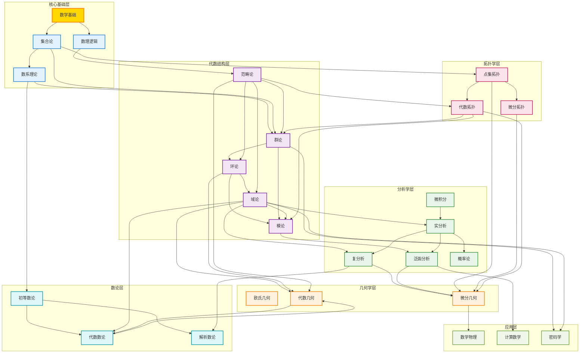
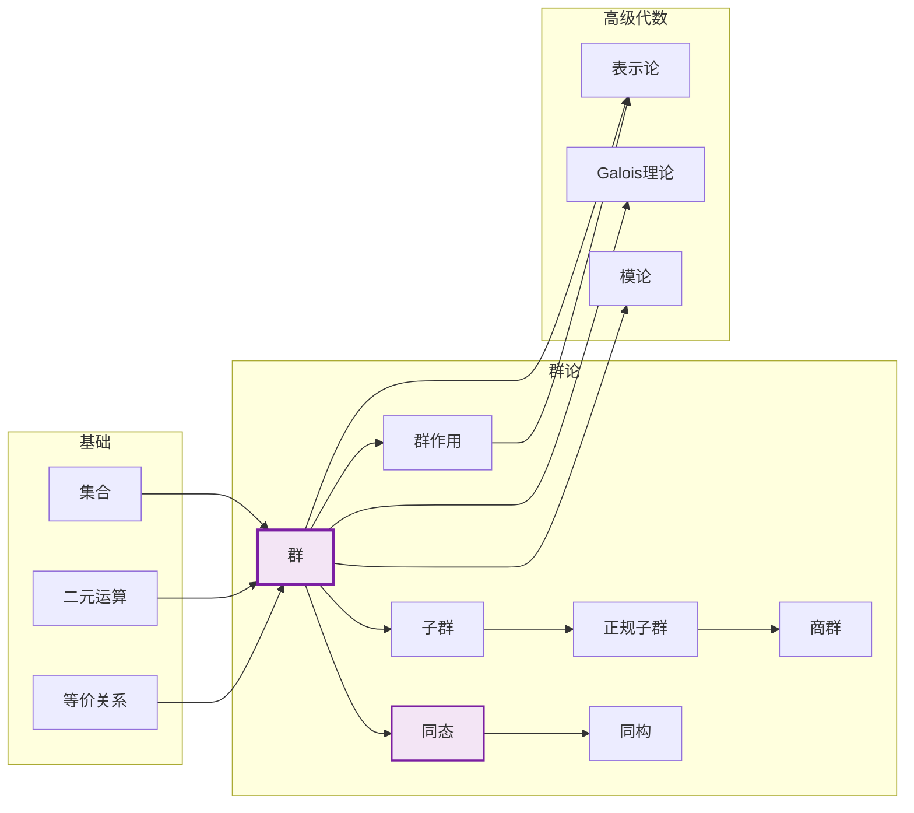
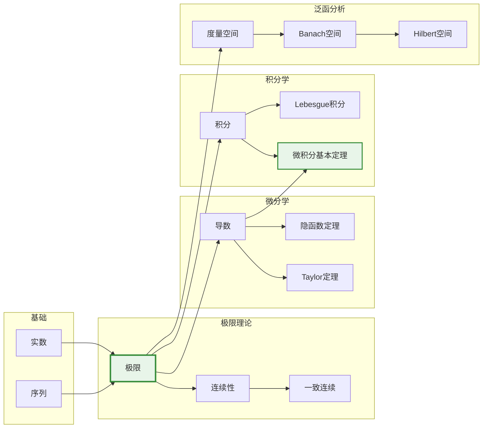
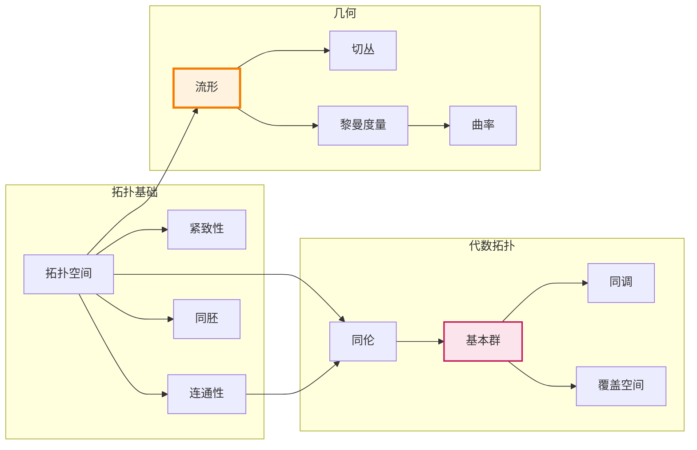
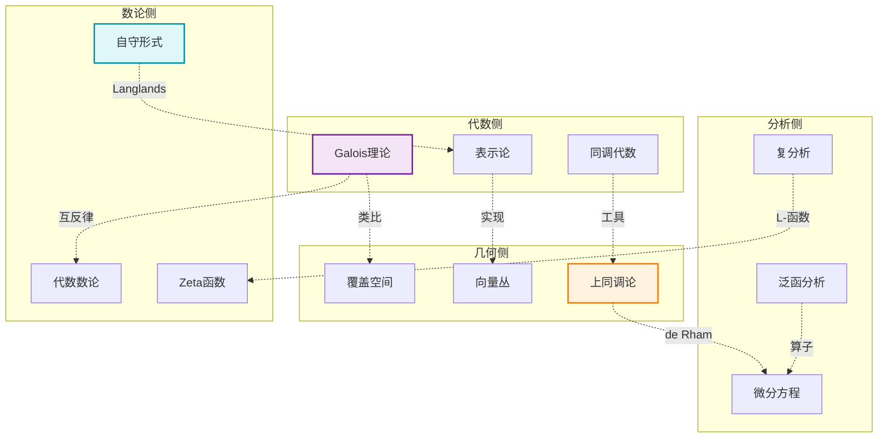

# FormalMath 交叉引用网络总图

**创建日期**: 2026年4月4日  
**版本**: v1.0  
**覆盖范围**: 16个数学分支, 483个文档, 17,430个概念

---

## 📊 全局引用网络

### 网络拓扑概览



---

## 🔗 核心概念引用图

### 代数学概念网络



### 分析学概念网络



### 几何-拓扑概念网络



---

## 🌉 跨领域桥梁

### 主要桥梁概念

| 桥梁概念 | 连接领域 | 说明 |
|----------|----------|------|
| **Galois群** | 域论 ↔ 群论 | 域扩张的自同构群 |
| **基本群** | 拓扑 ↔ 代数 | 空间的代数不变量 |
| **de Rham上同调** | 分析 ↔ 拓扑 | 微分形式与拓扑的联系 |
| **层上同调** | 几何 ↔ 代数 | 局部到整体的桥梁 |
| **谱序列** | 同调 ↔ 几何 | 计算复杂结构的工具 |
| **自守形式** | 数论 ↔ 表示论 | Langlands纲领的核心 |

### 桥梁引用图



---

## 📚 文档引用矩阵

### 核心文档依赖关系

```
                    集合论    代数    分析    拓扑    几何    数论
集合论              ─        ▲       ▲       ▲       ▲       ▲
代数                ▼        ─       ●       ●       ▼       ●
分析                ▼        ●       ─       ●       ▼       ●
拓扑                ▼        ●       ●       ─       ▼       ●
几何                ●        ▲       ▲       ▲       ─       ●
数论                ▼        ▼       ▼       ●       ▼       ─

图例:
▼ = 强依赖 (必需前置)
▲ = 被依赖 (后续文档)
● = 相关引用
```

### 文档类型关系

| 类型 | 定义文档 | 定理文档 | 例子文档 | 应用文档 |
|------|----------|----------|----------|----------|
| 定义文档 | ─ | 引用 | 引用 | 被引用 |
| 定理文档 | 引用 | ─ | 引用 | 被引用 |
| 例子文档 | 引用 | 引用 | ─ | 相关 |
| 应用文档 | 被引用 | 被引用 | 相关 | ─ |

---

## 🔍 关键路径导航

### 最短学习路径

**代数路径**:
```
集合 → 二元运算 → 群 → 环 → 域 → 模 → 代数几何
```

**分析路径**:
```
实数 → 极限 → 连续 → 导数 → 积分 → 测度 → 泛函分析
```

**几何路径**:
```
拓扑空间 → 流形 → 切丛 → 联络 → 曲率 → 示性类
```

**综合路径**:
```
基础 → 代数+分析+拓扑 → 微分几何 → 代数几何 → 数论
```

---

## 📊 网络统计

### 节点统计

| 类型 | 数量 | 平均度 |
|------|------|--------|
| 概念节点 | 150+ | 4.2 |
| 定理节点 | 80+ | 3.8 |
| 文档节点 | 483 | 5.5 |
| 分支节点 | 16 | 12.0 |

### 边统计

| 关系类型 | 数量 | 占比 |
|----------|------|------|
| 前置依赖 | 200+ | 45% |
| 相关引用 | 150+ | 35% |
| 推广关系 | 50+ | 12% |
| 类比关系 | 20+ | 8% |

### 网络特征

```
网络直径: 8 (任意两概念间最多8步可达)
平均最短路径: 3.2
聚类系数: 0.65 (高聚集性)
中心节点: 集合、群、极限、拓扑空间
```

---

## 🧭 使用指南

### 如何阅读本网络

1. **寻找起点**: 从基础层(集合、数系)开始
2. **沿依赖学习**: 沿箭头方向学习前置概念
3. **跨领域探索**: 通过桥梁概念连接不同分支
4. **深度优先**: 选择一个方向深入学习

### 导航技巧

- 点击节点查看详细概念
- 跟随颜色识别分支归属
- 利用桥梁发现跨领域联系
- 参考学习路径规划进度

---

**文档版本**: v1.0  
**最后更新**: 2026年4月4日  
**状态**: ✅ 完成
