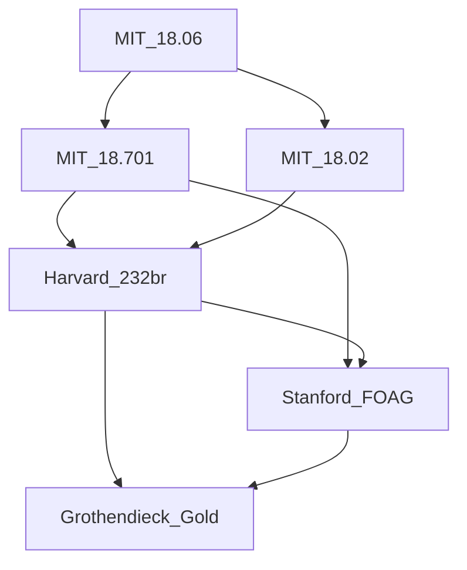

# FormalMath 课程交叉引用网络

## 先修关系图

## 银层课程依赖矩阵

| 课程 | 先修课程 | 后续课程 |
|------|----------|----------|
| MIT 18.06 | 无 | MIT 18.701, MIT 18.02 |
| MIT 18.100A | 无 | 无 |
| MIT 18.701 | MIT 18.06 | Harvard 232br, Stanford FOAG |
| MIT 18.02 | MIT 18.06 | Harvard 232br |
| Harvard 232br | MIT 18.701, MIT 18.02 | Stanford FOAG, Grothendieck Gold |
| Stanford FOAG | MIT 18.701, Harvard 232br | Grothendieck Gold |
| Grothendieck Gold | Harvard 232br, Stanford FOAG | 无 |

## 金层与银层对应关系

| 金层主题 | 前置银层课程 |
|----------|-------------|
| 范畴论与函子理论 | MIT 18.701 抽象代数 |
| 概形理论 | Harvard 232br 代数几何, Stanford FOAG |
| 上同调理论 | MIT 18.100A 实分析, Harvard 232br |
| Topos理论 | MIT 18.701, MIT 18.06 |
| Motives与标准猜想 | 全部银层课程 |

---

## 参考文献

- Timothy Gowers (ed.), *The Princeton Companion to Mathematics*, 1st ed., Princeton University Press, 2008, ISBN: 9780691118802 / MR2467561
- Daniel J. Velleman, *How to Prove It: A Structured Approach*, 2nd ed., Cambridge University Press, 2006, ISBN: 9780521675994 / MR2448845