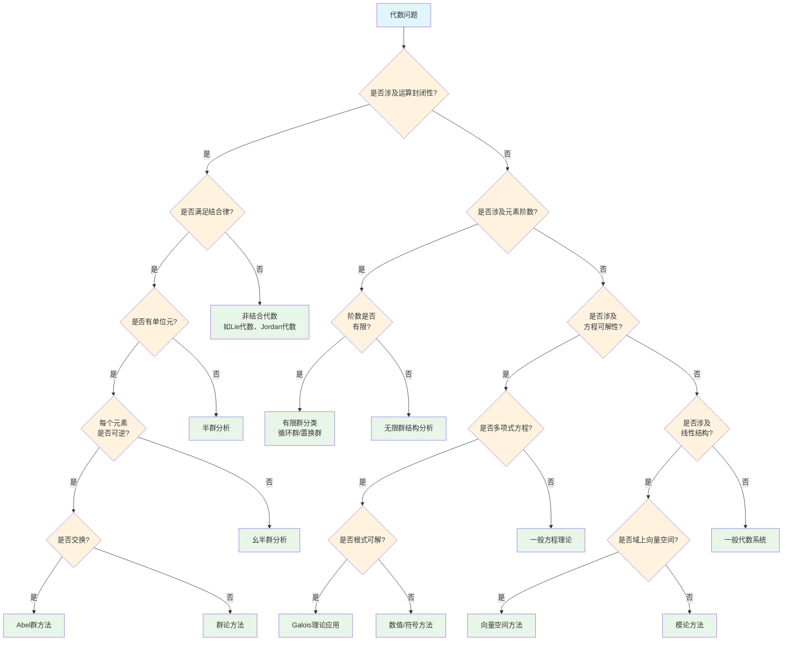

# 代数问题识别决策树

## 概述

本文档提供代数问题的系统性识别与分类决策树，帮助快速确定问题类型并选择适当的解决方法。

---

## 决策树根节点

**根节点：代数问题类型识别**

代数问题根据结构特征和核心关注点分为四大类：

- 结构分类问题
- 元素判定问题
- 方程求解问题
- 结构构造问题

---

## Mermaid决策树图

---

## 决策节点详细说明

### 第一层判断：运算封闭性

| 条件 | 判断标准 | 后续路径 |
|------|----------|----------|
| 涉及运算封闭性 | 问题关注集合在运算下的封闭性 | 群/环/域判定路径 |
| 不涉及运算封闭性 | 问题关注元素性质或方程求解 | 元素/方程路径 |

### 第二层判断：结合律

| 条件 | 判断标准 | 后续路径 |
|------|----------|----------|
| 满足结合律 | (a·b)·c = a·(b·c) | 群论分析 |
| 不满足结合律 | 存在反例 | 非结合代数(Lie代数等) |

### 第三层判断：单位元与可逆性

| 条件 | 判断标准 | 后续路径 |
|------|----------|----------|
| 有单位元且可逆 | ∃e, ∀a, ∃a⁻¹ | 群结构分析 |
| 有单位元不可逆 | ∃e, 但存在不可逆元 | 幺半群/半群分析 |
| 无单位元 | 不满足 | 广群分析 |

### 第四层判断：交换性

| 条件 | 判断标准 | 后续路径 |
|------|----------|----------|
| 交换 | a·b = b·a | Abel群理论 |
| 不交换 | 存在a·b ≠ b·a | 一般群论 |

---

## 叶节点处理方法

### 1. Abel群方法

**适用场景**：

- 循环群分类
- 有限生成Abel群结构定理
- 直和分解

**核心工具**：

- 基本定理：有限生成Abel群 ≅ 循环群的直和
- 不变因子分解
- 初等因子分解

**典型问题**：

- 确定群的同构类
- 计算不变因子
- 寻找基的变换

### 2. 群论方法

**适用场景**：

- 非交换群结构
- 群作用分析
- 正规子群与商群

**核心工具**：

- Sylow定理
- 群同态基本定理
- 合成列与Jordan-Hölder定理

**典型问题**：

- 确定Sylow子群数量
- 证明单性
- 构造群扩张

### 3. Galois理论应用

**适用场景**：

- 多项式方程根式可解性
- 域扩张与自同构
- 尺规作图问题

**核心工具**：

- Galois对应
- 可解群判别
- 判别式分析

**典型问题**：

- 五次方程不可解证明
- 正多边形可作图性
- 三等分角不可能性

### 4. 向量空间方法

**适用场景**：

- 线性方程组
- 矩阵标准形
- 线性变换分析

**核心工具**：

- 基与维数
- 线性映射的矩阵表示
- 特征值与特征向量

**典型问题**：

- 矩阵对角化
- Jordan标准形
- 最小多项式计算

### 5. 模论方法

**适用场景**：

- 环上线性结构
- 主理想整环上的模
- 扭模与自由模

**核心工具**：

- 模同态
- 正合序列
- 投射/内射模

**典型问题**：

- 模的分解
- 同调代数应用
- 表示论基础

---

## 典型决策路径示例

### 示例1：判断S₄是否为单群

**路径**：代数问题 → 运算封闭性(是) → 结合律(是) → 单位元可逆(是) → 交换性(否) → 群论方法

**分析过程**：

1. S₄在置换乘法下封闭 ✓
2. 置换乘法满足结合律 ✓
3. 恒等置换是单位元，每个置换有逆 ✓
4. S₄非交换 ✓
5. 应用Sylow定理分析正规子群
6. 结论：S₄有正规子群A₄，非单群

### 示例2：x⁵ - 4x + 2 = 0的根式可解性

**路径**：代数问题 → 运算封闭性(否) → 元素阶数(否) → 方程可解性(是) → 多项式方程(是) → 根式可解? → Galois理论

**分析过程**：

1. 问题关注方程求解而非结构封闭性
2. 应用Galois理论
3. 计算Galois群 ≅ S₅
4. S₅不可解
5. 结论：方程不可用根式求解

### 示例3：分类所有12阶群

**路径**：代数问题 → 运算封闭性(是) → 结合律(是) → 单位元可逆(是) → 交换性(?) → 有限群分类

**分析过程**：

1. 确认是有限群问题
2. n = 12 = 2² × 3
3. 应用Sylow定理
   - n₃ ≡ 1 (mod 3), n₃ | 4 → n₃ = 1或4
   - n₂ ≡ 1 (mod 2), n₂ | 3 → n₂ = 1或3
4. 分类讨论得5个不同构的12阶群

---

## 常见错误与注意事项

### 错误1：混淆群与半群

**问题**：忽略单位元或可逆性条件
**后果**：错误地应用群论结果到半群
**避免**：明确验证群公理的所有条件

### 错误2：忽视特征

**问题**：在特征p域上应用特征0的结果
**后果**：结论错误（如Frobenius自同构特殊性）
**避免**：始终检查域的特征

### 错误3：混淆可解性与根式可解性

**问题**：认为所有多项式方程都可解
**后果**：错误地假设五次及以上方程有根式解
**避免**：理解Galois群与根式可解的精确关系

### 错误4：忽略扭元素

**问题**：在Z-模分析中忽略扭部分
**后果**：结构定理应用错误
**避免**：完整分析扭模与自由模的直和分解

---

## 快速参考表

| 问题特征 | 决策路径 | 关键定理 |
|----------|----------|----------|
| 运算封闭+结合+单位+逆 | 群论 | Lagrange, Sylow |
| 运算封闭+结合+单位 | 幺半群 | 同态基本定理 |
| 运算封闭+结合 | 半群 | Green关系 |
| 非结合+反对称 | Lie代数 | Jacobi恒等式 |
| 多项式可解性 | Galois理论 | Galois对应 |
| 线性方程组 | 向量空间 | 维数公式 |
| 环上线性结构 | 模论 | 结构定理 |

---

## 相关文档

- [02-分析问题识别决策树](./02-分析问题识别决策树.md)
- [05-证明方法选择决策树](./05-证明方法选择决策树.md)
- [09-代数对象分类树](./09-代数对象分类树.md)
