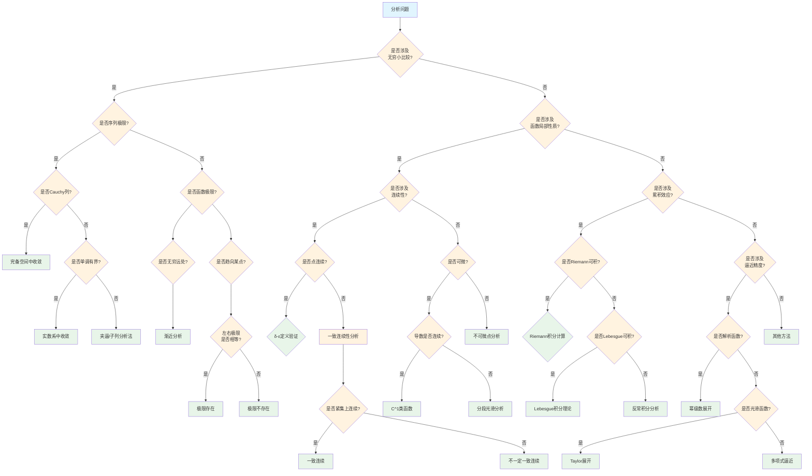

# 分析问题识别决策树

## 概述

本文档提供分析学问题的系统性识别与分类决策树，涵盖极限、连续性、微分、积分等核心分析概念的判定与计算。

---

## 决策树根节点

**根节点：分析问题类型识别**

分析问题根据研究对象的性质和核心问题分为四大类：

- 极限计算问题
- 连续性判定问题
- 可微性分析问题
- 积分计算问题

---

## Mermaid决策树图



---

## 决策节点详细说明

### 第一层判断：无穷小比较

| 条件 | 判断标准 | 后续路径 |
|------|----------|----------|
| 涉及无穷小比较 | 问题关注趋近过程中的比值或阶数 | 极限计算路径 |
| 不涉及无穷小 | 问题关注函数性质或积分 | 性质/积分路径 |

**无穷小阶数判定**：

- 若 lim(f(x)/g(x)) = 0，则f是g的高阶无穷小
- 若 lim(f(x)/g(x)) = c ≠ 0，则f与g同阶
- 若 lim(f(x)/g(x)) = 1，则f与g等价

### 第二层判断：序列vs函数极限

| 类型 | 特点 | 常用方法 |
|------|------|----------|
| 序列极限 | 离散指标n→∞ | Cauchy准则、单调收敛 |
| 函数极限 | 连续变量趋近 | ε-δ定义、左右极限 |

### 第三层判断：Cauchy列判定

**Cauchy准则**：{aₙ}是Cauchy列 ⟺ ∀ε>0, ∃N, ∀m,n>N: |aₘ-aₙ|<ε

| 空间类型 | Cauchy列性质 | 结论 |
|----------|--------------|------|
| 完备度量空间 | 所有Cauchy列收敛 | 直接得收敛性 |
| 不完备空间 | Cauchy列可能不收敛 | 需要完备化 |

### 第四层判断：连续性类型

| 连续性类型 | 定义 | 判定方法 |
|------------|------|----------|
| 点连续 | lim_{x→a}f(x)=f(a) | ε-δ验证 |
| 一致连续 | ∀ε>0, ∃δ>0, 与点无关 | 定义或Lipschitz条件 |
| 绝对连续 | 更强的一致连续性 | 变差控制 |

### 第五层判断：可微性分析

| 可微程度 | 特征 | 分析方法 |
|----------|------|----------|
| C⁰ | 连续 | 定义验证 |
| C¹ | 连续可微 | 导数连续验证 |
| C^∞ | 无穷可微 | Taylor展开 |
| 解析 | 幂级数展开 | 收敛半径分析 |

---

## 叶节点处理方法

### 1. 极限计算

**等价无穷小替换**：

- sin(x) ~ x (x→0)
- ln(1+x) ~ x (x→0)
- e^x - 1 ~ x (x→0)
- (1+x)^α - 1 ~ αx (x→0)

**L'Hôpital法则**：

- 0/0或∞/∞型未定式
- 分子分母分别求导后再取极限

**Stolz定理**（序列形式）：

- 用于计算序列比值的极限

### 2. 连续性判定

**点连续验证步骤**：

1. 确认f(a)有定义
2. 计算lim_{x→a}f(x)
3. 验证lim_{x→a}f(x) = f(a)

**一致连续性判定**：

- 紧集上的连续函数必一致连续
- Lipschitz连续 ⇒ 一致连续
- 导数有界 ⇒ Lipschitz连续

### 3. 微分分析

**可微性判定**：

- 一元函数：差商极限存在
- 多元函数：各偏导存在且连续（充分条件）

**Taylor展开**：

```

f(x) = f(a) + f'(a)(x-a) + f''(a)(x-a)²/2! + ... + Rₙ(x)

```

### 4. 积分计算

**Riemann可积判定**：

- 闭区间上的连续函数
- 单调函数
- 有界且间断点集测度为零

**积分技巧**：

- 换元法
- 分部积分
- 部分分式分解
- 对称性利用

---

## 典型决策路径示例

### 示例1：计算 lim_{n→∞} (1 + 1/n)ⁿ

**路径**：分析问题 → 无穷小比较(否) → 函数局部性质(否) → 累积效应(否) → 逼近精度(是) → 解析函数? → 序列极限

**分析过程**：

1. 识别为数列极限问题
2. 取对数转化为ln(1+1/n)/(1/n)
3. 使用等价无穷小：ln(1+x) ~ x (x→0)
4. 极限 = e¹ = e

### 示例2：证明f(x) = sin(1/x)在(0,1)上不一致连续

**路径**：分析问题 → 无穷小比较(否) → 函数局部性质(是) → 连续性(是) → 点连续(否) → 一致连续性分析

**分析过程**：

1. 检查点连续：在(0,1)内每点连续 ✓
2. 检查一致连续：取xₙ=1/(nπ), yₙ=1/(nπ+π/2)
3. |xₙ-yₙ|→0但|f(xₙ)-f(yₙ)|=1不→0

4. 结论：不一致连续

### 示例3：判断∫₀¹ (sin x)/x dx的收敛性

**路径**：分析问题 → 无穷小比较(否) → 函数局部性质(否) → 累积效应(是) → Riemann可积(是)

**分析过程**：

1. (sin x)/x在(0,1]连续
2. lim_{x→0}(sin x)/x = 1，可连续延拓
3. 延拓后在[0,1]连续
4. 结论：Riemann可积（正常积分）

---

## 常见错误与注意事项

### 错误1：混淆逐点收敛与一致收敛

**问题**：函数列{fₙ}逐点收敛于f，误认为可交换极限与积分
**后果**：lim ∫ fₙ ≠ ∫ lim fₙ
**避免**：验证一致收敛或使用控制收敛定理

### 错误2：滥用L'Hôpital法则

**问题**：在非0/0或∞/∞型使用L'Hôpital法则
**后果**：错误结果或循环
**避免**：严格检查未定式类型

### 错误3：忽视定义域

**问题**：不考虑函数定义域直接求极限或积分
**后果**：在奇点附近得出错误结论
**避免**：先分析函数在相关区域的定义和性质

### 错误4：混淆可微与连续可微

**问题**：可微函数误认为导数连续
**反例**：f(x) = x²sin(1/x) (x≠0), f(0)=0

- 在0点可微但导数不连续
**避免**：分别验证可微性和导数连续性

### 错误5：积分换序不当

**问题**：重积分中随意交换积分次序
**后果**：结果错误
**避免**：使用Fubini/Tonelli定理验证条件

---

## 快速参考表

| 问题类型 | 关键判定 | 主要方法 |
|----------|----------|----------|
| 数列极限 | Cauchy/单调 | 定义、Stolz |
| 函数极限 | ε-δ/左右 | 等价无穷小、L'Hôpital |
| 连续性 | 点/一致 | 定义、紧集性质 |
| 可微性 | 差商极限 | 定义、偏导 |
| Riemann积分 | 连续性/单调 | Newton-Leibniz |
| Lebesgue积分 | 可测性 | 控制收敛 |
| 级数收敛 | 比较/比值 | 各种判别法 |

---

## 相关文档

- [01-代数问题识别决策树](./01-代数问题识别决策树.md)
- [03-几何问题识别决策树](./03-几何问题识别决策树.md)
- [10-空间分类决策树](./10-空间分类决策树.md)
