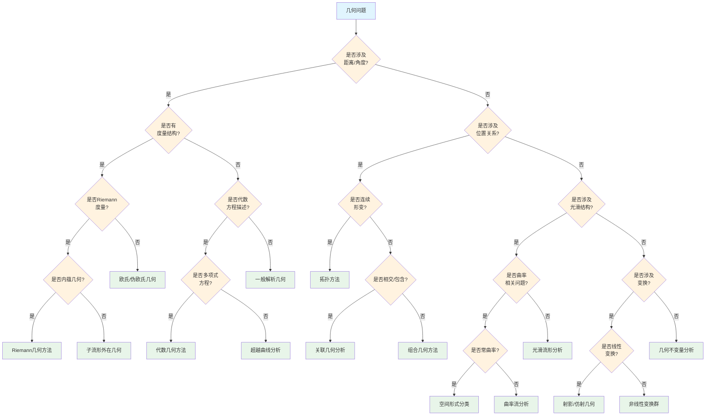

# 几何问题识别决策树

## 概述

本文档提供几何学问题的系统性识别与分类决策树，帮助确定几何问题的类型并选择适当的几何方法。

---

## 决策树根节点

**根节点：几何问题类型识别**

几何问题根据研究的核心对象和性质分为四大类：

- 度量计算问题
- 位置关系问题
- 变换分析问题
- 性质判定问题

---

## Mermaid决策树图

---

## 决策节点详细说明

### 第一层判断：度量存在性

| 条件 | 判断标准 | 后续路径 |
|------|----------|----------|
| 涉及距离/角度 | 问题需要度量计算 | 度量几何路径 |
| 不涉及度量 | 问题关注定性性质 | 拓扑/组合路径 |

**度量结构类型**：

- Riemann度量：光滑流形上的内蕴度量
- Finsler度量：更一般的度量结构
- 欧氏度量：标准的内积诱导度量

### 第二层判断：几何结构来源

| 结构类型 | 特征 | 典型对象 |
|----------|------|----------|
| 内蕴几何 | 不依赖嵌入 | 测地线、Gauss曲率(2D) |
| 外在几何 | 依赖嵌入 | 第二基本形式、平均曲率 |
| 代数定义 | 多项式方程 | 代数簇、代数曲线 |
| 超越定义 | 非代数方程 | 超越曲线、极小曲面 |

### 第三层判断：位置关系类型

| 关系类型 | 特征 | 分析方法 |
|----------|------|----------|
| 连续形变 | 同伦/同胚 | 拓扑学 |
| 相交/包含 | 集合关系 | 关联几何 |
| 组合关系 | 离散配置 | 组合几何 |

### 第四层判断：光滑性与变换

| 判断 | 条件 | 方法 |
|------|------|------|
| 曲率相关 | 曲率计算或分类 | 微分几何 |
| 常曲率 | 曲率为常数 | 空间形式理论 |
| 线性变换 | 保持直线的变换 | 射影/仿射几何 |
| 非线性变换 | 一般变换群 | Lie群方法 |

---

## 叶节点处理方法

### 1. 欧氏/伪欧氏几何

**适用场景**：

- 初等几何问题
- Minkowski空间（相对论）

**核心工具**：

- 内积：(u,v) = Σuᵢvᵢ（欧氏）或含符号（伪欧氏）
- 距离公式
- 角度公式

**典型问题**：

- 距离最小化
- 角度计算
- 正交投影

### 2. Riemann几何方法

**适用场景**：

- 弯曲空间几何
- 广义相对论

**核心工具**：

- 度量张量 gᵢⱼ
- Christoffel符号
- Riemann曲率张量
- Ricci张量、标量曲率

**典型问题**：

- 测地线方程
- 曲率计算
- 体积元计算

### 3. 代数几何方法

**适用场景**：

- 多项式方程定义的簇
- 代数曲线/曲面的分类

**核心工具**：

- 仿射簇与射影簇
- 坐标环
- Hilbert零点定理
- 层上同调

**典型问题**：

- 簇的奇点分析
- 相交理论
- 双有理分类

### 4. 拓扑方法

**适用场景**：

- 连续形变下的不变性
- 连通性、紧致性

**核心工具**：

- 同伦群
- 同调群
- 上同调环
- Euler示性数

**典型问题**：

- Brouwer不动点定理
- 毛球定理
- 维数不变性

### 5. 微分几何方法

**适用场景**：

- 光滑流形上的分析
- 曲率相关问题

**核心工具**：

- 外微分形式
- 联络与曲率
- 指数映射
- Jacobi场

**典型问题**：

- Gauss-Bonnet定理
- 比较几何
- Morse理论

### 6. 空间形式分类

**适用场景**：

- 常曲率空间分类
- 均匀空间

**空间形式**：

| 曲率 | 单连通完备空间 | 模型 |
|------|----------------|------|
| K > 0 | 球面 Sⁿ | 球面几何 |
| K = 0 | 欧氏空间 ℝⁿ | 欧氏几何 |
| K < 0 | 双曲空间 Hⁿ | 双曲几何 |

---

## 典型决策路径示例

### 示例1：证明球面S²与环面T²不同胚

**路径**：几何问题 → 距离/角度(否) → 位置关系(是) → 连续形变(是) → 拓扑方法

**分析过程**：

1. 同胚是拓扑概念，使用拓扑不变量
2. 计算基本群：π₁(S²) = 0，π₁(T²) = ℤ²
3. 基本群不同构
4. 结论：S²与T²不同胚

### 示例2：求椭球面x²/a² + y²/b² + z²/c² = 1的Gauss曲率

**路径**：几何问题 → 距离/角度(是) → 度量结构(是) → Riemann度量(是) → 外在几何 → 微分几何方法

**分析过程**：

1. 椭球面是ℝ³中的光滑曲面
2. 参数化：r(u,v) = (a·cos u·sin v, b·sin u·sin v, c·cos v)
3. 计算第一基本形式
4. 计算第二基本形式
5. Gauss曲率 K = (LN - M²)/(EG - F²)

### 示例3：分类所有射影平面上的二次曲线

**路径**：几何问题 → 距离/角度(是) → 度量结构(否) → 代数方程(是) → 多项式方程(是) → 代数几何方法

**分析过程**：

1. 射影平面上的二次曲线由二次型定义
2. 二次型的射影分类
3. 非退化：圆锥曲线（椭圆、抛物线、双曲线在射影下等价）
4. 退化：两条直线（实或虚）或重直线

---

## 常见错误与注意事项

### 错误1：混淆内在与外在曲率

**问题**：认为Gauss曲率依赖嵌入
**事实**：Gauss曲率是内蕴的（Gauss绝妙定理）
**避免**：理解曲率张量的协变性质

### 错误2：忽视代数闭域假设

**问题**：在实数域上讨论代数簇的不可约性
**后果**：实数域上不可约可能在复数域可约
**避免**：明确基域，必要时考虑复化

### 错误3：混淆拓扑与微分结构

**问题**：同胚的流形认为微分同胚
**反例**：Milnor怪球（与S⁷同胚但不同胚）
**避免**：明确区分拓扑、PL、光滑范畴

### 错误4：错误使用坐标图

**问题**：在流形计算中超出坐标卡范围
**后果**：计算无意义或错误
**避免**：验证坐标覆盖，使用单位分解

### 错误5：忽略定向性

**问题**：在非定向流形上定义整体体积形式
**后果**：定义不存在
**避免**：先验证定向性，或使用密度

---

## 快速参考表

| 问题特征 | 决策路径 | 关键工具 |
|----------|----------|----------|
| 距离/角度计算 | 度量几何 | 内积、度量张量 |
| 多项式方程 | 代数几何 | Hilbert零点、层上同调 |
| 连续形变 | 拓扑学 | 同伦、同调 |
| 曲率计算 | 微分几何 | 联络、曲率张量 |
| 常曲率分类 | 空间形式 | 齐性空间理论 |
| 线性变换 | 射影几何 | 变换群、不变量 |
| 光滑结构 | 微分流形 | 切丛、外微分 |

---

## 相关文档

- [01-代数问题识别决策树](./01-代数问题识别决策树.md)
- [04-拓扑问题识别决策树](./04-拓扑问题识别决策树.md)
- [10-空间分类决策树](./10-空间分类决策树.md)
