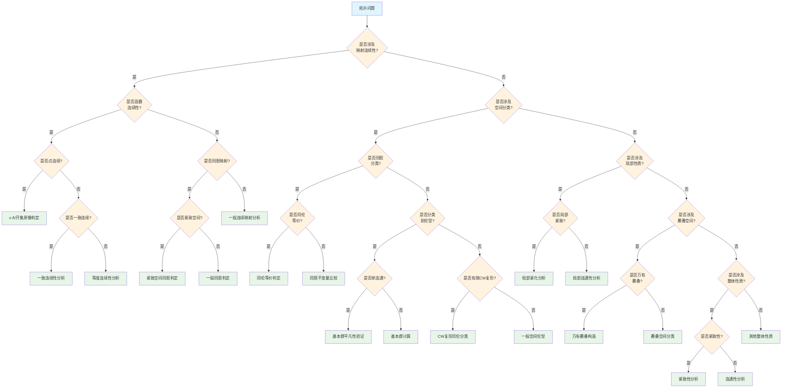

# 拓扑问题识别决策树

## 概述

本文档提供拓扑学问题的系统性识别与分类决策树，帮助确定拓扑问题的类型并选择适当的拓扑方法。

---

## 决策树根节点

**根节点：拓扑问题类型识别**

拓扑问题根据研究的核心概念和问题类型分为四大类：
- 连续性判定问题
- 同胚分类问题
- 不变量计算问题
- 覆叠分析问题

---

## Mermaid决策树图

---

## 决策节点详细说明

### 第一层判断：映射连续性

| 条件 | 判断标准 | 后续路径 |
|------|----------|----------|
| 涉及映射连续性 | 问题关注函数或映射的连续性 | 连续性分析路径 |
| 不涉及映射 | 问题关注空间本身的性质 | 空间性质路径 |

**连续性等价条件**：
- 开集原像为开集
- 闭集原像为闭集
- 邻域定义
- 序列定义（第一可数空间）

### 第二层判断：连续性类型

| 连续性类型 | 定义特征 | 判定方法 |
|------------|----------|----------|
| 点连续 | 在特定点连续 | ε-δ或邻域 |
| 一致连续 | δ与点无关 | 序列定义或直接验证 |
| 等度连续 | 函数族的统一连续性 | Arzelà-Ascoli定理 |

### 第三层判断：同胚vs同伦

| 等价关系 | 强度 | 不变量 |
|----------|------|--------|
| 同胚 | 最强 | 所有拓扑性质 |
| 同伦等价 | 中等 | 同伦群、同调群 |
| 同调等价 | 较弱 | 同调群 |

### 第四层判断：局部vs整体性质

| 性质类型 | 定义 | 典型例子 |
|----------|------|----------|
| 局部性质 | 每点有邻域具有某性质 | 局部紧致、局部连通 |
| 整体性质 | 空间整体具有某性质 | 紧致、连通、道路连通 |

### 第五层判断：覆叠空间类型

| 覆叠类型 | 特征 | 应用 |
|----------|------|------|
| 万有覆叠 | 单连通的覆叠 | 基本群与覆叠变换 |
| 正则覆叠 | 覆叠变换群可迁 | 正规子群对应 |
| 一般覆叠 | 任意 | 子群分类定理 |

---

## 叶节点处理方法

### 1. 开集原像判定

**核心方法**：
- 验证对任意开集V ⊆ Y，f⁻¹(V)在X中开
- 或验证子基元素的原像开

**步骤**：
1. 确定拓扑空间的基或子基
2. 计算关键集合的原像
3. 验证原像的开/闭性

### 2. 同胚判定

**必要条件**：
- 双射且连续
- 逆映射连续
- 保持所有拓扑不变量

**关键不变量**：
- 紧致性
- 连通性
- Hausdorff性质
- 维数

### 3. 基本群计算

**核心工具**：
- Van Kampen定理
- 覆叠空间理论
- 形变收缩

**典型计算**：
- Sⁿ (n ≥ 2): π₁ = 0
- S¹: π₁ = ℤ
- Tⁿ: π₁ = ℤⁿ
- 实射影空间 RPⁿ: π₁ = ℤ/2 (n ≥ 2)

### 4. 同调群计算

**核心工具**：
- Mayer-Vietoris序列
- 胞腔同调
- 奇异同调

**典型计算**：
- H₀(X): 连通分支数
- H₁(X): 基本群的Abel化
- Hₙ(Sⁿ): ℤ
- Hₖ(Sⁿ) (k ≠ 0,n): 0

### 5. 覆叠空间分类

**分类定理**：
连通局部道路连通空间的覆叠 ⟷ π₁的子群（共轭类）

**构造方法**：
1. 确定基本群
2. 选择子群
3. 构造覆叠空间
4. 验证万有覆叠的单连通性

### 6. 紧致性分析

**等价条件**：
- 开覆盖有有限子覆盖
- 闭集族有限交性质
- 序列紧致（度量空间）
- 极限点紧致（T₁空间）

**应用**：
- 极值定理
- 一致连续性
- 乘积空间的紧致性

---

## 典型决策路径示例

### 示例1：证明ℝⁿ与ℝᵐ不同胚(n≠m)

**路径**：拓扑问题 → 映射连续性(否) → 空间分类(是) → 同胚分类(是) → 同胚不变量比较

**分析过程**：
1. 问题是关于空间同胚分类
2. 选择适当的不变量：切除维数
3. Hₙ(ℝⁿ, ℝⁿ\{0}) = ℤ
4. Hₙ(ℝᵐ, ℝᵐ\{0}) = 0 (n ≠ m)
5. 同调群不同 ⇒ 不同胚

### 示例2：计算8字形空间的基本群

**路径**：拓扑问题 → 映射连续性(否) → 空间分类(否) → 局部性质(是) → 局部紧致(是) → 基本群计算

**分析过程**：
1. 识别8字形为两个S¹的楔和
2. 应用Van Kampen定理
3. 每个S¹贡献ℤ
4. 交集为单点，基本平凡
5. π₁ = ℤ * ℤ（自由积）

### 示例3：判断S¹的覆叠空间分类

**路径**：拓扑问题 → 映射连续性(否) → 局部性质(否) → 覆叠空间(是) → 覆叠空间分类

**分析过程**：
1. π₁(S¹) = ℤ
2. ℤ的子群：nℤ（n = 0,1,2,...）
3. n = 0: 万有覆叠 ℝ → S¹
4. n ≥ 1: n重覆叠 S¹ → S¹ (z ↦ zⁿ)
5. 所有连通覆叠由此分类

---

## 常见错误与注意事项

### 错误1：混淆连续与开/闭映射

**问题**：连续映射误认为开映射或闭映射
**反例**：常值映射是连续的，但通常不是开的
**避免**：分别验证连续性、开性、闭性

### 错误2：忽视Hausdorff条件

**问题**：在非Hausdorff空间中使用紧致集的闭性
**后果**：紧致子集可能不闭
**避免**：明确验证分离公理

### 错误3：混淆道路连通与连通

**问题**：连通误认为道路连通
**反例**：拓扑学家的正弦曲线连通但非道路连通
**避免**：验证道路的存在性

### 错误4：错误应用Van Kampen定理

**问题**：交集不道路连通时使用Van Kampen
**后果**：结论错误
**避免**：验证交集的道路连通性

### 错误5：混淆覆叠与局部同胚

**问题**：局部同胚误认为覆叠映射
**反例**：指数映射 ℝ²\{0} → ℝ²\{0} 是局部同胚但非覆叠
**避免**：验证均匀覆盖性质

---

## 快速参考表

| 问题类型 | 关键判定 | 主要工具 |
|----------|----------|----------|
| 函数连续性 | 开集原像 | 定义验证 |
| 同胚判定 | 双向连续双射 | 拓扑不变量 |
| 同伦等价 | 形变收缩 | 同伦群 |
| 基本群 | Van Kampen | 覆叠空间 |
| 同调群 | Mayer-Vietoris | 胞腔同调 |
| 覆叠分类 | 子群对应 | 覆叠变换 |
| 紧致性 | 有限覆盖 | 极值定理 |
| 连通性 | 分离性 | 道路提升 |

---

## 相关文档

- [03-几何问题识别决策树](./03-几何问题识别决策树.md)
- [10-空间分类决策树](./10-空间分类决策树.md)
- [09-代数对象分类树](./09-代数对象分类树.md)
