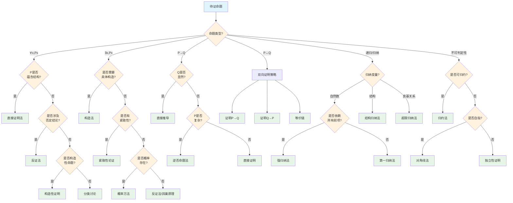

# 证明方法选择决策树

## 概述

本文档提供数学证明中方法选择的系统性决策树，帮助根据待证命题的类型和结构选择最有效的证明策略。

---

## 决策树根节点

**根节点：待证命题类型识别**

数学命题根据逻辑结构可分为六类：
- 全称命题 ∀x,P(x)
- 存在命题 ∃x,P(x)
- 蕴含命题 P→Q
- 等价命题 P↔Q
- 递归/归纳命题
- 不可判定性命题

---

## Mermaid决策树图

---

## 决策节点详细说明

### 第一层判断：命题类型

| 命题类型 | 逻辑形式 | 典型证明方法 |
|----------|----------|--------------|
| 全称命题 | ∀x, P(x) | 直接证明、反证法 |
| 存在命题 | ∃x, P(x) | 构造法、非构造性证明 |
| 蕴含命题 | P→Q | 直接证明、逆否命题 |
| 等价命题 | P↔Q | 双向证明、等价链 |
| 递归命题 | P(n)依赖于P(k), k<n | 归纳法 |
| 不可判定性 | - | 对角线法、归约法 |

### 第二层判断：命题结构特征

| 特征 | 判定标准 | 推荐方法 |
|------|----------|----------|
| 蕴含结构 | 结论本身为蕴含式 | 直接证明 |
| 涉及否定 | 结论含"非"、"不存在"等 | 反证法 |
| 构造性 | 需要给出具体对象 | 构造法 |
| 紧致性 | 涉及有限覆盖 | 紧致性论证 |
| 概率存在 | 只需证明存在概率>0 | 概率方法 |

### 第三层判断：归纳法变体

| 归纳类型 | 适用场景 | 归纳假设 |
|----------|----------|----------|
| 第一归纳法 | P(n)只依赖P(n-1) | P(n-1)成立 |
| 强归纳法 | P(n)依赖多个前项 | P(k)对所有k<n成立 |
| 结构归纳法 | 归纳于数据结构 | 子结构满足性质 |
| 超限归纳法 | 良基关系上的归纳 | 所有前驱满足 |

### 第四层判断：不可判定性证明

| 方法 | 适用场景 | 核心思想 |
|------|----------|----------|
| 对角线法 | 自指问题 | 构造不在列表中的元素 |
| 归约法 | 可归约到已知不可判定问题 | 保持可判定性 |
| 独立性证明 | 与公理系统独立 | 构造不同模型 |

---

## 叶节点处理方法

### 1. 直接证明法

**基本形式**：
- 假设前提P成立
- 通过逻辑推理得到Q
- 结论P→Q

**适用场景**：
- 蕴含命题
- 全称命题（直接验证）
- 等价命题的单向

**步骤**：
1. 明确前提和结论
2. 寻找中间步骤
3. 建立推理链条

### 2. 反证法

**基本形式**：
- 假设结论不成立（¬Q）
- 推出矛盾
- 结论Q必然成立

**适用场景**：
- 否定性命题
- 存在性命题（证明不存在）
- 唯一性证明

**经典例子**：
- √2的无理性
- 素数无穷多
- 实数不可数

### 3. 构造性证明

**基本形式**：
- 显式构造满足条件的对象
- 验证构造的正确性

**适用场景**：
- 存在性命题
- 算法设计
- 显式解的给出

**与非构造性证明对比**：

| 特征 | 构造性 | 非构造性 |
|------|--------|----------|
| 给出实例 | 是 | 否 |
| 计算复杂度 | 通常可计算 | 可能不可计算 |
| 使用排中律 | 避免 | 可用 |

### 4. 逆否命题法

**原理**：P→Q 等价于 ¬Q→¬P

**适用场景**：
- ¬Q比P更易处理
- ¬P比Q更易证明
- 逆否形式更自然

**例子**：
- 原命题：若n²偶，则n偶
- 逆否：若n奇，则n²奇

### 5. 数学归纳法

**第一归纳法**：
1. 基础：P(0)成立
2. 归纳：P(n)→P(n+1)
3. 结论：∀n, P(n)

**强归纳法**：
1. 基础：P(0)成立
2. 归纳：P(0)∧...∧P(n)→P(n+1)
3. 结论：∀n, P(n)

### 6. 对角线法

**核心思想**：
构造一个与列表中所有元素都不同的元素

**经典应用**：
- Cantor：实数不可数
- Turing：停机问题不可判定
- Gödel：不完备定理

### 7. 归约法

**原理**：
将问题A归约到已知不可判定的问题B
- 若B可判定，则A可判定
- 若A不可判定，则B不可判定

**归约类型**：
- 多一归约 (many-one)
- Turing归约
- 多项式时间归约

---

## 典型决策路径示例

### 示例1：证明√2是无理数

**路径**：待证命题 → ∀x类型(否) → 存在类型(否) → 蕴含(否) → 等价(否) → 递归(否) → 不可判定性(否) → 涉及否定(是) → 反证法

**分析过程**：
1. 假设√2 = p/q（最简分数）
2. 平方得2q² = p²
3. p²偶 ⇒ p偶，设p = 2k
4. 代入得2q² = 4k² ⇒ q² = 2k²
5. q²偶 ⇒ q偶
6. p,q均偶，与最简矛盾
7. 结论：√2无理

### 示例2：证明素数有无穷多个

**路径**：待证命题 → ∀x(否) → 存在(否) → 蕴含(否) → 等价(否) → 递归(否) → 涉及否定(是) → 反证法

**分析过程**：
1. 假设素数有限：p₁, p₂, ..., pₙ
2. 构造N = p₁p₂...pₙ + 1
3. N不被任何pᵢ整除
4. N要么素数，要么有新的素因子
5. 与假设矛盾
6. 结论：素数无穷

### 示例3：证明任意图G，存在二分划使两边内部边≤|E|/2

**路径**：待证命题 → ∀x(是) → 蕴含结构(否) → 涉及否定(否) → 构造性(否) → 概率存在(是) → 概率方法

**分析过程**：
1. 随机二分划：每点独立以1/2概率分到A或B
2. 边e为内部边的概率 = 1/2
3. 期望内部边数 = |E|/2

4. 存在二分划使内部边≤期望
5. 结论成立

---

## 常见错误与注意事项

### 错误1：混淆充分与必要条件

**问题**：证明P→Q时证明Q→P
**避免**：明确区分前提和结论

### 错误2：归纳基础缺失

**问题**：数学归纳法缺少基础情形
**后果**：归纳链条断裂
**避免**：始终验证P(0)或P(1)

### 错误3：循环论证

**问题**：用待证命题证明自身
**避免**：检查证明的独立性

### 错误4：反证法假设不当

**问题**：假设过于具体或不够
**避免**：精确否定结论

### 错误5：构造不完全

**问题**：构造了对象但未验证所有条件
**避免**：逐条验证构造的正确性

---

## 快速参考表

| 命题类型 | 首选方法 | 备选方法 |
|----------|----------|----------|
| ∀x,P(x) | 直接证明 | 反证法 |
| ∃x,P(x) | 构造法 | 非构造性证明 |
| P→Q | 直接证明 | 逆否命题 |
| P↔Q | 双向证明 | 等价链 |
| 递归命题 | 归纳法 | 结构归纳 |
| 不可判定性 | 对角线法 | 归约法 |

---

## 相关文档

- [06-归纳法变体选择树](./06-归纳法变体选择树.md)
- [07-存在性证明策略树](./07-存在性证明策略树.md)
- [01-代数问题识别决策树](./01-代数问题识别决策树.md)
