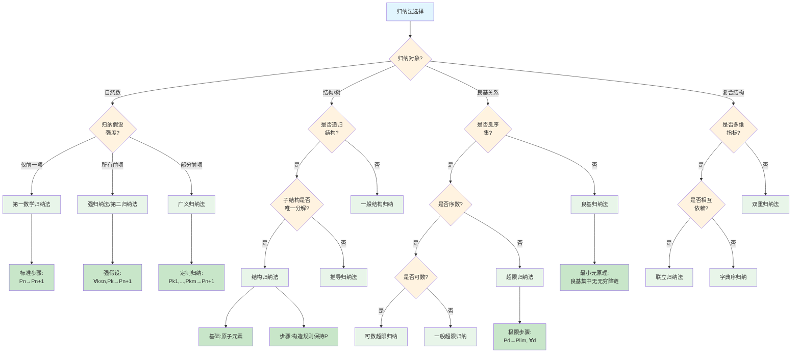

# 归纳法变体选择树

## 概述

本文档提供数学归纳法各种变体的系统性选择决策树，帮助根据问题特征选择最合适的归纳法类型。

---

## 决策树根节点

**根节点：归纳对象与归纳假设识别**

归纳法的核心在于选择适当的：
- 归纳变量（对什么进行归纳）
- 归纳假设（假设什么成立）
- 归纳步骤（如何推导下一步）

---

## Mermaid决策树图



---

## 决策节点详细说明

### 第一层判断：归纳对象类型

| 对象类型 | 特征 | 适用归纳法 |
|----------|------|------------|
| 自然数 | 离散、良序 | 数学归纳法 |
| 结构/树 | 递归定义 | 结构归纳法 |
| 良基关系 | 无无穷降链 | 良基归纳法 |
| 复合结构 | 多维或多变量 | 双重/联立归纳 |

### 第二层判断：归纳假设强度

| 假设类型 | 假设内容 | 适用场景 |
|----------|----------|----------|
| 仅前一项 | P(n-1) | 递推关系简单 |
| 所有前项 | ∀k<n, P(k) | 依赖多个前项 |
| 部分前项 | P(k₁), P(k₂), ... | 特定依赖模式 |

### 第三层判断：结构特征

| 特征 | 判定 | 方法 |
|------|------|------|
| 唯一分解 | 结构有唯一分解方式 | 标准结构归纳 |
| 非唯一分解 | 多种构造方式 | 推导归纳法 |

### 第四层判断：良基关系类型

| 关系类型 | 例子 | 归纳形式 |
|----------|------|----------|
| 良序集 | ℕ, 字典序 | 标准归纳 |
| 可数序数 | ω, ω·2 | 可数超限归纳 |
| 不可数序数 | ω₁ | 一般超限归纳 |
| 一般良基 | 树序 | 良基归纳 |

---

## 叶节点处理方法

### 1. 第一数学归纳法

**标准形式**：

```

基础：P(0)成立
归纳：若P(n)成立，则P(n+1)成立
结论：∀n∈ℕ, P(n)

```

**适用场景**：
- 等式证明
- 求和公式
- 简单递推

**例子**：证明1+2+...+n = n(n+1)/2

### 2. 强归纳法（第二归纳法）

**标准形式**：

```

基础：P(0)成立
归纳：若P(k)对所有k≤n成立，则P(n+1)成立
结论：∀n∈ℕ, P(n)

```

**适用场景**：
- 算术基本定理（素因数分解）
- 复杂递推
- 分治算法分析

**与第一归纳法等价性**：
可相互推导，但强归纳法在证明中更方便

### 3. 结构归纳法

**标准形式**：

```

基础：对原子元素，P成立
归纳：若P对子结构成立，则P对复合结构成立
结论：P对所有结构成立

```

**适用结构**：
- 树结构
- 逻辑公式
- 程序语法
- 代数项

**例子**：证明所有命题公式的括号匹配

### 4. 良基归纳法

**原理**：
在良基关系(W, ≺)上，若对任意x，P(y)对所有y≺x成立⇒P(x)成立，则P对所有x成立。

**关键性质**：
- 良基性：无无穷降链
- 最小元存在

**应用**：
- 递归函数终止性
- 程序验证
- 博弈分析

### 5. 超限归纳法

**标准形式**：

```

基础：P(0)成立
后继：若P(α)成立，则P(α+1)成立
极限：若P(β)对所有β<λ成立(λ极限序数)，则P(λ)成立
结论：对所有序数α, P(α)

```

**适用场景**：
- 集合论证明
- Borel层次
- 超限递归定义

### 6. 双重归纳法

**标准形式**：

```

对(m,n)按字典序归纳
基础：P(0,0)
归纳：假设P(k,l)对所有(k,l)<(m,n)，证P(m,n)

```

**适用场景**：
- Ackermann函数
- 二维递推
- 网格上的性质

### 7. 联立归纳法

**形式**：
同时证明多个相关命题P₁, P₂, ..., Pₖ

**归纳假设**：
假设所有Pᵢ对前项成立

**适用场景**：
- 互递归定义
- 程序语义
- 类型系统

---

## 典型决策路径示例

### 示例1：证明每个大于1的自然数可唯一分解为素数乘积

**路径**：归纳法选择 → 自然数 → 归纳假设强度(所有前项) → 强归纳法

**证明过程**：
1. **基础**：n=2是素数，分解唯一
2. **归纳假设**：假设对所有k≤n，素因数分解唯一
3. **归纳步骤**：
   - n+1要么是素数，分解唯一
   - 要么是合数，n+1=ab，其中2≤a,b≤n
   - 由归纳假设，a和b的分解唯一
   - 故n+1的分解唯一
4. **结论**：由强归纳法，所有n>1可唯一分解

### 示例2：证明所有二叉树的节点数 = 边数 + 1

**路径**：归纳法选择 → 结构/树 → 递归结构(是) → 子结构唯一分解(是) → 结构归纳法

**证明过程**：
1. **基础**：空树，节点数=0，边数=-1（约定）或单节点树
   - 单节点：节点数=1，边数=0，成立
2. **归纳假设**：假设所有子树满足节点数 = 边数 + 1
3. **归纳步骤**：
   - 树T = Node(左子树L, 右子树R)
   - 节点数(T) = 1 + 节点数(L) + 节点数(R)
   - 边数(T) = 2 + 边数(L) + 边数(R)
   - 由归纳假设，节点数(L) = 边数(L) + 1
   - 节点数(R) = 边数(R) + 1
   - 故节点数(T) = 1 + (边数(L)+1) + (边数(R)+1) = 边数(T) + 1
4. **结论**：由结构归纳法，所有二叉树满足

### 示例3：证明序数上的递归定义良定

**路径**：归纳法选择 → 良基关系 → 良序集(是) → 序数(是) → 可数/不可数(一般) → 超限归纳法

**证明过程**：
1. **基础**：在0上定义
2. **后继步骤**：假设在α上定义，定义在α+1上
3. **极限步骤**：假设在所有β<λ上定义，定义在极限序数λ上
4. **结论**：由超限归纳，定义对所有序数良定

---

## 常见错误与注意事项

### 错误1：归纳基础不当

**问题**：基础情形选择错误或不完整
**例子**：证明斐波那契性质时需要n=0和n=1两个基础
**避免**：检查递推关系需要多少前项

### 错误2：归纳假设不完整

**问题**：强归纳时只假设P(n)而非∀k≤n, P(k)
**后果**：归纳步骤无法完成
**避免**：明确写出完整的归纳假设

### 错误3：结构归纳遗漏情况

**问题**：结构归纳时遗漏某些构造规则
**例子**：二叉树归纳遗漏空树情况
**避免**：枚举所有构造规则

### 错误4：良基性未验证

**问题**：在良基归纳中未验证关系的良基性
**后果**：归纳原理不成立
**避免**：验证无无穷降链

### 错误5：超限归纳遗漏极限步骤

**问题**：只对后继序数证明，忽略极限序数
**后果**：无法覆盖所有序数
**避免**：明确处理极限情形

---

## 快速参考表

| 问题特征 | 归纳法类型 | 关键步骤 |
|----------|------------|----------|
| 自然数+简单递推 | 第一归纳法 | P(n)→P(n+1) |
| 自然数+多依赖 | 强归纳法 | ∀k≤n,P(k)→P(n+1) |
| 递归结构 | 结构归纳法 | 原子+构造规则 |
| 一般良基集 | 良基归纳法 | 最小元原理 |
| 序数 | 超限归纳法 | +极限步骤 |
| 二维/多变量 | 双重归纳法 | 字典序 |
| 互递归 | 联立归纳法 | 多命题同时证 |

---

## 相关文档

- [05-证明方法选择决策树](./05-证明方法选择决策树.md)
- [07-存在性证明策略树](./07-存在性证明策略树.md)
- [01-代数问题识别决策树](./01-代数问题识别决策树.md)
