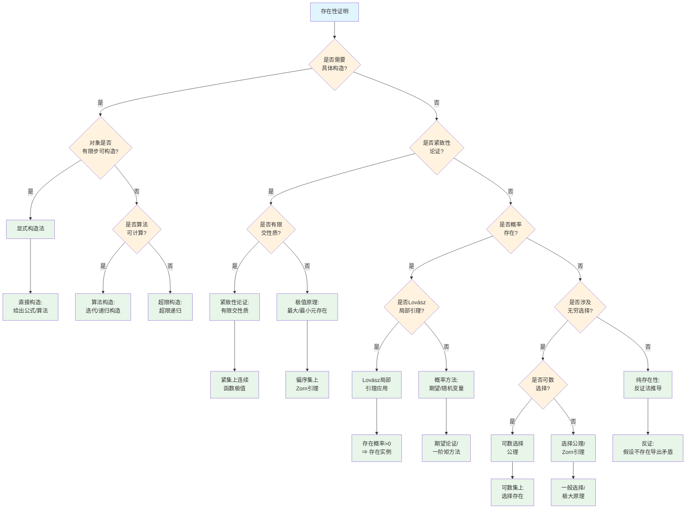

# 存在性证明策略树

## 概述

本文档提供数学存在性命题证明的系统性策略决策树，帮助选择构造性或非构造性证明方法。

---

## 决策树根节点

**根节点：存在性证明策略选择**

存在性证明根据是否需要显式构造、是否涉及无穷选择、是否使用概率方法等分为四大类：
- 构造性证明
- 非构造性证明（分析性）
- 基于选择公理的证明
- 概率方法证明

---

## Mermaid决策树图

---

## 决策节点详细说明

### 第一层判断：构造性需求

| 条件 | 判断标准 | 后续路径 |
|------|----------|----------|
| 需要具体构造 | 要求给出显式公式或算法 | 构造性证明路径 |
| 不需要具体构造 | 只要求证明存在 | 非构造性证明路径 |

**构造性与非构造性对比**：

| 特征 | 构造性证明 | 非构造性证明 |
|------|------------|--------------|
| 给出实例 | 是 | 否 |
| 计算复杂度 | 通常可计算 | 可能不可计算 |
| 使用排中律 | 受限 | 自由使用 |
| 信息获取 | 完整信息 | 存在性信息 |

### 第二层判断：可构造性程度

| 程度 | 特征 | 方法 |
|------|------|------|
| 有限步构造 | 显式公式 | 直接构造 |
| 算法可计算 | 迭代/递归 | 算法构造 |
| 超限构造 | 需要超限步骤 | 超限递归 |

### 第三层判断：紧致性论证

| 紧致性类型 | 特征 | 应用 |
|------------|------|------|
| 有限交性质 | 闭集族任意有限交非空 | 整体交非空 |
| 极值原理 | 紧集上连续函数 | 最大/最小值存在 |

### 第四层判断：概率方法

| 方法类型 | 核心思想 | 适用场景 |
|----------|----------|----------|
| 一阶矩方法 | E[X] > 0 ⇒ 存在正概率 | 存在性下界 |
| Lovász局部引理 | 依赖图稀疏时正概率 | 组合存在性 |
| 二阶矩方法 | Var[X]控制 | 大量存在 |

### 第五层判断：选择公理强度

| 公理类型 | 强度 | 应用 |
|----------|------|------|
| 可数选择 | 弱 | 分析中序列选择 |
| 依赖选择 | 中等 | 递归构造 |
| 完全选择 | 强 | Hamel基、非可测集 |

---

## 叶节点处理方法

### 1. 显式构造法

**核心思想**：
直接给出满足条件的对象的具体表达式

**步骤**：
1. 分析问题结构
2. 猜测或推导显式公式
3. 验证公式满足所有条件

**例子**：
- 构造方程的根：求根公式
- 构造基：Gram-Schmidt正交化
- 构造函数：插值公式

### 2. 算法构造法

**核心思想**：
通过算法迭代或递归构造对象

**步骤**：
1. 定义初始状态
2. 设计迭代/递归规则
3. 证明收敛/终止
4. 验证极限满足条件

**例子**：
- Newton迭代法求根
- 压缩映射不动点
- 梯度下降收敛

### 3. 紧致性论证

**有限交性质**：
若闭集族{Fᵢ}具有有限交性质，则在紧空间中∩Fᵢ ≠ ∅

**极值原理**：
紧集上连续函数达到最大值和最小值

**应用**：
- 函数空间中的存在性
- 变分问题的解
- 测度构造

### 4. Zorn引理应用

**Zorn引理**：
偏序集中每个链有上界，则存在极大元

**应用步骤**：
1. 定义适当的偏序
2. 验证链有上界
3. 证明极大元满足要求

**例子**：
- 向量空间的基存在
- 理想存在极大理想
- 域的代数闭包

### 5. 概率方法

**一阶矩方法**：
若E[X] > 0，则存在实例使X > 0

**Lovász局部引理**：
若事件Aᵢ相互依赖稀疏，且P(Aᵢ) ≤ p，ep(d+1) ≤ 1，则P(∩¬Aᵢ) > 0

**应用**：
- Ramsey数下界
- 图着色存在性
- 纠错码存在性

### 6. 反证法推导存在性

**基本形式**：
假设不存在满足条件的对象，导出矛盾

**适用场景**：
- 存在性证明中推导矛盾
- 与其他证明方法结合

**例子**：
- 证明某方程有解
- 证明某集合非空

---

## 典型决策路径示例

### 示例1：证明任意域F存在代数闭包

**路径**：存在性证明 → 需要具体构造(否) → 紧致性论证(否) → 概率存在(否) → 无穷选择(是) → 选择公理/Zorn引理

**证明过程**：
1. 考虑所有F的代数扩张的偏序
2. 验证链的并仍是代数扩张（上界存在）
3. 由Zorn引理，存在极大代数扩张K
4. 证明K代数闭（否则可进一步扩张，与极大性矛盾）
5. 结论：K是F的代数闭包

### 示例2：证明存在n个顶点的图，其色数> k且围长> g

**路径**：存在性证明 → 需要具体构造(否) → 紧致性论证(否) → 概率存在(是) → 是否Lovász局部引理(否) → 概率方法

**证明过程**：
1. 随机图G(n,p)，p = n^{θ-1}（θ<1/g）
2. 计算短圈期望数：E[X] → 0
3. 计算色数下界：E[独立集大小]控制
4. 删除每个短圈的一个顶点
5. 剩余图围长> g，色数仍> k
6. 结论：存在满足条件的图

### 示例3：构造[0,1]上的连续函数逼近给定连续函数

**路径**：存在性证明 → 需要具体构造(是) → 有限步可构造(是) → 显式构造法

**证明过程**：
1. 使用Weierstrass逼近定理
2. 显式构造Bernstein多项式
   Bₙ(f)(x) = Σₖ₌₀ⁿ f(k/n) · C(n,k) · xᵏ(1-x)ⁿ⁻ᵏ
3. 证明Bₙ(f)一致收敛于f
4. 结论：Bernstein多项式提供显式构造

---

## 常见错误与注意事项

### 错误1：混淆存在与可计算

**问题**：存在性证明误认为给出可计算实例
**后果**：无法实际获得对象
**避免**：明确区分存在性信息与构造性信息

### 错误2：紧致性条件不足

**问题**：在非紧空间使用紧致性论证
**后果**：结论不成立
**避免**：验证空间的紧致性

### 错误3：概率方法中期望计算错误

**问题**：期望线性性使用不当
**后果**：概率估计错误
**避免**：仔细验证随机变量的依赖关系

### 错误4：Zorn引理链条件验证不全

**问题**：未验证所有链有上界
**后果**：Zorn引理不适用
**避免**：完整验证偏序条件

### 错误5：超限构造中极限步骤遗漏

**问题**：超限递归只在后继步骤定义
**后果**：极限序数处无定义
**避免**：明确定义极限步骤

---

## 快速参考表

| 问题特征 | 证明策略 | 关键工具 |
|----------|----------|----------|
| 需要显式公式 | 显式构造 | 公式推导 |
| 算法可计算 | 算法构造 | 收敛性证明 |
| 紧集上的函数 | 极值原理 | Weierstrass定理 |
| 偏序极大元 | Zorn引理 | 链的上界 |
| 概率正性 | 概率方法 | 期望/方差 |
| 依赖稀疏 | Lovász局部引理 | 依赖图 |
| 无穷选择 | 选择公理 | AC/DC |
| 纯存在性 | 反证法 | 矛盾推导 |

---

## 相关文档

- [05-证明方法选择决策树](./05-证明方法选择决策树.md)
- [06-归纳法变体选择树](./06-归纳法变体选择树.md)
- [08-计算方法选择树](./08-计算方法选择树.md)
