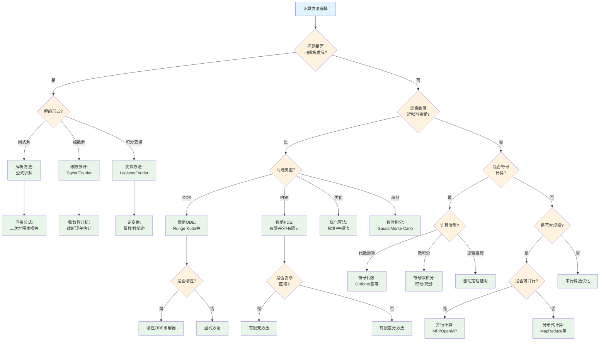

# 计算方法选择树

## 概述

本文档提供数学计算方法选择的系统性决策树，帮助根据问题特征选择解析方法、数值方法或符号计算方法。

---

## 决策树根节点

**根节点：计算方法类型选择**

计算方法根据问题特性和求解需求分为四大类：
- 解析方法
- 数值方法
- 符号计算方法
- 并行/分布式方法

---

## Mermaid决策树图

---

## 决策节点详细说明

### 第一层判断：解析可解性

| 条件 | 判断标准 | 后续路径 |
|------|----------|----------|
| 可解析求解 | 存在闭式解或级数解 | 解析方法 |
| 不可解析求解 | 无已知解析解 | 数值/符号方法 |

**解析可解的典型情况**：
- 线性方程组
- 低次多项式方程（≤4次）
- 线性ODE
- 可分离变量PDE

### 第二层判断：解的形式

| 解的形式 | 特征 | 方法 |
|----------|------|------|
| 闭式解 | 有限表达式 | 直接公式 |
| 级数解 | 无穷级数 | Taylor/Fourier展开 |
| 积分表示 | 含积分形式 | 变换方法 |

### 第三层判断：数值问题类型

| 问题类型 | 数值方法 | 关键考虑 |
|----------|----------|----------|
| ODE | Runge-Kutta, Adams | 刚性、稳定性 |
| PDE | FDM, FEM, 谱方法 | 边界条件、收敛性 |
| 优化 | 梯度法、牛顿法 | 凸性、收敛速度 |
| 积分 | Gauss求积、Monte Carlo | 维度、光滑性 |

### 第四层判断：符号计算类型

| 计算类型 | 特征 | 算法 |
|----------|------|------|
| 代数运算 | 多项式运算 | Gröbner基、结式 |
| 符号微积分 | 积分/微分 | Risch算法、启发式 |
| 逻辑推理 | 定理证明 | 归结、重写 |

### 第五层判断：并行性

| 并行类型 | 特征 | 技术 |
|----------|------|------|
| 数据并行 | 独立数据块 | SIMD, GPU |
| 任务并行 | 独立任务 | 多线程 |
| 分布式 | 大规模集群 | MPI, MapReduce |

---

## 叶节点处理方法

### 1. 解析方法

**直接公式求解**：
- 二次方程：求根公式
- 线性方程组：Cramer法则、Gauss消元
- 线性ODE：特征方程法

**级数展开**：
- Taylor级数：局部近似
- Fourier级数：周期函数
- 渐近展开：大参数行为

**积分变换**：
- Laplace变换：初值问题
- Fourier变换：全空间问题
- 离散变换：DFT, DCT

### 2. 数值ODE方法

**Runge-Kutta方法**：
- RK4：经典四阶
- 嵌入式：步长自适应
- 隐式RK：刚性问题

**多步法**：
- Adams-Bashforth：显式
- Adams-Moulton：隐式
- BDF：刚性问题

**稳定性分析**：
- 绝对稳定性区域
- A-稳定性、L-稳定性
- 刚性比

### 3. 数值PDE方法

**有限差分法(FDM)**：
- 离散网格
- 差分格式（显式/隐式/Crank-Nicolson）
- CFL稳定性条件

**有限元法(FEM)**：
- 变分形式
- 网格剖分
- 基函数选择
- 刚度矩阵组装

**谱方法**：
- Fourier谱方法
- 谱元方法
- 高精度（指数收敛）

### 4. 数值优化

**梯度方法**：
- 最速下降
- 共轭梯度
- 预处理技术

**牛顿型方法**：
- 经典牛顿法
- 拟牛顿法（BFGS, DFP）
- 信赖域方法

**全局优化**：
- 遗传算法
- 模拟退火
- 粒子群优化

### 5. 符号计算方法

**Gröbner基**：
- Buchberger算法
- 多项式理想成员判定
- 消元理论

**符号积分**：
- Risch算法
- 启发式方法
- Liouville定理

**自动定理证明**：
- 归结原理
- 重写系统
- 交互式证明

### 6. 并行/分布式计算

**并行编程模型**：
- 共享内存：OpenMP
- 分布式内存：MPI
- 混合模型

**分布式计算**：
- MapReduce
- Spark
- 云计算平台

**加速技术**：
- GPU计算（CUDA, OpenCL）
- 向量化（SIMD）
- 缓存优化

---

## 典型决策路径示例

### 示例1：求解y' = y, y(0) = 1

**路径**：计算方法选择 → 可解析求解(是) → 解的形式(闭式解) → 解析方法

**分析过程**：
1. 识别为简单线性ODE
2. 分离变量：dy/y = dx
3. 积分：ln|y| = x + C

4. 初始条件：y = eˣ
5. 结论：解析解为y(x) = eˣ

### 示例2：求解二维Poisson方程在复杂区域上的数值解

**路径**：计算方法选择 → 可解析求解(否) → 数值近似可接受(是) → 问题类型(PDE) → 是否复杂区域(是) → 有限元方法

**分析过程**：
1. 变分形式：∫∇u·∇v = ∫fv
2. 区域三角剖分
3. 选择线性Lagrange基函数
4. 组装刚度矩阵和质量矩阵
5. 求解线性系统
6. 误差估计与自适应加密

### 示例3：计算大型稀疏矩阵的特征值

**路径**：计算方法选择 → 可解析求解(否) → 数值近似可接受(是) → 问题类型(优化) → 大规模(是) → 可并行(是) → 并行计算

**分析过程**：
1. 选择Lanczos/Arnoldi迭代方法
2. 利用矩阵稀疏性减少计算
3. 并行化矩阵-向量乘积
4. MPI分布式计算
5. 收敛后提取特征值

---

## 常见错误与注意事项

### 错误1：数值稳定性忽视

**问题**：选择方法时未考虑稳定性
**后果**：数值爆炸或精度损失
**避免**：分析方法的稳定性区域

### 错误2：截断误差与舍入误差混淆

**问题**：未区分两种误差来源
**后果**：错误估计精度
**避免**：分别分析并平衡两种误差

### 错误3：刚性问题使用显式方法

**问题**：刚性ODE使用显式RK
**后果**：极小步长，效率极低
**避免**：识别刚性比，使用隐式方法

### 错误4：条件数忽视

**问题**：求解病态系统未预处理
**后果**：解严重失真
**避免**：估计条件数，使用预处理技术

### 错误5：符号计算复杂度爆炸

**问题**：符号计算中表达式膨胀
**后果**：计算不可行
**避免**：使用简化技术，适时数值化

---

## 快速参考表

| 问题类型 | 推荐方法 | 关键考虑 |
|----------|----------|----------|
| 线性系统 | Gauss消元/迭代法 | 稀疏性、条件数 |
| 特征值问题 | QR/Lanczos | 对称性、稀疏性 |
| 非线性方程 | Newton迭代 | 初值、收敛域 |
| ODE | Runge-Kutta | 刚性、精度 |
| PDE(规则区域) | 有限差分 | 稳定性、收敛性 |
| PDE(复杂区域) | 有限元 | 网格质量 |
| 优化(凸) | 梯度/牛顿法 | 收敛速度 |
| 优化(非凸) | 全局优化 | 计算成本 |
| 符号积分 | Risch算法 | 可积性判定 |
| 多项式理想 | Gröbner基 | 计算复杂度 |

---

## 相关文档

- [05-证明方法选择决策树](./05-证明方法选择决策树.md)
- [07-存在性证明策略树](./07-存在性证明策略树.md)
- [02-分析问题识别决策树](./02-分析问题识别决策树.md)
