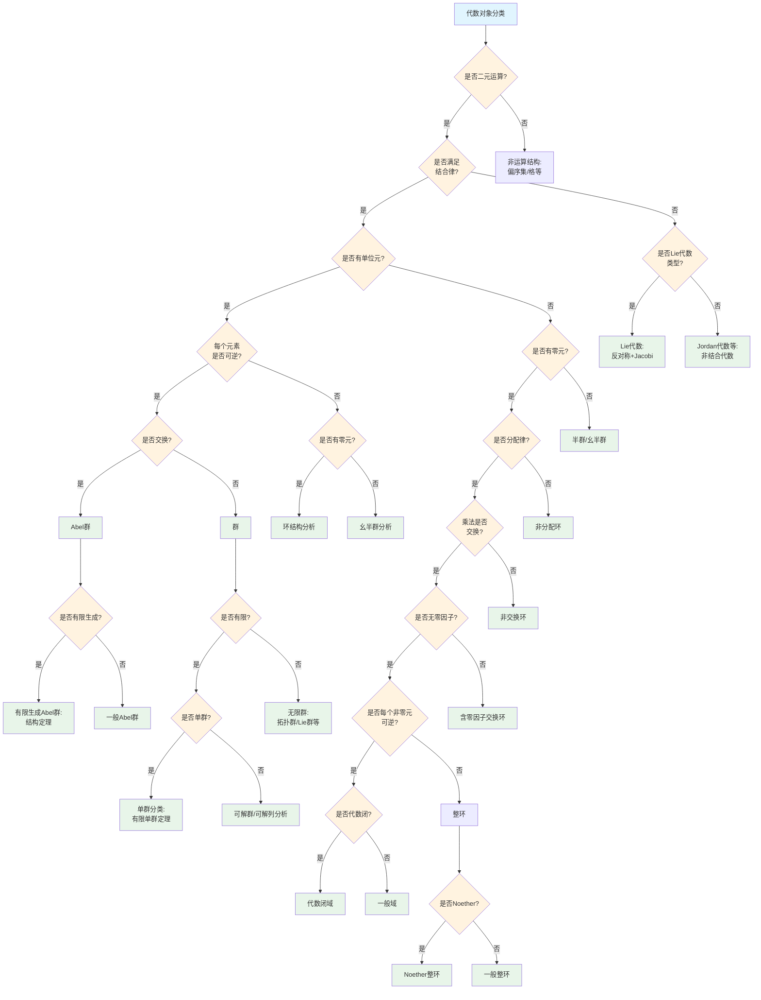
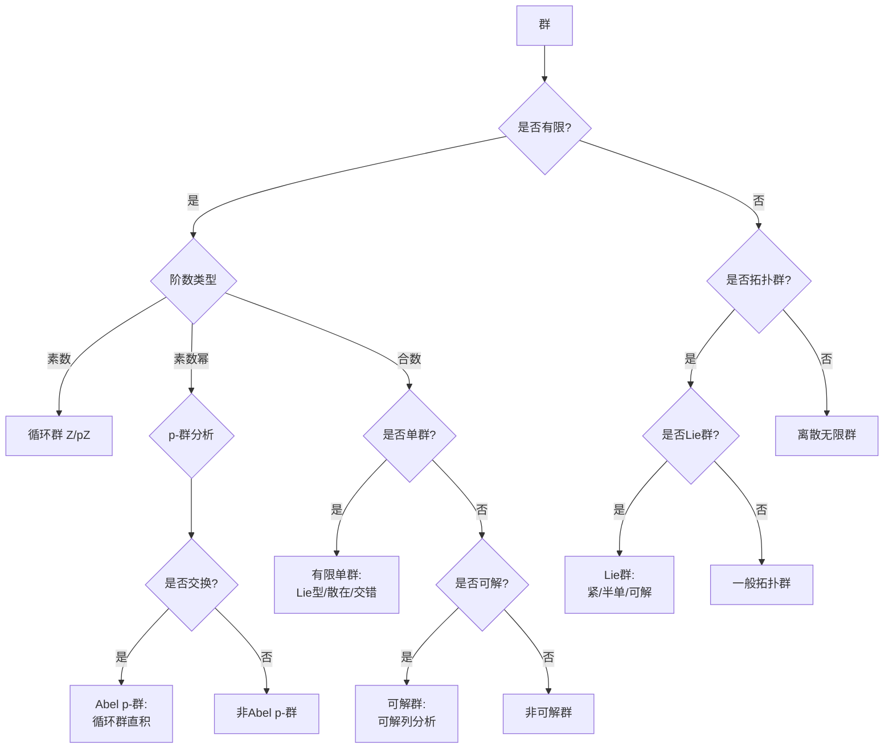
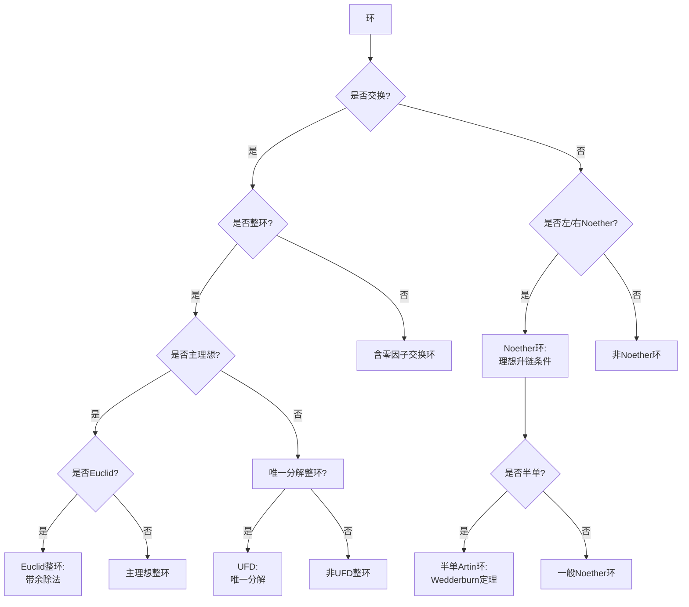

# 代数对象分类决策树

## 概述

本文档提供代数对象（群、环、域、模等）的系统性分类决策树，帮助确定代数结构的类型和性质。

---

## 决策树根节点

**根节点：代数结构分类**

代数结构根据运算性质和公理满足情况分为主要类别：
- 群及其变体
- 环及其变体
- 域及其扩张
- 模与向量空间

---

## Mermaid决策树图

---

## 扩展：群分类详细树

---

## 扩展：环分类详细树

---

## 决策节点详细说明

### 第一层判断：结合律

| 条件 | 代数结构 | 典型例子 |
|------|----------|----------|
| 结合 | 半群→群 | 置换群、矩阵群 |
| 非结合 | Lie代数、Jordan代数 | so(n), 遗传性代数 |

### 第二层判断：单位元与可逆性

| 结构 | 单位元 | 可逆性 | 例子 |
|------|--------|--------|------|
| 群 | 有 | 所有元可逆 | GL(n), Sₙ |
| 幺半群 | 有 | 部分可逆 | (ℕ, +), 矩阵乘法 |
| 半群 | 无 | - | 正整数乘法 |

### 第三层判断：交换性

| 结构 | 交换性 | 分类工具 |
|------|--------|----------|
| Abel群 | 交换 | 有限生成结构定理 |
| 非Abel群 | 不交换 | Sylow理论、表示论 |

### 第四层判断：环的性质

| 性质 | 定义 | 例子 |
|------|------|------|
| 无零因子 | ab=0 ⇒ a=0或b=0 | ℤ, 域 |
| 整环 | 交换无零因子环 | ℤ, k[x] |
| PID | 主理想整环 | ℤ, k[x] |
| UFD | 唯一分解整环 | ℤ[x], k[x,y] |
| Noether | 理想升链条件 | 坐标环、数域整数环 |

---

## 叶节点分类详解

### 1. 群分类

**有限Abel群**：
结构定理：G ≅ ℤ/n₁ℤ × ... × ℤ/nₖℤ，其中n₁|n₂|...|nₖ

**有限单群分类（有限单群定理）**：
- 循环群 ℤ/pZ
- 交错群 Aₙ (n≥5)
- Lie型群（16个无穷族）
- 26个散在单群

**Lie群分类**：
- 紧Lie群：根系统分类
- 半单Lie群：Dynkin图
- 可解Lie群：幂零+环面

### 2. 环分类

**Euclid整环 ⊆ PID ⊆ UFD ⊆ 整环**：
- ℤ: Euclid整环
- ℤ[x]: UFD但非PID
- ℤ[√-5]: 整环但非UFD

**Noether环**：
- Hilbert基定理：R Noether ⇒ R[x] Noether
- 代数几何：坐标环都是Noether环

**半单Artin环（Wedderburn定理）**：
R ≅ M_{n₁}(D₁) × ... × M_{nₖ}(Dₖ)
其中Dᵢ是除环

### 3. 域分类

**域扩张类型**：
- 代数扩张：每个元代数
- 超越扩张：存在超越元
- 正规扩张：分裂域
- Galois扩张：正规+可分

**有限域**：
- 唯一性：q = pⁿ阶域唯一存在，记𝔽_q
- Galois群：Gal(𝔽_{qⁿ}/𝔽_q) ≅ ℤ/nℤ

**局部域与整体域**：
- 局部域：ℝ, ℂ, 有限扩张 of ℚ_p, 𝔽_q((t))
- 整体域：数域、函数域

### 4. 模分类

**自由模**：有基的模
**投射模**：自由模的直和项
**内射模**：Hom(-, M)正合
**平坦模**：-⊗M正合

**主理想整环上的模结构定理**：
有限生成模 ≅ 自由部分 ⊕ 扭部分

---

## 典型分类路径示例

### 示例1：分类12阶群

**路径**：代数对象 → 二元运算(是) → 结合律(是) → 单位元(是) → 可逆(是) → 交换?(否) → 有限(是) → 是否单群(否) → 是否可解(是)

**分类过程**：
1. n = 12 = 2² × 3
2. 应用Sylow定理：
   - n₃ = 1或4
   - n₂ = 1或3
3. 分类讨论：
   - n₃=1, n₂=1: ℤ/12ℤ (Abel)
   - n₃=1, n₂=3: ℤ/3ℤ × D₄ 型
   - n₃=4: A₄ 型
4. 结论：5个互不同构的12阶群

### 示例2：确定ℤ[i]的环类型

**路径**：代数对象 → 二元运算(是) → 结合律(是) → 单位元(是) → 可逆(否) → 零元(是) → 分配律(是) → 交换(是) → 无零因子(是) → 主理想(是) → Euclid(是)

**分析过程**：
1. ℤ[i]是交换环
2. 是高斯整数环
3. 定义范数N(a+bi) = a²+b²
4. 可实施带余除法
5. 结论：ℤ[i]是Euclid整环，因而是PID和UFD

### 示例3：分析SL(2,ℝ)的群结构

**路径**：代数对象 → 二元运算(是) → 结合律(是) → 单位元(是) → 可逆(是) → 交换(否) → 无限(是) → 拓扑群(是) → Lie群(是)

**分析过程**：
1. SL(2,ℝ) = {A∈M₂(ℝ) : det(A)=1}
2. 是李群，维数为3
3. 对应Lie代数 sl(2,ℝ)
4. Iwasawa分解：KAN
5. 非紧、连通、单连通（需取万有覆叠）

---

## 常见错误与注意事项

### 错误1：混淆群同态像与商群

**问题**：认为所有群同态像都是商群
**事实**：第一同构定理保证im(f) ≅ G/ker(f)
**避免**：正确应用同态基本定理

### 错误2：PID与UFD混淆

**问题**：认为UFD都是PID
**反例**：ℤ[x]是UFD但非PID，理想(2,x)非主理想
**避免**：理解理想的复杂性

### 错误3：特征混淆

**问题**：忽视域的特征
**后果**：在特征p中错误应用特征0的结果
**避免**：始终检查char(F)

### 错误4：模的张量积忽视平坦性

**问题**：任意子模的张量积
**后果**：正合序列可能不保持
**避免**：使用平坦模或验证正合性

### 错误5：有限单群分类的误解

**问题**：认为所有单群都已完全分类
**注意**：分类定理极其复杂，证明长达数万页
**避免**：谨慎使用分类定理

---

## 快速参考表

| 代数对象 | 核心判定 | 分类工具 |
|----------|----------|----------|
| 有限Abel群 | 结构定理 | 不变因子 |
| 有限群 | 可解/单 | Sylow, 合成列 |
| Lie群 | 紧/半单 | Dynkin图 |
| 整环 | PID/UFD | 理想性质 |
| Noether环 | 升链条件 | Hilbert基定理 |
| 域扩张 | 代数/超越 | Galois理论 |
| 模 | 自由/投射 | 正合序列 |

---

## 相关文档

- [01-代数问题识别决策树](./01-代数问题识别决策树.md)
- [10-空间分类决策树](./10-空间分类决策树.md)
- [05-证明方法选择决策树](./05-证明方法选择决策树.md)
