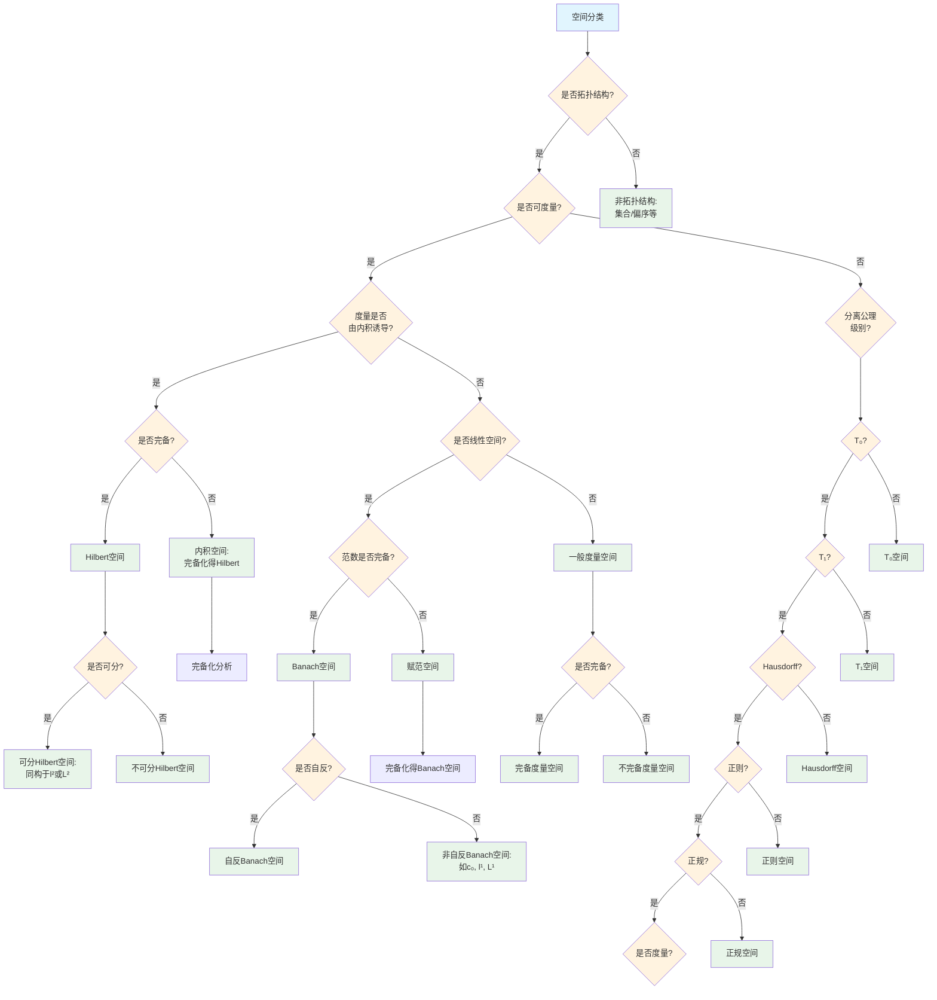
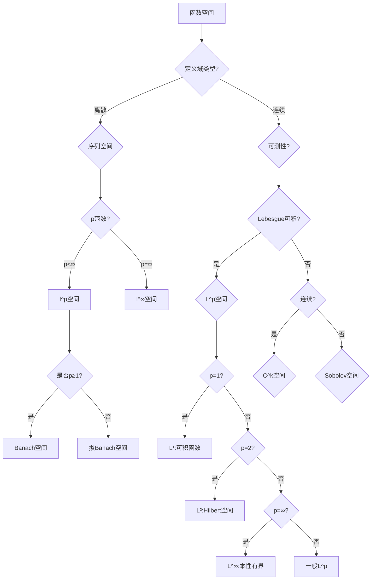

# 空间分类决策树

## 概述

本文档提供数学空间（拓扑空间、度量空间、赋范空间、内积空间等）的系统性分类决策树，帮助确定空间的类型和性质。

---

## 决策树根节点

**根节点：空间类型识别**

数学空间根据结构和性质分为主要类别：
- 拓扑空间及其分离性质
- 度量空间及其完备性
- 赋范空间与Banach空间
- 内积空间与Hilbert空间

---

## Mermaid决策树图



---

## 扩展：函数空间分类树



---

## 决策节点详细说明

### 第一层判断：拓扑结构

| 条件 | 空间类型 | 核心特征 |
|------|----------|----------|
| 有拓扑结构 | 拓扑空间 | 开集族定义 |
| 无拓扑结构 | 集合/代数结构 | 其他数学结构 |

### 第二层判断：可度量性

| 条件 | 空间类型 | 判定准则 |
|------|----------|----------|
| 可度量 | 度量空间 | Urysohn度量化定理 |
| 不可度量 | 一般拓扑空间 | 分离公理分析 |

**Urysohn度量化定理**：
第二可数正则Hausdorff空间可度量化

### 第三层判断：线性结构与范数

| 结构层次 | 条件 | 空间类型 |
|----------|------|----------|
| 线性空间+内积 | 完备 | Hilbert空间 |
| 线性空间+内积 | 不完备 | 内积空间 |
| 线性空间+范数 | 完备 | Banach空间 |
| 线性空间+范数 | 不完备 | 赋范空间 |

### 第四层判断：分离公理

| 公理 | 定义 | 典型性质 |
|------|------|----------|
| T₀ | 任意两点至少一点有邻域不含另一点 | 可区分 |
| T₁ | 单点集闭 | 点闭 |
| T₂ (Hausdorff) | 任意两点有不相交邻域 | 极限唯一 |
| 正则 | 点和闭集可分离 | - |
| 正规 | 不相交闭集可分离 | Urysohn引理 |

### 第五层判断：完备性

| 空间类型 | 完备性意义 | 完备化 |
|----------|------------|--------|
| 度量空间 | Cauchy列收敛 | 度量完备化 |
| 赋范空间 | 范数完备 | Banach空间 |
| 内积空间 | 内积诱导范数完备 | Hilbert空间 |

---

## 叶节点分类详解

### 1. Hilbert空间

**定义**：完备的内积空间

**典型例子**：
- ℝⁿ, ℂⁿ（有限维）
- l²：平方可和序列
- L²([a,b])：平方可积函数

**核心性质**：
- 正交分解定理
- Riesz表示定理
- 存在标准正交基
- 可分Hilbert空间同构于l²

### 2. Banach空间

**定义**：完备的赋范空间

**典型例子**：
- 所有有限维赋范空间
- lᵖ (1 ≤ p ≤ ∞)
- Lᵖ (1 ≤ p ≤ ∞)
- C([a,b])：连续函数空间
- c₀：收敛到0的序列

**重要子类**：
- 自反Banach空间：X ≅ X''
- 一致凸空间
- 严格凸空间

### 3. 度量空间

**定义**：带有度量d: X×X→ℝ₊的空间

**完备化定理**：
任意度量空间可等距嵌入到完备度量空间

**重要概念**：
- 全有界性
- 紧致性（紧 ⟺ 完备+全有界）
- 连通性

### 4. 拓扑空间分离层次

```

度量空间 ⊂ 正规空间 ⊂ 正则空间 ⊂ Hausdorff空间 ⊂ T₁空间 ⊂ T₀空间

```

**重要定理**：
- Urysohn引理：正规空间中不相交闭集可用连续函数分离
- Tietze扩张定理：正规空间中闭子集上连续函数可扩张

### 5. 函数空间谱系

**Lebesgue空间Lᵖ**：
- L¹：可积函数
- L²：Hilbert空间（最重要的情形）
- L∞：本性有界函数

**连续函数空间**：
- C(X)：连续函数
- Cᵏ(X)：k阶连续可微
- C^∞(X)：光滑函数

**Sobolev空间Wᵏᵖ**：
- 弱导数存在且属于Lᵖ
- 现代PDE理论的核心

---

## 典型分类路径示例

### 示例1：分类空间C([0,1])

**路径**：空间分类 → 拓扑结构(是) → 可度量(是) → 度量由内积诱导?(否) → 线性空间(是) → 范数完备(是) → 自反?(否)

**分析过程**：
1. C([0,1])在连续函数上确界范数下是赋范空间
2. 完备性：一致极限定理保证完备
3. 结论：Banach空间
4. 自反性：C([0,1])非自反
5. 对偶空间：M([0,1])（正则Borel测度）

### 示例2：分类空间l²

**路径**：空间分类 → 拓扑结构(是) → 可度量(是) → 度量由内积诱导(是) → 完备(是) → 可分(是)

**分析过程**：
1. l² = {(xₙ): Σ|xₙ|² < ∞}

2. 内积：⟨x,y⟩ = Σxₙȳₙ
3. 完备性：Cauchy列收敛到l²中元素
4. 可分性：有理数有限序列稠密
5. 结论：可分Hilbert空间，同构于任何其他可分无穷维Hilbert空间

### 示例3：分析Sorgenfrey直线的性质

**路径**：空间分类 → 拓扑结构(是) → 可度量(否) → 分离公理

**分析过程**：
1. 定义：ℝ上取半开区间[a,b)为基
2. 可度量性：不可度量化
3. 分离性：
   - T₁：是（单点闭）
   - Hausdorff：是
   - 正则：是
   - 正规：否
4. 其他性质：
   - 可分（ℚ稠密）
   - 不可数子空间不必然可分
   - Lindelöf性质不满足

---

## 常见错误与注意事项

### 错误1：混淆度量与拓扑等价

**问题**：认为度量等价意味着拓扑等价
**事实**：强等价⇒拓扑等价，反之不成立
**避免**：使用正确的等价概念

### 错误2：不完备空间的忽视

**问题**：在不完备空间使用完备性论证
**后果**：Cauchy列可能不收敛
**避免**：明确空间的完备性

### 错误3：Hilbert空间中的正交性误用

**问题**：在Banach空间中使用正交分解
**后果**：Banach空间无内积，正交概念不适用
**避免**：确认空间有内积结构

### 错误4：对偶空间混淆

**问题**：认为X'' ≅ X总是成立
**事实**：仅自反Banach空间满足
**避免**：验证自反性

### 错误5：紧性与有界性混淆

**问题**：在无穷维空间中有界⇒紧
**事实**：无穷维空间单位球非紧
**避免**：使用有限维刻画或弱紧性

---

## 快速参考表

| 空间类型 | 核心结构 | 完备性 | 典型例子 |
|----------|----------|--------|----------|
| 拓扑空间 | 开集族 | - | 任意集合 |
| 度量空间 | 度量d | 可选 | 离散空间 |
| 完备度量 | Cauchy收敛 | 是 | ℝⁿ |
| 赋范空间 | 范数‖·‖ | 可选 | C([0,1]) |
| Banach空间 | 范数 | 是 | Lᵖ, lᵖ |
| Hilbert空间 | 内积⟨·,·⟩ | 是 | L², l² |
| 自反Banach | 范数+自反 | 是 | Lᵖ(1<p<∞) |

---

## 空间层次关系图

```

                    Hilbert空间

                         |

                    Banach空间

                         |

                   完备度量空间
                    /         \
               度量空间    完备赋范空间

                  |              |

            拓扑空间         赋范空间
                  \              /
                   线性拓扑空间

```

---

## 相关文档

- [04-拓扑问题识别决策树](./04-拓扑问题识别决策树.md)
- [09-代数对象分类树](./09-代数对象分类树.md)
- [02-分析问题识别决策树](./02-分析问题识别决策树.md)
