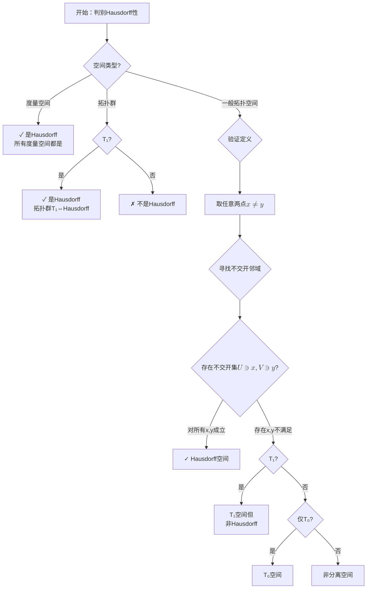
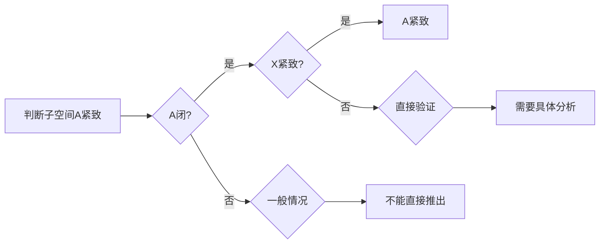
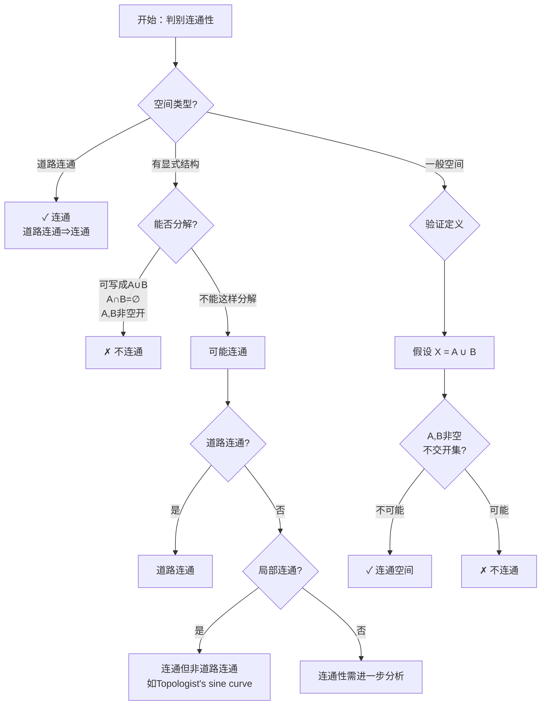
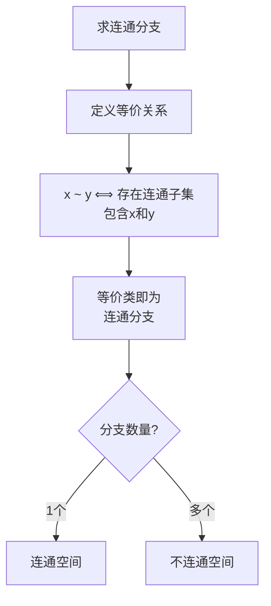
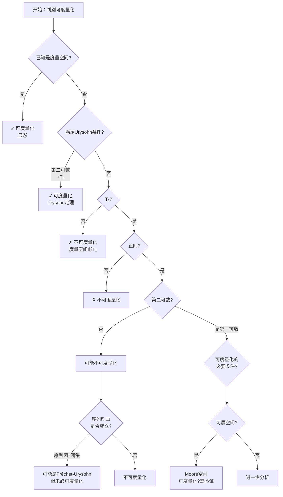
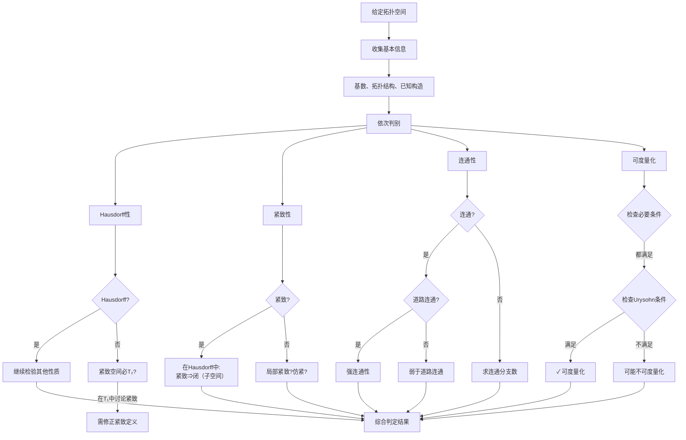

# 拓扑学决策树：判断拓扑性质

本决策树帮助系统性地判断一个拓扑空间是否满足Hausdorff性、紧致性、连通性以及可度量化等基本拓扑性质。

## 一、总体决策流程

```mermaid
flowchart TD
    A[给定拓扑空间<br/>$$(X, \mathcal{T})$$] --> B{判断拓扑性质}
    B --> C[Hausdorff性判别]
    B --> D[紧致性判别]
    B --> E[连通性判别]
    B --> F[可度量化判别]
    
    C --> C1{任意两点有<br/>不相交邻域?}
    C1 -->|是| C2[Hausdorff空间<br/>T₂空间]
    C1 -->|否| C3[非Hausdorff]
    
    D --> D1{开覆盖有<br/>有限子覆盖?}
    D1 -->|是| D2[紧致空间]
    D1 -->|否| D3[非紧致]
    
    E --> E1{能否分解为<br/>两个非空不交开集?}
    E1 -->|否| E2[连通空间]
    E1 -->|是| E3[不连通]
    
    F --> F1{存在度量<br/>诱导该拓扑?}
    F1 -->|是| F2[可度量化]
    F1 -->|否| F3[不可度量化]
```

## 二、Hausdorff性（T₂分离性）判别

### 2.1 定义回顾

拓扑空间 $(X, \mathcal{T})$ 是 **Hausdorff空间**（或 $T_2$ 空间），如果对于任意两个不同的点 $x, y \in X$，存在不相交的开集 $U, V \in \mathcal{T}$，使得 $x \in U$，$y \in V$。

### 2.2 判别决策树



### 2.3 典型例子分类

| 空间类型 | Hausdorff? | 关键判据 |
|---------|-----------|---------|
| **离散拓扑** | ✓ 是 | 单点集是开集 |
| **度量空间** | ✓ 是 | $d(x,y) > 0$ 保证不交球存在 |
| **欧氏空间 $\mathbb{R}^n$** | ✓ 是 | 度量空间特例 |
| **余有限拓扑（无限集上）** | ✗ 否 | 任意两个非空开集相交 |
| **余可数拓扑（不可数集上）** | ✗ 否 | 类似余有限拓扑 |
| **Sierpiński空间** | ✗ 否 | 只有两个开集 $\emptyset, \{a,b\}$ |
| **Zariski拓扑（代数簇上）** | ✗ 一般否 | 代数闭链的拓扑 |
| **序拓扑** | ✓ 是 | 由全序诱导 |

### 2.4 判别技巧

**快速判别法：**
1. 若为度量空间 → 自动Hausdorff
2. 若有限集上的拓扑，检查是否为离散拓扑
3. 检查对角线 $\Delta = \{(x,x) : x \in X\}$ 是否为闭集（Hausdorff ⟺ 对角线闭）

## 三、紧致性判别

### 3.1 定义回顾

拓扑空间 $X$ 是 **紧致的**，如果每个开覆盖都有有限子覆盖。

### 3.2 判别决策树

```mermaid
flowchart TD
    K0[开始：判别紧致性] --> K1{空间类型?}
    
    K1 -->|度量空间| K2{完备且全有界?}
    K2 -->|是| K3[✓ 紧致<br/>Heine-Borel]
    K2 -->|否| K4{闭且有界?}
    K4 -->|是，在$$\mathbb{R}^n$$| K5[✓ 紧致]
    K4 -->|否| K6[✗ 非紧致]
    
    K1 -->|Hausdorff空间| K7{序列紧致?}
    K7 -->|是| K8[可能紧致<br/>需验证可数紧致]
    K7 -->|否| K9[✗ 非紧致]
    
    K1 -->|一般空间| K10{验证开覆盖条件}
    
    K10 --> K11[任取开覆盖<br/>$$\mathcal{U} = \{U_\alpha\}$$]
    K11 --> K12{能否选出<br/>有限子覆盖?}
    K12 -->|对所有覆盖成立| K13[✓ 紧致空间]
    K12 -->|存在反例| K14[✗ 非紧致]
    
    K14 --> K15{可数紧致?}
    K15 -->|是| K16[可数紧致但<br/>非紧致]
    K15 -->|否| K17{序列紧致?}
    K17 -->|是| K18[序列紧致]
    K17 -->|否| K19[非紧致]
```

### 3.3 经典判别定理

```
┌────────────────────────────────────────────────────────────┐
│                    Heine-Borel 定理                        │
├────────────────────────────────────────────────────────────┤
│  在 $\mathbb{R}^n$ 中（标准拓扑）：                          │
│  子集紧致 ⟺ 闭且有界                                        │
│                                                            │
│  在一般度量空间中：                                          │
│  紧致 ⟺ 完备且全有界                                        │
└────────────────────────────────────────────────────────────┘
```

### 3.4 典型例子分类

| 空间 | 紧致性 | 说明 |
|------|-------|------|
| **闭区间 $[a,b]$** | ✓ 紧致 | Heine-Borel |
| **开区间 $(a,b)$** | ✗ 非紧致 | 无界端点 |
| **$\mathbb{R}^n$** | ✗ 非紧致 | 无界 |
| **$S^n$（单位球面）** | ✓ 紧致 | $\mathbb{R}^{n+1}$中有界闭集 |
| **离散拓扑（无限集）** | ✗ 非紧致 | 单点开覆盖无有限子覆盖 |
| **有限拓扑空间** | ✓ 紧致 | 任何覆盖自动有限 |
| **乘积空间（紧致×紧致）** | ✓ 紧致 | Tychonoff定理 |
| **Zariski拓扑** | ✓ 紧致（仿射簇） | 代数簇的特殊性质 |

### 3.5 紧致性相关判别

**子空间紧致性：**



## 四、连通性判别

### 4.1 定义回顾

- **连通空间**：不能分解为两个非空不交开集的并
- **道路连通**：任意两点间存在连续道路
- **局部连通**：每点有由连通集构成的邻域基

### 4.2 判别决策树



### 4.3 连通分支判别



### 4.4 典型例子分类

| 空间 | 连通性 | 道路连通 | 说明 |
|------|--------|---------|------|
| **$\mathbb{R}^n$** | ✓ | ✓ | 凸集，线段连接 |
| **区间 $[a,b], (a,b)$** | ✓ | ✓ | 连通基本例 |
| **离散拓扑（多点）** | ✗ | ✗ | 每点是开闭集 |
| **$\mathbb{R} \setminus \{0\}$** | ✗ | ✗ | 两个开区间 |
| **Topologist's sine curve** | ✓ | ✗ | 经典反例 |
| **$S^n$ ($n \geq 1$)** | ✓ | ✓ | 球面连通 |
| **有理数集 $\mathbb{Q}$** | ✗ | ✗ | 完全不连通 |
| **Cantor集** | ✗ | ✗ | 完全不连通 |

### 4.5 判别技巧

**利用连续映射：**
- 连续映射保持连通性
- 若 $f: X \to Y$ 连续且满，$X$连通 ⟹ $Y$连通

**判别不连通的实用方法：**
1. 找连续满射到离散两点空间
2. 找非平凡的既开又闭集（clopen集）
3. 利用中间值定理：$X$连通 ⟺ 任意连续 $f: X \to \mathbb{R}$ 有IVP

## 五、可度量化判别

### 5.1 定义回顾

拓扑空间 $(X, \mathcal{T})$ **可度量化**，如果存在度量 $d$ 使得 $\mathcal{T}$ 就是由 $d$ 诱导的度量拓扑。

### 5.2 Urysohn度量化定理

```
┌─────────────────────────────────────────────────────────────┐
│              Urysohn 度量化定理                             │
├─────────────────────────────────────────────────────────────┤
│  第二可数 + T₃（正则+T₁） ⟺ 可度量化                         │
│                                                             │
│  等价表述：                                                   │
│  • 第二可数 + 正则 + T₁                                     │
│  • 第二可数 + Hausdorff + 完全正则                          │
└─────────────────────────────────────────────────────────────┘
```

### 5.3 判别决策树



### 5.4 可度量化必要条件检查清单

| 条件 | 度量空间满足? | 检查方法 |
|------|--------------|---------|
| **T₁** | ✓ | 单点集闭 |
| **Hausdorff** | ✓ | 更强的分离性 |
| **正则 (T₃)** | ✓ | 点和闭集可分离 |
| **正规 (T₄)** | ✓ | 不相交闭集可分离 |
| **第一可数** | ✓ | 每点可数局部基 |
| **仿紧** | ✓ | 开覆盖有局部有限加细 |
| **完全正则** | ✓ | 点和闭集函数分离 |
| **序列刻画** | ✓ | 序列闭=闭，序列紧=紧 |

### 5.5 典型例子分类

| 空间 | 可度量化? | 原因 |
|------|----------|------|
| **$\mathbb{R}^n$** | ✓ | 欧氏度量 |
| **离散拓扑** | ✓ | 离散度量 $d(x,y) = \delta_{xy}$ |
| **有限拓扑** | ✓ | 离散度量 |
| **余有限拓扑（无限集）** | ✗ | 非Hausdorff |
| **序拓扑（可分序）** | ✓ | 通常可度量 |
| **长直线** | ✗ | 非第二可数 |
| **Sorgenfrey直线** | ✗ | 可分但不可分度量化 |
| **Zariski拓扑** | ✗ | T₁但一般非Hausdorff |

## 六、综合判别流程

### 6.1 多性质联合决策



### 6.2 常见空间性质速查表

| 空间 | T₁ | Hausdorff | 紧致 | 连通 | 道路连通 | 可度量化 |
|------|:--:|:---------:|:----:|:----:|:--------:|:--------:|
| $\mathbb{R}^n$ | ✓ | ✓ | ✗ | ✓ | ✓ | ✓ |
| $[0,1]$ | ✓ | ✓ | ✓ | ✓ | ✓ | ✓ |
| $S^n$ | ✓ | ✓ | ✓ | ✓ | ✓ | ✓ |
| 离散拓扑 | ✓ | ✓ | ✗* | ✗* | ✗* | ✓ |
| 余有限拓扑 | ✗ | ✗ | ✓ | ✓ | ✗ | ✗ |
| 有理数 $\mathbb{Q}$ | ✓ | ✓ | ✗ | ✗ | ✗ | ✓ |
| Cantor集 | ✓ | ✓ | ✓ | ✗ | ✗ | ✓ |
| 长直线 | ✓ | ✓ | ✗ | ✓ | ✓ | ✗ |
| Sorgenfrey直线 | ✓ | ✓ | ✗ | ✓ | ✗ | ✗ |
| Zariski拓扑 | ✓ | ✗ | ✓ | ✓ | ✗ | ✗ |

*有限离散空间是紧致且连通的（单点）

## 七、反例与警示

### 7.1 常见误区

```
┌─────────────────────────────────────────────────────────────┐
│  ⚠️ 常见错误判断                                             │
├─────────────────────────────────────────────────────────────┤
│  1. 紧致 ⟹ 有界（仅在度量空间中成立）                        │
│  2. 连通 ⟹ 道路连通（Topologist's sine curve是反例）         │
│  3. Hausdorff ⟹ 可度量化（需要第二可数性）                   │
│  4. 局部连通 ⟹ 连通（离散空间局部连通但不连通）              │
│  5. 可度量化 ⟹ 第二可数（是，但逆不成立）                    │
└─────────────────────────────────────────────────────────────┘
```

### 7.2 经典反例

| 反例名称 | 违反的直觉 | 性质 |
|---------|-----------|------|
| **Sorgenfrey直线** | 可分+第一可数 ⟹ 第二可数 | T₂, 可分, Lindelöf, 非可度量化 |
| **Topologist's sine curve** | 连通 ⟹ 道路连通 | 连通，非道路连通 |
| **长直线** | 局部像 $\mathbb{R}$ ⟹ 像 $\mathbb{R}$ | 序列紧但非紧 |
| **Zariski拓扑** | T₁ ⟹ T₂ | T₁，非Hausdorff |

## 八、实用判定算法

### 8.1 Hausdorff性判定算法

```
算法：判定Hausdorff性
输入：拓扑空间 (X, T)
输出：是/否

1. 若 X 是度量空间，返回“是”
2. 任取 x, y ∈ X，x ≠ y
3. 若对所有这样的对，存在 U, V ∈ T：
      x ∈ U, y ∈ V, U ∩ V = ∅
   则返回“是”
4. 否则返回“否”
```

### 8.2 紧致性判定算法（度量空间）

```
算法：度量空间中判定紧致性
输入：度量空间 (X, d)
输出：是/否

1. 检查完备性：所有Cauchy列收敛？
2. 检查全有界性：∀ε>0，存在有限ε-网？
3. 若两者皆满足，返回“是”
4. 否则返回“否”

特殊情况：若 X ⊆ ℝⁿ
- 检查是否闭且有界
- 若是，返回“是”（Heine-Borel）
```

### 8.3 连通性判定算法

```
算法：判定连通性
输入：拓扑空间 X
输出：是/否

1. 检查是否道路连通（构造显式道路）
   - 若是，返回“是”
2. 寻找非平凡clopen集（既开又闭）
   - 若存在，返回“否”
3. 验证连续映射到离散空间 {0,1} 只有常值映射
   - 若是，返回“是”
4. 否则返回“否”
```

---

*本决策树由 FormalMath 项目创建，基于标准点集拓扑学理论体系。*
