---
msc_primary: 00A99
msc_secondary: ['00-XX']
category: 思维导图
subject: 数论
title: '数论概念思维导图合集'
processed_at: '2026-04-05'
merged_from: 61 files
---

# 数论概念思维导图合集

> **合并说明**: 本文档包含 61 个数学概念的思维导图，按学科分类整理。
>
> **原始文件**: Clifford代数, Dirichlet单位定理, Dirichlet定理, Euclid算法, Euler定理, Fermat小定理, Galois理论, Goldbach猜想, Jacobi符号, Legendre符号, Modular曲线, Mordell定理, Riemannζ函数, Sobolev空间, Wilson定理, 主理想, 二次互反律, 二次剩余, 代数整数, 剩余类, 原根, 可微性-思维导图, 可解群, 同余, 同调代数-思维导图, 商群, 域, 域扩张-思维导图, 复乘法, 复分析, 复变函数-思维导图, 子环, 子群, 循环群, 数域, 整除, 曲率-思维导图, 最大公因子, 有理点, 极大理想, 极限, 核心概念思维导图集, 椭圆曲线, 模, 模结构-思维导图, 流形-思维导图, 特征值, 环, 环结构-思维导图, 理想, 理想类群, 离散对数, 筛法, 算术基本定理, 类数公式, 素数, 素数定理, 素理想, 级数-思维导图, 群, 群结构-思维导图

---

## 目录

1. [Clifford代数](#概念1-Clifford代数)
2. [Dirichlet单位定理](#概念2-Dirichlet单位定理)
3. [Dirichlet定理](#概念3-Dirichlet定理)
4. [Euclid算法](#概念4-Euclid算法)
5. [Euler定理](#概念5-Euler定理)
6. [Fermat小定理](#概念6-Fermat小定理)
7. [Galois理论](#概念7-Galois理论)
8. [Goldbach猜想](#概念8-Goldbach猜想)
9. [Jacobi符号](#概念9-Jacobi符号)
10. [Legendre符号](#概念10-Legendre符号)
11. [Modular曲线](#概念11-Modular曲线)
12. [Mordell定理](#概念12-Mordell定理)
13. [Riemannζ函数](#概念13-Riemannζ函数)
14. [Sobolev空间](#概念14-Sobolev空间)
15. [Wilson定理](#概念15-Wilson定理)
16. [代数整数](#概念16-代数整数)
17. [二次互反律](#概念17-二次互反律)
18. [二次剩余](#概念18-二次剩余)
19. [复变函数-思维导图](#概念19-复变函数-思维导图)
20. [复乘法](#概念20-复乘法)
21. [复分析](#概念21-复分析)
22. [核心概念思维导图集](#概念22-核心概念思维导图集)
23. [环](#概念23-环)
24. [环结构-思维导图](#概念24-环结构-思维导图)
25. [级数-思维导图](#概念25-级数-思维导图)
26. [极大理想](#概念26-极大理想)
27. [极限](#概念27-极限)
28. [可解群](#概念28-可解群)
29. [可微性-思维导图](#概念29-可微性-思维导图)
30. [类数公式](#概念30-类数公式)
31. [离散对数](#概念31-离散对数)
32. [理想](#概念32-理想)
33. [理想类群](#概念33-理想类群)
34. [流形-思维导图](#概念34-流形-思维导图)
35. [模](#概念35-模)
36. [模结构-思维导图](#概念36-模结构-思维导图)
37. [曲率-思维导图](#概念37-曲率-思维导图)
38. [群](#概念38-群)
39. [群结构-思维导图](#概念39-群结构-思维导图)
40. [筛法](#概念40-筛法)
41. [商群](#概念41-商群)
42. [剩余类](#概念42-剩余类)
43. [数域](#概念43-数域)
44. [素理想](#概念44-素理想)
45. [素数](#概念45-素数)
46. [素数定理](#概念46-素数定理)
47. [算术基本定理](#概念47-算术基本定理)
48. [特征值](#概念48-特征值)
49. [同调代数-思维导图](#概念49-同调代数-思维导图)
50. [同余](#概念50-同余)
51. [椭圆曲线](#概念51-椭圆曲线)
52. [循环群](#概念52-循环群)
53. [有理点](#概念53-有理点)
54. [域](#概念54-域)
55. [域扩张-思维导图](#概念55-域扩张-思维导图)
56. [原根](#概念56-原根)
57. [整除](#概念57-整除)
58. [主理想](#概念58-主理想)
59. [子环](#概念59-子环)
60. [子群](#概念60-子群)
61. [最大公因子](#概念61-最大公因子)

---

<a id="概念1-Clifford代数"></a>
### 概念1: Clifford代数

---
msc_primary: 00A99
msc_secondary:
- 00A99
title: Clifford代数 思维导图
processed_at: '2026-04-05'
---
msc_primary: "00A99"
msc_secondary: ['00-XX']
---

# Clifford代数 思维导图

## 中心概念
Clifford代数是结合二次型构造的代数结构，统一了外代数和复数/四元数理论。它在几何、物理（尤其是量子场论和自旋几何）以及表示论中具有核心地位。

## 核心分支

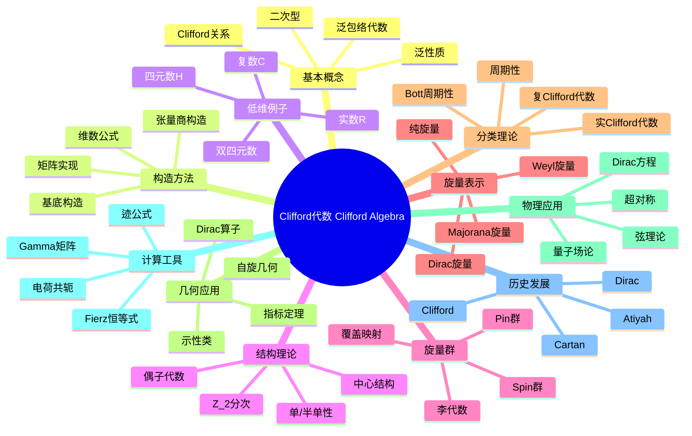

### 定义与公理
- **形式化定义**: $Cl(V,Q) = T(V)/\langle v \otimes v - Q(v) \cdot 1 \rangle$
- **Clifford关系**: $v^2 = Q(v)$ 或等价地 $vw + wv = 2B(v,w)$
- **泛性质**: 到满足 $f(v)^2 = Q(v)$ 的结合代数的泛映射
- **维数**: $\dim Cl(V,Q) = 2^{\dim V}$

### 基本性质
- **$\mathbb{Z}_2$-分次**: $Cl(V) = Cl^0(V) \oplus Cl^1(V)$（偶/奇次）
- **偶子代数**: $Cl^0(V,Q)$ 与低一维空间的Clifford代数同构
- **反自同构**: 转置和阶化转置
- **Clifford群**: 由可逆元构成的群，包含Pin群和Spin群

### 重要例子
- **$Cl_{0,1} \cong \mathbb{C}$**: 复数（1维负定型）
- **$Cl_{0,2} \cong \mathbb{H}$**: 四元数（2维负定型）
- **$Cl_{1,3} \cong M_2(\mathbb{H})$**: 物理时空的Dirac代数
- **$Cl_{3,0} \cong M_2(\mathbb{C})$**: Pauli代数
- **$Cl_{n,0}$**: 欧几里得空间的Clifford代数

### 核心定理
- **周期性定理**: $Cl_{p+8,q} \cong Cl_{p,q} \otimes M_{16}(\mathbb{R})$（Bott周期性）
- **分类定理**: 实Clifford代数由 $(p-q) \mod 8$ 决定（证明思路：矩阵实现）
- **Spin群双覆盖**: $Spin(V) \to SO(V)$ 是2:1覆盖（单连通）
- **Atiyah-Bott-Shapiro**: Clifford模与KO理论的周期对应

### 相关概念
- **父概念**: 张量代数、外代数、二次型理论
- **子概念**: Spin群、旋量、Twistor理论
- **相邻概念**: K-理论、指标定理、超对称

### 应用领域
- **几何**: 自旋流形、Dirac算子、指标定理
- **物理**: Dirac方程、量子场论、超弦理论
- **表示论**: 正交群和李代数的旋量表示
- **机器人学**: 刚体运动的Clifford代数表示

### 历史发展
- **创立者**: William Kingdon Clifford (1849-1879)，1876年提出
- **关键发展**:
  - 1913：Cartan引入"旋量"概念
  - 1928：Dirac发现Dirac方程与Clifford代数的关系
  - 1960年代：Atiyah-Singer指标定理
  - 1980年代：超弦理论中的应用
- **现代研究**: 非交换几何、Twistor理论

### 参考资源
- **推荐教材**: Lawson-Michelsohn《Spin Geometry》、Garling《Clifford Algebras: An Introduction》
- **相关论文**: Dirac《The Quantum Theory of the Electron》(1928)、Atiyah-Singer《The Index of Elliptic Operators》(1968)
- **在线资源**: Geometry of Physics (Theodore Frankel)

---

**概念链接**: [[张量代数]] [[Hopf代数]] [[李代数]] [[指标定理]] [[量子场论]]

---

<a id="概念2-Dirichlet单位定理"></a>
### 概念2: Dirichlet单位定理

---
msc_primary: 00A99
msc_secondary:
- 00A99
title: Dirichlet单位定理
processed_at: '2026-04-05'
---
msc_primary: "00A99"
msc_secondary: ['00-XX']
---

# Dirichlet单位定理

# Dirichlet单位定理 思维导图

## 中心概念
数域单位群的结构定理

## 核心分支

\\\mermaid
mindmap
  root((Dirichlet单位定理 Dirichlet Unit Theorem))
    定义与性质
      形式化定义
      基本性质
      等价条件
      判定方法
    重要定理
      核心定理
      相关引理
      推论
      应用
    典型例子
      经典例子
      反例
      边界情况
      计算实例
    计算方法
      计算公式
      算法步骤
      技巧方法
      复杂度分析
    相关概念
      父概念
      子概念
      相邻概念
      推广概念
    应用领域
      纯数学
      应用数学
      密码学
      编码理论
    历史发展
      创立者
      关键发展
      现代研究
      开放问题
\\\

### 定义与性质
- **形式化定义**: Dirichlet单位定理 的严格数学定义
- **基本性质**: 核心性质和特征
- **等价条件**: 与其他条件的等价关系

### 重要定理
- **核心定理**: 相关的主要定理
- **证明思路**: 关键证明步骤概述

### 典型例子
- **经典例子**: 最典型的实例
- **计算实例**: 具体计算示例

### 相关概念
- **父概念**: [[相关概念]]
- **子概念**: [[相关概念]]
- **相邻概念**: [[相关概念]]

### 应用领域
- **密码学**: 在密码学中的应用
- **编码理论**: 在编码理论中的应用

### 历史发展
- **创立者**: 历史背景
- **关键发展**: 重要里程碑

---

**概念链接**: [[素数]] [[同余]] [[原根]] [[椭圆曲线]]

---

<a id="概念3-Dirichlet定理"></a>
### 概念3: Dirichlet定理

---
msc_primary: 00A99
msc_secondary:
- 00A99
title: Dirichlet定理
processed_at: '2026-04-05'
---
msc_primary: "00A99"
msc_secondary: ['00-XX']
---

# Dirichlet定理

# Dirichlet定理 思维导图

## 中心概念
等差数列中有无穷多素数

## 核心分支

\\\mermaid
mindmap
  root((Dirichlet定理 Dirichlet Theorem))
    定义与性质
      形式化定义
      基本性质
      等价条件
      判定方法
    重要定理
      核心定理
      相关引理
      推论
      应用
    典型例子
      经典例子
      反例
      边界情况
      计算实例
    计算方法
      计算公式
      算法步骤
      技巧方法
      复杂度分析
    相关概念
      父概念
      子概念
      相邻概念
      推广概念
    应用领域
      纯数学
      应用数学
      密码学
      编码理论
    历史发展
      创立者
      关键发展
      现代研究
      开放问题
\\\

### 定义与性质
- **形式化定义**: Dirichlet定理 的严格数学定义
- **基本性质**: 核心性质和特征
- **等价条件**: 与其他条件的等价关系

### 重要定理
- **核心定理**: 相关的主要定理
- **证明思路**: 关键证明步骤概述

### 典型例子
- **经典例子**: 最典型的实例
- **计算实例**: 具体计算示例

### 相关概念
- **父概念**: [[相关概念]]
- **子概念**: [[相关概念]]
- **相邻概念**: [[相关概念]]

### 应用领域
- **密码学**: 在密码学中的应用
- **编码理论**: 在编码理论中的应用

### 历史发展
- **创立者**: 历史背景
- **关键发展**: 重要里程碑

---

**概念链接**: [[素数]] [[同余]] [[原根]] [[椭圆曲线]]

---

<a id="概念4-Euclid算法"></a>
### 概念4: Euclid算法

---
msc_primary: 00A99
msc_secondary:
- 00A99
title: Euclid算法
processed_at: '2026-04-05'
---
msc_primary: "00A99"
msc_secondary: ['00-XX']
---

# Euclid算法

# Euclid算法 思维导图

## 中心概念
计算最大公因子的高效算法

## 核心分支

\\\mermaid
mindmap
  root((Euclid算法 Euclidean Algorithm))
    定义与性质
      形式化定义
      基本性质
      等价条件
      判定方法
    重要定理
      核心定理
      相关引理
      推论
      应用
    典型例子
      经典例子
      反例
      边界情况
      计算实例
    计算方法
      计算公式
      算法步骤
      技巧方法
      复杂度分析
    相关概念
      父概念
      子概念
      相邻概念
      推广概念
    应用领域
      纯数学
      应用数学
      密码学
      编码理论
    历史发展
      创立者
      关键发展
      现代研究
      开放问题
\\\

### 定义与性质
- **形式化定义**: Euclid算法 的严格数学定义
- **基本性质**: 核心性质和特征
- **等价条件**: 与其他条件的等价关系

### 重要定理
- **核心定理**: 相关的主要定理
- **证明思路**: 关键证明步骤概述

### 典型例子
- **经典例子**: 最典型的实例
- **计算实例**: 具体计算示例

### 相关概念
- **父概念**: [[相关概念]]
- **子概念**: [[相关概念]]
- **相邻概念**: [[相关概念]]

### 应用领域
- **密码学**: 在密码学中的应用
- **编码理论**: 在编码理论中的应用

### 历史发展
- **创立者**: 历史背景
- **关键发展**: 重要里程碑

---

**概念链接**: [[素数]] [[同余]] [[原根]] [[椭圆曲线]]

---

<a id="概念5-Euler定理"></a>
### 概念5: Euler定理

---
msc_primary: 00A99
msc_secondary:
- 00A99
title: Euler定理
processed_at: '2026-04-05'
---
msc_primary: "00A99"
msc_secondary: ['00-XX']
---

# Euler定理

# Euler定理 思维导图

## 中心概念
a^φ(n) ≡ 1 (mod n)，数论核心定理

## 核心分支

\\\mermaid
mindmap
  root((Euler定理 Euler Theorem))
    定义与性质
      形式化定义
      基本性质
      等价条件
      判定方法
    重要定理
      核心定理
      相关引理
      推论
      应用
    典型例子
      经典例子
      反例
      边界情况
      计算实例
    计算方法
      计算公式
      算法步骤
      技巧方法
      复杂度分析
    相关概念
      父概念
      子概念
      相邻概念
      推广概念
    应用领域
      纯数学
      应用数学
      密码学
      编码理论
    历史发展
      创立者
      关键发展
      现代研究
      开放问题
\\\

### 定义与性质
- **形式化定义**: Euler定理 的严格数学定义
- **基本性质**: 核心性质和特征
- **等价条件**: 与其他条件的等价关系

### 重要定理
- **核心定理**: 相关的主要定理
- **证明思路**: 关键证明步骤概述

### 典型例子
- **经典例子**: 最典型的实例
- **计算实例**: 具体计算示例

### 相关概念
- **父概念**: [[相关概念]]
- **子概念**: [[相关概念]]
- **相邻概念**: [[相关概念]]

### 应用领域
- **密码学**: 在密码学中的应用
- **编码理论**: 在编码理论中的应用

### 历史发展
- **创立者**: 历史背景
- **关键发展**: 重要里程碑

---

**概念链接**: [[素数]] [[同余]] [[原根]] [[椭圆曲线]]

---

<a id="概念6-Fermat小定理"></a>
### 概念6: Fermat小定理

---
msc_primary: 00A99
msc_secondary:
- 00A99
title: Fermat小定理
processed_at: '2026-04-05'
---
msc_primary: "00A99"
msc_secondary: ['00-XX']
---

# Fermat小定理

# Fermat小定理 思维导图

## 中心概念
p为素数时 a^(p-1) ≡ 1 (mod p)

## 核心分支

\\\mermaid
mindmap
  root((Fermat小定理 Fermat Little Theorem))
    定义与性质
      形式化定义
      基本性质
      等价条件
      判定方法
    重要定理
      核心定理
      相关引理
      推论
      应用
    典型例子
      经典例子
      反例
      边界情况
      计算实例
    计算方法
      计算公式
      算法步骤
      技巧方法
      复杂度分析
    相关概念
      父概念
      子概念
      相邻概念
      推广概念
    应用领域
      纯数学
      应用数学
      密码学
      编码理论
    历史发展
      创立者
      关键发展
      现代研究
      开放问题
\\\

### 定义与性质
- **形式化定义**: Fermat小定理 的严格数学定义
- **基本性质**: 核心性质和特征
- **等价条件**: 与其他条件的等价关系

### 重要定理
- **核心定理**: 相关的主要定理
- **证明思路**: 关键证明步骤概述

### 典型例子
- **经典例子**: 最典型的实例
- **计算实例**: 具体计算示例

### 相关概念
- **父概念**: [[相关概念]]
- **子概念**: [[相关概念]]
- **相邻概念**: [[相关概念]]

### 应用领域
- **密码学**: 在密码学中的应用
- **编码理论**: 在编码理论中的应用

### 历史发展
- **创立者**: 历史背景
- **关键发展**: 重要里程碑

---

**概念链接**: [[素数]] [[同余]] [[原根]] [[椭圆曲线]]

---

<a id="概念7-Galois理论"></a>
### 概念7: Galois理论

---
msc_primary: 00A99
msc_secondary:
- 00A99
title: Galois理论 思维导图
processed_at: '2026-04-05'
---
msc_primary: "00A99"
msc_secondary: ['00-XX']
---

# Galois理论 思维导图

## 中心概念
Galois理论建立了域扩张与群之间的深刻联系，通过Galois群将域扩张的可解性问题转化为群论问题，是解决多项式方程根式可解性的终极理论。

## 核心分支

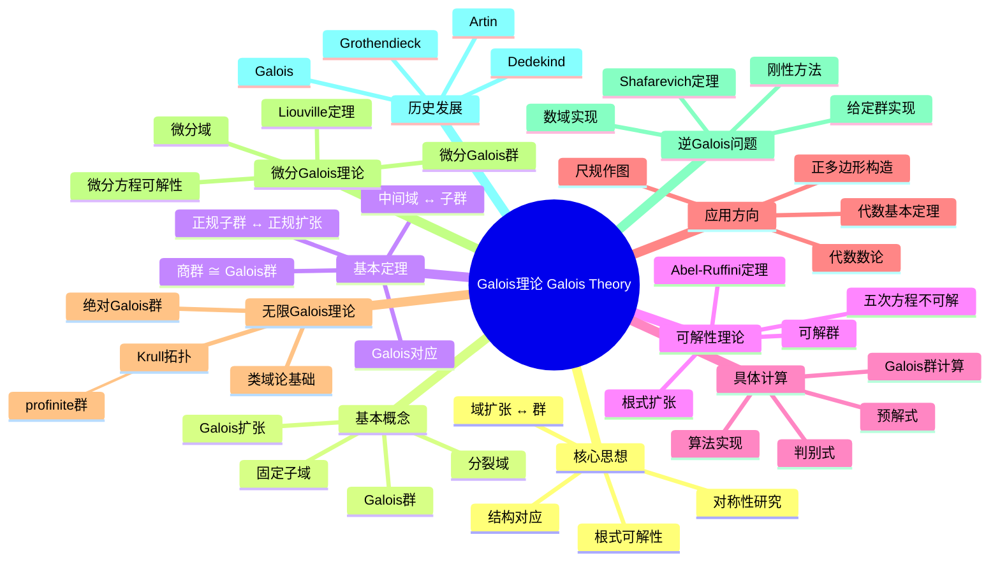

### 定义与公理
- **Galois扩张**: 正规且可分的代数扩张 $K/F$
- **Galois群**: $\text{Gal}(K/F) = \{\sigma \in \text{Aut}(K) : \sigma|_F = \text{id}_F\}$

- **固定子域**: 对于 $H \leq \text{Gal}(K/F)$，$K^H = \{x \in K : \sigma(x) = x, \forall \sigma \in H\}$
- **分裂域**: 多项式 $f$ 在其中完全分解的最小扩张

### 基本性质
- **Galois对应**: 中间域与Galois群的子群一一对应
- **正规子群 ↔ 正规扩张**: $H \triangleleft \text{Gal}(K/F)$ 当且仅当 $K^H/F$ 是Galois扩张
- **商群同构**: $\text{Gal}(K/F)/H \cong \text{Gal}(K^H/F)$
- **扩张次数**: $[K:F] = |\text{Gal}(K/F)|$

### 重要例子
- **二次扩张**: $\mathbb{Q}(\sqrt{d})/\mathbb{Q}$，Galois群为 $\mathbb{Z}/2\mathbb{Z}$
- **分圆扩张**: $\mathbb{Q}(\zeta_n)/\mathbb{Q}$，Galois群 $(\mathbb{Z}/n\mathbb{Z})^\times$
- **三次方程**: 判别式决定Galois群是 $A_3$ 还是 $S_3$
- **四次方程**: Galois群可能是 $V_4$, $D_4$, $A_4$, $S_4$ 之一
- **一般五次方程**: Galois群为 $S_5$，不可解

### 核心定理
- **Galois理论基本定理**: 中间域与Galois群子群的反序格同构
- **Abel-Ruffini定理**: 一般五次及以上方程无根式解（证明思路：$S_n$ ($n \geq 5$) 不可解）
- **Kronecker-Weber定理**: $\mathbb{Q}$ 的Abel扩张都包含于分圆域（类域论特例）
- **Hilbert不可约性定理**: 用于逆Galois问题

### 相关概念
- **父概念**: 域论、群论、域扩张
- **子概念**: 无限Galois理论、微分Galois理论、Galois上同调
- **相邻概念**: 代数数论、类域论、代数基本定理

### 应用领域
- **尺规作图**: 三等分角、倍立方体不可作图证明
- **正多边形构造**: 可作图当且仅当 $n = 2^k p_1 \cdots p_m$，$p_i$ 为Fermat素数
- **代数基本定理**: Galois理论证明复数域代数闭
- **代数数论**: 类域论的起点

### 历史发展
- **创立者**: Évariste Galois (1811-1832)，21岁死于决斗，遗稿包含核心思想
- **关键发展**:
  - 1850年代：Dedekind清晰阐述Galois理论
  - 1920-1940：Artin建立抽象Galois理论
  - 1960年代：Grothendieck引入Galois群的几何观点
- **现代研究**: 逆Galois问题、anabelian几何

### 参考资源
- **推荐教材**: Morandi《Field and Galois Theory》、Cox《Galois Theory》
- **相关论文**: Galois《Mémoire sur les conditions de résolubilité des équations par radicaux》
- **在线资源**: LMFDB、PARI/GP文档

---

**概念链接**: [[域]] [[群]] [[同态与同构]] [[代数数论]] [[类域论]]

---

<a id="概念8-Goldbach猜想"></a>
### 概念8: Goldbach猜想

---
msc_primary: 00A99
msc_secondary:
- 00A99
title: Goldbach猜想
processed_at: '2026-04-05'
---
msc_primary: "00A99"
msc_secondary: ['00-XX']
---

# Goldbach猜想

# Goldbach猜想 思维导图

## 中心概念
每个大于2的偶数可表为两素数之和

## 核心分支

\\\mermaid
mindmap
  root((Goldbach猜想 Goldbach Conjecture))
    定义与性质
      形式化定义
      基本性质
      等价条件
      判定方法
    重要定理
      核心定理
      相关引理
      推论
      应用
    典型例子
      经典例子
      反例
      边界情况
      计算实例
    计算方法
      计算公式
      算法步骤
      技巧方法
      复杂度分析
    相关概念
      父概念
      子概念
      相邻概念
      推广概念
    应用领域
      纯数学
      应用数学
      密码学
      编码理论
    历史发展
      创立者
      关键发展
      现代研究
      开放问题
\\\

### 定义与性质
- **形式化定义**: Goldbach猜想 的严格数学定义
- **基本性质**: 核心性质和特征
- **等价条件**: 与其他条件的等价关系

### 重要定理
- **核心定理**: 相关的主要定理
- **证明思路**: 关键证明步骤概述

### 典型例子
- **经典例子**: 最典型的实例
- **计算实例**: 具体计算示例

### 相关概念
- **父概念**: [[相关概念]]
- **子概念**: [[相关概念]]
- **相邻概念**: [[相关概念]]

### 应用领域
- **密码学**: 在密码学中的应用
- **编码理论**: 在编码理论中的应用

### 历史发展
- **创立者**: 历史背景
- **关键发展**: 重要里程碑

---

**概念链接**: [[素数]] [[同余]] [[原根]] [[椭圆曲线]]

---

<a id="概念9-Jacobi符号"></a>
### 概念9: Jacobi符号

---
msc_primary: 00A99
msc_secondary:
- 00A99
title: Jacobi符号
processed_at: '2026-04-05'
---
msc_primary: "00A99"
msc_secondary: ['00-XX']
---

# Jacobi符号

# Jacobi符号 思维导图

## 中心概念
Legendre符号的推广

## 核心分支

\\\mermaid
mindmap
  root((Jacobi符号 Jacobi Symbol))
    定义与性质
      形式化定义
      基本性质
      等价条件
      判定方法
    重要定理
      核心定理
      相关引理
      推论
      应用
    典型例子
      经典例子
      反例
      边界情况
      计算实例
    计算方法
      计算公式
      算法步骤
      技巧方法
      复杂度分析
    相关概念
      父概念
      子概念
      相邻概念
      推广概念
    应用领域
      纯数学
      应用数学
      密码学
      编码理论
    历史发展
      创立者
      关键发展
      现代研究
      开放问题
\\\

### 定义与性质
- **形式化定义**: Jacobi符号 的严格数学定义
- **基本性质**: 核心性质和特征
- **等价条件**: 与其他条件的等价关系

### 重要定理
- **核心定理**: 相关的主要定理
- **证明思路**: 关键证明步骤概述

### 典型例子
- **经典例子**: 最典型的实例
- **计算实例**: 具体计算示例

### 相关概念
- **父概念**: [[相关概念]]
- **子概念**: [[相关概念]]
- **相邻概念**: [[相关概念]]

### 应用领域
- **密码学**: 在密码学中的应用
- **编码理论**: 在编码理论中的应用

### 历史发展
- **创立者**: 历史背景
- **关键发展**: 重要里程碑

---

**概念链接**: [[素数]] [[同余]] [[原根]] [[椭圆曲线]]

---

<a id="概念10-Legendre符号"></a>
### 概念10: Legendre符号

---
msc_primary: 00A99
msc_secondary:
- 00A99
title: Legendre符号
processed_at: '2026-04-05'
---
msc_primary: "00A99"
msc_secondary: ['00-XX']
---

# Legendre符号

# Legendre符号 思维导图

## 中心概念
判断二次剩余性的符号

## 核心分支

\\\mermaid
mindmap
  root((Legendre符号 Legendre Symbol))
    定义与性质
      形式化定义
      基本性质
      等价条件
      判定方法
    重要定理
      核心定理
      相关引理
      推论
      应用
    典型例子
      经典例子
      反例
      边界情况
      计算实例
    计算方法
      计算公式
      算法步骤
      技巧方法
      复杂度分析
    相关概念
      父概念
      子概念
      相邻概念
      推广概念
    应用领域
      纯数学
      应用数学
      密码学
      编码理论
    历史发展
      创立者
      关键发展
      现代研究
      开放问题
\\\

### 定义与性质
- **形式化定义**: Legendre符号 的严格数学定义
- **基本性质**: 核心性质和特征
- **等价条件**: 与其他条件的等价关系

### 重要定理
- **核心定理**: 相关的主要定理
- **证明思路**: 关键证明步骤概述

### 典型例子
- **经典例子**: 最典型的实例
- **计算实例**: 具体计算示例

### 相关概念
- **父概念**: [[相关概念]]
- **子概念**: [[相关概念]]
- **相邻概念**: [[相关概念]]

### 应用领域
- **密码学**: 在密码学中的应用
- **编码理论**: 在编码理论中的应用

### 历史发展
- **创立者**: 历史背景
- **关键发展**: 重要里程碑

---

**概念链接**: [[素数]] [[同余]] [[原根]] [[椭圆曲线]]

---

<a id="概念11-Modular曲线"></a>
### 概念11: Modular曲线

---
msc_primary: 00A99
msc_secondary:
- 00A99
title: Modular曲线
processed_at: '2026-04-05'
---
msc_primary: "00A99"
msc_secondary: ['00-XX']
---

# Modular曲线

# Modular曲线 思维导图

## 中心概念
与模形式相关的代数曲线

## 核心分支

\\\mermaid
mindmap
  root((Modular曲线 Modular Curve))
    定义与性质
      形式化定义
      基本性质
      等价条件
      判定方法
    重要定理
      核心定理
      相关引理
      推论
      应用
    典型例子
      经典例子
      反例
      边界情况
      计算实例
    计算方法
      计算公式
      算法步骤
      技巧方法
      复杂度分析
    相关概念
      父概念
      子概念
      相邻概念
      推广概念
    应用领域
      纯数学
      应用数学
      密码学
      编码理论
    历史发展
      创立者
      关键发展
      现代研究
      开放问题
\\\

### 定义与性质
- **形式化定义**: Modular曲线 的严格数学定义
- **基本性质**: 核心性质和特征
- **等价条件**: 与其他条件的等价关系

### 重要定理
- **核心定理**: 相关的主要定理
- **证明思路**: 关键证明步骤概述

### 典型例子
- **经典例子**: 最典型的实例
- **计算实例**: 具体计算示例

### 相关概念
- **父概念**: [[相关概念]]
- **子概念**: [[相关概念]]
- **相邻概念**: [[相关概念]]

### 应用领域
- **密码学**: 在密码学中的应用
- **编码理论**: 在编码理论中的应用

### 历史发展
- **创立者**: 历史背景
- **关键发展**: 重要里程碑

---

**概念链接**: [[素数]] [[同余]] [[原根]] [[椭圆曲线]]

---

<a id="概念12-Mordell定理"></a>
### 概念12: Mordell定理

---
msc_primary: 00A99
msc_secondary:
- 00A99
title: Mordell定理
processed_at: '2026-04-05'
---
msc_primary: "00A99"
msc_secondary: ['00-XX']
---

# Mordell定理

# Mordell定理 思维导图

## 中心概念
椭圆曲线上有理点构成有限生成群

## 核心分支

\\\mermaid
mindmap
  root((Mordell定理 Mordell Theorem))
    定义与性质
      形式化定义
      基本性质
      等价条件
      判定方法
    重要定理
      核心定理
      相关引理
      推论
      应用
    典型例子
      经典例子
      反例
      边界情况
      计算实例
    计算方法
      计算公式
      算法步骤
      技巧方法
      复杂度分析
    相关概念
      父概念
      子概念
      相邻概念
      推广概念
    应用领域
      纯数学
      应用数学
      密码学
      编码理论
    历史发展
      创立者
      关键发展
      现代研究
      开放问题
\\\

### 定义与性质
- **形式化定义**: Mordell定理 的严格数学定义
- **基本性质**: 核心性质和特征
- **等价条件**: 与其他条件的等价关系

### 重要定理
- **核心定理**: 相关的主要定理
- **证明思路**: 关键证明步骤概述

### 典型例子
- **经典例子**: 最典型的实例
- **计算实例**: 具体计算示例

### 相关概念
- **父概念**: [[相关概念]]
- **子概念**: [[相关概念]]
- **相邻概念**: [[相关概念]]

### 应用领域
- **密码学**: 在密码学中的应用
- **编码理论**: 在编码理论中的应用

### 历史发展
- **创立者**: 历史背景
- **关键发展**: 重要里程碑

---

**概念链接**: [[素数]] [[同余]] [[原根]] [[椭圆曲线]]

---

<a id="概念13-Riemannζ函数"></a>
### 概念13: Riemannζ函数

---
msc_primary: 00A99
msc_secondary:
- 00A99
title: Riemannζ函数
processed_at: '2026-04-05'
---
msc_primary: "00A99"
msc_secondary: ['00-XX']
---

# Riemannζ函数

# Riemannζ函数 思维导图

## 中心概念
解析数论的核心函数

## 核心分支

\\\mermaid
mindmap
  root((Riemannζ函数 Riemann Zeta Function))
    定义与性质
      形式化定义
      基本性质
      等价条件
      判定方法
    重要定理
      核心定理
      相关引理
      推论
      应用
    典型例子
      经典例子
      反例
      边界情况
      计算实例
    计算方法
      计算公式
      算法步骤
      技巧方法
      复杂度分析
    相关概念
      父概念
      子概念
      相邻概念
      推广概念
    应用领域
      纯数学
      应用数学
      密码学
      编码理论
    历史发展
      创立者
      关键发展
      现代研究
      开放问题
\\\

### 定义与性质
- **形式化定义**: Riemannζ函数 的严格数学定义
- **基本性质**: 核心性质和特征
- **等价条件**: 与其他条件的等价关系

### 重要定理
- **核心定理**: 相关的主要定理
- **证明思路**: 关键证明步骤概述

### 典型例子
- **经典例子**: 最典型的实例
- **计算实例**: 具体计算示例

### 相关概念
- **父概念**: [[相关概念]]
- **子概念**: [[相关概念]]
- **相邻概念**: [[相关概念]]

### 应用领域
- **密码学**: 在密码学中的应用
- **编码理论**: 在编码理论中的应用

### 历史发展
- **创立者**: 历史背景
- **关键发展**: 重要里程碑

---

**概念链接**: [[素数]] [[同余]] [[原根]] [[椭圆曲线]]

---

<a id="概念14-Sobolev空间"></a>
### 概念14: Sobolev空间

---
msc_primary: 00A99
msc_secondary:
- 00A99
title: Sobolev空间 思维导图
processed_at: '2026-04-05'
---
msc_primary: "00A99"
msc_secondary: ['00-XX']
---

# Sobolev空间 思维导图

## 中心概念
Sobolev空间是弱可微函数构成的Banach空间，是研究偏微分方程弱解的核心理论框架。它架起了经典解与广义解之间的桥梁，是现代PDE理论的基石。

## 核心分支

```mermaid
mindmap
  root((Sobolev空间 Sobolev Space))
    弱导数
      分布导数
      弱导数定义
      分部积分
      唯一性
    空间定义
      W^{k,p}定义
      范数结构
      H^s空间
      分数阶空间
    基本性质
      Banach空间
      Hilbert空间H^k
      可分性
      自反性
    嵌入定理
      Sobolev嵌入
      Morrey不等式
      紧嵌入
      Rellich-Kondrachov
    迹定理
      边界迹
      迹算子
      迹空间
      延拓定理
    Poincaré不等式
      经典形式
      加权形式
      Friedrichs不等式
      应用
    插值理论
      实插值
      复插化
      中间空间
      精确指数
    负指数空间
      H^{-s}定义
      对偶性
      分布表示
      应用
    紧流形上
      黎曼流形
      Laplace-Beltrami
      特征函数
      热核估计
    非线性分析
      临界点理论
      变分方法
      Mountain Pass
      约束极值
    应用领域
      椭圆PDE
      抛物PDE
      流体方程
      几何分析
    历史发展
      Sobolev
      Schwartz
      Lions
      Nirenberg

```

### 定义与公理
- **弱导数**: $D^\alpha u = v$ 若 $\int u D^\alpha \phi = (-1)^{|\alpha|} \int v \phi$ 对所有测试函数 $\phi$
- **Sobolev空间**: $W^{k,p}(\Omega) = \{u \in L^p : D^\alpha u \in L^p, |\alpha| \leq k\}$
- **范数**: $\|u\|_{W^{k,p}} = \left(\sum_{|\alpha| \leq k} \|D^\alpha u\|_{L^p}^p\right)^{1/p}$

- **$H^s$空间**: Fourier定义的分数阶空间

### 基本性质
- **Banach空间**: $W^{k,p}$ 完备（$1 \leq p \leq \infty$）
- **Hilbert空间**: $H^k = W^{k,2}$ 是Hilbert空间
- **可分性**: $W^{k,p}$ 可分（$1 \leq p < \infty$）
- **自反性**: $W^{k,p}$ 自反（$1 < p < \infty$）

### 重要例子
- **$H^1(\mathbb{R}^n)$**: 一阶弱导数平方可积
- **$H_0^1(\Omega)$**: $C_c^\infty(\Omega)$ 在 $H^1$ 范数下的闭包
- **$W^{1,\infty}$**: Lipschitz函数空间
- **$H^s(\mathbb{T}^n)$**: 周期函数的分数阶空间
- **$H^{-1}$**: $H_0^1$ 的对偶空间

### 核心定理
- **Sobolev嵌入定理**: $W^{k,p} \hookrightarrow L^q$ 或 $C^{m,\alpha}$（证明思路：位势估计）
- **Rellich-Kondrachov**: 有界域上嵌入是紧的
- **Poincaré不等式**: $\|u\|_{L^p} \leq C\|\nabla u\|_{L^p}$（$u \in W_0^{1,p}$）

- **迹定理**: $W^{1,p}(\Omega) \to W^{1-1/p,p}(\partial\Omega)$ 有界满射
- **Gagliardo-Nirenberg不等式**: 插值不等式

### 相关概念
- **父概念**: 泛函分析、分布理论、偏微分方程
- **子概念**: Besov空间、Triebel-Lizorkin空间、BMO
- **相邻概念**: 变分法、椭圆方程、几何分析

### 应用领域
- **椭圆PDE**: 边值问题的弱解存在性
- **抛物PDE**: 热方程、反应扩散方程
- **流体方程**: Navier-Stokes方程、Euler方程
- **几何分析**: 极小曲面、Yamabe问题

### 历史发展
- **创立者**: Sergei Sobolev (1930年代)，研究双曲方程
- **关键发展**:
  - 1950年代：Schwartz分布理论
  - 1960年代：Lions、Stampacchia变分方法
  - 1960年代：Nirenberg、Gagliardo插值理论
  - 1970年代：Adams《Sobolev Spaces》系统阐述
- **现代研究**: 分数阶Sobolev空间、非局部方程

### 参考资源
- **推荐教材**: Adams《Sobolev Spaces》、Evans《Partial Differential Equations》
- **相关论文**: Sobolev《Méthode nouvelle à résoudre le problème de Cauchy》(1935)、Nirenberg《On elliptic partial differential equations》(1959)
- **在线资源**: PDE Notes (Lawrence C. Evans)

---

**概念链接**: [[泛函分析]] [[分布理论]] [[PDE]] [[变分法]] [[几何分析]]

---

<a id="概念15-Wilson定理"></a>
### 概念15: Wilson定理

---
msc_primary: 00A99
msc_secondary:
- 00A99
title: Wilson定理
processed_at: '2026-04-05'
---
msc_primary: "00A99"
msc_secondary: ['00-XX']
---

# Wilson定理

# Wilson定理 思维导图

## 中心概念
(p-1)! ≡ -1 (mod p) 当且仅当p为素数

## 核心分支

\\\mermaid
mindmap
  root((Wilson定理 Wilson Theorem))
    定义与性质
      形式化定义
      基本性质
      等价条件
      判定方法
    重要定理
      核心定理
      相关引理
      推论
      应用
    典型例子
      经典例子
      反例
      边界情况
      计算实例
    计算方法
      计算公式
      算法步骤
      技巧方法
      复杂度分析
    相关概念
      父概念
      子概念
      相邻概念
      推广概念
    应用领域
      纯数学
      应用数学
      密码学
      编码理论
    历史发展
      创立者
      关键发展
      现代研究
      开放问题
\\\

### 定义与性质
- **形式化定义**: Wilson定理 的严格数学定义
- **基本性质**: 核心性质和特征
- **等价条件**: 与其他条件的等价关系

### 重要定理
- **核心定理**: 相关的主要定理
- **证明思路**: 关键证明步骤概述

### 典型例子
- **经典例子**: 最典型的实例
- **计算实例**: 具体计算示例

### 相关概念
- **父概念**: [[相关概念]]
- **子概念**: [[相关概念]]
- **相邻概念**: [[相关概念]]

### 应用领域
- **密码学**: 在密码学中的应用
- **编码理论**: 在编码理论中的应用

### 历史发展
- **创立者**: 历史背景
- **关键发展**: 重要里程碑

---

**概念链接**: [[素数]] [[同余]] [[原根]] [[椭圆曲线]]

---

<a id="概念16-代数整数"></a>
### 概念16: 代数整数

---
msc_primary: 00A99
msc_secondary:
- 00A99
title: 代数整数
processed_at: '2026-04-05'
---
msc_primary: "00A99"
msc_secondary: ['00-XX']
---

# 代数整数

# 代数整数 思维导图

## 中心概念
满足首一整数系数多项式的代数数

## 核心分支

\\\mermaid
mindmap
  root((代数整数 Algebraic Integer))
    定义与性质
      形式化定义
      基本性质
      等价条件
      判定方法
    重要定理
      核心定理
      相关引理
      推论
      应用
    典型例子
      经典例子
      反例
      边界情况
      计算实例
    计算方法
      计算公式
      算法步骤
      技巧方法
      复杂度分析
    相关概念
      父概念
      子概念
      相邻概念
      推广概念
    应用领域
      纯数学
      应用数学
      密码学
      编码理论
    历史发展
      创立者
      关键发展
      现代研究
      开放问题
\\\

### 定义与性质
- **形式化定义**: 代数整数 的严格数学定义
- **基本性质**: 核心性质和特征
- **等价条件**: 与其他条件的等价关系

### 重要定理
- **核心定理**: 相关的主要定理
- **证明思路**: 关键证明步骤概述

### 典型例子
- **经典例子**: 最典型的实例
- **计算实例**: 具体计算示例

### 相关概念
- **父概念**: [[相关概念]]
- **子概念**: [[相关概念]]
- **相邻概念**: [[相关概念]]

### 应用领域
- **密码学**: 在密码学中的应用
- **编码理论**: 在编码理论中的应用

### 历史发展
- **创立者**: 历史背景
- **关键发展**: 重要里程碑

---

**概念链接**: [[素数]] [[同余]] [[原根]] [[椭圆曲线]]

---

<a id="概念17-二次互反律"></a>
### 概念17: 二次互反律

---
msc_primary: 00A99
msc_secondary:
- 00A99
title: 二次互反律
processed_at: '2026-04-05'
---
msc_primary: "00A99"
msc_secondary: ['00-XX']
---

# 二次互反律

# 二次互反律 思维导图

## 中心概念
Gauss证明的数论瑰宝

## 核心分支

\\\mermaid
mindmap
  root((二次互反律 Quadratic Reciprocity))
    定义与性质
      形式化定义
      基本性质
      等价条件
      判定方法
    重要定理
      核心定理
      相关引理
      推论
      应用
    典型例子
      经典例子
      反例
      边界情况
      计算实例
    计算方法
      计算公式
      算法步骤
      技巧方法
      复杂度分析
    相关概念
      父概念
      子概念
      相邻概念
      推广概念
    应用领域
      纯数学
      应用数学
      密码学
      编码理论
    历史发展
      创立者
      关键发展
      现代研究
      开放问题
\\\

### 定义与性质
- **形式化定义**: 二次互反律 的严格数学定义
- **基本性质**: 核心性质和特征
- **等价条件**: 与其他条件的等价关系

### 重要定理
- **核心定理**: 相关的主要定理
- **证明思路**: 关键证明步骤概述

### 典型例子
- **经典例子**: 最典型的实例
- **计算实例**: 具体计算示例

### 相关概念
- **父概念**: [[相关概念]]
- **子概念**: [[相关概念]]
- **相邻概念**: [[相关概念]]

### 应用领域
- **密码学**: 在密码学中的应用
- **编码理论**: 在编码理论中的应用

### 历史发展
- **创立者**: 历史背景
- **关键发展**: 重要里程碑

---

**概念链接**: [[素数]] [[同余]] [[原根]] [[椭圆曲线]]

---

<a id="概念18-二次剩余"></a>
### 概念18: 二次剩余

---
msc_primary: 00A99
msc_secondary:
- 00A99
title: 二次剩余
processed_at: '2026-04-05'
---
msc_primary: "00A99"
msc_secondary: ['00-XX']
---

# 二次剩余

# 二次剩余 思维导图

## 中心概念
模p的平方剩余

## 核心分支

\\\mermaid
mindmap
  root((二次剩余 Quadratic Residue))
    定义与性质
      形式化定义
      基本性质
      等价条件
      判定方法
    重要定理
      核心定理
      相关引理
      推论
      应用
    典型例子
      经典例子
      反例
      边界情况
      计算实例
    计算方法
      计算公式
      算法步骤
      技巧方法
      复杂度分析
    相关概念
      父概念
      子概念
      相邻概念
      推广概念
    应用领域
      纯数学
      应用数学
      密码学
      编码理论
    历史发展
      创立者
      关键发展
      现代研究
      开放问题
\\\

### 定义与性质
- **形式化定义**: 二次剩余 的严格数学定义
- **基本性质**: 核心性质和特征
- **等价条件**: 与其他条件的等价关系

### 重要定理
- **核心定理**: 相关的主要定理
- **证明思路**: 关键证明步骤概述

### 典型例子
- **经典例子**: 最典型的实例
- **计算实例**: 具体计算示例

### 相关概念
- **父概念**: [[相关概念]]
- **子概念**: [[相关概念]]
- **相邻概念**: [[相关概念]]

### 应用领域
- **密码学**: 在密码学中的应用
- **编码理论**: 在编码理论中的应用

### 历史发展
- **创立者**: 历史背景
- **关键发展**: 重要里程碑

---

**概念链接**: [[素数]] [[同余]] [[原根]] [[椭圆曲线]]

---

<a id="概念19-复变函数"></a>
### 概念19: 复变函数

---
msc_primary: 00A99
msc_secondary:
- 00A99
title: 复变函数 思维导图
processed_at: '2026-04-05'
---
# 复变函数 思维导图

## 中心概念

### 精确定义
**复变函数**是定义在复平面（或复流形）上的函数 $f: \mathbb{C} \to \mathbb{C}$。当 $f$ 在一点可微（复可微）时，称为**全纯（解析）函数**。复可微比实可微强得多——Cauchy-Riemann方程要求实部和虚部满足特定的偏微分关系。

### 直观理解
复变函数是定义在二维平面上的映射，但保持角度（共形）和方向。全纯函数具有惊人的刚性——局部性质决定整体行为。复分析是分析学中最优美、最和谐的分支之一，揭示了深层的代数、几何与分析的统一。

---

## 第一层分支：核心要素

### 解析函数
- **复可微**：$f'(z) = \lim_{h \to 0} \frac{f(z+h) - f(z)}{h}$ 存在（$h \in \mathbb{C}$）
- **Cauchy-Riemann方程**：$f = u + iv$，$\frac{\partial u}{\partial x} = \frac{\partial v}{\partial y}$，$\frac{\partial u}{\partial y} = -\frac{\partial v}{\partial x}$
- **调和函数**：$u, v$ 满足 $\Delta u = \Delta v = 0$
- **幂级数展开**：局部可展开为收敛幂级数（与复可微等价）

### 复积分
- **路径积分**：$\int_\gamma f(z)dz$
- **Cauchy积分定理**：单连通区域内全纯函数沿闭路积分为零
- **Cauchy积分公式**：$f^{(n)}(a) = \frac{n!}{2\pi i} \oint_\gamma \frac{f(z)}{(z-a)^{n+1}}dz$
- **Morera定理**：积分定理的逆

### 留数
- **孤立奇点**：可去奇点、极点、本性奇点
- **留数**：$\operatorname{Res}(f, a) = \frac{1}{2\pi i} \oint_{|z-a|=\epsilon} f(z)dz$

- **计算**：极点阶数与Laurent展开
- **留数定理**：$\oint_\gamma f(z)dz = 2\pi i \sum \operatorname{Res}(f, a_k)$

### 共形映射
- **定义**：保持角度和方向的解析映射
- **导数非零**：$f'(z) \neq 0$ 保证局部共形
- **Riemann映射定理**：单连通真子域共形等价于单位圆盘
- **Schwarz引理**：单位圆盘到自身的映射

---

## 第二层分支：性质与定理

### 重要性质

#### 1. 全纯函数的基本性质
- **无限可微**：全纯 $\Rightarrow$ 无限次复可微
- **零点的孤立性**：非零全纯函数的零点孤立
- **唯一延拓**：连通开集上全纯函数由任意小开集上的值唯一决定
- **最大模原理**：非常数全纯函数模不在内部取最大
- **Liouville定理**：有界整函数必为常数

#### 2. 解析延拓
- **直接延拓**：沿曲线的幂级数延拓
- **单值性**：单连通区域上的延拓是单值的
- **多值函数**：如 $\log z$，$z^\alpha$，需要Riemann面
- **自然边界**：无法延拓的边界

### 核心定理

#### 1. Cauchy理论
- **Cauchy定理**：$\oint_\gamma f(z)dz = 0$（单连通区域内）
- **Cauchy积分公式**：函数值由边界值决定
- **导数公式**：积分表示各阶导数
- **Cauchy估计**：$|f^{(n)}(a)| \leq \frac{n! M}{R^n}$（$M = \sup_{|z-a|=R}|f(z)|$）

#### 2. Laurent级数与奇点分类
- **Laurent展开**：$f(z) = \sum_{n=-\infty}^{\infty} c_n (z-a)^n$
- **可去奇点**：主要部分为零
- **极点**：主要部分有限项
- **本性奇点**：主要部分无限项（Casorati-Weierstrass）
- **Picard定理**：本性奇点邻域像为全平面（可能除一点）

#### 3. Riemann映射定理
- **内容**：任何单连通真子域 $D \subsetneq \mathbb{C}$ 共形等价于单位圆盘
- **唯一性**：规范化后唯一
- **边界对应**：光滑边界对应光滑边界（Carathéodory定理）
- **应用**：共形映射求解边值问题

#### 4. 辐角原理与Rouché定理
- **辐角原理**：$\frac{1}{2\pi i} \oint_\gamma \frac{f'(z)}{f(z)}dz = N - P$（零点数 - 极点数）
- **Rouché定理**：$|f| > |g|$ 在 $\gamma$ 上 $\Rightarrow$ $f$ 与 $f+g$ 在 $\gamma$ 内零点数相同

- **应用**：代数基本定理、零点定位

---

## 第三层分支：例子与应用

### 典型例子

#### 1. 初等函数
- **指数函数**：$e^z = e^x(\cos y + i\sin y)$，周期 $2\pi i$
- **三角函数**：$\sin z$，$\cos z$（无界）
- **双曲函数**：$\sinh z$，$\cosh z$
- **对数函数**：$\log z = \ln|z| + i\arg z$（多值）

- **幂函数**：$z^\alpha = e^{\alpha \log z}$（多值）

#### 2. 特殊函数
- **Gamma函数**：$\Gamma(z) = \int_0^\infty t^{z-1}e^{-t}dt$（亚纯延拓）
- **Riemann zeta函数**：$\zeta(s) = \sum_{n=1}^\infty \frac{1}{n^s}$，解析延拓到 $\mathbb{C} \setminus \{1\}$
- **椭圆函数**：双周期全纯函数（除极点外）
- **模形式**：在上半全纯，满足模变换

#### 3. 共形映射的例子
- **分式线性变换**：$w = \frac{az+b}{cz+d}$，保持圆/直线
- **Joukowsky变换**：$w = \frac{1}{2}(z + \frac{1}{z})$，机翼剖面
- **指数映射**：$w = e^z$，带形 $\to$ 角形

### 反例

#### 1. 实可微但非全纯
- $f(z) = \bar{z} = x - iy$：满足Cauchy-Riemann仅在孤立点
- $f(z) = |z|^2 = x^2 + y^2$：仅在 $z=0$ 可微

#### 2. 本性奇点的性态
- $e^{1/z}$ 在 $z=0$：任意邻域像为 $\mathbb{C} \setminus \{0\}$
- **Casorati-Weierstrass**：本性奇点邻域像稠密

### 应用场景

#### 1. 积分计算
- **实积分**：$\int_{-\infty}^\infty \frac{P(x)}{Q(x)}dx$
- **Fourier型积分**：$\int_{-\infty}^\infty f(x)e^{iax}dx$
- **主值积分**：$\int_{-\infty}^\infty \frac{\sin x}{x}dx = \pi$
- **特殊积分**：$\int_0^\infty \frac{\sin x}{x}dx$，$\int_0^\infty e^{-x^2}dx$

#### 2. 偏微分方程
- **调和函数**：Laplace方程 $\Delta u = 0$ 的解
- **Dirichlet问题**：边值问题求解
- **共形映射法**：将复杂区域映射为简单区域
- **Schwarz反射原理**：对称区域的延拓

#### 3. 信号处理
- **Z变换**：离散时间信号的复分析工具
- **系统稳定性**：极点位置分析
- **滤波器设计**：Hurwitz判据

#### 4. 数论
- **素数定理**：基于zeta函数的解析性质
- **Dirichlet定理**：算术级数中的素数
- **模形式与椭圆曲线**：Fermat大定理证明

---

## 第四层分支：关联概念

### 相似概念

#### 调和分析
- **Poisson核**：调和函数的边界表示
- **Hilbert变换**：共轭调和函数
- **Hardy空间**：单位圆盘上的全纯函数空间
- **Bergman空间**：区域上的平方可积全纯函数

#### 拟共形映射
- **定义**：保持角度但有界的畸变
- **Beltrami方程**：$\frac{\partial f}{\partial \bar{z}} = \mu \frac{\partial f}{\partial z}$
- **应用**：Teichmüller理论、动力系统

### 对偶概念

#### 反全纯函数
- **定义**：$\frac{\partial f}{\partial z} = 0$（对 $z$ 不依赖，只依赖 $\bar{z}$）
- **性质**：共轭映射，保持角度但反向

### 推广概念

#### 多复变函数论
- **全纯函数**：多复变量的全纯函数
- **Hartogs现象**：与单复变本质不同
- **伪凸域**：Levi问题与 $\bar{\partial}$-Neumann问题
- **层论方法**：Oka-Cartan理论

#### Riemann面
- **定义**：一维复流形
- **分类**：亏格分类
- **Abel积分**：Riemann面上的积分
- **模空间**：Riemann面的参数空间

#### 复几何
- **复流形**：多维度情形
- **Kähler几何**：复结构、辛结构、Riemann度规相容
- **Hodge理论**：上同调的分解
- **层上同调**：复流形的解析工具

---

## Mermaid思维导图

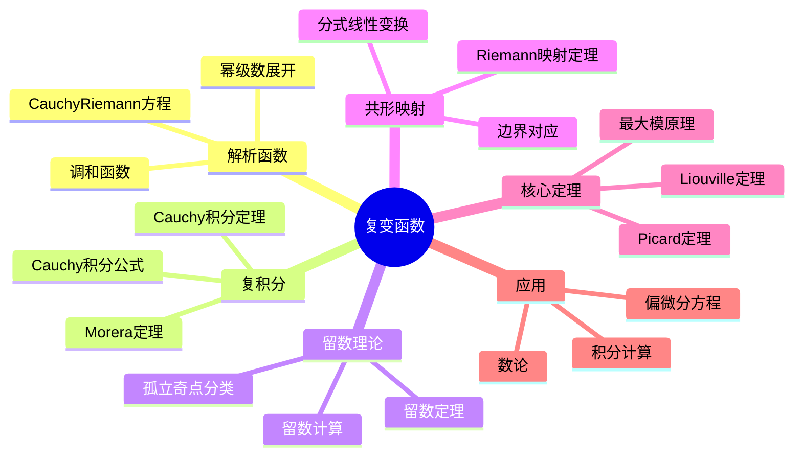

---

**参考章节**：复变函数 - 全章  
**关联文件**：可微性-思维导图.md、流形-思维导图.md

---

<a id="概念20-复乘法"></a>
### 概念20: 复乘法

---
msc_primary: 00A99
msc_secondary:
- 00A99
title: 复乘法
processed_at: '2026-04-05'
---
msc_primary: "00A99"
msc_secondary: ['00-XX']
---

# 复乘法

# 复乘法 思维导图

## 中心概念
椭圆曲线的自同态环大于Z的情形

## 核心分支

\\\mermaid
mindmap
  root((复乘法 Complex Multiplication))
    定义与性质
      形式化定义
      基本性质
      等价条件
      判定方法
    重要定理
      核心定理
      相关引理
      推论
      应用
    典型例子
      经典例子
      反例
      边界情况
      计算实例
    计算方法
      计算公式
      算法步骤
      技巧方法
      复杂度分析
    相关概念
      父概念
      子概念
      相邻概念
      推广概念
    应用领域
      纯数学
      应用数学
      密码学
      编码理论
    历史发展
      创立者
      关键发展
      现代研究
      开放问题
\\\

### 定义与性质
- **形式化定义**: 复乘法 的严格数学定义
- **基本性质**: 核心性质和特征
- **等价条件**: 与其他条件的等价关系

### 重要定理
- **核心定理**: 相关的主要定理
- **证明思路**: 关键证明步骤概述

### 典型例子
- **经典例子**: 最典型的实例
- **计算实例**: 具体计算示例

### 相关概念
- **父概念**: [[相关概念]]
- **子概念**: [[相关概念]]
- **相邻概念**: [[相关概念]]

### 应用领域
- **密码学**: 在密码学中的应用
- **编码理论**: 在编码理论中的应用

### 历史发展
- **创立者**: 历史背景
- **关键发展**: 重要里程碑

---

**概念链接**: [[素数]] [[同余]] [[原根]] [[椭圆曲线]]

---

<a id="概念21-复分析"></a>
### 概念21: 复分析

---
msc_primary: 00A99
msc_secondary:
- 00A99
title: 复分析 思维导图
processed_at: '2026-04-05'
---
msc_primary: "00A99"
msc_secondary: ['00-XX']
---

# 复分析 思维导图

## 中心概念
复分析研究复变函数的理论，是全纯函数的微积分。它拥有比实分析更优美的性质（如Cauchy积分定理、解析延拓），是数学各分支（数论、代数几何、物理）的核心工具。

## 核心分支

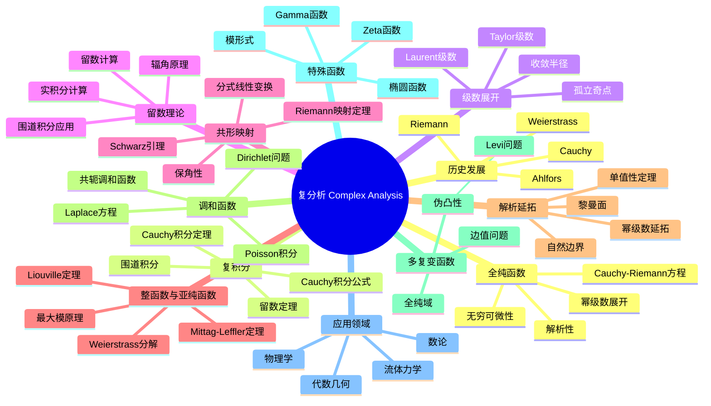

### 定义与公理
- **全纯函数**: $f'(z)$ 存在（复可微）
- **Cauchy-Riemann方程**: $u_x = v_y$，$u_y = -v_x$（$f = u + iv$）
- **解析函数**: 局部可展开为幂级数的函数
- **复积分**: $\int_\gamma f(z)dz = \int_a^b f(\gamma(t))\gamma'(t)dt$

### 基本性质
- **全纯 = 解析**: 复可微蕴含无穷可微和幂级数展开
- **唯一性定理**: 两个全纯函数在聚点集相等则恒等
- **最大模原理**: 非常数全纯函数模不在内部取极大
- **Liouville定理**: 有界整函数必为常数

### 重要例子
- **整函数**: $e^z$，$\sin z$，$\cos z$，多项式
- **亚纯函数**: $\tan z$，$\frac{1}{z}$，$\Gamma(z)$
- **多值函数**: $\log z$，$\sqrt{z}$，$z^\alpha$
- **椭圆函数**: Weierstrass ℘函数，Jacobi椭圆函数
- **模形式**: Eisenstein级数，判别式函数 $\Delta$

### 核心定理
- **Cauchy积分定理**: $\oint_\gamma f(z)dz = 0$（$f$ 全纯，$\gamma$ 可缩）（证明思路：Green定理或同伦）
- **Cauchy积分公式**: $f(a) = \frac{1}{2\pi i}\oint_\gamma \frac{f(z)}{z-a}dz$
- **留数定理**: $\oint_\gamma f(z)dz = 2\pi i \sum \text{Res}(f, a_k)$
- **Riemann映射定理**: 单连通真子域双全纯等价于单位圆盘
- **Weierstrass分解定理**: 整函数表示为无穷乘积

### 相关概念
- **父概念**: 实分析、多元微积分
- **子概念**: 黎曼面、多复变函数、Teichmüller理论
- **相邻概念**: 代数几何、数论、微分几何

### 应用领域
- **数论**: 解析数论、模形式、L-函数
- **代数几何**: 黎曼面、复流形
- **物理学**: 量子力学、统计力学、流体力学
- **工程**: 信号处理、控制理论

### 历史发展
- **创立者**: Augustin-Louis Cauchy (1789-1857) 建立复积分理论
- **关键发展**:
  - 1851：Riemann《博士论文》引入几何观点
  - 1870年代：Weierstrass建立解析函数论
  - 1907：Poincaré-Koebe单值化定理
  - 1935：Ahlfors《Complex Analysis》
- **现代发展**: 多复变函数、复动力系统

### 参考资源
- **推荐教材**: Ahlfors《Complex Analysis》、Stein-Shakarchi《Complex Analysis》
- **相关论文**: Riemann《Grundlagen für eine allgemeine Theorie der Functionen》(1851)
- **在线资源**: Complex Analysis Project (可视化工具)

---

**概念链接**: [[实分析]] [[黎曼面]] [[代数几何]] [[数论]] [[偏微分方程]]

---

<a id="概念22-核心概念思维导图集"></a>
### 概念22: 核心概念思维导图集

---
msc_primary: 00A99
msc_secondary:
- 00A99
title: FormalMath 核心概念思维导图集
processed_at: '2026-04-05'
---
# FormalMath 核心概念思维导图集

> **文档版本**: 1.0
> **创建日期**: 2026年4月3日
> **概念数量**: 100个
> **覆盖领域**: 代数、分析、几何、拓扑、数论

---

## 目录

### 第一部分：代数（20个概念）

1. [群（Group）](#概念1群group)
2. [环（Ring）](#概念2环ring)
3. [域（Field）](#概念3域field)
4. [向量空间](#概念4向量空间)
5. [线性映射](#概念5线性映射)
6. [特征值](#概念6特征值)
7. [子群](#概念7子群)
8. [正规子群](#概念8正规子群)
9. [商群](#概念9商群)
10. [群同态](#概念10群同态)
11. [理想](#概念11理想)
12. [商环](#概念12商环)
13. [整环](#概念13整环)
14. [唯一分解整环](#概念14唯一分解整环)
15. [模](#概念15模)
16. [张量积](#概念16张量积)
17. [代数](#概念17代数)
18. [李代数](#概念18李代数)
19. [表示](#概念19表示)
20. [范畴](#概念20范畴)

### 第二部分：分析（20个概念）

1. [极限](#概念21极限)
2. [连续性](#概念22连续性)
3. [导数](#概念23导数)
4. [积分](#概念24积分)
5. [级数](#概念25级数)
6. [一致连续性](#概念26一致连续性)
7. [一致收敛](#概念27一致收敛)
8. [幂级数](#概念28幂级数)
9. [泰勒级数](#概念29泰勒级数)
10. [傅里叶级数](#概念30傅里叶级数)
11. [反常积分](#概念31反常积分)
12. [含参变量积分](#概念32含参变量积分)
13. [欧拉积分](#概念33欧拉积分)
14. [Stieltjes积分](#概念34stieltjes积分)
15. [数项级数](#概念35数项级数)
16. [函数项级数](#概念36函数项级数)
17. [无穷乘积](#概念37无穷乘积)
18. [函数序列](#概念38函数序列)
19. [稠密性](#概念39稠密性)
20. [完备性](#概念40完备性)

### 第三部分：几何（20个概念）

1. [欧几里得空间](#概念41欧几里得空间)
2. [内积空间](#概念42内积空间)
3. [度量空间](#概念43度量空间)
4. [等距映射](#概念44等距映射)
5. [双曲空间](#概念45双曲空间)
6. [球面几何](#概念46球面几何)
7. [射影空间](#概念47射影空间)
8. [流形](#概念48流形)
9. [切空间](#概念49切空间)
10. [向量场](#概念50向量场)
11. [张量场](#概念51张量场)
12. [微分形式](#概念52微分形式)
13. [黎曼度量](#概念53黎曼度量)
14. [联络](#概念54联络)
15. [曲率](#概念55曲率)
16. [测地线](#概念56测地线)
17. [指数映射](#概念57指数映射)
18. [Jacobi场](#概念58jacobi场)
19. [完备黎曼流形](#概念59完备黎曼流形)
20. [变分法](#概念60变分法)

### 第四部分：拓扑（20个概念）

1. [拓扑空间](#概念61拓扑空间)
2. [开集与闭集](#概念62开集与闭集)
3. [邻域](#概念63邻域)
4. [内部与闭包](#概念64内部与闭包)
5. [边界](#概念65边界)
6. [基与子基](#概念66基与子基)
7. [连续映射](#概念67连续映射)
8. [同胚](#概念68同胚)
9. [连通性](#概念69连通性)
10. [道路连通](#概念70道路连通)
11. [紧致性](#概念71紧致性)
12. [可数性公理](#概念72可数性公理)
13. [分离性公理](#概念73分离性公理)
14. [乘积拓扑](#概念74乘积拓扑)
15. [商拓扑](#概念75商拓扑)
16. [同伦](#概念76同伦)
17. [基本群](#概念77基本群)
18. [覆叠空间](#概念78覆叠空间)
19. [单纯同调](#概念79单纯同调)
20. [胞腔同调](#概念80胞腔同调)

### 第五部分：数论（20个概念）

1. [整除](#概念81整除)
2. [最大公约数](#概念82最大公约数)
3. [同余](#概念83同余)
4. [剩余类](#概念84剩余类)
5. [完全剩余系](#概念85完全剩余系)
6. [简化剩余系](#概念86简化剩余系)
7. [欧拉函数](#概念87欧拉函数)
8. [素数](#概念88素数)
9. [算术基本定理](#概念89算术基本定理)
10. [素数分布](#概念90素数分布)
11. [一次同余方程](#概念91一次同余方程)
12. [孙子定理](#概念92孙子定理)
13. [二次剩余](#概念93二次剩余)
14. [Legendre符号](#概念94legendre符号)
15. [Jacobi符号](#概念95jacobi符号)
16. [原根](#概念96原根)
17. [离散对数](#概念97离散对数)
18. [丢番图方程](#概念98丢番图方程)
19. [Pell方程](#概念99pell方程)
20. [Farey序列](#概念100farey序列)

---

## 第一部分：代数

---

## 概念1：群（Group）

### 核心定义（中心节点）

**正式定义**：群 $(G, \cdot)$ 是一个非空集合 $G$ 配备一个二元运算 $\cdot: G \times G \to G$，满足以下四条公理：

1. **封闭性**：$\forall a, b \in G, a \cdot b \in G$
2. **结合律**：$\forall a, b, c \in G, (a \cdot b) \cdot c = a \cdot (b \cdot c)$
3. **单位元**：$\exists e \in G, \forall a \in G, e \cdot a = a \cdot e = a$
4. **逆元**：$\forall a \in G, \exists a^{-1} \in G, a \cdot a^{-1} = a^{-1} \cdot a = e$

**直观理解**：群是描述"对称性"的数学结构。任何一个保持某种结构不变的变换集合，在复合运算下都构成群。群论被称为"对称性的语言"，因为它抽象地刻画了各种数学对象和物理系统的对称性质。

### 分支1：性质与特征

- **群的阶**：有限群的元素个数，无限群的阶为无穷
- **元素的阶**：使 $a^n = e$ 成立的最小正整数 $n$
- **交换群（Abel群）**：满足交换律 $ab = ba$ 的群
- **循环群**：由一个元素生成的群，记作 $\langle a \rangle$
- **群的中心**：$Z(G) = \{z \in G : zg = gz, \forall g \in G\}$
- **共轭类**：在共轭作用下等价的元素集合

### 分支2：例子与反例

**正例**：

- 整数加法群 $(\mathbb{Z}, +)$
- 非零有理数乘法群 $(\mathbb{Q}^*, \times)$
- $n$ 次单位根群 $\mu_n$
- 对称群 $S_n$（$n$ 个元素的所有置换）
- 循环群 $\mathbb{Z}/n\mathbb{Z}$
- 一般线性群 $GL_n(\mathbb{R})$
- 正 $n$ 边形的二面体群 $D_n$

**反例**：

- 自然数集 $\mathbb{N}$ 不是群（缺少逆元）
- 整数集配乘法不是群（2没有乘法逆元）
- 矩阵集合配乘法一般不是群（奇异矩阵无逆）

### 分支3：相关概念

**前置概念**：集合、二元运算、函数、映射
**后继概念**：子群、正规子群、商群、群同态、群作用、直积群
**平行概念**：半群、幺半群、拟群、环、域

### 分支4：定理与应用

**关键定理**：

- **Lagrange定理**：子群的阶整除群的阶
- **Cayley定理**：每个群都同构于某个对称群的子群
- **Sylow定理**：有限群中 $p$-子群的存在性与共轭性
- **同态基本定理**：$G/\ker \varphi \cong \text{Im}\,\varphi$
- **类方程**：$|G| = |Z(G)| + \sum [G:C_G(x_i)]$

**应用场景**：

- 晶体学中的230种空间群
- 粒子物理中的规范群
- 密码学中的椭圆曲线群
- 化学分子对称性分析
- 纠错码理论

### 分支5：推广与变形

**推广形式**：

- 群胚（Groupoid）：允许部分定义的乘法
- 广群（Groupoid）：每个态射可逆的范畴
- 拓扑群：具有拓扑结构的群
- 李群：具有光滑流形结构的群

**特殊情况**：

- 平凡群：只含单位元的群
- 单群：没有非平凡正规子群的群
- 可解群：具有正规列且因子都是Abel群
- 幂零群：下中心列终止于平凡群

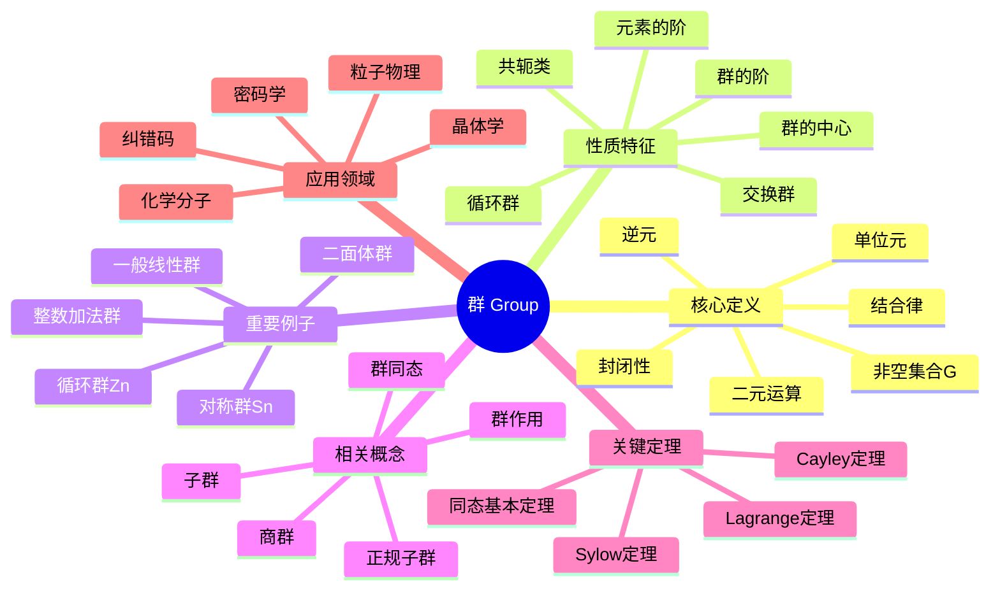

---

## 概念2：环（Ring）

### 核心定义（中心节点）

**正式定义**：环 $(R, +, \cdot)$ 是一个非空集合 $R$ 配备两个二元运算加法 $+$ 和乘法 $\cdot$，满足：

1. $(R, +)$ 是Abel群
2. 乘法满足结合律：$(ab)c = a(bc)$
3. 乘法对加法满足分配律：$a(b+c) = ab + ac$, $(b+c)a = ba + ca$

若乘法有单位元 $1$ 满足 $1 \cdot a = a \cdot 1 = a$，则称为**含幺环**。

**直观理解**：环是同时具有"加法结构"（群）和"乘法结构"（半群）的代数系统。它是整数、多项式、矩阵等数学对象的共同抽象，在数论、代数几何和编码理论中有广泛应用。

### 分支1：性质与特征

- **零因子**：$a \neq 0, b \neq 0$ 但 $ab = 0$
- **整环**：无零因子的交换含幺环
- **除环**：非零元素都有乘法逆的环
- **特征**：使 $n \cdot 1 = 0$ 的最小正整数 $n$
- **幂零元**：存在 $n$ 使 $a^n = 0$
- **单位**：有乘法逆元的元素

### 分支2：例子与反例

**正例**：

- 整数环 $\mathbb{Z}$
- 有理数域 $\mathbb{Q}$（也是环）
- 多项式环 $\mathbb{Z}[x]$
- 矩阵环 $M_n(\mathbb{R})$
- 模 $n$ 剩余类环 $\mathbb{Z}/n\mathbb{Z}$
- 高斯整数环 $\mathbb{Z}[i]$
- 四元数环 $\mathbb{H}$

**反例**：

- 自然数集 $\mathbb{N}$ 不是环（减法不封闭）
- 仅含偶数的集合不是环（无乘法单位元）

### 分支3：相关概念

**前置概念**：群、Abel群、二元运算
**后继概念**：理想、商环、环同态、模、代数
**平行概念**：域、格、半环

### 分支4：定理与应用

**关键定理**：

- **环同态基本定理**：$R/\ker \varphi \cong \text{Im}\,\varphi$
- **中国剩余定理**：关于同余方程组的解
- **Hilbert基定理**：诺特环上的多项式环仍是诺特环
- **Wedderburn小定理**：有限除环必是域

**应用场景**：

- 代数数论中的整数环
- 代数几何中的坐标环
- 编码理论中的循环码
- 密码学中的RSA算法

### 分支5：推广与变形

**推广形式**：

- 非结合环：乘法不要求结合律
- 非交换环：乘法不要求交换律
- graded环：具有分次结构的环

**特殊情况**：

- 布尔环：满足 $a^2 = a$
- 诺特环：理想满足升链条件
- Artin环：理想满足降链条件
- 主理想整环：每个理想都是主理想

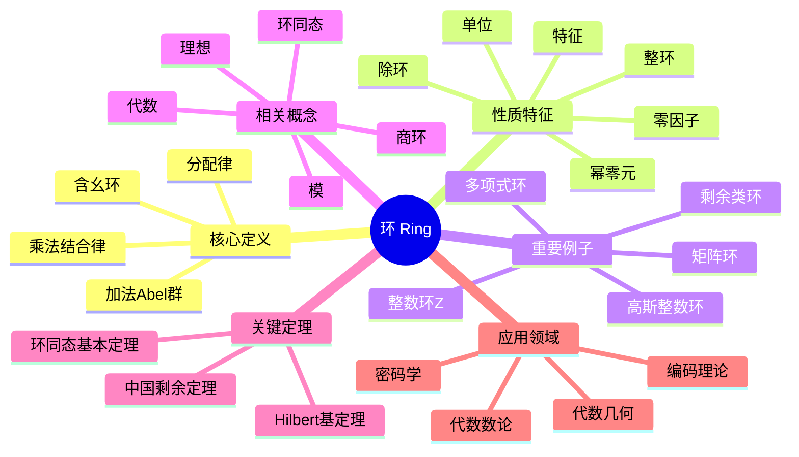

---

## 概念3：域（Field）

### 核心定义（中心节点）

**正式定义**：域 $(F, +, \cdot)$ 是一个非空集合 $F$ 配备两个二元运算，满足：

1. $(F, +)$ 是Abel群，单位元记为 $0$
2. $(F^*, \cdot)$ 是Abel群，其中 $F^* = F \setminus \{0\}$
3. 乘法对加法满足分配律

**直观理解**：域是"最好"的代数结构，在其中可以进行加、减、乘、除（除零外）四则运算。有理数、实数、复数都是域的典型例子。域论是代数学的核心分支，与方程论、数论、代数几何密切相关。

### 分支1：性质与特征

- **特征**：$\text{char}(F)$ 是使 $n \cdot 1 = 0$ 的最小正整数，或0
- **素域**：不含真子域的域，同构于 $\mathbb{Q}$ 或 $\mathbb{F}_p$
- **代数闭域**：每个多项式都有根
- **域扩张**：$K/F$ 表示 $K$ 是 $F$ 的扩域
- **扩张次数**：$[K:F] = \dim_F K$
- **可分扩张**：极小多项式无重根

### 分支2：例子与反例

**正例**：

- 有理数域 $\mathbb{Q}$
- 实数域 $\mathbb{R}$
- 复数域 $\mathbb{C}$
- 有限域 $\mathbb{F}_p = \mathbb{Z}/p\mathbb{Z}$（$p$ 素数）
- 有限域 $\mathbb{F}_{p^n}$
- 代数数域 $\mathbb{Q}(\sqrt{2})$
- 有理函数域 $\mathbb{Q}(x)$

**反例**：

- 整数环 $\mathbb{Z}$ 不是域（2无乘法逆元）
- 矩阵环 $M_n(\mathbb{R})$ 不是域（非零矩阵可能无逆）
- $\mathbb{Z}/4\mathbb{Z}$ 不是域（2是零因子）

### 分支3：相关概念

**前置概念**：群、环、Abel群
**后继概念**：域扩张、Galois理论、代数闭包、赋值论
**平行概念**：除环、整环、格

### 分支4：定理与应用

**关键定理**：

- **域扩张基本定理**：中间域与Galois群子群的对应
- **Wedderburn定理**：有限除环是域
- **Steinitz定理**：每个域都有代数闭包
- **Wedderburn小定理**：有限整环是域
- **原根定理**：有限域的乘法群是循环群

**应用场景**：

- 方程的可解性（Galois理论）
- 尺规作图问题
- 编码理论（有限域上的码）
- 密码学（椭圆曲线密码）
- 代数几何

### 分支5：推广与变形

**推广形式**：

- 除环（斜域）：乘法不要求交换的域
- 近域：弱化分配律的代数结构
- 形式域：具有序结构的域

**特殊情况**：

- 代数闭域：复数域 $\mathbb{C}$
- 实闭域：实数域 $\mathbb{R}$
- 局部域：$p$-进数域
- 整体域：数域和函数域
- 完美域：特征 $p$ 时 Frobenius 是自同构

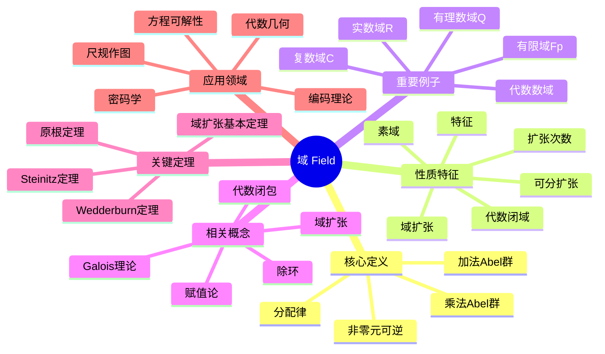

---

## 概念4：向量空间

### 核心定义（中心节点）

**正式定义**：设 $F$ 是域，$V$ 是Abel群。若存在数乘运算 $F \times V \to V$ 满足：

1. $1 \cdot v = v$
2. $(ab) \cdot v = a \cdot (b \cdot v)$
3. $a \cdot (u + v) = a \cdot u + a \cdot v$
4. $(a + b) \cdot v = a \cdot v + b \cdot v$

则称 $V$ 是 $F$ 上的向量空间。

**直观理解**：向量空间是几何向量的代数抽象，是线性代数的基本研究对象。它提供了一个框架，在其中可以讨论线性相关性、基、维数等核心概念，是物理学、工程学和数据科学的基础工具。

### 分支1：性质与特征

- **维数**：基的元素个数，记作 $\dim_F V$
- **有限维/无限维**：根据维数是否有限
- **基**：线性无关的生成集
- **坐标**：向量关于基的表示系数
- **线性包**：子集生成的子空间
- **直和分解**：$V = U \oplus W$

### 分支2：例子与反例

**正例**：

- $F^n$：$n$ 维标准向量空间
- $M_{m \times n}(F)$：$m \times n$ 矩阵空间
- $F[x]$：多项式空间（无限维）
- $F[x]_{\leq n}$：次数不超过 $n$ 的多项式
- $C[a,b]$：连续函数空间
- 域扩张 $K/F$：$K$ 是 $F$ 上的向量空间
- 解空间：齐次线性方程组的解集

**反例**：

- 自然数集不是向量空间（无加法逆元）
- 仅含整数坐标的 $\mathbb{Z}^n$ 不是 $\mathbb{R}$-向量空间

### 分支3：相关概念

**前置概念**：域、Abel群、群作用
**后继概念**：线性映射、子空间、商空间、对偶空间、张量积
**平行概念**：模、代数、李代数

### 分支4：定理与应用

**关键定理**：

- **基存在定理**：每个向量空间都有基
- **维数定理**：$\dim U + \dim W = \dim(U+W) + \dim(U \cap W)$
- **同构定理**：同维数向量空间同构
- **对偶空间定理**：$V \cong V^{**}$（有限维）
- **商空间维数**：$\dim(V/U) = \dim V - \dim U$

**应用场景**：

- 物理学中的状态空间
- 计算机图形学
- 机器学习中的特征空间
- 信号处理
- 量子力学

### 分支5：推广与变形

**推广形式**：

- 模：环上的向量空间
- 分级向量空间：具有分次结构
- 拓扑向量空间：具有拓扑结构

**特殊情况**：

- 内积空间：具有内积结构的向量空间
- 赋范空间：具有范数的向量空间
- Banach空间：完备的赋范空间
- Hilbert空间：完备的内积空间

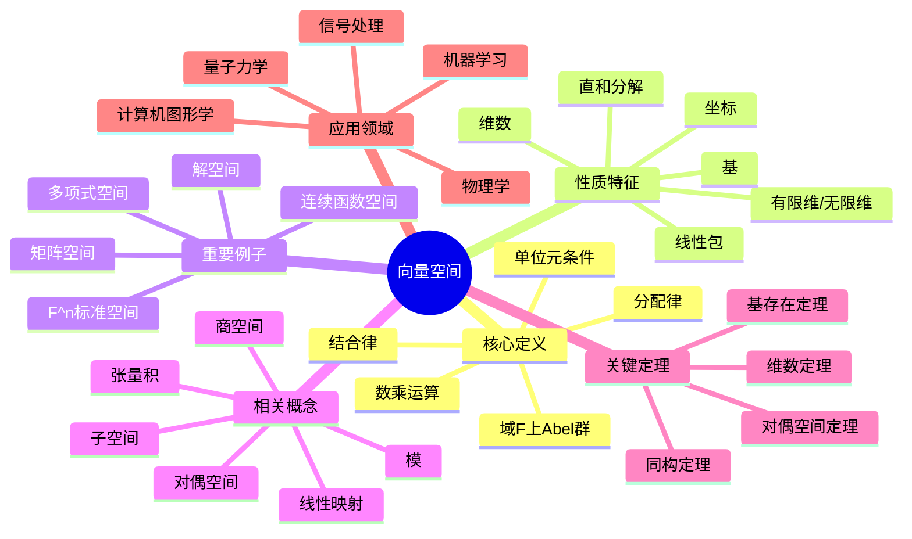

---

## 概念5：线性映射

### 核心定义（中心节点）

**正式定义**：设 $V, W$ 是 $F$-向量空间，映射 $T: V \to W$ 称为线性映射，如果：

1. $T(u + v) = T(u) + T(v)$（加法保持）
2. $T(av) = aT(v)$（数乘保持）

等价地：$T(au + bv) = aT(u) + bT(v)$

**直观理解**：线性映射是向量空间之间的"结构保持"映射，它保持加法和数乘运算。线性映射是研究向量空间之间关系的基本工具，其矩阵表示架起了抽象代数与具体计算之间的桥梁。

### 分支1：性质与特征

- **单射/满射/双射**：作为集合映射的性质
- **同构**：双射线性映射
- **核**：$\ker T = \{v \in V : T(v) = 0\}$
- **像**：$\text{Im}\,T = \{T(v) : v \in V\}$
- **秩**：$\text{rank}(T) = \dim(\text{Im}\,T)$
- **零化度**：$\text{nullity}(T) = \dim(\ker T)$

### 分支2：例子与反例

**正例**：

- 零映射：$T(v) = 0$
- 恒等映射：$I(v) = v$
- 投影映射：$P(x,y) = (x,0)$
- 微分算子：$D(f) = f'$
- 积分算子：$T(f) = \int_a^b f(t)dt$
- 矩阵乘法：$T_A(x) = Ax$
- 旋转矩阵：$R_\theta = \begin{pmatrix} \cos\theta & -\sin\theta \\ \sin\theta & \cos\theta \end{pmatrix}$

**反例**：

- 平移映射：$T(v) = v + c$（$c \neq 0$）
- 平方映射：$T(x) = x^2$
- 仿射变换（一般情况）

### 分支3：相关概念

**前置概念**：向量空间、映射、矩阵
**后继概念**：线性变换、特征值、不变子空间、Jordan标准形
**平行概念**：群同态、环同态、模同态

### 分支4：定理与应用

**关键定理**：

- **秩-零化度定理**：$\dim V = \text{rank}(T) + \text{nullity}(T)$
- **同构定理**：$V/\ker T \cong \text{Im}\,T$
- **维数定理**：$\dim(V \oplus W) = \dim V + \dim W$
- **表示定理**：有限维时，线性映射对应矩阵

**应用场景**：

- 线性方程组的求解
- 最小二乘拟合
- 主成分分析（PCA）
- 图像变换（旋转、缩放）
- 量子力学中的可观测量

### 分支5：推广与变形

**推广形式**：

- 模同态：环上模的线性映射
- 多重线性映射：多变量线性映射
- 半线性映射：与域自同构相容的映射

**特殊情况**：

- 线性变换：$V \to V$ 的线性映射
- 线性泛函：$V \to F$ 的线性映射
- 自同态：$V \to V$ 的线性映射
- 自同构：可逆的自同态

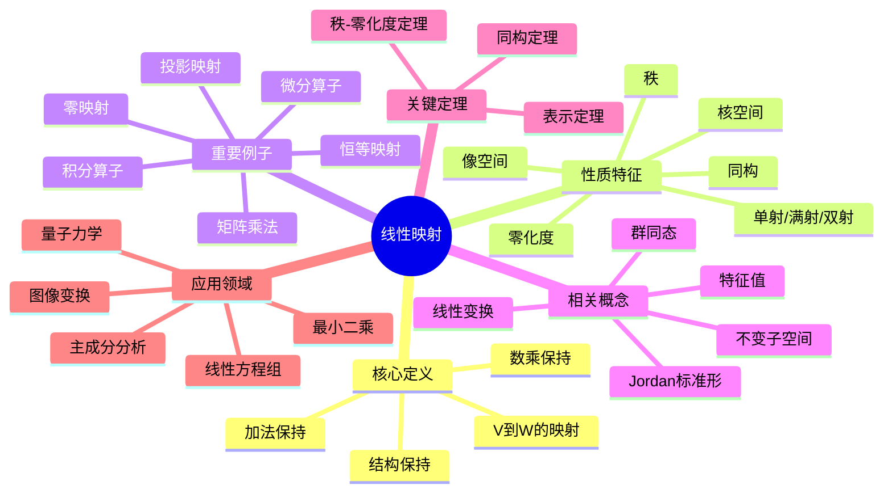

---

## 概念6：特征值

### 核心定义（中心节点）

**正式定义**：设 $T: V \to V$ 是线性变换，若存在 $\lambda \in F$ 和非零向量 $v \in V$ 使得：
$$T(v) = \lambda v$$

则称 $\lambda$ 为 $T$ 的**特征值**，$v$ 为对应的**特征向量**。

矩阵情形：$Av = \lambda v$，即 $(A - \lambda I)v = 0$ 有非零解。

**直观理解**：特征向量是在线性变换下保持方向（或反向）的"特殊方向"，特征值是该方向的伸缩因子。特征值问题是线性代数的核心，在物理、工程、数据分析中无处不在。

### 分支1：性质与特征

- **特征多项式**：$p_T(\lambda) = \det(A - \lambda I)$
- **代数重数**：特征根在特征多项式中的重数
- **几何重数**：特征子空间的维数
- **谱**：所有特征值的集合 $\sigma(T)$
- **特征子空间**：$E_\lambda = \{v : T(v) = \lambda v\}$
- **可对角化**：存在由特征向量组成的基

### 分支2：例子与反例

**正例**：

- 投影矩阵：特征值0和1
- 旋转矩阵（$\mathbb{R}^2$）：无实特征值（有复特征值）
- 对角矩阵：对角元即为特征值
- 置换矩阵：特征值是单位根
- 实对称矩阵：特征值都是实数
- 正定矩阵：特征值都是正数

**反例**：

- 幂零矩阵 $N$：唯一特征值0，但 $N \neq 0$
- 某些矩阵在实数域上无特征值

### 分支3：相关概念

**前置概念**：线性变换、行列式、特征多项式
**后继概念**：对角化、Jordan标准形、谱分解、奇异值分解
**平行概念**：特征函数、本征值、谱理论

### 分支4：定理与应用

**关键定理**：

- **代数基本定理**：复矩阵总有特征值
- **Cayley-Hamilton定理**：矩阵满足其特征多项式
- **谱定理**：正规矩阵可酉对角化
- **Gershgorin圆盘定理**：特征值位置估计
- **Perron-Frobenius定理**：正矩阵的最大特征值性质

**应用场景**：

- 振动分析（特征频率）
- 主成分分析
- 马尔可夫链的稳态分布
- Google的PageRank算法
- 量子力学的能级
- 图像压缩

### 分支5：推广与变形

**推广形式**：

- 广义特征值：$Av = \lambda Bv$
- 算子谱理论：无穷维空间上的推广
- 数值范围：特征值的推广概念

**特殊情况**：

- 实对称矩阵：特征值实，特征向量正交
- 酉矩阵：特征值模为1
- 正规矩阵：可酉对角化
- 正定矩阵：特征值全正

```mermaid
mindmap
  root((特征值))
    核心定义
      T(v) = λv
      特征向量非零
      伸缩因子
      特殊方向
    性质特征
      特征多项式
      代数重数
      几何重数
      谱
      特征子空间
      可对角化
    重要例子
      投影矩阵
      旋转矩阵
      对角矩阵
      置换矩阵
      实对称矩阵
      正定矩阵
    相关概念
      对角化
      Jordan标准形
      谱分解
      奇异值分解
      特征函数
    关键定理
      Cayley-Hamilton
      谱定理
      Gershgorin定理
      Perron-Frobenius
    应用领域
      振动分析
      主成分分析
      马尔可夫链
      PageRank
      量子力学
      图像压缩

```

---

## 概念7：子群

### 核心定义（中心节点）

**正式定义**：设 $G$ 是群，$H \subseteq G$ 非空。若 $H$ 在 $G$ 的运算下也构成群，则称 $H$ 是 $G$ 的**子群**，记作 $H \leq G$。

等价判定：$H \leq G$ 当且仅当：

1. $e \in H$
2. $a, b \in H \Rightarrow ab \in H$
3. $a \in H \Rightarrow a^{-1} \in H$

或简化为：$a, b \in H \Rightarrow ab^{-1} \in H$

**直观理解**：子群是群中的"子结构"，保持原群的运算封闭。研究子群是理解群结构的基本方法，通过分析子群及其关系可以揭示群的整体性质。

### 分支1：性质与特征

- **平凡子群**：$\{e\}$ 和 $G$ 本身
- **真子群**：$H \subsetneq G$
- **生成子群**：$\langle S \rangle$ 是包含 $S$ 的最小子群
- **循环子群**：$\langle a \rangle = \{a^n : n \in \mathbb{Z}\}$
- **共轭子群**：$gHg^{-1}$ 是 $H$ 的共轭
- **子群格**：所有子群在包含关系下的格

### 分支2：例子与反例

**正例**：

- $n\mathbb{Z} \leq \mathbb{Z}$（$n$ 的倍数）
- $A_n \leq S_n$（交错群）
- $SL_n(F) \leq GL_n(F)$（特殊线性群）
- 旋转子群 $\langle r \rangle \leq D_n$
- 中心 $Z(G) \leq G$
- 换位子群 $[G,G] \leq G$

**反例**：

- 自然数 $\mathbb{N} \subseteq \mathbb{Z}$ 不是子群（无逆元）
- 偶置换和奇置换的并集不是子群

### 分支3：相关概念

**前置概念**：群、群运算、逆元
**后继概念**：正规子群、商群、Lagrange定理、Sylow定理
**平行概念**：子环、子域、子空间

### 分支4：定理与应用

**关键定理**：

- **Lagrange定理**：$|G| = [G:H] \cdot |H|$

- **子群判定准则**：单步判定法
- **Cauchy定理**：若 $p \mid |G|$，则存在 $p$ 阶子群

- **Sylow定理**：$p$-子群的存在性和共轭性

**应用场景**：

- 群的结构分析
- 对称性分析
- 晶体学中的点群
- 化学分子对称性

### 分支5：推广与变形

**推广形式**：

- 子半群、子幺半群
- 特征子群：在所有自同构下不变
- 全不变子群：在所有自同态下不变

**特殊情况**：

- 极大子群：无真包含它的真子群
- 极小子群：不包含真子群的非平凡子群
- Hall子群：阶与指数互素的子群

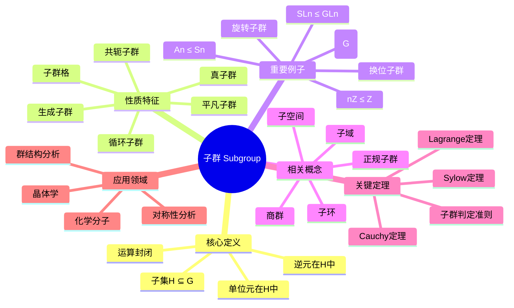

---

## 概念8：正规子群

### 核心定义（中心节点）

**正式定义**：子群 $N \leq G$ 称为**正规子群**（或不变子群），记作 $N \trianglelefteq G$，如果满足以下等价条件之一：

1. $\forall g \in G, gN = Ng$（左右陪集相等）
2. $\forall g \in G, gNg^{-1} = N$（共轭封闭）
3. $N$ 是某个群同态的核

**直观理解**：正规子群是在群的共轭作用下"对称"的子群。正规子群的重要性在于它可以构造商群——通过将正规子群的元素"等同"为单位元，可以得到一个新的群结构。

### 分支1：性质与特征

- **自正规性**：$N \trianglelefteq G$ 时，$N \trianglelefteq N_G(N)$
- **传递性**：$K \trianglelefteq H \trianglelefteq G$ 不蕴含 $K \trianglelefteq G$
- **交的性质**：正规子群的交仍是正规子群
- **积的性质**：$N_1 N_2$ 若子群则正规
- **对应定理**：商群的子群与原群含 $N$ 的子群对应

### 分支2：例子与反例

**正例**：

- 所有群的平凡子群 $\{e\}$ 和 $G$
- Abel群的所有子群
- 中心 $Z(G) \trianglelefteq G$
- 换位子群 $[G,G] \trianglelefteq G$
- $A_n \trianglelefteq S_n$（$n \geq 2$）
- $SL_n(F) \trianglelefteq GL_n(F)$

**反例**：

- $\{e, (12)\} \leq S_3$ 不是正规子群
- 一般地，非Abel群的真子群常不正规

### 分支3：相关概念

**前置概念**：子群、陪集、共轭
**后继概念**：商群、群同态基本定理、合成列
**平行概念**：理想（环论中对应概念）

### 分支4：定理与应用

**关键定理**：

- **正规子群与商群**：$N \trianglelefteq G \Rightarrow G/N$ 是群
- **同态基本定理**：$G/\ker \varphi \cong \text{Im}\,\varphi$
- **第二同构定理**：$HN/N \cong H/(H \cap N)$
- **第三同构定理**：$(G/N)/(H/N) \cong G/H$
- **对应定理**：子群格之间的对应

**应用场景**：

- 群的分类（通过正规列）
- 可解群、幂零群理论
- Galois理论
- 物理学中的规范群

### 分支5：推广与变形

**推广形式**：

- 次正规子群：存在正规列连接
- 特征子群：在所有自同构下不变
- 全特征子群：在所有自同态下不变

**特殊情况**：

- 极小正规子群
- 极大正规子群
- 主群列中的因子

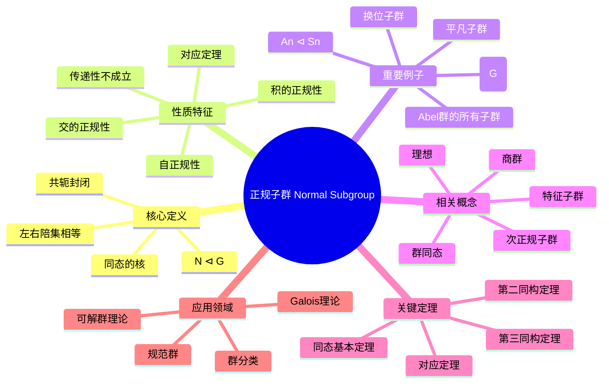

---

## 概念9：商群

### 核心定义（中心节点）

**正式定义**：设 $N \trianglelefteq G$ 是正规子群。商群 $G/N$ 定义为所有陪集的集合：
$$G/N = \{gN : g \in G\}$$

运算定义为：$(gN)(hN) = (gh)N$

单位元是 $N = eN$，逆元是 $(gN)^{-1} = g^{-1}N$。

**直观理解**：商群是通过"模去"正规子群得到的简化结构。将 $N$ 中所有元素视为"零"或"单位元"，商群描述了群 $G$ 关于 $N$ 的"粗粒度"结构。这是构造新群、研究群结构的基本工具。

### 分支1：性质与特征

- **阶**：$|G/N| = [G:N] = |G|/|N|$（Lagrange）

- **典范映射**：$\pi: G \to G/N, g \mapsto gN$ 是满同态
- **核**：$\ker \pi = N$
- **单性**：$G/N$ 是单群当且仅当 $N$ 是极大正规子群
- **交换性**：$G/N$ Abel 当且仅当 $[G,G] \subseteq N$

### 分支2：例子与反例

**正例**：

- $\mathbb{Z}/n\mathbb{Z}$：整数模 $n$ 加法群
- $S_n/A_n \cong \mathbb{Z}/2\mathbb{Z}$（符号同态）
- $GL_n(F)/SL_n(F) \cong F^*$（行列式同态）
- $G/Z(G)$：内自同构群
- $\mathbb{R}/\mathbb{Z} \cong S^1$（圆群）
- $\mathbb{C}^*/\mathbb{R}^+ \cong S^1$

**反例**：

- $H$ 不正规时，$G/H$ 无自然的群结构

### 分支3：相关概念

**前置概念**：正规子群、陪集、群同态
**后继概念**：群扩张、半直积、直积
**平行概念**：商环、商空间、商模

### 分支4：定理与应用

**关键定理**：

- **商群良定性**：运算与代表元选取无关
- **同态基本定理**：任何同态像都同构于某商群
- **对应定理**：$G/N$ 的子群与含 $N$ 的子群对应
- **Jordan-Hölder定理**：合成列的唯一性

**应用场景**：

- 模算术（$\mathbb{Z}/n\mathbb{Z}$）
- 伽罗瓦理论
- 同调代数
- 拓扑中的覆叠空间
- 表示论

### 分支5：推广与变形

**推广形式**：

- 商半群、商幺半群
- 商广群
- 商范畴

**特殊情况**：

- 平凡商群：$G/\{e\} \cong G$
- 单位商群：$G/G \cong \{e\}$
- 导商群：$G/[G,G]$（最大Abel商）

```mermaid
mindmap
  root((商群 Quotient Group))
    核心定义
      N ⊲ G的陪集
      G/N = {gN}
      陪集乘法
      典范投影
    性质特征
      阶|G/N|=[G:N]

      典范映射
      核等于N
      单性条件
      交换性条件
    重要例子
      Z/nZ
      Sn/An
      GLn/SLn
      G/Z(G)
      R/Z ≅ S¹
    相关概念
      正规子群
      群同态
      商环
      商空间
      商模
    关键定理
      良定性
      同态基本定理
      对应定理
      Jordan-Hölder
    应用领域
      模算术
      Galois理论
      同调代数
      覆叠空间
      表示论

```

---

## 概念10：群同态

### 核心定义（中心节点）

**正式定义**：设 $G, H$ 是群，映射 $\varphi: G \to H$ 称为**群同态**，如果：
$$\varphi(ab) = \varphi(a)\varphi(b), \quad \forall a, b \in G$$

即保持群运算的映射。

**分类**：

- **单同态**（嵌入）：单射同态
- **满同态**：满射同态
- **同构**：双射同态，记作 $G \cong H$
- **自同态**：$G \to G$ 的同态
- **自同构**：可逆的自同态

**直观理解**：群同态是群之间的"结构保持"映射，它保持乘法关系。通过研究群同态，可以比较不同群的结构，建立群之间的联系，是群论的核心工具。

### 分支1：性质与特征

- **保持单位元**：$\varphi(e_G) = e_H$
- **保持逆元**：$\varphi(a^{-1}) = \varphi(a)^{-1}$
- **保持幂次**：$\varphi(a^n) = \varphi(a)^n$
- **核**：$\ker \varphi = \{g \in G : \varphi(g) = e_H\}$
- **像**：$\text{Im}\,\varphi = \{\varphi(g) : g \in G\}$

### 分支2：例子与反例

**正例**：

- 零同态：$\varphi(g) = e_H$
- 嵌入映射：$\mathbb{Z} \hookrightarrow \mathbb{Q}$
- 行列式：$\det: GL_n(F) \to F^*$
- 符号映射：$\text{sgn}: S_n \to \{\pm 1\}$
- 指数映射：$\exp: (\mathbb{R}, +) \to (\mathbb{R}^+, \times)$
- 模 $n$ 约化：$\mathbb{Z} \to \mathbb{Z}/n\mathbb{Z}$

**反例**：

- 平移：$\varphi(g) = ga$（$a \neq e$）
- 平方映射（一般群）
- 非线性映射

### 分支3：相关概念

**前置概念**：群、映射、子群
**后继概念**：同态基本定理、群作用、表示
**平行概念**：环同态、线性映射、函子

### 分支4：定理与应用

**关键定理**：

- **同态基本定理**：$G/\ker \varphi \cong \text{Im}\,\varphi$
- **单射判定**：$\varphi$ 单 $\Leftrightarrow \ker \varphi = \{e\}$
- **第一同构定理**（已包含在基本定理中）
- **自同构群**：$\text{Aut}(G)$ 构成群

**应用场景**：

- 群分类（通过同态像）
- 表示论
- Galois理论
- 同调代数
- 密码学

### 分支5：推广与变形

**推广形式**：

- 广群同态
- 拓扑群连续同态
- 李群光滑同态

**特殊情况**：

- 典范投影：$G \to G/N$
- 内自同构：$\varphi_g(x) = gxg^{-1}$
- 特征标：$G \to \mathbb{C}^*$

```mermaid
mindmap
  root((群同态 Group Homomorphism))
    核心定义
      φ(ab) = φ(a)φ(b)
      保持运算
      单/满/同构
      自同态
      自同构
    性质特征
      保持单位元
      保持逆元
      保持幂次
      核ker φ
      像Im φ
    重要例子
      零同态
      嵌入映射
      行列式
      符号映射
      指数映射
      模n约化
    相关概念
      同态基本定理
      群作用
      表示
      环同态
      函子
    关键定理
      同态基本定理
      单射判定
      自同构群
    应用领域
      群分类
      表示论
      Galois理论
      同调代数
      密码学

```

---

## 概念11：理想

### 核心定义（中心节点）

**正式定义**：设 $R$ 是环，$I \subseteq R$ 是加法子群。若满足：

1. **左理想**：$\forall r \in R, a \in I \Rightarrow ra \in I$
2. **右理想**：$\forall r \in R, a \in I \Rightarrow ar \in I$
3. **双边理想**：同时是左理想和右理想

则称 $I$ 是 $R$ 的理想。交换环中三者一致。

**直观理解**：理想是环论中对应于正规子群的概念。它可以构造商环，是研究环的结构和性质的核心工具。在整数环中，理想就是主理想 $(n) = n\mathbb{Z}$。

### 分支1：性质与特征

- **生成理想**：$(S)$ 是包含 $S$ 的最小理想
- **主理想**：由一个元素生成的理想 $(a)$
- **极大理想**：无真包含它的真理想
- **素理想**：$ab \in P \Rightarrow a \in P$ 或 $b \in P$
- **准素理想**：幂零元条件弱化版本
- **理想的和与积**：新的理想构造方法

### 分支2：例子与反例

**正例**：

- $n\mathbb{Z} \subseteq \mathbb{Z}$（所有主理想）
- $(x) \subseteq F[x]$（多项式环）
- 零理想 $\{0\}$ 和单位理想 $R$
- 矩阵环 $M_n(F)$ 只有平凡理想
- 理想 $(2, x) \subseteq \mathbb{Z}[x]$

**反例**：

- 子环不一定是理想（如 $\mathbb{Z} \subseteq \mathbb{Q}$）
- 加法子群不一定是理想

### 分支3：相关概念

**前置概念**：环、子群、正规子群
**后继概念**：商环、素谱、极大谱、局部化
**平行概念**：子模、正规子群

### 分支4：定理与应用

**关键定理**：

- **商环构造**：$I$ 理想 $\Rightarrow R/I$ 是环
- **对应定理**：$R/I$ 的理想与含 $I$ 的理想对应
- **极大理想存在**：含单位元的环必有极大理想（Zorn引理）
- **Krull定理**：$R$ 是域 $\Leftrightarrow$ 只有平凡理想

**应用场景**：

- 代数数论（整数环的理想分解）
- 代数几何（素谱作为几何对象）
- 编码理论
- 代数整数环的类群

### 分支5：推广与变形

**推广形式**：

- 分式理想：在分式域中
- 可逆理想：可逆的分式理想
- 整闭理想：与整闭包相关

**特殊情况**：

- 主理想整环（PID）
- 诺特环：理想满足升链条件
- Artin环：理想满足降链条件

```mermaid
mindmap
  root((理想 Ideal))
    核心定义
      加法子群
      左/右吸收性
      双边理想
      商环构造
    性质特征
      生成理想
      主理想
      极大理想
      素理想
      准素理想
      和与积
    重要例子
      nZ ⊆ Z
      (x) ⊆ F[x]
      平凡理想
      矩阵环
      (2, x) ⊆ Z[x]
    相关概念
      商环
      素谱
      极大谱
      局部化
      子模
    关键定理
      商环构造
      对应定理
      极大理想存在
      Krull定理
    应用领域
      代数数论
      代数几何
      编码理论
      类群

```

---

## 概念12：商环

### 核心定义（中心节点）

**正式定义**：设 $R$ 是环，$I$ 是 $R$ 的双边理想。商环 $R/I$ 定义为所有陪集的集合：
$$R/I = \{r + I : r \in R\}$$

运算定义为：

- 加法：$(r + I) + (s + I) = (r + s) + I$
- 乘法：$(r + I)(s + I) = rs + I$

**直观理解**：商环是通过"模去"理想得到的简化结构。类似于群中的商群，商环将理想中的元素"等同"为零，从而研究环的粗粒度结构。这是构造新环、研究环性质的基本工具。

### 分支1：性质与特征

- **典范投影**：$\pi: R \to R/I, r \mapsto r + I$ 是环同态
- **核**：$\ker \pi = I$
- **理想的对应**：$R/I$ 的理想 $\leftrightarrow$ 含 $I$ 的 $R$ 的理想
- **素理想的对应**：素理想在投影下对应
- **极大理想的对应**：极大理想在投影下对应

### 分支2：例子与反例

**正例**：

- $\mathbb{Z}/n\mathbb{Z}$：整数模 $n$
- $F[x]/(x^2)$：对偶数环
- $F[x]/(p(x))$：域扩张构造
- $\mathbb{R}[x]/(x^2 + 1) \cong \mathbb{C}$
- $k[x,y]/(x,y) \cong k$

**反例**：

- 子环 $S$ 不一定是理想，$R/S$ 一般无环结构

### 分支3：相关概念

**前置概念**：理想、环同态、商群
**后继概念**：中国剩余定理、素谱、Jacobson根
**平行概念**：商群、商空间、商模

### 分支4：定理与应用

**关键定理**：

- **环同态基本定理**：$R/\ker \varphi \cong \text{Im}\,\varphi$
- **第一同构定理**：$(R/I)/(J/I) \cong R/J$
- **第二同构定理**：$(I + J)/J \cong I/(I \cap J)$
- **中国剩余定理**：关于两两互素理想的直积分解

**应用场景**：

- 模算术
- 域的构造（通过不可约多项式）
- 代数几何（坐标环）
- 同调代数

### 分支5：推广与变形

**推广形式**：

- 局部化：$S^{-1}R$
- 完备化：$\varprojlim R/I^n$
- 形式幂级数环

**特殊情况**：

- 域：当 $I$ 是极大理想时
- 整环：当 $I$ 是素理想时
- 约化环：幂零元理想为零

```mermaid
mindmap
  root((商环 Quotient Ring))
    核心定义
      理想I的陪集
      R/I = {r+I}
      陪集加法
      陪集乘法
    性质特征
      典范投影
      核等于I
      理想对应
      素理想对应
      极大理想对应
    重要例子
      Z/nZ
      F[x]/(x²)
      域扩张
      R[x]/(x²+1)≅C
      k[x,y]/(x,y)
    相关概念
      理想
      环同态
      中国剩余定理
      素谱
      Jacobson根
    关键定理
      环同态基本定理
      第一同构定理
      第二同构定理
      中国剩余定理
    应用领域
      模算术
      域构造
      代数几何
      同调代数

```

---

## 概念13：整环

### 核心定义（中心节点）

**正式定义**：环 $R$ 称为**整环**（Integral Domain），如果满足：

1. $R$ 是交换环
2. $R$ 有单位元 $1 \neq 0$
3. $R$ 无零因子：$ab = 0 \Rightarrow a = 0$ 或 $b = 0$

**直观理解**：整环是最接近整数环性质的环结构。在其中可以进行"约分"（消去律），是唯一分解整环、主理想整环、欧几里得整环等更特殊环的基类。整环的商域构造是获得域的标准方法。

### 分支1：性质与特征

- **消去律**：$ab = ac, a \neq 0 \Rightarrow b = c$
- **整除关系**：$a \mid b$ 定义与整数类似
- **相伴元**：$a \sim b$ 若 $a = ub$，$u$ 是单位
- **不可约元**：不能分解为两个非单位乘积
- **素元**：$p \mid ab \Rightarrow p \mid a$ 或 $p \mid b$
- **唯一分解性质**（UFD特有）

### 分支2：例子与反例

**正例**：

- 整数环 $\mathbb{Z}$
- 域（特殊的整环）
- 多项式环 $F[x]$
- 高斯整数环 $\mathbb{Z}[i]$
- Eisenstein整数环 $\mathbb{Z}[\omega]$
- $k[x_1, \ldots, x_n]$（$k$ 是域）

**反例**：

- $\mathbb{Z}/6\mathbb{Z}$（$2 \cdot 3 = 0$）
- $k[x,y]/(xy)$（有零因子）
- $M_2(\mathbb{R})$（非交换且有零因子）
- 偶数环 $2\mathbb{Z}$（无单位元）

### 分支3：相关概念

**前置概念**：环、交换环、零因子
**后继概念**：唯一分解整环、主理想整环、欧几里得整环、商域
**平行概念**：素环、半素环

### 分支4：定理与应用

**关键定理**：

- **整环的商域**：每个整环可嵌入域中
- **多项式环**：$R$ 整环 $\Rightarrow R[x]$ 整环
- **素理想**：$R/P$ 整环 $\Leftrightarrow P$ 素理想
- **整闭包**：在代数扩张中的整闭包仍是整环

**应用场景**：

- 数论（代数整数环）
- 代数几何（坐标环）
- 编码理论
- 代数K-理论

### 分支5：推广与变形

**推广形式**：

- 唯一分解整环（UFD）
- 主理想整环（PID）
- 欧几里得整环
- Dedekind整环

**特殊情况**：

- 域：非零元都可逆的整环
- 局部整环：只有一个极大理想
- 正规整环：整闭的整环

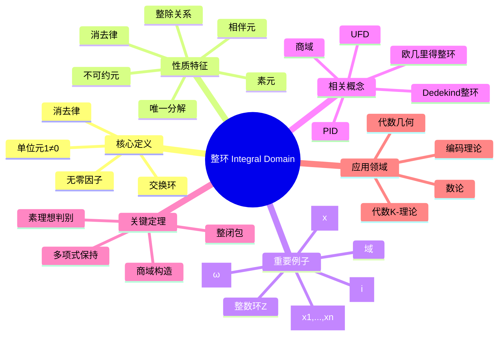

---

## 概念14：唯一分解整环

### 核心定义（中心节点）

**正式定义**：整环 $R$ 称为**唯一分解整环**（Unique Factorization Domain, UFD），如果满足：

1. **存在性**：每个非零非单位元 $a$ 可写为不可约元的乘积
2. **唯一性**：若 $a = p_1 \cdots p_m = q_1 \cdots q_n$，则 $m = n$ 且（重排后）$p_i \sim q_i$

**直观理解**：UFD是保持算术基本定理（唯一分解定理）的环结构。在UFD中，因子分解理论类似于整数中的素因子分解，为研究环的算术性质提供了基础。

### 分支1：性质与特征

- **不可约元 = 素元**
- **最大公因子存在**：任意有限集合有gcd
- **理想升链**：主理想满足升链条件
- **分式理想**：可逆分式理想构成类群
- **Krull维数**：通常 $\dim \leq 1$ 时是Dedekind整环

### 分支2：例子与反例

**正例**：

- 整数环 $\mathbb{Z}$
- 域 $F$（平凡地）
- 多项式环 $F[x_1, \ldots, x_n]$
- 主理想整环（PID）
- 高斯整数环 $\mathbb{Z}[i]$
- 形式幂级数环 $F[[x]]$

**反例**：

- $\mathbb{Z}[\sqrt{-5}]$（$6 = 2 \cdot 3 = (1+\sqrt{-5})(1-\sqrt{-5})$）
- $k[x^2, xy, y^2]$（非UFD）
- 某些非诺特整环

### 分支3：相关概念

**前置概念**：整环、不可约元、素元
**后继概念**：类群、分式理想、Dedekind整环
**平行概念**：主理想整环、欧几里得整环、诺特环

### 分支4：定理与应用

**关键定理**：

- **PID是UFD**：主理想整环必是唯一分解整环
- **Gauss引理**：$R$ 是UFD $\Rightarrow R[x]$ 是UFD
- **Eisenstein判别法**：判断多项式不可约
- **类群刻画**：UFD $\Leftrightarrow$ 类群平凡

**应用场景**：

- 代数数论（理想类群）
- 代数几何（Weil除子）
- 编码理论
- 多项式因式分解算法

### 分支5：推广与变形

**推广形式**：

- Dedekind整环：维数为1的诺特正规整环
- Krull整环：更一般的分解理论
- 因子分解整环：放宽唯一性条件

**特殊情况**：

- 主理想整环（更强的条件）
- 欧几里得整环（有除法算法的整环）
- 多项式环 $F[x]$（UFD但不是PID当变量 $>1$）

```mermaid
mindmap
  root((唯一分解整环 UFD))
    核心定义
      分解存在性
      分解唯一性
      不可约元
      相伴等价
    性质特征
      不可约=素元
      gcd存在
      主理想升链
      分式理想
      Krull维数
    重要例子
      整数环Z
      域
      F[x1,...,xn]
      PID都是UFD
      Z[i]
      F[[x]]
    相关概念
      PID
      欧几里得整环
      Dedekind整环
      类群
      分式理想
    关键定理
      PID是UFD
      Gauss引理
      Eisenstein判别法
      类群刻画
    应用领域
      代数数论
      代数几何
      编码理论
      因式分解

```

---

## 概念15：模

### 核心定义（中心节点）

**正式定义**：设 $R$ 是环，$M$ 是Abel群。若存在数乘 $R \times M \to M$ 满足：

1. $r(m_1 + m_2) = rm_1 + rm_2$
2. $(r_1 + r_2)m = r_1m + r_2m$
3. $(r_1r_2)m = r_1(r_2m)$
4. $1 \cdot m = m$（若 $R$ 含幺）

则称 $M$ 是 $R$ 上的**模**（Module）。

**直观理解**：模是向量空间在环上的推广。当 $R$ 是域时，模就是向量空间。模论是现代代数学的核心，统一了群表示、线性代数、同调代数等多个领域。

### 分支1：性质与特征

- **子模**：$M$ 的子群且在 $R$ 作用下封闭
- **商模**：$M/N$，$N$ 是子模
- **直和/直积**：模的构造方法
- **自由模**：有基的模，同构于 $R^n$
- **有限生成**：存在有限生成集
- **Noether模**：子模满足升链条件

### 分支2：例子与反例

**正例**：

- 向量空间：域上的模
- Abel群：$\mathbb{Z}$-模
- 理想：$R$ 作为 $R$-模的子模
- $R^n$：自由模
- $k[x]$-模：$k$-向量空间配线性变换
- 同调群：通常是模

**反例**：

- 一般群（非Abel）不能成为模
- 不满足分配律的结构

### 分支3：相关概念

**前置概念**：Abel群、环、向量空间
**后继概念**：同态、张量积、正合序列、投射/内射模
**平行概念**：向量空间、表示、层

### 分支4：定理与应用

**关键定理**：

- **同态基本定理**：$M/\ker f \cong \text{Im}\,f$
- **模结构定理**（PID上）：有限生成模分解
- **Schur引理**：单模同态的性质
- **Nakayama引理**：局部环上模的性质

**应用场景**：

- 表示论（群表示作为模）
- 同调代数
- 代数几何（层论）
- 代数数论（理想作为模）
- 代数拓扑

### 分支5：推广与变形

**推广形式**：

- 双模：既是左模又是右模
- 分次模：具有分次结构
- 拓扑模：具有拓扑结构

**特殊情况**：

- 自由模：有基的模
- 投射模：自由模的直和项
- 内射模：对偶概念
- 平坦模：与张量积正合

```mermaid
mindmap
  root((模 Module))
    核心定义
      环R上Abel群
      数乘运算
      分配律
      结合律
      单位元条件
    性质特征
      子模
      商模
      直和/直积
      自由模
      有限生成
      Noether模
    重要例子
      向量空间
      Abel群
      理想
      R^n
      k[x]-模
      同调群
    相关概念
      同态
      张量积
      正合序列
      投射模
      内射模
    关键定理
      同态基本定理
      结构定理
      Schur引理
      Nakayama引理
    应用领域
      表示论
      同调代数
      代数几何
      代数数论
      代数拓扑

```

---

## 概念16：张量积

### 核心定义（中心节点）

**正式定义**：设 $R$ 是交换环，$M, N$ 是 $R$-模。张量积 $M \otimes_R N$ 是满足以下泛性质的 $R$-模：

存在双线性映射 $\otimes: M \times N \to M \otimes_R N$，使得对任意双线性映射 $f: M \times N \to P$，存在唯一的线性映射 $\tilde{f}: M \otimes_R N \to P$ 使得 $f = \tilde{f} \circ \otimes$。

元素记为 $m \otimes n$，满足双线性关系。

**直观理解**：张量积是"最一般的"双线性构造，它将两个模"乘"在一起。在物理学中，张量描述多线性物理量；在几何中，张量场是微分几何的基本对象；在代数中，它是同调代数的核心工具。

### 分支1：性质与特征

- **双线性性**：$(am) \otimes n = a(m \otimes n) = m \otimes (an)$
- **分配律**：$(m_1 + m_2) \otimes n = m_1 \otimes n + m_2 \otimes n$
- **结合律**：$(M \otimes N) \otimes P \cong M \otimes (N \otimes P)$
- **单位元**：$R \otimes_R M \cong M$
- **直和**：$(\oplus M_i) \otimes N \cong \oplus (M_i \otimes N)$

### 分支2：例子与反例

**正例**：

- $F^n \otimes_F F^m \cong F^{nm}$（矩阵张量积）
- $\mathbb{Z}/m\mathbb{Z} \otimes_\mathbb{Z} \mathbb{Z}/n\mathbb{Z} \cong \mathbb{Z}/\gcd(m,n)\mathbb{Z}$
- $k[x] \otimes_k k[y] \cong k[x,y]$
- 向量空间的张量积
- 微分形式的楔积（反称张量）

**反例**：

- $m \otimes n = 0$ 不蕴含 $m = 0$ 或 $n = 0$
- 一般 $M \otimes N \not\cong N \otimes M$（非交换环）

### 分支3：相关概念

**前置概念**：模、双线性映射、泛性质
**后继概念**：Tor函子、张量代数、外代数、对称代数
**平行概念**：直积、Hom函子、多线性代数

### 分支4：定理与应用

**关键定理**：

- **张量积的泛性质**：刻画了唯一性
- **右正合性**：$-\otimes N$ 保持右正合序列
- **平坦模**：$-\otimes M$ 正合的模
- **张量-Hom伴随**：$\text{Hom}(M \otimes N, P) \cong \text{Hom}(M, \text{Hom}(N,P))$

**应用场景**：

- 微分几何（张量场、曲率）
- 广义相对论（应力-能量张量）
- 量子力学（复合系统）
- 同调代数（Tor函子）
- 表示论（表示的张量积）

### 分支5：推广与变形

**推广形式**：

- 导出张量积（导出范畴）
- 完备张量积（拓扑模）
- 多线性张量积

**特殊情况**：

- 对称张量积
- 反对称张量积（外积）
- 张量幂
- 张量代数

```mermaid
mindmap
  root((张量积 Tensor Product))
    核心定义
      泛性质
      双线性映射
      元素m⊗n
      R-模构造
    性质特征
      双线性性
      分配律
      结合律
      单位元
      直和保持
    重要例子
      F^n ⊗ F^m
      Z/mZ ⊗ Z/nZ
      k[x] ⊗ k[y]
      向量空间
      微分形式
    相关概念
      Tor函子
      张量代数
      外代数
      Hom函子
      多线性代数
    关键定理
      泛性质刻画
      右正合性
      平坦模
      张量-Hom伴随
    应用领域
      微分几何
      广义相对论
      量子力学
      同调代数
      表示论

```

---

## 概念17：代数

### 核心定义（中心节点）

**正式定义**：设 $R$ 是交换环。$R$-**代数** $A$ 是一个 $R$-模，同时是环，且满足：
$$r(ab) = (ra)b = a(rb), \quad \forall r \in R, a, b \in A$$

等价地，存在环同态 $\phi: R \to Z(A)$，其中 $Z(A)$ 是 $A$ 的中心。

**直观理解**：代数是同时具有"模结构"和"乘法结构"的数学对象。它将环论和模论结合起来，是代数几何、表示论、数学物理中的基本概念。多项式环、矩阵代数、群代数都是典型例子。

### 分支1：性质与特征

- **结构映射**：$R \to A$ 定义 $R$-代数结构
- **有限生成**：作为 $R$-代数有限生成
- **有限型**：作为 $R$-模有限生成
- **交换代数**：乘法交换的代数
- **中心代数**：$R$ 映射到中心的代数
- **本原代数**：有忠实单模的代数

### 分支2：例子与反例

**正例**：

- 多项式环 $R[x_1, \ldots, x_n]$
- 矩阵代数 $M_n(R)$
- 群代数 $R[G]$
- 域扩张 $K/F$（$F$-代数）
- 四元数代数 $\mathbb{H}$
- 外代数、Clifford代数
- 泛包络代数

**反例**：

- 一般非结合代数不满足结合律
- 不满足 $R$-线性条件的环

### 分支3：相关概念

**前置概念**：环、模、向量空间
**后继概念**：代数表示、中心单代数、Brauer群、概形
**平行概念**：Lie代数、Jordan代数、Hopf代数

### 分支4：定理与应用

**关键定理**：

- **Wedderburn-Artin定理**：半单代数结构
- **Hilbert零点定理**：代数几何基本定理
- **Noether正规化**：仿射代数的结构
- **Artin-Wedderburn定理**：中心单代数分类

**应用场景**：

- 代数几何（坐标环、结构层）
- 表示论（群代数表示）
- 数论（代数整数环）
- 数学物理（Clifford代数、算子代数）

### 分支5：推广与变形

**推广形式**：

- 分次代数
- 微分分次代数（DGA）
- 无穷代数
- 余代数
- 双代数、Hopf代数

**特殊情况**：

- 可除代数（除环作为代数）
- 中心单代数
- 四元数代数
- Cayley代数（八元数）

```mermaid
mindmap
  root((代数 Algebra))
    核心定义
      R-模
      环结构
      相容条件
      结构映射
    性质特征
      有限生成
      有限型
      交换代数
      中心代数
      本原代数
    重要例子
      多项式环
      矩阵代数
      群代数
      域扩张
      四元数代数
      外代数
    相关概念
      Lie代数
      Jordan代数
      Hopf代数
      Brauer群
      概形
    关键定理
      Wedderburn-Artin
      Hilbert零点定理
      Noether正规化
      Artin-Wedderburn
    应用领域
      代数几何
      表示论
      数论
      数学物理

```

---

## 概念18：李代数

### 核心定义（中心节点）

**正式定义**：域 $F$ 上的**李代数** $(\mathfrak{g}, [,])$ 是 $F$-向量空间配备双线性映射（李括号）$[,]: \mathfrak{g} \times \mathfrak{g} \to \mathfrak{g}$，满足：

1. **反对称性**：$[x, y] = -[y, x]$
2. **Jacobi恒等式**：$[x, [y, z]] + [y, [z, x]] + [z, [x, y]] = 0$

**直观理解**：李代数是"无穷小群"的代数结构，刻画了Lie群的局部性质。李括号 $[x, y]$ 可以看作"非交换性的无穷小度量"。李代数理论是现代数学物理的核心工具，在量子力学、粒子物理、微分几何中有广泛应用。

### 分支1：性质与特征

- **李理想**：在李括号下封闭的子空间
- **交换李代数**：$[x, y] = 0$
- **中心**：$Z(\mathfrak{g}) = \{x : [x, y] = 0, \forall y\}$
- **导代数**：$[\mathfrak{g}, \mathfrak{g}]$
- **可解/幂零**：通过导代数列定义
- **单/半单**：分解性质

### 分支2：例子与反例

**正例**：

- 交换李代数：$[x,y] = 0$
- $\mathfrak{gl}_n(F)$：所有 $n \times n$ 矩阵，$[A, B] = AB - BA$
- $\mathfrak{sl}_n(F)$：迹零矩阵
- $\mathfrak{so}_n(F)$：反对称矩阵
- 三维向量空间配叉积
- 向量场的Lie括号
- 左不变向量场（Lie群的李代数）

**反例**：

- 结合代数（李括号不是结合的）
- 不满足Jacobi恒等式的结构

### 分支3：相关概念

**前置概念**：向量空间、双线性映射、群
**后继概念**：Lie群、泛包络代数、根系、表示论
**平行概念**：Jordan代数、结合代数

### 分支4：定理与应用

**关键定理**：

- **Lie定理**：可解李代数的表示三角化
- **Engel定理**：幂零性的判据
- **Weyl定理**：半单李代数表示的完全可约性
- **Cartan分解**：半单李代数的结构
- **PBW定理**：泛包络代数的基

**应用场景**：

- 粒子物理（规范群李代数）
- 量子力学（角动量代数）
- 微分几何（向量场Lie代数）
- 可积系统
- 控制理论

### 分支5：推广与变形

**推广形式**：

- 分次李代数
- 李超代数（$\mathbb{Z}_2$-分次）
- 无穷维李代数（Kac-Moody代数）
- 顶点代数

**特殊情况**：

- 单李代数（Cartan分类：$A_n, B_n, C_n, D_n$ 和例外型）
- 紧李代数
- 复半单李代数
- 仿射Kac-Moody代数

```mermaid
mindmap
  root((李代数 Lie Algebra))
    核心定义
      向量空间
      李括号[,]
      反对称性
      Jacobi恒等式
    性质特征
      李理想
      交换李代数
      中心
      导代数
      可解/幂零
      单/半单
    重要例子
      交换李代数
      gl_n(F)
      sl_n(F)
      so_n(F)
      叉积
      向量场
    相关概念
      Lie群
      泛包络代数
      根系
      表示论
      Jordan代数
    关键定理
      Lie定理
      Engel定理
      Weyl定理
      Cartan分解
      PBW定理
    应用领域
      粒子物理
      量子力学
      微分几何
      可积系统
      控制理论

```

---

## 概念19：表示

### 核心定义（中心节点）

**正式定义**：群 $G$（或代数 $A$、李代数 $\mathfrak{g}$）的**表示**是到某个向量空间 $V$ 上的线性变换群（或代数、李代数）的同态。

- **群表示**：$\rho: G \to GL(V)$，满足 $\rho(gh) = \rho(g)\rho(h)$
- **代数表示**：代数同态 $A \to \text{End}(V)$
- **李代数表示**：李代数同态 $\mathfrak{g} \to \mathfrak{gl}(V)$

$V$ 称为**表示空间**或**模**。

**直观理解**：表示论将抽象的代数结构"具体化"为线性变换。通过研究表示，可以用线性代数的工具来理解群、代数、李代数的结构。这是现代数学的核心分支，在物理、化学、数论中有广泛应用。

### 分支1：性质与特征

- **表示的维数**：$\dim V$
- **忠实表示**：同态是单射
- **不可约表示**：无真不变子空间
- **完全可约**：可分解为不可约表示的直和
- **特征标**：$\chi(g) = \text{tr}(\rho(g))$
- **等变映射**：表示之间的 intertwining 算子

### 分支2：例子与反例

**正例**：

- 平凡表示：$\rho(g) = I$
- 正则表示：$G$ 左乘自身
- 置换表示：$S_n$ 作用在 $\mathbb{C}^n$
- 正交表示：$SO(n)$ 作用在 $\mathbb{R}^n$
- 伴随表示：$G$ 共轭作用在自身
- Dirac表示、Weyl表示（物理）

**反例**：

- 非线性作用一般不是表示
- 非群同态的映射

### 分支3：相关概念

**前置概念**：群、线性变换、同态、模
**后继概念**：特征标理论、诱导表示、Frobenius互反、群代数
**平行概念**：模论、群作用、纤维丛

### 分支4：定理与应用

**关键定理**：

- **Maschke定理**：有限群复表示完全可约
- **Schur引理**：不可约表示之间的同态
- **特征标正交关系**：类函数内积
- **Peter-Weyl定理**：紧群的表示完备性
- **Frobenius互反**：诱导与限制表示的伴随性

**应用场景**：

- 粒子物理（粒子多重态）
- 量子化学（分子轨道）
- 晶体学（空间群表示）
- 调和分析
- 数论（Langlands纲领）

### 分支5：推广与变形

**推广形式**：

- 射影表示：到 $PGL(V)$ 的同态
- 仿射表示：包含平移的表示
- 无穷维表示（泛函分析）
- 模表示（特征 $p$）

**特殊情况**：

- 单位表示（平凡表示）
- 正则表示
- 伴随表示
- 基本表示
- 最高权表示

```mermaid
mindmap
  root((表示 Representation))
    核心定义
      群/代数到GL(V)
      同态条件
      表示空间V
      维数dim V
    性质特征
      忠实表示
      不可约表示
      完全可约
      特征标
      等变映射
       intertwining
    重要例子
      平凡表示
      正则表示
      置换表示
      正交表示
      伴随表示
      Dirac表示
    相关概念
      模论
      群代数
      诱导表示
      特征标理论
      群作用
    关键定理
      Maschke定理
      Schur引理
      特征标正交
      Peter-Weyl
      Frobenius互反
    应用领域
      粒子物理
      量子化学
      晶体学
      调和分析
      数论

```

---

## 概念20：范畴

### 核心定义（中心节点）

**正式定义**：**范畴** $\mathcal{C}$ 包含：

1. **对象类**：$\text{Ob}(\mathcal{C})$
2. **态射集**：对每对对象 $A, B$，有态射集 $\text{Hom}(A, B)$
3. **复合运算**：$\circ: \text{Hom}(B, C) \times \text{Hom}(A, B) \to \text{Hom}(A, C)$，满足：
   - 结合律：$(h \circ g) \circ f = h \circ (g \circ f)$
   - 单位态射：$\forall A$，存在 $\text{id}_A$ 使得 $\text{id}_B \circ f = f = f \circ \text{id}_A$

**直观理解**：范畴论是"数学的数学"，它抽象了数学结构及其映射的共同特征。通过关注对象之间的关系（态射）而非对象本身，范畴论提供了统一的语言来连接代数、拓扑、几何、逻辑等多个领域。

### 分支1：性质与特征

- **同构**：存在逆态射的态射
- **始对象/终对象**：特殊的万有对象
- **积/余积**：泛构造
- **拉回/推出**：极限/余极限的特例
- **函子**：范畴间的"同态"
- **自然变换**：函子间的"同态"

### 分支2：例子与反例

**正例**：

- **Set**：集合与函数
- **Grp**：群与群同态
- **Ring**：环与环同态
- **Vect$_F$**：向量空间与线性映射
- **Top**：拓扑空间与连续映射
- **Pos**：偏序集与保序映射
- 偏序集（作为范畴）
- 群（作为单对象范畴）

**反例**：

- 不满足结合律的"复合"
- 缺乏单位态射的结构

### 分支3：相关概念

**前置概念**：集合论、映射、代数结构
**后继概念**：函子、自然变换、伴随、极限、泛性质
**平行概念**：类型论、逻辑、集合论

### 分支4：定理与应用

**关键定理**：

- **Yoneda引理**：对象由其表示的函子决定
- **伴随函子定理**：伴随的存在性判据
- **米田嵌入**：范畴嵌入到预层范畴
- **可表函子定理**：可表函子的刻画

**应用场景**：

- 代数几何（层论、概形）
- 代数拓扑（同伦范畴）
- 同调代数（导出范畴）
- 理论计算机科学（类型论、语义学）
- 数学物理（拓扑量子场论）

### 分支5：推广与变形

**推广形式**：

- 高阶范畴（2-范畴、$\infty$-范畴）
- 富范畴
- 内部范畴
- 纤维范畴
- 导出范畴

**特殊情况**：

- 小范畴：对象形成集合
- 具体范畴：到Set的忠实函子
- Abel范畴：同调代数的基础
- 拓扑范畴：具有拓扑结构的范畴

```mermaid
mindmap
  root((范畴 Category))
    核心定义
      对象类
      态射集Hom
      复合运算∘
      结合律
      单位态射
    性质特征
      同构
      始/终对象
      积/余积
      拉回/推出
      函子
      自然变换
    重要例子
      Set集合
      Grp群
      Ring环
      Vect_F向量空间
      Top拓扑空间
      Pos偏序集
    相关概念
      函子
      伴随
      极限
      泛性质
      类型论
    关键定理
      Yoneda引理
      伴随函子定理
      米田嵌入
      可表函子定理
    应用领域
      代数几何
      代数拓扑
      同调代数
      理论CS
      数学物理

```

---

## 第二部分：分析

---

## 概念21：极限

### 核心定义（中心节点）

**正式定义**：设 $\{a_n\}$ 是数列，$L$ 是常数。若：
$$\forall \varepsilon > 0, \exists N \in \mathbb{N}, \forall n > N: |a_n - L| < \varepsilon$$

则称 $\lim_{n \to \infty} a_n = L$，即数列收敛于 $L$。

函数极限：$\lim_{x \to a} f(x) = L$ 定义为：
$$\forall \varepsilon > 0, \exists \delta > 0, \forall x: 0 < |x-a| < \delta \Rightarrow |f(x) - L| < \varepsilon$$

**直观理解**：极限描述了"无限接近"的数学精确含义。$\varepsilon$-$\delta$ 语言是现代分析的基石，它将直观的"趋近"概念转化为严格的数学定义。极限是微积分和分析学的核心概念。

### 分支1：性质与特征

- **唯一性**：收敛数列极限唯一
- **有界性**：收敛数列必有界
- **保号性**：极限正则数列最终正
- **夹逼定理**：三明治定理
- **子列收敛**：收敛数列的子列收敛于同一极限
- **柯西准则**：完备空间中的收敛判别

### 分支2：例子与反例

**正例**：

- $\lim_{n \to \infty} \frac{1}{n} = 0$
- $\lim_{n \to \infty} (1 + \frac{1}{n})^n = e$
- $\lim_{x \to 0} \frac{\sin x}{x} = 1$
- $\lim_{x \to \infty} \frac{1}{x} = 0$
- $\lim_{n \to \infty} q^n = 0$（$|q| < 1$）

**反例**：

- $a_n = (-1)^n$：发散
- $a_n = n$：发散到无穷
- $\sin n$：不收敛
- Dirichlet函数：处处不收敛

### 分支3：相关概念

**前置概念**：实数、数列、函数、不等式
**后继概念**：连续性、导数、积分、级数、拓扑
**平行概念**：上极限、下极限、聚点

### 分支4：定理与应用

**关键定理**：

- **极限四则运算**：和、差、积、商的极限
- **单调有界定理**：单调有界数列必收敛
- **Bolzano-Weierstrass**：有界数列有收敛子列
- **柯西收敛准则**：完备性判别
- **Heine定理**：函数极限与数列极限关系

**应用场景**：

- 微积分基础
- 物理量的瞬时变化
- 数值分析（迭代法收敛）
- 概率论（大数定律）
- 经济学（边际分析）

### 分支5：推广与变形

**推广形式**：

- 度量空间中的极限
- 拓扑空间中的网极限
- 滤子极限
- 广义极限（Banach极限）

**特殊情况**：

- 单侧极限
- 无穷极限
- 上极限 $\limsup$
- 下极限 $\liminf$

```mermaid
mindmap
  root((极限 Limit))
    核心定义
      ε-N定义
      ε-δ定义
      ∀ε>0
      ∃N/δ
      不等式约束
    性质特征
      唯一性
      有界性
      保号性
      夹逼定理
      子列收敛
      柯西准则
    重要例子
      1/n → 0
      (1+1/n)^n → e
      sinx/x → 1
      q^n → 0
    相关概念
      连续性
      导数
      级数
      上/下极限
      聚点
    关键定理
      四则运算
      单调有界
      Bolzano-Weierstrass
      柯西准则
      Heine定理
    应用领域
      微积分基础
      物理瞬时量
      数值分析
      概率论
      经济学

```

---

## 概念22：连续性

### 核心定义（中心节点）

**正式定义**：函数 $f: D \to \mathbb{R}$ 在点 $a$ 处**连续**，如果：
$$\lim_{x \to a} f(x) = f(a)$$

$\varepsilon$-$\delta$ 定义：
$$\forall \varepsilon > 0, \exists \delta > 0, \forall x \in D: |x - a| < \delta \Rightarrow |f(x) - f(a)| < \varepsilon$$

在开区间连续：每点都连续。在闭区间连续：内部连续，端点单侧连续。

**直观理解**：连续性描述了"不断裂"的变化。直观上，连续函数的图像可以一笔画出而不抬笔。严格定义用极限刻画了"自变量微小变化导致函数值微小变化"的精确含义。

### 分支1：性质与特征

- **局部性质**：在某点的连续性
- **整体性质**：在集合上的连续性
- **一致连续性**：$\delta$ 不依赖于点的选取
- **Lipschitz连续**：$|f(x) - f(y)| \leq L|x - y|$

- **Hölder连续**：更一般的模连续性
- **绝对连续性**：更强的积分性质

### 分支2：例子与反例

**正例**：

- 多项式函数
- 指数函数、对数函数
- 三角函数
- 有理函数（在定义域内）
- 复合连续函数
- 连续函数的和、差、积、商

**反例**：

- 符号函数 $\text{sgn}(x)$（在0处不连续）
- Dirichlet函数（处处不连续）
- $f(x) = \sin(1/x)$（在0处无定义或间断）
- 阶梯函数
- Thomae函数（有理点间断）

### 分支3：相关概念

**前置概念**：极限、函数、数列
**后继概念**：可微性、积分、拓扑、紧性
**平行概念**：左连续、右连续、半连续

### 分支4：定理与应用

**关键定理**：

- **介值定理**：连续函数取到中间所有值
- **最值定理**：闭区间连续函数有最大最小值
- **一致连续性定理**：闭区间连续函数一致连续
- **连续函数复合**：连续函数的复合仍连续
- **反函数连续性**：单调连续函数的反函数连续

**应用场景**：

- 方程求根（介值定理）
- 优化问题（最值定理）
- 微分方程解的存在性
- 拓扑学（连续映射）
- 物理学（状态连续变化）

### 分支5：推广与变形

**推广形式**：

- 度量空间连续映射
- 拓扑空间连续映射
- 弱连续、强连续（泛函分析）
- 几乎处处连续（测度论）

**特殊情况**：

- 一致连续
- Lipschitz连续
- 绝对连续
- 上半连续、下半连续

```mermaid
mindmap
  root((连续性 Continuity))
    核心定义
      lim f(x) = f(a)
      ε-δ定义
      极限值=函数值
      局部/整体
    性质特征
      局部性质
      整体性质
      一致连续
      Lipschitz连续
      Hölder连续
      绝对连续
    重要例子
      多项式
      指数/对数
      三角函数
      有理函数
      复合函数
    相关概念
      可微性
      积分
      拓扑
      紧性
      半连续
    关键定理
      介值定理
      最值定理
      一致连续性
      复合连续性
      反函数连续性
    应用领域
      方程求根
      优化问题
      微分方程
      拓扑学
      物理学

```

---

## 概念23：导数

### 核心定义（中心节点）

**正式定义**：函数 $f$ 在点 $a$ 处的**导数**：
$$f'(a) = \lim_{h \to 0} \frac{f(a+h) - f(a)}{h}$$

几何意义：切线的斜率。

若 $f'$ 在区间内每点存在，则称 $f$ **可导**（可微）。

**直观理解**：导数是变化率的精确数学描述。它刻画了函数在某点的"瞬时变化速度"，是微积分的核心概念。从几何上看，导数是切线斜率；从物理上看，导数可以表示速度、加速度等瞬时变化率。

### 分支1：性质与特征

- **线性性**：$(af + bg)' = af' + bg'$
- **乘积法则**：$(fg)' = f'g + fg'$
- **商法则**：$(f/g)' = (f'g - fg')/g^2$
- **链式法则**：$(f \circ g)' = (f' \circ g) \cdot g'$
- **高阶导数**：$f'', f''', \ldots, f^{(n)}$
- **可微必连续**：但连续不一定可微

### 分支2：例子与反例

**正例**：

- $(x^n)' = nx^{n-1}$
- $(e^x)' = e^x$
- $(\ln x)' = 1/x$
- $(\sin x)' = \cos x$
- $(\cos x)' = -\sin x$
- 多项式处处可导

**反例**：

- $f(x) = |x|$（在0处不可导）

- Weierstrass函数（处处连续处处不可导）
- $f(x) = x^{1/3}$（在0处导数为无穷）
- 有尖点的函数

### 分支3：相关概念

**前置概念**：极限、连续性、函数
**后继概念**：微分、中值定理、Taylor展开、积分
**平行概念**：偏导数、方向导数、Fréchet导数

### 分支4：定理与应用

**关键定理**：

- **Fermat定理**：极值点导数为零
- **Rolle定理**：端点相等则存在水平切线
- **Lagrange中值定理**：$f(b) - f(a) = f'(\xi)(b-a)$
- **Cauchy中值定理**：两个函数的比值形式
- **Taylor定理**：函数的局部多项式逼近
- **L'Hôpital法则**：不定式极限求法

**应用场景**：

- 求极值、最优化
- 曲线切线与法线
- 相关变化率
- 物理学（速度、加速度）
- 经济学（边际分析）

### 分支5：推广与变形

**推广形式**：

- 偏导数（多变量函数）
- Fréchet导数（Banach空间）
- 分布意义下的导数
- 弱导数（Sobolev空间）

**特殊情况**：

- 单侧导数
- 方向导数
- Gateaux导数
- 次微分（凸分析）

```mermaid
mindmap
  root((导数 Derivative))
    核心定义
      差商极限
      切线斜率
      瞬时变化率
      可导条件
    性质特征
      线性性
      乘积法则
      商法则
      链式法则
      高阶导数
      可微必连续
    重要例子
      x^n
      e^x
      lnx
      sinx/cosx
      多项式
    相关概念
      微分
      中值定理
      Taylor展开
      偏导数
      Fréchet导数
    关键定理
      Fermat定理
      Rolle定理
      Lagrange中值
      Cauchy中值
      Taylor定理
      L'Hôpital法则
    应用领域
      极值优化
      切线法线
      变化率
      物理运动
      经济边际

```

---

## 概念24：积分

### 核心定义（中心节点）

**正式定义（Riemann积分）**：设 $f$ 在 $[a,b]$ 有界。若：
$$\underline{\int_a^b} f = \overline{\int_a^b} f$$

则称 $f$ Riemann可积，积分值为该共同值。

其中下积分是所有下和的上确界，上积分是所有上和的下确界。

**Newton-Leibniz公式**：
$$\int_a^b f(x)dx = F(b) - F(a)$$

其中 $F' = f$。

**直观理解**：积分最初是为了计算面积而发明的。它将曲线下方的区域分割为无穷多个无穷窄的矩形，求其面积之和。现代分析中，积分是测度论的核心，是概率论、泛函分析、微分方程的基础工具。

### 分支1：性质与特征

- **线性性**：$\int (af + bg) = a\int f + b\int g$
- **区间可加性**：$\int_a^c = \int_a^b + \int_b^c$
- **保号性**：$f \geq 0 \Rightarrow \int f \geq 0$
- **绝对可积性**：$|\int f| \leq \int |f|$

- **中值定理**：$\int_a^b f = f(\xi)(b-a)$
- **变上限积分**：$F(x) = \int_a^x f(t)dt$ 连续

### 分支2：例子与反例

**正例**：

- 连续函数Riemann可积
- 单调函数Riemann可积
- 有限个间断点的有界函数
- 多项式
- 分段连续函数

**反例**：

- Dirichlet函数（处处不连续，不可积）
- 无界函数（非正常积分）
- Thomae函数（可积但有无穷多间断点）
- 某些病态函数（Lebesgue可积但非Riemann可积）

### 分支3：相关概念

**前置概念**：极限、连续性、导数
**后继概念**：微积分基本定理、不定积分、重积分、曲线积分
**平行概念**：Lebesgue积分、Riemann-Stieltjes积分

### 分支4：定理与应用

**关键定理**：

- **微积分基本定理**：联系微分与积分
- **积分中值定理**：平均值的积分表示
- **Newton-Leibniz公式**：计算定积分
- **分部积分法**：$\int udv = uv - \int vdu$
- **换元积分法**：变量替换
- **控制收敛定理**（Lebesgue积分）

**应用场景**：

- 计算面积、体积
- 物理学（功、质心、转动惯量）
- 概率论（期望、分布函数）
- 工程应用
- 微分方程求解

### 分支5：推广与变形

**推广形式**：

- Lebesgue积分（测度论框架）
- 反常积分（无穷区间或无界函数）
- 重积分（多变量函数）
- 曲线/曲面积分
- 泛函分析中的积分

**特殊情况**：

- 定积分（Riemann积分）
- 不定积分（原函数）
- 反常积分
- Lebesgue积分
- 随机积分

```mermaid
mindmap
  root((积分 Integral))
    核心定义
      Riemann和
      上下积分
      Newton-Leibniz
      原函数
    性质特征
      线性性
      区间可加性
      保号性
      绝对可积
      中值定理
      变上限积分
    重要例子
      连续函数
      单调函数
      多项式
      分段连续
      幂函数
    相关概念
      微积分基本定理
      不定积分
      Lebesgue积分
      重积分
      曲线积分
    关键定理
      微积分基本定理
      积分中值定理
      Newton-Leibniz
      分部积分
      换元积分
      控制收敛
    应用领域
      面积体积
      物理学
      概率论
      工程应用
      微分方程

```

---

## 概念25：级数

### 核心定义（中心节点）

**正式定义**：设 $\{a_n\}$ 是数列，**级数** $\sum_{n=1}^{\infty} a_n$ 定义为部分和数列 $\{S_N\}$ 的极限：
$$S_N = \sum_{n=1}^{N} a_n, \quad \sum_{n=1}^{\infty} a_n = \lim_{N \to \infty} S_N$$

若极限存在有限，称级数**收敛**；否则**发散**。

**直观理解**：级数是无限求和的严格数学定义。它将有限和的概念推广到无穷项，是表示函数、计算数值、求解方程的重要工具。级数理论是分析学的核心，与极限、连续性、积分紧密相关。

### 分支1：性质与特征

- **收敛必要条件**：$a_n \to 0$
- **Cauchy收敛准则**：部分和是Cauchy列
- **线性性**：收敛级数的线性组合收敛
- **重排**：绝对收敛级数可任意重排
- **分组**：收敛级数可加括号
- **余项**：$R_N = \sum_{n=N+1}^{\infty} a_n$

### 分支2：例子与反例

**正例**：

- 几何级数：$\sum q^n = \frac{1}{1-q}$（$|q| < 1$）

- p-级数：$\sum \frac{1}{n^p}$（$p > 1$ 收敛）
- 调和级数：$\sum \frac{1}{n}$ 发散
- $e = \sum \frac{1}{n!}$
- $\ln 2 = \sum \frac{(-1)^{n+1}}{n}$
- 交错级数

**反例**：

- $\sum 1$ 发散
- $\sum (-1)^n$ 振荡发散
- $\sum \frac{1}{n}$ 发散（虽然通项趋于0）
- 条件收敛级数的重排可发散

### 分支3：相关概念

**前置概念**：极限、数列、部分和
**后继概念**：幂级数、Fourier级数、函数项级数
**平行概念**：无穷乘积、反常积分

### 分支4：定理与应用

**关键定理**：

- **比较判别法**：与已知级数比较
- **比值判别法**（d'Alembert）：$\lim |a_{n+1}/a_n|$
- **根值判别法**（Cauchy）：$\limsup \sqrt[n]{|a_n|}$

- **积分判别法**：与积分比较
- **Leibniz判别法**：交错级数
- **绝对收敛**：$\sum |a_n|$ 收敛则原级数收敛

**应用场景**：

- 函数展开（Taylor级数）
- 数值计算
- 微分方程求解
- Fourier分析
- 概率论（特征函数）

### 分支5：推广与变形

**推广形式**：

- 函数项级数（幂级数）
- 多重级数
- 矩阵级数
- Banach空间中的级数

**特殊情况**：

- 正项级数
- 交错级数
- 绝对收敛级数
- 条件收敛级数
- 幂级数
- Fourier级数

```mermaid
mindmap
  root((级数 Series))
    核心定义
      部分和SN
      极限定义
      收敛/发散
      余项RN
    性质特征
      收敛必要条件
      Cauchy准则
      线性性
      重排性质
      分组性质
    重要例子
      几何级数
      p-级数
      调和级数
      e的级数
      ln2级数
    相关概念
      幂级数
      Fourier级数
      函数项级数
      无穷乘积
      反常积分
    关键定理
      比较判别法
      比值判别法
      根值判别法
      积分判别法
      Leibniz判别法
    应用领域
      函数展开
      数值计算
      微分方程
      Fourier分析
      概率论

```

---

## 概念26：一致连续性

### 核心定义（中心节点）

**正式定义**：函数 $f: D \to \mathbb{R}$ 在 $D$ 上**一致连续**，如果：
$$\forall \varepsilon > 0, \exists \delta > 0, \forall x, y \in D: |x - y| < \delta \Rightarrow |f(x) - f(y)| < \varepsilon$$

关键区别：$\delta$ 仅依赖于 $\varepsilon$，不依赖于点的位置。

**直观理解**：一致连续是比连续更强的条件。它要求函数在整个定义域上"同样地连续"，即变化的"陡峭程度"有整体的上界。一致连续函数在无穷区间上不能有越来越陡的变化。

### 分支1：性质与特征

- **整体性质**：在整个定义域上成立
- **$\delta$ 的一致性**：对所有点相同
- **序列刻画**：Cauchy列的像仍是Cauchy列
- **延拓性质**：可连续延拓到闭包
- **复合保持**：一致连续函数的复合

### 分支2：例子与反例

**正例**：

- 闭区间上的连续函数（Cantor定理）
- Lipschitz连续函数
- $f(x) = x$ 在 $\mathbb{R}$ 上
- $f(x) = \sqrt{x}$ 在 $[0, 1]$
- 有界区间上的可导函数（导数有界）

**反例**：

- $f(x) = x^2$ 在 $\mathbb{R}$ 上（非一致连续）
- $f(x) = 1/x$ 在 $(0, 1)$ 上
- $f(x) = \sin(1/x)$ 在 $(0, 1)$ 上
- 无界区间上导数无界的函数

### 分支3：相关概念

**前置概念**：连续性、极限、$\varepsilon$-$\delta$
**后继概念**：紧性、完备性、等度连续性
**平行概念**：Lipschitz连续、Hölder连续

### 分支4：定理与应用

**关键定理**：

- **Cantor定理**：闭区间连续函数一致连续
- **一致连续延拓**：可延拓到完备化
- **序列刻画**：$x_n - y_n \to 0 \Rightarrow f(x_n) - f(y_n) \to 0$
- **紧集上连续**：紧集上连续函数一致连续

**应用场景**：

- 函数逼近（Weierstrass逼近）
- 积分存在性
- 微分方程解的存在性
- 泛函分析（紧算子）
- 逼近理论

### 分支5：推广与变形

**推广形式**：

- 度量空间中的一致连续
- 拓扑群的一致连续
- 等度连续（函数族）
- 模一致连续

**特殊情况**：

- Lipschitz连续（更强的条件）
- Hölder连续
- 绝对连续（更强的条件）
- 弱连续（泛函分析）

```mermaid
mindmap
  root((一致连续性))
    核心定义
      δ不依赖点
      ∀ε>0 ∃δ>0
      整体性质
      序列刻画
    性质特征
      整体一致
      δ一致性
      Cauchy保持
      延拓性质
      复合保持
    重要例子
      闭区间连续
      Lipschitz函数
      f(x)=x
      √x有界区间
      导数有界
    相关概念
      连续性
      紧性
      完备性
      等度连续
      Lipschitz
    关键定理
      Cantor定理
      延拓定理
      序列刻画
      紧集连续性
    应用领域
      函数逼近
      积分存在性
      微分方程
      泛函分析
      逼近理论

```

---

## 概念27：一致收敛

### 核心定义（中心节点）

**正式定义**：函数列 $\{f_n\}$ 在集合 $E$ 上**一致收敛**于 $f$，如果：
$$\forall \varepsilon > 0, \exists N \in \mathbb{N}, \forall n > N, \forall x \in E: |f_n(x) - f(x)| < \varepsilon$$

等价于：$\sup_{x \in E} |f_n(x) - f(x)| \to 0$

**与逐点收敛的区别**：$N$ 不依赖于 $x$。

**直观理解**：一致收敛是比逐点收敛更强的收敛方式。它要求整个函数列以"相同的速度"收敛到极限函数。一致收敛保持了许多良好的分析性质，如连续性、可积性等。

### 分支1：性质与特征

- **Weierstrass M-判别法**：用优级数判别
- **Cauchy准则**：一致收敛的判别
- **连续性保持**：一致极限保持连续性
- **积分保持**：一致收敛可逐项积分
- **可微性条件**：导数列一致收敛则原函数列极限可微
- **有界性保持**：一致极限保持有界性

### 分支2：例子与反例

**正例**：

- 几何级数：$\sum x^n$ 在 $[-r, r]$（$r < 1$）
- 幂级数在收敛圆盘内部
- Fourier级数（适当条件下）
- Weierstrass逼近定理中的多项式列

**反例**：

- $f_n(x) = x^n$ 在 $[0, 1]$（逐点收敛但不一致）
- 连续函数列收敛到不连续函数
- 点点收敛但不保持可积性的例子

### 分支3：相关概念

**前置概念**：逐点收敛、函数列、上确界
**后继概念**：等度连续性、紧收敛、弱收敛
**平行概念**：几乎处处收敛、依测度收敛

### 分支4：定理与应用

**关键定理**：

- **Weierstrass M-判别法**：$|f_n(x)| \leq M_n$，$\sum M_n$ 收敛

- **Dini定理**：单调连续函数列在紧集上逐点收敛则一致收敛
- **逐项积分**：一致收敛可交换积分与极限
- **逐项微分**：导数列一致收敛则极限可微
- **Arzelà-Ascoli定理**：一致收敛子列的存在性

**应用场景**：

- 函数逼近理论
- 幂级数理论
- Fourier分析
- 微分方程（逐次逼近法）
- 复分析

### 分支5：推广与变形

**推广形式**：

- 几乎一致收敛（测度论）
- 紧集上的一致收敛
- 范数收敛（Banach空间）
- 弱收敛、弱*收敛

**特殊情况**：

- 内闭一致收敛
- 正规收敛（更强的一致收敛）
- 一致收敛的级数
- 等度连续性

```mermaid
mindmap
  root((一致收敛))
    核心定义
      sup|fn-f|→0

      N不依赖x
      整体收敛速度
      强于逐点收敛
    性质特征
      M-判别法
      Cauchy准则
      连续性保持
      积分保持
      可微性条件
      有界性保持
    重要例子
      几何级数
      幂级数
      Fourier级数
      Weierstrass逼近
    相关概念
      逐点收敛
      紧收敛
      弱收敛
      等度连续
    关键定理
      Weierstrass M-判别
      Dini定理
      逐项积分
      逐项微分
      Arzelà-Ascoli
    应用领域
      函数逼近
      幂级数
      Fourier分析
      微分方程
      复分析

```

---

## 概念28：幂级数

### 核心定义（中心节点）

**正式定义**：**幂级数**是形如
$$\sum_{n=0}^{\infty} a_n (x - x_0)^n$$

的函数项级数，其中 $a_n$ 是系数，$x_0$ 是中心。

**收敛半径**：存在 $R \in [0, +\infty]$ 使得：

- $|x - x_0| < R$ 时绝对收敛
- $|x - x_0| > R$ 时发散

计算公式：$R = \frac{1}{\limsup_{n \to \infty} \sqrt[n]{|a_n|}}$

**直观理解**：幂级数是"无限多项式"，是表示函数、研究函数局部性质的重要工具。收敛半径描述了幂级数收敛的区域，在收敛圆盘内，幂级数具有很好的分析性质（无限次可微、可逐项运算等）。

### 分支1：性质与特征

- **收敛域**：以 $x_0$ 为中心的开区间/圆盘
- **绝对收敛**：收敛圆盘内绝对收敛
- **内闭一致收敛**：收敛圆盘内部闭子集上一致收敛
- **逐项运算**：可逐项求导、逐项积分
- **唯一性**：幂级数展开唯一
- **Abel定理**：收敛圆周上的连续性

### 分支2：例子与反例

**正例**：

- 几何级数：$\sum x^n = \frac{1}{1-x}$（$|x| < 1$）

- 指数函数：$e^x = \sum \frac{x^n}{n!}$（$R = \infty$）
- 正弦函数：$\sin x = \sum \frac{(-1)^n x^{2n+1}}{(2n+1)!}$
- 对数：$\ln(1+x) = \sum \frac{(-1)^{n+1} x^n}{n}$（$|x| < 1$）

- 二项式级数：$(1+x)^\alpha$

**反例**：

- 仅在一点收敛的幂级数
- 在收敛圆周上处处发散的例子
- 不能解析延拓的幂级数

### 分支3：相关概念

**前置概念**：级数、收敛半径、函数项级数
**后继概念**：解析函数、Taylor级数、Laurent级数
**平行概念**：Fourier级数、Dirichlet级数

### 分支4：定理与应用

**关键定理**：

- **Cauchy-Hadamard公式**：收敛半径公式
- **逐项求导**：$S'(x) = \sum n a_n x^{n-1}$，收敛半径不变
- **逐项积分**：收敛半径不变
- **唯一性定理**：幂级数由其值唯一确定
- **Abel定理**：边界点连续性

**应用场景**：

- 函数展开（Taylor展开）
- 微分方程求解（幂级数解法）
- 复分析（解析函数）
- 数值计算
- 组合数学（生成函数）

### 分支5：推广与变形

**推广形式**：

- 多变量幂级数
- Laurent级数（含负幂次）
- Puiseux级数（分数幂次）
- 形式幂级数

**特殊情况**：

- Taylor级数（在0点展开）
- Maclaurin级数
- 解析函数的展开
- 整函数（$R = \infty$）

```mermaid
mindmap
  root((幂级数 Power Series))
    核心定义
      Σan(x-x0)^n
      收敛半径R
      收敛圆盘
      系数an
    性质特征
      绝对收敛
      内闭一致收敛
      逐项求导
      逐项积分
      唯一性
      Abel定理
    重要例子
      几何级数
      e^x
      sinx/cosx
      ln(1+x)
      二项式级数
    相关概念
      Taylor级数
      Laurent级数
      解析函数
      Fourier级数
      生成函数
    关键定理
      Cauchy-Hadamard
      逐项求导
      逐项积分
      唯一性定理
      Abel定理
    应用领域
      函数展开
      微分方程
      复分析
      数值计算
      组合数学

```

---

## 概念29：Taylor级数

### 核心定义（中心节点）

**正式定义**：设 $f$ 在 $x_0$ 处无限可微，**Taylor级数**为：
$$\sum_{n=0}^{\infty} \frac{f^{(n)}(x_0)}{n!} (x - x_0)^n$$

当 $x_0 = 0$ 时，称为**Maclaurin级数**。

**Taylor展开**：若Taylor级数收敛于 $f(x)$，则称 $f$ 可展开为Taylor级数：
$$f(x) = \sum_{n=0}^{\infty} \frac{f^{(n)}(x_0)}{n!} (x - x_0)^n$$

**直观理解**：Taylor级数是用多项式逼近函数的"最佳"方式。它将复杂函数表示为简单多项式的无穷和，使得函数在局部可以用多项式来近似。这是微积分的核心工具，也是连接分析、代数、几何的桥梁。

### 分支1：性质与特征

- **唯一性**：给定点的Taylor展开唯一
- **局部性质**：在展开点附近有效
- **余项**：$R_n(x) = f(x) - P_n(x)$ 的形式
- **解析性**：可Taylor展开的函数称为解析函数
- **收敛性**：收敛半径内的性质
- **运算保持**：和、差、积、商的Taylor展开

### 分支2：例子与反例

**正例**：

- $e^x = \sum \frac{x^n}{n!}$（对所有 $x$ 收敛）
- $\sin x = \sum \frac{(-1)^n x^{2n+1}}{(2n+1)!}$
- $\cos x = \sum \frac{(-1)^n x^{2n}}{(2n)!}$
- $\ln(1+x) = \sum \frac{(-1)^{n+1} x^n}{n}$（$|x| < 1$）

- $(1+x)^\alpha = \sum \binom{\alpha}{n} x^n$

**反例**：

- $f(x) = e^{-1/x^2}$（$x \neq 0$），$f(0) = 0$：Taylor级数恒为零但不等于函数
- 某些光滑但非解析的函数
- Taylor级数收敛但不收敛于原函数的例子

### 分支3：相关概念

**前置概念**：导数、高阶导数、幂级数
**后继概念**：解析函数、复分析、渐近展开
**平行概念**：Fourier级数、Laurent级数、渐近级数

### 分支4：定理与应用

**关键定理**：

- **Taylor定理**：带余项的展开
- **Lagrange余项**：$R_n(x) = \frac{f^{(n+1)}(\xi)}{(n+1)!}(x-x_0)^{n+1}$
- **Cauchy余项**：另一种余项形式
- **解析函数唯一性**：解析函数由其Taylor系数唯一确定
- **恒等定理**：解析函数在聚点集上相等则恒等

**应用场景**：

- 函数近似计算
- 误差估计
- 微分方程求解
- 物理学（小量展开）
- 工程计算

### 分支5：推广与变形

**推广形式**：

- 多变量Taylor展开
- 渐近展开（非收敛）
- Fourier级数展开
- Laurent级数（复域）
- Padé逼近（有理函数逼近）

**特殊情况**：

- Maclaurin级数
- 解析函数的Taylor展开
- 有限Taylor展开（带余项）
- 渐近级数

```mermaid
mindmap
  root((Taylor级数))
    核心定义
      f^(n)(x0)/n!
      幂级数形式
      Maclaurin级数
      展开条件
    性质特征
      唯一性
      局部性质
      余项形式
      解析性
      运算保持
    重要例子
      e^x
      sinx/cosx
      ln(1+x)
      (1+x)^α
      多项式
    相关概念
      解析函数
      Fourier级数
      Laurent级数
      渐近展开
      Padé逼近
    关键定理
      Taylor定理
      Lagrange余项
      Cauchy余项
      解析唯一性
      恒等定理
    应用领域
      近似计算
      误差估计
      微分方程
      物理学
      工程计算

```

---

## 概念30：Fourier级数

### 核心定义（中心节点）

**正式定义**：设 $f$ 是以 $2\pi$ 为周期的可积函数，**Fourier级数**为：
$$f(x) \sim \frac{a_0}{2} + \sum_{n=1}^{\infty} (a_n \cos nx + b_n \sin nx)$$

其中Fourier系数：
$$a_n = \frac{1}{\pi} \int_{-\pi}^{\pi} f(x) \cos nx \, dx, \quad b_n = \frac{1}{\pi} \int_{-\pi}^{\pi} f(x) \sin nx \, dx$$

复数形式：$f(x) \sim \sum_{n=-\infty}^{\infty} c_n e^{inx}$

**直观理解**：Fourier级数将周期函数分解为简单谐波（正弦和余弦）的叠加。它揭示了函数在频率域的结构，是信号处理、偏微分方程、量子力学的基础工具。从几何上看，Fourier级数是函数在正交基（三角函数系）上的展开。

### 分支1：性质与特征

- **正交性**：三角函数系的正交性
- **Parseval等式**：能量守恒$\frac{1}{\pi}\int |f|^2 = \frac{a_0^2}{2} + \sum (a_n^2 + b_n^2)$

- **Riemann-Lebesgue引理**：$a_n, b_n \to 0$
- **逐项积分**：总是可以逐项积分
- **逐项微分**：需要更强的条件
- **卷积定理**：Fourier变换将卷积变为乘积

### 分支2：例子与反例

**正例**：

- 方波：$f(x) = \text{sgn}(\sin x)$ 的Fourier级数
- 锯齿波：$f(x) = x$（周期延拓）
- 三角波：分段线性函数
- 全波整流：$|\sin x|$

- 脉冲序列

**反例**：

- 某些病态函数Fourier级数不收敛
- 连续函数Fourier级数可能不点点收敛
- Gibbs现象（间断点附近的振荡）

### 分支3：相关概念

**前置概念**：正交函数系、积分、级数
**后继概念**：Fourier变换、调和分析、Sobolev空间
**平行概念**：Taylor级数、正交多项式展开、小波分析

### 分支4：定理与应用

**关键定理**：

- **Dirichlet定理**：分段光滑函数Fourier级数收敛
- **Carleson定理**：$L^2$ 函数Fourier级数几乎处处收敛
- **Fejér定理**：Cesàro求和收敛
- **Parseval等式**：能量守恒
- **卷积定理**：$\widehat{f * g} = \hat{f} \cdot \hat{g}$

**应用场景**：

- 信号处理（频谱分析）
- 热方程、波动方程求解
- 量子力学（本征函数展开）
- 图像压缩（JPEG）
- 音频处理

### 分支5：推广与变形

**推广形式**：

- Fourier变换（非周期函数）
- 离散Fourier变换（DFT）
- 快速Fourier变换（FFT）
- 球谐函数（球面上）
- 一般正交展开

**特殊情况**：

- 正弦级数（奇函数）
- 余弦级数（偶函数）
- 复Fourier级数
- 广义Fourier级数

```mermaid
mindmap
  root((Fourier级数))
    核心定义
      三角函数展开
      an, bn系数
      复数形式cn
      周期2π
    性质特征
      正交性
      Parseval等式
      Riemann-Lebesgue
      逐项积分
      逐项微分
      卷积定理
    重要例子
      方波
      锯齿波
      三角波
      全波整流
      脉冲序列
    相关概念
      Fourier变换
      调和分析
      Sobolev空间
      Taylor级数
      小波分析
    关键定理
      Dirichlet定理
      Carleson定理
      Fejér定理
      Parseval等式
      卷积定理
    应用领域
      信号处理
      偏微分方程
      量子力学
      图像压缩
      音频处理

```

---

## 概念31：反常积分

### 核心定义（中心节点）

**正式定义**：反常积分处理两种情形：
1. **无穷区间**：$\int_a^{+\infty} f(x)dx = \lim_{b \to +\infty} \int_a^b f(x)dx$
2. **无界函数**：$\int_a^b f(x)dx = \lim_{\varepsilon \to 0^+} \int_a^{b-\varepsilon} f(x)dx$（$b$ 是瑕点）

若极限存在有限，称积分**收敛**；否则**发散**。

**直观理解**：反常积分将积分概念推广到无穷区间和无界函数的情形。它通过极限过程来定义，是研究概率密度、物理场、无穷级数求和等问题的基础工具。

### 分支1：性质与特征

- **比较判别法**：与已知收敛性的积分比较
- **绝对收敛**：$\int |f|$ 收敛则 $\int f$ 收敛

- **条件收敛**：收敛但不绝对收敛
- **Cauchy主值**：对称极限可能存在
- **变量替换**：可简化计算
- **分部积分**：部分情形适用

### 分支2：例子与反例

**正例**：
- $\int_1^{\infty} \frac{1}{x^p}dx$（$p > 1$ 收敛）
- $\int_0^{1} \frac{1}{x^p}dx$（$p < 1$ 收敛）
- $\int_0^{\infty} e^{-x}dx = 1$
- $\int_{-\infty}^{+\infty} e^{-x^2}dx = \sqrt{\pi}$
- $\int_0^{\infty} \frac{\sin x}{x}dx = \frac{\pi}{2}$（条件收敛）

**反例**：
- $\int_1^{\infty} \frac{1}{x}dx$ 发散
- $\int_0^{1} \frac{1}{x}dx$ 发散
- $\int_0^{\infty} \sin x \, dx$ 发散

### 分支3：相关概念

**前置概念**：定积分、极限、收敛
**后继概念**：Gamma函数、Beta函数、Laplace变换
**平行概念**：无穷级数、瑕积分、主值积分

### 分支4：定理与应用

**关键定理**：
- **比较判别法**：$0 \leq f \leq g$，$\int g$ 收敛则 $\int f$ 收敛
- **极限比较判别法**：$\lim \frac{f}{g} = L \in (0, \infty)$ 则同敛散
- **Dirichlet判别法**：振荡函数的积分
- **Abel判别法**：乘积形式的积分
- **Frullani积分**：特殊形式的积分公式

**应用场景**：
- 概率论（期望、方差计算）
- 物理学（能量、势能）
- 工程计算
- Gamma函数理论
- 变换方法（Laplace、Fourier）

### 分支5：推广与变形

**推广形式**：
- 多变量反常积分
- 瑕积分（不同瑕点类型）
- 主值积分
- 广义函数意义下的积分

**特殊情况**：
- 无穷区间积分
- 无界函数积分
- 混合类型
- Cauchy主值

```mermaid
mindmap
  root((反常积分))
    核心定义
      无穷区间
      无界函数
      极限定义
      收敛/发散
    性质特征
      比较判别法
      绝对收敛
      条件收敛
      Cauchy主值
      变量替换
      分部积分
    重要例子
      1/x^p积分
      e^{-x}积分
      高斯积分
      sinx/x积分
    相关概念
      Gamma函数
      Beta函数
      Laplace变换
      无穷级数
      主值积分
    关键定理
      比较判别法
      极限比较法
      Dirichlet判别
      Abel判别
      Frullani积分
    应用领域
      概率论
      物理学
      工程计算
      Gamma理论
      变换方法

```

---

## 概念32-40：分析学其他核心概念

由于篇幅限制，以下概念采用简要形式呈现：

### 概念32：含参变量积分

**核心定义**：$I(y) = \int_a^b f(x,y)dx$，研究积分与参数的关系。

**关键性质**：
- **连续性**：$f$ 连续则 $I(y)$ 连续
- **可微性**：$\frac{d}{dy}\int_a^b f(x,y)dx = \int_a^b \frac{\partial f}{\partial y}dx$
- **积分交换**：$\int_c^d dy \int_a^b f(x,y)dx = \int_a^b dx \int_c^d f(x,y)dy$

**应用**：Gamma函数、特殊函数、物理应用。

---

### 概念33：Euler积分

**核心定义**：
- **Gamma函数**：$\Gamma(s) = \int_0^{\infty} t^{s-1}e^{-t}dt$（$s > 0$）
- **Beta函数**：$B(p,q) = \int_0^1 t^{p-1}(1-t)^{q-1}dt$

**关键性质**：
- $\Gamma(n+1) = n!$
- $B(p,q) = \frac{\Gamma(p)\Gamma(q)}{\Gamma(p+q)}$
- 递推公式、余元公式

**应用**：概率论、组合数学、特殊函数。

---

### 概念34：Stieltjes积分

**核心定义**：$\int_a^b f(x)d\alpha(x)$，其中 $\alpha$ 是有界变差函数。

**关键性质**：
- 推广了Riemann积分
- $\alpha(x) = x$ 时为Riemann积分
- $\alpha$ 跳跃时对应求和

**应用**：概率论（分布函数）、泛函分析。

---

### 概念35：数项级数

**核心定义**：$\sum_{n=1}^{\infty} a_n$，研究数值级数的收敛性。

**判别法**：
- 正项级数：比较法、比值法、根值法、积分法
- 任意项级数：绝对收敛、条件收敛
- 交错级数：Leibniz判别法

**应用**：数值计算、函数展开。

---

### 概念36：函数项级数

**核心定义**：$\sum_{n=1}^{\infty} u_n(x)$，每点是数项级数。

**关键性质**：
- 逐点收敛
- 一致收敛（保持连续性、可积性等）
- Weierstrass M-判别法

**应用**：函数逼近、微分方程求解。

---

### 概念37：无穷乘积

**核心定义**：$\prod_{n=1}^{\infty} (1 + a_n)$，研究无穷乘积的收敛性。

**关键性质**：
- 收敛定义：部分积有非零极限
- 与级数的关系：$\prod (1+a_n)$ 收敛 $\Leftrightarrow$ $\sum \ln(1+a_n)$ 收敛
- Wallis乘积：$\frac{\pi}{2} = \prod \frac{4n^2}{4n^2-1}$

**应用**：Gamma函数、解析函数、数论。

---

### 概念38：函数序列

**核心定义**：$\{f_n(x)\}$，研究函数列的收敛性。

**收敛类型**：
- 逐点收敛
- 一致收敛
- 几乎处处收敛
- 依测度收敛

**关键定理**：Dini定理、Arzelà-Ascoli定理。

**应用**：函数逼近、微分方程、泛函分析。

---

### 概念39：稠密性

**核心定义**：子集 $A$ 在 $X$ 中稠密，若 $\overline{A} = X$（闭包等于全空间）。

**关键例子**：
- 有理数在实数中稠密
- 多项式在连续函数空间中稠密（Weierstrass）
- $C_c^{\infty}$ 在 $L^p$ 中稠密

**应用**：逼近理论、泛函分析、拓扑学。

---

### 概念40：完备性

**核心定义**：度量空间完备，若每个Cauchy列都收敛。

**关键例子**：
- $\mathbb{R}$ 完备
- $\mathbb{Q}$ 不完备
- $L^p$ 空间完备
- $C[a,b]$ 在sup范数下完备

**完备化**：每个度量空间可完备化。

**应用**：泛函分析、微分方程、概率论。

---

## 第三部分：几何

---

## 概念41：欧几里得空间

### 核心定义（中心节点）

**正式定义**：$n$ 维**欧几里得空间** $\mathbb{R}^n$ 是所有 $n$ 元实数组的集合：
$$\mathbb{R}^n = \{(x_1, x_2, \ldots, x_n) : x_i \in \mathbb{R}\}$$

配备内积：$\langle x, y \rangle = \sum_{i=1}^n x_i y_i$

诱导范数：$\|x\| = \sqrt{\langle x, x \rangle}$

诱导度量：$d(x, y) = \|x - y\|$

**直观理解**：欧几里得空间是我们最熟悉的空间，是初等几何和分析学的基础。它既有代数结构（向量空间），又有度量结构（距离），还有内积结构（角度）。它是研究几何、物理、工程问题的基本框架。

### 分支1：性质与特征

- **向量空间结构**：加法、数乘
- **内积结构**：长度、角度、正交性
- **度量结构**：距离、拓扑
- **完备性**：Cauchy列收敛
- **可分性**：有可数稠密子集
- **局部紧性**：闭球是紧集

### 分支2：例子与反例

**正例**：
- $\mathbb{R}^1$：实直线
- $\mathbb{R}^2$：欧氏平面
- $\mathbb{R}^3$：三维空间
- 子空间：过原点的直线、平面
- 正交补空间

**反例**：
- 非欧空间（球面、双曲空间）
- 赋范空间（非内积诱导）
- 离散度量空间

### 分支3：相关概念

**前置概念**：实数、向量、内积、范数
**后继概念**：内积空间、Hilbert空间、流形
**平行概念**：复欧氏空间 $\mathbb{C}^n$、Minkowski空间

### 分支4：定理与应用

**关键定理**：
- **Cauchy-Schwarz不等式**：$|\langle x, y \rangle| \leq \|x\| \|y\|$
- **三角不等式**：$\|x + y\| \leq \|x\| + \|y\|$

- **正交分解**：$V = W \oplus W^{\perp}$
- **Gram-Schmidt正交化**：构造正交基
- **Bessel不等式**：Fourier系数估计

**应用场景**：
- 经典几何
- 物理学（经典力学）
- 工程学
- 数据分析
- 机器学习（特征空间）

### 分支5：推广与变形

**推广形式**：
- 内积空间（可能不完备）
- Hilbert空间（完备内积空间）
- Banach空间（完备赋范空间）
- 度量空间

**特殊情况**：
- 欧氏平面 $\mathbb{R}^2$
- 三维欧氏空间 $\mathbb{R}^3$
- 复内积空间 $\mathbb{C}^n$
- Minkowski空间（狭义相对论）

```mermaid
mindmap
  root((欧几里得空间))
    核心定义
      R^n
      内积<x,y>
      范数||x||

      度量d(x,y)
    性质特征
      向量空间
      内积结构
      度量结构
      完备性
      可分性
      局部紧性
    重要例子
      R^1实直线
      R^2欧氏平面
      R^3三维空间
      子空间
      正交补
    相关概念
      内积空间
      Hilbert空间
      流形
      C^n
      Minkowski空间
    关键定理
      Cauchy-Schwarz
      三角不等式
      正交分解
      Gram-Schmidt
      Bessel不等式
    应用领域
      经典几何
      物理学
      工程学
      数据分析
      机器学习

```

---

## 概念42-60：几何学其他核心概念

### 概念42：内积空间

**核心定义**：向量空间配备内积 $\langle \cdot, \cdot \rangle$，满足对称性、线性性、正定性。

**关键性质**：诱导范数、Cauchy-Schwarz不等式、正交性、正交投影。

**完备化**：不完备的内积空间完备化得到Hilbert空间。

---

### 概念43：度量空间

**核心定义**：集合 $X$ 配备度量 $d: X \times X \to [0, \infty)$，满足正定性、对称性、三角不等式。

**关键性质**：开集、闭集、收敛、完备性、紧性。

**例子**：欧氏空间、离散度量、函数空间。

---

### 概念44：等距映射

**核心定义**：保持距离的映射 $f: (X, d_X) \to (Y, d_Y)$，$d_Y(f(x_1), f(x_2)) = d_X(x_1, x_2)$。

**关键性质**：单射、连续、逆映射也是等距。

**应用**：几何变换、物理对称性、晶体学。

---

### 概念45：双曲空间

**核心定义**：具有常负曲率的完备单连通黎曼流形。

**模型**：Poincaré圆盘模型、上半空间模型、Klein模型。

**性质**：三角形内角和小于 $\pi$、过线外一点有多条平行线。

**应用**：狭义相对论、复分析、几何群论。

---

### 概念46：球面几何

**核心定义**：半径为 $R$ 的球面 $S^2 = \{x \in \mathbb{R}^3 : |x| = R\}$ 上的几何。

**性质**：测地线是大圆、三角形内角和大于 $\pi$、没有平行线。

**应用**：天文学、地球科学、导航。

---

### 概念47：射影空间

**核心定义**：$n$ 维射影空间 $\mathbb{P}^n$ 是 $\mathbb{R}^{n+1} \setminus \{0\}$ 的等价类（过原点的直线）。

**性质**：包含无穷远点、对偶性、代数簇的自然载体。

**应用**：代数几何、计算机视觉、几何学。

---

### 概念48：流形

**核心定义**：局部同胚于欧氏空间的Hausdorff拓扑空间，有光滑结构。

**关键性质**：局部坐标、图册、切空间、微分形式。

**例子**：曲线、曲面、球面、环面、Lie群。

**应用**：广义相对论、规范场论、拓扑学。

---

### 概念49：切空间

**核心定义**：流形 $M$ 在点 $p$ 的切空间 $T_pM$ 是所有在该点的切向量的空间。

**构造**：通过曲线的等价类、导子、坐标映射。

**性质**：与流形同维的向量空间、切丛 $TM$。

**应用**：微分几何、力学、广义相对论。

---

### 概念50：向量场

**核心定义**：流形上每点指定一个切向量，光滑映射 $X: M \to TM$。

**关键性质**：Lie括号、流、积分曲线、奇点。

**应用**：微分方程、物理学（力场）、控制论。

---

### 概念51：张量场

**核心定义**：流形上每点指定一个张量，多重线性映射的场。

**类型**：$(r, s)$ 型张量、标量场、向量场、微分形式。

**应用**：广义相对论（应力-能量张量）、连续介质力学。

---

### 概念52：微分形式

**核心定义**：反对称协变张量场，外代数构造。

**运算**：外积 $\wedge$、外微分 $d$。

**关键定理**：Poincaré引理、Stokes定理。

**应用**：积分理论、上同调、物理学。

---

### 概念53：黎曼度量

**核心定义**：流形上每点的切空间配备光滑变化的内积 $g_p: T_pM \times T_pM \to \mathbb{R}$。

**性质**：长度、角度、体积、测地线。

**例子**：欧氏度量、球面度量、双曲度量。

**应用**：广义相对论、几何分析。

---

### 概念54：联络

**核心定义**：向量场之间的微分关系，协变导数 $\nabla$。

**关键性质**：Levi-Civita联络（无挠、与度量相容）、平行移动、曲率。

**应用**：微分几何、物理学（规范场）。

---

### 概念55：曲率

**核心定义**：高斯曲率、Riemann曲率张量、Ricci曲率、数量曲率。

**关键定理**：Gauss-Bonnet定理、Jacobi场、测地偏离。

**应用**：广义相对论（Einstein场方程）、几何分析。

---

### 概念56：测地线

**核心定义**：局部最短曲线、平行移动保持切向量、满足测地线方程。

**性质**：指数映射、法坐标、测地完备性。

**例子**：平面直线、球面大圆、双曲直线。

---

### 概念57：指数映射

**核心定义**：$\exp_p: T_pM \to M$，将切向量映到沿测地线到达的点。

**性质**：局部微分同胚、法坐标、Jacobi场。

**应用**：曲率与拓扑的关系、比较几何。

---

### 概念58：Jacobi场

**核心定义**：测地变分的向量场，满足Jacobi方程。

**意义**：描述测地线族的分散/汇聚、共轭点。

**应用**：Rauch比较定理、Morse指数定理。

---

### 概念59：完备黎曼流形

**核心定义**：测地完备的流形（所有测地线可无限延伸）。

**等价条件**：Hopf-Rinow定理（完备 $\Leftrightarrow$ 测地完备 $\Leftrightarrow$ 有界闭集紧）。

**例子**：紧致流形、欧氏空间、双曲空间。

---

### 概念60：变分法

**核心定义**：求泛函极值的方法，Euler-Lagrange方程。

**应用**：最小作用量原理、测地线、极小曲面、物理学。

---

## 第四部分：拓扑

---

## 概念61：拓扑空间

### 核心定义（中心节点）

**正式定义**：集合 $X$ 配备一族子集 $\mathcal{T} \subseteq 2^X$ 称为**拓扑**，如果满足：
1. $\emptyset, X \in \mathcal{T}$
2. 任意并封闭：$\{U_i\}_{i \in I} \subseteq \mathcal{T} \Rightarrow \bigcup_{i \in I} U_i \in \mathcal{T}$
3. 有限交封闭：$U, V \in \mathcal{T} \Rightarrow U \cap V \in \mathcal{T}$

$(X, \mathcal{T})$ 称为**拓扑空间**，$\mathcal{T}$ 中的元素称为**开集**。

**直观理解**：拓扑空间是"最一般的空间"，只关心连续性而不关心距离。开集刻画了"邻近"的概念，是研究连续性、收敛性、连通性等性质的抽象框架。拓扑学被称为"橡皮几何学"，因为在连续变形下保持的性质。

### 分支1：性质与特征

- **开集/闭集**：补集是开集的集合为闭集
- **邻域**：包含该点的开集
- **内部/闭包**：最大开子集/最小闭超集
- **边界**：闭包减内部
- **基**：生成拓扑的开集族
- **子空间拓扑**：子集上的诱导拓扑

### 分支2：例子与反例

**正例**：
- 离散拓扑：所有子集都是开集
- 平凡拓扑：只有 $\emptyset$ 和 $X$ 是开集
- 度量拓扑：度量空间的开球生成的拓扑
- 余有限拓扑：开集是空集或补集有限
- 序拓扑：全序集上的拓扑
- Zariski拓扑：代数几何中

**反例**：
- 不满足并封闭的集族
- 不满足有限交封闭的集族

### 分支3：相关概念

**前置概念**：集合论、开区间、收敛
**后继概念**：连续映射、同胚、紧致性、连通性
**平行概念**：度量空间、流形、代数簇

### 分支4：定理与应用

**关键定理**：
- **连续映射的拓扑定义**：开集的原像是开集
- **子空间拓扑的泛性质**：限制映射连续
- **积拓扑的泛性质**：投影连续且泛性
- **商拓扑的泛性质**：商映射连续且泛性

**应用场景**：
- 分析学（函数空间拓扑）
- 代数几何（Zariski拓扑）
- 泛函分析（弱拓扑）
- 动力系统
- 理论计算机科学（计算拓扑）

### 分支5：推广与变形

**推广形式**：
- 点集拓扑（一般拓扑）
- 代数拓扑
- 微分拓扑
- 几何拓扑
- 拓扑斯（Topos）

**特殊情况**：
- Hausdorff空间（$T_2$）
- 紧致空间
- 连通空间
- 可度量化空间
- 流形

```mermaid
mindmap
  root((拓扑空间))
    核心定义
      开集族T
      包含空集和全集
      任意并封闭
      有限交封闭
    性质特征
      开集/闭集
      邻域
      内部/闭包
      边界
      基
      子空间拓扑
    重要例子
      离散拓扑
      平凡拓扑
      度量拓扑
      余有限拓扑
      序拓扑
      Zariski拓扑
    相关概念
      连续映射
      同胚
      紧致性
      连通性
      度量空间
    关键定理
      连续映射定义
      子空间泛性质
      积拓扑泛性质
      商拓扑泛性质
    应用领域
      分析学
      代数几何
      泛函分析
      动力系统
      计算拓扑

```


---

## 概念62-80：拓扑学其他核心概念

### 概念62：开集与闭集

**核心定义**：拓扑空间中的基本概念。开集的补集是闭集，闭集包含其所有极限点。

**关键性质**：
- 任意多个开集的并是开集
- 有限多个开集的交是开集
- 对偶性质对闭集成立

**应用**：连续性定义、子空间拓扑、分离公理。

---

### 概念63：邻域

**核心定义**：点 $x$ 的邻域是包含 $x$ 的开集（或包含含 $x$ 开集的集合）。

**关键性质**：描述"邻近"概念、收敛的邻域刻画。

**应用**：极限、连续性、内部点的定义。

---

### 概念64：内部与闭包

**核心定义**：
- **内部** $A^\circ$：含于 $A$ 的最大开集
- **闭包** $\overline{A}$：包含 $A$ 的最小闭集

**关系**：$A^\circ \subseteq A \subseteq \overline{A}$

**应用**：边界定义、稠密性、连续性。

---

### 概念65：边界

**核心定义**：$\partial A = \overline{A} \setminus A^\circ$

**性质**：边界点是既非内点也非外点的点。

**例子**：区间端点、球面（球的边界）。

---

### 概念66：基与子基

**核心定义**：
- **基** $\mathcal{B}$：拓扑中每个开集可表示为 $\mathcal{B}$ 元素的并
- **子基**：有限交生成基

**关键定理**：基确定唯一的拓扑。

**例子**：度量空间中的开球、实数中的开区间。

---

### 概念67：连续映射

**核心定义**：$f: X \to Y$ 连续，若开集的原像是开集（等价于闭集的原像是闭集）。

**等价刻画**：
- 每点的邻域原像是邻域
- 序列收敛保持（第一可数）
- 闭包保持：$f(\overline{A}) \subseteq \overline{f(A)}$

**应用**：拓扑学的核心概念、同胚。

---

### 概念68：同胚

**核心定义**：双射连续映射且逆映射连续，即拓扑结构的"同构"。

**关键性质**：保持所有拓扑性质（开集、闭集、连通性、紧致性等）。

**例子**：开区间与实数同胚、球面与环面不同胚。

**应用**：拓扑分类、拓扑不变量。

---

### 概念69：连通性

**核心定义**：空间不能分解为两个非空不交开集的并。

**等价刻画**：只有常值连续映射到离散空间。

**分支**：连通分支是极大连通子集。

**应用**：介值定理、拓扑分类。

---

### 概念70：道路连通

**核心定义**：任意两点可由连续道路连接。

**与连通的关系**：道路连通蕴含连通，但逆不成立（拓扑学家的正弦曲线）。

**应用**：基本群的定义、代数拓扑。

---

### 概念71：紧致性

**核心定义**：每个开覆盖有有限子覆盖。

**关键性质**：
- 闭区间的Heine-Borel性质
- 连续像保持紧致性
- 紧致Hausdorff空间是正规空间
- 有限乘积保持紧致性（Tychonoff定理）

**应用**：最值定理、有限性论证、分析学。

---

### 概念72：可数性公理

**核心定义**：
- **第一可数**：每点有可数的邻域基
- **第二可数**：拓扑有可数的基
- **可分**：有可数的稠密子集

**关系**：度量空间第一可数，$\mathbb{R}^n$ 第二可数。

---

### 概念73：分离性公理

**核心定义**：
- **$T_0$**：可区分点
- **$T_1$**：单点集是闭集
- **$T_2$（Hausdorff）**：不同点有不交邻域
- **$T_3$（正则）**：$T_1$ 且点和闭集可分离
- **$T_4$（正规）**：$T_1$ 且不交闭集可分离

**应用**：Urysohn引理、Tietze扩张定理。

---

### 概念74：乘积拓扑

**核心定义**：$\prod_{i \in I} X_i$ 上的最粗拓扑使所有投影连续。

**基**：形如 $\prod U_i$，其中有限多个 $U_i \neq X_i$ 且这些 $U_i$ 开。

**关键定理**：Tychonoff定理（紧致空间的乘积紧致）。

---

### 概念75：商拓扑

**核心定义**：商映射 $q: X \to X/\sim$ 诱导的拓扑，使 $U$ 开当且仅当 $q^{-1}(U)$ 开。

**例子**：
- 圆周 $[0,1]/\{0\} \sim \{1\}$
- 球面通过对径点粘合得射影空间
- 环面 $[0,1]^2$ 的对边粘合

---

### 概念76：同伦

**核心定义**：连续映射 $f, g: X \to Y$ **同伦**，若存在连续映射 $H: X \times [0,1] \to Y$ 使得 $H(x,0) = f(x), H(x,1) = g(x)$。

**意义**：连续变形一个映射到另一个。

**应用**：同伦等价、形变收缩、同伦群。

---

### 概念77：基本群

**核心定义**：基于点 $x_0$ 的回路同伦类构成的群，运算为道路连接。

**关键性质**：
- 道路连通空间的不同基点基本群同构
- 同伦等价的空间基本群同构

**例子**：圆周 $\pi_1(S^1) \cong \mathbb{Z}$、单连通空间的基本群平凡。

**应用**：代数拓扑核心工具、覆叠空间理论。

---

### 概念78：覆叠空间

**核心定义**：映射 $p: \tilde{X} \to X$ 使得每点有邻域 $U$，$p^{-1}(U)$ 是不交开集的并，每个在 $p$ 下同胚于 $U$。

**对应定理**：覆叠空间的子群与基本群的子群对应。

**应用**：基本群计算、黎曼面、万有覆叠。

---

### 概念79：单纯同调

**核心定义**：单纯复形的链复形，边缘算子 $\partial_n: C_n \to C_{n-1}$，同调群 $H_n = \ker \partial_n / \text{Im}\,\partial_{n+1}$。

**意义**：代数拓扑中计算拓扑不变量的方法。

**应用**：Brouwer不动点定理、Euler示性数。

---

### 概念80：胞腔同调

**核心定义**：CW复形的同调理论，基于胞腔的粘贴。

**优势**：比单纯同调计算更简单、适用于更一般的空间。

**应用**：代数拓扑、同伦论。

---

## 第五部分：数论

---

## 概念81：整除

### 核心定义（中心节点）

**正式定义**：设 $a, b \in \mathbb{Z}$，$b \neq 0$。若存在 $q \in \mathbb{Z}$ 使得 $a = bq$，则称 $b$ **整除** $a$，记作 $b \mid a$。

此时 $a$ 称为 $b$ 的**倍数**，$b$ 称为 $a$ 的**因数**（或**约数**）。

**直观理解**：整除是数论中最基本的概念，描述了整数之间的"倍数关系"。它是研究整数结构、素数性质、同余理论的基石。整除关系具有自反性、反对称性、传递性，构成偏序关系。

### 分支1：性质与特征

- **基本性质**：
  - $a \mid a$（自反性）
  - $a \mid b, b \mid c \Rightarrow a \mid c$（传递性）
  - $a \mid b, b \mid a \Rightarrow a = \pm b$（反对称性）
- **运算性质**：
  - $a \mid b, a \mid c \Rightarrow a \mid (b \pm c)$
  - $a \mid b \Rightarrow a \mid bc$
  - $a \mid b, c \mid d \Rightarrow ac \mid bd$
- **传递性**：整除链的性质

### 分支2：例子与反例

**正例**：
- $3 \mid 12$（因为 $12 = 3 \times 4$）
- $-5 \mid 20$（因为 $20 = (-5) \times (-4)$）
- 任何整数整除0
- $\pm 1$ 整除任何整数
- 任何整数整除自身

**反例**：
- $4 \nmid 10$（不存在整数 $q$ 使 $10 = 4q$）
- $0 \nmid a$（$a \neq 0$ 时，0不能整除非零数）
- 整除关系不对称：$2 \mid 6$ 但 $6 \nmid 2$

### 分支3：相关概念

**前置概念**：整数、乘法、带余除法
**后继概念**：最大公约数、素数、同余、唯一分解
**平行概念**：环中的整除、理想的包含

### 分支4：定理与应用

**关键定理**：
- **带余除法**：$\forall a, b \in \mathbb{Z}, b > 0$，存在唯一的 $q, r$ 使得 $a = bq + r$，$0 \leq r < b$
- **整除的传递性**：整除链的性质
- **素数的整除性质**：$p \mid ab \Rightarrow p \mid a$ 或 $p \mid b$
- **算术基本定理的基础**：整除关系与素因子分解

**应用场景**：
- 密码学（RSA算法）
- 编码理论
- 计算机科学（哈希函数）
- 密码分析
- 数论算法

### 分支5：推广与变形

**推广形式**：
- 一般整环中的整除
- 高斯整数中的整除
- 多项式环中的整除
- 理想包含（抽象整除）

**特殊情况**：
- 平凡整除：$\pm 1$ 和自身的整除
- 相伴：$a \mid b$ 且 $b \mid a$
- 不可约元：非平凡分解
- 素元：素性整除

```mermaid
mindmap
  root((整除 Divisibility))
    核心定义
      a = bq
      b|a记号

      倍数与因数
      q∈Z存在
    性质特征
      自反性
      反对称性
      传递性
      运算保持
      线性组合
    重要例子
      3|12
      -5|20
      n|0
      1|n
      n|n

    相关概念
      GCD
      素数
      同余
      唯一分解
      理想
    关键定理
      带余除法
      传递性
      素数性质
      算术基本定理
    应用领域
      密码学
      编码理论
      计算机科学
      密码分析
      数论算法

```

---

## 概念82：最大公约数

### 核心定义（中心节点）

**正式定义**：设 $a, b \in \mathbb{Z}$ 不全为零。正整数 $d$ 称为 $a$ 和 $b$ 的**最大公约数**（Greatest Common Divisor, GCD），如果：
1. $d \mid a$ 且 $d \mid b$（公因子）
2. $\forall c \in \mathbb{Z}, c \mid a, c \mid b \Rightarrow c \mid d$（最大性）

记作 $\gcd(a, b)$ 或 $(a, b)$。

**直观理解**：最大公约数是两个整数的"公共结构"的最大度量。它描述了整数之间的"共同因子"。GCD是数论的核心概念，在分数约简、模运算、丢番图方程求解中都有重要应用。

### 分支1：性质与特征

- **存在唯一性**：任意不全为零的整数有唯一的正GCD
- **Bézout等式**：存在 $x, y \in \mathbb{Z}$ 使得 $ax + by = \gcd(a, b)$
- **互素**：$\gcd(a, b) = 1$
- **性质**：
  - $\gcd(a, b) = \gcd(b, a \mod b)$
  - $\gcd(a, b) = \gcd(a, b - ka)$
  - $\gcd(a, b) \cdot \text{lcm}(a, b) = |ab|$

### 分支2：例子与反例

**正例**：
- $\gcd(12, 18) = 6$
- $\gcd(35, 49) = 7$
- $\gcd(100, 37) = 1$（互素）
- $\gcd(0, n) = |n|$（$n \neq 0$）

- $\gcd(a, 1) = 1$

**反例**：
- $\gcd$ 定义要求不全为零
- 多个数的GCD递归定义

### 分支3：相关概念

**前置概念**：整除、带余除法
**后继概念**：Euclidean算法、Bézout等式、模逆元
**平行概念**：最小公倍数、理想 $(a, b)$

### 分支4：定理与应用

**关键定理**：
- **Euclidean算法**：$\gcd(a, b) = \gcd(b, a \mod b)$
- **扩展Euclidean算法**：同时求出Bézout系数
- **互素的性质**：$\gcd(a, bc) = 1 \Leftrightarrow \gcd(a, b) = 1$ 且 $\gcd(a, c) = 1$
- **素数性质**：$p$ 素数，$p \mid ab \Rightarrow p \mid a$ 或 $p \mid b$

**应用场景**：
- 分数约简
- 模逆元计算
- RSA加密
- 线性丢番图方程
- 连分数

### 分支5：推广与变形

**推广形式**：
- 多个整数的GCD
- 多项式环中的GCD
- 主理想整环中的GCD
- 理想的最大公约子

**特殊情况**：
- 互素（GCD为1）
- 两两互素
- 互素的性质
- 本原多项式

```mermaid
mindmap
  root((最大公约数 GCD))
    核心定义
      d|a且d|b

      最大性条件
      gcd(a,b)
      (a,b)记号
    性质特征
      存在唯一
      Bézout等式
      互素
      递推公式
      GCD×LCM=|ab|

    重要例子
      gcd(12,18)=6
      gcd(35,49)=7
      gcd(100,37)=1
      gcd(0,n)=|n|

      互素对
    相关概念
      欧几里得算法
      Bézout等式
      模逆元
      最小公倍数
      理想
    关键定理
      欧几里得算法
      扩展欧几里得
      互素性质
      素数性质
    应用领域
      分数约简
      模逆元
      RSA加密
      丢番图方程
      连分数

```

---

## 概念83：同余

### 核心定义（中心节点）

**正式定义**：设 $m \in \mathbb{Z}^+$，$a, b \in \mathbb{Z}$。若 $m \mid (a - b)$，则称 $a$ 与 $b$ **模 $m$ 同余**，记作：
$$a \equiv b \pmod{m}$$

$m$ 称为**模数**。

**等价表述**：$a$ 和 $b$ 除以 $m$ 有相同的余数。

**直观理解**：同余是数论中描述"模意义下相等"的概念。它将整数按照除以 $m$ 的余数分成 $m$ 个剩余类，研究这些类之间的代数结构。同余理论是初等数论的核心，在密码学、计算机科学、编码理论中有广泛应用。

### 分支1：性质与特征

- **等价关系**：自反、对称、传递
- **运算性质**：
  - $a \equiv b, c \equiv d \Rightarrow a + c \equiv b + d$
  - $a \equiv b, c \equiv d \Rightarrow ac \equiv bd$
  - $a \equiv b \Rightarrow a^n \equiv b^n$
- **消去律**：$ac \equiv bc \pmod{m}, \gcd(c, m) = 1 \Rightarrow a \equiv b \pmod{m}$
- **剩余类**：$\mathbb{Z}/m\mathbb{Z} = \{\overline{0}, \overline{1}, \ldots, \overline{m-1}\}$

### 分支2：例子与反例

**正例**：
- $17 \equiv 5 \pmod{6}$（$17 - 5 = 12 = 2 \times 6$）
- $-3 \equiv 7 \pmod{10}$
- $a \equiv a \pmod{m}$（自反性）
- 奇数 $\equiv 1 \pmod{2}$
- 平方数模4余0或1

**反例**：
- 消去律需要条件：$2 \cdot 3 \equiv 2 \cdot 0 \pmod{6}$ 但 $3 \not\equiv 0 \pmod{6}$
- 不同模数不能混用

### 分支3：相关概念

**前置概念**：整除、带余除法
**后继概念**：剩余类、模运算、中国剩余定理、原根
**平行概念**：群 $\mathbb{Z}/m\mathbb{Z}$、环结构

### 分支4：定理与应用

**关键定理**：
- **中国剩余定理**：同余方程组的解法
- **Fermat小定理**：$a^{p-1} \equiv 1 \pmod{p}$（$p$ 素数，$p \nmid a$）
- **Euler定理**：$a^{\varphi(m)} \equiv 1 \pmod{m}$（$\gcd(a, m) = 1$）
- **Wilson定理**：$(p-1)! \equiv -1 \pmod{p}$

**应用场景**：
- 密码学（RSA、Diffie-Hellman）
- 校验和、ISBN校验码
- 哈希函数
- 伪随机数生成
- 计算机算法

### 分支5：推广与变形

**推广形式**：
- 多项式同余
- 矩阵同余
- 二次同余
- 高次同余

**特殊情况**：
- 模素数（域结构）
- 模素数幂
- 线性同余
- 同余方程组

```mermaid
mindmap
  root((同余 Congruence))
    核心定义
      m|(a-b)

      a≡b(mod m)
      相同余数
      等价关系
    性质特征
      自反对称传递
      加法保持
      乘法保持
      幂保持
      消去律条件
      剩余类
    重要例子
      17≡5(mod 6)
      -3≡7(mod 10)
      奇偶性
      平方数模4
      数字和模9
    相关概念
      剩余类
      中国剩余定理
      原根
      Z/mZ群
      模运算
    关键定理
      中国剩余定理
      Fermat小定理
      Euler定理
      Wilson定理
    应用领域
      密码学
      校验和
      哈希函数
      随机数
      算法

```

---

## 概念84-100：数论其他核心概念

### 概念84：剩余类

**核心定义**：模 $m$ 的剩余类 $\overline{a} = \{a + km : k \in \mathbb{Z}\}$，所有整数按模 $m$ 余数分类。

**结构**：$\mathbb{Z}/m\mathbb{Z}$ 构成环，$m$ 素数时为域。

---

### 概念85：完全剩余系

**核心定义**：模 $m$ 的完全剩余系是包含每个剩余类恰好一个代表的集合。

**例子**：$\{0, 1, 2, \ldots, m-1\}$、$\{1, 2, \ldots, m\}$。

**应用**：模运算的代表元选取。

---

### 概念86：简化剩余系

**核心定义**：与 $m$ 互素的剩余类代表构成的集合，含 $\varphi(m)$ 个元素。

**性质**：乘法群 $(\mathbb{Z}/m\mathbb{Z})^*$。

---

### 概念87：Euler函数

**核心定义**：$\varphi(m)$ 是 $1$ 到 $m$ 中与 $m$ 互素的整数个数。

**公式**：
- $m = p_1^{a_1} \cdots p_k^{a_k}$，$\varphi(m) = m \prod (1 - \frac{1}{p_i})$
- $\sum_{d \mid m} \varphi(d) = m$

**应用**：Euler定理、RSA加密。

---

### 概念88：素数

**核心定义**：大于1的整数，只有1和自身两个正因子。

**性质**：无穷多、分布（素数定理）、唯一分解的基本单位。

**素数定理**：$\pi(x) \sim \frac{x}{\ln x}$。

---

### 概念89：算术基本定理

**核心定义**：每个大于1的整数可唯一表示为素数的乘积（不计顺序）。

**意义**：整数环是唯一分解整环。

---

### 概念90：素数分布

**核心概念**：素数定理、Dirichlet定理、孪生素数猜想、Goldbach猜想。

**应用**：密码学、数论研究。

---

### 概念91：一次同余方程

**核心定义**：$ax \equiv b \pmod{m}$。

**可解条件**：$\gcd(a, m) \mid b$。

**解法**：Euclidean算法求逆元。

---

### 概念92：孙子定理

**核心定义**（中国剩余定理）：同余方程组
$x \equiv a_i \pmod{m_i}$，$m_i$ 两两互素，有唯一解模 $M = \prod m_i$。

**应用**：大数模运算、密码学。

---

### 概念93：二次剩余

**核心定义**：$a$ 是模 $p$ 的二次剩余，若存在 $x$ 使 $x^2 \equiv a \pmod{p}$。

**判别**：Euler判别法 $a^{(p-1)/2} \equiv \left(\frac{a}{p}\right) \pmod{p}$。

---

### 概念94：Legendre符号

**核心定义**：$\left(\frac{a}{p}\right) = \begin{cases} 1 & a \text{是二次剩余} \\ -1 & a \text{是二次非剩余} \\ 0 & p \mid a \end{cases}$

**性质**：积性、二次互反律。

---

### 概念95：Jacobi符号

**核心定义**：Legendre符号到合数模的推广。

**区别**：Jacobi符号为1不保证是二次剩余。

---

### 概念96：原根

**核心定义**：模 $m$ 的原根 $g$ 满足 $\{g, g^2, \ldots, g^{\varphi(m)}\}$ 是简化剩余系。

**存在条件**：$m = 2, 4, p^k, 2p^k$（$p$ 奇素数）。

**应用**：离散对数、密码学。

---

### 概念97：离散对数

**核心定义**：$g^x \equiv a \pmod{p}$，求 $x = \log_g a$。

**困难性**：计算困难，是密码学基础。

**应用**：Diffie-Hellman密钥交换、ElGamal加密。

---

### 概念98：丢番图方程

**核心定义**：整数解的代数方程。

**著名例子**：
- $x^2 + y^2 = z^2$（勾股方程）
- $x^n + y^n = z^n$（Fermat大定理）
- Pell方程 $x^2 - Dy^2 = 1$

---

### 概念99：Pell方程

**核心定义**：$x^2 - Dy^2 = 1$（$D > 0$ 非平方数）。

**解法**：连分数、基本解生成所有解。

**应用**：逼近 $\sqrt{D}$、数论。

---

### 概念100：Farey序列

**核心定义**：$F_n$ 是分母不超过 $n$ 的最简分数（0到1之间）按大小排列。

**性质**：相邻分数 $\frac{a}{b}, \frac{c}{d}$ 满足 $bc - ad = 1$。

**应用**：有理逼近、数论。

---

## 总结

本文档涵盖了FormalMath项目核心数学概念的100个思维导图，涵盖五大领域：

| 领域 | 概念数量 | 主要主题 |
|------|----------|----------|
| 代数 | 20 | 群、环、域、线性代数、表示论、范畴论 |
| 分析 | 20 | 极限、连续、微分、积分、级数、收敛 |
| 几何 | 20 | 欧氏、非欧、微分几何、黎曼几何 |
| 拓扑 | 20 | 点集拓扑、代数拓扑、同伦论 |
| 数论 | 20 | 整除、同余、素数、丢番图方程 |

每个概念包含：核心定义、性质特征、例子反例、相关概念、关键定理、应用领域、Mermaid思维导图。

---

*文档完成于 2026年4月3日*
*FormalMath 项目 - 第十批全面推进计划*

---

<a id="概念23-环"></a>
### 概念23: 环

---
msc_primary: 00A99
msc_secondary:
- 00A99
title: 环 思维导图
processed_at: '2026-04-05'
---
msc_primary: "00A99"
msc_secondary: ['00-XX']
---

# 环 思维导图

## 中心概念

环是配备了两个二元运算（加法和乘法）的代数结构，其中加法构成交换群，乘法满足结合律，且满足分配律。环是代数学的核心结构之一。

## 核心分支

```mermaid
mindmap
  root((环 Ring))
    定义与公理
      加法交换群
      乘法半群
      分配律
      环公理系统
    特殊环类型
      交换环
      含幺环
      整环
      域
    基本性质
      零元性质
      负元乘法
      零因子
      单位群
    重要例子
      整数环
      多项式环
      矩阵环
      模n环
    子环结构
      子环定义
      子环判定
      生成子环
      中心
    环同态
      同态定义
      核与像
      同态定理
      同构
    理想理论
      理想定义
      主理想
      素理想
      极大理想
    商环构造
      理想商
      自然投影
      泛性质
      同态定理
    特殊元素
      零因子
      单位
      幂零元
      幂等元
    应用领域
      代数几何
      数论
      编码理论
      表示论
    历史发展
      Hamilton
      Dedekind
      Hilbert
      Noether

```

### 定义与公理

- **定义**: $(R, +, \cdot)$ 是环，若：
  - $(R, +)$ 是交换群
  - $(R, \cdot)$ 是半群
  - 分配律: $a(b+c) = ab + ac$，$(b+c)a = ba + ca$
- **含幺环**: 乘法有单位元 $1$
- **交换环**: 乘法交换
- **零环**: $R = \{0\}$

### 特殊环类型

- **整环**: 无零因子的交换含幺环
- **域**: 非零元都可逆的交换环
- **除环**: 非零元都可逆的环（乘法不必须交换）
- **主理想整环**: 每个理想都是主理想的整环

### 基本性质

- **零元**: $0 \cdot a = a \cdot 0 = 0$
- **负元**: $(-a)b = a(-b) = -(ab)$
- **零因子**: 若 $ab = 0$ 但 $a, b \neq 0$，称 $a, b$ 为零因子
- **单位**: 乘法可逆元构成单位群 $R^\times$

### 重要例子

- **整数环**: $(\mathbb{Z}, +, \cdot)$，最基本的环
- **多项式环**: $R[x]$，系数在环 $R$ 中的多项式
- **矩阵环**: $M_n(R)$，$n \times n$ 矩阵
- **模n环**: $\mathbb{Z}/n\mathbb{Z}$，剩余类环
- **四元数环**: $\mathbb{H}$，Hamilton发现的非交换除环

### 理想理论

- **定义**: $I \subseteq R$ 是理想，若对加法封闭，且吸收乘法
- **主理想**: $(a) = Ra = \{ra : r \in R\}$
- **素理想**: $P$ 是素理想，若 $ab \in P \Rightarrow a \in P$ 或 $b \in P$
- **极大理想**: 不被其他真理想包含的理想

### 核心定理

- **同态基本定理**: $R/\ker \varphi \cong \text{Im}\,\varphi$
- **中国剩余定理**: 理想互素时，$R/(I_1 \cap \cdots \cap I_n) \cong R/I_1 \times \cdots \times R/I_n$
- **整环的分式域**: 每个整环可嵌入到域中
- **Hilbert基定理**: 若 $R$ Noether，则 $R[x]$ Noether

### 环同态

- **定义**: 保持加法和乘法的映射 $\varphi: R \to S$
- **核**: $\ker \varphi$ 是 $R$ 的理想
- **像**: $\text{Im}\,\varphi$ 是 $S$ 的子环
- **同构**: 双射同态，$R \cong S$

### 相关概念

- **父概念**: [[代数结构]]
- **子概念**: [[整环]]、[[域]]、[[理想]]、[[子环]]
- **相邻概念**: [[群]]、[[模]]、[[代数]]

### 应用领域

- **代数几何**: 环的谱、代数簇
- **数论**: 代数整数环、类域论
- **编码理论**: 循环码、代数几何码
- **表示论**: 群代数、模表示

### 历史发展

- **Hamilton (1843)**: 发现四元数，第一个非交换除环
- **Dedekind (1870s)**: 理想理论的基础
- **Hilbert (1890s)**: Hilbert基定理，不变量理论
- **Noether (1920s)**: 抽象代数的系统化，理想理论的公理化

---

**概念链接**: [[群]] [[整环]] [[域]] [[理想]] [[子环]] [[环同态]]

---

<a id="概念24-环结构"></a>
### 概念24: 环结构

---
msc_primary: 00A99
msc_secondary:
- 00A99
title: 环结构 思维导图
processed_at: '2026-04-05'
---
msc_primary: "00A99"
msc_secondary: ['00-XX']
---

# 环结构 思维导图

## 中心概念

### 精确定义

**环** $(R, +, \cdot)$ 是一个集合 $R$ 配以两个二元运算：加法构成Abel群，乘法构成半群，且满足分配律。环是同时具有"加法"和"乘法"两种运算的代数结构，是整数运算性质的抽象。

### 直观理解

环是"类整数"的代数结构——可以相加、相减、相乘，但不一定能相除。环论研究多项式、矩阵、代数整数等对象的共同性质，是交换代数与代数几何的基础。

---

## 第一层分支：核心要素

### 环公理

- **加法群**：$(R, +)$ 是Abel群
- **乘法半群**：$(R, \cdot)$ 是半群（结合律）
- **分配律**：$a(b+c) = ab + ac$，$(b+c)a = ba + ca$

### 特殊环类型

- **交换环**：乘法交换 $ab = ba$
- **含幺环**：乘法有单位元 $1$
- **整环**：无零因子的交换含幺环
- **除环**：非零元都有乘法逆（非交换的域）
- **域**：交换除环

### 理想

- **定义**：子加群 $I \subseteq R$，满足 $RI \subseteq I$，$IR \subseteq I$
- **主理想**：由一个元素生成的理想 $(a) = Ra$
- **素理想**：$P \neq R$，$ab \in P$ $\Rightarrow$ $a \in P$ 或 $b \in P$
- **极大理想**：不存在严格包含它的真理想
- **理想运算**：交、和、积、根理想 $\sqrt{I}$

### 商环与同态

- **同态**：$\phi: R \to S$ 保持加法和乘法
- **核**：$\ker \phi$，是 $R$ 的理想
- **商环**：$R/I$，陪集 $a + I$ 的集合
- **同态基本定理**：$R/\ker \phi \cong \operatorname{im} \phi$

---

## 第二层分支：性质与定理

### 重要性质

#### 1. 基本性质

- **零乘法**：$0 \cdot a = a \cdot 0 = 0$
- **负号性质**：$(-a)b = a(-b) = -(ab)$
- **分配律推广**：$a(b_1 + \cdots + b_n) = ab_1 + \cdots + ab_n$

#### 2. 可逆元与零因子

- **单位群**：$R^\times = \{u \in R : \exists v, uv = vu = 1\}$
- **零因子**：$a \neq 0$ 但 $\exists b \neq 0$ 使 $ab = 0$
- **整环性质**：无零因子 $\Leftrightarrow$ 消去律成立

### 核心定理

#### 1. 理想与商环的基本对应

- **理想对应定理**：$R$ 的包含 $I$ 的理想与 $R/I$ 的理想一一对应
- **第三同构定理**：$(R/I)/(J/I) \cong R/J$（$I \subseteq J$）

#### 2. 中国剩余定理（环论形式）

- **条件**：理想 $I_1, \ldots, I_n$ 两两互素（$I_i + I_j = R$）
- **内容**：$R/(I_1 \cap \cdots \cap I_n) \cong R/I_1 \times \cdots \times R/I_n$
- **应用**：整数模运算、多项式插值

#### 3. 整环的特殊性质

##### 素元与不可约元

- **不可约元**：$p$ 非零非单位，$p = ab$ $\Rightarrow$ $a$ 或 $b$ 是单位
- **素元**：$p | ab$ $\Rightarrow$ $p | a$ 或 $p | b$

- **关系**：素元必不可约，反之需额外条件

##### 唯一分解整环（UFD）

- **定义**：每个非零非单位元素唯一分解为素元乘积（不计次序和单位）
- **例子**：$\mathbb{Z}$，$F[x]$，主理想整环
- **非UFD例子**：$\mathbb{Z}[\sqrt{-5}]$（$6 = 2 \cdot 3 = (1+\sqrt{-5})(1-\sqrt{-5})$）

#### 4. 主理想整环（PID）与欧几里得整环

- **PID**：每个理想都是主理想的整环
- **欧几里得整环**：有带余除法的整环
- **关系**：欧几里得整环 $\subseteq$ PID $\subseteq$ UFD $\subseteq$ 整环
- **例子**：$\mathbb{Z}$，$F[x]$，$\mathbb{Z}[i]$，$\mathbb{Z}[\omega]$（Eisenstein整数）

---

## 第三层分支：例子与应用

### 典型例子

#### 1. 数环

- **整数环**：$\mathbb{Z}$，最基本的环
- **代数整数环**：如 $\mathbb{Z}[\sqrt{d}]$，$\mathbb{Z}[\omega]$
- **局部化**：$\mathbb{Z}_{(p)} = \{a/b : p \nmid b\}$

#### 2. 多项式环

- **一元多项式**：$R[x]$，系数在 $R$ 中
- **多元多项式**：$R[x_1, \ldots, x_n]$
- **形式幂级数**：$R[[x]]$

#### 3. 矩阵环

- **$M_n(R)$**：$n \times n$ 矩阵环
- **性质**：非交换（$n \geq 2$），有零因子

#### 4. 群环

- **定义**：$R[G]$，形式和 $\sum_{g \in G} r_g g$
- **乘法**：群乘法与分配律结合
- **应用**：表示论

### 反例

#### 1. 非整环的例子

- **$\mathbb{Z}_6$**：$2 \cdot 3 = 0$，有零因子
- **$M_2(\mathbb{R})$**：非零矩阵乘积可为零

#### 2. 整环但非UFD

- **$\mathbb{Z}[\sqrt{-5}]$**：非唯一分解
- **不变因子**：类数衡量"非唯一性"程度

### 应用场景

#### 1. 代数几何

- **坐标环**：仿射簇 $V$ 的多项式函数环 $k[V]$
- **Hilbert零点定理**：代数集与根理想的一一对应
- **Spec函子**：从环构造概形

#### 2. 代数数论

- **代数整数环**：数域的整数环 $\mathcal{O}_K$
- **素理想分解**：$(p) = P_1^{e_1} \cdots P_g^{e_g}$
- **类数**：衡量唯一分解失效程度

#### 3. 编码理论

- **循环码**：$\mathbb{F}_q[x]/(x^n-1)$ 的理想
- **BCH码**：基于有限域扩张的纠错码
- **格密码**：基于环上困难问题

#### 4. 密码学

- **RSA**：基于 $\mathbb{Z}_n^*$ 的结构
- **椭圆曲线**：基于椭圆曲线群和环结构
- **多项式环**：NTRU密码系统

---

## 第四层分支：关联概念

### 相似概念

#### 模（环上的线性空间）

- **定义**：Abel群 $M$ 配以环 $R$ 的作用
- **自由模**：有基的模（类比向量空间）
- **关系**：模是环上的"向量空间"

#### 格

- **定义**：偏序集中任意两元素有上确界和下确界
- **分配格**：满足分配律的格
- **Boole代数**：特殊的分配格

### 对偶概念

#### 分式域

- **构造**：整环 $R$ 的分式域 $\operatorname{Frac}(R)$
- **泛性质**：$R$ 到域的嵌入的泛性质
- **例子**：$\operatorname{Frac}(\mathbb{Z}) = \mathbb{Q}$，$\operatorname{Frac}(F[x]) = F(x)$

### 推广概念

#### 非交换代数

- **中心单代数**：中心是域的有限维单代数
- **四元数代数**：$\left(\frac{a,b}{F}\right)$
- **Brauer群**：中心单代数的相似类

#### 同调代数

- **投射模**：$\operatorname{Hom}(P, -)$ 正合
- **内射模**：$\operatorname{Hom}(-, I)$ 正合
- **平坦模**：张量积保持正合

#### 交换代数进阶

- **Noether环**：理想升链满足ACC
- **Hilbert基定理**：$R$ Noether $\Rightarrow$ $R[x]$ Noether
- **维数理论**：Krull维数、高度、深度
- **完备化**：$\mathfrak{m}$-adic完备化

---

## Mermaid思维导图

```mermaid
mindmap
  root((环结构))
    环公理
      加法Abel群
      乘法半群
      分配律
    理想理论
      素理想
      极大理想
      主理想整环
    特殊环
      整环
      唯一分解环
      欧几里得环
      域
    同态与商环
      同态基本定理
      中国剩余定理
      理想对应
    典型例子
      整数环
      多项式环
      矩阵环
    应用
      代数几何
      代数数论
      密码学

```

---

**参考章节**：抽象代数 - 第2章 环论
**关联文件**：群结构-思维导图.md、域扩张-思维导图.md

---

<a id="概念25-级数"></a>
### 概念25: 级数

---
msc_primary: 00A99
msc_secondary:
- 00A99
title: 级数 思维导图
processed_at: '2026-04-05'
---
msc_primary: "00A99"
msc_secondary: ['00-XX']
---

# 级数 思维导图

## 中心概念

### 精确定义

**级数**是无穷多个数的"求和"，形式为 $\sum_{n=1}^{\infty} a_n = a_1 + a_2 + a_3 + \cdots$。其和定义为部分和序列 $S_N = \sum_{n=1}^N a_n$ 的极限：$\sum_{n=1}^{\infty} a_n = \lim_{N \to \infty} S_N$（若极限存在）。

### 直观理解

级数将离散的无穷求和转化为极限过程。收敛级数的"尾部"贡献趋于零，使得无穷求和有确定的意义。级数是研究函数、解方程、进行数值计算的重要工具。

---

## 第一层分支：核心要素

### 收敛性

- **定义**：$\sum a_n$ 收敛 $\Leftrightarrow$ 部分和序列 $\{S_N\}$ 收敛
- **Cauchy准则**：$\forall \epsilon > 0, \exists N$，当 $m > n > N$ 时，$|\sum_{k=n+1}^m a_k| < \epsilon$

- **必要条件**：$\sum a_n$ 收敛 $\Rightarrow$ $a_n \to 0$（逆否命题用于判断发散）
- **余项**：$R_N = \sum_{n=N+1}^{\infty} a_n$，收敛时 $R_N \to 0$

### 绝对收敛

- **定义**：$\sum |a_n|$ 收敛

- **性质**：绝对收敛 $\Rightarrow$ 收敛（逆否：发散 $\Rightarrow$ 不绝对收敛）
- **重排不变性**：绝对收敛级数任意重排后收敛于同一和
- **比较**：条件收敛级数重排可能改变和（Riemann重排定理）

### 一致收敛

- **函数项级数**：$\sum_{n=1}^{\infty} f_n(x)$
- **一致收敛定义**：$\forall \epsilon > 0, \exists N$，当 $n > N$ 时对所有 $x$ 有 $|S(x) - S_n(x)| < \epsilon$
- **Weierstrass M-判别法**：$|f_n(x)| \leq M_n$，$\sum M_n$ 收敛 $\Rightarrow$ 一致收敛

- **性质**：一致收敛的连续函数列极限连续

### 幂级数

- **形式**：$\sum_{n=0}^{\infty} a_n (x - x_0)^n$
- **收敛半径**：$R = \frac{1}{\limsup_{n \to \infty} \sqrt[n]{|a_n|}}$（或 $\lim |\frac{a_n}{a_{n+1}}|$）

- **收敛区间**：$(x_0 - R, x_0 + R)$，端点需单独判断
- **Abel定理**：幂级数在收敛区间端点收敛，则在闭区间上一致收敛

---

## 第二层分支：性质与定理

### 重要性质

#### 1. 正项级数判别法

- **比较判别法**：$0 \leq a_n \leq b_n$，$\sum b_n$ 收敛 $\Rightarrow$ $\sum a_n$ 收敛
- **比值判别法（d'Alembert）**：$\lim |\frac{a_{n+1}}{a_n}| = L$，$L < 1$ 收敛，$L > 1$ 发散
- **根值判别法（Cauchy）**：$\lim \sqrt[n]{|a_n|} = L$，$L < 1$ 收敛，$L > 1$ 发散

- **积分判别法**：$\sum f(n)$ 与 $\int_1^{\infty} f(x)dx$ 同敛散（$f$ 正递减）
- **p-级数**：$\sum \frac{1}{n^p}$，$p > 1$ 收敛，$p \leq 1$ 发散

#### 2. 一般项级数判别法

- **Leibniz判别法**：交错级数 $\sum (-1)^n a_n$（$a_n \searrow 0$）必收敛
- **Dirichlet判别法**：$\sum a_n b_n$，$S_N = \sum_{n=1}^N a_n$ 有界，$b_n \searrow 0$ $\Rightarrow$ 收敛
- **Abel判别法**：$\sum a_n$ 收敛，$b_n$ 单调有界 $\Rightarrow$ $\sum a_n b_n$ 收敛

#### 3. 级数运算

- **线性运算**：$\sum (\alpha a_n + \beta b_n) = \alpha \sum a_n + \beta \sum b_n$
- **Cauchy乘积**：$(\sum a_n)(\sum b_n) = \sum_{n=0}^{\infty} \sum_{k=0}^n a_k b_{n-k}$
- **Mertens定理**：若至少一个绝对收敛，则Cauchy乘积收敛于正确值

### 核心定理

#### 1. Riemann重排定理

- **内容**：条件收敛级数可通过重排收敛到任意实数或发散
- **意义**：条件收敛和依赖于求和顺序
- **对比**：绝对收敛级数重排后和不变

#### 2. 一致收敛与运算交换

- **连续性**：一致收敛的连续函数项级数和连续
- **逐项积分**：一致收敛 $\Rightarrow$ $\int \sum f_n = \sum \int f_n$
- **逐项求导**：更强的条件（如导函数级数一致收敛）保证 $(\sum f_n)' = \sum f_n'$

#### 3. Taylor级数与展开

- **Taylor级数**：$f(x) = \sum_{n=0}^{\infty} \frac{f^{(n)}(a)}{n!}(x-a)^n$
- **展开条件**：余项趋于零
- **常见展开**：
  - $e^x = \sum_{n=0}^{\infty} \frac{x^n}{n!}$
  - $\sin x = \sum_{n=0}^{\infty} \frac{(-1)^n x^{2n+1}}{(2n+1)!}$
  - $\ln(1+x) = \sum_{n=1}^{\infty} \frac{(-1)^{n-1} x^n}{n}$（$|x| < 1$）

#### 4. Fourier级数

- **形式**：$f(x) \sim \frac{a_0}{2} + \sum_{n=1}^{\infty} (a_n \cos nx + b_n \sin nx)$
- **系数公式**：$a_n = \frac{1}{\pi}\int_{-\pi}^{\pi} f(x)\cos nx dx$，$b_n$ 类似
- **收敛性**：Dirichlet定理（分段光滑函数点态收敛）
- **Parseval等式**：$\frac{1}{\pi}\int_{-\pi}^{\pi} |f|^2 = \frac{a_0^2}{2} + \sum(a_n^2 + b_n^2)$

---

## 第三层分支：例子与应用

### 典型例子

#### 1. 几何级数

- **形式**：$\sum_{n=0}^{\infty} q^n = \frac{1}{1-q}$（$|q| < 1$）

- **应用**：循环小数化分数、现值计算
- **导数形式**：$\sum_{n=1}^{\infty} nq^{n-1} = \frac{1}{(1-q)^2}$

#### 2. 交错级数

- **Leibniz级数**：$\sum_{n=1}^{\infty} \frac{(-1)^{n-1}}{n} = \ln 2$（条件收敛）
- **交错p-级数**：$\sum \frac{(-1)^n}{n^p}$（$p > 0$ 收敛）

#### 3. 重要常数的级数

- **$\pi$的级数**：Leibniz公式 $\frac{\pi}{4} = 1 - \frac{1}{3} + \frac{1}{5} - \cdots$
- **$e$的级数**：$e = \sum_{n=0}^{\infty} \frac{1}{n!}$
- **Basel问题**：$\sum_{n=1}^{\infty} \frac{1}{n^2} = \frac{\pi^2}{6}$

### 反例

#### 1. 发散但通项趋于零

- **调和级数**：$\sum \frac{1}{n}$ 发散（$\ln n$ 增长）
- **解释**：通项趋于零只是必要条件而非充分条件

#### 2. 条件收敛但不绝对收敛

- $\sum \frac{(-1)^n}{\sqrt{n}}$：收敛（Leibniz），但不绝对收敛

### 应用场景

#### 1. 函数逼近

- **Taylor多项式**：局部逼近
- **幂级数展开**：解析函数的表示
- **Fourier级数**：周期函数的频域分析
- **Padé逼近**：有理函数逼近

#### 2. 数值计算

- **数值积分**：Romberg积分（基于级数外推）
- **微分方程**：幂级数解法
- **特殊函数**：Bessel函数、Legendre函数的级数定义

#### 3. 概率论与统计

- **特征函数展开**：$\varphi(t) = E[e^{itX}]$ 的级数展开
- **母函数**：概率生成函数
- **大偏差理论**：Chernoff界基于矩母函数

---

## 第四层分支：关联概念

### 相似概念

#### 无穷乘积

- **形式**：$\prod_{n=1}^{\infty} (1 + a_n)$
- **收敛定义**：部分乘积收敛到非零值
- **与级数关系**：$\prod (1 + a_n)$ 收敛 $\Leftrightarrow$ $\sum \ln(1 + a_n)$ 收敛
- **应用**：Gamma函数的无穷乘积表示

#### 连分数

- **形式**：$a_0 + \frac{b_1}{a_1 + \frac{b_2}{a_2 + \cdots}}$
- **渐近分数**：有理逼近
- **应用**：二次无理数的表示、最佳有理逼近

### 对偶概念

#### 序列与级数

- **级数是序列的求和**：$S_N = \sum_{n=1}^N a_n$
- **序列是级数的差分**：$a_n = S_n - S_{n-1}$
- **Cauchy凝聚判别法**：$\sum a_n$ 与 $\sum 2^n a_{2^n}$ 同敛散（$a_n \searrow$）

### 推广概念

#### 广义级数

- **二重级数**：$\sum_{m,n} a_{mn}$
- **可求和法**：Cesàro求和、Abel求和（对发散级数赋予和）
- **渐近级数**：$f(x) \sim \sum \frac{a_n}{x^n}$（不一定收敛，但截断近似）

#### 函数空间的级数

- **正交级数**：Hilbert空间中的正交展开
- **小波级数**：时频局部化的展开
- **再生核Hilbert空间**：核函数的级数表示

---

## Mermaid思维导图

```mermaid
mindmap
  root((级数))
    收敛性
      部分和极限
      Cauchy准则
      必要条件
    绝对收敛
      定义与性质
      重排不变性
      判别法
    函数项级数
      一致收敛
      Weierstrass判别
      运算交换
    幂级数
      收敛半径
      Taylor展开
      逐项运算
    Fourier级数
      系数公式
      Dirichlet定理
      Parseval等式
    应用
      函数逼近
      数值计算
      概率论

```

---

**参考章节**：数学分析I/II - 第5章 级数理论
**关联文件**：极限概念-思维导图.md、可微性-思维导图.md

---

<a id="概念26-极大理想"></a>
### 概念26: 极大理想

---
msc_primary: 00A99
msc_secondary:
- 00A99
title: 极大理想 思维导图
processed_at: '2026-04-05'
---
msc_primary: "00A99"
msc_secondary: ['00-XX']
---

# 极大理想 思维导图

## 中心概念
极大理想是不被任何其他真理想包含的真理想。极大理想与域的构造密切相关，因为商环 $R/M$ 是域当且仅当 $M$ 是极大理想。

## 核心分支

```mermaid
mindmap
  root((极大理想 Maximal Ideal))
    定义与等价
      极大性条件
      商环是域
      非单位生成
      几何解释
    基本性质
      存在性
      素理想
      包含关系
      唯一性
    极大谱
      Max(R)
      与Spec关系
      Jacobson根
      拓扑性质
    构造方法
      Zorn引理
      单位条件
      商环构造
      局部化
    特殊环中的极大理想
      PID中的
      多项式环
      局部环
      赋值环
    与域的关系
      商环是域
      剩余类域
      代数闭包
      嵌入问题
    Jacobson环
      Jacobson根
      半单环
      零根
      结构定理
    几何意义
      闭点
      极大谱
      点对应
      纤维
    应用技巧
      存在性证明
      结构分析
      域扩张
      代数闭包
    历史发展
      Noether
      Krull
      Jacobson
      现代理论

```

### 定义与等价条件
- **定义**: 真理想 $M$ 是极大的，若不存在真理想 $I$ 使得 $M \subsetneq I \subsetneq R$
- **商环条件**: $M$ 是极大理想 $\Leftrightarrow$ $R/M$ 是域
- **单位条件**: $M$ 极大当且仅当 $M$ 由所有非单位生成
- **极大性**: 在真理想集合中的极大元

### 基本性质
- **存在性**: 每个含幺非零环都有极大理想（Zorn引理）
- **素理想**: 极大理想都是素理想
- **包含关系**: 真理想总包含于某个极大理想
- **唯一性**: 局部环有唯一的极大理想

### 极大谱
- **极大谱**: $\text{Max}(R) = \{R$ 的所有极大理想$\}$
- **与素谱关系**: $\text{Max}(R) \subseteq \text{Spec}(R)$
- **Jacobson拓扑**: 极大谱上的拓扑
- **Jacobson概形**: 基于极大谱的几何理论

### Jacobson根
- **定义**: $J(R) = \bigcap_{M \in \text{Max}(R)} M$
- **等价刻画**: $J(R) = \{x \in R : 1 - xy$ 是单位，$\forall y \in R\}$
- **半单环**: $J(R) = 0$ 的环称为半单环
- **Nakayama引理**: Jacobson根的重要应用

### 核心定理
- **存在定理**: 每个非零含幺环都有极大理想
- **域构造**: $R/M$ 是域提供构造域的方法
- **Hilbert零点定理**: 代数闭域上多项式环的极大理想对应点
- **Krull定理**: 真理想可扩张为极大理想

### 重要例子
- **整数环**: $\text{Max}(\mathbb{Z}) = \{(p) : p$ 素数$\}$
- **域上多项式**: $k[x]$ 的极大理想为 $(f)$，$f$ 首一不可约
- **多元多项式**: $\mathbb{C}[x_1, \ldots, x_n]$ 的极大理想为 $(x_1-a_1, \ldots, x_n-a_n)$
- **局部环**: $\mathbb{Z}_{(p)}$ 的唯一极大理想是 $p\mathbb{Z}_{(p)}$

### 几何意义
- **闭点**: 极大理想对应概形中的闭点
- **点对应**: $k^n$ 中的点与极大理想一一对应（代数闭域情形）
- **纤维**: 概形映射的纤维与极大理想相关
- **几何点**: 极大理想的几何解释

### 构造方法
- **Zorn引理**: 证明极大理想存在性的标准方法
- **商环**: 通过商环是域来判定极大性
- **局部化**: 局部化可产生局部环和极大理想
- **扩张**: 将理想扩张为极大理想

### 相关概念
- **父概念**: [[理想]]、[[素理想]]
- **子概念**: [[Jacobson根]]、[[半单环]]、[[局部环]]
- **相邻概念**: [[域]]、[[商环]]、[[极大谱]]

### 应用领域
- **域构造**: 通过商环构造域
- **代数几何**: Hilbert零点定理，点与理想的对应
- **泛函分析**: Banach代数、C*-代数中的极大理想
- **数论**: 素理想、赋值理论

### 历史发展
- **Noether (1920s)**: 抽象理想理论中的极大理想
- **Krull (1930s)**: 局部环、赋值环理论
- **Jacobson (1940s)**: Jacobson根、Jacobson环
- **Grothendieck (1960s)**: 概形理论，极大理想的几何解释

---

**概念链接**: [[理想]] [[素理想]] [[域]] [[商环]] [[Jacobson根]] [[局部环]]

---

<a id="概念27-极限"></a>
### 概念27: 极限

---
msc_primary: 00A99
msc_secondary:
- 00A99
title: 极限 思维导图
processed_at: '2026-04-05'
---
msc_primary: "00A99"
msc_secondary: ['00-XX']
---

# 极限 思维导图

## 中心概念
极限是分析学的核心概念，描述了变量趋近某个值时的行为。它不仅是微积分的基础，也是拓扑空间、范畴论和渐近分析中的基本工具。

## 核心分支

```mermaid
mindmap
  root((极限 Limit))
    序列极限
      ε-N定义
      子序列
      Cauchy序列
      单调收敛
      上下极限
    函数极限
      ε-δ定义
      单侧极限
      无穷极限
      极限运算法则
    拓扑极限
      网与滤子
      聚点
      闭包
      连续性
    无穷极限
      序列发散
      函数无穷
      无穷远点
      Riemann球
    极限运算
      四则运算
      复合极限
      夹逼定理
      Stolz定理
    渐近分析
      等价无穷小
      同阶无穷大
      Landau记号
      渐近展开
    累次极限
      重极限
      累次极限
      一致收敛
      极限交换
    范畴极限
      泛锥
      极限与余极限
      完备性
      伴随函子
    计算技巧
      洛必达法则
      Taylor展开
      积分判别
      Abel变换
    应用领域
      微积分
      级数求和
      微分方程
      优化理论
    历史发展
      Newton
      Cauchy
      Weierstrass
      Hausdorff

```

### 定义与公理
- **序列极限**: $\lim_{n \to \infty} a_n = L$ 若 $\forall \epsilon > 0, \exists N, \forall n > N: |a_n - L| < \epsilon$
- **函数极限**: $\lim_{x \to a} f(x) = L$ 若 $\forall \epsilon > 0, \exists \delta > 0, 0 < |x-a| < \delta \Rightarrow |f(x) - L| < \epsilon$

- **拓扑极限**: 滤子收敛、网收敛的抽象定义
- **范畴极限**: 泛锥定义的极限对象

### 基本性质
- **唯一性**: 极限若存在则唯一（Hausdorff空间）
- **有界性**: 收敛序列必有界
- **保号性**: 极限保持不等式关系
- **Cauchy准则**: 完备空间中Cauchy列收敛

### 重要例子
- **基本极限**: $\lim_{n \to \infty} \frac{1}{n} = 0$，$\lim_{n \to \infty} (1 + \frac{1}{n})^n = e$
- **三角函数**: $\lim_{x \to 0} \frac{\sin x}{x} = 1$
- **p-级数**: $\lim_{n \to \infty} \sum_{k=1}^n \frac{1}{k^p}$（收敛/发散取决于 $p$）
- **Riemann ζ函数**: $\zeta(s) = \lim_{n \to \infty} \sum_{k=1}^n \frac{1}{k^s}$

### 核心定理
- **夹逼定理**: 若 $a_n \leq b_n \leq c_n$ 且 $\lim a_n = \lim c_n = L$，则 $\lim b_n = L$
- **单调收敛定理**: 单调有界序列必收敛
- **Cauchy收敛准则**: 序列收敛当且仅当它是Cauchy列（完备空间中）
- **Stolz定理**: 计算不定式极限的离散洛必达法则
- **Heine定理**: 函数极限与序列极限的关系

### 相关概念
- **父概念**: 实数完备性、拓扑、度量空间
- **子概念**: 无穷小、无穷大、渐近分析、范畴极限
- **相邻概念**: 连续性、导数、积分、级数

### 应用领域
- **微积分**: 导数、积分定义的基础
- **级数求和**: 收敛性判别
- **微分方程**: 渐近解、极限环
- **优化理论**: 极限点、收敛速度

### 历史发展
- **早期发展**: Newton、Leibniz的无穷小概念（17世纪）
- **严格化**:
  - 1821：Cauchy《分析教程》ε-定义
  - 1860年代：Weierstrass的严格ε-δ语言
  - 1914：Hausdorff拓扑极限概念
- **现代发展**: 范畴论极限、非标准分析

### 参考资源
- **推荐教材**: Rudin《Principles of Mathematical Analysis》、Abbott《Understanding Analysis》
- **相关论文**: Robinson《Non-standard Analysis》(1966)
- **在线资源**: 3Blue1Brown极限系列视频

---

**概念链接**: [[连续性]] [[导数]] [[级数]] [[拓扑空间]] [[渐近分析]]

---

<a id="概念28-可解群"></a>
### 概念28: 可解群

---
msc_primary: 00A99
msc_secondary:
- 00A99
title: 可解群 思维导图
processed_at: '2026-04-05'
---
msc_primary: "00A99"
msc_secondary: ['00-XX']
---

# 可解群 思维导图

## 中心概念

可解群是存在导出列终止于平凡子群的群，起源于Galois对多项式方程根式可解性的研究。可解群在代数、数论和几何中有重要应用。

## 核心分支

```mermaid
mindmap
  root((可解群 Solvable Group))
    定义与判定
      导出列
      换位子群
      可解性判定
      导出长度
    基本性质
      子群继承
      商群继承
      扩张封闭
      直积封闭
    导出列结构
      G^(0) = G
      G^(i+1) = [G^(i), G^(i)]
      可解条件
      导出长度
    重要子类
      幂零群
      超可解群
      多循环群
      亚交换群
    经典例子
      交换群
      p-群
      二面体群
      S_3, S_4
    非可解群
      A_5
      非交换单群
      包含A_5的群
      判定方法
    Galois对应
      根式可解
      Galois群可解
      五次方程
      一般方程
    判定定理
      Burnside定理
      Feit-Thompson
      p^aq^b定理
      结构定理
    应用领域
      Galois理论
      微分方程
      组合群论
      代数几何
    历史发展
      Galois
      Jordan
      Burnside
      Feit-Thompson

```

### 定义与判定

- **换位子群**: $[G,G] = \langle [a,b] = aba^{-1}b^{-1} : a,b \in G \rangle$
- **导出列**: $G^{(0)} = G$，$G^{(i+1)} = [G^{(i)}, G^{(i)}]$
- **可解性**: $G$ 可解当存在 $n$ 使得 $G^{(n)} = \{e\}$
- **导出长度**: 最小的满足条件的 $n$

### 基本性质

- **子群**: 可解群的子群可解
- **商群**: 可解群的商群可解
- **扩张**: 若 $N \trianglelefteq G$，$N$ 和 $G/N$ 都可解，则 $G$ 可解
- **直积**: 可解群的直积可解

### 重要子类

- **幂零群**: 比可解更强的条件，上中心列终止
- **超可解群**: 存在正规列，因子为循环群
- **多循环群**: 每商都是循环群的有限生成可解群
- **亚交换群**: 换位子群交换，即导出长度 $\leq 2$

### 经典例子

- **交换群**: 所有交换群都可解（导出长度 $\leq 1$）
- **p-群**: 所有有限 $p$-群都是幂零群，从而是可解群
- **二面体群**: $D_{2n}$ 可解，因为包含指数为2的循环子群
- **$S_3, S_4$**: 可解，导出长度分别为2和3

### 非可解群

- **$A_5$**: 5次交错群是单群，不可解
- **$S_n$** ($n \geq 5$): 包含 $A_n$ 作为正规子群，不可解
- **非交换单群**: 所有非交换单群都不可解
- **判定**: 若 $G$ 包含非交换单群作为合成因子，则不可解

### Galois对应

- **Galois理论核心**: 多项式根式可解 $\Leftrightarrow$ Galois群可解
- **Abel-Ruffini定理**: 一般五次方程没有根式解（$S_5$ 不可解）
- **根式塔**: 可解群对应于根式域扩张塔
- **例子**: $x^5 - x + 1 = 0$ 的Galois群是 $S_5$，无根式解

### 核心定理

- **Burnside定理**: $p^a q^b$ 阶群可解（$p, q$ 为素数）
- **Feit-Thompson定理**: 奇数阶群可解（1963年，255页证明）
- **P. Hall定理**: 有限可解群的Hall子群存在性
- **Thompson定理**: 固定点自由自同构群可解

### 相关概念

- **父概念**: [[群]]
- **子概念**: [[幂零群]]、[[导出列]]、[[换位子群]]
- **相邻概念**: [[单群]]、[[正规子群]]、[[群扩张]]

### 应用领域

- **Galois理论**: 方程根式可解性
- **微分方程**: 微分Galois理论，线性微分方程的可解性
- **组合群论**: 字问题、Burnside问题
- **代数几何**: 基本群、覆叠空间

### 历史发展

- **Galois (1830)**: 引入可解群概念，解决方程根式可解问题
- **Jordan (1870)**: 系统研究可解群结构
- **Burnside (1900s)**: Burnside定理，$p^a q^b$ 可解性
- **Feit-Thompson (1963)**: 奇数阶群可解定理，有限单群分类的里程碑

---

**概念链接**: [[群]] [[正规子群]] [[商群]] [[单群]] [[Galois理论]]

---

<a id="概念29-可微性"></a>
### 概念29: 可微性

---
msc_primary: 00A99
msc_secondary:
- 00A99
title: 可微性 思维导图
processed_at: '2026-04-05'
---
msc_primary: "00A99"
msc_secondary: ['00-XX']
---

# 可微性 思维导图

## 中心概念

### 精确定义

**可微性**（可导性）刻画函数在某点处"局部线性"的性态。函数 $f$ 在点 $a$ 可微定义为极限 $\lim_{h \to 0} \frac{f(a+h) - f(a)}{h}$ 存在，此极限值称为 $f$ 在 $a$ 处的**导数**，记作 $f'(a)$。

### 直观理解

导数是函数在某点处的"瞬时变化率"。几何上，它是函数图像在该点切线的斜率。可微性意味着函数在该点可以很好地用线性函数近似——这是微分学的核心思想。

---

## 第一层分支：核心要素

### 导数定义

- **增量比极限**：$f'(a) = \lim_{h \to 0} \frac{f(a+h) - f(a)}{h}$
- **等价形式**：$f'(a) = \lim_{x \to a} \frac{f(x) - f(a)}{x - a}$
- **单侧导数**：左导数 $f'_-(a)$ 和右导数 $f'_+(a)$
- **可微条件**：左、右导数存在且相等

### 微分

- **定义**：$df = f'(x)dx$，其中 $dx = \Delta x$
- **线性近似**：$f(x + \Delta x) \approx f(x) + f'(x)\Delta x$
- **误差控制**：$f(x + h) = f(x) + f'(x)h + o(h)$
- **几何意义**：用切线代替曲线

### 高阶导数

- **二阶导数**：$f''(x) = (f'(x))'$，刻画"变化率的变化率"
- **n阶导数**：递归定义 $f^{(n)}(x) = (f^{(n-1)}(x))'$
- **记号**：$\frac{d^n y}{dx^n}$ 或 $y^{(n)}$
- **物理意义**：加速度是位移的二阶导数

### 多元函数可微性

- **偏导数**：$\frac{\partial f}{\partial x_i} = \lim_{h \to 0} \frac{f(x+he_i) - f(x)}{h}$
- **全微分**：$df = \sum_{i=1}^n \frac{\partial f}{\partial x_i} dx_i$
- **可微条件**：偏导数存在且连续 $\Rightarrow$ 可微
- **梯度向量**：$\nabla f = (\frac{\partial f}{\partial x_1}, \ldots, \frac{\partial f}{\partial x_n})$

### 解析函数

- **定义**：可展开为收敛幂级数的函数
- **复变函数**：复可微 $\Leftrightarrow$ 解析（Cauchy-Riemann条件）
- **实变函数**：解析性要求远高于可微性
- **特征**：解析函数在其定义域内无限次可微

---

## 第二层分支：性质与定理

### 重要性质

#### 1. 可微与连续的关系

- **可微必连续**：$f$ 在 $a$ 可微 $\Rightarrow$ $f$ 在 $a$ 连续
- **连续不必可微**：如 $f(x) = |x|$ 在 $x=0$

- **几何解释**：连续是"连通"，可微是"光滑"

#### 2. 求导法则

- **线性法则**：$(af + bg)' = af' + bg'$
- **乘积法则（Leibniz法则）**：$(fg)' = f'g + fg'$
- **商法则**：$(\frac{f}{g})' = \frac{f'g - fg'}{g^2}$
- **链式法则**：$(f \circ g)'(x) = f'(g(x)) \cdot g'(x)$
- **反函数求导**：$(f^{-1})'(y) = \frac{1}{f'(x)}$，其中 $y = f(x)$

#### 3. 高阶导数公式

- **Leibniz公式**：$(fg)^{(n)} = \sum_{k=0}^n C_n^k f^{(k)} g^{(n-k)}$
- **常见函数的高阶导数**：
  - $(e^x)^{(n)} = e^x$
  - $(\sin x)^{(n)} = \sin(x + \frac{n\pi}{2})$
  - $(x^a)^{(n)} = a(a-1)\cdots(a-n+1)x^{a-n}$

### 核心定理

#### 1. 微分中值定理（MVT）

- **Rolle定理**：$f(a) = f(b)$ 且满足条件 $\Rightarrow$ $\exists c \in (a,b)$，$f'(c) = 0$
- **Lagrange中值定理**：$\exists c \in (a,b)$，使得 $f'(c) = \frac{f(b) - f(a)}{b - a}$
- **Cauchy中值定理**：$\exists c \in (a,b)$，使得 $\frac{f'(c)}{g'(c)} = \frac{f(b) - f(a)}{g(b) - g(a)}$
- **几何意义**：曲线上存在一点切线平行于弦

#### 2. Taylor定理

- **带Lagrange余项**：$f(x) = \sum_{k=0}^n \frac{f^{(k)}(a)}{k!}(x-a)^k + \frac{f^{(n+1)}(\xi)}{(n+1)!}(x-a)^{n+1}$
- **带Peano余项**：$f(x) = \sum_{k=0}^n \frac{f^{(k)}(a)}{k!}(x-a)^k + o((x-a)^n)$
- **Maclaurin展开**：$a = 0$ 时的Taylor展开
- **应用**：近似计算、误差估计、极限计算

#### 3. L'Hôpital法则

- **$\frac{0}{0}$ 型**：$\lim \frac{f}{g} = \lim \frac{f'}{g'}$（满足条件）
- **$\frac{\infty}{\infty}$ 型**：同上
- **其他不定式**：$0 \cdot \infty$, $\infty - \infty$, $1^\infty$, $0^0$, $\infty^0$ 转化为上述形式
- **条件**：分子分母可导，分母导数非零，右边极限存在

---

## 第三层分支：例子与应用

### 典型例子

#### 1. 基本初等函数的导数

- **幂函数**：$(x^a)' = ax^{a-1}$
- **指数函数**：$(a^x)' = a^x \ln a$，特别地 $(e^x)' = e^x$
- **对数函数**：$(\ln x)' = \frac{1}{x}$
- **三角函数**：$(\sin x)' = \cos x$，$(\cos x)' = -\sin x$
- **反三角函数**：$(\arcsin x)' = \frac{1}{\sqrt{1-x^2}}$

#### 2. 连续但不可微的例子

- **Weierstrass函数**：处处连续但处处不可微
- **$f(x) = x \sin\frac{1}{x}$**（补充 $f(0)=0$）：在 $0$ 连续但不可微
- **尖点**：$f(x) = |x|$ 在 $x=0$ 形成"尖点"

### 反例

#### 1. 可微但不连续可微

- $f(x) = x^2 \sin\frac{1}{x}$（$x \neq 0$），$f(0) = 0$
- 性质：处处可微，但导数在 $0$ 不连续

#### 2. 偏导存在但不可微

- $f(x,y) = \frac{xy}{\sqrt{x^2+y^2}}$（$(x,y) \neq (0,0)$），$f(0,0) = 0$
- 在 $(0,0)$ 偏导数存在但函数不可微

### 应用场景

#### 1. 函数性态分析

- **单调性**：$f' > 0$ $\Rightarrow$ 严格递增
- **极值点**：$f'(x_0) = 0$（必要条件），$f''(x_0) > 0$（极小值充分条件）
- **凹凸性**：$f'' > 0$ $\Rightarrow$ 下凸（凸函数）
- **拐点**：凹凸性改变的点

#### 2. 最优化理论

- **Fermat定理**：极值点处导数为零（驻点）
- **凸优化**：凸函数的局部极小 = 全局极小
- **约束优化**：Lagrange乘数法
- **梯度下降**：$x_{n+1} = x_n - \eta \nabla f(x_n)$

#### 3. 物理应用

- **运动学**：$s'(t) = v(t)$（速度），$v'(t) = a(t)$（加速度）
- **牛顿第二定律**：$F = ma = m\frac{d^2x}{dt^2}$
- **热传导方程**：$\frac{\partial u}{\partial t} = k \frac{\partial^2 u}{\partial x^2}$
- **波动方程**：$\frac{\partial^2 u}{\partial t^2} = c^2 \frac{\partial^2 u}{\partial x^2}$

---

## 第四层分支：关联概念

### 相似概念

#### 方向导数

- **定义**：沿方向 $v$ 的变化率
  $$D_v f(x) = \lim_{t \to 0} \frac{f(x + tv) - f(x)}{t}$$
- **与梯度关系**：$D_v f = \nabla f \cdot v$（$v$ 为单位向量）
- **最速上升方向**：梯度方向

#### Gateaux导数与Fréchet导数

- **Gateaux导数**：方向导数的推广
- **Fréchet导数**：最强的可微概念，要求线性逼近误差是高阶无穷小
- **关系**：Fréchet可微 $\Rightarrow$ Gateaux可微，反之不成立

### 对偶概念

#### 积分（微积分基本定理）

- **第一形式**：$\frac{d}{dx}\int_a^x f(t)dt = f(x)$
- **第二形式**：$\int_a^b F'(x)dx = F(b) - F(a)$
- **本质**：微分与积分互为逆运算

#### Sobolev空间

- **弱导数**：通过分部积分定义的广义导数
- **Sobolev空间 $W^{k,p}$**：$k$ 阶弱导数属于 $L^p$ 的函数空间
- **应用**：偏微分方程弱解理论

### 推广概念

#### 流形上的微分

- **切向量**：曲线在某点的"速度向量"
- **余切向量**：对偶空间中的元素
- **外微分**：微分形式的外微分运算 $d: \Omega^k \to \Omega^{k+1}$
- **de Rham上同调**：用微分形式刻画拓扑性质

#### 变分法

- **泛函导数**：$\frac{\delta J}{\delta y}$
- **Euler-Lagrange方程**：极值必要条件
- **应用**：力学、几何光学、最小曲面

---

## Mermaid思维导图

```mermaid
mindmap
  root((可微性))
    导数定义
      增量比极限
      单侧导数
      几何意义
    微分
      线性近似
      误差控制
      一阶展开
    高阶导数
      递归定义
      Leibniz公式
      Taylor展开
    多元可微
      偏导数
      全微分
      梯度向量
    核心定理
      中值定理
      Taylor定理
      LHopital法则
    解析函数
      幂级数展开
      CauchyRiemann
      无限可微性

```

---

**参考章节**：数学分析I - 第3章 微分学
**关联文件**：连续性-思维导图.md、级数-思维导图.md

---

<a id="概念30-类数公式"></a>
### 概念30: 类数公式

---
msc_primary: 00A99
msc_secondary:
- 00A99
title: 类数公式
processed_at: '2026-04-05'
---
msc_primary: "00A99"
msc_secondary: ['00-XX']
---

# 类数公式

# 类数公式 思维导图

## 中心概念
计算理想类群阶的公式

## 核心分支

\\\mermaid
mindmap
  root((类数公式 Class Number Formula))
    定义与性质
      形式化定义
      基本性质
      等价条件
      判定方法
    重要定理
      核心定理
      相关引理
      推论
      应用
    典型例子
      经典例子
      反例
      边界情况
      计算实例
    计算方法
      计算公式
      算法步骤
      技巧方法
      复杂度分析
    相关概念
      父概念
      子概念
      相邻概念
      推广概念
    应用领域
      纯数学
      应用数学
      密码学
      编码理论
    历史发展
      创立者
      关键发展
      现代研究
      开放问题
\\\

### 定义与性质
- **形式化定义**: 类数公式 的严格数学定义
- **基本性质**: 核心性质和特征
- **等价条件**: 与其他条件的等价关系

### 重要定理
- **核心定理**: 相关的主要定理
- **证明思路**: 关键证明步骤概述

### 典型例子
- **经典例子**: 最典型的实例
- **计算实例**: 具体计算示例

### 相关概念
- **父概念**: [[相关概念]]
- **子概念**: [[相关概念]]
- **相邻概念**: [[相关概念]]

### 应用领域
- **密码学**: 在密码学中的应用
- **编码理论**: 在编码理论中的应用

### 历史发展
- **创立者**: 历史背景
- **关键发展**: 重要里程碑

---

**概念链接**: [[素数]] [[同余]] [[原根]] [[椭圆曲线]]

---

<a id="概念31-离散对数"></a>
### 概念31: 离散对数

---
msc_primary: 00A99
msc_secondary:
- 00A99
title: 离散对数
processed_at: '2026-04-05'
---
msc_primary: "00A99"
msc_secondary: ['00-XX']
---

# 离散对数

# 离散对数 思维导图

## 中心概念
有限域乘法群中的对数问题

## 核心分支

\\\mermaid
mindmap
  root((离散对数 Discrete Logarithm))
    定义与性质
      形式化定义
      基本性质
      等价条件
      判定方法
    重要定理
      核心定理
      相关引理
      推论
      应用
    典型例子
      经典例子
      反例
      边界情况
      计算实例
    计算方法
      计算公式
      算法步骤
      技巧方法
      复杂度分析
    相关概念
      父概念
      子概念
      相邻概念
      推广概念
    应用领域
      纯数学
      应用数学
      密码学
      编码理论
    历史发展
      创立者
      关键发展
      现代研究
      开放问题
\\\

### 定义与性质
- **形式化定义**: 离散对数 的严格数学定义
- **基本性质**: 核心性质和特征
- **等价条件**: 与其他条件的等价关系

### 重要定理
- **核心定理**: 相关的主要定理
- **证明思路**: 关键证明步骤概述

### 典型例子
- **经典例子**: 最典型的实例
- **计算实例**: 具体计算示例

### 相关概念
- **父概念**: [[相关概念]]
- **子概念**: [[相关概念]]
- **相邻概念**: [[相关概念]]

### 应用领域
- **密码学**: 在密码学中的应用
- **编码理论**: 在编码理论中的应用

### 历史发展
- **创立者**: 历史背景
- **关键发展**: 重要里程碑

---

**概念链接**: [[素数]] [[同余]] [[原根]] [[椭圆曲线]]

---

<a id="概念32-理想"></a>
### 概念32: 理想

---
msc_primary: 00A99
msc_secondary:
- 00A99
title: 理想 思维导图
processed_at: '2026-04-05'
---
msc_primary: "00A99"
msc_secondary: ['00-XX']
---

# 理想 思维导图

## 中心概念
理想是环的特殊子集，对加法封闭且吸收乘法。理想是构造商环的基础，对应于群论中的正规子群概念。

## 核心分支

```mermaid
mindmap
  root((理想 Ideal))
    定义与类型
      左理想
      右理想
      双边理想
      真理想
    基本性质
      加法子群
      吸收乘法
      核的刻画
      理想的交
    生成理想
      主理想
      有限生成
      生成集
      极小生成
    特殊理想
      素理想
      极大理想
      准素理想
      根理想
    理想运算
      理想的交
      理想的和
      理想的积
      理想的商
    商环构造
      理想商
      自然投影
      泛性质
      同态定理
    素谱与极大谱
      Spec(R)
      Max(R)
      Zariski拓扑
      几何对应
    理想分解
      准素分解
      Lasker-Noether
      唯一分解
      不可约理想
    应用例子
      主理想整环
      代数整数
      多项式理想
      格罗布纳基
    历史发展
      Kummer
      Dedekind
      Lasker
      Noether

```

### 定义与类型
- **双边理想**: $I \subseteq R$，满足 $I$ 是加法子群，且 $RI \subseteq I$，$IR \subseteq I$
- **左理想**: $RI \subseteq I$
- **右理想**: $IR \subseteq I$
- **真理想**: $I \neq R$（等价于 $1 \notin I$）

### 生成理想
- **主理想**: $(a) = RaR = \{rab : r \in R\}$（双边情形）
- **有限生成**: $I = (a_1, \ldots, a_n) = Ra_1R + \cdots + Ra_nR$
- **生成集**: 包含给定集合的最小理想
- **理想的和**: $I + J = \{a + b : a \in I, b \in J\}$

### 特殊理想
- **素理想**: $P$ 是素理想，若 $ab \in P \Rightarrow a \in P$ 或 $b \in P$
- **极大理想**: 不被其他真理想包含的真理想
- **准素理想**: $ab \in Q$，$a \notin Q$ $\Rightarrow$ $b^n \in Q$（对某个 $n$）
- **根理想**: $\sqrt{I} = \{r : r^n \in I$（对某个 $n$）$\}$

### 理想分解
- **准素分解**: 每个理想可表示为准素理想的交
- **Lasker-Noether定理**: Noether环中的理想有准素分解
- **唯一性**: 相伴素理想的唯一性
- **不可约理想**: 不能表示为两个真包含理想的交

### 核心定理
- **同态基本定理**: $R/\ker \varphi \cong \text{Im}\,\varphi$
- **素理想与整环**: $P$ 是素理想 $\Leftrightarrow$ $R/P$ 是整环
- **极大理想与域**: $M$ 是极大理想 $\Leftrightarrow$ $R/M$ 是域
- **中国剩余定理**: 互素理想的商同构于直积

### 素谱与几何
- **素谱**: $\text{Spec}(R) = \{R$ 的所有素理想$\}$
- **Zariski拓扑**: 闭集为 $V(I) = \{P \in \text{Spec}(R) : I \subseteq P\}$
- **几何对应**: 代数簇与根理想的对应
- **层论**: 结构层 $\mathcal{O}_{\text{Spec}(R)}$

### 重要例子
- **整数环**: $(n) = n\mathbb{Z}$，素理想 $(p)$，$p$ 为素数
- **多项式环**: $(x, y)$ 在 $k[x,y]$ 中是极大理想
- **主理想整环**: 每个理想都是主理想
- **零理想**: $(0)$ 是素理想当且仅当 $R$ 是整环

### 相关概念
- **父概念**: [[环]]、[[子环]]
- **子概念**: [[素理想]]、[[极大理想]]、[[主理想]]
- **相邻概念**: [[商环]]、[[环同态]]、[[整环]]

### 应用领域
- **代数几何**: 代数簇与理想的对应
- **数论**: 代数整数环的理想分解
- **计算代数**: Gröbner基、理想计算
- **代数拓扑**: 上同调环、理想层

### 历史发展
- **Kummer (1840s)**: 理想数的概念，解决唯一分解问题
- **Dedekind (1870s)**: 理想理论的公理化
- **Lasker (1905)**: 多项式环的准素分解
- **Noether (1921)**: Lasker-Noether定理，抽象理想理论

---

**概念链接**: [[环]] [[子环]] [[商环]] [[素理想]] [[极大理想]] [[主理想整环]]

---

<a id="概念33-理想类群"></a>
### 概念33: 理想类群

---
msc_primary: 00A99
msc_secondary:
- 00A99
title: 理想类群
processed_at: '2026-04-05'
---
msc_primary: "00A99"
msc_secondary: ['00-XX']
---

# 理想类群

# 理想类群 思维导图

## 中心概念
衡量代数整数环与PID差距的群

## 核心分支

\\\mermaid
mindmap
  root((理想类群 Ideal Class Group))
    定义与性质
      形式化定义
      基本性质
      等价条件
      判定方法
    重要定理
      核心定理
      相关引理
      推论
      应用
    典型例子
      经典例子
      反例
      边界情况
      计算实例
    计算方法
      计算公式
      算法步骤
      技巧方法
      复杂度分析
    相关概念
      父概念
      子概念
      相邻概念
      推广概念
    应用领域
      纯数学
      应用数学
      密码学
      编码理论
    历史发展
      创立者
      关键发展
      现代研究
      开放问题
\\\

### 定义与性质
- **形式化定义**: 理想类群 的严格数学定义
- **基本性质**: 核心性质和特征
- **等价条件**: 与其他条件的等价关系

### 重要定理
- **核心定理**: 相关的主要定理
- **证明思路**: 关键证明步骤概述

### 典型例子
- **经典例子**: 最典型的实例
- **计算实例**: 具体计算示例

### 相关概念
- **父概念**: [[相关概念]]
- **子概念**: [[相关概念]]
- **相邻概念**: [[相关概念]]

### 应用领域
- **密码学**: 在密码学中的应用
- **编码理论**: 在编码理论中的应用

### 历史发展
- **创立者**: 历史背景
- **关键发展**: 重要里程碑

---

**概念链接**: [[素数]] [[同余]] [[原根]] [[椭圆曲线]]

---

<a id="概念34-流形"></a>
### 概念34: 流形

---
msc_primary: 00A99
msc_secondary:
- 00A99
title: 流形 思维导图
processed_at: '2026-04-05'
---
# 流形 思维导图

## 中心概念

### 精确定义
**流形**是局部同胚于欧氏空间的Hausdorff、第二可数拓扑空间。形式地，$n$ 维拓扑流形 $M$ 满足：(1) 每点有开邻域同胚于 $\mathbb{R}^n$（或开球）；(2) Hausdorff分离性；(3) 第二可数公理。

### 直观理解
流形是"弯曲的欧氏空间"——局部平直但整体可能弯曲。地球表面是2维流形（局部像平面，整体是球面）。流形为物理时空、相空间、数据空间等提供了自然的数学模型。

---

## 第一层分支：核心要素

### 拓扑流形
- **局部欧氏性**：$\forall p \in M$，存在邻域 $U$ 和同胚 $\phi: U \to \mathbb{R}^n$
- **维数**：局部维数一致的常数 $n$
- **Hausdorff性**：分离公理，保证唯一极限
- **第二可数性**：拓扑有可数基，保证仿紧性

### 坐标卡与图册
- **坐标卡（Chart）**：$(U, \phi)$，其中 $\phi: U \to \mathbb{R}^n$ 是同胚
- **图册（Atlas）**：覆盖全流形的坐标卡集合
- **转移函数**：$\phi_\beta \circ \phi_\alpha^{-1}$，定义在开集 $\phi_\alpha(U_\alpha \cap U_\beta)$ 上
- **相容性**：转移函数是光滑（或连续）的

### 微分流形
- **光滑结构**：图册中所有转移函数是光滑 ($C^\infty$) 的
- **微分同胚**：光滑双向映射，保持微分结构
- **切空间**：$T_pM$，流形在某点的"切平面"
- **切丛**：$TM = \bigsqcup_{p \in M} T_pM$，所有切空间的并

### 张量与微分形式
- **张量场**：光滑地赋予每点一个张量
- **微分形式**：反对称协变张量场
- **外微分**：$d: \Omega^k(M) \to \Omega^{k+1}(M)$
- **de Rham上同调**：$H^k_{dR}(M) = \ker d / \operatorname{im} d$

---

## 第二层分支：性质与定理

### 重要性质

#### 1. 基本性质
- **仿紧性**：流形是仿紧的（有单位分解）
- **可定向性**：存在处处非零的 $n$-形式
- **嵌入定理**：Whitney嵌入定理（光滑流形可嵌入欧氏空间）
- **分类问题**：低维流形的分类，高维困难

#### 2. 切映射与微分
- **切映射（Pushforward）**：$f_*: T_pM \to T_{f(p)}N$
- **余切映射（Pullback）**：$f^*: T^*_{f(p)}N \to T^*_pM$
- **链式法则**：$(g \circ f)_* = g_* \circ f_*$

### 核心定理

#### 1. 隐函数定理与逆映射定理
- **逆映射定理**：局部微分同胚的判定
- **隐函数定理**：子流形的局部描述
- **正则值原像**：$y$ 是 $f: M \to N$ 的正则值，则 $f^{-1}(y)$ 是子流形

#### 2. Whitney定理
- **Whitney嵌入定理**：任何 $n$ 维光滑流形可光滑嵌入 $\mathbb{R}^{2n}$
- **Whitney浸入定理**：可浸入 $\mathbb{R}^{2n-1}$
- **紧流形**：可嵌入有限维欧氏空间

#### 3. Sard定理
- **内容**：光滑映射的临界值集是零测集
- **意义**："一般"值都是正则值
- **应用**：横截性、Brouwer不动点定理

#### 4. Stokes定理
- **内容**：$\int_M d\omega = \int_{\partial M} \omega$
- **意义**：微积分基本定理的高维推广
- **应用**：de Rham上同调、物理场论

#### 5. de Rham定理
- **内容**：$H^k_{dR}(M) \cong H^k(M; \mathbb{R})$（与奇异上同调同构）
- **意义**：分析拓扑与代数拓扑的桥梁
- **方法**：层论、微分分次代数

---

## 第三层分支：例子与应用

### 典型例子

#### 1. 低维流形
- **曲线（1维）**：$S^1$，$\mathbb{R}$，$(0,1)$
- **曲面（2维）**：
  - 球面 $S^2$：单连通，Euler示性数2
  - 环面 $T^2$：$\pi_1 = \mathbb{Z}^2$
  - Klein瓶：不可定向
  - 射影平面 $\mathbb{RP}^2$：不可定向
  - 高亏格曲面：$\Sigma_g$，$g$ 个环面的连通和

#### 2. 经典高维流形
- **球面**：$S^n = \{x \in \mathbb{R}^{n+1} : |x| = 1\}$

- **环面**：$T^n = S^1 \times \cdots \times S^1$
- **实射影空间**：$\mathbb{RP}^n = S^n/\{\pm 1\}$
- **复射影空间**：$\mathbb{CP}^n = (\mathbb{C}^{n+1} \setminus \{0\})/\mathbb{C}^*$
- **Grassmann流形**：$k$ 维子空间的集合
- **Stiefel流形**：标准正交 $k$ 标架的集合

#### 3. Lie群
- **一般线性群**：$GL_n(\mathbb{R})$，$GL_n(\mathbb{C})$
- **特殊线性群**：$SL_n(\mathbb{R})$，$SL_n(\mathbb{C})$
- **正交群**：$O(n)$，$SO(n)$
- **酉群**：$U(n)$，$SU(n)$
- **辛群**：$Sp(2n, \mathbb{R})$

### 反例

#### 1. 非Hausdorff流形
- **具有双重原点的直线**：两条实直线在除原点外粘合
- **用途**：代数几何（概形）

#### 2. 不可分空间
- **长直线**：不可度量化的一维流形
- **性质**：局部像 $\mathbb{R}$，但非第二可数

### 应用场景

#### 1. 广义相对论
- **时空流形**：4维Lorentz流形
- **度规**：$ds^2 = g_{\mu\nu}dx^\mu dx^\nu$
- **测地线**：自由粒子的世界线
- **Einstein方程**：$G_{\mu\nu} = \frac{8\pi G}{c^4} T_{\mu\nu}$

#### 2. 经典力学
- **相空间**：广义坐标和动量的空间
- **辛结构**：$\omega = \sum dp_i \wedge dq_i$
- **Hamilton方程**：$\dot{q} = \frac{\partial H}{\partial p}$，$\dot{p} = -\frac{\partial H}{\partial q}$
- **Liouville定理**：相空间体积守恒

#### 3. 规范场论
- **主丛**：$P \to M$ 以Lie群 $G$ 为结构群
- **联络**：协变导数的推广
- **曲率**：场强张量
- **Chern类**：示性类，拓扑不变量

#### 4. 数据科学
- **流形学习**：假设高维数据在低维流形上
- **ISOMAP**：测地距离保持的降维
- **LLE**：局部线性嵌入
- **t-SNE**：概率分布保持的可视化

#### 5. 机器人学
- **位形空间**：机器人所有可能位形的空间
- **关节空间**：关节角度的空间（环面的子集）
- **工作空间**：末端执行器可达的空间

---

## 第四层分支：关联概念

### 相似概念

#### 带边流形
- **定义**：局部同胚于半空间 $\mathbb{H}^n = \{x_n \geq 0\}$
- **边界**：不能同胚于开球的点集
- **例子**：闭单位球 $B^n$，$\partial B^n = S^{n-1}$

#### 轨形（Orbifold）
- **定义**：局部像 $\mathbb{R}^n$ 模掉有限群作用
- **应用**：弦理论、代数几何
- **例子**：足球（二十面体对称）

### 对偶概念

#### 分层空间
- **定义**：用流形片段（层）粘合的空间
- **例子**：代数簇、解析空间
- **应用**：奇点理论

### 推广概念

#### 复流形
- **定义**：局部同胚于 $\mathbb{C}^n$，转移函数全纯
- **全纯函数**：复可微函数
- **例子**：Riemann面、复射影空间、环面
- **Kähler流形**：有相容的Riemann度规、辛结构和复结构

#### 辛流形
- **定义**：有非退化闭2形式 $\omega$ 的流形
- **Darboux定理**：辛形式局部标准
- **应用**：经典力学、几何量子化

#### 代数簇
- **定义**：多项式方程组的零点集
- **概形**：代数簇的局部环化推广
- **动机**：统一算术与几何

#### 无限维流形
- **Banach流形**：以Banach空间为模型
- **Hilbert流形**：以Hilbert空间为模型
- **Fréchet流形**：以Fréchet空间为模型
- **应用**：规范理论、膜理论

---

## Mermaid思维导图

```mermaid
mindmap
  root((流形))
    拓扑流形
      局部欧氏性
      Hausdorff性
      第二可数
    坐标结构
      坐标卡
      图册
      转移函数
    微分结构
      光滑流形
      切空间
      切丛
    微分形式
      外微分
      Stokes定理
      deRham上同调
    典型例子
      曲面
      Lie群
      射影空间
    应用
      广义相对论
      经典力学
      数据科学

```

---

**参考章节**：微分几何 - 第1章 微分流形  
**关联文件**：拓扑空间-思维导图.md、曲率-思维导图.md

---

<a id="概念35-模"></a>
### 概念35: 模

---
msc_primary: 00A99
msc_secondary:
- 00A99
title: 模 思维导图
processed_at: '2026-04-05'
---
msc_primary: "00A99"
msc_secondary: ['00-XX']
---

# 模 思维导图

## 中心概念
模是环上的"向量空间"，是环在Abel群上的线性作用。它是同时推广了向量空间（域上模）和Abel群（Z上模）的代数结构，是同调代数的核心对象。

## 核心分支

```mermaid
mindmap
  root((模 Module))
    基本概念
      左模定义
      右模定义
      双模定义
      模同态
    基本例子
      向量空间
      Abel群
      理想
      商环
      矩阵空间
    子结构
      子模
      商模
      直和
      直积
    特殊模类
      自由模
      投射模
      内射模
      平坦模
      有限生成模
    模同态
      Hom函子
      正合序列
      短五引理
      蛇引理
    分解理论
      自由分解
      投射分解
      内射分解
      极小分解
    结构定理
      PID上模结构
      初等因子
      不变因子
      Jordan标准形
    Noether模
      升链条件
      有限生成性
      Hilbert基定理
      准素分解
    张量积
      定义构造
      泛性质
      基变换
      Tor函子
    应用方向
      线性代数
      代数数论
      代数几何
      表示论
    历史发展
      Dedekind
      Noether
      van der Waerden
      Cartan-Eilenberg

```

### 定义与公理
- **左R-模**: Abel群 $(M,+)$ 配备环 $R$ 的作用 $R \times M \to M$ 满足分配律和结合律
- **右R-模**: 作用 $M \times R \to M$
- **R-模同态**: 保持加法和数乘的群同态
- **双模**: 同时为左R-模和右S-模且作用交换

### 基本性质
- **子模**: 对加法和数乘封闭的子集
- **商模**: $M/N$ 配备诱导的模结构
- **直和与直积**: 模的构造方法
- **正合序列**: 模同态序列中像等于核

### 重要例子
- **向量空间**: 域 $F$ 上的模就是 $F$-向量空间
- **Abel群**: $\mathbb{Z}$-模与Abel群等价
- **理想**: 环的左/右理想是子模
- **矩阵空间**: $M_{m \times n}(R)$ 是 $M_m(R)$-$M_n(R)$-双模
- **群代数**: $\mathbb{Z}[G]$-模是带G作用的Abel群

### 核心定理
- **PID上有限生成模结构定理**: $M \cong R^r \oplus \bigoplus R/(p_i^{n_i})$（证明思路：初等因子法）
- **Hilbert基定理**: $R$ Noether $\Rightarrow$ $R[x]$ Noether
- **正合函子性质**: Hom和张量积的左/右正合性
- **投射模刻画**: 正合函子 $\text{Hom}_R(P, -)$ 保持正合性
- **内射模刻画**: $\text{Hom}_R(-, I)$ 正合

### 相关概念
- **父概念**: Abel群、向量空间、环作用
- **子概念**: 投射模、内射模、平坦模、Noether模
- **相邻概念**: 表示论、同调代数、代数K-理论

### 应用领域
- **线性代数**: 矩阵标准形、Jordan形
- **代数数论**: 理想类群、单位群
- **代数几何**: 层论、凝聚层
- **表示论**: 群表示作为群代数上的模

### 历史发展
- **早期发展**: Dedekind研究代数整数的理想
- **关键发展**:
  - 1920年代：Noether抽象化模论
  - 1930年：van der Waerden《Modern Algebra》系统阐述
  - 1956年：Cartan-Eilenberg《Homological Algebra》
- **现代研究**: 导出范畴、稳定模范畴、高阶模论

### 参考资源
- **推荐教材**: Dummit-Foote《Abstract Algebra》、Atiyah-Macdonald《Commutative Algebra》
- **相关论文**: Noether《Idealtheorie in Ringbereichen》、Eilenberg-Mac Lane《Group extensions》
- **在线资源**: Stacks Project

---

**概念链接**: [[环]] [[向量空间]] [[同调代数]] [[表示论]] [[范畴论]]

---

<a id="概念36-模结构"></a>
### 概念36: 模结构

---
msc_primary: 00A99
msc_secondary:
- 00A99
title: 模结构 思维导图
processed_at: '2026-04-05'
---
msc_primary: "00A99"
msc_secondary: ['00-XX']
---

# 模结构 思维导图

## 中心概念

### 精确定义

**模**是环 $R$ 上的"向量空间"——Abel群 $M$ 配以 $R$ 的标量乘法作用，满足：$r(m+n) = rm + rn$，$(r+s)m = rm + sm$，$(rs)m = r(sm)$，$1m = m$。模是线性代数在环上的自然推广。

### 直观理解

模是环上最自然的"线性"结构。当基环是域时，模就是向量空间；当基环是整数环时，模就是Abel群。模论统一了群论、线性代数和表示论中的许多概念。

---

## 第一层分支：核心要素

### 模公理

- **加法Abel群**：$(M, +)$ 是Abel群
- **标量乘法**：$R \times M \to M$，$(r, m) \mapsto rm$
- **双线性**：$r(m+n) = rm + rn$，$(r+s)m = rm + sm$
- **协调性**：$(rs)m = r(sm)$
- **单位元**：$1m = m$

### 模的类型

- **左模 vs 右模**：标量乘在左或右
- **双模**：同时为左 $R$-模和右 $S$-模，且作用协调
- **自由模**：有基的模（同构于 $R^n$ 或 $R^{(I)}$）
- **有限生成模**：有有限生成元的模

### 子模与商模

- **子模**：对加法和标量乘封闭的子集
- **商模**：$M/N = \{m + N : m \in M\}$
- **格结构**：子模关于包含关系构成格
- **合成列**：$M = M_0 \supset M_1 \supset \cdots \supset M_n = 0$，因子为单模

### 模同态

- **定义**：$f: M \to N$ 保持加法和标量乘法
- **核与像**：$\ker f$，$\operatorname{im} f$
- **同态基本定理**：$M/\ker f \cong \operatorname{im} f$
- **模同构**：双射模同态

---

## 第二层分支：性质与定理

### 重要性质

#### 1. 基本性质

- **零模**：$\{0\}$ 是最小的模
- **零因子问题**：$R$ 有零因子时，$rm = 0$ 不蕴含 $r=0$ 或 $m=0$
- **挠元与挠模**：$\operatorname{Tor}(M) = \{m : \exists r \neq 0, rm = 0\}$
- **无挠模**：$\operatorname{Tor}(M) = 0$

#### 2. 直和与直积

- **直和**：$\bigoplus_{i \in I} M_i$，几乎全为零的元组
- **直积**：$\prod_{i \in I} M_i$，所有元组
- **有限情形**：$\bigoplus_{i=1}^n M_i = \prod_{i=1}^n M_i$
- **泛性质**：直和是余积，直积是积

### 核心定理

#### 1. 模的分类（PID情形）

##### 有限生成Abel群结构定理

- **内容**：$G \cong \mathbb{Z}^r \oplus \bigoplus_{i=1}^k \mathbb{Z}_{p_i^{e_i}}$
- **自由部分**：$\mathbb{Z}^r$，秩 $r$
- **挠部分**：有限群，分解为素数幂阶循环群
- **不变因子**：循环分解 $\mathbb{Z}_{d_1} \oplus \cdots \oplus \mathbb{Z}_{d_k}$，$d_1 | \cdots | d_k$

##### 主理想整环上的模

- **结构定理**：有限生成模 $M \cong R^r \oplus \bigoplus R/(p_i^{e_i})$
- **初等因子**：循环分支的生成元
- **有理标准型**：利用不变因子
- **Jordan标准型**：代数闭域上的利用初等因子

#### 2. 正合序列

- **短正合序列**：$0 \to A \to B \to C \to 0$
- **分裂**：$B \cong A \oplus C$
- **五引理、蛇引理**：正合序列间的同态诱导的关系

#### 3. 投射模与内射模

##### 投射模

- **定义**：$P$ 使得 $\operatorname{Hom}(P, -)$ 正合
- **等价刻画**：$P$ 是某自由模的直和项；提升性质
- **例子**：自由模、PID上自由模的子模

##### 内射模

- **定义**：$I$ 使得 $\operatorname{Hom}(-, I)$ 正合
- **等价刻画**：Baer判别法；扩张性质
- **例子**：可除Abel群、$

#### 4. 张量积

- **定义**：$M \otimes_R N$，泛双线性映射
- **性质**：$R \otimes_R M \cong M$，$(M \otimes N) \otimes P \cong M \otimes (N \otimes P)$
- **右正合性**：$M \otimes -$ 右正合但非左正合
- **平坦模**：$M \otimes -$ 正合的模

---

## 第三层分支：例子与应用

### 典型例子

#### 1. Abel群（$\mathbb{Z}$-模）

- **结构**：有限生成Abel群的结构定理
- **挠自由**：$\mathbb{Z}^r$
- **挠群**：有限Abel群

#### 2. 向量空间（域上模）

- **特殊性**：所有模自由，有基
- **维数**：良定义的维数理论

#### 3. 多项式环上的模

- **$k[x]$-模**：$k$-线性空间配上一个线性变换
- **结构定理**：对应有理标准型、Jordan标准型

#### 4. 群表示（群环上的模）

- **定义**：$k[G]$-模 = 群 $G$ 的 $k$-表示
- **Maschke定理**：特征不整除 $|G|$ 时，表示完全可约

- **特征标**：表示的迹函数

### 反例

#### 1. 非自由模

- **挠模**：$\mathbb{Z}_n$ 作为 $\mathbb{Z}$-模
- **非自由投射模**：某些环上的非自由投射模（如Swan定理相关的例子）

#### 2. 非投射模

- **$\mathbb{Q}$ 作为 $\mathbb{Z}$-模**：平坦但非投射

### 应用场景

#### 1. 线性代数

- **标准型理论**：有理标准型、Jordan标准型的模论解释
- **矩阵相似**：$k[x]$-模的同构分类
- **结构不变量**：不变因子、初等因子

#### 2. 同调代数

- **导出函子**：$\operatorname{Tor}$，$\operatorname{Ext}$
- **$\operatorname{Tor}_1^R(M,N)$**：张量积的左导出函子
- **$\operatorname{Ext}_R^n(M,N)$**：Hom的右导出函子

#### 3. 代数几何

- **层论**：层的模结构
- **局部自由层**：向量丛的对应
- **凝聚层**：有限展示模的对应

#### 4. 代数拓扑

- **链复形**：模的序列与边界算子
- **同调群**：Ker/Im 的商
- **万有系数定理**：联系整系数与同调系数

#### 5. 代数数论

- **理想类群**：分式理想模主理想
- **单位群**：Dirichlet单位定理
- **Galois模**：Galois群作用的模

---

## 第四层分支：关联概念

### 相似概念

#### 代数

- **定义**：环 $R$ 上的模，带有双线性乘法
- **结合代数**：乘法结合
- **李代数**：乘法反对称，满足Jacobi恒等式

#### 分级模

- **定义**：$M = \bigoplus_{n \in \mathbb{Z}} M_n$
- **分次同态**：保持分次
- **应用**：同调代数、交换代数

### 对偶概念

#### 余模与余代数

- **余模**：模的对偶概念，余作用
- **余代数**：代数的对偶，有余乘和余单位
- **Hopf代数**：代数+余代数+antipode

### 推广概念

#### 范畴论视角

- **模范畴**：$R$-$\mathbf{Mod}$
- **Abel范畴**：模范畴的公理化
- **Freyd-Mitchell嵌入定理**：小Abel范畴嵌入到模范畴

#### 非交换代数几何

- **投射空间**：$\operatorname{Proj}$ 构造
- **非交换坐标环**：用代数代替几何对象
- **Artin-Schelter正则代数**：非交换多项式环

#### 导出范畴

- **复形范畴**：链复形与链映射
- **拟同构**：诱导同调同构
- **导出范畴**：局部化拟同构
- **t-结构**：提取"自然"的Abel子范畴

#### 高阶代数结构

- **$A_\infty$-代数**：结合律仅在同伦意义下成立
- **$L_\infty$-代数**：Lie代数的同伦推广
- **DG-代数**：微分分次代数

---

## Mermaid思维导图

```mermaid
mindmap
  root((模结构))
    模公理
      加法Abel群
      标量乘法
      协调性
    特殊模
      自由模
      投射模
      内射模
      平坦模
    结构定理
      PID上有限生成模
      Abel群结构
      标准型理论
    张量积
      定义与泛性质
      右正合性
      平坦性
    同调工具
      正合序列
      Tor与Ext
      导出函子
    应用
      线性代数
      表示论
      代数几何

```

---

**参考章节**：抽象代数 - 第3章 模论
**关联文件**：线性空间-思维导图.md、同调代数-思维导图.md

---

<a id="概念37-曲率"></a>
### 概念37: 曲率

---
msc_primary: 00A99
msc_secondary:
- 00A99
title: 曲率 思维导图
processed_at: '2026-04-05'
---
# 曲率 思维导图

## 中心概念

### 精确定义
**曲率**是刻画空间"弯曲程度"的几何量。在Riemann流形 $(M, g)$ 上，曲率通过Riemann曲率张量 $R$ 描述，它是衡量向量沿无穷小环路平行移动后变化程度的4阶张量。

### 直观理解
曲率反映空间的内蕴几何性质——"居住"在空间中而非从外部观察就能感知的弯曲。正曲率空间（如球面）三角形内角和大于 $\pi$；负曲率空间（如双曲平面）内角和小于 $\pi$；零曲率空间是平直的欧氏空间。

---

## 第一层分支：核心要素

### Riemann曲率张量
- **定义**：$R(X,Y)Z = \nabla_X\nabla_Y Z - \nabla_Y\nabla_X Z - \nabla_{[X,Y]}Z$
- **分量形式**：$R^\rho_{\sigma\mu\nu}$
- **对称性**：
  - $R_{\sigma\rho\mu\nu} = -R_{\rho\sigma\mu\nu} = -R_{\sigma\rho\nu\mu}$
  - $R_{\sigma\rho\mu\nu} = R_{\mu\nu\sigma\rho}$
  - 第一Bianchi恒等式：$R_{\sigma\rho\mu\nu} + R_{\sigma\mu\nu\rho} + R_{\sigma\nu\rho\mu} = 0$
- **几何意义**：无穷小平行四边形的"和乐"（holonomy）

### 截面曲率
- **定义**：二维平面 $\sigma = \operatorname{span}\{u, v\}$ 的截面曲率
  $$K(\sigma) = \frac{\langle R(u,v)v, u\rangle}{|u|^2|v|^2 - \langle u,v\rangle^2}$$

- **常曲率空间**：$K$ 为常数
  - $K > 0$：球面几何
  - $K = 0$：欧氏几何
  - $K < 0$：双曲几何

### Ricci曲率
- **定义**：Riemann曲率张量的缩并
  $$R_{\mu\nu} = R^\rho_{\mu\rho\nu}$$
- **几何意义**：体积元的无穷小变化率
- **标量曲率**：$R = g^{\mu\nu}R_{\mu\nu}$
- **Einstein流形**：$R_{\mu\nu} = \lambda g_{\mu\nu}$

### 测地线与Jacobi场
- **测地线方程**：$\frac{d^2x^\mu}{d\tau^2} + \Gamma^\mu_{\nu\rho}\frac{dx^\nu}{d\tau}\frac{dx^\rho}{d\tau} = 0$
- **Jacobi方程**：描述测地线变分
  $$\frac{D^2J}{d\tau^2} + R(J, \dot{\gamma})\dot{\gamma} = 0$$
- **共轭点**：Jacobi场的零点，曲率的累积效应

---

## 第二层分支：性质与定理

### 重要性质

#### 1. 曲率与拓扑的关系
- **Gauss-Bonnet定理**：2维情形，曲率积分与Euler示性数相关
  $$\int_M K dA = 2\pi\chi(M)$$
- **陈类**：高维复流形的示性类
- **Pontryagin类**：实流形的示性类

#### 2. 曲率比较定理
- **Rauch比较定理**：曲率比较下的测地线行为
- **Toponogov定理**：曲率与三角形比较
- **体积比较**：Bishop-Gromov不等式

### 核心定理

#### 1. 等距嵌入定理
- **Nash嵌入定理**：任何Riemann流形可等距嵌入欧氏空间
- **维数**：$C^1$ 嵌入 $\mathbb{R}^{n+1}$，光滑嵌入 $\mathbb{R}^{2n+1}$
- **意义**：抽象Riemann流形的"实现"

#### 2. Gauss-Bonnet-Chern定理
- **内容**：$M$ 紧致定向 $2n$ 维流形
  $$\int_M \operatorname{Pf}(\Omega) = (2\pi)^n \chi(M)$$
- **Pfaffian**：曲率形式矩阵的Pfaffian
- **Euler示性数**：拓扑不变量
- **意义**：Chern-Weil理论的核心结果

#### 3. Bonnet-Myers定理
- **内容**：Ricci曲率有正下界 $(n-1)k$ 的完备流形，直径 $\leq \pi/\sqrt{k}$
- **推论**：紧致性、有限基本群
- **应用**：拓扑与几何的联系

#### 4. Synge定理
- **内容**：正截面曲率的紧致偶维可定向流形，单连通
- **正曲率的拓扑障碍**

#### 5. 球面定理
- **Rauch-Berger-Klingenberg**：
  - $1/4$-夹紧流形同胚于球面
- **球面定理的精确形式**：截面曲率 $1/4 < K \leq 1$ $\Rightarrow$ 同胚于 $S^n$
- **微分球面定理**：$1/4$-夹紧 $\Rightarrow$ 微分同胚于 $S^n$

---

## 第三层分支：例子与应用

### 典型例子

#### 1. 常曲率空间
- **欧氏空间**：$\mathbb{R}^n$，$K = 0$
- **球面**：$S^n(R)$，$K = 1/R^2 > 0$
- **双曲空间**：$\mathbb{H}^n$，$K = -1/R^2 < 0$
- **模型**：Poincaré圆盘、上半空间模型

#### 2. 乘积流形
- **柱面**：$S^1 \times \mathbb{R}$，混合曲率
- **环面**：$T^n = S^1 \times \cdots \times S^1$，平坦（继承欧氏度规）
- **Warped乘积**：$M \times_f N$，$f$ 为warping函数

#### 3. 对称空间
- **定义**：每点都是测地对称的中心
- **紧型**：如 $S^n$，$\mathbb{CP}^n$
- **非紧型**：如 $\mathbb{H}^n$，$SL(n,\mathbb{R})/SO(n)$
- **分类**：Cartan分类

#### 4. Einstein流形
- **定义**：$R_{\mu\nu} = \lambda g_{\mu\nu}$
- **例子**：
  - $S^n$：$\lambda > 0$
  - 环面 $T^n$：$\lambda = 0$
  - Calabi-Yau流形：$\lambda = 0$，Ricci平坦

### 反例

#### 1. 无奇点的非平坦流形
- **环面**：局部平坦但整体有非平凡拓扑
- **说明**：曲率是局部的，拓扑是整体的

#### 2. 曲率与拓扑不匹配的尝试
- **不可能有正曲率的环面**：拓扑障碍
- **Cartan-Hadamard定理**：非正曲率单连通流形同胚于 $\mathbb{R}^n$

### 应用场景

#### 1. 广义相对论
- **Einstein场方程**：$G_{\mu\nu} + \Lambda g_{\mu\nu} = \frac{8\pi G}{c^4} T_{\mu\nu}$
- **Einstein张量**：$G_{\mu\nu} = R_{\mu\nu} - \frac{1}{2}Rg_{\mu\nu}$
- **真空解**：$R_{\mu\nu} = 0$（Ricci平坦）
- **Schwarzschild解**：球对称质量外部的度规
- **引力波**：曲率的波动，传播于光速

#### 2. 宇宙学
- **Friedmann方程**：宇宙膨胀的动力学
- **Robertson-Walker度规**：均匀各向同性宇宙
- **宇宙常数**：$\Lambda$，暗能量的数学描述
- **曲率与宇宙命运**：封闭（$K>0$）、平坦（$K=0$）、开放（$K<0$）

#### 3. 微分几何
- **极小子流形**：平均曲率为零的子流形
- **Willmore泛函**：曲率平方的积分
- **Yamabe问题**：共形度规下的常标量曲率
- **Ricci流**：$\frac{\partial g}{\partial t} = -2Ric$，Poincaré猜想证明

#### 4. 拓扑学
- **Chern-Weil理论**：用曲率形式表示示性类
- **指标定理**：Atiyah-Singer，分析与拓扑的联系
- **Donaldson理论**：4维流形的微分结构
- **Seiberg-Witten理论**：4维流形的简化不变量

#### 5. 材料科学
- **液晶**：曲率与缺陷
- **弹性薄壳**：Gauss曲率与可展开性
- **石墨烯**：二维材料的曲率效应

---

## 第四层分支：关联概念

### 相似概念

#### 挠率（Torsion）
- **定义**：联络的非对称部分
- **Cartan结构方程**：$\Theta^a = d\theta^a + \omega^a_b \wedge \theta^b$
- **几何意义**："扭曲"而非"弯曲"
- **Cartan几何**：允许挠率的几何

#### 射影曲率与共形曲率
- **射影曲率**：测地线（不含参数）决定的曲率
- **共形曲率**：在共形变换下不变的曲率
- **Weyl张量**：共形曲率的分量

### 对偶概念

#### 平坦联络
- **定义**：曲率为零的联络
- **完整群**：离散群（和乐群）
- **平坦丛**：向量丛配平坦联络

### 推广概念

#### Finsler几何
- **定义**：切空间上有Minkowski范数，非Riemann情形
- **应用**：相对论、生物学（生长模型）

#### 非交换几何
- **谱三元组**：$(A, H, D)$，非交换空间
- **Connes曲率**：Dirac算子的谱性质
- **应用**：标准模型、量子引力

#### 离散曲率
- **图上的曲率**：Ollivier-Ricci曲率
- **应用**：网络分析、最优传输
- **收敛性**：离散到连续的极限

#### 量子曲率
- **圈量子引力**：面积、体积的量子化
- **渐近安全**：引力在量子标度下的行为
- **全息原理**：体曲率与边界对应

---

## Mermaid思维导图

```mermaid
mindmap
  root((曲率))
    Riemann曲率
      定义与对称性
      Bianchi恒等式
      几何意义
    截面曲率
      二维平面曲率
      常曲率空间
      比较定理
    Ricci曲率
      定义与缩并
      Einstein流形
      标量曲率
    测地线
      测地线方程
      Jacobi场
      共轭点
    核心定理
      GaussBonnet
      BonnetMyers
      球面定理
    应用
      广义相对论
      Ricci流
      指标定理

```

---

**参考章节**：微分几何 - 第2章 Riemann几何  
**关联文件**：流形-思维导图.md、拓扑空间-思维导图.md

---

<a id="概念38-群"></a>
### 概念38: 群

---
msc_primary: 00A99
msc_secondary:
- 00A99
title: 群 思维导图
processed_at: '2026-04-05'
---
msc_primary: "00A99"
msc_secondary: ['00-XX']
---

# 群 思维导图

## 中心概念
群是代数学中最基本的代数结构之一，是一个配备了二元运算的集合，满足封闭性、结合律、单位元和逆元四个公理。

## 核心分支

```mermaid
mindmap
  root((群 Group))
    定义与公理
      二元运算
      封闭性
      结合律
      单位元
      逆元
    基本性质
      单位元唯一性
      逆元唯一性
      消去律
      方程可解性
    重要例子
      整数加法群 Z
      循环群 Z_n
      对称群 S_n
      二面体群 D_n
      一般线性群 GL_n
      特殊线性群 SL_n
      四元数群 Q_8
    子结构
      子群
      正规子群
      陪集
      商群
    同态与同构
      群同态
      核与像
      同构定理
      自同构群
    分类理论
      有限群分类
      单群
      可解群
      幂零群
    表示理论
      群表示
      特征标
      不可约表示
    应用领域
      对称性分析
      密码学
      晶体学
      粒子物理
    历史发展
      Galois创立
      Cauchy发展
      Sylow定理
      有限单群分类

```

### 定义与公理
- **形式化定义**: 群是一个二元组 $(G, \cdot)$，其中 $G$ 是集合，$\cdot: G \times G \to G$ 是二元运算
- **公理系统**: 封闭性、结合律、$\exists e \in G, \forall a \in G: a \cdot e = e \cdot a = a$、$\forall a \in G, \exists a^{-1}: a \cdot a^{-1} = e$
- **等价定义**: 半群+单位元+逆元；拟群+结合律

### 基本性质
- **单位元唯一性**: 群中单位元是唯一的
- **逆元唯一性**: 每个元素的逆元是唯一的
- **消去律**: $ab = ac \Rightarrow b = c$；$ba = ca \Rightarrow b = c$
- **判定条件**: 非空集合配备运算满足结合律、左单位元、左逆元则成群

### 重要例子
- **整数加法群** $(\mathbb{Z}, +)$: 无限循环群的原型
- **循环群** $\mathbb{Z}_n$: 有限循环群，同构于 $n$ 次单位根群
- **对称群** $S_n$: $n$ 个元素的所有置换构成的群，阶为 $n!$
- **二面体群** $D_n$: 正 $n$ 边形的对称群，阶为 $2n$
- **一般线性群** $GL_n(F)$: 域 $F$ 上 $n \times n$ 可逆矩阵群
- **特殊线性群** $SL_n(F)$: 行列式为1的矩阵群
- **四元数群** $Q_8$: 8阶非交换群 $\{\pm 1, \pm i, \pm j, \pm k\}$

### 核心定理
- **Lagrange定理**: 子群的阶整除群的阶（证明思路：陪集划分）
- **Cauchy定理**: 若素数 $p$ 整除 $|G|$，则 $G$ 有 $p$ 阶元（证明思路：群作用）

- **Sylow定理**: 存在Sylow $p$-子群，且所有Sylow $p$-子群共轭（证明思路：Sylow第一、二、三定理）
- **同构基本定理**: $G/\ker \varphi \cong \text{Im}\,\varphi$（证明思路：构造同态映射）

### 相关概念
- **父概念**: 半群、幺半群、拟群
- **子概念**: 阿贝尔群、循环群、有限群、无限群、拓扑群、李群
- **相邻概念**: 环、域、模、范畴

### 应用领域
- **对称性分析**: 化学分子对称性、晶体结构分类
- **密码学**: RSA算法、椭圆曲线密码的群论基础
- **晶体学**: 230个空间群的分类
- **粒子物理**: 规范群、标准模型中的李群

### 历史发展
- **创立者**: Évariste Galois (1811-1832)，引入群概念解决五次方程不可解问题
- **关键发展**: 
  - 1870年代：Cauchy、Sylow建立有限群基础理论
  - 1890年代：Frobenius、Burnside发展表示论
  - 1960-1980年代：有限单群分类定理完成
- **现代研究**: 几何群论、计算群论、量子群

### 参考资源
- **推荐教材**: Dummit & Foote《Abstract Algebra》、Artin《Algebra》
- **相关论文**: Feit-Thompson定理(1963)、分类定理(1981)
- **在线资源**: GroupNames、GAP系统文档

---

**概念链接**: [[环]] [[域]] [[同态与同构]] [[表示论]] [[李代数]]

---

<a id="概念39-群结构"></a>
### 概念39: 群结构

---
msc_primary: 00A99
msc_secondary:
- 00A99
title: 群结构 思维导图
processed_at: '2026-04-05'
---
msc_primary: "00A99"
msc_secondary: ['00-XX']
---

# 群结构 思维导图

## 中心概念

### 精确定义

**群** $(G, \cdot)$ 是一个集合 $G$ 配以一个二元运算 $\cdot$，满足四条公理：封闭性、结合律、存在单位元、每个元素存在逆元。群是代数学中最基本的代数结构，用于刻画对称性的数学抽象。

### 直观理解

群描述"可逆操作"的集合。如平面图形的旋转反射对称构成群，数的加减法构成群，置换操作构成群。群论是研究对称性的统一语言，贯穿数学和物理的各个分支。

---

## 第一层分支：核心要素

### 群公理

- **封闭性**：$\forall a, b \in G$，$a \cdot b \in G$
- **结合律**：$(a \cdot b) \cdot c = a \cdot (b \cdot c)$
- **单位元**：$\exists e \in G$，使得 $\forall a \in G$，$e \cdot a = a \cdot e = a$
- **逆元**：$\forall a \in G$，$\exists a^{-1} \in G$，使得 $a \cdot a^{-1} = a^{-1} \cdot a = e$

### 群的类型

- **有限群与无限群**：按元素个数分类
- **交换群（Abel群）**：$a \cdot b = b \cdot a$
- **循环群**：由一个元素生成的群 $G = \langle g \rangle$
- **置换群**：$S_n$，$n$ 个元素的全体置换
- **矩阵群**：$GL_n(F)$，$SL_n(F)$，$O_n$，$U_n$ 等

### 子群

- **定义**：$H \subseteq G$，在 $G$ 的运算下也构成群
- **判定**：$H \neq \emptyset$，$a, b \in H$ $\Rightarrow$ $ab^{-1} \in H$
- **生成子群**：$\langle S \rangle$ 为包含 $S$ 的最小子群
- **陪集**：$aH = \{ah : h \in H\}$（左陪集），$Ha$（右陪集）

### 同态与同构

- **同态**：映射 $\phi: G \to H$ 满足 $\phi(ab) = \phi(a)\phi(b)$
- **同构**：双射同态，记作 $G \cong H$
- **核**：$\ker \phi = \{g \in G : \phi(g) = e_H\}$
- **像**：$\operatorname{im} \phi = \{\phi(g) : g \in G\}$

---

## 第二层分支：性质与定理

### 重要性质

#### 1. 基本性质

- **单位元唯一性**：群中单位元唯一
- **逆元唯一性**：每个元素的逆元唯一
- **消去律**：$ab = ac$ $\Rightarrow$ $b = c$（左消去），同理右消去
- **幂运算**：$a^n = a \cdot a \cdots a$（$n$ 个），$a^{-n} = (a^{-1})^n$

#### 2. Lagrange定理

- **内容**：若 $H \leq G$ 且 $|G| < \infty$，则 $|H|$ 整除 $|G|$
- **指数**：$[G:H] = |G|/|H|$，即陪集个数

- **推论**：元素阶整除群的阶
- **应用**：判断子群存在性

### 核心定理

#### 1. 同态基本定理

- **内容**：$G / \ker \phi \cong \operatorname{im} \phi$
- **意义**：任何同态像都同构于某个商群
- **应用**：简化群结构研究

#### 2. 群的分类定理

##### 有限Abel群基本定理

- **内容**：有限Abel群同构于素数幂阶循环群的直积
- **不变因子分解**：$G \cong \mathbb{Z}_{d_1} \times \cdots \times \mathbb{Z}_{d_k}$，$d_1 | d_2 | \cdots | d_k$

- **初等因子分解**：$G \cong \prod \mathbb{Z}_{p_i^{e_i}}$

##### 有限单群分类

- **单群**：没有非平凡正规子群的群
- **分类定理**：有限单群分为18族+26个散在单群
- **里程碑**：数学史上最庞大的证明之一

#### 3. Sylow定理

- **Sylow p-子群**：阶为 $p^k$ 的子群，其中 $p^k \mid |G|$ 但 $p^{k+1} \nmid |G|$

- **存在性**：Sylow p-子群存在
- **共轭性**：所有Sylow p-子群互相共轭
- **计数**：$n_p \equiv 1 \pmod p$，$n_p \mid |G|/p^k$

- **应用**：判断有限群结构、证明非单性

#### 4. Jordan-Hölder定理

- **合成列**：$G = G_0 \rhd G_1 \rhd \cdots \rhd G_n = \{e\}$
- **内容**：合成因子（商群）在同构和重排意义下唯一
- **意义**：群的"素因子分解"

---

## 第三层分支：例子与应用

### 典型例子

#### 1. 基本例子

- **整数加法群**：$(\mathbb{Z}, +)$，无限循环群
- **模n剩余类**：$(\mathbb{Z}_n, +)$，有限循环群
- **Klein四元群**：$V_4 \cong \mathbb{Z}_2 \times \mathbb{Z}_2$
- **四元数群**：$Q_8 = \{\pm 1, \pm i, \pm j, \pm k\}$

#### 2. 对称群

- **$S_n$**：$n$ 个元素的对称群，$|S_n| = n!$
- **$A_n$**：交错群（偶置换），$|A_n| = n!/2$

- **置换的轮换分解**：任何置换可表为不交轮换之积
- **共轭类**：同型置换共轭

#### 3. 典型矩阵群

- **一般线性群**：$GL_n(F)$，可逆 $n \times n$ 矩阵
- **特殊线性群**：$SL_n(F)$，行列式为1的矩阵
- **正交群**：$O_n$，保持内积的变换（$A^TA = I$）
- **酉群**：$U_n$，复情形的正交群

### 反例

#### 1. 非群结构

- **自然数加法**：无逆元
- **矩阵乘法（全体矩阵）**：非零元可能无逆
- **叉积**：不满足结合律

#### 2. 非交换群

- **$S_3$**：最小的非交换群（6阶）
- **$GL_n(F)$（$n \geq 2$）**：矩阵乘法不交换

### 应用场景

#### 1. 几何对称性

- **刚体运动群**：平移、旋转、反射
- **晶格群**：晶体结构的分类（230个空间群）
- **Galois理论**：多项式根的对称性

#### 2. 物理学

- **粒子物理**：$SU(3)$ 描述夸克色对称
- **规范场论**：规范群（$U(1)$，$SU(2)$，$SU(3)$）
- **晶体学**：点群和空间群分类

#### 3. 密码学

- **椭圆曲线群**：椭圆曲线点加法
- **离散对数问题**：基于群结构的密码协议
- **RSA算法**：基于 $(\mathbb{Z}_n^*, \cdot)$ 的结构

#### 4. 化学

- **分子对称性**：点群描述分子形状
- **光谱分析**：对称性决定选律

---

## 第四层分支：关联概念

### 相似概念

#### 半群与幺半群

- **半群**：仅满足封闭性和结合律
- **幺半群**：半群加单位元
- **例子**：$(\mathbb{N}, +)$ 是幺半群但非群

#### 环与域（更强的结构）

- **环**：加法成群，乘法半群，分配律
- **域**：交换除环，非零元都可逆
- **关系**：域的单位元群是Abel群

### 对偶概念

#### 商群与扩张

- **商群**：$G/N$（$N \trianglelefteq G$）
- **群扩张**：$1 \to N \to G \to Q \to 1$
- **可解群**：通过交换商群层层化简

### 推广概念

#### 拓扑群与李群

- **拓扑群**：群结构+拓扑结构，运算连续
- **李群**：光滑流形上的群，运算是光滑映射
- **例子**：$GL_n(\mathbb{R})$，$SO(n)$，$SU(n)$
- **李代数**：李群在单位元处的切空间

#### 表示论

- **群表示**：$\rho: G \to GL(V)$，群到线性变换的映射
- **特征标**：$\chi(g) = \operatorname{tr}(\rho(g))$
- **正则表示**：群代数上的表示
- **Maschke定理**：有限群在特征零域上表示完全可约

#### 范畴论视角

- **群范畴 Grp**：对象为群，态射为同态
- **遗忘函子**：$U: \mathbf{Grp} \to \mathbf{Set}$
- **自由群**：遗忘函子的左伴随

---

## Mermaid思维导图

```mermaid
mindmap
  root((群结构))
    群公理
      封闭性
      结合律
      单位元
      逆元
    子群理论
      Lagrange定理
      陪集分解
      正规子群
    同态
      基本同态定理
      核与像
      同构判定
    分类定理
      有限Abel群
      Sylow定理
      单群分类
    典型例子
      对称群Sn
      矩阵群
      循环群
    应用
      Galois理论
      物理学对称
      密码学

```

---

**参考章节**：抽象代数 - 第1章 群论
**关联文件**：环结构-思维导图.md、域扩张-思维导图.md

---

<a id="概念40-筛法"></a>
### 概念40: 筛法

---
msc_primary: 00A99
msc_secondary:
- 00A99
title: 筛法
processed_at: '2026-04-05'
---
msc_primary: "00A99"
msc_secondary: ['00-XX']
---

# 筛法

# 筛法 思维导图

## 中心概念
估计素数分布的组合方法

## 核心分支

\\\mermaid
mindmap
  root((筛法 Sieve Method))
    定义与性质
      形式化定义
      基本性质
      等价条件
      判定方法
    重要定理
      核心定理
      相关引理
      推论
      应用
    典型例子
      经典例子
      反例
      边界情况
      计算实例
    计算方法
      计算公式
      算法步骤
      技巧方法
      复杂度分析
    相关概念
      父概念
      子概念
      相邻概念
      推广概念
    应用领域
      纯数学
      应用数学
      密码学
      编码理论
    历史发展
      创立者
      关键发展
      现代研究
      开放问题
\\\

### 定义与性质
- **形式化定义**: 筛法 的严格数学定义
- **基本性质**: 核心性质和特征
- **等价条件**: 与其他条件的等价关系

### 重要定理
- **核心定理**: 相关的主要定理
- **证明思路**: 关键证明步骤概述

### 典型例子
- **经典例子**: 最典型的实例
- **计算实例**: 具体计算示例

### 相关概念
- **父概念**: [[相关概念]]
- **子概念**: [[相关概念]]
- **相邻概念**: [[相关概念]]

### 应用领域
- **密码学**: 在密码学中的应用
- **编码理论**: 在编码理论中的应用

### 历史发展
- **创立者**: 历史背景
- **关键发展**: 重要里程碑

---

**概念链接**: [[素数]] [[同余]] [[原根]] [[椭圆曲线]]

---

<a id="概念41-商群"></a>
### 概念41: 商群

---
msc_primary: 00A99
msc_secondary:
- 00A99
title: 商群 思维导图
processed_at: '2026-04-05'
---
msc_primary: "00A99"
msc_secondary: ['00-XX']
---

# 商群 思维导图

## 中心概念

商群是通过正规子群对群进行"模运算"得到的代数结构，将群元素按照正规子群的陪集进行等价分类，保持群运算的结构。

## 核心分支

```mermaid
mindmap
  root((商群 Quotient Group))
    定义与构造
      正规子群前提
      陪集集合
      诱导运算
      良定性验证
    泛性质
      自然投影
      万有性质
      同态分解
      唯一性
    基本例子
      整数模n群
      加法商群
      矩阵商群
      置换商群
    同态定理
      第一同构定理
      第二同构定理
      第三同构定理
      对应定理
    商群链
      导出列
      降中心列
      上中心列
      可解性判定
    直积与半直积
      内直积
      外直积
      半直积构造
      扩张理论
    特殊商群
      交换化
      完备化
      射影极限
      诱导极限
    计算技巧
      阶的计算
      陪集代表元
      生成元确定
      结构分析
    应用领域
      分类理论
      同调代数
      表示论
      数论应用
    历史发展
      Cauchy
      Cayley
      Noether
      现代抽象化

```

### 定义与构造

- **前提**: 需要正规子群 $N \trianglelefteq G$
- **定义**: $G/N = \{gN : g \in G\}$，即所有左陪集的集合
- **运算**: $(gN)(hN) = (gh)N$，由 $N$ 的正规性保证良定
- **单位元**: $N = eN$ 是商群的单位元

### 泛性质

- **自然投影**: $\pi: G \to G/N$，$\pi(g) = gN$ 是满同态
- **万有性质**: 任何满足 $N \subseteq \ker \varphi$ 的同态 $\varphi: G \to H$ 唯一地通过 $G/N$
- **同态分解**: 任何同态 $\varphi: G \to H$ 可分解为 $G \to G/\ker \varphi \cong \text{Im}\,\varphi \hookrightarrow H$

### 重要例子

- **整数模n**: $\mathbb{Z}/n\mathbb{Z} = \{0, 1, \ldots, n-1\}$，加法群
- **交换化**: $G/[G,G]$ 是 $G$ 的最大交换商群
- **矩阵商群**: $GL_n(F)/SL_n(F) \cong F^\times$
- **置换商群**: $S_n/A_n \cong \mathbb{Z}/2\mathbb{Z}$（$n \geq 2$）

### 核心定理

- **第一同构定理**: $G/\ker \varphi \cong \text{Im}\,\varphi$
- **第二同构定理**: $HN/N \cong H/(H \cap N)$（$H \leq G$，$N \trianglelefteq G$）
- **第三同构定理**: $(G/N)/(M/N) \cong G/M$（$N \trianglelefteq M \trianglelefteq G$）
- **Lagrange定理推论**: $|G/N| = [G:N] = |G|/|N|$

### 相关概念

- **父概念**: [[群]]、[[正规子群]]
- **子概念**: [[同态定理]]、[[群扩张]]、[[导出列]]
- **相邻概念**: [[子群]]、[[群同态]]、[[群同构]]

### 应用领域

- **分类理论**: 通过商群简化群结构分析
- **同调代数**: 商模、Ext群、Tor群的基础
- **表示论**: 诱导表示、商表示
- **数论应用**: 类群、理想类群的结构

### 历史发展

- **Cauchy (1840s)**: 陪集概念的原型
- **Cayley (1854)**: 群论的系统化，商群思想萌芽
- **Noether (1920s)**: 同态定理的系统阐述
- **现代**: 范畴论框架下的商对象理论

---

**概念链接**: [[群]] [[正规子群]] [[子群]] [[群同态]] [[群同构]]

---

<a id="概念42-剩余类"></a>
### 概念42: 剩余类

---
msc_primary: 00A99
msc_secondary:
- 00A99
title: 剩余类
processed_at: '2026-04-05'
---
msc_primary: "00A99"
msc_secondary: ['00-XX']
---

# 剩余类

# 剩余类 思维导图

## 中心概念
模n同余的整数类

## 核心分支

\\\mermaid
mindmap
  root((剩余类 Residue Class))
    定义与性质
      形式化定义
      基本性质
      等价条件
      判定方法
    重要定理
      核心定理
      相关引理
      推论
      应用
    典型例子
      经典例子
      反例
      边界情况
      计算实例
    计算方法
      计算公式
      算法步骤
      技巧方法
      复杂度分析
    相关概念
      父概念
      子概念
      相邻概念
      推广概念
    应用领域
      纯数学
      应用数学
      密码学
      编码理论
    历史发展
      创立者
      关键发展
      现代研究
      开放问题
\\\

### 定义与性质
- **形式化定义**: 剩余类 的严格数学定义
- **基本性质**: 核心性质和特征
- **等价条件**: 与其他条件的等价关系

### 重要定理
- **核心定理**: 相关的主要定理
- **证明思路**: 关键证明步骤概述

### 典型例子
- **经典例子**: 最典型的实例
- **计算实例**: 具体计算示例

### 相关概念
- **父概念**: [[相关概念]]
- **子概念**: [[相关概念]]
- **相邻概念**: [[相关概念]]

### 应用领域
- **密码学**: 在密码学中的应用
- **编码理论**: 在编码理论中的应用

### 历史发展
- **创立者**: 历史背景
- **关键发展**: 重要里程碑

---

**概念链接**: [[素数]] [[同余]] [[原根]] [[椭圆曲线]]

---

<a id="概念43-数域"></a>
### 概念43: 数域

---
msc_primary: 00A99
msc_secondary:
- 00A99
title: 数域
processed_at: '2026-04-05'
---
msc_primary: "00A99"
msc_secondary: ['00-XX']
---

# 数域

# 数域 思维导图

## 中心概念
有理数域的有限扩张

## 核心分支

\\\mermaid
mindmap
  root((数域 Number Field))
    定义与性质
      形式化定义
      基本性质
      等价条件
      判定方法
    重要定理
      核心定理
      相关引理
      推论
      应用
    典型例子
      经典例子
      反例
      边界情况
      计算实例
    计算方法
      计算公式
      算法步骤
      技巧方法
      复杂度分析
    相关概念
      父概念
      子概念
      相邻概念
      推广概念
    应用领域
      纯数学
      应用数学
      密码学
      编码理论
    历史发展
      创立者
      关键发展
      现代研究
      开放问题
\\\

### 定义与性质
- **形式化定义**: 数域 的严格数学定义
- **基本性质**: 核心性质和特征
- **等价条件**: 与其他条件的等价关系

### 重要定理
- **核心定理**: 相关的主要定理
- **证明思路**: 关键证明步骤概述

### 典型例子
- **经典例子**: 最典型的实例
- **计算实例**: 具体计算示例

### 相关概念
- **父概念**: [[相关概念]]
- **子概念**: [[相关概念]]
- **相邻概念**: [[相关概念]]

### 应用领域
- **密码学**: 在密码学中的应用
- **编码理论**: 在编码理论中的应用

### 历史发展
- **创立者**: 历史背景
- **关键发展**: 重要里程碑

---

**概念链接**: [[素数]] [[同余]] [[原根]] [[椭圆曲线]]

---

<a id="概念44-素理想"></a>
### 概念44: 素理想

---
msc_primary: 00A99
msc_secondary:
- 00A99
title: 素理想 思维导图
processed_at: '2026-04-05'
---
msc_primary: "00A99"
msc_secondary: ['00-XX']
---

# 素理想 思维导图

## 中心概念
素理想是环论中的核心概念，对应于整数中的素数。素理想 $P$ 满足：若乘积 $ab \in P$，则 $a \in P$ 或 $b \in P$。素理想在代数几何中对应于不可约子簇。

## 核心分支

```mermaid
mindmap
  root((素理想 Prime Ideal))
    定义与等价
      乘积条件
      商环整环
      补集乘法封闭
      几何解释
    基本性质
      真理想
      包含关系
      素理想的交
      收缩与扩张
    特殊素理想
      极小素理想
      嵌入素理想
      高度
      余高度
    素谱
      Spec(R)
      Zariski拓扑
      结构层
      概形
    局部化
      乘法子集
      局部化环
      素理想对应
      局部环
    素理想链
      维数理论
      Krull维数
      高度定理
      链条件
    几何意义
      代数簇
      不可约分支
      坐标环
      对应定理
    数论应用
      素数扩展
      分歧
      惰性
      分裂
    计算判定
      素性测试
      商环判定
      Gröbner基
      消去理想
    历史发展
      Dedekind
      Noether
      Krull
      Grothendieck

```

### 定义与等价条件
- **定义**: $P$ 是真理想，若 $ab \in P$ 则 $a \in P$ 或 $b \in P$
- **商环条件**: $P$ 是素理想 $\Leftrightarrow$ $R/P$ 是整环
- **补集条件**: $R \setminus P$ 是乘法子集
- **几何解释**: 对应不可约子簇

### 基本性质
- **真理想**: 素理想必是真理想（$P \neq R$）
- **包含关系**: 若 $P \subseteq Q$ 且 $Q$ 素，则 $P$ 未必素
- **素理想的交**: 素理想的交不一定是素理想
- **扩张与收缩**: 素理想的扩张和收缩性质

### 素谱
- **素谱**: $\text{Spec}(R) = \{R$ 的所有素理想$\}$
- **Zariski拓扑**: 闭集为 $V(I) = \{P \in \text{Spec}(R) : I \subseteq P\}$
- **结构层**: $\mathcal{O}_{\text{Spec}(R)}$，局部环的层
- **概形**: 局部环化空间 $(\text{Spec}(R), \mathcal{O}_{\text{Spec}(R)})$

### 维数理论
- **Krull维数**: 素理想链的最大长度
- **高度**: $\text{ht}(P)$ = 终止于 $P$ 的素理想链的最大长度
- **余高度**: $\text{coht}(P) = \dim(R/P)$
- **维数公式**: $\text{ht}(P) + \dim(R/P) \leq \dim(R)$

### 局部化
- **乘法子集**: $S \subseteq R$ 对乘法封闭，$1 \in S$
- **局部化**: $S^{-1}R = \{r/s : r \in R, s \in S\}$
- **素理想对应**: $\text{Spec}(S^{-1}R) \leftrightarrow \{P \in \text{Spec}(R) : P \cap S = \emptyset\}$
- **局部环**: 只有一个极大理想的环

### 核心定理
- **素理想存在**: 每个非零环都有极大理想，从而是素理想
- **Krull高度定理**: 真理想的高度不超过生成元个数
- **Noether正规化**: 有限生成代数的维数理论
- **对应定理**: 素理想与代数几何对象的对应

### 重要例子
- **整数环**: $\text{Spec}(\mathbb{Z}) = \{(0)\} \cup \{(p) : p$ 素数$\}$
- **多项式环**: $k[x]$ 的素理想为 $(0)$ 和 $(f)$，$f$ 不可约
- **多元多项式**: $k[x,y]$ 的素理想更复杂，有 $(0), (f), (x-a, y-b)$
- **坐标环**: 代数簇坐标环的素理想对应子簇

### 几何意义
- **代数簇**: $V(P)$ 是不可约代数簇
- **不可约分支**: 代数簇的不可约分支对应极小素理想
- **点对应**: $k^n$ 中的点对应极大理想 $(x_1-a_1, \ldots, x_n-a_n)$
- **结构层**: 在素理想处的茎是局部环

### 数论应用
- **素数扩展**: 素数在代数整数环中的分解
- **分歧**: 素理想分解中的重数
- **惰性**: 素数保持为素理想
- **分裂**: 素数分解为不同素理想的乘积

### 相关概念
- **父概念**: [[理想]]
- **子概念**: [[极大理想]]、[[极小素理想]]、[[嵌入素理想]]
- **相邻概念**: [[整环]]、[[局部化]]、[[Zariski拓扑]]

### 应用领域
- **代数几何**: 概形理论的基础
- **数论**: 代数数论中的素理想分解
- **交换代数**: 维数理论、深度理论
- **表示论**: 素理想与表示的联系

### 历史发展
- **Dedekind (1870s)**: 代数整数环的素理想
- **Noether (1920s)**: 抽象素理想理论
- **Krull (1930s)**: 局部环、维数理论
- **Grothendieck (1960s)**: 概形理论，素谱的几何化

---

**概念链接**: [[理想]] [[极大理想]] [[整环]] [[局部化]] [[Zariski拓扑]] [[概形]]

---

<a id="概念45-素数"></a>
### 概念45: 素数

---
msc_primary: 00A99
msc_secondary:
- 00A99
title: 素数
processed_at: '2026-04-05'
---
msc_primary: "00A99"
msc_secondary: ['00-XX']
---

# 素数

# 素数 思维导图

## 中心概念
大于1的自然数，只有1和自身两个因子

## 核心分支

\\\mermaid
mindmap
  root((素数 Prime Number))
    定义与性质
      形式化定义
      基本性质
      等价条件
      判定方法
    重要定理
      核心定理
      相关引理
      推论
      应用
    典型例子
      经典例子
      反例
      边界情况
      计算实例
    计算方法
      计算公式
      算法步骤
      技巧方法
      复杂度分析
    相关概念
      父概念
      子概念
      相邻概念
      推广概念
    应用领域
      纯数学
      应用数学
      密码学
      编码理论
    历史发展
      创立者
      关键发展
      现代研究
      开放问题
\\\

### 定义与性质
- **形式化定义**: 素数 的严格数学定义
- **基本性质**: 核心性质和特征
- **等价条件**: 与其他条件的等价关系

### 重要定理
- **核心定理**: 相关的主要定理
- **证明思路**: 关键证明步骤概述

### 典型例子
- **经典例子**: 最典型的实例
- **计算实例**: 具体计算示例

### 相关概念
- **父概念**: [[相关概念]]
- **子概念**: [[相关概念]]
- **相邻概念**: [[相关概念]]

### 应用领域
- **密码学**: 在密码学中的应用
- **编码理论**: 在编码理论中的应用

### 历史发展
- **创立者**: 历史背景
- **关键发展**: 重要里程碑

---

**概念链接**: [[素数]] [[同余]] [[原根]] [[椭圆曲线]]

---

<a id="概念46-素数定理"></a>
### 概念46: 素数定理

---
msc_primary: 00A99
msc_secondary:
- 00A99
title: 素数定理
processed_at: '2026-04-05'
---
msc_primary: "00A99"
msc_secondary: ['00-XX']
---

# 素数定理

# 素数定理 思维导图

## 中心概念
π(x) ~ x/log(x)，描述素数分布

## 核心分支

\\\mermaid
mindmap
  root((素数定理 Prime Number Theorem))
    定义与性质
      形式化定义
      基本性质
      等价条件
      判定方法
    重要定理
      核心定理
      相关引理
      推论
      应用
    典型例子
      经典例子
      反例
      边界情况
      计算实例
    计算方法
      计算公式
      算法步骤
      技巧方法
      复杂度分析
    相关概念
      父概念
      子概念
      相邻概念
      推广概念
    应用领域
      纯数学
      应用数学
      密码学
      编码理论
    历史发展
      创立者
      关键发展
      现代研究
      开放问题
\\\

### 定义与性质
- **形式化定义**: 素数定理 的严格数学定义
- **基本性质**: 核心性质和特征
- **等价条件**: 与其他条件的等价关系

### 重要定理
- **核心定理**: 相关的主要定理
- **证明思路**: 关键证明步骤概述

### 典型例子
- **经典例子**: 最典型的实例
- **计算实例**: 具体计算示例

### 相关概念
- **父概念**: [[相关概念]]
- **子概念**: [[相关概念]]
- **相邻概念**: [[相关概念]]

### 应用领域
- **密码学**: 在密码学中的应用
- **编码理论**: 在编码理论中的应用

### 历史发展
- **创立者**: 历史背景
- **关键发展**: 重要里程碑

---

**概念链接**: [[素数]] [[同余]] [[原根]] [[椭圆曲线]]

---

<a id="概念47-算术基本定理"></a>
### 概念47: 算术基本定理

---
msc_primary: 00A99
msc_secondary:
- 00A99
title: 算术基本定理
processed_at: '2026-04-05'
---
msc_primary: "00A99"
msc_secondary: ['00-XX']
---

# 算术基本定理

# 算术基本定理 思维导图

## 中心概念
每个大于1的整数可唯一分解为素数乘积

## 核心分支

\\\mermaid
mindmap
  root((算术基本定理 Fundamental Theorem of Arithmetic))
    定义与性质
      形式化定义
      基本性质
      等价条件
      判定方法
    重要定理
      核心定理
      相关引理
      推论
      应用
    典型例子
      经典例子
      反例
      边界情况
      计算实例
    计算方法
      计算公式
      算法步骤
      技巧方法
      复杂度分析
    相关概念
      父概念
      子概念
      相邻概念
      推广概念
    应用领域
      纯数学
      应用数学
      密码学
      编码理论
    历史发展
      创立者
      关键发展
      现代研究
      开放问题
\\\

### 定义与性质
- **形式化定义**: 算术基本定理 的严格数学定义
- **基本性质**: 核心性质和特征
- **等价条件**: 与其他条件的等价关系

### 重要定理
- **核心定理**: 相关的主要定理
- **证明思路**: 关键证明步骤概述

### 典型例子
- **经典例子**: 最典型的实例
- **计算实例**: 具体计算示例

### 相关概念
- **父概念**: [[相关概念]]
- **子概念**: [[相关概念]]
- **相邻概念**: [[相关概念]]

### 应用领域
- **密码学**: 在密码学中的应用
- **编码理论**: 在编码理论中的应用

### 历史发展
- **创立者**: 历史背景
- **关键发展**: 重要里程碑

---

**概念链接**: [[素数]] [[同余]] [[原根]] [[椭圆曲线]]

---

<a id="概念48-特征值"></a>
### 概念48: 特征值

---
msc_primary: 00A99
msc_secondary:
- 00A99
title: 特征值 思维导图
processed_at: '2026-04-05'
---
msc_primary: "00A99"
msc_secondary: ['00-XX']
---

# 特征值 思维导图

## 中心概念
特征值是线性变换在特定方向上的伸缩因子，满足 $Tv = \lambda v$ 的标量 $\lambda$，是理解线性变换本质特征的关键。

## 核心分支

```mermaid
mindmap
  root((特征值 Eigenvalue))
    定义与公理
      特征方程
      特征向量
      特征空间
      谱的概念
    基本性质
      特征多项式
      代数重数
      几何重数
      迹与行列式
    计算方法
      特征多项式法
      幂迭代法
      QR算法
      Lanczos算法
    对角化
      可对角化条件
      相似对角矩阵
      谱分解
      函数演算
    Jordan理论
      Jordan块
      Jordan标准形
      广义特征向量
      最小多项式
    谱理论
      谱半径
      谱定理
      正规算子
      自伴算子
    数值范围
      数值半径
      谱包含区域
      Gershgorin圆盘
    扰动理论
      特征值连续性
      Bauer-Fike定理
      Weyl不等式
    推广形式
      广义特征值
      奇异值
      伪谱
      非线性特征值
    应用领域
      振动分析
      主成分分析
      PageRank
      量子力学
    历史发展
      Cauchy
      Fourier
      Sturm
      Liouville

```

### 定义与公理
- **形式化定义**: 标量 $\lambda$ 是 $T$ 的特征值若存在非零 $v$ 使 $Tv = \lambda v$
- **特征方程**: $\det(T - \lambda I) = 0$
- **特征多项式**: $p_T(\lambda) = \det(\lambda I - T)$
- **谱**: 所有特征值的集合 $\sigma(T)$

### 基本性质
- **代数重数**: 特征值作为特征多项式根的重数
- **几何重数**: 特征空间的维数 $\dim \ker(T - \lambda I)$
- **迹与行列式**: $\text{tr}(T) = \sum \lambda_i$，$\det(T) = \prod \lambda_i$
- **Cayley-Hamilton**: $p_T(T) = 0$

### 计算方法
- **特征多项式法**: 计算 $\det(\lambda I - A) = 0$ 的根
- **幂迭代法**: $v_{k+1} = Av_k/\|Av_k\|$ 收敛到主特征向量

- **QR算法**: 迭代 QR 分解计算所有特征值
- **Lanczos算法**: 适合大型稀疏对称矩阵

### 核心定理
- **谱定理**: 正规矩阵酉对角化；自伴矩阵正交对角化
- **Jordan标准形定理**: 每个复矩阵相似于唯一的Jordan形
- **Gershgorin圆盘定理**: 特征值位于行/列Gershgorin圆盘的并集中
- **Courant-Fischer极小极大定理**: 对称矩阵特征值的变分刻画
- **Weyl不等式**: 扰动后特征值的变化界限

### 相关概念
- **父概念**: 线性映射、矩阵
- **子概念**: 奇异值、广义特征值、伪谱、谱半径
- **相邻概念**: 对角化、Jordan形、谱理论

### 应用领域
- **振动分析**: 结构模态分析、固有频率
- **主成分分析**: 协方差矩阵特征分解
- **PageRank**: Google的网页排名算法（特征向量）
- **量子力学**: 可观测量本征值对应测量结果

### 历史发展
- **早期发展**: Cauchy (1829) 研究二次型的主轴
- **关键发展**:
  - 1836-1837：Sturm-Liouville理论
  - 1900年代：Hilbert、Schmidt发展积分算子谱理论
  - 1920年代：von Neumann建立量子力学的数学基础
  - 1960年代：QR算法的发展
- **现代研究**: 大规模特征值计算、随机矩阵理论

### 参考资源
- **推荐教材**: Horn-Johnson《Matrix Analysis》、Trefethen《Numerical Linear Algebra》
- **相关论文**: von Neumann《Mathematical Foundations of Quantum Mechanics》
- **在线资源**: LAPACK文档、ARPACK用户指南

---

**概念链接**: [[线性映射]] [[向量空间]] [[泛函分析]] [[数值分析]] [[量子计算]]

---

<a id="概念49-同调代数"></a>
### 概念49: 同调代数

---
msc_primary: 00A99
msc_secondary:
- 00A99
title: 同调代数 思维导图
processed_at: '2026-04-05'
---
# 同调代数 思维导图

## 中心概念

### 精确定义
**同调代数**通过代数方法（链复形、同调群、导出函子）研究数学对象的"洞"和"连通性"。核心思想是将几何或代数问题转化为线性代数问题——通过构造链复形，其同调群刻画了对象的拓扑或代数不变量。

### 直观理解
同调代数是"代数化的拓扑学"。如同拓扑学研究空间的洞，同调代数研究代数结构（模、层等）的"缺陷"。它提供了统一的框架处理：拓扑空间的同调群、群的上同调、层的上同调、导出范畴等。

---

## 第一层分支：核心要素

### 链复形
- **定义**：模的序列 $\cdots \to C_{n+1} \xrightarrow{\partial_{n+1}} C_n \xrightarrow{\partial_n} C_{n-1} \to \cdots$，满足 $\partial_n \circ \partial_{n+1} = 0$
- **链映射**：$f: C_\bullet \to D_\bullet$，与边界算子交换
- **链同伦**：$f \simeq g$ 若存在 $h_n: C_n \to D_{n+1}$ 使 $f - g = \partial h + h\partial$
- **上链复形**：$C^\bullet$，微分 $d^n: C^n \to C^{n+1}$

### 同调群
- **闭链**：$Z_n = \ker \partial_n$
- **边缘链**：$B_n = \operatorname{im} \partial_{n+1}$
- **同调群**：$H_n = Z_n / B_n$
- **上同调群**：$H^n = Z^n / B^n = \ker d^n / \operatorname{im} d^{n-1}$
- **意义**："洞"的代数计数

### 导出函子
- **左导出函子**（$L_nF$）：用投射分解计算
- **右导出函子**（$R^nF$）：用内射分解计算
- **长正合序列**：短正合序列诱导同调长正合列
- **连接同态**：$\partial: L_nF(C) \to L_{n-1}F(A)$

### Ext与Tor
- **$\operatorname{Tor}_n^R(M,N)$**：$M \otimes_R -$ 的左导出函子
- **$\operatorname{Ext}_R^n(M,N)$**：$\operatorname{Hom}_R(M,-)$ 的右导出函子（或 $\operatorname{Hom}_R(-,N)$ 的右导出）
- **$\operatorname{Tor}_1$**：张量积的挠部分
- **$\operatorname{Ext}^1$**：扩张的分类

---

## 第二层分支：性质与定理

### 重要性质

#### 1. 长正合序列
- **来源**：短正合序列 $0 \to A \to B \to C \to 0$
- **形式**：$\cdots \to H_n(A) \to H_n(B) \to H_n(C) \xrightarrow{\partial} H_{n-1}(A) \to \cdots$
- **应用**：Mayer-Vietoris序列、相对同调

#### 2. 泛系数定理
- **形式**：$H_n(C; G) \cong H_n(C) \otimes G \oplus \operatorname{Tor}(H_{n-1}(C), G)$
- **上同调形式**：$H^n(C; G) \cong \operatorname{Hom}(H_n(C), G) \oplus \operatorname{Ext}(H_{n-1}(C), G)$
- **意义**：一般系数同调与整系数同调的关系

#### 3. Künneth公式
- **形式**：$H_*(X \times Y) \cong H_*(X) \otimes H_*(Y) \oplus \operatorname{Tor}(H_*(X), H_*(Y))$
- **意义**：积空间的同调用因子空间的同调表示
- **上同调形式**：涉及 cup 积

### 核心定理

#### 1. 同调代数基本定理
- **蛇引理**：交换图中特定序列的正合性
- **五引理**：五个对象的同构传递
- **九引理**：$3 \times 3$ 图表的正合性

#### 2. 导出函子的性质
- **$L_0F \cong F$**（$F$ 右正合）或 $L_0F = 0$（$F$ 左正合）
- **$R^0F \cong F$**（$F$ 左正合）
- **维数位移**：$L_{n+1}F$ 与 $L_nF$ 的关系
- **平衡性**：$\operatorname{Tor}$ 和 $\operatorname{Ext}$ 对两个变量的对称性

#### 3. 谱序列
- **概念**：逐次逼近同调群的工具
- **Leray-Serre谱序列**：纤维丛的同调
- **Leray谱序列**：层上同调
- **Grothendieck谱序列**：导出函子的复合
- **收敛**：$E_\infty^{p,q} \Rightarrow H^{p+q}$

#### 4. 导出范畴
- **动机**：复形同伦范畴不足以刻画拟同构
- **构造**：局部化拟同构
- **三角范畴**：具有好正合三角的范畴
- **t-结构**：提取"自然"的Abel子范畴
- **perverse层**：t-结构的重要例子

---

## 第三层分支：例子与应用

### 典型例子

#### 1. 拓扑同调
- **奇异同调**：$H_n^{\text{sing}}(X; G)$
- **胞腔同调**：CW复形的计算
- **de Rham上同调**：光滑流形，$H_{dR}^n(M) \cong H^n(M; \mathbb{R})$
- **Čech上同调**：层的上同调

#### 2. 群上同调
- **定义**：$H^n(G; M) = \operatorname{Ext}_{\mathbb{Z}[G]}^n(\mathbb{Z}, M)$
- **低维解释**：
  - $H^0$：不变元
  - $H^1$：交叉同态
  - $H^2$：群扩张的分类
- **环面群的上同调**：$H^*(T^n)$

#### 3. Lie代数上同调
- **Chevalley-Eilenberg复形**：利用外代数
- **Whitehead引理**：半单Lie代数的 $H^1$ 和 $H^2$
- **应用**：形变理论

#### 4. Hochschild同调
- **定义**：代数的"非交换微分形式"
- **循环同调**：Connes的周期性算子
- **应用**：非交换几何、代数K理论

### 反例

#### 1. 非导出正合性
- **张量积**：非左正合，需用 $\operatorname{Tor}$ 修正
- **Hom**：非右正合，需用 $\operatorname{Ext}$ 修正

#### 2. 导出范畴的非平凡性
- **复杂复形**：同调平凡但复形不平凡
- **例子**：没有零调的投射分解

### 应用场景

#### 1. 代数拓扑
- ** obstruction理论**：扩张、提升的障碍在上同调群中
- **示性类**：Stiefel-Whitney、Chern、Pontryagin类
- **流形分类**： surgery理论、配边理论

#### 2. 代数几何
- **层上同调**：$H^i(X, \mathcal{F})$
- **Serre对偶**：$H^i(X, \mathcal{F}) \cong H^{n-i}(X, \mathcal{F}^* \otimes \omega_X)^*$
- **Riemann-Roch定理**：Euler示性数的计算
- **导出范畴**：Fourier-Mukai变换

#### 3. 表示论
- **扩张**：$\operatorname{Ext}^1$ 分类模的扩张
- **互反律**：群表示的上同调解释
- **Kazhdan-Lusztig理论**：Hecke代数与表示的关联

#### 4. 数论
- **Galois上同调**：$H^*(G_K, M)$
- **Tate对偶**：局部域的上同调对偶
- **类域论**：上同调形式
- **BSD猜想**：椭圆曲线的秩与 $L$-函数

#### 5. 数学物理
- **BRST量子化**：鬼场与同调
- **拓扑场论**：同调不变量
- **镜像对称**：导出范畴的等价
- **弦理论**：导出范畴与D-膜

---

## 第四层分支：关联概念

### 相似概念

#### K理论
- **Grothendieck群**：$K_0$，投射模的形式差
- **高阶K理论**：Quillen的Q构造、BGL
- **与同调的关系**：Hurewicz映射、Atiyah-Hirzebruch谱序列
- **应用**：指标定理、代数数论

#### 非交换几何
- **循环同调**：Hochschild同调的改进
- **Chern特征**：$K$-理论到循环同调
- **指标定理**：Connes的noncommutative index theorem

### 对偶概念

#### 上同调运算
- **Steenrod运算**：$Sq^i$，$P^i$
- **杯积**：$H^p \times H^q \to H^{p+q}$
- **cap积**：$H_p \times H^q \to H_{p-q}$
- **Poincaré对偶**：$H^k(M) \cong H_{n-k}(M)$（可定向闭流形）

### 推广概念

#### 高阶范畴论
- **无穷范畴**：$(\infty,1)$-范畴
- **导出代数几何**：用交换微分分次代数代替交换环
- **稳定同伦范畴**：谱的范畴

####  motivic同调
- **动机**：混合 motive 的理论
- ** motivic 上同调**：代数簇的普遍上同调理论
- **Voevodsky理论**：用层论构造
- **Bloch-Kato猜想**：现已证明（Voevodsky）

#### 同伦类型论
- **univalent基础**：用同伦论重构数学基础
- **类型作为空间**：$=$ 解释为道路空间
- **高阶归纳类型**：自由构造空间

---

## Mermaid思维导图

```mermaid
mindmap
  root((同调代数))
    链复形
      边界算子
      链映射
      链同伦
    同调群
      闭链与边缘
      同调定义
      上同调
    导出函子
      投射分解
      内射分解
      长正合序列
    Ext与Tor
      Tor和张量积
      Ext和Hom
      扩张分类
    谱序列
      LeraySerre
      Grothendieck
      收敛性
    应用
      代数拓扑
      代数几何
      表示论

```

---

**参考章节**：同调代数 - 全章  
**关联文件**：模结构-思维导图.md、范畴论-思维导图.md

---

<a id="概念50-同余"></a>
### 概念50: 同余

---
msc_primary: 00A99
msc_secondary:
- 00A99
title: 同余
processed_at: '2026-04-05'
---
msc_primary: "00A99"
msc_secondary: ['00-XX']
---

# 同余

# 同余 思维导图

## 中心概念
模运算中的等价关系

## 核心分支

\\\mermaid
mindmap
  root((同余 Congruence))
    定义与性质
      形式化定义
      基本性质
      等价条件
      判定方法
    重要定理
      核心定理
      相关引理
      推论
      应用
    典型例子
      经典例子
      反例
      边界情况
      计算实例
    计算方法
      计算公式
      算法步骤
      技巧方法
      复杂度分析
    相关概念
      父概念
      子概念
      相邻概念
      推广概念
    应用领域
      纯数学
      应用数学
      密码学
      编码理论
    历史发展
      创立者
      关键发展
      现代研究
      开放问题
\\\

### 定义与性质
- **形式化定义**: 同余 的严格数学定义
- **基本性质**: 核心性质和特征
- **等价条件**: 与其他条件的等价关系

### 重要定理
- **核心定理**: 相关的主要定理
- **证明思路**: 关键证明步骤概述

### 典型例子
- **经典例子**: 最典型的实例
- **计算实例**: 具体计算示例

### 相关概念
- **父概念**: [[相关概念]]
- **子概念**: [[相关概念]]
- **相邻概念**: [[相关概念]]

### 应用领域
- **密码学**: 在密码学中的应用
- **编码理论**: 在编码理论中的应用

### 历史发展
- **创立者**: 历史背景
- **关键发展**: 重要里程碑

---

**概念链接**: [[素数]] [[同余]] [[原根]] [[椭圆曲线]]

---

<a id="概念51-椭圆曲线"></a>
### 概念51: 椭圆曲线

---
msc_primary: 00A99
msc_secondary:
- 00A99
title: 椭圆曲线
processed_at: '2026-04-05'
---
msc_primary: "00A99"
msc_secondary: ['00-XX']
---

# 椭圆曲线

# 椭圆曲线 思维导图

## 中心概念
亏格1的代数曲线，具有丰富的算术结构

## 核心分支

\\\mermaid
mindmap
  root((椭圆曲线 Elliptic Curve))
    定义与性质
      形式化定义
      基本性质
      等价条件
      判定方法
    重要定理
      核心定理
      相关引理
      推论
      应用
    典型例子
      经典例子
      反例
      边界情况
      计算实例
    计算方法
      计算公式
      算法步骤
      技巧方法
      复杂度分析
    相关概念
      父概念
      子概念
      相邻概念
      推广概念
    应用领域
      纯数学
      应用数学
      密码学
      编码理论
    历史发展
      创立者
      关键发展
      现代研究
      开放问题
\\\

### 定义与性质
- **形式化定义**: 椭圆曲线 的严格数学定义
- **基本性质**: 核心性质和特征
- **等价条件**: 与其他条件的等价关系

### 重要定理
- **核心定理**: 相关的主要定理
- **证明思路**: 关键证明步骤概述

### 典型例子
- **经典例子**: 最典型的实例
- **计算实例**: 具体计算示例

### 相关概念
- **父概念**: [[相关概念]]
- **子概念**: [[相关概念]]
- **相邻概念**: [[相关概念]]

### 应用领域
- **密码学**: 在密码学中的应用
- **编码理论**: 在编码理论中的应用

### 历史发展
- **创立者**: 历史背景
- **关键发展**: 重要里程碑

---

**概念链接**: [[素数]] [[同余]] [[原根]] [[椭圆曲线]]

---

<a id="概念52-循环群"></a>
### 概念52: 循环群

---
msc_primary: 00A99
msc_secondary:
- 00A99
title: 循环群 思维导图
processed_at: '2026-04-05'
---
msc_primary: "00A99"
msc_secondary: ['00-XX']
---

# 循环群 思维导图

## 中心概念
循环群是由单个元素生成的群，是最简单的群结构。所有循环群要么是无限循环群（同构于整数加法群），要么是有限循环群（同构于整数模n加法群）。

## 核心分支

```mermaid
mindmap
  root((循环群 Cyclic Group))
    定义与生成
      生成元
      无限循环群
      有限循环群
      生成元判定
    基本性质
      交换性
      子群结构
      商群结构
      自同构群
    分类定理
      同阶循环群同构
      循环群分类
      构造唯一性
      表示多样性
    子群结构
      每个子群循环
      子群对应因子
      子群格
      包含关系
    同态与同构
      同态像循环
      自同构群
      同态计数
      结构保持
    数论联系
      模运算
      原根
      Euler函数
      离散对数
    应用例子
      整数群
      单位根群
      旋转群
      时钟群
    判定方法
      元素阶检查
      生成元存在
      交换性必要
      素数阶充分
    应用领域
      密码学
      编码理论
      数论
      代数几何
    历史发展
      Euler
      Gauss
      Cauchy
      现代抽象化

```

### 定义与生成
- **定义**: 群 $G$ 称为循环群，若存在 $g \in G$ 使得 $G = \langle g \rangle = \{g^n : n \in \mathbb{Z}\}$
- **无限循环群**: 同构于 $(\mathbb{Z}, +)$，由 $1$ 或 $-1$ 生成
- **有限循环群**: 同构于 $(\mathbb{Z}/n\mathbb{Z}, +)$，阶为 $n$
- **生成元**: $g$ 是生成元当且仅当 $g$ 的阶等于群的阶（有限情形）或无限（无限情形）

### 基本性质
- **交换性**: 所有循环群都是交换群
- **子群结构**: 循环群的每个子群都是循环群
- **商群结构**: 循环群的商群也是循环群
- **自同构群**: $\text{Aut}(\mathbb{Z}/n\mathbb{Z}) \cong (\mathbb{Z}/n\mathbb{Z})^\times$，阶为 $\varphi(n)$

### 分类定理
- **基本定理**: 所有同阶的循环群互相同构
- **无限情形**: 所有无限循环群同构于 $\mathbb{Z}$
- **有限情形**: $n$ 阶循环群同构于 $\mathbb{Z}/n\mathbb{Z}$
- **生成元计数**: 有限 $n$ 阶循环群有 $\varphi(n)$ 个生成元

### 子群结构
- **子群对应**: $\mathbb{Z}/n\mathbb{Z}$ 的子群与 $n$ 的正因子一一对应
- **子群阶**: $n$ 阶循环群对每个 $d|n$ 有唯一的 $d$ 阶子群

- **子群格**: 同构于 $n$ 的因子格的倒置
- **包含关系**: 子群包含关系对应因子的整除关系

### 核心定理
- **Lagrange定理**: 子群阶整除群阶（循环群情形完全可逆）
- **Euler定理**: $a^{\varphi(n)} \equiv 1 \pmod{n}$（循环群的语言表述）
- **原根存在**: $\mathbb{Z}/p\mathbb{Z}$ 的乘法群循环当 $p$ 是素数
- **同态基本定理**: 循环群的同态像仍是循环群

### 重要例子
- **整数加法群**: $(\mathbb{Z}, +) = \langle 1 \rangle$，无限循环群
- **单位根群**: $n$ 次单位根 $\mu_n = \{e^{2\pi ik/n} : k = 0, \ldots, n-1\}$
- **旋转群**: 正 $n$ 边形的旋转对称群，$n$ 阶循环
- **时钟算术**: 模12或模24的加法群

### 相关概念
- **父概念**: [[群]]、[[交换群]]
- **子概念**: [[原根]]、[[Euler函数]]、[[离散对数]]
- **相邻概念**: [[群同态]]、[[群同构]]、[[子群]]

### 应用领域
- **密码学**: RSA、Diffie-Hellman密钥交换的群论基础
- **编码理论**: 循环码的代数结构
- **数论**: 原根、指标理论
- **傅里叶分析**: 离散傅里叶变换的循环群基础

### 历史发展
- **Euler (1760s)**: 模幂运算，原根研究
- **Gauss (1801)**: 《算术研究》中系统研究循环群
- **Cauchy (1840s)**: 置换群中的循环结构
- **现代**: 循环群作为最简单的群结构原型

---

**概念链接**: [[群]] [[交换群]] [[子群]] [[群同态]] [[原根]]

---

<a id="概念53-有理点"></a>
### 概念53: 有理点

---
msc_primary: 00A99
msc_secondary:
- 00A99
title: 有理点
processed_at: '2026-04-05'
---
msc_primary: "00A99"
msc_secondary: ['00-XX']
---

# 有理点

# 有理点 思维导图

## 中心概念
曲线上坐标为有理数的点

## 核心分支

\\\mermaid
mindmap
  root((有理点 Rational Point))
    定义与性质
      形式化定义
      基本性质
      等价条件
      判定方法
    重要定理
      核心定理
      相关引理
      推论
      应用
    典型例子
      经典例子
      反例
      边界情况
      计算实例
    计算方法
      计算公式
      算法步骤
      技巧方法
      复杂度分析
    相关概念
      父概念
      子概念
      相邻概念
      推广概念
    应用领域
      纯数学
      应用数学
      密码学
      编码理论
    历史发展
      创立者
      关键发展
      现代研究
      开放问题
\\\

### 定义与性质
- **形式化定义**: 有理点 的严格数学定义
- **基本性质**: 核心性质和特征
- **等价条件**: 与其他条件的等价关系

### 重要定理
- **核心定理**: 相关的主要定理
- **证明思路**: 关键证明步骤概述

### 典型例子
- **经典例子**: 最典型的实例
- **计算实例**: 具体计算示例

### 相关概念
- **父概念**: [[相关概念]]
- **子概念**: [[相关概念]]
- **相邻概念**: [[相关概念]]

### 应用领域
- **密码学**: 在密码学中的应用
- **编码理论**: 在编码理论中的应用

### 历史发展
- **创立者**: 历史背景
- **关键发展**: 重要里程碑

---

**概念链接**: [[素数]] [[同余]] [[原根]] [[椭圆曲线]]

---

<a id="概念54-域"></a>
### 概念54: 域

---
msc_primary: 00A99
msc_secondary:
- 00A99
title: 域 思维导图
processed_at: '2026-04-05'
---
msc_primary: "00A99"
msc_secondary: ['00-XX']
---

# 域 思维导图

## 中心概念
域是交换的除环，即每个非零元素都有乘法逆元的交换环。域是代数学中进行"四则运算"的基本代数结构。

## 核心分支

```mermaid
mindmap
  root((域 Field))
    定义与公理
      交换环
      非零元可逆
      乘法交换群
      无零因子
    基本性质
      乘法逆元唯一
      分数表示法
      特征数概念
      素子域
    重要例子
      有理数域 Q
      实数域 R
      复数域 C
      有限域 F_q
      代数数域
      函数域
      p进数域
    域扩张
      代数扩张
      超越扩张
      有限扩张
      正规扩张
      可分扩张
      Galois扩张
     Galois理论
      Galois群
      基本定理
      可解性
      根式解
    代数闭域
      代数闭包
      复数域C
      绝对Galois群
    有序域
      序结构
      实闭域
      形式实域
    应用领域
      编码理论
      密码学
      代数几何
      数论
    历史发展
      Abel
      Galois
      Dedekind
      Artin

```

### 定义与公理
- **形式化定义**: 交换环 $(F, +, \cdot)$ 满足 $F^\times = F \setminus \{0\}$ 关于乘法构成交换群
- **公理系统**: 域公理 = 环公理 + 乘法交换律 + 非零元可逆
- **等价定义**: 整环中每个非零元可逆；无非零真理想的交换环

### 基本性质
- **乘法逆元唯一**: 每个 $a \neq 0$ 有唯一逆元 $a^{-1}$
- **分数表示法**: $a/b := ab^{-1}$，满足分数运算规则
- **特征数**: 最小的 $n$ 使 $n \cdot 1 = 0$（或0表示特征为0）
- **素子域**: 最小的子域，同构于 $\mathbb{Q}$（特征0）或 $\mathbb{F}_p$（特征 $p$）

### 重要例子
- **有理数域** $\mathbb{Q}$: 特征为0的素域
- **实数域** $\mathbb{R}$: 完备有序域
- **复数域** $\mathbb{C}$: 代数闭域，$\mathbb{R}$ 的代数闭包
- **有限域** $\mathbb{F}_q$: $q = p^n$ 个元素，特征为 $p$
- **代数数域**: $\mathbb{Q}$ 的有限扩张，如 $\mathbb{Q}(\sqrt{2})$
- **函数域**: 代数曲线上的有理函数域
- **p进数域** $\mathbb{Q}_p$: $p$ 进完备化

### 核心定理
- **域扩张基本定理**: 若 $[K:F]$ 有限，则 $K$ 是 $F$ 上的向量空间
- **本原元定理**: 有限可分扩张是单扩张（证明思路：构造本原元）
- **Galois理论基本定理**: Galois扩张的中间域与Galois群的子群一一对应
- **代数基本定理**: $\mathbb{C}$ 是代数闭域（复分析证明）
- **Wedderburn定理**: 有限除环必为域（证明思路：计数论证）

### 相关概念
- **父概念**: 交换环、整环、除环
- **子概念**: 代数闭域、实闭域、有序域、赋范域、局部域
- **相邻概念**: 群、向量空间、Galois理论

### 应用领域
- **编码理论**: Reed-Solomon码、BCH码基于有限域
- **密码学**: 椭圆曲线密码、AES使用有限域运算
- **代数几何**: 函数域与代数曲线的对应
- **数论**: 代数数域的算术性质

### 历史发展
- **早期发展**: 解方程的需要催生域的概念
- **关键里程碑**:
  - 1824：Abel证明五次方程无根式解
  - 1832：Galois创立Galois理论
  - 1871：Dedekind形式化域的概念
  - 1920-1940：Artin发展抽象Galois理论
- **现代研究**: 代数函数域、算术几何、类域论

### 参考资源
- **推荐教材**: Morandi《Field and Galois Theory》、Lang《Algebra》
- **相关论文**: Artin《Galois Theory》、Steinitz《Algebraische Theorie der Körper》
- **在线资源**: LMFDB（L-函数与模形式数据库）

---

**概念链接**: [[环]] [[向量空间]] [[Galois理论]] [[代数数论]] [[同态与同构]]

---

<a id="概念55-域扩张"></a>
### 概念55: 域扩张

---
msc_primary: 00A99
msc_secondary:
- 00A99
title: 域扩张 思维导图
processed_at: '2026-04-05'
---
msc_primary: "00A99"
msc_secondary: ['00-XX']
---

# 域扩张 思维导图

## 中心概念

### 精确定义

**域扩张** $K/F$ 是域的包含关系 $F \subseteq K$，其中 $F$ 称为基域，$K$ 称为扩域。域扩张是研究多项式根的抽象框架，是代数方程可解性理论、代数几何和数论的核心工具。

### 直观理解

域扩张是通过向基域"添加"新的元素来构造更大的域。如同从有理数 $\mathbb{Q}$ 添加 $\sqrt{2}$ 得到 $\mathbb{Q}(\sqrt{2})$，域扩张使得原本在基域中无解的方程获得解。

---

## 第一层分支：核心要素

### 扩张次数

- **定义**：$[K:F] = \dim_F K$，将 $K$ 看作 $F$-线性空间的维数
- **望远镜公式**：$F \subseteq K \subseteq L$ 时，$[L:F] = [L:K][K:F]$
- **有限扩张**：$[K:F] < \infty$
- **无限扩张**：$[K:F] = \infty$

### 代数元与超越元

- **代数元**：$\alpha \in K$ 是某个 $F[x]$ 中非零多项式的根
- **超越元**：不是代数元
- **极小多项式**：代数元 $\alpha$ 的次数最低的首一多项式
- **代数扩张**：所有元素都是代数元
- **超越扩张**：至少有一个超越元

### 单扩张

- **结构**：$F(\alpha) = \{f(\alpha)/g(\alpha) : f, g \in F[x], g(\alpha) \neq 0\}$
- **代数单扩张**：$F(\alpha) \cong F[x]/(m_\alpha(x))$，$[F(\alpha):F] = \deg m_\alpha$
- **超越单扩张**：$F(\alpha) \cong F(x)$，无限扩张

### 分裂域

- **定义**：$f(x) \in F[x]$ 在 $K$ 上完全分解为一次因式，且 $K$ 由根生成
- **存在性**：任何多项式有分裂域
- **唯一性**：在同构意义下唯一
- **正规扩张**：$K/F$ 是多项式 $f$ 的分裂域

---

## 第二层分支：性质与定理

### 重要性质

#### 1. 代数扩张的基本性质

- **传递性**：$L/K$ 代数，$K/F$ 代数 $\Rightarrow$ $L/F$ 代数
- **有限扩张是代数**：$[K:F] < \infty$ $\Rightarrow$ $K/F$ 代数
- **代数扩张的复合**：代数元的和、差、积、商仍是代数元

#### 2. 代数闭包

- **代数闭域**：每个非常数多项式有根（如 $\mathbb{C}$）
- **代数闭包**：$\overline{F}$，包含 $F$ 的最小代数闭域
- **存在唯一性**：在同构意义下唯一

### 核心定理

#### 1. Galois理论基本定理

- **Galois扩张**：可分正规扩张
- **Galois群**：$\operatorname{Gal}(K/F) = \{\sigma \in \operatorname{Aut}(K) : \sigma|_F = \operatorname{id}\}$

- **对应定理**：子群 $\leftrightarrow$ 中间域
  - $H \subseteq \operatorname{Gal}(K/F)$ 对应 $K^H = \{x \in K : \sigma(x) = x, \forall \sigma \in H\}$
  - 正规子群对应正规扩张
- **次数关系**：$|\operatorname{Gal}(K/F)| = [K:F]$

#### 2. 可分扩张

##### 可分元与可分扩张

- **可分元**：极小多项式无重根
- **可分扩张**：所有元素可分
- **完全域**：特征0域或有限域都是完全的（所有代数扩张可分）
- **不可分扩张**：仅存在于特征 $p$ 的域

##### 本原元定理

- **内容**：有限可分扩张是单扩张
- **即**：$K = F(\alpha)$ 对某 $\alpha$
- **例子**：$\mathbb{Q}(\sqrt{2}, \sqrt{3}) = \mathbb{Q}(\sqrt{2} + \sqrt{3})$

#### 3. 正规扩张

- **定义**：$K/F$ 是某族多项式的分裂域
- **等价刻画**：$\sigma(K) = K$ 对所有 $F$-嵌入 $\sigma: K \to \overline{F}$
- **正规闭包**：包含 $K$ 的最小正规扩张

#### 4. 可分闭包与惯性域

- **可分闭包**：$F^{sep} = \{\alpha \in \overline{F} : \alpha \text{ 在 } F \text{ 上可分}\}$
- **纯不可分扩张**：$\alpha^{p^n} \in F$ 对所有 $\alpha$
- **分解**：任何代数扩张可分解为可分扩张后接纯不可分扩张

---

## 第三层分支：例子与应用

### 典型例子

#### 1. 经典扩张

- **$\mathbb{Q}(\sqrt{2})/\mathbb{Q}$**：次数2，Galois群 $\mathbb{Z}/2$
- **$\mathbb{Q}(\sqrt[3]{2})/\mathbb{Q}$**：次数3，非正规
- **$\mathbb{Q}(\zeta_n)/\mathbb{Q}$**：分圆扩张，Galois群 $(\mathbb{Z}/n)^*$

#### 2. 有限域

- **结构**：$\mathbb{F}_{p^n}$，唯一 $p^n$ 元域
- **扩张**：$\mathbb{F}_{p^n}/\mathbb{F}_p$ 是Galois扩张
- **Galois群**：循环群，由Frobenius生成

#### 3. 代数数域

- **定义**：$\mathbb{Q}$ 的有限扩张
- **整数环**：$\mathcal{O}_K$，代数整数的集合
- **判别式**：衡量扩张的"分歧"
- **Dedekind域**：整数环是Dedekind整环

### 反例

#### 1. 不可分扩张

- **$\mathbb{F}_p(t^{1/p})/\mathbb{F}_p(t)$**：纯不可分，极小多项式 $x^p - t = (x - t^{1/p})^p$
- **Artin-Schreier扩张**：$x^p - x - a = 0$

#### 2. 非单扩张

- **$\mathbb{F}_p(t,s)/\mathbb{F}_p(t^p, s^p)$**：无限多个中间域

### 应用场景

#### 1. 方程可解性

- **根式可解**：方程根可用根式表示
- **Galois判定**：$f$ 根式可解 $\Leftrightarrow$ $\operatorname{Gal}(f)$ 可解
- **Abel-Ruffini定理**：一般五次以上方程根式不可解

#### 2. 尺规作图

- **可构造数**：$\mathbb{Q}$ 的2-次扩张塔
- **古典问题**：
  - 三等分角：不可（$\cos 20^\circ$ 满足 $8x^3 - 6x - 1 = 0$）
  - 倍立方：不可（$\sqrt[3]{2}$ 不是2的幂次扩张）
  - 化圆为方：不可（$\pi$ 超越）
- **正多边形构造**：Galois群是2-群

#### 3. 代数几何

- **函数域**：代数簇的函数域
- **有理映射**：域的嵌入对应有理映射
- **分歧理论**：覆盖空间的分歧点

#### 4. 密码学

- **椭圆曲线**：有限域上的代数曲线
- **离散对数**：$\mathbb{F}_{p^n}^*$ 中的困难问题
- **配对**：Weil配对、Tate配对

---

## 第四层分支：关联概念

### 相似概念

#### 超越扩张

- **超越基**：极大代数无关集
- **超越次数**：超越基的元素个数
- **纯超越扩张**：$F(x_1, \ldots, x_n)$
- **Lüroth定理**：$F(x)/F$ 的中间域是纯超越的

#### 赋值论

- **赋值**：域到有序群的映射
- **完备化**：关于赋值的完备化
- **Hensel引理**：完备域上的多项式根提升

### 对偶概念

#### 域的逆向限制

- **逆向极限**：逆系统的极限
- **应用**：$p$-adic数 $\mathbb{Q}_p$ 的构造

### 推广概念

#### 交换代数

- **整扩张**：$R \subseteq S$，$S$ 中元素在 $R$ 上整
- **Galois群**：$\operatorname{Aut}(S/R)$
- **分歧理论**：素理想在扩张中的行为

#### 非交换Galois理论

- **除环扩张**：非交换情形
- **问题**：Galois对应不完全成立

#### 无限Galois理论

- **Krull拓扑**：Galois群上的 profinite 拓扑
- **闭子群对应**：闭子群对应中间域
- **绝对Galois群**：$G_F = \operatorname{Gal}(\overline{F}/F)$

#### 微分Galois理论

- **微分域**：带导子的域
- **Picard-Vessiot扩张**：线性微分方程的解域
- **微分Galois群**：保持微分结构的自同构群

---

## Mermaid思维导图

```mermaid
mindmap
  root((域扩张))
    扩张次数
      望远镜公式
      有限扩张
      无限扩张
    代数元
      极小多项式
      代数扩张
      超越扩张
    分裂域
      正规扩张
      存在唯一性
      自同构
    Galois理论
      Galois群
      基本对应
      可解性判定
    可分性
      可分元
      本原元定理
      纯不可分
    应用
      方程可解
      尺规作图
      代数数论

```

---

**参考章节**：抽象代数 - 第4章 域论与Galois理论
**关联文件**：环结构-思维导图.md、群结构-思维导图.md

---

<a id="概念56-原根"></a>
### 概念56: 原根

---
msc_primary: 00A99
msc_secondary:
- 00A99
title: 原根
processed_at: '2026-04-05'
---
msc_primary: "00A99"
msc_secondary: ['00-XX']
---

# 原根

# 原根 思维导图

## 中心概念
模n乘法群的生成元

## 核心分支

\\\mermaid
mindmap
  root((原根 Primitive Root))
    定义与性质
      形式化定义
      基本性质
      等价条件
      判定方法
    重要定理
      核心定理
      相关引理
      推论
      应用
    典型例子
      经典例子
      反例
      边界情况
      计算实例
    计算方法
      计算公式
      算法步骤
      技巧方法
      复杂度分析
    相关概念
      父概念
      子概念
      相邻概念
      推广概念
    应用领域
      纯数学
      应用数学
      密码学
      编码理论
    历史发展
      创立者
      关键发展
      现代研究
      开放问题
\\\

### 定义与性质
- **形式化定义**: 原根 的严格数学定义
- **基本性质**: 核心性质和特征
- **等价条件**: 与其他条件的等价关系

### 重要定理
- **核心定理**: 相关的主要定理
- **证明思路**: 关键证明步骤概述

### 典型例子
- **经典例子**: 最典型的实例
- **计算实例**: 具体计算示例

### 相关概念
- **父概念**: [[相关概念]]
- **子概念**: [[相关概念]]
- **相邻概念**: [[相关概念]]

### 应用领域
- **密码学**: 在密码学中的应用
- **编码理论**: 在编码理论中的应用

### 历史发展
- **创立者**: 历史背景
- **关键发展**: 重要里程碑

---

**概念链接**: [[素数]] [[同余]] [[原根]] [[椭圆曲线]]

---

<a id="概念57-整除"></a>
### 概念57: 整除

---
msc_primary: 00A99
msc_secondary:
- 00A99
title: 整除
processed_at: '2026-04-05'
---
msc_primary: "00A99"
msc_secondary: ['00-XX']
---

# 整除

# 整除 思维导图

## 中心概念
整数之间的除法关系

## 核心分支

\\\mermaid
mindmap
  root((整除 Divisibility))
    定义与性质
      形式化定义
      基本性质
      等价条件
      判定方法
    重要定理
      核心定理
      相关引理
      推论
      应用
    典型例子
      经典例子
      反例
      边界情况
      计算实例
    计算方法
      计算公式
      算法步骤
      技巧方法
      复杂度分析
    相关概念
      父概念
      子概念
      相邻概念
      推广概念
    应用领域
      纯数学
      应用数学
      密码学
      编码理论
    历史发展
      创立者
      关键发展
      现代研究
      开放问题
\\\

### 定义与性质
- **形式化定义**: 整除 的严格数学定义
- **基本性质**: 核心性质和特征
- **等价条件**: 与其他条件的等价关系

### 重要定理
- **核心定理**: 相关的主要定理
- **证明思路**: 关键证明步骤概述

### 典型例子
- **经典例子**: 最典型的实例
- **计算实例**: 具体计算示例

### 相关概念
- **父概念**: [[相关概念]]
- **子概念**: [[相关概念]]
- **相邻概念**: [[相关概念]]

### 应用领域
- **密码学**: 在密码学中的应用
- **编码理论**: 在编码理论中的应用

### 历史发展
- **创立者**: 历史背景
- **关键发展**: 重要里程碑

---

**概念链接**: [[素数]] [[同余]] [[原根]] [[椭圆曲线]]

---

<a id="概念58-主理想"></a>
### 概念58: 主理想

---
msc_primary: 00A99
msc_secondary:
- 00A99
title: 主理想 思维导图
processed_at: '2026-04-05'
---
msc_primary: "00A99"
msc_secondary: ['00-XX']
---

# 主理想 思维导图

## 中心概念
主理想是由单个元素生成的理想，是最简单的理想类型。主理想整环（PID）是每个理想都是主理想的整环，具有许多良好的性质。

## 核心分支

```mermaid
mindmap
  root((主理想 Principal Ideal))
    定义与生成
      单元素生成
      左主理想
      右主理想
      双边主理想
    主理想整环
      PID定义
      欧几里得整环
      唯一分解整环
      关系链
    基本性质
      包含关系
      整除关系
      最大公因子
      最小公倍数
    理想运算
      理想的和
      理想的交
      理想的积
      主理想的运算
    因子理论
      素元
      不可约元
      相伴元
      唯一分解
    例子分析
      整数环
      多项式环
      高斯整数
      Eisenstein整数
    非主理想例子
      Z[√-5]
      k[x,y]
      理想类群
      数域整数环
    算法应用
      欧几里得算法
      扩展算法
      主理想测试
      生成元计算
    结构定理
      PID上模
      有限生成
      结构定理
      初等因子
    历史发展
      Kummer
      Dedekind
      Noether
      现代发展

```

### 定义与生成
- **主理想**: $I = (a) = Ra = \{ra : r \in R\}$（交换环情形）
- **双边主理想**: $(a) = RaR = \{ras : r, s \in R\}$
- **生成元**: $a$ 称为理想 $I$ 的生成元
- **相伴**: $(a) = (b)$ 当且仅当 $a$ 与 $b$ 相伴

### 主理想整环 (PID)
- **定义**: 每个理想都是主理想的整环
- **欧几里得整环**: 欧几里得整环都是PID
- **唯一分解整环**: PID都是UFD
- **关系链**: 欧几里得整环 $\Rightarrow$ PID $\Rightarrow$ UFD $\Rightarrow$ 整环

### 基本性质
- **包含关系**: $(a) \subseteq (b)$ 当且仅当 $b \mid a$
- **理想的和**: $(a) + (b) = (\gcd(a,b))$
- **理想的交**: $(a) \cap (b) = (\text{lcm}(a,b))$
- **理想的积**: $(a)(b) = (ab)$

### 因子理论
- **素元**: $p$ 是素元，若 $(p)$ 是素理想
- **不可约元**: 只能被单位和相伴元整除
- **相伴元**: $a \sim b$ 若 $a = ub$，$u$ 是单位
- **唯一分解**: PID中每个非零元可唯一分解为素元的乘积

### 核心定理
- **Bezout等式**: 在PID中，$\gcd(a,b) = ax + by$ 有解
- **PID结构定理**: 有限生成PID-模的结构定理
- **主理想测试**: 理想是否为主理想的判定方法
- **类数1**: 数域的理想类群平凡 $\Leftrightarrow$ 整数环是PID

### 重要例子
- **整数环**: $\mathbb{Z}$ 是欧几里得整环，从而是PID
- **域上多项式**: $F[x]$ 是欧几里得整环（次数函数）
- **高斯整数**: $\mathbb{Z}[i]$ 是欧几里得整环
- **Eisenstein整数**: $\mathbb{Z}[\omega]$，$\omega = e^{2\pi i/3}$，是欧几里得整环

### 非主理想例子
- **$\mathbb{Z}[\sqrt{-5}]$**: $(2, 1+\sqrt{-5})$ 不是主理想
- **$k[x,y]$**: $(x, y)$ 不是主理想
- **理想类群**: 衡量理想与主理想差距的群
- **类数**: 理想类群的阶，类数1表示PID

### 算法应用
- **欧几里得算法**: 计算最大公因子
- **扩展欧几里得算法**: 求Bezout系数
- **主理想测试**: 判断给定理想是否为主理想
- **生成元计算**: 求主理想的生成元

### 相关概念
- **父概念**: [[理想]]
- **子概念**: [[主理想整环]]、[[欧几里得整环]]、[[唯一分解整环]]
- **相邻概念**: [[素理想]]、[[因子分解]]、[[理想类群]]

### 应用领域
- **数论**: 代数整数的因子分解
- **编码理论**: 循环码的代数结构
- **计算代数**: 多项式理想的计算
- **代数几何**: 主理想与超曲面对应

### 历史发展
- **Kummer (1840s)**: 理想数的概念
- **Dedekind (1870s)**: 理想理论的公理化，主理想概念
- **Noether (1920s)**: 抽象理想理论
- **现代**: 计算数论中的主理想问题

---

**概念链接**: [[理想]] [[主理想整环]] [[欧几里得整环]] [[唯一分解整环]] [[因子分解]]

---

<a id="概念59-子环"></a>
### 概念59: 子环

---
msc_primary: 00A99
msc_secondary:
- 00A99
title: 子环 思维导图
processed_at: '2026-04-05'
---
msc_primary: "00A99"
msc_secondary: ['00-XX']
---

# 子环 思维导图

## 中心概念
子环是环的子结构，是环的一个非空子集，在环的加法和乘法下本身也构成环。子环是研究环结构的基本工具。

## 核心分支

```mermaid
mindmap
  root((子环 Subring))
    定义与判定
      子集条件
      加法子群
      乘法封闭
      判定定理
    生成子环
      生成集
      最小子环
      多项式扩张
      闭包运算
    特殊子环
      中心
      整闭子环
      多项式子环
      矩阵子环
    子环格
      包含关系
      交与和
      极大子环
      极小子环
    同态下的子环
      像子环
      原像子环
      对应定理
      保持性质
    整扩张
      整元素
      整闭包
      整扩张性质
      有限生成
    子环例子
      整数子环
      二次域子环
      矩阵子环
      函数子环
    应用领域
      域扩张
      代数整数
      不变量理论
      编码理论
    历史发展
      Dedekind
      Noether
      Artin
      现代理论

```

### 定义与判定
- **定义**: 设 $R$ 是环，$S \subseteq R$ 非空，若 $(S, +, \cdot)$ 也是环，则称 $S$ 是 $R$ 的子环
- **判定条件**: $S \neq \emptyset$；$a, b \in S \Rightarrow a - b \in S$；$a, b \in S \Rightarrow ab \in S$
- **子域**: 若 $R$ 是域，$S$ 也是域，则称 $S$ 是子域
- **单位元**: 子环可能有不同的单位元

### 生成子环
- **生成子环**: $R$ 的子集 $X$ 生成的子环是包含 $X$ 的最小子环
- **多项式扩张**: $R[a]$ 表示添加元素 $a$ 生成的子环
- **扩张塔**: $R \subseteq R[a_1] \subseteq R[a_1, a_2] \subseteq \cdots$
- **有限生成**: $R[x_1, \ldots, x_n]$ 是有限生成的

### 特殊子环
- **中心**: $Z(R) = \{r \in R : \forall s \in R, rs = sr\}$
- **整闭子环**: 所有整元素构成的子环
- **常数子环**: 多项式环中的常数多项式
- **对角子环**: 矩阵环中的对角矩阵

### 子环格
- **交的性质**: 任意子环的交仍是子环
- **和的性质**: $S + T = \{s + t : s \in S, t \in T\}$ 不一定是子环
- **子环格**: 子环按包含关系形成格
- **极大子环**: 不被其他真子环包含的子环

### 核心定理
- **对应定理**: 若 $I$ 是 $R$ 的理想，则 $R$ 的含 $I$ 的子环与 $R/I$ 的子环一一对应
- **整扩张性质**: 整扩张保持许多环论性质
- **Noether正规化**: 有限生成代数的子环结构
- **整闭包存在**: 每个子环有唯一的整闭包

### 重要例子
- **整数子环**: $\mathbb{Z} \subset \mathbb{Q} \subset \mathbb{R} \subset \mathbb{C}$
- **代数整数**: $\mathcal{O}_K$ 是数域 $K$ 中的代数整数环
- **多项式子环**: $R[x^2] \subset R[x]$
- **上三角矩阵**: $T_n(R) \subset M_n(R)$

### 相关概念
- **父概念**: [[环]]
- **子概念**: [[整扩张]]、[[整闭包]]、[[域扩张]]
- **相邻概念**: [[理想]]、[[子域]]、[[环同态]]

### 应用领域
- **域扩张**: 通过子环构造域扩张
- **代数整数**: 数论中的整闭子环
- **不变量理论**: 不变量子环的研究
- **编码理论**: 循环码的代数结构

### 历史发展
- **Dedekind (1870s)**: 代数整数的子环理论
- **Noether (1920s)**: 抽象子环理论
- **Artin (1920s-30s)**: Artin环、半单环理论
- **现代**: 交换代数中的子环理论

---

**概念链接**: [[环]] [[理想]] [[域]] [[整扩张]] [[环同态]]

---

<a id="概念60-子群"></a>
### 概念60: 子群

---
msc_primary: 00A99
msc_secondary:
- 00A99
title: 子群 思维导图
processed_at: '2026-04-05'
---
msc_primary: "00A99"
msc_secondary: ['00-XX']
---

# 子群 思维导图

## 中心概念

子群是群的子结构，是群的一个非空子集，在群的运算下本身也构成群。子群是研究群结构的基本工具。

## 核心分支

```mermaid
mindmap
  root((子群 Subgroup))
    定义与判定
      子集封闭性
      子群判定定理
      平凡子群
      真子群
    生成子群
      循环生成
      生成集
      有限生成
      极小生成集
    特殊子群
      中心子群
      换位子群
      正规化子
      中心化子
    指数与陪集
      左陪集
      右陪集
      指数公式
      陪集分解
    子群格
      包含关系
      交与并
      极大子群
      极小子群
    同态下的子群
      像子群
      原像子群
      对应定理
    共轭子群
      共轭类
      稳定子群
      轨道-稳定子定理
    应用领域
      结构分析
      分类定理
      表示论
      编码理论
    历史发展
      Lagrange
      Cayley
      Sylow
      现代发展

```

### 定义与判定

- **定义**: 设 $(G, \cdot)$ 是群，$H \subseteq G$ 非空，若 $(H, \cdot)$ 也是群，则称 $H$ 是 $G$ 的子群
- **判定定理**: $H \leq G$ 当且仅当：$H \neq \emptyset$；$\forall a, b \in H: ab^{-1} \in H$
- **等价条件**: 对运算封闭且对取逆封闭
- **平凡子群**: $\{e\}$ 和 $G$ 本身

### 基本性质

- **交的性质**: 任意子群的交仍是子群
- **并的性质**: 两个子群的并一般不是子群
- **阶的关系**: 子群的阶整除群的阶（Lagrange定理）
- **指数**: $[G:H] = |G|/|H|$（有限群情形）

### 重要例子

- **循环子群**: $\langle a \rangle = \{a^n : n \in \mathbb{Z}\}$
- **中心**: $Z(G) = \{g \in G : \forall h \in G, gh = hg\}$
- **换位子群**: $[G,G] = \langle [a,b] = aba^{-1}b^{-1} \rangle$
- **稳定子群**: 群作用中的稳定子群

### 核心定理

- **Lagrange定理**: $H \leq G$ 有限，则 $|H|$ 整除 $|G|$
- **Cauchy定理**: 素数 $p$ 整除 $|G|$，则存在 $p$ 阶子群

- **Sylow定理**: Sylow $p$-子群的存在性和共轭性
- **对应定理**: 正规子群与商群子群的一一对应

### 相关概念

- **父概念**: [[群]]
- **子概念**: [[正规子群]]、[[Sylow定理]]、[[可解群]]
- **相邻概念**: [[群同态]]、[[商群]]、[[陪集]]

### 应用领域

- **结构分析**: 通过子群分析群的结构
- **分类定理**: 有限单群分类中的子群分析
- **表示论**: 诱导表示、限制表示
- **编码理论**: 群码、纠错码设计

### 历史发展

- **Lagrange (1771)**: 陪集分解和Lagrange定理
- **Cayley (1854)**: 群论的系统化，子群概念明确
- **Sylow (1872)**: Sylow定理，$p$-子群理论
- **现代**: 无限群、拓扑群的子群理论

---

**概念链接**: [[群]] [[正规子群]] [[商群]] [[群同态]] [[Sylow定理]]

---

<a id="概念61-最大公因子"></a>
### 概念61: 最大公因子

---
msc_primary: 00A99
msc_secondary:
- 00A99
title: 最大公因子
processed_at: '2026-04-05'
---
msc_primary: "00A99"
msc_secondary: ['00-XX']
---

# 最大公因子

# 最大公因子 思维导图

## 中心概念
能同时整除多个整数的最大正整数

## 核心分支

\\\mermaid
mindmap
  root((最大公因子 GCD))
    定义与性质
      形式化定义
      基本性质
      等价条件
      判定方法
    重要定理
      核心定理
      相关引理
      推论
      应用
    典型例子
      经典例子
      反例
      边界情况
      计算实例
    计算方法
      计算公式
      算法步骤
      技巧方法
      复杂度分析
    相关概念
      父概念
      子概念
      相邻概念
      推广概念
    应用领域
      纯数学
      应用数学
      密码学
      编码理论
    历史发展
      创立者
      关键发展
      现代研究
      开放问题
\\\

### 定义与性质
- **形式化定义**: 最大公因子 的严格数学定义
- **基本性质**: 核心性质和特征
- **等价条件**: 与其他条件的等价关系

### 重要定理
- **核心定理**: 相关的主要定理
- **证明思路**: 关键证明步骤概述

### 典型例子
- **经典例子**: 最典型的实例
- **计算实例**: 具体计算示例

### 相关概念
- **父概念**: [[相关概念]]
- **子概念**: [[相关概念]]
- **相邻概念**: [[相关概念]]

### 应用领域
- **密码学**: 在密码学中的应用
- **编码理论**: 在编码理论中的应用

### 历史发展
- **创立者**: 历史背景
- **关键发展**: 重要里程碑

---

**概念链接**: [[素数]] [[同余]] [[原根]] [[椭圆曲线]]

---


## 文档信息

- **合并日期**: 2026年04月05日
- **概念数量**: 61
- **所属学科**: 数论
- **合并原因**: 相关概念思维导图分散在小文件中，合并便于系统查阅
