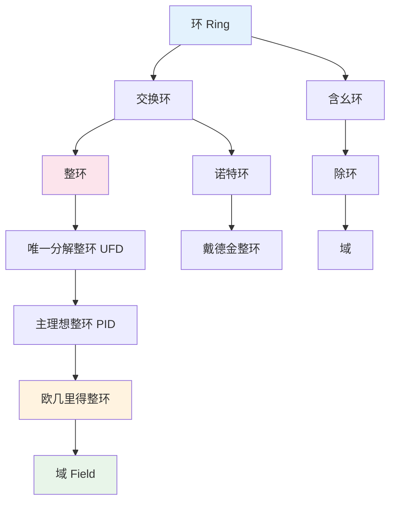

---
msc_primary: 00A99
msc_secondary: ['13-00', '16-00', '20-00']
category: 可视化
type: 概念
subject: 代数学
title: '代数学概念可视化合集'
processed_at: '2026'-04-05'
merged_from: 6 files
---

# 代数学概念可视化合集

> **合并说明**: 本文档包含 6 个代数学概念的可视化描述。

---

---
msc_primary: 00A99
msc_secondary:
- 00A99
concept_type: 概念可视化
visualization_type: 层次结构图
title: 环论结构层次图
processed_at: '2026'-04-05'
---
msc_primary: "@"
msc_secondary: ['@']
concept_type: "概念可视化"
visualization_type: "层次结构图"
---

# 环论结构层次图

## 描述

本可视化展示环论中各类代数结构的层次关系，从环到交换环、整环、域等，以及理想的结构。

## 数学概念

环是具有两个二元运算（加法和乘法）的代数结构，推广了整数和多项式的代数性质。

## 可视化代码



```

环的结构层次
═══════════════════════════════════════════════════════════════

基本定义链:
───────────────────────────────────────────────────────────────
环 R: (R, +, ·)
  • (R, +) 是Abel群
  • 乘法结合律
  • 分配律

交换环: 乘法交换 (ab = ba)
  ↓
整环: 无零因子，1 ≠ 0
  ↓
UFD: 唯一分解整环
  ↓
PID: 主理想整环
  ↓
欧几里得整环: 带除法算法
  ↓
域: 非零元可逆

理想结构:
───────────────────────────────────────────────────────────────
理想 I ⊂ R
  ├── 素理想: ab ∈ I ⇒ a ∈ I 或 b ∈ I
  ├── 极大理想: I ⊂ J ⊂ R ⇒ J=I 或 J=R
  └── 主理想: I = (a) = aR

```

## 参考

1. Dummit, D. S., & Foote, R. M. (2004). Abstract Algebra.
2. Atiyah, M. F., & Macdonald, I. G. (1969). Introduction to Commutative Algebra.

---

---
msc_primary: 20E05
concept_type: 概念可视化
title: 自由群构造可视化
processed_at: '2026'-04-05'
---
msc_primary: "20E05"
concept_type: "概念可视化"
---

# 自由群构造可视化

## 描述

自由群是由生成元生成的没有任何关系的群，是群论中最基本的构造。

## 可视化代码

```mermaid
graph TD
    A[集合 S] --> B[自由群 F(S)]
    B --> C[字 word]
    C --> D[约化字]
    D --> E[群运算: 连接+约化]

    B --> F[泛性质]
    F --> G[任意映射 S→G 唯一延拓为同态]
end

```

## 参考

1. Magnus, W. (2004). Combinatorial Group Theory.

---

---
msc_primary: 00A99
concept_type: 概念可视化
title: 模论基本概念
processed_at: '2026'-04-05'
---
msc_primary: "@"
concept_type: "概念可视化"
---

# 模论基本概念

## 描述

模是环上的线性空间，是向量空间的自然推广。

## 可视化

```mermaid
graph TD
    A[环 R] --> B[左 R-模 M]
    B --> C[加法群]
    B --> D[数乘 R × M → M]

    E[自由模] --> F[有基]
    G[投射模] --> H[自由模的直和项]
end

```

## 参考

Atiyah, M. F., & Macdonald, I. G. (1969). Introduction to Commutative Algebra.

---

---
msc_primary: 20D20
concept_type: 概念可视化
title: 西罗定理结构
processed_at: '2026'-04-05'
---
msc_primary: "20D20"
concept_type: "概念可视化"
---

# 西罗定理结构

## 描述

西罗定理给出了有限群中p子群的存在性、共轭性和计数公式。

## 可视化

```mermaid
graph TD
    A[|G| = pⁿ·m] --> B[Sylow p子群]

    B --> C[存在性: n_p ≥ 1]
    B --> D[共轭性: 所有Sylow p子群共轭]
    B --> E[n_p ≡ 1 mod p]
end

```

## 参考

Dummit, D. S., & Foote, R. M. (2004). Abstract Algebra.

---

---
msc_primary: 13E05
concept_type: 概念可视化
title: 诺特环
processed_at: '2026'-04-05'
---
msc_primary: "13E05"
concept_type: "概念可视化"
---

# 诺特环

## 描述

诺特环满足升链条件，是代数几何的基础。

## 可视化

```mermaid
graph TD
    A[升链 I₁ ⊂ I₂ ⊂ I₃ ⊂ ...] --> B[升链条件]
    B --> C[存在N, I_N = I_{N+1} = ...]
    
    D[等价条件] --> E[理想有限生成]
end

```

## 参考

Atiyah, M. F., & Macdonald, I. G. (1969). Introduction to Commutative Algebra.

---

---
msc_primary: 20J06
concept_type: 概念可视化
title: 群上同调
processed_at: '2026'-04-05'
---
msc_primary: "20J06"
concept_type: "概念可视化"
---

# 群上同调

## 描述

群上同调是研究群作用的重要工具，定义为导出函子。

## 可视化

```mermaid
graph TD
    A[群 G] --> B[G-模 M]
    B --> C[不变量 M^G]
    C --> D[导出函子 H^n(G,M)]
    
    E[H²(G,M)] --> F[群扩张分类]
end

```

## 参考

Brown, K. S. (1982). Cohomology of Groups.

---

## 文档信息

- **合并日期**: 2026年04月05日
- **概念数量**: 6
