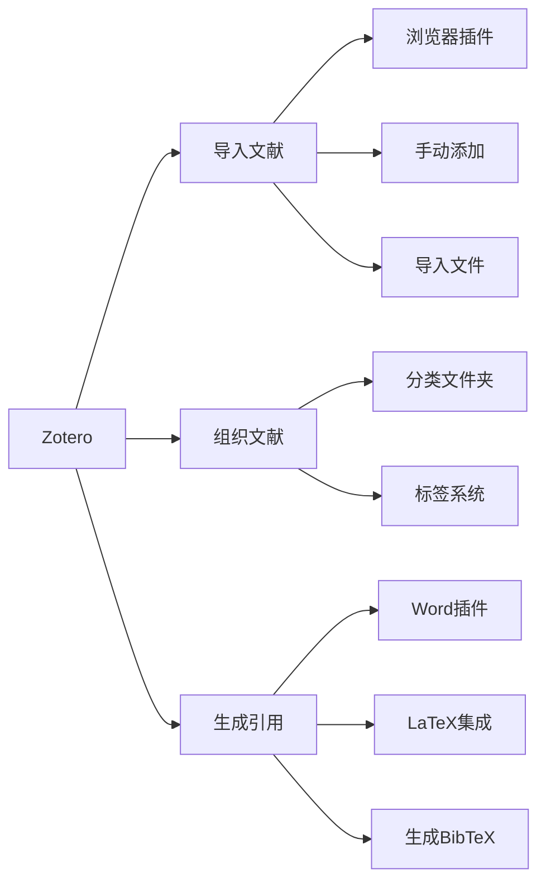

# 文献引用规范 (AMS标准)

**制定日期**: 2026年4月2日
**标准**: AMS引用规范

---

## 📋 目录

- [文献引用规范 (AMS标准)](#文献引用规范-ams标准)
  - [📋 目录](#-目录)
  - [一、引用格式](#一引用格式)
    - [1.1 文中引用格式](#11-文中引用格式)
    - [1.2 引用位置](#12-引用位置)
  - [二、参考文献列表](#二参考文献列表)
    - [2.1 书籍引用格式](#21-书籍引用格式)
    - [2.2 期刊论文引用格式](#22-期刊论文引用格式)
    - [2.3 电子资源引用格式](#23-电子资源引用格式)
    - [2.4 完整参考文献示例](#24-完整参考文献示例)
  - [三、引用管理工具](#三引用管理工具)
    - [3.1 Zotero使用指南](#31-zotero使用指南)
    - [3.2 LaTeX引用](#32-latex引用)

---

## 一、引用格式

### 1.1 文中引用格式

```

文中引用方式
━━━━━━━━━━━━━━━━━━━━━━━━━━━━━━━━━━━━━━━━━━━━━━━

顺序编号制:
• 首次引用: [1]
• 多次引用: [1, 2, 3] 或 [1-3]
• 引用具体页码: [1, p. 25] 或 [1, Theorem 2.1]

作者-年份制:
• 单作者: (Smith, 2020)
• 双作者: (Smith and Jones, 2019)
• 多作者: (Smith et al., 2018)
• 具体位置: (Smith, 2020, p. 15)

示例:
• 群论的标准参考见 [3, Chapter 2]。
• 这一结果首先由 Smith (2020) 证明。
• 近年来 [4, 5, 7] 对此进行了深入研究。
━━━━━━━━━━━━━━━━━━━━━━━━━━━━━━━━━━━━━━━━━━━━━━━

```

### 1.2 引用位置

| 位置 | 示例 | 说明 |
|-----|------|------|
| 句末 | ..., see [1]. | 作为句子的一部分 |
| 句中 | As shown in [2], ... | 引导引用内容 |
| 括号内 | (for details, see [3]) | 补充说明 |
| 定理后 | Theorem 2.1 ([4]). | 标明结果来源 |

---

## 二、参考文献列表

### 2.1 书籍引用格式

```

书籍引用格式
━━━━━━━━━━━━━━━━━━━━━━━━━━━━━━━━━━━━━━━━━━━━━━━

格式:
[编号] 作者. 书名[标识]. 版次(如有). 出版地: 出版社, 年份.

示例:
[1] M. Artin. Algebra[M]. 2nd ed. Boston: Pearson, 2010.
[2] 李文林. 数学史概论[M]. 第3版. 北京: 高等教育出版社, 2011.

标识:
[M] - 专著 (Monograph)
[C] - 会议论文集 (Conference)
[G] - 汇编 (Compilation)
━━━━━━━━━━━━━━━━━━━━━━━━━━━━━━━━━━━━━━━━━━━━━━━

```

### 2.2 期刊论文引用格式

```

期刊论文引用格式
━━━━━━━━━━━━━━━━━━━━━━━━━━━━━━━━━━━━━━━━━━━━━━━

格式:
[编号] 作者. 文章标题[J]. 期刊名, 年份, 卷(期): 页码.

示例:
[3] J. H. Silverman. The arithmetic of elliptic curves[J].
    Invent. Math., 1986, 74(2): 281-315.
[4] 张恭庆. 泛函分析在偏微分方程中的应用[J].
    数学学报, 2018, 61(3): 345-360.

标识:
[J] - 期刊 (Journal)
━━━━━━━━━━━━━━━━━━━━━━━━━━━━━━━━━━━━━━━━━━━━━━━

```

### 2.3 电子资源引用格式

```

电子资源引用格式
━━━━━━━━━━━━━━━━━━━━━━━━━━━━━━━━━━━━━━━━━━━━━━━

格式:
[编号] 作者. 标题[EB/OL]. 发布/更新日期. 网址.

示例:
[5] T. Hales. Formal proof[EB/OL]. 2008.
    https://www.ams.org/notices/200811/tx081101370p.pdf
[6] Lean Prover[CP/OL]. GitHub Repository, 2024.
    https://github.com/leanprover/lean4

标识:
[EB/OL] - 网上电子公告
[CP/OL] - 网上计算机程序
[DB/OL] - 网上数据库
━━━━━━━━━━━━━━━━━━━━━━━━━━━━━━━━━━━━━━━━━━━━━━━

```

### 2.4 完整参考文献示例

```

参考文献列表示例
━━━━━━━━━━━━━━━━━━━━━━━━━━━━━━━━━━━━━━━━━━━━━━━

参考文献

[1] M. F. Atiyah and I. G. Macdonald. Introduction to
    Commutative Algebra[M]. Reading, MA: Addison-Wesley, 1969.

[2] N. Bourbaki. Algebra I: Chapters 1-3[M].
    Berlin: Springer-Verlag, 1989.

[3] D. Cox, J. Little, and D. O'Shea. Ideals, Varieties,
    and Algorithms[M]. 4th ed. Cham: Springer, 2015.

[4] R. Hartshorne. Algebraic Geometry[M].
    New York: Springer-Verlag, 1977.

[5] S. Lang. Algebra[M]. Revised 3rd ed.
    New York: Springer, 2002.

[6] J. Neukirch. Algebraic Number Theory[M].
    Berlin: Springer, 1999.

[7] W. Rudin. Real and Complex Analysis[M]. 3rd ed.
    New York: McGraw-Hill, 1987.

[8] J.-P. Serre. A Course in Arithmetic[M].
    New York: Springer-Verlag, 1973.

排列规则:
• 按作者姓氏字母顺序
• 同一作者按年份
• 同一作者同年用 a, b, c 区分
━━━━━━━━━━━━━━━━━━━━━━━━━━━━━━━━━━━━━━━━━━━━━━━

```

---

## 三、引用管理工具

### 3.1 Zotero使用指南



### 3.2 LaTeX引用

```latex
% BibTeX 示例
\begin{thebibliography}{99}

\bibitem{Hartshorne1977}
R. Hartshorne, \textit{Algebraic Geometry},
Springer-Verlag, New York, 1977.

\bibitem{Atiyah1969}
M. F. Atiyah and I. G. Macdonald,
\textit{Introduction to Commutative Algebra},
Addison-Wesley, Reading, MA, 1969.

\end{thebibliography}

% 引用方式
See \cite{Hartshorne1977} for details.
As shown in \cite{Atiyah1969}, ...

```

---

**文档状态**: ✅ 完成
**最后更新**: 2026年4月2日
