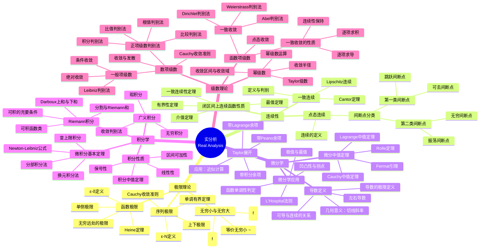

# 实分析核心概念思维导图

本思维导图系统呈现实分析的核心理论框架，从极限理论出发，经连续性、微分学、积分学，最终到达级数理论，构成完整的实分析知识体系。

## 整体结构图



## 核心概念详解

### 1. 极限理论 —— 实分析的基石

极限理论是实分析的基础，主要包括：

**序列极限**
- **ε-N定义**: ∀ε>0, ∃N∈ℕ, 当n>N时, |aₙ-a|<ε
- **单调有界定理**: 单调有界序列必收敛
- **Cauchy收敛准则**: 序列收敛 ⟺ 它是Cauchy列
- **上下极限**: liminf和limsup刻画序列的渐近行为

**函数极限**
- **ε-δ定义**: ∀ε>0, ∃δ>0, 当0<|x-x₀|<δ时, |f(x)-A|<ε
- **Heine定理**: 函数极限与序列极限的关系桥梁

### 2. 连续性 —— 函数的局部性质

**点态连续 vs 一致连续**
| 性质 | 点态连续 | 一致连续 |
|------|----------|----------|
| δ的选取 | 依赖于点x | 与x无关，全局统一 |
| 蕴含关系 | 一致连续 ⇒ 点态连续 | 点态连续 ⇏ 一致连续 |
| 典型反例 | — | sin(1/x)在(0,1) |

**重要定理**
- **Cantor定理**: 闭区间上的连续函数必一致连续
- **闭区间连续函数四定理**: 有界性、最值性、介值性、一致连续性

### 3. 微分学 —— 变化率的精确描述

**中值定理链条**
$$
\text{Fermat引理} \Rightarrow \text{Rolle定理} \Rightarrow \text{Lagrange中值定理} \Rightarrow \text{Cauchy中值定理}
$$

**Taylor展开**
$$f(x) = \sum_{k=0}^{n} \frac{f^{(k)}(x_0)}{k!}(x-x_0)^k + R_n(x)$$

余项形式：
- Peano余项: $R_n(x) = o((x-x_0)^n)$
- Lagrange余项: $R_n(x) = \frac{f^{(n+1)}(\xi)}{(n+1)!}(x-x_0)^{n+1}$

### 4. 积分学 —— 累积效应的数学描述

**Riemann可积的等价条件**
1. $f$在$[a,b]$上连续
2. $f$在$[a,b]$上单调
3. $f$在$[a,b]$上有界且只有有限个间断点
4. $f$有界且间断点集合测度为零

**微积分基本定理**
$$\frac{d}{dx}\int_a^x f(t)dt = f(x), \quad \int_a^b F'(x)dx = F(b) - F(a)$$

### 5. 级数理论 —— 无穷求和的严格理论

**收敛性判别流程**
```
正项级数?
├─ 是 → 尝试比较/比值/根值/积分判别法
└─ 否 → 考察绝对收敛性
        ├─ 绝对收敛 → 收敛
        └─ 不绝对收敛 → 尝试Leibniz/Abel/Dirichlet判别法
```

**一致收敛的重要性**

| 性质 | 点态收敛保证 | 一致收敛保证 |
|------|--------------|--------------|
| 连续性 | ✗ | ✓ |
| 可积性 | ✗ | ✓ |
| 可导性 | ✗ | 附加条件下✓ |

## 学习路径建议

1. **第一阶段**: 极限理论 → 连续性 → 导数定义
2. **第二阶段**: 微分中值定理 → Taylor展开 → 微分学应用
3. **第三阶段**: Riemann积分 → 微积分基本定理 → 积分技巧
4. **第四阶段**: 数项级数 → 函数项级数 → 幂级数

## 与其他分支的联系

```
实分析
├── 复分析（推广到复数域）
├── 泛函分析（无限维空间）
├── 测度论（Lebesgue积分推广）
└── 微分方程（理论基础）
```

---

*本思维导图由 FormalMath 项目创建，遵循严格的数学定义和逻辑结构。*
