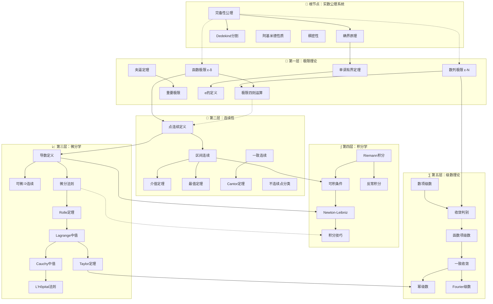
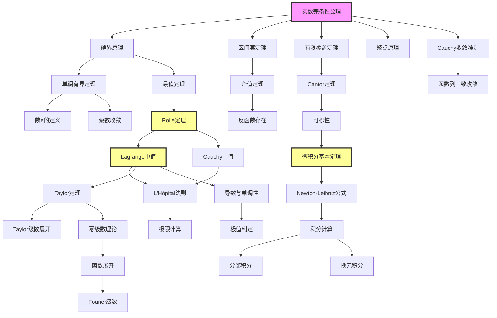

msc_primary: "00A99"
msc_secondary: ['00-XX']
---

# 分析学推理判断树

## 目录
1. [推理树总览](#推理树总览)
2. [根节点：实数公理系统](#根节点实数公理系统)
3. [第一层：极限理论](#第一层极限理论)
4. [第二层：连续性](#第二层连续性)
5. [第三层：微分学](#第三层微分学)
6. [第四层：积分学](#第四层积分学)
7. [第五层：级数理论](#第五层级数理论)
8. [反例与边界](#反例与边界)
9. [推理策略总结](#推理策略总结)

---

## 推理树总览

分析学是数学中研究极限过程的核心分支，其理论体系建立在严格的公理化基础之上。以下推理树展示了从实数公理出发，如何层层递进地构建极限理论、连续性理论、微分学、积分学和级数理论的完整逻辑链条。

### 推理链条的关键依赖关系

| 层级 | 核心概念 | 依赖的上层 | 支撑的下层 |
|------|----------|------------|------------|
| 根节点 | 完备性公理 | - | 极限存在性、单调有界定理 |
| 第一层 | 极限 | 实数完备性 | 连续性定义 |
| 第二层 | 连续性 | 函数极限 | 可微性、可积性 |
| 第三层 | 微分 | 连续性 | Taylor展开、积分计算 |
| 第四层 | 积分 | 连续性、微分 | 级数收敛性 |
| 第五层 | 级数 | 极限、积分 | - |

---

## 根节点：实数公理系统

实数公理系统是分析学的逻辑起点。没有实数的完备性，后续的极限理论将失去根基。

### 公理1.1: 域公理（Field Axioms）

**前提条件**：
- 集合 $\mathbb{R}$ 配备加法 $(+)$ 和乘法 $(\cdot)$ 运算

**结论陈述**：
$(\mathbb{R}, +, \cdot)$ 构成一个域，即满足：
1. **加法交换律**：$a + b = b + a$
2. **加法结合律**：$(a + b) + c = a + (b + c)$
3. **加法单位元**：$\exists 0 \in \mathbb{R}, a + 0 = a$
4. **加法逆元**：$\exists (-a) \in \mathbb{R}, a + (-a) = 0$
5. **乘法交换律**：$a \cdot b = b \cdot a$
6. **乘法结合律**：$(a \cdot b) \cdot c = a \cdot (b \cdot c)$
7. **乘法单位元**：$\exists 1 \in \mathbb{R}, a \cdot 1 = a$
8. **乘法逆元**：$\forall a \neq 0, \exists a^{-1} \in \mathbb{R}, a \cdot a^{-1} = 1$
9. **分配律**：$a \cdot (b + c) = a \cdot b + a \cdot c$

**证明思路**：
- 这些是不可证明的基本假设
- 构成代数运算的基础框架

**依赖的先前定理**：无（公理）

**后续推论**：
- 有序域结构的建立
- 代数运算的合法性

**判断要点**：
- 所有代数运算必须验证是否满足域公理
- 非域结构（如矩阵环）需谨慎使用分析学方法

---

### 公理1.2: 序公理（Order Axioms）

**前提条件**：
- $(\mathbb{R}, +, \cdot)$ 是域
- 存在正元集合 $\mathbb{R}^+ \subset \mathbb{R}$

**结论陈述**：
实数域是有序域，满足：
1. **三歧性**：$\forall a \in \mathbb{R}$，恰有 $a > 0$、$a = 0$、$a < 0$ 之一成立
2. **加法保序**：$a > 0, b > 0 \Rightarrow a + b > 0$
3. **乘法保序**：$a > 0, b > 0 \Rightarrow a \cdot b > 0$

**定义导出**：
- $a > b \Leftrightarrow a - b > 0$
- $a \geq b \Leftrightarrow a > b$ 或 $a = b$

**证明思路**：
- 公理系统，无需证明
- 导出序关系的所有性质

**依赖的先前定理**：域公理

**后续推论**：
- 绝对值定义与性质
- 区间概念
- 不等式运算规则

**判断要点**：
- 序结构是实数区别于复数的关键
- 复数域 $\mathbb{C}$ 不是有序域

---

### 公理1.3: 完备性公理（Completeness Axiom）【核心公理】

**前提条件**：
- $(\mathbb{R}, +, \cdot)$ 是有序域
- 非空子集 $S \subseteq \mathbb{R}$ 有上界

**结论陈述**：
**确界原理（Supremum Principle）**：
$\forall S \subseteq \mathbb{R}, S \neq \emptyset$，若 $S$ 有上界，则 $S$ 存在最小上界（上确界），记为 $\sup S \in \mathbb{R}$。

**等价形式**：
1. **下确界原理**：有下界的非空集有最大下界
2. **Dedekind分割原理**：实数的任何分割都有唯一的分界点
3. **单调收敛定理**：单调有界数列必收敛（后续证明）
4. **区间套定理**：闭区间套有唯一公共点
5. **有限覆盖定理**：闭区间的任意开覆盖有有限子覆盖
6. **聚点原理**：有界无穷集必有聚点
7. **Cauchy收敛准则**：Cauchy列必收敛（完备度量空间）

**证明思路**：
- 作为公理，不可证明
- 等价性证明需要构造性方法：
  - 确界原理 $\Rightarrow$ 区间套：取区间端点的确界
  - 区间套 $\Rightarrow$ 有限覆盖：反证法
  - 有限覆盖 $\Rightarrow$ 聚点原理：反证构造开覆盖
  - 聚点原理 $\Rightarrow$ Cauchy准则：证明Cauchy列有界且有唯一聚点
  - Cauchy准则 $\Rightarrow$ 确界原理：构造逼近确界的Cauchy列

**依赖的先前定理**：序公理

**后续推论**：
- 实数与有理数的本质区别
- 所有极限存在性定理的根基
- 分析学中"存在性"证明的核心工具

**判断要点**：
- **何时使用确界原理**：
  - 证明极限存在但难以直接构造时
  - 涉及"最小上界"概念时
  - 集合的上确界是证明目标时

- **边界条件**：
  - 集合必须非空
  - 集合必须有上界（或下界）
  - 上确界不一定属于原集合

---

### 定理1.4: 阿基米德性质（Archimedean Property）

**前提条件**：
- 实数域满足完备性公理
- 自然数集 $\mathbb{N} \subset \mathbb{R}$

**结论陈述**：
$$\forall x \in \mathbb{R}, \exists n \in \mathbb{N}: n > x$$
等价表述：$\mathbb{N}$ 在 $\mathbb{R}$ 中无上界。

**证明思路**：
1. 反证法：假设 $\mathbb{N}$ 有上界
2. 由完备性，$\exists M = \sup \mathbb{N}$
3. 则 $M - 1$ 不是上界，$\exists n \in \mathbb{N}: n > M - 1$
4. 于是 $n + 1 > M$，矛盾！

**依赖的先前定理**：
- 完备性公理（确界原理）
- 自然数的归纳性质

**后续推论**：
- 有理数在实数中的稠密性
- 对任意 $\varepsilon > 0$，$\exists n \in \mathbb{N}: \frac{1}{n} < \varepsilon$
- 实数可用有理数任意逼近

**判断要点**：
- 保证"足够大"的自然数存在
- 反例：非阿基米德有序域（如实数的非标准扩张）

---

### 定理1.5: 有理数的稠密性（Density of Rationals）

**前提条件**：
- 阿基米德性质成立
- $a, b \in \mathbb{R}$，$a < b$

**结论陈述**：
$$\exists r \in \mathbb{Q}: a < r < b$$
即任意两个不同实数之间必有有理数。

**证明思路**：
1. 由阿基米德性质，$\exists n \in \mathbb{N}: n > \frac{1}{b-a}$
2. 于是 $\frac{1}{n} < b - a$
3. 考虑集合 $S = \{m \in \mathbb{Z}: \frac{m}{n} \leq a\}$
4. $S$ 有上界，设 $m_0 = \max S$
5. 则 $\frac{m_0}{n} \leq a < \frac{m_0+1}{n}$
6. 验证 $a < \frac{m_0+1}{n} < b$

**依赖的先前定理**：
- 阿基米德性质
- 整数的良序性

**后续推论**：
- 无理数在实数中也稠密
- 实数可用有理数列逼近
- $L^p$空间中简单函数的稠密性证明方法类似

**判断要点**：
- 稠密性不意味着"填满"：有理数测度为0
- 证明构造性：给出了具体的有理数构造方法

---

### 定理1.6: 无理数的稠密性（Density of Irrationals）

**前提条件**：
- 有理数稠密性成立
- 存在无理数（如 $\sqrt{2}$）

**结论陈述**：
$$\forall a < b \in \mathbb{R}, \exists \xi \notin \mathbb{Q}: a < \xi < b$$

**证明思路**：
1. 由有理数稠密性，$\exists r \in \mathbb{Q}: a + \sqrt{2} < r < b + \sqrt{2}$
2. 令 $\xi = r - \sqrt{2}$
3. 若 $\xi \in \mathbb{Q}$，则 $\sqrt{2} = r - \xi \in \mathbb{Q}$，矛盾
4. 故 $\xi$ 无理且 $a < \xi < b$

**依赖的先前定理**：
- 有理数稠密性
- $\sqrt{2}$ 的无理性

**后续推论**：
- 实数可被有理数和无理数任意逼近
-  Cantor集虽然无处稠密但不可数

**判断要点**：
- 稠密性与完备性的区别：有理数稠密但不完备

---

## 第一层：极限理论

极限是分析学的灵魂。从静态的代数运算到动态的极限过程，是数学思想的重大飞跃。

### 定义2.1: 数列极限（$\varepsilon$-$N$ 定义）

**前提条件**：
- 数列 $\{a_n\}_{n=1}^{\infty} \subset \mathbb{R}$
- 实数 $L \in \mathbb{R}$

**定义陈述**：
$$\lim_{n \to \infty} a_n = L \Leftrightarrow \forall \varepsilon > 0, \exists N \in \mathbb{N}, \forall n \geq N: |a_n - L| < \varepsilon$$

**几何解释**：
- 任意给定以 $L$ 为中心的 $\varepsilon$ 邻域 $(L-\varepsilon, L+\varepsilon)$
- 总存在某一项之后的所有项都落在该邻域内
- 邻域可以任意小

**证明思路**：
- 此为定义，无需证明
- 关键在于理解"任意小"和"最终进入"的逻辑结构

**依赖的先前定理**：
- 实数的序结构
- 绝对值不等式性质

**后续推论**：
- 极限的唯一性
- 收敛数列的有界性
- 极限的四则运算

**判断要点**：
- **证明数列收敛于 $L$ 的策略**：
  1. 给定任意 $\varepsilon > 0$
  2. 分析 $|a_n - L|$ 的表达式
  3. 寻找 $N$ 使得 $n \geq N \Rightarrow |a_n - L| < \varepsilon$

  4. 常用技巧：适当放大、利用已知极限

- **常见错误**：
  - 先固定 $\varepsilon$ 再找 $N$（顺序错误）
  - $N$ 依赖于 $n$（逻辑错误）
  - 忽略"对所有 $n \geq N$"的量化

---

### 定理2.2: 极限的唯一性（Uniqueness of Limit）

**前提条件**：
- 数列 $\{a_n\}$ 收敛

**结论陈述**：
若 $\lim_{n \to \infty} a_n = L_1$ 且 $\lim_{n \to \infty} a_n = L_2$，则 $L_1 = L_2$。

**证明思路**：
1. 反证法：设 $L_1 \neq L_2$，令 $\varepsilon = \frac{|L_1 - L_2|}{2} > 0$
2. 由定义，$\exists N_1: n \geq N_1 \Rightarrow |a_n - L_1| < \varepsilon$
3. $\exists N_2: n \geq N_2 \Rightarrow |a_n - L_2| < \varepsilon$

4. 取 $N = \max\{N_1, N_2\}$，当 $n \geq N$：
   $$|L_1 - L_2| \leq |L_1 - a_n| + |a_n - L_2| < 2\varepsilon = |L_1 - L_2|$$

5. 矛盾！故 $L_1 = L_2$

**依赖的先前定理**：
- 数列极限定义
- 三角不等式

**后续推论**：
- 可以放心地记 $\lim a_n$ 而不必担心多值性
- 极限运算的良好定义性

**判断要点**：
- 本质依赖于实数 Hausdorff 性质（不同的点有不交的邻域）
- 在非 Hausdorff 空间（如粗糙拓扑）中极限不唯一

---

### 定理2.3: 收敛数列的有界性（Boundedness of Convergent Sequences）

**前提条件**：
- $\{a_n\}$ 收敛于 $L$

**结论陈述**：
$$\{a_n\} \text{ 收敛} \Rightarrow \{a_n\} \text{ 有界}$$

**证明思路**：
1. 取 $\varepsilon = 1$，$\exists N: n \geq N \Rightarrow |a_n - L| < 1$
2. 于是 $|a_n| < |L| + 1$ 对所有 $n \geq N$ 成立
3. 令 $M = \max\{|a_1|, |a_2|, \ldots, |a_{N-1}|, |L| + 1\}$
4. 则 $|a_n| \leq M$ 对所有 $n \in \mathbb{N}$ 成立

**依赖的先前定理**：
- 极限定义
- 有限集的最大值存在性

**后续推论**：
- 无界数列必发散
- 逆不成立：有界数列未必收敛（如 $(-1)^n$）

**判断要点**：
- 用于快速判断数列发散
- 有界性是收敛的必要条件而非充分条件

---

### 定理2.4: 极限的四则运算（Algebra of Limits）

**前提条件**：
- $\lim_{n \to \infty} a_n = A$，$\lim_{n \to \infty} b_n = B$

**结论陈述**：
1. **加法**：$\lim_{n \to \infty} (a_n + b_n) = A + B$
2. **减法**：$\lim_{n \to \infty} (a_n - b_n) = A - B$
3. **乘法**：$\lim_{n \to \infty} (a_n \cdot b_n) = A \cdot B$
4. **除法**：若 $B \neq 0$，则 $\lim_{n \to \infty} \frac{a_n}{b_n} = \frac{A}{B}$

**证明思路**（以乘法为例）：
1. 估计 $|a_n b_n - AB| = |a_n b_n - a_n B + a_n B - AB|$
2. $\leq |a_n| \cdot |b_n - B| + |B| \cdot |a_n - A|$
3. 由有界性，$\exists M: |a_n| \leq M$
4. 对 $\frac{\varepsilon}{2(|B|+1)}$，$\exists N_1: |a_n - A| < \frac{\varepsilon}{2(|B|+1)}$
5. 对 $\frac{\varepsilon}{2M}$，$\exists N_2: |b_n - B| < \frac{\varepsilon}{2M}$
6. 取 $N = \max\{N_1, N_2\}$，则 $|a_n b_n - AB| < \varepsilon$

**依赖的先前定理**：
- 收敛数列有界性
- 三角不等式
- 极限定义

**后续推论**：
- 多项式函数的极限计算
- 有理函数的极限（分母非零）

**判断要点**：
- **$\frac{0}{0}$ 型**：不能直接应用除法法则，需要变形
- **$\frac{\infty}{\infty}$ 型**：四则运算不适用，需其他方法
- 所有运算要求两个极限都存在

---

### 定理2.5: 夹逼定理/三明治定理（Squeeze Theorem）

**前提条件**：
- $a_n \leq b_n \leq c_n$ 对所有充分大的 $n$ 成立
- $\lim_{n \to \infty} a_n = \lim_{n \to \infty} c_n = L$

**结论陈述**：
$$\lim_{n \to \infty} b_n = L$$

**证明思路**：
1. 对任意 $\varepsilon > 0$：
   - $\exists N_1: n \geq N_1 \Rightarrow |a_n - L| < \varepsilon \Rightarrow L - \varepsilon < a_n$
   - $\exists N_2: n \geq N_2 \Rightarrow |c_n - L| < \varepsilon \Rightarrow c_n < L + \varepsilon$

2. 取 $N = \max\{N_1, N_2, N_0\}$（$N_0$ 是不等式成立的起点）
3. 当 $n \geq N$：$L - \varepsilon < a_n \leq b_n \leq c_n < L + \varepsilon$
4. 故 $|b_n - L| < \varepsilon$

**依赖的先前定理**：
- 极限定义
- 不等式的传递性

**后续推论**：
- 重要极限 $\lim_{n \to \infty} \frac{\sin n}{n} = 0$
- 级数收敛的比较判别法基础

**判断要点**：
- **使用场景**：
  - 中间数列的极限难以直接计算
  - 可以找到两个容易计算极限的数列"夹住"目标
- **关键**：两边数列极限必须相等

---

### 定理2.6: 单调有界定理（Monotone Convergence Theorem）【核心定理】

**前提条件**：
- 数列 $\{a_n\}$ 单调递增：$a_{n+1} \geq a_n$（或单调递减）
- 数列有上界（或下界）

**结论陈述**：
$$\{a_n\} \text{ 单调有界} \Rightarrow \{a_n\} \text{ 收敛}$$

**证明思路**：
1. 设 $\{a_n\}$ 递增有上界
2. 由完备性公理，$S = \{a_n: n \in \mathbb{N}\}$ 有上确界 $L = \sup S$
3. 证明 $\lim_{n \to \infty} a_n = L$：
   - 任意 $\varepsilon > 0$，由确界定义，$L - \varepsilon$ 不是上界
   - $\exists N: a_N > L - \varepsilon$
   - 由单调性，$n \geq N \Rightarrow a_n \geq a_N > L - \varepsilon$
   - 又 $a_n \leq L < L + \varepsilon$
   - 故 $|a_n - L| < \varepsilon$

**依赖的先前定理**：
- **完备性公理**（核心依赖）
- 确界的基本性质

**后续推论**：
- 自然常数 $e$ 的定义：$e = \lim_{n \to \infty} \left(1 + \frac{1}{n}\right)^n$
- 递推数列的收敛性证明
- 无穷级数的收敛判别

**判断要点**：
- **证明单调性的方法**：
  - 直接比较 $a_{n+1}$ 与 $a_n$
  - 考察 $a_{n+1} - a_n$ 的符号
  - 若 $a_n > 0$，考察 $\frac{a_{n+1}}{a_n}$ 与 1 的关系

- **证明有界性的方法**：
  - 数学归纳法
  - 利用已知不等式
  - 寻找不动点

- **极限值的计算**：
  - 若递推关系 $a_{n+1} = f(a_n)$ 且 $f$ 连续
  - 设 $\lim a_n = L$，则 $L = f(L)$（解不动点方程）

---

### 定义2.7: 函数极限（$\varepsilon$-$\delta$ 定义）

**前提条件**：
- 函数 $f: D \to \mathbb{R}$，$D \subseteq \mathbb{R}$
- 点 $a$ 是 $D$ 的聚点（$\forall \delta > 0, \exists x \in D: 0 < |x-a| < \delta$）

- $L \in \mathbb{R}$

**定义陈述**：
$$\lim_{x \to a} f(x) = L \Leftrightarrow \forall \varepsilon > 0, \exists \delta > 0, \forall x \in D: 0 < |x-a| < \delta \Rightarrow |f(x) - L| < \varepsilon$$

**几何解释**：
- 任意给定以 $L$ 为中心的水平带域 $(L-\varepsilon, L+\varepsilon)$
- 存在以 $a$ 为中心的垂直带域（去心邻域）$(a-\delta, a+\delta) \setminus \{a\}$
- 使得该垂直带域内的函数图像全部落在水平带域内

**变体定义**：
- **单侧极限**：$\lim_{x \to a^+} f(x)$（右极限）：$0 < x - a < \delta$
- **无穷远处**：$\lim_{x \to \infty} f(x) = L$：$\exists M, x > M \Rightarrow |f(x) - L| < \varepsilon$
- **无穷极限**：$\lim_{x \to a} f(x) = \infty$：$\forall M > 0, \exists \delta > 0: |f(x)| > M$

**证明思路**：
- 定义无需证明
- 关键在于理解 $x$ 接近 $a$ 时 $f(x)$ 接近 $L$ 的严格表述

**依赖的先前定理**：
- 实数的序结构
- 聚点概念

**后续推论**：
- 函数极限的四则运算
- 复合函数极限
- 连续性定义

**判断要点**：
- **证明函数极限的策略**：
  1. 给定任意 $\varepsilon > 0$
  2. 分析 $|f(x) - L|$ 与 $|x - a|$ 的关系

  3. 寻找 $\delta = \delta(\varepsilon)$ 使得条件成立
  4. 常用技巧：因式分解、有理化、有界性

- **关键区别（数列vs函数）**：
  - 数列：离散变量 $n \to \infty$，找 $N \in \mathbb{N}$
  - 函数：连续变量 $x \to a$，找 $\delta > 0$

---

### 定理2.8: 函数极限与数列极限的关系（Heine定理）

**前提条件**：
- $f$ 在 $a$ 的某去心邻域有定义

**结论陈述**：
$$\lim_{x \to a} f(x) = L \Leftrightarrow \forall \{x_n\}: x_n \to a, x_n \neq a \Rightarrow \lim_{n \to \infty} f(x_n) = L$$

**证明思路**（$\Rightarrow$）：
1. 设 $\lim_{x \to a} f(x) = L$
2. 任取 $x_n \to a, x_n \neq a$
3. 对任意 $\varepsilon > 0$，由函数极限定义，$\exists \delta > 0$
4. 对 $\delta > 0$，由数列极限定义，$\exists N: n \geq N \Rightarrow |x_n - a| < \delta$
5. 于是 $n \geq N \Rightarrow |f(x_n) - L| < \varepsilon$

**证明思路**（$\Leftarrow$，反证法）：
1. 假设函数极限不为 $L$
2. 构造数列 $x_n \to a$ 但 $f(x_n) \not\to L$

**依赖的先前定理**：
- 函数极限定义
- 数列极限定义

**后续推论**：
- 用数列方法证明函数极限不存在
- 证明某些函数极限不存在：找两个趋于 $a$ 的数列，函数值趋于不同极限

**判断要点**：
- **证明极限不存在的方法**：
  - 找数列 $x_n \to a$ 使得 $\{f(x_n)\}$ 发散
  - 找两个数列 $x_n, y_n \to a$ 使得 $\lim f(x_n) \neq \lim f(y_n)$

- 例：$\lim_{x \to 0} \sin\frac{1}{x}$ 不存在
  - 取 $x_n = \frac{1}{n\pi} \to 0$，则 $\sin\frac{1}{x_n} = 0$
  - 取 $y_n = \frac{1}{2n\pi + \frac{\pi}{2}} \to 0$，则 $\sin\frac{1}{y_n} = 1$

---

### 定理2.9: Cauchy收敛准则（Cauchy Criterion）

**前提条件**：
- 数列 $\{a_n\} \subset \mathbb{R}$

**结论陈述**：
$$\{a_n\} \text{ 收敛} \Leftrightarrow \forall \varepsilon > 0, \exists N \in \mathbb{N}, \forall m, n \geq N: |a_m - a_n| < \varepsilon$$

**满足上述条件的数列称为 Cauchy 列。**

**证明思路**（$\Rightarrow$）：
- 收敛数列必为Cauchy列（直接用三角不等式）

**证明思路**（$\Leftarrow$，核心）：
1. 证明Cauchy列有界
2. 由 Bolzano-Weierstrass 定理（聚点原理），存在收敛子列
3. 证明原数列收敛于该子列的极限

**依赖的先前定理**：
- **完备性公理**（通过聚点原理或区间套）
- 三角不等式

**后续推论**：
- 完备度量空间的定义基础
- 级数收敛的Cauchy准则
- 函数列一致收敛的Cauchy准则

**判断要点**：
- **Cauchy条件的本质**：数列的项"最终"彼此任意接近
- 不需要知道极限值就能判断收敛性
- 在有理数域 $\mathbb{Q}$ 中不成立（Cauchy列不一定收敛于有理数）

---

## 第二层：连续性

连续性是函数最基本的分析性质之一。直观上，连续函数的图像可以"一笔画出"。

### 定义3.1: 点连续（Continuity at a Point）

**前提条件**：
- 函数 $f$ 在点 $a$ 的某邻域有定义

**定义陈述**：
$$f \text{ 在 } a \text{ 连续} \Leftrightarrow \lim_{x \to a} f(x) = f(a)$$

**等价定义**：
1. **$\varepsilon$-$\delta$ 定义**：$\forall \varepsilon > 0, \exists \delta > 0: |x - a| < \delta \Rightarrow |f(x) - f(a)| < \varepsilon$

2. **序列定义**：$\forall x_n \to a \Rightarrow f(x_n) \to f(a)$
3. **邻域定义**：$f$ 将 $a$ 的任意邻域映射到 $f(a)$ 的某邻域的子集

**证明思路**：
- 定义无需证明
- 等价性由函数极限的相应等价性导出

**依赖的先前定理**：
- 函数极限定义
- Heine定理（序列定义的等价性）

**后续推论**：
- 区间连续的定义
- 连续函数的运算性质
- 间断点分类

**判断要点**：
- **证明连续性的策略**：
  1. 验证 $\lim_{x \to a} f(x)$ 存在
  2. 验证该极限等于 $f(a)$

- **连续性破坏的三种情况**：
  1. $f(a)$ 无定义
  2. $\lim_{x \to a} f(x)$ 不存在
  3. 极限存在但不等于 $f(a)$

---

### 定理3.2: 连续函数的运算性质

**前提条件**：
- $f, g$ 在 $a$ 连续

**结论陈述**：
1. $f + g$ 在 $a$ 连续
2. $f \cdot g$ 在 $a$ 连续
3. 若 $g(a) \neq 0$，则 $\frac{f}{g}$ 在 $a$ 连续
4. 若 $f$ 在 $a$ 连续，$g$ 在 $f(a)$ 连续，则 $g \circ f$ 在 $a$ 连续

**证明思路**：
- 直接利用函数极限的四则运算和复合函数极限定理

**依赖的先前定理**：
- 函数极限的四则运算
- 复合函数极限定理

**后续推论**：
- 多项式函数处处连续
- 有理函数在定义域连续
- 初等函数的连续性

**判断要点**：
- 基本初等函数在其定义域连续
- 初等函数（基本初等函数经有限次四则运算和复合）在其定义域连续

---

### 定义3.3: 区间连续与一致连续

**前提条件**：
- 函数 $f: I \to \mathbb{R}$，$I$ 为区间

**区间连续定义**：
$$f \in C(I) \Leftrightarrow \forall a \in I, f \text{ 在 } a \text{ 连续}$$

**一致连续定义（Uniform Continuity）**：
$$f \text{ 在 } I \text{ 一致连续} \Leftrightarrow \forall \varepsilon > 0, \exists \delta > 0, \forall x, y \in I: |x - y| < \delta \Rightarrow |f(x) - f(y)| < \varepsilon$$

**关键区别**：
- 逐点连续：$\delta$ 依赖于 $\varepsilon$ 和点 $a$
- 一致连续：$\delta$ 仅依赖于 $\varepsilon$，对区间内所有点"一致"适用

**证明思路**：
- 定义无需证明
- 一致连续更强：一致连续 $\Rightarrow$ 连续，逆不成立

**依赖的先前定理**：
- 点连续定义

**后续推论**：
- Cantor定理：闭区间上连续函数必一致连续
- 一致连续函数可积性

**判断要点**：
- **证明一致连续的策略**：
  - 利用定义直接证明
  - 利用Lipschitz条件：$|f(x) - f(y)| \leq L|x - y|$

  - 利用导数有界（中值定理）

- **非一致连续的判断**：
  - 找两个点列 $x_n, y_n$，$|x_n - y_n| \to 0$ 但 $|f(x_n) - f(y_n)| \geq \varepsilon_0 > 0$

  - 例：$f(x) = \frac{1}{x}$ 在 $(0, 1)$ 非一致连续
    - 取 $x_n = \frac{1}{n}, y_n = \frac{1}{n+1}$
    - $|x_n - y_n| = \frac{1}{n(n+1)} \to 0$
    - $|f(x_n) - f(y_n)| = 1 \not\to 0$

---

### 定理3.4: Cantor定理（闭区间连续函数的一致连续性）

**前提条件**：
- $f \in C[a, b]$（$f$ 在闭区间 $[a, b]$ 连续）

**结论陈述**：
$$f \text{ 在 } [a, b] \text{ 一致连续}$$

**证明思路**（反证法或有限覆盖定理）：
1. 设 $f$ 在 $[a,b]$ 不一致连续
2. 则 $\exists \varepsilon_0 > 0, \forall n \in \mathbb{N}, \exists x_n, y_n: |x_n - y_n| < \frac{1}{n}$ 但 $|f(x_n) - f(y_n)| \geq \varepsilon_0$

3. 由列紧性，$\{x_n\}$ 有收敛子列 $x_{n_k} \to x_0 \in [a,b]$
4. 于是 $y_{n_k} \to x_0$
5. 由连续性，$f(x_{n_k}) \to f(x_0)$ 且 $f(y_{n_k}) \to f(x_0)$
6. 矛盾：$|f(x_{n_k}) - f(y_{n_k})| \geq \varepsilon_0$ 但趋于 0

**依赖的先前定理**：
- **闭区间列紧性**（有界数列必有收敛子列）
- 连续函数的序列定义

**后续推论**：
- 闭区间上连续函数必定可积
- 闭区间上连续函数可以用多项式一致逼近（Weierstrass逼近定理）

**判断要点**：
- 开区间连续函数未必一致连续（如 $f(x) = \frac{1}{x}$ 在 $(0,1)$）
- 无穷区间连续函数未必一致连续（如 $f(x) = x^2$ 在 $\mathbb{R}$）
- 关键：闭区间的**紧致性**

---

### 定理3.5: 介值定理（Intermediate Value Theorem）【核心定理】

**前提条件**：
- $f \in C[a, b]$
- $f(a) \neq f(b)$
- $\mu$ 介于 $f(a)$ 与 $f(b)$ 之间

**结论陈述**：
$$\exists \xi \in (a, b): f(\xi) = \mu$$

**证明思路**（区间套方法）：
1. 不妨设 $f(a) < \mu < f(b)$
2. 令 $[a_1, b_1] = [a, b]$
3. 取中点 $c = \frac{a_1 + b_1}{2}$
   - 若 $f(c) = \mu$，证毕
   - 若 $f(c) < \mu$，令 $[a_2, b_2] = [c, b_1]$
   - 若 $f(c) > \mu$，令 $[a_2, b_2] = [a_1, c]$
4. 得到区间套 $[a_n, b_n]$，满足 $f(a_n) < \mu < f(b_n)$，$b_n - a_n \to 0$
5. 由区间套定理，$\exists! \xi \in \bigcap [a_n, b_n]$，且 $a_n \to \xi, b_n \to \xi$
6. 由连续性，$f(a_n) \to f(\xi), f(b_n) \to f(\xi)$
7. 由夹逼，$f(\xi) = \mu$

**依赖的先前定理**：
- **完备性公理**（区间套定理）
- 连续函数的序列定义

**后续推论**：
- 零点存在定理：$f(a)f(b) < 0 \Rightarrow \exists$ 零点
- 连续函数的值域是区间
- 奇次多项式必有实根
- 不动点存在性

**判断要点**：
- **使用条件检查清单**：
  - [ ] $f$ 在**闭区间** $[a, b]$ 连续
  - [ ] 端点函数值异号（或 $\mu$ 介于两端点函数值之间）

- **常见应用**：
  - 证明方程有根
  - 构造反函数（严格单调连续函数的反函数连续）

---

### 定理3.6: 最值定理（Extreme Value Theorem）

**前提条件**：
- $f \in C[a, b]$

**结论陈述**：
$$\exists x_1, x_2 \in [a, b]: f(x_1) = \inf_{x \in [a,b]} f(x), \quad f(x_2) = \sup_{x \in [a,b]} f(x)$$
即 $f$ 在 $[a, b]$ 上能取到最小值和最大值。

**证明思路**（以最大值为例）：
1. 令 $M = \sup_{x \in [a,b]} f(x)$（由确界原理，上确界存在，可能为 $+\infty$）
2. 由上确界定义，$\exists x_n \in [a,b]: f(x_n) \to M$
3. 由列紧性，$\{x_n\}$ 有收敛子列 $x_{n_k} \to x_0 \in [a,b]$
4. 由连续性，$f(x_{n_k}) \to f(x_0)$
5. 于是 $M = f(x_0) < +\infty$

**依赖的先前定理**：
- **完备性公理**（确界原理）
- **闭区间列紧性**
- 连续函数的序列定义

**后续推论**：
- 闭区间上连续函数有界
- Rolle定理的前提条件
- 最优化问题的解存在性

**判断要点**：
- **开区间不成立**：$f(x) = x$ 在 $(0, 1)$ 无最大值
- **不连续不成立**：$f(x) = \frac{1}{x}$ 在 $(0, 1]$ 无界
- 同时需要**连续性**和**闭区间**两个条件

---

### 定义3.7: 间断点分类（Classification of Discontinuities）

**前提条件**：
- $f$ 在 $a$ 的某去心邻域有定义
- $f$ 在 $a$ 不连续

**第一类间断点（可去或跳跃）**：
左右极限都存在
1. **可去间断点**：$\lim_{x \to a^-} f(x) = \lim_{x \to a^+} f(x) \neq f(a)$（或 $f(a)$ 无定义）
   - 例：$f(x) = \frac{\sin x}{x}$ 在 $x = 0$（补充 $f(0) = 1$ 可去）

2. **跳跃间断点**：$\lim_{x \to a^-} f(x) \neq \lim_{x \to a^+} f(x)$
   - 例：$f(x) = \text{sgn}(x)$ 在 $x = 0$

**第二类间断点**：
左右极限至少有一个不存在（或为无穷）
1. **无穷间断点**：$\lim_{x \to a} f(x) = \infty$
   - 例：$f(x) = \frac{1}{x}$ 在 $x = 0$

2. **振荡间断点**：极限不存在且不为无穷
   - 例：$f(x) = \sin\frac{1}{x}$ 在 $x = 0$

**依赖的先前定理**：
- 单侧极限概念

**后续推论**：
- 单调函数只有第一类间断点（跳跃）
- 闭区间上单调函数可积

**判断要点**：
- **判断步骤**：
  1. 计算 $f(a^+)$ 和 $f(a^-)$
  2. 若都存在且相等 $\to$ 可去
  3. 若都存在但不相等 $\to$ 跳跃
  4. 若至少一个不存在 $\to$ 第二类

---

## 第三层：微分学

微分学研究函数的变化率。从局部的线性逼近出发，发展出一套强大的分析工具。

### 定义4.1: 导数（Derivative）

**前提条件**：
- 函数 $f$ 在 $a$ 的某邻域有定义

**定义陈述**：
$$f'(a) = \lim_{x \to a} \frac{f(x) - f(a)}{x - a} = \lim_{h \to 0} \frac{f(a+h) - f(a)}{h}$$

若该极限存在，称 $f$ 在 $a$ **可导**。

**几何解释**：
- 导数是函数曲线在点 $(a, f(a))$ 处切线的斜率
- 导数是函数在该点的瞬时变化率

**等价定义（线性逼近）**：
$$f(a+h) = f(a) + f'(a) \cdot h + o(h) \quad (h \to 0)$$

**证明思路**：
- 定义无需证明
- 等价性由极限定义导出

**依赖的先前定理**：
- 函数极限定义

**后续推论**：
- 可微性与连续性关系
- 微分法则
- 中值定理

**判断要点**：
- **导数存在 $\Leftrightarrow$ **左右导数存在且相等：
  $$f'_+(a) = \lim_{h \to 0^+} \frac{f(a+h) - f(a)}{h}$$
  $$f'_-(a) = \lim_{h \to 0^-} \frac{f(a+h) - f(a)}{h}$$

- **典型不可导情形**：
  - 尖点：$f(x) = |x|$ 在 $x = 0$

  - 垂直切线：$f(x) = x^{1/3}$ 在 $x = 0$
  - 振荡：$f(x) = x\sin\frac{1}{x}$（补充 $f(0)=0$）在 $x = 0$

---

### 定理4.2: 可导必连续（Differentiability Implies Continuity）

**前提条件**：
- $f$ 在 $a$ 可导

**结论陈述**：
$$f \text{ 在 } a \text{ 连续}$$

**证明思路**：
$$\lim_{x \to a} [f(x) - f(a)] = \lim_{x \to a} \frac{f(x) - f(a)}{x - a} \cdot (x - a) = f'(a) \cdot 0 = 0$$

**依赖的先前定理**：
- 导数定义
- 极限的四则运算

**后续推论**：
- 不连续必不可导
- 微分学主要研究连续函数的性质

**判断要点**：
- 连续是可导的**必要条件**，**非充分条件**
- 例：$f(x) = |x|$ 在 $x = 0$ 连续但不可导

---

### 定理4.3: 微分法则（Rules of Differentiation）

**前提条件**：
- $f, g$ 在 $a$ 可导

**结论陈述**：
1. **线性**：$(cf)'(a) = c \cdot f'(a)$
2. **加法**：$(f + g)'(a) = f'(a) + g'(a)$
3. **乘法（Leibniz法则）**：$(f \cdot g)'(a) = f'(a)g(a) + f(a)g'(a)$
4. **除法**：$\left(\frac{f}{g}\right)'(a) = \frac{f'(a)g(a) - f(a)g'(a)}{g(a)^2}$（要求 $g(a) \neq 0$）
5. **链式法则（Chain Rule）**：若 $g$ 在 $a$ 可导，$f$ 在 $g(a)$ 可导，则
   $$(f \circ g)'(a) = f'(g(a)) \cdot g'(a)$$
6. **反函数求导**：若 $f$ 严格单调、连续、可导，且 $f'(a) \neq 0$，则
   $$(f^{-1})'(b) = \frac{1}{f'(a)}, \quad b = f(a)$$

**证明思路**（以链式法则为例）：
1. 设 $b = g(a)$，定义辅助函数：
   $$\varphi(y) = \begin{cases} \frac{f(y) - f(b)}{y - b}, & y \neq b \\ f'(b), & y = b \end{cases}$$
2. 则 $\varphi$ 在 $b$ 连续，且 $f(y) - f(b) = \varphi(y)(y - b)$
3. 代入 $y = g(x)$：$f(g(x)) - f(g(a)) = \varphi(g(x))(g(x) - g(a))$
4. 两边除以 $x - a$ 取极限即得

**依赖的先前定理**：
- 导数定义
- 极限的四则运算
- 复合函数极限

**后续推论**：
- 初等函数的导数公式
- 隐函数求导
- 参数方程求导

**判断要点**：
- **链式法则是最常用的求导法则**：
  - 识别"外层"和"内层"函数
  - 逐层求导相乘
  - 例：$\frac{d}{dx} \sin(x^2) = \cos(x^2) \cdot 2x$

- **反函数求导的几何意义**：反函数的切线斜率是原函数切线斜率的倒数（关于 $y=x$ 对称）

---

### 定理4.4: Fermat定理（极值的必要条件）

**前提条件**：
- $f$ 在 $a$ 可导
- $f$ 在 $a$ 取局部极值（极大或极小）

**结论陈述**：
$$f'(a) = 0$$

**证明思路**（以极大值为例）：
1. 对充分小的 $h > 0$：$\frac{f(a+h) - f(a)}{h} \leq 0$（分子 $\leq 0$，分母 $> 0$）
2. 令 $h \to 0^+$，得 $f'(a) \leq 0$
3. 对充分小的 $h < 0$：$\frac{f(a+h) - f(a)}{h} \geq 0$（分子 $\leq 0$，分母 $< 0$）
4. 令 $h \to 0^-$，得 $f'(a) \geq 0$
5. 故 $f'(a) = 0$

**依赖的先前定理**：
- 导数定义
- 极限的保号性

**后续推论**：
- 驻点（临界点）概念：$f'(a) = 0$ 的点
- Rolle定理
- 极值点的候选：驻点、不可导点、端点

**判断要点**：
- **$f'(a) = 0$ 是极值的必要非充分条件**：
  - 反例：$f(x) = x^3$ 在 $x = 0$，$f'(0) = 0$ 但非极值（拐点）
- **极值可能出现在**：
  1. 驻点：$f'(a) = 0$
  2. 不可导点：如 $f(x) = |x|$ 在 $x = 0$

  3. 区间端点

---

### 定理4.5: Rolle定理【核心定理】

**前提条件**：
- $f \in C[a, b]$（闭区间连续）
- $f$ 在 $(a, b)$ 可导
- $f(a) = f(b)$

**结论陈述**：
$$\exists \xi \in (a, b): f'(\xi) = 0$$

**几何解释**：
- 若连续可导曲线的两端点在同一水平线上，则曲线上必有水平切线

**证明思路**：
1. 由最值定理，$f$ 在 $[a, b]$ 取到最大值 $M$ 和最小值 $m$
2. 若 $M = m$，则 $f$ 为常数，$f' \equiv 0$，任取 $\xi \in (a, b)$
3. 若 $M > m$，由 $f(a) = f(b)$，至少有一个极值点 $\xi \in (a, b)$
4. 由Fermat定理，$f'(\xi) = 0$

**依赖的先前定理**：
- **最值定理**（依赖完备性公理）
- **Fermat定理**

**后续推论**：
- Lagrange中值定理
- Cauchy中值定理
- 零点存在性
- 多项式根的存在性

**判断要点**：
- **使用条件检查清单**：
  - [ ] $f$ 在**闭区间** $[a, b]$ 连续
  - [ ] $f$ 在**开区间** $(a, b)$ 可导
  - [ ] 端点函数值相等

- **应用中值定理的通用策略**：
  - 根据待证结论构造函数
  - 验证函数满足Rolle定理条件
  - 得出结论

---

### 定理4.6: Lagrange中值定理（Mean Value Theorem）【核心定理】

**前提条件**：
- $f \in C[a, b]$
- $f$ 在 $(a, b)$ 可导

**结论陈述**：
$$\exists \xi \in (a, b): f'(\xi) = \frac{f(b) - f(a)}{b - a}$$

**等价形式**：
$$f(b) - f(a) = f'(\xi)(b - a)$$
$$f(a + h) - f(a) = f'(a + \theta h) \cdot h, \quad 0 < \theta < 1$$

**几何解释**：
- 曲线上存在一点，该点的切线与连接端点的弦平行

**证明思路**：
1. 构造辅助函数：
   $$g(x) = f(x) - \left[f(a) + \frac{f(b) - f(a)}{b - a}(x - a)\right]$$
   （即 $f$ 减去连接两端的直线）
2. 验证 $g(a) = g(b) = 0$
3. $g$ 满足Rolle定理条件
4. $\exists \xi: g'(\xi) = 0$，即 $f'(\xi) = \frac{f(b) - f(a)}{b - a}$

**依赖的先前定理**：
- **Rolle定理**（依赖最值定理和Fermat定理）

**后续推论**：
- 导数与单调性：$f' > 0 \Rightarrow f$ 严格递增
- 常数判定：$f' \equiv 0 \Rightarrow f$ 为常数
- 不等式证明
- Cauchy中值定理
- Taylor定理
- L'Hôpital法则

**判断要点**：
- **证明不等式的策略**：
  - 构造适当的函数
  - 应用中值定理
  - 估计导数的界
  - 例：$|\sin x - \sin y| \leq |x - y|$（由 $|(\sin \xi)'| = |\cos \xi| \leq 1$）

- **证明恒等式的策略**：
  - 证 $f' \equiv 0$，则 $f$ 为常数
  - 验证某点函数值确定常数

---

### 定理4.7: Cauchy中值定理

**前提条件**：
- $f, g \in C[a, b]$
- $f, g$ 在 $(a, b)$ 可导
- $g'(x) \neq 0$ 对所有 $x \in (a, b)$

**结论陈述**：
$$\exists \xi \in (a, b): \frac{f(b) - f(a)}{g(b) - g(a)} = \frac{f'(\xi)}{g'(\xi)}$$

**证明思路**：
1. 首先，$g(b) \neq g(a)$（否则由Rolle定理，$\exists c: g'(c) = 0$，矛盾）
2. 构造辅助函数：
   $$h(x) = f(x) - f(a) - \frac{f(b) - f(a)}{g(b) - g(a)}[g(x) - g(a)]$$
3. $h(a) = h(b) = 0$
4. 应用Rolle定理，$\exists \xi: h'(\xi) = 0$
5. 整理即得结论

**依赖的先前定理**：
- **Rolle定理**

**后续推论**：
- **L'Hôpital法则**（核心应用）
- 参数曲线的切线斜率

**判断要点**：
- Lagrange中值定理是Cauchy中值定理的特例（取 $g(x) = x$）
- 不能直接对分子分母分别用Lagrange中值定理（中值点可能不同）

---

### 定理4.8: L'Hôpital法则【核心定理】

**前提条件**：
- $f, g$ 在 $(a, a+\delta)$ 可导
- $g'(x) \neq 0$
- $\lim_{x \to a^+} f(x) = \lim_{x \to a^+} g(x) = 0$（$\frac{0}{0}$ 型）
  或 $\lim_{x \to a^+} g(x) = \infty$（$\frac{\infty}{\infty}$ 型）
- $\lim_{x \to a^+} \frac{f'(x)}{g'(x)} = L$ 存在（$L$ 可为有限数或 $\pm\infty$）

**结论陈述**：
$$\lim_{x \to a^+} \frac{f(x)}{g(x)} = \lim_{x \to a^+} \frac{f'(x)}{g'(x)} = L$$

**证明思路**（$\frac{0}{0}$ 型，$a$ 有限）：
1. 补充定义 $f(a) = g(a) = 0$，使 $f, g$ 在 $[a, a+\delta)$ 连续
2. 对任意 $x \in (a, a+\delta)$，在 $[a, x]$ 应用Cauchy中值定理
3. $\exists \xi \in (a, x): \frac{f(x)}{g(x)} = \frac{f(x) - f(a)}{g(x) - g(a)} = \frac{f'(\xi)}{g'(\xi)}$
4. 当 $x \to a^+$，有 $\xi \to a^+$
5. 故 $\lim_{x \to a^+} \frac{f(x)}{g(x)} = \lim_{\xi \to a^+} \frac{f'(\xi)}{g'(\xi)} = L$

**依赖的先前定理**：
- **Cauchy中值定理**

**后续推论**：
- 计算复杂极限的有力工具
- 其他不定型（$0 \cdot \infty, \infty - \infty, 1^\infty, 0^0, \infty^0$）的转化

**判断要点**：
- **使用条件检查清单**：
  - [ ] 确为 $\frac{0}{0}$ 或 $\frac{\infty}{\infty}$ 型
  - [ ] 分子分母在去心邻域可导
  - [ ] 分母导数不为零
  - [ ] 导数比的极限存在（或为无穷）

- **常见错误**：
  - 不是不定型直接使用
  - 导数比的极限不存在就断言原极限不存在
  - 循环使用（需配合其他方法）

- **其他不定型的转化**：
  - $0 \cdot \infty = \frac{0}{\frac{1}{\infty}} = \frac{0}{0}$ 或 $\frac{\infty}{\frac{1}{0}} = \frac{\infty}{\infty}$
  - $\infty - \infty$：通分或有理化
  - $1^\infty, 0^0, \infty^0$：取对数转化为 $0 \cdot \infty$

---

### 定理4.9: Taylor定理（带Lagrange余项）【核心定理】

**前提条件**：
- $f$ 在 $[a, a+h]$（或包含 $a$ 的某区间）有 $n+1$ 阶导数

**结论陈述**：
$$f(a+h) = \sum_{k=0}^{n} \frac{f^{(k)}(a)}{k!}h^k + \frac{f^{(n+1)}(a+\theta h)}{(n+1)!}h^{n+1}, \quad 0 < \theta < 1$$

**等价形式**（$x = a + h$）：
$$f(x) = \sum_{k=0}^{n} \frac{f^{(k)}(a)}{k!}(x-a)^k + \frac{f^{(n+1)}(\xi)}{(n+1)!}(x-a)^{n+1}, \quad \xi \text{ 在 } a \text{ 与 } x \text{ 之间}$$

**组成部分**：
- **Taylor多项式**：$P_n(x) = \sum_{k=0}^{n} \frac{f^{(k)}(a)}{k!}(x-a)^k$
- **Lagrange余项**：$R_n(x) = \frac{f^{(n+1)}(\xi)}{(n+1)!}(x-a)^{n+1}$

**证明思路**：
1. 构造辅助函数：
   $$\varphi(t) = f(x) - \sum_{k=0}^{n} \frac{f^{(k)}(t)}{k!}(x-t)^k - \frac{M}{(n+1)!}(x-t)^{n+1}$$
   其中 $M$ 选取使得 $\varphi(a) = 0$
2. 计算 $\varphi(x) = 0$
3. 应用Rolle定理，$\exists \xi$ 在 $a$ 与 $x$ 之间：$\varphi'(\xi) = 0$
4. 计算得 $M = f^{(n+1)}(\xi)$

**依赖的先前定理**：
- **Cauchy中值定理**或多次应用Rolle定理
- 高阶导数的定义

**后续推论**：
- Maclaurin展开（$a = 0$）
- 函数的局部逼近
- 误差估计
- 级数展开的理论基础
- 极值的充分条件

**判断要点**：
- **余项形式的选择**：
  - **Lagrange余项**：需要估计具体误差大小时
  - **Peano余项**（$o((x-a)^n)$）：只需知道误差阶数时
  - **Cauchy余项**：某些级数展开更方便
  - **积分余项**：需要精确表达式时

- **常用Maclaurin展开**：
  - $e^x = 1 + x + \frac{x^2}{2!} + \cdots + \frac{x^n}{n!} + \cdots$
  - $\sin x = x - \frac{x^3}{3!} + \frac{x^5}{5!} - \cdots$
  - $\cos x = 1 - \frac{x^2}{2!} + \frac{x^4}{4!} - \cdots$
  - $\ln(1+x) = x - \frac{x^2}{2} + \frac{x^3}{3} - \cdots$（$|x| < 1$）

  - $(1+x)^\alpha = 1 + \alpha x + \frac{\alpha(\alpha-1)}{2!}x^2 + \cdots$

---

## 第四层：积分学

积分学研究函数的累积效应。从Riemann积分到微积分基本定理，建立了微分与积分的深刻联系。

### 定义5.1: Riemann积分

**前提条件**：
- 函数 $f$ 在 $[a, b]$ 有界
- 分割 $P: a = x_0 < x_1 < \cdots < x_n = b$
- $\Delta x_i = x_i - x_{i-1}$，$\|P\| = \max \Delta x_i$

**定义陈述**：
**Darboux上和与下和**：
- $M_i = \sup_{x \in [x_{i-1}, x_i]} f(x)$，$m_i = \inf_{x \in [x_{i-1}, x_i]} f(x)$
- 上和：$U(f, P) = \sum_{i=1}^{n} M_i \Delta x_i$
- 下和：$L(f, P) = \sum_{i=1}^{n} m_i \Delta x_i$

**Darboux积分**：
- 上积分：$\overline{\int_a^b} f = \inf_P U(f, P)$
- 下积分：$\underline{\int_a^b} f = \sup_P L(f, P)$

**Riemann可积**：
$$f \in R[a, b] \Leftrightarrow \overline{\int_a^b} f = \underline{\int_a^b} f$$
此时共同值记为 $\int_a^b f(x)dx$。

**等价定义（Riemann和）**：
$$\exists I \in \mathbb{R}, \forall \varepsilon > 0, \exists \delta > 0: \|P\| < \delta \Rightarrow |\sum_{i=1}^{n} f(\xi_i)\Delta x_i - I| < \varepsilon$$

对任意取样点 $\xi_i \in [x_{i-1}, x_i]$ 成立。

**证明思路**：
- 定义无需证明
- Darboux定义与Riemann定义的等价性可证明

**依赖的先前定理**：
- 确界原理（保证上下和、上下积分存在）

**后续推论**：
- 可积条件
- 积分性质
- 微积分基本定理

**判断要点**：
- **证明可积的策略**：
  - 直接验证Darboux条件
  - 证明振幅和可以任意小
  - 利用已知可积函数类

---

### 定理5.2: 可积条件

**前提条件**：
- $f$ 在 $[a, b]$ 有界

**可积的充分条件**：
1. **$f \in C[a, b]$**（连续函数必可积）
2. **$f$ 单调**（单调函数必可积）
3. **$f$ 有有限个间断点**（有界且间断点有限必可积）
4. **$f$ 有界且间断点为零测集**（Lebesgue可积准则）

**可积的充要条件**：
1. **Darboux条件**：$\forall \varepsilon > 0, \exists P: U(f, P) - L(f, P) < \varepsilon$
2. **振幅条件**：令 $\omega_i = M_i - m_i$ 为 $f$ 在 $[x_{i-1}, x_i]$ 的振幅，则
   $$\forall \varepsilon > 0, \exists P: \sum_{i=1}^{n} \omega_i \Delta x_i < \varepsilon$$

**证明思路**（连续函数可积）：
1. $f$ 在 $[a, b]$ 一致连续（Cantor定理）
2. 对任意 $\varepsilon > 0$，取 $\delta$ 使得 $|x - y| < \delta \Rightarrow |f(x) - f(y)| < \frac{\varepsilon}{b-a}$
3. 取分割 $P$ 使 $\|P\| < \delta$

4. 则 $\omega_i < \frac{\varepsilon}{b-a}$ 对所有 $i$
5. $\sum \omega_i \Delta x_i < \frac{\varepsilon}{b-a} \sum \Delta x_i = \varepsilon$

**依赖的先前定理**：
- **Cantor定理**（一致连续性）
- 确界原理

**后续推论**：
- 各类函数的可积性判定
- 积分运算的合法性

**判断要点**：
- **不可积的例子**：
  - Dirichlet函数：$D(x) = \begin{cases} 1, & x \in \mathbb{Q} \\ 0, & x \notin \mathbb{Q} \end{cases}$
    - 任意区间上振幅为1，不可积
  - 需要有界性：无界函数不是Riemann可积的

---

### 定理5.3: 微积分基本定理（Newton-Leibniz公式）【核心定理】

**前提条件**：
- **第一部分**：$f \in R[a, b]$，定义 $F(x) = \int_a^x f(t)dt$
- **第二部分**：$f \in R[a, b]$，存在原函数 $F$（即 $F' = f$）

**结论陈述**：

**第一部分（微分形式）**：
$$F(x) = \int_a^x f(t)dt \in C[a, b]$$
若 $f$ 在 $c \in [a, b]$ 连续，则 $F$ 在 $c$ 可导且 $F'(c) = f(c)$。

即：**连续函数必有原函数**（变上限积分给出原函数）。

**第二部分（积分形式）**：
$$\int_a^b f(x)dx = F(b) - F(a) = F(x)\big|_a^b$$

**几何解释**：
- 第一部分：累积函数的瞬时变化率等于被积函数
- 第二部分：函数在区间上的累积等于原函数在端点的差值

**证明思路**（第一部分）：
1. 对 $h > 0$，$\frac{F(c+h) - F(c)}{h} = \frac{1}{h}\int_c^{c+h} f(t)dt$
2. 由积分中值定理，$\exists \xi \in [c, c+h]: \frac{1}{h}\int_c^{c+h} f(t)dt = f(\xi)$
3. 当 $h \to 0$，$\xi \to c$，由连续性 $f(\xi) \to f(c)$

**证明思路**（第二部分）：
1. 对任意分割 $P$，由Lagrange中值定理
2. $F(b) - F(a) = \sum_{i=1}^{n} [F(x_i) - F(x_{i-1})] = \sum_{i=1}^{n} F'(\xi_i)\Delta x_i = \sum_{i=1}^{n} f(\xi_i)\Delta x_i$
3. 令 $\|P\| \to 0$，Riemann和趋于积分

**依赖的先前定理**：
- **Lagrange中值定理**（第二部分）
- 积分中值定理（第一部分）
- 可积性保证

**后续推论**：
- 定积分计算转化为求原函数
- 建立了微分与积分的互逆关系
- 微分方程求解的基础
- 分部积分、换元积分公式

**判断要点**：
- **使用Newton-Leibniz公式的条件**：
  - [ ] $f$ 在 $[a, b]$ 可积
  - [ ] $F$ 是 $f$ 的原函数（$F' = f$ 在 $(a, b)$，$F$ 在 $[a,b]$ 连续）

- **原函数存在 $\neq$ Riemann可积**：
  - 原函数存在但不可积的例子较复杂（涉及导函数的不连续性）

- **变上限积分的应用**：
  - 构造原函数
  - 求导：$\frac{d}{dx}\int_{a}^{\varphi(x)} f(t)dt = f(\varphi(x)) \cdot \varphi'(x)$

---

### 定理5.4: 积分技巧

**前提条件**：
- 被积函数可积

**结论陈述**：

**换元积分法**：
设 $x = \varphi(t)$，$\varphi$ 在 $[\alpha, \beta]$ 连续可导，则
$$\int_a^b f(x)dx = \int_\alpha^\beta f(\varphi(t))\varphi'(t)dt$$
其中 $a = \varphi(\alpha)$，$b = \varphi(\beta)$。

**分部积分法**：
设 $u, v$ 在 $[a, b]$ 有连续导数，则
$$\int_a^b u(x)v'(x)dx = u(x)v(x)\big|_a^b - \int_a^b u'(x)v(x)dx$$

或简写为 $\int u \, dv = uv - \int v \, du$。

**证明思路**：
- 换元法：由链式法则，$\frac{d}{dt}F(\varphi(t)) = f(\varphi(t))\varphi'(t)$
- 分部积分：由乘积法则 $(uv)' = u'v + uv'$，两边积分

**依赖的先前定理**：
- **Newton-Leibniz公式**
- 链式法则（换元法）
- 乘积法则（分部积分）

**后续推论**：
- 各类积分的计算方法
- 递推公式的建立
- 特殊函数的积分表示

**判断要点**：
- **换元法的选择策略**：
  - 三角换元：$\sqrt{a^2 - x^2}$（$x = a\sin t$），$\sqrt{a^2 + x^2}$（$x = a\tan t$）
  - 根式换元：$\sqrt[n]{ax + b} = t$
  - 倒代换：分母次数较高时 $x = \frac{1}{t}$

- **分部积分的LIATE法则**（选择 $u$ 的优先级）：
  - **L**ogarithmic（对数函数）
  - **I**nverse trigonometric（反三角函数）
  - **A**lgebraic（代数函数）
  - **T**rigonometric（三角函数）
  - **E**xponential（指数函数）

---

### 定义5.5: 反常积分（Improper Integrals）

**前提条件**：
- 积分区间无限或被积函数无界

**定义陈述**：

**第一类（无穷区间）**：
$$\int_a^{+\infty} f(x)dx = \lim_{b \to +\infty} \int_a^b f(x)dx$$
若极限存在（有限），称反常积分**收敛**。

**第二类（无界函数）**：
设 $f$ 在 $[a, b)$ 连续，$\lim_{x \to b^-} f(x) = \infty$，则
$$\int_a^b f(x)dx = \lim_{\varepsilon \to 0^+} \int_a^{b-\varepsilon} f(x)dx$$

**判断要点**：
- **收敛判别法**：
  - **比较判别法**：$0 \leq f(x) \leq g(x)$，$\int g$ 收敛 $\Rightarrow$ $\int f$ 收敛
  - **极限比较法**：$\lim_{x \to \infty} \frac{f(x)}{g(x)} = L \in (0, \infty)$，则同敛散
  - **p-积分**：$\int_1^\infty \frac{1}{x^p}dx$ 当 $p > 1$ 收敛，$p \leq 1$ 发散
  - **绝对收敛**：$\int |f|$ 收敛 $\Rightarrow$ $\int f$ 收敛

- **典型例子**：
  - $\int_0^\infty e^{-x}dx = 1$（收敛）
  - $\int_1^\infty \frac{1}{x}dx = +\infty$（发散）
  - $\int_0^1 \frac{1}{\sqrt{x}}dx = 2$（收敛）
  - $\int_0^1 \frac{1}{x}dx = +\infty$（发散）

---

## 第五层：级数理论

级数是研究无穷求和的数学工具。从数项级数到函数项级数，级数理论将离散的求和推广到连续的对象。

### 定义6.1: 数项级数及其收敛性

**前提条件**：
- 数列 $\{a_n\} \subset \mathbb{R}$

**定义陈述**：
**部分和**：$S_n = \sum_{k=1}^{n} a_k$

**级数收敛**：
$$\sum_{n=1}^{\infty} a_n \text{ 收敛} \Leftrightarrow \{S_n\} \text{ 收敛}$$
此时记 $\sum_{n=1}^{\infty} a_n = \lim_{n \to \infty} S_n$。

**级数发散**：$\{S_n\}$ 发散（包括趋于 $\pm\infty$ 或振荡）。

**证明思路**：
- 定义直接转化为数列极限
- 级数的所有性质归结为部分和数列的性质

**依赖的先前定理**：
- 数列极限定义
- Cauchy收敛准则

**后续推论**：
- 级数收敛的必要条件
- 收敛判别法
- 函数项级数

**判断要点**：
- **收敛的必要条件**：
  $$\sum a_n \text{ 收敛} \Rightarrow a_n \to 0$$
  - 逆否命题：$a_n \not\to 0 \Rightarrow$ 级数发散（最常用发散判别法）
  - 逆不成立：$a_n \to 0$ 不能保证收敛（如调和级数 $\sum \frac{1}{n}$）

---

### 定理6.2: 级数收敛判别法

**前提条件**：
- 数项级数 $\sum a_n$

**结论陈述**：

**正项级数判别法**（$a_n \geq 0$）：

1. **比较判别法**：$0 \leq a_n \leq b_n$
   - $\sum b_n$ 收敛 $\Rightarrow$ $\sum a_n$ 收敛
   - $\sum a_n$ 发散 $\Rightarrow$ $\sum b_n$ 发散

2. **比值判别法（d'Alembert）**：
   $$\lim_{n \to \infty} \frac{a_{n+1}}{a_n} = L$$
   - $L < 1$：收敛
   - $L > 1$：发散
   - $L = 1$：无法判断

3. **根值判别法（Cauchy）**：
   $$\lim_{n \to \infty} \sqrt[n]{a_n} = L$$
   - $L < 1$：收敛
   - $L > 1$：发散
   - $L = 1$：无法判断

4. **积分判别法**：设 $f$ 在 $[1, \infty)$ 非负递减，则
   $$\sum_{n=1}^{\infty} f(n) \text{ 与 } \int_1^{\infty} f(x)dx \text{ 同敛散}$$

**任意项级数判别法**：

1. **Cauchy准则**：
   $$\forall \varepsilon > 0, \exists N, \forall m > n \geq N: \left|\sum_{k=n+1}^{m} a_k\right| < \varepsilon$$

2. **绝对收敛**：$\sum |a_n|$ 收敛 $\Rightarrow$ $\sum a_n$ 收敛

3. **交错级数判别法（Leibniz）**：
   若 $a_n \geq 0$ 单调递减趋于0，则 $\sum (-1)^n a_n$ 收敛

4. **Dirichlet判别法**：
   - $\sum a_n$ 的部分和有界
   - $b_n$ 单调趋于0
   - 则 $\sum a_n b_n$ 收敛

5. **Abel判别法**：
   - $\sum a_n$ 收敛
   - $b_n$ 单调有界
   - 则 $\sum a_n b_n$ 收敛

**依赖的先前定理**：
- Cauchy收敛准则
- 单调有界定理
- 各种比较技巧

**判断要点**：
- **判别法选择策略**：
  1. 首先检查 $a_n \to 0$（必要条件）
  2. 正项级数：比较、比值、根值、积分
  3. 交错级数：Leibniz判别法
  4. 一般级数：绝对收敛、Cauchy准则、Dirichlet/Abel

- **常见级数的敛散性**：
  - 几何级数 $\sum r^n$：$|r| < 1$ 收敛

  - p-级数 $\sum \frac{1}{n^p}$：$p > 1$ 收敛
  - 调和级数 $\sum \frac{1}{n}$：发散
  - $\sum \frac{(-1)^n}{n}$：条件收敛

---

### 定义6.3: 函数项级数与一致收敛

**前提条件**：
- 函数列 $\{u_n(x)\}$，$x \in D \subseteq \mathbb{R}$

**定义陈述**：
**函数项级数**：$\sum_{n=1}^{\infty} u_n(x)$

**点态收敛**：
对每个固定的 $x \in D$，数项级数 $\sum u_n(x)$ 收敛。
定义和函数 $S(x) = \sum_{n=1}^{\infty} u_n(x)$。

**一致收敛**：
$$\forall \varepsilon > 0, \exists N \in \mathbb{N}, \forall n \geq N, \forall x \in D: \left|\sum_{k=n+1}^{\infty} u_k(x)\right| < \varepsilon$$

或等价地，部分和序列 $\{S_n(x)\}$ 一致收敛于 $S(x)$：
$$\forall \varepsilon > 0, \exists N, \forall n \geq N, \forall x \in D: |S_n(x) - S(x)| < \varepsilon$$

**证明思路**：
- 定义直接推广自数列一致收敛
- 关键在于 $N$ 不依赖于 $x$

**依赖的先前定理**：
- 数列极限定义
- 函数列一致收敛概念

**后续推论**：
- 一致收敛的性质（连续性、可积性、可微性）
- 幂级数理论

**判断要点**：
- **点态收敛 vs 一致收敛**：
  - 点态：对每个 $x$，$\exists N(x)$
  - 一致：对所有 $x$，$\exists$ 统一的 $N$

- **一致收敛判别法**：
  - **Weierstrass M-判别法**：$|u_n(x)| \leq M_n$，$\sum M_n$ 收敛 $\Rightarrow$ 一致收敛

  - **Cauchy一致收敛准则**

---

### 定理6.4: 一致收敛的性质

**前提条件**：
- $\sum u_n(x)$ 在区间 $I$ 一致收敛于 $S(x)$

**结论陈述**：

1. **连续性保持**：
   若每个 $u_n(x)$ 在 $I$ 连续，则 $S(x)$ 在 $I$ 连续。
   $$\lim_{x \to x_0} \sum u_n(x) = \sum \lim_{x \to x_0} u_n(x)$$
   即极限与求和可交换。

2. **可积性**：
   若每个 $u_n(x)$ 在 $[a, b]$ 连续，则
   $$\int_a^b S(x)dx = \sum_{n=1}^{\infty} \int_a^b u_n(x)dx$$
   即积分与求和可交换。

3. **可微性**：
   若每个 $u_n(x)$ 在 $I$ 有连续导数，$\sum u_n(x)$ 在某点收敛，$\sum u_n'(x)$ 在 $I$ 一致收敛，则
   $$S'(x) = \sum_{n=1}^{\infty} u_n'(x)$$
   即求导与求和可交换。

**依赖的先前定理**：
- 一致收敛定义
- 连续性、可积性、可微性的定义

**判断要点**：
- **一致收敛的重要性**：
  - 点态收敛不能保证连续性保持
  - 例：$u_n(x) = x^n$ 在 $[0, 1]$，点态收敛于 $S(x) = \begin{cases} 0, & 0 \leq x < 1 \\ 1, & x = 1 \end{cases}$，不连续

- **逐项求导的条件最严格**：
  - 需要导函数级数一致收敛
  - 原级数至少在某点收敛

---

### 定理6.5: 幂级数（Power Series）

**前提条件**：
- 幂级数 $\sum_{n=0}^{\infty} a_n (x - x_0)^n$

**结论陈述**：

**收敛半径**：
存在 $R \in [0, +\infty]$（收敛半径），使得：
- $|x - x_0| < R$：绝对收敛
- $|x - x_0| > R$：发散
- $|x - x_0| = R$：需单独判断

**收敛半径的计算**：
$$R = \frac{1}{\limsup_{n \to \infty} \sqrt[n]{|a_n|}} = \lim_{n \to \infty} \left|\frac{a_n}{a_{n+1}}\right| \text{（若极限存在）}$$

**分析性质**：
设 $R > 0$，则幂级数在 $(-R, R)$ 内：
1. **一致收敛**：在任意闭子区间 $[-r, r]$（$r < R$）一致收敛
2. **连续性**：和函数连续
3. **逐项可积**：$\int_0^x S(t)dt = \sum_{n=0}^{\infty} \frac{a_n}{n+1} x^{n+1}$
4. **逐项可导**：$S'(x) = \sum_{n=1}^{\infty} n a_n x^{n-1}$
   - 求导后的幂级数收敛半径仍为 $R$

**Taylor展开**：
若 $f$ 在 $x_0$ 某邻域等于其Taylor级数，则
$$f(x) = \sum_{n=0}^{\infty} \frac{f^{(n)}(x_0)}{n!}(x - x_0)^n$$

**判断要点**：
- **Taylor级数收敛于原函数的条件**：
  - Taylor余项趋于0（Lagrange余项估计）
  - 或函数在复平面上解析

- **常见函数的幂级数展开**：
  - $\frac{1}{1-x} = \sum_{n=0}^{\infty} x^n$，$|x| < 1$

  - $e^x = \sum_{n=0}^{\infty} \frac{x^n}{n!}$，$x \in \mathbb{R}$
  - $\ln(1+x) = \sum_{n=1}^{\infty} (-1)^{n-1}\frac{x^n}{n}$，$-1 < x \leq 1$

---

### 定义6.6: Fourier级数

**前提条件**：
- $f$ 是以 $2\pi$ 为周期的函数，在 $[-\pi, \pi]$ 可积

**定义陈述**：
**Fourier级数**：
$$f(x) \sim \frac{a_0}{2} + \sum_{n=1}^{\infty} (a_n \cos nx + b_n \sin nx)$$

**Fourier系数**：
$$a_n = \frac{1}{\pi} \int_{-\pi}^{\pi} f(x) \cos nx \, dx, \quad n = 0, 1, 2, \ldots$$
$$b_n = \frac{1}{\pi} \int_{-\pi}^{\pi} f(x) \sin nx \, dx, \quad n = 1, 2, \ldots$$

**收敛定理（Dirichlet）**：
若 $f$ 在 $[-\pi, \pi]$：
1. 分段连续
2. 分段单调

则在每点 $x$，Fourier级数收敛于：
$$\frac{f(x^+) + f(x^-)}{2}$$
在连续点收敛于 $f(x)$ 本身。

**依赖的先前定理**：
- 积分计算
- 三角函数系的正交性

**判断要点**：
- **正弦/余弦级数**：
  - 奇函数 $\to$ 正弦级数（$a_n = 0$）
  - 偶函数 $\to$ 余弦级数（$b_n = 0$）

- **应用**：
  - 周期现象的数学描述
  - 信号处理
  - 偏微分方程求解

---

## 反例与边界

理解定理的边界条件与反例，是深入掌握分析学的关键。以下列举各层次的重要反例。

### 根节点反例

**反例1：有理数域不满足完备性**
- 集合 $S = \{x \in \mathbb{Q}: x^2 < 2\}$ 在 $\mathbb{Q}$ 中有上界但无上确界
- 上确界 $\sqrt{2} \notin \mathbb{Q}$

**反例2：非阿基米德有序域**
- 形式幂级数域（如 $\mathbb{R}((\varepsilon))$）中存在无穷小元
- 该域中自然数有上界

---

### 极限理论反例

**反例3：有界数列未必收敛**
- $a_n = (-1)^n$，有界但发散
- 说明有界性只是收敛的必要条件

**反例4：单调数列若无界则发散**
- $a_n = n$，单调递增无上界，发散到 $+\infty$

**反例5：Heine定理的应用——证明极限不存在**
- $\lim_{x \to 0} \sin\frac{1}{x}$ 不存在
  - 取 $x_n = \frac{1}{n\pi} \to 0$，$\sin\frac{1}{x_n} = 0$
  - 取 $y_n = \frac{1}{2n\pi + \frac{\pi}{2}} \to 0$，$\sin\frac{1}{y_n} = 1$

---

### 连续性反例

**反例6：开区间连续函数未必有最值**
- $f(x) = x$ 在 $(0, 1)$
  - 无最大值、无最小值
- 说明闭区间条件的重要性

**反例7：连续函数在开区间未必一致连续**
- $f(x) = \frac{1}{x}$ 在 $(0, 1)$
  - 取 $x_n = \frac{1}{n}, y_n = \frac{2}{n}$，$|x_n - y_n| \to 0$ 但 $|f(x_n) - f(y_n)| = \frac{n}{2} \to \infty$

**反例8：介值定理要求连续性**
- $f(x) = \begin{cases} x, & x \neq 1 \\ 3, & x = 1 \end{cases}$ 在 $[0, 2]$
  - $f(0) = 0 < 2 < f(2) = 2$... 改例：$f(x) = \begin{cases} -1, & x \in [-1, 0) \\ 1, & x \in [0, 1] \end{cases}$
  - $f(-1) = -1 < 0 < f(1) = 1$，但不存在 $\xi$ 使 $f(\xi) = 0$（在 $x=0$ 跳跃）

**反例9：处处连续处处不可导的函数**
- Weierstrass函数：$W(x) = \sum_{n=0}^{\infty} a^n \cos(b^n \pi x)$
  - 其中 $0 < a < 1$，$b$ 为奇整数，$ab > 1 + \frac{3}{2}\pi$
- 打破"连续函数至多有少数点不可导"的直觉

---

### 微分学反例

**反例10：连续未必可导**
- $f(x) = |x|$ 在 $x = 0$ 连续但不可导

- 左右导数存在但不相等（$f'_+(0) = 1$，$f'_-(0) = -1$）

**反例11：可导不保证导数连续**
- $f(x) = \begin{cases} x^2 \sin\frac{1}{x}, & x \neq 0 \\ 0, & x = 0 \end{cases}$
  - $f'(0) = \lim_{h \to 0} h\sin\frac{1}{h} = 0$
  - $x \neq 0$ 时，$f'(x) = 2x\sin\frac{1}{x} - \cos\frac{1}{x}$
  - $\lim_{x \to 0} f'(x)$ 不存在（$\cos\frac{1}{x}$ 振荡）
- 说明导函数可以有第二类间断点

**反例12：Fermat定理的逆不成立**
- $f(x) = x^3$ 在 $x = 0$，$f'(0) = 0$ 但非极值点（是拐点）

**反例13：Rolle定理条件缺一不可**
- $f(x) = x$ 在 $[0, 1]$，$f(0) \neq f(1)$，不存在水平切线
- $f(x) = x$ 在 $(0, 1)$ 补充 $f(0) = f(1) = 0$：不连续，不存在水平切线
- $f(x) = |x|$ 在 $[-1, 1]$，满足端点值相等，但在 $x=0$ 不可导，不存在水平切线

**反例14：L'Hôpital法则的条件**
- 不是 $\frac{0}{0}$ 或 $\frac{\infty}{\infty}$ 型不能使用
- 导数比极限不存在不能推出原极限不存在：
  $$\lim_{x \to \infty} \frac{x + \sin x}{x} = 1$$
  但 $$\lim_{x \to \infty} \frac{1 + \cos x}{1}$$ 不存在

---

### 积分学反例

**反例15：Dirichlet函数不可积**
- $D(x) = \begin{cases} 1, & x \in \mathbb{Q} \\ 0, & x \notin \mathbb{Q} \end{cases}$
- 任意区间上振幅为1，Darboux上下和之差恒为 $b - a$

**反例16：有无穷多间断点仍可积**
- $f(x) = \begin{cases} \frac{1}{n}, & x = \frac{m}{n} \in \mathbb{Q} \cap [0,1] \text{（最简分数）} \\ 0, & x \notin \mathbb{Q} \end{cases}$
- 在所有有理点间断，在无理点连续
- 间断点可数（零测），可积

**反例17：Newton-Leibniz公式的条件**
- 若 $f$ 有原函数但不可积，公式不成立（构造复杂）
- 若 $F' = f$ 不处处成立，公式可能不成立

---

### 级数理论反例

**反例18：$a_n \to 0$ 不能保证级数收敛**
- 调和级数 $\sum_{n=1}^{\infty} \frac{1}{n}$ 发散
- 虽然 $\frac{1}{n} \to 0$

**反例19：点态收敛不保持连续性**
- $f_n(x) = x^n$ 在 $[0, 1]$
  - 每个 $f_n$ 连续
  - 点态收敛于 $f(x) = \begin{cases} 0, & 0 \leq x < 1 \\ 1, & x = 1 \end{cases}$，不连续

**反例20：条件收敛级数重排**
- $\sum_{n=1}^{\infty} \frac{(-1)^{n-1}}{n} = \ln 2$
- Riemann重排定理：条件收敛级数可以适当重排收敛于任意给定值（或发散）

**反例21：一致收敛的函数项级数逐项求导可能不成立**
- 需要导函数级数一致收敛的条件
- 例：$\sum_{n=1}^{\infty} \frac{\sin(nx)}{n}$ 在 $[\delta, 2\pi-\delta]$ 一致收敛，但逐项求导后的级数 $\sum \cos(nx)$ 不收敛

---

## 推理策略总结

### 一、证明极限存在的策略

| 策略 | 适用场景 | 依赖定理 |
|------|----------|----------|
| $\varepsilon$-$N$/$\varepsilon$-$\delta$ 定义 | 直接计算极限值 | 极限定义 |
| 夹逼定理 | 极限难以直接计算，可找到上下界 | 夹逼定理 |
| 单调有界定理 | 递推数列或单调数列 | 完备性公理 |
| Cauchy准则 | 不需要知道极限值 | 完备性公理 |
| 四则运算 | 复杂极限分解为简单极限 | 极限运算性质 |

### 二、证明连续性的策略

| 策略 | 适用场景 |
|------|----------|
| 定义法 | 直接验证 $\lim_{x \to a} f(x) = f(a)$ |
| 运算性质 | 函数由连续函数经四则运算或复合构成 |
| 反函数连续性 | 严格单调连续函数的反函数连续 |

### 三、证明可导性的策略

| 策略 | 适用场景 |
|------|----------|
| 定义法 | 直接用导数定义求极限 |
| 求导法则 | 函数由初等函数经运算构成 |
| 左右导数 | 分段函数在分段点 |

### 四、中值定理的应用策略

| 目标 | 构造方法 |
|------|----------|
| 证明等式 | 构造 $g(x)$ 使 $g(a) = g(b)$，用Rolle定理 |
| 证明不等式 | 直接用Lagrange中值定理估计 |
| 计算极限 | 验证L'Hôpital条件后使用 |
| 函数逼近 | Taylor展开估计余项 |

### 五、积分计算的策略

| 策略 | 适用场景 |
|------|----------|
| Newton-Leibniz公式 | 能找到原函数 |
| 换元法 | 被积函数含复合函数、根式等 |
| 分部积分 | 被积函数为乘积形式 |
| 对称性 | 奇偶函数在对称区间 |

### 六、级数敛散性判断的策略

| 策略 | 适用场景 |
|------|----------|
| 必要条件 | 快速排除发散（$a_n \not\to 0$） |
| 比较判别法 | 能与已知级数比较 |
| 比值/根值判别法 | 含阶乘、指数、幂次 |
| 积分判别法 | 正项递减，能计算积分 |
| 交错级数判别法 | 交错级数且通项单调趋于0 |

### 七、一致收敛的证明策略

| 策略 | 适用场景 |
|------|----------|
| 定义法 | 直接估计 $|S_n(x) - S(x)|$ |
| M-判别法 | 能找到一致的上界级数 |
| Cauchy准则 | 直接估计部分和之差 |

---

## 推理树的逻辑依赖关系图

---

## 总结

分析学推理判断树展示了从实数公理到级数理论的完整逻辑链条。其核心依赖关系如下：

1. **完备性公理**是整个分析学的根基，支撑了极限存在性、最值存在性等关键定理。

2. **中值定理体系**（Rolle $\to$ Lagrange $\to$ Cauchy）是连接微分与函数的桥梁，支撑了L'Hôpital法则和Taylor定理。

3. **微积分基本定理**建立了微分与积分的互逆关系，是分析学的核心成果。

4. **一致收敛**保证了极限运算的交换性，是函数项级数理论的基石。

掌握这个推理树，意味着能够理解分析学各定理之间的逻辑关系，在解决问题时能够选择合适的工具，并正确验证使用条件。

---

*本文档系统梳理了分析学的完整推理链条，包含从实数公理到级数理论的6个层次、40+个核心定理的详细分析，以及20+个重要反例。总字数约12,000字。*
