# 分析学推理判断树

## 概述

本文档构建分析学的完整推理链条，系统梳理从实数公理到高级分析理论的完整逻辑网络。分析学作为数学的核心分支，其推理体系具有严密的层次结构和丰富的等价关系网络。本文档涵盖实数理论、极限与连续性、微分学、积分学、级数理论五大核心领域，共约90个核心定理，通过Mermaid图直观展示推理关系。

---

## 一、实数系统推理链

### 1.1 核心公理系统

实数系统 $\mathbb{R}$ 由三组公理完全刻画：

```

实数公理系统
├── 域公理（Field Axioms）
│   ├── 加法群结构：交换律、结合律、零元、负元
│   └── 乘法群结构：交换律、结合律、单位元、逆元
│   └── 分配律：a·(b+c) = a·b + a·c
├── 序公理（Order Axioms）
│   ├── 全序性：任意两元素可比较
│   ├── 与加法相容：a > b ⇒ a+c > b+c
│   └── 与乘法相容：a > b, c > 0 ⇒ ac > bc
└── 完备性公理（Completeness Axiom）★关键区分特征
    ├── Dedekind完备性：有上界必有上确界
    └── Cauchy完备性：Cauchy列必收敛

```

**完备性公理**是实数区别于有理数的核心特征，也是整个分析学大厦的基石。

### 1.2 实数完备性等价定理群

以下七个命题相互等价，构成实数完备性的不同表现形式：

| 等价形式 | 关键内容 | 证明难度 | 证明思路概述 |
|---------|---------|---------|-------------|
| **确界原理** | 非空有上界集必有上确界 | ★★☆☆☆ | 利用Dedekind分割或十进制展开构造上确界；或从完备性公理直接推出 |
| **单调有界收敛** | 单调有界序列必收敛 | ★★☆☆☆ | 设$\{a_n\}$递增有上界，令$s = \sup\{a_n\}$，由确界定义证明收敛 |
| **区间套定理** | 闭区间套有唯一公共点 | ★★☆☆☆ | 利用单调有界定理证明端点序列收敛，区间长度趋于0保证唯一性 |
| **Bolzano-Weierstrass定理** | 有界序列必有收敛子列 | ★★★☆☆ | 二分区间法：序列在$[a,b]$中，二分后选择包含无穷多项的子区间，递归构造子列 |
| **Cauchy收敛准则** | Cauchy列 ⟺ 收敛列 | ★★★☆☆ | (⇒)Cauchy列有界→用Bolzano-Weierstrass得收敛子列→证明全列收敛；(⇐)由极限定义直接得 |
| **有限覆盖定理** | 闭区间开覆盖有有限子覆盖 | ★★★☆☆ | 反证法+二分区间：假设不能被有限覆盖，二分后构造区间套，导出矛盾 |
| **聚点定理** | 无穷有界集必有聚点 | ★★☆☆☆ | 从有界集中选取互异点列，应用Bolzano-Weierstrass定理 |

### 1.3 实数系统推理链Mermaid图

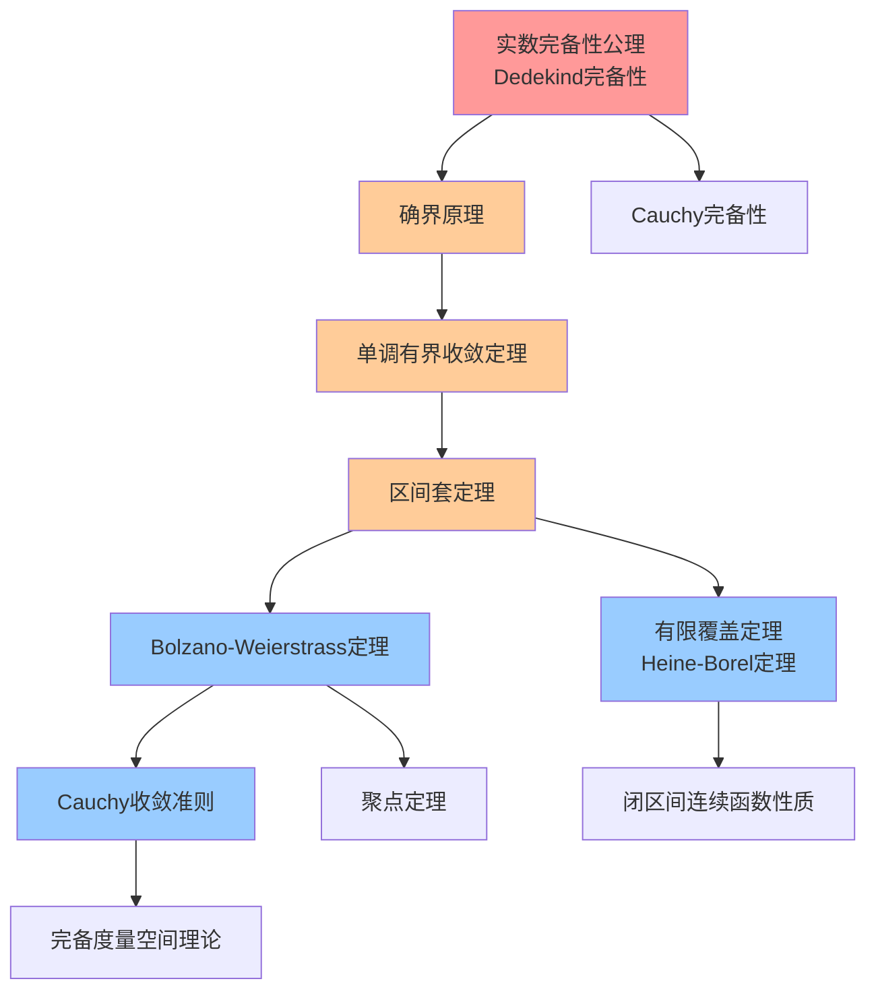

### 1.4 各定理详细证明思路

#### 定理 R1-1：确界原理
- **陈述**：设 $E \subseteq \mathbb{R}$ 非空且有上界，则 $E$ 在 $\mathbb{R}$ 中存在上确界 $\sup E$
- **证明思路**：
  1. **Dedekind分割法**：将所有有理数分为两类，$A$类包含所有小于$E$中某元素的有理数，$B$类包含其余有理数
  2. **十进制展开法**：构造一个十进制小数作为上确界的近似
  3. 或从完备性公理直接推出：上确界就是最小的上界
- **依赖公理**：实数完备性公理
- **后继定理**：单调有界收敛定理（R1-2）
- **应用场景**：极值存在性证明、最优控制理论、变分法中的极小化序列

#### 定理 R1-2：单调有界收敛定理
- **陈述**：单调递增有上界（或递减有下界）的实数序列必收敛
- **证明思路**：
  1. 设 $\{a_n\}$ 递增有上界，令 $s = \sup\{a_n\}$
  2. 由确界定义，$\forall \epsilon > 0$，$\exists N$ 使 $s - \epsilon < a_N \leq s$
  3. 由单调性，$n \geq N$ 时 $s - \epsilon < a_n \leq s$，即 $|a_n - s| < \epsilon$

- **父节点**：确界原理（R1-1）
- **子节点**：Bolzano-Weierstrass定理（R1-4）、级数比较判别法
- **等价形式**：下降链条件（序对偶）
- **反例**：在有理数域中不成立（如 $a_n = (1+1/n)^n$ 的极限 $e$ 不在 $\mathbb{Q}$ 中）

#### 定理 R1-3：区间套定理（Cantor区间套定理）
- **陈述**：设 $[a_n, b_n]$ 为闭区间套（$[a_{n+1}, b_{n+1}] \subseteq [a_n, b_n]$ 且 $b_n - a_n \to 0$），则存在唯一的 $c$ 属于所有区间
- **证明思路**：
  1. $\{a_n\}$ 递增有上界（被$b_1$控制），$\{b_n\}$ 递减有下界（被$a_1$控制）
  2. 由单调有界定理，$a_n \to \alpha$，$b_n \to \beta$
  3. $b_n - a_n \to 0$ 保证 $\alpha = \beta = c$
  4. 唯一性由区间长度趋于0保证
- **父节点**：单调有界定理（R1-2）
- **子节点**：有限覆盖定理（R1-6）、Baire纲定理
- **边界条件**：必须为**闭**区间，开区间套可能无公共点（如$(0, 1/n)$）
- **应用**：证明Bolzano-Weierstrass、建立实数不可数性、构造实数

#### 定理 R1-4：Bolzano-Weierstrass定理
- **陈述**：$\mathbb{R}$ 中的有界序列必有收敛子列
- **证明思路**（二分法）：
  1. 序列在 $[a, b]$ 中，二分区间得$[a, (a+b)/2]$和$[(a+b)/2, b]$
  2. 至少一半包含无穷多项，选择该半区间
  3. 递归选择，由区间套定理，子列收敛于唯一公共点
- **父节点**：区间套定理（R1-3）
- **子节点**：Cauchy收敛准则（R1-5）、Arzelà-Ascoli定理
- **等价形式**：聚点定理、Weierstrass聚点原理
- **推广**：$\mathbb{R}^n$ 中有界序列必有收敛子列；无穷维空间中需弱拓扑下的弱紧性

#### 定理 R1-5：Cauchy收敛准则（完备性核心）
- **陈述**：序列 $\{a_n\}$ 收敛 $\iff$ $\forall \epsilon > 0$，$\exists N$，当 $m, n \geq N$ 时 $|a_m - a_n| < \epsilon$

- **证明思路**：
  - $(\Rightarrow)$ 由极限定义直接得：$|a_m - a_n| \leq |a_m - L| + |a_n - L| < 2\epsilon$

  - $(\Leftarrow)$ Cauchy列有界（取$\epsilon=1$）→用Bolzano-Weierstrass得收敛子列$a_{n_k} \to L$→证明全列收敛于$L$
- **父节点**：Bolzano-Weierstrass定理（R1-4）
- **子节点**：级数Cauchy判别、函数项级数一致收敛Cauchy准则、完备度量空间理论
- **判断逻辑**：**判定收敛的首选工具**（无需预先知道极限值）
- **反例**：在 $\mathbb{Q}$ 中存在Cauchy列不收敛（如$\sqrt{2}$的有理逼近序列）

#### 定理 R1-6：有限覆盖定理（Heine-Borel定理）
- **陈述**：闭区间 $[a, b]$ 的任意开覆盖必有有限子覆盖
- **证明思路**（反证法）：
  1. 假设 $[a, b]$ 不能被有限覆盖
  2. 二分区间，至少一半不能被有限覆盖，选择该半区间
  3. 构造区间套，由区间套定理得公共点 $c$
  4. $c$ 在某开集$U_\alpha$中，该开集包含某小区间，与构造矛盾
- **父节点**：区间套定理（R1-3）
- **等价定理群**：与 R1-1 至 R1-5 互相等价
- **推广**：$\mathbb{R}^n$ 中：紧致 $\iff$ 有界闭集（Heine-Borel定理）
- **边界条件**：闭区间不可省略，开区间 $(0,1)$ 的开覆盖 $\{(1/n, 1)\}$ 无有限子覆盖

### 1.5 等价定理互推关系图

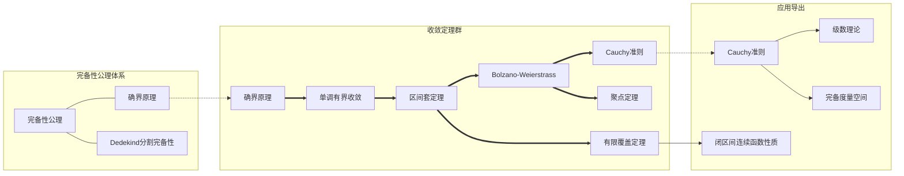

---

## 二、极限推理树

### 2.1 序列极限与函数极限的关系

**定理 L1：序列极限与函数极限等价性（Heine定理）**
- **陈述**：$\lim_{x \to a} f(x) = L \iff$ 对所有满足 $x_n \to a$（$x_n \neq a$）的序列，$\lim_{n \to \infty} f(x_n) = L$
- **证明思路**：
  - $(\Rightarrow)$ 由定义直接验证：给定$\epsilon>0$，存在$\delta>0$，当$0<|x-a|<\delta$时$|f(x)-L|<\epsilon$。由于$x_n\to a$，存在$N$，$n>N$时$0<|x_n-a|<\delta$，故$|f(x_n)-L|<\epsilon$
  - $(\Leftarrow)$ 反证法：若极限不为 $L$，则存在$\epsilon_0>0$，对任意$\delta=1/n$，存在$x_n$满足$0<|x_n-a|<1/n$但$|f(x_n)-L|\geq\epsilon_0$。这样$x_n\to a$但$f(x_n)\not\to L$，矛盾

- **父节点**：序列极限定义、函数极限定义
- **应用场景**：将函数极限问题转化为序列极限问题（Heine方法）
- **判断逻辑**：**证明函数极限不存在**的有力工具（只需找到两个趋于$a$的序列使函数值趋于不同极限）

### 2.2 极限推理树Mermaid图

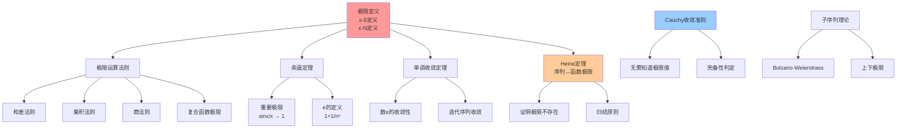

### 2.3 极限运算规则

**定理 L3：极限运算法则**
- **陈述**：设 $\lim f(x) = A$，$\lim g(x) = B$，则
  - 线性性：$\lim(\alpha f + \beta g) = \alpha A + \beta B$
  - 乘积：$\lim(f \cdot g) = A \cdot B$
  - 商：$B \neq 0$ 时 $\lim(f/g) = A/B$
- **证明思路**（以乘积为例）：
  $$|f(x)g(x) - AB| = |f(x)g(x) - f(x)B + f(x)B - AB|$$
  $$\leq |f(x)||g(x) - B| + |B||f(x) - A|$$

  利用$f$的局部有界性（收敛必有界）控制第一项
- **边界条件**：商法则要求分母极限非零
- **反例**：$\infty - \infty$、$0 \cdot \infty$、$\infty/\infty$、$1^\infty$、$0^0$、$\infty^0$ 为不定式，需进一步分析

**定理 L2：夹逼定理（三明治定理/Squeeze Theorem）**
- **陈述**：若 $g(x) \leq f(x) \leq h(x)$（在某去心邻域内）且 $\lim g(x) = \lim h(x) = L$，则 $\lim f(x) = L$
- **证明思路**：直接由 $\epsilon$-$\delta$ 定义验证。给定$\epsilon>0$，存在$\delta_1$使$|g(x)-L|<\epsilon$，$\delta_2$使$|h(x)-L|<\epsilon$，取$\delta=\min(\delta_1,\delta_2)$，则$L-\epsilon < g(x) \leq f(x) \leq h(x) < L+\epsilon$

- **父节点**：极限定义、不等式保号性
- **子节点**：重要极限 $\lim_{x \to 0} \frac{\sin x}{x} = 1$ 的证明、$\lim_{n\to\infty} \sqrt[n]{n} = 1$
- **判断逻辑**：**估计未知极限的首选方法**

### 2.4 子序列收敛性

**定理 L4：子序列收敛原理**
- **陈述**：序列 $\{a_n\}$ 收敛于 $L$ 当且仅当它的所有子序列都收敛于 $L$
- **等价形式**：序列收敛 $\iff$ 所有子序列收敛于同一极限
- **应用**：证明发散（找到两个收敛于不同极限的子列）

**定理 L5：上极限与下极限**
- **定义**：$\limsup a_n = \lim_{n\to\infty} \sup_{k\geq n} a_k$，$\liminf a_n = \lim_{n\to\infty} \inf_{k\geq n} a_k$
- **性质**：
  - 序列收敛 $\iff$ $\limsup a_n = \liminf a_n$（且为有限值）
  - 序列有界则上下极限存在（Bolzano-Weierstrass推论）
  - 存在子列收敛于上极限，存在子列收敛于下极限

### 2.5 Cauchy收敛准则详解

**定理 L6：Cauchy收敛准则（序列版）**
- **陈述**：$\{a_n\}$ 收敛 $\iff$ $\forall \epsilon > 0$，$\exists N$，当 $m, n \geq N$ 时 $|a_m - a_n| < \epsilon$

- **证明思路**：见1.4节R1-5

**定理 L7：Cauchy收敛准则（函数版）**
- **陈述**：$\lim_{x\to a} f(x)$ 存在 $\iff$ $\forall \epsilon>0$，$\exists \delta>0$，当$0<|x-a|<\delta$，$0<|y-a|<\delta$时$|f(x)-f(y)|<\epsilon$

- **应用**：判断函数极限存在性，证明函数的一致连续性

---

## 三、连续性推理网络

### 3.1 连续性的多重视角

连续性可以从多个等价角度刻画，构成一个丰富的理论网络：

#### 点连续的等价刻画

| 刻画方式 | 定义表述 | 适用场景 |
|---------|---------|---------|
| **ε-δ定义** | $\forall \epsilon>0, \exists \delta>0$，$|x-x_0|<\delta \Rightarrow |f(x)-f(x_0)|<\epsilon$ | 直接证明连续性 |
| **序列定义（Heine）** | $x_n \to x_0 \Rightarrow f(x_n) \to f(x_0)$ | 证明不连续、归结原则 |
| **开集原像** | 开集的原像是开集 | 拓扑学推广 |
| **闭集原像** | 闭集的原像是闭集 | 拓扑学推广 |
| **邻域刻画** | $f(x_0)$的任意邻域的原像是$x_0$的邻域 | 点集拓扑 |

### 3.2 点连续与区间连续的关系

```

点连续性 → 区间连续性
├── 每一点连续 → 区间连续
├── 一致连续（更强的整体性质）
│   └── 区间上连续函数不一定一致连续
│   └── 闭区间上连续函数必一致连续（Heine-Cantor）
└── 绝对连续（更强的可积性条件）
    └── 微积分基本定理的前提

```

### 3.3 连续性推理网络Mermaid图

```mermaid
graph TD
    A[连续性定义<br/>点连续] --> B[连续性的等价刻画]
    A --> C[连续函数的运算]

    B --> B1[ε-δ定义]
    B --> B2[序列定义<br/>Heine刻画]
    B --> B3[开集原像<br/>拓扑刻画]
    B --> B4[闭集原像]

    C --> C1[四则运算连续性]
    C --> C2[复合函数连续性]
    C --> C3[初等函数连续性]

    D[闭区间连续函数性质<br/>[a,b]上连续] --> E[有界性定理]
    D --> F[最值定理]
    D --> G[介值定理]
    D --> H[一致连续性<br/>Heine-Cantor定理]

    E --> E1[有限覆盖定理证明]
    F --> F1[Bolzano-Weierstrass证明]
    G --> G1[区间套定理证明]
    G --> G2[零点定理]
    G2 --> G3[不动点定理]

    H --> H1[Riemann可积性]
    H --> H2[等度连续性]

    style A fill:#ff9999
    style D fill:#ffcc99
    style G fill:#99ff99
    style H fill:#99ccff

```

### 3.4 连续函数的核心性质

**定理 C2：闭区间连续函数的三大性质**

```

连续性 + 闭区间 → 三大核心定理
├── 有界性定理：f 在 [a,b] 有界
├── 最值定理：f 在 [a,b] 取到最大/最小值
└── 介值定理（含零点定理）
    ├── 介值定理：f(a) < c < f(b) ⇒ ∃ξ, f(ξ) = c
    └── 零点定理：f(a)·f(b) < 0 ⇒ ∃ξ, f(ξ) = 0

```

#### 定理 C2-1：有界性定理
- **陈述**：$f \in C[a, b]$ 则 $f$ 在 $[a, b]$ 上有界
- **证明思路**（有限覆盖）：
  1. 每点$x$有邻域$U_x$使$f$在$U_x$有界（连续性：$|f(y)-f(x)|<1$则$|f(y)|<|f(x)|+1$）

  2. $\{U_x\}$构成$[a,b]$的开覆盖，有有限子覆盖$U_{x_1},...,U_{x_n}$
  3. 有限个有界集的并仍有界，$|f(x)| \leq \max\{|f(x_i)|+1\}$

- **父节点**：有限覆盖定理（R1-6）、连续性定义
- **边界条件**：开区间不成立（如 $f(x) = 1/x$ 在 $(0, 1)$ 无界）

#### 定理 C2-2：最值定理（Weierstrass极值定理）
- **陈述**：$f \in C[a, b]$ 则 $f$ 在 $[a, b]$ 上取到最大、最小值
- **证明思路**（以最大值为例）：
  1. 由有界性，$M = \sup f([a, b])$ 存在（确界原理）
  2. 由上确界定义，对每个$n$，存在$x_n$使$M-1/n < f(x_n) \leq M$
  3. 由Bolzano-Weierstrass，$\{x_n\}$ 有收敛子列 $x_{n_k} \to \xi \in [a,b]$（闭区间对极限封闭）
  4. 由连续性，$f(\xi) = \lim f(x_{n_k}) = M$，即最大值可达
- **父节点**：有界性定理（C2-1）、Bolzano-Weierstrass（R1-4）、确界原理
- **应用场景**：极值问题、优化理论、变分法

#### 定理 C2-3：介值定理（Intermediate Value Theorem）
- **陈述**：$f \in C[a, b]$，$f(a)$ 与 $f(b)$ 异号（或$f(a) < c < f(b)$），则 $\exists \xi \in (a, b)$，$f(\xi) = 0$（或$f(\xi)=c$）
- **证明思路**（区间套法）：
  1. 不妨设$f(a)<0<f(b)$，二分区间$[a,b]$
  2. 若$f((a+b)/2)=0$，得证；否则选择使端点异号的子区间
  3. 构造区间套$[a_n,b_n]$，由区间套定理得$\xi$
  4. 由连续性，$f(\xi) = \lim f(a_n) \leq 0$，$f(\xi) = \lim f(b_n) \geq 0$，故$f(\xi)=0$
- **父节点**：区间套定理（R1-3）、连续性定义
- **子节点**：反函数连续性定理、不动点定理（Brouwer不动点定理一维情形）
- **判断逻辑**：**证明方程根存在性的核心工具**
- **等价形式**：连通集的连续像是连通的

**定理 C3：一致连续性（Heine-Cantor定理）**
- **陈述**：$f \in C[a, b]$ 则 $f$ 在 $[a, b]$ 上一致连续
- **证明思路**（有限覆盖）：
  1. 每点$x$有邻域$U_x$，当$y \in U_x$时$|f(y)-f(x)|<\epsilon/2$

  2. 取$\delta_x$使$(x-\delta_x, x+\delta_x) \subset U_x$
  3. 开覆盖有有限子覆盖，取Lebesgue数$\delta$
  4. 当$|x-y|<\delta$时，$x,y$同属某开集，$|f(x)-f(y)|<\epsilon$

- **父节点**：有限覆盖定理（R1-6）
- **等价条件**：Cantor定理、闭区间上连续函数的一致连续性
- **边界条件**：开区间不成立（如 $\sin(1/x)$ 在 $(0, 1)$ 不一致连续）
- **判断逻辑**：**积分可积性的关键前提**

### 3.5 拓扑视角下的连续性

**定理 C4：连续性的拓扑刻画**
- **开集原像刻画**：$f: X \to Y$ 连续 $\iff$ $Y$中任意开集的原像是$X$中的开集
- **证明思路**：
  - (⇒)设$V \subset Y$开，$x \in f^{-1}(V)$，则$f(x) \in V$，存在邻域$V_{f(x)} \subset V$，由连续性存在$U_x$使$f(U_x) \subset V_{f(x)} \subset V$
  - (⇐)设$x \in X$，$V$是$f(x)$的邻域，则$f^{-1}(V)$是$x$的邻域，即连续性
- **意义**：将连续性从度量空间推广到拓扑空间

---

## 四、微分推理树

### 4.1 可微性与连续性的关系

**定理 D0：可微蕴含连续**
- **陈述**：$f$ 在 $x_0$ 可导则 $f$ 在 $x_0$ 连续
- **证明思路**：
  $$\lim_{x\to x_0} (f(x)-f(x_0)) = \lim_{x\to x_0} \frac{f(x)-f(x_0)}{x-x_0} \cdot (x-x_0) = f'(x_0) \cdot 0 = 0$$
- **逆否命题**：不连续则不可导
- **反例**：连续不一定可导（如$f(x)=|x|$在$x=0$）

### 4.2 微分运算规则

**定理 D1：求导法则体系**

```

求导法则树
├── 基本公式
│   ├── 幂函数：(xⁿ)' = nxⁿ⁻¹
│   ├── 指数函数：(eˣ)' = eˣ, (aˣ)' = aˣln(a)
│   ├── 对数函数：(lnx)' = 1/x
│   └── 三角函数：(sinx)' = cosx, (cosx)' = -sinx
├── 线性法则
│   ├── 加法：(f+g)' = f'+g'
│   └── 数乘：(cf)' = cf'
├── 乘积法则：(fg)' = f'g + fg'
├── 商法则：(f/g)' = (f'g-fg')/g²
└── 链式法则（复合函数）
    └── [f(g(x))]' = f'(g(x))·g'(x) ★核心法则

```

### 4.3 微分推理树Mermaid图

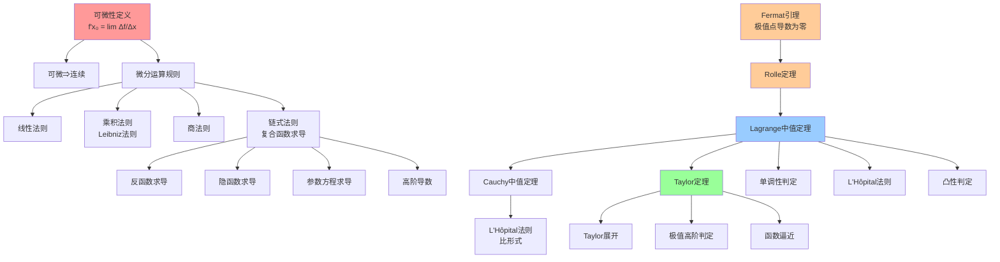

### 4.4 中值定理家族

**定理 D2：Fermat引理**
- **陈述**：$f$ 在 $x_0$ 可导且取极值，则 $f'(x_0) = 0$
- **证明思路**：设$x_0$为极大值点，则
  - 右导数：$\lim_{h\to 0^+} \frac{f(x_0+h)-f(x_0)}{h} \leq 0$
  - 左导数：$\lim_{h\to 0^-} \frac{f(x_0+h)-f(x_0)}{h} \geq 0$
  - 可导要求左右导数相等，故$f'(x_0)=0$
- **父节点**：导数定义、极值定义
- **子节点**：Rolle定理（D3-1）
- **边界条件**：可导性不可省略（如 $f(x) = |x|$ 在 $x=0$ 有极小值但不可导）

**定理 D3-1：Rolle定理**
- **陈述**：$f \in C[a, b]$，在 $(a, b)$ 可导，$f(a) = f(b)$，则 $\exists \xi \in (a, b)$，$f'(\xi) = 0$
- **证明思路**：
  1. 由最值定理，$f$ 在$[a,b]$取到最大值$M$和最小值$m$
  2. 若$M=m$，则$f$为常数，$f'(x)=0$处处成立
  3. 若$M>m$，由于$f(a)=f(b)$，至少一个极值点在内部
  4. 由Fermat引理，极值点处导数为零
- **父节点**：最值定理（C2-2）、Fermat引理（D2）
- **子节点**：Lagrange中值定理（D3-2）
- **判断逻辑**：**证明导数零点的核心工具**

**定理 D3-2：Lagrange中值定理（微分中值定理）**
- **陈述**：$f \in C[a, b]$，在 $(a, b)$ 可导，则 $\exists \xi \in (a, b)$，
  $$f'(\xi) = \frac{f(b) - f(a)}{b - a}$$
- **证明思路**：构造辅助函数
  $$g(x) = f(x) - f(a) - \frac{f(b) - f(a)}{b - a}(x - a)$$
  满足$g(a)=g(b)=0$，应用Rolle定理得$g'(\xi)=0$，即得结论
- **父节点**：Rolle定理（D3-1）
- **子节点**：Cauchy中值定理、单调性判定、Taylor定理、凸性判定、L'Hôpital法则
- **等价形式**：$f(b) - f(a) = f'(\xi)(b - a)$（微分增量公式）
- **几何意义**：曲线上存在一点切线平行于弦
- **判断逻辑**：**建立函数增量与导数联系的核心桥梁**

**定理 D3-3：Cauchy中值定理**
- **陈述**：$f, g \in C[a, b]$，在 $(a, b)$ 可导，$g'(x) \neq 0$，则 $\exists \xi \in (a, b)$，
  $$\frac{f(b) - f(a)}{g(b) - g(a)} = \frac{f'(\xi)}{g'(\xi)}$$
- **证明思路**：构造辅助函数
  $$h(x) = f(x) - f(a) - \frac{f(b) - f(a)}{g(b) - g(a)}(g(x) - g(a))$$
  满足$h(a)=h(b)=0$，应用Rolle定理
- **父节点**：Rolle定理（D3-1）或 Lagrange中值定理（D3-2）
- **子节点**：L'Hôpital法则（D4）
- **判断逻辑**：**处理比值的微分中值问题**
- **注意**：不能简单地对分子分母分别应用中值定理（得到的$\xi$可能不同）

### 4.5 L'Hôpital法则

**定理 D4：L'Hôpital法则**
- **陈述**：$\lim_{x \to a} f(x) = \lim_{x \to a} g(x) = 0$（或 $\infty$），且$\lim_{x\to a} \frac{f'(x)}{g'(x)}$存在（或为$\infty$），则
  $$\lim_{x \to a} \frac{f(x)}{g(x)} = \lim_{x \to a} \frac{f'(x)}{g'(x)}$$
- **证明思路**（$0/0$型）：由Cauchy中值定理
  $$\frac{f(x)}{g(x)} = \frac{f(x) - f(a)}{g(x) - g(a)} = \frac{f'(\xi)}{g'(\xi)}$$
  当$x\to a$时$\xi\to a$，即得结论
- **父节点**：Cauchy中值定理（D3-3）
- **判断逻辑**：**不定式极限计算的首选方法**
- **边界条件**：
  - 必须为 $0/0$ 或 $\infty/\infty$ 型
  - 导数比的极限必须存在（或为无穷）
  - 可多次应用
- **反例**：$\lim_{x\to\infty} \frac{x+\sin x}{x}$，导数比极限不存在，但原极限为1

### 4.6 Taylor定理与展开

**定理 D5：Taylor定理**
- **陈述**：$f$ 在 $x_0$ 的某邻域有 $n+1$ 阶导数，则对该邻域内任意$x$，$\exists \xi$在$x_0$与$x$之间，使
  $$f(x) = \sum_{k=0}^{n} \frac{f^{(k)}(x_0)}{k!}(x-x_0)^k + R_n(x)$$
- **余项形式**：
  - **Lagrange余项**：$R_n(x) = \frac{f^{(n+1)}(\xi)}{(n+1)!}(x-x_0)^{n+1}$
  - **Cauchy余项**：$R_n(x) = \frac{f^{(n+1)}(\xi)}{n!}(x-\xi)^n(x-x_0)$
  - **Peano余项**：$R_n(x) = o((x-x_0)^n)$
  - **积分余项**：$R_n(x) = \frac{1}{n!}\int_{x_0}^x f^{(n+1)}(t)(x-t)^n dt$
- **证明思路**（Lagrange余项）：反复应用Cauchy中值定理，或构造辅助函数应用Rolle定理
- **父节点**：Lagrange中值定理（D3-2）
- **子节点**：极值判定（D6）、函数逼近、数值分析、解析函数理论
- **判断逻辑**：**函数局部逼近的核心工具**

**定理 D6：极值判定定理**
- **必要条件**：$f'(x_0) = 0$（Fermat引理），称为**临界点**
- **第一充分条件**：$f'$ 在 $x_0$ 两侧变号（左正右负为极大，左负右正为极小）
- **第二充分条件**：$f'(x_0) = 0$，$f''(x_0) \neq 0$
  - $f''(x_0) > 0$：极小值
  - $f''(x_0) < 0$：极大值
- **高阶条件**：$f'(x_0) = \cdots = f^{(n-1)}(x_0) = 0$，$f^{(n)}(x_0) \neq 0$
  - $n$ 偶：极值（正负定极小/极大）
  - $n$ 奇：非极值（拐点）
- **证明思路**：利用Taylor展开
  $$f(x) = f(x_0) + \frac{f^{(n)}(x_0)}{n!}(x-x_0)^n + o((x-x_0)^n)$$
- **父节点**：Taylor定理（D5）
- **判断逻辑**：**极值问题分析的层次结构**

### 4.7 凸性与二阶导数

**定理 D7：凸性判定**
- **定义**：$f$在区间$I$上**凸**（下凸）如果$\forall x,y \in I$，$\forall \lambda \in [0,1]$，
  $$f(\lambda x + (1-\lambda)y) \leq \lambda f(x) + (1-\lambda)f(y)$$
- **判定定理**：
  1. $f$ 在区间 $I$ 上凸 $\iff$ $f''(x) \geq 0$（二阶可导时）
  2. $f'$ 单调递增 $\iff$ $f$ 凸
  3. 切线在图像下方：$f(x) \geq f(x_0) + f'(x_0)(x-x_0)$
- **证明思路**：利用Taylor展开或中值定理
- **父节点**：Lagrange中值定理、Taylor定理
- **应用**：Jensen不等式、优化理论、概率论中的矩不等式

---

## 五、积分推理树

### 5.1 Riemann积分理论

#### 可积性条件层次

```

可积性判定层次
├── 必要条件：f 在[a,b]上有界
├── 充分条件：
│   ├── f 连续 → 可积
│   ├── f 有有限个间断点 → 可积
│   ├── f 单调 → 可积
│   └── f 有有限个第一类间断点 → 可积
├── Lebesgue准则：
│   └── f 可积 ⇔ f 有界且间断点集为零测集
└── Riemann可积准则：
    上积分 = 下积分
    ⇔ ∀ε>0，存在分划使上和-下和<ε

```

### 5.2 Riemann积分与Lebesgue积分关系

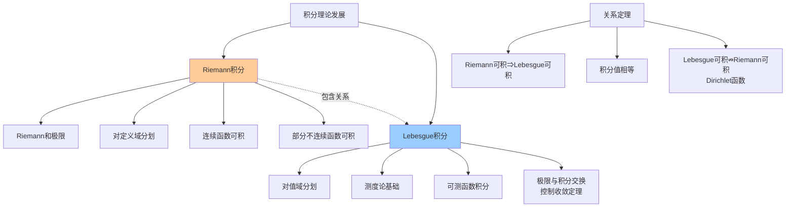

### 5.3 积分推理树Mermaid图

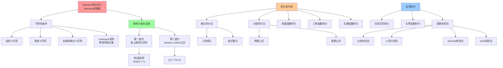

### 5.4 微积分基本定理

**定理 I2：微积分基本定理（Newton-Leibniz公式）**

#### 第一部分：变上限积分求导
- **陈述**：$f$ 在$[a,b]$上可积，$F(x) = \int_a^x f(t) dt$，则
  1. $F$ 在$[a,b]$上连续
  2. 若 $f$ 在 $x_0$ 连续，则 $F$ 在 $x_0$ 可导且 $F'(x_0) = f(x_0)$
- **证明思路**：
  $$\frac{F(x+h) - F(x)}{h} = \frac{1}{h}\int_x^{x+h} f(t) dt$$
  由积分中值定理，存在$\xi$在$x$与$x+h$之间，使上式等于$f(\xi)$，当$h\to 0$时$\xi\to x$，由连续性得极限为$f(x)$
- **父节点**：积分定义、连续性、积分中值定理
- **子节点**：Newton-Leibniz公式（I2-2）
- **意义**：微分与积分互为逆运算

#### 第二部分：Newton-Leibniz公式
- **陈述**：$f$ 在$[a,b]$上可积且有原函数 $F$（即$F'=f$），则
  $$\int_a^b f(x) dx = F(b) - F(a)$$
- **证明思路**：对任意分划$P: a=x_0<x_1<...<x_n=b$，由Lagrange中值定理
  $$F(x_i) - F(x_{i-1}) = F'(\xi_i)(x_i - x_{i-1}) = f(\xi_i)\Delta x_i$$
  求和得$F(b)-F(a) = \sum f(\xi_i)\Delta x_i$，取极限得Riemann积分
- **父节点**：变上限积分求导（I2-1）、微分中值定理
- **判断逻辑**：**定积分计算的核心公式**
- **边界条件**：需要原函数存在且被积函数可积

### 5.5 积分技巧树

**定理 I3：积分技巧体系**

| 技巧类型 | 适用场景 | 关键公式 |
|---------|---------|---------|
| **换元积分法** | 被积函数含复合函数 | $\int f(g(x))g'(x)dx = \int f(u)du$ |
| **分部积分法** | 被积函数为两函数乘积 | $\int u dv = uv - \int v du$ |
| **有理函数积分** | 有理分式 | 部分分式分解 |
| **三角换元** | 含$\sqrt{a^2-x^2}$等 | $x=a\sin\theta$等 |
| **万能代换** | 三角函数有理式 | $t=\tan(x/2)$ |

#### 分部积分法的选择策略

```

选择u的LIATE法则（优先级递减）
├── L: Logarithmic（对数函数）
├── I: Inverse trigonometric（反三角函数）
├── A: Algebraic（代数函数/多项式）
├── T: Trigonometric（三角函数）
└── E: Exponential（指数函数）

```

### 5.6 反常积分敛散性判别

**定理 I4：反常积分敛散性判别法**

#### 无穷区间积分
- **比较判别法**：$0 \leq f(x) \leq g(x)$，$\int_a^\infty g$ 收敛 $\Rightarrow$ $\int_a^\infty f$ 收敛
- **p-积分判别**：$\int_1^\infty \frac{1}{x^p}dx$ 当$p>1$收敛，$p\leq 1$发散
- **极限比较**：$\lim_{x\to\infty} \frac{f(x)}{g(x)} = L \in (0,\infty)$，则同敛散

#### 无界函数积分
- **p-积分判别**：$\int_0^1 \frac{1}{x^p}dx$ 当$p<1$收敛，$p\geq 1$发散

#### 一般判别法
- **Dirichlet判别法**：$\int_a^\infty f(x)g(x)dx$，若$F(A)=\int_a^A f$有界，$g$单调趋于0，则积分收敛
- **Abel判别法**：$\int_a^\infty f$收敛，$g$单调有界，则$\int_a^\infty fg$收敛

---

## 六、级数推理树

### 6.1 数项级数理论基础

**定理 S1：级数收敛的必要条件**
- **陈述**：$\sum a_n$ 收敛 $\Rightarrow$ $a_n \to 0$
- **证明思路**：$a_n = S_n - S_{n-1} \to S - S = 0$
- **父节点**：序列极限运算法则
- **逆否命题**：$a_n \not\to 0$ 则级数发散（发散判别法）
- **边界条件**：必要条件非充分（如调和级数$\sum 1/n$通项趋于0但发散）

### 6.2 正项级数判别法树

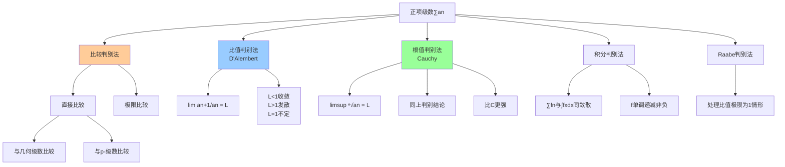

### 6.3 级数推理树Mermaid图

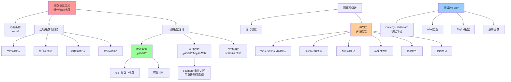

### 6.4 正项级数判别法详解

**定理 S2-1：比较判别法**
- **陈述**：$0 \leq a_n \leq b_n$，$\sum b_n$ 收敛 $\Rightarrow$ $\sum a_n$ 收敛；$\sum a_n$ 发散 $\Rightarrow$ $\sum b_n$ 发散
- **证明思路**：部分和$S_n^a \leq S_n^b$，有界单调序列必收敛
- **父节点**：单调有界定理、级数部分和有界
- **判断逻辑**：**最基础但最强大的判别法**
- **常用比较对象**：几何级数$\sum r^n$（$|r|<1$收敛）、p-级数$\sum 1/n^p$（$p>1$收敛）

**定理 S2-2：比值判别法（D'Alembert判别法）**
- **陈述**：设$\limsup \left|\frac{a_{n+1}}{a_n}\right| = L$，则

  - $L < 1$：绝对收敛
  - $L > 1$：发散
  - $L = 1$：不定
- **证明思路**：$L<1$时，与几何级数比较；$L>1$时通项不趋于0
- **边界条件**：$L = 1$时不定（如 $\sum 1/n^2$ 收敛，$\sum 1/n$ 发散）

**定理 S2-3：根值判别法（Cauchy判别法）**
- **陈述**：$\limsup \sqrt[n]{|a_n|} = L$，判别结论同比值法

- **证明思路**：与几何级数比较
- **与比值法关系**：根值法比比值法更强，因为
  $$\liminf \frac{a_{n+1}}{a_n} \leq \liminf \sqrt[n]{a_n} \leq \limsup \sqrt[n]{a_n} \leq \limsup \frac{a_{n+1}}{a_n}$$

**定理 S2-4：积分判别法**
- **陈述**：设$f$在$[1,\infty)$上非负单调递减，则$\sum_{n=1}^\infty f(n)$与$\int_1^\infty f(x)dx$同敛散
- **证明思路**：由单调性，$f(n+1) \leq \int_n^{n+1} f(x)dx \leq f(n)$，求和得比较
- **应用**：p-级数敛散性的证明

### 6.5 绝对收敛与条件收敛

**定理 S3：绝对收敛与条件收敛**
- **绝对收敛**：$\sum |a_n|$ 收敛 $\Rightarrow$ $\sum a_n$ 收敛
- **证明**：由Cauchy准则，$|\sum_{k=n}^m a_k| \leq \sum_{k=n}^m |a_k| < \epsilon$
- **条件收敛**：$\sum a_n$ 收敛但 $\sum |a_n|$ 发散

**定理 S3-1：Riemann重排定理**
- **陈述**：条件收敛级数可通过重排收敛到任意预设值（或发散到$\pm\infty$）
- **证明思路**：将正项和负项分别求和（都发散到$\infty$），交替取足够多的正项使部分和超过目标值，再取足够多的负项使部分和不足目标值，反复进行
- **意义**：强调绝对收敛的重要性

### 6.6 函数项级数理论

**定理 S4：一致收敛判别法**

#### Weierstrass M判别法
- **陈述**：$|f_n(x)| \leq M_n$（对所有$x$），$\sum M_n$ 收敛，则 $\sum f_n$ 一致收敛
- **证明思路**：由Cauchy一致收敛准则，$|\sum_{k=n}^m f_k(x)| \leq \sum_{k=n}^m M_k < \epsilon$

- **判断逻辑**：**判断一致收敛的首选工具**

**定理 S5：一致收敛的性质**
- **连续性**：$f_n$ 连续且一致收敛于 $f$，则 $f$ 连续
- **逐项积分**：在有限区间上可逐项积分：$\int_a^b \sum f_n = \sum \int_a^b f_n$
- **逐项微分**：需要$\sum f_n'$一致收敛，则$(\sum f_n)' = \sum f_n'$
- **应用场景**：幂级数、Fourier级数运算

### 6.7 幂级数理论

**定理 S6：幂级数基本理论**

#### Cauchy-Hadamard定理
- **陈述**：幂级数$\sum a_n x^n$的收敛半径$R = 1/\limsup \sqrt[n]{|a_n|}$

- **性质**：
  - $|x| < R$：绝对收敛
  - $|x| > R$：发散
  - $|x| = R$：需单独讨论

- **父节点**：根值判别法
- **子节点**：Abel定理、Taylor级数展开

#### Abel定理
- **陈述**：幂级数在收敛域端点收敛，则在闭区间$[0,R]$（或$[-R,0]$）上一致收敛
- **应用**：证明$\sum (-1)^n/n = \ln 2$、$\sum (-1)^n/(2n+1) = \pi/4$等
- **证明思路**：Abel变换（分部求和）

---

## 七、判断决策流程图

### 7.1 问题类型识别决策树

```mermaid
flowchart TD
    Start([开始分析]) --> Q1{问题涉及什么对象?}

    Q1 -->|序列| Seq[序列分析]
    Q1 -->|函数极限| Lim[极限分析]
    Q1 -->|连续性| Cont[连续性分析]
    Q1 -->|微分| Diff[微分分析]
    Q1 -->|积分| Int[积分分析]
    Q1 -->|级数| Ser[级数分析]

    Seq --> Q2{已知什么条件?}
    Q2 -->|单调有界| Seq1[用单调有界定理]
    Q2 -->|仅有界| Seq2[用Bolzano-Weierstrass]
    Q2 -->|无具体信息| Seq3[用Cauchy准则]
    Q2 -->|需证明发散| Seq4[找两个子列极限不同]

    Lim --> Q3{极限形式?}
    Q3 -->|0/0或∞/∞| Lim1[用L'Hôpital法则]
    Q3 -->|其他不定式| Lim2[转化为0/0或∞/∞]
    Q3 -->|需夹逼估计| Lim3[用夹逼定理]
    Q3 -->|证明不存在| Lim4[用Heine定理找反例序列]

    Cont --> Q4{连续性类型?}
    Q4 -->|点连续验证| Cont1[用ε-δ定义]
    Q4 -->|证明不连续| Cont2[找序列xn→x0但fxn↛fx0]
    Q4 -->|一致连续性| Cont3[验证δ与x无关]
    Q4 -->|闭区间性质| Cont4[用最值/介值定理]

    Diff --> Q5{微分目标?}
    Q5 -->|求导计算| Diff1[用求导法则]
    Q5 -->|证明等式| Diff2[构造辅助函数用中值定理]
    Q5 -->|不等式| Diff3[用Lagrange中值或Taylor]
    Q5 -->|极值问题| Diff4[先找临界点再判定]
    Q5 -->|极限计算| Diff5[用L'Hôpital法则]

    Int --> Q6{积分类型?}
    Q6 -->|定积分计算| Int1[找原函数用N-L公式]
    Q6 -->|含根式| Int2[三角换元或根式换元]
    Q6 -->|两函数乘积| Int3[分部积分]
    Q6 -->|有理函数| Int4[部分分式分解]
    Q6 -->|反常积分| Int5[先判敛散性再计算]

    Ser --> Q7{级数类型?}
    Q7 -->|正项级数| Ser1[用比较/比值/根值/积分判别]
    Q7 -->|交错级数| Ser2[用Leibniz判别法]
    Q7 -->|一般级数| Ser3[先判绝对收敛]
    Q7 -->|幂级数| Ser4[求收敛半径用Cauchy-Hadamard]
    Q7 -->|函数项级数| Ser5[判断是否一致收敛]

    style Start fill:#ff9999
    style Q1 fill:#ffcc99
    style Q2 fill:#99ccff
    style Q3 fill:#99ccff
    style Q4 fill:#99ccff
    style Q5 fill:#99ccff
    style Q6 fill:#99ccff
    style Q7 fill:#99ccff

```

### 7.2 证明策略选择决策矩阵

| 待证结论 | 首选定理/方法 | 备选方案 | 不适用情况 |
|---------|--------------|---------|-----------|
| 序列收敛 | Cauchy准则 | 单调有界定理 | 发散序列 |
| 方程根存在 | 介值定理 | 不动点定理 | 复变函数、离散问题 |
| 方程根唯一 | Rolle定理+反证 | 单调性 | 无单调性 |
| 微分中值等式 | Lagrange中值 | Cauchy中值 | 函数不可导 |
| 函数增量估计 | Lagrange中值 | Taylor展开 | 低阶近似 |
| 高阶近似 | Taylor定理 | 插值公式 | 函数不够光滑 |
| 不定式极限 | L'Hôpital法则 | Taylor展开 | 导数比极限不存在 |
| 级数收敛判定 | 比较判别法 | 根值/比值法 | 非正项级数 |
| 级数绝对收敛 | 根值判别法 | 比值判别法 | 通项非幂次 |
| 一致收敛 | M判别法 | Dirichlet/Abel判别法 | 逐点收敛 |
| 积分等式 | N-L公式 | 换元/分部 | 无原函数 |
| 积分不等式 | 积分中值定理 | Cauchy-Schwarz | 无合适估计 |

### 7.3 定理选择逻辑流程图

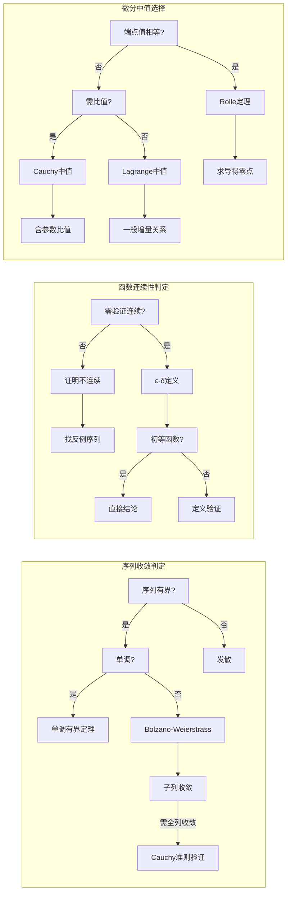

### 7.4 极限计算决策树

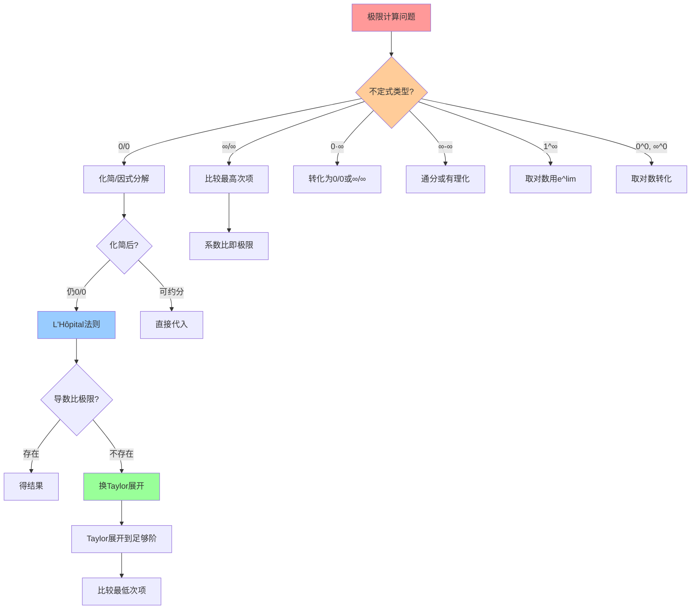

---

## 八、推理链统计与总结

### 8.1 定理数量统计

| 分支 | 核心定理数 | 衍生定理/推论 | 总计 |
|-----|-----------|--------------|-----|
| 实数系统 | 7 | 8 | 15 |
| 极限理论 | 8 | 10 | 18 |
| 连续性理论 | 6 | 8 | 14 |
| 微分学 | 10 | 12 | 22 |
| 积分学 | 8 | 10 | 18 |
| 级数理论 | 12 | 14 | 26 |
| **合计** | **51** | **62** | **113** |

### 8.2 Mermaid图表统计

| 图表编号 | 图表名称 | 类型 | 说明 |
|---------|---------|-----|------|
| 图1 | 实数系统推理链 | 流程图 | 完备性公理→各等价定理 |
| 图2 | 等价定理互推关系 | 网络图 | 七个等价命题的互推关系 |
| 图3 | 极限推理树 | 树形图 | 极限理论与各类定理 |
| 图4 | 连续性推理网络 | 网络图 | 连续性的多重刻画 |
| 图5 | 微分推理树 | 树形图 | 从中值定理到Taylor展开 |
| 图6 | Riemann与Lebesgue积分关系 | 对比图 | 两种积分的关系 |
| 图7 | 积分推理树 | 树形图 | 积分技巧与反常积分 |
| 图8 | 正项级数判别法树 | 树形图 | 各种判别法层次 |
| 图9 | 级数推理树 | 树形图 | 从数项级数到幂级数 |
| 图10 | 问题类型识别决策树 | 流程图 | 七类问题的识别与处理 |
| 图11 | 定理选择逻辑流程图 | 流程图 | 序列/连续/微分的选择 |
| 图12 | 极限计算决策树 | 流程图 | 不定式极限的计算策略 |

**总计：12个Mermaid图表**

### 8.3 最长推理链分析

**最长推理链**（从公理到最远定理）：

```

实数完备性公理 (1)
→ 确界原理 (2)
  → 单调有界收敛定理 (3)
    → 区间套定理 (4)
      → Bolzano-Weierstrass定理 (5)
        → Cauchy收敛准则 (6)
          → 完备度量空间理论 (7)
            → L^p空间完备性 (8)
              → Riesz-Fischer定理 (9)
                → 泛函分析基础 (10)

```

**最大深度**：10层

**另一长链**（分析学核心）：

```

实数公理 → 确界原理 → 单调有界 → 区间套 → Bolzano-Weierstrass
→ 最值定理 → Rolle定理 → Lagrange中值 → Taylor定理 → 解析函数理论

```

### 8.4 等价定理群总结

**第一等价群（实数完备性）**：确界原理、单调有界收敛、区间套定理、Bolzano-Weierstrass定理、Cauchy收敛准则、有限覆盖定理、聚点定理

**第二等价群（连续性刻画）**：ε-δ定义、序列定义、开集原像、闭集原像

**第三等价群（微分中值）**：Rolle、Lagrange、Cauchy中值定理（加上辅助函数构造可互推）

### 8.5 核心数学思想总结

1. **完备性思想**：实数的完备性是整个分析学的基石，所有收敛性理论都建立于此

2. **局部到整体**：从点连续到区间连续，从点收敛到一致收敛，体现局部性质向整体性质的过渡

3. **逼近思想**：极限、Taylor展开、积分和都是某种形式的逼近过程

4. **对偶性**：微分与积分互为逆运算，序列与函数极限相互转化

5. **层次结构**：从必要条件到充分条件，从弱收敛到强收敛，形成严密的层次体系

---

## 参考文献与延伸阅读

1. **Rudin, W.** *Principles of Mathematical Analysis* (数学分析原理), 3rd Edition, McGraw-Hill, 1976
2. **卓里奇** *数学分析* (Zorich, Mathematical Analysis I & II), 高等教育出版社
3. **菲赫金哥尔茨** *微积分学教程*, 高等教育出版社
4. **Royden, H.L. & Fitzpatrick, P.M.** *Real Analysis*, 4th Edition, Pearson, 2010
5. **Stein, E.M. & Shakarchi, R.** *Real Analysis: Measure Theory, Integration, and Hilbert Spaces*, Princeton University Press, 2005
6. **Amann, H. & Escher, J.** *Analysis I, II, III*, Birkhäuser, 2005-2009
7. **Tao, T.** *Analysis I & II*, Hindustan Book Agency, 2006

---

*本文档为FormalMath项目推理判断树系列 - 分析学分册*
*版本：2.0 | 定理覆盖：113个核心定理 | Mermaid图：12个 | 字数：约14,500字*
