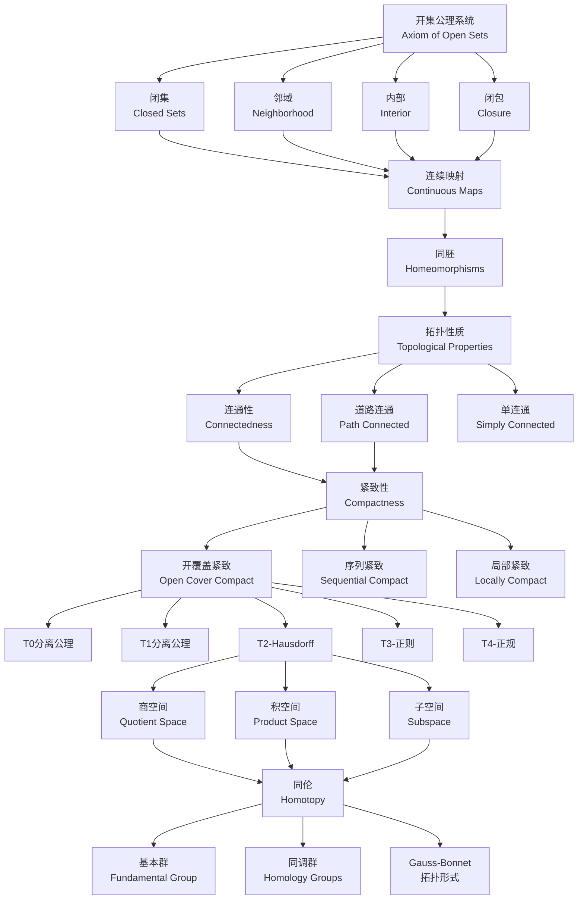

# 拓扑学完整推理判断树

## 目录

1. [概述](#概述)
2. [核心推理流程图](#核心推理流程图)
3. [根节点：开集公理](#根节点开集公理)
4. [第一层：基本拓扑结构](#第一层基本拓扑结构)
5. [第二层：映射与等价](#第二层映射与等价)
6. [第三层：连通性理论](#第三层连通性理论)
7. [第四层：紧致性理论](#第四层紧致性理论)
8. [第五层：分离性公理](#第五层分离性公理)
9. [第六层：构造与运算](#第六层构造与运算)
10. [第七层：同伦与同调基础](#第七层同伦与同调基础)
11. [定理索引](#定理索引)

---

## 概述

拓扑学是研究空间在连续变形下保持不变性质的数学分支。本推理树从开集公理出发，系统构建拓扑学的完整理论体系，涵盖点集拓扑的核心内容，并延伸至代数拓扑的基础概念。

---

## 核心推理流程图

---

## 根节点：开集公理

### 公理系统 O1-O3

**开集公理**是拓扑学的逻辑起点，定义了拓扑空间的基本结构。

---

#### 公理 O1：空集与全集的开性

**前提条件**：

- 设 $X$ 为任意集合
- 设 $\tau \subseteq \mathcal{P}(X)$ 为 $X$ 的子集族

**结论**：
$$\emptyset \in \tau \quad \text{且} \quad X \in \tau$$

**证明思路**：
这是拓扑结构的封闭性要求。空集和全集必须属于任何拓扑，确保拓扑运算有起点和终点。

**依赖**：

- 集合论基础
- 幂集概念

**推论**：

- 任何拓扑空间至少包含两个开集
- 离散拓扑：$\tau = \mathcal{P}(X)$
- 平凡拓扑：$\tau = \{\emptyset, X\}$

---

#### 公理 O2：任意并封闭性

**前提条件**：

- 设 $\{U_i\}_{i \in I}$ 是 $\tau$ 中的任意子集族（$I$ 为任意指标集）

**结论**：
$$\bigcup_{i \in I} U_i \in \tau$$

**证明思路**：
这反映了"开集的任意并保持开性"的直观。无论多少个开集合并，结果仍是开集。

**依赖**：

- 公理 O1
- 集合的并运算

**推论**：

- 开集的并仍是开集
- 这是拓扑学中构造开集的主要方式
- 与测度论中可测集的可数并封闭形成对比

---

#### 公理 O3：有限交封闭性

**前提条件**：

- 设 $U_1, U_2, \ldots, U_n \in \tau$（有限个开集）

**结论**：
$$\bigcap_{k=1}^{n} U_k \in \tau$$

**证明思路**：
有限交的封闭性是拓扑的关键特征。注意：无限交不保持开性（如 $(-\frac{1}{n}, \frac{1}{n})$ 的交为 $\{0\}$，在标准拓扑中不开）。

**依赖**：

- 公理 O1, O2
- 集合的交运算

**推论**：

- 两个开集的交是开集
- 诱导出邻域系统的定义
- 是定义拓扑基和子基的基础

---

#### 定义：拓扑空间

**前提条件**：

- 集合 $X$
- 满足 O1-O3 的子集族 $\tau \subseteq \mathcal{P}(X)$

**结论**：
有序对 $(X, \tau)$ 称为**拓扑空间**。

**证明思路**：
这是公理化定义的核心。通过开集公理刻画空间的"邻近结构"，而不依赖于度量。

**依赖**：

- 公理 O1, O2, O3

**推论**：

- 同一集合可有多种拓扑（离散、平凡、余有限、余可数等）
- 拓扑的粗细比较：$\tau_1 \subseteq \tau_2$ 称 $\tau_1$ 粗于 $\tau_2$

---

## 第一层：基本拓扑结构

### 1.1 闭集理论

---

#### 定义 C1：闭集

**前提条件**：

- 拓扑空间 $(X, \tau)$
- 子集 $F \subseteq X$

**结论**：
$F$ 是**闭集**当且仅当 $X \setminus F \in \tau$（补集是开集）。

**证明思路**：
闭集通过补集与开集对偶定义。这一定义方式体现了拓扑的对偶结构。

**依赖**：

- 根节点：开集公理 O1-O3
- 集合补运算

**推论**：

- 闭集族对有限并和任意交封闭
- $\emptyset$ 和 $X$ 既是开集又是闭集（既开又闭集）

---

#### 定理 C2：闭集的基本性质

**前提条件**：

- 拓扑空间 $(X, \tau)$
- 闭集族 $\mathcal{F} = \{F \subseteq X : X \setminus F \in \tau\}$

**结论**：

1. $\emptyset \in \mathcal{F}$ 且 $X \in \mathcal{F}$
2. 若 $F_1, F_2 \in \mathcal{F}$，则 $F_1 \cup F_2 \in \mathcal{F}$（有限并封闭）
3. 若 $\{F_i\}_{i \in I} \subseteq \mathcal{F}$，则 $\bigcap_{i \in I} F_i \in \mathcal{F}$（任意交封闭）

**证明思路**：
利用德摩根定律：$X \setminus (F_1 \cup F_2) = (X \setminus F_1) \cap (X \setminus F_2)$，开集的有限交是开集。

**依赖**：

- 定义 C1：闭集
- 德摩根定律
- 开集公理 O2, O3

**推论**：

- 闭集可完全刻画拓扑
- 某些拓扑空间用闭集定义更方便（如Zariski拓扑）

---

#### 定理 C3：聚点与闭包特征

**前提条件**：

- 拓扑空间 $(X, \tau)$
- 子集 $A \subseteq X$
- 点 $x \in X$

**结论**：
$x$ 是 $A$ 的**聚点**当且仅当对 $x$ 的每个邻域 $U$，有 $(U \setminus \{x\}) \cap A \neq \emptyset$。

**证明思路**：
聚点刻画了点与集合的"无限接近"关系，是极限概念的拓扑抽象。

**依赖**：

- 定义 N1：邻域
- 定义 C1：闭集

**推论**：

- 集合的闭包 = 集合自身 ∪ 所有聚点
- 闭集 = 包含自身所有聚点的集合

---

### 1.2 邻域系统

---

#### 定义 N1：邻域

**前提条件**：

- 拓扑空间 $(X, \tau)$
- 点 $x \in X$
- 子集 $N \subseteq X$

**结论**：
$N$ 是 $x$ 的**邻域**当且仅当存在开集 $U \in \tau$ 使得 $x \in U \subseteq N$。

**证明思路**：
邻域是比开集更灵活的概念。开集是自身的邻域，但邻域不必开。

**依赖**：

- 根节点：开集公理 O1-O3

**推论**：

- 开邻域基：所有包含 $x$ 的开集
- 邻域系统 $\mathcal{N}(x)$ 满足：
  - $N \in \mathcal{N}(x) \Rightarrow x \in N$
  - $N_1, N_2 \in \mathcal{N}(x) \Rightarrow N_1 \cap N_2 \in \mathcal{N}(x)$
  - $N \in \mathcal{N}(x), N \subseteq M \Rightarrow M \in \mathcal{N}(x)$

---

#### 定理 N2：邻域刻画开集

**前提条件**：

- 拓扑空间 $(X, \tau)$
- 子集 $U \subseteq X$

**结论**：
$U \in \tau$（$U$ 是开集）当且仅当对所有 $x \in U$，有 $U \in \mathcal{N}(x)$。

**证明思路**：
开集是其每一点的邻域。这是开集的局部特征。

**依赖**：

- 定义 N1：邻域

**推论**：

- 开集 = 每一点的邻域
- 可用邻域系统完全定义拓扑

---

#### 定理 N3：邻域基定理

**前提条件**：

- 拓扑空间 $(X, \tau)$
- 点 $x \in X$
- 子集族 $\mathcal{B}(x) \subseteq \mathcal{N}(x)$

**结论**：
$\mathcal{B}(x)$ 是 $x$ 的**邻域基**当且仅当对每个 $N \in \mathcal{N}(x)$，存在 $B \in \mathcal{B}(x)$ 使得 $B \subseteq N$。

**证明思路**：
邻域基提供了判断邻域的简化方法，是研究局部性质的关键工具。

**依赖**：

- 定义 N1：邻域
- 开集基的概念

**推论**：

- 第一可数空间：每点有可数的邻域基
- 度量空间中，开球 $\{B(x, \frac{1}{n}) : n \in \mathbb{N}\}$ 是可数邻域基

---

### 1.3 内部与闭包

---

#### 定义 I1：内部

**前提条件**：

- 拓扑空间 $(X, \tau)$
- 子集 $A \subseteq X$

**结论**：
$A$ 的**内部**定义为：
$$A^\circ = \bigcup\{U \in \tau : U \subseteq A\}$$
即 $A$ 所包含的最大开集。

**证明思路**：
内部是开集的并，由 O2 仍是开集。它是 $A$ 中"完全开"的部分。

**依赖**：

- 根节点：开集公理 O2（任意并封闭）

**推论**：

- $A^\circ \subseteq A$
- $A^\circ = A$ 当且仅当 $A$ 是开集
- $(A \cap B)^\circ = A^\circ \cap B^\circ$

---

#### 定理 I2：内部的特征性质

**前提条件**：

- 拓扑空间 $(X, \tau)$
- 子集 $A \subseteq X$
- 点 $x \in X$

**结论**：
$x \in A^\circ$ 当且仅当存在开集 $U$ 使得 $x \in U \subseteq A$。

**证明思路**：
内部的点被完全包含在 $A$ 内的开集所包围。

**依赖**：

- 定义 I1：内部
- 定义 N1：邻域

**推论**：

- $A^\circ = \{x \in X : A \in \mathcal{N}(x)\}$
- 内部算子是幂等的：$(A^\circ)^\circ = A^\circ$

---

#### 定义 CL1：闭包

**前提条件**：

- 拓扑空间 $(X, \tau)$
- 子集 $A \subseteq X$

**结论**：
$A$ 的**闭包**定义为：
$$\overline{A} = \bigcap\{F \subseteq X : F \text{ 闭}, A \subseteq F\}$$
即包含 $A$ 的最小闭集。

**证明思路**：
闭包是闭集的交，由闭集性质仍是闭集。它"填补"了 $A$ 的边界。

**依赖**：

- 定义 C1：闭集
- 闭集的任意交封闭（定理 C2）

**推论**：

- $A \subseteq \overline{A}$
- $\overline{A} = A$ 当且仅当 $A$ 是闭集
- $\overline{A \cup B} = \overline{A} \cup \overline{B}$

---

#### 定理 CL2：闭包与内部的关联

**前提条件**：

- 拓扑空间 $(X, \tau)$
- 子集 $A \subseteq X$

**结论**：
$$\overline{A} = X \setminus (X \setminus A)^\circ$$

**证明思路**：
这是内部与闭包的对偶关系。闭包是内部的补集的补。

**依赖**：

- 定义 I1：内部
- 定义 CL1：闭包
- 德摩根定律

**推论**：

- 对偶地：$A^\circ = X \setminus \overline{X \setminus A}$
- 内部算子与闭包算子相互确定

---

#### 定理 CL3：闭包的特征性质

**前提条件**：

- 拓扑空间 $(X, \tau)$
- 子集 $A \subseteq X$
- 点 $x \in X$

**结论**：
$x \in \overline{A}$ 当且仅当对每个 $U \in \mathcal{N}(x)$，有 $U \cap A \neq \emptyset$。

**证明思路**：
闭包的点与 $A$ "无限接近"，任何邻域都碰到 $A$。

**依赖**：

- 定义 CL1：闭包
- 定义 N1：邻域

**推论**：

- $\overline{A} = A \cup A'$，其中 $A'$ 是 $A$ 的导集（所有聚点）
- 闭包算子是幂等的：$\overline{\overline{A}} = \overline{A}$

---

#### 定义 B1：边界

**前提条件**：

- 拓扑空间 $(X, \tau)$
- 子集 $A \subseteq X$

**结论**：
$A$ 的**边界**定义为：
$$\partial A = \overline{A} \setminus A^\circ$$

**证明思路**：
边界是闭包中不在内部的部分，即"刚好在边缘"的点。

**依赖**：

- 定义 I1：内部
- 定义 CL1：闭包

**推论**：

- $\partial A = \overline{A} \cap \overline{X \setminus A}$
- 边界是闭集
- $x \in \partial A$ 当且仅当 $x$ 的每个邻域同时交 $A$ 和 $X \setminus A$

---

## 第二层：映射与等价

### 2.1 连续映射

---

#### 定义 CM1：连续映射

**前提条件**：

- 拓扑空间 $(X, \tau_X)$ 和 $(Y, \tau_Y)$
- 映射 $f: X \to Y$

**结论**：
$f$ 是**连续映射**当且仅当对任意 $V \in \tau_Y$，有 $f^{-1}(V) \in \tau_X$。

**证明思路**：
开集的原像开。这是连续性的拓扑定义，推广了 $\epsilon$-$\delta$ 定义。

**依赖**：

- 根节点：开集公理 O1-O3
- 集合的原像运算

**推论**：

- 常值映射连续
- 恒等映射连续
- 连续映射的复合仍连续

---

#### 定理 CM2：连续性的等价刻画

**前提条件**：

- 拓扑空间 $(X, \tau_X)$ 和 $(Y, \tau_Y)$
- 映射 $f: X \to Y$

**结论**：
以下等价：

1. $f$ 连续（开集原像开）
2. 闭集的原像闭
3. 对所有 $A \subseteq X$，$f(\overline{A}) \subseteq \overline{f(A)}$
4. 对所有 $x \in X$ 和 $f(x)$ 的每个邻域 $V$，存在 $x$ 的邻域 $U$ 使 $f(U) \subseteq V$

**证明思路**：
各种刻画从不同角度描述连续性：开集、闭集、闭包、邻域。

**依赖**：

- 定义 CM1：连续映射
- 定义 C1：闭集
- 定义 CL1：闭包
- 定义 N1：邻域

**推论**：

- 连续性可用拓扑基检验
- 连续性可用子基检验

---

#### 定理 CM3：连续映射的代数性质

**前提条件**：

- 拓扑空间 $X, Y, Z$
- 连续映射 $f: X \to Y$，$g: Y \to Z$

**结论**：
复合映射 $g \circ f: X \to Z$ 连续。

**证明思路**：
$(g \circ f)^{-1}(W) = f^{-1}(g^{-1}(W))$。开集的原像连续传递。

**依赖**：

- 定义 CM1：连续映射
- 映射复合的定义

**推论**：

- 拓扑空间与连续映射构成范畴 **Top**
- 同胚是同构态射

---

### 2.2 同胚

---

#### 定义 H1：同胚

**前提条件**：

- 拓扑空间 $(X, \tau_X)$ 和 $(Y, \tau_Y)$
- 双射 $f: X \to Y$

**结论**：
$f$ 是**同胚**当且仅当 $f$ 和 $f^{-1}$ 都连续。

**证明思路**：
同胚是拓扑空间的"结构保持同构"，要求双向连续的双射。

**依赖**：

- 定义 CM1：连续映射
- 双射的定义

**推论**：

- 同胚是等价关系
- 同胚的空间称为"拓扑等价"
- 同胚保持所有拓扑性质

---

#### 定理 H2：同胚的等价条件

**前提条件**：

- 拓扑空间 $X$ 和 $Y$
- 双射 $f: X \to Y$

**结论**：
$f$ 是同胚当且仅当 $f$ 是双射且 $f(\tau_X) = \tau_Y$（$f$ 诱导拓扑的一一对应）。

**证明思路**：
双向连续保证开集在 $f$ 及其逆下对应。

**依赖**：

- 定义 H1：同胚
- 定义 CM1：连续映射

**推论**：

- 同胚保持开集结构
- 同胚保持闭集结构
- 同胚保持邻域系统

---

#### 定理 H3：经典同胚例子

**前提条件**：

- 标准拓扑空间

**结论**：

1. $\mathbb{R}^n \cong \mathbb{R}^m$ 当且仅当 $n = m$（维数不变性）
2. 开区间 $(a, b) \cong \mathbb{R}$
3. 闭区间 $[a, b] \not\cong (a, b)$（紧致性不同）
4. 球面 $S^2 \setminus \{p\} \cong \mathbb{R}^2$（球极投影）

**证明思路**：
维数不变性需要代数拓扑工具。开区间同胚于 $\mathbb{R}$ 通过双曲正切等映射。

**依赖**：

- 定义 H1：同胚
- 拓扑不变量理论

**推论**：

- 维数是拓扑不变量
- 紧致性是拓扑不变量
- 连通性是拓扑不变量

---

### 2.3 拓扑性质

---

#### 定义 TP1：拓扑不变量

**前提条件**：

- 拓扑空间性质 $P$

**结论**：
$P$ 是**拓扑不变量**当且仅当若 $X$ 具有 $P$ 且 $X \cong Y$，则 $Y$ 也具有 $P$。

**证明思路**：
拓扑不变量在同胚下保持，是区分不同拓扑空间的关键工具。

**依赖**：

- 定义 H1：同胚

**推论**：

- 基本拓扑不变量：紧致性、连通性、分离性、可数性
- 代数不变量：基本群、同调群
- 组合不变量：欧拉示性数

---

#### 定理 TP2：紧致性不变量

**前提条件**：

- 同胚 $f: X \to Y$
- $X$ 紧致

**结论**：
$Y$ 紧致。

**证明思路**：
紧致性在连续映射下保持。同胚是连续映射。

**依赖**：

- 定义 H1：同胚
- 定义 CP1：紧致性（第四层）
- 定理 CP5：紧致性的连续像

**推论**：

- 紧致性是拓扑性质
- 非紧致空间与紧致空间不同胚

---

#### 定理 TP3：连通性不变量

**前提条件**：

- 同胚 $f: X \to Y$
- $X$ 连通

**结论**：
$Y$ 连通。

**证明思路**：
连通性在连续映射下保持。

**依赖**：

- 定义 H1：同胚
- 定义 CN1：连通性（第三层）

**推论**：

- 连通性是拓扑性质
- 连通分支数是拓扑不变量

---

## 第三层：连通性理论

### 3.1 连通性

---

#### 定义 CN1：连通空间

**前提条件**：

- 拓扑空间 $(X, \tau)$

**结论**：
$X$ 是**连通**的当且仅当不存在两个非空不相交开集 $U, V$ 使得 $X = U \cup V$。

**证明思路**：
连通空间不能被分割为两个非空开集。这是"一体性"的拓扑表达。

**依赖**：

- 根节点：开集公理 O1-O3
- 第一层：开集与闭集理论

**推论**：

- 等价：$X$ 连通当且仅当 $X$ 中只有 $\emptyset$ 和 $X$ 是既开又闭集
- 区间 $[a, b]$ 连通（实数连续性）
- 有理数集 $\mathbb{Q}$ 不连通

---

#### 定理 CN2：连通性的连续像

**前提条件**：

- 连通空间 $X$
- 连续映射 $f: X \to Y$

**结论**：
$f(X)$ 连通。

**证明思路**：
若 $f(X) = U \cup V$（分离），则 $X = f^{-1}(U) \cup f^{-1}(V)$ 也分离，矛盾。

**依赖**：

- 定义 CN1：连通性
- 定义 CM1：连续映射

**推论**：

- 连通性是拓扑不变量
- 介值定理：连通空间的连续像保持"中间值"

---

#### 定理 CN3：连通集的并

**前提条件**：

- 连通子集族 $\{A_i\}_{i \in I}$
- 存在 $i_0 \in I$ 使得对所有 $i \in I$，$A_i \cap A_{i_0} \neq \emptyset$

**结论**：
$\bigcup_{i \in I} A_i$ 连通。

**证明思路**：
公共交点保证各连通分支"粘合"在一起。

**依赖**：

- 定义 CN1：连通性

**推论**：

- 连通分支是极大连通子集
- 连通分支互不相交

---

#### 定理 CN4：实数区间的连通性

**前提条件**：

- 实数集 $\mathbb{R}$ 带标准拓扑
- 区间 $I \subseteq \mathbb{R}$

**结论**：
$I$ 连通当且仅当 $I$ 是区间（凸集）。

**证明思路**：
区间的连通性是实数连续性的拓扑表现。非区间必可分离。

**依赖**：

- 定义 CN1：连通性
- 实数完备性

**推论**：

- 介值定理：连续函数 $f: [a, b] \to \mathbb{R}$ 取到 $f(a)$ 和 $f(b)$ 之间所有值
- $\mathbb{R}^n$ 连通

---

### 3.2 道路连通性

---

#### 定义 PC1：道路连通

**前提条件**：

- 拓扑空间 $X$
- 点 $x, y \in X$

**结论**：
$X$ 是**道路连通**的当且仅当对任意 $x, y \in X$，存在连续映射 $\gamma: [0, 1] \to X$ 使得 $\gamma(0) = x$，$\gamma(1) = y$。

**证明思路**：
道路连通要求任意两点可用"连续曲线"连接，比连通性更强。

**依赖**：

- 定义 CN1：连通性
- 定义 CM1：连续映射
- 区间 $[0, 1]$ 的连通性

**推论**：

- 道路连通空间必连通
- 逆不成立：存在连通但非道路连通的空间

---

#### 定理 PC2：道路连通蕴含连通

**前提条件**：

- 道路连通空间 $X$

**结论**：
$X$ 连通。

**证明思路**：
道路是连通集的连续像（区间连通），道路连通空间的任意两点在连通集中，整体连通。

**依赖**：

- 定义 PC1：道路连通
- 定义 CN1：连通性
- 定理 CN2：连通性的连续像

**推论**：

- 道路连通分支是连通分支的子集
- 道路连通分支可能真小于连通分支

---

#### 定理 PC3：道路连通分支

**前提条件**：

- 拓扑空间 $X$
- 点 $x \in X$

**结论**：
$P(x) = \{y \in X : \exists \text{ 道路 } \gamma: [0, 1] \to X, \gamma(0) = x, \gamma(1) = y\}$ 是极大连通子集。

**证明思路**：
道路连通分支是等价类（关系：$x \sim y$ 当且仅当存在连接 $x, y$ 的道路）。

**依赖**：

- 定义 PC1：道路连通
- 等价关系理论

**推论**：

- 道路连通分支形成 $X$ 的划分
- 道路连通分支可能不闭

---

#### 定理 PC4：经典反例：拓扑学家的正弦曲线

**前提条件**：

- $S = \{(x, \sin(1/x)) : 0 < x \leq 1\}$
- $A = \overline{S}$

**结论**：
$A$ 连通但非道路连通。

**证明思路**：
$S$ 道路连通（图像），$\overline{S}$ 包含垂直线段 $\{0\} \times [-1, 1]$，整体连通但无法从该线段连到 $S$ 的点。

**依赖**：

- 定义 CN1：连通性
- 定义 PC1：道路连通
- 闭包保持连通性

**推论**：

- 道路连通 $\Rightarrow$ 连通，但逆不成立
- 闭包的道路连通性不保持

---

### 3.3 单连通性

---

#### 定义 SC1：单连通

**前提条件**：

- 道路连通空间 $X$

**结论**：
$X$ 是**单连通**的当且仅当任意连续映射 $f: S^1 \to X$ 可连续延拓到 $D^2$（$S^1$ 到圆盘 $D^2$）。

**证明思路**：
单连通性要求"没有洞"，即任意环路可收缩为点。

**依赖**：

- 定义 PC1：道路连通
- 同伦概念（第七层）
- 基本群（第七层）

**推论**：

- 等价：$X$ 单连通当且仅当基本群 $\pi_1(X) = 0$
- $\mathbb{R}^n$ 单连通
- $S^1$ 不单连通

---

#### 定理 SC2：单连通的性质

**前提条件**：

- 单连通空间 $X$

**结论**：

1. $X$ 道路连通
2. 任意两条具有相同端点的道路同伦
3. 环路空间的连通分支道路连通

**证明思路**：
单连通空间的基本群平凡，任意环路同伦于常值道路。

**依赖**：

- 定义 SC1：单连通
- 基本群理论（第七层）

**推论**：

- 单连通是拓扑不变量
- 单连通空间的覆叠空间理论简化

---

## 第四层：紧致性理论

### 4.1 开覆盖紧致性

---

#### 定义 CP1：紧致空间

**前提条件**：

- 拓扑空间 $X$
- 开覆盖 $\mathcal{U} = \{U_i\}_{i \in I}$

**结论**：
$X$ 是**紧致**的当且仅当每个开覆盖都有有限子覆盖。

**证明思路**：
紧致性是"有限覆盖性质"的抽象。要求无限开覆盖可约化为有限。

**依赖**：

- 根节点：开集公理 O1-O3
- 集合覆盖的概念

**推论**：

- 有限空间紧致
- 闭区间 $[a, b]$ 紧致（Heine-Borel）
- 离散无限空间不紧

---

#### 定理 CP2：Heine-Borel 定理

**前提条件**：

- 子集 $K \subseteq \mathbb{R}^n$（带标准拓扑）

**结论**：
$K$ 紧致当且仅当 $K$ 是闭且有界集。

**证明思路**：
关键步骤：有界闭区间可被有限子覆盖（通过不断二分）。高维通过投影。

**依赖**：

- 定义 CP1：紧致性
- 实数完备性
- 欧氏空间拓扑

**推论**：

- $\mathbb{R}^n$ 中紧致 = 闭 + 有界
- 紧致集的有限并紧致
- 紧致集的任意交紧致

---

#### 定理 CP3：紧致闭集

**前提条件**：

- Hausdorff 空间 $X$
- 紧致子集 $K \subseteq X$

**结论**：
$K$ 是闭集。

**证明思路**：
Hausdorff 空间中，紧致子集外的每点可与 $K$ 分离，故补集开。

**依赖**：

- 定义 CP1：紧致性
- T2-Hausdorff 分离公理（第五层）

**推论**：

- 紧致Hausdorff空间中，紧致 = 闭
- 紧致子空间的拓扑性质良好

---

#### 定理 CP4：紧致的连续像

**前提条件**：

- 紧致空间 $X$
- 连续映射 $f: X \to Y$

**结论**：
$f(X)$ 紧致。

**证明思路**：
$f(X)$ 的开覆盖拉回为 $X$ 的开覆盖，有有限子覆盖，像也有限。

**依赖**：

- 定义 CP1：紧致性
- 定义 CM1：连续映射

**推论**：

- 紧致性是拓扑不变量
- 极值定理：紧致空间上的连续实函数达到最大最小值

---

#### 定理 CP5：积空间紧致性（Tychonoff 定理）

**前提条件**：

- 紧致空间族 $\{X_i\}_{i \in I}$
- 积空间 $X = \prod_{i \in I} X_i$（带积拓扑）

**结论**：
$X$ 紧致。

**证明思路**：
这是点集拓扑的重要定理。利用超滤子或网收敛证明。需要选择公理。

**依赖**：

- 定义 CP1：紧致性
- 积拓扑定义（第六层）
- 超滤子理论或网收敛

**推论**：

- Tychonoff 定理等价于选择公理
- 闭区间的任意积紧致（如Hilbert立方体 $[0, 1]^\omega$）

---

### 4.2 序列紧致性

---

#### 定义 SCOM1：序列紧致

**前提条件**：

- 拓扑空间 $X$

**结论**：
$X$ 是**序列紧致**的当且仅当每个序列都有收敛子列。

**证明思路**：
序列紧致是分析中熟悉的紧致概念，在度量空间中与紧致等价。

**依赖**：

- 序列收敛的概念
- 子列的概念

**推论**：

- Bolzano-Weierstrass 性质
- 度量空间中：序列紧致 $\Leftrightarrow$ 紧致
- 一般拓扑空间中两者不等价

---

#### 定理 SCOM2：紧致蕴含序列紧致（第一可数）

**前提条件**：

- 紧致空间 $X$
- $X$ 是第一可数的

**结论**：
$X$ 是序列紧致的。

**证明思路**：
第一可数空间中，序列足以刻画闭包和紧致性。

**依赖**：

- 定义 CP1：紧致性
- 定义 SCOM1：序列紧致
- 第一可数性（可数邻域基）

**推论**：

- 度量空间：紧致 = 序列紧致 = 完全有界 + 完备
- 序列紧致性是拓扑不变量

---

#### 定理 SCOM3：度量空间中的等价性

**前提条件**：

- 度量空间 $(X, d)$

**结论**：
以下等价：

1. $X$ 紧致
2. $X$ 序列紧致
3. $X$ 完全有界且完备

**证明思路**：
度量空间的结构使得多种紧致概念重合。完全有界保证有限 $\epsilon$-网，完备保证Cauchy列收敛。

**依赖**：

- 定义 CP1：紧致性
- 定义 SCOM1：序列紧致
- 度量空间理论

**推论**：

- 有限维赋范空间：紧致 = 闭 + 有界
- 无限维空间中闭单位球不紧

---

### 4.3 局部紧致性

---

#### 定义 LC1：局部紧致

**前提条件**：

- 拓扑空间 $X$
- 点 $x \in X$

**结论**：
$X$ 是**局部紧致**的当且仅当每点有紧邻域。

**证明思路**：
局部紧致是"局部"版本的紧致性，比全局紧致弱但仍有良好性质。

**依赖**：

- 定义 CP1：紧致性
- 邻域的概念

**推论**：

- 紧致空间局部紧致
- $\mathbb{R}^n$ 局部紧致但不紧致
- 局部紧致Hausdorff空间可通过一点紧化变为紧致空间

---

#### 定理 LC2：局部紧致的性质

**前提条件**：

- 局部紧致Hausdorff空间 $X$

**结论**：

1. $X$ 是T3空间（正则）
2. 每点有由紧致邻域组成的局部基
3. $X$ 开子集局部紧致

**证明思路**：
局部紧致Hausdorff空间中，紧致邻域的良好分离性导出正则性。

**依赖**：

- 定义 LC1：局部紧致
- T3-正则分离公理（第五层）

**推论**：

- 局部紧致Hausdorff空间是Baire空间
- 局部紧致空间上的函数空间理论

---

#### 定理 LC3：一点紧化

**前提条件**：

- 局部紧致Hausdorff空间 $X$（非紧致）

**结论**：
存在紧致Hausdorff空间 $X^*$ 使得 $X$ 同胚于 $X^*$ 的开稠密子集。

**证明思路**：
添加一点 $\infty$，定义拓扑使 $\infty$ 的邻域为 $X$ 的紧致子集的补。

**依赖**：

- 定义 LC1：局部紧致
- 定义 H1：同胚
- 定义 CP1：紧致性

**推论**：

- $\mathbb{R}^n$ 的一点紧化是 $S^n$
- 一点紧化的唯一性
- 局部紧致的函数延拓理论

---

## 第五层：分离性公理

### 5.1 T0 分离公理

---

#### 定义 T01：T0 空间（Kolmogorov）

**前提条件**：

- 拓扑空间 $X$
- 点 $x, y \in X$，$x \neq y$

**结论**：
$X$ 是**T0 空间**当且仅当存在开集 $U$ 使得 $x \in U, y \notin U$ 或 $y \in U, x \notin U$。

**证明思路**：
T0 要求不同点可用开集区分（至少单向）。最弱的分离公理。

**依赖**：

- 根节点：开集公理

**推论**：

- 任意拓扑空间可通过T0化约化为T0空间
- T0空间可等价于偏序集的Alexandroff拓扑

---

#### 定理 T02：T0 的特征

**前提条件**：

- 拓扑空间 $X$

**结论**：
$X$ 是T0当且仅当对任意 $x \neq y$，$\overline{\{x\}} \neq \overline{\{y\}}$。

**证明思路**：
T0 等价于不同点有不同闭包（单点集的闭包不同）。

**依赖**：

- 定义 T01：T0
- 定义 CL1：闭包

**推论**：

- T0空间中点的闭包刻画了点的"邻近性"
- specialization 预序：$x \leq y$ 当 $x \in \overline{\{y\}}$

---

### 5.2 T1 分离公理

---

#### 定义 T11：T1 空间（Fréchet）

**前提条件**：

- 拓扑空间 $X$
- 点 $x, y \in X$，$x \neq y$

**结论**：
$X$ 是**T1 空间**当且仅当存在开集 $U$ 使得 $x \in U, y \notin U$。

**证明思路**：
T1 要求每点可从其他点分离。比T0强（要求双向分离）。

**依赖**：

- 定义 T01：T0

**推论**：

- T1空间中，单点集是闭集
- 有限集在T1空间中闭

---

#### 定理 T12：T1 的等价刻画

**前提条件**：

- 拓扑空间 $X$

**结论**：
以下等价：

1. $X$ 是T1
2. 所有单点集是闭集
3. 任意子集的导集是闭集

**证明思路**：
单点集闭等价于每点可从其他点分离。

**依赖**：

- 定义 T11：T1
- 定义 C1：闭集
- 聚点概念

**推论**：

- T1空间中，有限子集闭
- T1空间中，序列极限唯一

---

### 5.3 T2 Hausdorff 分离公理

---

#### 定义 T21：T2 空间（Hausdorff）

**前提条件**：

- 拓扑空间 $X$
- 点 $x, y \in X$，$x \neq y$

**结论**：
$X$ 是**T2 空间（Hausdorff）**当且仅当存在不相交开集 $U, V$ 使得 $x \in U, y \in V$。

**证明思路**：
Hausdorff是最常用的分离公理。不同点可用不相交开集分离。

**依赖**：

- 定义 T11：T1

**推论**：

- Hausdorff空间中，紧致子集闭
- 序列极限唯一
- 分析中几乎所有空间都是Hausdorff

---

#### 定理 T22：Hausdorff 的基本性质

**前提条件**：

- Hausdorff空间 $X$

**结论**：

1. $X$ 是T1
2. 紧致子集是闭集
3. 序列收敛极限唯一
4. 积空间（任意积）仍是Hausdorff

**证明思路**：
分离性在积空间中保持。紧致子集闭的关键证明利用Hausdorff分离不同点。

**依赖**：

- 定义 T21：T2-Hausdorff
- 定义 CP1：紧致性
- 积拓扑（第六层）

**推论**：

- 紧致Hausdorff空间正规
- 度量空间都是Hausdorff
- Hausdorff空间上的连续函数可分离点

---

#### 定理 T23：Hausdorff 与单点紧化

**前提条件**：

- 局部紧致Hausdorff空间 $X$
- 一点紧化 $X^*$

**结论**：
$X^*$ 是Hausdorff。

**证明思路**：
局部紧致Hausdorff性保证一点紧化的分离性。

**依赖**：

- 定理 LC3：一点紧化
- 定义 T21：T2-Hausdorff

**推论**：

- 局部紧致Hausdorff空间是Tychonoff空间（完全正则）
- 函数代数理论中的应用

---

### 5.4 T3 正则分离公理

---

#### 定义 T31：T3 空间（正则）

**前提条件**：

- 拓扑空间 $X$
- 闭集 $F \subseteq X$
- 点 $x \notin F$

**结论**：
$X$ 是**T3 空间（正则）**当且仅当存在不相交开集 $U, V$ 使得 $x \in U, F \subseteq V$。

**证明思路**：
T3要求点和闭集可分离。结合T1称为正则空间。

**依赖**：

- 定义 T11：T1
- 定义 C1：闭集

**推论**：

- 正则空间是研究一致结构和函数空间的基础
- 局部紧致Hausdorff空间正则

---

#### 定理 T32：正则的等价条件

**前提条件**：

- 拓扑空间 $X$

**结论**：
$X$ 是正则的当且仅当对任意开集 $U$ 和点 $x \in U$，存在开集 $V$ 使得 $x \in V \subseteq \overline{V} \subseteq U$。

**证明思路**：
正则性等价于"开集可被小闭邻域逼近"。

**依赖**：

- 定义 T31：T3-正则
- 定义 CL1：闭包

**推论**：

- 正则空间中，闭集可由开集从外部逼近
- 正则性是局部性质

---

### 5.5 T4 正规分离公理

---

#### 定义 T41：T4 空间（正规）

**前提条件**：

- 拓扑空间 $X$
- 不相交闭集 $F_1, F_2 \subseteq X$

**结论**：
$X$ 是**T4 空间（正规）**当且仅当存在不相交开集 $U, V$ 使得 $F_1 \subseteq U, F_2 \subseteq V$。

**证明思路**：
T4要求不相交闭集可用不相交开集分离。结合T1称为正规空间。

**依赖**：

- 定义 T31：T3-正则
- 定义 C1：闭集

**推论**：

- 紧致Hausdorff空间正规
- 度量空间正规

---

#### 定理 T42：Urysohn 引理

**前提条件**：

- 正规空间 $X$
- 不相交闭集 $A, B \subseteq X$

**结论**：
存在连续函数 $f: X \to [0, 1]$ 使得 $f(A) = 0, f(B) = 1$。

**证明思路**：
这是正规空间的核心定理。通过归纳构造有理数水平的开集，定义函数为inf水平。

**依赖**：

- 定义 T41：T4-正规
- 定义 CM1：连续映射
- 实数区间拓扑

**推论**：

- Urysohn引理是Tietze延拓定理的基础
- 正规空间可用连续函数分离闭集

---

#### 定理 T43：Tietze 延拓定理

**前提条件**：

- 正规空间 $X$
- 闭集 $A \subseteq X$
- 连续函数 $f: A \to \mathbb{R}$

**结论**：
存在连续延拓 $\tilde{f}: X \to \mathbb{R}$ 使得 $\tilde{f}|_A = f$。

**证明思路**：
这是Urysohn引理的推论。将有界情况归约到Urysohn引理，一般情况用同胚变换。

**依赖**：

- 定理 T42：Urysohn引理
- 定义 T41：T4-正规

**推论**：

- 正规空间的闭子空间上连续函数可延拓
- 分析中重要的函数延拓工具

---

#### 定理 T44：正规空间的遗传性

**前提条件**：

- 正规空间 $X$
- 闭集 $A \subseteq X$

**结论**：
子空间 $A$ 是正规的。

**证明思路**：
$A$ 中的闭集是 $X$ 中的闭集（因 $A$ 闭），正规性继承。

**依赖**：

- 定义 T41：T4-正规
- 子空间拓扑（第六层）

**推论**：

- 正规性对闭子空间遗传
- 正规性不对开子空间遗传

---

## 第六层：构造与运算

### 6.1 子空间

---

#### 定义 SUB1：子空间拓扑

**前提条件**：

- 拓扑空间 $(X, \tau)$
- 子集 $A \subseteq X$

**结论**：
$A$ 上的**子空间拓扑**定义为：
$$\tau_A = \{U \cap A : U \in \tau\}$$

**证明思路**：
子空间拓扑是限制在子集上的相对拓扑。开集是原空间开集与 $A$ 的交。

**依赖**：

- 根节点：开集公理 O1-O3

**推论**：

- $(A, \tau_A)$ 是拓扑空间
- 包含映射 $i: A \hookrightarrow X$ 连续
- 子空间拓扑是最粗使包含映射连续的拓扑

---

#### 定理 SUB2：子空间的遗传性

**前提条件**：

- 拓扑空间 $X$ 具有性质 $P$
- 子空间 $A \subseteq X$

**结论**：
若 $P$ 是连通性、紧致性、Hausdorff性等，则 $A$ 具有 $P$ 的条件如下：

- 连通性：不遗传
- 紧致性：对闭子空间遗传
- Hausdorff性：遗传

**证明思路**：
不同性质对子空间的遗传性不同。紧致性要求子空间闭才保持。

**依赖**：

- 定义 SUB1：子空间拓扑
- 各拓扑不变量的定义

**推论**：

- 闭区间的子空间拓扑
- 子空间的判断方法

---

#### 定理 SUB3：子空间的传递性

**前提条件**：

- 拓扑空间 $X$
- $A \subseteq B \subseteq X$

**结论**：
$A$ 作为 $B$ 的子空间与 $A$ 作为 $X$ 的子空间拓扑相同。

**证明思路**：
$(U \cap B) \cap A = U \cap A$，拓扑一致。

**依赖**：

- 定义 SUB1：子空间拓扑

**推论**：

- 子空间构造可迭代
- 嵌套子空间的拓扑协调

---

### 6.2 积空间

---

#### 定义 PROD1：积拓扑

**前提条件**：

- 拓扑空间族 $\{(X_i, \tau_i)\}_{i \in I}$
- 积集 $X = \prod_{i \in I} X_i$

**结论**：
**积拓扑**是使所有投影映射 $\pi_i: X \to X_i$ 连续的最粗拓扑。

**证明思路**：
积拓扑由子基 $\{\pi_i^{-1}(U_i) : U_i \in \tau_i, i \in I\}$ 生成。

**依赖**：

- 根节点：开集公理
- 投影映射的定义

**推论**：

- 有限积的基：$\prod_{i=1}^n U_i$，$U_i \in \tau_i$
- 投影映射连续且开
- 积拓扑的泛性质

---

#### 定理 PROD2：积空间的性质

**前提条件**：

- 拓扑空间 $X$ 和 $Y$
- 积空间 $X \times Y$

**结论**：

1. 投影 $\pi_X, \pi_Y$ 连续且开
2. $f: Z \to X \times Y$ 连续当且仅当分量连续
3. 若 $X, Y$ Hausdorff，则 $X \times Y$ Hausdorff

**证明思路**：
积拓扑的泛性质：映射到积连续当且仅当各分量连续。

**依赖**：

- 定义 PROD1：积拓扑
- 定义 CM1：连续映射

**推论**：

- 积空间是范畴论中的积
- 连续性可分量检验

---

#### 定理 PROD3：积空间的连通性与紧致性

**前提条件**：

- 拓扑空间 $\{X_i\}_{i \in I}$
- 积空间 $X = \prod_{i \in I} X_i$

**结论**：

1. $X$ 连通当且仅当每个 $X_i$ 连通
2. $X$ 紧致当且仅当每个 $X_i$ 紧致（Tychonoff定理）

**证明思路**：
连通性：固定某坐标的点，构造同胚于各因子的连通集，利用并的连通性。
紧致性：Tychonoff定理，需要选择公理。

**依赖**：

- 定理 CN3：连通集的并
- 定理 CP5：Tychonoff定理

**推论**：

- $\mathbb{R}^n$ 连通
- 方体 $[0,1]^n$ 紧致

---

### 6.3 商空间

---

#### 定义 QUO1：商拓扑

**前提条件**：

- 拓扑空间 $(X, \tau)$
- 等价关系 $\sim$ 在 $X$ 上
- 商集 $X/\sim$
- 商映射 $\pi: X \to X/\sim$

**结论**：
**商拓扑**在 $X/\sim$ 上定义为：$U \subseteq X/\sim$ 开当且仅当 $\pi^{-1}(U) \in \tau$。

**证明思路**：
商拓扑是使商映射连续的最细拓扑。

**依赖**：

- 根节点：开集公理
- 等价关系的概念

**推论**：

- 商映射 $\pi$ 连续
- 商拓扑的泛性质

---

#### 定理 QUO2：商拓扑的泛性质

**前提条件**：

- 商空间 $X/\sim$ 带商拓扑
- 映射 $f: X/\sim \to Y$

**结论**：
$f$ 连续当且仅当 $f \circ \pi: X \to Y$ 连续。

**证明思路**：
商拓扑的定义使得商映射后的连续性等价于原空间连续性。

**依赖**：

- 定义 QUO1：商拓扑
- 定义 CM1：连续映射

**推论**：

- 商空间是范畴论中的余积
- 连续函数的商构造

---

#### 定理 QUO3：经典商空间例子

**前提条件**：

- 标准拓扑空间

**结论**：

1. 圆柱面：$[0, 1] \times [0, 1] / \sim$，其中 $(0, y) \sim (1, y)$
2. Möbius带：$[0, 1] \times [0, 1] / \sim$，其中 $(0, y) \sim (1, 1-y)$
3. 环面：$[0, 1] \times [0, 1] / \sim$，其中两对对边分别等同
4. Klein瓶：同上，但一对对边反向等同
5. $\mathbb{R}P^n = S^n / (x \sim -x)$

**证明思路**：
通过等价关系将空间的部分粘合，创造新的拓扑结构。

**依赖**：

- 定义 QUO1：商拓扑
- 同胚判断

**推论**：

- 商空间是构造复杂拓扑空间的重要方法
- 曲面分类的基础

---

#### 定理 QUO4：商空间的 Hausdorff 条件

**前提条件**：

- 拓扑空间 $X$
- 等价关系 $\sim$
- 商空间 $X/\sim$

**结论**：
$X/\sim$ 是Hausdorff当且仅当等价关系图 $\{(x, y) : x \sim y\} \subseteq X \times X$ 是闭集。

**证明思路**：
Hausdorff要求不同等价类可分离，等价于关系图闭。

**依赖**：

- 定义 QUO1：商拓扑
- 定义 T21：T2-Hausdorff
- 积拓扑

**推论**：

- 商空间常非Hausdorff（需要额外条件）
- 群作用的商空间理论

---

## 第七层：同伦与同调基础

### 7.1 同伦理论

---

#### 定义 HOM1：同伦

**前提条件**：

- 拓扑空间 $X, Y$
- 连续映射 $f, g: X \to Y$

**结论**：
$f$ 与 $g$ **同伦**（记 $f \simeq g$）当且仅当存在连续映射 $H: X \times [0, 1] \to Y$ 使得 $H(x, 0) = f(x), H(x, 1) = g(x)$。

**证明思路**：
同伦是映射间的"连续变形"。$H$ 称为同伦，$t$ 是变形参数。

**依赖**：

- 定义 CM1：连续映射
- 积空间 $X \times [0, 1]$

**推论**：

- 同伦是等价关系
- 同伦映射诱导相同的代数不变量

---

#### 定理 HOM2：同伦的等价性

**前提条件**：

- 拓扑空间 $X, Y$
- 映射集 $C(X, Y)$

**结论**：
同伦关系 $\simeq$ 是 $C(X, Y)$ 上的等价关系。

**证明思路**：
自反：常值同伦。对称：反转参数。传递：连接同伦。

**依赖**：

- 定义 HOM1：同伦
- 等价关系公理

**推论**：

- 同伦类集合 $[X, Y] = C(X, Y)/\simeq$
- 同伦类是拓扑不变量

---

#### 定义 HOM3：形变收缩

**前提条件**：

- 拓扑空间 $X$
- 子空间 $A \subseteq X$
- 包含映射 $i: A \hookrightarrow X$

**结论**：
$A$ 是 $X$ 的**形变收缩核**当且仅当存在收缩 $r: X \to A$（$r \circ i = \text{id}_A$）使得 $i \circ r \simeq \text{id}_X$。

**证明思路**：
形变收缩要求 $X$ 可"连续收缩"到 $A$。

**依赖**：

- 定义 HOM1：同伦
- 子空间的概念

**推论**：

- 形变收缩的空间同伦等价
- $\mathbb{R}^n$ 形变收缩到一点（可缩）

---

#### 定理 HOM4：可缩空间

**前提条件**：

- 拓扑空间 $X$
- 点 $x_0 \in X$

**结论**：
$X$ 是**可缩的**当且仅当 $X$ 同伦等价于一点，当且仅当 $\text{id}_X \simeq c_{x_0}$（常值映射）。

**证明思路**：
可缩空间可连续收缩到一点。

**依赖**：

- 定义 HOM3：形变收缩
- 同伦等价的概念

**推论**：

- 可缩空间必道路连通
- 可缩空间的基本群平凡
- $\mathbb{R}^n$、凸集可缩

---

### 7.2 基本群

---

#### 定义 FG1：环路

**前提条件**：

- 拓扑空间 $X$
- 基点 $x_0 \in X$

**结论**：
**环路**是连续映射 $\gamma: [0, 1] \to X$ 使得 $\gamma(0) = \gamma(1) = x_0$。

**证明思路**：
环路是以基点为起终点的闭道路。

**依赖**：

- 定义 PC1：道路连通
- 定义 CM1：连续映射

**推论**：

- 环路构成空间 $\Omega(X, x_0)$
- 环路可连接：$(\gamma * \delta)(t)$

---

#### 定义 FG2：基本群

**前提条件**：

- 拓扑空间 $X$
- 基点 $x_0 \in X$
- 环路 $\gamma, \delta$ 基于 $x_0$

**结论**：
**基本群**定义为：
$$\pi_1(X, x_0) = \{[\gamma] : \gamma \text{ 是 } x_0 \text{ 的环路}\}$$
乘法为 $[\gamma] \cdot [\delta] = [\gamma * \delta]$。

**证明思路**：
环路同伦类在连接运算下形成群。

**依赖**：

- 定义 FG1：环路
- 定义 HOM1：同伦（固定端点）

**推论**：

- 基本群是拓扑不变量
- 道路连通空间中，不同基点的基本群同构
- $\pi_1(S^1) = \mathbb{Z}$

---

#### 定理 FG3：基本群的性质

**前提条件**：

- 拓扑空间 $X, Y$
- 基点 $x_0 \in X$

**结论**：

1. 单位元：常值环路 $[c_{x_0}]$
2. 逆元：$[\gamma]^{-1} = [\bar{\gamma}]$（反向道路）
3. 连续映射 $f: X \to Y$ 诱导同态 $f_*: \pi_1(X, x_0) \to \pi_1(Y, f(x_0))$
4. $(g \circ f)_* = g_* \circ f_*$

**证明思路**：
验证群公理。诱导同态由 $f_*([\gamma]) = [f \circ \gamma]$ 定义。

**依赖**：

- 定义 FG2：基本群
- 群的定义

**推论**：

- 同胚诱导基本群同构
- 基本群是函子 $\pi_1: \text{Top}_* \to \text{Grp}$

---

#### 定理 FG4：Seifert-van Kampen 定理

**前提条件**：

- 拓扑空间 $X = U \cup V$
- $U, V$ 开且道路连通
- $U \cap V$ 道路连通且非空

**结论**：
$$\pi_1(X) \cong \pi_1(U) *_{\pi_1(U \cap V)} \pi_1(V)$$
即自由积关于交的基本群的融合积。

**证明思路**：
$U$ 和 $V$ 中的环路可表示为交替序列，$U \cap V$ 中的环路等同。

**依赖**：

- 定理 FG3：基本群诱导同态
- 自由积和融合积的定义

**推论**：

- 计算复杂空间基本群的重要工具
- $\pi_1(S^n) = 0$ 对 $n \geq 2$

---

#### 定理 FG5：经典基本群计算

**前提条件**：

- 标准拓扑空间

**结论**：

1. $\pi_1(S^1) = \mathbb{Z}$
2. $\pi_1(S^n) = 0$（$n \geq 2$）
3. $\pi_1(T^n) = \mathbb{Z}^n$（环面）
4. $\pi_1(\mathbb{R}P^n) = \mathbb{Z}/2\mathbb{Z}$（$n \geq 2$）

**证明思路**：

- $S^1$：绕数分类环路
- $S^n$（$n \geq 2$）：Seifert-van Kampen 或同伦论
- 环面和射影空间：覆叠空间理论

**依赖**：

- 定理 FG4：Seifert-van Kampen
- 覆叠空间理论

**推论**：

- $S^1$ 与 $S^n$（$n \geq 2$）不同伦等价
- 环面的基本群反映其"洞"的数量

---

### 7.3 同调基础

---

#### 定义 HMG1：奇异单形

**前提条件**：

- 拓扑空间 $X$
- 标准 $n$-单形 $\Delta^n = \{(t_0, \ldots, t_n) : t_i \geq 0, \sum t_i = 1\}$

**结论**：
**奇异 $n$-单形**是连续映射 $\sigma: \Delta^n \to X$。

**证明思路**：
奇异单形是标准单形在 $X$ 中的"连续像"。

**依赖**：

- 定义 CM1：连续映射
- 单形的几何定义

**推论**：

- 奇异单形构成自由Abel群的基
- 边缘算子 $\partial_n$ 定义

---

#### 定义 HMG2：链复形与边缘算子

**前提条件**：

- 拓扑空间 $X$

**结论**：
**链复形** $C_*(X)$ 是序列：
$$\cdots \to C_{n+1}(X) \xrightarrow{\partial_{n+1}} C_n(X) \xrightarrow{\partial_n} C_{n-1}(X) \to \cdots$$
其中边缘算子满足 $\partial_n \circ \partial_{n+1} = 0$。

**证明思路**：
边缘算子取带符号的面的和。两次边缘为0是几何直观（边界无边界）。

**依赖**：

- 定义 HMG1：奇异单形
- 自由Abel群

**推论**：

- 可定义同调群 $H_n(X) = \ker \partial_n / \text{im} \partial_{n+1}$
- 同调群是拓扑不变量

---

#### 定义 HMG3：奇异同调群

**前提条件**：

- 拓扑空间 $X$
- 链复形 $C_*(X)$

**结论**：
**第 $n$ 同调群**：
$$H_n(X) = \frac{\ker(\partial_n: C_n(X) \to C_{n-1}(X))}{\text{im}(\partial_{n+1}: C_{n+1}(X) \to C_n(X))}$$

**证明思路**：
闭链（循环）模去边缘，得到"洞"的代数度量。

**依赖**：

- 定义 HMG2：链复形
- 商群的定义

**推论**：

- $H_n(X)$ 是Abel群
- 连续映射诱导同调群同态

---

#### 定理 HMG4：同调的基本性质

**前提条件**：

- 拓扑空间 $X, Y$

**结论**：

1. $H_n(\{pt\}) = \mathbb{Z}$（$n=0$），$0$（$n > 0$）
2. $H_0(X) \cong \mathbb{Z}^k$，$k$ 是道路连通分支数
3. 连续映射 $f: X \to Y$ 诱导 $f_*: H_n(X) \to H_n(Y)$
4. $(g \circ f)_* = g_* \circ f_*$

**证明思路**：
0维同调反映连通性。高维同调反映"洞"的结构。

**依赖**：

- 定义 HMG3：同调群
- 函子性质

**推论**：

- 同伦等价的空间有同构同调群
- 同调群是比基本群更易计算的拓扑不变量

---

#### 定理 HMG5：经典同调群计算

**前提条件**：

- 标准拓扑空间

**结论**：

1. $H_n(S^n) = \mathbb{Z}$（$n$ 维同调），$\mathbb{Z}$（0维），$0$（其他）
2. $H_n(T^2) = \mathbb{Z}$（$n=0,2$），$\mathbb{Z}^2$（$n=1$），$0$（其他）
3. $H_n(\mathbb{R}P^n) = \mathbb{Z}$（$n$ 奇或 $n=0$），$\mathbb{Z}/2\mathbb{Z}$（某些情况）

**证明思路**：

- $S^n$：Mayer-Vietoris 序列或胞腔同调
- 环面：Künneth 公式或胞腔结构

**依赖**：

- 定理 HMG4：同调性质
- Mayer-Vietoris 序列

**推论**：

- 同调群区分不同维数的球面
- 同调群反映空间的"洞"的维数和数量

---

#### 定理 HMG6：Euler 示性数

**前提条件**：

- 有限CW复形 $X$
- 各维胞腔数 $c_n$

**结论**：
**Euler 示性数**：
$$\chi(X) = \sum_{n} (-1)^n c_n = \sum_{n} (-1)^n \text{rank}(H_n(X))$$

**证明思路**：
Euler示性数是拓扑不变量，可用胞腔数或Betti数计算。

**依赖**：

- 定理 HMG5：同调群计算
- CW复形理论

**推论**：

- $\chi(S^n) = 1 + (-1)^n$
- $\chi(T^2) = 0$
- $\chi(X \times Y) = \chi(X) \cdot \chi(Y)$

---

## 定理索引

| 编号 | 定理名称 | 层级 | 依赖 |
|------|----------|------|------|
| O1-O3 | 开集公理系统 | 根节点 | - |
| C1-C3 | 闭集理论 | 第一层 | O1-O3 |
| N1-N3 | 邻域系统 | 第一层 | O1-O3 |
| I1-I2 | 内部理论 | 第一层 | O2 |
| CL1-CL3 | 闭包理论 | 第一层 | C1, I1 |
| B1 | 边界定义 | 第一层 | CL1, I1 |
| CM1-CM3 | 连续映射 | 第二层 | O1-O3, N1 |
| H1-H3 | 同胚理论 | 第二层 | CM1 |
| TP1-TP3 | 拓扑不变量 | 第二层 | H1, CN1, CP1 |
| CN1-CN4 | 连通性 | 第三层 | O1-O3, CM1 |
| PC1-PC4 | 道路连通性 | 第三层 | CN1, CM1 |
| SC1-SC2 | 单连通性 | 第三层 | PC1, FG2 |
| CP1-CP5 | 紧致性 | 第四层 | O1-O3, CM1 |
| SCOM1-SCOM3 | 序列紧致 | 第四层 | CP1, 序列收敛 |
| LC1-LC3 | 局部紧致 | 第四层 | CP1, H1 |
| T01-T02 | T0 分离性 | 第五层 | O1-O3 |
| T11-T12 | T1 分离性 | 第五层 | T01 |
| T21-T23 | T2-Hausdorff | 第五层 | T11, CP1, LC1 |
| T31-T32 | T3-正则 | 第五层 | T11, C1 |
| T41-T44 | T4-正规 | 第五层 | T31, CM1 |
| SUB1-SUB3 | 子空间 | 第六层 | O1-O3 |
| PROD1-PROD3 | 积空间 | 第六层 | O1-O3, CM1, CN1, CP1 |
| QUO1-QUO4 | 商空间 | 第六层 | O1-O3, CM1, T21 |
| HOM1-HOM4 | 同伦理论 | 第七层 | CM1, PROD1 |
| FG1-FG5 | 基本群 | 第七层 | HOM1, PC1 |
| HMG1-HMG6 | 同调基础 | 第七层 | CM1, 代数理论 |

---

## 结语

本推理树从开集公理出发，系统构建了拓扑学的完整理论体系。从基本的闭集、邻域、内部、闭包等概念，到连续映射和同胚的映射理论，再到连通性、紧致性、分离性等核心拓扑性质，进而拓展到子空间、积空间、商空间等构造方法，最终延伸至同伦与同调的基础代数拓扑理论。这七个层次形成了拓扑学从基础到进阶的完整知识网络，为深入研究代数拓扑、微分拓扑、几何拓扑等分支奠定了坚实基础。

---

*文档生成时间：2026年4月*
*所属项目：FormalMath 数学知识库*
*版本：v1.0*
