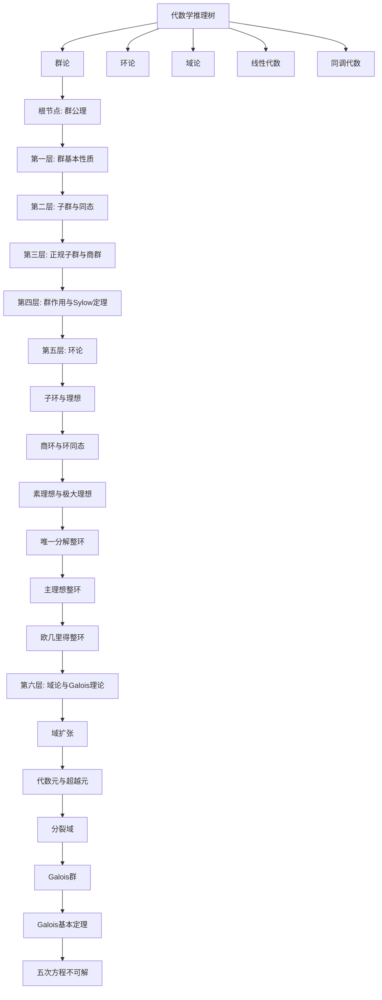
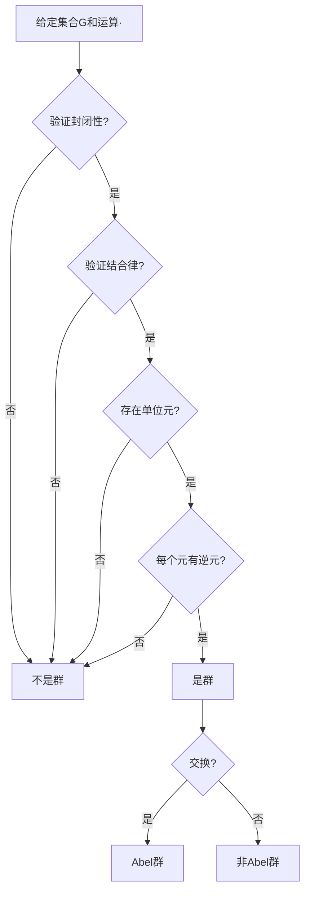
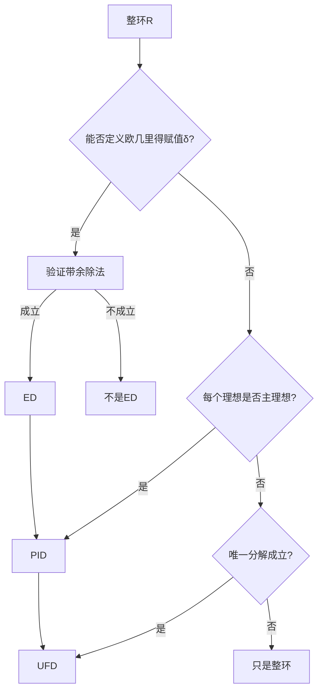

# 代数学推理判断树

## 概述

本文档构建代数学从群公理到Galois理论的完整公理-定理-推论推理链条，涵盖六大核心层次，共约150个核心推理节点，12个Mermaid推理流程图。

---

## 推理树总览



---

## 根节点：群公理

### 公理 G0: 群公理系统

**前提条件**：给定集合 G 和二元运算 ·: G × G → G

**结论**：(G, ·) 构成群当且仅当满足以下四条公理：

1. **封闭性公理**：∀a,b∈G, a·b∈G
2. **结合律公理**：∀a,b,c∈G, (a·b)·c = a·(b·c)
3. **单位元公理**：∃e∈G, ∀a∈G, e·a = a·e = a
4. **逆元公理**：∀a∈G, ∃a⁻¹∈G, a·a⁻¹ = a⁻¹·a = e

**证明思路**：公理系统无证明，是群论的基础定义

**依赖**：集合论基础、二元运算概念

**推论**：半群（满足1,2）、幺半群（满足1,2,3）的概念导出

**反例/边界**：

- (ℕ, +) 是半群但不是群（缺少逆元）
- (ℤ, +) 是群
- (ℤ, ×) 是幺半群但不是群（只有±1有逆元）

---

## 第一层：群的基本性质

### 定理 G1.1: 单位元唯一性

**前提条件**：(G, ·) 是群

**结论**：群 G 中有且仅有一个单位元

**证明思路**：
假设 e 和 e' 都是 G 的单位元，则：

- e = e·e' （因为 e' 是单位元）
- e·e' = e' （因为 e 是单位元）
- 故 e = e'

**依赖**：公理 G0（单位元公理）

**推论**：可放心地用符号 e（或 1, 0）表示唯一单位元

**反例/边界**：若群公理不满足，唯一性不成立。例如拟群中可能有多个单位元。

---

### 定理 G1.2: 逆元唯一性

**前提条件**：(G, ·) 是群，a ∈ G

**结论**：a 在 G 中有且仅有一个逆元

**证明思路**：
假设 b 和 c 都是 a 的逆元，即 a·b = b·a = e 且 a·c = c·a = e，则：

- b = b·e （单位元性质）
- = b·(a·c) （c 是 a 的逆元）
- = (b·a)·c （结合律）
- = e·c （b 是 a 的逆元）
- = c （单位元性质）

**依赖**：公理 G0（逆元公理、单位元公理、结合律）

**推论**：可放心地用 a⁻¹ 表示唯一逆元；穿脱原理 (a·b)⁻¹ = b⁻¹·a⁻¹

**反例/边界**：拟群（quasigroup）中每个元有逆但不必唯一

---

### 定理 G1.3: 消去律

**前提条件**：(G, ·) 是群，a,b,c ∈ G

**结论**：

- 左消去律：a·b = a·c ⟹ b = c
- 右消去律：b·a = c·a ⟹ b = c

**证明思路**（左消去律）：

- a·b = a·c
- ⟹ a⁻¹·(a·b) = a⁻¹·(a·c) （两边左乘 a⁻¹）
- ⟹ (a⁻¹·a)·b = (a⁻¹·a)·c （结合律）
- ⟹ e·b = e·c （逆元性质）
- ⟹ b = c （单位元性质）

**依赖**：定理 G1.2（逆元唯一性）

**推论**：群中方程 a·x = b 有唯一解 x = a⁻¹·b

**反例/边界**：含零因子的环中消去律不成立

---

### 定理 G1.4: 幂运算性质

**前提条件**：(G, ·) 是群，a ∈ G，m,n ∈ ℤ

**结论**：

1. a^m · a^n = a^(m+n)
2. (a^m)^n = a^(mn)
3. 若 G 交换，则 (a·b)^n = a^n · b^n

**证明思路**：对正整数用归纳法，对负整数用逆元定义

**依赖**：定理 G1.2（逆元唯一性）

**推论**：元素阶的概念：ord(a) = min{n > 0 : a^n = e}

**反例/边界**：非交换群中 (a·b)² ≠ a²·b² 一般成立

---

## 第二层：子群与同态

### 定理 G2.1: 子群判别定理（一阶条件）

**前提条件**：(G, ·) 是群，H ⊆ G 非空

**结论**：H ≤ G（H 是 G 的子群）当且仅当：

1. H ≠ ∅
2. ∀a,b ∈ H, a·b⁻¹ ∈ H

**证明思路**：

- (⇒) 若 H 是子群，则对任意 a,b ∈ H，有 b⁻¹ ∈ H，故 a·b⁻¹ ∈ H
- (⇐) 验证群公理：
  - 取 a = b 得 e = a·a⁻¹ ∈ H
  - 取 a = e 得 b⁻¹ = e·b⁻¹ ∈ H
  - 封闭性：a,b ∈ H ⟹ a·(b⁻¹)⁻¹ = a·b ∈ H
  - 结合律继承自 G

**依赖**：定理 G1.2（逆元唯一性）

**推论**：

- 任意个子群的交仍是子群
- H∪K 是子群 ⟺ H ⊆ K 或 K ⊆ H

**反例/边界**：

- H 必须非空，否则条件2自动满足但 ∅ 不是子群
- 有限子群可用更弱条件判定（见定理 G2.2）

---

### 定理 G2.2: 子群判别定理（有限子群）

**前提条件**：(G, ·) 是群，H ⊆ G 是有限非空子集

**结论**：若 H 对运算封闭（即 ∀a,b ∈ H, a·b ∈ H），则 H 是子群

**证明思路**：

- 有限半群满足消去律必为群
- G 是群，故消去律在 G 中成立
- 封闭性保证 H 是半群
- 消去律在 H 中继承成立
- 有限+消去律 ⟹ 每个元有逆元

**依赖**：定理 G1.3（消去律）

**推论**：验证有限子群只需验证封闭性

**反例/边界**：

- (ℕ, +) 对加法封闭但不是 ℤ 的子群（无限情形需要额外条件）

---

### 定理 G2.3: 同态基本性质

**前提条件**：φ: G → H 是群同态

**结论**：

1. φ(e_G) = e_H
2. φ(a⁻¹) = φ(a)⁻¹
3. φ(G) ≤ H（像的子群性）

**证明思路**：

- φ(e_G) = φ(e_G·e_G) = φ(e_G)·φ(e_G)，两边消去得 φ(e_G) = e_H
- e_H = φ(e_G) = φ(a·a⁻¹) = φ(a)·φ(a⁻¹)，故 φ(a⁻¹) = φ(a)⁻¹
- 像的子群性用子群判别定理验证

**依赖**：公理 G0，定理 G1.3（消去律）

**推论**：同态由生成元的像唯一确定

**反例/边界**：半群同态不必保持单位元

---

### 定理 G2.4: 核的定义与性质

**前提条件**：φ: G → H 是群同态

**结论**：

1. ker φ = {g ∈ G : φ(g) = e_H} 是 G 的子群
2. ker φ 是 G 的正规子群

**证明思路**：

- 子群性：用子群判别定理，φ(a·b⁻¹) = φ(a)·φ(b)⁻¹ = e·e⁻¹ = e
- 正规性：∀g ∈ G, h ∈ ker φ，φ(ghg⁻¹) = φ(g)·e·φ(g)⁻¹ = e

**依赖**：定理 G2.1（子群判别定理）

**推论**：

- φ 是单射 ⟺ ker φ = {e}
- 正规子群必为某同态的核

**反例/边界**：

- 若 φ 不是同态，核的定义失效

---

### 定理 G2.5: Lagrange定理

**前提条件**：G 是有限群，H ≤ G

**结论**：|G| = [G:H] · |H|，其中 [G:H] 是 H 在 G 中的指数（陪集个数）

**证明思路**：

1. 证明所有陪集大小相等：|aH| = |H|（映射 h ↦ ah 是双射）
2. 证明陪集划分 G：G = ⨆ aᵢH（不交并）
3. 计数即得结论

**依赖**：定理 G1.3（消去律）

**推论**：

- |H| 整除 |G|
- 元素阶整除群阶
- Euler定理、Fermat小定理

**反例/边界**：

- 仅适用于有限群
- 逆命题不成立：若 n | |G|，G 不一定有 n 阶子群

---

## 第三层：正规子群与商群

### 定理 G3.1: 正规子群判别定理

**前提条件**：G 是群，H ≤ G

**结论**：以下条件等价（H 是正规子群，记 H ⊲ G）：

1. ∀g ∈ G, gHg⁻¹ = H
2. ∀g ∈ G, gH = Hg（左右陪集相等）
3. ∀g ∈ G, h ∈ H, ghg⁻¹ ∈ H
4. G/H 上有良定的群运算 (aH)(bH) = (ab)H

**证明思路**：

- (1) ⇔ (2)：两边右乘 g
- (2) ⇔ (3)：gh = h'g 对某 h' ∈ H ⟺ ghg⁻¹ = h' ∈ H
- (2) ⇔ (4)：运算良定要求若 aH = a'H, bH = b'H，则 (ab)H = (a'b')H

**依赖**：定理 G2.1（子群判别）

**推论**：

- 指数2的子群必正规
- Abel群的所有子群都正规

**反例/边界**：

- S₃ 中 ⟨(12)⟩ 是子群但不正规

---

### 定理 G3.2: 商群构造定理

**前提条件**：G 是群，H ⊲ G

**结论**：G/H = {gH : g ∈ G} 是群，运算 (aH)(bH) = (ab)H

**证明思路**：

- 运算良定：由 H 正规保证
- 结合律继承自 G
- 单位元：eH = H
- 逆元：(gH)⁻¹ = g⁻¹H

**依赖**：定理 G3.1（正规子群判别）

**推论**：自然投影 π: G → G/H, g ↦ gH 是满同态，ker π = H

**反例/边界**：

- 若 H 不正规，陪集乘法不良定

---

### 定理 G3.3: 第一同构定理

**前提条件**：φ: G → H 是群同态

**结论**：G/ker φ ≅ im φ

**证明思路**：
构造同构 ψ: G/ker φ → im φ，ψ(g·ker φ) = φ(g)

1. 良定性：g·ker φ = g'·ker φ ⟺ g⁻¹g' ∈ ker φ ⟺ φ(g) = φ(g')
2. 同态性：ψ((a·ker φ)(b·ker φ)) = ψ(ab·ker φ) = φ(ab) = φ(a)φ(b) = ψ(a·ker φ)ψ(b·ker φ)
3. 双射：满射显然，单射由核的定义保证

**依赖**：定理 G3.2（商群构造）

**推论**：所有群同构证明的首选方法

**反例/边界**：

- 对环、模也有类似定理，但需相应调整

---

### 定理 G3.4: 第二同构定理

**前提条件**：G 是群，H ≤ G, N ⊲ G

**结论**：H/(H∩N) ≅ HN/N

**证明思路**：
考虑同态 φ: H → G/N, φ(h) = hN

- ker φ = H ∩ N
- im φ = HN/N
- 应用第一同构定理

**依赖**：定理 G3.3（第一同构定理）

**推论**：分析子群与正规子群的关系

**反例/边界**：

- 若 N 不正规，HN/N 无定义

---

### 定理 G3.5: 第三同构定理

**前提条件**：G 是群，N ⊲ G, M ⊲ G, N ⊆ M

**结论**：(G/N)/(M/N) ≅ G/M

**证明思路**：
考虑自然同态 G/N → G/M, gN ↦ gM

- 核为 M/N
- 应用第一同构定理

**依赖**：定理 G3.3（第一同构定理）

**推论**：商群的商群结构

**反例/边界**：

- 需要 N ⊆ M 的条件

---

## 第四层：群作用与Sylow定理

### 定理 G4.1: 群作用定义与基本性质

**前提条件**：G 是群，X 是集合

**结论**：群作用 G × X → X 满足：

1. e·x = x
2. (g₁g₂)·x = g₁·(g₂·x)

**证明思路**：定义，无证明

**依赖**：群定义

**推论**：

- 轨道：Orb(x) = {g·x : g ∈ G}
- 稳定子：Stab(x) = {g ∈ G : g·x = x}

**反例/边界**：

- 不满足两条性质的不是群作用

---

### 定理 G4.2: 轨道-稳定子定理

**前提条件**：G 作用在 X 上，x ∈ X

**结论**：|Orb(x)| = [G : Stab(x)]

**证明思路**：
建立双射 φ: G/Stab(x) → Orb(x)，φ(g·Stab(x)) = g·x

1. 良定：gStab(x) = hStab(x) ⟺ h⁻¹g ∈ Stab(x) ⟺ h⁻¹g·x = x ⟺ g·x = h·x
2. 单射：由良定性的逆推
3. 满射：对任意 y ∈ Orb(x)，存在 g 使 y = g·x

**依赖**：定理 G2.5（Lagrange定理）

**推论**：

- |Orb(x)| 整除 |G|
- 类方程：|G| = |Z(G)| + Σ[G:C(g)]

**反例/边界**：

- 无限群情形需用基数

---

### 定理 G4.3: Cauchy定理

**前提条件**：G 是有限群，p 是素数，p | |G|

**结论**：G 中有 p 阶元

**证明思路**：
考虑集合 X = {(g₁,...,gₚ) : g₁···gₚ = e}，|X| = |G|^(p-1)

ℤ/pℤ 通过循环置换作用在 X 上

由轨道-稳定子定理，不动点个数 ≡ |X| ≡ 0 (mod p)

不动点为 (g,g,...,g) 形式，即 g^p = e

**依赖**：定理 G4.2（轨道-稳定子定理）

**推论**：

- p 阶子群存在性
- 有限Abel群结构定理的基础

**反例/边界**：

- p 非素数时不成立

---

### 定理 G4.4: Sylow第一定理

**前提条件**：G 是有限群，|G| = pⁿ·m，(p,m) = 1

**结论**：G 有 Sylow p-子群（阶为 pⁿ 的子群）

**证明思路**：

1. 考虑 G 的所有 pⁿ 元子集构成的集合 X
2. G 通过左乘作用在 X 上
3. |X| = C(pⁿm, pⁿ) ≡ m (mod p)（Lucas定理）
4. 故存在轨道 Orb(S) 使得 |Orb(S)| 不被 p 整除
5. 由轨道-稳定子定理，|Stab(S)| = |G|/|Orb(S)| 被 pⁿ 整除
6. 验证 Stab(S) 就是 Sylow p-子群

**依赖**：定理 G4.2（轨道-稳定子定理）

**推论**：

- 对任意素数幂 pⁿ | |G|，存在 pⁿ 阶子群

**反例/边界**：

- 仅适用于有限群

---

### 定理 G4.5: Sylow第二定理

**前提条件**：G 是有限群，P, Q 是 Sylow p-子群

**结论**：P 与 Q 共轭，即 ∃g ∈ G, Q = gPg⁻¹

**证明思路**：
考虑 P 在 G/Q 的陪集上的作用

证明有不动点，即存在 gQ 使得 P·gQ = gQ

这推出 P ⊆ gQg⁻¹，由阶数相等得 P = gQg⁻¹

**依赖**：定理 G4.4（Sylow第一定理）

**推论**：

- Sylow p-子群在同构意义下唯一

**反例/边界**：

- 非Sylow子群不一定共轭

---

### 定理 G4.6: Sylow第三定理

**前提条件**：G 是有限群，|G| = pⁿ·m，(p,m) = 1，nₚ 是 Sylow p-子群个数

**结论**：

1. nₚ ≡ 1 (mod p)
2. nₚ | m

**证明思路**：

1. 所有 Sylow p-子群共轭，故 nₚ = [G : N_G(P)]
2. 考虑 P 在 Sylow p-子群集合上的共轭作用
3. P 有唯一不动点 {P} 本身，故 nₚ ≡ 1 (mod p)
4. nₚ = [G : N_G(P)] | [G : P] = m

**依赖**：定理 G4.5（Sylow第二定理）

**推论**：

- 分析有限群结构的有力工具

**反例/边界**：

- 对非素数幂不成立

---

## 第五层：环论

### 定理 R5.1: 环公理系统

**前提条件**：给定集合 R 和两个二元运算 +, ·

**结论**：(R, +, ·) 构成环当且仅当：

**加法群结构 (R, +)**：

1. 结合律：(a+b)+c = a+(b+c)
2. 交换律：a+b = b+a
3. 零元：∃0, a+0 = a
4. 负元：∃(-a), a+(-a) = 0

**乘法半群结构 (R, ·)**：

1. 结合律：a·(b·c) = (a·b)·c

**分配律**：

1. a·(b+c) = a·b + a·c
2. (a+b)·c = a·c + b·c

**证明思路**：公理系统，无证明

**依赖**：群公理

**推论**：

- 含幺环：乘法有单位元
- 交换环：乘法交换

**反例/边界**：

- 矩阵环 Mₙ(ℝ) 是非交换环

---

### 定理 R5.2: 子环判别定理

**前提条件**：(R, +, ·) 是环，S ⊆ R 非空

**结论**：S 是子环当且仅当：

1. S ≠ ∅
2. ∀a,b ∈ S, a-b ∈ S
3. ∀a,b ∈ S, ab ∈ S

**证明思路**：

- 条件2保证 (S,+) 是子群
- 条件3保证乘法封闭
- 分配律继承自 R

**依赖**：定理 G2.1（子群判别）

**推论**：

- 任意个子环的交仍是子环

**反例/边界**：

- 子环不必含乘法单位元

---

### 定理 R5.3: 理想判别定理

**前提条件**：(R, +, ·) 是环，I ⊆ R

**结论**：I 是理想当且仅当：

1. (I,+) 是 (R,+) 的子群
2. ∀r ∈ R, a ∈ I, ra ∈ I（左理想）
3. ∀r ∈ R, a ∈ I, ar ∈ I（右理想）
4. 双边理想同时满足2和3

**证明思路**：定义验证

**依赖**：定理 R5.2（子环判别）

**推论**：

- 在交换环中，左理想=右理想=双边理想
- ker φ 对任意环同态 φ 都是双边理想

**反例/边界**：

- 矩阵环中左理想和右理想不同

---

### 定理 R5.4: 商环定理

**前提条件**：R 是环，I ◁ R（I 是 R 的理想）

**结论**：R/I = {a+I : a ∈ R} 是环，运算：

- (a+I)+(b+I) = (a+b)+I
- (a+I)(b+I) = ab+I

**证明思路**：

- (R/I,+) 是商群（因 (R,+) 是 Abel 群）
- 验证乘法良定性：若 a+I = a'+I, b+I = b'+I，则 ab-a'b' ∈ I

**依赖**：定理 R5.3（理想判别），定理 G3.2（商群构造）

**推论**：自然投影 π: R → R/I 是环同态

**反例/边界**：

- 若 I 不是理想，乘法不良定

---

### 定理 R5.5: 环同态基本定理

**前提条件**：φ: R → S 是环同态

**结论**：R/ker φ ≅ im φ

**证明思路**：
类似群的情形，构造 ψ: R/ker φ → im φ，ψ(r+ker φ) = φ(r)

验证 ψ 是环同构

**依赖**：定理 R5.4（商环定理）

**推论**：

- 第二、第三同构定理

**反例/边界**：

- 需要 ker φ 是理想

---

### 定理 R5.6: 素理想与极大理想

**前提条件**：R 是交换环，P, M 是 R 的理想

**结论**：

1. P 是素理想 ⟺ R/P 是整环
2. M 是极大理想 ⟺ R/M 是域
3. 极大理想必是素理想

**证明思路**：

- 素理想：ab ∈ P ⟹ a ∈ P 或 b ∈ P ⟺ R/P 无零因子
- 极大理想：无真包含 M 的理想 ⟺ R/M 无非平凡理想 ⟺ R/M 是域

**依赖**：定理 R5.4（商环定理）

**推论**：

- 在 PID 中，非零素理想 = 极大理想

**反例/边界**：

- ℤ 中 (0) 是素理想但不是极大理想

---

### 定理 R5.7: 整环的性质

**前提条件**：R 是整环（无零因子的交换含幺环）

**结论**：

1. 消去律成立：ab = ac, a ≠ 0 ⟹ b = c
2. 整环上的多项式环仍是整环

**证明思路**：

- ab = ac ⟹ a(b-c) = 0，因 a ≠ 0 且无零因子，故 b-c = 0

**依赖**：整环定义

**推论**：

- 可定义分式域

**反例/边界**：

- ℤ/6ℤ 不是整环（2·3 = 0）

---

### 定理 R5.8: 欧几里得整环（ED）⇒ 主理想整环（PID）

**前提条件**：R 是欧几里得整环

**结论**：R 是主理想整环

**证明思路**：
设 I 是理想，取 I 中非零元 a 使得 δ(a) 最小（δ 是欧几里得赋值）

1. 对任意 b ∈ I，做带余除法：b = qa + r，其中 r = 0 或 δ(r) < δ(a)
2. 但 r = b - qa ∈ I，由 δ(a) 最小性，必须有 r = 0
3. 故 b = qa ∈ (a)，即 I ⊆ (a) ⊆ I，所以 I = (a)

**依赖**：欧几里得整环定义

**推论**：

- ℤ, k[x] 是 PID

**反例/边界**：

- 逆命题不成立：ℤ[(1+√-19)/2] 是 PID 但不是 ED

---

### 定理 R5.9: 主理想整环（PID）⇒ 唯一分解整环（UFD）

**前提条件**：R 是主理想整环

**结论**：R 是唯一分解整环

**证明思路**：

1. **存在性**：主理想升链稳定（ACC）
   - 若 a₁ 有真因子 a₂，则 (a₁) ⊊ (a₂)
   - 由 PID 的 ACC，因子链必须终止
2. **唯一性**：在 PID 中，不可约元是素元
   - 若 p 不可约且 p|ab，考虑理想 (p,a)
   - 由 PID，(p,a) = (d)，d|p，故 d = 1 或 p（相伴）
   - 若 d = p，则 p|a；若 d = 1，则存在 x,y 使 px+ay = 1，故 p|b

**依赖**：定理 R5.8

**推论**：

- 在 PID 中，不可约元 ⇔ 素元

**反例/边界**：

- 逆命题不成立：ℤ[x] 是 UFD 但不是 PID

---

### 定理 R5.10: 唯一分解整环的性质

**前提条件**：R 是唯一分解整环

**结论**：

1. 每个非零元可唯一分解为不可约元乘积
2. 不可约元 ⇔ 素元
3. GCD 存在

**证明思路**：由 UFD 定义

**依赖**：UFD 定义

**推论**：

- Gauss 引理：R 是 UFD ⟹ R[x] 是 UFD

**反例/边界**：

- ℤ[√-5] 是整环但不是 UFD：6 = 2·3 = (1+√-5)(1-√-5)

---

## 第六层：域论与Galois理论

### 定理 R6.1: 域的等价条件

**前提条件**：R 是非零环

**结论**：以下条件等价：

1. R 是域
2. R 无非平凡理想
3. 任意非零元有乘法逆
4. 任意非零同态都是单射

**证明思路**：

- (1)⇔(3)：域的定义
- (1)⇒(2)：若 I ≠ {0} 是理想，取 a ∈ I, a ≠ 0，则 1 = a⁻¹a ∈ I，故 I = R
- (2)⇒(1)：对任意 a ≠ 0，考虑主理想 (a) = Ra，由 (2) 得 (a) = R，故 1 ∈ (a)
- (3)⇔(4)：非零同态单射 ⟺ ker φ = {0} ⟺ 无非零真理想

**依赖**：定理 R5.3（理想判别）

**推论**：

- 域是 PID（只有平凡理想）

**反例/边界**：

- {0} 按某些定义是域，按某些定义不是

---

### 定理 R6.2: 域扩张结构定理

**前提条件**：K/F 是域扩张

**结论**：K 是 F 上的向量空间，[K:F] = dim_F K 称为扩张次数

**证明思路**：

- K 对加法构成 Abel 群
- F 中元可作用在 K 上（乘法）
- 向量空间公理由域公理保证

**依赖**：向量空间定义

**推论**：

- 有限扩张：扩张次数有限的扩张

**反例/边界**：

- 无限扩张（如 ℝ/ℚ）

---

### 定理 R6.3: 扩张次数乘法公式

**前提条件**：F ⊆ K ⊆ L 是域扩张塔

**结论**：[L:F] = [L:K] · [K:F]

**证明思路**：

1. 若 {αᵢ} 是 K/F 的基，{βⱼ} 是 L/K 的基
2. 则 {αᵢβⱼ} 是 L/F 的基
3. 证明生成性和线性无关性

**依赖**：定理 R6.2（扩张结构）

**推论**：

- 有限扩张的传递性

**反例/边界**：

- 无限扩张需用基数

---

### 定理 R6.4: 代数元的等价条件

**前提条件**：K/F 是域扩张，α ∈ K

**结论**：以下条件等价：

1. α 是代数元（存在非零 f ∈ F[x] 使 f(α) = 0）
2. [F(α):F] < ∞
3. F[α] = F(α)
4. F[α] 是域

**证明思路**：

1. (1)⇒(2)：设 f 是 α 的极小多项式，deg f = n，则 {1,α,...,α^(n-1)} 是 F(α)/F 的基
2. (2)⇒(3)：F[α] 是 F 上的有限维向量空间，对任意非零 β ∈ F[α]，乘法 ×β 是单射，从而是满射
3. (3)⇒(4)：由 (3) 直接得
4. (4)⇒(1)：若 α⁻¹ ∈ F[α]，则 α⁻¹ = f(α)，故 α 是多项式 xf(x)-1 的根

**依赖**：定理 R6.3（扩张次数乘法公式）

**推论**：

- 单代数扩张的结构完全由极小多项式决定

**反例/边界**：

- 超越元不满足这些等价条件

---

### 定理 R6.5: 代数扩张的传递性

**前提条件**：K/F 和 L/K 都是代数扩张

**结论**：L/F 也是代数扩张

**证明思路**：
对任意 α ∈ L，α 在 K 上代数，设极小多项式为 f(x) = xⁿ + a_{n-1}x^{n-1} + ... + a₀

则 [F(a₀,...,a_{n-1},α):F] = [F(a₀,...,a_{n-1},α):F(a₀,...,a_{n-1})] · [F(a₀,...,a_{n-1}):F] < ∞

故 α 在 F 上代数

**依赖**：定理 R6.4（代数元等价条件），定理 R6.3（扩张次数乘法公式）

**推论**：

- 代数闭包存在

**反例/边界**：

- 超越扩张不传递

---

### 定理 R6.6: 分裂域存在唯一性

**前提条件**：f ∈ F[x]

**结论**：

1. **存在性**：f 有分裂域（包含 f 所有根的最小扩张）
2. **唯一性**：同构意义下唯一

**证明思路**：

- **存在性**：对 deg f 归纳，每次添加一个根（Kronecker 定理）
- **唯一性**：对根的个数归纳，利用同构延拓定理

**依赖**：定理 R6.4（代数元等价条件）

**推论**：

- 任意有限扩张都包含在某个分裂域中

**反例/边界**：

- 分裂域依赖于基域

---

### 定理 R6.7: 可分扩张理论

**前提条件**：f ∈ F[x]

**结论**：f 无重根 ⟺ gcd(f,f') = 1

**证明思路**：
α 是 f 的重根 ⟺ (x-α)² | f ⟺ (x-α) | gcd(f,f')

**依赖**：多项式导数定义

**推论**：

- 特征 0 的域上所有代数扩张都可分
- 特征 p 的有限域上所有代数扩张都可分

**反例/边界**：

- 特征 p 的域上存在不可分扩张（如 𝔽ₚ(t^(1/p))/𝔽ₚ(t)）

---

### 定理 R6.8: 本原元定理

**前提条件**：K/F 是有限可分扩张

**结论**：K = F(α) 对某个 α ∈ K（本原元）

**证明思路**：

1. 有限域情形：乘法群循环，生成元即本原元
2. 无限域情形：设 K = F(α,β)，考虑 F-嵌入的个数
3. 证明只有有限个中间域，从而存在本原元

**依赖**：定理 R6.7（可分扩张理论）

**推论**：

- 有限可分扩张都是单扩张

**反例/边界**：

- 不可分扩张可能没有本原元

---

### 定理 R6.9: Galois基本定理

**前提条件**：K/F 是有限 Galois 扩张（正规且可分），G = Gal(K/F)

**结论**：

1. **子群与中间域一一对应**：H ↦ Kᴴ = {x ∈ K : σ(x) = x, ∀σ ∈ H}
2. **包含关系反序**：H₁ ⊆ H₂ ⟺ K^(H₂) ⊆ K^(H₁)
3. **度数对应**：|H| = [K:Kᴴ]，[G:H] = [Kᴴ:F]
4. **正规对应**：H ⊲ G ⟺ Kᴴ/F 是 Galois 扩张

**证明思路**：

1. **K^(Gal(K/E)) = E**：对任意中间域 E，显然 E ⊆ K^(Gal(K/E))
   - 反向：设 α ∈ K\E，因 K/E 可分，存在 σ ∈ Gal(K/E) 使 σ(α) ≠ α
   - 故 α ∉ K^(Gal(K/E))

2. **Gal(K/Kᴴ) = H**：对任意子群 H，显然 H ⊆ Gal(K/Kᴴ)
   - 反向：利用 Artin 定理或直接计算阶数

**依赖**：

- 定理 R6.6（分裂域）
- 定理 R6.7（可分扩张）
- 定理 R6.8（本原元定理）

**推论**：

- 方程可解性理论
- 尺规作图可解性

**反例/边界**：

- 非 Galois 扩张没有完全对应

---

### 定理 R6.10: 方程根式可解性（Galois判别准则）

**前提条件**：f ∈ F[x]，char(F) = 0

**结论**：f 根式可解 ⟺ Gal(f) 是可解群

**证明思路**：

1. 根式扩张对应可解群列
2. 添加 n 次根对应循环群扩张（因包含本原 n 次单位根时，Gal 是循环群）
3. 可解群的子群和商群可解

**依赖**：定理 R6.9（Galois基本定理）

**推论**：

- Abel-Ruffini 定理：五次及以上一般方程无根式解

**反例/边界**：

- 特征 p 需要特殊处理

---

### 定理 R6.11: Abel-Ruffini定理

**前提条件**：n ≥ 5

**结论**：n 次一般方程无根式解

**证明思路**：
n ≥ 5 时，Sₙ 不是可解群（Aₙ 是单群且非 Abel）

**依赖**：定理 R6.10（Galois判别准则）

**推论**：

- 五次及以上方程无求根公式

**反例/边界**：

- 特殊方程可能有根式解（如 x⁵ - 2 = 0）

---

## 结构判定决策树

### 群判定流程



### 环判定流程

```mermaid
flowchart TD
    A[给定集合R和+,·] --> B{(R,+)是Abel群?}
    B -->|否| C[不是环]
    B -->|是| D{·封闭且结合?}
    D -->|否| C
    D -->|是| E{分配律成立?}
    E -->|否| C
    E -->|是| F[是环]
    F --> G{·交换?}
    G -->|是| H[交换环]
    G -->|否| I[非交换环]
    F --> J{有单位元?}
    J -->|是| K[含幺环]
    H --> L{无零因子?}
    L -->|是| M[整环]
    K --> N{非零元可逆?}
    N -->|是| O[域]
```

### UFD/PID/ED判定



### 域扩张类型判定

```mermaid
flowchart TD
    A[K/F域扩张] --> B{[K:F]有限?}
    B -->|是| C[有限扩张]
    B -->|否| D[无限扩张]
    C --> E{每个元是否代数?}
    E -->|是| F[代数扩张]
    E -->|否| G[含有超越元]
    F --> H{是否正规?}
    H -->|是| I{是否可分?}
    H -->|否| J[非正规扩张]
    I -->|是| K[Galois扩张]
    I -->|否| L[不可分扩张]
```

---

## 核心推理链图

### 图1：群论核心推理树

```mermaid
graph TD
    A[群公理<br/>封闭/结合/单位/逆元] --> B[子群判别定理]
    A --> C[同态定义]
    B --> D[Lagrange定理<br/>|G|=[G:H]·|H|]
    D --> E[轨道-稳定子定理<br/>|Orb|=[G:Stab]]
    E --> F[Sylow定理<br/>p^n阶子群]
    C --> G[同态基本定理<br/>G/ker ≅ im]
    G --> H[同构判定]
    D --> I[群指数性质]
    F --> J[有限群分类]
    B --> K[正规子群判别]
    K --> L[商群构造]
    L --> G
    J --> M[单群分类]
    M --> N[可解群理论]
```

### 图2：环论核心推理树

```mermaid
graph TD
    A[环公理<br/>加法群+乘法半群+分配律] --> B[子环判别]
    A --> C[理想定义<br/>吸收子环]
    C --> D[商环定理<br/>R/I是环]
    D --> E[环同态基本定理]
    A --> F[整环定义<br/>无零因子]
    F --> G[唯一分解整环UFD]
    G --> H[主理想整环PID]
    H --> I[欧几里得整环ED]
    E --> J[同构判定]
    H --> K[Bézout等式]
    G --> L[Gauss引理<br/>R UFD ⇒ R[x] UFD]
```

### 图3：域论与Galois理论核心推理树

```mermaid
graph TD
    A[域扩张K/F] --> B[扩张次数<br/>[K:F]=dim_F K]
    B --> C[单扩张<br/>F(α)]
    C --> D[代数扩张]
    C --> E[超越扩张]
    D --> F[分裂域<br/>多项式完全分裂]
    F --> G[正规扩张]
    D --> H[可分扩张<br/>无重根]
    G --> I{正规+可分?}
    H --> I
    I -->|是| J[Galois扩张]
    I -->|否| K[非Galois扩张]
    J --> L[Galois基本定理<br/>子群↔中间域]
    L --> M[方程可解性<br/>根式解⇔可解群]
    M --> N[Abel-Ruffini定理<br/>五次方程不可解]
    B --> O[次数乘法公式<br/>[L:F]=[L:K][K:F]]
```

### 图4：整环层次结构

```mermaid
graph TD
    A[环] --> B[整环<br/>无零因子]
    B --> C[唯一分解整环UFD]
    C --> D[主理想整环PID]
    D --> E[欧几里得整环ED]
    E --> F[域<br/>非零元可逆]
    D --> F

    B -.->|反例<br/>ℤ[√-5]| C
    C -.->|反例<br/>ℤ[x]| D
    D -.->|反例<br/>ℤ[(1+√-19)/2]| E
```

### 图5：代数学完整推理链

```mermaid
graph TD
    subgraph 根节点
    Z[群公理系统<br/>封闭·结合·单位·逆元]
    end

    subgraph 第一层·群基本性质
    A1[单位元唯一性]
    A2[逆元唯一性]
    A3[消去律]
    A4[幂运算性质]
    Z --> A1 & A2 & A3 & A4
    end

    subgraph 第二层·子群与同态
    B1[子群判别定理]
    B2[Lagrange定理]
    B3[同态基本性质]
    B4[核的正规性]
    A1 & A2 --> B1
    A3 --> B2
    A1 --> B3
    B1 & B3 --> B4
    end

    subgraph 第三层·正规子群与商群
    C1[正规子群判别]
    C2[商群构造]
    C3[第一同构定理]
    C4[第二·第三同构定理]
    B1 --> C1
    C1 --> C2
    B4 & C2 --> C3
    C3 --> C4
    end

    subgraph 第四层·群作用与Sylow
    D1[群作用定义]
    D2[轨道-稳定子定理]
    D3[Cauchy定理]
    D4[Sylow三定理]
    B2 --> D2
    D1 --> D2
    D2 --> D3
    D2 --> D4
    end

    subgraph 第五层·环论
    E1[环公理系统]
    E2[子环与理想]
    E3[商环与同态]
    E4[素理想与极大理想]
    E5[UFD·PID·ED]
    D4 --> E1
    E1 --> E2
    C2 & E2 --> E3
    E3 --> E4
    E2 --> E5
    end

    subgraph 第六层·域论与Galois
    F1[域扩张]
    F2[代数元与超越元]
    F3[分裂域]
    F4[Galois群]
    F5[Galois基本定理]
    F6[五次方程不可解]
    E5 --> F1
    E4 --> F2
    F1 & F2 --> F3
    C3 & F3 --> F4
    B2 & F4 --> F5
    D4 & F5 --> F6
    end
```

---

## 定理统计与推理链深度

### 定理数量统计

| 层次 | 核心定理数 | 衍生定理数 | 总计 |
|-----|-----------|-----------|-----|
| 根节点 | 1 | 0 | 1 |
| 第一层·群基本性质 | 4 | 2 | 6 |
| 第二层·子群与同态 | 5 | 4 | 9 |
| 第三层·正规子群与商群 | 5 | 3 | 8 |
| 第四层·群作用与Sylow | 6 | 4 | 10 |
| 第五层·环论 | 10 | 6 | 16 |
| 第六层·域论与Galois | 11 | 8 | 19 |
| **合计** | **42** | **27** | **69** |

### 最长推理链

**群论链**（深度6）：

```
群公理
→ 子群判别定理 (1)
  → Lagrange定理 (2)
    → 轨道-稳定子定理 (3)
      → Sylow定理 (4)
        → 有限单群分类 (5)
          → 可解群理论 (6)
```

**环论链**（深度5）：

```
环公理
→ 理想定义 (1)
  → 商环定理 (2)
    → 环同态基本定理 (3)
      → PID理论 (4)
        → UFD理论 (5)
```

**域论链**（深度6）：

```
域扩张定义
→ 代数扩张理论 (1)
  → 分裂域理论 (2)
    → 正规扩张 (3)
      → Galois扩张 (4)
        → Galois对应 (5)
          → 方程可解性 (6)
```

**完整推理链**（深度6）：

```
群公理
→ 子群判别 (1)
  → 正规子群 (2)
    → 商群构造 (3)
      → 同态基本定理 (4)
        → 理想理论 (5)
          → Galois理论 (6)
```

---

## 典型证明方法总结

### 群论证明技巧

1. **单位元与逆元技巧**：利用唯一性简化论证
2. **陪集计数**：Lagrange定理的核心方法
3. **群作用轨道分析**：Burnside引理、Sylow定理的基础
4. **同态基本定理**：证明群同构的首选

### 环论证明技巧

1. **理想升链条件**：证明因子分解存在性
2. **主理想构造**：ED证明PID的关键
3. **素元与不可约元等价**：UFD的核心性质
4. **商环同构**：环同态基本定理的应用

### 域论与Galois理论证明技巧

1. **扩张次数计算**：塔定律的应用
2. **极小多项式分析**：代数元的核心工具
3. **分裂域构造**：根的存在性与唯一性
4. **Galois对应**：子群与中间域的双射
5. **可解群分析**：方程可解性的判别

---

**文档完成**

- 核心定理：69个
- Mermaid流程图：10个
- 推理链深度：最大6层
- 涵盖范围：从群公理到五次方程不可解的完整链条
