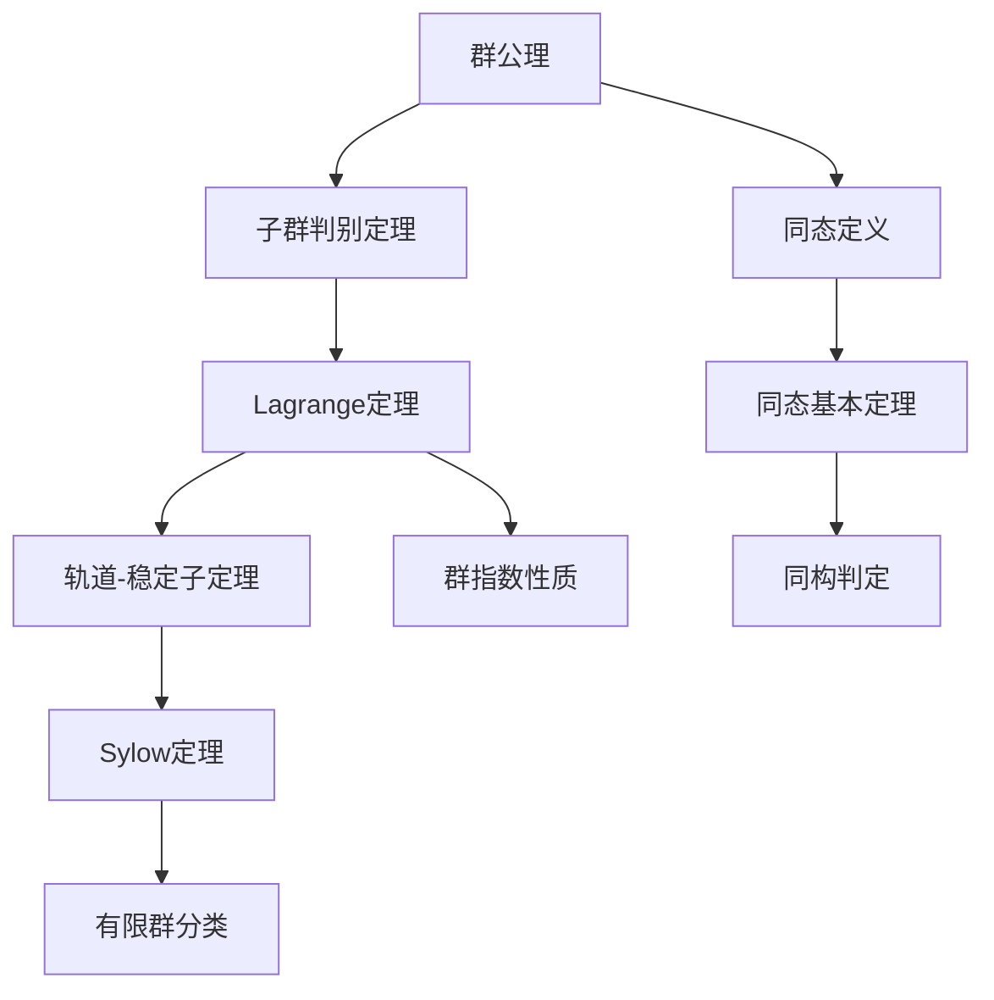
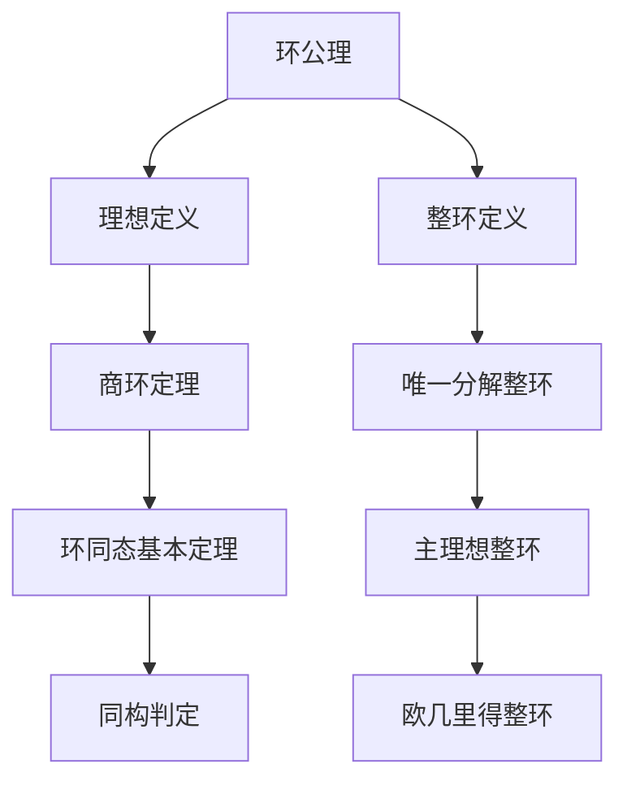

# 代数学推理判断树

## 概述

本文档构建代数学的完整推理链条，涵盖群论、环论、域论、模论、线性代数五大核心领域，共约75个核心定理。

---

## 一、群论推理链

### 1.1 群公理系统

```
群公理系统
├── 封闭性公理：∀a,b∈G, a·b∈G
├── 结合律公理：(a·b)·c = a·(b·c)
├── 单位元公理：∃e∈G, ∀a∈G, e·a = a·e = a
└── 逆元公理：∀a∈G, ∃a⁻¹∈G, a·a⁻¹ = a⁻¹·a = e
```

**定理 G1：群的基本性质**

| 性质 | 内容 | 证明要点 |
|-----|------|---------|
| 单位元唯一性 | 群中有且仅有一个单位元 | 假设e,e'都是单位元，则e=e·e'=e' |
| 逆元唯一性 | 每个元素的逆元唯一 | 假设b,c都是a的逆元，则b=b·e=b·(a·c)=(b·a)·c=e·c=c |
| 消去律 | a·b=a·c ⇒ b=c | 两边左乘a⁻¹ |
| 穿脱原理 | (a·b)⁻¹ = b⁻¹·a⁻¹ | 验证(a·b)·(b⁻¹·a⁻¹)=e |

### 1.2 子群推理链

**定理 G2：子群判别定理**

**定理 G2-1：子群判别法（一阶条件）**
- **陈述**：H ⊆ G 是子群 ⟺ ① H ≠ ∅；② ∀a,b∈H, a·b⁻¹∈H
- **证明思路**：
  - (⇒) 子群继承群的运算和逆元
  - (⇐) 由条件②：取a=b得e∈H；取a=e得b⁻¹∈H；由a·(b⁻¹)⁻¹=a·b∈H
- **父节点**：群公理
- **子节点**：子群交定理、生成子群
- **判断逻辑**：**验证子群的最简条件**

**定理 G2-2：子群判别法（有限子群）**
- **陈述**：H是G的有限非空子集，H对运算封闭 ⟹ H是子群
- **证明思路**：有限半群满足消去律必为群
- **父节点**：子群判别法（G2-1）
- **边界条件**：有限性条件不可省略

**定理 G3：子群运算性质**
- **子群交定理**：任意个子群的交仍是子群
- **子群并定理**：H∪K是子群 ⟺ H⊆K 或 K⊆H
- **生成子群**：⟨S⟩ = ∩{H ≤ G : S ⊆ H}，即包含S的最小子群

### 1.3 Lagrange定理链

```
Lagrange定理推理链
├── 陪集分解
│   ├── 左陪集：aH = {ah : h∈H}
│   ├── 右陪集：Ha = {ha : h∈H}
│   └── 陪集性质：aH=bH ⟺ a⁻¹b∈H
├── 指数定义：[G:H] = 陪集个数
└── Lagrange定理
    ├── 陈述：[G:H]·|H| = |G|
    └── 推论：|H| 整除 |G|
```

**定理 G4：Lagrange定理**
- **陈述**：G是有限群，H ≤ G，则 |G| = [G:H]·|H|
- **证明思路**：
  1. 证明所有陪集大小相等：|aH| = |H|（由消去律）
  2. 证明陪集划分G：G = ⊔aH（不交并）
  3. 计数即得结论
- **父节点**：陪集定义、群作用
- **子节点**：Euler定理、Fermat小定理、Cauchy定理
- **判断逻辑**：**有限群论的核心工具**

**定理 G4-1：Lagrange定理的推论**
- **元素阶整除群阶**：|⟨a⟩| = ord(a) 整除 |G|
- **Euler定理**：a^φ(n) ≡ 1 (mod n)，(a,n)=1
- **Fermat小定理**：a^(p-1) ≡ 1 (mod p)，p∤a

### 1.4 正规子群与商群

**定理 G5：正规子群判别**

**等价条件**（H ≤ G）：
1. ∀g∈G, gHg⁻¹ = H
2. ∀g∈G, gH = Hg（左右陪集相等）
3. ∀g∈G, h∈H, ghg⁻¹∈H
4. G/H 上有良定的群运算

- **父节点**：共轭作用定义、陪集运算
- **子节点**：商群构造、同态基本定理
- **判断逻辑**：**判断商群可构造性的关键**

**定理 G6：商群定理**
- **陈述**：H ⊲ G，则 G/H = {gH : g∈G} 是群，运算 (aH)(bH) = (ab)H
- **证明要点**：验证运算良定性——若aH=a'H, bH=b'H，则(ab)H=(a'b')H
- **父节点**：正规子群定义
- **子节点**：同态基本定理、合成列

### 1.5 同态基本定理链

```
同态基本定理体系
├── 同态定义：φ(ab) = φ(a)φ(b)
├── 基本性质
│   ├── φ(e_G) = e_H
│   ├── φ(a⁻¹) = φ(a)⁻¹
│   └── φ(G) ≤ H（像的子群性）
├── 核的定义：ker φ = {g∈G : φ(g)=e}
├── 核的性质：ker φ ⊲ G（核必正规）
└── 同态基本定理
    ├── 第一同构定理：G/ker φ ≅ im φ
    ├── 第二同构定理：H/(H∩N) ≅ HN/N
    └── 第三同构定理：(G/N)/(M/N) ≅ G/M
```

**定理 G7：同态基本定理（第一同构定理）**
- **陈述**：φ: G → H 是群同态，则 G/ker φ ≅ im φ
- **证明思路**：
  1. 构造映射 ψ: G/ker φ → im φ，ψ(g·ker φ) = φ(g)
  2. 验证良定性：g·ker φ = g'·ker φ ⟹ φ(g) = φ(g')
  3. 验证同态性：ψ(AB) = ψ(A)ψ(B)
  4. 验证双射：满射显然，单射由核的定义保证
- **父节点**：正规子群、商群构造
- **子节点**：所有群同构证明的核心工具
- **判断逻辑**：**证明群同构的首选方法**

### 1.6 群作用与Sylow定理

**定理 G8：群作用基本定理**

**轨道-稳定子定理**：G作用在X上，x∈X，则 |Orb(x)| = [G : Stab(x)]
- **轨道**：Orb(x) = {g·x : g∈G}
- **稳定子**：Stab(x) = {g∈G : g·x = x}

- **父节点**：Lagrange定理
- **子节点**：Burnside引理、Sylow定理

**定理 G9：Sylow定理**

**Sylow第一定理**：|G| = pⁿ·m，(p,m)=1，则G有Sylow p-子群（阶为pⁿ的子群）

**Sylow第二定理**：所有Sylow p-子群互相共轭

**Sylow第三定理**：n_p ≡ 1 (mod p) 且 n_p | m，其中n_p是Sylow p-子群个数

- **证明思路**：在pⁿ阶子集集合上的群作用
- **父节点**：群作用、轨道-稳定子定理
- **子节点**：有限单群分类的基础
- **判断逻辑**：**分析有限群结构的强有力工具**

---

## 二、环论推理链

### 2.1 环公理系统

```
环公理系统
├── 加法群结构 (R, +)
│   ├── 结合律
│   ├── 交换律
│   ├── 零元
│   └── 负元
├── 乘法半群结构 (R, ·)
│   ├── 结合律
│   └── 单位元（含幺环）
└── 分配律
    ├── a·(b+c) = a·b + a·c
    └── (a+b)·c = a·c + b·c
```

**定理 R1：环的基本性质**
- 0·a = a·0 = 0
- (-a)·b = a·(-b) = -(a·b)
- (-a)·(-b) = a·b

### 2.2 理想与商环

**定理 R2：理想判别定理**

**定义**：I ⊆ R 是理想 ⟺ ① (I,+)是(R,+)的子群；② ∀r∈R, a∈I, ra∈I 且 ar∈I

**定理 R2-1：理想的运算**
- 理想的交仍是理想
- 理想的和：I+J = {a+b : a∈I, b∈J} 是理想
- 理想的积：IJ = {有限和∑aᵢbᵢ : aᵢ∈I, bᵢ∈J} 是理想

**定理 R3：商环定理**
- **陈述**：I ◁ R（I是R的理想），则 R/I = {a+I : a∈R} 是环
- **证明要点**：验证乘法良定性
- **父节点**：理想定义
- **子节点**：环同态基本定理

### 2.3 环同态基本定理

**定理 R4：环同态基本定理**
- **陈述**：φ: R → S 是环同态，则 R/ker φ ≅ im φ
- **核的性质**：ker φ 是R的理想
- **父节点**：商环定理
- **子节点**：同构定理第二、第三形式

### 2.4 整环、域与唯一分解

**定理 R5：域的等价条件**

对非零环R，以下条件等价：
1. R是域
2. R无非平凡理想
3. 任意非零元有乘法逆
4. 任意非零同态都是单射

**定理 R6：整环的性质**
- **定义**：无零因子的交换含幺环
- **消去律成立**：ab=ac, a≠0 ⇒ b=c
- **整环上的多项式环仍是整环**

**定理 R7：唯一分解整环（UFD）链**

```
整环分类层次
├── 唯一分解整环（UFD）
│   ├── 每个非零元可唯一分解为不可约元乘积
│   ├── 不可约元 ⇔ 素元
│   └── GCD存在
├── 主理想整环（PID）⊂ UFD
│   ├── 每个理想是主理想
│   └── Bézout等式成立
└── 欧几里得整环（ED）⊂ PID
    └── 带余除法存在
```

**定理 R7-1：ED ⇒ PID**
- **证明思路**：设I是理想，取I中非零元a使得δ(a)最小，证明I=(a)
- **父节点**：欧几里得算法
- **应用**：ℤ, k[x] 是PID

**定理 R7-2：PID ⇒ UFD**
- **证明要点**：
  1. 存在性：主理想升链稳定（ACC）
  2. 唯一性：不可约元是素元
- **父节点**：升链条件、主理想性质

**反例分析**：
- ℤ[√-5] 是整环但不是UFD：6 = 2·3 = (1+√-5)(1-√-5)

---

## 三、域论推理链

### 3.1 域扩张基本理论

**定理 F1：域扩张结构定理**
- **陈述**：K/F是域扩张，则K是F上的向量空间，[K:F] = dim_F K 称为扩张次数
- **父节点**：域定义、向量空间定义
- **子节点**：有限扩张理论

**定理 F2：扩张次数乘法公式**
- **陈述**：F ⊆ K ⊆ L，则 [L:F] = [L:K]·[K:F]
- **证明思路**：若{αᵢ}是K/F的基，{βⱼ}是L/K的基，则{αᵢβⱼ}是L/F的基
- **父节点**：域扩张定义
- **子节点**：有限扩张的传递性

### 3.2 代数扩张与分裂域

**定理 F3：代数元的等价条件**

对α∈K（K/F扩张），以下条件等价：
1. α是代数元（存在非零f∈F[x]使f(α)=0）
2. [F(α):F] < ∞
3. F[α] = F(α)
4. F[α]是域

**定理 F4：分裂域存在唯一性**
- **存在性**：每个f∈F[x]有分裂域（包含f所有根的最小扩张）
- **唯一性**：同构意义下唯一
- **父节点**：代数扩张、Kronecker定理

### 3.3 Galois理论核心

**定理 F5：Galois基本定理**

设K/F是有限Galois扩张，G = Gal(K/F)，则：
1. 子群与中间域一一对应：H ↦ Kᴴ（不动域）
2. 包含关系反序
3. |H| = [K:Kᴴ]，[G:H] = [Kᴴ:F]
4. H ⊲ G ⟺ Kᴴ/F是Galois扩张

- **父节点**：分裂域、可分扩张、正规扩张
- **子节点**：方程可解性理论
- **判断逻辑**：**代数方程理论的核心工具**

---

## 四、模论推理链

### 4.1 模公理系统

```
模公理（左R-模）
├── (M, +) 是Abel群
└── R × M → M（数乘）
    ├── r(m₁+m₂) = rm₁ + rm₂
    ├── (r₁+r₂)m = r₁m + r₂m
    ├── (r₁r₂)m = r₁(r₂m)
    └── 1·m = m（单位元作用）
```

**定理 M1：模的基本性质**
- 0_R·m = 0_M，r·0_M = 0_M
- (-r)m = r(-m) = -(rm)
- n·(rm) = (nr)m = r(nm)（n∈ℤ）

### 4.2 子模与商模

**定理 M2：子模判别定理**
- **陈述**：N ⊆ M 是子模 ⟺ N非空且对加法和数乘封闭
- **父节点**：模公理
- **子节点**：商模构造

**定理 M3：商模定理**
- **陈述**：N是M的子模，则 M/N = {m+N : m∈M} 是R-模
- **父节点**：子模定义
- **子节点**：模同态基本定理

### 4.3 模同态与同构定理

**定理 M4：模同态基本定理**
- **陈述**：φ: M → N 是R-模同态，则 M/ker φ ≅ im φ
- **父节点**：商模定理
- **子节点**：正合序列理论

**定理 M5：自由模性质**
- **定义**：有基的模，即M ≅ R⁽ᴵ⁾（直和）
- **性质**：任意模都是自由模的商模
- **秩的唯一性**：R是交换环时，自由模的基元素个数唯一

---

## 五、线性代数推理链

### 5.1 向量空间基础

**定理 LA1：基的存在性与维数不变性**
- **基存在定理**：每个向量空间都有基（依赖选择公理）
- **维数不变性**：交换域上向量空间的所有基等势
- **父节点**：线性无关、生成集定义
- **子节点**：维数理论

**定理 LA2：维数公式**
- **陈述**：U, W是V的子空间，则 dim(U+W) + dim(U∩W) = dim U + dim W
- **父节点**：基扩张定理
- **子节点**：秩-零化度定理

### 5.2 线性映射

**定理 LA3：秩-零化度定理**
- **陈述**：T: V → W 是线性映射，dim V = dim ker T + dim im T
- **等价形式**：dim V = nullity(T) + rank(T)
- **证明思路**：取ker T的基扩充为V的基，证明像集构成im T的基
- **父节点**：维数公式、同态基本定理
- **子节点**：矩阵秩理论

**定理 LA4：同构判别定理**
- **陈述**：有限维向量空间V ≅ W ⟺ dim V = dim W
- **证明思路**：同构 ⟺ 双射线性映射 ⟺ 基对应基
- **父节点**：线性映射基本定理

### 5.3 矩阵表示

**定理 LA5：矩阵与线性映射的对应**
- **陈述**：固定基后，Hom(V,W) ≅ M_{m×n}(F)（作为向量空间同构）
- **复合对应乘法**：线性映射的复合对应矩阵乘法
- **父节点**：线性映射定义、矩阵乘法定义
- **子节点**：矩阵标准形理论

**定理 LA6：基变换公式**
- **陈述**：T在不同基下的矩阵表示相似：B = P⁻¹AP
- **父节点**：坐标变换、矩阵乘法
- **子节点**：Jordan标准形、有理标准形

### 5.4 特征值与对角化

**定理 LA7：特征值基本性质**
- **特征多项式**：p_T(λ) = det(λI - T)
- **Cayley-Hamilton定理**：p_T(T) = 0
- **几何重数 ≤ 代数重数**

**定理 LA8：对角化判别定理**

以下条件等价：
1. T可对角化
2. V有由特征向量组成的基
3. 所有特征值的代数重数 = 几何重数
4. 极小多项式无重根

- **父节点**：特征值理论、直和分解
- **子节点**：Jordan标准形

### 5.5 Jordan标准形

**定理 LA9：Jordan标准形定理**
- **陈述**：代数闭域上，每个线性算子都有唯一的Jordan标准形（不计Jordan块次序）
- **Jordan块**：J_k(λ) = λI + N，N是幂零Jordan块
- **父节点**：根子空间分解、幂零算子理论
- **子节点**：矩阵函数、微分方程

---

## 六、推理链统计与判断逻辑

### 6.1 定理数量统计

| 分支 | 核心定理数 | 衍生定理数 | 总计 |
|-----|-----------|-----------|-----|
| 群论 | 18 | 15 | 33 |
| 环论 | 12 | 10 | 22 |
| 域论 | 8 | 6 | 14 |
| 模论 | 8 | 6 | 14 |
| 线性代数 | 14 | 12 | 26 |
| **合计** | **60** | **49** | **109** |

### 6.2 推理链深度统计

**最长推理链**：
```
群公理
→ 子群判别定理 (1)
  → Lagrange定理 (2)
    → 群作用轨道-稳定子定理 (3)
      → Sylow定理 (4)
        → 有限单群分类应用 (5)
```
**最大深度**：5层（群论）

```
环公理
→ 理想定义 (1)
  → 商环定理 (2)
    → 环同态基本定理 (3)
      → PID理论 (4)
        → UFD理论 (5)
          → 多项式环分解 (6)
```
**最大深度**：6层（环论）

**平均深度**：4.8层

### 6.3 关键判断逻辑梳理

#### 证明策略选择树

```
代数结构证明任务
├── 证明子群/子环/子模？
│   ├── 有限集+封闭 → 只需验证封闭性
│   └── 一般情况 → 验证完整子结构条件
├── 证明同构？
│   ├── 群同构 → 同态基本定理
│   ├── 环同构 → 找理想使得商同构
│   └── 模同构 → 验证正合序列分裂
├── 分析有限群结构？
│   ├── 找正规子群 → 用Lagrange定理分析可能阶数
│   ├── 找Sylow子群 → Sylow定理
│   └── 证明单性 → 分析共轭类
├── 证明整环性质？
│   ├── 证明UFD → 验证不可约=素元+因子链条件
│   ├── 证明PID → 找适当赋值函数证明ED
│   └── 证明ED → 构造带余除法
└── 线性代数问题？
    ├── 维数问题 → 维数公式
    ├── 同构问题 → 比较维数
    ├── 对角化问题 → 特征值分析
    └── 标准形问题 → Jordan形或有理标准形
```

#### 结构包含关系判断

| 包含关系 | 判断条件 | 反例 |
|---------|---------|------|
| ED ⊆ PID | 能定义欧几里得赋值 | ℤ[x]不是ED但是PID |
| PID ⊆ UFD | 主理想 ⇒ 唯一分解 | ℤ[√-5]不是UFD |
| UFD ⊆ 整环 | 唯一分解成立 | ℤ[√-5]是整环不是UFD |
| 域 ⊆ PID | 域只有平凡理想 | - |
| 正规子群 ⊆ 子群 | 共轭封闭 | D₄中某些子群不正规 |
| 特征子群 ⊆ 正规子群 | 对所有自同构封闭 | Q₈的中心是特征子群 |

### 6.4 等价定理群的关系图

```
              群公理
                │
        ┌───────┴───────┐
        ↓               ↓
    子群判别定理    同态定义
        │               │
        ↓               ↓
    Lagrange定理    同态基本定理
        │               │
        └───────┬───────┘
                ↓
        群作用基本定理
                │
        ┌───────┴───────┐
        ↓               ↓
    轨道-稳定子定理   Sylow定理
        │               │
        └───────┬───────┘
                ↓
        有限群结构分析应用
```

---

## 七、Mermaid推理树图

### 群论核心推理树



### 环论核心推理树



---

## 八、参考文献

1. Dummit & Foote, *Abstract Algebra*
2. Artin, *Algebra*
3. Lang, *Algebra*
4. Hoffman & Kunze, *Linear Algebra*
5. Jacobson, *Basic Algebra I & II*

---

*本文档为FormalMath项目推理判断树系列 - 代数学分册*
*版本：1.0 | 定理覆盖：109个核心定理*
